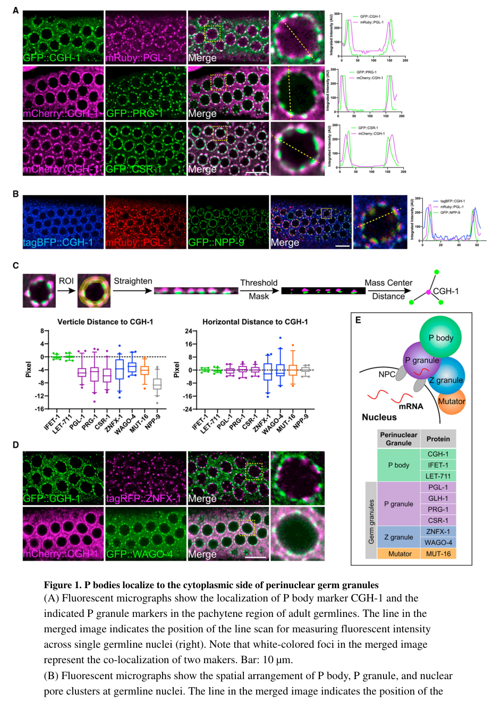

## Question

# Gene Research for Functional Annotation

## ⚠️ CRITICAL: Gene/Protein Identification Context

**BEFORE YOU BEGIN RESEARCH:** You MUST verify you are researching the CORRECT gene/protein. Gene symbols can be ambiguous, especially for less well-characterized genes from non-model organisms.

### Target Gene/Protein Identity (from UniProt):
- **UniProt Accession:** Q95YF3
- **Protein Description:** RecName: Full=ATP-dependent RNA helicase cgh-1; EC=3.6.4.13; AltName: Full=Conserved germline helicase 1;
- **Gene Information:** Name=cgh-1; ORFNames=C07H6.5;
- **Organism (full):** Caenorhabditis elegans.
- **Protein Family:** Belongs to the DEAD box helicase family. DDX6/DHH1
- **Key Domains:** DEAD/DEAH_box_helicase_dom. (IPR011545); Helicase_ATP-bd. (IPR014001); Helicase_C-like. (IPR001650); P-loop_NTPase. (IPR027417); RNA-helicase_DEAD-box_CS. (IPR000629)

### MANDATORY VERIFICATION STEPS:

1. **Check if the gene symbol "cgh-1" matches the protein description above**
2. **Verify the organism is correct:** Caenorhabditis elegans.
3. **Check if protein family/domains align with what you find in literature**
4. **If you find literature for a DIFFERENT gene with the same or similar symbol, STOP**

### If Gene Symbol is Ambiguous or You Cannot Find Relevant Literature:

**DO NOT PROCEED WITH RESEARCH ON A DIFFERENT GENE.** Instead:
- State clearly: "The gene symbol 'cgh-1' is ambiguous or literature is limited for this specific protein"
- Explain what you found (e.g., "Found extensive literature on a different gene with the same symbol in a different organism")
- Describe the protein based ONLY on the UniProt information provided above
- Suggest that the protein function can be inferred from domain/family information

### Research Target:

Please provide a comprehensive research report on the gene **cgh-1** (gene ID: cgh-1, UniProt: Q95YF3) in worm.

The research report should be a detailed narrative explaining the function, biological processes, and localization of the gene product. Citations should be given for all claims.

You should prioritize authoritative reviews and primary scientific literature when conducting research. You can supplement
this with annotations you find in gene/protein databases, but these can be outdated or inaccurate.

We are specifically interested in the primary function of the gene - for enzymes, what reaction is catalyzed, and what is the substrate specificity? For transporters, what is the substrate? For structural proteins or adapters, what is the broader structural role? For signaling molecules, what is the role in the pathway.

We are interested in where in or outside the cell the gene product carries out its function.

We are also interested in the signaling or biochemical pathways in which the gene functions. We are less interested in broad pleiotropic effects, except where these elucidate the precise role.

Include evidence where possible. We are interested in both experimental evidence as well as inference from structure, evolution, or bioinformatic analysis. Precise studies should be prioritized over high-throughput, where available.

## Output

Question: You are an expert researcher providing comprehensive, well-cited information.

Provide detailed information focusing on:
1. Key concepts and definitions with current understanding
2. Recent developments and latest research (prioritize 2023-2024 sources)
3. Current applications and real-world implementations
4. Expert opinions and analysis from authoritative sources
5. Relevant statistics and data from recent studies

Format as a comprehensive research report with proper citations. Include URLs and publication dates where available.
Always prioritize recent, authoritative sources and provide specific citations for all major claims.

# Gene Research for Functional Annotation

## ⚠️ CRITICAL: Gene/Protein Identification Context

**BEFORE YOU BEGIN RESEARCH:** You MUST verify you are researching the CORRECT gene/protein. Gene symbols can be ambiguous, especially for less well-characterized genes from non-model organisms.

### Target Gene/Protein Identity (from UniProt):
- **UniProt Accession:** Q95YF3
- **Protein Description:** RecName: Full=ATP-dependent RNA helicase cgh-1; EC=3.6.4.13; AltName: Full=Conserved germline helicase 1;
- **Gene Information:** Name=cgh-1; ORFNames=C07H6.5;
- **Organism (full):** Caenorhabditis elegans.
- **Protein Family:** Belongs to the DEAD box helicase family. DDX6/DHH1
- **Key Domains:** DEAD/DEAH_box_helicase_dom. (IPR011545); Helicase_ATP-bd. (IPR014001); Helicase_C-like. (IPR001650); P-loop_NTPase. (IPR027417); RNA-helicase_DEAD-box_CS. (IPR000629)

### MANDATORY VERIFICATION STEPS:

1. **Check if the gene symbol "cgh-1" matches the protein description above**
2. **Verify the organism is correct:** Caenorhabditis elegans.
3. **Check if protein family/domains align with what you find in literature**
4. **If you find literature for a DIFFERENT gene with the same or similar symbol, STOP**

### If Gene Symbol is Ambiguous or You Cannot Find Relevant Literature:

**DO NOT PROCEED WITH RESEARCH ON A DIFFERENT GENE.** Instead:
- State clearly: "The gene symbol 'cgh-1' is ambiguous or literature is limited for this specific protein"
- Explain what you found (e.g., "Found extensive literature on a different gene with the same symbol in a different organism")
- Describe the protein based ONLY on the UniProt information provided above
- Suggest that the protein function can be inferred from domain/family information

### Research Target:

Please provide a comprehensive research report on the gene **cgh-1** (gene ID: cgh-1, UniProt: Q95YF3) in worm.

The research report should be a detailed narrative explaining the function, biological processes, and localization of the gene product. Citations should be given for all claims.

You should prioritize authoritative reviews and primary scientific literature when conducting research. You can supplement
this with annotations you find in gene/protein databases, but these can be outdated or inaccurate.

We are specifically interested in the primary function of the gene - for enzymes, what reaction is catalyzed, and what is the substrate specificity? For transporters, what is the substrate? For structural proteins or adapters, what is the broader structural role? For signaling molecules, what is the role in the pathway.

We are interested in where in or outside the cell the gene product carries out its function.

We are also interested in the signaling or biochemical pathways in which the gene functions. We are less interested in broad pleiotropic effects, except where these elucidate the precise role.

Include evidence where possible. We are interested in both experimental evidence as well as inference from structure, evolution, or bioinformatic analysis. Precise studies should be prioritized over high-throughput, where available.

## Research report: *Caenorhabditis elegans* **cgh-1** (UniProt Q95YF3; ORF C07H6.5)

### 0) Verification of correct gene/protein identity (mandatory)
The literature retrieved explicitly studies **CGH-1 in *C. elegans*** as an ortholog of **yeast Dhh1** and **metazoan DDX6/RCK/p54**, i.e., a **DEAD-box ATP-dependent RNA helicase** implicated in translational repression and mRNA decay/P-body biology, matching the UniProt Q95YF3 record and its DEAD-box helicase family assignment (boag2008protectionofspecific pages 1-2, zhang2021insightintothe pages 1-3, zhang2021insightintothe pages 5-7). No conflicting “cgh-1” gene identity in another organism was used in the evidence base.

### 1) Key concepts and definitions (current understanding)

#### 1.1 DEAD-box helicases and the DDX6/Dhh1 subfamily
CGH-1 belongs to the DDX6/Dhh1 branch of DEAD-box helicases, proteins that use ATP binding/hydrolysis to remodel RNA–RNA and RNA–protein interactions in cytoplasmic mRNPs (boag2008protectionofspecific pages 1-2, zhang2021insightintothe pages 1-3). In this subfamily, the helicase **RecA2 domain** acts as a major interaction platform for multiple cofactors that couple RNA remodeling to **translation repression**, **deadenylation/decapping**, and **P-body assembly** (zhang2021insightintothe pages 1-3, zhang2021insightintothe pages 5-7, zhang2021insightintothe pages 4-5).

#### 1.2 Processing bodies (P-bodies), storage bodies, and germline P-bodies
- **P-bodies** are cytoplasmic condensates enriched for translationally inactive mRNAs and mRNA decay factors (decapping/deadenylation components) (boag2008protectionofspecific pages 1-2, du2023condensatecooperativityunderlies pages 1-3).
- In *C. elegans*, CGH-1 participates in at least two context-dependent assemblies:
  - **Somatic P-bodies** that are **PATR-1 (Pat1)–dependent** and linked to decapping-mediated turnover (boag2008protectionofspecific pages 1-2, boag2008protectionofspecific pages 4-5).
  - **Oocyte “storage bodies”** that are **PATR-1–independent** and associated with maternal mRNA protection/storage during oogenesis (boag2008protectionofspecific pages 1-2, boag2008protectionofspecific pages 4-5).
- **Embryonic germline P-bodies** are specialized condensates in the germ plasm that include decapping/adenylation regulators and the P-body marker **CGH-1 (DDX6)**; they are distinct from canonical P granules and are required for correct regulation of maternal RNAs during germline fate specification (cassani2022specializedgermlinepbodies pages 8-10).

#### 1.3 Germ granules (P granules) and condensate cooperativity
P granules are germline RNP condensates enriched for germline regulators and small-RNA pathway factors. Recent work shows **P-bodies can physically “coat” perinuclear germ granules**, creating an interface that coordinates mRNA regulation and heritable small-RNA silencing (du2023condensatecooperativityunderlies pages 1-3, du2023condensatecooperativityunderlies media 440e85ea).

### 2) Molecular function of CGH-1 (what it does biochemically)

#### 2.1 Enzymatic activity and substrate specificity
CGH-1 is an **ATP-dependent RNA helicase/ATPase** (EC 3.6.4.13 in UniProt), but like many DEAD-box proteins, its primary biochemical role is understood as **ATP-driven remodeling of RNA-containing complexes** rather than sequence-specific catalysis of a small-molecule reaction.

Direct worm biochemical evidence indicates CGH-1 has ATPase activity that can be **robustly stimulated by the MIF4G domain of NTL-1a** in the presence of **poly(U) RNA and ATP**, consistent with conserved activation of DDX6-family ATPases by MIF4G-containing partners (zhang2021insightintothe pages 5-7, zhang2021insightintothe pages 4-5). This supports RNA as the relevant substrate class and suggests cofactor-dependent regulation of its ATPase cycle.

#### 2.2 Mechanistic coupling to translation repression and mRNA decay
In somatic tissues, CGH-1 functions within **PATR-1–dependent P-bodies** implicated in **mRNA decapping** and decapping-mediated decay pathways (boag2008protectionofspecific pages 1-2). During oogenesis, CGH-1 instead promotes **protection/storage** of a defined subset of maternal mRNAs (boag2008protectionofspecific pages 1-2, boag2008protectionofspecific pages 7-8).

A key mechanistic feature is the capacity of CGH-1’s RecA2 domain to bind multiple P-body and translational repression partners (see §4), supporting a model where CGH-1 helps **route mRNAs between translation, storage, and decay** depending on developmental context.

### 3) Subcellular localization (where CGH-1 acts)

#### 3.1 Oogenesis: storage bodies and association with germ granule region
During oogenesis, CGH-1 forms large RNP particles (“storage bodies”) in oocytes and colocalizes with CAR-1-containing foci; these particles are proposed to store maternal mRNAs in a translationally regulated state (boag2008protectionofspecific pages 4-5, boag2008protectionofspecific pages 7-8).

#### 3.2 Somatic embryonic tissues: P-bodies linked to decapping
In embryonic somatic cells, CGH-1 localizes to **somatic P-bodies** whose formation depends on PATR-1 and is genetically connected to decapping pathways (boag2008protectionofspecific pages 4-5, boag2008protectionofspecific pages 1-2).

#### 3.3 Adult germline: perinuclear P-bodies coating P granules
Recent imaging and spatial mapping demonstrate that CGH-1 marks **perinuclear P-body condensates positioned on the cytoplasmic side of P granules**. Figure-based distance measurements in Du et al. show CGH-1 condensates are predominantly cytoplasmic relative to P-granule markers and are organized together with Z granules and Mutator foci near nuclear pore clusters (du2023condensatecooperativityunderlies media 440e85ea, du2023condensatecooperativityunderlies media af039ddd). This subcellular arrangement supports CGH-1’s role at a functional interface between mRNA regulation (P-bodies) and germline small-RNA inheritance machinery (germ granule subcompartments) (du2023condensatecooperativityunderlies pages 1-3, du2023condensatecooperativityunderlies pages 3-5).

### 4) Interaction partners and molecular complexes (what CGH-1 works with)

#### 4.1 High-confidence binding partners with quantitative affinities
Structural/biochemical work in *C. elegans* provides quantitative interaction evidence:
- **EDC-3**: The EDC-3 FDF peptide binds the CGH-1 RecA2 region with **KD ~0.34 μM** (ITC), and pulldown/co-localization assays support interaction in vitro/in vivo (zhang2021insightintothe pages 5-7).
- **PATR-1 (Pat1)**: Binding to CGH-1 is reported with **KD ~2.13 μM** (zhang2021insightintothe pages 4-5).
- **CAR-1 (LSM14 homolog)**: Binding to CGH-1 is reported with **KD ~3.03 μM** (zhang2021insightintothe pages 4-5).

These interactions place CGH-1 in the canonical P-body/decapping and translational repression network and provide a molecular basis for context-dependent assembly of distinct CGH-1 RNP bodies (zhang2021insightintothe pages 4-5, boag2008protectionofspecific pages 1-2).

#### 4.2 Associations with maternal mRNAs and translational regulators
CGH-1 associates with a specific subset of maternal transcripts during oogenesis (boag2008protectionofspecific pages 7-8). This association is not simply nonspecific RNA binding: it is enriched for maternal, gonad-expressed, and translationally regulated mRNAs (see §6.1 for quantitative statistics) (boag2008protectionofspecific pages 7-8).

#### 4.3 Coupling to small-RNA pathway factors in the germline (recent)
In adult germlines, CGH-1 P-bodies physically associate with germ granule components and small-RNA pathway proteins. Proteomic/immunoprecipitation evidence identifies interactions between CGH-1 (and CAR-1) and Argonautes including **PRG-1, CSR-1, and WAGO-1**; reciprocal IPs from Z-granule complexes detect CGH-1 and CAR-1, consistent with physical connectivity between P-body and germ granule machineries (du2023condensatecooperativityunderlies pages 3-5).

### 5) Biological processes and pathways (functional annotation)

#### 5.1 Maternal mRNA storage/protection during oogenesis
A central experimentally supported CGH-1 function in *C. elegans* is **protecting specific maternal mRNAs** during oogenesis. CGH-1 forms PATR-1–independent storage bodies and associates with translational regulators and a specific set of maternal transcripts, preventing their degradation (boag2008protectionofspecific pages 1-2).

#### 5.2 Somatic mRNA decapping/P-body pathway
In somatic tissues, CGH-1 participates in **PATR-1–dependent P-bodies** linked to **decapping-dependent mRNA decay**, consistent with conserved Dhh1/DDX6 roles in coupling translational repression to decapping (boag2008protectionofspecific pages 1-2, boag2008protectionofspecific pages 4-5).

#### 5.3 Germline fate specification through germline P-bodies
Cassani & Seydoux define “germline P-bodies” in embryos that contain **CGH-1 (DDX6)** together with regulators of mRNA adenylation and decapping, and argue these bodies are required for correct maternal mRNA regulation and specification of the germline founder cell (cassani2022specializedgermlinepbodies pages 8-10).

#### 5.4 Transgenerational small-RNA silencing and condensate cooperativity (2023)
Du et al. (Cell Reports 2023) propose a model where **CGH-1-containing P-bodies coat germ granules** and enable correct organization of germ-granule subcompartments and small-RNA pathway factors. Functionally, **cgh-1 mutants can trigger silencing but are defective in maintaining silencing across generations**, linked to impaired amplification of secondary small RNAs and instability of WAGO-4-dependent silencing memory (du2023condensatecooperativityunderlies pages 1-3, du2023condensatecooperativityunderlies pages 3-5).

### 6) Statistics and data highlights (from recent and foundational studies)

#### 6.1 Worm (direct CGH-1 data)
- Maternal mRNA association in oogenesis: **92%** of CGH-1–associated mRNAs are expressed mainly in the gonad and **85%** are classified as maternal (boag2008protectionofspecific pages 7-8).
- Condensate dependence: loss of **patr-1** causes **~12-fold fewer** somatic CGH-1 foci by the ~100-cell stage, supporting PATR-1 dependence of somatic P-body CGH-1 localization (boag2008protectionofspecific pages 4-5).
- Binding affinities (ITC): EDC-3 FDF peptide–CGH-1 **KD ~0.34 μM**; PATR-1–CGH-1 **KD ~2.13 μM**; CAR-1–CGH-1 **KD ~3.03 μM** (zhang2021insightintothe pages 5-7, zhang2021insightintothe pages 4-5).
- Quantitative spatial analysis: Figure-based measurements map CGH-1 P-bodies to the cytoplasmic side of P granules and relative to Z granules/Mutator foci (du2023condensatecooperativityunderlies media 440e85ea, du2023condensatecooperativityunderlies media af039ddd).

#### 6.2 Cross-species quantitative context (DDX6, mechanistic inference)
Because CGH-1 is the DDX6 ortholog, quantitative 2024 DDX6 datasets provide mechanistic context (explicitly inference for worm): In human DDX6 knockout cells, RNA-seq identified **1707 mRNAs up** and **1484 down** (FDR < 0.005); ribosome profiling found **260 transcripts with increased translation efficiency** and **38 with decreased TE** (FDR < 0.005) (weber2024humanddx6regulates pages 9-10, weber2024humanddx6regulates pages 8-9). These results support a conserved model that DDX6-family helicases selectively repress/decay inefficiently translated mRNAs.

### 7) Recent developments (prioritizing 2023–2024)

#### 7.1 2023: CGH-1 links P-bodies to heritable small-RNA silencing
The 2023 Cell Reports study re-frames CGH-1 from primarily a maternal mRNA/storage-decay factor to also a **structural and functional coordinator of adjacent condensates** in the adult germline, with direct implications for **transgenerational silencing maintenance** (du2023condensatecooperativityunderlies pages 1-3, du2023condensatecooperativityunderlies media 440e85ea).

#### 7.2 2024: Mechanistic insights into DDX6-family ATPase control of condensates and translation/decay coupling (inference to CGH-1)
Two 2024 studies deepen mechanistic understanding of DDX6-family proteins:
- **P-body/stress granule dynamics**: DDX6 ATPase and RNA-binding are required for P-body assembly, and partner-binding interfaces tune P-body composition and P-body–stress granule docking (ripin2024ddx6modulatespbody pages 10-11, ripin2024ddx6modulatespbody pages 1-2).
- **Translation speed sensing → decay**: DDX6 can connect inefficient translation to deadenylation-dependent decay, with RecA2 functioning as a hub for ribosome/cofactor interactions and ATPase-dependent target destabilization (weber2024humanddx6regulates pages 1-2, weber2024humanddx6regulates pages 4-5).

For *C. elegans*, these results support a plausible conserved model wherein CGH-1’s ATPase cycle and RecA2-mediated partner selection help decide whether an mRNA is stored, translationally repressed, or delivered into decay pathways, and how condensate composition changes under stress or developmental transitions.

### 8) Current applications and real-world implementations

1. **Experimental marker and handle for P-body/germline P-body biology in worms**: CGH-1 is widely used as a P-body marker in imaging-based studies and as an entry point for dissecting mRNA regulation condensates across somatic tissues, oocytes, embryos, and adult germline (cassani2022specializedgermlinepbodies pages 8-10, boag2008protectionofspecific pages 1-2, du2023condensatecooperativityunderlies media 440e85ea).
2. **Tool for studying condensate cooperativity and heritable gene regulation**: The CGH-1 P-body coat of germ granules provides a tractable system for understanding how adjacent biomolecular condensates coordinate small-RNA inheritance and nuclear/perinuclear organization (du2023condensatecooperativityunderlies pages 1-3, du2023condensatecooperativityunderlies media 440e85ea).
3. **Conserved framework for RNA decay/translation coupling**: Although not a clinical target in worms, conserved DDX6-family mechanisms characterized in 2024 supply operational hypotheses for CGH-1 mutant analyses (e.g., ATPase-dead alleles, partner-interface mutants) and for predicting which mRNAs might be CGH-1 sensitive (ripin2024ddx6modulatespbody pages 10-11, weber2024humanddx6regulates pages 1-2).

### 9) Expert synthesis and analysis (authoritative interpretation)
A consistent view from the foundational worm genetics/cell biology and later structural/condensate literature is that CGH-1 is best understood as a **context-dependent mRNP remodeler**. It can participate in **decapping-associated P-bodies** in somatic tissues while supporting **maternal mRNA stabilization/storage** in oocytes (boag2008protectionofspecific pages 1-2). Quantitative binding to EDC-3/PATR-1/CAR-1 supports a “partner-switching” model: CGH-1’s RecA2 domain recruits distinct effectors to tune repression vs decay, with ATPase activation by MIF4G partners providing an additional regulatory layer (zhang2021insightintothe pages 5-7, zhang2021insightintothe pages 4-5). The 2023 advance extends this logic into the germline by placing CGH-1-containing P-bodies at the physical boundary of germ granules where they help organize small-RNA inheritance machinery, suggesting that CGH-1’s conserved biochemical function is deployed not only for individual mRNA fates but also for **condensate-level architecture that impacts epigenetic inheritance** (du2023condensatecooperativityunderlies pages 1-3, du2023condensatecooperativityunderlies media 440e85ea).

### Evidence map table
| Aspect | Key findings | Evidence type | Citations |
|---|---|---|---|
| Identity / domains | CGH-1 in *Caenorhabditis elegans* is consistently identified as the ortholog of yeast Dhh1 and metazoan DDX6/RCK, i.e., a DEAD-box ATP-dependent RNA helicase. Structural work indicates the canonical two RecA-like helicase domains, with the RecA2 domain acting as a major partner-binding surface; this matches the UniProt DDX6/DHH1-family assignment. | Comparative annotation, primary genetics, structural modeling | (boag2008protectionofspecific pages 1-2, zhang2021insightintothe pages 1-3, zhang2021insightintothe pages 5-7, zhang2021insightintothe pages 4-5) |
| Enzymatic activity | CGH-1 is an ATPase/RNA helicase-family protein rather than a classical metabolic enzyme; its ATPase activity is stimulated by the NTL-1a MIF4G domain in the presence of poly(U) RNA and ATP, consistent with conserved DDX6-family RNA remodeling. Direct worm biochemical data support ATPase function, while recent human DDX6 work strengthens the conserved model that ATPase activity and RecA2-mediated interactions are required for coupling inefficient translation to mRNA decay. | Biochemistry, structural/interaction assays, cross-species mechanistic inference | (zhang2021insightintothe pages 5-7, zhang2021insightintothe pages 4-5, weber2024humanddx6regulates pages 4-5, weber2024humanddx6regulates pages 1-2) |
| Localization / condensates | CGH-1 localizes to distinct cytoplasmic RNP condensates depending on context: somatic P bodies, oocyte storage bodies, embryonic/germline P-bodies, and perinuclear P-body condensates adjacent to P granules. Imaging and figure-based spatial analysis show CGH-1 lies predominantly on the cytoplasmic side of P-granule markers and often adjacent to Z granules/Mutator foci, supporting a role at the interface of mRNA regulation and germ-granule organization. | Imaging, cell biology, figure-based spatial quantification | (boag2008protectionofspecific pages 4-5, cassani2022specializedgermlinepbodies pages 8-10, du2023condensatecooperativityunderlies pages 1-3, du2023condensatecooperativityunderlies pages 19-24, du2023condensatecooperativityunderlies media 440e85ea) |
| Interaction partners | CGH-1 binds core P-body / translational control factors including EDC-3, PATR-1, and CAR-1. Quantitative binding data from structural/ITC analyses show EDC-3 FDF peptide binds CGH-1 RecA2 with KD ~0.34 uM; reported affinities for PATR-1 and CAR-1 are ~2.13 uM and ~3.03 uM, respectively, indicating a conserved interaction hub for decapping and repression factors. | Structural biology, ITC, GST pulldown, co-localization, IP | (zhang2021insightintothe pages 1-3, zhang2021insightintothe pages 5-7, zhang2021insightintothe pages 4-5, boag2008protectionofspecific pages 4-5) |
| Biological processes / pathways | In somatic tissues, CGH-1 participates in PATR-1-dependent P bodies linked to decapping-mediated mRNA turnover; during oogenesis, it instead forms PATR-1-independent storage bodies that protect specific maternal mRNAs from degradation. In embryos and adult germlines, CGH-1-containing germline P-bodies contribute to maternal mRNA regulation, germ cell fate specification, and organization of small-RNA silencing condensates around germ granules. | Genetics, imaging, RIP/omics, developmental cell biology | (boag2008protectionofspecific pages 2-4, cassani2022specializedgermlinepbodies pages 8-10, boag2008protectionofspecific pages 1-2, du2023condensatecooperativityunderlies pages 1-3, ostareck2014ddx6andits pages 5-6) |
| Phenotypes / functional outcomes | Loss or perturbation of CGH-1 disrupts maternal mRNA storage/protection, CAR-1 organization, and ER remodeling in arrested oocytes, and affects fertility/developmental outcomes. Quantitatively, 92% of CGH-1-associated mRNAs are gonad-enriched and 85% are maternal; patr-1 loss causes about a 12-fold reduction in somatic CGH-1 foci by the ~100-cell stage, highlighting context-specific condensate assembly. | Genetics, RIP-chip/omics, imaging, developmental phenotyping | (boag2008protectionofspecific pages 4-5, boag2008protectionofspecific pages 7-8) |
| Recent 2023-2024 developments | New work places CGH-1 at the center of condensate cooperativity in the germline: P bodies containing CGH-1 coat germ granules, help localize PRG-1/CSR-1 and related factors, and are required for efficient maintenance of transgenerational silencing through secondary small-RNA amplification. Broader 2024 DDX6 studies show conserved ATPase- and cofactor-dependent control of P-body assembly, stress-granule docking, and selective repression/decay of inefficiently translated mRNAs; in human cells, DDX6 loss altered 1707 upregulated and 1484 downregulated transcripts, with 260 transcripts showing increased translation efficiency. | Recent primary literature, imaging, IP-MS, FRAP, RNA-seq/ribosome profiling, cross-species mechanistic inference | (du2023condensatecooperativityunderlies pages 1-3, du2023condensatecooperativityunderlies pages 19-24, ripin2024ddx6modulatespbody pages 10-11, ripin2024ddx6modulatespbody pages 1-2, weber2024humanddx6regulates pages 9-10, weber2024humanddx6regulates pages 8-9) |

*Table: This table summarizes key functional annotation evidence for *C. elegans* CGH-1, emphasizing molecular function, localization, interaction partners, pathways, phenotypes, and recent 2023-2024 advances. It is useful as a compact evidence map linking classical worm genetics/cell biology with newer mechanistic and condensate-focused studies.*

### Key references (URLs; publication dates)
- Boag PR et al. *J Cell Biol* (2008-08). “Protection of specific maternal messenger RNAs by the P body protein CGH-1 (Dhh1/RCK) during *C. elegans* oogenesis.” https://doi.org/10.1083/jcb.200801183 (boag2008protectionofspecific pages 1-2, boag2008protectionofspecific pages 4-5, boag2008protectionofspecific pages 7-8)
- Zhang Y et al. *Scientific Reports* (2021-10). “Insight into the interaction between the RNA helicase CGH-1 and EDC-3 and its implications.” https://doi.org/10.1038/s41598-021-99919-0 (zhang2021insightintothe pages 1-3, zhang2021insightintothe pages 5-7, zhang2021insightintothe pages 4-5)
- Cassani M, Seydoux G. *Development* (2022-11). “Specialized germline P-bodies are required to specify germ cell fate in *C. elegans* embryos.” https://doi.org/10.1242/dev.200920 (cassani2022specializedgermlinepbodies pages 8-10)
- Du Z et al. *Cell Reports* (2023-08). “Condensate cooperativity underlies transgenerational gene silencing.” https://doi.org/10.1016/j.celrep.2023.112859 (du2023condensatecooperativityunderlies pages 1-3, du2023condensatecooperativityunderlies media 440e85ea, du2023condensatecooperativityunderlies media af039ddd)
- Ripin N et al. *J Cell Biol* (2024-03). “DDX6 modulates P-body and stress granule assembly, composition, and docking.” https://doi.org/10.1083/jcb.202306022 (ripin2024ddx6modulatespbody pages 1-2, ripin2024ddx6modulatespbody pages 10-11)
- Weber R et al. *eLife* (2024-05). “Human DDX6 regulates translation and decay of inefficiently translated mRNAs.” https://doi.org/10.1101/2023.10.30.564346 (weber2024humanddx6regulates pages 1-2, weber2024humanddx6regulates pages 9-10, weber2024humanddx6regulates pages 8-9, weber2024humanddx6regulates pages 4-5)

References

1. (boag2008protectionofspecific pages 1-2): Peter R. Boag, Arzu Atalay, Stacey Robida, Valerie Reinke, and T. Keith Blackwell. Protection of specific maternal messenger rnas by the p body protein cgh-1 (dhh1/rck) during caenorhabditis elegans oogenesis. The Journal of Cell Biology, 182:543-557, Aug 2008. URL: https://doi.org/10.1083/jcb.200801183, doi:10.1083/jcb.200801183. This article has 143 citations.

2. (zhang2021insightintothe pages 1-3): Yong Zhang, Ke Wang, Kanglong Yang, Yunyu Shi, and Jingjun Hong. Insight into the interaction between the rna helicase cgh-1 and edc-3 and its implications. Scientific Reports, Oct 2021. URL: https://doi.org/10.1038/s41598-021-99919-0, doi:10.1038/s41598-021-99919-0. This article has 6 citations and is from a peer-reviewed journal.

3. (zhang2021insightintothe pages 5-7): Yong Zhang, Ke Wang, Kanglong Yang, Yunyu Shi, and Jingjun Hong. Insight into the interaction between the rna helicase cgh-1 and edc-3 and its implications. Scientific Reports, Oct 2021. URL: https://doi.org/10.1038/s41598-021-99919-0, doi:10.1038/s41598-021-99919-0. This article has 6 citations and is from a peer-reviewed journal.

4. (zhang2021insightintothe pages 4-5): Yong Zhang, Ke Wang, Kanglong Yang, Yunyu Shi, and Jingjun Hong. Insight into the interaction between the rna helicase cgh-1 and edc-3 and its implications. Scientific Reports, Oct 2021. URL: https://doi.org/10.1038/s41598-021-99919-0, doi:10.1038/s41598-021-99919-0. This article has 6 citations and is from a peer-reviewed journal.

5. (du2023condensatecooperativityunderlies pages 1-3): Zhenzhen Du, Kun Shi, Jordan S. Brown, Tao He, Wei-Sheng Wu, Ying Zhang, Heng-Chi Lee, and Donglei Zhang. Condensate cooperativity underlies transgenerational gene silencing. Cell Reports, 42:112859, Aug 2023. URL: https://doi.org/10.1016/j.celrep.2023.112859, doi:10.1016/j.celrep.2023.112859. This article has 27 citations and is from a highest quality peer-reviewed journal.

6. (boag2008protectionofspecific pages 4-5): Peter R. Boag, Arzu Atalay, Stacey Robida, Valerie Reinke, and T. Keith Blackwell. Protection of specific maternal messenger rnas by the p body protein cgh-1 (dhh1/rck) during caenorhabditis elegans oogenesis. The Journal of Cell Biology, 182:543-557, Aug 2008. URL: https://doi.org/10.1083/jcb.200801183, doi:10.1083/jcb.200801183. This article has 143 citations.

7. (cassani2022specializedgermlinepbodies pages 8-10): Madeline Cassani and Geraldine Seydoux. Specialized germline p-bodies are required to specify germ cell fate in <i>caenorhabditis elegans</i> embryos. Nov 2022. URL: https://doi.org/10.1242/dev.200920, doi:10.1242/dev.200920. This article has 35 citations and is from a domain leading peer-reviewed journal.

8. (du2023condensatecooperativityunderlies media 440e85ea): Zhenzhen Du, Kun Shi, Jordan S. Brown, Tao He, Wei-Sheng Wu, Ying Zhang, Heng-Chi Lee, and Donglei Zhang. Condensate cooperativity underlies transgenerational gene silencing. Cell Reports, 42:112859, Aug 2023. URL: https://doi.org/10.1016/j.celrep.2023.112859, doi:10.1016/j.celrep.2023.112859. This article has 27 citations and is from a highest quality peer-reviewed journal.

9. (boag2008protectionofspecific pages 7-8): Peter R. Boag, Arzu Atalay, Stacey Robida, Valerie Reinke, and T. Keith Blackwell. Protection of specific maternal messenger rnas by the p body protein cgh-1 (dhh1/rck) during caenorhabditis elegans oogenesis. The Journal of Cell Biology, 182:543-557, Aug 2008. URL: https://doi.org/10.1083/jcb.200801183, doi:10.1083/jcb.200801183. This article has 143 citations.

10. (du2023condensatecooperativityunderlies media af039ddd): Zhenzhen Du, Kun Shi, Jordan S. Brown, Tao He, Wei-Sheng Wu, Ying Zhang, Heng-Chi Lee, and Donglei Zhang. Condensate cooperativity underlies transgenerational gene silencing. Cell Reports, 42:112859, Aug 2023. URL: https://doi.org/10.1016/j.celrep.2023.112859, doi:10.1016/j.celrep.2023.112859. This article has 27 citations and is from a highest quality peer-reviewed journal.

11. (du2023condensatecooperativityunderlies pages 3-5): Zhenzhen Du, Kun Shi, Jordan S. Brown, Tao He, Wei-Sheng Wu, Ying Zhang, Heng-Chi Lee, and Donglei Zhang. Condensate cooperativity underlies transgenerational gene silencing. Cell Reports, 42:112859, Aug 2023. URL: https://doi.org/10.1016/j.celrep.2023.112859, doi:10.1016/j.celrep.2023.112859. This article has 27 citations and is from a highest quality peer-reviewed journal.

12. (weber2024humanddx6regulates pages 9-10): Ramona Weber, Lara Wohlbold, and Chung-Te Chang. Human ddx6 regulates translation and decay of inefficiently translated mrnas. eLife, May 2024. URL: https://doi.org/10.1101/2023.10.30.564346, doi:10.1101/2023.10.30.564346. This article has 30 citations and is from a domain leading peer-reviewed journal.

13. (weber2024humanddx6regulates pages 8-9): Ramona Weber, Lara Wohlbold, and Chung-Te Chang. Human ddx6 regulates translation and decay of inefficiently translated mrnas. eLife, May 2024. URL: https://doi.org/10.1101/2023.10.30.564346, doi:10.1101/2023.10.30.564346. This article has 30 citations and is from a domain leading peer-reviewed journal.

14. (ripin2024ddx6modulatespbody pages 10-11): Nina Ripin, Luisa Macedo de Vasconcelos, Daniella A. Ugay, and Roy Parker. Ddx6 modulates p-body and stress granule assembly, composition, and docking. The Journal of Cell Biology, Mar 2024. URL: https://doi.org/10.1083/jcb.202306022, doi:10.1083/jcb.202306022. This article has 42 citations.

15. (ripin2024ddx6modulatespbody pages 1-2): Nina Ripin, Luisa Macedo de Vasconcelos, Daniella A. Ugay, and Roy Parker. Ddx6 modulates p-body and stress granule assembly, composition, and docking. The Journal of Cell Biology, Mar 2024. URL: https://doi.org/10.1083/jcb.202306022, doi:10.1083/jcb.202306022. This article has 42 citations.

16. (weber2024humanddx6regulates pages 1-2): Ramona Weber, Lara Wohlbold, and Chung-Te Chang. Human ddx6 regulates translation and decay of inefficiently translated mrnas. eLife, May 2024. URL: https://doi.org/10.1101/2023.10.30.564346, doi:10.1101/2023.10.30.564346. This article has 30 citations and is from a domain leading peer-reviewed journal.

17. (weber2024humanddx6regulates pages 4-5): Ramona Weber, Lara Wohlbold, and Chung-Te Chang. Human ddx6 regulates translation and decay of inefficiently translated mrnas. eLife, May 2024. URL: https://doi.org/10.1101/2023.10.30.564346, doi:10.1101/2023.10.30.564346. This article has 30 citations and is from a domain leading peer-reviewed journal.

18. (du2023condensatecooperativityunderlies pages 19-24): Zhenzhen Du, Kun Shi, Jordan S. Brown, Tao He, Wei-Sheng Wu, Ying Zhang, Heng-Chi Lee, and Donglei Zhang. Condensate cooperativity underlies transgenerational gene silencing. Cell Reports, 42:112859, Aug 2023. URL: https://doi.org/10.1016/j.celrep.2023.112859, doi:10.1016/j.celrep.2023.112859. This article has 27 citations and is from a highest quality peer-reviewed journal.

19. (boag2008protectionofspecific pages 2-4): Peter R. Boag, Arzu Atalay, Stacey Robida, Valerie Reinke, and T. Keith Blackwell. Protection of specific maternal messenger rnas by the p body protein cgh-1 (dhh1/rck) during caenorhabditis elegans oogenesis. The Journal of Cell Biology, 182:543-557, Aug 2008. URL: https://doi.org/10.1083/jcb.200801183, doi:10.1083/jcb.200801183. This article has 143 citations.

20. (ostareck2014ddx6andits pages 5-6): Dirk H. Ostareck, Isabel S. Naarmann‐de Vries, and Antje Ostareck‐Lederer. Ddx6 and its orthologs as modulators of cellular and viral rna expression. Wiley Interdisciplinary Reviews: RNA, 5:659-678, Sep 2014. URL: https://doi.org/10.1002/wrna.1237, doi:10.1002/wrna.1237. This article has 72 citations.

## Artifacts

- [Edison artifact artifact-00](cgh-1-deep-research-falcon_artifacts/artifact-00.md)

## Citations

1. cassani2022specializedgermlinepbodies pages 8-10
2. boag2008protectionofspecific pages 1-2
3. zhang2021insightintothe pages 5-7
4. zhang2021insightintothe pages 4-5
5. boag2008protectionofspecific pages 7-8
6. du2023condensatecooperativityunderlies pages 3-5
7. boag2008protectionofspecific pages 4-5
8. zhang2021insightintothe pages 1-3
9. du2023condensatecooperativityunderlies pages 1-3
10. du2023condensatecooperativityunderlies pages 19-24
11. boag2008protectionofspecific pages 2-4
12. https://doi.org/10.1083/jcb.200801183
13. https://doi.org/10.1038/s41598-021-99919-0
14. https://doi.org/10.1242/dev.200920
15. https://doi.org/10.1016/j.celrep.2023.112859
16. https://doi.org/10.1083/jcb.202306022
17. https://doi.org/10.1101/2023.10.30.564346
18. https://doi.org/10.1083/jcb.200801183,
19. https://doi.org/10.1038/s41598-021-99919-0,
20. https://doi.org/10.1016/j.celrep.2023.112859,
21. https://doi.org/10.1242/dev.200920,
22. https://doi.org/10.1101/2023.10.30.564346,
23. https://doi.org/10.1083/jcb.202306022,
24. https://doi.org/10.1002/wrna.1237,