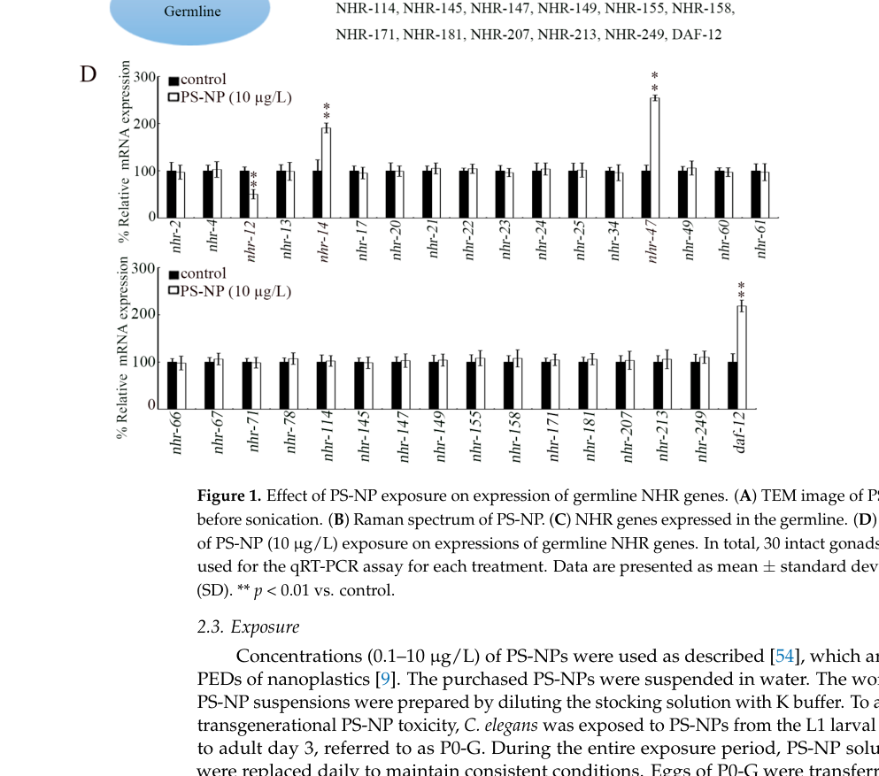

## Question

# Gene Research for Functional Annotation

## ⚠️ CRITICAL: Gene/Protein Identification Context

**BEFORE YOU BEGIN RESEARCH:** You MUST verify you are researching the CORRECT gene/protein. Gene symbols can be ambiguous, especially for less well-characterized genes from non-model organisms.

### Target Gene/Protein Identity (from UniProt):
- **UniProt Accession:** Q17370
- **Protein Description:** RecName: Full=Nuclear hormone receptor family member nhr-47;
- **Gene Information:** Name=nhr-47; Synonyms=csr-1; ORFNames=C24G6.4;
- **Organism (full):** Caenorhabditis elegans.
- **Protein Family:** Belongs to the nuclear hormone receptor family.
- **Key Domains:** HNF4-like_DBD. (IPR049636); NHR-like_dom_sf. (IPR035500); Nucl_hrmn_rcpt_lig-bd. (IPR000536); Nuclear_hormone_rcpt_NR2. (IPR050274); Nuclear_hrmn_rcpt. (IPR001723)

### MANDATORY VERIFICATION STEPS:

1. **Check if the gene symbol "nhr-47" matches the protein description above**
2. **Verify the organism is correct:** Caenorhabditis elegans.
3. **Check if protein family/domains align with what you find in literature**
4. **If you find literature for a DIFFERENT gene with the same or similar symbol, STOP**

### If Gene Symbol is Ambiguous or You Cannot Find Relevant Literature:

**DO NOT PROCEED WITH RESEARCH ON A DIFFERENT GENE.** Instead:
- State clearly: "The gene symbol 'nhr-47' is ambiguous or literature is limited for this specific protein"
- Explain what you found (e.g., "Found extensive literature on a different gene with the same symbol in a different organism")
- Describe the protein based ONLY on the UniProt information provided above
- Suggest that the protein function can be inferred from domain/family information

### Research Target:

Please provide a comprehensive research report on the gene **nhr-47** (gene ID: csr-1, UniProt: Q17370) in worm.

The research report should be a detailed narrative explaining the function, biological processes, and localization of the gene product. Citations should be given for all claims.

You should prioritize authoritative reviews and primary scientific literature when conducting research. You can supplement
this with annotations you find in gene/protein databases, but these can be outdated or inaccurate.

We are specifically interested in the primary function of the gene - for enzymes, what reaction is catalyzed, and what is the substrate specificity? For transporters, what is the substrate? For structural proteins or adapters, what is the broader structural role? For signaling molecules, what is the role in the pathway.

We are interested in where in or outside the cell the gene product carries out its function.

We are also interested in the signaling or biochemical pathways in which the gene functions. We are less interested in broad pleiotropic effects, except where these elucidate the precise role.

Include evidence where possible. We are interested in both experimental evidence as well as inference from structure, evolution, or bioinformatic analysis. Precise studies should be prioritized over high-throughput, where available.

## Output

Question: You are an expert researcher providing comprehensive, well-cited information.

Provide detailed information focusing on:
1. Key concepts and definitions with current understanding
2. Recent developments and latest research (prioritize 2023-2024 sources)
3. Current applications and real-world implementations
4. Expert opinions and analysis from authoritative sources
5. Relevant statistics and data from recent studies

Format as a comprehensive research report with proper citations. Include URLs and publication dates where available.
Always prioritize recent, authoritative sources and provide specific citations for all major claims.

# Gene Research for Functional Annotation

## ⚠️ CRITICAL: Gene/Protein Identification Context

**BEFORE YOU BEGIN RESEARCH:** You MUST verify you are researching the CORRECT gene/protein. Gene symbols can be ambiguous, especially for less well-characterized genes from non-model organisms.

### Target Gene/Protein Identity (from UniProt):
- **UniProt Accession:** Q17370
- **Protein Description:** RecName: Full=Nuclear hormone receptor family member nhr-47;
- **Gene Information:** Name=nhr-47; Synonyms=csr-1; ORFNames=C24G6.4;
- **Organism (full):** Caenorhabditis elegans.
- **Protein Family:** Belongs to the nuclear hormone receptor family.
- **Key Domains:** HNF4-like_DBD. (IPR049636); NHR-like_dom_sf. (IPR035500); Nucl_hrmn_rcpt_lig-bd. (IPR000536); Nuclear_hormone_rcpt_NR2. (IPR050274); Nuclear_hrmn_rcpt. (IPR001723)

### MANDATORY VERIFICATION STEPS:

1. **Check if the gene symbol "nhr-47" matches the protein description above**
2. **Verify the organism is correct:** Caenorhabditis elegans.
3. **Check if protein family/domains align with what you find in literature**
4. **If you find literature for a DIFFERENT gene with the same or similar symbol, STOP**

### If Gene Symbol is Ambiguous or You Cannot Find Relevant Literature:

**DO NOT PROCEED WITH RESEARCH ON A DIFFERENT GENE.** Instead:
- State clearly: "The gene symbol 'nhr-47' is ambiguous or literature is limited for this specific protein"
- Explain what you found (e.g., "Found extensive literature on a different gene with the same symbol in a different organism")
- Describe the protein based ONLY on the UniProt information provided above
- Suggest that the protein function can be inferred from domain/family information

### Research Target:

Please provide a comprehensive research report on the gene **nhr-47** (gene ID: csr-1, UniProt: Q17370) in worm.

The research report should be a detailed narrative explaining the function, biological processes, and localization of the gene product. Citations should be given for all claims.

You should prioritize authoritative reviews and primary scientific literature when conducting research. You can supplement
this with annotations you find in gene/protein databases, but these can be outdated or inaccurate.

We are specifically interested in the primary function of the gene - for enzymes, what reaction is catalyzed, and what is the substrate specificity? For transporters, what is the substrate? For structural proteins or adapters, what is the broader structural role? For signaling molecules, what is the role in the pathway.

We are interested in where in or outside the cell the gene product carries out its function.

We are also interested in the signaling or biochemical pathways in which the gene functions. We are less interested in broad pleiotropic effects, except where these elucidate the precise role.

Include evidence where possible. We are interested in both experimental evidence as well as inference from structure, evolution, or bioinformatic analysis. Precise studies should be prioritized over high-throughput, where available.

# Research Report: Functional Annotation of *Caenorhabditis elegans* **nhr-47** (UniProt Q17370; ORF **C24G6.4**; synonym **csr-1**)

## 1. Target verification and gene/protein identity

The research target is the *C. elegans* nuclear hormone receptor gene **nhr-47**, which is explicitly cross-referenced to the locus **C24G6.4/C24G6.4.1** in multiple independent sources, including transgenerational toxicology work in *C. elegans* (Liu et al., 2024) and orthology/mapping resources that align an *Heterorhabditis bacteriophora* EST to **C. elegans nhr-47 (C24G6.4.1)** (Ciche & Sternberg, 2007). (liu2024transgenerationalresponseof pages 8-10, ciche2007postembryonicrnaiin pages 10-11)

A dissertation-level study of *C. elegans* nuclear receptors also designs dsRNA from a region of the **putative ligand-binding domain of nhr-47** and uses it in RNAi assays, consistent with nhr-47 being an NHR-family transcription factor rather than an enzyme or transporter. (brozova2006nuclearreceptorsin pages 27-30)

## 2. Key concepts and definitions (current understanding)

### 2.1 Nuclear hormone receptors (NHRs): domain architecture and mechanism

NHRs are sequence-specific transcription factors. A review-style functional genomics source summarizes canonical NHR domain architecture: an N-terminal A/B region, a **conserved DNA-binding domain (DBD)** containing two zinc-finger motifs, a **hinge region** that includes nuclear localization-associated sequence features and affects dimerization/coregulator interactions, and a C-terminal **ligand-binding domain (LBD)** (typically 11–12 α-helices) that supports ligand binding, dimerization, and recruitment of coregulators through activation function surfaces (e.g., AF-2). (pohludka2009functionalgenomicsof pages 10-16)

This framework is directly relevant to UniProt Q17370 (nhr-47), which is annotated as a nuclear hormone receptor with an HNF4-like DBD and a nuclear hormone receptor-like ligand-binding domain.

### 2.2 Family classification of nhr-47

In the same functional genomics source, **NHR-47** is listed among *C. elegans* **class I subgroup 8** nuclear hormone receptors, characterized by a **P-box sequence CNGCKT** in the DBD. This classification is consistent with an HNF4/NR2-like DNA-binding specificity class and supports inference that nhr-47 functions as a DNA-binding transcriptional regulator. (pohludka2009functionalgenomicsof pages 19-23)

## 3. Molecular function, pathways, and localization: evidence-based summary

### 3.1 Primary molecular function (direct vs inferred)

**Direct evidence:** The retrieved literature does not provide biochemical enzymatic reactions, transported substrates, or direct ligand identification for nhr-47; instead it supports a role as a transcriptional regulator whose perturbation alters gene expression and organismal phenotypes (RNAi-based evidence). (liu2024transgenerationalresponseof pages 8-10, liu2024transgenerationalresponseof pages 4-8)

**Inference from domain/family:** Based on conserved NHR architecture (DBD + LBD/hinge) and subgroup classification, nhr-47 is best annotated as a **nuclear transcription factor** that likely regulates target genes by binding DNA response elements and recruiting transcriptional co-regulators in a ligand-dependent or ligand-independent (orphan receptor) manner. (pohludka2009functionalgenomicsof pages 10-16, pohludka2009functionalgenomicsof pages 19-23)

### 3.2 Tissue/cellular context and localization

The strongest direct evidence for tissue context in the retrieved corpus is **germline/gonad involvement**. Liu et al. (2024) quantify mRNA from **isolated gonads** and describe nhr-47 as among **germline NHR genes** responding to exposure, and they perform **germline RNAi** to test function in transgenerational phenotypes. This supports that nhr-47 acts in (or via) the reproductive system, at least in the context of environmental stress/toxicant response. (liu2024transgenerationalresponseof pages 8-10, liu2024transgenerationalresponseof pages 4-8, liu2024transgenerationalresponseof media 36684ada)

Because nhr-47 is a nuclear hormone receptor, the expected subcellular site of action is primarily **nuclear**, mediated by its DBD/LBD architecture; however, **direct subcellular localization imaging for nhr-47 itself was not retrieved** in the current evidence set. (pohludka2009functionalgenomicsof pages 10-16)

### 3.3 Pathway associations supported by mechanistic readouts

Liu et al. (2024) provide a pathway-level model in which germline nhr-47 participates in transgenerational toxicity by modulating expression of secreted ligands and receptors:

* After PS-nanoplastic exposure, **nhr-47 RNAi** decreases gonadal expression of insulin-like ligands **ins-3**, **ins-39**, and **daf-28**, and the ephrin ligand **efn-3**. (liu2024transgenerationalresponseof pages 4-8)
* In offspring (F1 generation), nhr-47 RNAi is associated with reduced expression of the insulin receptor **daf-2** and the ephrin receptor **vab-1** under exposure conditions. (liu2024transgenerationalresponseof pages 8-10, liu2024transgenerationalresponseof pages 4-8)

This constitutes direct experimental evidence connecting nhr-47 to **insulin/DAF-2 signaling** and **ephrin/VAB-1-related signaling** in a transgenerational stress/toxicant response paradigm (gene expression readouts under genetic perturbation). (liu2024transgenerationalresponseof pages 8-10, liu2024transgenerationalresponseof pages 4-8)

## 4. Recent developments (prioritize 2023–2024)

### 4.1 2024: Transgenerational nanoplastic toxicity and germline NHR regulation

The most recent direct mechanistic study retrieved is:

**Liu Z, Wang Y, Bian Q, Wang D.** *Transgenerational Response of Germline Nuclear Hormone Receptor Genes to Nanoplastics at Predicted Environmental Doses in Caenorhabditis elegans.* **Toxics** (June **2024**). URL: https://doi.org/10.3390/toxics12060420 (liu2024transgenerationalresponseof pages 8-10)

Key findings directly involving nhr-47:

* **Expression induction:** nhr-47 expression is **increased** in response to polystyrene nanoparticles (PS-NPs) at environmentally predicted doses (1 and 10 µg/L), and the induction is **transgenerationally persistent** (reported across multiple filial generations depending on dose). (liu2024transgenerationalresponseof pages 8-10, liu2024transgenerationalresponseof pages 4-8)
* **Functional genetics:** germline **nhr-47(RNAi)** confers **resistance** to transgenerational PS-NP toxicity in assays of locomotion and brood size. (liu2024transgenerationalresponseof pages 8-10, liu2024transgenerationalresponseof pages 4-8)

The figures providing visual support for these conclusions (expression and phenotypes) were retrieved from the paper (Figures 1–4). (liu2024transgenerationalresponseof media 36684ada, liu2024transgenerationalresponseof media c42de046, liu2024transgenerationalresponseof media 91aa1a70, liu2024transgenerationalresponseof media 7d05ae25)

### 4.2 Lack of additional 2023–2024 direct nhr-47 literature in retrieved set

Within the tool-retrieved corpus, no additional 2023–2024 primary papers with direct mechanistic characterization of nhr-47 (e.g., ChIP-seq targets, ligand binding, tissue-specific reporters) were obtained beyond Liu et al. 2024. Therefore, the 2024 study currently anchors the “latest research” portion of this report. (liu2024transgenerationalresponseof pages 8-10)

## 5. Prior primary evidence and historical context

### 5.1 Hormone responsiveness: estradiol-linked overexpression (microarray)

**Novillo A, Won S, Li C, Callard I.** *Changes in Nuclear Receptor and Vitellogenin Gene Expression in Response to Steroids and Heavy Metal in Caenorhabditis elegans.* **Integrative and Comparative Biology** (January **2005**). URL: https://doi.org/10.1093/icb/45.1.61 (novillo2005changesinnuclear pages 3-4)

In this microarray-based study, estradiol exposure is associated with **over-expression of nhr-47**, reported as a **3.4-fold** upregulation in the table and described in the text as estradiol-induced over-expression of the nhr-47 member of the nuclear receptor family. (novillo2005changesinnuclear pages 3-4)

This provides older but direct evidence that nhr-47 transcription is responsive to steroid exposure conditions, though it does not establish mechanism, tissue specificity, or phenotypic consequence in that work. (novillo2005changesinnuclear pages 3-4)

### 5.2 Genetic interaction probing with another NHR (nhr-40) using a GFP reporter

A dissertation-level study focused on other nuclear receptors reports that **nhr-47 RNAi does not change expression** of an **nhr-40::gfp** reporter, arguing against a simple regulatory relationship detectable in that assay (negative result). (brozova2006nuclearreceptorsin pages 48-56, brozova2006nuclearreceptorsin pages 1-6)

## 6. Current applications and real-world implementations

### 6.1 Environmental toxicology and transgenerational risk assessment

The most concrete “application” of nhr-47 knowledge in the retrieved evidence is as a **candidate regulator/mediator in environmental toxicology**, specifically in **transgenerational effects of nanoplastics**. In Liu et al. 2024, nhr-47 is both a transcriptional biomarker of PS-NP exposure (germline induction) and a functional node, since nhr-47 knockdown modifies downstream ligand/receptor expression and organismal phenotypes. (liu2024transgenerationalresponseof pages 8-10, liu2024transgenerationalresponseof pages 4-8, liu2024transgenerationalresponseof media 36684ada)

### 6.2 Functional genomics and RNAi-based screening

Broader NHR functional genomics in nematodes relies heavily on **RNAi perturbation**, and this is reflected in the evidence where nhr-47 is studied via RNAi and gene-expression phenotyping rather than through direct biochemical assays. (pohludka2009functionalgenomicsof pages 10-16, liu2024transgenerationalresponseof pages 8-10, brozova2006nuclearreceptorsin pages 27-30)

## 7. Expert opinions and analysis (authoritative-source grounded)

The review-style functional genomics source emphasizes that many nematode NHRs are “orphan” receptors and that NHRs broadly link development, metabolism, differentiation, and xenobiotic defense through transcriptional regulation mediated by DBD/LBD architecture and coregulator recruitment. This conceptual framing supports interpreting nhr-47 as a transcriptional regulator that can integrate environmental cues into gene-expression changes, which is consistent with its observed induction by estradiol and nanoplastic exposure paradigms. (pohludka2009functionalgenomicsof pages 10-16, novillo2005changesinnuclear pages 3-4, liu2024transgenerationalresponseof pages 8-10)

Mechanistically, the 2024 transgenerational toxicology study provides the most direct expert analysis within the retrieved set: it positions germline NHRs (including nhr-47) as upstream regulators affecting **secreted ligands** (insulin-like, ephrin) and their receptors, thereby shaping offspring phenotypes after parental exposure. (liu2024transgenerationalresponseof pages 8-10, liu2024transgenerationalresponseof pages 4-8)

## 8. Quantitative statistics and key data points from studies

### 8.1 Liu et al. 2024 (Toxics; June 2024; https://doi.org/10.3390/toxics12060420)

* PS-NP exposure doses include **0.1, 1, and 10 µg/L**; nhr-47 is among the germline NHR genes upregulated at **1 and 10 µg/L**. (liu2024transgenerationalresponseof pages 4-8)
* Transgenerational persistence: nhr-47 induction is reported as persisting to **F2** at 1 µg/L and to **F4** at 10 µg/L, with recovery by **F5** at 10 µg/L. (liu2024transgenerationalresponseof pages 8-10)
* qRT-PCR sampling: expression analyses were performed on **isolated gonads** with **30 gonads per treatment**. (liu2024transgenerationalresponseof pages 4-8)
* Phenotypes: germline nhr-47 RNAi suppresses PS-NP-associated **locomotion** decline and **brood size** reduction in transgenerational assays (visualized in their Figures 3–4). (liu2024transgenerationalresponseof pages 8-10, liu2024transgenerationalresponseof media 91aa1a70, liu2024transgenerationalresponseof media 7d05ae25)

### 8.2 Novillo et al. 2005 (Integr Comp Biol; Jan 2005; https://doi.org/10.1093/icb/45.1.61)

* nhr-47 is reported as **3.4-fold upregulated** in an estradiol condition in their microarray dataset. (novillo2005changesinnuclear pages 3-4)

## 9. Evidence-weighted functional annotation (conclusions)

### 9.1 Best-supported annotation (from retrieved evidence)

* **Gene product type:** nuclear hormone receptor transcription factor (NHR family); likely nuclear DNA-binding transcriptional regulator by conserved NHR DBD/LBD architecture. (pohludka2009functionalgenomicsof pages 10-16, pohludka2009functionalgenomicsof pages 19-23)
* **Biological context with strongest support:** **germline/gonad-associated transcriptional responses** to environmental exposures, with experimentally demonstrated contribution to **transgenerational nanoplastic toxicity phenotypes**. (liu2024transgenerationalresponseof pages 8-10, liu2024transgenerationalresponseof pages 4-8)
* **Pathway links supported by perturbation + expression data:** modulation of **insulin-like ligand genes** (ins-3, ins-39, daf-28) and **ephrin ligand/receptor axis** (efn-3, vab-1), with downstream involvement of **daf-2** expression under exposure conditions. (liu2024transgenerationalresponseof pages 8-10, liu2024transgenerationalresponseof pages 4-8)

### 9.2 What is currently *not* established in this evidence set

* **Direct ligand identity** for NHR-47 (no binding assays retrieved). (pohludka2009functionalgenomicsof pages 10-16)
* **Direct DNA binding targets** (e.g., ChIP-seq) or consensus response elements for NHR-47 (not retrieved). (liu2024transgenerationalresponseof pages 8-10)
* **Definitive subcellular localization imaging** for NHR-47 protein (nuclear localization is inferred from NHR architecture rather than directly shown for nhr-47). (pohludka2009functionalgenomicsof pages 10-16)

## Evidence summary table

| Source (with year) | Publication type | Experimental system | Key findings about *nhr-47* | Evidence type (expression/RNAi/other) | Quantitative details (doses, fold-changes, generations, sample sizes) | URL/DOI |
|---|---|---|---|---|---|---|
| Liu et al., 2024 | Primary research article | *C. elegans* gonads; polystyrene nanoplastic (PS-NP) exposure with germline RNAi and transgenerational assays | *nhr-47* is identified as a germline nuclear hormone receptor whose expression increases after PS-NP exposure; germline *nhr-47*(RNAi) confers resistance to transgenerational toxicity, suppressing PS-NP-induced locomotion and brood-size defects; *nhr-47* RNAi decreases gonadal expression of insulin ligands (*ins-3, ins-39, daf-28*) and *efn-3*, and reduces offspring receptor expression (*daf-2, vab-1*), implicating insulin/Ephrin-associated signaling in the response (liu2024transgenerationalresponseof pages 8-10, liu2024transgenerationalresponseof pages 4-8, liu2024transgenerationalresponseof media 36684ada) | Expression; RNAi; pathway inference | PS-NPs at 0.1, 1, 10 µg/L; *nhr-47* increased in P0 after 1 and 10 µg/L; transgenerational elevation persisted to F2 at 1 µg/L and F4 at 10 µg/L, returning to control by F5 at 10 µg/L; qRT-PCR on isolated gonads with 30 gonads/treatment; Figures 1D, 2, 3, 4 support expression and phenotype claims (liu2024transgenerationalresponseof pages 8-10, liu2024transgenerationalresponseof pages 4-8, liu2024transgenerationalresponseof media 36684ada) | https://doi.org/10.3390/toxics12060420 ; DOI: 10.3390/toxics12060420 |
| Novillo et al., 2005 | Primary research article | *C. elegans* exposed to estradiol; DNA microarray profiling | Exogenous estradiol induces over-expression of *nhr-47*, supporting that *nhr-47* is environmentally/hormonally responsive, but no direct mechanistic or phenotypic role was established in this study (novillo2005changesinnuclear pages 3-4) | Expression | Reported fold change for *nhr-47* = 3.4 under estradiol treatment; estradiol concentration reported as 10^-5 M in the table/text excerpt; microarray-based mRNA profiling via Stanford Microarray Database (novillo2005changesinnuclear pages 3-4) | https://doi.org/10.1093/icb/45.1.61 ; DOI: 10.1093/icb/45.1.61 |
| Brožová, 2006 | Thesis/dissertation (methods/results excerpts) | *C. elegans* RNAi and *nhr-40::gfp* reporter strains | *nhr-47* was targeted by dsRNA corresponding to part of its putative ligand-binding domain; in reporter assays, *nhr-47* RNAi did not alter *nhr-40::gfp* expression, suggesting no detectable regulation of *nhr-40* reporter output in that assay; no direct phenotype for *nhr-47* itself was reported in the excerpt (brozova2006nuclearreceptorsin pages 27-30, brozova2006nuclearreceptorsin pages 48-56, brozova2006nuclearreceptorsin pages 1-6) | RNAi; other | 1,040 bp PCR fragment from mixed-stage N2 cDNA; dsRNA concentration ~2–3 µg/µl; assay performed by microinjection into young adult hermaphrodites carrying *nhr-40::gfp* strains #4586 and #4523; result was negative for reporter change (brozova2006nuclearreceptorsin pages 27-30, brozova2006nuclearreceptorsin pages 48-56) | No stable URL provided in retrieved evidence |
| Ciche & Sternberg, 2007 | Primary research article | *Heterorhabditis bacteriophora* EST mapping against *C. elegans* homologs; RNAi resource context | An EST annotated as Hba-*nhr-47* was mapped to *C. elegans nhr-47* (C24G6.4.1), confirming orthology/resource linkage, but the retrieved excerpt provides no direct functional, expression, or phenotype data for *C. elegans nhr-47* itself (ciche2007postembryonicrnaiin pages 10-11, ciche2007postembryonicrnaiin pages 9-10) | Other | Hba-*nhr-47* EST listed with GenBank accession EE724175; evidence is mapping/alignment-based rather than mechanistic functional analysis (ciche2007postembryonicrnaiin pages 10-11, ciche2007postembryonicrnaiin pages 9-10) | https://doi.org/10.1186/1471-213X-7-101 ; DOI: 10.1186/1471-213X-7-101 |
| Pohludka, 2009 | Review/thesis-style functional genomics source | Comparative/domain-based analysis of nematode nuclear receptors | Places NHR-47 within *C. elegans* class I subgroup 8 nuclear hormone receptors characterized by the P-box sequence CNGCKT, consistent with HNF4/NR2-like DNA-binding properties and nuclear receptor domain architecture; does not provide direct *nhr-47*-specific functional assays (pohludka2009functionalgenomicsof pages 10-16, pohludka2009functionalgenomicsof pages 19-23) | Other; classification/domain inference | No *nhr-47*-specific quantitative functional data; provides general NHR architecture: conserved DBD with zinc fingers, hinge region linked to nuclear localization, and ligand-binding domain used for transcriptional regulation (pohludka2009functionalgenomicsof pages 10-16, pohludka2009functionalgenomicsof pages 19-23) | No stable URL provided in retrieved evidence |

*Table: This table summarizes the retrieved evidence specifically relevant to *Caenorhabditis elegans nhr-47* (Q17370/C24G6.4), distinguishing direct functional data from indirect classification or resource-based evidence. It is useful for separating experimentally supported claims from weaker inferences when annotating this relatively understudied nuclear hormone receptor.*

## Key cited sources (URLs and publication dates)

* Liu Z, Wang Y, Bian Q, Wang D. **June 2024.** *Toxics.* “Transgenerational Response of Germline Nuclear Hormone Receptor Genes to Nanoplastics at Predicted Environmental Doses in *Caenorhabditis elegans*.” https://doi.org/10.3390/toxics12060420 (liu2024transgenerationalresponseof pages 8-10)
* Novillo A, Won S, Li C, Callard I. **January 2005.** *Integrative and Comparative Biology.* “Changes in Nuclear Receptor and Vitellogenin Gene Expression in Response to Steroids and Heavy Metal in *Caenorhabditis elegans*.” https://doi.org/10.1093/icb/45.1.61 (novillo2005changesinnuclear pages 3-4)
* Ciche TA, Sternberg PW. **September 2007.** *BMC Developmental Biology.* “Postembryonic RNAi in *Heterorhabditis bacteriophora*…” https://doi.org/10.1186/1471-213X-7-101 (ciche2007postembryonicrnaiin pages 10-11)

References

1. (liu2024transgenerationalresponseof pages 8-10): Zhengying Liu, Yuxing Wang, Qian Bian, and Dayong Wang. Transgenerational response of germline nuclear hormone receptor genes to nanoplastics at predicted environmental doses in caenorhabditis elegans. Toxics, 12:420, Jun 2024. URL: https://doi.org/10.3390/toxics12060420, doi:10.3390/toxics12060420. This article has 27 citations.

2. (ciche2007postembryonicrnaiin pages 10-11): Todd A Ciche and Paul W Sternberg. Postembryonic rnai in heterorhabditis bacteriophora: a nematode insect parasite and host for insect pathogenic symbionts. BMC Developmental Biology, 7:101-101, Sep 2007. URL: https://doi.org/10.1186/1471-213x-7-101, doi:10.1186/1471-213x-7-101. This article has 78 citations and is from a peer-reviewed journal.

3. (brozova2006nuclearreceptorsin pages 27-30): E Brožová. Nuclear receptors in caenorhabditis elegans: nhr-40 regulates embryonic and larval development. Unknown journal, 2006.

4. (pohludka2009functionalgenomicsof pages 10-16): M Pohludka. Functional genomics of nuclear hormone receptors and their cofactors: connection between metabolism and development by diversified nematode nuclear hormone …. Unknown journal, 2009.

5. (pohludka2009functionalgenomicsof pages 19-23): M Pohludka. Functional genomics of nuclear hormone receptors and their cofactors: connection between metabolism and development by diversified nematode nuclear hormone …. Unknown journal, 2009.

6. (liu2024transgenerationalresponseof pages 4-8): Zhengying Liu, Yuxing Wang, Qian Bian, and Dayong Wang. Transgenerational response of germline nuclear hormone receptor genes to nanoplastics at predicted environmental doses in caenorhabditis elegans. Toxics, 12:420, Jun 2024. URL: https://doi.org/10.3390/toxics12060420, doi:10.3390/toxics12060420. This article has 27 citations.

7. (liu2024transgenerationalresponseof media 36684ada): Zhengying Liu, Yuxing Wang, Qian Bian, and Dayong Wang. Transgenerational response of germline nuclear hormone receptor genes to nanoplastics at predicted environmental doses in caenorhabditis elegans. Toxics, 12:420, Jun 2024. URL: https://doi.org/10.3390/toxics12060420, doi:10.3390/toxics12060420. This article has 27 citations.

8. (liu2024transgenerationalresponseof media c42de046): Zhengying Liu, Yuxing Wang, Qian Bian, and Dayong Wang. Transgenerational response of germline nuclear hormone receptor genes to nanoplastics at predicted environmental doses in caenorhabditis elegans. Toxics, 12:420, Jun 2024. URL: https://doi.org/10.3390/toxics12060420, doi:10.3390/toxics12060420. This article has 27 citations.

9. (liu2024transgenerationalresponseof media 91aa1a70): Zhengying Liu, Yuxing Wang, Qian Bian, and Dayong Wang. Transgenerational response of germline nuclear hormone receptor genes to nanoplastics at predicted environmental doses in caenorhabditis elegans. Toxics, 12:420, Jun 2024. URL: https://doi.org/10.3390/toxics12060420, doi:10.3390/toxics12060420. This article has 27 citations.

10. (liu2024transgenerationalresponseof media 7d05ae25): Zhengying Liu, Yuxing Wang, Qian Bian, and Dayong Wang. Transgenerational response of germline nuclear hormone receptor genes to nanoplastics at predicted environmental doses in caenorhabditis elegans. Toxics, 12:420, Jun 2024. URL: https://doi.org/10.3390/toxics12060420, doi:10.3390/toxics12060420. This article has 27 citations.

11. (novillo2005changesinnuclear pages 3-4): A. Novillo, S. Won, Christine Li, and I. Callard. Changes in nuclear receptor and vitellogenin gene expression in response to steroids and heavy metal in caenorhabditis elegans1. Integrative and Comparative Biology, 45:61-71, Jan 2005. URL: https://doi.org/10.1093/icb/45.1.61, doi:10.1093/icb/45.1.61. This article has 59 citations and is from a peer-reviewed journal.

12. (brozova2006nuclearreceptorsin pages 48-56): E Brožová. Nuclear receptors in caenorhabditis elegans: nhr-40 regulates embryonic and larval development. Unknown journal, 2006.

13. (brozova2006nuclearreceptorsin pages 1-6): E Brožová. Nuclear receptors in caenorhabditis elegans: nhr-40 regulates embryonic and larval development. Unknown journal, 2006.

14. (ciche2007postembryonicrnaiin pages 9-10): Todd A Ciche and Paul W Sternberg. Postembryonic rnai in heterorhabditis bacteriophora: a nematode insect parasite and host for insect pathogenic symbionts. BMC Developmental Biology, 7:101-101, Sep 2007. URL: https://doi.org/10.1186/1471-213x-7-101, doi:10.1186/1471-213x-7-101. This article has 78 citations and is from a peer-reviewed journal.

## Artifacts

- [Edison artifact artifact-00](csr-1-deep-research-falcon_artifacts/artifact-00.md)

## Citations

1. brozova2006nuclearreceptorsin pages 27-30
2. pohludka2009functionalgenomicsof pages 10-16
3. pohludka2009functionalgenomicsof pages 19-23
4. liu2024transgenerationalresponseof pages 4-8
5. liu2024transgenerationalresponseof pages 8-10
6. novillo2005changesinnuclear pages 3-4
7. ciche2007postembryonicrnaiin pages 10-11
8. brozova2006nuclearreceptorsin pages 48-56
9. brozova2006nuclearreceptorsin pages 1-6
10. ciche2007postembryonicrnaiin pages 9-10
11. https://doi.org/10.3390/toxics12060420
12. https://doi.org/10.1093/icb/45.1.61
13. https://doi.org/10.1186/1471-213X-7-101
14. https://doi.org/10.3390/toxics12060420,
15. https://doi.org/10.1186/1471-213x-7-101,
16. https://doi.org/10.1093/icb/45.1.61,