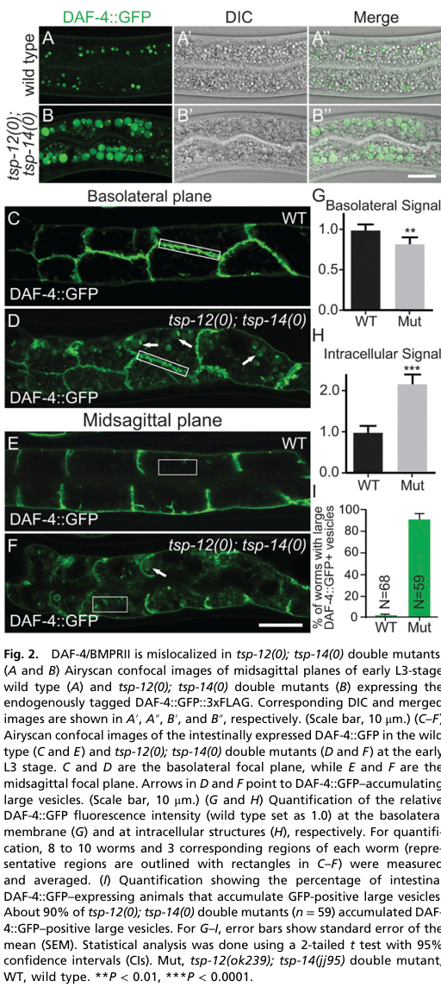

## Question

# Gene Research for Functional Annotation

## ⚠️ CRITICAL: Gene/Protein Identification Context

**BEFORE YOU BEGIN RESEARCH:** You MUST verify you are researching the CORRECT gene/protein. Gene symbols can be ambiguous, especially for less well-characterized genes from non-model organisms.

### Target Gene/Protein Identity (from UniProt):
- **UniProt Accession:** P50488
- **Protein Description:** RecName: Full=Cell surface receptor daf-4; EC=2.7.11.30; AltName: Full=Abnormal dauer formation protein 4; Flags: Precursor;
- **Gene Information:** Name=daf-4 {ECO:0000312|WormBase:C05D2.1a}; ORFNames=C05D2.1 {ECO:0000312|WormBase:C05D2.1a};
- **Organism (full):** Caenorhabditis elegans.
- **Protein Family:** Belongs to the protein kinase superfamily. TKL Ser/Thr
- **Key Domains:** Kinase-like_dom_sf. (IPR011009); Prot_kinase_dom. (IPR000719); Ser/Thr_kinase_AS. (IPR008271); Snake_toxin-like_sf. (IPR045860); TGFB_receptor. (IPR000333)

### MANDATORY VERIFICATION STEPS:

1. **Check if the gene symbol "daf-4" matches the protein description above**
2. **Verify the organism is correct:** Caenorhabditis elegans.
3. **Check if protein family/domains align with what you find in literature**
4. **If you find literature for a DIFFERENT gene with the same or similar symbol, STOP**

### If Gene Symbol is Ambiguous or You Cannot Find Relevant Literature:

**DO NOT PROCEED WITH RESEARCH ON A DIFFERENT GENE.** Instead:
- State clearly: "The gene symbol 'daf-4' is ambiguous or literature is limited for this specific protein"
- Explain what you found (e.g., "Found extensive literature on a different gene with the same symbol in a different organism")
- Describe the protein based ONLY on the UniProt information provided above
- Suggest that the protein function can be inferred from domain/family information

### Research Target:

Please provide a comprehensive research report on the gene **daf-4** (gene ID: daf-4, UniProt: P50488) in worm.

The research report should be a detailed narrative explaining the function, biological processes, and localization of the gene product. Citations should be given for all claims.

You should prioritize authoritative reviews and primary scientific literature when conducting research. You can supplement
this with annotations you find in gene/protein databases, but these can be outdated or inaccurate.

We are specifically interested in the primary function of the gene - for enzymes, what reaction is catalyzed, and what is the substrate specificity? For transporters, what is the substrate? For structural proteins or adapters, what is the broader structural role? For signaling molecules, what is the role in the pathway.

We are interested in where in or outside the cell the gene product carries out its function.

We are also interested in the signaling or biochemical pathways in which the gene functions. We are less interested in broad pleiotropic effects, except where these elucidate the precise role.

Include evidence where possible. We are interested in both experimental evidence as well as inference from structure, evolution, or bioinformatic analysis. Precise studies should be prioritized over high-throughput, where available.

## Output

Question: You are an expert researcher providing comprehensive, well-cited information.

Provide detailed information focusing on:
1. Key concepts and definitions with current understanding
2. Recent developments and latest research (prioritize 2023-2024 sources)
3. Current applications and real-world implementations
4. Expert opinions and analysis from authoritative sources
5. Relevant statistics and data from recent studies

Format as a comprehensive research report with proper citations. Include URLs and publication dates where available.
Always prioritize recent, authoritative sources and provide specific citations for all major claims.

# Gene Research for Functional Annotation

## ⚠️ CRITICAL: Gene/Protein Identification Context

**BEFORE YOU BEGIN RESEARCH:** You MUST verify you are researching the CORRECT gene/protein. Gene symbols can be ambiguous, especially for less well-characterized genes from non-model organisms.

### Target Gene/Protein Identity (from UniProt):
- **UniProt Accession:** P50488
- **Protein Description:** RecName: Full=Cell surface receptor daf-4; EC=2.7.11.30; AltName: Full=Abnormal dauer formation protein 4; Flags: Precursor;
- **Gene Information:** Name=daf-4 {ECO:0000312|WormBase:C05D2.1a}; ORFNames=C05D2.1 {ECO:0000312|WormBase:C05D2.1a};
- **Organism (full):** Caenorhabditis elegans.
- **Protein Family:** Belongs to the protein kinase superfamily. TKL Ser/Thr
- **Key Domains:** Kinase-like_dom_sf. (IPR011009); Prot_kinase_dom. (IPR000719); Ser/Thr_kinase_AS. (IPR008271); Snake_toxin-like_sf. (IPR045860); TGFB_receptor. (IPR000333)

### MANDATORY VERIFICATION STEPS:

1. **Check if the gene symbol "daf-4" matches the protein description above**
2. **Verify the organism is correct:** Caenorhabditis elegans.
3. **Check if protein family/domains align with what you find in literature**
4. **If you find literature for a DIFFERENT gene with the same or similar symbol, STOP**

### If Gene Symbol is Ambiguous or You Cannot Find Relevant Literature:

**DO NOT PROCEED WITH RESEARCH ON A DIFFERENT GENE.** Instead:
- State clearly: "The gene symbol 'daf-4' is ambiguous or literature is limited for this specific protein"
- Explain what you found (e.g., "Found extensive literature on a different gene with the same symbol in a different organism")
- Describe the protein based ONLY on the UniProt information provided above
- Suggest that the protein function can be inferred from domain/family information

### Research Target:

Please provide a comprehensive research report on the gene **daf-4** (gene ID: daf-4, UniProt: P50488) in worm.

The research report should be a detailed narrative explaining the function, biological processes, and localization of the gene product. Citations should be given for all claims.

You should prioritize authoritative reviews and primary scientific literature when conducting research. You can supplement
this with annotations you find in gene/protein databases, but these can be outdated or inaccurate.

We are specifically interested in the primary function of the gene - for enzymes, what reaction is catalyzed, and what is the substrate specificity? For transporters, what is the substrate? For structural proteins or adapters, what is the broader structural role? For signaling molecules, what is the role in the pathway.

We are interested in where in or outside the cell the gene product carries out its function.

We are also interested in the signaling or biochemical pathways in which the gene functions. We are less interested in broad pleiotropic effects, except where these elucidate the precise role.

Include evidence where possible. We are interested in both experimental evidence as well as inference from structure, evolution, or bioinformatic analysis. Precise studies should be prioritized over high-throughput, where available.

# Functional annotation of *Caenorhabditis elegans daf-4* (UniProt P50488)

## Identity and principal function

**Identity check.** The supplied UniProt record identifies P50488 as the *C. elegans* **daf-4** gene product, locus **C05D2.1**, and annotates a TGF-β-receptor domain and serine/threonine protein-kinase domain. Worm-specific literature independently identifies DAF-4 as the **sole type-II TGF-β-family receptor** shared by the DAF-7/dauer and DBL-1/BMP (Sma/Mab) pathways. These independent descriptions agree on organism, gene name, receptor class and domain-based function; the accession-to-locus mapping itself is taken from the supplied UniProt record. DAF-4 is not the insulin receptor DAF-2, the type-I receptor DAF-1, or a similarly named receptor from another organism. [UniProt P50488](https://www.uniprot.org/uniprotkb/P50488/entry); Savage-Dunn and Padgett, *Cold Spring Harbor Perspectives in Biology* (2017), [doi:10.1101/cshperspect.a022178](https://doi.org/10.1101/cshperspect.a022178). (savagedunn2017thetgfβfamily pages 2-4, gumienny2013tgfβsignalingin pages 15-17)

**Primary molecular role.** DAF-4 is a **cell-surface signaling receptor and type-II serine/threonine kinase**, not a secreted ligand or transporter. Its extracellular region participates in recognition of TGF-β-family ligands with a type-I receptor; its intracellular kinase region is assigned the canonical reaction **ATP + type-I-receptor protein → ADP + phosphorylated type-I receptor**, principally at the type-I receptor’s glycine/serine-rich activation region. The physiologically relevant proposed receptor substrates are **DAF-1** in DAF-7 signaling and **SMA-6** in DBL-1 signaling. Activated type-I receptors, rather than DAF-4 itself, phosphorylate the downstream receptor-regulated Smads. This substrate assignment is supported by receptor-family mechanism and pathway genetics; the retrieved studies do **not** establish purified *C. elegans* DAF-4 kinetic constants, phosphosite-resolved phosphorylation of both proposed substrates, or a broader substrate-specificity profile. Notably, genetic experiments indicate that DAF-1 retains weak signaling capacity when DAF-4-dependent activation is absent, so DAF-4 should not be described as absolutely required for every detectable DAF-1 signal. Gumienny and Savage-Dunn, *WormBook* (2013), [doi:10.1895/wormbook.1.22.2](https://doi.org/10.1895/wormbook.1.22.2); Gleason *et al.*, *PNAS* (2014), [doi:10.1073/pnas.1319947111](https://doi.org/10.1073/pnas.1319947111). (gumienny2013tgfβsignalingin pages 3-5, gleason2014bmpsignalingrequires pages 1-2, gumienny2013tgfβsignalingin pages 15-17)

The evidence-weighted annotation below separates observations on DAF-4 from pathway-level inference.

| Aspect | Best-supported finding | Evidence / qualification |
|---|---|---|
| Identity | The supplied UniProt mapping identifies P50488 as *C. elegans daf-4* (C05D2.1); literature independently identifies worm DAF-4 as the shared—and sole—type-II TGF-β-family receptor used by the dauer and Sma/Mab pathways. | The accession-to-locus mapping comes from the supplied UniProt record rather than the cited papers; receptor identity and uniqueness are literature-supported. (savagedunn2017thetgfβfamily pages 2-4, gumienny2013tgfβsignalingin pages 15-17) |
| Biochemical function | DAF-4 is a single-pass type-II serine/threonine receptor kinase expected to use ATP to phosphorylate the GS region of its partnered type-I receptor—DAF-1 or SMA-6—which then phosphorylates pathway-specific R-Smads. | This is the conserved canonical mechanism and is strongly supported at pathway level, but the retrieved sources do **not** document a purified-worm DAF-4 kinetic or direct substrate-phosphorylation assay. DAF-1 also retains weak signaling capacity without DAF-4-mediated phosphorylation. (gumienny2013tgfβsignalingin pages 3-5, gumienny2013tgfβsignalingin pages 15-17) |
| DAF-7/dauer pathway | DAF-7 signals through DAF-4 plus type-I receptor DAF-1 to DAF-8/DAF-14; these R-Smads oppose the dauer-promoting DAF-3/DAF-5 complex. DAF-4 activity in neurons is important for reproductive development rather than dauer entry. | Tissue-specific and mosaic-rescue evidence supports a principal neuronal requirement, although DAF-4 is broadly expressed and additional target tissues may contribute. (savagedunn2017thetgfβfamily pages 2-4, gumienny2013tgfβsignalingin pages 15-17) |
| DBL-1/BMP pathway | DBL-1 is received by DAF-4 plus type-I receptor SMA-6; activated SMA-6 signals through SMA-2/SMA-3 and the co-Smad SMA-4. | Genetic and pathway evidence establishes DAF-4 as the shared type-II receptor that switches specificity through its type-I receptor and Smad partners. (gumienny2013tgfβsignalingin pages 3-5, savagedunn2017thetgfβfamily pages 2-4) |
| Cellular localization | Functional, endogenously tagged DAF-4 is found mainly at cell surfaces, including hypodermal/seam-cell surfaces and the basolateral—but not apical—membranes of polarized intestinal and vulval cells; an intracellular endosomal pool is also visible. | CRISPR-tagged DAF-4::GFP::3×FLAG was detected in pharynx, hypodermis, intestine and developing vulva, providing direct in-vivo localization evidence. (liu2020tetraspaninstsp12and pages 2-3) |
| Endocytic regulation | DAF-4 follows a retromer-independent, ARF-6-dependent recycling route, whereas SMA-6 uses retromer. TSP-12/TSP-14 preserve DAF-4 surface abundance by preventing diversion to late endosomes and lysosomes. | In *tsp-12; tsp-14* double mutants, over 90% of animals accumulated large DAF-4::GFP-positive vesicles (*n*=59), with reduced basolateral signal and increased intracellular receptor. (liu2020tetraspaninstsp12and pages 3-4, liu2020tetraspaninstsp12and media 8c82db7e, liu2020tetraspaninstsp12and pages 2-3) |
| New trafficking result (2023) | Depletion of NEKL-3 caused an approximately 4.8-fold increase in hypodermal DAF-4::GFP, concentrated at or near the basal membrane, consistent with defective uptake or early endocytic processing. | NEKL-2 depletion did not detectably affect DAF-4::GFP, indicating regulator and cargo-route specificity; the experiment measured a reporter rather than endogenous untagged protein. (joseph2023conservednimakinases pages 5-7) |
| New stress-signaling result (2024) | The loss-of-function allele *daf-4(m63)* strongly suppressed intestinal mitochondrial unfolded-protein-response activation caused by neuronal *cco-1* knockdown. | This whole-animal genetic result places DAF-4 in a cell-nonautonomous DAF-7 pathway controlling systemic UPRmt; the study’s cellular localization and rescue analysis focused primarily on DAF-1, not DAF-4, and no DAF-4-specific numerical effect was reported in the retrieved text. (wang2024asirimneuronalaxis pages 2-3) |
| Pathogen-response evidence (2024) | Canonical BMP signaling was required for survival on *Photorhabdus luminescens*, but this study directly tested the type-I receptor *sma-6*, not *daf-4*. | DAF-4 was described as the common type-II receptor; assigning the survival phenotype directly to DAF-4 from this paper would therefore be an inference. *daf-1* and *daf-14* mutants lacked significant survival defects, while *daf-8* showed only a slight deficit. (ciccarelli2024tgfβligandcrosssubfamily pages 6-7) |

*Table: Evidence-weighted functional annotation of *C. elegans* DAF-4/P50488, separating direct experiments from conserved-mechanism inference. It highlights pathway partners, cellular location, receptor trafficking, and carefully bounded 2023–2024 findings.*

## Ligands, pathways and biological processes

In the **DAF-7 pathway**, environmental conditions regulate secretion of DAF-7 from ASI sensory neurons. A receiving-cell complex containing DAF-4 and type-I receptor **DAF-1** transmits this signal through **DAF-8 and DAF-14**; signaling opposes the dauer-promoting **DAF-3/DAF-5** transcriptional program. Loss of pathway activity, including *daf-4* loss, promotes inappropriate entry into the stress-resistant dauer larval stage. The often-depicted complex contains **two type-I and two type-II receptor subunits**; this is the canonical pathway architecture, not a measured receptor stoichiometry for every worm tissue. Neuronal rescue and mosaic evidence identify an important neuronal requirement for DAF-4 in the dauer decision, although broad expression and additional responding tissues argue against assigning every DAF-4 function to neurons. Savage-Dunn, *Cytokine & Growth Factor Reviews* (2001), [doi:10.1016/S1359-6101(01)00015-6](https://doi.org/10.1016/S1359-6101(01)00015-6); Gumienny and Savage-Dunn (2013); Savage-Dunn and Padgett (2017). (savagedunn2001targetsoftgfβrelated pages 3-4, gumienny2013tgfβsignalingin pages 12-14, savagedunn2017thetgfβfamily pages 2-4)

In the distinct **DBL-1/BMP pathway**, neuronally produced **DBL-1** signals through DAF-4 partnered with type-I receptor **SMA-6**. SMA-6 activates **SMA-2 and SMA-3** receptor-regulated Smads, which act with **SMA-4** to alter transcription in receiving tissues. This branch is particularly important for body-size control and male-tail patterning; downstream collagen-gene regulation provides a more specific explanation for its growth phenotype than simply labeling DAF-4 a “body-size gene.” DAF-4 is shared between the branches, whereas their type-I receptors and downstream Smads confer much of their signaling specificity. Its experimentally reported binding to **human BMP-2 and BMP-4 in cultured cells** demonstrates cross-species ligand recognition; it does not establish that human BMPs are physiological worm ligands or quantify affinity for endogenous DBL-1 or DAF-7. Savage-Dunn and Padgett (2017); Gleason *et al.* (2014); Madaan *et al.*, *Genetics* (2018), [doi:10.1534/genetics.118.301631](https://doi.org/10.1534/genetics.118.301631). (savagedunn2017thetgfβfamily pages 2-4, savagedunn2017thetgfβfamily pages 4-5, gleason2014bmpsignalingrequires pages 1-2)

DAF-4 also has experimentally informative adult functions. Adult-onset depletion of *daf-4* disrupts sperm targeting to the spermatheca, and germline-restricted receptor depletion implicates reception of the neuronal DAF-7 signal in the **germ line/oocyte lineage**, rather than a direct receptor action in sperm. The associated oocyte-prostaglandin guidance mechanism is supported particularly by pathway and *daf-1* experiments; it should not be mistaken for a demonstrated biochemical activity of purified DAF-4. McKnight *et al.*, *Science* (May 2014), [doi:10.1126/science.1250598](https://doi.org/10.1126/science.1250598). (mcknight2014neurosensoryperceptionof pages 3-3, mcknight2014neurosensoryperceptionof pages 2-3, mcknight2014neurosensoryperceptionof pages 3-5)

## Site of action and regulation of receptor availability

DAF-4 functions primarily **at the receiving cell’s plasma membrane**, where its extracellular domain can encounter secreted ligand while its kinase domain faces the cytoplasm. Imaging of **functional, endogenously GFP-tagged DAF-4** directly detects receptor at hypodermal and seam-cell surfaces and at the **basolateral, rather than apical, membrane** of polarized intestinal and developing vulval cells. Signal is also detectable in the pharynx and in intracellular vesicles. These findings identify sites of receptor residence, not proof that all observed tissues receive an equivalent physiological ligand signal. Liu *et al.*, *PNAS* (first published January 27, 2020), [doi:10.1073/pnas.1918807117](https://doi.org/10.1073/pnas.1918807117). (liu2020tetraspaninstsp12and pages 2-3)

DAF-4 is subsequently internalized and recycled through a **retromer-independent, ARF-6-associated pathway**; its BMP-pathway partner SMA-6 instead depends strongly on **retromer**. Thus, the two receptors can be differentially sorted after internalization, providing a plausible means of controlling surface availability and signal duration. Worm experiments establish the trafficking distinction, but the proposal that physical separation itself terminates signaling remains a mechanistic interpretation. Gleason *et al.* (February 2014). (gleason2014bmpsignalingrequires pages 3-4, gleason2014bmpsignalingrequires pages 1-2)

Tetraspanins **TSP-12 and TSP-14** help maintain surface DAF-4. In double mutants, basolateral DAF-4 signal falls while receptor accumulates in late endosomes and lysosomes; **over 90% of examined double-mutant animals (*n* = 59)** accumulated conspicuous DAF-4::GFP-positive vesicles. Receptor missorting and decreased surface availability provide a direct cellular explanation for reduced BMP signaling in these mutants. The corresponding cropped Figure 2 supplies visual and quantitative evidence for the redistribution. Liu *et al.* (2020), [doi:10.1073/pnas.1918807117](https://doi.org/10.1073/pnas.1918807117). (liu2020tetraspaninstsp12and pages 1-2, liu2020tetraspaninstsp12and pages 3-4, liu2020tetraspaninstsp12and media 8c82db7e, liu2020tetraspaninstsp12and pages 2-3)

Receptor abundance is also regulated at the RNA level. The **miR-58 microRNA family** represses reporters bearing the *daf-4* **3′ untranslated region**; mutation of predicted target sites removes repression, and *daf-4* mRNA rises when the miRNA family is disrupted. These are strong sequence-dependent reporter and transcript data, but they should not be presented as a direct measurement of endogenous DAF-4 protein abundance. Separately, alternative polyadenylation has been reported to produce a truncated DAF-4 product containing the extracellular region that **antagonizes DAF-7 signaling**; that negative-regulatory form should not be conflated with the full-length signaling receptor. de Lucas *et al.*, *Nucleic Acids Research* (September 2015), [doi:10.1093/nar/gkv923](https://doi.org/10.1093/nar/gkv923); Gumienny and Savage-Dunn (2013), discussing Gunther and Riddle’s 2004 study, [doi:10.1074/jbc.M407602200](https://doi.org/10.1074/jbc.M407602200). (lucas2015mir58familyand pages 5-6, lucas2015mir58familyand pages 4-5, lucas2015mir58familyand pages 6-8, gumienny2013tgfβsignalingin pages 15-17)

## Developments in 2023–2024 and research use

A **2023** epidermal-cell trafficking study found an approximately **4.8-fold increase in the DAF-4::GFP reporter signal** after depletion of **NEKL-3**, with accumulation at or near the basal surface; depletion of NEKL-2 did not detectably alter that reporter. The authors interpret this as impaired receptor uptake or early endocytic processing, extending DAF-4’s use as an experimentally tractable cargo for distinguishing membrane-trafficking routes. The measurement is reporter fluorescence, **not** a measured 4.8-fold increase in DAF-4 kinase activity or signaling. Joseph *et al.*, *PLOS Genetics* (April 26, 2023), [doi:10.1371/journal.pgen.1010741](https://doi.org/10.1371/journal.pgen.1010741). (joseph2023conservednimakinases pages 1-2, joseph2023conservednimakinases pages 5-7)

A **2024** study provided more direct new genetic evidence for the DAF-7 branch: the loss-of-function allele ***daf-4(m63)*** strongly suppressed the **intestinal mitochondrial unfolded-protein-response reporter** induced by neuronal *cco-1* knockdown. This connects DAF-4 to communication between stressed neurons and the intestine. The study’s finer-grained assignment of an **ASI-to-RIM neuronal circuit** relied substantially on DAF-7 and **DAF-1** localization and rescue; those DAF-1 experiments must not be described as DAF-4-specific localization or rescue. No DAF-4-specific numerical suppression magnitude was established in the retrieved text. Wang *et al.*, *Nature Communications* (October 2024), [doi:10.1038/s41467-024-53093-9](https://doi.org/10.1038/s41467-024-53093-9). (wang2024asirimneuronalaxis pages 2-3, wang2024asirimneuronalaxis pages 5-6)

Also in **2024**, pathogen-survival experiments implicated canonical **DBL-1/BMP signaling** against *Photorhabdus luminescens*: mutants of type-I receptor ***sma-6*** and BMP-pathway Smads had reduced survival, whereas *daf-1* and *daf-14* showed no significant survival deficit in the reported comparisons. **The investigators did not report a *daf-4* mutant survival test in the relevant experiment.** DAF-4’s participation here is therefore a reasonable inference from its established receptor partnership, **not a direct pathogen-survival result for this gene**. Suggested interactions among additional ligands TIG-2 and TIG-3 likewise do not establish them as direct DAF-4 ligands. Ciccarelli *et al.*, *PLOS Genetics* (June 14, 2024), [doi:10.1371/journal.pgen.1011324](https://doi.org/10.1371/journal.pgen.1011324); Yamamoto and Savage-Dunn, *Frontiers in Genetics* (September 2023), [doi:10.3389/fgene.2023.1220068](https://doi.org/10.3389/fgene.2023.1220068). (ciccarelli2024tgfβligandcrosssubfamily pages 6-7, ciccarelli2024tgfβligandcrosssubfamily pages 1-2, yamamoto2023tgfβpathwaysin pages 3-4)

**Assessment.** DAF-4’s best-established annotation is **shared, membrane-localized type-II kinase receptor for two otherwise distinct worm TGF-β-family signaling pathways**. Direct genetics, ligand-binding observations, functional receptor imaging and trafficking perturbations strongly support that assignment. Precision limits remain: the retrieved evidence does not resolve in-worm ligand-binding affinities, a complete direct phosphorylation-substrate spectrum, or the exact cellular site of DAF-4 action in every newly reported systemic phenotype. As a research implementation, the worm receptor and its functional fluorescent fusions provide an *in vivo* model for receptor recycling and signaling; experiments introducing disease-associated variants into worm DAF-4 have shown altered epithelial membrane targeting, but those models **do not** themselves establish a human treatment or prove the same disease mechanism in patients. Lin *et al.*, *PLOS ONE* (May 9, 2019), [doi:10.1371/journal.pone.0216628](https://doi.org/10.1371/journal.pone.0216628); Gleason *et al.* (2014); Liu *et al.* (2020). (lin2019humanmarfanand pages 1-2, gleason2014bmpsignalingrequires pages 3-4, liu2020tetraspaninstsp12and pages 2-3)

References

1. (savagedunn2017thetgfβfamily pages 2-4): Cathy Savage-Dunn and Richard W. Padgett. The tgf-β family in caenorhabditis elegans. Cold Spring Harbor perspectives in biology, 9 6:a022178, Jan 2017. URL: https://doi.org/10.1101/cshperspect.a022178, doi:10.1101/cshperspect.a022178. This article has 96 citations and is from a peer-reviewed journal.

2. (gumienny2013tgfβsignalingin pages 15-17): T. L. Gumienny and C. Savage-Dunn. Tgf-β signaling in c. elegans *. ArXiv, 156:1-34, Jul 2013. URL: https://doi.org/10.1895/wormbook.1.22.2, doi:10.1895/wormbook.1.22.2. This article has 205 citations.

3. (gumienny2013tgfβsignalingin pages 3-5): T. L. Gumienny and C. Savage-Dunn. Tgf-β signaling in c. elegans *. ArXiv, 156:1-34, Jul 2013. URL: https://doi.org/10.1895/wormbook.1.22.2, doi:10.1895/wormbook.1.22.2. This article has 205 citations.

4. (gleason2014bmpsignalingrequires pages 1-2): Ryan J. Gleason, Adenrele M. Akintobi, Barth D. Grant, and Richard W. Padgett. Bmp signaling requires retromer-dependent recycling of the type i receptor. Proceedings of the National Academy of Sciences, 111:2578-2583, Feb 2014. URL: https://doi.org/10.1073/pnas.1319947111, doi:10.1073/pnas.1319947111. This article has 98 citations and is from a highest quality peer-reviewed journal.

5. (liu2020tetraspaninstsp12and pages 2-3): Zhiyu Liu, Herong Shi, Anthony K. Nzessi, Anne Norris, Barth D. Grant, and Jun Liu. Tetraspanins tsp-12 and tsp-14 function redundantly to regulate the trafficking of the type ii bmp receptor in caenorhabditis elegans. Proceedings of the National Academy of Sciences, 117:2968-2977, Jan 2020. URL: https://doi.org/10.1073/pnas.1918807117, doi:10.1073/pnas.1918807117. This article has 16 citations and is from a highest quality peer-reviewed journal.

6. (liu2020tetraspaninstsp12and pages 3-4): Zhiyu Liu, Herong Shi, Anthony K. Nzessi, Anne Norris, Barth D. Grant, and Jun Liu. Tetraspanins tsp-12 and tsp-14 function redundantly to regulate the trafficking of the type ii bmp receptor in caenorhabditis elegans. Proceedings of the National Academy of Sciences, 117:2968-2977, Jan 2020. URL: https://doi.org/10.1073/pnas.1918807117, doi:10.1073/pnas.1918807117. This article has 16 citations and is from a highest quality peer-reviewed journal.

7. (liu2020tetraspaninstsp12and media 8c82db7e): Zhiyu Liu, Herong Shi, Anthony K. Nzessi, Anne Norris, Barth D. Grant, and Jun Liu. Tetraspanins tsp-12 and tsp-14 function redundantly to regulate the trafficking of the type ii bmp receptor in caenorhabditis elegans. Proceedings of the National Academy of Sciences, 117:2968-2977, Jan 2020. URL: https://doi.org/10.1073/pnas.1918807117, doi:10.1073/pnas.1918807117. This article has 16 citations and is from a highest quality peer-reviewed journal.

8. (joseph2023conservednimakinases pages 5-7): Braveen B. Joseph, Naava Naslavsky, Shaonil Binti, Sylvia Conquest, Lexi Robison, Ge Bai, Rafael O. Homer, Barth D. Grant, Steve Caplan, and David S. Fay. Conserved nima kinases regulate multiple steps of endocytic trafficking. PLOS Genetics, 19:e1010741, Apr 2023. URL: https://doi.org/10.1371/journal.pgen.1010741, doi:10.1371/journal.pgen.1010741. This article has 19 citations and is from a domain leading peer-reviewed journal.

9. (wang2024asirimneuronalaxis pages 2-3): Zihao Wang, Qian Zhang, Yayun Jiang, Jun Zhou, and Ye Tian. Asi-rim neuronal axis regulates systemic mitochondrial stress response via tgf-β signaling cascade. Nature Communications, Oct 2024. URL: https://doi.org/10.1038/s41467-024-53093-9, doi:10.1038/s41467-024-53093-9. This article has 25 citations and is from a highest quality peer-reviewed journal.

10. (ciccarelli2024tgfβligandcrosssubfamily pages 6-7): Emma Jo Ciccarelli, Zachary Wing, Moshe Bendelstein, Ramandeep Kaur Johal, Gurjot Singh, Ayelet Monas, and Cathy Savage-Dunn. Tgf-β ligand cross-subfamily interactions in the response of caenorhabditis elegans to a bacterial pathogen. PLOS Genetics, 20:e1011324, Jun 2024. URL: https://doi.org/10.1371/journal.pgen.1011324, doi:10.1371/journal.pgen.1011324. This article has 8 citations and is from a domain leading peer-reviewed journal.

11. (savagedunn2001targetsoftgfβrelated pages 3-4): Cathy Savage-Dunn. Targets of tgfβ-related signaling in caenorhabditis elegans. Cytokine & Growth Factor Reviews, 12:305-312, Dec 2001. URL: https://doi.org/10.1016/s1359-6101(01)00015-6, doi:10.1016/s1359-6101(01)00015-6. This article has 46 citations and is from a peer-reviewed journal.

12. (gumienny2013tgfβsignalingin pages 12-14): T. L. Gumienny and C. Savage-Dunn. Tgf-β signaling in c. elegans *. ArXiv, 156:1-34, Jul 2013. URL: https://doi.org/10.1895/wormbook.1.22.2, doi:10.1895/wormbook.1.22.2. This article has 205 citations.

13. (savagedunn2017thetgfβfamily pages 4-5): Cathy Savage-Dunn and Richard W. Padgett. The tgf-β family in caenorhabditis elegans. Cold Spring Harbor perspectives in biology, 9 6:a022178, Jan 2017. URL: https://doi.org/10.1101/cshperspect.a022178, doi:10.1101/cshperspect.a022178. This article has 96 citations and is from a peer-reviewed journal.

14. (mcknight2014neurosensoryperceptionof pages 3-3): Katherine McKnight, Hieu D. Hoang, Jeevan K. Prasain, Naoko Brown, Jack Vibbert, Kyle A. Hollister, Ray Moore, Justin R. Ragains, Jeff Reese, and Michael A. Miller. Neurosensory perception of environmental cues modulates sperm motility critical for fertilization. Science, 344:754-757, May 2014. URL: https://doi.org/10.1126/science.1250598, doi:10.1126/science.1250598. This article has 61 citations and is from a highest quality peer-reviewed journal.

15. (mcknight2014neurosensoryperceptionof pages 2-3): Katherine McKnight, Hieu D. Hoang, Jeevan K. Prasain, Naoko Brown, Jack Vibbert, Kyle A. Hollister, Ray Moore, Justin R. Ragains, Jeff Reese, and Michael A. Miller. Neurosensory perception of environmental cues modulates sperm motility critical for fertilization. Science, 344:754-757, May 2014. URL: https://doi.org/10.1126/science.1250598, doi:10.1126/science.1250598. This article has 61 citations and is from a highest quality peer-reviewed journal.

16. (mcknight2014neurosensoryperceptionof pages 3-5): Katherine McKnight, Hieu D. Hoang, Jeevan K. Prasain, Naoko Brown, Jack Vibbert, Kyle A. Hollister, Ray Moore, Justin R. Ragains, Jeff Reese, and Michael A. Miller. Neurosensory perception of environmental cues modulates sperm motility critical for fertilization. Science, 344:754-757, May 2014. URL: https://doi.org/10.1126/science.1250598, doi:10.1126/science.1250598. This article has 61 citations and is from a highest quality peer-reviewed journal.

17. (gleason2014bmpsignalingrequires pages 3-4): Ryan J. Gleason, Adenrele M. Akintobi, Barth D. Grant, and Richard W. Padgett. Bmp signaling requires retromer-dependent recycling of the type i receptor. Proceedings of the National Academy of Sciences, 111:2578-2583, Feb 2014. URL: https://doi.org/10.1073/pnas.1319947111, doi:10.1073/pnas.1319947111. This article has 98 citations and is from a highest quality peer-reviewed journal.

18. (liu2020tetraspaninstsp12and pages 1-2): Zhiyu Liu, Herong Shi, Anthony K. Nzessi, Anne Norris, Barth D. Grant, and Jun Liu. Tetraspanins tsp-12 and tsp-14 function redundantly to regulate the trafficking of the type ii bmp receptor in caenorhabditis elegans. Proceedings of the National Academy of Sciences, 117:2968-2977, Jan 2020. URL: https://doi.org/10.1073/pnas.1918807117, doi:10.1073/pnas.1918807117. This article has 16 citations and is from a highest quality peer-reviewed journal.

19. (lucas2015mir58familyand pages 5-6): María Pilar de Lucas, Alberto G. Sáez, and Encarnación Lozano. Mir-58 family and tgf-β pathways regulate each other in caenorhabditis elegans. Nucleic Acids Research, 43:9978-9993, Sep 2015. URL: https://doi.org/10.1093/nar/gkv923, doi:10.1093/nar/gkv923. This article has 23 citations and is from a highest quality peer-reviewed journal.

20. (lucas2015mir58familyand pages 4-5): María Pilar de Lucas, Alberto G. Sáez, and Encarnación Lozano. Mir-58 family and tgf-β pathways regulate each other in caenorhabditis elegans. Nucleic Acids Research, 43:9978-9993, Sep 2015. URL: https://doi.org/10.1093/nar/gkv923, doi:10.1093/nar/gkv923. This article has 23 citations and is from a highest quality peer-reviewed journal.

21. (lucas2015mir58familyand pages 6-8): María Pilar de Lucas, Alberto G. Sáez, and Encarnación Lozano. Mir-58 family and tgf-β pathways regulate each other in caenorhabditis elegans. Nucleic Acids Research, 43:9978-9993, Sep 2015. URL: https://doi.org/10.1093/nar/gkv923, doi:10.1093/nar/gkv923. This article has 23 citations and is from a highest quality peer-reviewed journal.

22. (joseph2023conservednimakinases pages 1-2): Braveen B. Joseph, Naava Naslavsky, Shaonil Binti, Sylvia Conquest, Lexi Robison, Ge Bai, Rafael O. Homer, Barth D. Grant, Steve Caplan, and David S. Fay. Conserved nima kinases regulate multiple steps of endocytic trafficking. PLOS Genetics, 19:e1010741, Apr 2023. URL: https://doi.org/10.1371/journal.pgen.1010741, doi:10.1371/journal.pgen.1010741. This article has 19 citations and is from a domain leading peer-reviewed journal.

23. (wang2024asirimneuronalaxis pages 5-6): Zihao Wang, Qian Zhang, Yayun Jiang, Jun Zhou, and Ye Tian. Asi-rim neuronal axis regulates systemic mitochondrial stress response via tgf-β signaling cascade. Nature Communications, Oct 2024. URL: https://doi.org/10.1038/s41467-024-53093-9, doi:10.1038/s41467-024-53093-9. This article has 25 citations and is from a highest quality peer-reviewed journal.

24. (ciccarelli2024tgfβligandcrosssubfamily pages 1-2): Emma Jo Ciccarelli, Zachary Wing, Moshe Bendelstein, Ramandeep Kaur Johal, Gurjot Singh, Ayelet Monas, and Cathy Savage-Dunn. Tgf-β ligand cross-subfamily interactions in the response of caenorhabditis elegans to a bacterial pathogen. PLOS Genetics, 20:e1011324, Jun 2024. URL: https://doi.org/10.1371/journal.pgen.1011324, doi:10.1371/journal.pgen.1011324. This article has 8 citations and is from a domain leading peer-reviewed journal.

25. (yamamoto2023tgfβpathwaysin pages 3-4): Katerina K. Yamamoto and Cathy Savage-Dunn. Tgf-β pathways in aging and immunity: lessons from caenorhabditis elegans. Frontiers in Genetics, Sep 2023. URL: https://doi.org/10.3389/fgene.2023.1220068, doi:10.3389/fgene.2023.1220068. This article has 23 citations and is from a peer-reviewed journal.

26. (lin2019humanmarfanand pages 1-2): Jing Lin, Mehul Vora, Nanci S. Kane, Ryan J. Gleason, and Richard W. Padgett. Human marfan and marfan-like syndrome associated mutations lead to altered trafficking of the type ii tgfβ receptor in caenorhabditis elegans. PLoS ONE, 14:e0216628, May 2019. URL: https://doi.org/10.1371/journal.pone.0216628, doi:10.1371/journal.pone.0216628. This article has 8 citations and is from a peer-reviewed journal.

## Artifacts

- [Edison artifact artifact-00](daf-4-deep-research-falcon_artifacts/artifact-00.md)

## Citations

1. joseph2023conservednimakinases pages 5-7
2. wang2024asirimneuronalaxis pages 2-3
3. gleason2014bmpsignalingrequires pages 1-2
4. mcknight2014neurosensoryperceptionof pages 3-3
5. mcknight2014neurosensoryperceptionof pages 2-3
6. mcknight2014neurosensoryperceptionof pages 3-5
7. gleason2014bmpsignalingrequires pages 3-4
8. joseph2023conservednimakinases pages 1-2
9. wang2024asirimneuronalaxis pages 5-6
10. lin2019humanmarfanand pages 1-2
11. UniProt P50488
12. doi:10.1101/cshperspect.a022178
13. doi:10.1895/wormbook.1.22.2
14. doi:10.1073/pnas.1319947111
15. doi:10.1016/S1359-6101(01)00015-6
16. doi:10.1534/genetics.118.301631
17. doi:10.1126/science.1250598
18. doi:10.1073/pnas.1918807117
19. doi:10.1093/nar/gkv923
20. doi:10.1074/jbc.M407602200
21. doi:10.1371/journal.pgen.1010741
22. doi:10.1038/s41467-024-53093-9
23. doi:10.1371/journal.pgen.1011324
24. doi:10.3389/fgene.2023.1220068
25. doi:10.1371/journal.pone.0216628
26. https://www.uniprot.org/uniprotkb/P50488/entry
27. https://doi.org/10.1101/cshperspect.a022178
28. https://doi.org/10.1895/wormbook.1.22.2
29. https://doi.org/10.1073/pnas.1319947111
30. https://doi.org/10.1016/S1359-6101(01
31. https://doi.org/10.1534/genetics.118.301631
32. https://doi.org/10.1126/science.1250598
33. https://doi.org/10.1073/pnas.1918807117
34. https://doi.org/10.1093/nar/gkv923
35. https://doi.org/10.1074/jbc.M407602200
36. https://doi.org/10.1371/journal.pgen.1010741
37. https://doi.org/10.1038/s41467-024-53093-9
38. https://doi.org/10.1371/journal.pgen.1011324
39. https://doi.org/10.3389/fgene.2023.1220068
40. https://doi.org/10.1371/journal.pone.0216628
41. https://doi.org/10.1101/cshperspect.a022178,
42. https://doi.org/10.1895/wormbook.1.22.2,
43. https://doi.org/10.1073/pnas.1319947111,
44. https://doi.org/10.1073/pnas.1918807117,
45. https://doi.org/10.1371/journal.pgen.1010741,
46. https://doi.org/10.1038/s41467-024-53093-9,
47. https://doi.org/10.1371/journal.pgen.1011324,
48. https://doi.org/10.1016/s1359-6101(01
49. https://doi.org/10.1126/science.1250598,
50. https://doi.org/10.1093/nar/gkv923,
51. https://doi.org/10.3389/fgene.2023.1220068,
52. https://doi.org/10.1371/journal.pone.0216628,