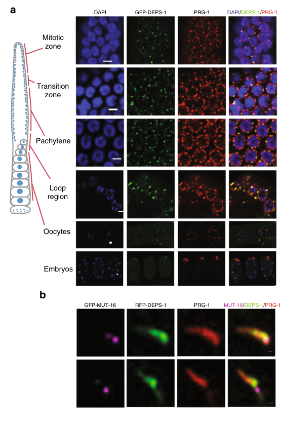

## Question

# Gene Research for Functional Annotation

## ⚠️ CRITICAL: Gene/Protein Identification Context

**BEFORE YOU BEGIN RESEARCH:** You MUST verify you are researching the CORRECT gene/protein. Gene symbols can be ambiguous, especially for less well-characterized genes from non-model organisms.

### Target Gene/Protein Identity (from UniProt):
- **UniProt Accession:** Q9N303
- **Protein Description:** RecName: Full=P-granule-associated protein deps-1 {ECO:0000305}; AltName: Full=Defective P granules and sterile protein deps-1 {ECO:0000312|WormBase:Y65B4BL.2a};
- **Gene Information:** Name=deps-1 {ECO:0000303|PubMed:18234720, ECO:0000312|WormBase:Y65B4BL.2a}; ORFNames=Y65B4BL.2 {ECO:0000312|WormBase:Y65B4BL.2a};
- **Organism (full):** Caenorhabditis elegans.
- **Protein Family:** Not specified in UniProt
- **Key Domains:** OB_DEPS-1_1st. (IPR057139); OB_DEPS-1_2nd. (IPR057143); OB_DEPS-1_6th. (IPR057144); OB_DEPS-1_1st (PF24343); OB_DEPS-1_2nd (PF24342)

### MANDATORY VERIFICATION STEPS:

1. **Check if the gene symbol "deps-1" matches the protein description above**
2. **Verify the organism is correct:** Caenorhabditis elegans.
3. **Check if protein family/domains align with what you find in literature**
4. **If you find literature for a DIFFERENT gene with the same or similar symbol, STOP**

### If Gene Symbol is Ambiguous or You Cannot Find Relevant Literature:

**DO NOT PROCEED WITH RESEARCH ON A DIFFERENT GENE.** Instead:
- State clearly: "The gene symbol 'deps-1' is ambiguous or literature is limited for this specific protein"
- Explain what you found (e.g., "Found extensive literature on a different gene with the same symbol in a different organism")
- Describe the protein based ONLY on the UniProt information provided above
- Suggest that the protein function can be inferred from domain/family information

### Research Target:

Please provide a comprehensive research report on the gene **deps-1** (gene ID: deps-1, UniProt: Q9N303) in worm.

The research report should be a detailed narrative explaining the function, biological processes, and localization of the gene product. Citations should be given for all claims.

You should prioritize authoritative reviews and primary scientific literature when conducting research. You can supplement
this with annotations you find in gene/protein databases, but these can be outdated or inaccurate.

We are specifically interested in the primary function of the gene - for enzymes, what reaction is catalyzed, and what is the substrate specificity? For transporters, what is the substrate? For structural proteins or adapters, what is the broader structural role? For signaling molecules, what is the role in the pathway.

We are interested in where in or outside the cell the gene product carries out its function.

We are also interested in the signaling or biochemical pathways in which the gene functions. We are less interested in broad pleiotropic effects, except where these elucidate the precise role.

Include evidence where possible. We are interested in both experimental evidence as well as inference from structure, evolution, or bioinformatic analysis. Precise studies should be prioritized over high-throughput, where available.

## Output

Question: You are an expert researcher providing comprehensive, well-cited information.

Provide detailed information focusing on:
1. Key concepts and definitions with current understanding
2. Recent developments and latest research (prioritize 2023-2024 sources)
3. Current applications and real-world implementations
4. Expert opinions and analysis from authoritative sources
5. Relevant statistics and data from recent studies

Format as a comprehensive research report with proper citations. Include URLs and publication dates where available.
Always prioritize recent, authoritative sources and provide specific citations for all major claims.

# Gene Research for Functional Annotation

## ⚠️ CRITICAL: Gene/Protein Identification Context

**BEFORE YOU BEGIN RESEARCH:** You MUST verify you are researching the CORRECT gene/protein. Gene symbols can be ambiguous, especially for less well-characterized genes from non-model organisms.

### Target Gene/Protein Identity (from UniProt):
- **UniProt Accession:** Q9N303
- **Protein Description:** RecName: Full=P-granule-associated protein deps-1 {ECO:0000305}; AltName: Full=Defective P granules and sterile protein deps-1 {ECO:0000312|WormBase:Y65B4BL.2a};
- **Gene Information:** Name=deps-1 {ECO:0000303|PubMed:18234720, ECO:0000312|WormBase:Y65B4BL.2a}; ORFNames=Y65B4BL.2 {ECO:0000312|WormBase:Y65B4BL.2a};
- **Organism (full):** Caenorhabditis elegans.
- **Protein Family:** Not specified in UniProt
- **Key Domains:** OB_DEPS-1_1st. (IPR057139); OB_DEPS-1_2nd. (IPR057143); OB_DEPS-1_6th. (IPR057144); OB_DEPS-1_1st (PF24343); OB_DEPS-1_2nd (PF24342)

### MANDATORY VERIFICATION STEPS:

1. **Check if the gene symbol "deps-1" matches the protein description above**
2. **Verify the organism is correct:** Caenorhabditis elegans.
3. **Check if protein family/domains align with what you find in literature**
4. **If you find literature for a DIFFERENT gene with the same or similar symbol, STOP**

### If Gene Symbol is Ambiguous or You Cannot Find Relevant Literature:

**DO NOT PROCEED WITH RESEARCH ON A DIFFERENT GENE.** Instead:
- State clearly: "The gene symbol 'deps-1' is ambiguous or literature is limited for this specific protein"
- Explain what you found (e.g., "Found extensive literature on a different gene with the same symbol in a different organism")
- Describe the protein based ONLY on the UniProt information provided above
- Suggest that the protein function can be inferred from domain/family information

### Research Target:

Please provide a comprehensive research report on the gene **deps-1** (gene ID: deps-1, UniProt: Q9N303) in worm.

The research report should be a detailed narrative explaining the function, biological processes, and localization of the gene product. Citations should be given for all claims.

You should prioritize authoritative reviews and primary scientific literature when conducting research. You can supplement
this with annotations you find in gene/protein databases, but these can be outdated or inaccurate.

We are specifically interested in the primary function of the gene - for enzymes, what reaction is catalyzed, and what is the substrate specificity? For transporters, what is the substrate? For structural proteins or adapters, what is the broader structural role? For signaling molecules, what is the role in the pathway.

We are interested in where in or outside the cell the gene product carries out its function.

We are also interested in the signaling or biochemical pathways in which the gene functions. We are less interested in broad pleiotropic effects, except where these elucidate the precise role.

Include evidence where possible. We are interested in both experimental evidence as well as inference from structure, evolution, or bioinformatic analysis. Precise studies should be prioritized over high-throughput, where available.

## Research report: *C. elegans* **deps-1** (UniProt **Q9N303**) — functional annotation and current evidence

### Scope and identity verification
The target protein is **DEPS-1 (defective P granules and sterile protein deps-1)** from *Caenorhabditis elegans*, encoded by **deps-1 / ORF Y65B4BL.2**. Spike et al. mapped the phenotype to Y65B4BL.2, showed that RNAi of Y65B4BL.2 phenocopied deps-1 mutants, and detected allele-specific lesions in independent deps-1 alleles, verifying gene identity (spike2008deps1promotespgranule pages 4-5). DEPS-1 is described experimentally as a **novel ~69 kDa** protein with a **serine-rich low-complexity C-terminus**, lacking obvious canonical RNA-binding motifs, and conserved in related *Caenorhabditis* species (spike2008deps1promotespgranule pages 4-5). 

### 1) Key concepts and definitions (current understanding)

#### P granules and perinuclear germ granule architecture
**P granules** are germline-specific ribonucleoprotein condensates (a type of membraneless organelle) that localize to the **cytoplasmic face of germline nuclei** and concentrate factors involved in post-transcriptional regulation and small-RNA-based genome surveillance. DEPS-1 is a **constitutive P-granule component**: DEPS-1::GFP is cytoplasmic and enriched on P granules, and anti-DEPS-1 staining of P granules is lost in deps-1 mutants (while nuclear staining persists, consistent with antibody cross-reactivity) (spike2008deps1promotespgranule pages 4-5). 

#### Small RNA pathways linked to DEPS-1
DEPS-1 connects P granules to multiple germline small-RNA pathways, most notably:
- **piRNA (21U RNA) pathway**: PRG-1 (a PIWI Argonaute) binds 21U RNAs to recognize targets.
- **Secondary endo-siRNA (22G RNA) pathways**: RdRP-generated 22G RNAs amplify silencing and are associated with mutator machinery.
Mechanistically, DEPS-1 acts primarily **downstream of primary piRNA biogenesis**, promoting effective **piRNA-dependent silencing** through effects on **secondary 22G RNAs** and condensate organization (suen2020deps1isrequired pages 8-9).

### 2) Core functions, biological processes, and phenotypes (primary evidence)

#### A. P-granule assembly and organization
Loss-of-function deps-1 mutations disrupt the localization of **PGL-1** (and PGL-3) to P granules, consistent with DEPS-1 acting **upstream of PGL proteins** in a P-granule formation pathway (spike2008deps1promotespgranule pages 4-5). This places DEPS-1 among the structural/organizational factors needed to assemble normal P-granule protein composition.

#### B. Germ cell proliferation, gametogenesis, and fertility
DEPS-1 is required for normal germline development and fertility, with a **maternal-effect and temperature-sensitive sterility phenotype**:
- In **deps-1(bn121) M−Z−** animals raised at **24.5°C**, **93%** are sterile (spike2008deps1promotespgranule pages 4-5).
- Germlines frequently lack gametes and have reduced germ cell numbers: **56%** of germline arms had **<200 germ nuclei** (n=48), and **63%** lacked both sperm and oocytes (spike2008deps1promotespgranule pages 4-5).
- Mean germ cells per gonad arm at 24.5°C: **254 ± 236** (n=16, range 10–762) vs wild-type **586 ± 45** (n=6, range 526–651) (spike2008deps1promotespgranule pages 4-5).
These data support DEPS-1 as a core germline integrity factor, likely through maintaining P-granule-dependent RNA regulation.

#### C. Germline RNA interference (RNAi) competence via RDE-4 accumulation
Spike et al. provide evidence that DEPS-1 promotes accumulation of **rde-4 mRNA and RDE-4 protein**, a dsRNA-binding factor essential for RNAi:
- rde-4 mRNA reduced **7–10-fold** in deps-1 gravid adults (M−Z−) (spike2008deps1promotespgranule pages 7-8).
- RDE-4 protein reduced by **~10-fold** in deps-1 M−Z− adults (spike2008deps1promotespgranule pages 7-8).
Consistent with this, deps-1 mutants are **resistant to germline RNAi** against maternally expressed genes such as **pos-1, skn-1, pie-1**, while RNAi against several zygotically expressed targets was not obviously altered (spike2008deps1promotespgranule pages 7-8). This supports a model in which DEPS-1 influences RNAi competence at least partly indirectly via maintaining RDE-4 levels.

### 3) Molecular mechanism: localization and interaction network

#### Subcellular localization
- **Adult germ line / embryos**: DEPS-1 is cytoplasmic and concentrates on **P granules**; nuclear GFP is not observed in DEPS-1::GFP animals (spike2008deps1promotespgranule pages 4-5).
- **Perinuclear condensate substructure**: DEPS-1 and PRG-1 co-localize in **perinuclear granules** across multiple germline regions (proliferative zone to pachytene, oocytes, embryos) (suen2020deps1isrequired pages 3-4). This co-localization is also visible in extracted Figure 1 panels (suen2020deps1isrequired media a9234a31).

#### Direct binding to PRG-1 via a PIWI-binding site (PBS)
Suen et al. show DEPS-1 physically couples the P granule scaffold to PIWI:
- DEPS-1 binds the **PRG-1 PIWI domain**, mediated by an N-terminal **PIWI-binding site (PBS)** motif (suen2020deps1isrequired pages 4-5).
- Microscale thermophoresis (MST) binding affinities:
  - Full-length PRG-1 vs full-length DEPS-1: **Kdapp = 855 ± 133 nM** (suen2020deps1isrequired pages 3-4, suen2020deps1isrequired media a9234a31).
  - PBS peptide vs PRG-1 PIWI domain: **Kdapp = 1.9 µM ± 98 nM** (suen2020deps1isrequired pages 3-4, suen2020deps1isrequired media a9234a31).
Deletion of PBS disperses DEPS-1 into the cytoplasm and disrupts higher-order organization of PRG-1/DEPS-1 condensates (suen2020deps1isrequired pages 3-4).

#### Condensate ultrastructure and coupling to mutator foci
DEPS-1 contributes to **condensate morphology** and links piRNA recognition to downstream amplification:
- Removing PBS compacts PRG-1 condensates; PRG-1/DEPS-1 normally form **intertwining clusters** to build elongated perinuclear condensates (suen2020deps1isrequired pages 3-4).
- deps-1 loss or PBS mutation results in **fewer, brighter MUT-16 foci** and altered PRG-1 condensate properties, consistent with disruption of the interface between P granules and mutator foci (suen2020deps1isrequired pages 9-10).

### 4) Pathway placement: piRNA-dependent silencing and 22G secondary siRNAs
DEPS-1 is **not required for primary piRNA (21U) abundance**, but is required for **piRNA-dependent silencing** through effects on secondary siRNAs:
- In deps-1 mutants, **21U levels remain similar to wild type**, while prg-1 mutants show strong loss of 21Us (**one-sided t-test p < 10−20**, n=2) (suen2020deps1isrequired pages 8-9).
- deps-1 affects secondary 22G siRNAs across pathways, with a strong effect on WAGO-class targets:
  - **300/425 WAGO targets** show **>2-fold reduction** in 22Gs (hypergeometric **p < 10−139**) (suen2020deps1isrequired pages 8-9).
  - Limited effect on ERGO-1 targets (**7/23**, p < 0.2) (suen2020deps1isrequired pages 8-9).
  - For CSR-1 class, overlap with strong reductions is limited (e.g., 4/162 CSR-1 targets among genes with >2-fold 22G reduction; hypergeometric p < 10−13) (suen2020deps1isrequired pages 8-9).
- A global statistic reported: **8986/11,088** germline-expressed genes are endo-siRNA targets; **55/63** curated P-granule factors are endo-siRNA targets; and **10/63** P-granule factors show differential 22Gs in deps-1 mutant (suen2020deps1isrequired pages 9-10).
- Correlation between small RNA depletion and mRNA increase: when small RNAs decrease, target mRNAs tend to be upregulated (**R² = 0.58; p < 0.01**) (suen2020deps1isrequired pages 8-9).

Functionally, deps-1 mutants and PBS-deletion mutants desilence a **piRNA sensor transgene**, demonstrating a direct impact on piRNA-mediated repression in vivo (suen2020deps1isrequired pages 3-4, suen2020deps1isrequired media a9234a31).

### 5) Recent developments (prioritizing 2023–2024)

#### 2023: Expansion microscopy resolves DEPS-1 clusters and P-granule subdomains
A major recent technical advance directly involving DEPS-1 is the application of **pan-protein staining with ~3× expansion microscopy (EExM)** to resolve germ-granule subdomains:
- DEPS-1 condensates appear as **small protein clusters localized within protein-dense P granules** (suen2023expansionmicroscopyreveals pages 11-15).
- Quantitative granule counts per nucleus: **2.5 ± 0.8** (GFP-DEPS-1-positive granules) vs **2.8 ± 1.3** (pan-stain-positive granules), based on 9 nuclei from 3 experiments (suen2023expansionmicroscopyreveals pages 11-15).
- deps-1(bn124) mutants show fewer perinuclear protein-dense structures and can show **PRG-1–containing granules dissociated from the nuclear membrane**; P granule size is reduced in deps-1 and mut-16 mutants compared with wild type with reported significance (*p < 0.001; **p < 0.0001**) (suen2023expansionmicroscopyreveals pages 11-15).
This work reinforces the concept that germ granules are not homogeneous droplets but contain spatially organized subdomains, and provides an implementable quantitative pipeline for granule morphology analysis.

#### 2024: Limited DEPS-1-specific extractable evidence in retrieved sources
A 2024 bioRxiv preprint was retrieved that mentions DEPS-1 in passing in the snippet returned by search; however, in the accessible extracted sections here, no interpretable DEPS-1-specific experimental evidence was available for extraction, so it is not used to support new DEPS-1 claims in this report.

### 6) Current applications and real-world implementations
Research groups actively use deps-1 and DEPS-1-based tools to interrogate germline condensates and small-RNA silencing:
1. **piRNA sensor transgenes** (H2B reporter with a piRNA target site) to assay defects in piRNA silencing; deps-1 null and ΔPBS mutants desilence this sensor (suen2020deps1isrequired pages 3-4, suen2020deps1isrequired media a9234a31).
2. **CRISPR/Cas9 motif editing** of DEPS-1 (PBS deletion/replacement) to separate “presence in P granules” from “PIWI binding,” enabling causal tests of condensate organization vs silencing output (suen2020deps1isrequired pages 4-5).
3. **Quantitative microscopy pipelines** (e.g., expansion microscopy with pan-protein staining) for nanoscale mapping of DEPS-1 within perinuclear protein-dense structures and for measuring mutant effects on granule size and nuclear-envelope association (suen2023expansionmicroscopyreveals pages 11-15).
4. **Germline RNAi competence assays** using feeding RNAi against maternal genes, leveraging the RDE-4 dependency and deps-1-specific RNAi resistance phenotypes (spike2008deps1promotespgranule pages 7-8).

### 7) Expert interpretation and synthesis (evidence-based analysis)
Taken together, the evidence supports annotating DEPS-1 as a **non-enzymatic, germline-specific condensate scaffold/adaptor** that organizes perinuclear germ granules and couples them to small-RNA effector pathways.

Mechanistically, DEPS-1 appears to provide two separable but linked functions:
1. **P-granule assembly/maintenance** via upstream effects on PGL protein localization and on accumulation of other P-granule factors (e.g., GLH-1) (spike2008deps1promotespgranule pages 4-5).
2. **piRNA pathway coupling** via a direct **DEPS-1–PRG-1 interaction** (PBS–PIWI binding) that supports proper PRG-1 condensate ultrastructure and promotes downstream **22G siRNA amplification** required for effective silencing (suen2020deps1isrequired pages 3-4, suen2020deps1isrequired pages 8-9).

A consistent theme is that DEPS-1 loss perturbs both **granule composition/architecture** and **small-RNA output**, implying a functional relationship between condensate ultrastructure and biochemical throughput of gene-silencing reactions.

### Summary evidence table
| Finding | Function/process | Localization | Interactions/partners | Assays/evidence type | Quantitative stats | Primary source (date, URL) |
|---|---|---|---|---|---|---|
| Gene identity and core granule role | DEPS-1 is the product of **deps-1 / Y65B4BL.2**, a constitutive **P-granule-associated protein** required for proper **PGL-1/PGL-3 localization** and thus P-granule assembly | Cytoplasmic in germ cells and **concentrated on P granules** in adult germ line and late embryos; antibody P-granule staining lost in deps-1 mutants | Genetic/functional relationship upstream of **PGL-1/PGL-3**; also influences **GLH-1** accumulation | Positional cloning/rescue, RNAi phenocopy, anti-DEPS-1 immunostaining, DEPS-1::GFP imaging, western blot | DEPS-1 protein ~**69 kDa**; orthologs show **45–51% identity** in related Caenorhabditis spp.; 4 mutant alleles predicted strong LOF/null | **Spike et al., “DEPS-1 promotes P-granule assembly and RNA interference in C. elegans germ cells”** (Mar 2008), Development. https://doi.org/10.1242/dev.015552 |
| Fertility and germ-cell proliferation phenotype | DEPS-1 is required for **fertility**, **gametogenesis**, and normal **germ-cell proliferation** | Germ line / gonad arms | Linked functionally to constitutive P-granule machinery | Mutant phenotype scoring, germ-cell counting, temperature-shift analysis | In **deps-1(bn121) M−Z−** at **24.5°C**, **93% sterile**; **56%** of germline arms had **<200 germ nuclei**; **63%** lacked both sperm and oocytes; mean germ cells/gonad arm **254 ± 236** (n=16, range 10–762) vs wild type **586 ± 45** (n=6, range 526–651) | **Spike et al., 2008** (Mar 2008), Development. https://doi.org/10.1242/dev.015552 |
| Germline RNAi support via RDE-4 | DEPS-1 promotes **germline RNA interference**, likely in part by supporting **rde-4 mRNA/protein accumulation**; RNAi defects are selective for germline/maternal targets | Germline P granules; post-transcriptional role inferred from cytoplasmic granule localization | Functional link to **RDE-4**; overlap with **RDE-3/MUT-2**-repressed gene sets | qRT-PCR, western blot, feeding RNAi assays, microarray comparison | **rde-4 mRNA reduced 7–10-fold** and **RDE-4 protein ~10-fold lower** in deps-1 M−Z− adults; strong resistance to **pos-1/skn-1/pie-1 RNAi**; overlap of upregulated genes with rde-3 dataset: **9/32 (~30%)**, **P < 2.2 × 10⁻⁹**; selected genes upregulated **~4- to 326-fold** | **Spike et al., 2008** (Mar 2008), Development. https://doi.org/10.1242/dev.015552 |
| Direct PRG-1 binding and piRNA-silencing role | DEPS-1 directly couples **P granules** to the **piRNA pathway**; required for **piRNA-dependent silencing** but not primary piRNA biogenesis | Perinuclear granules across adult germline regions; DEPS-1 and PRG-1 form intertwined elongated condensates | Direct interaction with **PRG-1/PIWI** via N-terminal **PBS (PIWI-binding site)** motif | PRG-1 IP-MS, colocalization imaging, MST biophysics, CRISPR PBS deletion, piRNA sensor assay | PRG-1 IP-MS recovered **133 proteins**, DEPS-1 among **top 10** interactors; MST **Kdapp = 855 ± 133 nM** (full-length PRG-1–DEPS-1), **349 ± 45 nM** (PRG-1 PIWI–full-length DEPS-1), **1.9 µM ± 98 nM** (PBS peptide–PRG-1 PIWI); **deps-1 null** and **ΔPBS** mutants desilence piRNA sensor | **Suen et al., “DEPS-1 is required for piRNA-dependent silencing and PIWI condensate organisation in Caenorhabditis elegans”** (Aug 2020), Nature Communications. https://doi.org/10.1038/s41467-020-18089-1 |
| Condensate ultrastructure and mutator-foci coupling | DEPS-1 organizes **PRG-1 condensate morphology** and helps maintain spatial coupling between **P granules** and **mutator foci** for downstream silencing | Perinuclear P granules; loss of PBS causes DEPS-1 cytoplasmic diffusion and compacted PRG-1 condensates | **PRG-1**, **MUT-16**, additional interactor **EDG-1** | Live imaging, high-resolution microscopy, condensate morphometry, Y2H for EDG-1 | **ΔPBS** protein expressed at ~**70%** of WT; PRG-1 condensates become **more compacted** in deps-1 null/ΔPBS; PRG-1 morphometry sampled **20 condensates from 2 germlines (n=40 per genotype)**; deps-1 mutants show **fewer, brighter MUT-16 foci**; edg-1 knockdown specifically alters DEPS-1 condensates | **Suen et al., 2020** (Aug 2020), Nature Communications. https://doi.org/10.1038/s41467-020-18089-1 |
| Secondary endo-siRNA / 22G homeostasis | DEPS-1 acts **downstream of PRG-1** to promote **secondary 22G endo-siRNAs** from piRNA targets and affects multiple germline small-RNA pathways | Functional bridge between P granules and mutator foci | PRG-1-associated piRNA pathway; effects on **WAGO**, limited on **ERGO-1**, modest/complex on **CSR-1** classes | Small-RNA sequencing, enrichment/overlap analyses, reporter silencing | **21U/piRNA levels remain similar to WT** in deps-1 mutants, whereas prg-1 loses 21Us (**one-sided t-test P < 10⁻²⁰**, n=2); **300/425 WAGO targets** show **>2-fold 22G reduction** (**P < 10⁻¹³⁹**); **7/23 ERGO-1 targets** affected (**P < 0.2**); overlap with reduced CSR-1-target 22Gs **4/162 genes** vs **447/2012** genes with >2-fold reduction (**P < 10⁻¹³**); sequencing often **n=3** biological replicates | **Suen et al., 2020** (Aug 2020), Nature Communications. https://doi.org/10.1038/s41467-020-18089-1 |
| Small RNAs target granule genes and explain transcript effects | DEPS-1 perturbation changes endo-siRNAs targeting granule factors and correlates with mRNA changes | Germline perinuclear granule system | Endo-siRNA targeting of **P-granule factors** broadly | Integrative analysis of small RNA and prior expression data | **8986/11,088** germline-expressed genes are endo-siRNA targets; **55/63** curated P-granule factors are endo-siRNA targets; **10/63** P-granule factors show differential 22Gs in deps-1 mutant; decrease in small RNAs correlates with mRNA increase (**R² = 0.58**, **P < 0.01**) | **Suen et al., 2020** (Aug 2020), Nature Communications. https://doi.org/10.1038/s41467-020-18089-1 |
| Recent nanoscale localization update | 2023 expansion microscopy refines DEPS-1 placement within **protein-dense P granules** and shows **P granule malformation** in deps-1 mutants | DEPS-1 appears as **small clusters localized within P granules**; deps-1 mutants show reduced and sometimes nuclear-membrane-dissociated perinuclear granules | Spatial comparison with **PRG-1**, **MUT-16**, **ZNFX-1** subdomains | Expansion microscopy (EExM), pan-protein staining, anti-DEPS-1/PRG-1 imaging, granule-size normalization | Average granules per nucleus: **2.5 ± 0.8** by GFP-DEPS-1 and **2.8 ± 1.3** by pan-stain (**9 nuclei**, **3 experiments**); average expansion factor **~3×** from **31 expanded nuclei / 6 experiments** vs **47 non-expanded nuclei / 3 experiments**; P granules smaller in **deps-1(bn124)** and **mut-16(pk710)**, with significance **P < 0.001** and **P < 0.0001** depending on comparison | **Suen et al., “Expansion microscopy reveals subdomains in C. elegans germ granules”** (May 2023 preprint), bioRxiv. https://doi.org/10.1101/2022.05.29.493872 |

*Table: This table summarizes core experimental findings for C. elegans DEPS-1, including function, localization, molecular partners, assay types, and quantitative results from the main primary studies. It is designed as a compact evidence map for functional annotation of UniProt Q9N303.*

### Key quantitative highlights (selected)
- **Sterility**: 93% sterile in deps-1(bn121) M−Z− at 24.5°C (spike2008deps1promotespgranule pages 4-5).
- **Germ cell counts**: 254 ± 236 (deps-1) vs 586 ± 45 (WT) germ cells per gonad arm at 24.5°C (spike2008deps1promotespgranule pages 4-5).
- **RDE-4**: rde-4 mRNA 7–10× reduced; RDE-4 protein ~10× reduced in deps-1 M−Z− adults (spike2008deps1promotespgranule pages 7-8).
- **DEPS-1–PRG-1 binding**: Kdapp 855 ± 133 nM (full-length); Kdapp 1.9 µM ± 98 nM (PBS peptide–PIWI) (suen2020deps1isrequired pages 3-4, suen2020deps1isrequired media a9234a31).
- **Small RNA effects**: 300/425 WAGO targets with >2-fold 22G reduction (p < 10−139); 8986/11,088 germline genes targeted by endo-siRNAs (suen2020deps1isrequired pages 8-9, suen2020deps1isrequired pages 9-10).
- **2023 subdomain quantification**: granules/nucleus 2.5 ± 0.8 by GFP-DEPS-1 vs 2.8 ± 1.3 by pan-stain; reduced P-granule size in deps-1 mutants with significant p-values (suen2023expansionmicroscopyreveals pages 11-15).

### URLs and publication dates (primary sources used here)
- Spike CA et al. **2008-03**. “DEPS-1 promotes P-granule assembly and RNA interference in *C. elegans* germ cells.” *Development*. https://doi.org/10.1242/dev.015552 (spike2008deps1promotespgranule pages 4-5, spike2008deps1promotespgranule pages 7-8)
- Suen KM et al. **2020-08**. “DEPS-1 is required for piRNA-dependent silencing and PIWI condensate organisation in *Caenorhabditis elegans*.” *Nature Communications* 11:4242. https://doi.org/10.1038/s41467-020-18089-1 (suen2020deps1isrequired pages 3-4, suen2020deps1isrequired pages 8-9)
- Suen KM et al. **2023-05 (preprint)**. “Expansion microscopy reveals subdomains in *C. elegans* germ granules.” bioRxiv. https://doi.org/10.1101/2022.05.29.493872 (suen2023expansionmicroscopyreveals pages 11-15)

### Limitations of this report
- UniProt domain annotations (e.g., OB_DEPS-1 repeats) were provided by the user but not directly retrieved via tools in this run; domain-level mechanistic inference is therefore conservatively limited to what is supported by the primary papers retrieved here.
- A 2024 preprint mentioning DEPS-1 was retrieved by title/snippet, but the accessible text chunks in this run did not yield DEPS-1-specific evidence suitable for citation; thus 2023 remains the most recent directly evidentiary DEPS-1 source in the tool-retrieved corpus.

References

1. (spike2008deps1promotespgranule pages 4-5): Caroline A. Spike, Jason Bader, Valerie Reinke, and Susan Strome. Deps-1 promotes p-granule assembly and rna interference in c. elegans germ cells. Development, 135:983-993, Mar 2008. URL: https://doi.org/10.1242/dev.015552, doi:10.1242/dev.015552. This article has 98 citations and is from a domain leading peer-reviewed journal.

2. (suen2020deps1isrequired pages 8-9): Kin Man Suen, Fabian Braukmann, Richard Butler, Dalila Bensaddek, Alper Akay, Chi-Chuan Lin, Dovilė Milonaitytė, Neel Doshi, Alexandra Sapetschnig, Angus Lamond, John Edward Ladbury, and Eric Alexander Miska. Deps-1 is required for pirna-dependent silencing and piwi condensate organisation in caenorhabditis elegans. Text, Aug 2020. URL: https://doi.org/10.17863/cam.74696, doi:10.17863/cam.74696. This article has 28 citations and is from a peer-reviewed journal.

3. (spike2008deps1promotespgranule pages 7-8): Caroline A. Spike, Jason Bader, Valerie Reinke, and Susan Strome. Deps-1 promotes p-granule assembly and rna interference in c. elegans germ cells. Development, 135:983-993, Mar 2008. URL: https://doi.org/10.1242/dev.015552, doi:10.1242/dev.015552. This article has 98 citations and is from a domain leading peer-reviewed journal.

4. (suen2020deps1isrequired pages 3-4): Kin Man Suen, Fabian Braukmann, Richard Butler, Dalila Bensaddek, Alper Akay, Chi-Chuan Lin, Dovilė Milonaitytė, Neel Doshi, Alexandra Sapetschnig, Angus Lamond, John Edward Ladbury, and Eric Alexander Miska. Deps-1 is required for pirna-dependent silencing and piwi condensate organisation in caenorhabditis elegans. Text, Aug 2020. URL: https://doi.org/10.17863/cam.74696, doi:10.17863/cam.74696. This article has 28 citations and is from a peer-reviewed journal.

5. (suen2020deps1isrequired media a9234a31): Kin Man Suen, Fabian Braukmann, Richard Butler, Dalila Bensaddek, Alper Akay, Chi-Chuan Lin, Dovilė Milonaitytė, Neel Doshi, Alexandra Sapetschnig, Angus Lamond, John Edward Ladbury, and Eric Alexander Miska. Deps-1 is required for pirna-dependent silencing and piwi condensate organisation in caenorhabditis elegans. Text, Aug 2020. URL: https://doi.org/10.17863/cam.74696, doi:10.17863/cam.74696. This article has 28 citations and is from a peer-reviewed journal.

6. (suen2020deps1isrequired pages 4-5): Kin Man Suen, Fabian Braukmann, Richard Butler, Dalila Bensaddek, Alper Akay, Chi-Chuan Lin, Dovilė Milonaitytė, Neel Doshi, Alexandra Sapetschnig, Angus Lamond, John Edward Ladbury, and Eric Alexander Miska. Deps-1 is required for pirna-dependent silencing and piwi condensate organisation in caenorhabditis elegans. Text, Aug 2020. URL: https://doi.org/10.17863/cam.74696, doi:10.17863/cam.74696. This article has 28 citations and is from a peer-reviewed journal.

7. (suen2020deps1isrequired pages 9-10): Kin Man Suen, Fabian Braukmann, Richard Butler, Dalila Bensaddek, Alper Akay, Chi-Chuan Lin, Dovilė Milonaitytė, Neel Doshi, Alexandra Sapetschnig, Angus Lamond, John Edward Ladbury, and Eric Alexander Miska. Deps-1 is required for pirna-dependent silencing and piwi condensate organisation in caenorhabditis elegans. Text, Aug 2020. URL: https://doi.org/10.17863/cam.74696, doi:10.17863/cam.74696. This article has 28 citations and is from a peer-reviewed journal.

8. (suen2023expansionmicroscopyreveals pages 11-15): Kin M. Suen, Thomas M. D. Sheard, Chi-Chuan Lin, Dovile Milonaityte, Izzy Jayasinghe, and John E. Ladbury. Expansion microscopy reveals subdomains in c. elegans germ granules. bioRxiv, May 2023. URL: https://doi.org/10.1101/2022.05.29.493872, doi:10.1101/2022.05.29.493872. This article has 6 citations.

## Artifacts

- [Edison artifact artifact-00](deps-1-deep-research-falcon_artifacts/artifact-00.md)

## Citations

1. suen2023expansionmicroscopyreveals pages 11-15
2. https://doi.org/10.1242/dev.015552
3. https://doi.org/10.1038/s41467-020-18089-1
4. https://doi.org/10.1101/2022.05.29.493872
5. https://doi.org/10.1242/dev.015552,
6. https://doi.org/10.17863/cam.74696,
7. https://doi.org/10.1101/2022.05.29.493872,