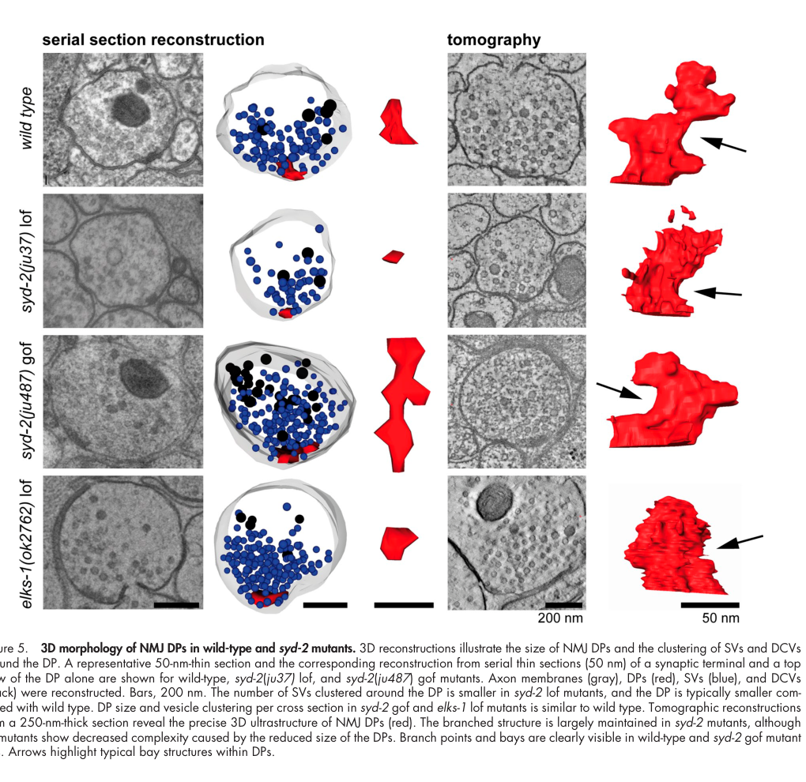

## Question

# Gene Research for Functional Annotation

## ⚠️ CRITICAL: Gene/Protein Identification Context

**BEFORE YOU BEGIN RESEARCH:** You MUST verify you are researching the CORRECT gene/protein. Gene symbols can be ambiguous, especially for less well-characterized genes from non-model organisms.

### Target Gene/Protein Identity (from UniProt):
- **UniProt Accession:** O44490
- **Protein Description:** SubName: Full=ELKS/RAB6-interacting/CAST family member 2 {ECO:0000313|EMBL:CCD71138.1};
- **Gene Information:** Name=elks-1 {ECO:0000313|EMBL:CCD71138.1, ECO:0000313|WormBase:F42A6.9}; ORFNames=CELE_F42A6.9 {ECO:0000313|EMBL:CCD71138.1}, F42A6.9 {ECO:0000313|WormBase:F42A6.9};
- **Organism (full):** Caenorhabditis elegans.
- **Protein Family:** Not specified in UniProt
- **Key Domains:** ELKS/CAST. (IPR019323); Cast (PF10174)

### MANDATORY VERIFICATION STEPS:

1. **Check if the gene symbol "elks-1" matches the protein description above**
2. **Verify the organism is correct:** Caenorhabditis elegans.
3. **Check if protein family/domains align with what you find in literature**
4. **If you find literature for a DIFFERENT gene with the same or similar symbol, STOP**

### If Gene Symbol is Ambiguous or You Cannot Find Relevant Literature:

**DO NOT PROCEED WITH RESEARCH ON A DIFFERENT GENE.** Instead:
- State clearly: "The gene symbol 'elks-1' is ambiguous or literature is limited for this specific protein"
- Explain what you found (e.g., "Found extensive literature on a different gene with the same symbol in a different organism")
- Describe the protein based ONLY on the UniProt information provided above
- Suggest that the protein function can be inferred from domain/family information

### Research Target:

Please provide a comprehensive research report on the gene **elks-1** (gene ID: elks-1, UniProt: O44490) in worm.

The research report should be a detailed narrative explaining the function, biological processes, and localization of the gene product. Citations should be given for all claims.

You should prioritize authoritative reviews and primary scientific literature when conducting research. You can supplement
this with annotations you find in gene/protein databases, but these can be outdated or inaccurate.

We are specifically interested in the primary function of the gene - for enzymes, what reaction is catalyzed, and what is the substrate specificity? For transporters, what is the substrate? For structural proteins or adapters, what is the broader structural role? For signaling molecules, what is the role in the pathway.

We are interested in where in or outside the cell the gene product carries out its function.

We are also interested in the signaling or biochemical pathways in which the gene functions. We are less interested in broad pleiotropic effects, except where these elucidate the precise role.

Include evidence where possible. We are interested in both experimental evidence as well as inference from structure, evolution, or bioinformatic analysis. Precise studies should be prioritized over high-throughput, where available.

## Output

Question: You are an expert researcher providing comprehensive, well-cited information.

Provide detailed information focusing on:
1. Key concepts and definitions with current understanding
2. Recent developments and latest research (prioritize 2023-2024 sources)
3. Current applications and real-world implementations
4. Expert opinions and analysis from authoritative sources
5. Relevant statistics and data from recent studies

Format as a comprehensive research report with proper citations. Include URLs and publication dates where available.
Always prioritize recent, authoritative sources and provide specific citations for all major claims.

# Gene Research for Functional Annotation

## ⚠️ CRITICAL: Gene/Protein Identification Context

**BEFORE YOU BEGIN RESEARCH:** You MUST verify you are researching the CORRECT gene/protein. Gene symbols can be ambiguous, especially for less well-characterized genes from non-model organisms.

### Target Gene/Protein Identity (from UniProt):
- **UniProt Accession:** O44490
- **Protein Description:** SubName: Full=ELKS/RAB6-interacting/CAST family member 2 {ECO:0000313|EMBL:CCD71138.1};
- **Gene Information:** Name=elks-1 {ECO:0000313|EMBL:CCD71138.1, ECO:0000313|WormBase:F42A6.9}; ORFNames=CELE_F42A6.9 {ECO:0000313|EMBL:CCD71138.1}, F42A6.9 {ECO:0000313|WormBase:F42A6.9};
- **Organism (full):** Caenorhabditis elegans.
- **Protein Family:** Not specified in UniProt
- **Key Domains:** ELKS/CAST. (IPR019323); Cast (PF10174)

### MANDATORY VERIFICATION STEPS:

1. **Check if the gene symbol "elks-1" matches the protein description above**
2. **Verify the organism is correct:** Caenorhabditis elegans.
3. **Check if protein family/domains align with what you find in literature**
4. **If you find literature for a DIFFERENT gene with the same or similar symbol, STOP**

### If Gene Symbol is Ambiguous or You Cannot Find Relevant Literature:

**DO NOT PROCEED WITH RESEARCH ON A DIFFERENT GENE.** Instead:
- State clearly: "The gene symbol 'elks-1' is ambiguous or literature is limited for this specific protein"
- Explain what you found (e.g., "Found extensive literature on a different gene with the same symbol in a different organism")
- Describe the protein based ONLY on the UniProt information provided above
- Suggest that the protein function can be inferred from domain/family information

### Research Target:

Please provide a comprehensive research report on the gene **elks-1** (gene ID: elks-1, UniProt: O44490) in worm.

The research report should be a detailed narrative explaining the function, biological processes, and localization of the gene product. Citations should be given for all claims.

You should prioritize authoritative reviews and primary scientific literature when conducting research. You can supplement
this with annotations you find in gene/protein databases, but these can be outdated or inaccurate.

We are specifically interested in the primary function of the gene - for enzymes, what reaction is catalyzed, and what is the substrate specificity? For transporters, what is the substrate? For structural proteins or adapters, what is the broader structural role? For signaling molecules, what is the role in the pathway.

We are interested in where in or outside the cell the gene product carries out its function.

We are also interested in the signaling or biochemical pathways in which the gene functions. We are less interested in broad pleiotropic effects, except where these elucidate the precise role.

Include evidence where possible. We are interested in both experimental evidence as well as inference from structure, evolution, or bioinformatic analysis. Precise studies should be prioritized over high-throughput, where available.

# Functional annotation report: *C. elegans elks-1* / ELKS-1

## Executive conclusion

The requested identity is internally consistent: **UniProt O44490 corresponds to the *Caenorhabditis elegans* locus *elks-1* (F42A6.9)**, encoding an ELKS/CAST/ERC-family protein. Worm studies identify it as the ortholog of mammalian ERC2/ELKS and place it in the conserved presynaptic cytomatrix family; this agrees with the supplied ELKS/CAST (InterPro IPR019323) and Cast (Pfam PF10174) annotations. No conflicting literature on a different “ELKS-1” gene was used. (artan2021interactomeanalysisof pages 4-6, hendi2019intrinsicandextrinsic pages 3-4)

**Primary functional annotation:** ELKS-1 is a large, nonenzymatic, coiled-coil-rich **presynaptic active-zone scaffold/adaptor**. It helps assemble and organize the electron-dense active-zone cytomatrix, particularly through SYD-2/Liprin-α-dependent recruitment and condensate formation. It also makes a partly redundant contribution to concentrating UNC-2/CaV2 calcium channels near release sites. It is neither an enzyme nor a transporter; consequently, there is no catalytic reaction or transported substrate to annotate. (mcdonald2020assemblyofsynaptic pages 3-3, kittelmann2013liprinαsyd2determinesthe pages 1-2, oh2021unc2cav2channel pages 8-11, oh2021unc2cav2channel pages 1-5)

## 1. Identity, family, and structural interpretation

ELKS-1 belongs to the ELKS/CAST/ERC active-zone protein family. The name reflects the historically convergent identification of vertebrate homologs as ELKS, CAST, Rab6-interacting proteins, and ERC proteins. In *C. elegans*, endogenous-locus and orthology studies specifically associate *elks-1/F42A6.9* with the mammalian ERC2/ELKS branch. (artan2021interactomeanalysisof pages 4-6)

The supplied domain assignments—ELKS/CAST and Cast—are consistent with the literature’s treatment of ELKS-1 as an elongated, interaction-rich scaffold. Such proteins rely principally on coiled-coil and low-complexity/multivalent regions rather than catalytic domains. Functional experiments support this interpretation: full-length ELKS-1 binds SYD-2/Liprin-α, participates in condensates, and organizes other active-zone components. There is no evidence that O44490 possesses enzymatic activity, binds a biochemical substrate in a catalytic sense, or transports a solute. (mcdonald2020assemblyofsynaptic pages 3-3, kittelmann2013liprinαsyd2determinesthe pages 6-8)

## 2. Cellular and subcellular localization

ELKS-1 is expressed broadly in the nervous system and is concentrated in **synapse-rich regions**, including the nerve ring. Endogenous CRISPR-tagged ELKS-1 forms puncta at presynaptic active zones, placing its site of action on the cytoplasmic face of the presynaptic membrane within the cytomatrix/dense projection. It is therefore an intracellular presynaptic protein—not an extracellular adhesion molecule, membrane transporter, or synaptic-vesicle cargo protein. (artan2021interactomeanalysisof pages 4-6, oh2021unc2cav2channel pages 8-11)

In developing dopaminergic axons, live imaging detects GFP-tagged ELKS-1 in growing axons and near growth cones, followed by rapid coalescence into nascent presynaptic sites. ELKS-1 localization is severely disrupted in hypomorphic *unc-104/KIF1A* mutants. Because the disruption is stronger than in *syd-2* mutants, UNC-104-dependent axonal transport appears necessary for both SYD-2-dependent delivery and the residual SYD-2-independent localization of ELKS-1. This does not prove that ELKS-1 binds UNC-104 directly; ELKS-1 may travel in multiprotein active-zone precursor assemblies. (lipton2018axonaltransportand pages 46-48, lipton2018axonaltransportand pages 49-50, oh2021unc2cav2channel pages 8-11)

## 3. Molecular role in active-zone assembly

### 3.1 Interaction with SYD-2/Liprin-α

The best-defined molecular relationship is with SYD-2/Liprin-α. Pull-down, co-immunoprecipitation, and yeast two-hybrid experiments support binding between ELKS-1 and the N-terminal/LH1 region of SYD-2. The R184C gain-of-function form of SYD-2 recruits ELKS-1 more strongly than wild-type SYD-2, linking increased SYD-2 oligomerization to enhanced ELKS-1 incorporation into active zones. (kittelmann2013liprinαsyd2determinesthe pages 6-8, kittelmann2013liprinαsyd2determinesthe pages 8-9)

Electron microscopy and tomography show that SYD-2 controls the dimensions and higher-order polymerization of presynaptic dense projections. Loss of SYD-2 produces fewer, smaller projections with fewer nearby docked vesicles, whereas SYD-2 gain of function produces elongated projections. Critically, the gain-of-function enlargement requires ELKS-1: removing *elks-1* from the SYD-2 gain-of-function background returns projection length toward wild type. Thus, ELKS-1 is an effector or building component recruited by activated/oligomerized SYD-2, rather than the sole initiator of active-zone formation. (kittelmann2013liprinαsyd2determinesthe pages 1-2, kittelmann2013liprinαsyd2determinesthe pages 6-8, kittelmann2013liprinαsyd2determinesthe pages 8-9)

The ultrastructural evidence also explains the deceptively mild *elks-1* single-mutant phenotype. Two independent null alleles had dense-projection organization, vesicle docking, and basal transmission broadly similar to wild type; mean projection length in one null background was **198.2 ± 8.9 nm**. The inspected three-dimensional reconstruction likewise shows an *elks-1* loss-of-function terminal with approximately wild-type projection size and vesicle clustering. (kittelmann2013liprinαsyd2determinesthe pages 6-8, kittelmann2013liprinαsyd2determinesthe media a6c252ca)

By comparison, SYD-2 gain of function increased docked vesicles to **11.3 ± 1.6 per synapse** versus **7.1 ± 0.6** in wild type (*P*=0.01); the associated projection elongation is ELKS-1-dependent. These measurements should not be misread as an *elks-1* single-mutant phenotype—they quantify the SYD-2-driven structural state in which ELKS-1 becomes necessary. (kittelmann2013liprinαsyd2determinesthe pages 6-8, kittelmann2013liprinαsyd2determinesthe pages 8-9)

### 3.2 Condensate/phase-separation mechanism

Purified full-length ELKS-1 and SYD-2 can form condensates, and in vivo work supports liquid–liquid phase separation during early active-zone assembly. An engineered ELKS-1 phase-separation-defective protein still localized to synapses and did not erase detectable presynaptic densities, but active-zone assembly was impaired and fewer synaptic vesicles were docked. The mechanistic conclusion is therefore specific: **ELKS-1 condensation is important for the material properties and efficient maturation of the active zone, but not strictly required for ELKS-1 targeting or for formation of any density at all**. (mcdonald2020assemblyofsynaptic pages 3-3, oh2021unc2cav2channel pages 11-14)

This reconciles two observations: complete *elks-1* loss can be buffered by other active-zone scaffolds, while altering the biophysical behavior of ELKS-1 within an assembling scaffold can expose defects in vesicle incorporation and docking.

## 4. Role in CaV2-channel organization and neurotransmitter release

UNC-2 is the worm CaV2-family voltage-gated calcium channel that supplies the local calcium signal for synaptic-vesicle exocytosis. Endogenous tagging and quantitative live imaging show that UNC-10/RIM and SYD-2 are the dominant organizers of UNC-2 clusters. In contrast, *elks-1* loss alone does not significantly reduce UNC-2 puncta, consistent with the mild basal phenotype. (oh2021unc2cav2channel pages 14-17, oh2021unc2cav2channel pages 1-5)

ELKS-1’s contribution becomes apparent in sensitized backgrounds:

- In *elks-1;syd-2* double mutants, residual UNC-2 clustering is reduced beyond that in *syd-2* alone, indicating an ELKS-1-dependent, SYD-2-independent route.
- Removing ELKS-1 alone did not worsen *unc-10* mutants, but eliminating ELKS-1 together with RIMB-1 and UNC-10 further reduced UNC-2 cluster number and intensity.
- Conversely, UNC-2 clusters remain detectable even after removal of UNC-10, RIMB-1, and ELKS-1, showing that SYD-2 or other proteins can supply additional recruitment mechanisms. (oh2021unc2cav2channel pages 8-11)

Accordingly, ELKS-1 is best annotated as a **secondary/redundant organizer of presynaptic CaV2 localization**, embedded in a resilient multivalent network. A direct physical ELKS-1–UNC-2 interaction is plausible from homologous systems but has not been demonstrated directly in the worm evidence reviewed here. UNC-10/RIM remains the more consequential channel-positioning factor. (oh2021unc2cav2channel pages 11-14, oh2021unc2cav2channel pages 8-11)

Under matched imaging conditions for endogenously GFP-tagged proteins, ELKS-1 and SYD-2 puncta had approximately **twice** the fluorescence intensity of UNC-2 and UNC-10, whereas RIMB-1 was approximately fourfold brighter. These are useful relative-abundance estimates, but fluorophore intensity is not an absolute stoichiometric measurement and may also reflect oligomerization or differences in local molecular organization. (oh2021unc2cav2channel pages 8-11, oh2021unc2cav2channel pages 14-17)

## 5. Interaction network and pathway placement

ELKS-1 acts within the presynaptic active-zone assembly and neurotransmitter-release pathway:

1. Synaptic patterning and adhesion cues establish where a presynaptic site will form.
2. SYD-1 and SYD-2/Liprin-α organize an early scaffold.
3. SYD-2 recruits ELKS-1 and other cytomatrix components; their multivalent interactions and condensate behavior promote active-zone maturation.
4. UNC-10/RIM, RIMB-1/RIM-BP, CLA-1/Clarinet, and ELKS-1 collectively organize UNC-2/CaV2 and release machinery near docked vesicles.
5. Local Ca²⁺ entry then couples depolarization to synaptic-vesicle fusion. (hendi2019intrinsicandextrinsic pages 3-4, oh2021unc2cav2channel pages 8-11, oh2021unc2cav2channel pages 1-5)

Endogenous ELKS-1–TurboID proximity labeling enriched UNC-10/RIM, SYD-1, SYD-2/Liprin-α, and SAD-family proteins from intact worms. This provides strong in vivo evidence for the active-zone molecular neighborhood. It does not establish that every enriched protein binds ELKS-1 directly; proximity proteomics reports spatial proximity and shared complexes. (artan2021interactomeanalysisof pages 4-6)

Recent analysis of CLA-1 illustrates the same network architecture. CLA-1 is important for RIMB-1 localization, while SYD-2 and ELKS-1 may provide alternative routes that retain RIMB-1 at active zones when CLA-1 and UNC-10 are absent. The ELKS-1 role in this specific compensation is a mechanistic proposal rather than a demonstrated direct interaction. (krout2023c.elegansclarinetcla1 pages 5-7, krout2023c.elegansclarinetcla1 pages 3-5)

## 6. Recent developments, 2023–2024

### 6.1 Activity-regulated transcription of *elks-1*—2024

A major 2024 advance placed *elks-1* within a transcriptional program for dopaminergic synaptogenesis. Whole-animal ChIP-seq and neuron-specific NanoDam indicated occupancy of *elks-1* regulatory DNA by EGL-43/MECOM. Genome editing of a candidate upstream EGL-43 motif from **5′-AAAAGATAA-3′ to 5′-AACCCCCCC-3′** reduced *elks-1* RNA and ELKS-1 fluorescence in PDE dopaminergic axons. The motif mutation had a weaker effect than EGL-43 depletion, implying additional cis-elements, indirect targets, or combinatorial regulation. This connects activity-responsive transcription to the abundance of a core active-zone scaffold. Published August 2024 in *Nature Neuroscience*: https://doi.org/10.1038/s41593-024-01728-x. (yee2024anactivityregulatedtranscriptional pages 5-6)

### 6.2 Active-zone hierarchy—2023

A 2023 study of CLA-1/Clarinet used endogenous ELKS-1 as an active-zone integrity marker while resolving the hierarchy among CLA-1, RIMB-1, UNC-10/RIM, and UNC-2/CaV2. Its main ELKS-1 implication is that the worm active zone contains multiple compensatory localization routes, rather than a simple linear pathway. Published May 2023 in *PNAS*: https://doi.org/10.1073/pnas.2220856120. (krout2023c.elegansclarinetcla1 pages 5-7, krout2023c.elegansclarinetcla1 pages 3-5)

### 6.3 Presynaptic CaV2 homeostasis—2024

A 2024 *PNAS* study showed that UNC-2 abundance is inversely coupled to synaptic-vesicle exocytosis: impaired exocytosis elevates UNC-2 levels, whereas sustained optogenetic activation for more than two hours reduces channel abundance without reducing punctum number. ELKS-1 was used as an active-zone comparator rather than shown to mediate this homeostatic feedback. The work expands the functional context in which ELKS-1-marked active zones regulate channel abundance, but it should not be cited as proof that ELKS-1 itself senses activity. Published August 2024: https://doi.org/10.1073/pnas.2404969121. (xiong2024presynapticneuronsselftune pages 3-4, xiong2024presynapticneuronsselftune pages 4-5)

## 7. Current applications and real-world implementation

ELKS-1 currently has **research applications, not clinical or therapeutic applications**:

- **Active-zone marker:** Endogenous fluorescent ELKS-1 puncta permit quantitative measurement of synapse number, placement, and maturation in transparent living worms.
- **In vivo proximity proteomics:** ELKS-1::TurboID has been used to isolate the molecular neighborhood of native synapses from intact animals.
- **Mechanistic genetics:** *elks-1* null and engineered phase-separation alleles expose redundancy and the material requirements of active-zone assembly.
- **Transport and development assays:** GFP::ELKS-1 enables time-resolved imaging of active-zone material behind growing axons and testing of UNC-104/KIF1A-dependent transport.
- **Cell-selective endogenous imaging:** A 2024 split-fluorophore preprint generated endogenous *elks-1* alleles carrying tandem GFP₁₁ and/or wrmScarlet₁₁ tags, permitting fluorescence complementation only in selected neuron classes. Preprint posted July 2024: https://doi.org/10.1101/2024.07.29.605690.

These tools make ELKS-1 particularly useful for dissecting active-zone assembly in vivo without relying solely on overexpressed transgenes. Endogenous tagging is important because overexpression can mask defects supported by redundant, lower-affinity interactions. (artan2021interactomeanalysisof pages 4-6, oh2021unc2cav2channel pages 11-14, oh2021unc2cav2channel pages 14-17)

The evidence is summarized below.

| Evidence area | Worm-specific finding | Evidence type/model | Interpretation/caveat | Key source with year and DOI URL |
|---|---|---|---|---|
| Identity/family | *elks-1* encodes a *C. elegans* ELKS/CAST/ERC-family protein and is the worm ortholog of mammalian ERC2/ELKS; the target is *elks-1/F42A6.9* (UniProt O44490), not a similarly named non-worm gene. | Endogenous locus annotation, orthology, and worm synaptic-protein studies | Consistent with the supplied ELKS/CAST (IPR019323) and Cast (PF10174) domain annotations. ELKS-1 is a scaffold, not an enzyme or transporter; mammalian phenotypes cannot automatically be assigned to the worm protein. | Artan et al., 2021, [10.1016/j.jbc.2021.101094](https://doi.org/10.1016/j.jbc.2021.101094); Hendi et al., 2019, [10.1007/s00018-019-03109-1](https://doi.org/10.1007/s00018-019-03109-1) (artan2021interactomeanalysisof pages 4-6, hendi2019intrinsicandextrinsic pages 3-4) |
| Presynaptic localization | Endogenously tagged ELKS-1 is enriched in the nerve ring and other synapse-rich regions and forms puncta at presynaptic active zones; it is used experimentally as an active-zone marker. | CRISPR knock-in fluorescence, live-animal imaging, and synaptic proximity labeling | Strong evidence for intracellular localization at the presynaptic cytomatrix/dense projection rather than on synaptic vesicles or outside the cell. | Artan et al., 2021, [10.1016/j.jbc.2021.101094](https://doi.org/10.1016/j.jbc.2021.101094); Oh et al., 2021, [10.1523/JNEUROSCI.2371-20.2021](https://doi.org/10.1523/JNEUROSCI.2371-20.2021) (artan2021interactomeanalysisof pages 4-6, oh2021unc2cav2channel pages 8-11, oh2021unc2cav2channel pages 1-5) |
| SYD-2 interaction and dense-projection assembly | ELKS-1 binds SYD-2/Liprin-α; the SYD-2 R184C gain-of-function protein recruits ELKS-1 more strongly through its LH1-containing N terminus. ELKS-1 is required for SYD-2 gain-of-function to elongate dense projections, whereas *elks-1* null synapses alone have near-wild-type dense-projection length (198.2 ± 8.9 nm), vesicle docking, and transmission. | Null and double-mutant genetics, high-pressure-freezing EM/tomography, pull-down, co-immunoprecipitation, and yeast two-hybrid assays | Directly supports a structural adaptor role in SYD-2-driven dense-projection polymerization. The mild single-null phenotype shows that ELKS-1 is conditionally important and buffered by redundant active-zone interactions. | Kittelmann et al., 2013, [10.1083/jcb.201302022](https://doi.org/10.1083/jcb.201302022) (kittelmann2013liprinαsyd2determinesthe pages 1-2, kittelmann2013liprinαsyd2determinesthe pages 6-8, kittelmann2013liprinαsyd2determinesthe pages 8-9, kittelmann2013liprinαsyd2determinesthe media a6c252ca) |
| Phase separation | Full-length ELKS-1 and SYD-2 form condensates; an ELKS-1 phase-separation-defective construct can still localize and leave detectable presynaptic densities but impairs active-zone assembly and reduces docked vesicles. | Purified-protein condensate and FRAP assays combined with engineered worm mutants and ultrastructure | Indicates that condensate fluidity contributes to efficient incorporation and organization of active-zone material rather than merely targeting ELKS-1 to synapses. | McDonald et al., 2020, [10.1038/s41586-020-2942-0](https://doi.org/10.1038/s41586-020-2942-0) (mcdonald2020assemblyofsynaptic pages 3-3, oh2021unc2cav2channel pages 11-14) |
| UNC-2/CaV2 localization and redundancy | *elks-1* loss alone does not significantly alter endogenous UNC-2 clusters, but ELKS-1 contributes when other scaffolds are absent: UNC-2 is further reduced in *elks-1;syd-2* animals and in *unc-10;rimb-1;elks-1* triple mutants. ELKS-1 puncta have about twice the GFP intensity of UNC-2 or UNC-10 under matched imaging conditions. | Endogenous CRISPR-tagged proteins; single, double, and triple mutants; quantitative live imaging of dorsal-cord synapses | ELKS-1 is a secondary or redundant organizer of CaV2-channel clustering, not the dominant tether. A direct worm ELKS-1–UNC-2 physical interaction remains possible but unproven; UNC-10/RIM and SYD-2 have larger effects. Relative fluorescence is an abundance proxy, not an absolute molecular stoichiometry. | Oh et al., 2021, [10.1523/JNEUROSCI.2371-20.2021](https://doi.org/10.1523/JNEUROSCI.2371-20.2021) (oh2021unc2cav2channel pages 8-11, oh2021unc2cav2channel pages 1-5) |
| Axonal transport via UNC-104 | Presynaptic localization of ELKS-1 is strongly disrupted in hypomorphic *unc-104/KIF1A* mutants; ELKS-1 puncta are fewer than in *syd-2* mutants, indicating that both SYD-2-dependent and residual SYD-2-independent ELKS-1 delivery require UNC-104. | Live imaging of endogenous or fluorescently tagged active-zone proteins in transport mutants | Supports transport of ELKS-1-containing active-zone material into axons, but does not establish direct binding between ELKS-1 and UNC-104 or prove that ELKS-1 is carried as an isolated cargo. | Lipton et al., 2018, [10.1016/j.celrep.2018.07.096](https://doi.org/10.1016/j.celrep.2018.07.096); Oh et al., 2021, [10.1523/JNEUROSCI.2371-20.2021](https://doi.org/10.1523/JNEUROSCI.2371-20.2021) (lipton2018axonaltransportand pages 46-48, lipton2018axonaltransportand pages 49-50, oh2021unc2cav2channel pages 8-11) |
| Endogenous proximity proteomics | CRISPR-tagged ELKS-1::TurboID–mNeonGreen enriched established presynaptic proteins, including UNC-10/RIM, SYD-1, SYD-2/Liprin-α, and SAD-family proteins, from intact worms. | Endogenous TurboID proximity labeling, streptavidin purification, and mass spectrometry | Confirms ELKS-1’s molecular neighborhood in vivo. Proximity labeling demonstrates nanoscale proximity, not necessarily direct binary binding; whole-animal western blots did not show a strong global increase in biotinylation. | Artan et al., 2021, [10.1016/j.jbc.2021.101094](https://doi.org/10.1016/j.jbc.2021.101094) (artan2021interactomeanalysisof pages 4-6) |
| EGL-43 transcriptional regulation (2024) | EGL-43/MECOM occupies *elks-1* regulatory regions. Changing a candidate upstream EGL-43 motif from 5′-AAAAGATAA-3′ to 5′-AACCCCCCC-3′ reduced *elks-1* transcript abundance and ELKS-1 fluorescence in PDE dopaminergic axons. | Whole-animal ChIP-seq, dopaminergic-neuron NanoDam, cis-regulatory genome editing, transcript measurement, and endogenous protein imaging | Directly places *elks-1* in an activity-regulated synaptogenesis program. The motif mutation had a weaker effect than EGL-43 depletion, implying additional binding sites, indirect targets, or combinatorial regulation. | Yee et al., 2024, [10.1038/s41593-024-01728-x](https://doi.org/10.1038/s41593-024-01728-x) (yee2024anactivityregulatedtranscriptional pages 5-6) |
| 2023–2024 applications | ELKS-1 serves as an endogenous reference marker for mapping active-zone hierarchy, testing CLA-1/RIMB-1 relationships, measuring CaV2 homeostasis, and visualizing cell-specific synapses. A 2024 split-fluorophore toolkit introduced tandem GFP₁₁/wrmScarlet₁₁ tags at the endogenous *elks-1* locus for neuron-specific complementation. | CRISPR endogenous tagging, quantitative microscopy, genetic epistasis, electrophysiology, optogenetics, and split-fluorescent-protein engineering | These are research implementations rather than clinical applications. In the 2023 CLA-1 study, ELKS-1 mainly served as an active-zone integrity marker; the 2024 CaV2 study used ELKS-1 as an abundance comparator, so neither by itself establishes a new ELKS-1-specific mechanism. | Krout et al., 2023, [10.1073/pnas.2220856120](https://doi.org/10.1073/pnas.2220856120); Xiong et al., 2024, [10.1073/pnas.2404969121](https://doi.org/10.1073/pnas.2404969121); Kurashina et al., 2024 preprint, [10.1101/2024.07.29.605690](https://doi.org/10.1101/2024.07.29.605690) (xiong2024presynapticneuronsselftune pages 3-4, krout2023c.elegansclarinetcla1 pages 5-7, krout2023c.elegansclarinetcla1 pages 3-5) |

*Table: This table integrates direct worm-specific evidence for ELKS-1 identity, localization, structural and channel-organizing roles, regulation, and experimental uses. It separates demonstrated mechanisms from redundancy-based or cross-species inference.*

## 8. Expert interpretation and confidence assessment

The collective evidence favors a **distributed-scaffold model**. ELKS-1 is a genuine structural component of the active zone, but not an indispensable solitary organizer under standard conditions. Its mild null phenotype should not be interpreted as lack of function. Rather, biochemical binding, ELKS-dependent SYD-2 gain-of-function remodeling, condensate-defective phenotypes, and synthetic channel-localization defects show that its role is buffered by UNC-10/RIM, SYD-2/Liprin-α, RIMB-1, CLA-1, and other multivalent partners. This interpretation is consistent with the general observation that deleting one active-zone component often produces modest effects, whereas compound perturbations reveal severe organizational defects. (oh2021unc2cav2channel pages 11-14, oh2021unc2cav2channel pages 8-11, oh2021unc2cav2channel pages 1-5)

### Evidence confidence

- **High confidence:** identity as worm ELKS/CAST/ERC protein; presynaptic active-zone localization; direct functional relationship with SYD-2; participation in dense-projection assembly; redundant contribution to UNC-2 clustering.
- **Moderate-to-high confidence:** condensate material properties are required for efficient active-zone maturation and vesicle docking.
- **Moderate confidence:** UNC-104 transports ELKS-1-containing active-zone precursor material; direct motor–ELKS-1 binding is not established.
- **Unresolved:** absolute ELKS-1 molecular stoichiometry, a direct worm ELKS-1–UNC-2 interaction, neuron-type-specific requirements across the entire nervous system, and whether ELKS-1 itself participates in homeostatic sensing.

## 9. Cross-species caution

Mammalian ELKS proteins can support presynaptic calcium influx, and simultaneous ELKS1/ELKS2 removal in cultured inhibitory hippocampal neurons reduces release by about 50% and single-action-potential-triggered calcium influx by about 30%. Those results are valuable evolutionary context, but they are **not direct evidence for the phenotype of O44490 in *C. elegans***. Worm-specific annotation should remain centered on the strong structural, localization, phase-separation, and genetic-redundancy evidence summarized above. Mammalian study published September 2014: https://doi.org/10.1523/JNEUROSCI.0999-14.2014. (liu2014theactivezone pages 3-4)

References

1. (artan2021interactomeanalysisof pages 4-6): Murat Artan, Stephen Barratt, Sean M. Flynn, Farida Begum, Mark Skehel, Armel Nicolas, and Mario de Bono. Interactome analysis of caenorhabditis elegans synapses by turboid-based proximity labeling. Sep 2021. URL: https://doi.org/10.1016/j.jbc.2021.101094, doi:10.1016/j.jbc.2021.101094. This article has 80 citations and is from a domain leading peer-reviewed journal.

2. (hendi2019intrinsicandextrinsic pages 3-4): Ardalan Hendi, Mizuki Kurashina, and Kota Mizumoto. Intrinsic and extrinsic mechanisms of synapse formation and specificity in c. elegans. Cellular and Molecular Life Sciences, 76:2719-2738, Apr 2019. URL: https://doi.org/10.1007/s00018-019-03109-1, doi:10.1007/s00018-019-03109-1. This article has 30 citations and is from a domain leading peer-reviewed journal.

3. (mcdonald2020assemblyofsynaptic pages 3-3): Nathan A. McDonald, Richard D. Fetter, and Kang Shen. Assembly of synaptic active zones requires phase separation of scaffold molecules. Nature, 588:454-458, Nov 2020. URL: https://doi.org/10.1038/s41586-020-2942-0, doi:10.1038/s41586-020-2942-0. This article has 186 citations and is from a highest quality peer-reviewed journal.

4. (kittelmann2013liprinαsyd2determinesthe pages 1-2): Maike Kittelmann, Jan Hegermann, Alexandr Goncharov, Hidenori Taru, Mark H. Ellisman, Janet E. Richmond, Yishi Jin, and Stefan Eimer. Liprin-α/syd-2 determines the size of dense projections in presynaptic active zones in c. elegans. The Journal of Cell Biology, 203:849-863, Dec 2013. URL: https://doi.org/10.1083/jcb.201302022, doi:10.1083/jcb.201302022. This article has 89 citations.

5. (oh2021unc2cav2channel pages 8-11): Kelly H. Oh, Mia Krout, Janet E. Richmond, and Hongkyun Kim. Unc-2 cav2 channel localization at presynaptic active zones depends on unc-10/rim and syd-2/liprin-α in caenorhabditis elegans. The Journal of Neuroscience, 41:4782-4794, Jan 2021. URL: https://doi.org/10.1101/2021.01.27.428454, doi:10.1101/2021.01.27.428454. This article has 38 citations.

6. (oh2021unc2cav2channel pages 1-5): Kelly H. Oh, Mia Krout, Janet E. Richmond, and Hongkyun Kim. Unc-2 cav2 channel localization at presynaptic active zones depends on unc-10/rim and syd-2/liprin-α in caenorhabditis elegans. The Journal of Neuroscience, 41:4782-4794, Jan 2021. URL: https://doi.org/10.1101/2021.01.27.428454, doi:10.1101/2021.01.27.428454. This article has 38 citations.

7. (kittelmann2013liprinαsyd2determinesthe pages 6-8): Maike Kittelmann, Jan Hegermann, Alexandr Goncharov, Hidenori Taru, Mark H. Ellisman, Janet E. Richmond, Yishi Jin, and Stefan Eimer. Liprin-α/syd-2 determines the size of dense projections in presynaptic active zones in c. elegans. The Journal of Cell Biology, 203:849-863, Dec 2013. URL: https://doi.org/10.1083/jcb.201302022, doi:10.1083/jcb.201302022. This article has 89 citations.

8. (lipton2018axonaltransportand pages 46-48): David M. Lipton, Celine I. Maeder, and Kang Shen. Axonal transport and active zone proteins regulate volume transmitting dopaminergic synapse formation. bioRxiv, Mar 2018. URL: https://doi.org/10.1101/284042, doi:10.1101/284042. This article has 2 citations.

9. (lipton2018axonaltransportand pages 49-50): David M. Lipton, Celine I. Maeder, and Kang Shen. Axonal transport and active zone proteins regulate volume transmitting dopaminergic synapse formation. bioRxiv, Mar 2018. URL: https://doi.org/10.1101/284042, doi:10.1101/284042. This article has 2 citations.

10. (kittelmann2013liprinαsyd2determinesthe pages 8-9): Maike Kittelmann, Jan Hegermann, Alexandr Goncharov, Hidenori Taru, Mark H. Ellisman, Janet E. Richmond, Yishi Jin, and Stefan Eimer. Liprin-α/syd-2 determines the size of dense projections in presynaptic active zones in c. elegans. The Journal of Cell Biology, 203:849-863, Dec 2013. URL: https://doi.org/10.1083/jcb.201302022, doi:10.1083/jcb.201302022. This article has 89 citations.

11. (kittelmann2013liprinαsyd2determinesthe media a6c252ca): Maike Kittelmann, Jan Hegermann, Alexandr Goncharov, Hidenori Taru, Mark H. Ellisman, Janet E. Richmond, Yishi Jin, and Stefan Eimer. Liprin-α/syd-2 determines the size of dense projections in presynaptic active zones in c. elegans. The Journal of Cell Biology, 203:849-863, Dec 2013. URL: https://doi.org/10.1083/jcb.201302022, doi:10.1083/jcb.201302022. This article has 89 citations.

12. (oh2021unc2cav2channel pages 11-14): Kelly H. Oh, Mia Krout, Janet E. Richmond, and Hongkyun Kim. Unc-2 cav2 channel localization at presynaptic active zones depends on unc-10/rim and syd-2/liprin-α in caenorhabditis elegans. The Journal of Neuroscience, 41:4782-4794, Jan 2021. URL: https://doi.org/10.1101/2021.01.27.428454, doi:10.1101/2021.01.27.428454. This article has 38 citations.

13. (oh2021unc2cav2channel pages 14-17): Kelly H. Oh, Mia Krout, Janet E. Richmond, and Hongkyun Kim. Unc-2 cav2 channel localization at presynaptic active zones depends on unc-10/rim and syd-2/liprin-α in caenorhabditis elegans. The Journal of Neuroscience, 41:4782-4794, Jan 2021. URL: https://doi.org/10.1101/2021.01.27.428454, doi:10.1101/2021.01.27.428454. This article has 38 citations.

14. (krout2023c.elegansclarinetcla1 pages 5-7): Mia Krout, Kelly H. Oh, Ame Xiong, Elisa B. Frankel, Peri T. Kurshan, Hongkyun Kim, and Janet E. Richmond. C. elegans clarinet/cla-1 recruits rimb-1/rim-binding protein and unc-13 to orchestrate presynaptic neurotransmitter release. Proceedings of the National Academy of Sciences of the United States of America, May 2023. URL: https://doi.org/10.1073/pnas.2220856120, doi:10.1073/pnas.2220856120. This article has 9 citations and is from a highest quality peer-reviewed journal.

15. (krout2023c.elegansclarinetcla1 pages 3-5): Mia Krout, Kelly H. Oh, Ame Xiong, Elisa B. Frankel, Peri T. Kurshan, Hongkyun Kim, and Janet E. Richmond. C. elegans clarinet/cla-1 recruits rimb-1/rim-binding protein and unc-13 to orchestrate presynaptic neurotransmitter release. Proceedings of the National Academy of Sciences of the United States of America, May 2023. URL: https://doi.org/10.1073/pnas.2220856120, doi:10.1073/pnas.2220856120. This article has 9 citations and is from a highest quality peer-reviewed journal.

16. (yee2024anactivityregulatedtranscriptional pages 5-6): Callista Yee, Yutong Xiao, Hongwen Chen, Anay R. Reddy, Bing Xu, Taylor N. Medwig-Kinney, Wan Zhang, Alan P. Boyle, Wendy A. Herbst, Yang Kevin Xiang, David Q. Matus, and Kang Shen. An activity-regulated transcriptional program directly drives synaptogenesis. Nature Neuroscience, 27:1695-1707, Aug 2024. URL: https://doi.org/10.1038/s41593-024-01728-x, doi:10.1038/s41593-024-01728-x. This article has 24 citations and is from a highest quality peer-reviewed journal.

17. (xiong2024presynapticneuronsselftune pages 3-4): Ame Xiong, Janet E. Richmond, and Hongkyun Kim. Presynaptic neurons self-tune by inversely coupling neurotransmitter release with the abundance of cav2 voltage-gated ca2+ channels. Proceedings of the National Academy of Sciences of the United States of America, Aug 2024. URL: https://doi.org/10.1073/pnas.2404969121, doi:10.1073/pnas.2404969121. This article has 5 citations and is from a highest quality peer-reviewed journal.

18. (xiong2024presynapticneuronsselftune pages 4-5): Ame Xiong, Janet E. Richmond, and Hongkyun Kim. Presynaptic neurons self-tune by inversely coupling neurotransmitter release with the abundance of cav2 voltage-gated ca2+ channels. Proceedings of the National Academy of Sciences of the United States of America, Aug 2024. URL: https://doi.org/10.1073/pnas.2404969121, doi:10.1073/pnas.2404969121. This article has 5 citations and is from a highest quality peer-reviewed journal.

19. (liu2014theactivezone pages 3-4): Changliang Liu, Lydia S. Bickford, Richard G. Held, Hajnalka Nyitrai, Thomas C. Südhof, and Pascal S. Kaeser. The active zone protein family elks supports ca2+ influx at nerve terminals of inhibitory hippocampal neurons. The Journal of Neuroscience, 34:12289-12303, Sep 2014. URL: https://doi.org/10.1523/jneurosci.0999-14.2014, doi:10.1523/jneurosci.0999-14.2014. This article has 84 citations.

## Artifacts

- [Edison artifact artifact-00](elks-1-deep-research-falcon_artifacts/artifact-00.md)

## Citations

1. artan2021interactomeanalysisof pages 4-6
2. yee2024anactivityregulatedtranscriptional pages 5-6
3. liu2014theactivezone pages 3-4
4. hendi2019intrinsicandextrinsic pages 3-4
5. mcdonald2020assemblyofsynaptic pages 3-3
6. lipton2018axonaltransportand pages 46-48
7. lipton2018axonaltransportand pages 49-50
8. xiong2024presynapticneuronsselftune pages 3-4
9. xiong2024presynapticneuronsselftune pages 4-5
10. 10.1016/j.jbc.2021.101094
11. 10.1007/s00018-019-03109-1
12. 10.1523/JNEUROSCI.2371-20.2021
13. 10.1083/jcb.201302022
14. 10.1038/s41586-020-2942-0
15. 10.1016/j.celrep.2018.07.096
16. 10.1038/s41593-024-01728-x
17. 10.1073/pnas.2220856120
18. 10.1073/pnas.2404969121
19. 10.1101/2024.07.29.605690
20. https://doi.org/10.1038/s41593-024-01728-x.
21. https://doi.org/10.1073/pnas.2220856120.
22. https://doi.org/10.1073/pnas.2404969121.
23. https://doi.org/10.1101/2024.07.29.605690.
24. https://doi.org/10.1016/j.jbc.2021.101094
25. https://doi.org/10.1007/s00018-019-03109-1
26. https://doi.org/10.1523/JNEUROSCI.2371-20.2021
27. https://doi.org/10.1083/jcb.201302022
28. https://doi.org/10.1038/s41586-020-2942-0
29. https://doi.org/10.1016/j.celrep.2018.07.096
30. https://doi.org/10.1038/s41593-024-01728-x
31. https://doi.org/10.1073/pnas.2220856120
32. https://doi.org/10.1073/pnas.2404969121
33. https://doi.org/10.1101/2024.07.29.605690
34. https://doi.org/10.1523/JNEUROSCI.0999-14.2014.
35. https://doi.org/10.1016/j.jbc.2021.101094,
36. https://doi.org/10.1007/s00018-019-03109-1,
37. https://doi.org/10.1038/s41586-020-2942-0,
38. https://doi.org/10.1083/jcb.201302022,
39. https://doi.org/10.1101/2021.01.27.428454,
40. https://doi.org/10.1101/284042,
41. https://doi.org/10.1073/pnas.2220856120,
42. https://doi.org/10.1038/s41593-024-01728-x,
43. https://doi.org/10.1073/pnas.2404969121,
44. https://doi.org/10.1523/jneurosci.0999-14.2014,