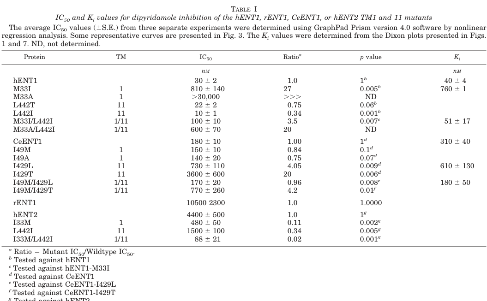

## Question

# Gene Research for Functional Annotation

## ⚠️ CRITICAL: Gene/Protein Identification Context

**BEFORE YOU BEGIN RESEARCH:** You MUST verify you are researching the CORRECT gene/protein. Gene symbols can be ambiguous, especially for less well-characterized genes from non-model organisms.

### Target Gene/Protein Identity (from UniProt):
- **UniProt Accession:** G5EDJ3
- **Protein Description:** SubName: Full=Equilibrative nucleoside transporter 1 {ECO:0000313|EMBL:AAM46663.1}; SubName: Full=Equilibrative nucleoside transporter 3 {ECO:0000313|EMBL:CAA92642.2};
- **Gene Information:** Name=ent-1 {ECO:0000313|EMBL:CAA92642.2, ECO:0000313|WormBase:ZK809.4a}; ORFNames=CELE_ZK809.4 {ECO:0000313|EMBL:CAA92642.2}, ZK809.4 {ECO:0000313|WormBase:ZK809.4a};
- **Organism (full):** Caenorhabditis elegans.
- **Protein Family:** Belongs to the SLC29A/ENT transporter (TC 2.A.57) family.
- **Key Domains:** Eqnu_transpt. (IPR002259); MFS_trans_sf. (IPR036259); Nucleoside_tran (PF01733)

### MANDATORY VERIFICATION STEPS:

1. **Check if the gene symbol "ent-1" matches the protein description above**
2. **Verify the organism is correct:** Caenorhabditis elegans.
3. **Check if protein family/domains align with what you find in literature**
4. **If you find literature for a DIFFERENT gene with the same or similar symbol, STOP**

### If Gene Symbol is Ambiguous or You Cannot Find Relevant Literature:

**DO NOT PROCEED WITH RESEARCH ON A DIFFERENT GENE.** Instead:
- State clearly: "The gene symbol 'ent-1' is ambiguous or literature is limited for this specific protein"
- Explain what you found (e.g., "Found extensive literature on a different gene with the same symbol in a different organism")
- Describe the protein based ONLY on the UniProt information provided above
- Suggest that the protein function can be inferred from domain/family information

### Research Target:

Please provide a comprehensive research report on the gene **ent-1** (gene ID: ent-1, UniProt: G5EDJ3) in worm.

The research report should be a detailed narrative explaining the function, biological processes, and localization of the gene product. Citations should be given for all claims.

You should prioritize authoritative reviews and primary scientific literature when conducting research. You can supplement
this with annotations you find in gene/protein databases, but these can be outdated or inaccurate.

We are specifically interested in the primary function of the gene - for enzymes, what reaction is catalyzed, and what is the substrate specificity? For transporters, what is the substrate? For structural proteins or adapters, what is the broader structural role? For signaling molecules, what is the role in the pathway.

We are interested in where in or outside the cell the gene product carries out its function.

We are also interested in the signaling or biochemical pathways in which the gene functions. We are less interested in broad pleiotropic effects, except where these elucidate the precise role.

Include evidence where possible. We are interested in both experimental evidence as well as inference from structure, evolution, or bioinformatic analysis. Precise studies should be prioritized over high-throughput, where available.

## Output

Question: You are an expert researcher providing comprehensive, well-cited information.

Provide detailed information focusing on:
1. Key concepts and definitions with current understanding
2. Recent developments and latest research (prioritize 2023-2024 sources)
3. Current applications and real-world implementations
4. Expert opinions and analysis from authoritative sources
5. Relevant statistics and data from recent studies

Format as a comprehensive research report with proper citations. Include URLs and publication dates where available.
Always prioritize recent, authoritative sources and provide specific citations for all major claims.

# Gene Research for Functional Annotation

## ⚠️ CRITICAL: Gene/Protein Identification Context

**BEFORE YOU BEGIN RESEARCH:** You MUST verify you are researching the CORRECT gene/protein. Gene symbols can be ambiguous, especially for less well-characterized genes from non-model organisms.

### Target Gene/Protein Identity (from UniProt):
- **UniProt Accession:** G5EDJ3
- **Protein Description:** SubName: Full=Equilibrative nucleoside transporter 1 {ECO:0000313|EMBL:AAM46663.1}; SubName: Full=Equilibrative nucleoside transporter 3 {ECO:0000313|EMBL:CAA92642.2};
- **Gene Information:** Name=ent-1 {ECO:0000313|EMBL:CAA92642.2, ECO:0000313|WormBase:ZK809.4a}; ORFNames=CELE_ZK809.4 {ECO:0000313|EMBL:CAA92642.2}, ZK809.4 {ECO:0000313|WormBase:ZK809.4a};
- **Organism (full):** Caenorhabditis elegans.
- **Protein Family:** Belongs to the SLC29A/ENT transporter (TC 2.A.57) family.
- **Key Domains:** Eqnu_transpt. (IPR002259); MFS_trans_sf. (IPR036259); Nucleoside_tran (PF01733)

### MANDATORY VERIFICATION STEPS:

1. **Check if the gene symbol "ent-1" matches the protein description above**
2. **Verify the organism is correct:** Caenorhabditis elegans.
3. **Check if protein family/domains align with what you find in literature**
4. **If you find literature for a DIFFERENT gene with the same or similar symbol, STOP**

### If Gene Symbol is Ambiguous or You Cannot Find Relevant Literature:

**DO NOT PROCEED WITH RESEARCH ON A DIFFERENT GENE.** Instead:
- State clearly: "The gene symbol 'ent-1' is ambiguous or literature is limited for this specific protein"
- Explain what you found (e.g., "Found extensive literature on a different gene with the same symbol in a different organism")
- Describe the protein based ONLY on the UniProt information provided above
- Suggest that the protein function can be inferred from domain/family information

### Research Target:

Please provide a comprehensive research report on the gene **ent-1** (gene ID: ent-1, UniProt: G5EDJ3) in worm.

The research report should be a detailed narrative explaining the function, biological processes, and localization of the gene product. Citations should be given for all claims.

You should prioritize authoritative reviews and primary scientific literature when conducting research. You can supplement
this with annotations you find in gene/protein databases, but these can be outdated or inaccurate.

We are specifically interested in the primary function of the gene - for enzymes, what reaction is catalyzed, and what is the substrate specificity? For transporters, what is the substrate? For structural proteins or adapters, what is the broader structural role? For signaling molecules, what is the role in the pathway.

We are interested in where in or outside the cell the gene product carries out its function.

We are also interested in the signaling or biochemical pathways in which the gene functions. We are less interested in broad pleiotropic effects, except where these elucidate the precise role.

Include evidence where possible. We are interested in both experimental evidence as well as inference from structure, evolution, or bioinformatic analysis. Precise studies should be prioritized over high-throughput, where available.

## Research report: Functional annotation of *C. elegans* **ent-1** (UniProt **G5EDJ3**; CeENT1)

### 1) Target verification (critical identity check)

The target protein specified by UniProt accession **G5EDJ3** is a *Caenorhabditis elegans* equilibrative nucleoside transporter (ENT) family member, referred to in primary literature as **ceENT-1 / CeENT1** and studied alongside **CeENT2** (a close paralog; **94% amino-acid identity**). The same *C. elegans* ENT-1 protein is explicitly referenced with UniProt **G5EDJ3** in a recent genetics/metabolism study, confirming that the present report concerns the intended gene/protein identity (not a similarly named gene from another organism). (guan2025crosstissuecoordinationbetween pages 12-14, visser2005identificationandmutational pages 2-3)

### 2) Key concepts and definitions (current understanding)

#### 2.1 Equilibrative nucleoside transporters (ENTs; SLC29 family)
ENTs are **polytopic membrane transporters** that mediate **sodium-independent** (i.e., equilibrative/facilitated diffusion) transport of nucleosides (and in some cases nucleobases) across biological membranes, supporting **nucleotide salvage** and the cellular uptake of nucleoside analog drugs. (guan2025crosstissuecoordinationbetween pages 2-5, visser2005identificationandmutational pages 1-2)

#### 2.2 ENT membrane architecture
ENT-family proteins share a conserved architecture with **11 transmembrane helices (TMs)** and characteristic loops (including a large cytosolic loop between TM6–TM7; and often a large glycosylated loop between TM1–TM2). This topology is described explicitly in ENT mechanistic work on CeENT1/hENT1. (visser2005identificationandmutational pages 1-2)

#### 2.3 Nucleotide salvage vs de novo synthesis in reproduction
Nucleotides required for DNA/RNA synthesis can be produced by **de novo pathways** or by **salvage pathways** that convert extracellular/internal nucleosides/nucleobases into nucleotides. The *C. elegans* germline has exceptionally high nucleotide demand during production of thousands of germ cells; thus, transporter-mediated nucleoside supply can become physiologically limiting. (guan2025crosstissuecoordinationbetween pages 10-12, guan2025crosstissuecoordinationbetween pages 1-2)

### 3) Primary molecular function of *C. elegans* ENT-1 (substrates and mechanism)

#### 3.1 Experimental transport substrates (direct functional assays)
A definitive, reductionist functional characterization of **CeENT1** was performed by heterologous expression in **yeast (*Saccharomyces cerevisiae*)** and transport assays using radiolabeled nucleosides. In these assays, CeENT1 mediates transport of **uridine** and **adenosine**, consistent with equilibrative nucleoside transport. (visser2005identificationandmutational pages 2-3)

#### 3.2 Inhibitor pharmacology (quantitative)
CeENT1-mediated nucleoside transport is inhibited by **dipyridamole** at nanomolar concentrations. Quantitatively, Visser et al. report CeENT1 dipyridamole inhibition parameters: **IC50 = 180 ± 10 nM** and **Ki = 310 ± 40 nM** (competitive inhibition is described for uridine and adenosine influx). (visser2005identificationandmutational pages 5-6, visser2005identificationandmutational pages 2-3)

CeENT proteins (CeENT1/2) are additionally described as **insensitive to NBMPR and dilazep** (pharmacologic distinction from mammalian ENT1). (visser2005identificationandmutational pages 2-3)

#### 3.3 Structure–function determinants (TM1/TM11)
Visser et al. used random mutagenesis and targeted mutational analysis to identify residues that control dipyridamole interactions. A key CeENT1 residue is **Ile429 (TM11)**; mutations markedly reduce sensitivity to dipyridamole (e.g., **I429L IC50 730 ± 110 nM; Ki 610 ± 130 nM**; **I429T IC50 3600 ± 600 nM**). These findings support a model where **TM1 and TM11 contribute to inhibitor interaction and transport properties**, providing mechanistic anchors for functional annotation beyond sequence similarity alone. (visser2005identificationandmutational pages 5-6, visser2005identificationandmutational pages 2-3)

#### 3.4 Physiologically prioritized substrate(s) in vivo (germline reproduction)
A 2025 *C. elegans* study focused on organismal physiology provides evidence that **purine nucleosides—especially guanosine—are physiologically critical substrates in an ENT-1/ENT-2 axis** supporting reproduction. In this work, combined ent perturbation reduced guanosine levels and altered purine metabolism gene expression, and **pseudocoelomic microinjection of 1 mM guanosine (but not 1 mM adenosine) partially rescued brood size** in ent-1KO;ent-2KD animals. This supports the interpretation that ENT-1 participates in **purine nucleoside supply to germline nucleotide pools**, with guanosine emerging as rate-limiting under double-transporter disruption. (guan2025crosstissuecoordinationbetween pages 10-12, guan2025crosstissuecoordinationbetween pages 1-2)

### 4) Cellular/tissue localization and directionality of transport

#### 4.1 Tissue expression
Endogenous CRISPR-tagged strains show **ENT-1 expression in the germline and intestine** (and ENT-2 expression in intestine and gonadal sheath cells). (guan2025crosstissuecoordinationbetween pages 5-7)

#### 4.2 Subcellular localization and transport directionality
Using fluorescent fusions and imaging, ENT-1 is positioned **at the plasma membrane in the germline**, while ENT-2 localizes predominantly to the **basolateral plasma membrane of the intestine**. These observations underpin a soma-to-germline transport model: **ENT-2 exports nucleosides from intestine to pseudocoelom**, and **ENT-1 mediates uptake from pseudocoelom to germline**. (guan2025crosstissuecoordinationbetween pages 10-12)

#### 4.3 Tissue-specific functional requirement
Auxin-inducible degradation (AID) experiments indicate ENT-1’s reproductive role is primarily **germline-autonomous** in the context of ENT-2 reduction: **germline-specific depletion** of ENT-1 with ent-2 knockdown produced a **~2-fold brood-size reduction**, whereas **intestine-specific depletion** of ENT-1 did not reduce brood size under the same conditions. (guan2025crosstissuecoordinationbetween pages 5-7)

### 5) Pathways and biological processes involving ent-1

#### 5.1 Purine metabolism and nucleotide homeostasis
Combined ENT perturbation (ent-1 and ent-2) is associated with transcriptional upregulation of **both de novo and salvage purine biosynthesis pathways** (but not pyrimidine pathways) and metabolite changes consistent with altered purine nucleoside balance (guanosine decreased; adenosine and inosine increased). These results connect ENT-1 function to **purine nucleotide homeostasis in germline physiology**. (guan2025crosstissuecoordinationbetween pages 10-12)

#### 5.2 Reproduction and development phenotypes
RNAi knockdown of ent-1 reduces brood size by **~9.8%** (and ent-2 knockdown by **~19.8%**) and alters daily progeny dynamics, extending reproductive duration. Single CRISPR knockout of ent-1 can appear near-wild-type due to compensatory induction of ent-2, but **double loss** of ent-1 and ent-2 causes severe phenotypes: in complete double knockouts, severe developmental delay/arrest and sterility were reported; in partial double loss-of-function models (ent-1KO;ent-2KD), brood size is drastically reduced (“close to being sterile”). (guan2025crosstissuecoordinationbetween pages 2-5, guan2025crosstissuecoordinationbetween pages 5-7)

### 6) Recent developments and latest research (prioritizing 2023–2024)

Because ent-1-specific mechanistic papers in 2023–2024 were not retrieved in this tool run, the most relevant 2023–2024 advances are mechanistic/structural ENT-family studies in other systems that refine interpretation of ENT transporter function and inhibitor interactions.

#### 6.1 2023: Cryo-EM structures and transport mechanism for an ENT-family transporter
Wang et al. (Nature Communications; **published March 2023**) solved cryo-EM structures of **PfENT1** (an ENT-family transporter) in apo and substrate/inhibitor-bound states, supporting an **11-TM pseudosymmetric fold** and a **rocker-switch alternating-access mechanism**. They identify **inosine as a primary substrate** and define binding-site interactions in the central cavity. While PfENT1 is from *Plasmodium* and shares low sequence identity with metazoan ENTs, the structural framework is highly informative for ENT-family mechanism (central cavity binding, alternating-access), which plausibly generalizes to *C. elegans* ENT-1 given shared 11-TM architecture. URL: https://doi.org/10.1038/s41467-023-37411-1 (wang2023structuralbasisof pages 1-2, wang2023structuralbasisof pages 2-4)

#### 6.2 2024: Structure-guided ENT1 inhibitor design and functional consequences
Wright et al. (Nature Communications; **published Dec 2024**) used structural data to redesign an **ENT1 inhibitor** and demonstrate a therapeutic concept: **ENT1 inhibition elevates extracellular adenosine and potentiates A1 receptor (A1R)-mediated analgesia**. They describe an **orthosteric substrate site in the central cavity** and additional “opportunistic” pockets that can be exploited for selectivity. While this work concerns human ENT1 pharmacology, it provides modern expert-level interpretation of ENT inhibition mechanisms and illustrates real-world applications of ENT biology (drug discovery). URL: https://doi.org/10.1038/s41467-024-54914-7 (wright2024designofan pages 1-2)

### 7) Current applications and real-world implementations (relevant to ent-1 annotation)

#### 7.1 Experimental use in *C. elegans*: metabolite communication and functional rescue
The 2025 *C. elegans* study operationalizes a real-world experimental paradigm for transporter functional annotation: combining **endogenous tagging**, **tissue-specific depletion**, **targeted metabolomics**, and **metabolite microinjection** to demonstrate that a specific nucleoside (guanosine) is limiting for reproduction when the transport axis is disrupted. This provides a concrete blueprint for practical functional testing of transporter substrates in vivo. (guan2025crosstissuecoordinationbetween pages 10-12, guan2025crosstissuecoordinationbetween pages 5-7)

#### 7.2 Translational pharmacology context (ENTs as drug targets)
ENT family members mediate uptake/efflux of nucleosides and nucleoside analogs and can regulate extracellular adenosine signaling; modern inhibitor-design efforts illustrate how ENT inhibition can be therapeutically leveraged (e.g., analgesia). While *C. elegans* lacks mammalian adenosine receptor biology in the same form, these studies support the general principle that ENT activity can have systems-level effects by controlling extracellular nucleoside availability. (wright2024designofan pages 1-2)

### 8) Expert interpretation and analysis (authoritative synthesis)

#### 8.1 Best-supported functional statement for ent-1
The strongest supported functional annotation for *C. elegans* **ent-1 (CeENT1; UniProt G5EDJ3)** is:

- A **plasma-membrane equilibrative nucleoside transporter** (11-TM) that mediates **Na+-independent** nucleoside movement across membranes. (visser2005identificationandmutational pages 1-2, guan2025crosstissuecoordinationbetween pages 10-12)
- In vivo, ENT-1 acts in the **germline plasma membrane** to enable **uptake of purine nucleosides from the pseudocoelom**, with **guanosine** supported as a physiologically critical substrate for reproduction under conditions of limited somatic export (ENT-2 perturbation). (guan2025crosstissuecoordinationbetween pages 10-12, guan2025crosstissuecoordinationbetween pages 5-7)

#### 8.2 Substrate specificity: what can and cannot be concluded
- **Direct transport assays** establish CeENT1 transport capacity for **uridine and adenosine** and quantify **dipyridamole** inhibition. (visser2005identificationandmutational pages 2-3, visser2005identificationandmutational pages 5-6)
- **Physiology/metabolomics + rescue** most strongly support **guanosine** as a limiting purine nucleoside in the soma-to-germline axis; the authors propose ENT-1/2 transport multiple purine nucleosides including **guanosine, adenosine, and inosine**. (guan2025crosstissuecoordinationbetween pages 10-12)
- **Transport kinetics (Km/Vmax) for guanosine** in CeENT1 were not identified in the retrieved excerpts; thus, kinetic substrate ranking for CeENT1 in vitro remains incompletely constrained here. (guan2025crosstissuecoordinationbetween pages 10-12)

### 9) Quantitative statistics and data highlights (recent studies)

- ENT-1 and ENT-2 similarity: **94% amino-acid identity** (supports paralog redundancy and compensatory regulation). (guan2025crosstissuecoordinationbetween pages 2-5)
- Brood size impacts from RNAi: ent-1 RNAi **−9.8%** brood size; ent-2 RNAi **−19.8%** brood size (HT115 RNAi context). (guan2025crosstissuecoordinationbetween pages 2-5)
- Tissue specificity (functional): germline-specific ENT-1 depletion + ent-2 knockdown yields **~2-fold reduction** in brood size; intestine-specific ENT-1 depletion does not reduce brood size under same condition. (guan2025crosstissuecoordinationbetween pages 5-7)
- Rescue experiment: **1 mM guanosine** microinjection into pseudocoelom partially rescues brood size in ent-1KO;ent-2KD; **1 mM adenosine** does not; oral supplementation fails. (guan2025crosstissuecoordinationbetween pages 10-12)
- Pharmacology: CeENT1 dipyridamole inhibition **IC50 180 ± 10 nM; Ki 310 ± 40 nM**; mutants at TM11 (I429L/T) shift IC50 to **730 ± 110 nM** and **3600 ± 600 nM**, respectively. (visser2005identificationandmutational pages 5-6)

### 10) Evidence summary table

| Evidence type | Key finding for ent-1/CeENT1 | Experimental system | Quantitative data | Citation |
|---|---|---|---|---|
| Transport assay / inhibitor pharmacology | CeENT1 is an equilibrative nucleoside transporter assayed with uridine and adenosine; dipyridamole competitively inhibits transport, whereas CeENT proteins were described as insensitive to NBMPR and dilazep | CeENT1 heterologous expression in *Saccharomyces cerevisiae* (yeast KTK cells) | CeENT1 dipyridamole IC50 = 180 ± 10 nM; Ki = 310 ± 40 nM | (visser2005identificationandmutational pages 5-6, visser2005identificationandmutational pages 2-3, visser2005identificationandmutational pages 1-2) |
| Transport assay / structure-function | TM1 and TM11 residues contribute to inhibitor interaction and transport properties; key CeENT1 residue Ile429 in TM11 modulates dipyridamole sensitivity | Yeast expression of wild-type and mutant CeENT1 constructs | I429L: IC50 = 730 ± 110 nM; Ki = 610 ± 130 nM; I429T: IC50 = 3600 ± 600 nM | (visser2005identificationandmutational pages 5-6, visser2005identificationandmutational pages 3-5, visser2005identificationandmutational pages 8-9) |
| Family/topology verification | CeENT1/CeENT2 are highly similar C. elegans ENT-family transporters; ENT proteins are polytopic membrane proteins with 11 predicted TM helices and a large cytoplasmic loop between TM6-TM7 | Comparative sequence/topology analysis in JBC study | CeENT1 and CeENT2 share 94% amino-acid identity | (visser2005identificationandmutational pages 2-3, visser2005identificationandmutational pages 1-2, visser2005identificationandmutational media be6f53e2) |
| Genetics / reproduction | ent-1 loss reduces reproductive output; ent-1 and ent-2 act redundantly/synergistically in fertility and development | *C. elegans* RNAi and CRISPR knockout | ent-1 RNAi reduced brood size by ~9.8%; ent-2 RNAi by ~19.8%; double loss caused complete sterility with developmental delay/vulval protrusion | (guan2025crosstissuecoordinationbetween pages 2-5) |
| Tissue-specific genetics | ENT-1 functions primarily in the germline rather than intestine to support reproduction | Auxin-inducible degron (AID) tissue-specific depletion of endogenous ENT-1 with ent-2 knockdown background | Germline-specific ENT-1 depletion caused ~2-fold brood-size reduction; intestine-specific depletion had no brood-size reduction; tagged ENT-1 strain showed mild brood reduction (~200 vs ~300 WT) | (guan2025crosstissuecoordinationbetween pages 5-7) |
| Localization | ENT-1 localizes to the germline plasma membrane, consistent with uptake from pseudocoelom into germ cells | Endogenous CRISPR-tagged ENT-1::mNeonGreen in *C. elegans* | Qualitative plasma-membrane localization in germline; compensatory upregulation in intestine/germline reported in ent-2 mutants | (guan2025crosstissuecoordinationbetween pages 10-12, guan2025crosstissuecoordinationbetween pages 5-7, guan2025crosstissuecoordinationbetween pages 12-14) |
| Metabolomics / pathway | ENT-1 participates in soma-to-germline nucleoside transfer linked to purine metabolism; loss of ENT function lowers germline guanosine and alters purine-biosynthesis gene expression | Targeted metabolomics and single-cell/single-nucleus transcriptomics in ent perturbation models | ENT double perturbation lowered guanosine:adenosine ratio; guanosine decreased while adenosine/inosine increased | (guan2025crosstissuecoordinationbetween pages 10-12, guan2025crosstissuecoordinationbetween pages 2-5, guan2025crosstissuecoordinationbetween pages 1-2) |
| Physiological rescue / substrate relevance | Guanosine is the most strongly supported physiological substrate for the ENT-1/ENT-2 reproductive axis; pseudocoelomic guanosine rescues fertility defect, adenosine does not | Nucleoside microinjection into *C. elegans* pseudocoelom | 1 mM guanosine microinjection partially restored brood size in ent-1KO;ent-2KD worms; oral supplementation ineffective; adenosine injection had no effect | (guan2025crosstissuecoordinationbetween pages 10-12, guan2025crosstissuecoordinationbetween pages 1-2) |

*Table: This table compiles the main experimental evidence supporting functional annotation of C. elegans ent-1/CeENT1, spanning transport pharmacology, localization, genetics, and metabolomics. It is useful for linking molecular transporter properties to organismal reproductive phenotypes and purine/guanosine metabolism.*

### 11) Key URLs and publication dates (as available in retrieved texts)

- Visser F. et al. “Identification and Mutational Analysis of Amino Acid Residues Involved in Dipyridamole Interactions with Human and *Caenorhabditis elegans* Equilibrative Nucleoside Transporters.” *Journal of Biological Chemistry* (published online **Jan 13, 2005**; issue **Mar 25, 2005**). https://doi.org/10.1074/jbc.M410348200 (visser2005identificationandmutational pages 1-2)
- Guan Y. et al. “Cross-tissue coordination between SLC nucleoside transporters regulates reproduction in *Caenorhabditis elegans*.” *PLOS Genetics* (**May 30, 2025**). https://doi.org/10.1371/journal.pgen.1011425 (guan2025crosstissuecoordinationbetween pages 1-2)
- Wang C. et al. “Structural basis of the substrate recognition and inhibition mechanism of *Plasmodium falciparum* nucleoside transporter PfENT1.” *Nature Communications* (**Mar 2023**). https://doi.org/10.1038/s41467-023-37411-1 (wang2023structuralbasisof pages 1-2)
- Wright N.J. et al. “Design of an equilibrative nucleoside transporter subtype 1 inhibitor for pain relief.” *Nature Communications* (**Dec 2024**). https://doi.org/10.1038/s41467-024-54914-7 (wright2024designofan pages 1-2)

### 12) Limitations of the present evidence set

1. The historically important *C. elegans*-specific paper on “functional redundancy of CeENT1/CeENT2 required for development” (2004) was flagged as unobtainable in the tool run; thus, its direct experimental details cannot be cited here. (guan2025crosstissuecoordinationbetween pages 18-19)
2. No direct in vitro **Km/Vmax** for CeENT1 transport of **guanosine** were retrieved in the available excerpts; current conclusions about guanosine as a substrate rely on in vivo genetic/metabolomic/rescue evidence rather than purified transport kinetics. (guan2025crosstissuecoordinationbetween pages 10-12)

### 13) Figures/tables retrieved as visual evidence

Quantitative inhibitor evidence and mechanistic/topology models were retrieved from Visser et al. (JBC 2005), including **Table I** reporting dipyridamole **IC50/Ki** values for CeENT1 and mutants and figures supporting the TM1/TM11 interaction model. (visser2005identificationandmutational media be6f53e2, visser2005identificationandmutational media 478b3edb, visser2005identificationandmutational media 1f4b81b6)

References

1. (guan2025crosstissuecoordinationbetween pages 12-14): Youchen Guan, Yong Yu, Shihong M. Gao, Lang Ding, Qian Zhao, and Meng C. Wang. Cross-tissue coordination between slc nucleoside transporters regulates reproduction in caenorhabditis elegans. PLOS Genetics, 21:e1011425, May 2025. URL: https://doi.org/10.1371/journal.pgen.1011425, doi:10.1371/journal.pgen.1011425. This article has 1 citations and is from a domain leading peer-reviewed journal.

2. (visser2005identificationandmutational pages 2-3): Frank Visser, Stephen A. Baldwin, R. Elwyn Isaac, James D. Young, and Carol E. Cass. Identification and mutational analysis of amino acid residues involved in dipyridamole interactions with human and caenorhabditis elegans equilibrative nucleoside transporters*. Journal of Biological Chemistry, 280:11025-11034, Mar 2005. URL: https://doi.org/10.1074/jbc.m410348200, doi:10.1074/jbc.m410348200. This article has 49 citations and is from a domain leading peer-reviewed journal.

3. (guan2025crosstissuecoordinationbetween pages 2-5): Youchen Guan, Yong Yu, Shihong M. Gao, Lang Ding, Qian Zhao, and Meng C. Wang. Cross-tissue coordination between slc nucleoside transporters regulates reproduction in caenorhabditis elegans. PLOS Genetics, 21:e1011425, May 2025. URL: https://doi.org/10.1371/journal.pgen.1011425, doi:10.1371/journal.pgen.1011425. This article has 1 citations and is from a domain leading peer-reviewed journal.

4. (visser2005identificationandmutational pages 1-2): Frank Visser, Stephen A. Baldwin, R. Elwyn Isaac, James D. Young, and Carol E. Cass. Identification and mutational analysis of amino acid residues involved in dipyridamole interactions with human and caenorhabditis elegans equilibrative nucleoside transporters*. Journal of Biological Chemistry, 280:11025-11034, Mar 2005. URL: https://doi.org/10.1074/jbc.m410348200, doi:10.1074/jbc.m410348200. This article has 49 citations and is from a domain leading peer-reviewed journal.

5. (guan2025crosstissuecoordinationbetween pages 10-12): Youchen Guan, Yong Yu, Shihong M. Gao, Lang Ding, Qian Zhao, and Meng C. Wang. Cross-tissue coordination between slc nucleoside transporters regulates reproduction in caenorhabditis elegans. PLOS Genetics, 21:e1011425, May 2025. URL: https://doi.org/10.1371/journal.pgen.1011425, doi:10.1371/journal.pgen.1011425. This article has 1 citations and is from a domain leading peer-reviewed journal.

6. (guan2025crosstissuecoordinationbetween pages 1-2): Youchen Guan, Yong Yu, Shihong M. Gao, Lang Ding, Qian Zhao, and Meng C. Wang. Cross-tissue coordination between slc nucleoside transporters regulates reproduction in caenorhabditis elegans. PLOS Genetics, 21:e1011425, May 2025. URL: https://doi.org/10.1371/journal.pgen.1011425, doi:10.1371/journal.pgen.1011425. This article has 1 citations and is from a domain leading peer-reviewed journal.

7. (visser2005identificationandmutational pages 5-6): Frank Visser, Stephen A. Baldwin, R. Elwyn Isaac, James D. Young, and Carol E. Cass. Identification and mutational analysis of amino acid residues involved in dipyridamole interactions with human and caenorhabditis elegans equilibrative nucleoside transporters*. Journal of Biological Chemistry, 280:11025-11034, Mar 2005. URL: https://doi.org/10.1074/jbc.m410348200, doi:10.1074/jbc.m410348200. This article has 49 citations and is from a domain leading peer-reviewed journal.

8. (guan2025crosstissuecoordinationbetween pages 5-7): Youchen Guan, Yong Yu, Shihong M. Gao, Lang Ding, Qian Zhao, and Meng C. Wang. Cross-tissue coordination between slc nucleoside transporters regulates reproduction in caenorhabditis elegans. PLOS Genetics, 21:e1011425, May 2025. URL: https://doi.org/10.1371/journal.pgen.1011425, doi:10.1371/journal.pgen.1011425. This article has 1 citations and is from a domain leading peer-reviewed journal.

9. (wang2023structuralbasisof pages 1-2): Chen Wang, Leiye Yu, Jiying Zhang, Yanxia Zhou, Bo Sun, Qingjie Xiao, Minhua Zhang, Huayi Liu, Jinhong Li, Jialu Li, Yunzi Luo, Jie Xu, Zhong Lian, Jingwen Lin, Xiang Wang, Peng Zhang, Li Guo, Ruobing Ren, and Dong Deng. Structural basis of the substrate recognition and inhibition mechanism of plasmodium falciparum nucleoside transporter pfent1. Nature Communications, Mar 2023. URL: https://doi.org/10.1038/s41467-023-37411-1, doi:10.1038/s41467-023-37411-1. This article has 26 citations and is from a highest quality peer-reviewed journal.

10. (wang2023structuralbasisof pages 2-4): Chen Wang, Leiye Yu, Jiying Zhang, Yanxia Zhou, Bo Sun, Qingjie Xiao, Minhua Zhang, Huayi Liu, Jinhong Li, Jialu Li, Yunzi Luo, Jie Xu, Zhong Lian, Jingwen Lin, Xiang Wang, Peng Zhang, Li Guo, Ruobing Ren, and Dong Deng. Structural basis of the substrate recognition and inhibition mechanism of plasmodium falciparum nucleoside transporter pfent1. Nature Communications, Mar 2023. URL: https://doi.org/10.1038/s41467-023-37411-1, doi:10.1038/s41467-023-37411-1. This article has 26 citations and is from a highest quality peer-reviewed journal.

11. (wright2024designofan pages 1-2): Nicholas J. Wright, Yutaka Matsuoka, Hyeri Park, Wei He, Caroline G. Webster, Kenta Furutani, Justin G. Fedor, Aidan McGinnis, Yiquan Zhao, Ouyang Chen, Sangsu Bang, Ping Fan, Ivan Spasojevic, Jiyong Hong, Ru-Rong Ji, and Seok-Yong Lee. Design of an equilibrative nucleoside transporter subtype 1 inhibitor for pain relief. Nature Communications, Dec 2024. URL: https://doi.org/10.1038/s41467-024-54914-7, doi:10.1038/s41467-024-54914-7. This article has 4 citations and is from a highest quality peer-reviewed journal.

12. (visser2005identificationandmutational pages 3-5): Frank Visser, Stephen A. Baldwin, R. Elwyn Isaac, James D. Young, and Carol E. Cass. Identification and mutational analysis of amino acid residues involved in dipyridamole interactions with human and caenorhabditis elegans equilibrative nucleoside transporters*. Journal of Biological Chemistry, 280:11025-11034, Mar 2005. URL: https://doi.org/10.1074/jbc.m410348200, doi:10.1074/jbc.m410348200. This article has 49 citations and is from a domain leading peer-reviewed journal.

13. (visser2005identificationandmutational pages 8-9): Frank Visser, Stephen A. Baldwin, R. Elwyn Isaac, James D. Young, and Carol E. Cass. Identification and mutational analysis of amino acid residues involved in dipyridamole interactions with human and caenorhabditis elegans equilibrative nucleoside transporters*. Journal of Biological Chemistry, 280:11025-11034, Mar 2005. URL: https://doi.org/10.1074/jbc.m410348200, doi:10.1074/jbc.m410348200. This article has 49 citations and is from a domain leading peer-reviewed journal.

14. (visser2005identificationandmutational media be6f53e2): Frank Visser, Stephen A. Baldwin, R. Elwyn Isaac, James D. Young, and Carol E. Cass. Identification and mutational analysis of amino acid residues involved in dipyridamole interactions with human and caenorhabditis elegans equilibrative nucleoside transporters*. Journal of Biological Chemistry, 280:11025-11034, Mar 2005. URL: https://doi.org/10.1074/jbc.m410348200, doi:10.1074/jbc.m410348200. This article has 49 citations and is from a domain leading peer-reviewed journal.

15. (guan2025crosstissuecoordinationbetween pages 18-19): Youchen Guan, Yong Yu, Shihong M. Gao, Lang Ding, Qian Zhao, and Meng C. Wang. Cross-tissue coordination between slc nucleoside transporters regulates reproduction in caenorhabditis elegans. PLOS Genetics, 21:e1011425, May 2025. URL: https://doi.org/10.1371/journal.pgen.1011425, doi:10.1371/journal.pgen.1011425. This article has 1 citations and is from a domain leading peer-reviewed journal.

16. (visser2005identificationandmutational media 478b3edb): Frank Visser, Stephen A. Baldwin, R. Elwyn Isaac, James D. Young, and Carol E. Cass. Identification and mutational analysis of amino acid residues involved in dipyridamole interactions with human and caenorhabditis elegans equilibrative nucleoside transporters*. Journal of Biological Chemistry, 280:11025-11034, Mar 2005. URL: https://doi.org/10.1074/jbc.m410348200, doi:10.1074/jbc.m410348200. This article has 49 citations and is from a domain leading peer-reviewed journal.

17. (visser2005identificationandmutational media 1f4b81b6): Frank Visser, Stephen A. Baldwin, R. Elwyn Isaac, James D. Young, and Carol E. Cass. Identification and mutational analysis of amino acid residues involved in dipyridamole interactions with human and caenorhabditis elegans equilibrative nucleoside transporters*. Journal of Biological Chemistry, 280:11025-11034, Mar 2005. URL: https://doi.org/10.1074/jbc.m410348200, doi:10.1074/jbc.m410348200. This article has 49 citations and is from a domain leading peer-reviewed journal.

## Artifacts

- [Edison artifact artifact-00](ent-1-deep-research-falcon_artifacts/artifact-00.md)

## Citations

1. visser2005identificationandmutational pages 1-2
2. visser2005identificationandmutational pages 2-3
3. guan2025crosstissuecoordinationbetween pages 5-7
4. guan2025crosstissuecoordinationbetween pages 10-12
5. wright2024designofan pages 1-2
6. guan2025crosstissuecoordinationbetween pages 2-5
7. visser2005identificationandmutational pages 5-6
8. guan2025crosstissuecoordinationbetween pages 1-2
9. wang2023structuralbasisof pages 1-2
10. guan2025crosstissuecoordinationbetween pages 18-19
11. guan2025crosstissuecoordinationbetween pages 12-14
12. wang2023structuralbasisof pages 2-4
13. visser2005identificationandmutational pages 3-5
14. visser2005identificationandmutational pages 8-9
15. https://doi.org/10.1038/s41467-023-37411-1
16. https://doi.org/10.1038/s41467-024-54914-7
17. https://doi.org/10.1074/jbc.M410348200
18. https://doi.org/10.1371/journal.pgen.1011425
19. https://doi.org/10.1371/journal.pgen.1011425,
20. https://doi.org/10.1074/jbc.m410348200,
21. https://doi.org/10.1038/s41467-023-37411-1,
22. https://doi.org/10.1038/s41467-024-54914-7,