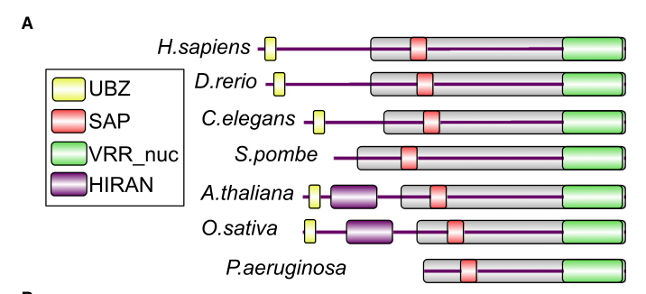

## Question

# Gene Research for Functional Annotation

## ⚠️ CRITICAL: Gene/Protein Identification Context

**BEFORE YOU BEGIN RESEARCH:** You MUST verify you are researching the CORRECT gene/protein. Gene symbols can be ambiguous, especially for less well-characterized genes from non-model organisms.

### Target Gene/Protein Identity (from UniProt):
- **UniProt Accession:** P90740
- **Protein Description:** RecName: Full=Fanconi-associated nuclease 1 homolog {ECO:0000305}; EC=3.1.4.1 {ECO:0000250|UniProtKB:Q9Y2M0};
- **Gene Information:** Name=fan-1; ORFNames=C01G5.8;
- **Organism (full):** Caenorhabditis elegans.
- **Protein Family:** Belongs to the FAN1 family. .
- **Key Domains:** Fan1-like. (IPR033315); FAN1-like_euk. (IPR049132); FAN1-like_TPR. (IPR049126); FAN1-like_WH. (IPR049125); Rad18_UBZ4. (IPR006642)

### MANDATORY VERIFICATION STEPS:

1. **Check if the gene symbol "fan-1" matches the protein description above**
2. **Verify the organism is correct:** Caenorhabditis elegans.
3. **Check if protein family/domains align with what you find in literature**
4. **If you find literature for a DIFFERENT gene with the same or similar symbol, STOP**

### If Gene Symbol is Ambiguous or You Cannot Find Relevant Literature:

**DO NOT PROCEED WITH RESEARCH ON A DIFFERENT GENE.** Instead:
- State clearly: "The gene symbol 'fan-1' is ambiguous or literature is limited for this specific protein"
- Explain what you found (e.g., "Found extensive literature on a different gene with the same symbol in a different organism")
- Describe the protein based ONLY on the UniProt information provided above
- Suggest that the protein function can be inferred from domain/family information

### Research Target:

Please provide a comprehensive research report on the gene **fan-1** (gene ID: fan-1, UniProt: P90740) in worm.

The research report should be a detailed narrative explaining the function, biological processes, and localization of the gene product. Citations should be given for all claims.

You should prioritize authoritative reviews and primary scientific literature when conducting research. You can supplement
this with annotations you find in gene/protein databases, but these can be outdated or inaccurate.

We are specifically interested in the primary function of the gene - for enzymes, what reaction is catalyzed, and what is the substrate specificity? For transporters, what is the substrate? For structural proteins or adapters, what is the broader structural role? For signaling molecules, what is the role in the pathway.

We are interested in where in or outside the cell the gene product carries out its function.

We are also interested in the signaling or biochemical pathways in which the gene functions. We are less interested in broad pleiotropic effects, except where these elucidate the precise role.

Include evidence where possible. We are interested in both experimental evidence as well as inference from structure, evolution, or bioinformatic analysis. Precise studies should be prioritized over high-throughput, where available.

## Output

Question: You are an expert researcher providing comprehensive, well-cited information.

Provide detailed information focusing on:
1. Key concepts and definitions with current understanding
2. Recent developments and latest research (prioritize 2023-2024 sources)
3. Current applications and real-world implementations
4. Expert opinions and analysis from authoritative sources
5. Relevant statistics and data from recent studies

Format as a comprehensive research report with proper citations. Include URLs and publication dates where available.
Always prioritize recent, authoritative sources and provide specific citations for all major claims.

# Gene Research for Functional Annotation

## ⚠️ CRITICAL: Gene/Protein Identification Context

**BEFORE YOU BEGIN RESEARCH:** You MUST verify you are researching the CORRECT gene/protein. Gene symbols can be ambiguous, especially for less well-characterized genes from non-model organisms.

### Target Gene/Protein Identity (from UniProt):
- **UniProt Accession:** P90740
- **Protein Description:** RecName: Full=Fanconi-associated nuclease 1 homolog {ECO:0000305}; EC=3.1.4.1 {ECO:0000250|UniProtKB:Q9Y2M0};
- **Gene Information:** Name=fan-1; ORFNames=C01G5.8;
- **Organism (full):** Caenorhabditis elegans.
- **Protein Family:** Belongs to the FAN1 family. .
- **Key Domains:** Fan1-like. (IPR033315); FAN1-like_euk. (IPR049132); FAN1-like_TPR. (IPR049126); FAN1-like_WH. (IPR049125); Rad18_UBZ4. (IPR006642)

### MANDATORY VERIFICATION STEPS:

1. **Check if the gene symbol "fan-1" matches the protein description above**
2. **Verify the organism is correct:** Caenorhabditis elegans.
3. **Check if protein family/domains align with what you find in literature**
4. **If you find literature for a DIFFERENT gene with the same or similar symbol, STOP**

### If Gene Symbol is Ambiguous or You Cannot Find Relevant Literature:

**DO NOT PROCEED WITH RESEARCH ON A DIFFERENT GENE.** Instead:
- State clearly: "The gene symbol 'fan-1' is ambiguous or literature is limited for this specific protein"
- Explain what you found (e.g., "Found extensive literature on a different gene with the same symbol in a different organism")
- Describe the protein based ONLY on the UniProt information provided above
- Suggest that the protein function can be inferred from domain/family information

### Research Target:

Please provide a comprehensive research report on the gene **fan-1** (gene ID: fan-1, UniProt: P90740) in worm.

The research report should be a detailed narrative explaining the function, biological processes, and localization of the gene product. Citations should be given for all claims.

You should prioritize authoritative reviews and primary scientific literature when conducting research. You can supplement
this with annotations you find in gene/protein databases, but these can be outdated or inaccurate.

We are specifically interested in the primary function of the gene - for enzymes, what reaction is catalyzed, and what is the substrate specificity? For transporters, what is the substrate? For structural proteins or adapters, what is the broader structural role? For signaling molecules, what is the role in the pathway.

We are interested in where in or outside the cell the gene product carries out its function.

We are also interested in the signaling or biochemical pathways in which the gene functions. We are less interested in broad pleiotropic effects, except where these elucidate the precise role.

Include evidence where possible. We are interested in both experimental evidence as well as inference from structure, evolution, or bioinformatic analysis. Precise studies should be prioritized over high-throughput, where available.

## Research report: Functional annotation of *C. elegans* fan-1 (UniProt P90740; ORF C01G5.8)

### 0) Mandatory target verification (gene/protein identity)
The *C. elegans* gene **fan-1** targeted here is correctly matched to **UniProt P90740** and ORF **C01G5.8**. In the discovery paper that defined the FAN1 family, a **C. elegans ortholog is explicitly listed as P90740** in a cross-species FAN1 domain-architecture schematic, and the worm locus is described as **C01G5.8 (Ce-fan-1)** in functional experiments (MacKay et al., 2010; publication date 2010-07-09; https://doi.org/10.1016/j.cell.2010.06.021). (mackay2010identificationofkiaa1018fan1 pages 1-2, mackay2010identificationofkiaa1018fan1 pages 7-8, mackay2010identificationofkiaa1018fan1 media 02b05740)

**Disambiguation note.** “FAN1” is widely used in mammals for “Fanconi anemia-associated nuclease 1”; here, multiple independent worm studies explicitly connect *C. elegans* **fan-1** to interstrand crosslink repair, consistent with the UniProt description and FAN1-family domain composition, reducing the risk of symbol confusion. (mackay2010identificationofkiaa1018fan1 pages 7-8, tijsterman2024fan1mediatedtranslesionsynthesis pages 6-6, lawrence2016linccomplexespromote pages 14-15)

---

### 1) Key concepts, definitions, and current understanding

#### 1.1 DNA interstrand crosslinks (ICLs) and why FAN1-family nucleases matter
DNA interstrand crosslinks (ICLs) are covalent lesions that physically link the two DNA strands, blocking strand separation required for replication and transcription. FAN1-family nucleases are conserved factors implicated in resolving ICL-associated intermediates, especially in replication-coupled contexts, where branched DNA structures (forks/flaps) arise. (mackay2010identificationofkiaa1018fan1 pages 1-2, mackay2010identificationofkiaa1018fan1 pages 2-3)

#### 1.2 What FAN1 is (family-level definition)
**FAN1 (Fanconi anemia-associated nuclease 1)** is a conserved, multi-domain, **structure-specific nuclease**. In the original characterization, human FAN1/KIAA1018 is described as containing:
- an **N-terminal UBZ-type ubiquitin-binding domain** (implicated in binding ubiquitin signals),
- a **SAP-type DNA-binding domain**,
- and a **VRR_nuc (DUF994) nuclease domain** containing a **PD-(D/E)XK** catalytic motif typical of many nucleases. (mackay2010identificationofkiaa1018fan1 pages 2-3)

A key family-level inference for worm fan-1 is supported by the **domain-architecture schematic that includes *C. elegans* P90740** and shows conserved modularity across orthologs. (mackay2010identificationofkiaa1018fan1 media 02b05740)

#### 1.3 Enzymatic activity: reaction and substrate specificity (what FAN1 catalyzes)
At the biochemical level, FAN1 is best described as a **DNA phosphodiesterase** that performs **structure-selective incision** (endonuclease activity) and can also show **exonuclease activity** in some contexts.

In the defining biochemical assays, recombinant FAN1 showed **structure-specific endonuclease activity** with strong preference for **5′ flap DNA** and weaker activity on replication-fork-like substrates; cleavage occurs on the flap-containing strand, in the duplex region near the branchpoint (about **4 nt from the branchpoint**). (mackay2010identificationofkiaa1018fan1 pages 3-3)

Quantitatively, the MacKay et al. assays reported observed cleavage rates of **>0.2 s⁻¹** for wild-type FAN1 versus **0.0003 s⁻¹** for a catalytic mutant (DR), supporting that the VRR_nuc catalytic center is essential. (mackay2010identificationofkiaa1018fan1 pages 3-3)

A 2023 synthesis of FAN1-family nuclease specificity emphasizes that FAN1 can process a broad range of branched/repair substrates (e.g., flaps, forks, bubbles/D-loops, nicks/gaps, and ICL-containing substrates) and that activity can depend on features like **5′-terminal phosphate** and flap length. (ouanounou2023kineticandbiophysical pages 42-47, ouanounou2023kineticandbiophysical pages 47-54)

---

### 2) *C. elegans* fan-1: function, pathways, and localization

#### 2.1 Primary biological role in worms: protection against ICL-inducing agents
Worm genetics provide direct evidence that **Ce-fan-1 (C01G5.8; P90740)** protects against DNA crosslinking damage. A deletion of the Ce-fan-1 locus produced **no overt developmental defects under unchallenged conditions**, but conferred hypersensitivity to **nitrogen mustard (HN2)** and **cisplatin**; L1 exposure impaired progression through larval stages, and RNAi depletion reproduced sensitivity. (mackay2010identificationofkiaa1018fan1 pages 7-8)

In the same study, Ce-fan-1 mutants were described as even more sensitive to these ICL agents than worms lacking the **fcd-2** (FANCD2 ortholog), consistent with an important role in ICL tolerance. (mackay2010identificationofkiaa1018fan1 pages 7-8)

#### 2.2 Phenotypic consequences after TMP/UVA crosslinking challenge
In a systematic analysis of ICL repair pathways using TMP/UVA (crosslinking treatment), **fan-1 mutants** were among strains showing high/modest sensitivity. Post-treatment imaging (3 days) found that fan-1 animals had WT-like mitotic features but **severely disrupted germlines** (no or disorganized, non-functional germline leading to **sterility**) and increased incidence of **protruding vulva** phenotypes; the germline phenotype was described as slightly worse than *slx-1*. (wilson2017systematicanalysisof pages 5-6)

These observations localize fan-1’s protective role prominently to the germline under ICL stress, consistent with the idea that ICL repair is critical for proliferative germ cells. (wilson2017systematicanalysisof pages 5-6)

#### 2.3 Pathway placement in worms: Fanconi-associated, but with parallel/auxiliary roles
In a mechanistic model linking nuclear-envelope components to repair pathway choice, **FAN-1 is described as having a specific requirement in crosslink repair** and is biochemically capable of **unhooking interstrand crosslinks and strand incision**. FAN-1 is linked to the Fanconi network through **interaction with FANCD2**, but is explicitly described as **not a “classic FA gene.”** (lawrence2016linccomplexespromote pages 14-15)

Recent worm work on defined psoralen ICL repair outcomes argues that FAN1 can act **in a pathway parallel to canonical Fanconi anemia factors**, and that its processing may generate substrates for **translesion synthesis (TLS)** polymerases. (tijsterman2024fan1mediatedtranslesionsynthesis pages 6-6)

#### 2.4 Subcellular localization and recruitment in worms
Multiple worm studies place FAN-1 in the nucleus/germline and reveal inducible relocalization:

**UNC-84-dependent recruitment to the nucleoplasm after crosslinks.** FAN-1 is reported to be **not efficiently recruited to the nucleoplasm in the absence of UNC-84**, while general nuclear localization does not require a fully functional LINC complex—suggesting **UNC-84 tethers FAN-1**. This connects FAN-1 recruitment to nuclear-envelope biology during crosslink repair. (Lawrence et al., 2016; publication date 2016-12-12; https://doi.org/10.1083/jcb.201604112). (lawrence2016linccomplexespromote pages 14-15)

**FA-pathway ordering in the germline (FNCM-1 → FCD-2 → FAN-1).** In *C. elegans*, **FNCM-1 is explicitly stated to be required to recruit FCD-2 and the downstream nuclease FAN-1 to the germline**, and FAN-1 is included among components that show **dynamic localization** upon **hydroxyurea (HU)-induced replication-fork arrest**. (Kim et al., 2018; publication date 2018-03-01; https://doi.org/10.1534/genetics.118.300823). (kim2018fanconianemiafancmfncm1 pages 12-14, kim2018fanconianemiafancmfncm1 pages 10-12)

**Quantitative localization context.** While the available excerpt does not report FAN-1-specific Pearson coefficients, it provides quantitative evidence that the broader FA-associated stress compartment is measurable (e.g., SPR-5/FNCM-1 colocalization extension in pachytene under HU with **P = 0.0079**, n = 4–6 gonads), supporting a regulated relocalization program in which FAN-1 participates. (kim2018fanconianemiafancmfncm1 pages 10-12)

---

### 3) Recent developments (prioritizing 2023–2024) and implications for worm fan-1 annotation

#### 3.1 2023: PCNA/RFC-activated FAN1 activity on extrahelical repeat extrusions
A major 2023 advance is the demonstration that FAN1 has a **PCNA- and RFC-dependent**, strand-directed nuclease activity that can remove **triplet-repeat extrahelical extrusions** (e.g., CAG/CTG, CGG) under near-physiological ionic conditions. This work emphasizes that FAN1 function extends beyond “classical” ICL unhooking and can act on alternative DNA structures that arise during replication/repair, and that PCNA can restore FAN1 activity under higher-salt conditions. (Phadte et al., 2023-08; https://doi.org/10.1073/pnas.2302103120). (phadte2023fan1removestriplet pages 1-2, phadte2023fan1removestriplet pages 3-5)

Selected quantitative examples from the 2023 study:
- FAN1 activity decreased **>3-fold** when KCl was raised from **70 mM to 115 mM**, and **PCNA restored activity** at higher salt. (phadte2023fan1removestriplet pages 3-5)
- FAN1 cleavage produced a ~**10-nt** product with a cut ~**14 nt** from an extrusion in a defined assay context. (phadte2023fan1removestriplet pages 3-5)

**Relevance to *C. elegans*.** While this is human biochemical evidence, the machinery (PCNA clamp; RFC loader) is conserved, and worm FAN-1’s nuclease core and repair roles suggest that analogous PCNA-coupled activation could be a plausible mechanism for regulating FAN-1 access or strand bias at branched/extrahelical structures in vivo. (phadte2023fan1removestriplet pages 1-2, ouanounou2023kineticandbiophysical pages 42-47)

#### 3.2 2023: synthesis of FA-dependent vs FA-independent FAN1 functions
A 2023 synthesis highlights that FAN1 recruitment via **UBZ binding to monoubiquitinated ID2 (FANCD2/FANCI)** is an important route, but also summarizes evidence that FAN1 can function **independently of UBZ-mediated recruitment** in some mammalian contexts (UBZ mutants rescuing ICL repair in certain systems). This is particularly relevant in worms because ICL repair architecture differs across species and may rely on partially FA-independent modules. (ouanounou2023kineticandbiophysical pages 39-42, ouanounou2023kineticandbiophysical pages 42-47)

#### 3.3 2024: *C. elegans* fan-1 shapes ICL-repair outcomes via TLS and end-joining pathway choice
A 2024 preprint using *C. elegans* with defined psoralen ICL substrates reports that **fan-1 is required for TLS-associated outcomes** (with mutation-spectrum profiles resembling TLS polymerase mutants such as *polh-1*, *rev-1*, *rev-3*) and additionally suggests FAN1 suppresses deletion-prone end joining routes involving POLQ/HELQ. (Tijsterman et al., 2024-02; https://doi.org/10.21203/rs.3.rs-3898201/v1). (tijsterman2024fan1mediatedtranslesionsynthesis pages 6-6, tijsterman2024fan1mediatedtranslesionsynthesis pages 8-8)

This work positions worm FAN-1 as not only an “ICL repair nuclease,” but also a **determinant of repair pathway choice** (promoting TLS-compatible processing and limiting TMEJ-like deletions) in a lesion-defined system. (tijsterman2024fan1mediatedtranslesionsynthesis pages 8-8)

---

### 4) Current applications and real-world implementations

Although *C. elegans* fan-1 itself is a basic research target, the system is used as an **in vivo platform** to dissect DNA crosslink repair logic and mutational outcomes of genotoxic exposures. In practice, fan-1 mutants are leveraged as sensitized backgrounds to:
- map **ICL repair pathways** using agents such as TMP/UVA, nitrogen mustards, and cisplatin, and
- analyze how pathway perturbations reshape **mutational signatures** and germline viability/sterility outcomes. (wilson2017systematicanalysisof pages 5-6, mackay2010identificationofkiaa1018fan1 pages 7-8)

Cross-species, FAN1 biochemistry is being developed for applications relevant to human disease (e.g., repeat instability) via PCNA/RFC-controlled strand-directed nuclease action; these concepts inform how conserved nucleases like worm FAN-1 might be regulated by replisome components. (phadte2023fan1removestriplet pages 1-2)

---

### 5) Expert synthesis and analysis (mechanistic model for worm fan-1)

#### 5.1 Primary function (best-supported)
The strongest supported primary annotation for worm fan-1 is:

**fan-1 encodes a conserved, structure-specific DNA nuclease that protects the germline and organismal development from ICL-induced genotoxic stress, likely by incising branched DNA intermediates (5′-flap/fork-like structures) generated during replication-coupled ICL repair and by shaping downstream repair pathway choice (TLS vs deletion-prone end joining).** (mackay2010identificationofkiaa1018fan1 pages 7-8, wilson2017systematicanalysisof pages 5-6, tijsterman2024fan1mediatedtranslesionsynthesis pages 6-6, mackay2010identificationofkiaa1018fan1 pages 3-3)

#### 5.2 Likely in-cell location of action
Evidence indicates FAN-1 action is nuclear and dynamically recruited:
- FAN-1 recruitment to the **nucleoplasm** after crosslinks depends on **UNC-84** (nuclear-envelope tethering). (lawrence2016linccomplexespromote pages 14-15)
- FAN-1 is recruited to the **germline** downstream of **FNCM-1 and FCD-2** and participates in replication-stress relocalization programs under HU. (kim2018fanconianemiafancmfncm1 pages 12-14, kim2018fanconianemiafancmfncm1 pages 10-12)

Together, these argue that worm FAN-1 is deployed in nuclei—particularly germline nuclei—where DNA replication and repair intermediates accumulate. (wilson2017systematicanalysisof pages 5-6, kim2018fanconianemiafancmfncm1 pages 12-14)

#### 5.3 Substrate specificity inference for worm FAN-1
Direct enzymology for the *C. elegans* protein is limited in the retrieved texts, but family-level evidence strongly supports the following substrate preferences:
- high activity on **5′ flap** structures and incision near branchpoints, and
- action on **branched/replication-fork-like** DNA substrates relevant to stalled forks at ICLs. (mackay2010identificationofkiaa1018fan1 pages 3-3, ouanounou2023kineticandbiophysical pages 42-47)

Given that the worm ortholog is included in the conserved domain architecture (UBZ/SAP/VRR_nuc) and is experimentally required for ICL tolerance, the most parsimonious interpretation is that **worm FAN-1 catalyzes structure-specific cleavage of branched DNA during ICL processing**, enabling productive TLS/repair. (mackay2010identificationofkiaa1018fan1 media 02b05740, mackay2010identificationofkiaa1018fan1 pages 7-8, tijsterman2024fan1mediatedtranslesionsynthesis pages 6-6)

---

### Evidence summary table
The table below consolidates key claims, evidence types, quantitative data, and source URLs.

| Claim/Function | Evidence type | Key details/quantitative data | Source (authors, year) | DOI URL |
|---|---|---|---|---|
| **Identity/orthology: C. elegans fan-1 = C01G5.8 / UniProt P90740, a FAN1-family nuclease** | Primary biochemistry/orthology; worm-relevant family mapping | MacKay et al. explicitly include **C. elegans P90740** in the FAN1 ortholog schematic and identify FAN1 proteins as conserved DNA-repair nucleases; domain schematic shows **UBZ**, **SAP**, and **VRR_nuc** domains across orthologs, supporting assignment of worm **fan-1/C01G5.8** to the FAN1 family (mackay2010identificationofkiaa1018fan1 pages 1-2, mackay2010identificationofkiaa1018fan1 media 02b05740) | MacKay et al., 2010 | https://doi.org/10.1016/j.cell.2010.06.021 |
| **Catalytic core and domain logic of FAN1 family** | Primary biochemistry; review | Human FAN1 contains **UBZ-type ubiquitin-binding**, **SAP-type DNA-binding**, and **VRR_nuc/DUF994** nuclease domains; VRR_nuc bears a **PD-(D/E)XK** nuclease motif. A 2023 synthesis further describes a bi-lobed architecture with N-terminal helical/SAP region and C-terminal **TPR + VRR nuclease** region, supporting inference that worm FAN-1 is a structure-specific phosphodiesterase acting on branched DNA (mackay2010identificationofkiaa1018fan1 pages 2-3, ouanounou2023kineticandbiophysical pages 47-54, ouanounou2023kineticandbiophysical pages 54-58) | MacKay et al., 2010; Ouanounou, 2023 | https://doi.org/10.1016/j.cell.2010.06.021 |
| **Primary biochemical function: structure-specific nuclease with 5′-flap preference** | Primary biochemistry | Recombinant FAN1 shows strong endonuclease activity on **5′ flap** substrates and weaker activity on replication-fork-like DNA; cleavage occurs on the flap-containing strand ~**4 nt** from the branchpoint. Reported observed cleavage rates were **>0.2 s⁻¹** for WT FAN1 versus **0.0003 s⁻¹** for the catalytic DR mutant, supporting a direct catalytic role of the conserved nuclease domain (mackay2010identificationofkiaa1018fan1 pages 3-3, mackay2010identificationofkiaa1018fan1 pages 1-2) | MacKay et al., 2010 | https://doi.org/10.1016/j.cell.2010.06.021 |
| **Broader substrate specificity of FAN1 family relevant to worm annotation** | Review/biochemical synthesis | FAN1 processes branched and lesion-containing DNA including **5′ flaps, replication forks, dsDNA, bubbles/D-loops, nicks, gaps, and ICL substrates**; activity is favored on branched/double-flap structures and influenced by **5′-terminal phosphate**, flap length, and metal ions. These family-level properties are the strongest biochemical basis for inferring worm substrate scope where direct worm enzymology is limited (ouanounou2023kineticandbiophysical pages 42-47, ouanounou2023kineticandbiophysical pages 47-54, ouanounou2023kineticandbiophysical pages 54-58) | Ouanounou, 2023 | N/A in retrieved context |
| **Ce-fan-1 protects worms from DNA interstrand crosslink (ICL) damage** | Worm genetics | In C. elegans, deletion/RNAi of **Ce-fan-1 (C01G5.8)** confers hypersensitivity to **nitrogen mustard (HN2)** and **cisplatin**; L1 larvae show impaired progression after ICL exposure, while mutants have **no overt developmental defects without challenge**. MacKay et al. note Ce-fan-1 mutants can be **more sensitive than fcd-2/FANCD2-ortholog mutants** under ICL stress (mackay2010identificationofkiaa1018fan1 pages 7-8) | MacKay et al., 2010 | https://doi.org/10.1016/j.cell.2010.06.021 |
| **ICL sensitivity is accompanied by developmental and germline defects after TMP/UVA in worms** | Worm genetics/phenotyping | After **TMP/UVA** crosslinking treatment, **fan-1** mutants show WT-like mitotic features but **no or a disorganized, non-functional germline**, leading to **sterility**; phenotype was described as slightly worse than **slx-1** mutants. fan-1 animals also show increased propensity for **protruding vulva** after treatment (wilson2017systematicanalysisof pages 5-6) | Wilson et al., 2017 | https://doi.org/10.1093/nar/gkx660 |
| **FAN-1 is recruited to the nucleoplasm after crosslinks in an UNC-84-dependent manner** | Worm localization/genetics | FAN-1 is **not efficiently recruited to the nucleoplasm in the absence of UNC-84**; however, FAN-1 nuclear localization does **not** require an intact LINC complex generally, suggesting **UNC-84 acts as a tether**. In **zyg-12** mutants, FAN-1::GFP localization was reported as similar to WT, consistent with UNC-84 being the critical factor for recruitment (lawrence2016linccomplexespromote pages 13-14, lawrence2016linccomplexespromote pages 14-15) | Lawrence et al., 2016 | https://doi.org/10.1083/jcb.201604112 |
| **Pathway placement: FAN-1 acts with FA-linked components but is not a classic FA core gene** | Worm genetics/localization; review | FAN-1 is linked to the Fanconi pathway via FANCD2 interactions and ICL repair, but multiple sources note it is **not a classic FA gene**. In worms, UNC-84/LINC biology suggests FAN-1 function must be coordinated with **NHEJ inhibition** and **HR promotion** to avoid unproductive repair at crosslinks (lawrence2016linccomplexespromote pages 14-15, ouanounou2023kineticandbiophysical pages 39-42) | Lawrence et al., 2016; Ouanounou, 2023 | https://doi.org/10.1083/jcb.201604112 |
| **FNCM-1 recruits FCD-2 and downstream FAN-1 to the germline** | Worm localization/genetics | Kim et al. state explicitly that **C. elegans FNCM-1 is required for recruiting FCD-2 and its downstream nuclease FAN-1 in the germline**; the putative helicase/translocase domain of FNCM-1 is required for this recruitment. FAN-1 also participates in the **dynamic localization pattern** of FA-pathway factors after **HU-induced replication-fork arrest** (kim2018fanconianemiafancmfncm1 pages 12-14, kim2018fanconianemiafancmfncm1 pages 10-12) | Kim et al., 2018 | https://doi.org/10.1534/genetics.118.300823 |
| **Replication-stress relocalization context for FAN-1** | Worm localization | Under **HU**-induced replication stress, FAN-1 is reported among proteins showing a **dynamic localization pattern** with FNCM-1, FCD-2, and SPR-5. Quantitative localization values in the excerpt were reported for related markers rather than FAN-1 directly; for example, **SPR-5/FNCM-1** colocalization in pachytene increased with **P = 0.0079** (n = 4–6 gonads), supporting a replication-stress-responsive FA-associated compartment in which FAN-1 participates (kim2018fanconianemiafancmfncm1 pages 10-12) | Kim et al., 2018 | https://doi.org/10.1534/genetics.118.300823 |
| **Human-cell repair kinetics reinforce FAN1’s ICL-repair role relevant to worm annotation** | Primary cell biology/biochemistry | In human cells depleted of FAN1, after cisplatin there was **almost no decrease** in the fraction of γ-H2AX-positive cells over time; controls had ~**80%** of cells with **2–40 γ-H2AX foci at 24 h**, whereas by **96 h** **>50%** of FAN1-depleted cells remained γ-H2AX-positive, indicating defective processing/resolution of ICL-associated damage. This supports the same core repair function inferred for worm FAN-1 (mackay2010identificationofkiaa1018fan1 pages 7-8) | MacKay et al., 2010 | https://doi.org/10.1016/j.cell.2010.06.021 |
| **2023 development: PCNA/RFC-dependent activation on repeat-extrusion substrates** | Recent primary biochemistry | FAN1 has a newly emphasized activity on **triplet-repeat extrusions**; **RFC + PCNA + ATP** activate a strand-directed FAN1 reaction near extrahelical repeats. FAN1 cleaves near the extrusion and can remove both short and long repeat extrusions, extending FAN1 function beyond classical ICL repair and suggesting possible conserved crosstalk with replication factors in other organisms, including worms (phadte2023fan1removestriplet pages 1-2) | Phadte et al., 2023 | https://doi.org/10.1073/pnas.2302103120 |
| **Quantitative 2023 mechanistic details for PCNA-dependent FAN1 activation** | Recent primary biochemistry | On small repeat extrusions, FAN1 generated a hydrolytic product of ~**10 nt** with the cut located ~**14 nt** from the extrusion. FAN1 activity dropped by **>3-fold** when KCl increased from **70 mM to 115 mM**, but **PCNA restored activity** under higher salt. In some assays RFC was not further stimulatory, whereas PCNA-dependent complex formation required the correct strand orientation, refining how PCNA controls FAN1 substrate engagement (phadte2023fan1removestriplet pages 3-5) | Phadte et al., 2023 | https://doi.org/10.1073/pnas.2302103120 |
| **2023 development: FA-dependent and FA-independent recruitment modes** | Recent review/synthesis | Ouanounou summarizes evidence that FAN1 recruitment via **UBZ binding to monoubiquitinated ID2 (FANCD2/FANCI)** is important, but **UBZ-mutant FAN1 can still rescue ICL repair** in some mammalian systems. This is relevant for C. elegans because worms lack parts of the canonical FA core machinery, so FAN-1 may retain function through partially FA-independent recruitment/activation routes (ouanounou2023kineticandbiophysical pages 39-42, ouanounou2023kineticandbiophysical pages 42-47) | Ouanounou, 2023 | N/A in retrieved context |
| **2024 worm-specific mechanistic advance: FAN-1 promotes TLS at psoralen ICLs** | Recent worm genetics/mechanism | In a defined psoralen-ICL assay, **fan-1** mutants showed an aberrant repair profile in which **wild-type and SNV outcomes were largely absent**, resembling **polh-1, rev-1, rev-3** TLS polymerase mutants. Authors infer that FAN-1 promotes **translesion synthesis (TLS)**, likely by incision/unhooking that creates substrates for TLS polymerases (tijsterman2024fan1mediatedtranslesionsynthesis pages 6-6) | Tijsterman et al., 2024 (preprint) | https://doi.org/10.21203/rs.3.rs-3898201/v1 |
| **2024 worm-specific mechanistic advance: FAN-1 suppresses POLQ/HELQ-mediated end joining** | Recent worm genetics/mechanism | The 2024 preprint proposes a dual role for FAN-1 in psoralen ICL repair: enabling **TLS** while suppressing **POLQ/HELQ-mediated end joining (TMEJ)**. Loss of fan-1 increases TMEJ-type deletions after UV-TMP treatment, arguing that FAN-1 helps channel repair away from deletion-prone end joining and toward productive bypass (tijsterman2024fan1mediatedtranslesionsynthesis pages 8-8, tijsterman2024fan1mediatedtranslesionsynthesis pages 6-6) | Tijsterman et al., 2024 (preprint) | https://doi.org/10.21203/rs.3.rs-3898201/v1 |
| **Expert-level annotation takeaway for C. elegans fan-1** | Integrated inference from worm genetics + family biochemistry | The best-supported annotation is that **fan-1/P90740** encodes a **structure-specific DNA nuclease** acting mainly during **interstrand crosslink repair** and **replication-associated DNA damage processing**, likely via incision/unhooking of branched/5′-flap-like intermediates; it acts in FA-linked but partly parallel pathways, is recruited in the germline by **FNCM-1/FCD-2**, and is relocalized to the nucleoplasm by **UNC-84** after crosslinks. Recent work extends likely function to pathway-choice control and potentially PCNA-coupled processing of non-B DNA intermediates (mackay2010identificationofkiaa1018fan1 pages 7-8, kim2018fanconianemiafancmfncm1 pages 12-14, lawrence2016linccomplexespromote pages 14-15, phadte2023fan1removestriplet pages 1-2, tijsterman2024fan1mediatedtranslesionsynthesis pages 6-6) | Integrated from MacKay et al., 2010; Lawrence et al., 2016; Kim et al., 2018; Phadte et al., 2023; Tijsterman et al., 2024 | https://doi.org/10.1016/j.cell.2010.06.021; https://doi.org/10.1083/jcb.201604112; https://doi.org/10.1534/genetics.118.300823; https://doi.org/10.1073/pnas.2302103120; https://doi.org/10.21203/rs.3.rs-3898201/v1 |

*Table: This table summarizes the strongest evidence supporting functional annotation of C. elegans fan-1/P90740, integrating worm genetics, localization studies, core FAN1 biochemistry, and 2023-2024 mechanistic developments. It is useful as a compact evidence map linking claims about function, pathway placement, localization, and substrate specificity to specific sources and quantitative details.*

---

### Visual evidence: FAN1 domain architecture including *C. elegans* P90740
A domain-architecture schematic from the defining FAN1 paper includes **C. elegans P90740** and shows conserved FAN1 domains (UBZ, SAP, VRR_nuc; and HIRAN in the figure), supporting domain-based functional inference for worm fan-1. (mackay2010identificationofkiaa1018fan1 media 02b05740)

---

### Key limitations of the current evidence set
1. Many worm phenotypes are described qualitatively in the accessible excerpts (e.g., “hypersensitive,” “severely disrupted germline”), and full quantitative survival/sterility percentages likely exist in full figures/tables not retrieved here.
2. Direct biochemical assays of the *C. elegans* FAN-1 protein (substrate panel, kinetic parameters) were not present in the retrieved worm-focused excerpts; conclusions on enzymology in worms therefore rely on conserved-family biochemistry plus strong genetic requirement for ICL tolerance.

---

### References (URLs with publication dates as available in retrieved metadata)
- MacKay C. et al. (2010-07) *Cell*: “Identification of KIAA1018/FAN1…” https://doi.org/10.1016/j.cell.2010.06.021 (mackay2010identificationofkiaa1018fan1 pages 7-8, mackay2010identificationofkiaa1018fan1 pages 3-3, mackay2010identificationofkiaa1018fan1 media 02b05740)
- Lawrence K.S. et al. (2016-12) *J Cell Biol*: “LINC complexes promote homologous recombination…” https://doi.org/10.1083/jcb.201604112 (lawrence2016linccomplexespromote pages 14-15)
- Wilson D.M. et al. (2017-07) *Nucleic Acids Res*: “Systematic analysis of DNA crosslink repair pathways…” https://doi.org/10.1093/nar/gkx660 (wilson2017systematicanalysisof pages 5-6)
- Kim H.-M. et al. (2018-03) *Genetics*: “FANCM/FNCM-1 and FANCD2/FCD-2…” https://doi.org/10.1534/genetics.118.300823 (kim2018fanconianemiafancmfncm1 pages 12-14, kim2018fanconianemiafancmfncm1 pages 10-12)
- Phadte A.S. et al. (2023-08) *PNAS*: “FAN1 removes triplet repeat extrusions…” https://doi.org/10.1073/pnas.2302103120 (phadte2023fan1removestriplet pages 1-2, phadte2023fan1removestriplet pages 3-5)
- Tijsterman M. et al. (2024-02) Research Square preprint: “FAN1-mediated translesion synthesis…” https://doi.org/10.21203/rs.3.rs-3898201/v1 (tijsterman2024fan1mediatedtranslesionsynthesis pages 6-6, tijsterman2024fan1mediatedtranslesionsynthesis pages 8-8)

References

1. (mackay2010identificationofkiaa1018fan1 pages 1-2): Craig MacKay, Anne-Cécile Déclais, Cecilia Lundin, Ana Agostinho, Andrew J. Deans, Thomas J. MacArtney, Kay Hofmann, Anton Gartner, Stephen C. West, Thomas Helleday, David M.J. Lilley, and John Rouse. Identification of kiaa1018/fan1, a dna repair nuclease recruited to dna damage by monoubiquitinated fancd2. Cell, 142:65-76, Jul 2010. URL: https://doi.org/10.1016/j.cell.2010.06.021, doi:10.1016/j.cell.2010.06.021. This article has 397 citations and is from a highest quality peer-reviewed journal.

2. (mackay2010identificationofkiaa1018fan1 pages 7-8): Craig MacKay, Anne-Cécile Déclais, Cecilia Lundin, Ana Agostinho, Andrew J. Deans, Thomas J. MacArtney, Kay Hofmann, Anton Gartner, Stephen C. West, Thomas Helleday, David M.J. Lilley, and John Rouse. Identification of kiaa1018/fan1, a dna repair nuclease recruited to dna damage by monoubiquitinated fancd2. Cell, 142:65-76, Jul 2010. URL: https://doi.org/10.1016/j.cell.2010.06.021, doi:10.1016/j.cell.2010.06.021. This article has 397 citations and is from a highest quality peer-reviewed journal.

3. (mackay2010identificationofkiaa1018fan1 media 02b05740): Craig MacKay, Anne-Cécile Déclais, Cecilia Lundin, Ana Agostinho, Andrew J. Deans, Thomas J. MacArtney, Kay Hofmann, Anton Gartner, Stephen C. West, Thomas Helleday, David M.J. Lilley, and John Rouse. Identification of kiaa1018/fan1, a dna repair nuclease recruited to dna damage by monoubiquitinated fancd2. Cell, 142:65-76, Jul 2010. URL: https://doi.org/10.1016/j.cell.2010.06.021, doi:10.1016/j.cell.2010.06.021. This article has 397 citations and is from a highest quality peer-reviewed journal.

4. (tijsterman2024fan1mediatedtranslesionsynthesis pages 6-6): Marcel Tijsterman, Jip Verschuren, Robin van Schendel, Ivo van Bostelen, and Puck Knipscheer. Fan1-mediated translesion synthesis and polq/helq-mediated end joining generate interstrand crosslink-induced mutations. Unknown journal, Feb 2024. URL: https://doi.org/10.21203/rs.3.rs-3898201/v1, doi:10.21203/rs.3.rs-3898201/v1.

5. (lawrence2016linccomplexespromote pages 14-15): Katherine S. Lawrence, Erin C. Tapley, Victor E. Cruz, Qianyan Li, Kayla Aung, Kevin C. Hart, Thomas U. Schwartz, Daniel A. Starr, and JoAnne Engebrecht. Linc complexes promote homologous recombination in part through inhibition of nonhomologous end joining. The Journal of Cell Biology, 215:801-821, Dec 2016. URL: https://doi.org/10.1083/jcb.201604112, doi:10.1083/jcb.201604112. This article has 57 citations.

6. (mackay2010identificationofkiaa1018fan1 pages 2-3): Craig MacKay, Anne-Cécile Déclais, Cecilia Lundin, Ana Agostinho, Andrew J. Deans, Thomas J. MacArtney, Kay Hofmann, Anton Gartner, Stephen C. West, Thomas Helleday, David M.J. Lilley, and John Rouse. Identification of kiaa1018/fan1, a dna repair nuclease recruited to dna damage by monoubiquitinated fancd2. Cell, 142:65-76, Jul 2010. URL: https://doi.org/10.1016/j.cell.2010.06.021, doi:10.1016/j.cell.2010.06.021. This article has 397 citations and is from a highest quality peer-reviewed journal.

7. (mackay2010identificationofkiaa1018fan1 pages 3-3): Craig MacKay, Anne-Cécile Déclais, Cecilia Lundin, Ana Agostinho, Andrew J. Deans, Thomas J. MacArtney, Kay Hofmann, Anton Gartner, Stephen C. West, Thomas Helleday, David M.J. Lilley, and John Rouse. Identification of kiaa1018/fan1, a dna repair nuclease recruited to dna damage by monoubiquitinated fancd2. Cell, 142:65-76, Jul 2010. URL: https://doi.org/10.1016/j.cell.2010.06.021, doi:10.1016/j.cell.2010.06.021. This article has 397 citations and is from a highest quality peer-reviewed journal.

8. (ouanounou2023kineticandbiophysical pages 42-47): R Ouanounou. Kinetic and biophysical characterisation of 5'-flap nucleases in dna maintenance and repair. Unknown journal, 2023.

9. (ouanounou2023kineticandbiophysical pages 47-54): R Ouanounou. Kinetic and biophysical characterisation of 5'-flap nucleases in dna maintenance and repair. Unknown journal, 2023.

10. (wilson2017systematicanalysisof pages 5-6): David M. Wilson, Matthias Rieckher, Ashley B. Williams, and Björn Schumacher. Systematic analysis of dna crosslink repair pathways during development and aging in caenorhabditis elegans. Nucleic Acids Research, 45:9467-9480, Jul 2017. URL: https://doi.org/10.1093/nar/gkx660, doi:10.1093/nar/gkx660. This article has 33 citations and is from a highest quality peer-reviewed journal.

11. (kim2018fanconianemiafancmfncm1 pages 12-14): Hyun-Min Kim, Sara E Beese-Sims, and M. Colaiácovo. Fanconi anemia fancm/fncm-1 and fancd2/fcd-2 are required for maintaining histone methylation levels and interact with the histone demethylase lsd1/spr-5 in caenorhabditis elegans. Genetics, 209:409-423, Mar 2018. URL: https://doi.org/10.1534/genetics.118.300823, doi:10.1534/genetics.118.300823. This article has 20 citations and is from a domain leading peer-reviewed journal.

12. (kim2018fanconianemiafancmfncm1 pages 10-12): Hyun-Min Kim, Sara E Beese-Sims, and M. Colaiácovo. Fanconi anemia fancm/fncm-1 and fancd2/fcd-2 are required for maintaining histone methylation levels and interact with the histone demethylase lsd1/spr-5 in caenorhabditis elegans. Genetics, 209:409-423, Mar 2018. URL: https://doi.org/10.1534/genetics.118.300823, doi:10.1534/genetics.118.300823. This article has 20 citations and is from a domain leading peer-reviewed journal.

13. (phadte2023fan1removestriplet pages 1-2): Ashutosh S. Phadte, Mayuri Bhatia, Hope Ebert, Haaris Abdullah, Essam Abed Elrazaq, Konstantin E. Komolov, and Anna Pluciennik. Fan1 removes triplet repeat extrusions via a pcna- and rfc-dependent mechanism. Proceedings of the National Academy of Sciences of the United States of America, Aug 2023. URL: https://doi.org/10.1073/pnas.2302103120, doi:10.1073/pnas.2302103120. This article has 33 citations and is from a highest quality peer-reviewed journal.

14. (phadte2023fan1removestriplet pages 3-5): Ashutosh S. Phadte, Mayuri Bhatia, Hope Ebert, Haaris Abdullah, Essam Abed Elrazaq, Konstantin E. Komolov, and Anna Pluciennik. Fan1 removes triplet repeat extrusions via a pcna- and rfc-dependent mechanism. Proceedings of the National Academy of Sciences of the United States of America, Aug 2023. URL: https://doi.org/10.1073/pnas.2302103120, doi:10.1073/pnas.2302103120. This article has 33 citations and is from a highest quality peer-reviewed journal.

15. (ouanounou2023kineticandbiophysical pages 39-42): R Ouanounou. Kinetic and biophysical characterisation of 5'-flap nucleases in dna maintenance and repair. Unknown journal, 2023.

16. (tijsterman2024fan1mediatedtranslesionsynthesis pages 8-8): Marcel Tijsterman, Jip Verschuren, Robin van Schendel, Ivo van Bostelen, and Puck Knipscheer. Fan1-mediated translesion synthesis and polq/helq-mediated end joining generate interstrand crosslink-induced mutations. Unknown journal, Feb 2024. URL: https://doi.org/10.21203/rs.3.rs-3898201/v1, doi:10.21203/rs.3.rs-3898201/v1.

17. (ouanounou2023kineticandbiophysical pages 54-58): R Ouanounou. Kinetic and biophysical characterisation of 5'-flap nucleases in dna maintenance and repair. Unknown journal, 2023.

18. (lawrence2016linccomplexespromote pages 13-14): Katherine S. Lawrence, Erin C. Tapley, Victor E. Cruz, Qianyan Li, Kayla Aung, Kevin C. Hart, Thomas U. Schwartz, Daniel A. Starr, and JoAnne Engebrecht. Linc complexes promote homologous recombination in part through inhibition of nonhomologous end joining. The Journal of Cell Biology, 215:801-821, Dec 2016. URL: https://doi.org/10.1083/jcb.201604112, doi:10.1083/jcb.201604112. This article has 57 citations.

## Artifacts

- [Edison artifact artifact-00](fan-1-deep-research-falcon_artifacts/artifact-00.md)

## Citations

1. wilson2017systematicanalysisof pages 5-6
2. lawrence2016linccomplexespromote pages 14-15
3. ouanounou2023kineticandbiophysical pages 42-47
4. ouanounou2023kineticandbiophysical pages 47-54
5. ouanounou2023kineticandbiophysical pages 39-42
6. ouanounou2023kineticandbiophysical pages 54-58
7. lawrence2016linccomplexespromote pages 13-14
8. https://doi.org/10.1016/j.cell.2010.06.021
9. https://doi.org/10.1083/jcb.201604112
10. https://doi.org/10.1534/genetics.118.300823
11. https://doi.org/10.1073/pnas.2302103120
12. https://doi.org/10.21203/rs.3.rs-3898201/v1
13. https://doi.org/10.1093/nar/gkx660
14. https://doi.org/10.1016/j.cell.2010.06.021;
15. https://doi.org/10.1083/jcb.201604112;
16. https://doi.org/10.1534/genetics.118.300823;
17. https://doi.org/10.1073/pnas.2302103120;
18. https://doi.org/10.1016/j.cell.2010.06.021,
19. https://doi.org/10.21203/rs.3.rs-3898201/v1,
20. https://doi.org/10.1083/jcb.201604112,
21. https://doi.org/10.1093/nar/gkx660,
22. https://doi.org/10.1534/genetics.118.300823,
23. https://doi.org/10.1073/pnas.2302103120,