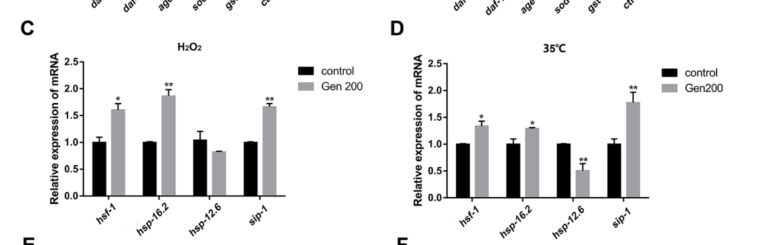

## Question

# Gene Research for Functional Annotation

## ⚠️ CRITICAL: Gene/Protein Identification Context

**BEFORE YOU BEGIN RESEARCH:** You MUST verify you are researching the CORRECT gene/protein. Gene symbols can be ambiguous, especially for less well-characterized genes from non-model organisms.

### Target Gene/Protein Identity (from UniProt):
- **UniProt Accession:** G5EE36
- **Protein Description:** SubName: Full=Heat shock protein 12.6 {ECO:0000313|EMBL:AAC47521.1}; SubName: Full=SHSP domain-containing protein {ECO:0000313|EMBL:CAA92771.1};
- **Gene Information:** Name=hsp-12.6 {ECO:0000313|EMBL:CAA92771.1, ECO:0000313|WormBase:F38E11.2}; ORFNames=CELE_F38E11.2 {ECO:0000313|EMBL:CAA92771.1}, F38E11.2 {ECO:0000313|WormBase:F38E11.2};
- **Organism (full):** Caenorhabditis elegans.
- **Protein Family:** Belongs to the small heat shock protein (HSP20) family.
- **Key Domains:** A-crystallin/Hsp20_dom. (IPR002068); Alpha-crystallin/sHSP_animal. (IPR001436); HSP20-like_chaperone. (IPR008978); HSP20 (PF00011)

### MANDATORY VERIFICATION STEPS:

1. **Check if the gene symbol "hsp-12.6" matches the protein description above**
2. **Verify the organism is correct:** Caenorhabditis elegans.
3. **Check if protein family/domains align with what you find in literature**
4. **If you find literature for a DIFFERENT gene with the same or similar symbol, STOP**

### If Gene Symbol is Ambiguous or You Cannot Find Relevant Literature:

**DO NOT PROCEED WITH RESEARCH ON A DIFFERENT GENE.** Instead:
- State clearly: "The gene symbol 'hsp-12.6' is ambiguous or literature is limited for this specific protein"
- Explain what you found (e.g., "Found extensive literature on a different gene with the same symbol in a different organism")
- Describe the protein based ONLY on the UniProt information provided above
- Suggest that the protein function can be inferred from domain/family information

### Research Target:

Please provide a comprehensive research report on the gene **hsp-12.6** (gene ID: hsp-12.6, UniProt: G5EE36) in worm.

The research report should be a detailed narrative explaining the function, biological processes, and localization of the gene product. Citations should be given for all claims.

You should prioritize authoritative reviews and primary scientific literature when conducting research. You can supplement
this with annotations you find in gene/protein databases, but these can be outdated or inaccurate.

We are specifically interested in the primary function of the gene - for enzymes, what reaction is catalyzed, and what is the substrate specificity? For transporters, what is the substrate? For structural proteins or adapters, what is the broader structural role? For signaling molecules, what is the role in the pathway.

We are interested in where in or outside the cell the gene product carries out its function.

We are also interested in the signaling or biochemical pathways in which the gene functions. We are less interested in broad pleiotropic effects, except where these elucidate the precise role.

Include evidence where possible. We are interested in both experimental evidence as well as inference from structure, evolution, or bioinformatic analysis. Precise studies should be prioritized over high-throughput, where available.

## Output

Question: You are an expert researcher providing comprehensive, well-cited information.

Provide detailed information focusing on:
1. Key concepts and definitions with current understanding
2. Recent developments and latest research (prioritize 2023-2024 sources)
3. Current applications and real-world implementations
4. Expert opinions and analysis from authoritative sources
5. Relevant statistics and data from recent studies

Format as a comprehensive research report with proper citations. Include URLs and publication dates where available.
Always prioritize recent, authoritative sources and provide specific citations for all major claims.

# Gene Research for Functional Annotation

## ⚠️ CRITICAL: Gene/Protein Identification Context

**BEFORE YOU BEGIN RESEARCH:** You MUST verify you are researching the CORRECT gene/protein. Gene symbols can be ambiguous, especially for less well-characterized genes from non-model organisms.

### Target Gene/Protein Identity (from UniProt):
- **UniProt Accession:** G5EE36
- **Protein Description:** SubName: Full=Heat shock protein 12.6 {ECO:0000313|EMBL:AAC47521.1}; SubName: Full=SHSP domain-containing protein {ECO:0000313|EMBL:CAA92771.1};
- **Gene Information:** Name=hsp-12.6 {ECO:0000313|EMBL:CAA92771.1, ECO:0000313|WormBase:F38E11.2}; ORFNames=CELE_F38E11.2 {ECO:0000313|EMBL:CAA92771.1}, F38E11.2 {ECO:0000313|WormBase:F38E11.2};
- **Organism (full):** Caenorhabditis elegans.
- **Protein Family:** Belongs to the small heat shock protein (HSP20) family.
- **Key Domains:** A-crystallin/Hsp20_dom. (IPR002068); Alpha-crystallin/sHSP_animal. (IPR001436); HSP20-like_chaperone. (IPR008978); HSP20 (PF00011)

### MANDATORY VERIFICATION STEPS:

1. **Check if the gene symbol "hsp-12.6" matches the protein description above**
2. **Verify the organism is correct:** Caenorhabditis elegans.
3. **Check if protein family/domains align with what you find in literature**
4. **If you find literature for a DIFFERENT gene with the same or similar symbol, STOP**

### If Gene Symbol is Ambiguous or You Cannot Find Relevant Literature:

**DO NOT PROCEED WITH RESEARCH ON A DIFFERENT GENE.** Instead:
- State clearly: "The gene symbol 'hsp-12.6' is ambiguous or literature is limited for this specific protein"
- Explain what you found (e.g., "Found extensive literature on a different gene with the same symbol in a different organism")
- Describe the protein based ONLY on the UniProt information provided above
- Suggest that the protein function can be inferred from domain/family information

### Research Target:

Please provide a comprehensive research report on the gene **hsp-12.6** (gene ID: hsp-12.6, UniProt: G5EE36) in worm.

The research report should be a detailed narrative explaining the function, biological processes, and localization of the gene product. Citations should be given for all claims.

You should prioritize authoritative reviews and primary scientific literature when conducting research. You can supplement
this with annotations you find in gene/protein databases, but these can be outdated or inaccurate.

We are specifically interested in the primary function of the gene - for enzymes, what reaction is catalyzed, and what is the substrate specificity? For transporters, what is the substrate? For structural proteins or adapters, what is the broader structural role? For signaling molecules, what is the role in the pathway.

We are interested in where in or outside the cell the gene product carries out its function.

We are also interested in the signaling or biochemical pathways in which the gene functions. We are less interested in broad pleiotropic effects, except where these elucidate the precise role.

Include evidence where possible. We are interested in both experimental evidence as well as inference from structure, evolution, or bioinformatic analysis. Precise studies should be prioritized over high-throughput, where available.

## Research report: **C. elegans hsp-12.6** (UniProt: **G5EE36**; WormBase ORF: **F38E11.2**) — functional annotation

### 0) Target verification and scope
The evidence synthesized here concerns the *Caenorhabditis elegans* gene **hsp-12.6**, encoding a **small heat shock protein (sHSP; HSP20/α-crystallin family)** consistent with the UniProt description provided by the user. In the retrieved literature, “hsp-12.6” also appears in other nematodes (e.g., parasites), but those are not used to infer *C. elegans* function. A comparative genomics resource explicitly refers to **“C. elegans hsp-12.6 (F38E11.2)”**, supporting the locus mapping used in this report. (ramsay2012investigatingtherolea pages 46-54)

### 1) Key concepts and definitions (current understanding)

#### 1.1 Small heat shock proteins (sHSPs; HSP20/α-crystallin family)
Small heat shock proteins are ubiquitous **ATP-independent molecular chaperones** that bind non-native/unfolding proteins to **reduce irreversible aggregation** and can cooperate with ATP-dependent chaperone systems for later refolding/disaggregation. A hallmark is a conserved **α-crystallin domain (~100 aa)**, typically flanked by variable N- and C-terminal regions; many sHSPs form **dynamic oligomers** with subunit exchange, and oligomeric transitions can regulate substrate binding. (nakamoto2007thesmallheat pages 1-2, nakamoto2007thesmallheat pages 2-4)

The α-crystallin domain adopts an immunoglobulin-like β-sandwich fold. The **N-terminal region** is often implicated in substrate binding, while N- and C-terminal extensions commonly contribute to oligomer assembly and regulation of activity (e.g., via temperature/phosphorylation effects that expose hydrophobic binding sites). (nakamoto2007thesmallheat pages 2-4)

In addition to protein quality control, sHSPs are described as **amphitropic** proteins that can associate with membranes without transmembrane helices, suggesting potential roles in membrane quality control/stress sensing. (nakamoto2007thesmallheat pages 1-2, nakamoto2007thesmallheat pages 9-10)

#### 1.2 What is unusual about C. elegans HSP-12.6 in this family?
The C. elegans 12-kDa sHSP family (including HSP-12.6) has atypical architecture: the proteins have **very short N-termini and largely lack the polar C-terminal tail** typical of many chaperone-active sHSPs. In this family, **HSP-12.6 is reported as monomeric** by sedimentation velocity and cross-linking, contrasting with the common oligomeric nature of many sHSPs. (ramsay2012investigatingtherole pages 37-42, nakamoto2007thesmallheat pages 2-4)

### 2) Molecular function: what does HSP-12.6 do?

#### 2.1 In vitro biochemical function (holdase/chaperone assays)
In vitro, recombinant HSP-12.6 was reported to **lack detectable chaperone/holdase activity in a standard citrate synthase aggregation assay**, i.e., it did not prevent thermally induced citrate synthase aggregation (reported at **45°C**). This negative result is frequently interpreted as “no canonical in vitro chaperone activity” in that assay context. (ramsay2012investigatingtherole pages 42-46, ramsay2012investigatingtherole pages 37-42)

Mechanistically, the monomeric behavior and truncation of terminal regions are discussed as plausible reasons that HSP-12.6 does not form the higher-order assemblies often associated with classical in vitro sHSP holdase activity. (ramsay2012investigatingtherole pages 42-46, nakamoto2007thesmallheat pages 2-4)

#### 2.2 In vivo functional evidence (proteostasis and longevity)
Despite weak/absent activity in one in vitro assay, in vivo data support a specialized protective role:

* **Proteostasis (polyQ aggregation):** hsp-12.6 RNAi is reported to **accelerate polyglutamine (polyQ) aggregation** in vivo (relative to controls), consistent with a role in buffering proteotoxicity in animals even if not captured by the citrate synthase assay. (ramsay2012investigatingtherole pages 42-46, ramsay2012investigatingtherolea pages 42-46)
* **Longevity/healthspan:** hsp-12.6 functions as an effector downstream of longevity/stress transcriptional programs (DAF-16/FOXO and HSF-1), affecting lifespan in insulin/IGF-1 signaling contexts (details below). (ramsay2012investigatingtherolea pages 46-54, ramsay2012investigatingtherole pages 82-86)

Interpretation: current evidence is most consistent with **context-dependent, in vivo protective activity** (proteostasis/longevity), rather than a broadly acting canonical “holdase” detected by standard in vitro aggregation assays. (ramsay2012investigatingtherole pages 42-46)

### 3) Subcellular localization and tissue expression

#### 3.1 Tissue expression (reporter-based)
A translational reporter **phsp-12.6::HSP-12.6::DSRED2** shows expression in multiple tissues including **body wall muscle**, **vulval (and uterine) muscles**, **neuronal processes/axons**, and **intestinal cells**; expression is detectable under both non-heat-shock and heat-shock conditions in those experiments. (ramsay2012investigatingtherolea pages 46-54, ramsay2012investigatingtherole pages 82-86)

#### 3.2 Subcellular localization in muscle (mitochondria test)
In body muscle, the same translational fusion exhibited a **punctate pattern**. Co-localization experiments with a mitochondrial GFP reporter showed **no co-localization**, leading to the conclusion that HSP-12.6 **is not mitochondrial in muscle cells** (and is more consistent with non-mitochondrial/cytoplasmic localization in that context). (ramsay2012investigatingtherolea pages 46-54)

### 4) Pathways and regulation (signaling/biochemical context)

#### 4.1 IIS (insulin/IGF-1 signaling) and DAF-16/FOXO
Multiple datasets summarized in the retrieved evidence place **hsp-12.6** as a stress/longevity gene regulated by IIS:

* hsp-12.6 expression is described as **upregulated when daf-2 activity is reduced** and **downregulated when daf-16 activity is reduced**, consistent with DAF-16/FOXO-dependent induction in long-lived IIS mutants and in dauer-associated programs. (ramsay2012investigatingtherolea pages 46-54, ramsay2012investigatingtherole pages 79-82)
* hsp-12.6 was reported as highly expressed in **dauer** populations (SAGE summary in retrieved evidence), linking it to an alternative stress-resistant physiological state. (ramsay2012investigatingtherolea pages 46-54)

Promoter analysis in the same body of evidence reports upstream sequences matching **consensus DAF-16 and HSF-1 binding sites**, consistent with direct/indirect transcriptional control by these factors. (ramsay2012investigatingtherole pages 79-82)

#### 4.2 HSF-1 and heat-shock/stress programs
The retrieved evidence supports that hsp-12.6 participates in HSF-1-linked longevity programs (see phenotypes below), but also notes that **hsp-12.6 is often described as constitutively expressed and not strongly heat-inducible** (at least under certain conditions and in certain developmental stages), contrasting with strongly heat-inducible small HSPs like hsp-16 genes. (ramsay2012investigatingtherole pages 37-42, ramsay2012investigatingtherole pages 82-86)

### 5) Phenotypes: what happens when hsp-12.6 is perturbed?

#### 5.1 RNAi knockdown
* In long-lived **daf-2(e1370)** animals (reduced IIS), **hsp-12.6(RNAi)** reduced the extended lifespan phenotype by **~25%** at 20°C in a reported assay, indicating that hsp-12.6 contributes materially to IIS-mediated lifespan extension. (ramsay2012investigatingtherolea pages 46-54)
* hsp-12.6(RNAi) also reduced longevity in other IIS/HSF-1-related contexts summarized in the retrieved evidence (e.g., HSF-1 overexpression backgrounds), consistent with its role as an effector of stress/longevity transcriptional programs. (ramsay2012investigatingtherole pages 82-86)

#### 5.2 Overexpression
Overexpression using **phsp-12.6::HSP-12.6::DSRED2** was reported to **extend lifespan by ~2 days** in the experiments summarized in the retrieved evidence. (ramsay2012investigatingtherolea pages 79-82, ramsay2012investigatingtherole pages 79-82)

### 6) Recent developments (prioritizing 2023–2024)

#### 6.1 2023: Genistein study links hsp-12.6 to heat-stress transcriptional remodeling
A 2023 peer-reviewed study (Antioxidants; **publication date: Jan 2023**) tested **200 µM genistein** in L4 worms under oxidative stress (H2O2) and heat stress (**35°C**). For **hsp-12.6 mRNA**, genistein caused:

* **No significant change under H2O2**, but
* **A 49.4% decrease under 35°C heat stress (p < 0.01)**.

This provides a recent quantitative data point showing that hsp-12.6 can be **downregulated** in a heat-stress condition where other stress genes are induced, reinforcing that hsp-12.6 is not simply a generic “heat-inducible HSP” marker in all contexts. URL/DOI: https://doi.org/10.3390/antiox12010125. (zhang2023genisteinpromotesantiheat pages 8-11, zhang2023genisteinpromotesantiheat media 82792b6c)

#### 6.2 2023: Transcriptomic support in an Alzheimer’s disease (Aβ) worm model
A 2023 peer-reviewed study (Experimental and Therapeutic Medicine; **publication date: Jul 2023**) used an Aβ transgenic model (CL4176) and reported that an ethyl acetate extract of *Gastrodia elata* (EEGE) altered expression of stress/longevity-related genes; **hsp-12.6** is reported as **upregulated** (with **P < 0.05**) and qPCR validation matched the RNA-seq direction, though explicit fold-changes for hsp-12.6 were not present in the retrieved excerpt. URL/DOI: https://doi.org/10.3892/etm.2023.12104. (shi2023ethylacetateextract pages 7-10)

#### 6.3 2024: Neuron-specific IIS/FOXO transcriptomics in cognitive aging
A 2024 peer-reviewed eLife study (publication date: **Jun 2024**) performed neuron-specific transcriptomics to understand IIS/FOXO effects in aged animals. In their neuron-specific comparisons, the hsp-12.6-containing cluster is identified among daf-2/FOXO-associated neuronal genes; a listed small-HSP-domain gene entry corresponding to hsp-12.6 shows **log2 fold-change = 1.94** with **adjusted p = 7.33×10−6** in a daf-2 vs daf-16;daf-2 neuronal comparison, supporting significant **neuronal upregulation** in the daf-2/FOXO context. URL/DOI: https://doi.org/10.7554/elife.95621.4. (weng2024theneuronspecificiisfoxo pages 10-12)

### 7) Current applications and real-world implementations

1. **Functional reporter readouts of organismal stress and longevity signaling:** phsp-12.6 translational fusions (e.g., DSRED2-tagged HSP-12.6) are used to track tissue expression and to validate RNAi specificity in vivo. These reporters are applied in studies of proteostasis, stress, and IIS/DAF-16/HSF-1 pathway activity. (ramsay2012investigatingtherole pages 79-82, ramsay2012investigatingtherolea pages 46-54)
2. **Nutraceutical/pharmacology screening pipelines in C. elegans:** In 2023 studies, hsp-12.6 is among genes monitored by qPCR/RNA-seq to evaluate interventions (e.g., genistein; botanical extracts) that modulate stress resistance and proteotoxicity in vivo. (zhang2023genisteinpromotesantiheat pages 8-11, shi2023ethylacetateextract pages 7-10)
3. **Systems neuroscience aging research:** Neuron-specific transcriptome profiling in 2024 uses hsp-12.6-associated stress gene signatures as part of a broader framework to explain neuronal resilience/cognitive aging mechanisms in IIS mutants. (weng2024theneuronspecificiisfoxo pages 10-12)

### 8) Expert interpretation and synthesis (authoritative analysis)

The dominant conceptual model from authoritative sHSP literature is that sHSPs act as **ATP-independent chaperones** whose activity is tied to **dynamic oligomerization** and exposure of hydrophobic client-binding surfaces. (nakamoto2007thesmallheat pages 1-2, nakamoto2007thesmallheat pages 2-4)

C. elegans HSP-12.6 appears to be an **outlier** within this family: it is described as **monomeric** with truncated terminal regions and **lacks detectable citrate synthase holdase activity** in vitro, yet it has reproducible **in vivo roles** in proteostasis and longevity downstream of **IIS/DAF-16 and HSF-1-associated programs**. (ramsay2012investigatingtherole pages 37-42, ramsay2012investigatingtherole pages 42-46, ramsay2012investigatingtherolea pages 46-54)

A plausible synthesis is that HSP-12.6 provides **client- or context-specific protection** (e.g., specific native clients in particular tissues such as muscle/neurons, or stress-state-specific functions such as dauer/IIS programs) that is not well captured by standard in vitro aggregation assays. This is consistent with the broader caution in the sHSP field that in vitro assays may not capture all biologically relevant sHSP functions, especially for divergent family members. (nakamoto2007thesmallheat pages 2-4, ramsay2012investigatingtherole pages 42-46)

### 9) Key quantitative statistics (from recent and gene-targeted studies)
* **49.4% downregulation** of hsp-12.6 mRNA under **35°C heat stress** with **200 µM genistein**; **p < 0.01** (Jan 2023). (zhang2023genisteinpromotesantiheat pages 8-11, zhang2023genisteinpromotesantiheat media 82792b6c)
* **log2FC = 1.94**, **padj = 7.33E−06** for neuronal upregulation in a **daf-2 vs daf-16;daf-2** neuron-specific comparison (Jun 2024). (weng2024theneuronspecificiisfoxo pages 10-12)
* **~25% reduction** of daf-2(e1370) lifespan extension upon **hsp-12.6 RNAi** (gene-targeted lifespan assay summary). (ramsay2012investigatingtherolea pages 46-54)
* **~2-day lifespan extension** upon HSP-12.6 overexpression (phsp-12.6::HSP-12.6::DSRED2). (ramsay2012investigatingtherolea pages 79-82, ramsay2012investigatingtherole pages 79-82)

### 10) Evidence summary table
The following table consolidates major claims, conditions, quantitative values, and citations:

| Aspect | Key claim | Experimental system/conditions | Quantitative/statistical details | Source (author year) and DOI/URL | Evidence citation id |
|---|---|---|---|---|---|
| Function | HSP-12.6 lacks detectable canonical in vitro chaperone activity against thermally unfolded citrate synthase | Recombinant C. elegans HSP-12.6 tested in citrate synthase aggregation-prevention assays | Failed to prevent citrate synthase aggregation at 45°C; interpreted as no detectable in vitro chaperone/holdase activity in that assay | Ramsay 2012 summarizing Leroux et al. 1997a; review context consistent with Nakamoto & Vígh 2007. URL: https://doi.org/10.1007/s00018-006-6321-2 | (ramsay2012investigatingtherole pages 42-46, ramsay2012investigatingtherolea pages 42-46) |
| Function/structure | HSP-12.6 is structurally atypical among sHSPs, with very short terminal regions and monomeric behavior | Biophysical characterization discussed for the C. elegans 12-kDa sHSP family | Reported as monomeric by sedimentation velocity and cross-linking analyses; contrasts with many oligomeric sHSPs | Ramsay 2012; Nakamoto & Vígh 2007. URL: https://doi.org/10.1007/s00018-006-6321-2 | (nakamoto2007thesmallheat pages 2-4, ramsay2012investigatingtherole pages 37-42) |
| Localization | Translational reporter indicates expression in muscle, neurons, vulva, intestine, and reproductive muscle-associated tissues | phsp-12.6::HSP-12.6::DSRED2 translational fusion in C. elegans under basal and heat-shock conditions | Expression observed in body muscle, vulval and uterine muscles, anterior/posterior axons, intestinal cells; constitutive expression also reported at 20°C | Ramsay 2012 | (ramsay2012investigatingtherolea pages 46-54, ramsay2012investigatingtherole pages 82-86) |
| Localization | Reporter signal in body muscle is punctate but does not colocalize with mitochondria | phsp-12.6::HSP-12.6::DSRED2 compared with mitochondrial GFP reporter in muscle cells | No colocalization detected; authors concluded HSP-12.6 is not localized to mitochondria in muscle cells | Ramsay 2012 | (ramsay2012investigatingtherolea pages 46-54) |
| Expression regulation | hsp-12.6 is a DAF-16/FOXO- and HSF-1-linked longevity/stress gene, strongly associated with dauer and reduced IIS | Genetic and transcriptomic analyses in daf-2 and daf-16 backgrounds; promoter motif analysis | Reported as highly expressed in dauer; upregulated when daf-2 activity is reduced and downregulated when daf-16 activity is reduced; upstream consensus DAF-16 and HSF-1 sites present | Ramsay 2012; background from DAF-16/HSF-1 literature summarized therein | (ramsay2012investigatingtherolea pages 46-54, ramsay2012investigatingtherole pages 79-82) |
| Expression regulation | Unlike classic heat-inducible sHSPs, hsp-12.6 is often described as constitutive and not strongly stress-induced in standard assays | Western blot and reporter-based observations in C. elegans L1 larvae and adults | No significant induction reported across multiple stressors in L1 larvae; constitutive reporter expression at 20°C | Ramsay 2012 | (ramsay2012investigatingtherole pages 37-42, ramsay2012investigatingtherole pages 82-86) |
| Phenotype | hsp-12.6 contributes to daf-2 longevity; RNAi reduces the long-lived phenotype of daf-2 mutants | RNAi knockdown in daf-2(e1370) and other IIS mutant backgrounds | In daf-2(e1370) at 20°C, hsp-12.6(RNAi) reduced extended lifespan by approximately 25% | Ramsay 2012 | (ramsay2012investigatingtherolea pages 46-54) |
| Phenotype | hsp-12.6 overexpression modestly extends lifespan | phsp-12.6::HSP-12.6::DSRED2 overexpression strain | Lifespan extension of about 2 days relative to controls | Ramsay 2012 | (ramsay2012investigatingtherolea pages 79-82, ramsay2012investigatingtherole pages 79-82) |
| Phenotype/proteostasis | Despite weak in vitro chaperone evidence, hsp-12.6 has in vivo protective roles in proteostasis | RNAi studies in polyQ aggregation/longevity contexts | RNAi accelerates polyQ aggregation; lifespan effects are small but statistically significant in several backgrounds | Ramsay 2012 | (ramsay2012investigatingtherole pages 42-46, ramsay2012investigatingtherolea pages 42-46) |
| Recent regulation (2023) | Genistein downregulates hsp-12.6 under heat stress but not oxidative stress | L4 worms treated with 200 µM genistein; qPCR under 35°C heat stress or H2O2 oxidative stress | At 35°C, hsp-12.6 mRNA decreased by 49.4% (p < 0.01); under H2O2, no significant change reported | Zhang et al. 2023, Antioxidants, published Jan 2023. DOI/URL: https://doi.org/10.3390/antiox12010125 | (zhang2023genisteinpromotesantiheat pages 8-11, zhang2023genisteinpromotesantiheat pages 11-13) |
| Recent regulation (2023) | EEGE upregulates hsp-12.6 in an Aβ transgenic worm model | CL4176 C. elegans treated with ethyl acetate extract of Gastrodia elata (EEGE); RNA-seq with qPCR validation | hsp-12.6 reported upregulated with P < 0.05; exact fold-change not provided in extracted text | Shi et al. 2023, Experimental and Therapeutic Medicine, published Jul 2023. DOI/URL: https://doi.org/10.3892/etm.2023.12104 | (shi2023ethylacetateextract pages 7-10) |
| Recent omics (2024) | hsp-12.6 is among neuronal genes upregulated by daf-2/FOXO signaling in aged animals | Neuron-specific transcriptomics comparing daf-2 vs daf-16;daf-2 neurons in aged C. elegans | log2FC = 1.94; adjusted p = 7.33E-06 | Weng et al. 2024, eLife, published Jun 2024. DOI/URL: https://doi.org/10.7554/elife.95621.4 | (weng2024theneuronspecificiisfoxo pages 10-12) |

*Table: This table summarizes experimentally supported findings for C. elegans hsp-12.6, including molecular function, localization, pathway regulation, phenotypic effects, and recent 2023-2024 omics results. It highlights both classic evidence and newer quantitative studies relevant for functional annotation.*

### 11) Visual evidence (figure extraction)
A cropped panel from Zhang et al. 2023 Figure 8 showing the hsp-12.6 qPCR under H2O2 and 35°C conditions is available and supports the reported downregulation under heat stress with genistein. (zhang2023genisteinpromotesantiheat media 82792b6c)

### 12) Limitations and gaps
* **Direct UniProt/WormBase/InterPro pages** were not retrievable within the current tool corpus; therefore, database identifiers beyond what the user supplied are not re-cited from database text here. The family/domain classification and functional interpretations are instead grounded in peer-reviewed review literature and experimental summaries. (nakamoto2007thesmallheat pages 2-4, ramsay2012investigatingtherole pages 42-46)
* Several 2023 papers retrieved in metadata mention hsp-12.6, but the tool-accessible excerpts did not always include **numerical fold-changes** for hsp-12.6 (e.g., EEGE Aβ model reports direction and significance but not a fold-change in the excerpt). (shi2023ethylacetateextract pages 7-10)

### 13) Reference URLs (with publication dates)
* Nakamoto H, Vígh L. *The small heat shock proteins and their clients.* **Cell Mol Life Sci**. **Feb 2007**. https://doi.org/10.1007/s00018-006-6321-2 (nakamoto2007thesmallheat pages 1-2)
* Zhang S-Y et al. *Genistein promotes anti-heat stress and antioxidant effects…* **Antioxidants (Basel)**. **Jan 2023**. https://doi.org/10.3390/antiox12010125 (zhang2023genisteinpromotesantiheat pages 8-11)
* Shi X et al. *Ethyl acetate extract of Gastrodia elata protects C. elegans…* **Exp Ther Med**. **Jul 2023**. https://doi.org/10.3892/etm.2023.12104 (shi2023ethylacetateextract pages 7-10)
* Weng Y et al. *The neuron-specific IIS/FOXO transcriptome in aged animals…* **eLife**. **Jun 2024**. https://doi.org/10.7554/elife.95621.4 (weng2024theneuronspecificiisfoxo pages 10-12)

References

1. (ramsay2012investigatingtherolea pages 46-54): LF Ramsay. Investigating the role of the small heat shock protein, hsp-12.6, in longevity in caenorhabditis elegans. Unknown journal, 2012.

2. (nakamoto2007thesmallheat pages 1-2): Hitoshi Nakamoto and L. Vígh. The small heat shock proteins and their clients. Cellular and Molecular Life Sciences, 64:294-306, Feb 2007. URL: https://doi.org/10.1007/s00018-006-6321-2, doi:10.1007/s00018-006-6321-2. This article has 426 citations and is from a domain leading peer-reviewed journal.

3. (nakamoto2007thesmallheat pages 2-4): Hitoshi Nakamoto and L. Vígh. The small heat shock proteins and their clients. Cellular and Molecular Life Sciences, 64:294-306, Feb 2007. URL: https://doi.org/10.1007/s00018-006-6321-2, doi:10.1007/s00018-006-6321-2. This article has 426 citations and is from a domain leading peer-reviewed journal.

4. (nakamoto2007thesmallheat pages 9-10): Hitoshi Nakamoto and L. Vígh. The small heat shock proteins and their clients. Cellular and Molecular Life Sciences, 64:294-306, Feb 2007. URL: https://doi.org/10.1007/s00018-006-6321-2, doi:10.1007/s00018-006-6321-2. This article has 426 citations and is from a domain leading peer-reviewed journal.

5. (ramsay2012investigatingtherole pages 37-42): LF Ramsay. Investigating the role of the small heat shock protein, hsp-12.6, in longevity in caenorhabditis elegans. Unknown journal, 2012.

6. (ramsay2012investigatingtherole pages 42-46): LF Ramsay. Investigating the role of the small heat shock protein, hsp-12.6, in longevity in caenorhabditis elegans. Unknown journal, 2012.

7. (ramsay2012investigatingtherolea pages 42-46): LF Ramsay. Investigating the role of the small heat shock protein, hsp-12.6, in longevity in caenorhabditis elegans. Unknown journal, 2012.

8. (ramsay2012investigatingtherole pages 82-86): LF Ramsay. Investigating the role of the small heat shock protein, hsp-12.6, in longevity in caenorhabditis elegans. Unknown journal, 2012.

9. (ramsay2012investigatingtherole pages 79-82): LF Ramsay. Investigating the role of the small heat shock protein, hsp-12.6, in longevity in caenorhabditis elegans. Unknown journal, 2012.

10. (ramsay2012investigatingtherolea pages 79-82): LF Ramsay. Investigating the role of the small heat shock protein, hsp-12.6, in longevity in caenorhabditis elegans. Unknown journal, 2012.

11. (zhang2023genisteinpromotesantiheat pages 8-11): Sai-Ya Zhang, Zi-Chen Qin, Yi-Yang Sun, Yu-Si Chen, Wen-Bo Chen, Hong-Gang Wang, Di An, Dan Sun, and Yan-Qiang Liu. Genistein promotes anti-heat stress and antioxidant effects via the coordinated regulation of iis, hsp, mapk, dr, and mitochondrial pathways in caenorhabditis elegans. Antioxidants, 12:125, Jan 2023. URL: https://doi.org/10.3390/antiox12010125, doi:10.3390/antiox12010125. This article has 20 citations.

12. (zhang2023genisteinpromotesantiheat media 82792b6c): Sai-Ya Zhang, Zi-Chen Qin, Yi-Yang Sun, Yu-Si Chen, Wen-Bo Chen, Hong-Gang Wang, Di An, Dan Sun, and Yan-Qiang Liu. Genistein promotes anti-heat stress and antioxidant effects via the coordinated regulation of iis, hsp, mapk, dr, and mitochondrial pathways in caenorhabditis elegans. Antioxidants, 12:125, Jan 2023. URL: https://doi.org/10.3390/antiox12010125, doi:10.3390/antiox12010125. This article has 20 citations.

13. (shi2023ethylacetateextract pages 7-10): Xiongfei Shi, Xingzhi Yu, Liping Yang, and Xiaohua Duan. Ethyl acetate extract of gastrodia elata protects caenorhabditis elegans from oxidative stress and amyloid β peptide toxicity. Experimental and Therapeutic Medicine, Jul 2023. URL: https://doi.org/10.3892/etm.2023.12104, doi:10.3892/etm.2023.12104. This article has 8 citations and is from a peer-reviewed journal.

14. (weng2024theneuronspecificiisfoxo pages 10-12): Yifei Weng, Shiyi Zhou, Katherine Morillo, Rachel Kaletsky, Sarah Lin, and Coleen T Murphy. The neuron-specific iis/foxo transcriptome in aged animals reveals regulatory mechanisms of cognitive aging. eLife, Jun 2024. URL: https://doi.org/10.7554/elife.95621.4, doi:10.7554/elife.95621.4. This article has 18 citations and is from a domain leading peer-reviewed journal.

15. (zhang2023genisteinpromotesantiheat pages 11-13): Sai-Ya Zhang, Zi-Chen Qin, Yi-Yang Sun, Yu-Si Chen, Wen-Bo Chen, Hong-Gang Wang, Di An, Dan Sun, and Yan-Qiang Liu. Genistein promotes anti-heat stress and antioxidant effects via the coordinated regulation of iis, hsp, mapk, dr, and mitochondrial pathways in caenorhabditis elegans. Antioxidants, 12:125, Jan 2023. URL: https://doi.org/10.3390/antiox12010125, doi:10.3390/antiox12010125. This article has 20 citations.

## Artifacts

- [Edison artifact artifact-00](hsp-12.6-deep-research-falcon_artifacts/artifact-00.md)

## Citations

1. ramsay2012investigatingtherolea pages 46-54
2. nakamoto2007thesmallheat pages 2-4
3. ramsay2012investigatingtherole pages 42-46
4. ramsay2012investigatingtherole pages 79-82
5. ramsay2012investigatingtherole pages 82-86
6. shi2023ethylacetateextract pages 7-10
7. weng2024theneuronspecificiisfoxo pages 10-12
8. nakamoto2007thesmallheat pages 1-2
9. zhang2023genisteinpromotesantiheat pages 8-11
10. nakamoto2007thesmallheat pages 9-10
11. ramsay2012investigatingtherole pages 37-42
12. ramsay2012investigatingtherolea pages 42-46
13. ramsay2012investigatingtherolea pages 79-82
14. zhang2023genisteinpromotesantiheat pages 11-13
15. https://doi.org/10.3390/antiox12010125.
16. https://doi.org/10.3892/etm.2023.12104.
17. https://doi.org/10.7554/elife.95621.4.
18. https://doi.org/10.1007/s00018-006-6321-2
19. https://doi.org/10.3390/antiox12010125
20. https://doi.org/10.3892/etm.2023.12104
21. https://doi.org/10.7554/elife.95621.4
22. https://doi.org/10.1007/s00018-006-6321-2,
23. https://doi.org/10.3390/antiox12010125,
24. https://doi.org/10.3892/etm.2023.12104,
25. https://doi.org/10.7554/elife.95621.4,