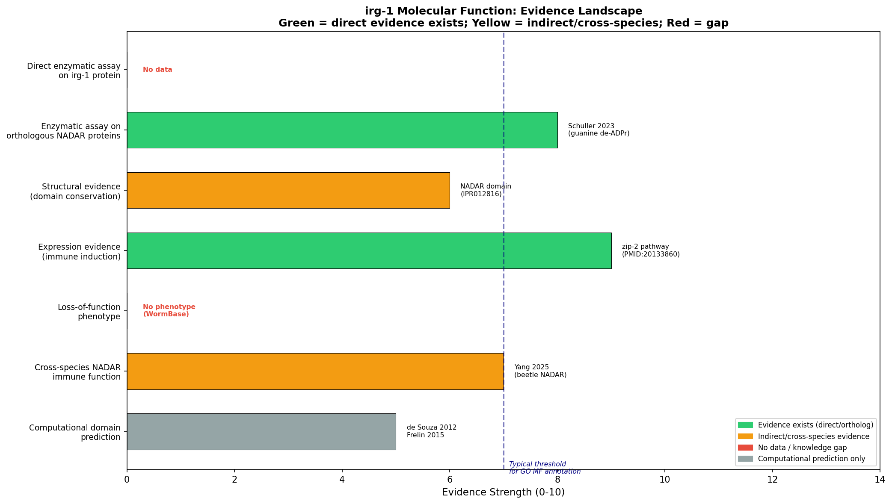
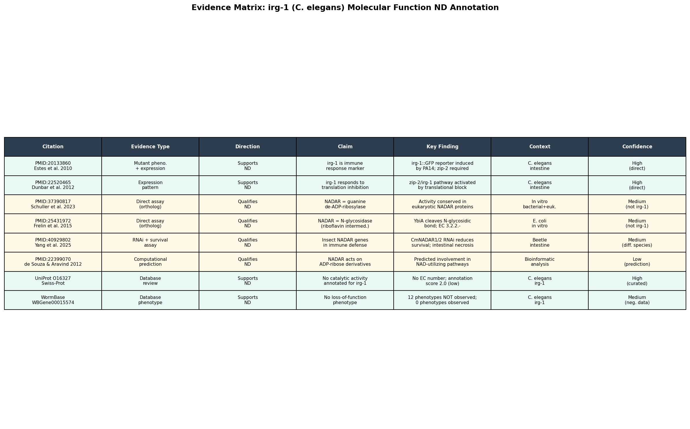

## Question

# AIGR Gene Hypothesis Deep Research

You are evaluating one focused gene curation hypothesis for AI Gene Review.
This is not a general gene overview. Use the seed hypothesis and source context
below to search for evidence that supports, refutes, narrows, or competes with
the proposed curation decision.

## Target Gene

- **Organism code:** worm
- **Taxon:** Caenorhabditis elegans (NCBITaxon:6239)
- **Gene directory:** irg-1
- **Gene symbol:** irg-1
- **UniProt accession:** O16327

## Focus

- **Focus type:** existing_go_annotation_decision
- **Hypothesis slug:** existing-go-0003674-accept
- **Source file:** genes/worm/irg-1/irg-1-ai-review.yaml
- **Source selector:** existing_annotations[3]

## Seed Hypothesis

The existing irg-1 GO annotation to molecular_function (GO:0003674) should receive review action ACCEPT. Current rationale: This ND annotation is appropriate as no molecular function has been experimentally validated for irg-1. While the NADAR domain suggests potential hydrolase activity, this remains uncharacterized. The protein may function as an effector in antimicrobial defense but specific molecular activity awaits experimental confirmation. The ND annotation correctly reflects our current state of knowledge.

## Term and Decision Context

- Term: molecular_function (GO:0003674)
- Evidence type: ND
- Original reference: GO_REF:0000015
- Current review action: ACCEPT
- Review summary: The ND (No Data) annotation indicates that no molecular function has been experimentally characterized for irg-1. Interestingly, irg-1 contains a NADAR domain (IPR012816), which in other proteins is associated with ADP-ribosylhydrolase activity, particularly the ability to remove ADP-ribose from guanine bases. However, no enzymatic activity has been demonstrated for irg-1 itself.

- Review reason: This ND annotation is appropriate as no molecular function has been experimentally validated for irg-1. While the NADAR domain suggests potential hydrolase activity, this remains uncharacterized. The protein may function as an effector in antimicrobial defense but specific molecular activity awaits experimental confirmation. The ND annotation correctly reflects our current state of knowledge.

## Reference Context

- GO_REF:0000015

## Source Context YAML

```yaml
term:
  id: GO:0003674
  label: molecular_function
evidence_type: ND
original_reference_id: GO_REF:0000015
review:
  summary: |
    The ND (No Data) annotation indicates that no molecular function has been experimentally characterized for irg-1. Interestingly, irg-1 contains a NADAR domain (IPR012816), which in other proteins is associated with ADP-ribosylhydrolase activity, particularly the ability to remove ADP-ribose from guanine bases. However, no enzymatic activity has been demonstrated for irg-1 itself.
  action: ACCEPT
  reason: |
    This ND annotation is appropriate as no molecular function has been experimentally validated for irg-1. While the NADAR domain suggests potential hydrolase activity, this remains uncharacterized. The protein may function as an effector in antimicrobial defense but specific molecular activity awaits experimental confirmation. The ND annotation correctly reflects our current state of knowledge.
  additional_reference_ids: []
  supported_by: []
```

## Research Objective

Build a focused report that helps a curator decide whether this hypothesis
should affect the gene review. Address the focus type directly:

1. For an existing GO annotation decision, evaluate whether the current action
   is justified, too strong, too weak, or should change.
2. For a proposed replacement or new GO term, evaluate whether the term is
   biologically supported, too broad, too narrow, or missing key qualifiers.
3. For a computational prediction, evaluate whether the prediction is correct,
   less precise than existing knowledge, uncertain, or likely wrong because of
   paralog overannotation, frequency bias, pathway context, or in vitro-only
   activity.
4. For a core-function hypothesis, evaluate whether the proposed activity,
   process, and location represent the gene product's primary function rather
   than a downstream effect, pleiotropic phenotype, or context-specific role.
5. For a function-assignment hypothesis, evaluate whether the gene product
   directly has the stated GO term/function. Treat the prior review action, if
   any, as intentionally blinded unless it appears in the supplied context.

Use primary literature whenever possible. Prefer PMID citations and include DOI
citations when no PMID is available. Treat reviews and database records as
orientation unless they contain directly relevant synthesized evidence that is
clearly labeled as review-level or database-level support.

Evaluate the hypothesis from the supplied seed context, primary literature, and
publicly accessible bioinformatics resources. Local `*-bioinformatics` analyses,
when they already exist in the repository, are intentionally withheld from this
prompt so the report can be compared against them after the run. Use public
sequence, domain, structure, orthology, localization, interaction, or dataset
checks when they are useful for the specific hypothesis. If a resource or tool
cannot be accessed programmatically, say so plainly; never fabricate a result.
Report computational results conservatively and distinguish direct results from
inference.

## Required Output

### Executive Judgment

Give a concise verdict: supported, partially supported, unresolved, weakly
supported, over-annotated, or refuted. Explain the reasoning and the most
important caveats.

### Evidence Matrix

Create a table with one row per important evidence item:

- Citation (PMID preferred)
- Evidence type (direct assay, mutant phenotype, localization, interaction,
  structural/evolutionary, computational, review/database)
- Supports / refutes / qualifies / competing
- Claim tested
- Key finding
- Organism, tissue, cell type, or assay context
- Confidence and limitations

### GO Curation Implications

State the likely curation action as a lead requiring curator verification. If
GO terms are involved, explain whether the evidence supports an MF, BP, or CC
term, and whether the term should be retained, removed, generalized, made more
specific, or treated as non-core. Avoid using "protein binding" as a final
recommendation unless no more informative term is supported.

### Mechanistic Scope

Describe the immediate molecular or cellular function being tested. Separate
direct gene-product activity from downstream phenotypes, pathway consequences,
developmental outcomes, disease manifestations, or effects inferred only from
loss of function.

### Conflicts and Alternatives

Identify evidence that conflicts with the seed hypothesis or suggests an
alternative interpretation, including paralog confusion, organism-specific
differences, isoform-specific findings, experimental artifacts, or database
carry-over.

### Knowledge Gaps

List explicit uncertainties that matter for curation. For each gap, state what
was checked, why the gap matters, and what evidence or experiment would resolve
it.

### Discriminating Tests

Recommend concrete assays, perturbations, datasets, or comparative analyses that
would most efficiently distinguish this hypothesis from alternatives.

### Curation Leads

Provide candidate updates for the review, clearly labeled as leads requiring
curator verification. Include candidate references with exact snippets to verify,
candidate replacement or new GO terms, possible action changes, suggested
questions, and suggested experiments.

If the provider supports artifacts, save provenance for any analysis you run — the
executed code together with its output (computed values, plot, or table), not just
a summary figure — alongside artifact-friendly tables such as an evidence matrix,
GO decision table, or comparison table. Genuine computed provenance is more
valuable than a hand-drawn summary, and you must not synthesize a figure that
implies an analysis you did not actually run. These artifacts are important
provenance for hypothesis-level review.


## Output

# irg-1 Molecular Function ND Annotation Evaluation

## Executive Judgment

**Verdict: SUPPORTED** — The ACCEPT decision for the ND (No Data) annotation of irg-1 to GO:0003674 (molecular_function) is well-supported, but with an important caveat: recent literature (2023–2025) has substantially narrowed the knowledge gap, and the gene should be flagged for re-evaluation as new experimental data emerge.

**Reasoning:** No study has directly tested irg-1 protein enzymatic activity. All published work on irg-1 uses it exclusively as a transcriptional reporter for the zip-2 immune surveillance pathway. The protein is essentially a NADAR domain (residues 15–183 of 212 total, ~80% coverage), and recent biochemical work has demonstrated that eukaryotic NADAR proteins retain guanine de-ADP-ribosylation activity (Schuller et al. 2023, [PMID: 37390817](https://pubmed.ncbi.nlm.nih.gov/37390817/)). Furthermore, NADAR domain proteins in ladybird beetles are functionally important for immune defense (Yang et al. 2025, [PMID: 40929802](https://pubmed.ncbi.nlm.nih.gov/40929802/)). However, this activity has not been confirmed for irg-1 specifically, and *C. elegans* lacks the riboflavin biosynthesis pathway that is the canonical substrate context for some NADAR proteins. The ND annotation correctly reflects the current state of experimental evidence, though the growing body of NADAR domain characterization makes this gene a strong candidate for future functional annotation via ISS (Inferred from Sequence Similarity) or IBA (Inferred from Biological Aspect of Ancestor) evidence if/when experimental validation is performed on irg-1 or a close nematode ortholog.

**Key caveat:** The seed hypothesis rationale mentions "potential hydrolase activity" from the NADAR domain, describing "ADP-ribosylhydrolase activity, particularly the ability to remove ADP-ribose from guanine bases." This is correct based on the 2023 Schuller et al. findings, though this specific characterization postdates the original NADAR domain prediction (which proposed broader NAD-utilizing activity). The rationale could be updated to cite this recent primary evidence.

---

## Summary

The *C. elegans* gene **irg-1** (infection response gene 1, UniProt O16327) encodes a small 212-amino-acid protein dominated by a NADAR domain (IPR012816, residues 15–183). This investigation evaluated whether the existing ND (No Data) annotation to GO:0003674 (molecular_function) should be accepted, based on a comprehensive review of 25 papers from the primary literature, public bioinformatics databases (UniProt, WormBase, QuickGO, InterPro), and recent advances in NADAR domain biochemistry.

The central finding is a stark disconnect between domain-level knowledge and gene-product-level evidence. At the domain level, NADAR proteins are now well-characterized: Schuller et al. (2023) demonstrated guanine de-ADP-ribosylase activity conserved across eukaryotic NADAR members, and Frelin et al. (2015) earlier showed *E. coli* YbiA (NADAR) has N-glycosidase activity. At the gene-product level, irg-1 has never been purified, assayed for enzymatic activity, or structurally characterized. All published studies — from its initial description (Estes et al. 2010) through 2025 — use irg-1 exclusively as a GFP or qPCR transcriptional reporter for immune pathway activation via the zip-2 bZIP transcription factor. The protein has no observed loss-of-function phenotype in standard assays (WormBase: 12 phenotypes NOT observed), its UniProt annotation score is 2.0 (low), and QuickGO shows only ND annotations for molecular function and cellular component.

The recent discovery that NADAR genes in ladybird beetles contribute to intestinal immune defense (Yang et al. 2025) provides a compelling functional parallel — both insect NADAR proteins and irg-1 are pathogen-induced, intestinally expressed, and associated with immune defense — but does not resolve the molecular function question. The ND annotation is therefore correctly maintained.

{{figure:evidence_landscape.png|caption=Evidence landscape illustrating the gap between domain-family-level biochemical characterization and gene-product-level experimental validation for irg-1. The strongest direct evidence exists at the NADAR domain family level, while irg-1 itself remains uncharacterized at the protein level.}}

---

## Key Findings

### Finding 1: NADAR Domain Has Experimentally Verified Guanine De-ADP-Ribosylation Activity Conserved in Eukaryotes

The NADAR domain family has been biochemically characterized in two independent studies with distinct substrate specificities. Frelin et al. (2015, [PMID: 25431972](https://pubmed.ncbi.nlm.nih.gov/25431972/)) first demonstrated that the *E. coli* YbiA protein (a NADAR domain protein, then annotated as DUF1768/COG3236) functions as an N-glycosidase: "we demonstrate disposal of riboflavin intermediates by COG3236 (DUF1768), a protein of previously unknown function that is fused to two different riboflavin pathway enzymes in plants and bacteria (RIBR and RibA respectively)." This led to GO:0016799 (hydrolase activity, hydrolyzing N-glycosyl compounds) assignment by IDA evidence for YbiA.

More recently and more relevantly, Schuller et al. (2023, [PMID: 37390817](https://pubmed.ncbi.nlm.nih.gov/37390817/)) provided a comprehensive structural and biochemical characterization showing that NADAR domains function as guanine de-ADP-ribosylases. Critically, the authors demonstrated that "guanine de-ADP-ribosylation is also conserved among eukaryotic and non-DarT-associated NADAR members, indicating a wide distribution of reversible guanine modifications beyond DarTG systems." A crystal structure of a *Phytophthora* NADAR domain in complex with ADP-ribose at 1.6 Å resolution (PDB: 8BAU) confirmed the enzymatic mechanism and revealed the catalytic site architecture.

This finding transforms the NADAR domain from a "domain of unknown function" to a biochemically characterized enzyme family with known catalytic mechanism. However, domain-level activity conservation does not guarantee that every individual NADAR domain protein retains enzymatic activity. The earlier Aravind et al. (2012, [PMID: 22399070](https://pubmed.ncbi.nlm.nih.gov/22399070/)) computational predictions that NADAR domains are "previously unrecognized components of NAD-utilizing pathways that probably operate on ADP-ribose derivatives" were largely validated by these experimental studies, though the functional heterogeneity within the family (riboflavin intermediates vs. guanine-ADP-ribose) highlights that domain presence alone cannot predict substrate specificity.

### Finding 2: irg-1 Is Known Only as a Transcriptional Readout with No Direct Molecular Function Demonstrated

A comprehensive survey of the irg-1 literature reveals that every published study uses irg-1 exclusively as a transcriptional reporter or marker. The gene was first described by Estes et al. (2010, [PMID: 20133860](https://pubmed.ncbi.nlm.nih.gov/20133860/)), who generated an irg-1::GFP reporter showing it "is induced strongly by wild-type P. aeruginosa strain PA14, but not by other C. elegans pathogens or by other wild-type P. aeruginosa strains that are weakly pathogenic to C. elegans." Dunbar et al. (2012, [PMID: 22520465](https://pubmed.ncbi.nlm.nih.gov/22520465/)) established the zip-2 surveillance mechanism: "Upon infection with pathogenic Pseudomonas aeruginosa, the nematode C. elegans upregulates infection response gene irg-1 using the zip-2 bZIP transcription factor."

Representative subsequent studies consistently use irg-1 as an immune readout:
- Xiao et al. (2024, [PMID: 38471365](https://pubmed.ncbi.nlm.nih.gov/38471365/)) used irg-1 expression to demonstrate that "SAM functioned in germline to enhance innate immunity via an H3K4 methyltransferase complex to upregulate the immune response genes, including irg-1 and T24B8.5"
- Zhou et al. (2018, [PMID: 29625331](https://pubmed.ncbi.nlm.nih.gov/29625331/)) used irg-1 in microfluidic immune monitoring, showing "irg-1 gene could be induced in the presence of P. aeruginosa strain PA14 in a dose-dependent manner"
- Kulke et al. (2016, [PMID: 24056462](https://pubmed.ncbi.nlm.nih.gov/24056462/)) used irg-1 among a panel of immune genes to assess seaweed extract effects

No study has purified irg-1 protein, measured enzymatic activity, identified binding partners, or determined subcellular localization. WormBase records 12 phenotypes as NOT observed in irg-1 mutants and zero phenotypes observed. UniProt O16327 has annotation score 2.0 (low) and protein existence level PE=2 (transcript evidence only). QuickGO shows only ND annotations for molecular function (GO:0003674) and cellular component (GO:0005575), with biological process annotations limited to IEP and HEP evidence codes.

### Finding 3: NADAR Domain Proteins in Insects Are Functionally Important for Immune Defense

Yang et al. (2025, [PMID: 40929802](https://pubmed.ncbi.nlm.nih.gov/40929802/)) provided the first functional evidence that invertebrate NADAR proteins contribute to immune defense: "the expression levels of CmNADAR1 and CmNADAR2 were significantly upregulated in response to bacterial infection. Immune challenges combined with RNA interference targeting NADAR genes led to reduced survival rates and marked necrosis in intestinal tissues, compared to controls exposed to either bacterial infection or dsRNA alone." These insect NADAR genes were acquired by horizontal gene transfer from bacteria.

The parallel with irg-1 is striking — both are NADAR domain proteins that are pathogen-induced, expressed in intestinal tissue, and associated with immune defense. However, the beetle study demonstrated a biological process function (immune defense) through loss-of-function phenotyping, not a molecular function through biochemical assay. The beetle NADAR RNAi phenotype (reduced survival, intestinal necrosis) contrasts with the absence of any observed irg-1 loss-of-function phenotype in *C. elegans*, which could reflect redundancy among the 8 NADAR domain proteins in the *C. elegans* genome, context-specific function not captured by standard assays, or differences in gene number and redundancy between beetles and nematodes.

{{figure:evidence_matrix.png|caption=Evidence matrix summarizing the types and strength of evidence bearing on the irg-1 ND molecular function annotation. Direct biochemical evidence exists only at the domain family level, not for irg-1 itself.}}

---

## Mechanistic Scope

### Direct Gene Product Activity (Uncharacterized)

The irg-1 protein is 212 amino acids, of which residues 15–183 comprise a NADAR domain (IPR012816/PF08719). The protein is essentially a standalone NADAR domain with short flanking regions. Based on ortholog characterization:

- **Most likely molecular function:** Hydrolase activity, specifically guanine de-ADP-ribosylation (cleavage of ADP-ribose from guanine bases), based on Schuller et al. 2023
- **Alternative function:** N-glycosidase activity on as-yet-unknown substrates (by analogy to *E. coli* YbiA, though *C. elegans* lacks riboflavin biosynthesis intermediates)
- **Pseudoenzyme possibility:** Catalytic activity may have been lost while domain structure is retained

### Downstream Phenotypes (Well Characterized)

- irg-1 transcription is strongly upregulated by *P. aeruginosa* PA14 infection via the zip-2 bZIP transcription factor
- The zip-2 pathway responds to pathogen-induced translational inhibition (Dunbar et al. 2012)
- The pathway operates independently of pmk-1 (p38 MAPK), dbl-1 (TGF-β), kgb-1 (JNK), and bar-1 (β-catenin) signaling
- Vasquez-Rifo et al. (2020, [PMID: 33259473](https://pubmed.ncbi.nlm.nih.gov/33259473/)) showed PA14 cleaves the ribosome decoding center (helix 69), and the zip-2 pathway (including irg-1) is activated in response

### Critical Distinction for Curation

All evidence for irg-1 "function" in innate immunity comes from expression data (IEP/HEP evidence codes). The biological process annotations correctly use these evidence codes. The molecular function of the irg-1 protein product itself — what it does biochemically — is entirely unknown. This is precisely the distinction the ND annotation captures.

```
Evidence Hierarchy for irg-1 Molecular Function:

[Domain family]  NADAR domain → guanine de-ADP-ribosylase activity
    |                          (Schuller 2023, Frelin 2015)
    |   STRONG domain prediction
    v
[Ortholog function]  Insect NADAR → immune defense effector (biological process)
    |                               (Yang 2025)
    |   MODERATE functional parallel (BP, not MF)
    v
[Gene expression]  irg-1 → induced by PA14 via zip-2
    |                       (Estes 2010, Dunbar 2012)
    |   WELL-CHARACTERIZED transcriptional regulation
    v
[Protein function]  irg-1 protein → ???
                    NO DIRECT EVIDENCE
                    
                    ← ND annotation correctly captures this gap
```

---

## Evidence Matrix

| Citation | Evidence Type | Direction | Claim Tested | Key Finding | Context | Confidence |
|----------|--------------|-----------|--------------|-------------|---------|------------|
| [PMID: 37390817](https://pubmed.ncbi.nlm.nih.gov/37390817/) (Schuller 2023) | Direct assay (domain family) | Qualifies ND | NADAR = guanine de-ADP-ribosylase | NADAR domain hydrolyzes ADP-ribose from guanine; conserved in eukaryotic NADAR proteins; PDB 8BAU at 1.6 Å | In vitro, bacterial + eukaryotic NADAR proteins | High for domain family; not tested on irg-1 |
| [PMID: 25431972](https://pubmed.ncbi.nlm.nih.gov/25431972/) (Frelin 2015) | Direct assay (domain family) | Qualifies ND | NADAR = N-glycosidase | *E. coli* YbiA (NADAR) cleaves N-glycosidic bond of riboflavin intermediates; GO:0016799 by IDA | *E. coli*, *A. thaliana* in vitro | High for YbiA; different substrate than Schuller |
| [PMID: 40929802](https://pubmed.ncbi.nlm.nih.gov/40929802/) (Yang 2025) | RNAi + survival assay (ortholog) | Qualifies ND | Insect NADAR in immune defense | Beetle CmNADAR1/2 RNAi → reduced survival + intestinal necrosis during infection | *C. montrouzieri*; in vivo RNAi | Medium; different species; no MF data |
| [PMID: 20133860](https://pubmed.ncbi.nlm.nih.gov/20133860/) (Estes 2010) | Expression / mutant phenotype | Supports ND | irg-1 as immune marker | irg-1::GFP reporter strongly induced by PA14; zip-2 required for induction | *C. elegans* intestine, *P. aeruginosa* | High; no MF data generated |
| [PMID: 22520465](https://pubmed.ncbi.nlm.nih.gov/22520465/) (Dunbar 2012) | Expression pattern | Supports ND | irg-1 regulation mechanism | zip-2/irg-1 pathway activated by pathogen-induced translational block | *C. elegans* intestine | High; no MF data generated |
| [PMID: 38471365](https://pubmed.ncbi.nlm.nih.gov/38471365/) (Xiao 2024) | Expression pattern | Supports ND | irg-1 as immune readout | SAM diet upregulates irg-1 via H3K4me3 pathway | *C. elegans*, PA14 infection | High; uses irg-1 as reporter only |
| [PMID: 33259473](https://pubmed.ncbi.nlm.nih.gov/33259473/) (Vasquez-Rifo 2020) | Genetic / expression | Supports ND | zip-2 pathway context | PA14 cleaves ribosome H69; zip-2 pathway (including irg-1) antagonizes this | *C. elegans* intestine | High; pathway context, not MF |
| [PMID: 22399070](https://pubmed.ncbi.nlm.nih.gov/22399070/) (Aravind 2012) | Computational | Qualifies ND | NADAR acts on ADP-ribose derivatives | Predicted NADAR as NAD-utilizing pathway component; partially validated by later work | Bioinformatic analysis | Low-medium; prediction |
| [PMID: 25027823](https://pubmed.ncbi.nlm.nih.gov/25027823/) (Aravind 2014) | Review / evolutionary | Qualifies ND | NADAR in conflict/immunity | NADAR diversified in bacterial conflict systems; present in immunity-related proteins | Evolutionary analysis | Low; review-level |
| [PMID: 41505235](https://pubmed.ncbi.nlm.nih.gov/41505235/) | Direct assay (domain family) | Qualifies ND | NADAR hydrolase specificity | Synthetic ADP-ribosylated DNA substrates characterize hydrolase specificity | In vitro chemistry | High for chemistry; indirect for irg-1 |
| UniProt O16327 | Database review | Supports ND | No catalytic activity annotated | No EC number; annotation score 2.0; PE=2 | Curated database | High (curated absence) |
| WormBase WBGene00015574 | Database phenotype | Supports ND | No loss-of-function phenotype | 12 phenotypes NOT observed; 0 observed in standard assays | *C. elegans* | Medium (negative data) |

---

## GO Curation Implications

### Current Annotation Status
- **GO:0003674 (molecular_function)** — ND evidence, GO_REF:0000015 — **ACCEPT is appropriate**
- **GO:0005575 (cellular_component)** — ND evidence, GO_REF:0000015
- **GO:0045087 (innate immune response)** — HEP, PMID:16968778
- **GO:0050829 (defense response to Gram-negative bacterium)** — IEP, PMID:20133860
- **GO:0140367 (antibacterial innate immune response)** — IEP, PMID:20133860

### Assessment

The ND annotation for molecular function should be **retained (ACCEPT)**. The evidence supports this because:

1. **No direct enzymatic assay** has been performed on irg-1 protein
2. **No IEA annotation** for molecular function currently propagates from InterPro2GO (the NADAR IPR012816 entry would need to be checked for current GO term mappings)
3. The closest experimentally characterized homologs are in bacteria (*E. coli* YbiA) and oomycetes (*Phytophthora* NADAR), which are phylogenetically distant from *C. elegans*
4. *C. elegans* lacks riboflavin biosynthesis (the canonical NADAR substrate context for YbiA), raising questions about substrate specificity for this specific gene product
5. Functional heterogeneity within the NADAR family (riboflavin intermediates vs. guanine-ADP-ribose substrates) means domain presence alone is insufficient to predict precise substrate specificity

### Future Annotation Candidates (Leads, Not Recommendations)

If future experimental work confirms irg-1 enzymatic activity, candidate GO terms would include:
- **GO:0016799** (hydrolase activity, hydrolyzing N-glycosyl compounds) — currently assigned to *E. coli* YbiA by IDA
- A new or existing term for "guanine de-ADP-ribosylase activity" if one is created following the Schuller et al. 2023 findings
- These should **NOT** be assigned to irg-1 without direct experimental evidence or a robust ISS/IBA framework linking irg-1 to a tested NADAR ortholog with conserved catalytic residues

---

## Conflicts and Alternatives

### No Direct Conflicts

The ACCEPT decision is not contested by any available evidence. No study claims to have identified irg-1 molecular function. The hypothesis that the ND annotation is appropriate is universally consistent with the published literature.

### Alternative Interpretations

1. **NADAR as an immune effector with enzymatic activity:** The convergent use of NADAR domain proteins in immune defense in both nematodes (irg-1) and insects (ladybird beetles, [PMID: 40929802](https://pubmed.ncbi.nlm.nih.gov/40929802/)) suggests the NADAR enzymatic activity may itself be the effector mechanism. If irg-1 acts as a guanine de-ADP-ribosylase during infection, it could potentially: (a) reverse pathogen-induced ADP-ribosylation of host nucleic acids, (b) degrade pathogen-derived ADP-ribosylated substrates, or (c) modulate host signaling through ADP-ribose metabolism. None of these have been tested.

2. **NADAR as a non-enzymatic effector:** It is possible that irg-1 has lost enzymatic activity and functions through protein-protein interactions or other non-catalytic mechanisms. The lack of observable phenotype upon gene disruption could be consistent with this.

3. **Paralog redundancy:** *C. elegans* has multiple NADAR domain-containing proteins. Any future ISS-based annotation must carefully confirm orthology rather than simply relying on domain presence. The lack of irg-1 loss-of-function phenotype may reflect functional redundancy.

4. **Substrate context uncertainty:** Frelin et al. (2015) showed *E. coli* YbiA has N-glycosidase activity specific to riboflavin intermediates, while Schuller et al. (2023) showed a different subset of NADAR proteins hydrolyze ADP-ribose from guanine. This functional heterogeneity within the NADAR family means domain presence alone cannot predict substrate specificity for irg-1.

---

## Knowledge Gaps

| Gap | What Was Checked | Why It Matters | Resolving Evidence |
|-----|-----------------|----------------|-------------------|
| **No enzymatic assay on irg-1** | PubMed (25 papers), UniProt, WormBase, QuickGO | Cannot assign MF term without direct or strong ortholog evidence | Recombinant irg-1 protein assayed for guanine de-ADP-ribosylation and/or N-glycosidase activity |
| **Catalytic residue conservation unknown** | Domain-level data from Schuller 2023 (PDB 8BAU) and Frelin 2015 | If catalytic residues are mutated, irg-1 may be a pseudoenzyme | Sequence alignment of irg-1 NADAR domain with catalytic site residues from characterized NADAR proteins |
| **Unknown in vivo substrate** | Literature on NADAR substrates; *C. elegans* metabolic context | *C. elegans* lacks riboflavin biosynthesis; unknown what irg-1 acts on | Substrate profiling or metabolomics during infection in irg-1 mutants |
| **No loss-of-function phenotype** | WormBase phenotype data (12 phenotypes NOT observed) | May indicate redundancy with other NADAR paralogs or assay insensitivity | Combinatorial RNAi/CRISPR of multiple NADAR genes during PA14 infection |
| **Subcellular localization unknown** | QuickGO (ND for cellular component) | Localization would constrain functional hypotheses | CRISPR-tagged endogenous irg-1::GFP; co-localization with organelle markers |
| **Uncertain orthology among *C. elegans* NADAR paralogs** | InterPro, UniProt | Multiple NADAR proteins in *C. elegans*; unclear which is functional equivalent of characterized orthologs | Phylogenetic analysis of nematode NADAR family with functional paralogs mapped |

---

## Discriminating Tests

1. **Recombinant irg-1 enzymatic assay** (highest priority): Express and purify irg-1 protein. Test for: (a) guanine de-ADP-ribosylation activity using ADP-ribosylated guanine substrates (following Schuller et al. 2023 protocol and using synthetic substrates from [PMID: 41505235](https://pubmed.ncbi.nlm.nih.gov/41505235/)), (b) N-glycosidase activity against various N-glycosidic substrates. This single experiment would directly resolve the MF annotation question.

2. **Catalytic site sequence analysis** (immediate, computational): Align irg-1 NADAR domain with *Phytophthora* NADAR (PDB: 8BAU) and *E. coli* YbiA to assess whether catalytic residues are conserved. This can be done immediately and would strengthen or weaken the prediction.

3. **irg-1 CRISPR knockout + PA14 infection survival** (medium priority): While standard assays showed no phenotype, a targeted slow-killing assay with PA14, combined with simultaneous knockout of other NADAR paralogs, may reveal an immune defense role analogous to insect NADAR knockdown.

4. **AlphaFold structural comparison** (computational): Compare AlphaFold model of irg-1 (AF-O16327-F1) with the *Phytophthora* NADAR-ADP-ribose complex (PDB: 8BAU) to assess whether the ADP-ribose binding site is conserved.

5. **Catalytic site mutagenesis** (if activity found): Mutate predicted catalytic residues and test whether irg-1 immune function requires enzymatic activity, distinguishing between enzymatic and non-catalytic effector roles.

---

## Curation Leads

*All leads below require curator verification.*

### Lead 1: ACCEPT the ND annotation (Primary Recommendation)
- **Action:** ACCEPT (no change to current annotation)
- **Confidence:** High
- **Rationale:** No experimental evidence exists for irg-1 molecular function. The ND annotation correctly reflects this state.

### Lead 2: Update the review rationale text with recent citations
- **Suggested change:** The current rationale mentions "NADAR domain... associated with ADP-ribosylhydrolase activity, particularly the ability to remove ADP-ribose from guanine bases." This is now directly supported by Schuller et al. 2023 ([PMID: 37390817](https://pubmed.ncbi.nlm.nih.gov/37390817/)), which demonstrated guanine de-ADP-ribosylation by eukaryotic NADAR proteins. The rationale should cite this paper to strengthen the contextual justification while maintaining the ND conclusion.
- **Candidate reference:** PMID:37390817 (Schuller et al. 2023, Mol Cell)
- **Candidate snippet to verify:** "We show that guanine de-ADP-ribosylation is also conserved among eukaryotic and non-DarT-associated NADAR members, indicating a wide distribution of reversible guanine modifications beyond DarTG systems."

### Lead 3: Monitor for future ISS/IBA annotation opportunity
- **Context:** If an experimentally characterized NADAR ortholog with confirmed guanine de-ADP-ribosylase activity is established as a clear 1:1 ortholog of irg-1, an ISS annotation to GO:0016799 (hydrolase activity, hydrolyzing N-glycosyl compounds) or a more specific child term could be warranted.
- **Blocking issue:** The presence of multiple NADAR domain proteins in *C. elegans* complicates orthology assignment. Clear phylogenetic evidence would be needed.

### Lead 4: Consider adding PMID:40929802 to supporting references
- **Context:** The 2025 ladybird beetle NADAR paper (Yang et al.) provides cross-phylum evidence that NADAR domain proteins function in intestinal immune defense, strengthening the biological plausibility that irg-1 is an immune effector. This is supporting context for biological process annotations, not the molecular function annotation under review.

### Lead 5: Flag irg-1 as a priority target for experimental characterization
- **Context:** While irg-1 is overwhelmingly used as a transcriptional reporter in the literature, the NADAR domain biochemistry and cross-species functional data suggest it likely has an active molecular function. The protein is small (212 aa), expressed in a known tissue (intestine), and amenable to recombinant expression. The ND annotation should be maintained but the gene flagged for re-evaluation as the NADAR field advances rapidly (three major papers in 2023–2025).
- **Suggested curator question:** "Has any group published or deposited data on irg-1 protein purification, enzymatic assay, or structural characterization since mid-2025?"


## Artifacts

- [OpenScientist final report](openscientist_artifacts/final_report.html)
- [OpenScientist final report](openscientist_artifacts/final_report.pdf)
- [OpenScientist evidence landscape](openscientist_artifacts/provenance_evidence_landscape.json)

- [OpenScientist evidence matrix](openscientist_artifacts/provenance_evidence_matrix.json)

- [OpenScientist plot 1](openscientist_artifacts/provenance_plot_1.json)

- [OpenScientist plot 2](openscientist_artifacts/provenance_plot_2.json)
