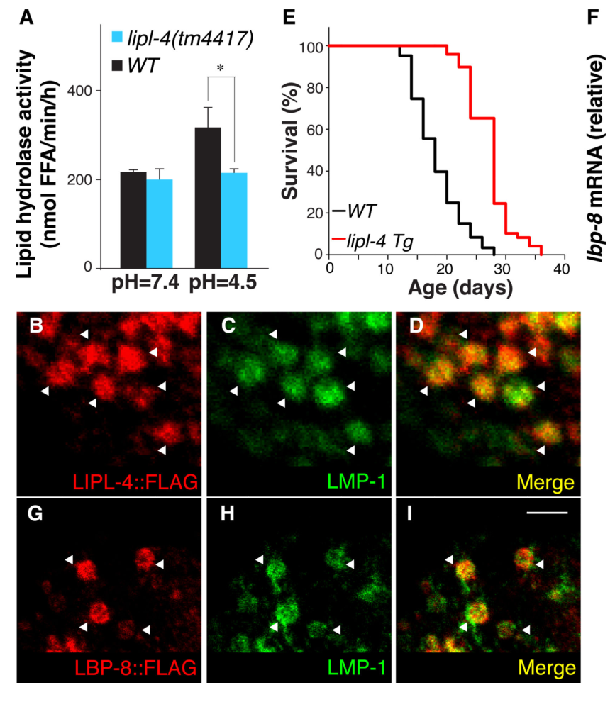

## Question

# Gene Research for Functional Annotation

## ⚠️ CRITICAL: Gene/Protein Identification Context

**BEFORE YOU BEGIN RESEARCH:** You MUST verify you are researching the CORRECT gene/protein. Gene symbols can be ambiguous, especially for less well-characterized genes from non-model organisms.

### Target Gene/Protein Identity (from UniProt):
- **UniProt Accession:** O02324
- **Protein Description:** RecName: Full=Fatty acid-binding protein homolog 8 {ECO:0000305};
- **Gene Information:** Name=lbp-8 {ECO:0000312|WormBase:T22G5.6}; ORFNames=T22G5.6 {ECO:0000312|WormBase:T22G5.6};
- **Organism (full):** Caenorhabditis elegans.
- **Protein Family:** Belongs to the calycin superfamily. Fatty-acid binding
- **Key Domains:** Calycin. (IPR012674); Fatty_acid-bd. (IPR000463); ILBP. (IPR031259)

### MANDATORY VERIFICATION STEPS:

1. **Check if the gene symbol "lbp-8" matches the protein description above**
2. **Verify the organism is correct:** Caenorhabditis elegans.
3. **Check if protein family/domains align with what you find in literature**
4. **If you find literature for a DIFFERENT gene with the same or similar symbol, STOP**

### If Gene Symbol is Ambiguous or You Cannot Find Relevant Literature:

**DO NOT PROCEED WITH RESEARCH ON A DIFFERENT GENE.** Instead:
- State clearly: "The gene symbol 'lbp-8' is ambiguous or literature is limited for this specific protein"
- Explain what you found (e.g., "Found extensive literature on a different gene with the same symbol in a different organism")
- Describe the protein based ONLY on the UniProt information provided above
- Suggest that the protein function can be inferred from domain/family information

### Research Target:

Please provide a comprehensive research report on the gene **lbp-8** (gene ID: lbp-8, UniProt: O02324) in worm.

The research report should be a detailed narrative explaining the function, biological processes, and localization of the gene product. Citations should be given for all claims.

You should prioritize authoritative reviews and primary scientific literature when conducting research. You can supplement
this with annotations you find in gene/protein databases, but these can be outdated or inaccurate.

We are specifically interested in the primary function of the gene - for enzymes, what reaction is catalyzed, and what is the substrate specificity? For transporters, what is the substrate? For structural proteins or adapters, what is the broader structural role? For signaling molecules, what is the role in the pathway.

We are interested in where in or outside the cell the gene product carries out its function.

We are also interested in the signaling or biochemical pathways in which the gene functions. We are less interested in broad pleiotropic effects, except where these elucidate the precise role.

Include evidence where possible. We are interested in both experimental evidence as well as inference from structure, evolution, or bioinformatic analysis. Precise studies should be prioritized over high-throughput, where available.

## Output

Question: You are an expert researcher providing comprehensive, well-cited information.

Provide detailed information focusing on:
1. Key concepts and definitions with current understanding
2. Recent developments and latest research (prioritize 2023-2024 sources)
3. Current applications and real-world implementations
4. Expert opinions and analysis from authoritative sources
5. Relevant statistics and data from recent studies

Format as a comprehensive research report with proper citations. Include URLs and publication dates where available.
Always prioritize recent, authoritative sources and provide specific citations for all major claims.

# Gene Research for Functional Annotation

## ⚠️ CRITICAL: Gene/Protein Identification Context

**BEFORE YOU BEGIN RESEARCH:** You MUST verify you are researching the CORRECT gene/protein. Gene symbols can be ambiguous, especially for less well-characterized genes from non-model organisms.

### Target Gene/Protein Identity (from UniProt):
- **UniProt Accession:** O02324
- **Protein Description:** RecName: Full=Fatty acid-binding protein homolog 8 {ECO:0000305};
- **Gene Information:** Name=lbp-8 {ECO:0000312|WormBase:T22G5.6}; ORFNames=T22G5.6 {ECO:0000312|WormBase:T22G5.6};
- **Organism (full):** Caenorhabditis elegans.
- **Protein Family:** Belongs to the calycin superfamily. Fatty-acid binding
- **Key Domains:** Calycin. (IPR012674); Fatty_acid-bd. (IPR000463); ILBP. (IPR031259)

### MANDATORY VERIFICATION STEPS:

1. **Check if the gene symbol "lbp-8" matches the protein description above**
2. **Verify the organism is correct:** Caenorhabditis elegans.
3. **Check if protein family/domains align with what you find in literature**
4. **If you find literature for a DIFFERENT gene with the same or similar symbol, STOP**

### If Gene Symbol is Ambiguous or You Cannot Find Relevant Literature:

**DO NOT PROCEED WITH RESEARCH ON A DIFFERENT GENE.** Instead:
- State clearly: "The gene symbol 'lbp-8' is ambiguous or literature is limited for this specific protein"
- Explain what you found (e.g., "Found extensive literature on a different gene with the same symbol in a different organism")
- Describe the protein based ONLY on the UniProt information provided above
- Suggest that the protein function can be inferred from domain/family information

### Research Target:

Please provide a comprehensive research report on the gene **lbp-8** (gene ID: lbp-8, UniProt: O02324) in worm.

The research report should be a detailed narrative explaining the function, biological processes, and localization of the gene product. Citations should be given for all claims.

You should prioritize authoritative reviews and primary scientific literature when conducting research. You can supplement
this with annotations you find in gene/protein databases, but these can be outdated or inaccurate.

We are specifically interested in the primary function of the gene - for enzymes, what reaction is catalyzed, and what is the substrate specificity? For transporters, what is the substrate? For structural proteins or adapters, what is the broader structural role? For signaling molecules, what is the role in the pathway.

We are interested in where in or outside the cell the gene product carries out its function.

We are also interested in the signaling or biochemical pathways in which the gene functions. We are less interested in broad pleiotropic effects, except where these elucidate the precise role.

Include evidence where possible. We are interested in both experimental evidence as well as inference from structure, evolution, or bioinformatic analysis. Precise studies should be prioritized over high-throughput, where available.

## Research report: *Caenorhabditis elegans* **lbp-8** (UniProt O02324; WormBase locus **T22G5.6**)—functional annotation

### 1) Gene/protein identity verification (mandatory)
The *C. elegans* gene **lbp-8** is explicitly mapped to the predicted locus **T22G5.6** (“lbp-8 = T22G5.6”) in early nematode iFABP gene-family work, where it was classified as one of the nematode **intracellular fatty acid-binding protein (iFABP)** genes (lbp-1 through lbp-8). (Feb 2000; *Molecular and Biochemical Parasitology*; https://doi.org/10.1016/S0166-6851(99)00179-6) (plenefisch2000secretionofa pages 3-4)

Subsequent functional and structural studies on “LBP-8” in *C. elegans* consistently describe a **fatty-acid/lipid-binding protein** in the FABP/iLBP group that participates in lysosome-to-nucleus lipid signaling and longevity. (Jan 2015; *Science*; https://doi.org/10.1126/science.1258857) (folick2015lysosomalsignalingmolecules pages 1-3, folick2015lysosomalsignalingmolecules pages 4-10) (Jul 2019; *Scientific Reports*; https://doi.org/10.1038/s41598-019-46230-8) (tillman2019structuralcharacterizationof pages 1-2, tillman2019structuralcharacterizationof pages 2-3)

No evidence in the retrieved literature suggests this *C. elegans* **lbp-8/T22G5.6** is conflated with a different organism’s “LBP-8”; the key mechanistic papers are explicitly in *Caenorhabditis elegans*. (folick2015lysosomalsignalingmolecules pages 1-3, plenefisch2000secretionofa pages 3-4)

### 2) Key concepts and definitions (current understanding)

#### 2.1 What are FABPs/iLBPs/calycins?
Fatty acid-binding proteins (FABPs; also termed intracellular lipid-binding proteins, iLBPs) are **small, soluble, non-enzymatic proteins** that **bind hydrophobic ligands** (notably fatty acids and metabolites) and support intracellular lipid handling. A 2024 review synthesizes a consensus view that FABPs function as **“sensors, conveyors and modulators”**: they bind lipid metabolites, shuttle/sequester them, and modulate metabolic/signaling programs (including via nuclear receptor pathways). (Mar 2024; *Journal of Cellular and Molecular Medicine*; https://doi.org/10.1111/jcmm.17703) (agellon2024importanceoffatty pages 1-2, agellon2024importanceoffatty pages 5-6)

Structurally, FABPs belong to the **calycin/lipocalin-like superfamily**, sharing a conserved fold despite low sequence identity, including a β-barrel that encloses a ligand-binding cavity and an α-helical “lid/portal” implicated in ligand entry and membrane interactions. (Mar 2024; https://doi.org/10.1111/jcmm.17703) (agellon2024importanceoffatty pages 4-5, agellon2024importanceoffatty pages 2-4)

#### 2.2 Implication for LBP-8 biochemical function
By this definition, **LBP-8’s primary molecular function is expected to be ligand binding and intracellular transport/targeting of hydrophobic metabolites**, not catalysis. The *C. elegans* literature directly supports this: LBP-8 is experimentally characterized as a lipid chaperone that translocates between lysosome and nucleus and drives transcriptional outputs via nuclear receptors. (folick2015lysosomalsignalingmolecules pages 1-3, folick2015lysosomalsignalingmolecules pages 4-10, tillman2019structuralcharacterizationof pages 1-2)

### 3) Molecular function: ligands (“substrates”), binding, and structural determinants

#### 3.1 Ligand classes bound by LBP-8
LBP-8 binds long-chain fatty acids and fatty-acid derivatives. In the longevity-defining study, LBP-8 binds **arachidonic acid (AA)**, **ω-3 AA**, **dihomo-γ-linolenic acid (DGLA)**, and the fatty-acid ethanolamide **oleoylethanolamide (OEA)**. In competitive binding assays, **OEA bound LBP-8 with ~3× higher affinity than the tested fatty acids** (relative comparison reported). (Jan 2015; *Science*; https://doi.org/10.1126/science.1258857) (folick2015lysosomalsignalingmolecules pages 3-4, folick2015lysosomalsignalingmolecules pages 4-10)

Structural/biochemical follow-up indicates a preference for **monounsaturated fatty acyls**, and shows that LBP-8 can co-purify with fatty acids and exchange ligands upon exposure to worm lipid extracts (e.g., enrichment for unsaturated species including oleic acid). (Jul 2019; *Scientific Reports*; https://doi.org/10.1038/s41598-019-46230-8) (tillman2019structuralcharacterizationof pages 3-6, tillman2019structuralcharacterizationof pages 9-10)

#### 3.2 Structural basis for binding and trafficking
LBP-8’s crystal structure at **1.3 Å** (PDB **6C1Z**) shows the canonical FABP fold (helix-turn-helix lid + 10-stranded β-barrel) and defines a ligand cavity (reported surface area ~**825 Ų** and volume ~**1170 ų**) lined by hydrophobic residues plus polar residues including conserved **R132**, implicated in head-group interactions. (Jul 2019; https://doi.org/10.1038/s41598-019-46230-8) (tillman2019structuralcharacterizationof pages 6-7, tillman2019structuralcharacterizationof pages 2-3)

A key feature of LBP-8 is a conserved, structural **nuclear localization signal (NLS)** formed by basic residues (K24/R33/K34). Deletion/mutation of this region abolishes nuclear translocation. (Jul 2019; https://doi.org/10.1038/s41598-019-46230-8) (tillman2019structuralcharacterizationof pages 3-6)

### 4) Biological role and pathways: lysosome-to-nucleus lipid signaling and longevity

#### 4.1 Core pathway model
The central experimentally supported model is a **lysosome-to-nucleus lipid signaling pathway**:
1) Lysosomal lipolysis is stimulated via the lysosomal acid lipase **LIPL-4**.
2) LBP-8 levels increase and LBP-8 **translocates from lysosomes to the nucleus**.
3) LBP-8 carries lipid ligands (notably **OEA**) to nuclear hormone receptor machinery.
4) Nuclear receptors **NHR-80** (direct OEA-binding) and **NHR-49** (partner/cofactor) drive transcriptional programs (e.g., fatty-acid metabolism genes such as **acs-2**) that promote longevity. (folick2015lysosomalsignalingmolecules pages 1-3, folick2015lysosomalsignalingmolecules pages 3-4, folick2015lysosomalsignalingmolecules pages 4-10)

The 2015 *Science* paper provides causal genetic support: **lbp-8 loss-of-function suppresses lipl-4-driven lifespan extension**, while **lbp-8 overexpression is sufficient to extend lifespan**. (https://doi.org/10.1126/science.1258857) (folick2015lysosomalsignalingmolecules pages 1-3, folick2015lysosomalsignalingmolecules pages 4-10)

#### 4.2 Quantitative phenotypes and transcriptional outputs
Key quantitative outcomes reported include:
- **lipl-4 overexpression**: ~**55%** mean lifespan increase. (folick2015lysosomalsignalingmolecules pages 1-3)
- **lbp-8 overexpression**: ~**30%** mean lifespan increase. (folick2015lysosomalsignalingmolecules pages 1-3, folick2015lysosomalsignalingmolecules pages 4-10)
- **lbp-8 loss-of-function**: reduces lipl-4-mediated lifespan extension by ~**46%** (reported as reduction of the extension). (folick2015lysosomalsignalingmolecules pages 4-10)
- **Nuclear localization requirement**: NLS-deleted LBP-8 is excluded from nuclei and shows little/no lifespan extension; transcription of **acs-2** increases **>10-fold** in lbp-8 transgenics but not in NLS-deficient lbp-8 transgenics. (folick2015lysosomalsignalingmolecules pages 3-4, folick2015lysosomalsignalingmolecules pages 1-3)
- **OEA signaling outputs**: after **3 h** of OEA-analogue treatment, **lbp-8** transcription increased **>4-fold** and **acs-2** **>7-fold**. (folick2015lysosomalsignalingmolecules pages 3-4)

The supporting visual evidence for localization, nuclear enrichment, and lifespan effects is shown in the retrieved figure panels from Folick et al. (LBP-8 lysosomal localization; nuclear localization; lifespan curves; ligand competition/binding assays). (folick2015lysosomalsignalingmolecules media 5ffc0917, folick2015lysosomalsignalingmolecules media 6d188de1, folick2015lysosomalsignalingmolecules media 8dce14ac)

#### 4.3 Receptor/ligand specificity within the pathway
NHR-80 binds OEA directly with **Kd = 7.841 µM** (intrinsic fluorescence assay), whereas no OEA binding was detected for NHR-49 in that study, consistent with NHR-49 acting in a receptor complex rather than as the direct OEA-binding receptor. (Jan 2015; https://doi.org/10.1126/science.1258857) (folick2015lysosomalsignalingmolecules pages 3-4)

### 5) Subcellular and tissue localization (where LBP-8 acts)

#### 5.1 Tissue restriction
In the primary longevity pathway study, **lbp-8 expression was reported as exclusive to the intestine**. (folick2015lysosomalsignalingmolecules pages 1-3)

#### 5.2 Organelle and nuclear localization
LBP-8 is predominantly **lysosomal in intestinal cells**, co-localizing with lysosomal marker **LMP-1**, and also appears in nuclear and cytosolic fractions; **lipl-4** overexpression enhances the nuclear fraction. (folick2015lysosomalsignalingmolecules pages 1-3, folick2015lysosomalsignalingmolecules pages 4-10)

The figure evidence retrieved from Folick et al. shows lysosomal co-localization and nuclear localization panels consistent with this dual localization and translocation model. (folick2015lysosomalsignalingmolecules media 5ffc0917, folick2015lysosomalsignalingmolecules media 6d188de1, folick2015lysosomalsignalingmolecules media 8dce14ac)

### 6) Recent developments (prioritizing 2023–2024) and current expert analysis

#### 6.1 2023: NHR-49 as an aging/stress hub contextualizes lbp-8
A 2023 review positions **NHR-49** as an essential regulator of stress resilience and healthy aging, describing its roles in fatty-acid catabolism/desaturation and its partnership with NHR-80 (heterodimerization) and cofactors such as MDT-15. While this review excerpt does not focus on LBP-8 directly, it strengthens the pathway-level interpretation that LBP-8’s longevity effect is mediated through an established NHR-49/NHR-80 lipid-metabolism transcriptional module. (Aug 2023; *Frontiers in Physiology*; https://doi.org/10.3389/fphys.2023.1241591) (doering2023nuclearhormonereceptor pages 1-2)

#### 6.2 2024: FABPs as sensors/conveyors/modulators—supporting mechanistic interpretation
The 2024 FABP review provides a modern synthesis that FABPs can act as ligand-dependent **nuclear signaling modulators**, including in some contexts translocating to the nucleus to engage nuclear receptors. This framework aligns with LBP-8’s experimentally observed lysosome-to-nucleus translocation and receptor-linked transcriptional regulation. (Mar 2024; https://doi.org/10.1111/jcmm.17703) (agellon2024importanceoffatty pages 4-5, agellon2024importanceoffatty pages 5-6)

#### 6.3 Note on 2023–2024 lbp-8-specific primary literature
Within the retrieved corpus, the most detailed LBP-8-specific mechanistic primary literature remains 2015 (*Science*) and 2019 (*Scientific Reports*), with additional mechanistic expansion in 2021 (preprint) and 2022 (*Nature Cell Biology*). The retrieved 2023–2024 sources primarily provide **authoritative synthesis and context** (NHR-49 biology; FABP family function) rather than new LBP-8-specific experiments. (doering2023nuclearhormonereceptor pages 1-2, agellon2024importanceoffatty pages 1-2)

### 7) Current applications and real-world implementations

1) **Aging and lysosome-to-nucleus signaling model system**: LBP-8 is used as a genetically tractable node to study how lysosomal lipolysis generates lipid signals that reprogram transcription to alter lifespan (lipl-4 → LBP-8 → NHR-49/NHR-80 → target genes). This pathway provides a concrete experimental system for “organelle communication” in aging. (folick2015lysosomalsignalingmolecules pages 4-10, tillman2019structuralcharacterizationof pages 1-2)

2) **Structure-guided lipid-chaperone biology**: The high-resolution LBP-8 structure (6C1Z) and defined NLS residues enable mutational tests of nuclear trafficking and ligand binding, and provide a scaffold for interpreting how sequence divergence preserves a conserved FABP fold with altered cavity chemistry. (tillman2019structuralcharacterizationof pages 2-3, tillman2019structuralcharacterizationof pages 6-7)

3) **Inter-tissue lipid signaling context**: In a broader lysosomal lipid signaling network, LBP-8 can show additive lifespan extension effects with LBP-3, helping dissect tissue-to-neuron communication (though LBP-3 is the more prominent inter-tissue transporter in that study). (Jun 2022; *Nature Cell Biology*; https://doi.org/10.1038/s41556-022-00926-8) (savini2022lysosomelipidsignalling pages 10-10)

### 8) Evidence summary table
The following evidence matrix summarizes identity, family, localization, ligands, pathways, quantitative phenotypes, and methods.

| Claim/Aspect | Key findings with quantitative values when available | Primary source (year, journal) plus URL |
|---|---|---|
| Identity | **lbp-8** in *Caenorhabditis elegans* is explicitly mapped to **T22G5.6**: “lbp-8 = T22G5.6”; classified as one of the nematode intracellular fatty acid-binding protein (**iFABP**) genes. Later work identifies LBP-8 as the C. elegans lipid/fatty-acid binding protein studied in longevity signaling. (plenefisch2000secretionofa pages 3-4, tillman2019structuralcharacterizationof pages 1-2) | Plenefisch et al. 2000, *Molecular and Biochemical Parasitology*. https://doi.org/10.1016/S0166-6851(99)00179-6; Tillman et al. 2019, *Scientific Reports*. https://doi.org/10.1038/s41598-019-46230-8 |
| Family / structure | LBP-8 is an intracellular lipid-binding protein of the **FABP/iLBP** group within the **calycin/lipocalin-like** fold class; the 1.3 Å crystal structure (PDB **6C1Z**) shows the canonical FABP architecture: N-terminal helix-turn-helix lid plus twisted 10-stranded antiparallel β-barrel. Protein is monomeric at ~**16.4 kDa**. The portal region supports a “collisional” FABP-like membrane interaction model. (tillman2019structuralcharacterizationof pages 1-2, tillman2019structuralcharacterizationof pages 2-3) | Tillman et al. 2019, *Scientific Reports*. https://doi.org/10.1038/s41598-019-46230-8 |
| General FABP concept relevant to annotation | FABPs are small cytosolic lipid-binding proteins that act as **sensors, conveyors, and modulators** of hydrophobic metabolites; they typically bind fatty acids noncovalently and can shuttle ligands to membranes or nuclear receptors. These family properties support interpreting LBP-8 as a non-enzymatic lipid chaperone rather than an enzyme. (agellon2024importanceoffatty pages 1-2, agellon2024importanceoffatty pages 4-5, agellon2024importanceoffatty pages 2-4, agellon2024importanceoffatty pages 5-6) | Agellon 2024, *Journal of Cellular and Molecular Medicine*. https://doi.org/10.1111/jcmm.17703; Zhang et al. 2020, *FEBS Open Bio*. https://doi.org/10.1002/2211-5463.12840 |
| Tissue expression | In the key longevity study, **lbp-8 was exclusively expressed in the intestine**. (folick2015lysosomalsignalingmolecules pages 1-3) | Folick et al. 2015, *Science*. https://doi.org/10.1126/science.1258857 |
| Subcellular localization | LBP-8 localizes predominantly to **intestinal lysosomes** (co-localization with **LMP-1**) and is also detected in **nuclear and cytoplasmic fractions**; **lipl-4** overexpression enhances nuclear localization. In an LBP-8::GFP strain, **72–100%** of worms showed nuclear enrichment in the first intestinal cell pair under control conditions; **rpc-2 RNAi** significantly reduced nuclear-enriched LBP-8. Visual evidence is in Folick Fig. 1G–I and 2A–G. (folick2015lysosomalsignalingmolecules pages 1-3, duffy2021lipidchaperonelbp8 pages 5-8, folick2015lysosomalsignalingmolecules pages 4-10, folick2015lysosomalsignalingmolecules media 5ffc0917) | Folick et al. 2015, *Science*. https://doi.org/10.1126/science.1258857; Duffy et al. 2021, *bioRxiv*. https://doi.org/10.1101/2021.09.09.459489 |
| Nuclear localization signal | LBP-8 contains an N-terminal / structural **NLS**. Basic residues **K24, R33, K34** form a conserved 3D NLS analogous to mammalian FABP5. Deleting or mutating this region abolishes nuclear translocation, and NLS-deficient LBP-8 loses most longevity activity and fails to induce **acs-2**. (folick2015lysosomalsignalingmolecules pages 1-3, tillman2019structuralcharacterizationof pages 3-6) | Folick et al. 2015, *Science*. https://doi.org/10.1126/science.1258857; Tillman et al. 2019, *Scientific Reports*. https://doi.org/10.1038/s41598-019-46230-8 |
| Ligands / binding specificity | LBP-8 binds long-chain fatty acids and fatty-acid derivatives. Reported ligands include **oleoylethanolamide (OEA)**, **oleic acid**, **arachidonic acid (AA)**, **ω-3 AA**, and **DGLA**; competition assays showed **OEA binds with ~3-fold higher affinity** than the tested fatty acids. Structural/lipidomic work indicates preference for **monounsaturated fatty acyls** and identifies co-purifying **palmitic (16:0)** and **oleic (18:1)** acids from *E. coli* and, after exposure to worm extracts, enrichment for **myristic (14:0)** and unsaturated fatty acids including **arachidonic (20:4)**, **linoleic (18:2)**, and **palmitoleic (16:1)**; oleic acid remained most abundant. (folick2015lysosomalsignalingmolecules pages 3-4, tillman2019structuralcharacterizationof pages 3-6, folick2015lysosomalsignalingmolecules pages 4-10, tillman2019structuralcharacterizationof pages 9-10, tillman2019structuralcharacterizationof pages 6-7) | Folick et al. 2015, *Science*. https://doi.org/10.1126/science.1258857; Tillman et al. 2019, *Scientific Reports*. https://doi.org/10.1038/s41598-019-46230-8 |
| Binding pocket features | The ligand cavity has solvent-accessible surface area ~**825 Ų** and volume ~**1170 ų**; it is lined by hydrophobic residues (**F19, F60, L65, F67, F73, F94, F110, T112, F134**) plus polar residues including conserved **R132** implicated in ligand head-group recognition. Interior/pocket mutants (**Q121A, Y123A, R132A**) altered ligand interactions. (tillman2019structuralcharacterizationof pages 6-7, tillman2019structuralcharacterizationof pages 8-9) | Tillman et al. 2019, *Scientific Reports*. https://doi.org/10.1038/s41598-019-46230-8 |
| Primary molecular function | Best-supported annotation: LBP-8 is a **non-enzymatic intracellular lipid chaperone** that transfers lysosome-derived lipid signals to the nucleus. It does **not catalyze a reaction**; instead, it binds hydrophobic ligands and facilitates their delivery to transcriptional regulators. (folick2015lysosomalsignalingmolecules pages 1-3, tillman2019structuralcharacterizationof pages 2-3, agellon2024importanceoffatty pages 5-6, tillman2019structuralcharacterizationof pages 1-2) | Folick et al. 2015, *Science*. https://doi.org/10.1126/science.1258857; Agellon 2024, *Journal of Cellular and Molecular Medicine*. https://doi.org/10.1111/jcmm.17703 |
| Upstream pathway input | **LIPL-4** lysosomal lipase induction upregulates **lbp-8** and increases nuclear translocation of LBP-8. LIPL-4 overexpression elevates OEA and other fatty acids and extends mean lifespan by about **55%**. LBP-8 is required for much of this effect. (folick2015lysosomalsignalingmolecules pages 1-3, folick2015lysosomalsignalingmolecules pages 4-10) | Folick et al. 2015, *Science*. https://doi.org/10.1126/science.1258857 |
| Downstream pathway / nuclear receptors | LBP-8 acts in a **lysosome-to-nucleus lipid signaling** pathway activating nuclear receptors **NHR-49** and **NHR-80**. OEA binds **NHR-80** directly with **Kd = 7.841 µM**; no OEA binding was detected for NHR-49, consistent with NHR-49 acting as a cofactor/partner. LBP-8 nuclear action increases transcription of targets such as **acs-2**; **acs-2** induction exceeded **10-fold** in lbp-8 transgenics but not in NLS-deficient transgenics. (folick2015lysosomalsignalingmolecules pages 3-4, folick2015lysosomalsignalingmolecules pages 4-10, tillman2019structuralcharacterizationof pages 1-2, doering2023nuclearhormonereceptor pages 1-2) | Folick et al. 2015, *Science*. https://doi.org/10.1126/science.1258857; Doering et al. 2023, *Frontiers in Physiology*. https://doi.org/10.3389/fphys.2023.1241591 |
| Nutrient / metabolic regulation | **nhr-49** regulates **lbp-8** expression in nutritional response pathways; earlier work reported **~4-fold** compromised lbp-8 expression in fed **nhr-49(nr2041)** mutants. Review literature in 2023 emphasizes NHR-49 as a central regulator of lipid metabolism, stress resilience, and healthy aging, providing context for LBP-8’s placement in this pathway. (doering2023nuclearhormonereceptor pages 1-2) | van Gilst et al. 2005, *PNAS*. https://doi.org/10.1073/pnas.0506234102; Doering et al. 2023, *Frontiers in Physiology*. https://doi.org/10.3389/fphys.2023.1241591 |
| Longevity phenotype | **lbp-8 overexpression** increases mean lifespan by about **30%**. **lbp-8 loss-of-function** does not strongly alter WT lifespan but reduces **lipl-4**-mediated lifespan extension by about **46%**. A transgenic LBP-8 lacking the NLS shows little or no lifespan extension. Visual lifespan evidence is in Folick Fig. 2I. (folick2015lysosomalsignalingmolecules pages 1-3, folick2015lysosomalsignalingmolecules pages 4-10, folick2015lysosomalsignalingmolecules media 5ffc0917) | Folick et al. 2015, *Science*. https://doi.org/10.1126/science.1258857 |
| OEA-related quantitative effects | OEA or an OEA analogue increased transcription of **lbp-8** by **>4-fold** and **acs-2** by **>7-fold** after **3 h** treatment; direct OEA-analogue treatment prolonged WT lifespan but did not further extend lifespan in **lipl-4** or **lbp-8** transgenics. **nape-1** loss suppressed lifespan extension in **lipl-4 Tg** and **lbp-8 Tg** by about **half**. (folick2015lysosomalsignalingmolecules pages 3-4) | Folick et al. 2015, *Science*. https://doi.org/10.1126/science.1258857 |
| Additional phenotypic / functional effects | A 2021 proteomic-genetic study reported that LBP-8 overexpression reduced fat storage and upregulated mitochondrial β-oxidation genes; in a screen, day-17 survival averaged **56% alive vs 38% WT** for the overexpression strain under EV controls. (duffy2021lipidchaperonelbp8 pages 1-5, duffy2021lipidchaperonelbp8 pages 5-8) | Duffy et al. 2021, *bioRxiv*. https://doi.org/10.1101/2021.09.09.459489 |
| Protein partners / nuclear retention | Anti-FLAG IP-MS identified **45** candidate LBP-8 interactors (≥**50-fold** enrichment cutoff; replicate correlations **R = 0.89–0.94**). Several genes were required for LBP-8-mediated longevity, especially the nuclear factor **RPC-2**, which was also necessary for robust nuclear localization of LBP-8; nuclear **import**, rather than export, was required for the longevity effect. (duffy2021lipidchaperonelbp8 pages 1-5, duffy2021lipidchaperonelbp8 pages 5-8, duffy2021lipidchaperonelbp8 pages 18-27) | Duffy et al. 2021, *bioRxiv*. https://doi.org/10.1101/2021.09.09.459489 |
| Relationship to inter-tissue lipid signaling | In a broader lysosomal lipid-signaling network, **LBP-3** and **LBP-8** can have additive effects on lifespan; **nhr-49** is required downstream of intestine-derived lysosomal lipid signaling to neuropeptide pathways. However, lbp-8 alone had minimal effect on some neuropeptide transcripts compared with lbp-3. (savini2022lysosomelipidsignalling pages 10-10) | Savini et al. 2022, *Nature Cell Biology*. https://doi.org/10.1038/s41556-022-00926-8 |
| Key methods supporting annotation | Gene-family mapping / sequence inspection; transgenics and mutant analysis; RNAi; lysosome marker co-localization (**LMP-1**); nuclear/cytoplasmic fractionation; lifespan assays; fluorescence competition binding; intrinsic fluorescence for receptor binding; X-ray crystallography (**1.3 Å**, PDB **6C1Z**); 1,8-ANS binding assays; differential scanning fluorimetry; circular dichroism; lipid extraction and mass spectrometry; anti-FLAG IP-MS proteomics. (folick2015lysosomalsignalingmolecules pages 1-3, folick2015lysosomalsignalingmolecules pages 3-4, duffy2021lipidchaperonelbp8 pages 5-8, tillman2019structuralcharacterizationof pages 2-3, tillman2019structuralcharacterizationof pages 10-11, folick2015lysosomalsignalingmolecules media 5ffc0917) | Plenefisch et al. 2000, *Molecular and Biochemical Parasitology*. https://doi.org/10.1016/S0166-6851(99)00179-6; Folick et al. 2015, *Science*. https://doi.org/10.1126/science.1258857; Tillman et al. 2019, *Scientific Reports*. https://doi.org/10.1038/s41598-019-46230-8; Duffy et al. 2021, *bioRxiv*. https://doi.org/10.1101/2021.09.09.459489 |

*Table: This table summarizes identity, molecular function, localization, pathway placement, ligands, phenotypes, and methods for C. elegans LBP-8 using only the cited evidence sources. It is useful as a compact evidence matrix for functional annotation of lbp-8/T22G5.6 (UniProt O02324).*

### 9) Concise functional annotation (recommended)
**lbp-8 (T22G5.6; UniProt O02324)** encodes an **intracellular fatty-acid binding protein (FABP/iLBP; calycin/lipocalin-like fold)** expressed in the **intestine**, localized primarily to **lysosomes** but capable of **nuclear translocation** via a conserved structural **NLS**. LBP-8 binds long-chain lipids including **OEA** (higher relative affinity vs tested fatty acids) and functions as a **lysosome-to-nucleus lipid chaperone** that engages the **NHR-49/NHR-80 transcriptional module** (with direct OEA binding shown for NHR-80, Kd ~7.841 µM), thereby inducing lipid-metabolic transcriptional programs (e.g., **acs-2**) and promoting **longevity** when overexpressed. (folick2015lysosomalsignalingmolecules pages 4-10, folick2015lysosomalsignalingmolecules pages 3-4, tillman2019structuralcharacterizationof pages 3-6, plenefisch2000secretionofa pages 3-4)

References

1. (plenefisch2000secretionofa pages 3-4): John Plenefisch, Hong Xiao, Baisong Mei, Jinming Geng, Patricia R Komuniecki, and Richard Komuniecki. Secretion of a novel class of ifabps in nematodes: coordinate use of the ascaris/caenorhabditis model systems. Molecular and biochemical parasitology, 105 2:223-36, Feb 2000. URL: https://doi.org/10.1016/s0166-6851(99)00179-6, doi:10.1016/s0166-6851(99)00179-6. This article has 57 citations and is from a peer-reviewed journal.

2. (folick2015lysosomalsignalingmolecules pages 1-3): Andrew Folick, Holly D. Oakley, Yong Yu, Eric H. Armstrong, Manju Kumari, Lucas Sanor, David D. Moore, Eric A. Ortlund, Rudolf Zechner, and Meng C. Wang. Lysosomal signaling molecules regulate longevity in caenorhabditis elegans. Science, 347:83-86, Jan 2015. URL: https://doi.org/10.1126/science.1258857, doi:10.1126/science.1258857. This article has 316 citations and is from a highest quality peer-reviewed journal.

3. (folick2015lysosomalsignalingmolecules pages 4-10): Andrew Folick, Holly D. Oakley, Yong Yu, Eric H. Armstrong, Manju Kumari, Lucas Sanor, David D. Moore, Eric A. Ortlund, Rudolf Zechner, and Meng C. Wang. Lysosomal signaling molecules regulate longevity in caenorhabditis elegans. Science, 347:83-86, Jan 2015. URL: https://doi.org/10.1126/science.1258857, doi:10.1126/science.1258857. This article has 316 citations and is from a highest quality peer-reviewed journal.

4. (tillman2019structuralcharacterizationof pages 1-2): Matthew C. Tillman, Manoj Khadka, Jonathon Duffy, Meng C. Wang, and Eric A. Ortlund. Structural characterization of life-extending caenorhabditis elegans lipid binding protein 8. Scientific Reports, Jul 2019. URL: https://doi.org/10.1038/s41598-019-46230-8, doi:10.1038/s41598-019-46230-8. This article has 15 citations and is from a peer-reviewed journal.

5. (tillman2019structuralcharacterizationof pages 2-3): Matthew C. Tillman, Manoj Khadka, Jonathon Duffy, Meng C. Wang, and Eric A. Ortlund. Structural characterization of life-extending caenorhabditis elegans lipid binding protein 8. Scientific Reports, Jul 2019. URL: https://doi.org/10.1038/s41598-019-46230-8, doi:10.1038/s41598-019-46230-8. This article has 15 citations and is from a peer-reviewed journal.

6. (agellon2024importanceoffatty pages 1-2): Luis B. Agellon. Importance of fatty acid binding proteins in cellular function and organismal metabolism. Journal of Cellular and Molecular Medicine, Mar 2024. URL: https://doi.org/10.1111/jcmm.17703, doi:10.1111/jcmm.17703. This article has 27 citations and is from a peer-reviewed journal.

7. (agellon2024importanceoffatty pages 5-6): Luis B. Agellon. Importance of fatty acid binding proteins in cellular function and organismal metabolism. Journal of Cellular and Molecular Medicine, Mar 2024. URL: https://doi.org/10.1111/jcmm.17703, doi:10.1111/jcmm.17703. This article has 27 citations and is from a peer-reviewed journal.

8. (agellon2024importanceoffatty pages 4-5): Luis B. Agellon. Importance of fatty acid binding proteins in cellular function and organismal metabolism. Journal of Cellular and Molecular Medicine, Mar 2024. URL: https://doi.org/10.1111/jcmm.17703, doi:10.1111/jcmm.17703. This article has 27 citations and is from a peer-reviewed journal.

9. (agellon2024importanceoffatty pages 2-4): Luis B. Agellon. Importance of fatty acid binding proteins in cellular function and organismal metabolism. Journal of Cellular and Molecular Medicine, Mar 2024. URL: https://doi.org/10.1111/jcmm.17703, doi:10.1111/jcmm.17703. This article has 27 citations and is from a peer-reviewed journal.

10. (folick2015lysosomalsignalingmolecules pages 3-4): Andrew Folick, Holly D. Oakley, Yong Yu, Eric H. Armstrong, Manju Kumari, Lucas Sanor, David D. Moore, Eric A. Ortlund, Rudolf Zechner, and Meng C. Wang. Lysosomal signaling molecules regulate longevity in caenorhabditis elegans. Science, 347:83-86, Jan 2015. URL: https://doi.org/10.1126/science.1258857, doi:10.1126/science.1258857. This article has 316 citations and is from a highest quality peer-reviewed journal.

11. (tillman2019structuralcharacterizationof pages 3-6): Matthew C. Tillman, Manoj Khadka, Jonathon Duffy, Meng C. Wang, and Eric A. Ortlund. Structural characterization of life-extending caenorhabditis elegans lipid binding protein 8. Scientific Reports, Jul 2019. URL: https://doi.org/10.1038/s41598-019-46230-8, doi:10.1038/s41598-019-46230-8. This article has 15 citations and is from a peer-reviewed journal.

12. (tillman2019structuralcharacterizationof pages 9-10): Matthew C. Tillman, Manoj Khadka, Jonathon Duffy, Meng C. Wang, and Eric A. Ortlund. Structural characterization of life-extending caenorhabditis elegans lipid binding protein 8. Scientific Reports, Jul 2019. URL: https://doi.org/10.1038/s41598-019-46230-8, doi:10.1038/s41598-019-46230-8. This article has 15 citations and is from a peer-reviewed journal.

13. (tillman2019structuralcharacterizationof pages 6-7): Matthew C. Tillman, Manoj Khadka, Jonathon Duffy, Meng C. Wang, and Eric A. Ortlund. Structural characterization of life-extending caenorhabditis elegans lipid binding protein 8. Scientific Reports, Jul 2019. URL: https://doi.org/10.1038/s41598-019-46230-8, doi:10.1038/s41598-019-46230-8. This article has 15 citations and is from a peer-reviewed journal.

14. (folick2015lysosomalsignalingmolecules media 5ffc0917): Andrew Folick, Holly D. Oakley, Yong Yu, Eric H. Armstrong, Manju Kumari, Lucas Sanor, David D. Moore, Eric A. Ortlund, Rudolf Zechner, and Meng C. Wang. Lysosomal signaling molecules regulate longevity in caenorhabditis elegans. Science, 347:83-86, Jan 2015. URL: https://doi.org/10.1126/science.1258857, doi:10.1126/science.1258857. This article has 316 citations and is from a highest quality peer-reviewed journal.

15. (folick2015lysosomalsignalingmolecules media 6d188de1): Andrew Folick, Holly D. Oakley, Yong Yu, Eric H. Armstrong, Manju Kumari, Lucas Sanor, David D. Moore, Eric A. Ortlund, Rudolf Zechner, and Meng C. Wang. Lysosomal signaling molecules regulate longevity in caenorhabditis elegans. Science, 347:83-86, Jan 2015. URL: https://doi.org/10.1126/science.1258857, doi:10.1126/science.1258857. This article has 316 citations and is from a highest quality peer-reviewed journal.

16. (folick2015lysosomalsignalingmolecules media 8dce14ac): Andrew Folick, Holly D. Oakley, Yong Yu, Eric H. Armstrong, Manju Kumari, Lucas Sanor, David D. Moore, Eric A. Ortlund, Rudolf Zechner, and Meng C. Wang. Lysosomal signaling molecules regulate longevity in caenorhabditis elegans. Science, 347:83-86, Jan 2015. URL: https://doi.org/10.1126/science.1258857, doi:10.1126/science.1258857. This article has 316 citations and is from a highest quality peer-reviewed journal.

17. (doering2023nuclearhormonereceptor pages 1-2): Kelsie R. S. Doering, Glafira Ermakova, and Stefan Taubert. Nuclear hormone receptor nhr-49 is an essential regulator of stress resilience and healthy aging in caenorhabditis elegans. Frontiers in Physiology, Aug 2023. URL: https://doi.org/10.3389/fphys.2023.1241591, doi:10.3389/fphys.2023.1241591. This article has 27 citations.

18. (savini2022lysosomelipidsignalling pages 10-10): Marzia Savini, Andrew Folick, Yi-Tang Lee, Feng Jin, André Cuevas, Matthew C. Tillman, Jonathon D. Duffy, Qian Zhao, Isaiah A. Neve, Pei-Wen Hu, Yong Yu, Qinghao Zhang, Youqiong Ye, William B. Mair, Jin Wang, Leng Han, Eric A. Ortlund, and Meng C. Wang. Lysosome lipid signalling from the periphery to neurons regulates longevity. Nature Cell Biology, 24:906-916, Jun 2022. URL: https://doi.org/10.1038/s41556-022-00926-8, doi:10.1038/s41556-022-00926-8. This article has 94 citations and is from a highest quality peer-reviewed journal.

19. (duffy2021lipidchaperonelbp8 pages 5-8): Jonathon Duffy, Qinghao Zhang, Sung Y. Jung, and Meng C. Wang. Lipid chaperone lbp-8 coordinates with nuclear factors to promote longevity in caenorhabditis elegans. bioRxiv, Sep 2021. URL: https://doi.org/10.1101/2021.09.09.459489, doi:10.1101/2021.09.09.459489. This article has 1 citations.

20. (tillman2019structuralcharacterizationof pages 8-9): Matthew C. Tillman, Manoj Khadka, Jonathon Duffy, Meng C. Wang, and Eric A. Ortlund. Structural characterization of life-extending caenorhabditis elegans lipid binding protein 8. Scientific Reports, Jul 2019. URL: https://doi.org/10.1038/s41598-019-46230-8, doi:10.1038/s41598-019-46230-8. This article has 15 citations and is from a peer-reviewed journal.

21. (duffy2021lipidchaperonelbp8 pages 1-5): Jonathon Duffy, Qinghao Zhang, Sung Y. Jung, and Meng C. Wang. Lipid chaperone lbp-8 coordinates with nuclear factors to promote longevity in caenorhabditis elegans. bioRxiv, Sep 2021. URL: https://doi.org/10.1101/2021.09.09.459489, doi:10.1101/2021.09.09.459489. This article has 1 citations.

22. (duffy2021lipidchaperonelbp8 pages 18-27): Jonathon Duffy, Qinghao Zhang, Sung Y. Jung, and Meng C. Wang. Lipid chaperone lbp-8 coordinates with nuclear factors to promote longevity in caenorhabditis elegans. bioRxiv, Sep 2021. URL: https://doi.org/10.1101/2021.09.09.459489, doi:10.1101/2021.09.09.459489. This article has 1 citations.

23. (tillman2019structuralcharacterizationof pages 10-11): Matthew C. Tillman, Manoj Khadka, Jonathon Duffy, Meng C. Wang, and Eric A. Ortlund. Structural characterization of life-extending caenorhabditis elegans lipid binding protein 8. Scientific Reports, Jul 2019. URL: https://doi.org/10.1038/s41598-019-46230-8, doi:10.1038/s41598-019-46230-8. This article has 15 citations and is from a peer-reviewed journal.

## Artifacts

- [Edison artifact artifact-00](lbp-8-deep-research-falcon_artifacts/artifact-00.md)

## Citations

1. plenefisch2000secretionofa pages 3-4
2. tillman2019structuralcharacterizationof pages 3-6
3. folick2015lysosomalsignalingmolecules pages 1-3
4. folick2015lysosomalsignalingmolecules pages 4-10
5. folick2015lysosomalsignalingmolecules pages 3-4
6. doering2023nuclearhormonereceptor pages 1-2
7. savini2022lysosomelipidsignalling pages 10-10
8. tillman2019structuralcharacterizationof pages 1-2
9. tillman2019structuralcharacterizationof pages 2-3
10. agellon2024importanceoffatty pages 1-2
11. agellon2024importanceoffatty pages 5-6
12. agellon2024importanceoffatty pages 4-5
13. agellon2024importanceoffatty pages 2-4
14. tillman2019structuralcharacterizationof pages 9-10
15. tillman2019structuralcharacterizationof pages 6-7
16. tillman2019structuralcharacterizationof pages 8-9
17. tillman2019structuralcharacterizationof pages 10-11
18. https://doi.org/10.1016/S0166-6851(99
19. https://doi.org/10.1126/science.1258857
20. https://doi.org/10.1038/s41598-019-46230-8
21. https://doi.org/10.1111/jcmm.17703
22. https://doi.org/10.3389/fphys.2023.1241591
23. https://doi.org/10.1038/s41556-022-00926-8
24. https://doi.org/10.1111/jcmm.17703;
25. https://doi.org/10.1002/2211-5463.12840
26. https://doi.org/10.1126/science.1258857;
27. https://doi.org/10.1101/2021.09.09.459489
28. https://doi.org/10.1073/pnas.0506234102;
29. https://doi.org/10.1038/s41598-019-46230-8;
30. https://doi.org/10.1016/s0166-6851(99
31. https://doi.org/10.1126/science.1258857,
32. https://doi.org/10.1038/s41598-019-46230-8,
33. https://doi.org/10.1111/jcmm.17703,
34. https://doi.org/10.3389/fphys.2023.1241591,
35. https://doi.org/10.1038/s41556-022-00926-8,
36. https://doi.org/10.1101/2021.09.09.459489,