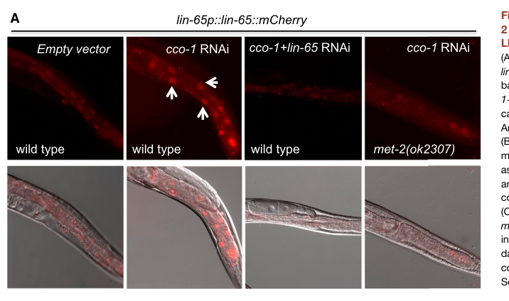

## Question

# Gene Research for Functional Annotation

## ⚠️ CRITICAL: Gene/Protein Identification Context

**BEFORE YOU BEGIN RESEARCH:** You MUST verify you are researching the CORRECT gene/protein. Gene symbols can be ambiguous, especially for less well-characterized genes from non-model organisms.

### Target Gene/Protein Identity (from UniProt):
- **UniProt Accession:** Q95XN0
- **Protein Description:** SubName: Full=LIN-65L {ECO:0000313|EMBL:AAX35668.1};
- **Gene Information:** Name=lin-65 {ECO:0000313|EMBL:CCD67964.1, ECO:0000313|WormBase:Y71G12B.9a}; ORFNames=CELE_Y71G12B.9 {ECO:0000313|EMBL:CCD67964.1}, Y71G12B.9 {ECO:0000313|WormBase:Y71G12B.9a};
- **Organism (full):** Caenorhabditis elegans.
- **Protein Family:** Not specified in UniProt
- **Key Domains:** Not specified in UniProt

### MANDATORY VERIFICATION STEPS:

1. **Check if the gene symbol "lin-65" matches the protein description above**
2. **Verify the organism is correct:** Caenorhabditis elegans.
3. **Check if protein family/domains align with what you find in literature**
4. **If you find literature for a DIFFERENT gene with the same or similar symbol, STOP**

### If Gene Symbol is Ambiguous or You Cannot Find Relevant Literature:

**DO NOT PROCEED WITH RESEARCH ON A DIFFERENT GENE.** Instead:
- State clearly: "The gene symbol 'lin-65' is ambiguous or literature is limited for this specific protein"
- Explain what you found (e.g., "Found extensive literature on a different gene with the same symbol in a different organism")
- Describe the protein based ONLY on the UniProt information provided above
- Suggest that the protein function can be inferred from domain/family information

### Research Target:

Please provide a comprehensive research report on the gene **lin-65** (gene ID: lin-65, UniProt: Q95XN0) in worm.

The research report should be a detailed narrative explaining the function, biological processes, and localization of the gene product. Citations should be given for all claims.

You should prioritize authoritative reviews and primary scientific literature when conducting research. You can supplement
this with annotations you find in gene/protein databases, but these can be outdated or inaccurate.

We are specifically interested in the primary function of the gene - for enzymes, what reaction is catalyzed, and what is the substrate specificity? For transporters, what is the substrate? For structural proteins or adapters, what is the broader structural role? For signaling molecules, what is the role in the pathway.

We are interested in where in or outside the cell the gene product carries out its function.

We are also interested in the signaling or biochemical pathways in which the gene functions. We are less interested in broad pleiotropic effects, except where these elucidate the precise role.

Include evidence where possible. We are interested in both experimental evidence as well as inference from structure, evolution, or bioinformatic analysis. Precise studies should be prioritized over high-throughput, where available.

## Output

Question: You are an expert researcher providing comprehensive, well-cited information.

Provide detailed information focusing on:
1. Key concepts and definitions with current understanding
2. Recent developments and latest research (prioritize 2023-2024 sources)
3. Current applications and real-world implementations
4. Expert opinions and analysis from authoritative sources
5. Relevant statistics and data from recent studies

Format as a comprehensive research report with proper citations. Include URLs and publication dates where available.
Always prioritize recent, authoritative sources and provide specific citations for all major claims.

# Gene Research for Functional Annotation

## ⚠️ CRITICAL: Gene/Protein Identification Context

**BEFORE YOU BEGIN RESEARCH:** You MUST verify you are researching the CORRECT gene/protein. Gene symbols can be ambiguous, especially for less well-characterized genes from non-model organisms.

### Target Gene/Protein Identity (from UniProt):
- **UniProt Accession:** Q95XN0
- **Protein Description:** SubName: Full=LIN-65L {ECO:0000313|EMBL:AAX35668.1};
- **Gene Information:** Name=lin-65 {ECO:0000313|EMBL:CCD67964.1, ECO:0000313|WormBase:Y71G12B.9a}; ORFNames=CELE_Y71G12B.9 {ECO:0000313|EMBL:CCD67964.1}, Y71G12B.9 {ECO:0000313|WormBase:Y71G12B.9a};
- **Organism (full):** Caenorhabditis elegans.
- **Protein Family:** Not specified in UniProt
- **Key Domains:** Not specified in UniProt

### MANDATORY VERIFICATION STEPS:

1. **Check if the gene symbol "lin-65" matches the protein description above**
2. **Verify the organism is correct:** Caenorhabditis elegans.
3. **Check if protein family/domains align with what you find in literature**
4. **If you find literature for a DIFFERENT gene with the same or similar symbol, STOP**

### If Gene Symbol is Ambiguous or You Cannot Find Relevant Literature:

**DO NOT PROCEED WITH RESEARCH ON A DIFFERENT GENE.** Instead:
- State clearly: "The gene symbol 'lin-65' is ambiguous or literature is limited for this specific protein"
- Explain what you found (e.g., "Found extensive literature on a different gene with the same symbol in a different organism")
- Describe the protein based ONLY on the UniProt information provided above
- Suggest that the protein function can be inferred from domain/family information

### Research Target:

Please provide a comprehensive research report on the gene **lin-65** (gene ID: lin-65, UniProt: Q95XN0) in worm.

The research report should be a detailed narrative explaining the function, biological processes, and localization of the gene product. Citations should be given for all claims.

You should prioritize authoritative reviews and primary scientific literature when conducting research. You can supplement
this with annotations you find in gene/protein databases, but these can be outdated or inaccurate.

We are specifically interested in the primary function of the gene - for enzymes, what reaction is catalyzed, and what is the substrate specificity? For transporters, what is the substrate? For structural proteins or adapters, what is the broader structural role? For signaling molecules, what is the role in the pathway.

We are interested in where in or outside the cell the gene product carries out its function.

We are also interested in the signaling or biochemical pathways in which the gene functions. We are less interested in broad pleiotropic effects, except where these elucidate the precise role.

Include evidence where possible. We are interested in both experimental evidence as well as inference from structure, evolution, or bioinformatic analysis. Precise studies should be prioritized over high-throughput, where available.

## Research report: Functional annotation of *C. elegans* **lin-65** (UniProt Q95XN0; ORF Y71G12B.9; “LIN-65L”)

### 0) Identity verification / disambiguation
The literature summarized here pertains to the *Caenorhabditis elegans* gene **lin-65**, molecularly identified as the genomic locus **Y71G12B.9** encoding a ~**728 aa** protein; this mapping is supported by positional mapping, RNAi phenocopy in sensitized synMuv backgrounds, cDNA rescue, and allele sequencing in a dedicated cloning study (Ceol et al., 2006; publication date June 2006; URL https://doi.org/10.1534/genetics.106.056465). (ceol2006identificationandclassification pages 10-11, ceol2006identificationandclassification pages 8-9, ceol2006identificationandclassification pages 7-8, ceol2006identificationandclassification pages 14-16, ceol2006identificationandclassification pages 11-12)

Alleles sequenced in this work include **lin-65(n3441)** and **lin-65(n3541)** (nonsense **W534amber** truncations) and **lin-65(n3543)** (missense **S720L**), consistent with the same gene/protein target and providing a clear link between the symbol *lin-65* and the Y71G12B.9-encoded protein (thus aligning with the UniProt-provided identity context). (ceol2006identificationandclassification pages 10-11, ceol2006identificationandclassification pages 14-16)

### 1) Key concepts and definitions (current understanding)

#### 1.1 LIN-65 as a MET-2/SETDB1 cofactor in H3K9 methylation–linked heterochromatin
A central modern definition of LIN-65 is as an essential cofactor/scaffold for the histone H3 lysine 9 (H3K9) methyltransferase **MET-2** (the worm SETDB1 homolog). In embryos, endogenous MET-2 forms **dynamic perinuclear nuclear foci** associated with heterochromatin; LIN-65 physically associates with MET-2 and is required for MET-2 foci formation, MET-2 nuclear enrichment, and robust H3K9 dimethylation (H3K9me2). (delaney2019heterochromaticfociand pages 1-2, delaney2019heterochromaticfociand pages 6-8)

The prevailing mechanistic concept is that LIN-65 promotes the formation of MET-2-containing heterochromatin “hubs/foci” with condensate-like properties, thereby enabling efficient H3K9 methylation and repression/organization of heterochromatin at the nuclear periphery. (delaney2019heterochromaticfociand pages 1-2, delaney2019heterochromaticfociand pages 6-8)

#### 1.2 LIN-65 as an intrinsically disordered/low-complexity protein
Unlike many chromatin regulators, LIN-65 is not defined by a canonical enzymatic activity or a classical reader domain. Instead, it is described as largely **intrinsically disordered/low-complexity**, with predicted structural elements that include a **coiled-coil** and a **folded C-terminal domain** (including a predicted β-sandwich in one analysis), consistent with a role in multivalent interactions and assembly of nuclear foci. (delaney2019heterochromaticfociand pages 5-6, mutlu2018regulatednuclearaccumulation pages 8-9)

A frequently used analogy is to mammalian **ATF7IP/MCAF1**, a SETDB1 cofactor: LIN-65 is proposed to be a functional counterpart (or convergent analog) that promotes SETDB1/MET-2 nuclear localization and function. (mutlu2018regulatednuclearaccumulation pages 8-9, delaney2019heterochromaticfociand pages 12-14)

#### 1.3 LIN-65 in synMuvB repression of Ras-driven vulval induction
Historically, lin-65 was defined genetically as a **synMuvB/class B** gene: synMuv genes act in parallel pathways to antagonize inappropriate vulval induction (i.e., restrain Ras/EGF signaling outcomes in vulval development). Ceol et al. established lin-65 as class B and provided genetic interaction frameworks placing class A/B/C synMuv genes as parallel negative regulatory arms opposing Ras-driven vulval fates. (ceol2006identificationandclassification pages 10-11, ceol2006identificationandclassification pages 16-17, ceol2006identificationandclassification pages 14-16)

### 2) Molecular function, interactions, localization, and pathway placement (primary evidence)

#### 2.1 Physical interactions: MET-2 and ARLE-14
Proteomics and reciprocal pulldown experiments in embryos identified **LIN-65** and **ARLE-14** as the major stable interactors of MET-2, and conversely MET-2 and ARLE-14 as the major interactors enriched with LIN-65. This supports a model of a MET-2/LIN-65/ARLE-14 functional module for heterochromatin. (delaney2019heterochromaticfociand pages 5-6, delaney2019heterochromaticfociand pages 2-5)

Quantitatively, colocalization of MET-2 foci with LIN-65 and ARLE-14 has been reported (Pearson correlation coefficients **r = 0.65** for LIN-65 and **r = 0.74** for ARLE-14). (delaney2019heterochromaticfociand pages 5-6)

#### 2.2 Subcellular localization and dynamics
**Embryos (heterochromatin onset):** LIN-65 is described as more cytosolic in very early embryos and later accumulating in nuclei together with MET-2 and ARLE-14, forming concentrated nuclear hubs/foci as embryos mature—coincident with onset of H3K9me2 deposition and heterochromatin formation. (mutlu2018regulatednuclearaccumulation pages 8-9)

**Nuclear foci properties:** MET-2 foci are highly dynamic (FRAP half-time ~**2.64 s**), and LIN-65-associated foci are sensitive to **1,6-hexanediol**, supporting a condensate/weak-interaction assembly mechanism consistent with intrinsically disordered scaffolding. (delaney2019heterochromaticfociand pages 1-2, delaney2019heterochromaticfociand pages 6-8)

**Mitochondrial stress (adult intestine):** Under mitochondrial stress induced by **cco-1 RNAi**, a **lin-65p::lin-65::mCherry** reporter shows **nuclear accumulation in intestinal cells**, while control animals display more diffuse/cytosolic signal; this stress-induced nuclear localization is reported to require **met-2**. (tian2016mitochondrialstressinduces pages 3-4, tian2016mitochondrialstressinduces media d1282921)

#### 2.3 Functional consequences: MET-2 localization/stability, H3K9me2, repression, and nuclear organization
Loss of lin-65 causes MET-2 mislocalization and destabilization, reduced H3K9me2, and loss/dispersion of heterochromatic foci, with derepression of MET-2 target repeats/genes and disruption of perinuclear anchoring of heterochromatin. (delaney2019heterochromaticfociand pages 1-2, delaney2019heterochromaticfociand pages 2-5)

Reported quantitative effects in embryos include:
- Reduced MET-2 nuclear enrichment in lin-65 mutants (**4.5 ± 0.8** to **2.5 ± 0.4** fold over background) and increased cytoplasmic MET-2 signal (**1.6 ± 0.2** to **2.2 ± 0.3**). (delaney2019heterochromaticfociand pages 6-8)
- A **~40–50%** decrease in MET-2 protein levels by immunoblot in lin-65 mutants, consistent with LIN-65 contributing to MET-2 stability. (delaney2019heterochromaticfociand pages 6-8)
- Satellite repeat derepression in lin-65 mutants averaging ~**55%** of that in met-2 mutants, interpreted as residual MET-2 activity remaining without LIN-65 even though focus formation is lost. (delaney2019heterochromaticfociand pages 6-8)

#### 2.4 Organismal phenotypes tied to stress resistance and germline integrity
Loss of LIN-65 phenocopies MET-2 loss in several contexts, including compromised stress tolerance and germline integrity. In a heat-shock recovery assay (60 min at 37°C), hatching rates were reported as **80 ± 14% (WT)**, **31 ± 10% (met-2)**, and **48 ± 5% (lin-65)**. (delaney2019heterochromaticfociand pages 10-12)

#### 2.5 UPRmt and longevity-linked chromatin remodeling (mitochondrial-to-nuclear signaling)
In a landmark study on mitochondrial stress-induced chromatin remodeling, lin-65 was identified via an EMS suppressor screen as required for robust induction of UPRmt reporters and for stress-induced chromatin changes involving H3K9 methylation. The screen analyzed **2,400 mutagenized genomes** and recovered **16 suppressor mutants**; one allele (uth2) mapped to **lin-65** and carried a **Glu367Lys** substitution. (Tian et al., May 2016; URL https://doi.org/10.1016/j.cell.2016.04.011). (tian2016mitochondrialstressinduces pages 3-4)

Functionally, lin-65 loss suppresses induction of **hsp-6p::gfp** in mitochondrial stress paradigms and in neuronal PolyQ-associated induction paradigms, and LIN-65 nuclear accumulation under stress is visualized by reporter imaging (with supportive immunoblot evidence for reporter suppression). (tian2016mitochondrialstressinduces pages 3-4, tian2016mitochondrialstressinduces media d1282921)

#### 2.6 synMuvB / Ras antagonism in vulval development
Ceol et al. (June 2006) molecularly cloned lin-65/Y71G12B.9 and classified it as **synMuvB**, a class that acts antagonistically to Ras signaling in vulval development through parallel genetic pathways. lin-65 was mapped between **Y71G12B.17 and Y71G12B.18** and shown to be required for synMuv phenotypes by RNAi in sensitized backgrounds; cDNA expression rescued synMuv phenotypes. (ceol2006identificationandclassification pages 7-8, ceol2006identificationandclassification pages 8-9, ceol2006identificationandclassification pages 11-12)

### 3) Recent developments (prioritizing 2023–2024)

#### 3.1 2024 review synthesis: LIN-65 as an “unstructured MET-2 cofactor” in embryonic chromatin organization
A 2024 review of *C. elegans* early development chromatin organization reiterates LIN-65 as an unstructured MET-2/SETDB1 cofactor associated with heterochromatic foci and transcriptional repression, placing it within current models of how H3K9 methylation systems shape perinuclear chromatin organization during embryogenesis (Feb 2024; URL https://doi.org/10.3390/dna4010004). (jash2024chromatinorganizationduring pages 15-17)

#### 3.2 2024 preprint: LIN-65 and MET-2 in preventing somatic monoallelic expression
A 2024 bioRxiv preprint proposes that maternal MET-2 acts with **LIN-65 and ARLE-14** to **prevent** (antagonize) autosomal random monoallelic expression (MAE) in early embryonic lineages. In this model, LIN-65 is described as enabling MET-2 binding in the cytoplasm and **translocation to the nucleus**. (Jan 2024; URL https://doi.org/10.1101/2024.01.22.576748). (sands2024maternalhistonemethyltransferases pages 1-6, sands2024maternalhistonemethyltransferases pages 10-14)

In quantified reporter-based assays of intrinsic noise/MAE, **lin-65(RNAi)** is reported to yield a significant and extreme MAE phenotype that is visually indistinguishable from met-2 loss, supporting a strong functional requirement for LIN-65 in this MET-2-linked developmental epigenetic outcome. (sands2024maternalhistonemethyltransferases pages 10-14)

### 4) Current applications and real-world implementations

1. **Model for SETDB1 cofactor biology and nuclear condensates:** LIN-65 is used in *C. elegans* as an experimentally tractable analog of ATF7IP-like cofactors that regulate SETDB1/MET-2 localization and heterochromatin organization, including focus/condensate formation mechanisms in living embryos. (delaney2019heterochromaticfociand pages 1-2, delaney2019heterochromaticfociand pages 6-8, mutlu2018regulatednuclearaccumulation pages 8-9)

2. **Mitochondrial-to-nuclear stress signaling (UPRmt) and aging biology:** LIN-65 functions in mitochondrial stress–dependent nuclear remodeling needed for UPRmt reporter induction, making it a mechanistic node connecting metabolism/mitochondrial state to chromatin and stress resilience phenotypes, often studied with reporter strains and RNAi perturbations. (tian2016mitochondrialstressinduces pages 3-4, tian2016mitochondrialstressinduces pages 1-3, tian2016mitochondrialstressinduces media d1282921)

3. **Developmental signaling restraint (synMuv/Ras):** lin-65 remains relevant to understanding how chromatin regulators restrain inappropriate developmental signaling outputs (vulval induction) through synMuvB networks, a classic *C. elegans* genetic framework. (ceol2006identificationandclassification pages 10-11, ceol2006identificationandclassification pages 16-17)

### 5) Expert opinions / authoritative interpretations (from primary sources and reviews)

- **LIN-65 as a cofactor/scaffold rather than an enzyme:** Primary mechanistic studies emphasize that LIN-65 is largely unstructured and required for MET-2 foci/nuclear localization and heterochromatin repression, supporting an interpretation of LIN-65 as a multivalent assembly factor for heterochromatin organization rather than a catalytic effector. (delaney2019heterochromaticfociand pages 1-2, delaney2019heterochromaticfociand pages 6-8)

- **Functional analogy to ATF7IP/MCAF1:** Mutlu et al. explicitly propose that LIN-65 resembles ATF7IP in function (localizing SETDB1-like enzymes to nuclei) while noting it is not an obvious ortholog and may reflect convergent evolution; Delaney et al. likewise frame LIN-65 as an ATF7IP/MCAF1-like regulator that can influence SETDB1/MET-2 activity and targeting. (mutlu2018regulatednuclearaccumulation pages 8-9, delaney2019heterochromaticfociand pages 12-14)

- **Not purely redundant with MET-2:** Transcriptome comparisons suggest strong but incomplete overlap between lin-65 and met-2 mutants (reported Pearson ~**0.7**), and authors note some LIN-65 foci do not always colocalize with MET-2, implying potential MET-2-independent roles (including potential roles in induction of some genes). (delaney2019heterochromaticfociand pages 12-14)

### 6) Relevant statistics and data highlights

- **Cloning/genetics (synMuv/Ras):** lin-65 mapped between **Y71G12B.17 and Y71G12B.18**; heat-shock-driven cDNA rescue reported in **two transgenic lines**; alleles include **W534amber truncations** and **S720L**. (ceol2006identificationandclassification pages 8-9, ceol2006identificationandclassification pages 14-16, ceol2006identificationandclassification pages 11-12)

- **UPRmt screen scale:** **2,400** EMS-mutagenized genomes screened; **16** suppressor mutants recovered; lin-65 allele **Glu367Lys** identified as uth2. (tian2016mitochondrialstressinduces pages 3-4)

- **MET-2 localization/stability dependence on LIN-65:** nuclear enrichment and cytoplasmic enrichment numeric shifts as above; MET-2 protein reduced **~40–50%** by immunoblot in lin-65 mutants. (delaney2019heterochromaticfociand pages 6-8)

- **Condensate dynamics / chromatin compartmentalization:** MET-2 foci FRAP t1/2 ~**2.64 s**; foci sensitivity to **1,6-hexanediol**. (delaney2019heterochromaticfociand pages 1-2, delaney2019heterochromaticfociand pages 6-8)

- **Stress phenotype:** post-heat shock hatching **80 ± 14% (WT)** vs **48 ± 5% (lin-65)** vs **31 ± 10% (met-2)**. (delaney2019heterochromaticfociand pages 10-12)

### 7) Consolidated evidence map
The following table summarizes the highest-signal findings and how they support functional annotation.

| Study (year, journal) with URL | Biological context | Key findings about LIN-65 molecular function/interactions | Localization/structures | Quantitative data reported | Evidence type |
|---|---|---|---|---|---|
| Ceol et al. 2006, *Genetics* — https://doi.org/10.1534/genetics.106.056465 | Vulval development; antagonism of let-60/Ras signaling; synMuv classification | Positional cloning, RNAi, cDNA rescue, and allele sequencing identified **Y71G12B.9 as lin-65** and placed **lin-65** in the **synMuvB/class B** pathway that antagonizes Ras signaling. Heat-shock-driven expression of the 728-aa cDNA rescued the Muv phenotype; allele behavior resembled other class B synMuv genes. Mutations in **lin-65** altered vulval fate patterns and genetically interacted with sensitized backgrounds that reveal synMuv function (ceol2006identificationandclassification pages 10-11, ceol2006identificationandclassification pages 8-9, ceol2006identificationandclassification pages 7-8, ceol2006identificationandclassification pages 11-12, ceol2006identificationandclassification pages 16-17). | Encodes a predicted **728-aa protein** from Y71G12B.9; no domain family assigned in this paper. Molecular lesions included **W534amber truncations** in **n3441/n3541** and **S720L** in **n3543** (ceol2006identificationandclassification pages 10-11, ceol2006identificationandclassification pages 8-9, ceol2006identificationandclassification pages 14-16). | Reported rescue in **2 transgenic lines**; specific vulval fate scores included values such as **3.0 (60, 35)** in suppression assays and P8.p fate frequencies including **45 (31)** in one assay table; allele mapping localized lin-65 between **Y71G12B.17 and Y71G12B.18** (ceol2006identificationandclassification pages 10-11, ceol2006identificationandclassification pages 8-9, ceol2006identificationandclassification pages 7-8, ceol2006identificationandclassification pages 11-12). | Positional mapping, RNAi phenocopy, cDNA rescue, mutant allele sequencing, vulval fate scoring, genetic interaction analysis |
| Tian et al. 2016, *Cell* — https://doi.org/10.1016/j.cell.2016.04.011 | Mitochondrial stress response and longevity; UPRmt | **lin-65** is required for mitochondrial stress–induced chromatin reorganization and for full **UPRmt** activation. LIN-65 functions with **MET-2** in stress-dependent H3K9me2 remodeling; LIN-65 and **DVE-1** show interdependent nuclear accumulation. Loss of lin-65 suppresses induction of the **hsp-6p::gfp** UPRmt reporter (tian2016mitochondrialstressinduces pages 3-4, tian2016mitochondrialstressinduces pages 1-3, tian2016mitochondrialstressinduces media d1282921). | A **lin-65p::lin-65::mCherry** reporter was diffuse/cytosolic under control conditions but accumulated in **intestinal nuclei** after **cco-1 RNAi**; this stress-induced nuclear accumulation required **met-2** (tian2016mitochondrialstressinduces pages 3-4, tian2016mitochondrialstressinduces media d1282921). | EMS screen covered **2,400 mutagenized genomes** and identified **16 suppressor mutants**; **uth2** was mapped to **lin-65** with a **Glu367Lys** substitution. Immunoblot and reporter imaging showed strong suppression of **hsp-6p::gfp** induction in **lin-65(n3441)**, similar to **atfs-1** loss (tian2016mitochondrialstressinduces pages 3-4, tian2016mitochondrialstressinduces media d1282921). | EMS suppressor screen, whole-genome sequencing, reporter imaging, Western blot, transgenic localization imaging, RNAi stress induction |
| Mutlu et al. 2018, *Science Advances* — https://doi.org/10.1126/sciadv.aat6224 | Timing of embryonic heterochromatin formation | LIN-65 is a **MET-2 binding partner** that is **rate-limiting** for embryonic **H3K9me2** deposition and for **MET-2 nuclear accumulation**. The study proposed that MET-2, LIN-65, and ARLE-14 accumulate in nuclei as embryos mature and form nuclear hubs that initiate heterochromatin formation (mutlu2018regulatednuclearaccumulation pages 8-9). | LIN-65 is initially more **cytosolic** in early embryos and later accumulates into **nuclear hubs** with MET-2 and ARLE-14. Predicted architecture: extensive **disordered regions**, a **high-probability coiled-coil**, and a **C-terminal β-sandwich fold**; functionally compared to mammalian **ATF7IP**, possibly by convergent evolution (mutlu2018regulatednuclearaccumulation pages 8-9). | The paper quantified altered **MET-2::GFP nuclear intensity** in **lin-65** mutants and showed dosage sensitivity from **lin-65(+/−)** mothers affecting H3K9 methylation timing, though the excerpt does not provide all numeric values (mutlu2018regulatednuclearaccumulation pages 8-9). | Proteomics, endogenous imaging, line-scan quantification, embryonic staging, mutant analysis |
| Delaney et al. 2019, *Journal of Cell Biology* — https://doi.org/10.1083/jcb.201811038 | Heterochromatin foci formation, transcriptional repression, perinuclear anchoring, stress resistance | LIN-65 is a **highly unstructured/disordered cofactor** that physically binds **MET-2/SETDB1** and **ARLE-14**. It is required for **MET-2 localization/stability**, **heterochromatic focus formation**, **H3K9me2 deposition**, transcriptional repression of repeats and developmental genes, and **perinuclear anchoring** of heterochromatin. LIN-65 is proposed as a functional analog of **ATF7IP/MCAF1** and may have some MET-2-independent roles (delaney2019heterochromaticfociand pages 5-6, delaney2019heterochromaticfociand pages 12-14, delaney2019heterochromaticfociand pages 2-5, delaney2019heterochromaticfociand pages 1-2). | LIN-65 colocalizes with MET-2 and ARLE-14 in **dynamic perinuclear nuclear foci**. Predicted to be ~**70% low-complexity/unstructured**, with **two long unstructured stretches**, a short **coiled-coil**, and a **folded C-terminal domain**. Foci are sensitive to **1,6-hexanediol**, consistent with condensate/phase-separation-like behavior (delaney2019heterochromaticfociand pages 5-6, delaney2019heterochromaticfociand pages 6-8). | Reciprocal pulldowns recovered **MET-2 and ARLE-14** as the major LIN-65 interactors. Colocalization: **Pearson r = 0.65** for LIN-65 with MET-2, **r = 0.74** for ARLE-14; MET-2 with H3K9me2 **r = 0.7**. In **lin-65** mutants, nuclear MET-2 dropped from **4.5 ± 0.8** to **2.5 ± 0.4** fold/background, cytoplasmic MET-2 rose from **1.6 ± 0.2** to **2.2 ± 0.3**, and MET-2 protein fell by **~40–50%**. Satellite repeat derepression was **~55%** of the level seen in **met-2** mutants. MET-2 FRAP **t1/2 ≈ 2.64 s**. Heat-shock hatching: wild type **80 ± 14%**, **met-2 31 ± 10%**, **lin-65 48 ± 5%**. Misregulated genes in **lin-65** vs **met-2** showed **Pearson = 0.7** overlap (delaney2019heterochromaticfociand pages 5-6, delaney2019heterochromaticfociand pages 12-14, delaney2019heterochromaticfociand pages 1-2, delaney2019heterochromaticfociand pages 6-8, delaney2019heterochromaticfociand pages 10-12). | Endogenous FLAG pulldown LC-MS/MS, reciprocal immunoprecipitation, confocal imaging, FRAP, 1,6-hexanediol sensitivity, RNAi, reporter derepression, transcriptomics, stress assays |
| Jash & Csankovszki 2024, *DNA* review — https://doi.org/10.3390/dna4010004 | Review of early embryonic chromatin organization in *C. elegans* | The review synthesizes the field’s understanding that LIN-65 is an **unstructured MET-2/SETDB1 cofactor** needed for heterochromatic foci and repression, and that regulated **MET-2 nuclear accumulation** helps time heterochromatin establishment in embryos. It also places LIN-65-linked H3K9 methylation pathways in the context of **perinuclear heterochromatin positioning** (jash2024chromatinorganizationduring pages 15-17). | Described at the review level as an **unstructured cofactor** associated with MET-2 nuclear foci and embryonic chromatin organization; no new localization experiments reported in the review excerpt (jash2024chromatinorganizationduring pages 15-17). | No new primary quantitative measurements in the cited excerpt; the review summarizes prior studies rather than reporting new assays (jash2024chromatinorganizationduring pages 15-17). | Narrative review of primary literature |
| Sands et al. 2024, *bioRxiv* preprint — https://doi.org/10.1101/2024.01.22.576748 | Maternal H3K9 methyltransferases and somatic monoallelic expression (MAE) | Preprint proposes that **MET-2/SETDB1 works with LIN-65/ATF7IP-like and ARLE-14** to **prevent monoallelic expression**. LIN-65 is described as helping MET-2 bind in the cytoplasm and **translocate to the nucleus**. In reporter assays, **lin-65(RNAi)** caused a strong increase in MAE, visually resembling **met-2** loss (sands2024maternalhistonemethyltransferases pages 10-14, sands2024maternalhistonemethyltransferases pages 1-6). | LIN-65 is discussed functionally as an upstream factor for **MET-2 nuclear translocation**; no new structural mapping beyond its ATF7IP-like role in the provided excerpt (sands2024maternalhistonemethyltransferases pages 10-14, sands2024maternalhistonemethyltransferases pages 1-6). | RNAi in **hsp-90 reporter allele strains** showed a **significant increase in MAE/intrinsic noise** with **lin-65(RNAi)**; the excerpt does not provide exact numeric effect sizes or p-values. The model places action in the **intestinal progenitor E cell of 8-cell embryos** (sands2024maternalhistonemethyltransferases pages 10-14, sands2024maternalhistonemethyltransferases pages 1-6). | Reporter assays, RNAi knockdown, developmental genetics/model building |

*Table: This table summarizes the main experimental evidence for C. elegans LIN-65/Y71G12B.9 across landmark and recent studies, covering Ras/synMuv biology, UPRmt, embryonic heterochromatin, and emerging 2024 models. It is useful as a quick evidence map linking function, localization, structure, and assay types to specific publications.*

### 8) Bottom-line functional annotation (most supported)
Across genetics, imaging, and proteomics, the best-supported primary function of **LIN-65** in *C. elegans* is as an **intrinsically disordered nuclear cofactor/scaffold** that promotes **MET-2/SETDB1 nuclear accumulation, stability, and assembly into perinuclear heterochromatin foci**, enabling robust **H3K9me2-linked heterochromatin formation, repression of repeats/developmental genes, and perinuclear chromatin organization**. (delaney2019heterochromaticfociand pages 1-2, delaney2019heterochromaticfociand pages 6-8, delaney2019heterochromaticfociand pages 2-5)

In parallel, lin-65 is a classic **synMuvB** regulator antagonizing Ras-driven vulval development outcomes, and it is required for mitochondrial stress-linked chromatin remodeling that supports **UPRmt** activation, linking mitochondrial state to nuclear chromatin regulation and stress phenotypes. (ceol2006identificationandclassification pages 10-11, tian2016mitochondrialstressinduces pages 3-4, tian2016mitochondrialstressinduces media d1282921)

### 9) Notes on limitations / open questions
Although the MET-2/LIN-65/ARLE-14 module is well supported, key biochemical details remain incompletely resolved from available sources here, including the precise interaction interfaces, whether LIN-65 has direct DNA/chromatin binding capacity, and the extent of MET-2-independent functions implied by partial transcriptomic non-overlap and occasional LIN-65 foci not overlapping MET-2. (delaney2019heterochromaticfociand pages 12-14)

References

1. (ceol2006identificationandclassification pages 10-11): Craig J Ceol, Frank Stegmeier, Melissa M Harrison, and H Robert Horvitz. Identification and classification of genes that act antagonistically to let-60 ras signaling in caenorhabditis elegans vulval development. Genetics, 173:709-726, Jun 2006. URL: https://doi.org/10.1534/genetics.106.056465, doi:10.1534/genetics.106.056465. This article has 59 citations and is from a domain leading peer-reviewed journal.

2. (ceol2006identificationandclassification pages 8-9): Craig J Ceol, Frank Stegmeier, Melissa M Harrison, and H Robert Horvitz. Identification and classification of genes that act antagonistically to let-60 ras signaling in caenorhabditis elegans vulval development. Genetics, 173:709-726, Jun 2006. URL: https://doi.org/10.1534/genetics.106.056465, doi:10.1534/genetics.106.056465. This article has 59 citations and is from a domain leading peer-reviewed journal.

3. (ceol2006identificationandclassification pages 7-8): Craig J Ceol, Frank Stegmeier, Melissa M Harrison, and H Robert Horvitz. Identification and classification of genes that act antagonistically to let-60 ras signaling in caenorhabditis elegans vulval development. Genetics, 173:709-726, Jun 2006. URL: https://doi.org/10.1534/genetics.106.056465, doi:10.1534/genetics.106.056465. This article has 59 citations and is from a domain leading peer-reviewed journal.

4. (ceol2006identificationandclassification pages 14-16): Craig J Ceol, Frank Stegmeier, Melissa M Harrison, and H Robert Horvitz. Identification and classification of genes that act antagonistically to let-60 ras signaling in caenorhabditis elegans vulval development. Genetics, 173:709-726, Jun 2006. URL: https://doi.org/10.1534/genetics.106.056465, doi:10.1534/genetics.106.056465. This article has 59 citations and is from a domain leading peer-reviewed journal.

5. (ceol2006identificationandclassification pages 11-12): Craig J Ceol, Frank Stegmeier, Melissa M Harrison, and H Robert Horvitz. Identification and classification of genes that act antagonistically to let-60 ras signaling in caenorhabditis elegans vulval development. Genetics, 173:709-726, Jun 2006. URL: https://doi.org/10.1534/genetics.106.056465, doi:10.1534/genetics.106.056465. This article has 59 citations and is from a domain leading peer-reviewed journal.

6. (delaney2019heterochromaticfociand pages 1-2): Colin E. Delaney, Stephen P. Methot, Micol Guidi, Iskra Katic, Susan M. Gasser, and Jan Padeken. Heterochromatic foci and transcriptional repression by an unstructured met-2/setdb1 co-factor lin-65. The Journal of Cell Biology, 218:820-838, Mar 2019. URL: https://doi.org/10.1083/jcb.201811038, doi:10.1083/jcb.201811038. This article has 41 citations.

7. (delaney2019heterochromaticfociand pages 6-8): Colin E. Delaney, Stephen P. Methot, Micol Guidi, Iskra Katic, Susan M. Gasser, and Jan Padeken. Heterochromatic foci and transcriptional repression by an unstructured met-2/setdb1 co-factor lin-65. The Journal of Cell Biology, 218:820-838, Mar 2019. URL: https://doi.org/10.1083/jcb.201811038, doi:10.1083/jcb.201811038. This article has 41 citations.

8. (delaney2019heterochromaticfociand pages 5-6): Colin E. Delaney, Stephen P. Methot, Micol Guidi, Iskra Katic, Susan M. Gasser, and Jan Padeken. Heterochromatic foci and transcriptional repression by an unstructured met-2/setdb1 co-factor lin-65. The Journal of Cell Biology, 218:820-838, Mar 2019. URL: https://doi.org/10.1083/jcb.201811038, doi:10.1083/jcb.201811038. This article has 41 citations.

9. (mutlu2018regulatednuclearaccumulation pages 8-9): Beste Mutlu, Huei-Mei Chen, James J. Moresco, Barbara D. Orelo, Bing Yang, John M. Gaspar, Sabine Keppler-Ross, John R. Yates, David H. Hall, Eleanor M. Maine, and Susan E. Mango. Regulated nuclear accumulation of a histone methyltransferase times the onset of heterochromatin formation in <i>c. elegans</i> embryos. Science Advances, Aug 2018. URL: https://doi.org/10.1126/sciadv.aat6224, doi:10.1126/sciadv.aat6224. This article has 81 citations and is from a highest quality peer-reviewed journal.

10. (delaney2019heterochromaticfociand pages 12-14): Colin E. Delaney, Stephen P. Methot, Micol Guidi, Iskra Katic, Susan M. Gasser, and Jan Padeken. Heterochromatic foci and transcriptional repression by an unstructured met-2/setdb1 co-factor lin-65. The Journal of Cell Biology, 218:820-838, Mar 2019. URL: https://doi.org/10.1083/jcb.201811038, doi:10.1083/jcb.201811038. This article has 41 citations.

11. (ceol2006identificationandclassification pages 16-17): Craig J Ceol, Frank Stegmeier, Melissa M Harrison, and H Robert Horvitz. Identification and classification of genes that act antagonistically to let-60 ras signaling in caenorhabditis elegans vulval development. Genetics, 173:709-726, Jun 2006. URL: https://doi.org/10.1534/genetics.106.056465, doi:10.1534/genetics.106.056465. This article has 59 citations and is from a domain leading peer-reviewed journal.

12. (delaney2019heterochromaticfociand pages 2-5): Colin E. Delaney, Stephen P. Methot, Micol Guidi, Iskra Katic, Susan M. Gasser, and Jan Padeken. Heterochromatic foci and transcriptional repression by an unstructured met-2/setdb1 co-factor lin-65. The Journal of Cell Biology, 218:820-838, Mar 2019. URL: https://doi.org/10.1083/jcb.201811038, doi:10.1083/jcb.201811038. This article has 41 citations.

13. (tian2016mitochondrialstressinduces pages 3-4): Ye Tian, Gilberto Garcia, Qian Bian, Kristan K. Steffen, Larry Joe, Suzanne Wolff, Barbara J. Meyer, and Andrew Dillin. Mitochondrial stress induces chromatin reorganization to promote longevity and uprmt. Cell, 165:1197-1208, May 2016. URL: https://doi.org/10.1016/j.cell.2016.04.011, doi:10.1016/j.cell.2016.04.011. This article has 405 citations and is from a highest quality peer-reviewed journal.

14. (tian2016mitochondrialstressinduces media d1282921): Ye Tian, Gilberto Garcia, Qian Bian, Kristan K. Steffen, Larry Joe, Suzanne Wolff, Barbara J. Meyer, and Andrew Dillin. Mitochondrial stress induces chromatin reorganization to promote longevity and uprmt. Cell, 165:1197-1208, May 2016. URL: https://doi.org/10.1016/j.cell.2016.04.011, doi:10.1016/j.cell.2016.04.011. This article has 405 citations and is from a highest quality peer-reviewed journal.

15. (delaney2019heterochromaticfociand pages 10-12): Colin E. Delaney, Stephen P. Methot, Micol Guidi, Iskra Katic, Susan M. Gasser, and Jan Padeken. Heterochromatic foci and transcriptional repression by an unstructured met-2/setdb1 co-factor lin-65. The Journal of Cell Biology, 218:820-838, Mar 2019. URL: https://doi.org/10.1083/jcb.201811038, doi:10.1083/jcb.201811038. This article has 41 citations.

16. (jash2024chromatinorganizationduring pages 15-17): Eshna Jash and Györgyi Csankovszki. Chromatin organization during c. elegans early development. DNA, 4 1:64-83, Feb 2024. URL: https://doi.org/10.3390/dna4010004, doi:10.3390/dna4010004. This article has 8 citations.

17. (sands2024maternalhistonemethyltransferases pages 1-6): Bryan Sands, Soo R. Yun, Junko Oshima, and Alexander R. Mendenhall. Maternal histone methyltransferases antagonistically regulate monoallelic expression in c. elegans. bioRxiv, Jan 2024. URL: https://doi.org/10.1101/2024.01.22.576748, doi:10.1101/2024.01.22.576748. This article has 2 citations.

18. (sands2024maternalhistonemethyltransferases pages 10-14): Bryan Sands, Soo R. Yun, Junko Oshima, and Alexander R. Mendenhall. Maternal histone methyltransferases antagonistically regulate monoallelic expression in c. elegans. bioRxiv, Jan 2024. URL: https://doi.org/10.1101/2024.01.22.576748, doi:10.1101/2024.01.22.576748. This article has 2 citations.

19. (tian2016mitochondrialstressinduces pages 1-3): Ye Tian, Gilberto Garcia, Qian Bian, Kristan K. Steffen, Larry Joe, Suzanne Wolff, Barbara J. Meyer, and Andrew Dillin. Mitochondrial stress induces chromatin reorganization to promote longevity and uprmt. Cell, 165:1197-1208, May 2016. URL: https://doi.org/10.1016/j.cell.2016.04.011, doi:10.1016/j.cell.2016.04.011. This article has 405 citations and is from a highest quality peer-reviewed journal.

## Artifacts

- [Edison artifact artifact-00](lin-65-deep-research-falcon_artifacts/artifact-00.md)

## Citations

1. delaney2019heterochromaticfociand pages 5-6
2. mutlu2018regulatednuclearaccumulation pages 8-9
3. delaney2019heterochromaticfociand pages 6-8
4. delaney2019heterochromaticfociand pages 10-12
5. tian2016mitochondrialstressinduces pages 3-4
6. jash2024chromatinorganizationduring pages 15-17
7. sands2024maternalhistonemethyltransferases pages 10-14
8. delaney2019heterochromaticfociand pages 12-14
9. ceol2006identificationandclassification pages 10-11
10. ceol2006identificationandclassification pages 8-9
11. ceol2006identificationandclassification pages 7-8
12. ceol2006identificationandclassification pages 14-16
13. ceol2006identificationandclassification pages 11-12
14. delaney2019heterochromaticfociand pages 1-2
15. ceol2006identificationandclassification pages 16-17
16. delaney2019heterochromaticfociand pages 2-5
17. sands2024maternalhistonemethyltransferases pages 1-6
18. tian2016mitochondrialstressinduces pages 1-3
19. https://doi.org/10.1534/genetics.106.056465
20. https://doi.org/10.1016/j.cell.2016.04.011
21. https://doi.org/10.3390/dna4010004
22. https://doi.org/10.1101/2024.01.22.576748
23. https://doi.org/10.1126/sciadv.aat6224
24. https://doi.org/10.1083/jcb.201811038
25. https://doi.org/10.1534/genetics.106.056465,
26. https://doi.org/10.1083/jcb.201811038,
27. https://doi.org/10.1126/sciadv.aat6224,
28. https://doi.org/10.1016/j.cell.2016.04.011,
29. https://doi.org/10.3390/dna4010004,
30. https://doi.org/10.1101/2024.01.22.576748,