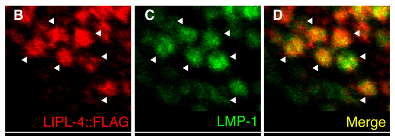

## Question

# Gene Research for Functional Annotation

## ⚠️ CRITICAL: Gene/Protein Identification Context

**BEFORE YOU BEGIN RESEARCH:** You MUST verify you are researching the CORRECT gene/protein. Gene symbols can be ambiguous, especially for less well-characterized genes from non-model organisms.

### Target Gene/Protein Identity (from UniProt):
- **UniProt Accession:** Q94252
- **Protein Description:** RecName: Full=Lipase lipl-4 {ECO:0000255|PIRNR:PIRNR000862}; EC=3.1.1.- {ECO:0000305|PubMed:23392608, ECO:0000305|PubMed:25554789}; EC=3.1.1.3 {ECO:0000305|PubMed:21906946, ECO:0000305|PubMed:25554789}; AltName: Full=Lipase-like 4 {ECO:0000312|WormBase:K04A8.5a}; Flags: Precursor;
- **Gene Information:** Name=lipl-4 {ECO:0000312|WormBase:K04A8.5a}; ORFNames=K04A8.5 {ECO:0000312|WormBase:K04A8.5a};
- **Organism (full):** Caenorhabditis elegans.
- **Protein Family:** Belongs to the AB hydrolase superfamily. Lipase family.
- **Key Domains:** AB_hydrolase_fold. (IPR029058); AB_hydrolase_lipase. (IPR006693); Lipase_euk. (IPR025483); Abhydro_lipase (PF04083)

### MANDATORY VERIFICATION STEPS:

1. **Check if the gene symbol "lipl-4" matches the protein description above**
2. **Verify the organism is correct:** Caenorhabditis elegans.
3. **Check if protein family/domains align with what you find in literature**
4. **If you find literature for a DIFFERENT gene with the same or similar symbol, STOP**

### If Gene Symbol is Ambiguous or You Cannot Find Relevant Literature:

**DO NOT PROCEED WITH RESEARCH ON A DIFFERENT GENE.** Instead:
- State clearly: "The gene symbol 'lipl-4' is ambiguous or literature is limited for this specific protein"
- Explain what you found (e.g., "Found extensive literature on a different gene with the same symbol in a different organism")
- Describe the protein based ONLY on the UniProt information provided above
- Suggest that the protein function can be inferred from domain/family information

### Research Target:

Please provide a comprehensive research report on the gene **lipl-4** (gene ID: lipl-4, UniProt: Q94252) in worm.

The research report should be a detailed narrative explaining the function, biological processes, and localization of the gene product. Citations should be given for all claims.

You should prioritize authoritative reviews and primary scientific literature when conducting research. You can supplement
this with annotations you find in gene/protein databases, but these can be outdated or inaccurate.

We are specifically interested in the primary function of the gene - for enzymes, what reaction is catalyzed, and what is the substrate specificity? For transporters, what is the substrate? For structural proteins or adapters, what is the broader structural role? For signaling molecules, what is the role in the pathway.

We are interested in where in or outside the cell the gene product carries out its function.

We are also interested in the signaling or biochemical pathways in which the gene functions. We are less interested in broad pleiotropic effects, except where these elucidate the precise role.

Include evidence where possible. We are interested in both experimental evidence as well as inference from structure, evolution, or bioinformatic analysis. Precise studies should be prioritized over high-throughput, where available.

## Output

Question: You are an expert researcher providing comprehensive, well-cited information.

Provide detailed information focusing on:
1. Key concepts and definitions with current understanding
2. Recent developments and latest research (prioritize 2023-2024 sources)
3. Current applications and real-world implementations
4. Expert opinions and analysis from authoritative sources
5. Relevant statistics and data from recent studies

Format as a comprehensive research report with proper citations. Include URLs and publication dates where available.
Always prioritize recent, authoritative sources and provide specific citations for all major claims.

# Gene Research for Functional Annotation

## ⚠️ CRITICAL: Gene/Protein Identification Context

**BEFORE YOU BEGIN RESEARCH:** You MUST verify you are researching the CORRECT gene/protein. Gene symbols can be ambiguous, especially for less well-characterized genes from non-model organisms.

### Target Gene/Protein Identity (from UniProt):
- **UniProt Accession:** Q94252
- **Protein Description:** RecName: Full=Lipase lipl-4 {ECO:0000255|PIRNR:PIRNR000862}; EC=3.1.1.- {ECO:0000305|PubMed:23392608, ECO:0000305|PubMed:25554789}; EC=3.1.1.3 {ECO:0000305|PubMed:21906946, ECO:0000305|PubMed:25554789}; AltName: Full=Lipase-like 4 {ECO:0000312|WormBase:K04A8.5a}; Flags: Precursor;
- **Gene Information:** Name=lipl-4 {ECO:0000312|WormBase:K04A8.5a}; ORFNames=K04A8.5 {ECO:0000312|WormBase:K04A8.5a};
- **Organism (full):** Caenorhabditis elegans.
- **Protein Family:** Belongs to the AB hydrolase superfamily. Lipase family.
- **Key Domains:** AB_hydrolase_fold. (IPR029058); AB_hydrolase_lipase. (IPR006693); Lipase_euk. (IPR025483); Abhydro_lipase (PF04083)

### MANDATORY VERIFICATION STEPS:

1. **Check if the gene symbol "lipl-4" matches the protein description above**
2. **Verify the organism is correct:** Caenorhabditis elegans.
3. **Check if protein family/domains align with what you find in literature**
4. **If you find literature for a DIFFERENT gene with the same or similar symbol, STOP**

### If Gene Symbol is Ambiguous or You Cannot Find Relevant Literature:

**DO NOT PROCEED WITH RESEARCH ON A DIFFERENT GENE.** Instead:
- State clearly: "The gene symbol 'lipl-4' is ambiguous or literature is limited for this specific protein"
- Explain what you found (e.g., "Found extensive literature on a different gene with the same symbol in a different organism")
- Describe the protein based ONLY on the UniProt information provided above
- Suggest that the protein function can be inferred from domain/family information

### Research Target:

Please provide a comprehensive research report on the gene **lipl-4** (gene ID: lipl-4, UniProt: Q94252) in worm.

The research report should be a detailed narrative explaining the function, biological processes, and localization of the gene product. Citations should be given for all claims.

You should prioritize authoritative reviews and primary scientific literature when conducting research. You can supplement
this with annotations you find in gene/protein databases, but these can be outdated or inaccurate.

We are specifically interested in the primary function of the gene - for enzymes, what reaction is catalyzed, and what is the substrate specificity? For transporters, what is the substrate? For structural proteins or adapters, what is the broader structural role? For signaling molecules, what is the role in the pathway.

We are interested in where in or outside the cell the gene product carries out its function.

We are also interested in the signaling or biochemical pathways in which the gene functions. We are less interested in broad pleiotropic effects, except where these elucidate the precise role.

Include evidence where possible. We are interested in both experimental evidence as well as inference from structure, evolution, or bioinformatic analysis. Precise studies should be prioritized over high-throughput, where available.

# Functional Annotation Research Report: **C. elegans lipl-4 / LIPL-4** (UniProt **Q94252**, ORF **K04A8.5**)

## Executive summary
**lipl-4** encodes **LIPL-4**, a **lysosomal acid lipase-like** enzyme expressed prominently in the **intestine** (major fat storage tissue) and localized to **lysosomes** via an N-terminal signal peptide. Experimentally, LIPL-4 shows **acid pH-dependent triglyceride lipase activity** and drives **lysosome-derived lipid signaling** that promotes longevity through at least two characterized axes: (i) **LIPL-4 → lipid mediators (notably OEA) → LBP-8 → nuclear receptors NHR-49/NHR-80**, and (ii) **LIPL-4 → PUFA release (notably DGLA) → secreted lipid chaperone LBP-3 → neuronal NHR-49 → neuropeptide NLP-11**. Recent 2024 work adds a new layer showing LIPL-4-driven longevity is associated with **lysosome proteome remodeling**, **perinuclear lysosome clustering**, and **lysosome-associated AMPK and nucleoporin-dependent nuclear import**. (folick2015lysosomalsignalingmolecules pages 4-10, savini2022lysosomelipidsignalling pages 1-2, ramachandran2019lysosomalsignalingpromotes pages 1-3, yu2024organelleproteomicprofiling pages 11-12)

## Identity verification (critical)
All evidence reviewed here refers to **C. elegans** **lipl-4 (K04A8.5)** encoding **LIPL-4**, described as a **lysosomal acid lipase** and studied in intestinal lysosomes in the context of longevity and lipid signaling. This aligns with the provided UniProt record (**Q94252**) describing a lipase-family AB hydrolase precursor with lysosomal targeting. (folick2015lysosomalsignalingmolecules pages 4-10, lapierre2011autophagyandlipid pages 4-5, savini2022lysosomelipidsignalling pages 1-2)

## Key concepts and definitions (current understanding)

### What is LIPL-4?
LIPL-4 is a **lysosomal acid lipase-like enzyme**. Lysosomal acid lipases are hydrolases that function in acidic compartments to cleave ester bonds in neutral lipids, releasing fatty acids and related lipid mediators. In *C. elegans*, LIPL-4 is positioned as a longevity-promoting lysosomal lipase that couples lipid catabolism to organism-wide signaling. (folick2015lysosomalsignalingmolecules pages 4-10, savini2022lysosomelipidsignalling pages 1-2)

### Lysosomal lipolysis as signaling
A central concept emerging from LIPL-4 studies is that lysosomes are not only degradative organelles but can generate **bioactive lipid signals** (lipid-derived ligands, PUFAs) that engage **lipid chaperones** (FABP-like proteins) and **nuclear receptors**, altering transcription and physiology to promote longevity. (folick2015lysosomalsignalingmolecules pages 4-10, ramachandran2019lysosomalsignalingpromotes pages 1-3, savini2022lysosomelipidsignalling pages 1-2)

## Molecular function: enzymatic activity and substrate specificity

### Experimentally supported activity
Folick et al. measured lipase activity using a triglyceride substrate (\u00b3H-triolein) and showed that **lipl-4(tm4417)** mutants have **reduced hydrolysis at pH 4.5 but not pH 7.4**, supporting **acid pH-dependent triglyceride lipase activity** consistent with lysosomal function. (folick2015lysosomalsignalingmolecules pages 4-10)

### Substrate classes and products (supported/inferred)
- The direct biochemical assay supports activity against a **triacylglycerol** substrate (triolein). (folick2015lysosomalsignalingmolecules pages 4-10)
- Savini et al. describe lysosomal acid lipases (including LIPL-4) as releasing **free fatty acids** from **triacylglycerols (TAGs)** and **cholesteryl esters (CEs)**, situating LIPL-4 within TAG/CE lipolysis and FFA generation in intestinal lysosomes. (savini2022lysosomelipidsignalling pages 1-2)

### Lipid mediators linked to LIPL-4 activity
LIPL-4 overexpression is associated with increases in several lipid species, including **oleoylethanolamide (OEA)** and PUFAs such as **dihomo-\u03b3-linolenic acid (DGLA)** and **arachidonic acid (AA)** (and \u03c9-3 AA). (folick2015lysosomalsignalingmolecules pages 4-10, savini2022lysosomelipidsignalling pages 1-2)

## Subcellular and tissue localization

### Lysosomal localization and targeting requirement
FLAG-tagged LIPL-4 **co-localizes with the lysosomal marker LMP-1** in **intestinal cells**, indicating LIPL-4 is a lysosomal protein in vivo. (folick2015lysosomalsignalingmolecules pages 4-10, folick2015lysosomalsignalingmolecules media fb05242f)

A **signal peptide** required for lysosomal targeting is also required for full downstream signaling and longevity phenotypes, consistent with LIPL-4 acting from the lysosomal lumen/lysosomal compartment. (folick2015lysosomalsignalingmolecules pages 4-10)

### Tissue expression
LIPL-4 is discussed as being expressed specifically/prominently in the **intestine** (peripheral fat storage tissue) and acting from intestinal lysosomes to initiate distal signaling (including neuronally executed programs). (savini2022lysosomelipidsignalling pages 1-2, savini2021lysosomelipidsignaling pages 1-5)

## Biological roles and pathways

### 1) Germline removal / reproductive signaling \u2192 longevity: autophagy-linked lysosomal lipolysis
Lapierre et al. established that **germline-less (glp-1)** longevity requires **lipl-4**, and that **intestine-specific lipl-4 overexpression** is sufficient to extend lifespan. They further show **autophagy and LIPL-4 are interdependent**: autophagy is needed for elevated lipase activity in germline-less animals, and LIPL-4 is needed for autophagy induction in that model; TOR inhibition induces **lipl-4** expression and lipase activity, linking LIPL-4 to nutrient sensing and autophagy pathways. (lapierre2011autophagyandlipid pages 1-2, lapierre2011autophagyandlipid pages 4-5)

### 2) Lysosome-to-nucleus lipid signaling: LBP-8/OEA/NHR-49/NHR-80 axis
Folick et al. characterized a lysosomal lipid-signaling pathway:
- **Intestinal lipl-4 overexpression** induces the fatty-acid binding protein **LBP-8**, which can be found in lysosomes and nuclei. (folick2015lysosomalsignalingmolecules pages 1-3, folick2015lysosomalsignalingmolecules pages 4-10)
- LIPL-4 overexpression increases lipids including **OEA**, and **OEA binds LBP-8 with ~3-fold higher affinity** than several other LIPL-4-associated lipids tested. (folick2015lysosomalsignalingmolecules pages 4-10)
- LIPL-4-driven longevity requires **LBP-8** and the nuclear receptors **NHR-49** and **NHR-80**, consistent with a lysosome-generated lipid ligand being chaperoned to the nucleus to alter transcription. (folick2015lysosomalsignalingmolecules pages 4-10)

Ramachandran et al. extended the mechanistic chain by linking the LIPL-4\u2013LBP-8 axis to mitochondrial physiology: the pathway increases mitochondrial **\u03b2-oxidation**, alters electron transport chain complex II activity, raises **mtROS**, and activates **JUN-1**-dependent antioxidant/stress-response transcription, improving oxidative stress tolerance and promoting longevity. (ramachandran2019lysosomalsignalingpromotes pages 1-3)

### 3) Intestine-to-neuron signaling: LBP-3/PUFA/NHR-49/NLP-11 axis
Savini et al. (published in *Nature Cell Biology*, 2022) identified an inter-tissue signaling program initiated by intestinal LIPL-4-driven lysosomal lipolysis:
- LIPL-4 in intestinal lysosomes drives release/elevation of specific **PUFAs**, with **DGLA** highlighted as a key mediator. (savini2022lysosomelipidsignalling pages 1-2)
- A secreted lipid chaperone, **LBP-3**, binds specific PUFAs and is required for LIPL-4-induced neuronal changes and longevity. (savini2022lysosomelipidsignalling pages 1-2)
- Intestinal LIPL-4 signaling induces neuronal **neuropeptide signaling**; functional experiments show dependence on neuronal **NHR-49** and neuropeptide **NLP-11**. (savini2022lysosomelipidsignalling pages 1-2)

Supporting mechanistic details from the 2021 preprint version include: PUFA levels are higher in lipl-4 transgenic worms; intestine-specific disruption of PUFA synthesis (fat-1 or fat-3) abrogates lipl-4-induced lifespan extension; lbp-3 loss suppresses neuropeptide induction and lipl-4 longevity; nlp-11 inactivation specifically suppresses lipl-4 longevity, while neuronal nlp-11 overexpression is sufficient to prolong lifespan. (savini2021lysosomelipidsignaling pages 5-8, savini2021lysosomelipidsignaling pages 1-5)

## Recent developments (prioritizing 2023\u20132024)

### 2024: Lysosome proteome remodeling, perinuclear lysosome positioning, and AMPK/nucleoporin dependencies
Yu et al. (*eLife*, **Jan 2024**, https://doi.org/10.7554/elife.85214) used lysosome immunopurification proteomics (Lyso-IP) across longevity models and found that **lipl-4 transgenic** worms have striking lysosome remodeling:
- **449 lysosome-enriched proteins** identified in lipl-4 Tg, with only **39% overlap** vs WT lysosome-enriched proteins; **61%** of proteins enriched on lipl-4 Tg lysosomes were absent from WT lysosomes. (yu2024organelleproteomicprofiling pages 8-9)
- Imaging shows lipl-4 Tg lysosomes in intestinal cells are **clustered perinuclearly** (vs dispersed in WT), with increased perinuclear distribution (**p < 0.01**). (yu2024organelleproteomicprofiling pages 11-12)
- Nuclear import machinery is implicated: **npp-6 RNAi** suppresses lipl-4 Tg lifespan extension, and **ima-3 (importin-\u03b1) RNAi** blocks lipl-4 Tg longevity. (yu2024organelleproteomicprofiling pages 11-12)
- Lysosome-associated AMPK contributes: combined AAK-1/AAK-2 reduction decreases lifespan by **29%** in lipl-4 Tg animals and reduces lipl-4 Tg extension from **72% to 48%**. (yu2024organelleproteomicprofiling pages 11-12)

This 2024 work advances LIPL-4 biology from a lipid-mediator model to a broader view in which **lysosome composition, positioning, and lysosome-coupled kinase signaling** are part of the pro-longevity mechanism. (yu2024organelleproteomicprofiling pages 11-12, yu2024organelleproteomicprofiling pages 8-9)

### 2024: Updated synthesis in germline\u2013longevity review
da Silva et al. (*Frontiers in Aging*, **Mar 2024**, https://doi.org/10.3389/fragi.2024.1380016) summarize LIPL-4 as a key effector of gonad/germline-mediated longevity, emphasizing: LIPL-4 requirement for glp-1 longevity, autophagy induction via PHA-4, generation of OEA engaging LBP-8 and NHR-49/NHR-80, and increased mitochondrial \u03b2-oxidation. (silva2024decodinglifespansecrets pages 3-4)

## Current applications and real-world implementations

LIPL-4 is widely used as an **experimental handle** to interrogate lysosomal lipolysis and lipid signaling in whole-animal physiology:

1. **Genetic tools and perturbations**
   - **Tissue-restricted overexpression** (often intestine) of lipl-4 to drive lysosomal lipolysis and quantify lifespan/fat storage changes. (folick2015lysosomalsignalingmolecules pages 4-10, savini2021lysosomelipidsignaling pages 1-5)
   - **RNAi/LOF alleles** (e.g., lipl-4(tm4417)) to test requirement of lysosomal lipolysis in longevity models such as germline-deficient animals. (folick2015lysosomalsignalingmolecules pages 4-10, lapierre2011autophagyandlipid pages 1-2)

2. **Physiological paradigms**
   - **Fasting/starvation paradigms** that induce lipl-4 expression and can be paired with lipid supplementation and autophagy manipulations to test causality. (johnson2019theroleof pages 2-3)

3. **Chemical/lipid supplementation as mechanistic probes**
   - Feeding/supplementing lipid mediators (e.g., **OEA**; **AA**/**DGLA**) to test downstream signaling, stress resistance, and longevity, often with autophagy as an epistasis node. (folick2015lysosomalsignalingmolecules pages 4-10, johnson2019theroleof pages 2-3, johnson2020lipidhydrolaseenzymes pages 4-6)

4. **Assays and readouts used in practice**
   - **Lifespan assays** and **starvation resistance assays**. (johnson2019theroleof pages 2-3, folick2015lysosomalsignalingmolecules pages 4-10)
   - **Lipase activity assays** at acidic pH and genetic dependence tests. (folick2015lysosomalsignalingmolecules pages 4-10, lapierre2011autophagyandlipid pages 4-5)
   - **Autophagy readouts** (e.g., autophagy gene dependence; autophagy marker foci). (lapierre2011autophagyandlipid pages 4-5, johnson2020lipidhydrolaseenzymes pages 4-6)
   - **Lipid droplet imaging / fat storage phenotyping** (lean phenotypes, fewer intestinal lipid droplets in lipl-4 overexpression contexts as summarized in reviews). (johnson2020lipidhydrolaseenzymes pages 4-6)
   - **Lipidomics/metabolomics** for identifying LIPL-4-associated lipid signals (OEA, DGLA, AA). (folick2015lysosomalsignalingmolecules pages 4-10, savini2022lysosomelipidsignalling pages 1-2)
   - **Transcriptomics** for neuropeptide induction, using thresholds such as **fold change > 1.5** with statistical filters. (savini2022lysosomelipidsignalling pages 1-2, savini2021lysosomelipidsignaling pages 1-5)

## Expert opinions and analysis (authoritative perspectives)

- A high-citation review on lipid metabolism and aging frames LIPL-4-driven lysosomal lipolysis as a pathway through which fasting-induced lipid changes (including \u03c9-6 PUFA enrichment) can enhance stress resistance and lifespan; it highlights experimental feasibility of **dietary lipid supplementation** and **autophagy dependence** as key mechanistic tests. (johnson2019theroleof pages 2-3)
- A review focused on lipid hydrolases positions LIPL-4 as a pragmatic pro-longevity target in model organisms, emphasizing that lipl-4 is required for germline-deficiency longevity yet dispensable for baseline WT lifespan, and that intestine-specific overexpression produces lean, longer-lived worms; it also emphasizes the intersection with **mTOR/autophagy** and lipid-chaperone/nuclear-receptor signaling. (johnson2020lipidhydrolaseenzymes pages 4-6, johnson2020lipidhydrolaseenzymes pages 3-4)
- The 2024 gonad-aging review synthesizes LIPL-4 as a germline-responsive metabolic effector that links lysosomal lipolysis to autophagy and mitochondrial \u03b2-oxidation through OEA/LBP-8/NHR signaling. (silva2024decodinglifespansecrets pages 3-4)

## Relevant statistics and quantitative findings (from recent and foundational studies)

### Lifespan and genetic dependencies
- **+55% mean lifespan** in a constitutive intestinal lipl-4 overexpression strain (lipl-4 Tg) in *Science* 2015. (folick2015lysosomalsignalingmolecules pages 4-10)
- **lbp-8 loss reduces lipl-4 Tg longevity by 46%**, and **lbp-8 overexpression alone increases lifespan by 30%**. (folick2015lysosomalsignalingmolecules pages 4-10)
- In *eLife* 2024, perturbing lysosome-associated AMPK signaling reduces lipl-4 Tg extension from **72% to 48%** and decreases lifespan by **29%** in lipl-4 Tg animals under the tested conditions. (yu2024organelleproteomicprofiling pages 11-12)

### Binding/selectivity of lipid mediators
- OEA binds LBP-8 with **~3-fold higher affinity** than other LIPL-4-associated lipids tested in the same study (AA, \u03c9-3 AA, DGLA), supporting specificity of the ligand\u2013chaperone interaction. (folick2015lysosomalsignalingmolecules pages 4-10)

### Omics-scale data that contextualize LIPL-4 effects
- Lysosome proteomics in lipl-4 Tg: **449** lysosome-enriched proteins; only **39% overlap** with WT lysosome-enriched proteins; **61%** of lipl-4 Tg lysosome-enriched proteins absent from WT lysosomes. (yu2024organelleproteomicprofiling pages 8-9)
- Transcriptomics in the LIPL-4\u2192neuropeptide program used differential criteria such as **fold change > 1.5** with statistical filters, and identified induction of neuropeptide processing genes and many neuropeptide transcripts. (savini2022lysosomelipidsignalling pages 1-2, savini2021lysosomelipidsignaling pages 1-5)

## Visual evidence highlights
- Co-localization of **FLAG::LIPL-4** with lysosomal marker **LMP-1** in intestinal cells and Kaplan\u2013Meier survival curves demonstrating lipl-4 Tg lifespan extension were retrieved from Folick et al. 2015. (folick2015lysosomalsignalingmolecules media fb05242f, folick2015lysosomalsignalingmolecules media f909edc4, folick2015lysosomalsignalingmolecules media 646f11e8)

## Consolidated evidence map
The following table summarizes the best-supported functional annotation elements for LIPL-4.

| Aspect | Key findings | Evidence/notes | Primary citation (include year) |
|---|---|---|---|
| Activity/substrate | LIPL-4 is a lysosomal acid lipase-like enzyme with acid pH-dependent lipase activity; it hydrolyzes triglyceride substrate and is inferred to release free fatty acids from TAGs and cholesteryl esters. | In lipl-4(tm4417) mutants, triglyceride hydrolysis of ^3H-triolein is reduced at pH 4.5 but not pH 7.4; later work frames lysosomal acid lipases as releasing FFAs from TAGs/CEs in the intestine. | Folick et al., 2015 (folick2015lysosomalsignalingmolecules pages 4-10, savini2022lysosomelipidsignalling pages 1-2) |
| Localization | LIPL-4 localizes to lysosomes in intestinal cells; earlier work also reported localization in intestinal cells and seam cells. A signal peptide is required for proper lysosomal targeting and pro-longevity function. | FLAG::LIPL-4 co-localizes with LMP-1 in intestine; removing the signal peptide largely abolishes downstream effects. Review of earlier experiments notes intestinal and seam-cell localization. | Folick et al., 2015; Lapierre et al., 2011 (folick2015lysosomalsignalingmolecules pages 4-10, lapierre2011autophagyandlipid pages 4-5, folick2015lysosomalsignalingmolecules media fb05242f) |
| Regulation | lipl-4 expression/activity is induced by germline loss, DAF-16/FOXO, TOR inhibition, fasting, and other longevity paradigms including IIS reduction. | Germline-less glp-1 animals require lipl-4 for lifespan extension; TOR inhibition increases lipl-4 mRNA and lipase activity; 2022 work reports induction by fasting and in IIS- or germline-deficient mutants. | Lapierre et al., 2011; Savini et al., 2022 (lapierre2011autophagyandlipid pages 1-2, lapierre2011autophagyandlipid pages 4-5, savini2022lysosomelipidsignalling pages 1-2) |
| Pathway/mechanism | LIPL-4 initiates lysosome-to-nucleus and intestine-to-neuron lipid signaling that promotes longevity. One arm uses LBP-8 and nuclear receptors NHR-49/NHR-80; another uses LBP-3 plus PUFAs to induce neuronal neuropeptide signaling. LIPL-4 signaling also increases mitochondrial β-oxidation and mtROS/JUN-1 responses. | LIPL-4 upregulates lbp-8, promotes nuclear LBP-8 signaling, and requires NHR-49/NHR-80; separate work shows intestinal LIPL-4→PUFA→LBP-3→neuronal NHR-49/NLP-11 signaling. Developmental Cell study links LIPL-4/LBP-8 to β-oxidation, reduced ETC complex II activity, mtROS, JUN-1, and oxidative stress tolerance. | Folick et al., 2015; Ramachandran et al., 2019; Savini et al., 2022 (folick2015lysosomalsignalingmolecules pages 4-10, ramachandran2019lysosomalsignalingpromotes pages 1-3, savini2022lysosomelipidsignalling pages 1-2, savini2021lysosomelipidsignaling pages 5-8, savini2021lysosomelipidsignaling pages 1-5) |
| Phenotypes/quantitative effects | Intestinal lipl-4 overexpression is sufficient to extend lifespan substantially and reduce fat storage; lysosomal targeting is important for full effect. | Mean lifespan increase reported as 55% in one primary study; review cites ~24% mean lifespan extension with intestinal overexpression and lean/fewer lipid droplet phenotypes; in 2024 proteomics, lipl-4 Tg lifespan extension is 72% and drops to 48% when lysosomal AMPK signaling is impaired. | Folick et al., 2015; Johnson, 2020 review summarizing primary data; Yu et al., 2024 (folick2015lysosomalsignalingmolecules pages 4-10, johnson2020lipidhydrolaseenzymes pages 4-6, yu2024organelleproteomicprofiling pages 11-12) |
| Key lipid mediators | Lipids associated with LIPL-4 signaling include oleoylethanolamide (OEA), arachidonic acid, ω-3 arachidonic acid, dihomo-γ-linolenic acid (DGLA), and broader PUFAs. | Folick et al. identified AA, ω-3 AA, DGLA, and OEA as elevated with lipl-4 overexpression; OEA binds LBP-8 with ~3-fold higher affinity than the other tested lipids. Savini et al. identified DGLA/LBP-3 as key fat-to-neuron longevity signals. | Folick et al., 2015; Savini et al., 2022 (folick2015lysosomalsignalingmolecules pages 4-10, savini2022lysosomelipidsignalling pages 1-2, savini2021lysosomelipidsignaling pages 5-8) |
| Key genetic dependencies | LIPL-4-mediated longevity depends on autophagy genes and transcriptional regulators including DAF-16, PHA-4, LBP-8, NHR-49, NHR-80, LBP-3, neuronal NLP-11, and neuropeptide processing genes; some branches are daf-16-independent downstream of LIPL-4. | Lifespan extension from lipl-4 overexpression is suppressed by bec-1, lgg-1, vps-34, pha-4 RNAi; lbp-8 loss reduces lipl-4 longevity by 46%; nhr-49/nhr-80 are required; intestine-only fat-1 or fat-3 inactivation abolishes lipl-4 Tg longevity; lbp-3 or nlp-11 loss suppresses lipl-4 Tg lifespan extension; egl-21 inactivation abolishes lipl-4 Tg longevity. | Lapierre et al., 2011; Folick et al., 2015; Savini et al., 2022/2021 (lapierre2011autophagyandlipid pages 4-5, folick2015lysosomalsignalingmolecules pages 4-10, savini2021lysosomelipidsignaling pages 5-8, savini2021lysosomelipidsignaling pages 1-5) |

*Table: This table summarizes experimentally supported functional annotation for C. elegans LIPL-4, including its enzymatic activity, localization, regulatory inputs, signaling pathways, lipid mediators, and key genetic dependencies. It is useful as a compact evidence map for interpreting the molecular role of UniProt Q94252.*

## Open questions and limitations (what is not yet fully resolved)
- While acid pH-dependent triglyceride hydrolysis is directly shown, **detailed kinetic parameters** and **fine substrate specificity** (e.g., preference among TAG species, CE species, phospholipids) are not provided in the retrieved evidence excerpts; many conclusions about CE/TAG classes and released fatty acids are consistent with lysosomal acid lipase biology but may require dedicated biochemical profiling of purified LIPL-4. (folick2015lysosomalsignalingmolecules pages 4-10, savini2022lysosomelipidsignalling pages 1-2)
- Multiple downstream lipid mediators (OEA, DGLA, AA) are linked to LIPL-4 activation; how these are prioritized under different physiological states (fasting vs germline loss vs transgenic overexpression) remains an active area of systems-level interpretation. (folick2015lysosomalsignalingmolecules pages 4-10, savini2022lysosomelipidsignalling pages 1-2, johnson2019theroleof pages 2-3)

## Key sources (with publication dates and URLs)
- Folick A. et al. **2015-01**. *Science*: “Lysosomal signaling molecules regulate longevity in *C. elegans*.” https://doi.org/10.1126/science.1258857 (folick2015lysosomalsignalingmolecules pages 4-10)
- Lapierre L.R. et al. **2011-09**. *Current Biology*: “Autophagy and Lipid Metabolism Coordinately Modulate Life Span in Germline-less *C. elegans*.” https://doi.org/10.1016/j.cub.2011.07.042 (lapierre2011autophagyandlipid pages 4-5, lapierre2011autophagyandlipid pages 1-2)
- Ramachandran P.V. et al. **2019-03**. *Developmental Cell*: “Lysosomal Signaling Promotes Longevity by Adjusting Mitochondrial Activity.” https://doi.org/10.1016/j.devcel.2018.12.022 (ramachandran2019lysosomalsignalingpromotes pages 1-3)
- Savini M. et al. **2022-06**. *Nature Cell Biology*: “Lysosome lipid signalling from the periphery to neurons regulates longevity.” https://doi.org/10.1038/s41556-022-00926-8 (savini2022lysosomelipidsignalling pages 1-2)
- Yu Y. et al. **2024-01**. *eLife*: “Organelle proteomic profiling reveals lysosomal heterogeneity in association with longevity.” https://doi.org/10.7554/elife.85214 (yu2024organelleproteomicprofiling pages 11-12, yu2024organelleproteomicprofiling pages 8-9)
- da Silva A.P. et al. **2024-03**. *Frontiers in Aging* (review): https://doi.org/10.3389/fragi.2024.1380016 (silva2024decodinglifespansecrets pages 3-4)
- Johnson A.A., Stolzing A. **2019-09**. *Aging Cell* (review): https://doi.org/10.1111/acel.13048 (johnson2019theroleof pages 2-3)
- Johnson A.A. **2020-04**. *Rejuvenation Research* (review): https://doi.org/10.1089/rej.2019.2211 (johnson2020lipidhydrolaseenzymes pages 4-6)

References

1. (folick2015lysosomalsignalingmolecules pages 4-10): Andrew Folick, Holly D. Oakley, Yong Yu, Eric H. Armstrong, Manju Kumari, Lucas Sanor, David D. Moore, Eric A. Ortlund, Rudolf Zechner, and Meng C. Wang. Lysosomal signaling molecules regulate longevity in caenorhabditis elegans. Science, 347:83-86, Jan 2015. URL: https://doi.org/10.1126/science.1258857, doi:10.1126/science.1258857. This article has 316 citations and is from a highest quality peer-reviewed journal.

2. (savini2022lysosomelipidsignalling pages 1-2): Marzia Savini, Andrew Folick, Yi-Tang Lee, Feng Jin, André Cuevas, Matthew C. Tillman, Jonathon D. Duffy, Qian Zhao, Isaiah A. Neve, Pei-Wen Hu, Yong Yu, Qinghao Zhang, Youqiong Ye, William B. Mair, Jin Wang, Leng Han, Eric A. Ortlund, and Meng C. Wang. Lysosome lipid signalling from the periphery to neurons regulates longevity. Nature Cell Biology, 24:906-916, Jun 2022. URL: https://doi.org/10.1038/s41556-022-00926-8, doi:10.1038/s41556-022-00926-8. This article has 94 citations and is from a highest quality peer-reviewed journal.

3. (ramachandran2019lysosomalsignalingpromotes pages 1-3): Prasanna V. Ramachandran, Marzia Savini, Andrew K. Folick, Kuang Hu, Ruchi Masand, Brett H. Graham, and Meng C. Wang. Lysosomal signaling promotes longevity by adjusting mitochondrial activity. Developmental cell, 48 5:685-696.e5, Mar 2019. URL: https://doi.org/10.1016/j.devcel.2018.12.022, doi:10.1016/j.devcel.2018.12.022. This article has 119 citations and is from a highest quality peer-reviewed journal.

4. (yu2024organelleproteomicprofiling pages 11-12): Yong Yu, Shihong M. Gao, Youchen Guan, Pei-Wen Hu, Qinghao Zhang, Jiaming Liu, Bentian Jing, Qian Zhao, David M Sabatini, Monther Abu-Remaileh, Sung Yun Jung, and Meng C. Wang. Organelle proteomic profiling reveals lysosomal heterogeneity in association with longevity. eLife, Jan 2024. URL: https://doi.org/10.7554/elife.85214, doi:10.7554/elife.85214. This article has 34 citations and is from a domain leading peer-reviewed journal.

5. (lapierre2011autophagyandlipid pages 4-5): Louis R. Lapierre, Sara Gelino, Alicia Meléndez, and Malene Hansen. Autophagy and lipid metabolism coordinately modulate life span in germline-less c. elegans. Current Biology, 21:1507-1514, Sep 2011. URL: https://doi.org/10.1016/j.cub.2011.07.042, doi:10.1016/j.cub.2011.07.042. This article has 408 citations and is from a highest quality peer-reviewed journal.

6. (folick2015lysosomalsignalingmolecules media fb05242f): Andrew Folick, Holly D. Oakley, Yong Yu, Eric H. Armstrong, Manju Kumari, Lucas Sanor, David D. Moore, Eric A. Ortlund, Rudolf Zechner, and Meng C. Wang. Lysosomal signaling molecules regulate longevity in caenorhabditis elegans. Science, 347:83-86, Jan 2015. URL: https://doi.org/10.1126/science.1258857, doi:10.1126/science.1258857. This article has 316 citations and is from a highest quality peer-reviewed journal.

7. (savini2021lysosomelipidsignaling pages 1-5): Marzia Savini, Jonathon D. Duffy, Andrew Folick, Yi-Tang Lee, Pei-Wen Hu, Isaiah A. Neve, Feng Jin, Qinghao Zhang, Matthew Tillman, Youqiong Ye, William B. Mair, Jin Wang, Leng Han, Eric A. Ortlund, and Meng C. Wang. Lysosome lipid signaling from the periphery to neurons regulates longevity. BioRxiv, Jun 2021. URL: https://doi.org/10.1101/2021.06.10.447794, doi:10.1101/2021.06.10.447794. This article has 1 citations.

8. (lapierre2011autophagyandlipid pages 1-2): Louis R. Lapierre, Sara Gelino, Alicia Meléndez, and Malene Hansen. Autophagy and lipid metabolism coordinately modulate life span in germline-less c. elegans. Current Biology, 21:1507-1514, Sep 2011. URL: https://doi.org/10.1016/j.cub.2011.07.042, doi:10.1016/j.cub.2011.07.042. This article has 408 citations and is from a highest quality peer-reviewed journal.

9. (folick2015lysosomalsignalingmolecules pages 1-3): Andrew Folick, Holly D. Oakley, Yong Yu, Eric H. Armstrong, Manju Kumari, Lucas Sanor, David D. Moore, Eric A. Ortlund, Rudolf Zechner, and Meng C. Wang. Lysosomal signaling molecules regulate longevity in caenorhabditis elegans. Science, 347:83-86, Jan 2015. URL: https://doi.org/10.1126/science.1258857, doi:10.1126/science.1258857. This article has 316 citations and is from a highest quality peer-reviewed journal.

10. (savini2021lysosomelipidsignaling pages 5-8): Marzia Savini, Jonathon D. Duffy, Andrew Folick, Yi-Tang Lee, Pei-Wen Hu, Isaiah A. Neve, Feng Jin, Qinghao Zhang, Matthew Tillman, Youqiong Ye, William B. Mair, Jin Wang, Leng Han, Eric A. Ortlund, and Meng C. Wang. Lysosome lipid signaling from the periphery to neurons regulates longevity. BioRxiv, Jun 2021. URL: https://doi.org/10.1101/2021.06.10.447794, doi:10.1101/2021.06.10.447794. This article has 1 citations.

11. (yu2024organelleproteomicprofiling pages 8-9): Yong Yu, Shihong M. Gao, Youchen Guan, Pei-Wen Hu, Qinghao Zhang, Jiaming Liu, Bentian Jing, Qian Zhao, David M Sabatini, Monther Abu-Remaileh, Sung Yun Jung, and Meng C. Wang. Organelle proteomic profiling reveals lysosomal heterogeneity in association with longevity. eLife, Jan 2024. URL: https://doi.org/10.7554/elife.85214, doi:10.7554/elife.85214. This article has 34 citations and is from a domain leading peer-reviewed journal.

12. (silva2024decodinglifespansecrets pages 3-4): Andre Pires da Silva, Rhianne Kelleher, and Luke Reynoldson. Decoding lifespan secrets: the role of the gonad in caenorhabditis elegans aging. Frontiers in Aging, Mar 2024. URL: https://doi.org/10.3389/fragi.2024.1380016, doi:10.3389/fragi.2024.1380016. This article has 1 citations.

13. (johnson2019theroleof pages 2-3): Adiv A. Johnson and Alexandra Stolzing. The role of lipid metabolism in aging, lifespan regulation, and age‐related disease. Aging Cell, Sep 2019. URL: https://doi.org/10.1111/acel.13048, doi:10.1111/acel.13048. This article has 508 citations and is from a domain leading peer-reviewed journal.

14. (johnson2020lipidhydrolaseenzymes pages 4-6): Adiv A. Johnson. Lipid hydrolase enzymes: pragmatic pro-longevity targets for improved human healthspan? Rejuvenation research, 23:107-121, Apr 2020. URL: https://doi.org/10.1089/rej.2019.2211, doi:10.1089/rej.2019.2211. This article has 8 citations and is from a peer-reviewed journal.

15. (johnson2020lipidhydrolaseenzymes pages 3-4): Adiv A. Johnson. Lipid hydrolase enzymes: pragmatic pro-longevity targets for improved human healthspan? Rejuvenation research, 23:107-121, Apr 2020. URL: https://doi.org/10.1089/rej.2019.2211, doi:10.1089/rej.2019.2211. This article has 8 citations and is from a peer-reviewed journal.

16. (folick2015lysosomalsignalingmolecules media f909edc4): Andrew Folick, Holly D. Oakley, Yong Yu, Eric H. Armstrong, Manju Kumari, Lucas Sanor, David D. Moore, Eric A. Ortlund, Rudolf Zechner, and Meng C. Wang. Lysosomal signaling molecules regulate longevity in caenorhabditis elegans. Science, 347:83-86, Jan 2015. URL: https://doi.org/10.1126/science.1258857, doi:10.1126/science.1258857. This article has 316 citations and is from a highest quality peer-reviewed journal.

17. (folick2015lysosomalsignalingmolecules media 646f11e8): Andrew Folick, Holly D. Oakley, Yong Yu, Eric H. Armstrong, Manju Kumari, Lucas Sanor, David D. Moore, Eric A. Ortlund, Rudolf Zechner, and Meng C. Wang. Lysosomal signaling molecules regulate longevity in caenorhabditis elegans. Science, 347:83-86, Jan 2015. URL: https://doi.org/10.1126/science.1258857, doi:10.1126/science.1258857. This article has 316 citations and is from a highest quality peer-reviewed journal.

## Artifacts

- [Edison artifact artifact-00](lipl-4-deep-research-falcon_artifacts/artifact-00.md)

## Citations

1. folick2015lysosomalsignalingmolecules pages 4-10
2. savini2022lysosomelipidsignalling pages 1-2
3. ramachandran2019lysosomalsignalingpromotes pages 1-3
4. yu2024organelleproteomicprofiling pages 8-9
5. yu2024organelleproteomicprofiling pages 11-12
6. silva2024decodinglifespansecrets pages 3-4
7. johnson2019theroleof pages 2-3
8. johnson2020lipidhydrolaseenzymes pages 4-6
9. lapierre2011autophagyandlipid pages 4-5
10. savini2021lysosomelipidsignaling pages 1-5
11. lapierre2011autophagyandlipid pages 1-2
12. folick2015lysosomalsignalingmolecules pages 1-3
13. savini2021lysosomelipidsignaling pages 5-8
14. johnson2020lipidhydrolaseenzymes pages 3-4
15. https://doi.org/10.7554/elife.85214
16. https://doi.org/10.3389/fragi.2024.1380016
17. https://doi.org/10.1126/science.1258857
18. https://doi.org/10.1016/j.cub.2011.07.042
19. https://doi.org/10.1016/j.devcel.2018.12.022
20. https://doi.org/10.1038/s41556-022-00926-8
21. https://doi.org/10.1111/acel.13048
22. https://doi.org/10.1089/rej.2019.2211
23. https://doi.org/10.1126/science.1258857,
24. https://doi.org/10.1038/s41556-022-00926-8,
25. https://doi.org/10.1016/j.devcel.2018.12.022,
26. https://doi.org/10.7554/elife.85214,
27. https://doi.org/10.1016/j.cub.2011.07.042,
28. https://doi.org/10.1101/2021.06.10.447794,
29. https://doi.org/10.3389/fragi.2024.1380016,
30. https://doi.org/10.1111/acel.13048,
31. https://doi.org/10.1089/rej.2019.2211,