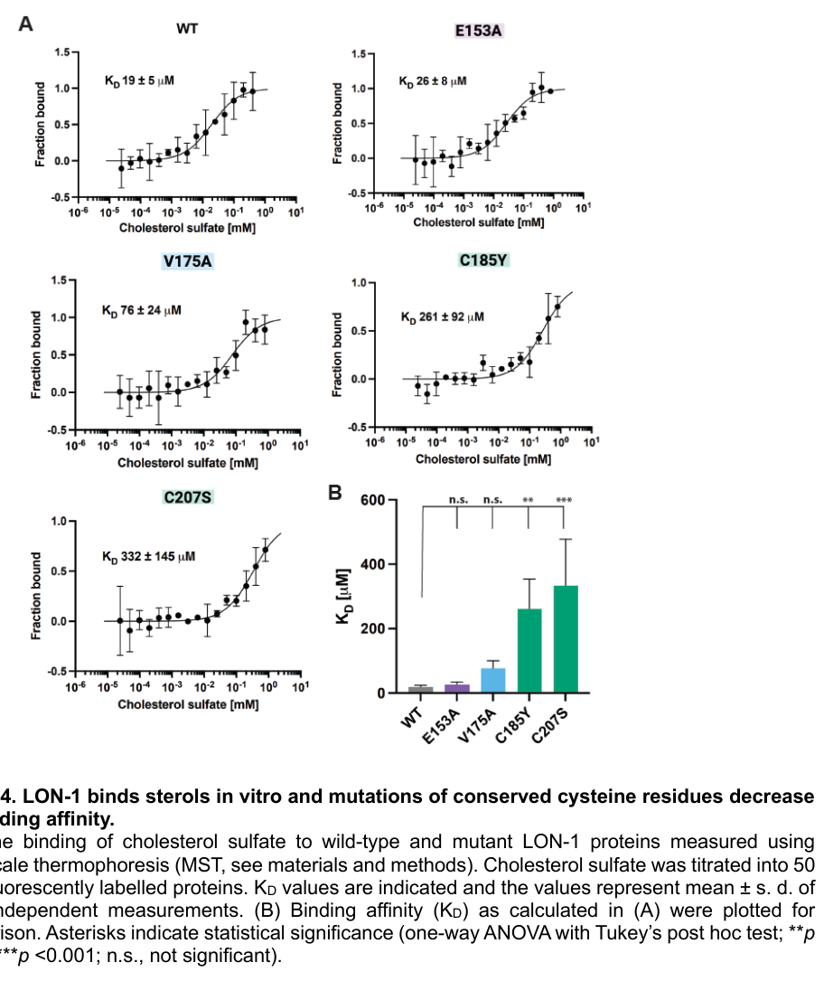

## Question

# Gene Research for Functional Annotation

## ⚠️ CRITICAL: Gene/Protein Identification Context

**BEFORE YOU BEGIN RESEARCH:** You MUST verify you are researching the CORRECT gene/protein. Gene symbols can be ambiguous, especially for less well-characterized genes from non-model organisms.

### Target Gene/Protein Identity (from UniProt):
- **UniProt Accession:** Q09566
- **Protein Description:** RecName: Full=Protein lon-1; Flags: Precursor;
- **Gene Information:** Name=lon-1; ORFNames=F48E8.1;
- **Organism (full):** Caenorhabditis elegans.
- **Protein Family:** Belongs to the CRISP family. .
- **Key Domains:** Allrgn_V5/Tpx1_CS. (IPR018244); CAP_dom. (IPR014044); CAP_sf. (IPR035940); CRISP-related. (IPR001283); CAP (PF00188)

### MANDATORY VERIFICATION STEPS:

1. **Check if the gene symbol "lon-1" matches the protein description above**
2. **Verify the organism is correct:** Caenorhabditis elegans.
3. **Check if protein family/domains align with what you find in literature**
4. **If you find literature for a DIFFERENT gene with the same or similar symbol, STOP**

### If Gene Symbol is Ambiguous or You Cannot Find Relevant Literature:

**DO NOT PROCEED WITH RESEARCH ON A DIFFERENT GENE.** Instead:
- State clearly: "The gene symbol 'lon-1' is ambiguous or literature is limited for this specific protein"
- Explain what you found (e.g., "Found extensive literature on a different gene with the same symbol in a different organism")
- Describe the protein based ONLY on the UniProt information provided above
- Suggest that the protein function can be inferred from domain/family information

### Research Target:

Please provide a comprehensive research report on the gene **lon-1** (gene ID: lon-1, UniProt: Q09566) in worm.

The research report should be a detailed narrative explaining the function, biological processes, and localization of the gene product. Citations should be given for all claims.

You should prioritize authoritative reviews and primary scientific literature when conducting research. You can supplement
this with annotations you find in gene/protein databases, but these can be outdated or inaccurate.

We are specifically interested in the primary function of the gene - for enzymes, what reaction is catalyzed, and what is the substrate specificity? For transporters, what is the substrate? For structural proteins or adapters, what is the broader structural role? For signaling molecules, what is the role in the pathway.

We are interested in where in or outside the cell the gene product carries out its function.

We are also interested in the signaling or biochemical pathways in which the gene functions. We are less interested in broad pleiotropic effects, except where these elucidate the precise role.

Include evidence where possible. We are interested in both experimental evidence as well as inference from structure, evolution, or bioinformatic analysis. Precise studies should be prioritized over high-throughput, where available.

## Output

Question: You are an expert researcher providing comprehensive, well-cited information.

Provide detailed information focusing on:
1. Key concepts and definitions with current understanding
2. Recent developments and latest research (prioritize 2023-2024 sources)
3. Current applications and real-world implementations
4. Expert opinions and analysis from authoritative sources
5. Relevant statistics and data from recent studies

Format as a comprehensive research report with proper citations. Include URLs and publication dates where available.
Always prioritize recent, authoritative sources and provide specific citations for all major claims.

# Gene Research for Functional Annotation

## ⚠️ CRITICAL: Gene/Protein Identification Context

**BEFORE YOU BEGIN RESEARCH:** You MUST verify you are researching the CORRECT gene/protein. Gene symbols can be ambiguous, especially for less well-characterized genes from non-model organisms.

### Target Gene/Protein Identity (from UniProt):
- **UniProt Accession:** Q09566
- **Protein Description:** RecName: Full=Protein lon-1; Flags: Precursor;
- **Gene Information:** Name=lon-1; ORFNames=F48E8.1;
- **Organism (full):** Caenorhabditis elegans.
- **Protein Family:** Belongs to the CRISP family. .
- **Key Domains:** Allrgn_V5/Tpx1_CS. (IPR018244); CAP_dom. (IPR014044); CAP_sf. (IPR035940); CRISP-related. (IPR001283); CAP (PF00188)

### MANDATORY VERIFICATION STEPS:

1. **Check if the gene symbol "lon-1" matches the protein description above**
2. **Verify the organism is correct:** Caenorhabditis elegans.
3. **Check if protein family/domains align with what you find in literature**
4. **If you find literature for a DIFFERENT gene with the same or similar symbol, STOP**

### If Gene Symbol is Ambiguous or You Cannot Find Relevant Literature:

**DO NOT PROCEED WITH RESEARCH ON A DIFFERENT GENE.** Instead:
- State clearly: "The gene symbol 'lon-1' is ambiguous or literature is limited for this specific protein"
- Explain what you found (e.g., "Found extensive literature on a different gene with the same symbol in a different organism")
- Describe the protein based ONLY on the UniProt information provided above
- Suggest that the protein function can be inferred from domain/family information

### Research Target:

Please provide a comprehensive research report on the gene **lon-1** (gene ID: lon-1, UniProt: Q09566) in worm.

The research report should be a detailed narrative explaining the function, biological processes, and localization of the gene product. Citations should be given for all claims.

You should prioritize authoritative reviews and primary scientific literature when conducting research. You can supplement
this with annotations you find in gene/protein databases, but these can be outdated or inaccurate.

We are specifically interested in the primary function of the gene - for enzymes, what reaction is catalyzed, and what is the substrate specificity? For transporters, what is the substrate? For structural proteins or adapters, what is the broader structural role? For signaling molecules, what is the role in the pathway.

We are interested in where in or outside the cell the gene product carries out its function.

We are also interested in the signaling or biochemical pathways in which the gene functions. We are less interested in broad pleiotropic effects, except where these elucidate the precise role.

Include evidence where possible. We are interested in both experimental evidence as well as inference from structure, evolution, or bioinformatic analysis. Precise studies should be prioritized over high-throughput, where available.

# Functional annotation of *lon-1* in *Caenorhabditis elegans*

## Identity and principal function

**Identity verified.** Worm *lon-1* is locus **F48E8.1**, encoding LON-1, a 312-amino-acid pathogenesis-related/CAP-family protein. Its identification was established by RNA interference, genomic rescue and sequencing of *lon-1* alleles; the recent structural study explicitly associates worm LON-1 with AlphaFold model **AF-Q09566-F1**, matching the specified UniProt accession. The CAP domain corresponds to the supplied CAP/CRISP-related annotations. This protein is **not** a Lon protease and must not be confused with the distinct BMP regulator LON-2/glypican. Although a 2015 study classifies LON-1 as CRISP-related, its unusual C-terminal region lacks the characteristic ion-channel-regulatory domain of canonical CRISPs; ion-channel inhibition is therefore not an established LON-1 activity. (morita2002acaenorhabditiselegans pages 2-3, liu2015promotionofbone pages 7-8, serrano2025thec.elegansa pages 15-18)

**Best-supported functional description:** LON-1 is a hypodermis-produced, secretion-competent CAP protein that **restrains body elongation** and participates in regulation of **DBL-1/BMP-like signaling**. Purified LON-1 binds a sterol in vitro, suggesting a lipid-associated extracellular or cell-surface mechanism. Neither an enzymatic reaction nor an endogenous sterol-transport substrate has been established; calling LON-1 a sterol *transporter* would exceed the evidence. (morita2002acaenorhabditiselegans pages 6-7, serrano2025thec.elegansa pages 23-26, liu2015promotionofbone pages 5-7, serrano2025thec.elegansa pages 15-18)

The following summary distinguishes experimental findings from proposed mechanisms.

| Function/issue | Directly measured result | Interpretation/caveat | Primary source |
|---|---|---|---|
| **Identity and domain — high confidence** | Genetic mapping, RNAi, genomic rescue, and mutations in nine alleles identified *C. elegans lon-1* as **F48E8.1**, encoding a 312-aa PR-related protein. The newer study explicitly used AlphaFold model **AF-Q09566-F1** and classified LON-1 as a CAP/CRISP-family protein. (morita2002acaenorhabditiselegans pages 2-3, serrano2025thec.elegansa pages 12-15, serrano2025thec.elegansa pages 15-18) | Confirms that Q09566 is worm LON-1—not a Lon protease or the unrelated glypican LON-2. CAP/CRISP classification is supported by sequence and predicted structure; no catalytic reaction has been demonstrated. | Morita *et al.*, **2002**, [EMBO Journal](https://doi.org/10.1093/emboj/21.5.1063); Serrano *et al.*, preprint **2024**, [bioRxiv](https://doi.org/10.1101/2024.10.01.616164), peer-reviewed **2025**, [GENETICS](https://doi.org/10.1093/genetics/iyae202) |
| **Hypodermal site of body-size function — high confidence** | Mean body length was **1.71 ± 0.01 mm** for *lon-1(e185)* and **1.12 ± 0.12 mm** after hypodermal *dpy-7p::lon-1* rescue. Intestinal expression gave **1.59 ± 0.01 mm**; muscle and neuronal expression likewise failed to rescue. (morita2002acaenorhabditiselegans pages 6-7) | Hypodermal expression is sufficient for body-length control. Intestinal protein expression was observed, but intestinal expression alone was not functionally sufficient. | Morita *et al.*, **2002**, [EMBO Journal](https://doi.org/10.1093/emboj/21.5.1063) |
| **Hypodermal polyploidization — moderate-to-high confidence** | Estimated hypodermal ploidy was **12.47 ± 0.22** in wild type, **14.36 ± 0.40** in *lon-1(e185)*, and **10.73 ± 0.33** in LON-1-overexpressing animals. Corresponding body lengths were **1.50**, **1.86**, and **1.00 mm**. (morita2002acaenorhabditiselegans pages 6-7) | LON-1 dosage inversely correlates with hypodermal endoreduplication and body length. The experiments do not establish whether ploidy causes the length change or is a parallel consequence. | Morita *et al.*, **2002**, [EMBO Journal](https://doi.org/10.1093/emboj/21.5.1063) |
| **DBL-1/BMP pathway and feedback — high genetic confidence** | DBL-1 overexpression reduced *lon-1* transcript relative to a *dbl-1* null by about **fivefold**; *lon-1(ct410)* was epistatic to *dbl-1(nk3)* for body length. The *lon-1(jj67; W197Stop)* allele suppressed the *sma-9* M-lineage defect by **66.8% (n = 190)**, and RAD-SMAD reporter expression increased in *lon-1(jj67)* animals. (morita2002acaenorhabditiselegans pages 4-6, morita2002acaenorhabditiselegans pages 7-9, liu2015promotionofbone pages 7-8, liu2015promotionofbone pages 5-7) | LON-1 is a negatively regulated downstream output of DBL-1/BMP for growth and also feeds back on BMP signaling. These results do not demonstrate direct binding to DBL-1 or a receptor. | Morita *et al.*, **2002**, [EMBO Journal](https://doi.org/10.1093/emboj/21.5.1063); Liu *et al.*, **2015**, [PLOS Genetics](https://doi.org/10.1371/journal.pgen.1005221) |
| **Localization: membrane-associated versus secreted — moderate confidence** | The 2002 study detected endogenous LON-1 in membrane fractions and near hypodermal junctional and intestinal membranes; PI-PLC and alkaline wash did not release it. A later heterologous assay detected full-length LON-1::V5 in transfected Drosophila S2-cell medium. (morita2002acaenorhabditiselegans pages 3-4, morita2002acaenorhabditiselegans pages 4-6, serrano2025thec.elegansa pages 12-15, serrano2025thec.elegansa pages 15-18) | Current model: LON-1 enters the secretory pathway and can be secreted but may remain membrane-, surface-, or ECM-associated. Its extracellular distribution in intact worms remains unresolved. | Morita *et al.*, **2002**, [EMBO Journal](https://doi.org/10.1093/emboj/21.5.1063); Serrano *et al.*, preprint **2024**, [bioRxiv](https://doi.org/10.1101/2024.10.01.616164), peer-reviewed **2025**, [GENETICS](https://doi.org/10.1093/genetics/iyae202) |
| **Sterol-binding activity — moderate confidence** | Purified His-tagged LON-1 bound cholesterol sulfate by microscale thermophoresis with **K_D ≈ 19 µM**, versus **≈430 µM** for palmitic acid. C185Y and C207S reduced cholesterol-sulfate affinity by **more than tenfold**; measurements used three independent replicates. (serrano2025thec.elegans pages 18-23, serrano2025thec.elegansa pages 18-23, serrano2025thec.elegansa pages 15-18, serrano2025thec.elegans media 4f2889fb) | Supports sterol binding rather than meaningful fatty-acid binding. The physiological ligand, occupancy, transport direction, and in-vivo requirement remain unproven. | Serrano *et al.*, preprint **2024**, [bioRxiv](https://doi.org/10.1101/2024.10.01.616164), peer-reviewed **2025**, [GENETICS](https://doi.org/10.1093/genetics/iyae202) |
| **CAP residues and E153A paradox — moderate confidence** | Endogenous E153A, H171A, C185Y, and C207S mutants had null-like long bodies and **24–32%** *sma-9* suppression, versus **45%** for the deletion null. E153A did **not** significantly reduce cholesterol-sulfate binding and remained detectable. (serrano2025thec.elegans pages 18-23, serrano2025thec.elegansa pages 18-23, serrano2025thec.elegansa pages 23-26) | The CAP domain is essential, but a sterol-binding-only model is insufficient. E153 may support a sterol-independent activity or interaction; cysteine substitutions may disrupt CAP folding rather than only ligand binding. | Serrano *et al.*, preprint **2024**, [bioRxiv](https://doi.org/10.1101/2024.10.01.616164), peer-reviewed **2025**, [GENETICS](https://doi.org/10.1093/genetics/iyae202) |
| **C-terminal domain requirement — high confidence for tested phenotypes** | CRISPR deletion of the final **50 aa** produced stable protein, normal body size, and only **1.2–1.4%** *sma-9* suppression, compared with **45%** for the molecular null. (serrano2025thec.elegansa pages 12-15, serrano2025thec.elegansa pages 15-18) | The disordered C-terminal tail is dispensable for measured body-size and BMP functions, although roles under untested conditions remain possible. | Serrano *et al.*, preprint **2024**, [bioRxiv](https://doi.org/10.1101/2024.10.01.616164), peer-reviewed **2025**, [GENETICS](https://doi.org/10.1093/genetics/iyae202) |

*Table: Evidence-graded summary of LON-1 identity, tissue of action, pathway placement, localization, and CAP-domain biochemistry. Quantitative findings are separated from mechanistic interpretations and unresolved questions.*

## Pathway, biological process and tissue of action

The established growth pathway begins with **DBL-1**, a BMP-like TGF-β ligand produced predominantly by neurons, and signals to the hypodermis through BMP receptors and SMAD proteins. Increasing DBL-1 signaling reduces *lon-1* expression: northern blots found approximately **fivefold less *lon-1* transcript** in DBL-1-overexpressing animals than in *dbl-1* mutants. Genetic epistasis and dosage experiments place LON-1 as a growth-restraining **downstream output** of this pathway, rather than its ligand or receptor. LON-1 overexpression produces short animals, whereas loss produces long animals. Not every DBL-1-dependent phenotype follows LON-1, so it is not the pathway’s universal effector. (morita2002acaenorhabditiselegans pages 4-6, morita2002acaenorhabditiselegans pages 7-9)

The **hypodermis is the experimentally supported site of production sufficient for body-size control**. Hypodermal *dpy-7*-promoter expression rescued *lon-1(e185)* body length from **1.71 ± 0.01 mm** to **1.12 ± 0.12 mm**; intestinal expression yielded **1.59 ± 0.01 mm**, without comparable rescue. Endogenous-protein antibody staining was observed near hypodermal/seam-cell junctions and intestinal membranes, but expression in the intestine alone was not sufficient in that experiment. Hypodermal expression establishes where production can act; because LON-1 can be secreted, it does not prove that its molecular action is cell-autonomous or confined to hypodermal cytoplasm. (morita2002acaenorhabditiselegans pages 4-6, morita2002acaenorhabditiselegans pages 6-7, serrano2025thec.elegansa pages 12-15)

LON-1 dosage also tracks **hypodermal endoreduplication**, a process in which DNA content increases without cell division. Mean hypodermal ploidy was **12.47 ± 0.22** in wild type, **14.36 ± 0.40** in *lon-1(e185)* and **10.73 ± 0.33** upon LON-1 overexpression; the same experiment reported body lengths of **1.50, 1.86 and 1.00 mm**, respectively. Thus LON-1 negatively regulates hypodermal ploidy and length in these experiments. Whether altered ploidy directly *causes* the length phenotype, as opposed to accompanying another growth or extracellular-matrix change, remains unresolved. (morita2002acaenorhabditiselegans pages 6-7, morita2002acaenorhabditiselegans pages 7-9)

LON-1 is **also a modulator of BMP pathway output**, not merely a passive downstream readout. In a genetic screen, *lon-1(jj67; W197Stop)* restored the *sma-9* mutant’s missing M-lineage-derived coelomocytes in **66.8% of 190 animals**; a separate *lon-1(e185)* test also showed suppression. Furthermore, the BMP-responsive **RAD-SMAD reporter increased** in *lon-1(jj67)* animals. These results prompted the authors to propose feedback from LON-1 onto BMP signaling. The *sma-9* suppression assay is context-specific: loss of core BMP components can also suppress this developmental defect, whereas the increased RAD-SMAD reporter indicates greater signaling output in the reporter context. Consequently, neither suppression alone nor body length alone fixes a single direction of LON-1 action in every tissue; **direct binding to DBL-1 or a BMP receptor has not been demonstrated**. (liu2015promotionofbone pages 7-8, liu2015promotionofbone pages 5-7)

## Where the protein acts: evidence and remaining ambiguity

An N-terminal hydrophobic segment is compatible with a secretory signal peptide. The original endogenous-protein study found approximately **35-kDa LON-1** in membrane fractions, resistant to phospholipase C treatment and alkaline wash, and proposed an integral membrane protein. A subsequent secretion experiment detected full-length, tagged LON-1 in the **culture medium of transfected *Drosophila* S2 cells**, establishing that the protein *can* be secreted and favoring a cleavable signal-peptide interpretation. These observations are not necessarily contradictory: secreted LON-1 could subsequently associate with cell surfaces or extracellular material. Secretion was demonstrated in a heterologous cell system, however, **not by directly tracing endogenous LON-1 outside cells in intact worms**. The most defensible localization annotation is therefore *secretory pathway and likely extracellular/cell-surface-associated near hypodermal tissues*, with the precise native destination unresolved. (morita2002acaenorhabditiselegans pages 3-4, morita2002acaenorhabditiselegans pages 4-6, serrano2025thec.elegansa pages 12-15, serrano2025thec.elegansa pages 15-18)

## Molecular evidence and recent research

The major recent advance is Serrano and colleagues’ study, **first posted as a preprint on 3 October 2024 and subsequently published in peer-reviewed *GENETICS* in 2025**. It connects CAP-domain structure, an experimentally measurable binding activity and endogenous-gene phenotypes. An N-terminal signal peptide precedes the conserved CAP fold; a hinge and approximately **50-amino-acid, predicted-disordered C-terminal tail** follow it. CRISPR deletion of that tail left detectable protein, normal measured body size and only **1.2–1.4%** *sma-9* suppression, versus **45%** for the new deletion-null allele. The tail is dispensable for these tested functions, focusing attention on the CAP region. (serrano2025thec.elegans pages 10-14, serrano2025thec.elegansa pages 12-15, serrano2025thec.elegansa pages 15-18)

Microscale thermophoresis of purified LON-1 measured binding to **cholesterol sulfate, Kᴅ approximately 19 µM**, compared with much weaker binding to **palmitic acid, Kᴅ approximately 430 µM**. These are measurements for two tested molecules, **not** a comprehensive survey of lipid specificity: cholesterol sulfate should not be silently relabeled as free cholesterol, and weak palmitate binding is better described as poor affinity under these conditions than as proof that *no* fatty acid can bind. Substituting conserved cysteines **C185Y** or **C207S** weakened cholesterol-sulfate binding by **more than tenfold**. The Figure 4 thermophoresis measurements, inspected directly, support this comparison; the authors reported three independent measurements. (serrano2025thec.elegans pages 18-23, serrano2025thec.elegans pages 10-14, serrano2025thec.elegans media 4f2889fb)

Endogenous **E153A, H171A, C185Y and C207S** substitutions produced long, near-null-sized animals and **24–32%** suppression of the *sma-9* phenotype, compared with **45%** for the deletion null. Yet **E153A retained measured cholesterol-sulfate affinity** despite its severe organismal phenotype. Moreover, C185 and C207 are predicted to form a fold-stabilizing disulfide bond, so their effects cannot uniquely establish loss of a specific sterol-binding contact. Together, these results strongly implicate the **CAP domain**, support sterol binding as one plausible contributor and rule out a sufficiently evidenced **sterol-binding-only explanation**. The authors themselves leave the precise physiological mechanism open. (serrano2025thec.elegans pages 18-23, serrano2025thec.elegansa pages 23-26)

A proposed real-world *research* application is to use *lon-1* alleles, hypodermal rescue and the coelomocyte/RAD-SMAD assays to dissect BMP-controlled growth and extracellular regulation in a genetically tractable animal. Proposed delivery of sterols to tetraspanin-rich membrane domains or the cuticle’s apical extracellular matrix is **a hypothesis**, not an observed LON-1 transport route; likewise, analogous sterol mobilization by other worm CAP proteins does not establish that LON-1 performs their function. No clinical or commercial implementation of LON-1 itself is established by these studies. (serrano2025thec.elegans pages 23-27, serrano2025thec.elegansa pages 23-26, liu2015promotionofbone pages 5-7)

## Principal primary sources and publication dates

- **Serrano MV *et al*.** “The *C. elegans* LON-1 protein requires its CAP domain for function in regulating body size and BMP signaling.” *GENETICS* **229** (2025). Peer-reviewed article: https://doi.org/10.1093/genetics/iyae202. Earlier preprint posted **3 October 2024**: https://doi.org/10.1101/2024.10.01.616164. This is the most directly informative recent biochemical and structure–function study; the preprint and article represent the **same research**, not independent replications. (serrano2025thec.elegansa pages 15-18, serrano2025thec.elegansa pages 12-15)
- **Liu Z *et al*.** “Promotion of Bone Morphogenetic Protein Signaling by Tetraspanins and Glycosphingolipids.” *PLOS Genetics* **11**, e1005221; **15 May 2015**. https://doi.org/10.1371/journal.pgen.1005221. Primary genetic evidence connecting *lon-1* to the *sma-9* phenotype and BMP-responsive reporter. (liu2015promotionofbone pages 7-8, liu2015promotionofbone pages 5-7)
- **Morita K *et al*.** “A *Caenorhabditis elegans* TGF-β, DBL-1, controls the expression of LON-1, a PR-related protein, that regulates polyploidization and body length.” *EMBO Journal* **21**, 1063–1073; **March 2002**. https://doi.org/10.1093/emboj/21.5.1063. Primary identification, tissue-specific rescue, expression, fractionation and ploidy measurements. (morita2002acaenorhabditiselegans pages 2-3, morita2002acaenorhabditiselegans pages 4-6, morita2002acaenorhabditiselegans pages 6-7)

References

1. (morita2002acaenorhabditiselegans pages 2-3): K. Morita, A. J. Flemming, Y. Sugihara, M. Mochii, Yo Suzuki, Satoru Yoshida, W. Wood, Y. Kohara, A. Leroi, and N. Ueno. A caenorhabditis elegans tgf‐β, dbl‐1, controls the expression of lon‐1, a pr‐related protein, that regulates polyploidization and body length. The EMBO Journal, 21:1063-1073, Mar 2002. URL: https://doi.org/10.1093/emboj/21.5.1063, doi:10.1093/emboj/21.5.1063. This article has 131 citations.

2. (liu2015promotionofbone pages 7-8): Zhiyu Liu, Herong Shi, Lindsey C. Szymczak, Taner Aydin, Sijung Yun, Katharine Constas, Arielle Schaeffer, Sinthu Ranjan, Saad Kubba, Emad Alam, Devin E. McMahon, Jingpeng He, Neta Shwartz, Chenxi Tian, Yevgeniy Plavskin, Amanda Lindy, Nimra Amir Dad, Sunny Sheth, Nirav M. Amin, Stephanie Zimmerman, Dennis Liu, Erich M. Schwarz, Harold Smith, Michael W. Krause, and Jun Liu. Promotion of bone morphogenetic protein signaling by tetraspanins and glycosphingolipids. PLOS Genetics, 11:e1005221, May 2015. URL: https://doi.org/10.1371/journal.pgen.1005221, doi:10.1371/journal.pgen.1005221. This article has 36 citations and is from a domain leading peer-reviewed journal.

3. (serrano2025thec.elegansa pages 15-18): Maria Victoria Serrano, Stéphanie Cottier, Lianzijun Wang, Sergio Moreira-Antepara, Anthony Nzessi, Zhiyu Liu, Byron Williams, Myeongwoo Lee, Roger Schneiter, and Jun Liu. The <i>c. elegans</i> lon-1 protein requires its cap domain for function in regulating body size and bmp signaling. GENETICS, Dec 2025. URL: https://doi.org/10.1093/genetics/iyae202, doi:10.1093/genetics/iyae202. This article has 2 citations and is from a domain leading peer-reviewed journal.

4. (morita2002acaenorhabditiselegans pages 6-7): K. Morita, A. J. Flemming, Y. Sugihara, M. Mochii, Yo Suzuki, Satoru Yoshida, W. Wood, Y. Kohara, A. Leroi, and N. Ueno. A caenorhabditis elegans tgf‐β, dbl‐1, controls the expression of lon‐1, a pr‐related protein, that regulates polyploidization and body length. The EMBO Journal, 21:1063-1073, Mar 2002. URL: https://doi.org/10.1093/emboj/21.5.1063, doi:10.1093/emboj/21.5.1063. This article has 131 citations.

5. (serrano2025thec.elegansa pages 23-26): Maria Victoria Serrano, Stéphanie Cottier, Lianzijun Wang, Sergio Moreira-Antepara, Anthony Nzessi, Zhiyu Liu, Byron Williams, Myeongwoo Lee, Roger Schneiter, and Jun Liu. The <i>c. elegans</i> lon-1 protein requires its cap domain for function in regulating body size and bmp signaling. GENETICS, Dec 2025. URL: https://doi.org/10.1093/genetics/iyae202, doi:10.1093/genetics/iyae202. This article has 2 citations and is from a domain leading peer-reviewed journal.

6. (liu2015promotionofbone pages 5-7): Zhiyu Liu, Herong Shi, Lindsey C. Szymczak, Taner Aydin, Sijung Yun, Katharine Constas, Arielle Schaeffer, Sinthu Ranjan, Saad Kubba, Emad Alam, Devin E. McMahon, Jingpeng He, Neta Shwartz, Chenxi Tian, Yevgeniy Plavskin, Amanda Lindy, Nimra Amir Dad, Sunny Sheth, Nirav M. Amin, Stephanie Zimmerman, Dennis Liu, Erich M. Schwarz, Harold Smith, Michael W. Krause, and Jun Liu. Promotion of bone morphogenetic protein signaling by tetraspanins and glycosphingolipids. PLOS Genetics, 11:e1005221, May 2015. URL: https://doi.org/10.1371/journal.pgen.1005221, doi:10.1371/journal.pgen.1005221. This article has 36 citations and is from a domain leading peer-reviewed journal.

7. (serrano2025thec.elegansa pages 12-15): Maria Victoria Serrano, Stéphanie Cottier, Lianzijun Wang, Sergio Moreira-Antepara, Anthony Nzessi, Zhiyu Liu, Byron Williams, Myeongwoo Lee, Roger Schneiter, and Jun Liu. The <i>c. elegans</i> lon-1 protein requires its cap domain for function in regulating body size and bmp signaling. GENETICS, Dec 2025. URL: https://doi.org/10.1093/genetics/iyae202, doi:10.1093/genetics/iyae202. This article has 2 citations and is from a domain leading peer-reviewed journal.

8. (morita2002acaenorhabditiselegans pages 4-6): K. Morita, A. J. Flemming, Y. Sugihara, M. Mochii, Yo Suzuki, Satoru Yoshida, W. Wood, Y. Kohara, A. Leroi, and N. Ueno. A caenorhabditis elegans tgf‐β, dbl‐1, controls the expression of lon‐1, a pr‐related protein, that regulates polyploidization and body length. The EMBO Journal, 21:1063-1073, Mar 2002. URL: https://doi.org/10.1093/emboj/21.5.1063, doi:10.1093/emboj/21.5.1063. This article has 131 citations.

9. (morita2002acaenorhabditiselegans pages 7-9): K. Morita, A. J. Flemming, Y. Sugihara, M. Mochii, Yo Suzuki, Satoru Yoshida, W. Wood, Y. Kohara, A. Leroi, and N. Ueno. A caenorhabditis elegans tgf‐β, dbl‐1, controls the expression of lon‐1, a pr‐related protein, that regulates polyploidization and body length. The EMBO Journal, 21:1063-1073, Mar 2002. URL: https://doi.org/10.1093/emboj/21.5.1063, doi:10.1093/emboj/21.5.1063. This article has 131 citations.

10. (morita2002acaenorhabditiselegans pages 3-4): K. Morita, A. J. Flemming, Y. Sugihara, M. Mochii, Yo Suzuki, Satoru Yoshida, W. Wood, Y. Kohara, A. Leroi, and N. Ueno. A caenorhabditis elegans tgf‐β, dbl‐1, controls the expression of lon‐1, a pr‐related protein, that regulates polyploidization and body length. The EMBO Journal, 21:1063-1073, Mar 2002. URL: https://doi.org/10.1093/emboj/21.5.1063, doi:10.1093/emboj/21.5.1063. This article has 131 citations.

11. (serrano2025thec.elegans pages 18-23): Maria Victoria Serrano, Stephanie Cottier, Lianzijun Wang, Sergio Moreira-Antepara, Anthony Nzessi, Zhiyu Liu, Byron Williams, Myeongwoo Lee, Roger Schneiter, and Jun Liu. The c. elegans lon-1 protein requires its cap domain for function in regulating body size and bmp signaling. bioRxiv, Oct 2025. URL: https://doi.org/10.1101/2024.10.01.616164, doi:10.1101/2024.10.01.616164. This article has 2 citations.

12. (serrano2025thec.elegansa pages 18-23): Maria Victoria Serrano, Stéphanie Cottier, Lianzijun Wang, Sergio Moreira-Antepara, Anthony Nzessi, Zhiyu Liu, Byron Williams, Myeongwoo Lee, Roger Schneiter, and Jun Liu. The <i>c. elegans</i> lon-1 protein requires its cap domain for function in regulating body size and bmp signaling. GENETICS, Dec 2025. URL: https://doi.org/10.1093/genetics/iyae202, doi:10.1093/genetics/iyae202. This article has 2 citations and is from a domain leading peer-reviewed journal.

13. (serrano2025thec.elegans media 4f2889fb): Maria Victoria Serrano, Stéphanie Cottier, Lianzijun Wang, Sergio Moreira-Antepara, Anthony Nzessi, Zhiyu Liu, Byron Williams, Myeongwoo Lee, Roger Schneiter, and Jun Liu. The <i>c. elegans</i> lon-1 protein requires its cap domain for function in regulating body size and bmp signaling. GENETICS, Dec 2025. URL: https://doi.org/10.1093/genetics/iyae202, doi:10.1093/genetics/iyae202. This article has 2 citations and is from a domain leading peer-reviewed journal.

14. (serrano2025thec.elegans pages 10-14): Maria Victoria Serrano, Stephanie Cottier, Lianzijun Wang, Sergio Moreira-Antepara, Anthony Nzessi, Zhiyu Liu, Byron Williams, Myeongwoo Lee, Roger Schneiter, and Jun Liu. The c. elegans lon-1 protein requires its cap domain for function in regulating body size and bmp signaling. bioRxiv, Oct 2025. URL: https://doi.org/10.1101/2024.10.01.616164, doi:10.1101/2024.10.01.616164. This article has 2 citations.

15. (serrano2025thec.elegans pages 23-27): Maria Victoria Serrano, Stephanie Cottier, Lianzijun Wang, Sergio Moreira-Antepara, Anthony Nzessi, Zhiyu Liu, Byron Williams, Myeongwoo Lee, Roger Schneiter, and Jun Liu. The c. elegans lon-1 protein requires its cap domain for function in regulating body size and bmp signaling. bioRxiv, Oct 2025. URL: https://doi.org/10.1101/2024.10.01.616164, doi:10.1101/2024.10.01.616164. This article has 2 citations.

## Artifacts

- [Edison artifact artifact-00](lon-1-deep-research-falcon_artifacts/artifact-00.md)

## Citations

1. morita2002acaenorhabditiselegans pages 6-7
2. morita2002acaenorhabditiselegans pages 2-3
3. liu2015promotionofbone pages 7-8
4. liu2015promotionofbone pages 5-7
5. morita2002acaenorhabditiselegans pages 4-6
6. morita2002acaenorhabditiselegans pages 7-9
7. morita2002acaenorhabditiselegans pages 3-4
8. EMBO Journal
9. bioRxiv
10. GENETICS
11. PLOS Genetics
12. https://doi.org/10.1093/emboj/21.5.1063
13. https://doi.org/10.1101/2024.10.01.616164
14. https://doi.org/10.1093/genetics/iyae202
15. https://doi.org/10.1371/journal.pgen.1005221
16. https://doi.org/10.1093/genetics/iyae202.
17. https://doi.org/10.1101/2024.10.01.616164.
18. https://doi.org/10.1371/journal.pgen.1005221.
19. https://doi.org/10.1093/emboj/21.5.1063.
20. https://doi.org/10.1093/emboj/21.5.1063,
21. https://doi.org/10.1371/journal.pgen.1005221,
22. https://doi.org/10.1093/genetics/iyae202,
23. https://doi.org/10.1101/2024.10.01.616164,