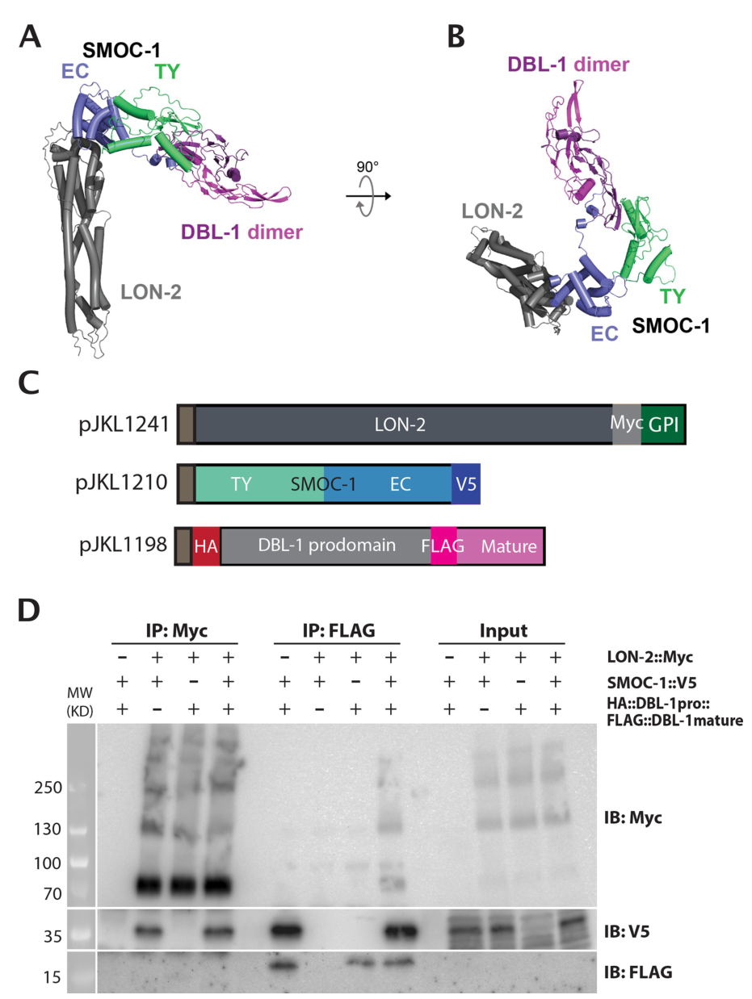

## Question

# Gene Research for Functional Annotation

## ⚠️ CRITICAL: Gene/Protein Identification Context

**BEFORE YOU BEGIN RESEARCH:** You MUST verify you are researching the CORRECT gene/protein. Gene symbols can be ambiguous, especially for less well-characterized genes from non-model organisms.

### Target Gene/Protein Identity (from UniProt):
- **UniProt Accession:** Q18530
- **Protein Description:** SubName: Full=LONg {ECO:0000313|EMBL:CCD67078.1};
- **Gene Information:** Name=lon-2 {ECO:0000313|EMBL:CCD67078.1, ECO:0000313|WormBase:C39E6.1}; ORFNames=C39E6.1 {ECO:0000313|WormBase:C39E6.1}, CELE_C39E6.1 {ECO:0000313|EMBL:CCD67078.1};
- **Organism (full):** Caenorhabditis elegans.
- **Protein Family:** Belongs to the glypican family.
- **Key Domains:** Glypican. (IPR001863); Glypican (PF01153)

### MANDATORY VERIFICATION STEPS:

1. **Check if the gene symbol "lon-2" matches the protein description above**
2. **Verify the organism is correct:** Caenorhabditis elegans.
3. **Check if protein family/domains align with what you find in literature**
4. **If you find literature for a DIFFERENT gene with the same or similar symbol, STOP**

### If Gene Symbol is Ambiguous or You Cannot Find Relevant Literature:

**DO NOT PROCEED WITH RESEARCH ON A DIFFERENT GENE.** Instead:
- State clearly: "The gene symbol 'lon-2' is ambiguous or literature is limited for this specific protein"
- Explain what you found (e.g., "Found extensive literature on a different gene with the same symbol in a different organism")
- Describe the protein based ONLY on the UniProt information provided above
- Suggest that the protein function can be inferred from domain/family information

### Research Target:

Please provide a comprehensive research report on the gene **lon-2** (gene ID: lon-2, UniProt: Q18530) in worm.

The research report should be a detailed narrative explaining the function, biological processes, and localization of the gene product. Citations should be given for all claims.

You should prioritize authoritative reviews and primary scientific literature when conducting research. You can supplement
this with annotations you find in gene/protein databases, but these can be outdated or inaccurate.

We are specifically interested in the primary function of the gene - for enzymes, what reaction is catalyzed, and what is the substrate specificity? For transporters, what is the substrate? For structural proteins or adapters, what is the broader structural role? For signaling molecules, what is the role in the pathway.

We are interested in where in or outside the cell the gene product carries out its function.

We are also interested in the signaling or biochemical pathways in which the gene functions. We are less interested in broad pleiotropic effects, except where these elucidate the precise role.

Include evidence where possible. We are interested in both experimental evidence as well as inference from structure, evolution, or bioinformatic analysis. Precise studies should be prioritized over high-throughput, where available.

## Output

Question: You are an expert researcher providing comprehensive, well-cited information.

Provide detailed information focusing on:
1. Key concepts and definitions with current understanding
2. Recent developments and latest research (prioritize 2023-2024 sources)
3. Current applications and real-world implementations
4. Expert opinions and analysis from authoritative sources
5. Relevant statistics and data from recent studies

Format as a comprehensive research report with proper citations. Include URLs and publication dates where available.
Always prioritize recent, authoritative sources and provide specific citations for all major claims.

# Gene Research for Functional Annotation

## ⚠️ CRITICAL: Gene/Protein Identification Context

**BEFORE YOU BEGIN RESEARCH:** You MUST verify you are researching the CORRECT gene/protein. Gene symbols can be ambiguous, especially for less well-characterized genes from non-model organisms.

### Target Gene/Protein Identity (from UniProt):
- **UniProt Accession:** Q18530
- **Protein Description:** SubName: Full=LONg {ECO:0000313|EMBL:CCD67078.1};
- **Gene Information:** Name=lon-2 {ECO:0000313|EMBL:CCD67078.1, ECO:0000313|WormBase:C39E6.1}; ORFNames=C39E6.1 {ECO:0000313|WormBase:C39E6.1}, CELE_C39E6.1 {ECO:0000313|EMBL:CCD67078.1};
- **Organism (full):** Caenorhabditis elegans.
- **Protein Family:** Belongs to the glypican family.
- **Key Domains:** Glypican. (IPR001863); Glypican (PF01153)

### MANDATORY VERIFICATION STEPS:

1. **Check if the gene symbol "lon-2" matches the protein description above**
2. **Verify the organism is correct:** Caenorhabditis elegans.
3. **Check if protein family/domains align with what you find in literature**
4. **If you find literature for a DIFFERENT gene with the same or similar symbol, STOP**

### If Gene Symbol is Ambiguous or You Cannot Find Relevant Literature:

**DO NOT PROCEED WITH RESEARCH ON A DIFFERENT GENE.** Instead:
- State clearly: "The gene symbol 'lon-2' is ambiguous or literature is limited for this specific protein"
- Explain what you found (e.g., "Found extensive literature on a different gene with the same symbol in a different organism")
- Describe the protein based ONLY on the UniProt information provided above
- Suggest that the protein function can be inferred from domain/family information

### Research Target:

Please provide a comprehensive research report on the gene **lon-2** (gene ID: lon-2, UniProt: Q18530) in worm.

The research report should be a detailed narrative explaining the function, biological processes, and localization of the gene product. Citations should be given for all claims.

You should prioritize authoritative reviews and primary scientific literature when conducting research. You can supplement
this with annotations you find in gene/protein databases, but these can be outdated or inaccurate.

We are specifically interested in the primary function of the gene - for enzymes, what reaction is catalyzed, and what is the substrate specificity? For transporters, what is the substrate? For structural proteins or adapters, what is the broader structural role? For signaling molecules, what is the role in the pathway.

We are interested in where in or outside the cell the gene product carries out its function.

We are also interested in the signaling or biochemical pathways in which the gene functions. We are less interested in broad pleiotropic effects, except where these elucidate the precise role.

Include evidence where possible. We are interested in both experimental evidence as well as inference from structure, evolution, or bioinformatic analysis. Precise studies should be prioritized over high-throughput, where available.

# Functional annotation of *Caenorhabditis elegans lon-2*

## Identity and principal function

The target specified by the supplied UniProt accession [Q18530](https://www.uniprot.org/uniprotkb/Q18530/entry) is *C. elegans lon-2*, also designated **C39E6.1**. The primary literature independently identifies the studied *C. elegans* LON-2 protein as a **glypican**, a heparan-sulfate proteoglycan, consistent with the supplied glypican-family and domain annotations. The papers examined identify the protein by gene name and species rather than independently establishing the Q18530 accession-to-locus mapping; that mapping is therefore retained from the supplied UniProt record. No similarly named protein from another organism is used in this annotation. (degroot2023c.eleganssmoc1 pages 1-5, blanchette2015glypicanisa pages 10-13, degroot2023smoc1interactswith pages 3-6)

**Primary functional assignment:** LON-2 is an extracellular, potentially GPI-anchored **regulator of ligand–receptor signaling**, not an enzyme or transporter. Its best-defined role is to **restrain DBL-1/BMP-like signaling**, which controls worm body length. Its protein core also modulates **UNC-6/netrin-dependent axon and cell guidance**. Thus, its relevant molecular partners are signaling proteins and receptors, not catalytic substrates or transported solutes. (degroot2023smoc1interactswith pages 19-21, blanchette2015glypicanisa pages 16-17, degroot2023smoc1interactswith pages 21-22)

## Molecular mechanism in the DBL-1/BMP pathway

LON-2 normally reduces signaling by the BMP-family ligand DBL-1. Loss of *lon-2* produces a long-body phenotype consistent with elevated pathway activity; genetic suppression by mutations in core DBL-1-pathway components supports its placement upstream of receptor–SMAD signaling. The pathway includes the SMA-6 type-I and DAF-4 type-II receptors and downstream SMA-2, SMA-3 and SMA-4 SMAD proteins. Body length is a useful **pathway readout**, although it is not itself a direct measurement of ligand binding. (degroot2023c.eleganssmoc1 pages 1-5, degroot2023smoc1interactswith pages 21-22, lakdawala2019geneticinteractionsbetween pages 1-4)

**The important 2023 mechanistic revision is that DBL-1 association appears to be mediated by SMOC-1, rather than established direct binding of LON-2 to DBL-1.** DeGroot and colleagues recovered 13 and 18 LON-2-specific peptides in two independent SMOC-1 pulldowns from worms, with none in untagged controls. Biochemical assays showed that SMOC-1’s extracellular calcium-binding domain associates with LON-2, while SMOC-1 also associates with mature DBL-1. In a heterologous co-immunoprecipitation assay, mature DBL-1 pulled down LON-2 **only when SMOC-1 was present**. The authors did not detect direct LON-2–DBL-1 association in that system and modeled SMOC-1 as a bridge in a LON-2–SMOC-1–DBL-1 complex. Their proposed consequence—extracellular retention or sequestration of DBL-1 that limits receptor access—is a mechanistic interpretation supported by the interaction and genetic data, not a direct in-vivo measurement of ligand sequestration. See the study’s tripartite-complex figure. (degroot2023smoc1interactswith pages 27-28, degroot2023smoc1interactswith pages 19-21, degroot2023smoc1interactswith pages 3-6, degroot2023smoc1interactswith pages 21-22, degroot2023smoc1interactswith pages 9-12, degroot2023smoc1interactswith media c6f38bf2)

The protein-core interface matters physiologically: substituting three LON-2 residues predicted to contact SMOC-1 (**S311D/A315D/F319D**) yielded a long-body phenotype indistinguishable from a *lon-2* null. Earlier rescue/overexpression experiments also found that the LON-2 core, including its N-terminal residues 1–368, can inhibit BMP-like signaling. Conversely, heparan-sulfate attachment sites were important for inhibitory activity of an **overexpressed C-terminal fragment**; this does not establish that glycan attachment is required for full-length LON-2 at its endogenous locus. SMOC-1 also has a **LON-2-independent positive** effect on DBL-1 signaling, so calling SMOC-1—or every LON-2-associated complex—exclusively inhibitory would be inaccurate. (degroot2023smoc1interactswith pages 19-21, degroot2023smoc1interactswith pages 21-22)

The strongest recent primary source is **DeGroot et al., *PLOS Biology*, published 17 August 2023**, [doi:10.1371/journal.pbio.3002272](https://doi.org/10.1371/journal.pbio.3002272). In the literature retrieved for this report, no comparably direct **2024** mechanistic study of this specific worm protein superseded those findings. (degroot2023smoc1interactswith pages 19-21, degroot2023smoc1interactswith pages 21-22)

## Where LON-2 acts: cell surface and extracellular space

LON-2 has features expected of a cell-surface glypican: a signal peptide, heparan-sulfate attachment sites and a predicted **glycosylphosphatidylinositol (GPI) linkage site**. Its established guidance function is **cell-nonautonomous**. In the axon-guidance setting, the relevant source is hyp7 epidermal/hypodermal substrate cells beneath extending axons. LON-2 can be released into extracellular medium; released protein associates with cells expressing the UNC-40/DCC netrin receptor in cell-mixing assays. These observations place a demonstrated site of action **outside the producing cell, at or near the surface of responding cells**. They do not establish that every physiological LON-2 molecule is shed, nor identify the shedding enzyme. (degroot2023smoc1interactswith pages 3-6, blanchette2015glypicanisa pages 13-14, blanchette2015glypicanisa pages 14-16)

Importantly, deliberately secreted **LON-2ΔGPI** rescues tested axon-guidance defects. An isolated secreted **N-terminal globular region**, lacking the C-terminal heparan-sulfate attachment sites and GPI anchor, also rescues guidance, whereas the corresponding C-terminal construct does not. The N-terminal protein core is consequently sufficient in these assays; membrane tethering and heparan-sulfate chains are **not universally required** for LON-2 activity. Requirements in other tissues or under endogenous expression may differ. (blanchette2015glypicanisa pages 14-16, blanchette2015glypicanisa pages 10-13)

## Additional signaling processes

**UNC-6/netrin guidance.** Blanchette and colleagues showed that LON-2 influences both attractive and repulsive netrin-dependent guidance, including AVM axon and distal-tip-cell migration assays. Loss of *lon-2* enhanced defects when the parallel SLT-1/Slit pathway was compromised, but did not enhance *unc-6* or *unc-40* null defects, supporting placement with netrin signaling rather than Slit signaling. Secreted LON-2 associated with UNC-40-expressing cells, and that association required UNC-40’s extracellular region; removing LON-2’s tested heparan-sulfate attachment sites did not abolish guidance rescue. **Direct molecular binding to UNC-40 has not been established**: an intermediary could account for the cell-association assay. Source: **Blanchette et al., *PLOS Biology*, 6 July 2015**, [doi:10.1371/journal.pbio.1002183](https://doi.org/10.1371/journal.pbio.1002183). (blanchette2015glypicanisa pages 10-13, blanchette2015glypicanisa pages 13-14, blanchette2015glypicanisa pages 4-6, blanchette2015glypicanisa pages 14-16)

**Wnt-associated cell positioning.** Genetic experiments implicate LON-2 in positioning migrating HSN neurons along the anterior–posterior axis. A *lin-17; lon-2* double mutant was not significantly different from either single mutant, consistent with participation in the same **genetic** pathway as LIN-17/Frizzled for this phenotype. This does **not** demonstrate physical LON-2–LIN-17 binding, a particular Wnt ligand bound by LON-2, or a universal role in Wnt signaling; EGL-20 overexpression did not reveal a direct LON-2 requirement in the tested HSN-migration assay. Source: **Saied-Santiago et al., *Genetics*, August 2017**, [doi:10.1534/genetics.116.198739](https://doi.org/10.1534/genetics.116.198739). (saiedsantiago2017coordinationofheparan pages 20-23, saiedsantiago2017coordinationofheparan pages 16-20)

## Structure–function evidence and quantitative observations

The domain requirements depend on the biological assay: LON-2’s N-terminal core suffices for tested guidance rescue and can inhibit BMP signaling when expressed experimentally, while glycan attachment matters for the activity of a tested overexpressed BMP-inhibitory C-terminal fragment. The **RGD motif at residues 348–350** is another functionally informative feature, but an integrin partner for worm LON-2 has not been established by the cited mutant experiment. In a CRISPR RGD-deletion study, mutant animals averaged **968.6 ± 22.98 µm** in length (*n* = 27; mean ± SE), compared with **1127.6 ± 25.28 µm** for wild type (*n* = 45). The approximately **159 µm shorter** phenotype differs from a *lon-2* null’s long phenotype. The authors proposed altered inhibition of BMP signaling, but did not identify the causal binding partner or directly measure BMP activity for that allele. Source: **Park et al., 10 March 2021**, [doi:10.17912/micropub.biology.000376](https://doi.org/10.17912/micropub.biology.000376). (degroot2023smoc1interactswith pages 19-21, blanchette2015glypicanisa pages 10-13, park2021deletionofthe pages 1-3)

The principal experimental findings and their interpretive limits are summarized below. (degroot2023smoc1interactswith pages 3-6, blanchette2015glypicanisa pages 14-16, saiedsantiago2017coordinationofheparan pages 16-20)

| Process / experimental result | Evidence method | Mechanistic interpretation and limit | Source |
|---|---|---|---|
| **BMP regulation: LON-2 associates with SMOC-1** | SMOC-1 immunoprecipitation–mass spectrometry from worm lysates recovered **13 and 18 LON-2-specific peptides** in two biological experiments and none in untagged controls; heterologous co-IP was repeated three times. | Direct evidence for association with SMOC-1. It does not alone establish where the complex forms in vivo or prove direct binding by purified proteins. | [DeGroot et al., 2023](https://doi.org/10.1371/journal.pbio.3002272) (degroot2023smoc1interactswith pages 3-6) |
| **BMP regulation: SMOC-1-dependent ternary complex** | In S2-cell co-IP, mature DBL-1 pulled down LON-2 only when SMOC-1 was present; modeling predicted SMOC-1 interfaces with LON-2 and mature DBL-1. | Best-supported model: LON-2 sequesters DBL-1 **indirectly through SMOC-1**. No direct LON-2–DBL-1 interaction was detected; affinity and in-vivo stoichiometry remain unknown. | [DeGroot et al., 2023](https://doi.org/10.1371/journal.pbio.3002272) (degroot2023smoc1interactswith pages 27-28, degroot2023smoc1interactswith pages 21-22, degroot2023smoc1interactswith pages 9-12, degroot2023smoc1interactswith media c6f38bf2) |
| **BMP regulation: native LON-2 core interface is required** | Endogenous substitutions **S311D/A315D/F319D**, predicted to disrupt the SMOC-1 interface, caused a long-body phenotype indistinguishable from a *lon-2* null; LON-2(1–368) and the core protein can inhibit signaling in rescue/overexpression assays. | Strong genetic support that the LON-2 core–SMOC-1 interface mediates body-size inhibition. Residues were selected using structural predictions, and body length is an indirect signaling readout. | [DeGroot et al., 2023](https://doi.org/10.1371/journal.pbio.3002272) (degroot2023smoc1interactswith pages 19-21) |
| **Netrin-dependent axon and cell guidance** | Epidermal/hypodermal expression acts non-cell-autonomously; released LON-2 associated with UNC-40/DCC-expressing cells. ΔGAG, ΔGPI and secreted N-terminal constructs rescued AVM and/or distal-tip-cell guidance, whereas the isolated C terminus did not. | LON-2 is an extracellular modulator whose N-terminal core is sufficient in these assays; HS chains and GPI anchoring are dispensable for tested guidance functions. Association with UNC-40-expressing cells may be direct or indirect. | [Blanchette et al., 2015](https://doi.org/10.1371/journal.pbio.1002183) (blanchette2015glypicanisa pages 14-16, blanchette2015glypicanisa pages 10-13, blanchette2015glypicanisa pages 13-14) |
| **HSN positioning and Wnt/Frizzled genetics** | The *lin-17; lon-2* double mutant was not significantly different from either single mutant; epistasis placed LON-2 with LIN-17 in HSN positioning. EGL-20 overexpression had no effect in *lon-2* mutants. | Supports a shared genetic pathway affecting positional information, **not direct LON-2–LIN-17 binding**; precise ligand, source tissue and molecular interaction remain unresolved. | [Saied-Santiago et al., 2017](https://doi.org/10.1534/genetics.116.198739) (saiedsantiago2017coordinationofheparan pages 20-23, saiedsantiago2017coordinationofheparan pages 16-20) |
| **Experimental application as a BMP-pathway sensitizer** | EMS suppressor screen of approximately **9,000** *lon-2(e678)* genomes yielded **46 recessive alleles**, including core DBL-1-pathway genes; body length, GFP::DBL-1 and *spp-9p::GFP* served as readouts. | Validates *lon-2* loss as a discovery platform for BMP, ECM and body-size regulators. Suppression can arise through DBL-1-independent shortening, so secondary pathway tests are required. | [Lakdawala et al., 2019](https://doi.org/10.1091/mbc.e19-09-0500) (lakdawala2019geneticinteractionsbetween pages 7-10, lakdawala2019geneticinteractionsbetween pages 1-4, lakdawala2019geneticinteractionsbetween pages 4-7) |
| **RGD motif affects body-size regulation** | CRISPR deletion of residues **348–350 (RGD)** produced animals averaging **968.6 ± 22.98 µm** (*n*=27), versus **1127.6 ± 25.28 µm** for wild type (*n*=45); 99% confidence intervals did not overlap. | Contrary to a null’s long phenotype, ΔRGD shortened animals, suggesting enhanced LON-2 inhibition or altered partner interactions. The responsible partner—potentially an integrin or another protein—was not identified. | [Park et al., 2021](https://doi.org/10.17912/micropub.biology.000376) (park2021deletionofthe pages 1-3) |

*Table: Experimental evidence supporting the functional annotation of C. elegans LON-2/Q18530, with mechanistic conclusions separated from unresolved or indirect relationships. The table emphasizes that DBL-1 association is SMOC-1-dependent and that LIN-17 evidence is genetic rather than physical.*

## Research use and remaining uncertainties

*lon-2* loss is a practical **sensitized worm model**, not a clinical intervention. A forward genetic screen used the long *lon-2(e678)* phenotype to identify suppressors: approximately **9,000 mutagenized genomes** yielded **46 recessive alleles**, including mutations in core DBL-1-signaling components. Investigators also used fluorescent DBL-1 and a downstream transcriptional reporter to distinguish effects on ligand abundance from effects on pathway output. Suppression of body length alone requires caution because genes can shorten worms independently of DBL-1. Source: **Lakdawala et al., *Molecular Biology of the Cell*, December 2019**, [doi:10.1091/mbc.e19-09-0500](https://doi.org/10.1091/mbc.e19-09-0500). (lakdawala2019geneticinteractionsbetween pages 7-10, lakdawala2019geneticinteractionsbetween pages 1-4, lakdawala2019geneticinteractionsbetween pages 4-7)

Overall, **extracellular glypican-mediated control of signaling availability and cellular responses** is the best-supported functional annotation. Open mechanistic questions include whether the LON-2–SMOC-1–DBL-1 complex forms with the modeled geometry and stoichiometry in native tissues, how LON-2 is released, when endogenous heparan-sulfate modification is necessary, and whether association with UNC-40 or genetic cooperation with LIN-17 entails direct receptor binding. These uncertainties should not be replaced by assumptions drawn from other glypicans or similarly named genes. (degroot2023smoc1interactswith pages 19-21, blanchette2015glypicanisa pages 14-16, saiedsantiago2017coordinationofheparan pages 20-23, degroot2023smoc1interactswith pages 21-22)

References

1. (degroot2023c.eleganssmoc1 pages 1-5): Melisa S. DeGroot, Byron Williams, Timothy Y Chang, Maria L. Maas Gamboa, Isabel Larus, J. Christopher Fromme, and Jun Liu. C. elegans smoc-1 interacts with both bmp and glypican to regulate bmp signaling. bioRxiv, Jan 2023. URL: https://doi.org/10.1101/2023.01.06.523017, doi:10.1101/2023.01.06.523017. This article has 0 citations.

2. (blanchette2015glypicanisa pages 10-13): Cassandra R. Blanchette, Paola N. Perrat, Andrea Thackeray, and Claire Y. Bénard. Glypican is a modulator of netrin-mediated axon guidance. PLOS Biology, 13:e1002183, Jul 2015. URL: https://doi.org/10.1371/journal.pbio.1002183, doi:10.1371/journal.pbio.1002183. This article has 82 citations and is from a highest quality peer-reviewed journal.

3. (degroot2023smoc1interactswith pages 3-6): Melisa S. DeGroot, Byron Williams, Timothy Y. Chang, Maria L. Maas Gamboa, Isabel M. Larus, Garam Hong, J. Christopher Fromme, and Jun Liu. Smoc-1 interacts with both bmp and glypican to regulate bmp signaling in c. elegans. PLOS Biology, 21:e3002272, Aug 2023. URL: https://doi.org/10.1371/journal.pbio.3002272, doi:10.1371/journal.pbio.3002272. This article has 12 citations and is from a highest quality peer-reviewed journal.

4. (degroot2023smoc1interactswith pages 19-21): Melisa S. DeGroot, Byron Williams, Timothy Y. Chang, Maria L. Maas Gamboa, Isabel M. Larus, Garam Hong, J. Christopher Fromme, and Jun Liu. Smoc-1 interacts with both bmp and glypican to regulate bmp signaling in c. elegans. PLOS Biology, 21:e3002272, Aug 2023. URL: https://doi.org/10.1371/journal.pbio.3002272, doi:10.1371/journal.pbio.3002272. This article has 12 citations and is from a highest quality peer-reviewed journal.

5. (blanchette2015glypicanisa pages 16-17): Cassandra R. Blanchette, Paola N. Perrat, Andrea Thackeray, and Claire Y. Bénard. Glypican is a modulator of netrin-mediated axon guidance. PLOS Biology, 13:e1002183, Jul 2015. URL: https://doi.org/10.1371/journal.pbio.1002183, doi:10.1371/journal.pbio.1002183. This article has 82 citations and is from a highest quality peer-reviewed journal.

6. (degroot2023smoc1interactswith pages 21-22): Melisa S. DeGroot, Byron Williams, Timothy Y. Chang, Maria L. Maas Gamboa, Isabel M. Larus, Garam Hong, J. Christopher Fromme, and Jun Liu. Smoc-1 interacts with both bmp and glypican to regulate bmp signaling in c. elegans. PLOS Biology, 21:e3002272, Aug 2023. URL: https://doi.org/10.1371/journal.pbio.3002272, doi:10.1371/journal.pbio.3002272. This article has 12 citations and is from a highest quality peer-reviewed journal.

7. (lakdawala2019geneticinteractionsbetween pages 1-4): Mohammed Farhan Lakdawala, Bhoomi Madhu, Lionel Faure, Mehul Vora, Richard W. Padgett, and Tina L. Gumienny. Genetic interactions between the dbl-1/bmp-like pathway and<i>dpy</i>body size–associated genes in<i>caenorhabditis elegans</i>. Molecular Biology of the Cell, 30:3151-3160, Dec 2019. URL: https://doi.org/10.1091/mbc.e19-09-0500, doi:10.1091/mbc.e19-09-0500. This article has 31 citations and is from a domain leading peer-reviewed journal.

8. (degroot2023smoc1interactswith pages 27-28): Melisa S. DeGroot, Byron Williams, Timothy Y. Chang, Maria L. Maas Gamboa, Isabel M. Larus, Garam Hong, J. Christopher Fromme, and Jun Liu. Smoc-1 interacts with both bmp and glypican to regulate bmp signaling in c. elegans. PLOS Biology, 21:e3002272, Aug 2023. URL: https://doi.org/10.1371/journal.pbio.3002272, doi:10.1371/journal.pbio.3002272. This article has 12 citations and is from a highest quality peer-reviewed journal.

9. (degroot2023smoc1interactswith pages 9-12): Melisa S. DeGroot, Byron Williams, Timothy Y. Chang, Maria L. Maas Gamboa, Isabel M. Larus, Garam Hong, J. Christopher Fromme, and Jun Liu. Smoc-1 interacts with both bmp and glypican to regulate bmp signaling in c. elegans. PLOS Biology, 21:e3002272, Aug 2023. URL: https://doi.org/10.1371/journal.pbio.3002272, doi:10.1371/journal.pbio.3002272. This article has 12 citations and is from a highest quality peer-reviewed journal.

10. (degroot2023smoc1interactswith media c6f38bf2): Melisa S. DeGroot, Byron Williams, Timothy Y. Chang, Maria L. Maas Gamboa, Isabel M. Larus, Garam Hong, J. Christopher Fromme, and Jun Liu. Smoc-1 interacts with both bmp and glypican to regulate bmp signaling in c. elegans. PLOS Biology, 21:e3002272, Aug 2023. URL: https://doi.org/10.1371/journal.pbio.3002272, doi:10.1371/journal.pbio.3002272. This article has 12 citations and is from a highest quality peer-reviewed journal.

11. (blanchette2015glypicanisa pages 13-14): Cassandra R. Blanchette, Paola N. Perrat, Andrea Thackeray, and Claire Y. Bénard. Glypican is a modulator of netrin-mediated axon guidance. PLOS Biology, 13:e1002183, Jul 2015. URL: https://doi.org/10.1371/journal.pbio.1002183, doi:10.1371/journal.pbio.1002183. This article has 82 citations and is from a highest quality peer-reviewed journal.

12. (blanchette2015glypicanisa pages 14-16): Cassandra R. Blanchette, Paola N. Perrat, Andrea Thackeray, and Claire Y. Bénard. Glypican is a modulator of netrin-mediated axon guidance. PLOS Biology, 13:e1002183, Jul 2015. URL: https://doi.org/10.1371/journal.pbio.1002183, doi:10.1371/journal.pbio.1002183. This article has 82 citations and is from a highest quality peer-reviewed journal.

13. (blanchette2015glypicanisa pages 4-6): Cassandra R. Blanchette, Paola N. Perrat, Andrea Thackeray, and Claire Y. Bénard. Glypican is a modulator of netrin-mediated axon guidance. PLOS Biology, 13:e1002183, Jul 2015. URL: https://doi.org/10.1371/journal.pbio.1002183, doi:10.1371/journal.pbio.1002183. This article has 82 citations and is from a highest quality peer-reviewed journal.

14. (saiedsantiago2017coordinationofheparan pages 20-23): Kristian Saied-Santiago, Robert A Townley, John D Attonito, Dayse S da Cunha, Carlos A Díaz-Balzac, Eillen Tecle, and Hannes E Bülow. Coordination of heparan sulfate proteoglycans with wnt signaling to control cellular migrations and positioning in<i>caenorhabditis elegans</i>. Genetics, 206:1951-1967, Aug 2017. URL: https://doi.org/10.1534/genetics.116.198739, doi:10.1534/genetics.116.198739. This article has 37 citations and is from a domain leading peer-reviewed journal.

15. (saiedsantiago2017coordinationofheparan pages 16-20): Kristian Saied-Santiago, Robert A Townley, John D Attonito, Dayse S da Cunha, Carlos A Díaz-Balzac, Eillen Tecle, and Hannes E Bülow. Coordination of heparan sulfate proteoglycans with wnt signaling to control cellular migrations and positioning in<i>caenorhabditis elegans</i>. Genetics, 206:1951-1967, Aug 2017. URL: https://doi.org/10.1534/genetics.116.198739, doi:10.1534/genetics.116.198739. This article has 37 citations and is from a domain leading peer-reviewed journal.

16. (park2021deletionofthe pages 1-3): A Park, Z Qiu, and M Lee. Deletion of the rgd motif in lon-2/glypican is associated with morphological abnormalities. micropublication biology. Unknown journal, 2021.

17. (lakdawala2019geneticinteractionsbetween pages 7-10): Mohammed Farhan Lakdawala, Bhoomi Madhu, Lionel Faure, Mehul Vora, Richard W. Padgett, and Tina L. Gumienny. Genetic interactions between the dbl-1/bmp-like pathway and<i>dpy</i>body size–associated genes in<i>caenorhabditis elegans</i>. Molecular Biology of the Cell, 30:3151-3160, Dec 2019. URL: https://doi.org/10.1091/mbc.e19-09-0500, doi:10.1091/mbc.e19-09-0500. This article has 31 citations and is from a domain leading peer-reviewed journal.

18. (lakdawala2019geneticinteractionsbetween pages 4-7): Mohammed Farhan Lakdawala, Bhoomi Madhu, Lionel Faure, Mehul Vora, Richard W. Padgett, and Tina L. Gumienny. Genetic interactions between the dbl-1/bmp-like pathway and<i>dpy</i>body size–associated genes in<i>caenorhabditis elegans</i>. Molecular Biology of the Cell, 30:3151-3160, Dec 2019. URL: https://doi.org/10.1091/mbc.e19-09-0500, doi:10.1091/mbc.e19-09-0500. This article has 31 citations and is from a domain leading peer-reviewed journal.

## Artifacts

- [Edison artifact artifact-00](lon-2-deep-research-falcon_artifacts/artifact-00.md)

## Citations

1. park2021deletionofthe pages 1-3
2. blanchette2015glypicanisa pages 10-13
3. blanchette2015glypicanisa pages 16-17
4. lakdawala2019geneticinteractionsbetween pages 1-4
5. blanchette2015glypicanisa pages 13-14
6. blanchette2015glypicanisa pages 14-16
7. blanchette2015glypicanisa pages 4-6
8. saiedsantiago2017coordinationofheparan pages 20-23
9. saiedsantiago2017coordinationofheparan pages 16-20
10. lakdawala2019geneticinteractionsbetween pages 7-10
11. lakdawala2019geneticinteractionsbetween pages 4-7
12. Q18530
13. doi:10.1371/journal.pbio.3002272
14. doi:10.1371/journal.pbio.1002183
15. doi:10.1534/genetics.116.198739
16. doi:10.17912/micropub.biology.000376
17. DeGroot et al., 2023
18. Blanchette et al., 2015
19. Saied-Santiago et al., 2017
20. Lakdawala et al., 2019
21. Park et al., 2021
22. doi:10.1091/mbc.e19-09-0500
23. https://www.uniprot.org/uniprotkb/Q18530/entry
24. https://doi.org/10.1371/journal.pbio.3002272
25. https://doi.org/10.1371/journal.pbio.1002183
26. https://doi.org/10.1534/genetics.116.198739
27. https://doi.org/10.17912/micropub.biology.000376
28. https://doi.org/10.1091/mbc.e19-09-0500
29. https://doi.org/10.1101/2023.01.06.523017,
30. https://doi.org/10.1371/journal.pbio.1002183,
31. https://doi.org/10.1371/journal.pbio.3002272,
32. https://doi.org/10.1091/mbc.e19-09-0500,
33. https://doi.org/10.1534/genetics.116.198739,