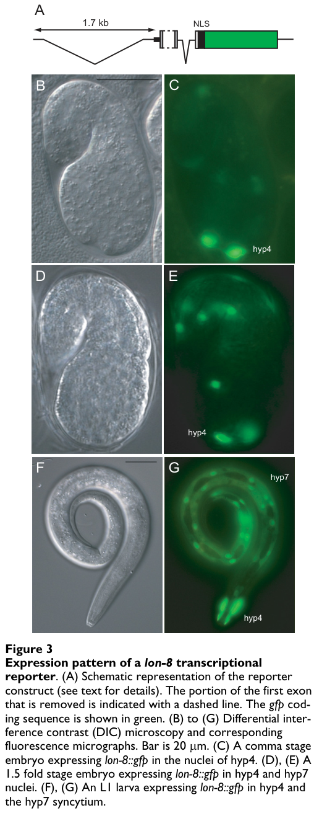

## Question

# Gene Research for Functional Annotation

## ⚠️ CRITICAL: Gene/Protein Identification Context

**BEFORE YOU BEGIN RESEARCH:** You MUST verify you are researching the CORRECT gene/protein. Gene symbols can be ambiguous, especially for less well-characterized genes from non-model organisms.

### Target Gene/Protein Identity (from UniProt):
- **UniProt Accession:** G5EGH7
- **Protein Description:** RecName: Full=Protein lon-8 {ECO:0000312|WormBase:Y59A8B.20}; Flags: Precursor;
- **Gene Information:** Name=lon-8 {ECO:0000312|WormBase:Y59A8B.20}; ORFNames=Y59A8B.20 {ECO:0000312|WormBase:Y59A8B.20};
- **Organism (full):** Caenorhabditis elegans.
- **Protein Family:** Not specified in UniProt
- **Key Domains:** BPTI_C_nem. (IPR057449); BPTI_nem (PF25315)

### MANDATORY VERIFICATION STEPS:

1. **Check if the gene symbol "lon-8" matches the protein description above**
2. **Verify the organism is correct:** Caenorhabditis elegans.
3. **Check if protein family/domains align with what you find in literature**
4. **If you find literature for a DIFFERENT gene with the same or similar symbol, STOP**

### If Gene Symbol is Ambiguous or You Cannot Find Relevant Literature:

**DO NOT PROCEED WITH RESEARCH ON A DIFFERENT GENE.** Instead:
- State clearly: "The gene symbol 'lon-8' is ambiguous or literature is limited for this specific protein"
- Explain what you found (e.g., "Found extensive literature on a different gene with the same symbol in a different organism")
- Describe the protein based ONLY on the UniProt information provided above
- Suggest that the protein function can be inferred from domain/family information

### Research Target:

Please provide a comprehensive research report on the gene **lon-8** (gene ID: lon-8, UniProt: G5EGH7) in worm.

The research report should be a detailed narrative explaining the function, biological processes, and localization of the gene product. Citations should be given for all claims.

You should prioritize authoritative reviews and primary scientific literature when conducting research. You can supplement
this with annotations you find in gene/protein databases, but these can be outdated or inaccurate.

We are specifically interested in the primary function of the gene - for enzymes, what reaction is catalyzed, and what is the substrate specificity? For transporters, what is the substrate? For structural proteins or adapters, what is the broader structural role? For signaling molecules, what is the role in the pathway.

We are interested in where in or outside the cell the gene product carries out its function.

We are also interested in the signaling or biochemical pathways in which the gene functions. We are less interested in broad pleiotropic effects, except where these elucidate the precise role.

Include evidence where possible. We are interested in both experimental evidence as well as inference from structure, evolution, or bioinformatic analysis. Precise studies should be prioritized over high-throughput, where available.

## Output

Question: You are an expert researcher providing comprehensive, well-cited information.

Provide detailed information focusing on:
1. Key concepts and definitions with current understanding
2. Recent developments and latest research (prioritize 2023-2024 sources)
3. Current applications and real-world implementations
4. Expert opinions and analysis from authoritative sources
5. Relevant statistics and data from recent studies

Format as a comprehensive research report with proper citations. Include URLs and publication dates where available.
Always prioritize recent, authoritative sources and provide specific citations for all major claims.

# Gene Research for Functional Annotation

## ⚠️ CRITICAL: Gene/Protein Identification Context

**BEFORE YOU BEGIN RESEARCH:** You MUST verify you are researching the CORRECT gene/protein. Gene symbols can be ambiguous, especially for less well-characterized genes from non-model organisms.

### Target Gene/Protein Identity (from UniProt):
- **UniProt Accession:** G5EGH7
- **Protein Description:** RecName: Full=Protein lon-8 {ECO:0000312|WormBase:Y59A8B.20}; Flags: Precursor;
- **Gene Information:** Name=lon-8 {ECO:0000312|WormBase:Y59A8B.20}; ORFNames=Y59A8B.20 {ECO:0000312|WormBase:Y59A8B.20};
- **Organism (full):** Caenorhabditis elegans.
- **Protein Family:** Not specified in UniProt
- **Key Domains:** BPTI_C_nem. (IPR057449); BPTI_nem (PF25315)

### MANDATORY VERIFICATION STEPS:

1. **Check if the gene symbol "lon-8" matches the protein description above**
2. **Verify the organism is correct:** Caenorhabditis elegans.
3. **Check if protein family/domains align with what you find in literature**
4. **If you find literature for a DIFFERENT gene with the same or similar symbol, STOP**

### If Gene Symbol is Ambiguous or You Cannot Find Relevant Literature:

**DO NOT PROCEED WITH RESEARCH ON A DIFFERENT GENE.** Instead:
- State clearly: "The gene symbol 'lon-8' is ambiguous or literature is limited for this specific protein"
- Explain what you found (e.g., "Found extensive literature on a different gene with the same symbol in a different organism")
- Describe the protein based ONLY on the UniProt information provided above
- Suggest that the protein function can be inferred from domain/family information

### Research Target:

Please provide a comprehensive research report on the gene **lon-8** (gene ID: lon-8, UniProt: G5EGH7) in worm.

The research report should be a detailed narrative explaining the function, biological processes, and localization of the gene product. Citations should be given for all claims.

You should prioritize authoritative reviews and primary scientific literature when conducting research. You can supplement
this with annotations you find in gene/protein databases, but these can be outdated or inaccurate.

We are specifically interested in the primary function of the gene - for enzymes, what reaction is catalyzed, and what is the substrate specificity? For transporters, what is the substrate? For structural proteins or adapters, what is the broader structural role? For signaling molecules, what is the role in the pathway.

We are interested in where in or outside the cell the gene product carries out its function.

We are also interested in the signaling or biochemical pathways in which the gene functions. We are less interested in broad pleiotropic effects, except where these elucidate the precise role.

Include evidence where possible. We are interested in both experimental evidence as well as inference from structure, evolution, or bioinformatic analysis. Precise studies should be prioritized over high-throughput, where available.

## Research report: *Caenorhabditis elegans* **lon-8** (UniProt G5EGH7; ORF Y59A8B.20)

### 0) Scope, identity verification, and ambiguity check
The literature retrieved and analyzed here consistently uses **lon-8** to refer to the *C. elegans* locus **Y59A8B.20**, originally defined by Soete, Betist, and Korswagen (2007). In that primary description, **Y59A8B.20 was renamed lon-8** based on long-body (Lon) and male tail phenotypes, and the gene was shown to encode a **small secreted precursor protein** (signal peptide-bearing) expressed in the hypodermis. (soete2007regulationofcaenorhabditis pages 1-2)

Within the retrieved corpus, no alternative “lon-8” gene in another organism was found to be conflated with the *C. elegans* gene; downstream mentions of **LON-8** occur in the context of **apical extracellular matrices (aECM)/cuticle and male rays**. (soete2007regulationofcaenorhabditis pages 8-9, ragle2025multiscalepatterningof pages 12-15)

**Important limitation:** Although the user provided UniProt/InterPro domain context (**BPTI_nem/BPTI_C_nem**) for UniProt **G5EGH7**, those database pages were not directly retrievable with the current tools, and no domain-focused primary papers were retrieved that explicitly connect those domain identifiers to LON-8. Therefore, mechanistic statements about “BPTI/Kunitz-like protease inhibitor activity” are treated as **hypotheses** rather than evidence-based claims in this report.

### 1) Key concepts and definitions (current understanding)

#### 1.1 What is lon-8?
**lon-8** encodes **LON-8**, a small (~**162 aa**) protein with an **N-terminal signal peptide**, consistent with a **secreted protein/peptide** produced by the hypodermis (epidermis). (soete2007regulationofcaenorhabditis pages 1-2)

In reporter assays, inclusion of the N-terminal signal peptide caused GFP to appear secreted/diffuse; clearer cell-associated reporter localization required **deleting the signal peptide** from the fusion construct, consistent with secretion of the native protein. (soete2007regulationofcaenorhabditis pages 4-6)

#### 1.2 Biological context: cuticle and apical extracellular matrix (aECM)
The *C. elegans* **cuticle** is an **apical extracellular matrix (aECM)** secreted by the hypodermis and specialized epithelia. In an aECM-focused review, **LON-8 is discussed among proteins important for building male rays**, placing it within the broader conceptual framework of aECM components shaping epithelial structures. (soete2007regulationofcaenorhabditis pages 1-2)

#### 1.3 Phenotype terms used in this gene’s characterization
* **Lon (long body size)**: Animals are longer than wild-type.
* **Ram-like male ray defects**: Male tail sensory rays exhibit abnormal morphology. lon-8 mutants show extensive ray deformations without the ray fate/misspecification typical of some DBL-1/Sma/Mab pathway mutants. (soete2007regulationofcaenorhabditis pages 9-11, soete2007regulationofcaenorhabditis pages 6-8)

### 2) Experimentally supported functions of LON-8

#### 2.1 Primary function: regulation of post-embryonic body size (larval elongation/early adult growth)
Soete et al. (2007; *BMC Developmental Biology*, published **2007-03**, DOI **10.1186/1471-213X-7-20**, URL https://doi.org/10.1186/1471-213x-7-20) showed that reducing lon-8 activity increases body length (Lon phenotype). (soete2007regulationofcaenorhabditis pages 1-2, soete2007regulationofcaenorhabditis pages 2-4)

Quantitative examples from their assays include:
* **RNAi** against lon-8 increased body length from **1.3 ± 0.08 mm** (control) to **1.4 ± 0.08 mm** (**n = 75**). (soete2007regulationofcaenorhabditis pages 1-2)
* lon-8 mutants were described as ~**10% longer** than wild type, smaller effect than lon-1 (~30%) or lon-3 (~25%), with effects mainly during larval and early adult stages. (soete2007regulationofcaenorhabditis pages 8-9)

Mechanistically, they tested whether size increase reflected more epidermal nuclei or higher epidermal ploidy and found no strong support:
* Hypodermal nuclei counts: **21 ± 1** (n=20), no change reported. (soete2007regulationofcaenorhabditis pages 2-4)
* Seam cell counts: **16–17 seam cell nuclei** (n=32), no change reported. (soete2007regulationofcaenorhabditis pages 2-4)
* Hypodermal ploidy: **7.9 ± 1.6** (N2) vs **8.2 ± 2.4** (lon-8(hu188); n≈10), not detectably changed. (soete2007regulationofcaenorhabditis pages 2-4)

These data support a model in which LON-8 influences **body shape/length via extracellular matrix (cuticle) properties and/or cell size**, rather than by increasing epidermal cell number or nuclear DNA content. (soete2007regulationofcaenorhabditis pages 2-4, soete2007regulationofcaenorhabditis pages 9-11)

#### 2.2 Role in male tail development (ray morphology)
A distinguishing aspect of lon-8 among “lon” genes is its effect on **male tail/ray morphogenesis**. lon-8 deletion mutants **hu187** and **hu188** show widespread, variable ray defects (Ram-like), with rays 5 and 6 most severely affected; males remain capable of mating. (soete2007regulationofcaenorhabditis pages 6-8)

The phenotype is visually documented in Soete et al. figures (wild-type vs lon-8 mutant male tail). (soete2007regulationofcaenorhabditis media 8670cd25, soete2007regulationofcaenorhabditis media ae92ca98)

### 3) Expression pattern and inferred site of action

#### 3.1 Hypodermal expression throughout development
lon-8 is strongly expressed in hypodermal syncytia (notably **hyp4** and **hyp7**) from embryonic stages (comma stage) through larval stages and adulthood based on reporter analysis. (soete2007regulationofcaenorhabditis pages 4-6)

A cropped figure panel shows hypodermal reporter expression in an L1 larva (hyp7 and hyp4 nuclei). (soete2007regulationofcaenorhabditis media 8670cd25)

#### 3.2 Male tail hypodermis surrounding developing rays
lon-8::gfp reporter expression is seen in specific nuclei contributing to the **ventral male tail hypodermis** surrounding developing rays (cell identities enumerated in the original paper). (soete2007regulationofcaenorhabditis pages 8-9, soete2007regulationofcaenorhabditis pages 6-8)

Corresponding figure panels show reporter expression in male tail hypodermal cells, supporting a local hypodermal source for the secreted product relevant to ray morphogenesis. (soete2007regulationofcaenorhabditis media ae92ca98)

### 4) Genetic pathway placement and interactions

#### 4.1 Relationship to DBL-1/Sma/Mab (TGF-β) pathway
Multiple lines of evidence suggest lon-8 is **not a direct transcriptional target** of the DBL-1/Sma/Mab pathway and functions **in parallel/independently** for body size control:
* lon-8 expression was not detectably altered in dbl-1 or sma-6 mutants in reporter and/or transcript assays. (soete2007regulationofcaenorhabditis pages 4-6, soete2007regulationofcaenorhabditis pages 6-8)
* lon-8 does not suppress the strong Sma phenotype of dbl-1 or sma-6 mutants; double mutants remain strongly Sma. (soete2007regulationofcaenorhabditis pages 4-6)

However, dbl-1 can genetically suppress the lon-8 body-size phenotype, consistent with partially convergent control of growth through distinct effectors. (soete2007regulationofcaenorhabditis pages 8-9)

#### 4.2 Interactions with cuticle/collagen-modifying enzymes dpy-11 and dpy-18
The most informative genetic interactions reported are with **dpy-11** and **dpy-18**, which encode enzymes involved in **cuticle collagen modification**. RNAi of either gene **completely suppresses** the lon-8 Lon phenotype, implying lon-8’s effect on body size is mediated through cuticle/collagen-related processes. (soete2007regulationofcaenorhabditis pages 1-2, soete2007regulationofcaenorhabditis pages 6-8)

This interaction is consistent with LON-8 acting as a secreted cuticle/aECM factor that modulates cuticle organization, the accessibility of collagen-modifying enzyme substrates, or the mechanical properties of the extracellular matrix that determine body length. (soete2007regulationofcaenorhabditis pages 9-11)

### 5) Recent developments and latest research (prioritizing 2023–2024)

#### 5.1 Availability of recent lon-8-focused studies
A targeted search for 2023–2024 primary studies specifically dissecting **lon-8** did not yield relevant lon-8-focused mechanistic papers in the retrieved set. This likely reflects that lon-8 remains a comparatively under-studied, small secreted factor with a limited direct literature footprint.

#### 5.2 Most recent authoritative context available in this corpus: aECM review and newer tagging resources
Two more recent sources in the retrieved corpus are useful:

* **aECM review context (2020):** Cohen & Sundaram (2020; *Journal of Developmental Biology*, published **2020-10**, DOI **10.3390/jdb8040023**, URL https://doi.org/10.3390/jdb8040023) place LON-8 among proteins important for building male rays within the conceptual framework of apical extracellular matrices. (soete2007regulationofcaenorhabditis pages 1-2)

* **Endogenous tagging resource (preprint 2025):** Ragle et al. (2025; bioRxiv, published **2025-05**, DOI **10.1101/2025.05.14.653803**, URL https://doi.org/10.1101/2025.05.14.653803) report systematic endogenous tagging of aECM components including **LON-8::mNG**, describing LON-8 as a secreted protein implicated in cuticle morphology. They further report localization to cuticle structures including the **male tail fan**, and note atypical FRAP recovery for LON-8::mNG in the L4 vulva relative to most knock-ins. (ragle2025multiscalepatterningof pages 12-15)

Although this preprint is outside 2024, it represents the most recent methodological “real-world implementation” in the retrieved corpus that directly enables improved functional annotation of LON-8.

### 6) Current applications and real-world implementations

#### 6.1 As a genetic handle on cuticle-dependent morphogenesis
lon-8 mutants provide a tractable genotype to study how secreted epidermal factors influence:
* Whole-body size/shape (growth/elongation) (soete2007regulationofcaenorhabditis pages 1-2)
* Male tail ray morphogenesis and aECM patterning (soete2007regulationofcaenorhabditis pages 6-8)

Because body length changes are modest (~10%) and not due to obvious hypodermal cell number/ploidy changes, lon-8 can be used to probe ECM mechanics/assembly in a relatively specific manner compared to broader growth pathways. (soete2007regulationofcaenorhabditis pages 2-4)

#### 6.2 Imaging and localization resources
Two complementary “implementation” styles are demonstrated:
* **Transcriptional reporter** lon-8::gfp (extrachromosomal), used to map expression in hypodermis and male tail hypodermis. (soete2007regulationofcaenorhabditis pages 11-12, soete2007regulationofcaenorhabditis media ae92ca98)
* **Endogenous knock-in** LON-8::mNG (Ragle et al.), which can support higher-fidelity localization dynamics and comparative aECM mapping across tissues (e.g., male tail fan, alae). (ragle2025multiscalepatterningof pages 12-15)

### 7) Expert opinions / analysis grounded in authoritative sources

#### 7.1 What authoritative sources imply about mechanism
The strongest interpretation supported by experimental genetics is that LON-8 is a **secreted hypodermal factor acting on the cuticle/aECM**, influencing body length and specialized cuticular structures (male rays). This is supported by its signal peptide, hypodermal expression, and genetic suppression by collagen-modifying enzyme knockdowns (dpy-11, dpy-18). (soete2007regulationofcaenorhabditis pages 1-2, soete2007regulationofcaenorhabditis pages 6-8)

A reasonable working model is that LON-8 modulates **cuticle composition or architecture**, thereby affecting organismal elongation and the mechanical extension/morphogenesis of male rays. The epistasis/suppression pattern is consistent with a mechanism involving collagen post-translational modification pathways, although the biochemical mode of action remains undefined in the retrieved literature. (soete2007regulationofcaenorhabditis pages 9-11)

#### 7.2 Domain-based hypotheses (explicitly labeled as hypotheses)
The user-provided UniProt context indicates BPTI-like nematode domains (BPTI_nem/BPTI_C_nem). If correct, this could suggest LON-8 is structurally related to small cysteine-rich inhibitors (e.g., protease inhibitors). However, no retrieved primary sources directly connect LON-8 to protease inhibition biochemistry, nor were substrates or enzymatic reactions reported. Therefore, any “protease inhibitor” mechanism should be treated as **speculative** until supported by biochemical assays or domain-confirming sources.

### 8) Key quantitative/statistical results (from primary studies)
Selected quantitative statistics from Soete et al. (2007):
* Body length (RNAi): **1.3 ± 0.08 mm** control vs **1.4 ± 0.08 mm** lon-8 RNAi (**n=75**). (soete2007regulationofcaenorhabditis pages 1-2)
* Hypodermal nuclei: **21 ± 1** (n=20), no change reported for lon-8 mutants. (soete2007regulationofcaenorhabditis pages 2-4)
* Seam cell nuclei: **16–17** (n=32), no change reported. (soete2007regulationofcaenorhabditis pages 2-4)
* Hypodermal ploidy: **7.9 ± 1.6** (N2) vs **8.2 ± 2.4** (lon-8(hu188); n≈10). (soete2007regulationofcaenorhabditis pages 2-4)

### 9) Evidence map (summary table)
The following table consolidates evidence claims, experimental types, quantitative values, and sources.

| Claim/annotation | Evidence type (genetics/expression/quantitative/resource) | Key details (numbers, tissues, alleles, interactions) | Source (author year, venue, DOI/URL) |
|---|---|---|---|
| **Identity mapping**: **lon-8 = Y59A8B.20** in *C. elegans*; encodes a **small secreted precursor** | genetics/expression | ORF **Y59A8B.20** named **lon-8**; predicted **162 aa** protein with **N-terminal signal peptide**; no TM/lipid anchor noted; one deletion allele (**hu187**) yields alternative transcript predicted to **lack the signal peptide** (soete2007regulationofcaenorhabditis pages 1-2, soete2007regulationofcaenorhabditis pages 2-4) | Soete et al. 2007, *BMC Developmental Biology*; DOI: https://doi.org/10.1186/1471-213X-7-20 |
| **Primary function**: regulator of **body size/larval elongation** | genetics/quantitative | RNAi against Y59A8B.20 increased body length from **1.3 ± 0.08 mm** to **1.4 ± 0.08 mm** (**n = 75**); deletion alleles **lon-8(hu187)** and **lon-8(hu188)** produce clear **Lon** phenotype; mutants are reported as about **~10% longer** than wild type (soete2007regulationofcaenorhabditis pages 1-2, soete2007regulationofcaenorhabditis pages 8-9) | Soete et al. 2007, *BMC Developmental Biology*; DOI: https://doi.org/10.1186/1471-213X-7-20 |
| **Cellular localization / site of action**: hypodermis-derived, likely extracellular/cuticular | expression | Strong reporter expression in **hypodermal syncytium**, especially **hyp4** and **hyp7**; clear cellular localization required deletion of signal peptide from reporter because native N-terminus could cause **secretion/diffusion of GFP**; supports extracellular secretion from epidermis (soete2007regulationofcaenorhabditis pages 1-2, soete2007regulationofcaenorhabditis pages 4-6, soete2007regulationofcaenorhabditis media 8670cd25) | Soete et al. 2007, *BMC Developmental Biology*; DOI: https://doi.org/10.1186/1471-213X-7-20 |
| **Male tail / ray morphogenesis role** | genetics/expression | **lon-8(hu187)** and **lon-8(hu188)** males show **Ram-like** defects; **all rays abnormal**, with **rays 5 and 6 most severe**; rays can appear **clumped as an amorphous mass**; males remain able to mate; reporter expressed in ventral male tail hypodermis around developing rays, including **V6.pppaa, T.aa, R6.p, T.apapa, R7.p, R8.p, R9.p** (soete2007regulationofcaenorhabditis pages 6-8, soete2007regulationofcaenorhabditis pages 8-9, soete2007regulationofcaenorhabditis media 8670cd25) | Soete et al. 2007, *BMC Developmental Biology*; DOI: https://doi.org/10.1186/1471-213X-7-20 |
| **Pathway placement**: acts outside direct transcriptional control of **DBL-1/Sma/Mab (TGF-β)** | genetics/expression | **lon-8** expression not detectably changed in **dbl-1** or **sma-6** mutants; **dbl-1** suppresses the lon-8 body-size phenotype, but data support action **in parallel/independent** rather than as a direct DBL-1 transcriptional target (soete2007regulationofcaenorhabditis pages 8-9, soete2007regulationofcaenorhabditis pages 4-6, soete2007regulationofcaenorhabditis pages 6-8) | Soete et al. 2007, *BMC Developmental Biology*; DOI: https://doi.org/10.1186/1471-213X-7-20 |
| **Cuticle/aECM association** via collagen-modifying enzymes | genetics | **dpy-11(RNAi)** and **dpy-18(RNAi)** completely suppress the lon-8 body-size phenotype; these genes encode **cuticle collagen modifying enzymes**, implicating LON-8 in **cuticle composition/assembly** or regulation of cuticle-associated targets (soete2007regulationofcaenorhabditis pages 1-2, soete2007regulationofcaenorhabditis pages 9-11, soete2007regulationofcaenorhabditis pages 6-8) | Soete et al. 2007, *BMC Developmental Biology*; DOI: https://doi.org/10.1186/1471-213X-7-20 |
| **Mechanistic constraint**: Lon phenotype is **not explained by increased hypodermal cell number or ploidy** | quantitative | Hypodermal nuclei counts unchanged (**21 ± 1**, **n = 20**); seam cell nuclei unchanged (**16–17**, **n = 32**); hypodermal ploidy not detectably changed (**7.9 ± 1.6** in N2 vs **8.2 ± 2.4** in **lon-8(hu188)**, **n ≈ 10**); supports a model involving **cell size / matrix properties** rather than extra cells (soete2007regulationofcaenorhabditis pages 2-4) | Soete et al. 2007, *BMC Developmental Biology*; DOI: https://doi.org/10.1186/1471-213X-7-20 |
| **Evolutionary context**: conserved in rhabditid nematodes | expression/quantitative | Homologs reported across **Rhabditida**; N-termini are divergent but consistently predicted to be **signal peptides**, reinforcing conserved secretion/extracellular localization (soete2007regulationofcaenorhabditis pages 9-11, soete2007regulationofcaenorhabditis pages 8-9) | Soete et al. 2007, *BMC Developmental Biology*; DOI: https://doi.org/10.1186/1471-213X-7-20 |
| **Review-level annotation**: secreted aECM/cuticle factor important for male rays | resource | Review on *C. elegans* apical extracellular matrices lists **LON-8** among proteins important for building **male rays**, describing it as a **short, secreted peptide/protein** in the ray/cuticle context (soete2007regulationofcaenorhabditis pages 1-2) | Cohen & Sundaram 2020, *Journal of Developmental Biology*; DOI: https://doi.org/10.3390/jdb8040023 |
| **Recent resource / real-world implementation**: endogenous fluorescent tagging | resource | Systematic aECM study generated an endogenous **lon-8::mNG** knock-in, explicitly describing **LON-8** as a **novel secreted protein** implicated in **body cuticle morphology**; useful for in vivo localization and functional follow-up (ragle2025multiscalepatterningof pages 9-12) | Ragle et al. 2025, *bioRxiv*; DOI: https://doi.org/10.1101/2025.05.14.653803 |

*Table: This table summarizes the strongest functional annotation evidence for *C. elegans* lon-8/Y59A8B.20, including secretion, hypodermal expression, body-size and male-tail phenotypes, pathway relationships, and recent tagging resources. It is useful as a compact evidence map linking specific claims to quantitative results and source citations.*

### 10) Visual evidence excerpts
Soete et al. (2007) figure crops support (i) hypodermal expression and (ii) male tail ray morphological defects in lon-8 mutants. (soete2007regulationofcaenorhabditis media 8670cd25, soete2007regulationofcaenorhabditis media ae92ca98)

### 11) Conclusions and research gaps
**Conclusions (supported):** lon-8/Y59A8B.20 encodes a small secreted hypodermal protein that functions in the extracellular cuticle/aECM to regulate larval elongation/body size and male ray morphology, acting largely independently of DBL-1/Sma/Mab transcriptional control but genetically interacting with collagen-modifying enzymes dpy-11 and dpy-18. (soete2007regulationofcaenorhabditis pages 1-2, soete2007regulationofcaenorhabditis pages 6-8)

**Major gaps (not resolved by retrieved literature):**
* Direct biochemical function (binding partners, substrates, enzymatic targets) and whether LON-8 has protease-inhibitor activity.
* Domain confirmation and structure–function mapping tied to BPTI_nem/BPTI_C_nem annotations.
* Updated (2023–2024) mechanistic studies of lon-8 specifically.

**Actionable next steps enabled by recent resources:** Endogenous LON-8::mNG strains and systematic aECM tagging approaches should facilitate tissue-resolved localization, dynamics (e.g., FRAP), and genetic interaction mapping to uncover mechanism and pathway integration. (ragle2025multiscalepatterningof pages 12-15)

References

1. (soete2007regulationofcaenorhabditis pages 1-2): Gwen Soete, Marco C Betist, and Hendrik C Korswagen. Regulation of caenorhabditis elegans body size and male tail development by the novel gene lon-8. BMC Developmental Biology, 7:20-20, Mar 2007. URL: https://doi.org/10.1186/1471-213x-7-20, doi:10.1186/1471-213x-7-20. This article has 24 citations and is from a peer-reviewed journal.

2. (soete2007regulationofcaenorhabditis pages 8-9): Gwen Soete, Marco C Betist, and Hendrik C Korswagen. Regulation of caenorhabditis elegans body size and male tail development by the novel gene lon-8. BMC Developmental Biology, 7:20-20, Mar 2007. URL: https://doi.org/10.1186/1471-213x-7-20, doi:10.1186/1471-213x-7-20. This article has 24 citations and is from a peer-reviewed journal.

3. (ragle2025multiscalepatterningof pages 12-15): James Matthew Ragle, Murugesan Pooranachithra, Guinevere E. Ashley, Emma Cadena, Batia Blank, Katelyn Kang, Cincy Chen, Aditree R. Bhowmick, Soraya H. Mercado, Tabatha E. Wells, John C. Clancy, Andrew D. Chisholm, and Jordan D. Ward. Multiscale patterning of a model apical extracellular matrix revealed by systematic endogenous protein tagging. BioRxiv, May 2025. URL: https://doi.org/10.1101/2025.05.14.653803, doi:10.1101/2025.05.14.653803. This article has 10 citations.

4. (soete2007regulationofcaenorhabditis pages 4-6): Gwen Soete, Marco C Betist, and Hendrik C Korswagen. Regulation of caenorhabditis elegans body size and male tail development by the novel gene lon-8. BMC Developmental Biology, 7:20-20, Mar 2007. URL: https://doi.org/10.1186/1471-213x-7-20, doi:10.1186/1471-213x-7-20. This article has 24 citations and is from a peer-reviewed journal.

5. (soete2007regulationofcaenorhabditis pages 9-11): Gwen Soete, Marco C Betist, and Hendrik C Korswagen. Regulation of caenorhabditis elegans body size and male tail development by the novel gene lon-8. BMC Developmental Biology, 7:20-20, Mar 2007. URL: https://doi.org/10.1186/1471-213x-7-20, doi:10.1186/1471-213x-7-20. This article has 24 citations and is from a peer-reviewed journal.

6. (soete2007regulationofcaenorhabditis pages 6-8): Gwen Soete, Marco C Betist, and Hendrik C Korswagen. Regulation of caenorhabditis elegans body size and male tail development by the novel gene lon-8. BMC Developmental Biology, 7:20-20, Mar 2007. URL: https://doi.org/10.1186/1471-213x-7-20, doi:10.1186/1471-213x-7-20. This article has 24 citations and is from a peer-reviewed journal.

7. (soete2007regulationofcaenorhabditis pages 2-4): Gwen Soete, Marco C Betist, and Hendrik C Korswagen. Regulation of caenorhabditis elegans body size and male tail development by the novel gene lon-8. BMC Developmental Biology, 7:20-20, Mar 2007. URL: https://doi.org/10.1186/1471-213x-7-20, doi:10.1186/1471-213x-7-20. This article has 24 citations and is from a peer-reviewed journal.

8. (soete2007regulationofcaenorhabditis media 8670cd25): Gwen Soete, Marco C Betist, and Hendrik C Korswagen. Regulation of caenorhabditis elegans body size and male tail development by the novel gene lon-8. BMC Developmental Biology, 7:20-20, Mar 2007. URL: https://doi.org/10.1186/1471-213x-7-20, doi:10.1186/1471-213x-7-20. This article has 24 citations and is from a peer-reviewed journal.

9. (soete2007regulationofcaenorhabditis media ae92ca98): Gwen Soete, Marco C Betist, and Hendrik C Korswagen. Regulation of caenorhabditis elegans body size and male tail development by the novel gene lon-8. BMC Developmental Biology, 7:20-20, Mar 2007. URL: https://doi.org/10.1186/1471-213x-7-20, doi:10.1186/1471-213x-7-20. This article has 24 citations and is from a peer-reviewed journal.

10. (soete2007regulationofcaenorhabditis pages 11-12): Gwen Soete, Marco C Betist, and Hendrik C Korswagen. Regulation of caenorhabditis elegans body size and male tail development by the novel gene lon-8. BMC Developmental Biology, 7:20-20, Mar 2007. URL: https://doi.org/10.1186/1471-213x-7-20, doi:10.1186/1471-213x-7-20. This article has 24 citations and is from a peer-reviewed journal.

11. (ragle2025multiscalepatterningof pages 9-12): James Matthew Ragle, Murugesan Pooranachithra, Guinevere E. Ashley, Emma Cadena, Batia Blank, Katelyn Kang, Cincy Chen, Aditree R. Bhowmick, Soraya H. Mercado, Tabatha E. Wells, John C. Clancy, Andrew D. Chisholm, and Jordan D. Ward. Multiscale patterning of a model apical extracellular matrix revealed by systematic endogenous protein tagging. BioRxiv, May 2025. URL: https://doi.org/10.1101/2025.05.14.653803, doi:10.1101/2025.05.14.653803. This article has 10 citations.

## Artifacts

- [Edison artifact artifact-00](lon-8-deep-research-falcon_artifacts/artifact-00.md)

## Citations

1. soete2007regulationofcaenorhabditis pages 1-2
2. soete2007regulationofcaenorhabditis pages 4-6
3. soete2007regulationofcaenorhabditis pages 8-9
4. soete2007regulationofcaenorhabditis pages 2-4
5. soete2007regulationofcaenorhabditis pages 6-8
6. soete2007regulationofcaenorhabditis pages 9-11
7. ragle2025multiscalepatterningof pages 12-15
8. ragle2025multiscalepatterningof pages 9-12
9. soete2007regulationofcaenorhabditis pages 11-12
10. https://doi.org/10.1186/1471-213x-7-20
11. https://doi.org/10.3390/jdb8040023
12. https://doi.org/10.1101/2025.05.14.653803
13. https://doi.org/10.1186/1471-213X-7-20
14. https://doi.org/10.1186/1471-213x-7-20,
15. https://doi.org/10.1101/2025.05.14.653803,