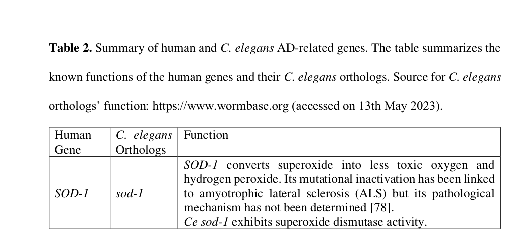

## Question

# Gene Research for Functional Annotation

## ⚠️ CRITICAL: Gene/Protein Identification Context

**BEFORE YOU BEGIN RESEARCH:** You MUST verify you are researching the CORRECT gene/protein. Gene symbols can be ambiguous, especially for less well-characterized genes from non-model organisms.

### Target Gene/Protein Identity (from UniProt):
- **UniProt Accession:** Q22179
- **Protein Description:** SubName: Full=LRP X(Cross)-hybridizing {ECO:0000313|EMBL:CAB01583.2};
- **Gene Information:** Name=lrx-1 {ECO:0000313|EMBL:CAB01583.2, ECO:0000313|WormBase:T04H1.6}; ORFNames=CELE_T04H1.6 {ECO:0000313|EMBL:CAB01583.2}, T04H1.6 {ECO:0000313|WormBase:T04H1.6};
- **Organism (full):** Caenorhabditis elegans.
- **Protein Family:** Not specified in UniProt
- **Key Domains:** LDL_receptor-like_sf. (IPR036055); LDLR. (IPR050685); LDLR_class-A_CS. (IPR023415); LDrepeatLR_classA_rpt. (IPR002172); Ldl_recept_a (PF00057)

### MANDATORY VERIFICATION STEPS:

1. **Check if the gene symbol "lrx-1" matches the protein description above**
2. **Verify the organism is correct:** Caenorhabditis elegans.
3. **Check if protein family/domains align with what you find in literature**
4. **If you find literature for a DIFFERENT gene with the same or similar symbol, STOP**

### If Gene Symbol is Ambiguous or You Cannot Find Relevant Literature:

**DO NOT PROCEED WITH RESEARCH ON A DIFFERENT GENE.** Instead:
- State clearly: "The gene symbol 'lrx-1' is ambiguous or literature is limited for this specific protein"
- Explain what you found (e.g., "Found extensive literature on a different gene with the same symbol in a different organism")
- Describe the protein based ONLY on the UniProt information provided above
- Suggest that the protein function can be inferred from domain/family information

### Research Target:

Please provide a comprehensive research report on the gene **lrx-1** (gene ID: lrx-1, UniProt: Q22179) in worm.

The research report should be a detailed narrative explaining the function, biological processes, and localization of the gene product. Citations should be given for all claims.

You should prioritize authoritative reviews and primary scientific literature when conducting research. You can supplement
this with annotations you find in gene/protein databases, but these can be outdated or inaccurate.

We are specifically interested in the primary function of the gene - for enzymes, what reaction is catalyzed, and what is the substrate specificity? For transporters, what is the substrate? For structural proteins or adapters, what is the broader structural role? For signaling molecules, what is the role in the pathway.

We are interested in where in or outside the cell the gene product carries out its function.

We are also interested in the signaling or biochemical pathways in which the gene functions. We are less interested in broad pleiotropic effects, except where these elucidate the precise role.

Include evidence where possible. We are interested in both experimental evidence as well as inference from structure, evolution, or bioinformatic analysis. Precise studies should be prioritized over high-throughput, where available.

## Output

Question: You are an expert researcher providing comprehensive, well-cited information.

Provide detailed information focusing on:
1. Key concepts and definitions with current understanding
2. Recent developments and latest research (prioritize 2023-2024 sources)
3. Current applications and real-world implementations
4. Expert opinions and analysis from authoritative sources
5. Relevant statistics and data from recent studies

Format as a comprehensive research report with proper citations. Include URLs and publication dates where available.
Always prioritize recent, authoritative sources and provide specific citations for all major claims.

# Gene Research for Functional Annotation

## ⚠️ CRITICAL: Gene/Protein Identification Context

**BEFORE YOU BEGIN RESEARCH:** You MUST verify you are researching the CORRECT gene/protein. Gene symbols can be ambiguous, especially for less well-characterized genes from non-model organisms.

### Target Gene/Protein Identity (from UniProt):
- **UniProt Accession:** Q22179
- **Protein Description:** SubName: Full=LRP X(Cross)-hybridizing {ECO:0000313|EMBL:CAB01583.2};
- **Gene Information:** Name=lrx-1 {ECO:0000313|EMBL:CAB01583.2, ECO:0000313|WormBase:T04H1.6}; ORFNames=CELE_T04H1.6 {ECO:0000313|EMBL:CAB01583.2}, T04H1.6 {ECO:0000313|WormBase:T04H1.6};
- **Organism (full):** Caenorhabditis elegans.
- **Protein Family:** Not specified in UniProt
- **Key Domains:** LDL_receptor-like_sf. (IPR036055); LDLR. (IPR050685); LDLR_class-A_CS. (IPR023415); LDrepeatLR_classA_rpt. (IPR002172); Ldl_recept_a (PF00057)

### MANDATORY VERIFICATION STEPS:

1. **Check if the gene symbol "lrx-1" matches the protein description above**
2. **Verify the organism is correct:** Caenorhabditis elegans.
3. **Check if protein family/domains align with what you find in literature**
4. **If you find literature for a DIFFERENT gene with the same or similar symbol, STOP**

### If Gene Symbol is Ambiguous or You Cannot Find Relevant Literature:

**DO NOT PROCEED WITH RESEARCH ON A DIFFERENT GENE.** Instead:
- State clearly: "The gene symbol 'lrx-1' is ambiguous or literature is limited for this specific protein"
- Explain what you found (e.g., "Found extensive literature on a different gene with the same symbol in a different organism")
- Describe the protein based ONLY on the UniProt information provided above
- Suggest that the protein function can be inferred from domain/family information

### Research Target:

Please provide a comprehensive research report on the gene **lrx-1** (gene ID: lrx-1, UniProt: Q22179) in worm.

The research report should be a detailed narrative explaining the function, biological processes, and localization of the gene product. Citations should be given for all claims.

You should prioritize authoritative reviews and primary scientific literature when conducting research. You can supplement
this with annotations you find in gene/protein databases, but these can be outdated or inaccurate.

We are specifically interested in the primary function of the gene - for enzymes, what reaction is catalyzed, and what is the substrate specificity? For transporters, what is the substrate? For structural proteins or adapters, what is the broader structural role? For signaling molecules, what is the role in the pathway.

We are interested in where in or outside the cell the gene product carries out its function.

We are also interested in the signaling or biochemical pathways in which the gene functions. We are less interested in broad pleiotropic effects, except where these elucidate the precise role.

Include evidence where possible. We are interested in both experimental evidence as well as inference from structure, evolution, or bioinformatic analysis. Precise studies should be prioritized over high-throughput, where available.

## Comprehensive Research Report: *Caenorhabditis elegans* **lrx-1** (UniProt Q22179; WormBase T04H1.6)

### Executive summary
The target protein is **lrx-1** (alias **egf-5**, described as “**LRP X(cross)-hybridizing**”) from **C. elegans**, corresponding to UniProt **Q22179**. In the tool-retrieved full-text corpus, **direct primary experimental characterization of lrx-1/T04H1.6 (loss-of-function phenotypes, biochemical activity, or cellular localization) was not found**. The strongest statement about lrx-1 in the retrieved material is **database-derived (WormBase) and explicitly predictive**, describing lrx-1 as encoding a protein with **LDL receptor domains**. Consequently, the most defensible functional annotation in this report is **domain/family-based inference** supported by experimental knowledge of **related LDL receptor–like proteins** (notably **lrp-1/Irp-1** and **rme-2**), which do have direct experimental evidence in worms.

### 1) Identity verification (mandatory disambiguation)
**Verified identity in retrieved sources:** A 2023 dissertation explicitly lists the *C. elegans* gene as **“lrx-1/egf-5 (LRP X(cross)-hybridizing)”** and states it is predicted to encode a protein with **low-density lipoprotein (LDL) receptor domains** (shi2023investigationofnaturalc pages 37-43, shi2023investigationofnatural media 09c05b5f).

**Organism consistency:** All retrieved mentions refer to **C. elegans** gene-ortholog context and WormBase annotations, with no evidence of a different organism’s “lrx-1” being conflated (shi2023investigationofnaturalc pages 37-43).

### 2) Key concepts and definitions (current understanding)
#### 2.1 LDL receptor (LDLR) domain modules relevant to lrx-1
Although the retrieved corpus does not provide a domain schematic for lrx-1 specifically, it provides a clear domain-level description of the canonical **LDL receptor-like module architecture** in *C. elegans* LDLR-family proteins. These concepts are directly applicable to interpreting lrx-1’s predicted **LDLR-class A repeats** and related features.

**(a) LDL receptor class A (LDL-A) repeats**
These modules contain **six disulfide-bonded cysteines** and a conserved **negatively charged cluster** important for ligand and Ca\(^{2+}\) interactions; in LDL receptors they contribute to **ligand binding** and require Ca\(^{2+}\) for structural integrity (landaverde2004disruptionofldl pages 26-31).

**(b) Ca\(^{2+}\)-binding EGF-like domains**
EGF-like segments occur in many extracellular and membrane proteins; some EGF-like modules have **N-terminal Ca\(^{2+}\)-binding sites** important for function (landaverde2004disruptionofldl pages 26-31). The alias **egf-5** used for lrx-1 is consistent with this broader “EGF-related” annotation context (shi2023investigationofnaturalc pages 37-43).

**(c) YWTD repeats**
The “YWTD repeat” is commonly found in tandem arrays and is believed to form a **β-propeller** structure, a hallmark of many LDLR-related proteins (landaverde2004disruptionofldl pages 26-31).

#### 2.2 What it means for functional annotation of lrx-1
Given the above modules, an LDLR-domain protein in animals is typically interpreted as a **secreted or membrane-associated ligand-binding protein** that can participate in extracellular interactions, endocytosis, or related trafficking/signaling functions. However, **the retrieved texts only support that lrx-1 is predicted (not proven) to have LDL receptor domains**, and therefore any mechanistic assignment must be labeled as inference (shi2023investigationofnaturalc pages 37-43, shi2023investigationofnatural media 09c05b5f).

### 3) What is known about **lrx-1** itself (direct evidence vs inference)
#### 3.1 Direct statements about lrx-1 in retrieved literature (2023)
A 2023 Rutgers PhD dissertation (Oct 2023) includes lrx-1 in a table of Alzheimer’s-disease–related genes/orthologs and states:
- **“Ce lrx-1 is predicted to encode a protein that has low-density lipoprotein (LDL) receptor domains.”** (shi2023investigationofnaturalc pages 37-43, shi2023investigationofnatural media 09c05b5f)

This is a **database-derived functional statement** (the table explicitly notes WormBase as the source for *C. elegans* ortholog functions) rather than new experimental evidence (shi2023investigationofnaturalc pages 37-43).

#### 3.2 What is missing (and why the report is necessarily cautious)
Within the tool-retrieved full texts, there were **no**:
- lrx-1/T04H1.6 knockout/mutant phenotype descriptions,
- lrx-1 RNAi phenotype descriptions,
- biochemical binding/catalysis data,
- subcellular localization experiments (e.g., tagged protein imaging),
- pathway-placement studies.

Therefore, **primary function, substrate/ligand specificity, and site of action (tissue/subcellular)** cannot be stated beyond domain-based inference without overreach.

### 4) Mechanistic context from authoritative experimental work on related LDLR-family proteins in worms
Because lrx-1 is weakly characterized in the retrieved corpus, experimentally supported roles of related LDL receptor-like proteins provide the best interpretive context.

#### 4.1 **lrp-1 / Irp-1** (megalin-like)
A thesis literature synthesis reports that *C. elegans* **Irp-1 (lrp-1)** resembles mammalian **megalin**, implicated in lipid homeostasis and extracellular protease regulation, and notes that megalin has been implicated in signal transduction mechanisms (landaverde2004disruptionofldl pages 26-31). The same synthesis states that **Irp-1 is essential for growth and development**, with null mutants showing:
- dumpiness/shortness,
- slow growth and lack of vigor,
- failure to shed cuticle (molting defect),
- expression localized to **hypodermal cells**,
- and that **cholesterol depletion phenocopies Irp-1 mutants**, consistent with a role in receptor-mediated cholesterol uptake through hypodermis (landaverde2004disruptionofldl pages 26-31).

In RNAi experiments summarized in the same thesis, **Irp-1(RNAi)** caused severe developmental phenotypes including molting/growth defects, and in some genetic backgrounds approached **“almost 100% early adulthood lethality”** (landaverde2004disruptionofldl pages 83-88).

#### 4.2 **rme-2** (yolk receptor)
A literature synthesis in the Landaverde thesis states that **rme-2** was isolated in screens for receptor-mediated endocytosis and likely encodes the **yolk receptor**; mutants fail to uptake yolk into growing oocytes and show brood size about **5% of wild-type** (landaverde2004disruptionofldl pages 26-31). The same summary describes evidence that cholesterol associates with vitellogenins and that **rme-2 mutants fail to accumulate cholesterol in oocytes**, instead accumulating cholesterol/vitellogenin in the body cavity—supporting endocytotic cholesterol uptake into oocytes (landaverde2004disruptionofldl pages 26-31).

#### 4.3 Other LDL receptor-like proteins (F14B4.1, T13C2.6) and metabolic-background RNAi
The Landaverde thesis describes domain architectures resembling LDL receptors in several worm proteins (including **F14B4.1** and **T13C2.6**) and notes that, at that time, these lacked definite assigned functions in WormBase (2004) (landaverde2004disruptionofldl pages 26-31). RNAi perturbations of **F14B4.1** in clk-1;dsc-4 backgrounds affected egg laying timing and defecation cycle outcomes, whereas **T13C2.6(RNAi)** behaved like control constructs for egg-laying timing in that background (landaverde2004disruptionofldl pages 60-66). Wild-type worms showed no change in egg-laying rate upon **T13C2.6** or **F14B4.1** RNAi (landaverde2004disruptionofldl pages 83-88).

### 5) Current applications and real-world implementations
#### 5.1 Use in pathway models of lipoprotein/cholesterol handling
The Landaverde thesis frames *C. elegans* as an invertebrate model to study LDL-like particle biology and receptor-mediated uptake, leveraging genetic perturbations (RNAi) to test pathway components (landaverde2004disruptionofldl pages 26-31). While this work does not implicate lrx-1 specifically, it demonstrates a real research implementation: **systematic perturbation of LDL receptor-like genes to modulate reproductive and rhythmic phenotypes in metabolic mutants** (landaverde2004disruptionofldl pages 60-66, landaverde2004disruptionofldl pages 83-88).

#### 5.2 Proteomics support for receptor-like biology (glycosylation)
LDLR-family proteins are frequently secreted or membrane proteins and often glycosylated. A Glycobiology study using mass spectrometry identified **117 distinct N-glycosylated proteins**, from **195 glycopeptides** containing **199 N-glycosylation sites** in *C. elegans* (Fan et al., Oct 2005; DOI: https://doi.org/10.1093/glycob/cwi075) (fan2005identificationofthe pages 1-2, fan2005identificationofthe pages 2-3). This supports the broader feasibility of proteomics-based functional annotation for extracellular/membrane proteins in worms, although lrx-1 is not explicitly mentioned in the extracted portions.

### 6) Recent developments (prioritizing 2023–2024)
**2023:** The most recent direct mention retrieved for lrx-1 is the 2023 dissertation’s WormBase-derived statement that lrx-1/egf-5 is predicted to encode an LDL receptor-domain protein (shi2023investigationofnaturalc pages 37-43, shi2023investigationofnatural media 09c05b5f). No tool-retrieved 2024 sources directly discussing lrx-1/T04H1.6 were obtained in-session.

**Interpretation:** This suggests that, at least in the accessible corpus during this run, lrx-1 remains **under-characterized experimentally**, and contemporary mentions are mainly as **annotated candidates** rather than mechanistically resolved genes.

### 7) Expert opinion and analysis (evidence-weighted)
#### 7.1 Best-supported functional hypothesis
The most defensible hypothesis, strictly from retrieved evidence, is:
- **lrx-1 encodes an LDL receptor-domain protein** (predictive annotation), implying a role as a **receptor-like extracellular/membrane protein** potentially involved in lipid/cholesterol handling or ligand interactions (shi2023investigationofnaturalc pages 37-43, shi2023investigationofnatural media 09c05b5f).

This is consistent with the established importance of LDLR-family members (lrp-1/Irp-1, rme-2) in **cholesterol trafficking, reproduction, molting, and development** in *C. elegans* (landaverde2004disruptionofldl pages 26-31).

#### 7.2 What cannot be claimed yet
Without direct lrx-1 experiments in the retrieved texts, it is not evidence-based to claim:
- that lrx-1 binds cholesterol or specific lipoprotein ligands,
- that it mediates endocytosis,
- that it localizes to hypodermis, intestine, oocytes, or neurons,
- that it participates in a defined signaling pathway.

### 8) Relevant statistics and quantitative data (from retrieved sources)
- **rme-2 mutants**: brood size reported as **~5% of wild type** (literature summary) (landaverde2004disruptionofldl pages 26-31).
- **Irp-1(RNAi)** in some backgrounds: **“almost 100% early adulthood lethality”** (qualitative near-quantitative statement) (landaverde2004disruptionofldl pages 83-88).
- *C. elegans* N-glycoproteome (Fan et al., 2005): **117 N-glycosylated proteins**, **195 glycopeptides**, **199 N-glycosylation sites** (fan2005identificationofthe pages 1-2, fan2005identificationofthe pages 2-3).

### 9) Evidence map (table)
The following table summarizes what each retrieved source contributes specifically to lrx-1 vs related genes.

| Source (short citation) | Publication date/year | URL/DOI | What it says about lrx-1 | What it says about related LDL receptor-like genes (LRP-1/Irp-1, RME-2, F14B4.1, T13C2.6) | Evidence type | Notes/limitations |
|---|---|---|---|---|---|---|
| UniProt/WormBase-derived identity in prompt; supported by Shi dissertation summary | Accessed/compiled in 2023 | WormBase URL mentioned in text: https://www.wormbase.org | Identifies **lrx-1 = egf-5 = LRP X(cross)-hybridizing** in *C. elegans* and states it is **predicted** to encode a protein with **LDL receptor domains**; no direct functional assay provided (shi2023investigationofnaturalc pages 37-43) | Uses **lrp-1** as the better-characterized LDL receptor-related comparator in AD-related gene summary (shi2023investigationofnaturalc pages 37-43) | Curated database-derived / secondary summary | Directly relevant to identity verification, but still prediction-level for function; not a primary lrx-1 experiment |
| Shi dissertation (AD-related gene table) | 2023 | Dissertation text cites WormBase; published related paper DOI in dissertation front matter: https://doi.org/10.3390/molecules28041826 | States that reduced LDL receptors increase Aβ deposition in brain and that **Ce lrx-1 is predicted to encode a protein with LDL receptor domains**; treats lrx-1 as an LDL-related candidate, not experimentally validated in worm here (shi2023investigationofnaturalc pages 37-43) | States **Ce lrp-1** resembles **LRP2**, affecting sterol transporter activity, locomotion regulation, larval development, and that decreased expression affects neurotransmission (shi2023investigationofnaturalc pages 37-43) | Thesis/secondary synthesis | Valuable recent mention (2023), but lrx-1 claim is explicitly predictive and sourced from WormBase rather than primary lrx-1 experiments |
| Landaverde thesis (LDL receptor-like genes overview) | 2004 | Not provided in extracted text | No mention of **lrx-1/T04H1.6** in the extracted LDL receptor-like overview (landaverde2004disruptionofldl pages 26-31) | Describes four worm proteins with LDL receptor-like domain architectures: **LRP-1, RME-2, F14B4.1, T13C2.6**; explains LDL-A, Ca2+-binding EGF-like, and YWTD-repeat domains; notes **LRP-1** and **RME-2** have established developmental roles, whereas **F14B4.1** and **T13C2.6** lacked definite function at that time (landaverde2004disruptionofldl pages 26-31) | Thesis/secondary with literature synthesis | Important for domain-based inference, but it does **not** provide direct evidence for lrx-1 |
| Landaverde thesis (LRP-1 / rme-2 functional summary) | 2004 | Not provided in extracted text | No lrx-1-specific information in the extracted section (landaverde2004disruptionofldl pages 26-31) | **lrp-1/Irp-1**: essential for growth/development; null mutants are dumpy, short, slow-growing, fail to shed cuticle; expressed in hypodermis; cholesterol depletion phenocopies mutant, suggesting receptor-mediated cholesterol uptake. **rme-2**: yolk receptor; mutants fail yolk uptake into oocytes and have brood size ~5% of wild type; implicated in cholesterol uptake into oocytes with vitellogenin (landaverde2004disruptionofldl pages 26-31) | Secondary summary of primary experimental literature | Strongest functional context for related genes, but still indirect for lrx-1 |
| Landaverde thesis (RNAi results headings and summaries) | 2004 | Not provided in extracted text | Extracted summaries do **not** identify lrx-1 as an RNAi target; presence of lrx-1 among tested genes cannot be confirmed (landaverde2004disruptionofldl pages 5-8, landaverde2004disruptionofldl pages 78-83) | RNAi targets explicitly or inferentially include **Irp-1/lrp-1, rme-2, F14B4.1, T13C2.6**, plus lipid-handling genes **dsc-4** and **vit-5**. Reported phenotypes include altered egg-laying timing in **clk-1** backgrounds, severe molting/growth defects and early lethality with **Irp-1(RNAi)**, strong fertility defects with **rme-2(RNAi)**, and wild-type-equivalent egg-laying timing restoration by **F14B4.1(RNAi)** in **clk-1;dsc-4** worms (landaverde2004disruptionofldl pages 5-8, landaverde2004disruptionofldl pages 83-88, landaverde2004disruptionofldl pages 60-66, landaverde2004disruptionofldl pages 78-83) | Thesis with experimental RNAi data | Relevant because it shows which LDL receptor-like genes were functionally perturbed; however, lrx-1 is absent from the extracted RNAi evidence |
| Fan et al., Glycobiology | 2005 Oct | https://doi.org/10.1093/glycob/cwi075 | No lrx-1-specific mention in extracted pages (fan2005identificationofthe pages 1-2, fan2005identificationofthe pages 2-3) | Large-scale glycoproteomics identified **117 distinct N-glycosylated proteins** and **199 N-glycosylation sites** in *C. elegans*; establishes that many membrane/extracellular proteins are glycosylated, consistent with receptor biology, but does not directly annotate lrx-1 or the named LDL receptor-like set in the extracted text (fan2005identificationofthe pages 1-2, fan2005identificationofthe pages 2-3) | Experimental proteomics | Useful general support for extracellular/membrane glycoprotein context, but not direct evidence for lrx-1 |
| Yochem & Greenwald PNAS paper (not retrievable here; cited as unobtainable in search results) | 1993 May | https://doi.org/10.1073/pnas.90.10.4572 | Search results indicate existence of a paper on a **low density lipoprotein receptor-related protein** in *C. elegans*, but no extracted text tying it to lrx-1/Q22179 was available (from search commentary reflected in context set) | Likely foundational for worm LDL receptor-related proteins, but the available context does not provide extractable claims beyond existence (landaverde2004disruptionofldl pages 26-31) | Primary literature (unobtainable in session) | Should not be overinterpreted for lrx-1 because the paper text was not available and may concern a different LDLR-family member |
| Overall evidence from retrieved context | 1993-2023 | Mixed; see URLs above | **lrx-1 is verified as the intended *C. elegans* gene symbol/alias set (lrx-1/egf-5; T04H1.6; Q22179), but literature is limited and mainly predictive**; current contextual evidence supports an **LDL receptor domain-containing extracellular/membrane-associated protein** rather than a directly demonstrated molecular function (shi2023investigationofnaturalc pages 37-43) | By contrast, related genes **lrp-1/Irp-1** and **rme-2** have direct functional evidence in molting/development and yolk/oocyte uptake, while **F14B4.1** and **T13C2.6** appear in RNAi/domain studies with more limited annotation (landaverde2004disruptionofldl pages 83-88, landaverde2004disruptionofldl pages 60-66, landaverde2004disruptionofldl pages 26-31) | Integrative summary | Best current conclusion is that lrx-1 functional annotation must rely heavily on domain/family inference because direct primary evidence was not located in the provided context |

*Table: This table summarizes the strongest evidence available in the provided context for *C. elegans* lrx-1/Q22179 and distinguishes direct lrx-1 information from better-supported data on related LDL receptor-like genes. It is useful for showing that lrx-1 is correctly identified but remains sparsely characterized experimentally.*

### 10) Recommended next steps for functional annotation (within evidence constraints)
Given the lack of direct lrx-1 experimental evidence in the retrieved corpus, the most impactful next steps would be:
1. **Direct retrieval of UniProt Q22179 and WormBase T04H1.6 entry pages** to capture curated subcellular location predictions, expression patterns, and genetic-phenotype annotations (not retrievable as standalone evidence in this run).
2. **Targeted search for primary papers explicitly mentioning T04H1.6 or “LRP X(cross)-hybridizing”** (older genetics era), which may exist but were unobtainable here.
3. Experimental: generate **fluorescently tagged lrx-1** or use **CRISPR knockouts** and assess lipid handling, endocytosis markers, and developmental/reproductive phenotypes, benchmarking against lrp-1 and rme-2 phenotypes.

### Figures/tables extracted from documents
A cropped image extraction of the dissertation’s **Table 2** containing the lrx-1 entry is available from the tool retrieval (shi2023investigationofnatural media 09c05b5f, shi2023investigationofnatural media 284403d3, shi2023investigationofnatural media 92034982).

References

1. (shi2023investigationofnaturalc pages 37-43): DC Shi. Investigation of natural compounds found in monk fruit and orange peel for human health benefits in caenorhabditis elegans. Unknown journal, 2023.

2. (shi2023investigationofnatural media 09c05b5f): DC Shi. Investigation of natural compounds found in monk fruit and orange peel for human health benefits in caenorhabditis elegans. Unknown journal, 2023.

3. (landaverde2004disruptionofldl pages 26-31): I Oviedo Landaverde. Disruption of ldl receptor-like gene function in caenorhabditis elegans. Unknown journal, 2004.

4. (landaverde2004disruptionofldl pages 83-88): I Oviedo Landaverde. Disruption of ldl receptor-like gene function in caenorhabditis elegans. Unknown journal, 2004.

5. (landaverde2004disruptionofldl pages 60-66): I Oviedo Landaverde. Disruption of ldl receptor-like gene function in caenorhabditis elegans. Unknown journal, 2004.

6. (fan2005identificationofthe pages 1-2): Xiaolian Fan, Yi-Min She, Richard D. Bagshaw, John W. Callahan, Harry Schachter, and Don J. Mahuran. Identification of the hydrophobic glycoproteins of caenorhabditis elegans. Glycobiology, 15 10:952-64, Oct 2005. URL: https://doi.org/10.1093/glycob/cwi075, doi:10.1093/glycob/cwi075. This article has 50 citations and is from a peer-reviewed journal.

7. (fan2005identificationofthe pages 2-3): Xiaolian Fan, Yi-Min She, Richard D. Bagshaw, John W. Callahan, Harry Schachter, and Don J. Mahuran. Identification of the hydrophobic glycoproteins of caenorhabditis elegans. Glycobiology, 15 10:952-64, Oct 2005. URL: https://doi.org/10.1093/glycob/cwi075, doi:10.1093/glycob/cwi075. This article has 50 citations and is from a peer-reviewed journal.

8. (landaverde2004disruptionofldl pages 5-8): I Oviedo Landaverde. Disruption of ldl receptor-like gene function in caenorhabditis elegans. Unknown journal, 2004.

9. (landaverde2004disruptionofldl pages 78-83): I Oviedo Landaverde. Disruption of ldl receptor-like gene function in caenorhabditis elegans. Unknown journal, 2004.

10. (shi2023investigationofnatural media 284403d3): DC Shi. Investigation of natural compounds found in monk fruit and orange peel for human health benefits in caenorhabditis elegans. Unknown journal, 2023.

11. (shi2023investigationofnatural media 92034982): DC Shi. Investigation of natural compounds found in monk fruit and orange peel for human health benefits in caenorhabditis elegans. Unknown journal, 2023.

## Artifacts

- [Edison artifact artifact-00](lrx-1-deep-research-falcon_artifacts/artifact-00.md)

## Citations

1. shi2023investigationofnaturalc pages 37-43
2. landaverde2004disruptionofldl pages 26-31
3. landaverde2004disruptionofldl pages 83-88
4. landaverde2004disruptionofldl pages 60-66
5. fan2005identificationofthe pages 1-2
6. fan2005identificationofthe pages 2-3
7. landaverde2004disruptionofldl pages 5-8
8. landaverde2004disruptionofldl pages 78-83
9. https://doi.org/10.1093/glycob/cwi075
10. https://www.wormbase.org
11. https://doi.org/10.3390/molecules28041826
12. https://doi.org/10.1073/pnas.90.10.4572
13. https://doi.org/10.1093/glycob/cwi075,