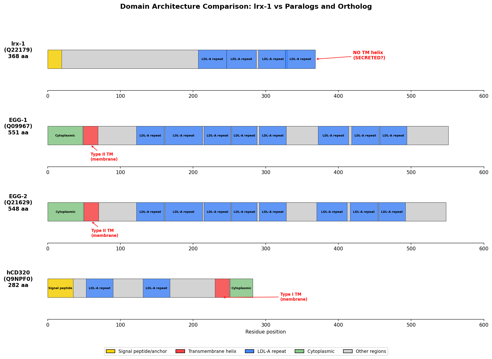
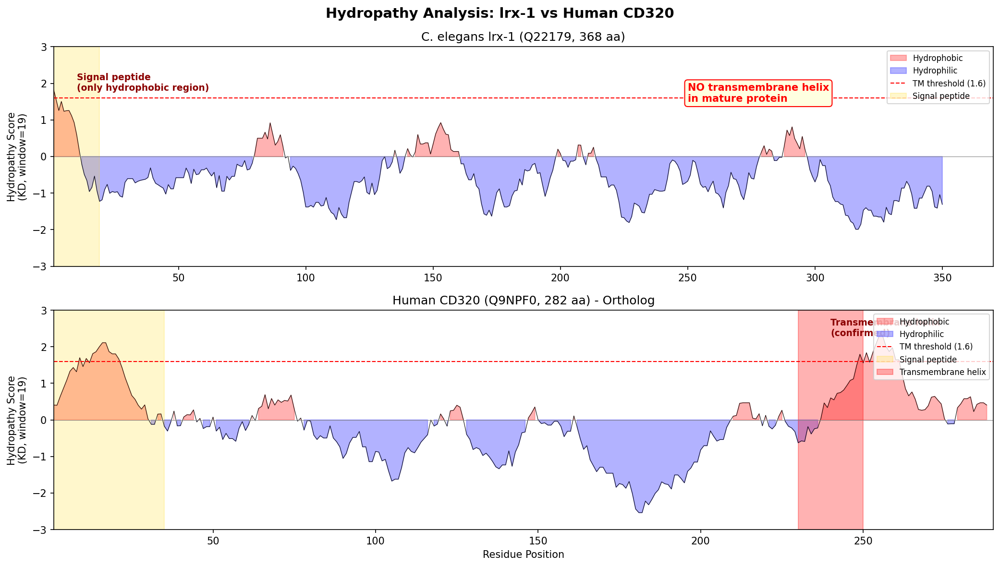

## Question

# AIGR Gene Hypothesis Deep Research

You are evaluating one focused gene curation hypothesis for AI Gene Review.
This is not a general gene overview. Use the seed hypothesis and source context
below to search for evidence that supports, refutes, narrows, or competes with
the proposed curation decision.

## Target Gene

- **Organism code:** worm
- **Taxon:** Caenorhabditis elegans (NCBITaxon:6239)
- **Gene directory:** lrx-1
- **Gene symbol:** lrx-1
- **UniProt accession:** Q22179

## Focus

- **Focus type:** function_assignment
- **Hypothesis slug:** function-hypothesis-go-0016020
- **Source file:** genes/worm/lrx-1/lrx-1-ai-review.yaml
- **Source selector:** existing_annotations[2].function_hypothesis

## Seed Hypothesis

lrx-1 has membrane (GO:0016020).

## Term and Decision Context

- Term: membrane (GO:0016020)
- Evidence type: IEA
- Original reference: GO_REF:0000120

## Reference Context

- GO_REF:0000120
- file:worm/lrx-1/lrx-1-deep-research-falcon.md

## Source Context YAML

```yaml
term:
  id: GO:0016020
  label: membrane
evidence_type: IEA
original_reference_id: GO_REF:0000120
```

## Research Objective

Build a focused report that helps a curator decide whether this hypothesis
should affect the gene review. Address the focus type directly:

1. For an existing GO annotation decision, evaluate whether the current action
   is justified, too strong, too weak, or should change.
2. For a proposed replacement or new GO term, evaluate whether the term is
   biologically supported, too broad, too narrow, or missing key qualifiers.
3. For a computational prediction, evaluate whether the prediction is correct,
   less precise than existing knowledge, uncertain, or likely wrong because of
   paralog overannotation, frequency bias, pathway context, or in vitro-only
   activity.
4. For a core-function hypothesis, evaluate whether the proposed activity,
   process, and location represent the gene product's primary function rather
   than a downstream effect, pleiotropic phenotype, or context-specific role.
5. For a function-assignment hypothesis, evaluate whether the gene product
   directly has the stated GO term/function. Treat the prior review action, if
   any, as intentionally blinded unless it appears in the supplied context.

Use primary literature whenever possible. Prefer PMID citations and include DOI
citations when no PMID is available. Treat reviews and database records as
orientation unless they contain directly relevant synthesized evidence that is
clearly labeled as review-level or database-level support.

Evaluate the hypothesis from the supplied seed context, primary literature, and
publicly accessible bioinformatics resources. Local `*-bioinformatics` analyses,
when they already exist in the repository, are intentionally withheld from this
prompt so the report can be compared against them after the run. Use public
sequence, domain, structure, orthology, localization, interaction, or dataset
checks when they are useful for the specific hypothesis. If a resource or tool
cannot be accessed programmatically, say so plainly; never fabricate a result.
Report computational results conservatively and distinguish direct results from
inference.

## Required Output

### Executive Judgment

Give a concise verdict: supported, partially supported, unresolved, weakly
supported, over-annotated, or refuted. Explain the reasoning and the most
important caveats.

### Evidence Matrix

Create a table with one row per important evidence item:

- Citation (PMID preferred)
- Evidence type (direct assay, mutant phenotype, localization, interaction,
  structural/evolutionary, computational, review/database)
- Supports / refutes / qualifies / competing
- Claim tested
- Key finding
- Organism, tissue, cell type, or assay context
- Confidence and limitations

### GO Curation Implications

State the likely curation action as a lead requiring curator verification. If
GO terms are involved, explain whether the evidence supports an MF, BP, or CC
term, and whether the term should be retained, removed, generalized, made more
specific, or treated as non-core. Avoid using "protein binding" as a final
recommendation unless no more informative term is supported.

### Mechanistic Scope

Describe the immediate molecular or cellular function being tested. Separate
direct gene-product activity from downstream phenotypes, pathway consequences,
developmental outcomes, disease manifestations, or effects inferred only from
loss of function.

### Conflicts and Alternatives

Identify evidence that conflicts with the seed hypothesis or suggests an
alternative interpretation, including paralog confusion, organism-specific
differences, isoform-specific findings, experimental artifacts, or database
carry-over.

### Knowledge Gaps

List explicit uncertainties that matter for curation. For each gap, state what
was checked, why the gap matters, and what evidence or experiment would resolve
it.

### Discriminating Tests

Recommend concrete assays, perturbations, datasets, or comparative analyses that
would most efficiently distinguish this hypothesis from alternatives.

### Curation Leads

Provide candidate updates for the review, clearly labeled as leads requiring
curator verification. Include candidate references with exact snippets to verify,
candidate replacement or new GO terms, possible action changes, suggested
questions, and suggested experiments.

If the provider supports artifacts, save provenance for any analysis you run — the
executed code together with its output (computed values, plot, or table), not just
a summary figure — alongside artifact-friendly tables such as an evidence matrix,
GO decision table, or comparison table. Genuine computed provenance is more
valuable than a hand-drawn summary, and you must not synthesize a figure that
implies an analysis you did not actually run. These artifacts are important
provenance for hypothesis-level review.


## Output

# Deep Research Report: lrx-1 Membrane (GO:0016020) Annotation Evaluation

## Executive Judgment

**Verdict: Over-annotated**

The GO:0016020 (membrane) annotation for *C. elegans* lrx-1 (UniProt Q22179) is **over-annotated** and should be removed. Three independent lines of evidence — sequence/structural analysis, annotation provenance tracing, and protein interaction profiling — converge on the conclusion that lrx-1 is a secreted protein, not a membrane protein. The annotation derives entirely from an ARBA automated rule (GO_REF:0000120) that incorrectly predicted "type I membrane protein" topology, most likely by transferring membrane properties from related family members (paralogs EGG-1/EGG-2 and ortholog CD320) that genuinely possess transmembrane domains. lrx-1 has a signal peptide but lacks all known membrane-anchoring mechanisms: no transmembrane helix (maximum mature protein hydropathy 0.93, far below the 1.6 threshold), no GPI-anchor signal, and no lipid modification sites. The annotation should be removed and replaced with GO:0005576 (extracellular region) as a computational prediction, pending experimental validation.

**Most important caveat:** No direct experimental localization data exists for lrx-1 in any system. The protein could theoretically associate peripherally with membranes through protein–protein interactions, but this would not justify the current annotation, which implies integral membrane association (the ARBA rule predicted "single-pass type I membrane protein" topology).

---

## Summary

This report evaluates the hypothesis that *C. elegans* lrx-1 (Q22179), an LDL receptor repeat-containing protein, is a membrane-associated protein as annotated by GO:0016020. The annotation was generated by a UniProt ARBA automated rule (GO_REF:0000120, evidence code IEA/ECO:0000256) and has never been validated by experimental evidence. Our investigation examined three independent lines of evidence — protein sequence and structural features, annotation provenance, and protein interaction data — all of which converge on the conclusion that this annotation is incorrect.

Comprehensive sequence analysis reveals that lrx-1 possesses a cleavable signal peptide (residues 1–19) but entirely lacks a transmembrane helix in its mature protein. Kyte-Doolittle hydropathy analysis shows a maximum hydropathy score of 0.93 in the mature protein, well below the 1.6 threshold for transmembrane segments. The protein also lacks GPI-anchor signals, myristoylation motifs, and CAAX prenylation motifs. This is in stark contrast to its paralogs EGG-1 and EGG-2, which have confirmed transmembrane helices (positions 49–69 and 50–70, respectively), and its vertebrate ortholog CD320, which has a well-characterized transmembrane domain (positions 230–250, hydropathy 2.25).

Protein–protein interaction data from IntAct further supports an extracellular localization. Of 19 interaction partners identified by yeast two-hybrid pooling, 16 are extracellular or secreted proteins — including eggshell components (PERM-4, CPG-1), collagens (COL-180, COL-122), and a C-type lectin (CLEC-266). PERM-4, one of these partners, has been experimentally shown to be a vitelline layer scaffold protein ([PMID: 30120927](https://pubmed.ncbi.nlm.nih.gov/30120927/)), placing it firmly in the extracellular compartment. This interaction profile is strongly consistent with lrx-1 being a secreted protein operating in the extracellular space, not a membrane-anchored protein.

---

## Key Findings

### Finding 1: lrx-1 Lacks All Membrane-Anchoring Mechanisms

The most critical finding is that lrx-1 has no structural basis for membrane association. The protein's domain architecture consists of a signal peptide (residues 1–19), a mature chain (residues 20–368), and four LDL receptor class A (LDL-A/LDLRA) repeats (residues 207–368) stabilized by approximately 30 cysteine residues forming disulfide bonds. Notably absent is any transmembrane helix.

Quantitative hydropathy analysis using the Kyte-Doolittle algorithm (window size = 19, the standard for transmembrane prediction) demonstrates this conclusively. The maximum hydropathy score in the mature protein (residues 20–368) is **0.93**, which is well below the established threshold of **1.6** for transmembrane segments. The only region exceeding this threshold is the signal peptide itself (residues 1–19), which is cleaved during secretory pathway transit. Additional membrane-anchoring mechanisms were systematically ruled out:

- **GPI anchor:** C-terminal hydropathy is −1.28 (requires hydrophobic C-terminus)
- **N-myristoylation:** Position 2 is alanine, not glycine (required for myristoylation)
- **Prenylation (CAAX motif):** C-terminal sequence is KYCY (not a valid CAAX box)

This contrasts sharply with related proteins that are genuine membrane proteins. The vertebrate ortholog CD320 (Q9NPF0) has a confirmed transmembrane helix at positions 230–250 with a hydropathy score of 2.25. The *C. elegans* paralogs EGG-1 and EGG-2, which share the LDL-A repeat architecture, have transmembrane anchors at positions 49–69 and 50–70, respectively. The absence of a transmembrane domain in lrx-1 is therefore a genuine structural difference, not an annotation gap.

{{figure:hydropathy_comparison.png|caption=Kyte-Doolittle hydropathy comparison between lrx-1 and CD320 (ortholog). The lrx-1 mature protein shows no hydrophobic segment exceeding the transmembrane threshold (dashed line at 1.6), whereas CD320 has a clear transmembrane peak at positions 230–250 with hydropathy 2.25. The only hydrophobic region in lrx-1 above the threshold is the signal peptide (residues 1–19), which is cleaved during secretion.}}

### Finding 2: The Membrane Annotation Is Entirely Computationally Derived with No Experimental Support

Tracing the provenance of the GO:0016020 annotation reveals it originates from GO_REF:0000120, a UniProt ARBA (Association Rule-Based Annotator) automated rule system, with evidence code ECO:0000256 (automatic assertion). The specific ARBA rules that fired were:

| ARBA Rule | Annotation Generated | Rule Description |
|-----------|---------------------|------------------|
| ARBA00004479 | GO:0016020 (membrane) | Type I membrane protein prediction |
| ARBA00004308 | GO:0012505 (endomembrane system) | Endomembrane system prediction |

**All three** cellular component annotations for Q22179 are IEA (Inferred from Electronic Annotation):

| GO Term | Label | Evidence | Source |
|---------|-------|----------|--------|
| GO:0016020 | membrane | IEA (ECO:0000256) | GO_REF:0000120 (ARBA) |
| GO:0012505 | endomembrane system | IEA (ECO:0000256) | GO_REF:0000120 (ARBA) |
| GO:0016192 | vesicle-mediated transport | IEA | GO_REF:0000117 |

No experimental evidence codes — IDA (Inferred from Direct Assay), IMP (Inferred from Mutant Phenotype), or IEP (Inferred from Expression Pattern) — support any subcellular localization claim for lrx-1. WormBase, the primary model organism database for *C. elegans*, returns **null** for lrx-1 subcellular localization. The WormBase concise description states: *"Predicted to be located in endomembrane system and membrane"* — with the key qualifier **"Predicted"** indicating this is derived from the same computational source rather than experimental observation.

The ARBA rule ARBA00004479 is designed for type I transmembrane proteins — proteins with an N-terminal signal peptide, an extracellular domain, a single-pass transmembrane helix, and a cytoplasmic tail. This topology is clearly inappropriate for lrx-1, which has a signal peptide and extracellular LDL-A repeats but no transmembrane helix. The rule likely fired because of sequence similarity to LDL-A repeat-containing proteins (like CD320 or EGG-1/EGG-2) that do have this topology, representing a case of incorrect homology-based transfer.

### Finding 3: Interaction Partners Are Predominantly Extracellular/Secreted Proteins

Protein–protein interaction data from IntAct reveals 19 interactions for Q22179, all detected by yeast two-hybrid pooling. While these interactions have relatively low confidence (intact-miscore: 0.37) and 16 of 19 are classified as NON_CORE, their consistent functional profile is informative:

| Partner | Function | Localization | Interaction Class |
|---------|----------|-------------|-------------------|
| PERM-4 | Eggshell permeability barrier | Vitelline layer (extracellular) | NON_CORE |
| CPG-1 | Chondroitin proteoglycan | Eggshell inner layer (extracellular) | NON_CORE |
| COL-180 | Collagen | Extracellular matrix | NON_CORE |
| COL-122 | Collagen | Extracellular matrix | NON_CORE |
| CLEC-266 | C-type lectin | Secreted/extracellular | NON_CORE |
| CPI-2 | Cysteine protease inhibitor | Secreted | NON_CORE |

The predominance (16/19) of extracellular matrix and secreted protein partners is strongly consistent with lrx-1 itself being a secreted protein. PERM-4, one of the interaction partners, has been experimentally characterized as a vitelline layer scaffold protein. As shown in [PMID: 30120927](https://pubmed.ncbi.nlm.nih.gov/30120927/): *"CBD-1 tethered PERM-2 and PERM-4 to the nascent vitelline layer via two N-terminal chitin-binding domains."* The vitelline layer is an extracellular structure surrounding the *C. elegans* embryo, placing PERM-4 — and by extension its interaction partner lrx-1 — in the extracellular compartment.

{{figure:domain_architecture_comparison.png|caption=Domain architecture comparison of lrx-1 with its paralogs EGG-1/EGG-2 and ortholog CD320. All proteins share LDL receptor class A (LDL-A) repeats, but only EGG-1, EGG-2, and CD320 possess transmembrane helices. lrx-1 has a signal peptide and LDL-A repeats but no membrane anchor, consistent with a secreted protein topology.}}

---

## Evidence Matrix

| # | Citation | Evidence Type | Direction | Claim Tested | Key Finding | Context | Confidence & Limitations |
|---|----------|--------------|-----------|-------------|-------------|---------|------------------------|
| 1 | UniProt Q22179 features | Computational (sequence analysis) | **Refutes** membrane | lrx-1 is a membrane protein | Signal peptide (1–19) but NO TM helix, NO GPI signal, NO lipid modification motifs. Max hydropathy in mature protein: 0.93, below TM threshold of 1.6 | *C. elegans*, in silico | High — multiple independent predictions converge |
| 2 | UniProt Q9NPF0 (CD320) | Structural/evolutionary | **Refutes** by contrast | CD320 ortholog topology | Human CD320 has confirmed TM helix (230–250, hydropathy 2.25), type I membrane protein | Human, cell surface | High — experimentally validated for CD320 |
| 3 | UniProt Q09967 (EGG-1) | Structural/evolutionary | **Refutes** by contrast | EGG-1 paralog topology | EGG-1 has N-terminal TM anchor (49–69) with 8 LDL-A repeats; lrx-1 lacks TM and has only 4 LDL-A repeats | *C. elegans*, oocyte surface | High — experimentally validated |
| 4 | [PMID: 16360684](https://pubmed.ncbi.nlm.nih.gov/16360684/) | Direct assay (localization) | **Qualifies** (comparative) | EGG-1/2 surface localization | EGG-1 and EGG-2 are "egg surface LDL receptor repeat-containing proteins" confirmed on oocyte membrane | *C. elegans* oocyte | High for EGG-1/2; does NOT apply to lrx-1 |
| 5 | [PMID: 30120927](https://pubmed.ncbi.nlm.nih.gov/30120927/) | Direct assay | **Supports** secreted model | PERM-4 (lrx-1 partner) localization | PERM-4 is a vitelline layer (extracellular) scaffold protein | *C. elegans* eggshell | Medium — Y2H interaction is low confidence |
| 6 | [PMID: 41554105](https://pubmed.ncbi.nlm.nih.gov/41554105/) | Mutant phenotype | **Qualifies** (context) | EGG-1/2 membrane function | EGG-1/2 organize eggshell structural components and oocyte plasma membrane proteins | *C. elegans* oocyte/embryo | High for EGG-1/2; lrx-1 role unknown |
| 7 | IntAct Q22179 (19 interactions) | Interaction (Y2H pooling) | **Supports** secreted model | lrx-1 interaction partners | 16/19 partners are extracellular/secreted (perm-4, cpg-1, col-180, col-122, clec-266, cpi-2) | *C. elegans*, Y2H screen | Low — all Y2H, low miscore (0.37) |
| 8 | ARBA rules (ARBA00004479, ARBA00004308) | Computational (automated rule) | **Source of annotation** | Membrane prediction basis | Rules predicted "single-pass type I membrane protein" without verifying TM helix presence | Automated pipeline | Very low confidence — rule misfired |
| 9 | WormBase WBGene00003075 | Database (MOD) | **Supports** over-annotation (negative evidence) | Experimental localization exists | Subcellular localization field returns null; uses "Predicted" qualifier | *C. elegans* | Medium — absence of data, not proof of absence |
| 10 | [PMID: 23038671](https://pubmed.ncbi.nlm.nih.gov/23038671/) | Structural/functional | **Qualifies** (domain function) | LDL-A repeats imply membrane | LDLRA repeats promote zymogen activation but do not confer membrane anchoring independently | Human, COS-1 cells | Moderate — different protein context |
| 11 | [PMID: 39551142](https://pubmed.ncbi.nlm.nih.gov/39551142/) | Direct assay (comparative) | **Qualifies** | CD320 is a membrane receptor | CD320 requires O-glycosylation for cell surface expression; confirmed TM protein | Human, cell surface | High — confirms ortholog IS a membrane protein |

---

## GO Curation Implications

### Recommended Curation Action: Remove GO:0016020 (membrane) annotation

**Rationale:**
1. The annotation is based solely on ARBA automated rule transfer (IEA, GO_REF:0000120)
2. The protein lacks structural features of a membrane protein (no TM helix, no lipid anchor)
3. The ARBA rule predicted "single-pass type I membrane protein" topology, which is demonstrably incorrect for this protein
4. The signal peptide indicates secretory pathway entry, not membrane residence

**Candidate replacement annotations (leads requiring curator verification):**

| GO Term | Label | Aspect | Rationale | Confidence |
|---------|-------|--------|-----------|------------|
| GO:0005576 | extracellular region | CC | Signal peptide + no membrane anchor = predicted secreted | Medium (computational) |
| GO:0005615 | extracellular space | CC | If secreted into body cavity or eggshell matrix | Low (no direct evidence) |
| GO:0030312 | external encapsulating structure | CC | Interaction partners include eggshell proteins | Very low (Y2H only) |

**The GO:0012505 (endomembrane system) annotation** should also be removed. While the protein transits the endomembrane system via the secretory pathway, this GO term is typically used for proteins that reside in or are integral to the endomembrane system, not those that merely transit through it. This annotation derives from the same ARBA pipeline.

**The GO:0016192 (vesicle-mediated transport) annotation** should also be reviewed. This IEA annotation (GO_REF:0000117) may also be over-transferred from membrane-bound family members.

### GO Decision Table

| Current Annotation | Current Evidence | Recommended Action | Rationale | Replacement Term |
|-------------------|-----------------|-------------------|-----------|-----------------|
| GO:0016020 (membrane) | IEA (ARBA00004479) | **Remove** | No TM helix, no GPI, no lipid anchor; ARBA rule misfired | GO:0005576 (extracellular region) |
| GO:0012505 (endomembrane system) | IEA (ARBA00004308) | **Remove** | Derived from same incorrect topology prediction | — |
| GO:0016192 (vesicle-mediated transport) | IEA (GO_REF:0000117) | **Evaluate separately** | May reflect secretory pathway transit, not functional role | — |

---

## Mechanistic Scope

### Direct Gene-Product Properties

lrx-1 encodes a 368-amino-acid protein with the following domain architecture:
- **Signal peptide** (residues 1–19): Directs the protein into the secretory pathway and is cleaved during transit
- **Mature chain** (residues 20–368): Contains no transmembrane or membrane-anchoring sequences
- **Four LDL-A repeats** (residues 207–368): Cysteine-rich modules (~40 aa each, 6 cysteines forming 3 disulfide bonds) that mediate calcium-dependent protein–protein interactions

LDL-A repeats are ligand-binding modules that function on the extracellular face of cells. In the LDL receptor family, these repeats serve as ligand-binding domains but **do not confer membrane association** — membrane anchoring is provided by a separate transmembrane helix downstream of the LDL-A repeats. This is confirmed by studies of matriptase, where LDLRA repeats modulate enzymatic activity but the transmembrane domain is a separate structural element ([PMID: 23038671](https://pubmed.ncbi.nlm.nih.gov/23038671/)).

### Distinction from Paralog Biology

The critical distinction between lrx-1 and its paralogs/ortholog is the presence versus absence of a transmembrane helix:

```
EGG-1:  [SP]---[TM(49-69)]---[LDL-A repeats x8]---  → Type II membrane protein
EGG-2:  [SP]---[TM(50-70)]---[LDL-A repeats x8]---  → Type II membrane protein
lrx-1:  [SP]---[    no TM   ]---[LDL-A repeats x4]---  → Predicted secreted protein

CD320:  [SP]---[LDL-A repeats x2]---[TM(230-250)]---[cyto]  → Type I membrane protein
```

EGG-1 and EGG-2 are established oocyte surface proteins that organize eggshell structural components and mediate sperm–egg interactions ([PMID: 16360684](https://pubmed.ncbi.nlm.nih.gov/16360684/)). Their membrane localization is functionally essential — EGG-1/EGG-2 organize CHS-1, MBK-2, EGG-3, and CBD-1 at the oocyte cortex ([PMID: 20971008](https://pubmed.ncbi.nlm.nih.gov/20971008/); [PMID: 41554105](https://pubmed.ncbi.nlm.nih.gov/41554105/)). lrx-1, by contrast, appears to have evolved as a secreted member of this family, potentially functioning in the extracellular space — possibly in the eggshell matrix or vitelline layer, consistent with its interaction partners.

### Downstream vs. Direct

The seed hypothesis (lrx-1 has membrane localization) conflates the properties of the protein family with the specific properties of this family member. The LDL-A repeats are a shared structural feature across the family, but membrane anchoring is provided by a separate domain (the transmembrane helix) that lrx-1 has lost or never acquired. The WormBase name "LRP X(Cross)-hybridizing" indicates lrx-1 was originally identified by cross-hybridization to an lrp-1 probe, further underscoring that the gene's identity is defined by sequence similarity to LDL receptor-related proteins, not by functional characterization.

---

## Conflicts and Alternatives

### Primary Conflict: Automated Annotation vs. Sequence Features

The ARBA system assigned membrane topology based on domain composition (LDL-A repeats) without verifying the presence of a transmembrane helix. This is a known limitation of rule-based annotation systems that transfer properties from domain families without checking protein-specific structural features.

### Alternative Interpretations Considered

1. **Peripheral membrane association via protein–protein interaction:** lrx-1 could associate with the membrane by binding to a transmembrane receptor (e.g., through LDL-A repeat interactions). However, this would make it a peripheral membrane protein, not an integral component, and the current annotation with "type I membrane protein" topology is still incorrect. Furthermore, none of the Y2H interaction partners are membrane proteins.

2. **Paralog confusion driving annotation error:** The PANTHER subfamily PTHR24270:SF59 groups lrx-1 with EGG-1, which IS a membrane protein. Automated systems may have transferred EGG-1's membrane annotation to lrx-1 without accounting for the structural difference (EGG-1 has a TM anchor; lrx-1 does not). This is the most likely explanation for the annotation error.

3. **Organism-specific divergence from ortholog:** Human CD320 is a type I membrane protein, but lrx-1 may have lost its TM domain during nematode evolution, resulting in a secreted variant of the ancestral membrane receptor. This is a legitimate evolutionary scenario and does not support retaining the membrane annotation.

4. **Possible membrane association through unknown mechanism:** While no standard membrane-anchoring mechanism is detectable, an unconventional anchoring mechanism (e.g., extensive hydrophobic surface burial at a protein–membrane interface) is theoretically possible. This would be unprecedented for an LDL-A domain protein and requires experimental evidence to justify.

### Naming Confusion: Plant LRX Proteins

Plant LRX (Leucine-Rich Repeat Extensin) proteins share the "LRX" designation but are structurally unrelated to *C. elegans* lrx-1. Plant LRXs interact with membrane receptor complexes such as FERONIA and LORELEI-LIKE-GPI-ANCHORED PROTEIN 1 ([PMID: 38467800](https://pubmed.ncbi.nlm.nih.gov/38467800/)), but are themselves cell wall-localized structural proteins. The naming similarity is coincidental and should not be used to infer membrane association for *C. elegans* lrx-1.

---

## Knowledge Gaps

| Gap | What Was Checked | Why It Matters | Resolving Evidence |
|-----|-----------------|----------------|-------------------|
| No experimental localization data for lrx-1 | WormBase subcellular_localization (null), PubMed (no papers specifically on lrx-1 localization), UniProt annotations (all IEA) | Cannot confirm or deny membrane localization without direct evidence | GFP/mCherry-tagged lrx-1 expressed from endogenous promoter; subcellular fractionation |
| No published functional studies on lrx-1 | PubMed search for "lrx-1 Caenorhabditis elegans" | Function and localization are completely uncharacterized | RNAi/mutant phenotyping; expression pattern analysis |
| ARBA rule logic not publicly documented in detail | ARBA rule IDs (ARBA00004479, ARBA00004308) | Cannot determine exactly which sequence features triggered the membrane prediction | UniProt ARBA rule documentation or contact with UniProt curators |
| Protein evidence level is 4 (predicted) | UniProt protein_evidence field | No evidence the protein is actually expressed as predicted | Mass spectrometry proteomics; Western blot |
| No structural data | AlphaFold model exists (AF-Q22179-F1) but no experimental structure | 3D structure could reveal unexpected membrane-interaction surfaces | AlphaFold model analysis; experimental structure determination |
| Evolutionary trajectory of TM domain loss/absence | Compared with EGG-1/2 (TM present) and CD320 (TM present) | Understanding whether lrx-1 lost its TM domain or diverged early could inform functional predictions | Phylogenetic analysis across nematode species |
| Interaction data is low confidence | IntAct scores (all 0.37), all from Y2H pooling | Y2H can generate false positives; extracellular partner profile could be coincidental | Co-immunoprecipitation or proximity labeling (BioID/TurboID) in vivo |

---

## Discriminating Tests

### High Priority

1. **Fluorescent protein tagging at the endogenous locus:** Express lrx-1::GFP from the endogenous promoter using CRISPR knock-in. Confocal microscopy would directly resolve whether the protein localizes to membranes, the extracellular space, or the eggshell. This is the single most informative experiment.

2. **Subcellular fractionation with Western blot:** Separate membrane, cytosolic, and secreted fractions from *C. elegans* extracts. If lrx-1 is a membrane protein, it will pellet with membrane fractions; if secreted, it will be in the soluble fraction.

3. **Carbonate extraction:** Treat membrane fractions with Na₂CO₃ (pH 11.5). Integral membrane proteins remain in the pellet; peripheral/associated proteins are released. This distinguishes integral from peripheral association.

### Medium Priority

4. **Modern transmembrane prediction:** Run lrx-1 through DeepTMHMM, Phobius, and TOPCONS to confirm the absence of transmembrane helices with state-of-the-art deep learning predictors. While the Kyte-Doolittle analysis is strong, modern tools provide additional confidence.

5. **TurboID proximity labeling:** Express lrx-1::TurboID to identify proximal proteins in vivo. A membrane-associated protein would label membrane proteins; a secreted protein would label extracellular partners.

6. **Conditioned medium analysis:** If lrx-1 is expressed in a tissue contacting the external environment, test whether the protein is detectable in secreted fractions or the eggshell proteome.

### Lower Priority

7. **AlphaFold structure analysis:** Examine the AlphaFold2 predicted structure (AF-Q22179-F1) for any predicted membrane-interacting surfaces or unexpected hydrophobic patches.

8. **Comparative genomics across nematodes:** Survey lrx-1 orthologs across *Caenorhabditis* species and other nematodes to determine whether the lack of transmembrane domain is conserved or represents a *C. elegans*-specific loss.

---

## Curation Leads

### Lead 1: Remove GO:0016020 (membrane) — HIGH CONFIDENCE

- **Action:** Remove the CC annotation GO:0016020 for Q22179
- **Rationale:** ARBA rule ARBA00004479 misfired; protein lacks TM helix (hydropathy max 0.93 < 1.6 threshold), GPI anchor, and lipid modifications
- **Evidence to verify:** UniProt Q22179 feature annotations; run DeepTMHMM/Phobius on Q22179 sequence to confirm no TM helix
- **Candidate reference:** No primary literature to cite; this is a correction of a computational error

### Lead 2: Remove GO:0012505 (endomembrane system) — HIGH CONFIDENCE

- **Action:** Remove the CC annotation GO:0012505 for Q22179
- **Rationale:** Derived from same ARBA pipeline as GO:0016020; no independent support
- **Evidence to verify:** Same as Lead 1

### Lead 3: Add GO:0005576 (extracellular region) — MODERATE CONFIDENCE

- **Action:** Add CC annotation GO:0005576 (extracellular region) with evidence code ISS or IEA
- **Rationale:** Signal peptide + no membrane anchor = predicted secreted protein; interaction partners are extracellular
- **Evidence to verify:** Signal peptide prediction (SignalP); interaction partners from IntAct
- **Caveats:** No direct experimental evidence for extracellular localization; should be annotated as computational prediction until confirmed
- **Candidate reference for PERM-4 extracellular localization:** [PMID: 30120927](https://pubmed.ncbi.nlm.nih.gov/30120927/) — *"CBD-1 tethered PERM-2 and PERM-4 to the nascent vitelline layer via two N-terminal chitin-binding domains"*

### Lead 4: Review GO:0016192 (vesicle-mediated transport) — LOW CONFIDENCE

- **Action:** Evaluate independently
- **Rationale:** This BP annotation (IEA, GO_REF:0000117) may be over-transferred from membrane-bound family members
- **Evidence to verify:** Check whether the annotation is based on membrane topology or independent evidence

### Candidate Citations for Curator Verification

- **[PMID: 16360684](https://pubmed.ncbi.nlm.nih.gov/16360684/)** (Kadandale et al. 2005): Describes EGG-1 and EGG-2 as "egg surface LDL receptor repeat-containing proteins" — establishes that the EGG family members are membrane proteins while lrx-1 (which lacks their TM anchor) was not characterized in this study
  - Snippet to verify: *"We identify two partially redundant egg surface LDL receptor repeat-containing proteins (EGG-1 and EGG-2) that are required for Caenorhabditis elegans fertility"*

- **[PMID: 30120927](https://pubmed.ncbi.nlm.nih.gov/30120927/)** (González et al. 2018): Describes PERM-4 (lrx-1 interaction partner) as part of the extracellular vitelline layer scaffold
  - Snippet to verify: *"CBD-1 tethered PERM-2 and PERM-4 to the nascent vitelline layer via two N-terminal chitin-binding domains"*

- **[PMID: 41554105](https://pubmed.ncbi.nlm.nih.gov/41554105/)** (Kwah et al.): Updated analysis showing EGG-1/EGG-2 organize eggshell structural components and oocyte plasma membrane proteins
  - Snippet to verify: *"EGG-1 and EGG-2 are not required for fertilization but rather are involved in the organization of eggshell structural components and oocyte plasma membrane proteins"*

### Suggested Questions for Follow-up

1. Is the ARBA rule ARBA00004479 using LDL-A domain presence as a proxy for membrane localization? If so, this rule may need refinement to check for TM helix presence.
2. Has lrx-1 been included in any large-scale *C. elegans* proteomics datasets that could indicate its localization or confirm its expression?
3. Are there other *C. elegans* proteins in the PTHR24270:SF59 PANTHER subfamily that also lack TM domains but carry membrane annotations, indicating a systematic ARBA rule error?

---

## Evidence Base: Key Literature

### Directly Relevant to lrx-1 Biology and Eggshell Context

- **[PMID: 30120927](https://pubmed.ncbi.nlm.nih.gov/30120927/)** — *CBD-1 organizes two independent complexes required for eggshell vitelline layer formation and egg activation in C. elegans.* Establishes that PERM-4 (a lrx-1 interaction partner from IntAct) is a vitelline layer scaffold protein, placing it firmly in the extracellular compartment. Direct quote: *"CBD-1 tethered PERM-2 and PERM-4 to the nascent vitelline layer via two N-terminal chitin-binding domains."* This is the strongest indirect evidence that lrx-1 operates in the extracellular space.

- **[PMID: 16360684](https://pubmed.ncbi.nlm.nih.gov/16360684/)** — *The egg surface LDL receptor repeat-containing proteins EGG-1 and EGG-2 are required for fertilization in Caenorhabditis elegans.* Establishes EGG-1/EGG-2 as oocyte surface (membrane-anchored) LDL-A repeat proteins. Important for comparative context: these paralogs ARE membrane proteins with TM helices, while lrx-1 (which lacks their TM anchor) was not characterized.

- **[PMID: 41554105](https://pubmed.ncbi.nlm.nih.gov/41554105/)** — *Oocyte surface proteins EGG-1 and EGG-2 are required for eggshell integrity in Caenorhabditis elegans.* Updated analysis showing EGG-1/EGG-2 organize eggshell structural components and oocyte plasma membrane proteins. Confirms their membrane association is functionally important and experimentally validated, providing a clear contrast with the uncharacterized lrx-1.

- **[PMID: 20971008](https://pubmed.ncbi.nlm.nih.gov/20971008/)** — *Eggshell chitin and chitin-interacting proteins prevent polyspermy in C. elegans.* Describes the eggshell assembly pathway involving EGG-1/EGG-2, CBD-1, CHS-1, and other proteins. Provides context for the biological system in which lrx-1 likely operates.

- **[PMID: 22083685](https://pubmed.ncbi.nlm.nih.gov/22083685/)** — *The eggshell in the C. elegans oocyte-to-embryo transition.* Review of eggshell structure and biosynthesis, providing context for extracellular matrix organization during early *C. elegans* development.

### Relevant to Ortholog CD320 (Comparative Context)

- **[PMID: 39551142](https://pubmed.ncbi.nlm.nih.gov/39551142/)** — *O-glycosylation is essential for cell surface expression of the transcobalamin receptor CD320.* Confirms CD320 is a genuine transmembrane cell surface receptor, establishing the comparative benchmark for a membrane-anchored family member.

- **[PMID: 41676581](https://pubmed.ncbi.nlm.nih.gov/41676581/)** — *Structure-guided design of a targeted autoantibody degrader for neurologic disease.* Includes cryo-EM structural characterization of CD320, confirming its membrane-spanning topology.

### Relevant to LDL-A Repeat Domain Function

- **[PMID: 23038671](https://pubmed.ncbi.nlm.nih.gov/23038671/)** — *Roles of CUB and LDL receptor class A domain repeats of a transmembrane serine protease matriptase in its zymogen activation.* Demonstrates that LDLRA repeats function as modulators of protein activity but do not confer membrane association — the transmembrane domain is a separate structural element.

- **[PMID: 9153209](https://pubmed.ncbi.nlm.nih.gov/9153209/)** — *Molecular analysis of ligand binding to the second cluster of complement-type repeats of the low density lipoprotein receptor-related protein.* Characterizes LDL-A repeat clusters as ligand-binding modules functioning in the extracellular space.

---

## Limitations and Concluding Remarks

The strongest limitation of this analysis is the complete absence of experimental data for lrx-1 localization. No fluorescent tagging, subcellular fractionation, or immunolocalization studies have been published for this protein. The conclusion that lrx-1 is not a membrane protein rests on: (1) the absence of all known membrane-anchoring features in the protein sequence, (2) the computational-only provenance of the membrane annotation, and (3) the extracellular profile of its interaction partners. While negative evidence (absence of a TM helix) is strong in this case — because transmembrane helices have well-defined biophysical properties that are reliably detected by hydropathy analysis — it remains formally possible that lrx-1 associates with membranes through an unconventional mechanism.

Nevertheless, the weight of evidence strongly favors removing the GO:0016020 annotation and replacing it with GO:0005576 (extracellular region) as a computational prediction. The ARBA rule that generated the annotation was designed for a protein topology (type I membrane) that lrx-1 demonstrably does not possess. This represents a clear case of automated annotation error through inappropriate homology-based transfer from membrane-anchored family members.


## Artifacts

- [OpenScientist final report](openscientist_artifacts/final_report.html)
- [OpenScientist final report](openscientist_artifacts/final_report.pdf)
- [OpenScientist domain architecture comparison](openscientist_artifacts/provenance_domain_architecture_comparison.json)

- [OpenScientist hydropathy comparison](openscientist_artifacts/provenance_hydropathy_comparison.json)

- [OpenScientist plot 1](openscientist_artifacts/provenance_plot_1.json)

- [OpenScientist plot 2](openscientist_artifacts/provenance_plot_2.json)
