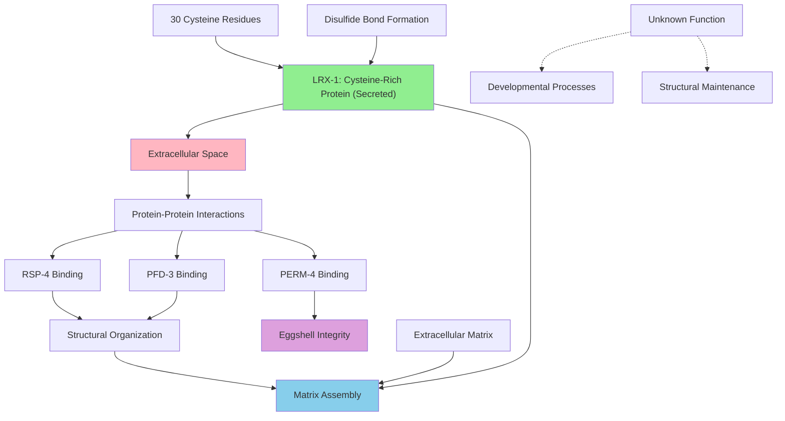

# Pathway Summary for lrx-1

## Overview
LRX-1 is a poorly characterized cysteine-rich protein of unknown function in C. elegans [Q22179]. Despite its name suggesting "LRP cross-hybridizing," bioinformatic analysis reveals it is not a true LRP family member but rather a C. elegans-specific protein containing 30 cysteines (8.1% of sequence) in 17 potential cysteine-rich regions [Q22179]. The protein is likely secreted rather than membrane-bound and may be involved in extracellular matrix organization based on identified protein interactions.

## Extracellular Matrix Organization Pathway
LRX-1 potentially functions in extracellular matrix organization through its interactions with proteins involved in structural integrity [PMID:14704431]. High-throughput yeast two-hybrid screens identified interactions with RSP-4, PFD-3, and PERM-4 (an eggshell integrity protein), suggesting a role in organizing extracellular structural components [PMID:19123269]. The protein's abundant cysteine content suggests it may form disulfide-stabilized structures that contribute to matrix stability.

## Cysteine-Rich Protein Structural Organization
The defining feature of LRX-1 is its extraordinary cysteine content, with 30 cysteine residues distributed across 17 potential cysteine-rich regions [Q22179]. These cysteines likely form complex disulfide bond networks that stabilize the protein's three-dimensional structure and enable specific protein-protein interactions. The cysteine-rich domains represent a C. elegans-specific structural innovation not found in canonical LRP proteins.

## Secreted Protein Function and Localization
Unlike true LRP proteins which are membrane-bound receptors, LRX-1 appears to be a secreted protein that functions in the extracellular space [Q22179]. This secreted localization positions the protein to interact with other extracellular components and participate in intercellular signaling or structural organization. The protein's small size (369 amino acids) compared to true LRP proteins (>4000 amino acids) supports its distinct functional role.

## Pathway Diagram

## Protein Interaction Networks
LRX-1 participates in protein interaction networks identified through high-throughput screening approaches [PMID:14704431, PMID:19123269]. The protein's interactions with RSP-4, PFD-3, and PERM-4 suggest involvement in cellular processes related to protein folding, structural integrity, and reproductive function. These interactions provide clues to LRX-1's biological role despite the lack of direct functional studies.

## Eggshell and Reproductive Function
The interaction with PERM-4, an eggshell integrity protein, suggests LRX-1 may play a role in reproductive processes or embryonic development [Q22179]. Eggshell formation and integrity are critical for embryo protection and development in C. elegans. LRX-1's potential contribution to these processes through protein interactions highlights possible reproductive or developmental functions.

## Evolutionary Significance and Species Specificity
LRX-1 represents a C. elegans-specific protein that has evolved independently from the LRP protein family [Q22179]. The protein's unique cysteine-rich domain architecture suggests it has acquired specialized functions relevant to nematode biology. This evolutionary divergence highlights the diversity of extracellular proteins that have evolved to meet species-specific structural and signaling requirements.

## Functional Predictions and Hypotheses
Based on its structural features and protein interactions, LRX-1 may function as a molecular scaffold or organizational component in extracellular spaces [Q22179]. The protein's cysteine-rich domains could facilitate multiple protein interactions simultaneously, creating networks of protein complexes that contribute to structural integrity or signaling processes. However, these functions remain hypothetical pending direct experimental validation.

## Research Gaps and Future Directions
LRX-1 represents an example of the many poorly characterized proteins in model organisms where genomic annotation outpaces functional understanding [Q22179]. Future research directions could include structural studies to understand disulfide bonding patterns, localization studies to confirm secretion, and functional assays to determine the protein's role in development or physiology. The protein's interactions suggest specific phenotypic assays related to eggshell integrity or extracellular matrix function.

## Implications for C. elegans Biology
Understanding LRX-1 function could provide insights into C. elegans-specific adaptations and the evolution of extracellular protein networks [Q22179]. The protein may represent part of a larger system of species-specific extracellular proteins that contribute to nematode physiology. Characterizing such proteins expands our understanding of how model organisms have evolved unique solutions to biological challenges while maintaining conserved core cellular processes.