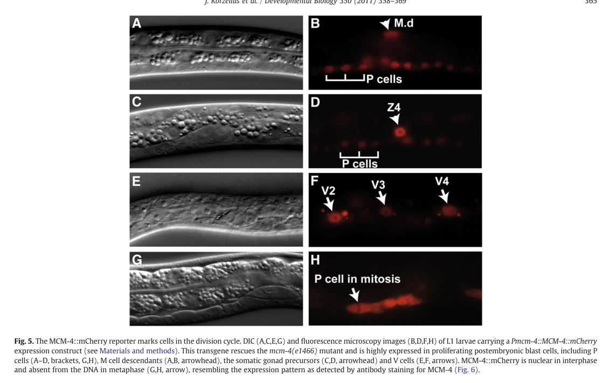

## Question

# Gene Research for Functional Annotation

## ⚠️ CRITICAL: Gene/Protein Identification Context

**BEFORE YOU BEGIN RESEARCH:** You MUST verify you are researching the CORRECT gene/protein. Gene symbols can be ambiguous, especially for less well-characterized genes from non-model organisms.

### Target Gene/Protein Identity (from UniProt):
- **UniProt Accession:** Q95XQ8
- **Protein Description:** RecName: Full=DNA replication licensing factor mcm-4 {ECO:0000305}; EC=3.6.4.12 {ECO:0000250|UniProtKB:Q9NXL9};
- **Gene Information:** Name=mcm-4 {ECO:0000312|WormBase:Y39G10AR.14a}; Synonyms=let-358 {ECO:0000312|WormBase:Y39G10AR.14a}, lin-6 {ECO:0000303|PubMed:21146520}; ORFNames=Y39G10AR.14 {ECO:0000312|WormBase:Y39G10AR.14a};
- **Organism (full):** Caenorhabditis elegans.
- **Protein Family:** Belongs to the MCM family. {ECO:0000255,
- **Key Domains:** AAA+_ATPase. (IPR003593); MCM. (IPR031327); MCM_4. (IPR008047); MCM_CS. (IPR018525); MCM_dom. (IPR001208)

### MANDATORY VERIFICATION STEPS:

1. **Check if the gene symbol "mcm-4" matches the protein description above**
2. **Verify the organism is correct:** Caenorhabditis elegans.
3. **Check if protein family/domains align with what you find in literature**
4. **If you find literature for a DIFFERENT gene with the same or similar symbol, STOP**

### If Gene Symbol is Ambiguous or You Cannot Find Relevant Literature:

**DO NOT PROCEED WITH RESEARCH ON A DIFFERENT GENE.** Instead:
- State clearly: "The gene symbol 'mcm-4' is ambiguous or literature is limited for this specific protein"
- Explain what you found (e.g., "Found extensive literature on a different gene with the same symbol in a different organism")
- Describe the protein based ONLY on the UniProt information provided above
- Suggest that the protein function can be inferred from domain/family information

### Research Target:

Please provide a comprehensive research report on the gene **mcm-4** (gene ID: mcm-4, UniProt: Q95XQ8) in worm.

The research report should be a detailed narrative explaining the function, biological processes, and localization of the gene product. Citations should be given for all claims.

You should prioritize authoritative reviews and primary scientific literature when conducting research. You can supplement
this with annotations you find in gene/protein databases, but these can be outdated or inaccurate.

We are specifically interested in the primary function of the gene - for enzymes, what reaction is catalyzed, and what is the substrate specificity? For transporters, what is the substrate? For structural proteins or adapters, what is the broader structural role? For signaling molecules, what is the role in the pathway.

We are interested in where in or outside the cell the gene product carries out its function.

We are also interested in the signaling or biochemical pathways in which the gene functions. We are less interested in broad pleiotropic effects, except where these elucidate the precise role.

Include evidence where possible. We are interested in both experimental evidence as well as inference from structure, evolution, or bioinformatic analysis. Precise studies should be prioritized over high-throughput, where available.

## Output

Question: You are an expert researcher providing comprehensive, well-cited information.

Provide detailed information focusing on:
1. Key concepts and definitions with current understanding
2. Recent developments and latest research (prioritize 2023-2024 sources)
3. Current applications and real-world implementations
4. Expert opinions and analysis from authoritative sources
5. Relevant statistics and data from recent studies

Format as a comprehensive research report with proper citations. Include URLs and publication dates where available.
Always prioritize recent, authoritative sources and provide specific citations for all major claims.

# Gene Research for Functional Annotation

## ⚠️ CRITICAL: Gene/Protein Identification Context

**BEFORE YOU BEGIN RESEARCH:** You MUST verify you are researching the CORRECT gene/protein. Gene symbols can be ambiguous, especially for less well-characterized genes from non-model organisms.

### Target Gene/Protein Identity (from UniProt):
- **UniProt Accession:** Q95XQ8
- **Protein Description:** RecName: Full=DNA replication licensing factor mcm-4 {ECO:0000305}; EC=3.6.4.12 {ECO:0000250|UniProtKB:Q9NXL9};
- **Gene Information:** Name=mcm-4 {ECO:0000312|WormBase:Y39G10AR.14a}; Synonyms=let-358 {ECO:0000312|WormBase:Y39G10AR.14a}, lin-6 {ECO:0000303|PubMed:21146520}; ORFNames=Y39G10AR.14 {ECO:0000312|WormBase:Y39G10AR.14a};
- **Organism (full):** Caenorhabditis elegans.
- **Protein Family:** Belongs to the MCM family. {ECO:0000255,
- **Key Domains:** AAA+_ATPase. (IPR003593); MCM. (IPR031327); MCM_4. (IPR008047); MCM_CS. (IPR018525); MCM_dom. (IPR001208)

### MANDATORY VERIFICATION STEPS:

1. **Check if the gene symbol "mcm-4" matches the protein description above**
2. **Verify the organism is correct:** Caenorhabditis elegans.
3. **Check if protein family/domains align with what you find in literature**
4. **If you find literature for a DIFFERENT gene with the same or similar symbol, STOP**

### If Gene Symbol is Ambiguous or You Cannot Find Relevant Literature:

**DO NOT PROCEED WITH RESEARCH ON A DIFFERENT GENE.** Instead:
- State clearly: "The gene symbol 'mcm-4' is ambiguous or literature is limited for this specific protein"
- Explain what you found (e.g., "Found extensive literature on a different gene with the same symbol in a different organism")
- Describe the protein based ONLY on the UniProt information provided above
- Suggest that the protein function can be inferred from domain/family information

### Research Target:

Please provide a comprehensive research report on the gene **mcm-4** (gene ID: mcm-4, UniProt: Q95XQ8) in worm.

The research report should be a detailed narrative explaining the function, biological processes, and localization of the gene product. Citations should be given for all claims.

You should prioritize authoritative reviews and primary scientific literature when conducting research. You can supplement
this with annotations you find in gene/protein databases, but these can be outdated or inaccurate.

We are specifically interested in the primary function of the gene - for enzymes, what reaction is catalyzed, and what is the substrate specificity? For transporters, what is the substrate? For structural proteins or adapters, what is the broader structural role? For signaling molecules, what is the role in the pathway.

We are interested in where in or outside the cell the gene product carries out its function.

We are also interested in the signaling or biochemical pathways in which the gene functions. We are less interested in broad pleiotropic effects, except where these elucidate the precise role.

Include evidence where possible. We are interested in both experimental evidence as well as inference from structure, evolution, or bioinformatic analysis. Precise studies should be prioritized over high-throughput, where available.

# Research Report: *Caenorhabditis elegans* **mcm-4** (UniProt: Q95XQ8)

## Executive summary
The *C. elegans* gene **mcm-4** (historically **lin-6**; UniProt lists additional synonyms including **let-358**) encodes the **MCM4 subunit** of the conserved **MCM2–7 replicative helicase/replication-licensing machinery**, a core component required to license DNA replication origins and (after activation as CMG) unwind DNA during S phase. In worms, loss of **mcm-4** uncouples cell-cycle progression from DNA synthesis (mitosis can proceed despite failed replication), reveals roles in replication checkpoint signaling, and shows strong tissue-specific requirements—particularly in the epidermis for organismal growth and viability. Recent 2023–2024 structural and mechanistic work across eukaryotes has clarified how loaded MCM double hexamers are activated into CMG to melt/unwind origins, and 2024 *C. elegans* genetics provides evidence that the **CMG complex** can also influence cell-fate divergence via chromatin/histone-inheritance mechanisms, highlighting potential noncanonical functions of MCM-containing assemblies.

## 1. Identity verification and definitions (critical disambiguation)
### 1.1 Verified gene/protein identity (worm-specific)
Primary *C. elegans* genetics explicitly establishes that the historical locus **lin-6** corresponds to **mcm-4** and encodes the **single *C. elegans* MCM-4 subunit of the MCM2–7 replicative helicase**, within the replication pre-initiation/licensing machinery. (korzelius2011c.elegansmcm4 pages 4-5, korzelius2011c.elegansmcm4 pages 9-9, korzelius2011c.elegansmcm4 pages 1-2)

**Important scope note.** The retrieved primary literature directly supports the **mcm-4 ↔ lin-6 ↔ MCM4-ortholog** mapping in *C. elegans*, but it does **not** explicitly mention the UniProt accession **Q95XQ8** or the synonym **let-358** in the excerpted sections available here; those identifiers are therefore treated as **database-provided** context rather than paper-verified in this report. (korzelius2011c.elegansmcm4 pages 2-3, korzelius2011c.elegansmcm4 pages 4-5)

### 1.2 Key concepts and definitions (current understanding)
- **Replication licensing**: loading of **inactive MCM2–7 double hexamers** onto origin DNA in G1 (or mitotic exit in rapidly cycling systems) to ensure “once-per-cell-cycle” replication competence. (you2024assemblyactivationand pages 1-2, you2024assemblyactivationand pages 4-6)
- **MCM2–7**: conserved ring-shaped **heterohexamer of AAA+ ATPases** (MCM2–MCM7) forming the catalytic core of the eukaryotic replicative helicase; loaded as a **head-to-head double hexamer** during licensing. (you2024assemblyactivationand pages 1-2, henrikus2024unwindingofa pages 1-2)
- **CMG helicase**: the active replicative helicase complex **Cdc45–MCM2–7–GINS**, formed at origin firing; it drives fork progression by unwinding DNA. (you2024assemblyactivationand pages 4-6, xiang2023thecmghelicase pages 4-6)
- **Steric-exclusion DNA unwinding**: a leading mechanistic model in which CMG encircles one strand (leading-strand template) and excludes the other strand during translocation, generating ssDNA for polymerases. (you2024assemblyactivationand pages 1-2)

## 2. Molecular function and enzymatic activity of MCM-4 (MCM4)
### 2.1 What reaction/activity is catalyzed?
MCM-4 is not typically a standalone enzyme; rather, it contributes as one subunit to the enzymatic activities of the **MCM2–7/CMG helicase**. MCM proteins carry ATP-binding motifs and are attributed **ATPase and helicase activities**, with ATP hydrolysis within the MCM ring driving DNA translocation and unwinding in CMG. (you2024assemblyactivationand pages 2-4, xiang2023thecmghelicase pages 4-6)

A widely used biochemical dissection highlights that an **MCM4/6/7 subcomplex** exhibits **intrinsic ssDNA-dependent ATP hydrolysis and 3′→5′ helicase activity**, with preferences for forked/bubble DNA structures and certain ssDNA contexts (e.g., T-rich ssDNA activating activity). This informs substrate and polarity expectations for MCM4-containing helicase action in vivo. (you2024assemblyactivationand pages 2-4)

### 2.2 Substrate specificity and directionality
At the replication fork, the activated CMG helicase translocates **3′→5′ on the leading-strand ssDNA template** while unwinding parental duplex DNA, thereby providing ssDNA templates for polymerases. (xiang2023thecmghelicase pages 4-6, xu2023synergismbetweencmg pages 1-2)

### 2.3 Complex membership and mechanistic role of MCM-4
In vivo, the **full MCM2–7 heterohexamer** is required for replication licensing and for initiation/elongation; activation into CMG occurs via kinase-driven recruitment of firing factors and accessory proteins. (you2024assemblyactivationand pages 1-2, you2024assemblyactivationand pages 4-6)

## 3. Biological roles and pathways in *C. elegans*
### 3.1 Canonical role: DNA replication licensing and S-phase progression
In *C. elegans*, **mcm-4/lin-6** is required for DNA synthesis in multiple somatic lineages; mutants can enter the G1/S transition but fail to replicate DNA in most postembryonic lineages. (korzelius2011c.elegansmcm4 pages 4-5, korzelius2011c.elegansmcm4 pages 1-2)

The cell-cycle timing and localization of MCM-4 support a licensing role: MCM-4 associates with chromatin in **late anaphase** (a conserved licensing window at mitotic exit) and is strongly induced around S-phase onset in cycling lineages. (korzelius2011c.elegansmcm4 pages 9-11, korzelius2011c.elegansmcm4 pages 9-9)

### 3.2 Replication checkpoint contributions
Worm experiments support that MCM-4 contributes to replication checkpoint responses: embryos depleted of MCM components can show **absence of DNA replication with continued mitotic DNA segregation** and genome fragmentation, consistent with defective coupling between replication completion and mitotic entry. (korzelius2011c.elegansmcm4 pages 5-7)

Moreover, MCM-4 perturbation can reduce a replication-stress-induced delay of mitotic progression (e.g., in contexts of nucleotide depletion), consistent with MCM-dependent generation of ssDNA at stalled forks that enables checkpoint signaling (ATR/CHK-1 pathway logic discussed in the worm study). (korzelius2011c.elegansmcm4 pages 5-7, korzelius2011c.elegansmcm4 pages 9-11)

### 3.3 Tissue-specific requirements (key functional insight)
Despite being a core replication factor, **mcm-4 shows a striking tissue-specific requirement** for animal growth and viability. Epidermal expression of MCM-4 (Pdpy-7-driven) restores larval growth and viability in mcm-4 mutants, whereas intestine-specific expression rescues intestinal nuclear divisions/endoreduplication but not organismal viability. (korzelius2011c.elegansmcm4 pages 9-9, korzelius2011c.elegansmcm4 pages 9-11)

## 4. Subcellular localization: where MCM-4 acts in the cell
MCM-4 acts in the **nucleus/chromatin compartment** consistent with its licensing/helicase roles. In *C. elegans*, MCM-4 is **nuclear during interphase**, becomes **diffuse** upon nuclear envelope breakdown and is **not associated with metaphase chromatin**, and then **reassociates with chromatin in late anaphase**, consistent with re-licensing at mitotic exit. (korzelius2011c.elegansmcm4 pages 9-9, ruijtenberg2011regulationofdna pages 3-6, korzelius2011c.elegansmcm4 pages 5-7)

Live-embryo imaging of other MCM2–7 subunits (e.g., GFP–MCM-2/3) demonstrates that chromatin association during late M phase depends on pre-RC factors (CDC-6, CDT-1, ORC) and that nuclear accumulation can include a large soluble pool during interphase. This supports the conserved model that MCM chromatin loading is temporally regulated and tightly controlled to prevent rereplication. (sonneville2012thedynamicsof pages 2-4, sonneville2012thedynamicsof pages 1-2)

**Visual support.** Key images from Korzelius et al. (2011) show MCM-4 localization dynamics (Figures 5–6) and epidermal rescue (Figure 7). (korzelius2011c.elegansmcm4 media d50caf5d, korzelius2011c.elegansmcm4 media a6161eb6, korzelius2011c.elegansmcm4 media 9b7439f9)

## 5. Recent developments (prioritizing 2023–2024)
### 5.1 Mechanistic/structural advances: how origins are unwound and CMG is activated
A 2024 cryo-EM reconstitution study visualized staged origin unwinding: firing factors assemble on the MCM double hexamer to nucleate DNA melting, with quantifiable initial distortion (reported as **~0.7 turns untwisted** and **≥3 bp broken** in early intermediates), and **Mcm10** then triggers splitting into two helicases and lagging-strand ejection to form productive forks. (henrikus2024unwindingofa pages 1-2)

A 2024 review synthesizes biochemical and structural data supporting steric-exclusion unwinding, highlighting kinase regulation (DDK/CDK) and stepwise recruitment of Cdc45/GINS to form active CMG. (you2024assemblyactivationand pages 1-2, you2024assemblyactivationand pages 6-7)

A 2023 Nature Communications structural study further emphasizes ordered kinase-dependent assembly and the coupling between CMG and leading-strand polymerase Polε, describing ATPase-site rearrangements and dynamic polymerase engagement that coordinates unwinding and synthesis. (xu2023synergismbetweencmg pages 1-2)

### 5.2 New worm biology: replication-independent roles of the CMG complex in fate decisions
A 2024 *C. elegans* Nature Communications study reports that the **CMG helicase complex** (studying GINS subunit **PSF-2**) is required for divergence of daughter fates during asymmetric divisions, including transcriptional upregulation of the pro-apoptotic gene **egl-1**. The authors propose a mechanism separable from DNA unwinding, implicating **replication-coupled chromatin/histone-handling activities** (histone chaperone-like effects) that produce epigenetic changes at the egl-1 locus during mother-cell replication. Quantitative results include: the worm soma produces **1090 somatic cells** with **131 deaths**, apoptosis occurs **~20–30 min** after terminal division, and psf-2 perturbation blocks specific programmed deaths (e.g., **67%** of MSpaapp deaths blocked) and disrupts egl-1 mRNA asymmetry measured by single-molecule RNA FISH. (memar2024thereplicativehelicase pages 1-2, memar2024thereplicativehelicase pages 8-9)

Although this is not mcm-4-specific, it is highly relevant context because **MCM-4 is an obligate CMG core subunit**; thus the study motivates careful consideration of potential beyond-replication roles for CMG/MCM assemblies in worm development. (memar2024thereplicativehelicase pages 1-2, memar2024thereplicativehelicase pages 10-11)

### 5.3 Translational development: CMG/MCM inhibition
A 2024 Molecular Cancer Therapeutics study identified **ATP-competitive inhibitors of human CMG/MCM ATPase/helicase activity** (amino-coumarins **clorobiocin** and **coumermycin-A1**) that disrupt ATP-dependent CMG assembly steps (e.g., MCM ring assembly and GINS recruitment) and destabilize replisome components, inducing DNA damage and selective toxicity in K-Ras mutant tumor cells. This is a concrete example of “real-world implementation” of mechanistic MCM research in drug discovery. (xiang2024identificationofatpcompetitive pages 1-2)

## 6. Current applications and real-world implementations in worm research
### 6.1 Live reporters and imaging tools
Worm studies have implemented **MCM-4::mCherry** reporters (including MosSCI single-copy rescue constructs) to visualize cell-cycle regulated localization and to validate functional rescue of mcm-4 null mutants. (ruijtenberg2011regulationofdna pages 1-3, ruijtenberg2011regulationofdna pages 3-6)

A 2017 PLoS ONE paper developed a live reporter for cell-cycle entry that combines the **mcm-4 promoter** (as a readout of Rb/E2F-mediated transcriptional control) with a CDK-activity sensor to mark cell-cycle commitment in seam cells—illustrating practical use of mcm-4 regulatory sequences as a proliferation/cell-cycle marker. (xiang2024identificationofatpcompetitive pages 1-2)

### 6.2 Assays for DNA replication and cell-cycle analysis
Worm replication studies use EdU/BrdU incorporation, DNA-content quantification by confocal serial sections, and flow cytometry of dissociated cells with GFP gating to analyze replication and cell-cycle states in specific tissues. (ruijtenberg2011regulationofdna pages 3-6)

## 7. Expert synthesis and interpretation
### 7.1 Why does a “general replication factor” show tissue-specific essentiality?
The *C. elegans* mcm-4 literature indicates a general replication/helicase role but a particularly strong epidermal requirement for growth/viability (rescuable by epidermal expression). A plausible expert interpretation (consistent with licensing theory) is that tissues differ in replication demand, tolerance to replication stress, reliance on dormant origins, and checkpoint robustness; in such a model, an epidermal lineage could be more sensitive to reduced licensing/helicase capacity. This interpretation aligns with the broader licensing framework where excess loaded MCM supports dormant origins under stress and replication completion. (korzelius2011c.elegansmcm4 pages 9-9, korzelius2011c.elegansmcm4 pages 9-11, you2024assemblyactivationand pages 1-2)

### 7.2 Noncanonical CMG/MCM functions: an emerging frontier
The 2024 finding that CMG (via GINS subunit PSF-2) can influence fate divergence through a mechanism proposed to be independent of unwinding suggests that MCM-containing replisome components may contribute to chromatin-state inheritance and gene-expression competence. For mcm-4 annotation, the strongest evidence remains canonical licensing/helicase roles, but functional annotation should remain open to CMG-dependent chromatin regulation in specific developmental contexts. (memar2024thereplicativehelicase pages 1-2, memar2024thereplicativehelicase pages 10-11, memar2024thereplicativehelicase pages 8-9)

## Evidence summary table
The following table consolidates the main findings, explicitly separating worm primary evidence from cross-species mechanistic inference and listing quantitative datapoints.

| Topic | Key findings | Evidence type (worm primary vs cross-species review/structural) | Best supporting sources (authors, year, URL) | Citation IDs to use |
|---|---|---|---|---|
| Identity / synonyms | The target is **Caenorhabditis elegans mcm-4**, historically identified as **lin-6**; primary worm literature states that **lin-6 corresponds to mcm-4** and encodes the **single C. elegans MCM-4 subunit** of the **MCM2-7 replicative helicase / replication licensing machinery**. UniProt-provided synonyms also include **let-358**; this synonym was not explicitly recovered in the retrieved papers, so it should be treated as database-supported rather than paper-verified here. | Worm primary + database-context alignment | Korzelius et al., 2011, https://doi.org/10.1016/j.ydbio.2010.12.009; Ruijtenberg et al., 2011, https://doi.org/10.5772/19397 | (korzelius2011c.elegansmcm4 pages 2-3, korzelius2011c.elegansmcm4 pages 4-5, korzelius2011c.elegansmcm4 pages 9-9, ruijtenberg2011regulationofdna pages 3-6) |
| Molecular function | MCM-4 functions as one subunit of the **AAA+ ATPase MCM2-7 heterohexamer**, the core of the eukaryotic replicative helicase. In active form, **CMG (Cdc45-MCM2-7-GINS)** uses ATP hydrolysis to unwind parental duplex DNA by **steric exclusion** while translocating **3'→5' on the leading-strand ssDNA**. Substrate context: dsDNA at licensed origins is converted to ssDNA templates for replication forks; MCM4 contributes to this complex activity rather than acting as a known standalone enzyme in worms. | Cross-species review/structural, used to infer precise biochemistry for worm ortholog | You & Masai, 2024, https://doi.org/10.3390/biology13080629; Xu et al., 2023, https://doi.org/10.1038/s41467-023-41506-0; Xiang et al., 2023, https://doi.org/10.1038/s41388-022-02572-8 | (you2024assemblyactivationand pages 2-4, you2024assemblyactivationand pages 1-2, you2024assemblyactivationand pages 4-6, xiang2023thecmghelicase pages 4-6, xu2023synergismbetweencmg pages 1-2) |
| Biological processes / pathways | Core role in **replication licensing**, **origin firing**, **S-phase progression**, and the **replication checkpoint**. In worms, mcm-4 is required for productive DNA synthesis and contributes to checkpoint-dependent delay of mitosis under replication stress; it acts in the conserved pathway with **ORC, CDC-6, CDT-1**, and downstream **CMG** assembly/activation factors. | Worm primary with mechanistic support from reviews | Korzelius et al., 2011, https://doi.org/10.1016/j.ydbio.2010.12.009; Sonneville et al., 2012, https://doi.org/10.1083/jcb.201110080; Gaggioli et al., 2014, https://doi.org/10.1083/jcb.201310083; You & Masai, 2024, https://doi.org/10.3390/biology13080629 | (korzelius2011c.elegansmcm4 pages 5-7, korzelius2011c.elegansmcm4 pages 9-11, ruijtenberg2011regulationofdna pages 3-6, sonneville2012thedynamicsof pages 2-4, sonneville2012thedynamicsof pages 1-2, sonneville2012thedynamicsof pages 4-6) |
| Localization / dynamics | In C. elegans, MCM-4 is **nuclear during interphase**, **diffuse / not chromosome-associated in metaphase**, and **re-associates with chromatin in late anaphase**, matching licensing at mitotic exit. Related worm imaging of MCM2-7 shows loading in **late M / early G1**, with a large soluble nuclear pool in interphase and pre-RC dependence on **cdc-6/cdt-1/orc-5**. | Worm primary | Korzelius et al., 2011, https://doi.org/10.1016/j.ydbio.2010.12.009; Sonneville et al., 2012, https://doi.org/10.1083/jcb.201110080; Sonneville et al., 2015, https://doi.org/10.1016/j.celrep.2015.06.046 | (sonneville2012thedynamicsof pages 2-4, korzelius2011c.elegansmcm4 pages 9-9, ruijtenberg2011regulationofdna pages 3-6, korzelius2011c.elegansmcm4 pages 5-7, sonneville2015bothchromosomedecondensation pages 1-3, korzelius2011c.elegansmcm4 pages 1-2) |
| Key phenotypes | Loss of mcm-4 causes **failure of DNA replication with continued mitotic chromosome segregation**, **genome fragmentation**, and defective checkpoint responses. Postembryonic somatic lineages are strongly affected, while gonad/germline can continue divisions longer, likely due to maternal product and stronger checkpoint buffering. | Worm primary | Korzelius et al., 2011, https://doi.org/10.1016/j.ydbio.2010.12.009 | (korzelius2011c.elegansmcm4 pages 5-7, korzelius2011c.elegansmcm4 pages 7-9, korzelius2011c.elegansmcm4 pages 4-5, korzelius2011c.elegansmcm4 pages 1-2) |
| Tissue-specific requirements | Although mcm-4 has a general replication role, worm experiments show an **epidermis-specific requirement for organismal growth and viability**. **Pdpy-7::MCM-4::mCherry** rescues larval growth and viability, while intestine-specific expression rescues intestinal nuclear divisions/endoreduplication but not whole-animal viability. This indicates strong tissue-specific sensitivity despite conserved core function. | Worm primary | Korzelius et al., 2011, https://doi.org/10.1016/j.ydbio.2010.12.009 | (korzelius2011c.elegansmcm4 pages 9-9, korzelius2011c.elegansmcm4 pages 9-11) |
| Replication-independent / beyond-replication roles | Recent C. elegans work on **CMG**, though centered on **PSF-2/GINS2** rather than mcm-4 directly, shows that the replicative helicase can influence **asymmetric cell-fate divergence** and **egl-1 transcription** through a proposed **histone-chaperone / chromatin inheritance** mechanism that is separable from bulk DNA unwinding. This is relevant for interpreting potential noncanonical roles of MCM4-containing CMG in worms. | Worm primary (complex-level inference, not mcm-4-specific) | Memar et al., 2024, https://doi.org/10.1038/s41467-024-53715-2; Rankin & Rankin, 2024, https://doi.org/10.3390/biology13040258 | (memar2024thereplicativehelicase pages 1-2, memar2024thereplicativehelicase pages 11-12, memar2024thereplicativehelicase pages 10-11, memar2024thereplicativehelicase pages 9-10, memar2024thereplicativehelicase pages 8-9) |
| Recent structural/mechanistic developments (2023-2024) | 2023-2024 studies sharpen the mechanism of MCM activation: loaded double hexamers are converted into active CMG by **DDK/CDK-dependent phosphorylation**, recruitment of **Cdc45/GINS/Polε**, and **Mcm10-triggered helicase splitting/origin melting**. Cryo-EM visualized local origin unwinding, including **~0.7 turns untwisted** and **≥3 bp broken** in early activation intermediates. | Cross-species primary structural + review | Henrikus et al., 2024, https://doi.org/10.1038/s41594-024-01280-z; You & Masai, 2024, https://doi.org/10.3390/biology13080629; Weissmann et al., 2024, https://doi.org/10.1038/s41586-024-08263-6 | (you2024assemblyactivationand pages 1-2, henrikus2024unwindingofa pages 1-2, you2024assemblyactivationand pages 6-7) |
| Applications / real-world implementations | In worms, **MCM-4 promoter/reporters** are used as practical **cell-cycle entry and proliferation markers**; live **MCM-4::mCherry** supports lineage-level imaging of licensing dynamics. More broadly, the CMG/MCM ATPase has become a tractable intervention point: 2024 work identified **ATP-competitive CMG/MCM inhibitors** (e.g., **clorobiocin**, **coumermycin-A1**) that disrupt helicase assembly and fork function, illustrating translational relevance of the MCM4-containing complex. | Worm tool + cross-species therapeutic application | van Rijnberk et al., 2017, https://doi.org/10.1371/journal.pone.0171600; Ruijtenberg et al., 2011, https://doi.org/10.5772/19397; Xiang et al., 2024, https://doi.org/10.1158/1535-7163.mct-23-0904 | (ruijtenberg2011regulationofdna pages 3-6, xiang2024identificationofatpcompetitive pages 1-2) |
| Key quantitative / statistical data points | **MCM-4 protein** predicted at **823 aa** in C. elegans. In structural activation intermediates, origin DNA is **untwisted by ~0.7 turns** with **at least 3 bp broken**. In the 2024 CMG fate-divergence study, the C. elegans soma produces **1090 somatic cells**, **131 die**, and apoptosis occurs **~20–30 min** after terminal division; in psf-2(t3443ts), **67%** of MSpaapp deaths were blocked and AMso fate defects reached **82% (167/204)** among divisions scored. | Mixed: worm primary + cross-species structural + worm primary beyond-replication | Korzelius et al., 2011, https://doi.org/10.1016/j.ydbio.2010.12.009; Henrikus et al., 2024, https://doi.org/10.1038/s41594-024-01280-z; Memar et al., 2024, https://doi.org/10.1038/s41467-024-53715-2 | (korzelius2011c.elegansmcm4 pages 2-3, henrikus2024unwindingofa pages 1-2, memar2024thereplicativehelicase pages 1-2, memar2024thereplicativehelicase pages 9-10, memar2024thereplicativehelicase pages 8-9) |

*Table: This table condenses the most relevant identity, function, localization, phenotype, and recent mechanistic findings for C. elegans mcm-4/lin-6. It separates direct worm evidence from cross-species mechanistic inference and provides citation IDs for efficient reuse in the final report.*

## References (URLs and publication dates)
- Korzelius J. et al. **“C. elegans MCM-4 is a general DNA replication and checkpoint component with an epidermis-specific requirement for growth and viability.”** *Developmental Biology* (Feb 2011). https://doi.org/10.1016/j.ydbio.2010.12.009 (korzelius2011c.elegansmcm4 pages 1-2)
- Sonneville R. et al. **“The dynamics of replication licensing in live Caenorhabditis elegans embryos.”** *J Cell Biol* (Jan 2012). https://doi.org/10.1083/jcb.201110080 (sonneville2012thedynamicsof pages 1-2)
- Sonneville R. et al. **“Both Chromosome Decondensation and Condensation Are Dependent on DNA Replication in C. elegans Embryos.”** *Cell Reports* (Jul 2015). https://doi.org/10.1016/j.celrep.2015.06.046 (sonneville2015bothchromosomedecondensation pages 1-3)
- You Z, Masai H. **“Assembly, Activation, and Helicase Actions of MCM2-7…”** *Biology* (Aug 2024). https://doi.org/10.3390/biology13080629 (you2024assemblyactivationand pages 1-2)
- Henrikus S.S. et al. **“Unwinding of a eukaryotic origin of replication visualized by cryo-EM.”** *Nat Struct Mol Biol* (May 2024). https://doi.org/10.1038/s41594-024-01280-z (henrikus2024unwindingofa pages 1-2)
- Xu Z. et al. **“Synergism between CMG helicase and leading strand DNA polymerase at replication fork.”** *Nat Communications* (Sep 2023). https://doi.org/10.1038/s41467-023-41506-0 (xu2023synergismbetweencmg pages 1-2)
- Xiang S. et al. **“The CMG helicase and cancer…”** *Oncogene* (Dec 2023). https://doi.org/10.1038/s41388-022-02572-8 (xiang2023thecmghelicase pages 4-6)
- Memar N. et al. **“The replicative helicase CMG is required for the divergence of cell fates during asymmetric cell division in vivo.”** *Nat Communications* (Oct 2024). https://doi.org/10.1038/s41467-024-53715-2 (memar2024thereplicativehelicase pages 1-2)
- Xiang S. et al. **“Identification of ATP-Competitive Human CMG Helicase Inhibitors…”** *Molecular Cancer Therapeutics* (Jul 2024). https://doi.org/10.1158/1535-7163.mct-23-0904 (xiang2024identificationofatpcompetitive pages 1-2)
- van Rijnberk L.M. et al. **“A dual transcriptional reporter and CDK-activity sensor marks cell cycle entry and progression in C. elegans.”** *PLOS ONE* (Feb 2017). https://doi.org/10.1371/journal.pone.0171600 (xiang2024identificationofatpcompetitive pages 1-2)

References

1. (korzelius2011c.elegansmcm4 pages 4-5): Jerome Korzelius, Inge The, Suzan Ruijtenberg, Vincent Portegijs, Huihong Xu, H. Robert Horvitz, and Sander van den Heuvel. C. elegans mcm-4 is a general dna replication and checkpoint component with an epidermis-specific requirement for growth and viability. Developmental Biology, 350:358-369, Feb 2011. URL: https://doi.org/10.1016/j.ydbio.2010.12.009, doi:10.1016/j.ydbio.2010.12.009. This article has 32 citations and is from a peer-reviewed journal.

2. (korzelius2011c.elegansmcm4 pages 9-9): Jerome Korzelius, Inge The, Suzan Ruijtenberg, Vincent Portegijs, Huihong Xu, H. Robert Horvitz, and Sander van den Heuvel. C. elegans mcm-4 is a general dna replication and checkpoint component with an epidermis-specific requirement for growth and viability. Developmental Biology, 350:358-369, Feb 2011. URL: https://doi.org/10.1016/j.ydbio.2010.12.009, doi:10.1016/j.ydbio.2010.12.009. This article has 32 citations and is from a peer-reviewed journal.

3. (korzelius2011c.elegansmcm4 pages 1-2): Jerome Korzelius, Inge The, Suzan Ruijtenberg, Vincent Portegijs, Huihong Xu, H. Robert Horvitz, and Sander van den Heuvel. C. elegans mcm-4 is a general dna replication and checkpoint component with an epidermis-specific requirement for growth and viability. Developmental Biology, 350:358-369, Feb 2011. URL: https://doi.org/10.1016/j.ydbio.2010.12.009, doi:10.1016/j.ydbio.2010.12.009. This article has 32 citations and is from a peer-reviewed journal.

4. (korzelius2011c.elegansmcm4 pages 2-3): Jerome Korzelius, Inge The, Suzan Ruijtenberg, Vincent Portegijs, Huihong Xu, H. Robert Horvitz, and Sander van den Heuvel. C. elegans mcm-4 is a general dna replication and checkpoint component with an epidermis-specific requirement for growth and viability. Developmental Biology, 350:358-369, Feb 2011. URL: https://doi.org/10.1016/j.ydbio.2010.12.009, doi:10.1016/j.ydbio.2010.12.009. This article has 32 citations and is from a peer-reviewed journal.

5. (you2024assemblyactivationand pages 1-2): Zhiying You and Hisao Masai. Assembly, activation, and helicase actions of mcm2-7: transition from inactive mcm2-7 double hexamers to active replication forks. Biology, 13:629, Aug 2024. URL: https://doi.org/10.3390/biology13080629, doi:10.3390/biology13080629. This article has 9 citations.

6. (you2024assemblyactivationand pages 4-6): Zhiying You and Hisao Masai. Assembly, activation, and helicase actions of mcm2-7: transition from inactive mcm2-7 double hexamers to active replication forks. Biology, 13:629, Aug 2024. URL: https://doi.org/10.3390/biology13080629, doi:10.3390/biology13080629. This article has 9 citations.

7. (henrikus2024unwindingofa pages 1-2): Sarah S. Henrikus, Marta H. Gross, Oliver Willhoft, Thomas Pühringer, Jacob S. Lewis, Allison W. McClure, Julia F. Greiwe, Giacomo Palm, Andrea Nans, John F. X. Diffley, and Alessandro Costa. Unwinding of a eukaryotic origin of replication visualized by cryo-em. Nature Structural & Molecular Biology, 31:1265-1276, May 2024. URL: https://doi.org/10.1038/s41594-024-01280-z, doi:10.1038/s41594-024-01280-z. This article has 32 citations and is from a highest quality peer-reviewed journal.

8. (xiang2023thecmghelicase pages 4-6): Shengyan Xiang, Damon R. Reed, and Mark G. Alexandrow. The cmg helicase and cancer: a tumor “engine” and weakness with missing mutations. Oncogene, 42:473-490, Dec 2023. URL: https://doi.org/10.1038/s41388-022-02572-8, doi:10.1038/s41388-022-02572-8. This article has 31 citations and is from a domain leading peer-reviewed journal.

9. (you2024assemblyactivationand pages 2-4): Zhiying You and Hisao Masai. Assembly, activation, and helicase actions of mcm2-7: transition from inactive mcm2-7 double hexamers to active replication forks. Biology, 13:629, Aug 2024. URL: https://doi.org/10.3390/biology13080629, doi:10.3390/biology13080629. This article has 9 citations.

10. (xu2023synergismbetweencmg pages 1-2): Zhichun Xu, Jianrong Feng, Daqi Yu, Yunjing Huo, Xiaohui Ma, Wai Hei Lam, Zheng Liu, Xiang David Li, Toyotaka Ishibashi, Shangyu Dang, and Yuanliang Zhai. Synergism between cmg helicase and leading strand dna polymerase at replication fork. Nature Communications, Sep 2023. URL: https://doi.org/10.1038/s41467-023-41506-0, doi:10.1038/s41467-023-41506-0. This article has 34 citations and is from a highest quality peer-reviewed journal.

11. (korzelius2011c.elegansmcm4 pages 9-11): Jerome Korzelius, Inge The, Suzan Ruijtenberg, Vincent Portegijs, Huihong Xu, H. Robert Horvitz, and Sander van den Heuvel. C. elegans mcm-4 is a general dna replication and checkpoint component with an epidermis-specific requirement for growth and viability. Developmental Biology, 350:358-369, Feb 2011. URL: https://doi.org/10.1016/j.ydbio.2010.12.009, doi:10.1016/j.ydbio.2010.12.009. This article has 32 citations and is from a peer-reviewed journal.

12. (korzelius2011c.elegansmcm4 pages 5-7): Jerome Korzelius, Inge The, Suzan Ruijtenberg, Vincent Portegijs, Huihong Xu, H. Robert Horvitz, and Sander van den Heuvel. C. elegans mcm-4 is a general dna replication and checkpoint component with an epidermis-specific requirement for growth and viability. Developmental Biology, 350:358-369, Feb 2011. URL: https://doi.org/10.1016/j.ydbio.2010.12.009, doi:10.1016/j.ydbio.2010.12.009. This article has 32 citations and is from a peer-reviewed journal.

13. (ruijtenberg2011regulationofdna pages 3-6): Suzan Ruijtenberg, Sander van den Heuvel, and Inge The. Regulation of dna synthesis and replication checkpoint activation during c. elegans development. ArXiv, Sep 2011. URL: https://doi.org/10.5772/19397, doi:10.5772/19397. This article has 1 citations.

14. (sonneville2012thedynamicsof pages 2-4): Remi Sonneville, Matthieu Querenet, Ashley Craig, Anton Gartner, and J. Julian Blow. The dynamics of replication licensing in live caenorhabditis elegans embryos. The Journal of Cell Biology, 196:233-246, Jan 2012. URL: https://doi.org/10.1083/jcb.201110080, doi:10.1083/jcb.201110080. This article has 88 citations.

15. (sonneville2012thedynamicsof pages 1-2): Remi Sonneville, Matthieu Querenet, Ashley Craig, Anton Gartner, and J. Julian Blow. The dynamics of replication licensing in live caenorhabditis elegans embryos. The Journal of Cell Biology, 196:233-246, Jan 2012. URL: https://doi.org/10.1083/jcb.201110080, doi:10.1083/jcb.201110080. This article has 88 citations.

16. (korzelius2011c.elegansmcm4 media d50caf5d): Jerome Korzelius, Inge The, Suzan Ruijtenberg, Vincent Portegijs, Huihong Xu, H. Robert Horvitz, and Sander van den Heuvel. C. elegans mcm-4 is a general dna replication and checkpoint component with an epidermis-specific requirement for growth and viability. Developmental Biology, 350:358-369, Feb 2011. URL: https://doi.org/10.1016/j.ydbio.2010.12.009, doi:10.1016/j.ydbio.2010.12.009. This article has 32 citations and is from a peer-reviewed journal.

17. (korzelius2011c.elegansmcm4 media a6161eb6): Jerome Korzelius, Inge The, Suzan Ruijtenberg, Vincent Portegijs, Huihong Xu, H. Robert Horvitz, and Sander van den Heuvel. C. elegans mcm-4 is a general dna replication and checkpoint component with an epidermis-specific requirement for growth and viability. Developmental Biology, 350:358-369, Feb 2011. URL: https://doi.org/10.1016/j.ydbio.2010.12.009, doi:10.1016/j.ydbio.2010.12.009. This article has 32 citations and is from a peer-reviewed journal.

18. (korzelius2011c.elegansmcm4 media 9b7439f9): Jerome Korzelius, Inge The, Suzan Ruijtenberg, Vincent Portegijs, Huihong Xu, H. Robert Horvitz, and Sander van den Heuvel. C. elegans mcm-4 is a general dna replication and checkpoint component with an epidermis-specific requirement for growth and viability. Developmental Biology, 350:358-369, Feb 2011. URL: https://doi.org/10.1016/j.ydbio.2010.12.009, doi:10.1016/j.ydbio.2010.12.009. This article has 32 citations and is from a peer-reviewed journal.

19. (you2024assemblyactivationand pages 6-7): Zhiying You and Hisao Masai. Assembly, activation, and helicase actions of mcm2-7: transition from inactive mcm2-7 double hexamers to active replication forks. Biology, 13:629, Aug 2024. URL: https://doi.org/10.3390/biology13080629, doi:10.3390/biology13080629. This article has 9 citations.

20. (memar2024thereplicativehelicase pages 1-2): Nadin Memar, Ryan Sherrard, Aditya Sethi, Carla Lloret Fernandez, Henning Schmidt, Eric J. Lambie, Richard J. Poole, Ralf Schnabel, and Barbara Conradt. The replicative helicase cmg is required for the divergence of cell fates during asymmetric cell division in vivo. Nature Communications, Oct 2024. URL: https://doi.org/10.1038/s41467-024-53715-2, doi:10.1038/s41467-024-53715-2. This article has 7 citations and is from a highest quality peer-reviewed journal.

21. (memar2024thereplicativehelicase pages 8-9): Nadin Memar, Ryan Sherrard, Aditya Sethi, Carla Lloret Fernandez, Henning Schmidt, Eric J. Lambie, Richard J. Poole, Ralf Schnabel, and Barbara Conradt. The replicative helicase cmg is required for the divergence of cell fates during asymmetric cell division in vivo. Nature Communications, Oct 2024. URL: https://doi.org/10.1038/s41467-024-53715-2, doi:10.1038/s41467-024-53715-2. This article has 7 citations and is from a highest quality peer-reviewed journal.

22. (memar2024thereplicativehelicase pages 10-11): Nadin Memar, Ryan Sherrard, Aditya Sethi, Carla Lloret Fernandez, Henning Schmidt, Eric J. Lambie, Richard J. Poole, Ralf Schnabel, and Barbara Conradt. The replicative helicase cmg is required for the divergence of cell fates during asymmetric cell division in vivo. Nature Communications, Oct 2024. URL: https://doi.org/10.1038/s41467-024-53715-2, doi:10.1038/s41467-024-53715-2. This article has 7 citations and is from a highest quality peer-reviewed journal.

23. (xiang2024identificationofatpcompetitive pages 1-2): Shengyan Xiang, Kendall C. Craig, Xingju Luo, Darcy L. Welch, Renan B. Ferreira, Harshani R. Lawrence, Nicholas J. Lawrence, Damon R. Reed, and Mark G. Alexandrow. Identification of atp-competitive human cmg helicase inhibitors for cancer intervention that disrupt cmg-replisome function. Molecular Cancer Therapeutics, 23:1568-1585, Jul 2024. URL: https://doi.org/10.1158/1535-7163.mct-23-0904, doi:10.1158/1535-7163.mct-23-0904. This article has 8 citations and is from a peer-reviewed journal.

24. (ruijtenberg2011regulationofdna pages 1-3): Suzan Ruijtenberg, Sander van den Heuvel, and Inge The. Regulation of dna synthesis and replication checkpoint activation during c. elegans development. ArXiv, Sep 2011. URL: https://doi.org/10.5772/19397, doi:10.5772/19397. This article has 1 citations.

25. (sonneville2012thedynamicsof pages 4-6): Remi Sonneville, Matthieu Querenet, Ashley Craig, Anton Gartner, and J. Julian Blow. The dynamics of replication licensing in live caenorhabditis elegans embryos. The Journal of Cell Biology, 196:233-246, Jan 2012. URL: https://doi.org/10.1083/jcb.201110080, doi:10.1083/jcb.201110080. This article has 88 citations.

26. (sonneville2015bothchromosomedecondensation pages 1-3): Remi Sonneville, Gillian Craig, Karim Labib, Anton Gartner, and J. Julian Blow. Both chromosome decondensation and condensation are dependent on dna replication in c. elegans embryos. Cell Reports, 12:405-417, Jul 2015. URL: https://doi.org/10.1016/j.celrep.2015.06.046, doi:10.1016/j.celrep.2015.06.046. This article has 44 citations and is from a highest quality peer-reviewed journal.

27. (korzelius2011c.elegansmcm4 pages 7-9): Jerome Korzelius, Inge The, Suzan Ruijtenberg, Vincent Portegijs, Huihong Xu, H. Robert Horvitz, and Sander van den Heuvel. C. elegans mcm-4 is a general dna replication and checkpoint component with an epidermis-specific requirement for growth and viability. Developmental Biology, 350:358-369, Feb 2011. URL: https://doi.org/10.1016/j.ydbio.2010.12.009, doi:10.1016/j.ydbio.2010.12.009. This article has 32 citations and is from a peer-reviewed journal.

28. (memar2024thereplicativehelicase pages 11-12): Nadin Memar, Ryan Sherrard, Aditya Sethi, Carla Lloret Fernandez, Henning Schmidt, Eric J. Lambie, Richard J. Poole, Ralf Schnabel, and Barbara Conradt. The replicative helicase cmg is required for the divergence of cell fates during asymmetric cell division in vivo. Nature Communications, Oct 2024. URL: https://doi.org/10.1038/s41467-024-53715-2, doi:10.1038/s41467-024-53715-2. This article has 7 citations and is from a highest quality peer-reviewed journal.

29. (memar2024thereplicativehelicase pages 9-10): Nadin Memar, Ryan Sherrard, Aditya Sethi, Carla Lloret Fernandez, Henning Schmidt, Eric J. Lambie, Richard J. Poole, Ralf Schnabel, and Barbara Conradt. The replicative helicase cmg is required for the divergence of cell fates during asymmetric cell division in vivo. Nature Communications, Oct 2024. URL: https://doi.org/10.1038/s41467-024-53715-2, doi:10.1038/s41467-024-53715-2. This article has 7 citations and is from a highest quality peer-reviewed journal.

## Artifacts

- [Edison artifact artifact-00](mcm-4-deep-research-falcon_artifacts/artifact-00.md)

## Citations

1. you2024assemblyactivationand pages 1-2
2. you2024assemblyactivationand pages 2-4
3. henrikus2024unwindingofa pages 1-2
4. xu2023synergismbetweencmg pages 1-2
5. xiang2024identificationofatpcompetitive pages 1-2
6. ruijtenberg2011regulationofdna pages 3-6
7. sonneville2012thedynamicsof pages 1-2
8. sonneville2015bothchromosomedecondensation pages 1-3
9. xiang2023thecmghelicase pages 4-6
10. memar2024thereplicativehelicase pages 1-2
11. you2024assemblyactivationand pages 4-6
12. sonneville2012thedynamicsof pages 2-4
13. you2024assemblyactivationand pages 6-7
14. memar2024thereplicativehelicase pages 8-9
15. memar2024thereplicativehelicase pages 10-11
16. ruijtenberg2011regulationofdna pages 1-3
17. sonneville2012thedynamicsof pages 4-6
18. memar2024thereplicativehelicase pages 11-12
19. memar2024thereplicativehelicase pages 9-10
20. https://doi.org/10.1016/j.ydbio.2010.12.009;
21. https://doi.org/10.5772/19397
22. https://doi.org/10.3390/biology13080629;
23. https://doi.org/10.1038/s41467-023-41506-0;
24. https://doi.org/10.1038/s41388-022-02572-8
25. https://doi.org/10.1083/jcb.201110080;
26. https://doi.org/10.1083/jcb.201310083;
27. https://doi.org/10.3390/biology13080629
28. https://doi.org/10.1016/j.celrep.2015.06.046
29. https://doi.org/10.1016/j.ydbio.2010.12.009
30. https://doi.org/10.1038/s41467-024-53715-2;
31. https://doi.org/10.3390/biology13040258
32. https://doi.org/10.1038/s41594-024-01280-z;
33. https://doi.org/10.1038/s41586-024-08263-6
34. https://doi.org/10.1371/journal.pone.0171600;
35. https://doi.org/10.5772/19397;
36. https://doi.org/10.1158/1535-7163.mct-23-0904
37. https://doi.org/10.1038/s41467-024-53715-2
38. https://doi.org/10.1083/jcb.201110080
39. https://doi.org/10.1038/s41594-024-01280-z
40. https://doi.org/10.1038/s41467-023-41506-0
41. https://doi.org/10.1371/journal.pone.0171600
42. https://doi.org/10.1016/j.ydbio.2010.12.009,
43. https://doi.org/10.3390/biology13080629,
44. https://doi.org/10.1038/s41594-024-01280-z,
45. https://doi.org/10.1038/s41388-022-02572-8,
46. https://doi.org/10.1038/s41467-023-41506-0,
47. https://doi.org/10.5772/19397,
48. https://doi.org/10.1083/jcb.201110080,
49. https://doi.org/10.1038/s41467-024-53715-2,
50. https://doi.org/10.1158/1535-7163.mct-23-0904,
51. https://doi.org/10.1016/j.celrep.2015.06.046,