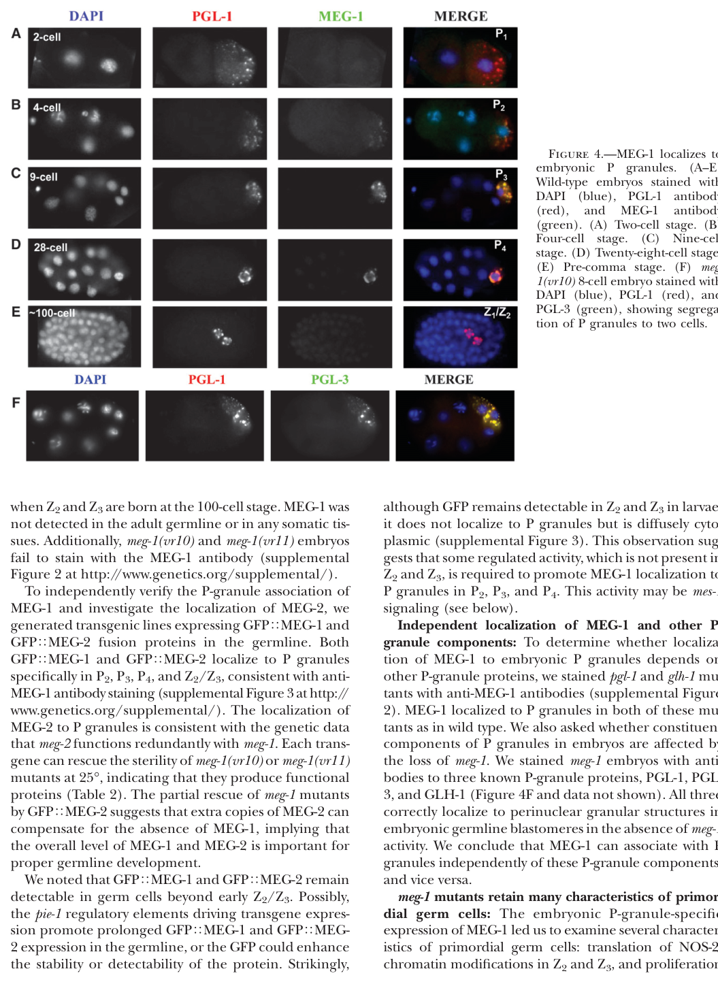

## Question

# Gene Research for Functional Annotation

## ⚠️ CRITICAL: Gene/Protein Identification Context

**BEFORE YOU BEGIN RESEARCH:** You MUST verify you are researching the CORRECT gene/protein. Gene symbols can be ambiguous, especially for less well-characterized genes from non-model organisms.

### Target Gene/Protein Identity (from UniProt):
- **UniProt Accession:** Q21126
- **Protein Description:** RecName: Full=Protein meg-1 {ECO:0000305}; AltName: Full=Maternal effect germ cell defective 1 {ECO:0000303|PubMed:18202375};
- **Gene Information:** Name=meg-1 {ECO:0000303|PubMed:18202375, ECO:0000312|WormBase:K02B9.1}; ORFNames=K02B9.1 {ECO:0000312|WormBase:K02B9.1};
- **Organism (full):** Caenorhabditis elegans.
- **Protein Family:** Not specified in UniProt
- **Key Domains:** Not specified in UniProt

### MANDATORY VERIFICATION STEPS:

1. **Check if the gene symbol "meg-1" matches the protein description above**
2. **Verify the organism is correct:** Caenorhabditis elegans.
3. **Check if protein family/domains align with what you find in literature**
4. **If you find literature for a DIFFERENT gene with the same or similar symbol, STOP**

### If Gene Symbol is Ambiguous or You Cannot Find Relevant Literature:

**DO NOT PROCEED WITH RESEARCH ON A DIFFERENT GENE.** Instead:
- State clearly: "The gene symbol 'meg-1' is ambiguous or literature is limited for this specific protein"
- Explain what you found (e.g., "Found extensive literature on a different gene with the same symbol in a different organism")
- Describe the protein based ONLY on the UniProt information provided above
- Suggest that the protein function can be inferred from domain/family information

### Research Target:

Please provide a comprehensive research report on the gene **meg-1** (gene ID: meg-1, UniProt: Q21126) in worm.

The research report should be a detailed narrative explaining the function, biological processes, and localization of the gene product. Citations should be given for all claims.

You should prioritize authoritative reviews and primary scientific literature when conducting research. You can supplement
this with annotations you find in gene/protein databases, but these can be outdated or inaccurate.

We are specifically interested in the primary function of the gene - for enzymes, what reaction is catalyzed, and what is the substrate specificity? For transporters, what is the substrate? For structural proteins or adapters, what is the broader structural role? For signaling molecules, what is the role in the pathway.

We are interested in where in or outside the cell the gene product carries out its function.

We are also interested in the signaling or biochemical pathways in which the gene functions. We are less interested in broad pleiotropic effects, except where these elucidate the precise role.

Include evidence where possible. We are interested in both experimental evidence as well as inference from structure, evolution, or bioinformatic analysis. Precise studies should be prioritized over high-throughput, where available.

## Output

Question: You are an expert researcher providing comprehensive, well-cited information.

Provide detailed information focusing on:
1. Key concepts and definitions with current understanding
2. Recent developments and latest research (prioritize 2023-2024 sources)
3. Current applications and real-world implementations
4. Expert opinions and analysis from authoritative sources
5. Relevant statistics and data from recent studies

Format as a comprehensive research report with proper citations. Include URLs and publication dates where available.
Always prioritize recent, authoritative sources and provide specific citations for all major claims.

# Gene Research for Functional Annotation

## ⚠️ CRITICAL: Gene/Protein Identification Context

**BEFORE YOU BEGIN RESEARCH:** You MUST verify you are researching the CORRECT gene/protein. Gene symbols can be ambiguous, especially for less well-characterized genes from non-model organisms.

### Target Gene/Protein Identity (from UniProt):
- **UniProt Accession:** Q21126
- **Protein Description:** RecName: Full=Protein meg-1 {ECO:0000305}; AltName: Full=Maternal effect germ cell defective 1 {ECO:0000303|PubMed:18202375};
- **Gene Information:** Name=meg-1 {ECO:0000303|PubMed:18202375, ECO:0000312|WormBase:K02B9.1}; ORFNames=K02B9.1 {ECO:0000312|WormBase:K02B9.1};
- **Organism (full):** Caenorhabditis elegans.
- **Protein Family:** Not specified in UniProt
- **Key Domains:** Not specified in UniProt

### MANDATORY VERIFICATION STEPS:

1. **Check if the gene symbol "meg-1" matches the protein description above**
2. **Verify the organism is correct:** Caenorhabditis elegans.
3. **Check if protein family/domains align with what you find in literature**
4. **If you find literature for a DIFFERENT gene with the same or similar symbol, STOP**

### If Gene Symbol is Ambiguous or You Cannot Find Relevant Literature:

**DO NOT PROCEED WITH RESEARCH ON A DIFFERENT GENE.** Instead:
- State clearly: "The gene symbol 'meg-1' is ambiguous or literature is limited for this specific protein"
- Explain what you found (e.g., "Found extensive literature on a different gene with the same symbol in a different organism")
- Describe the protein based ONLY on the UniProt information provided above
- Suggest that the protein function can be inferred from domain/family information

### Research Target:

Please provide a comprehensive research report on the gene **meg-1** (gene ID: meg-1, UniProt: Q21126) in worm.

The research report should be a detailed narrative explaining the function, biological processes, and localization of the gene product. Citations should be given for all claims.

You should prioritize authoritative reviews and primary scientific literature when conducting research. You can supplement
this with annotations you find in gene/protein databases, but these can be outdated or inaccurate.

We are specifically interested in the primary function of the gene - for enzymes, what reaction is catalyzed, and what is the substrate specificity? For transporters, what is the substrate? For structural proteins or adapters, what is the broader structural role? For signaling molecules, what is the role in the pathway.

We are interested in where in or outside the cell the gene product carries out its function.

We are also interested in the signaling or biochemical pathways in which the gene functions. We are less interested in broad pleiotropic effects, except where these elucidate the precise role.

Include evidence where possible. We are interested in both experimental evidence as well as inference from structure, evolution, or bioinformatic analysis. Precise studies should be prioritized over high-throughput, where available.

## Research report: *C. elegans* **meg-1** (UniProt Q21126; Maternal-effect germ-cell defective 1)

### 0) Target verification (critical identity check)
The gene symbol **meg-1** in the retrieved literature corresponds to **maternal-effect germ-cell defective-1**, encoding **MEG-1**, a maternal/embryo germ-plasm protein that localizes to embryonic germ granules and is required for germline development in **Caenorhabditis elegans**—matching the UniProt entry Q21126 description provided (Maternal effect germ cell defective 1; protein meg-1). (leacock2008meg1andmeg2 pages 1-2, leacock2008meg1andmeg2 pages 4-6)

---

### 1) Key concepts and definitions (current understanding)

#### 1.1 MEG proteins and germ plasm condensates
MEG proteins (maternal-effect germ-cell defective) are germ-plasm components that regulate the assembly, disassembly, and specialization of **RNA/protein condensates** (membraneless organelles) in early embryos. A major conceptual advance is that the “germ granule” system in *C. elegans* comprises **multiple, functionally distinct condensates** rather than a single uniform structure. In particular, **MEG-1/MEG-2** are now associated with a **germline P-body-like condensate** that is distinct from canonical **P granules**, which are largely scaffolded by MEG-3/MEG-4. (cassani2022specializedgermlinepbodies pages 2-3, cassani2022specializedgermlinepbodies pages 6-8, chiappetta2022structuralandfunctional pages 3-4)

#### 1.2 P granules vs germline P-bodies
- **P granules**: germline-enriched RNA/protein condensates that segregate with the P lineage in embryos.
- **Germline P-bodies (MEG-1/2-dependent)**: condensates enriched for **mRNA deadenylation/decapping and translational regulators**, closely associated with (and later merging with) P granules; they are required for proper **maternal mRNA regulation** and **P4 germline founder cell specification**. (cassani2022specializedgermlinepbodies pages 2-3, cassani2022specializedgermlinepbodies pages 6-8, cassani2022specializedgermlinepbodies pages 8-10)

---

### 2) Experimentally supported functions of MEG-1

#### 2.1 Subcellular localization and developmental timing
MEG-1 is an **embryo-specific** P-lineage granule protein. In early embryos, MEG-1 colocalizes with P granules from the **2-cell stage through ~100-cell stage** (visual evidence in Leacock & Reinke 2008). (leacock2008meg1andmeg2 media 90bb0e8a)

More refined staging shows that MEG-1 localization changes over embryogenesis: MEG-1 appears as a **cytoplasmic gradient/small granules in P0**, enriches around the **periphery of P granules in P1–P3**, becomes more distributed with **perinuclear P granules in P4**, and then disperses/turns over by mid-embryogenesis in Z2/Z3. (cassani2022specializedgermlinepbodies pages 2-3)

Leacock & Reinke reported that MEG-1 localization to embryonic P granules requires **MES-1**. (leacock2008meg1andmeg2 pages 1-2)

#### 2.2 Roles in germline development: from P granule behavior to germline fate programming
**Seminal genetics (2008–2011)** established that meg-1 is required maternally for germline development, with phenotypes including abnormal germline proliferation and adult sterility, and that MEG-1 is an embryo-specific P-granule component. (leacock2008meg1andmeg2 pages 1-2, leacock2008meg1andmeg2 pages 4-6, kapelle2011c.elegansmeg‐1 pages 1-3)

**Mechanistic refinement (2014 onward)** connected MEG proteins to condensate dynamics: meg-1 mutants can assemble P granules but show defects in **P-granule disassembly and segregation**, including failure to disassemble granules in the anterior of P1 (2-cell embryo), leading to inappropriate inheritance by somatic blastomeres (e.g., EMS). Genetic interactions place meg genes in pathways regulating granule disassembly involving **MBK-2** kinase and **PPTR-1/2** phosphatase components. (wang2014regulationofrna pages 9-11)

**Major conceptual advance (2022 Development)**: MEG-1/2 preferentially associate with **P-body machinery** and are required to assemble/stabilize **germline P-bodies** that regulate maternal mRNAs in P4 and are essential for germ cell fate specification (P4 identity). In meg-1 meg-2 embryos, P granules can still be present, but germline fate fails—supporting the concept that P granules alone are not sufficient for fate specification, and that **germline P-bodies** are a second essential germ plasm condensate. (cassani2022specializedgermlinepbodies pages 2-3, cassani2022specializedgermlinepbodies pages 6-8, cassani2022specializedgermlinepbodies pages 10-11)

---

### 3) Molecular interactions, pathways, and regulatory logic

#### 3.1 Protein interaction landscape (proteomics)
Cassani & Seydoux (Development; publication date: Nov 2022; URL https://doi.org/10.1242/dev.200920) performed **MEG-1::GFP immunoprecipitation** and identified **54 proteins enriched ≥2-fold**, including:
- **Decapping/P-body factors**: **DCAP-2/DCP2**, **EDC-4**
- **CCR4-NOT (deadenylation complex subunits)**: **NTL-1 (CNOT1-like)**, **TAG-153 (CNOT2)**, **NTL-3 (CNOT3)**
- Additional post-transcriptional regulators: **IFET-1**, **GLD-1**, **GLD-2**, **GLD-3**, **MEX-1**, **OMA-1**, **POS-1**, **MEX-3**, **SPN-4**
**POS-1** was among the most enriched interactors, supporting a model in which MEG-1/2 act within POS-1–linked maternal mRNA regulatory networks. (cassani2022specializedgermlinepbodies pages 2-3)

#### 3.2 Transcriptome and poly(A)-tail-related signatures implicate POS-1-linked regulation
In meg-1 meg-2 embryos, RNA-seq detected **230 downregulated** and **550 upregulated** genes. Notably, **223** of the upregulated genes overlapped with genes whose poly(A) tails are extended in pos-1(RNAi) embryos (**P = 0.0002**), linking MEG-1/2-dependent germline P-bodies to **poly(A) tail / stability regulation** of a POS-1-associated transcript subset. (cassani2022specializedgermlinepbodies pages 6-8)

#### 3.3 Genetic interactions with nanos family: functional coupling to germ cell proliferation/survival
Kapelle & Reinke (genesis; publication date: May 2011; URL https://doi.org/10.1002/dvg.20726) reported that a targeted RNAi interaction screen identified **nanos family genes** as key modifiers:
- **nos-3 loss suppresses meg-1 sterility**
- **nos-2 loss enhances meg-1 defects**, including severe proliferation/survival outcomes
These data support that MEG-1 function intersects genetically with **Nanos-mediated germline regulation**. (kapelle2011c.elegansmeg‐1 pages 1-3)

---

### 4) Mutant phenotypes, penetrance, and quantitative data (recent and classic)

#### 4.1 Maternal-effect sterility and redundancy with meg-2
Leacock & Reinke (Genetics; publication date: Jan 2008; URL https://doi.org/10.1534/genetics.107.080218) reported temperature-sensitive maternal-effect sterility for meg-1 alleles, and strong redundancy with meg-2. Quantitatively, at **20°C**, **meg-2 RNAi** increased sterility from **15% → 100%** in **meg-1(vr10)** and from **4% → 93%** in **meg-1(vr11)**. (leacock2008meg1andmeg2 pages 4-6)

These quantitative outcomes are summarized in the paper’s sterility tables (visual evidence). (leacock2008meg1andmeg2 media 8deae739)

A full deletion removing the meg-1 meg-2 operon (meg-1 meg-2(ax4532)) caused **100% maternal-effect sterility**. (cassani2022specializedgermlinepbodies pages 2-3)

#### 4.2 Germline fate specification defects in embryos lacking meg-1/meg-2
Cassani & Seydoux (2022) quantified embryo fate markers demonstrating P4 misspecification:
- Ectopic muscle fate marker **hlh-1** in **21/23** meg-1 meg-2 embryos vs **0/21** wild type
- Germline marker **xnd-1** absent/weak in **16/24** embryos
They also reported extra P granule-positive cells in **50%** of bean-to-comma embryos and **100%** of non-fed L1 larvae, consistent with fate and developmental patterning defects. (cassani2022specializedgermlinepbodies pages 6-8)

#### 4.3 Germ cell counts in severe meg combinatorial mutants
Wang et al. (eLife; publication date: Dec 2014; URL https://doi.org/10.7554/eLife.04591) reported that strong combinatorial meg loss can yield severe germline proliferation failure: meg-1;meg-3;meg-4 larvae had **<10 germ cells** and were **100% sterile**. (wang2014regulationofrna pages 9-11)

---

### 5) Recent developments (prioritizing 2023–2024) and how they affect meg-1 interpretation

#### 5.1 2024: meg-1 RNAi used to test whether embryo-lysate-induced UPRmt requires P granules
Zhou et al. (Nature Communications; publication date: Oct 2024; URL https://doi.org/10.1038/s41467-024-53064-0) used **meg-1 RNAi** (along with meg-3 and meg-4 RNAi) to test whether cytoplasmic P-granule formation is required for embryo-lysate-induced activation of the mitochondrial unfolded protein response (UPRmt). They reported that embryo lysates still promoted UPRmt activation in meg-1 RNAi animals, suggesting the lysate effect does **not require meg-1-dependent cytoplasmic P granules** in that context. (zhou2024agermlinetosomasignal pages 1-2)

Interpretation: this is not a primary mechanistic study of MEG-1 itself, but a **real-world implementation** where meg-1 knockdown serves as an experimental perturbation for the role of germ granules in organismal signaling. (zhou2024agermlinetosomasignal pages 1-2)

#### 5.2 Limits of 2023–2024 meg-1-specific primary literature in the retrieved corpus
Within the retrieved full-text set, the most mechanistically definitive studies for MEG-1 remain 2008–2014 primary genetics/condensate-dynamics work and the 2022 Development study that redefined MEG-1/2 as germline P-body components. (leacock2008meg1andmeg2 pages 4-6, wang2014regulationofrna pages 9-11, cassani2022specializedgermlinepbodies pages 2-3, cassani2022specializedgermlinepbodies pages 6-8)

---

### 6) Current applications and real-world implementations

1. **Embryo staging + immunofluorescence localization**: MEG-1 is used as a marker for germ plasm-associated condensates in early embryo imaging, with colocalization against P-granule markers (e.g., PGL proteins) across cleavage stages. (leacock2008meg1andmeg2 media 90bb0e8a)

2. **Condensate biology and quantitative live imaging**: MEG family proteins are used as a platform for studying **phosphoregulation of phase-separated RNP condensates** in vivo, including genetic dissection of kinase/phosphatase pathways controlling granule assembly/disassembly. (wang2014regulationofrna pages 9-11)

3. **Proteomics and transcriptome profiling of condensate components**: MEG-1::GFP pull-downs and RNA-seq in meg-1/meg-2 embryos provide a blueprint for mapping condensate specialization and the maternal mRNA regulatory programs needed for germline specification. (cassani2022specializedgermlinepbodies pages 2-3, cassani2022specializedgermlinepbodies pages 6-8)

4. **Functional perturbation in systems physiology studies**: meg-1 RNAi is used as a perturbation of germ granule biology in studies probing germline-to-soma signaling (e.g., UPRmt activation by embryo lysates). (zhou2024agermlinetosomasignal pages 1-2)

---

### 7) Expert synthesis and authoritative analysis
Chiappetta et al. (Biochemical Journal; publication date: Dec 2022; URL https://doi.org/10.1042/bcj20210815) synthesize a model in which **MEG-1/MEG-2 nucleate a germline P-body** distinct from P granules, enriching **decapping/deadenylation enzymes**, and note that MEG-1/2 mutant embryos fail to form germline P-bodies and do not develop a germline. This review perspective supports interpreting MEG-1 primarily as a condensate-organizing factor in **maternal mRNA regulation**, rather than as a sole structural determinant of P granules. (chiappetta2022structuralandfunctional pages 3-4)

---

### 8) Summary of key evidence (table)
The following table consolidates definitions, localization, interactions, phenotypes, mechanistic model, and quantitative data.

| Aspect | Key findings | Evidence type | Primary source(s) |
|---|---|---|---|
| Definition / concept | • **MEG-1** is the *Caenorhabditis elegans* protein encoded by **meg-1 / K02B9.1** (UniProt Q21126), originally defined as a **maternal-effect germ cell defective** factor required for germline development. • It is an **embryo-specific germ plasm / P-granule-associated protein** and is partially redundant with **MEG-2**. • Current model places MEG-1/2 not as core P-granule scaffolds, but as organizers of a distinct **germline P-body** condensate needed for germ cell fate specification. (leacock2008meg1andmeg2 pages 1-2, leacock2008meg1andmeg2 pages 4-6, cassani2022specializedgermlinepbodies pages 2-3, chiappetta2022structuralandfunctional pages 3-4) | Genetics; immunostaining; review synthesis | Leacock & Reinke 2008, **Genetics**, doi:10.1534/genetics.107.080218, https://doi.org/10.1534/genetics.107.080218; Cassani & Seydoux 2022, **Development**, doi:10.1242/dev.200920, https://doi.org/10.1242/dev.200920; Chiappetta et al. 2022, **Biochem J**, doi:10.1042/BCJ20210815, https://doi.org/10.1042/bcj20210815 |
| Localization | • MEG-1 localizes to **embryonic P granules** from the **2-cell stage through ~100-cell stage**. • In the early embryo, MEG-1 is in a **cytoplasmic gradient and small granules** in P0; in **P1-P3** it becomes enriched in puncta at the **periphery of P granules**; in **P4** it becomes distributed throughout **perinuclear P granules**; in **Z2/Z3** it disperses to the cytoplasm and is turned over by **mid-embryogenesis**. • MEG-1 localization to P granules requires **MES-1**. (leacock2008meg1andmeg2 pages 1-2, cassani2022specializedgermlinepbodies pages 2-3, leacock2008meg1andmeg2 media 90bb0e8a) | Immunofluorescence imaging; developmental staging | Leacock & Reinke 2008, **Genetics**, doi:10.1534/genetics.107.080218, https://doi.org/10.1534/genetics.107.080218; Cassani & Seydoux 2022, **Development**, doi:10.1242/dev.200920, https://doi.org/10.1242/dev.200920 |
| Molecular interactions / complexes | • MEG-1 and **MEG-2** colocalize and function partially redundantly. • MEG-1::GFP immunoprecipitation identified **54 enriched proteins** (>=2-fold), including canonical **P-body / mRNA-decay factors** such as **DCAP-2/DCP2, EDC-4**, CCR4-NOT-related subunits (**NTL-1, TAG-153, NTL-3**), **IFET-1**, and regulators **GLD-1, GLD-2, GLD-3, MEX-1, OMA-1, POS-1, MEX-3, SPN-4**. • **POS-1** was among the most highly enriched interactors, supporting a role in post-transcriptional control. • Review synthesis: MEG-1/2 nucleate a **germline P-body** distinct from, but often adjacent to, P granules, enriched for **decapping and deadenylation enzymes**. (cassani2022specializedgermlinepbodies pages 2-3, chiappetta2022structuralandfunctional pages 3-4) | Proteomics / IP-MS; condensate biology review | Cassani & Seydoux 2022, **Development**, doi:10.1242/dev.200920, https://doi.org/10.1242/dev.200920; Chiappetta et al. 2022, **Biochem J**, doi:10.1042/BCJ20210815, https://doi.org/10.1042/bcj20210815 |
| Mutant / RNAi phenotypes | • **meg-1** mutants show **maternal-effect sterility**, underdeveloped adult germlines, few abnormal germ cells, and failed meiotic progression / gametogenesis. • Sterility is temperature sensitive; **meg-2 RNAi** strongly enhances **meg-1** sterility: **meg-1(vr10)** rises from **15% to 100%** sterile and **meg-1(vr11)** from **4% to 93%** sterile at **20°C**. • Z2/Z3 primordial germ cells are present at hatching, but later larval germ-cell proliferation fails; blocking apoptosis (**ced-4**) does not rescue the loss, arguing against canonical apoptosis as the main cause. • **nos-3** loss suppresses meg-1 sterility, whereas **nos-2** loss enhances it and can abolish proliferation / promote early degeneration. • **glh-1** enhances meg-1 sterility, while **pgl-1** loss partially suppresses meg-1 defects. • A full **meg-1 meg-2(ax4532)** deletion causes **100% maternal-effect sterility**. (kapelle2011c.elegansmeg‐1 pages 1-3, leacock2008meg1andmeg2 pages 4-6, cassani2022specializedgermlinepbodies pages 2-3, leacock2008meg1andmeg2 media 90bb0e8a) | Forward genetics; RNAi; epistasis / genetic interaction tests; cell counts | Leacock & Reinke 2008, **Genetics**, doi:10.1534/genetics.107.080218, https://doi.org/10.1534/genetics.107.080218; Kapelle & Reinke 2011, **genesis**, doi:10.1002/dvg.20726, https://doi.org/10.1002/dvg.20726; Cassani & Seydoux 2022, **Development**, doi:10.1242/dev.200920, https://doi.org/10.1242/dev.200920 |
| Pathway / regulatory model | • Early work linked MEG-1 to **P-granule segregation and embryonic germline integrity**; later work refined this to a role in **post-transcriptional regulation** rather than simply granule inheritance. • Wang et al. showed MEG proteins are **serine-rich intrinsically disordered proteins** whose phosphorylation state regulates granule dynamics; **meg-1** contributes to **P-granule disassembly** in the early embryo and acts genetically downstream of **MBK-2** and **PPTR-1/2** pathways controlling condensation/disassembly. • Cassani & Seydoux proposed that MEG-1/2 stabilize **germline P-bodies** in **P4**, enabling turnover of maternal oogenic transcripts and proper translation of germline determinants such as **NOS-2**; this is required to specify **P4 as the germline founder cell**. • Thus, current understanding is that MEG-1 acts in a **germ-plasm mRNA regulation pathway** coupling condensate specialization to **maternal mRNA decay / translational control**. (wang2014regulationofrna pages 9-11, cassani2022specializedgermlinepbodies pages 2-3, cassani2022specializedgermlinepbodies pages 6-8, chiappetta2022structuralandfunctional pages 3-4) | Genetics; live imaging; phosphorylation / signaling analysis; RNA regulation studies; review synthesis | Wang et al. 2014, **eLife**, doi:10.7554/eLife.04591, https://doi.org/10.7554/eLife.04591; Cassani & Seydoux 2022, **Development**, doi:10.1242/dev.200920, https://doi.org/10.1242/dev.200920; Chiappetta et al. 2022, **Biochem J**, doi:10.1042/BCJ20210815, https://doi.org/10.1042/bcj20210815 |
| Quantitative / statistics | • **Sterility enhancement** at 20°C with meg-2 RNAi: **meg-1(vr10) 15% -> 100%**, **meg-1(vr11) 4% -> 93%** sterile. (leacock2008meg1andmeg2 pages 4-6, leacock2008meg1andmeg2 media 90bb0e8a) • **meg-1 meg-2(ax4532)**: **100% maternal-effect sterile**. (cassani2022specializedgermlinepbodies pages 2-3) • RNA-seq in **meg-1 meg-2** embryos: **230 downregulated** and **550 upregulated** genes. (cassani2022specializedgermlinepbodies pages 6-8) • Of the upregulated genes, **223** overlapped with genes whose poly(A) tails are extended in **pos-1(RNAi)** embryos (**P = 0.0002**). (cassani2022specializedgermlinepbodies pages 6-8) • Germline fate transformation markers in meg-1 meg-2: **hlh-1 ectopic in 21/23 embryos vs 0/21 WT**; **xnd-1 absent/weak in 16/24 embryos**. (cassani2022specializedgermlinepbodies pages 6-8) • Extra P granule-positive cells: **50%** of bean-to-comma embryos and **100%** of non-fed L1 larvae. (cassani2022specializedgermlinepbodies pages 6-8) • Severe combinatorial meg mutant phenotypes: **meg-1;meg-3;meg-4** larvae had **<10 germ cells** and were **100% sterile**; earlier cited work also notes **meg-1;meg-2** double mutants as **100% sterile**. (wang2014regulationofrna pages 9-11) | Quantitative genetics; RNA-seq; marker scoring; larval germ-cell counts | Leacock & Reinke 2008, **Genetics**, doi:10.1534/genetics.107.080218, https://doi.org/10.1534/genetics.107.080218; Wang et al. 2014, **eLife**, doi:10.7554/eLife.04591, https://doi.org/10.7554/eLife.04591; Cassani & Seydoux 2022, **Development**, doi:10.1242/dev.200920, https://doi.org/10.1242/dev.200920 |

*Table: This table summarizes experimentally supported functional annotation for C. elegans MEG-1, including localization, molecular partners, mutant phenotypes, regulatory model, and quantitative findings from key primary studies and one authoritative review.*

---

### 9) Visual evidence (selected)
Leacock & Reinke (Genetics 2008) provide visual evidence of MEG-1 localization to embryonic P granules and quantitative sterility tables (including meg-2 RNAi enhancement). (leacock2008meg1andmeg2 media 90bb0e8a, leacock2008meg1andmeg2 media 8deae739)

---

### 10) Consolidated functional annotation (high-confidence)
Across genetics, imaging, and molecular profiling studies, the best-supported primary function for **MEG-1** is as a **maternal germ-plasm factor that organizes specialized RNP condensates and enables correct post-transcriptional regulation of maternal mRNAs in the embryonic germline lineage**, with essential roles in **P4 germline founder specification** and later **germline proliferation/survival**, acting partially redundantly with **MEG-2**. (leacock2008meg1andmeg2 pages 4-6, wang2014regulationofrna pages 9-11, cassani2022specializedgermlinepbodies pages 2-3, cassani2022specializedgermlinepbodies pages 6-8)

References

1. (leacock2008meg1andmeg2 pages 1-2): Stefanie W Leacock and Valerie Reinke. Meg-1 and meg-2 are embryo-specific p-granule components required for germline development in caenorhabditis elegans. Genetics, 178:295-306, Jan 2008. URL: https://doi.org/10.1534/genetics.107.080218, doi:10.1534/genetics.107.080218. This article has 40 citations and is from a domain leading peer-reviewed journal.

2. (leacock2008meg1andmeg2 pages 4-6): Stefanie W Leacock and Valerie Reinke. Meg-1 and meg-2 are embryo-specific p-granule components required for germline development in caenorhabditis elegans. Genetics, 178:295-306, Jan 2008. URL: https://doi.org/10.1534/genetics.107.080218, doi:10.1534/genetics.107.080218. This article has 40 citations and is from a domain leading peer-reviewed journal.

3. (cassani2022specializedgermlinepbodies pages 2-3): Madeline Cassani and Geraldine Seydoux. Specialized germline p-bodies are required to specify germ cell fate in <i>caenorhabditis elegans</i> embryos. Development, Nov 2022. URL: https://doi.org/10.1242/dev.200920, doi:10.1242/dev.200920. This article has 35 citations and is from a domain leading peer-reviewed journal.

4. (cassani2022specializedgermlinepbodies pages 6-8): Madeline Cassani and Geraldine Seydoux. Specialized germline p-bodies are required to specify germ cell fate in <i>caenorhabditis elegans</i> embryos. Development, Nov 2022. URL: https://doi.org/10.1242/dev.200920, doi:10.1242/dev.200920. This article has 35 citations and is from a domain leading peer-reviewed journal.

5. (chiappetta2022structuralandfunctional pages 3-4): Austin Chiappetta, Jeffrey Liao, Siran Tian, and Tatjana Trcek. Structural and functional organization of germ plasm condensates. The Biochemical journal, 479 24:2477-2495, Dec 2022. URL: https://doi.org/10.1042/bcj20210815, doi:10.1042/bcj20210815. This article has 20 citations.

6. (cassani2022specializedgermlinepbodies pages 8-10): Madeline Cassani and Geraldine Seydoux. Specialized germline p-bodies are required to specify germ cell fate in <i>caenorhabditis elegans</i> embryos. Development, Nov 2022. URL: https://doi.org/10.1242/dev.200920, doi:10.1242/dev.200920. This article has 35 citations and is from a domain leading peer-reviewed journal.

7. (leacock2008meg1andmeg2 media 90bb0e8a): Stefanie W Leacock and Valerie Reinke. Meg-1 and meg-2 are embryo-specific p-granule components required for germline development in caenorhabditis elegans. Genetics, 178:295-306, Jan 2008. URL: https://doi.org/10.1534/genetics.107.080218, doi:10.1534/genetics.107.080218. This article has 40 citations and is from a domain leading peer-reviewed journal.

8. (kapelle2011c.elegansmeg‐1 pages 1-3): William S. Kapelle and Valerie Reinke. C. elegans meg‐1 and meg‐2 differentially interact with nanos family members to either promote or inhibit germ cell proliferation and survival. genesis, 49:380-391, May 2011. URL: https://doi.org/10.1002/dvg.20726, doi:10.1002/dvg.20726. This article has 14 citations and is from a peer-reviewed journal.

9. (wang2014regulationofrna pages 9-11): Jennifer T Wang, Jarrett Smith, Bi-Chang Chen, Helen Schmidt, Dominique Rasoloson, Alexandre Paix, Bramwell G Lambrus, Deepika Calidas, Eric Betzig, and Geraldine Seydoux. Regulation of rna granule dynamics by phosphorylation of serine-rich, intrinsically disordered proteins in c. elegans. eLife, Dec 2014. URL: https://doi.org/10.7554/elife.04591, doi:10.7554/elife.04591. This article has 438 citations and is from a domain leading peer-reviewed journal.

10. (cassani2022specializedgermlinepbodies pages 10-11): Madeline Cassani and Geraldine Seydoux. Specialized germline p-bodies are required to specify germ cell fate in <i>caenorhabditis elegans</i> embryos. Development, Nov 2022. URL: https://doi.org/10.1242/dev.200920, doi:10.1242/dev.200920. This article has 35 citations and is from a domain leading peer-reviewed journal.

11. (leacock2008meg1andmeg2 media 8deae739): Stefanie W Leacock and Valerie Reinke. Meg-1 and meg-2 are embryo-specific p-granule components required for germline development in caenorhabditis elegans. Genetics, 178:295-306, Jan 2008. URL: https://doi.org/10.1534/genetics.107.080218, doi:10.1534/genetics.107.080218. This article has 40 citations and is from a domain leading peer-reviewed journal.

12. (zhou2024agermlinetosomasignal pages 1-2): Liankui Zhou, Liu Jiang, Lan Li, Chengchuan Ma, Peixue Xia, Wanqiu Ding, and Ying Liu. A germline-to-soma signal triggers an age-related decline of mitochondrial stress response. Nature Communications, Oct 2024. URL: https://doi.org/10.1038/s41467-024-53064-0, doi:10.1038/s41467-024-53064-0. This article has 15 citations and is from a highest quality peer-reviewed journal.

## Artifacts

- [Edison artifact artifact-00](meg-1-deep-research-falcon_artifacts/artifact-00.md)

## Citations

1. cassani2022specializedgermlinepbodies pages 2-3
2. wang2014regulationofrna pages 9-11
3. cassani2022specializedgermlinepbodies pages 6-8
4. zhou2024agermlinetosomasignal pages 1-2
5. chiappetta2022structuralandfunctional pages 3-4
6. cassani2022specializedgermlinepbodies pages 8-10
7. cassani2022specializedgermlinepbodies pages 10-11
8. https://doi.org/10.1242/dev.200920
9. https://doi.org/10.1002/dvg.20726
10. https://doi.org/10.1534/genetics.107.080218
11. https://doi.org/10.7554/eLife.04591
12. https://doi.org/10.1038/s41467-024-53064-0
13. https://doi.org/10.1042/bcj20210815
14. https://doi.org/10.1534/genetics.107.080218;
15. https://doi.org/10.1242/dev.200920;
16. https://doi.org/10.1002/dvg.20726;
17. https://doi.org/10.7554/eLife.04591;
18. https://doi.org/10.1534/genetics.107.080218,
19. https://doi.org/10.1242/dev.200920,
20. https://doi.org/10.1042/bcj20210815,
21. https://doi.org/10.1002/dvg.20726,
22. https://doi.org/10.7554/elife.04591,
23. https://doi.org/10.1038/s41467-024-53064-0,