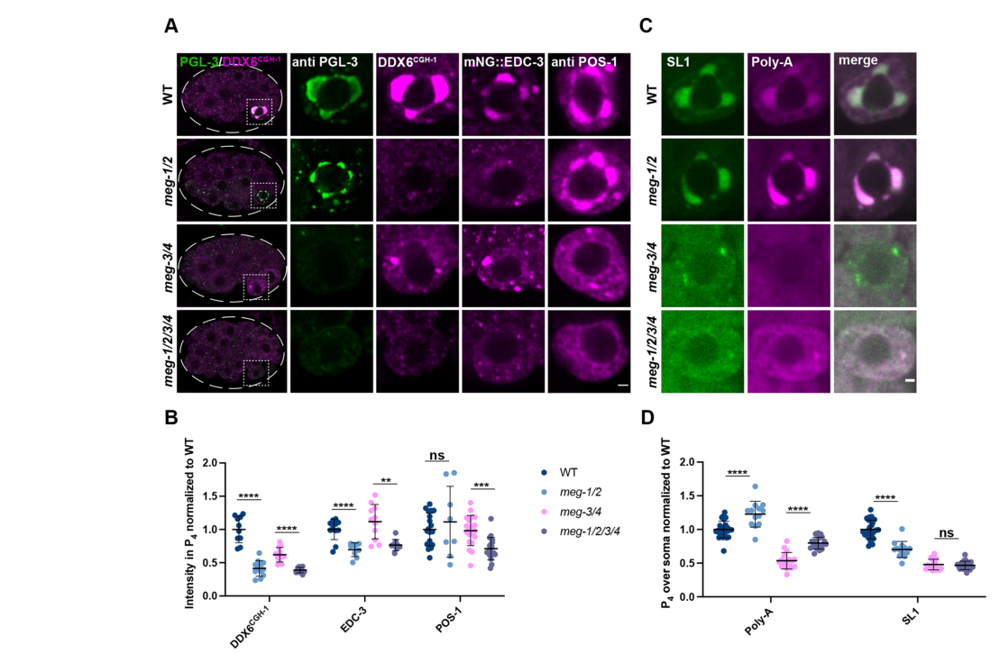

## Question

# Gene Research for Functional Annotation

## ⚠️ CRITICAL: Gene/Protein Identification Context

**BEFORE YOU BEGIN RESEARCH:** You MUST verify you are researching the CORRECT gene/protein. Gene symbols can be ambiguous, especially for less well-characterized genes from non-model organisms.

### Target Gene/Protein Identity (from UniProt):
- **UniProt Accession:** Q21127
- **Protein Description:** RecName: Full=Protein meg-2 {ECO:0000305}; AltName: Full=Maternal effect germ cell defective 2 {ECO:0000303|PubMed:18202375};
- **Gene Information:** Name=meg-2 {ECO:0000303|PubMed:18202375, ECO:0000312|WormBase:K02B9.2}; ORFNames=K02B9.2 {ECO:0000312|WormBase:K02B9.2};
- **Organism (full):** Caenorhabditis elegans.
- **Protein Family:** Not specified in UniProt
- **Key Domains:** Not specified in UniProt

### MANDATORY VERIFICATION STEPS:

1. **Check if the gene symbol "meg-2" matches the protein description above**
2. **Verify the organism is correct:** Caenorhabditis elegans.
3. **Check if protein family/domains align with what you find in literature**
4. **If you find literature for a DIFFERENT gene with the same or similar symbol, STOP**

### If Gene Symbol is Ambiguous or You Cannot Find Relevant Literature:

**DO NOT PROCEED WITH RESEARCH ON A DIFFERENT GENE.** Instead:
- State clearly: "The gene symbol 'meg-2' is ambiguous or literature is limited for this specific protein"
- Explain what you found (e.g., "Found extensive literature on a different gene with the same symbol in a different organism")
- Describe the protein based ONLY on the UniProt information provided above
- Suggest that the protein function can be inferred from domain/family information

### Research Target:

Please provide a comprehensive research report on the gene **meg-2** (gene ID: meg-2, UniProt: Q21127) in worm.

The research report should be a detailed narrative explaining the function, biological processes, and localization of the gene product. Citations should be given for all claims.

You should prioritize authoritative reviews and primary scientific literature when conducting research. You can supplement
this with annotations you find in gene/protein databases, but these can be outdated or inaccurate.

We are specifically interested in the primary function of the gene - for enzymes, what reaction is catalyzed, and what is the substrate specificity? For transporters, what is the substrate? For structural proteins or adapters, what is the broader structural role? For signaling molecules, what is the role in the pathway.

We are interested in where in or outside the cell the gene product carries out its function.

We are also interested in the signaling or biochemical pathways in which the gene functions. We are less interested in broad pleiotropic effects, except where these elucidate the precise role.

Include evidence where possible. We are interested in both experimental evidence as well as inference from structure, evolution, or bioinformatic analysis. Precise studies should be prioritized over high-throughput, where available.

## Output

Question: You are an expert researcher providing comprehensive, well-cited information.

Provide detailed information focusing on:
1. Key concepts and definitions with current understanding
2. Recent developments and latest research (prioritize 2023-2024 sources)
3. Current applications and real-world implementations
4. Expert opinions and analysis from authoritative sources
5. Relevant statistics and data from recent studies

Format as a comprehensive research report with proper citations. Include URLs and publication dates where available.
Always prioritize recent, authoritative sources and provide specific citations for all major claims.

# Gene Research for Functional Annotation

## ⚠️ CRITICAL: Gene/Protein Identification Context

**BEFORE YOU BEGIN RESEARCH:** You MUST verify you are researching the CORRECT gene/protein. Gene symbols can be ambiguous, especially for less well-characterized genes from non-model organisms.

### Target Gene/Protein Identity (from UniProt):
- **UniProt Accession:** Q21127
- **Protein Description:** RecName: Full=Protein meg-2 {ECO:0000305}; AltName: Full=Maternal effect germ cell defective 2 {ECO:0000303|PubMed:18202375};
- **Gene Information:** Name=meg-2 {ECO:0000303|PubMed:18202375, ECO:0000312|WormBase:K02B9.2}; ORFNames=K02B9.2 {ECO:0000312|WormBase:K02B9.2};
- **Organism (full):** Caenorhabditis elegans.
- **Protein Family:** Not specified in UniProt
- **Key Domains:** Not specified in UniProt

### MANDATORY VERIFICATION STEPS:

1. **Check if the gene symbol "meg-2" matches the protein description above**
2. **Verify the organism is correct:** Caenorhabditis elegans.
3. **Check if protein family/domains align with what you find in literature**
4. **If you find literature for a DIFFERENT gene with the same or similar symbol, STOP**

### If Gene Symbol is Ambiguous or You Cannot Find Relevant Literature:

**DO NOT PROCEED WITH RESEARCH ON A DIFFERENT GENE.** Instead:
- State clearly: "The gene symbol 'meg-2' is ambiguous or literature is limited for this specific protein"
- Explain what you found (e.g., "Found extensive literature on a different gene with the same symbol in a different organism")
- Describe the protein based ONLY on the UniProt information provided above
- Suggest that the protein function can be inferred from domain/family information

### Research Target:

Please provide a comprehensive research report on the gene **meg-2** (gene ID: meg-2, UniProt: Q21127) in worm.

The research report should be a detailed narrative explaining the function, biological processes, and localization of the gene product. Citations should be given for all claims.

You should prioritize authoritative reviews and primary scientific literature when conducting research. You can supplement
this with annotations you find in gene/protein databases, but these can be outdated or inaccurate.

We are specifically interested in the primary function of the gene - for enzymes, what reaction is catalyzed, and what is the substrate specificity? For transporters, what is the substrate? For structural proteins or adapters, what is the broader structural role? For signaling molecules, what is the role in the pathway.

We are interested in where in or outside the cell the gene product carries out its function.

We are also interested in the signaling or biochemical pathways in which the gene functions. We are less interested in broad pleiotropic effects, except where these elucidate the precise role.

Include evidence where possible. We are interested in both experimental evidence as well as inference from structure, evolution, or bioinformatic analysis. Precise studies should be prioritized over high-throughput, where available.

## Research Report: Functional Annotation of **meg-2** (UniProt **Q21127**; ORF **K02B9.2**) in *Caenorhabditis elegans*

### Executive summary
*Caenorhabditis elegans* **meg-2** encodes **Protein MEG-2 (Maternal-effect germ cell defective 2)**, an embryo-restricted germ-plasm factor that acts transiently during early embryogenesis but is essential for later germline development. Primary evidence supports that MEG-2 (i) localizes to embryonic germline condensates (classically described as P granules), (ii) acts redundantly with its paralog **MEG-1**, and (iii) is now best understood as part of a module that maintains **germline P-body–like condensates** in the P4 blastomere to control maternal mRNA deadenylation/decapping and proper germline founder-cell fate. No enzymatic activity is currently attributed to MEG-2; it is instead described as an **intrinsically disordered/low-complexity protein** that likely serves as a **condensate organizer/scaffold** in post-transcriptional regulation. (leacock2008meg1andmeg2 pages 6-8, kapelle2011c.elegansmeg‐1 pages 1-3, cassani2022specializedgermlinepbodies pages 5-6, cassani2022specializedgermlinepbodies pages 1-2)

### 1) Gene/protein identity verification and disambiguation
- The target is **meg-2** in *C. elegans*, with ORF **K02B9.2**, encoding **MEG-2**, described in the literature as “maternal-effect germ cell defective” and closely related to MEG-1. This matches the UniProt-provided identity (Q21127; MEG-2; maternal-effect germ cell defective 2). (leacock2008meg1andmeg2 pages 6-8, kapelle2011c.elegansmeg‐1 pages 1-3)
- The retrieved primary literature consistently uses MEG-2 in the context of **embryonic germline determinants and germ granule biology** in *C. elegans*, and not an unrelated “meg-2” symbol in other organisms. (leacock2008meg1andmeg2 pages 6-8, kapelle2011c.elegansmeg‐1 pages 1-3, cassani2022specializedgermlinepbodies pages 5-6)

### 2) Key concepts and definitions (current understanding)
#### 2.1 Maternal-effect germ cell defective (MEG)
“Maternal-effect” indicates the phenotype arises from loss of maternal gene product deposited in the egg; embryos from mutant mothers can fail in germline development even if the zygotic genotype is otherwise viable. MEG proteins are germ-plasm components required redundantly for fertility and germline development. (wang2014regulationofrna pages 15-16)

#### 2.2 Germ plasm condensates: P granules versus germline P-bodies
- **P granules** are germline-enriched ribonucleoprotein condensates that partition with the P lineage during early embryogenesis. Historically MEG-1/2 were classified as embryo-specific P-granule components. (leacock2008meg1andmeg2 pages 6-8)
- A major refinement is the recognition of at least two functionally distinct germ-plasm condensate types in embryos:
  - canonical **P granules** (strongly associated with PGL proteins and MEG-3/4 scaffolding), and
  - **germline P-bodies**, enriched for decapping/deadenylation regulators and containing **MEG-1/2** and POS-1, acting especially in **P4**. (cassani2022specializedgermlinepbodies pages 1-2, cassani2022specializedgermlinepbodies pages 10-11, cassani2022specializedgermlinepbodies pages 5-6)

#### 2.3 Intrinsically disordered proteins (IDPs) and condensate regulation
MEG proteins are serine-rich/low-complexity factors implicated in condensate assembly/disassembly dynamics. In this framework, MEG-2 is viewed as a non-enzymatic regulator whose physical properties (e.g., charge and disorder) contribute to condensate behavior and downstream mRNA regulation. (wang2014regulationofrna pages 15-16, cassani2022specializedgermlinepbodies pages 1-2)

### 3) Molecular function: what MEG-2 does (and does not do)
#### 3.1 No known enzymatic or transporter activity
Across the primary sources retrieved here, **MEG-2 is not assigned a catalytic reaction, substrate specificity, or transporter substrate**. Instead, it is treated as a **novel, low-complexity/IDP-like regulatory protein** required for proper germline development through organization of RNP condensates and post-transcriptional regulation. (kapelle2011c.elegansmeg‐1 pages 1-3, wang2014regulationofrna pages 15-16, cassani2022specializedgermlinepbodies pages 1-2)

#### 3.2 Functional role supported by genetics and cell biology
**(A) Condensate-associated localization during embryogenesis**
- GFP::MEG-2 localizes to **P granules** in the embryonic P lineage (P2/P3/P4) and the primordial germ cells **Z2/Z3** (embryonic stages). (leacock2008meg1andmeg2 pages 6-8)

**(B) Redundant requirement with MEG-1 for germline development**
- Extra copies of MEG-2 (GFP::MEG-2) can **partially rescue** sterility of meg-1 mutants at 25°C, supporting functional redundancy and dosage sensitivity across MEG-1/2. (leacock2008meg1andmeg2 pages 6-8)
- Genetic analyses across MEG family members indicate **synthetic sterility**: for example, meg-1 mutants show ~4% sterility and meg-3 meg-4 ~30% sterility, while meg-1 meg-3 meg-4 are 100% sterile; critically, **meg-1 meg-2 embryos can still assemble embryonic P granules yet display fully penetrant Meg sterility**, suggesting MEG-dependent germline function is not reducible to visible P-granule assembly alone. (wang2014regulationofrna pages 15-16)

**(C) Germline P-body maintenance and maternal mRNA control in P4 (MEG-1/2 module)**
- MEG-1/2 are required to maintain high levels of P-body proteins **CGH-1 (DDX6)** and **EDC-3** specifically in the P4 blastomere; MEG-1/2 are not required for PGL-3 localization to P4, and POS-1 levels in P4 are largely unaffected in meg-1 meg-2 double loss (POS-1 reduction becomes apparent in quadruple meg depletion). (cassani2022specializedgermlinepbodies pages 5-6)
- Functional readout: in meg-1 meg-2 embryos, poly-A levels are increased in P4 despite SL1 levels decreasing/not changing, consistent with compromised mRNA deadenylation/turnover activity in P4. (cassani2022specializedgermlinepbodies pages 5-6, cassani2022specializedgermlinepbodies media aca4ef46)
- Transcriptome consequences: RNA-seq identified **550 upregulated** and **230 downregulated** mRNAs in meg-1 meg-2 embryos versus wild type; **223/550 (40%)** of upregulated mRNAs overlap “deadenylated POS-1 targets” (defined by longer poly-A tails upon pos-1 RNAi), with **Fisher’s exact test P=0.0002**—supporting a functional relationship between MEG-1/2 and POS-1-regulated deadenylation programs. (cassani2022specializedgermlinepbodies pages 5-6)

### 4) Subcellular localization and developmental timing
#### 4.1 Early embryo (P lineage) localization
- MEG-2 is observed as a P-granule-associated component in early embryos, in the germline blastomeres (P2/P3/P4) and Z2/Z3. (leacock2008meg1andmeg2 pages 6-8)
- MEG proteins act only transiently in embryos: MEG-1 is described as being expressed from approximately the **4-cell to 28-cell stage**, during germline/soma segregation; MEG-2 is described as closely related and co-localizing with P granules in this early window. (kapelle2011c.elegansmeg‐1 pages 1-3)

#### 4.2 P4 stage specialization: germline P-bodies
The most detailed mechanistic and quantitative work emphasizes the **P4 blastomere** (the germline founder precursor), where MEG-1/2 maintain **germline P-bodies** enriched for mRNA decapping/deadenylation regulators and coordinate proper turnover and translation activation of maternal mRNAs. (cassani2022specializedgermlinepbodies pages 5-6, cassani2022specializedgermlinepbodies pages 10-11, cassani2022specializedgermlinepbodies media aca4ef46)

### 5) Phenotypes of loss-of-function and genetic interactions
#### 5.1 Maternal-effect sterility and germline failure
- Loss of MEG function results in defects that can be delayed relative to the embryonic expression window: embryos can still form primordial germ cells, but germ cells later fail to proliferate/differentiate normally, producing sterility. (kapelle2011c.elegansmeg‐1 pages 1-3)
- In the germline P-body model, embryos lacking meg-1/2 mis-specify the germline founder cell and fail to develop a germline, resulting in **100% sterility** in the reported meg-1 meg-2 loss paradigms. (cassani2022specializedgermlinepbodies pages 6-8)

#### 5.2 Fate mis-specification and marker penetrance (quantitative)
In meg-1 meg-2 embryos (meg-1(vr10) meg-2(RNAi) or deletion of the operon reported in the same study), P4 descendants show:
- Ectopic muscle program marker **hlh-1** expression in **21/23** embryos (vs **0/21** wild type). (cassani2022specializedgermlinepbodies pages 6-8)
- Failure to robustly activate germline transcriptional program marker **xnd-1** in **16/24** embryos. (cassani2022specializedgermlinepbodies pages 6-8)
- Extra P-granule-positive cells in **50%** of bean-to-comma embryos and **100%** of non-fed L1 larvae, consistent with abnormal germline program deployment/maintenance. (cassani2022specializedgermlinepbodies pages 6-8)

#### 5.3 Interactions with nanos family members (nos genes)
A targeted genetic-interaction analysis (performed in a meg-1 mutant background but explicitly noting MEG-2 redundancy) reported:
- **nos-3 loss suppresses** meg-1 sterility (restores fertility).
- **nos-2 loss enhances** meg-1 sterility and abolishes proliferation beyond Z2/Z3, causing early and pronounced germ cell degeneration.
These observations support that MEG-1/2 function interfaces with nanos-dependent germline proliferation and survival pathways. (kapelle2011c.elegansmeg‐1 pages 1-3)

#### 5.4 Relationship to phosphorylation-controlled granule dynamics (inference relevant to MEG-2)
A mechanistic model for MEG proteins suggests phosphorylation/dephosphorylation cycles regulate condensate dynamics. Although direct kinase/phosphatase targeting was shown for MEG-1/MEG-3 in that work, MEG-2 is discussed as likely contributing to disassembly based on predicted charge properties: predicted unphosphorylated pI **MEG-2 = 6.04** (acidic), compared with MEG-3/4 basic pIs. This supports a hypothesis that MEG-1/2 (including MEG-2) bias toward disassembly roles, while MEG-3/4 provide stronger assembly contributions. (wang2014regulationofrna pages 15-16)

### 6) Current applications and real-world implementations
Although MEG-2 itself is a basic research target, meg-2/MEG-2 biology is deployed as a practical experimental system in several ways:
1. **Condensate biology/phase separation in vivo:** MEG proteins serve as a genetically tractable paradigm to dissect rules of biomolecular condensate specialization in embryos (P granules vs germline P-bodies) using quantitative imaging and genetics. (wang2014regulationofrna pages 15-16, cassani2022specializedgermlinepbodies pages 5-6)
2. **Post-transcriptional regulation assays:** Germline P-body biology in P4 is interrogated by combining immunofluorescence of RNP components (e.g., CGH-1, EDC-3, POS-1), in situ hybridization for **poly-A** and **SL1** RNAs, and RNA-seq of early embryos—an integrated toolkit for mRNA turnover and translational activation studies in vivo. (cassani2022specializedgermlinepbodies pages 5-6)
3. **Germline fate specification readouts:** The system provides cell fate and differentiation readouts (e.g., hlh-1, xnd-1; germline proliferation in larvae) for linking condensate state to developmental outcomes. (cassani2022specializedgermlinepbodies pages 6-8, kapelle2011c.elegansmeg‐1 pages 1-3)

### 7) Expert opinions and authoritative synthesis
- The MEG proteins are positioned by experts as part of the broader conceptual shift viewing germ granules as **membraneless condensates** with functionally specialized sub-compartments, with IDPs and RNA/protein modifications tuning condensate properties. (wang2014regulationofrna pages 15-16)
- Germ granules are widely treated as key sites of post-transcriptional regulation and cytoplasmic inheritance; MEG-1/2 represent a lineage-restricted module that confers germline robustness by organizing mRNA regulatory machinery in the embryonic germ plasm. (kapelle2011c.elegansmeg‐1 pages 1-3, cassani2022specializedgermlinepbodies pages 1-2)

### 8) Recent developments (2023–2024 emphasis) and limitations
- Within the tool-retrieved corpus, the most mechanistically decisive update for MEG-2 function is the **2022 Development** study that reclassifies MEG-1/2 as **germline P-body** components with defined roles in maternal mRNA regulation and germline fate. (cassani2022specializedgermlinepbodies pages 1-2, cassani2022specializedgermlinepbodies pages 5-6)
- Searches constrained to 2023–2024 did not yield additional meg-2-specific full-text evidence in this environment; therefore, this report does **not** extrapolate meg-2 function from unrelated “meg-2” symbols or off-target systems. (No additional 2023–2024 meg-2-specific evidence retrieved)

### 9) Quantitative data highlights (for quick reference)
Key quantitative findings from Cassani & Seydoux (2022) include:
- RNA-seq: **550 upregulated**, **230 downregulated** mRNAs in meg-1 meg-2 vs WT; **223/550 (40%)** overlap deadenylated POS-1 targets; **P=0.0002**. (cassani2022specializedgermlinepbodies pages 5-6)
- Fate mis-specification: **hlh-1** ectopic in **21/23** embryos; **xnd-1** activation fails in **16/24** embryos. (cassani2022specializedgermlinepbodies pages 6-8)
- Sterility: **100% sterile** under meg-1/2 loss paradigms reported in that study. (cassani2022specializedgermlinepbodies pages 6-8)
- Imaging quantification sample sizes in P4: CGH-1 WT **n=10** vs meg-1/2 **n=12**; EDC-3 WT **n=12** vs meg-1/2 **n=9**; POS-1 WT **n=19** vs meg-1/2 **n=8**; poly-A/SL1 WT **n=26** vs meg-1/2 **n=13**. (cassani2022specializedgermlinepbodies pages 5-6)

### 10) Evidence map of key sources
The following table summarizes the most relevant primary and review sources, with dates and URLs.

| Year | Citation (short) | Publication type | Main meg-2-related findings (localization/function/phenotype/interactions) | Key quantitative data/statistics | URL/DOI | Notes on evidence strength (meg-2 specific vs meg-1/2 combined) |
|---|---|---|---|---|---|---|
| 2008 | Leacock & Reinke, *Genetics* | Primary research | Verified target identity in *C. elegans*: MEG-2 corresponds to the embryo-specific maternal-effect germ cell defective protein encoded by **meg-2/K02B9.2**. GFP::MEG-2 localizes to embryonic P granules in the P lineage (P2/P3/P4) and Z2/Z3; MEG-2 is functionally redundant with MEG-1, and increased MEG-2 dosage can partially compensate for loss of MEG-1. P-granule association is transient and embryo-restricted. | MEG-1/MEG-2 localization starts at ~4–8-cell stage and fades by ~100-cell stage when Z2/Z3 are born; **nos-2** staining in late P4/Z2/Z3 was seen in **~52% vs ~55%** of meg-1 vs wild type embryos (MEG-1-focused control context); meg-1 sterility is high (>90% at restrictive temperature) and GFP::MEG-2 partially rescues meg-1 sterility at 25°C (leacock2008meg1andmeg2 pages 6-8) | https://doi.org/10.1534/genetics.107.080218 | Strongest direct source for MEG-2 identity/localization; some phenotype data are meg-1-centered, with MEG-2 mainly inferred through redundancy and rescue (leacock2008meg1andmeg2 pages 6-8) |
| 2010 | Updike & Strome, *J. Andrology* | Review | Reviews P-granule assembly/function in *C. elegans* and places MEG proteins within the embryonic germ plasm/P-granule pathway. Useful for pathway context and expert interpretation that P granules regulate post-transcriptional gene control in the germ line. | No meg-2-specific quantitative statistics in retrieved context. | https://doi.org/10.2164/jandrol.109.008292 | Contextual review; not meg-2-specific and not primary evidence in the retrieved excerpts. |
| 2011 | Kapelle & Reinke, *genesis* | Primary research | MEG-1 and MEG-2 are closely related, transient P-granule proteins acting during early embryogenesis but affecting later germ-cell proliferation/survival. Loss of **meg-2** enhances sterile phenotypes, supporting redundancy with **meg-1**. Study highlights genetic interactions in the MEG-1/2 module with nanos-family genes, especially functional opposition/synergy involving **nos-2** and **nos-3**. | Expression window emphasized for MEG proteins: **4-cell to 28-cell stages**; no direct meg-2-only penetrance values in retrieved excerpt. Reported directionality: **nos-3 loss suppresses** meg-1 sterility, **nos-2 loss enhances** meg-1 sterility and abolishes proliferation beyond Z2/Z3 (kapelle2011c.elegansmeg‐1 pages 1-3) | https://doi.org/10.1002/dvg.20726 | Moderate evidence for MEG-2 because it is discussed mainly as a redundant paralog of MEG-1; strongest for genetic interaction logic, weaker for meg-2-specific mechanistic detail (kapelle2011c.elegansmeg‐1 pages 1-3) |
| 2014 | Wang et al., *eLife* | Primary research | Positions MEG proteins as intrinsically disordered, serine-rich regulators of embryonic RNA-granule dynamics. Although direct biochemical targeting was shown for MEG-1/3, the paper infers that **MEG-2**, like MEG-1, likely contributes to granule disassembly because of its acidic character. Crucially, fertility defects in MEG mutants can be uncoupled from visible P-granule assembly defects, implying a broader germ-plasm activity. | Predicted unphosphorylated pI: **MEG-1 6.63; MEG-2 6.04; MEG-3 9.74; MEG-4 9.33**. Sterility examples: **meg-1 ~4% sterile; meg-3 meg-4 ~30% sterile; meg-1 meg-3 meg-4 100% sterile**. **meg-1 meg-2** embryos still assemble embryonic P granules yet share fully penetrant Meg sterility with **meg-1 meg-3 meg-4** (wang2014regulationofrna pages 15-16) | https://doi.org/10.7554/eLife.04591 | Strong for MEG network logic and phase-separation model; indirect for MEG-2 molecular mechanism because phosphorylation was demonstrated for MEG-1/3, not directly for MEG-2 in retrieved text (wang2014regulationofrna pages 15-16) |
| 2019 | Marnik & Updike, *Traffic* | Review | Reviews membraneless organelles/P granules in *C. elegans* and the role of intrinsically disordered proteins in phase separation. Useful for expert framing of MEG proteins as scaffold-like regulators of condensate behavior. | No meg-2-specific quantitative statistics in retrieved context. | https://doi.org/10.1111/tra.12644 | Broad condensate review; useful conceptual context only, not direct meg-2 evidence. |
| 2020 | Lee et al., *eLife* | Primary research | Demonstrates that P granules recruit mRNAs via condensation with intrinsically disordered **MEG-3**, establishing a mechanistic framework for how MEG-family proteins can organize RNA-rich condensates. Not meg-2-specific, but highly relevant for interpreting MEG-2 as an IDP-associated germ-plasm factor in mRNA handling. | ~**500 mRNAs** bound/recruited in vivo by MEG-3-based mechanism; localization to P granules enriches maternal RNAs in the germ lineage (from abstract/snippet context). | https://doi.org/10.7554/eLife.52896 | Indirect evidence only for meg-2; included as mechanistic context on MEG-family/P-granule biology rather than as a meg-2 study. |
| 2021 | Oyewale thesis snippet | Thesis / supporting mention | Low-weight supporting mention that **meg-1 and meg-2 are expressed in the embryonic P lineage and degraded concomitant with PGC birth**, consistent with their transient embryonic role. | No primary quantitative meg-2 data extracted in retrieved snippet. | https://doi.org/10.25673/82467 | Very low evidence weight; secondary/thesis mention only, included solely as supportive context. |
| 2022 | Cassani & Seydoux, *Development* | Primary research | Major update: MEG-1/2 are redefined as components of **germline P-bodies**, distinct from canonical P granules. In P4, MEG-1/2 maintain P-body factors (**CGH-1/DDX6**, **EDC-3**), promote deadenylation/turnover of maternal mRNAs, support translational activation of germline determinants (**nos-2, Y51F10.2, xnd-1**), and are required for correct germline founder-cell fate. MEG-1/2 genetically/functionally interact with **POS-1**, **MEG-3/4**, and factors such as **GLD-2/GLD-3**. | In **meg-1 meg-2** embryos: RNA-seq found **550 upregulated** and **230 downregulated** mRNAs; **223/550 (40%)** upregulated genes overlap deadenylated POS-1 targets (**Fisher’s exact test P=0.0002**). **hlh-1** ectopic expression in **21/23** embryos vs **0/21** WT; robust **xnd-1** activation fails in **16/24** embryos; extra P-granule-positive cells in **50%** of bean-to-comma embryos and **100%** of non-fed L1s; **100% sterile**. Quantification sample sizes included: CGH-1 WT **n=10** vs meg-1/2 **n=12**; EDC-3 WT **n=12** vs meg-1/2 **n=9**; POS-1 WT **n=19** vs meg-1/2 **n=8**; poly-A/SL1 WT **n=26** vs meg-1/2 **n=13** (cassani2022specializedgermlinepbodies pages 5-6, cassani2022specializedgermlinepbodies pages 10-11, cassani2022specializedgermlinepbodies pages 1-2, cassani2022specializedgermlinepbodies pages 6-8, cassani2022specializedgermlinepbodies pages 2-3, cassani2022specializedgermlinepbodies media aca4ef46) | https://doi.org/10.1242/dev.200920 | Strongest modern functional source, but almost all key results are for **MEG-1/2 combined loss** rather than MEG-2 alone. Still highly relevant because MEG-2 is part of the obligate functional pair in embryo germline P-bodies (cassani2022specializedgermlinepbodies pages 5-6, cassani2022specializedgermlinepbodies pages 10-11, cassani2022specializedgermlinepbodies pages 1-2, cassani2022specializedgermlinepbodies pages 6-8, cassani2022specializedgermlinepbodies pages 2-3, cassani2022specializedgermlinepbodies media aca4ef46) |
| 2022 | Phillips & Updike, *Genetics* | Review | Authoritative review summarizing germ granules and sub-granules in *C. elegans* germline gene regulation. Supports the current view that distinct condensates partition functions such as mRNA regulation, small-RNA pathways, and inheritance. Useful for expert interpretation of MEG-1/2 findings within broader germ-granule biology. | No meg-2-specific quantitative statistics in retrieved context. | https://doi.org/10.1093/genetics/iyab195 | High-value expert review for synthesis, but not direct evidence for meg-2 alone. |

*Table: This table summarizes the main primary and review sources relevant to C. elegans meg-2 (UniProt Q21127/K02B9.2), emphasizing where evidence is directly about MEG-2 versus inferred from combined MEG-1/2 biology. It is useful for distinguishing strong gene-specific findings from broader germ-granule context.*

### Figures (visual evidence)
- Cassani & Seydoux (2022) Figure 4 provides representative images and quantification for P4 levels of **CGH-1**, **EDC-3**, **POS-1**, and in situ measurements of **poly-A** and **SL1**, supporting the conclusion that MEG-1/2 maintain germline P-body activity in P4. (cassani2022specializedgermlinepbodies media aca4ef46, cassani2022specializedgermlinepbodies media 7cba390d, cassani2022specializedgermlinepbodies media aec712ed)

### Conclusion
MEG-2 (meg-2/K02B9.2; UniProt Q21127) is best characterized as a transient embryonic germ-plasm condensate protein that functions redundantly with MEG-1 to ensure robust germline fate and development. The strongest current mechanistic model places MEG-1/2 in **P4-stage germline P-bodies**, where they maintain mRNA decay/processing factors and coordinate maternal mRNA deadenylation/turnover and translational activation programs tied to POS-1 targets, thereby preventing germline-to-soma fate errors and ensuring germline establishment. (cassani2022specializedgermlinepbodies pages 1-2, cassani2022specializedgermlinepbodies pages 5-6, cassani2022specializedgermlinepbodies pages 6-8, leacock2008meg1andmeg2 pages 6-8)

References

1. (leacock2008meg1andmeg2 pages 6-8): Stefanie W Leacock and Valerie Reinke. Meg-1 and meg-2 are embryo-specific p-granule components required for germline development in caenorhabditis elegans. Genetics, 178:295-306, Jan 2008. URL: https://doi.org/10.1534/genetics.107.080218, doi:10.1534/genetics.107.080218. This article has 40 citations and is from a domain leading peer-reviewed journal.

2. (kapelle2011c.elegansmeg‐1 pages 1-3): William S. Kapelle and Valerie Reinke. C. elegans meg‐1 and meg‐2 differentially interact with nanos family members to either promote or inhibit germ cell proliferation and survival. genesis, 49:380-391, May 2011. URL: https://doi.org/10.1002/dvg.20726, doi:10.1002/dvg.20726. This article has 14 citations and is from a peer-reviewed journal.

3. (cassani2022specializedgermlinepbodies pages 5-6): Madeline Cassani and Geraldine Seydoux. Specialized germline p-bodies are required to specify germ cell fate in <i>caenorhabditis elegans</i> embryos. Nov 2022. URL: https://doi.org/10.1242/dev.200920, doi:10.1242/dev.200920. This article has 35 citations and is from a domain leading peer-reviewed journal.

4. (cassani2022specializedgermlinepbodies pages 1-2): Madeline Cassani and Geraldine Seydoux. Specialized germline p-bodies are required to specify germ cell fate in <i>caenorhabditis elegans</i> embryos. Nov 2022. URL: https://doi.org/10.1242/dev.200920, doi:10.1242/dev.200920. This article has 35 citations and is from a domain leading peer-reviewed journal.

5. (wang2014regulationofrna pages 15-16): Jennifer T Wang, Jarrett Smith, Bi-Chang Chen, Helen Schmidt, Dominique Rasoloson, Alexandre Paix, Bramwell G Lambrus, Deepika Calidas, Eric Betzig, and Geraldine Seydoux. Regulation of rna granule dynamics by phosphorylation of serine-rich, intrinsically disordered proteins in c. elegans. eLife, Dec 2014. URL: https://doi.org/10.7554/elife.04591, doi:10.7554/elife.04591. This article has 438 citations and is from a domain leading peer-reviewed journal.

6. (cassani2022specializedgermlinepbodies pages 10-11): Madeline Cassani and Geraldine Seydoux. Specialized germline p-bodies are required to specify germ cell fate in <i>caenorhabditis elegans</i> embryos. Nov 2022. URL: https://doi.org/10.1242/dev.200920, doi:10.1242/dev.200920. This article has 35 citations and is from a domain leading peer-reviewed journal.

7. (cassani2022specializedgermlinepbodies media aca4ef46): Madeline Cassani and Geraldine Seydoux. Specialized germline p-bodies are required to specify germ cell fate in <i>caenorhabditis elegans</i> embryos. Nov 2022. URL: https://doi.org/10.1242/dev.200920, doi:10.1242/dev.200920. This article has 35 citations and is from a domain leading peer-reviewed journal.

8. (cassani2022specializedgermlinepbodies pages 6-8): Madeline Cassani and Geraldine Seydoux. Specialized germline p-bodies are required to specify germ cell fate in <i>caenorhabditis elegans</i> embryos. Nov 2022. URL: https://doi.org/10.1242/dev.200920, doi:10.1242/dev.200920. This article has 35 citations and is from a domain leading peer-reviewed journal.

9. (cassani2022specializedgermlinepbodies pages 2-3): Madeline Cassani and Geraldine Seydoux. Specialized germline p-bodies are required to specify germ cell fate in <i>caenorhabditis elegans</i> embryos. Nov 2022. URL: https://doi.org/10.1242/dev.200920, doi:10.1242/dev.200920. This article has 35 citations and is from a domain leading peer-reviewed journal.

10. (cassani2022specializedgermlinepbodies media 7cba390d): Madeline Cassani and Geraldine Seydoux. Specialized germline p-bodies are required to specify germ cell fate in <i>caenorhabditis elegans</i> embryos. Nov 2022. URL: https://doi.org/10.1242/dev.200920, doi:10.1242/dev.200920. This article has 35 citations and is from a domain leading peer-reviewed journal.

11. (cassani2022specializedgermlinepbodies media aec712ed): Madeline Cassani and Geraldine Seydoux. Specialized germline p-bodies are required to specify germ cell fate in <i>caenorhabditis elegans</i> embryos. Nov 2022. URL: https://doi.org/10.1242/dev.200920, doi:10.1242/dev.200920. This article has 35 citations and is from a domain leading peer-reviewed journal.

## Artifacts

- [Edison artifact artifact-00](meg-2-deep-research-falcon_artifacts/artifact-00.md)

## Citations

1. wang2014regulationofrna pages 15-16
2. cassani2022specializedgermlinepbodies pages 5-6
3. cassani2022specializedgermlinepbodies pages 6-8
4. cassani2022specializedgermlinepbodies pages 1-2
5. cassani2022specializedgermlinepbodies pages 10-11
6. cassani2022specializedgermlinepbodies pages 2-3
7. https://doi.org/10.1534/genetics.107.080218
8. https://doi.org/10.2164/jandrol.109.008292
9. https://doi.org/10.1002/dvg.20726
10. https://doi.org/10.7554/eLife.04591
11. https://doi.org/10.1111/tra.12644
12. https://doi.org/10.7554/eLife.52896
13. https://doi.org/10.25673/82467
14. https://doi.org/10.1242/dev.200920
15. https://doi.org/10.1093/genetics/iyab195
16. https://doi.org/10.1534/genetics.107.080218,
17. https://doi.org/10.1002/dvg.20726,
18. https://doi.org/10.1242/dev.200920,
19. https://doi.org/10.7554/elife.04591,