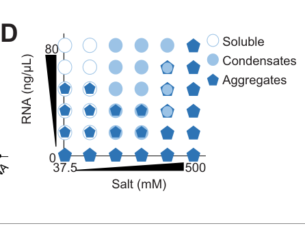

## Question

# Gene Research for Functional Annotation

## ⚠️ CRITICAL: Gene/Protein Identification Context

**BEFORE YOU BEGIN RESEARCH:** You MUST verify you are researching the CORRECT gene/protein. Gene symbols can be ambiguous, especially for less well-characterized genes from non-model organisms.

### Target Gene/Protein Identity (from UniProt):
- **UniProt Accession:** Q9TXM1
- **Protein Description:** SubName: Full=Uncharacterized protein {ECO:0000313|EMBL:CCD71642.1};
- **Gene Information:** Name=meg-3 {ECO:0000313|EMBL:CCD71642.1, ECO:0000313|WormBase:F52D2.4}; Synonyms=gei-12 {ECO:0000313|WormBase:F52D2.4}; ORFNames=CELE_F52D2.4 {ECO:0000313|EMBL:CCD71642.1}, F52D2.4 {ECO:0000313|WormBase:F52D2.4};
- **Organism (full):** Caenorhabditis elegans.
- **Protein Family:** Not specified in UniProt
- **Key Domains:** Not specified in UniProt

### MANDATORY VERIFICATION STEPS:

1. **Check if the gene symbol "meg-3" matches the protein description above**
2. **Verify the organism is correct:** Caenorhabditis elegans.
3. **Check if protein family/domains align with what you find in literature**
4. **If you find literature for a DIFFERENT gene with the same or similar symbol, STOP**

### If Gene Symbol is Ambiguous or You Cannot Find Relevant Literature:

**DO NOT PROCEED WITH RESEARCH ON A DIFFERENT GENE.** Instead:
- State clearly: "The gene symbol 'meg-3' is ambiguous or literature is limited for this specific protein"
- Explain what you found (e.g., "Found extensive literature on a different gene with the same symbol in a different organism")
- Describe the protein based ONLY on the UniProt information provided above
- Suggest that the protein function can be inferred from domain/family information

### Research Target:

Please provide a comprehensive research report on the gene **meg-3** (gene ID: meg-3, UniProt: Q9TXM1) in worm.

The research report should be a detailed narrative explaining the function, biological processes, and localization of the gene product. Citations should be given for all claims.

You should prioritize authoritative reviews and primary scientific literature when conducting research. You can supplement
this with annotations you find in gene/protein databases, but these can be outdated or inaccurate.

We are specifically interested in the primary function of the gene - for enzymes, what reaction is catalyzed, and what is the substrate specificity? For transporters, what is the substrate? For structural proteins or adapters, what is the broader structural role? For signaling molecules, what is the role in the pathway.

We are interested in where in or outside the cell the gene product carries out its function.

We are also interested in the signaling or biochemical pathways in which the gene functions. We are less interested in broad pleiotropic effects, except where these elucidate the precise role.

Include evidence where possible. We are interested in both experimental evidence as well as inference from structure, evolution, or bioinformatic analysis. Precise studies should be prioritized over high-throughput, where available.

## Output

Question: You are an expert researcher providing comprehensive, well-cited information.

Provide detailed information focusing on:
1. Key concepts and definitions with current understanding
2. Recent developments and latest research (prioritize 2023-2024 sources)
3. Current applications and real-world implementations
4. Expert opinions and analysis from authoritative sources
5. Relevant statistics and data from recent studies

Format as a comprehensive research report with proper citations. Include URLs and publication dates where available.
Always prioritize recent, authoritative sources and provide specific citations for all major claims.

# Gene Research for Functional Annotation

## ⚠️ CRITICAL: Gene/Protein Identification Context

**BEFORE YOU BEGIN RESEARCH:** You MUST verify you are researching the CORRECT gene/protein. Gene symbols can be ambiguous, especially for less well-characterized genes from non-model organisms.

### Target Gene/Protein Identity (from UniProt):
- **UniProt Accession:** Q9TXM1
- **Protein Description:** SubName: Full=Uncharacterized protein {ECO:0000313|EMBL:CCD71642.1};
- **Gene Information:** Name=meg-3 {ECO:0000313|EMBL:CCD71642.1, ECO:0000313|WormBase:F52D2.4}; Synonyms=gei-12 {ECO:0000313|WormBase:F52D2.4}; ORFNames=CELE_F52D2.4 {ECO:0000313|EMBL:CCD71642.1}, F52D2.4 {ECO:0000313|WormBase:F52D2.4};
- **Organism (full):** Caenorhabditis elegans.
- **Protein Family:** Not specified in UniProt
- **Key Domains:** Not specified in UniProt

### MANDATORY VERIFICATION STEPS:

1. **Check if the gene symbol "meg-3" matches the protein description above**
2. **Verify the organism is correct:** Caenorhabditis elegans.
3. **Check if protein family/domains align with what you find in literature**
4. **If you find literature for a DIFFERENT gene with the same or similar symbol, STOP**

### If Gene Symbol is Ambiguous or You Cannot Find Relevant Literature:

**DO NOT PROCEED WITH RESEARCH ON A DIFFERENT GENE.** Instead:
- State clearly: "The gene symbol 'meg-3' is ambiguous or literature is limited for this specific protein"
- Explain what you found (e.g., "Found extensive literature on a different gene with the same symbol in a different organism")
- Describe the protein based ONLY on the UniProt information provided above
- Suggest that the protein function can be inferred from domain/family information

### Research Target:

Please provide a comprehensive research report on the gene **meg-3** (gene ID: meg-3, UniProt: Q9TXM1) in worm.

The research report should be a detailed narrative explaining the function, biological processes, and localization of the gene product. Citations should be given for all claims.

You should prioritize authoritative reviews and primary scientific literature when conducting research. You can supplement
this with annotations you find in gene/protein databases, but these can be outdated or inaccurate.

We are specifically interested in the primary function of the gene - for enzymes, what reaction is catalyzed, and what is the substrate specificity? For transporters, what is the substrate? For structural proteins or adapters, what is the broader structural role? For signaling molecules, what is the role in the pathway.

We are interested in where in or outside the cell the gene product carries out its function.

We are also interested in the signaling or biochemical pathways in which the gene functions. We are less interested in broad pleiotropic effects, except where these elucidate the precise role.

Include evidence where possible. We are interested in both experimental evidence as well as inference from structure, evolution, or bioinformatic analysis. Precise studies should be prioritized over high-throughput, where available.

## Research report: Functional annotation of *C. elegans* **meg-3** (UniProt Q9TXM1; ORF F52D2.4; synonym gei-12)

### 1) Gene/protein identity verification (critical disambiguation)
Primary literature explicitly links **meg-3** to **F52D2.4** and **UniProt Q9TXM1**, and characterizes the gene product as a maternal germ-plasm/P-granule component rather than an enzyme or transporter (Schmidt et al., 2021, eLife; URL https://doi.org/10.7554/eLife.63698) (schmidt2021proteinbasedcondensationmechanisms pages 1-2). All claims below refer to this *C. elegans* MEG-3 protein.

### 2) Key concepts and definitions (current understanding)
**P granules** are germline ribonucleoprotein (RNP) condensates in early embryos and the germline that behave as biomolecular condensates assembled by phase-separation-like mechanisms. In embryos, P granules exhibit a multi-phase architecture in which MEG-3 contributes a distinct material phase that surrounds and interpenetrates PGL-rich regions (wang2014regulationofrna pages 11-13, lee2020recruitmentofmrnas pages 1-2).

**MEG-3’s primary biochemical function** is best described as an **RNA-condensate scaffold**: an intrinsically disordered protein (IDP) that binds RNA broadly and uses RNA-stimulated condensation to spatially organize germ-plasm RNP condensates (smith2016spatialpatterningof pages 2-3, lee2020recruitmentofmrnas pages 1-2).

### 3) Molecular function, localization, and mechanism
#### 3.1 Subcellular localization and condensate architecture
In embryos, MEG-3 is maternally supplied and forms an **anterior-low/posterior-high cytoplasmic gradient**; within granules it occupies a **peri-granular domain** that surrounds and penetrates granules rather than simply overlapping with the PGL core (Wang et al., 2014, eLife; publication date Dec 2014; URL https://doi.org/10.7554/eLife.04591) (wang2014regulationofrna pages 11-13, wang2014regulationofrna pages 1-2). Quantitatively, in **34/37 granules** examined, the GFP::MEG-3 domain extended over a larger area than mCherry::PGL-3 (wang2014regulationofrna pages 11-13).

Embryonic P granules can be described as at least two coupled phases:
- a **MEG phase** (gel-like, RNA-rich; relatively non-dynamic), and
- a **PGL phase** (more dynamic, liquid-like) (lee2020recruitmentofmrnas pages 1-2, schmidt2021proteinbasedcondensationmechanisms pages 1-2).

#### 3.2 RNA binding (“substrate”) and specificity
MEG-3 shows **broad, largely sequence-independent RNA binding** in vivo, with iCLIP identifying binding to approximately **~500 mRNAs**; bound transcripts are enriched for **long embryonic mRNAs with low ribosome occupancy** (Lee et al., 2020, eLife; publication date Jan 2020; URL https://doi.org/10.7554/eLife.52896) (lee2020recruitmentofmrnas pages 1-2, lee2020recruitmentofmrnas pages 9-10).

In vitro, recombinant MEG-3 condenses with added RNA under defined conditions (e.g., **500 nM** MEG-3 with **20 ng/mL** transcript in **150 mM** salt), generating assemblies with radii **<400 nm**, while RNA alone does not form condensates even at higher RNA concentration (lee2020recruitmentofmrnas pages 9-10). Figure evidence supporting the in vitro condensation/phase behavior is shown in Lee et al. (2020) Figure 4 panels (lee2020recruitmentofmrnas media 4c2d7270, lee2020recruitmentofmrnas media 5a997949, lee2020recruitmentofmrnas media a12afdd6).

#### 3.3 Phase separation/condensation mechanism and spatial patterning
A central mechanistic model is that **P-granule asymmetry** in the polarized zygote depends on **RNA-induced phase separation/condensation of MEG-3**, which acts upstream of stable PGL/GLH granule retention (Smith et al., 2016, eLife; publication date Sep 2016; URL https://doi.org/10.1101/073908) (smith2016spatialpatterningof pages 2-3). Accessible RNA is limiting for MEG-3 condensation in vivo and in vitro, and blocking mRNA turnover can stimulate MEG-3 coalescence into macroscopic granules (smith2016spatialpatterningof pages 11-12).

### 4) Domain/structure-function insights and key interactors
#### 4.1 Modular protein organization
MEG-3 is described as modular with:
- an **N-terminal intrinsically disordered region (IDR)** that binds RNA, and
- a **C-terminal predicted ordered HMG-like motif (HMGL)** that contributes to condensation and **mediates binding to PGL-3** (Schmidt et al., 2021; URL https://doi.org/10.7554/eLife.63698) (schmidt2021proteinbasedcondensationmechanisms pages 1-2).

#### 4.2 Interactors and assembly network
Key experimentally supported interaction/assembly relationships include:
- **PGL proteins (PGL-1/PGL-3):** MEG-3 associates with PGL condensates; HMGL-mediated interaction with **PGL-3** is required for co-assembly into the composite granule; HMGL mutations cause MEG-3 and PGL-3 to form separate condensates that fail to co-segregate and fail to recruit RNA effectively (schmidt2021proteinbasedcondensationmechanisms pages 1-2).
- **MEX-5:** an anterior-enriched RNA-binding protein that suppresses MEG-3 condensation by limiting MEG-3’s access to RNA; MEX-5 RNA-binding activity is sufficient to inhibit RNA-induced MEG-3 phase separation in vitro and MEG-3 granule assembly in vivo (smith2016spatialpatterningof pages 11-12, smith2016spatialpatterningof pages 2-3).
- **MIP-1/MIP-2 (LOTUS-domain proteins):** identified as MEG-3-interacting organizational hubs required for proper coalescence of multiple P-granule components and supporting distinct embryonic vs later perinuclear assembly pathways (Cipriani et al., 2021, eLife; publication date Jul 2021; URL https://doi.org/10.7554/eLife.60833) (cipriani2021novellotusdomainproteins pages 20-21).

### 5) Regulation and pathways
#### 5.1 Post-translational regulation by phosphorylation
MEG-3 is serine-rich (reported **119 serines**) and its charge properties are proposed to be tuned by phosphorylation (wang2014regulationofrna pages 15-16). MEG-3 is an experimentally identified substrate of the DYRK-family kinase **MBK-2**, and is also regulated by **PP2A phosphatase activity (PPTR-1/2-associated)**. Functionally, **MBK-2 phosphorylation promotes granule disassembly**, whereas **PP2A/PPTR antagonizes MBK-2 and promotes assembly** (Wang et al., 2014; URL https://doi.org/10.7554/eLife.04591) (wang2014regulationofrna pages 1-2, wang2014regulationofrna pages 15-16).

#### 5.2 Spatial control via RNA availability (MEX-5 axis)
In the zygote, MEG-3 condensation is spatially patterned by gradients in RNA availability: **MEX-5** acts as an mRNA sink that suppresses MEG-3 condensation in the anterior, consistent with a mechanism in which MEG-3 condensation is activated where “MEX-5-free” RNA is available (smith2016spatialpatterningof pages 2-3, smith2016spatialpatterningof pages 11-12).

### 6) Phenotypes and quantitative genetic evidence
MEG proteins contribute redundantly to fertility and germ plasm function.
- Reported sterility penetrance examples include **~30% sterility** in **meg-3 meg-4** mutants, **~4% sterility** in **meg-1** mutants, and **100% sterility** in a **meg-1 meg-3 meg-4** triple mutant (Wang et al., 2014; Dec 2014; URL https://doi.org/10.7554/eLife.04591) (wang2014regulationofrna pages 15-16). 
- In sensitized backgrounds affecting germline regulators, combining meg-3 meg-4 with other perturbations increases sterility (e.g., an example of **46 ± 15% sterile progeny** is reported for a specific genetic combination in Lee et al., 2020) (lee2020recruitmentofmrnas pages 9-10).

### 7) Recent developments (prioritizing 2023–2024)
Direct 2023–2024 mechanistic work focused specifically on MEG-3 biophysics is limited in the retrieved corpus; however, **recent high-impact studies leverage MEG-3 network components or meg gene perturbations to connect germ-granule organization to organismal physiology**.

#### 7.1 2023: Germ granules impact both germline and somatic programs via perinuclear organization
Price et al. (Nature Communications; publication date Sep 2023; URL https://doi.org/10.1038/s41467-023-41556-4) analyzed perinuclear germ granule organization using **EGGD-1/MIP-1**, a protein previously identified as MEG-3-interacting and important for granule organization. Loss of eggd-1 caused dramatic reorganization of germ granules, including changes in PGL-1 granule volumes at specific subcellular locations (e.g., **2.64-fold decrease** at the nuclear membrane; and formation of very large foci up to **25 µm³**) and triggered somatic nuclear accumulation of **HLH-30**, interpreted as germ-granule-to-soma communication (price2023c.elegansgerm pages 1-2).

#### 7.2 2024: Germline-to-soma signaling and aging—meg genes as cytoplasmic P-granule factors
Zhou et al. (Nature Communications; publication date Oct 2024; URL https://doi.org/10.1038/s41467-024-53064-0) described a germline-to-soma signal that modulates age-related decline in somatic mitochondrial stress response (UPRmt). The authors note that **meg-1/meg-3/meg-4** are required for **cytoplasmic but not perinuclear P granule formation**, and report that RNAi against **meg-1, meg-3, or meg-4** did not block embryo-lysate-induced UPRmt activation in adults, suggesting that this particular signaling phenomenon can proceed without these cytoplasmic P-granule factors (zhou2024agermlinetosomasignal pages 1-2).

### 8) Current applications and real-world implementations
MEG-3 is widely used as a **model system component** for:
- **Mechanistic dissection of biomolecular condensates in vivo and in vitro**, because it provides a genetically tractable scaffold whose condensation can be reconstituted with RNA and regulated by phosphorylation and RNA availability (smith2016spatialpatterningof pages 2-3, wang2014regulationofrna pages 1-2, lee2020recruitmentofmrnas pages 9-10).
- **Experimental platforms for structure–function studies** of multi-phase condensates (e.g., separating RNA-binding IDRs from “client recruitment” interfaces such as HMGL-PGL binding) (schmidt2021proteinbasedcondensationmechanisms pages 1-2).
- **Small-RNA and epigenetic inheritance studies**, leveraging meg-3/4 perturbations that disrupt embryonic P granule assembly and alter small-RNA-mediated gene regulation over generations (ouyang2019pgranulesprotect pages 1-3, lee2020recruitmentofmrnas pages 14-15).

### 9) Expert interpretation and synthesis (authoritative analyses anchored in primary data)
Across multiple independent studies, the best-supported annotation is that **MEG-3 is a regulated, intrinsically disordered RNA-condensing scaffold that nucleates/stabilizes germline P granules and promotes selective partitioning (enrichment) of maternal mRNAs into the germ lineage**. Its function emerges from (i) RNA-stimulated condensation, (ii) physical coupling to PGL condensates, and (iii) regulation by phosphorylation and RNA availability gradients (smith2016spatialpatterningof pages 2-3, schmidt2021proteinbasedcondensationmechanisms pages 1-2, wang2014regulationofrna pages 1-2, smith2016spatialpatterningof pages 11-12).

### 10) Evidence-linked statistics and data highlights (from recent and foundational studies)
- **Serine content and charge properties:** MEG-3 contains **119 serines** and is described as strongly basic when unphosphorylated (predicted pI reported) (wang2014regulationofrna pages 15-16).
- **Imaging quantification:** GFP::MEG-3 extends beyond PGL core in **34/37** analyzed granules (wang2014regulationofrna pages 11-13).
- **RNA binding scale:** MEG-3 binds **~500 mRNAs** in vivo (lee2020recruitmentofmrnas pages 1-2).
- **In vitro condensate size:** MEG-3 + RNA assemblies have radii **<400 nm** under defined assay conditions, supported by figure panels (lee2020recruitmentofmrnas pages 9-10, lee2020recruitmentofmrnas media 4c2d7270).
- **Fertility outcomes:** **~30% sterility** in meg-3 meg-4; **100% sterility** in meg-1 meg-3 meg-4 triple mutant (wang2014regulationofrna pages 15-16, lee2020recruitmentofmrnas pages 9-10).
- **2023 quantitative granule morphology changes (MEG-3 network component):** eggd-1 mutant perinuclear PGL-1 granule volume decreased **2.64-fold** and aggregates could reach **25 µm³** (price2023c.elegansgerm pages 1-2).

---

### Summary table (evidence map)
| Topic | Key findings | Key sources | URL/DOI | Notes/quantitative data |
|---|---|---|---|---|
| Identity | **MEG-3** is the **C. elegans** germline protein encoded by **meg-3 / F52D2.4 / gei-12**, matching UniProt **Q9TXM1**. It is a maternal-effect germline defective (MEG) protein required, with paralogs, for embryonic germ plasm/P-granule organization rather than a classical enzyme or transporter (schmidt2021proteinbasedcondensationmechanisms pages 1-2, wang2014regulationofrna pages 15-16). | Wang 2014, *eLife*; Schmidt 2021, *eLife* | https://doi.org/10.7554/eLife.04591 ; https://doi.org/10.7554/eLife.63698 | Gene identity explicitly linked to **meg-3; F52D2.4; UniProt Q9TXM1** in Schmidt 2021 (schmidt2021proteinbasedcondensationmechanisms pages 1-2). |
| Molecular features | MEG-3 is a **serine-rich intrinsically disordered protein (IDP)** with strong predicted basicity and RNA-binding propensity. Later work showed it is **modular**, with an **N-terminal IDR** for RNA binding and a **C-terminal HMG-like (HMGL) motif** that promotes condensation and binding to PGL-3 (wang2014regulationofrna pages 15-16, schmidt2021proteinbasedcondensationmechanisms pages 1-2). | Wang 2014, *eLife*; Schmidt 2021, *eLife* | https://doi.org/10.7554/eLife.04591 ; https://doi.org/10.7554/eLife.63698 | Reported features include **119 serines** and predicted unphosphorylated **pI 9.74** in Wang 2014; Lee 2020 reports predicted **pI 9.3** for recombinant/assayed MEG-3 context (wang2014regulationofrna pages 15-16, lee2020recruitmentofmrnas pages 9-10). |
| Localization | In embryos, MEG-3 localizes to the **germ plasm/P granules**, forming an **anterior-low/posterior-high gradient** and occupying a **peri-granular domain** that surrounds and penetrates P granules rather than perfectly overlapping with PGL cores (wang2014regulationofrna pages 11-13, wang2014regulationofrna pages 1-2). It is absent from adult **perinuclear** P granules, indicating stage-specific roles in embryonic cytoplasmic granules (wang2014regulationofrna pages 11-13). | Wang 2014, *eLife*; Smith 2016, *eLife* | https://doi.org/10.7554/eLife.04591 ; https://doi.org/10.1101/073908 | In **34/37** analyzed granules, GFP::MEG-3 extended over a larger area than mCherry::PGL-3 (wang2014regulationofrna pages 11-13). Cytoplasmic granules in polarized zygotes are typically about **~1 µm** (smith2016spatialpatterningof pages 2-3). |
| Molecular function | MEG-3 acts as a **P-granule scaffold**: it binds RNA, undergoes **RNA-stimulated phase separation**, and promotes localized assembly of posterior embryonic P granules. It also recruits maternal mRNAs into granules by forming a **gel-like RNA-rich phase** on the surface of more dynamic PGL condensates (smith2016spatialpatterningof pages 2-3, lee2020recruitmentofmrnas pages 1-2). | Smith 2016, *eLife*; Lee 2020, *eLife* | https://doi.org/10.1101/073908 ; https://doi.org/10.7554/eLife.52896 | MEG-3 condensates are **small/non-dynamic** and associate with larger PGL liquid condensates; in vivo size threshold described as **<500 nm** for MEG-3 versus **>500 nm** for PGL condensates (lee2020recruitmentofmrnas pages 1-2). |
| RNA binding / substrate specificity | MEG-3 is not sequence-specific like a canonical RBP; instead it binds RNA broadly and condenses with many maternal transcripts, favoring **long embryonic mRNAs with low ribosome occupancy**. iCLIP identified binding to **~500 mRNAs** in vivo, supporting a broad RNA-condensation role rather than catalytic specificity (lee2020recruitmentofmrnas pages 1-2, lee2020recruitmentofmrnas pages 9-10). | Lee 2020, *eLife*; Schmidt 2021, *eLife* | https://doi.org/10.7554/eLife.52896 ; https://doi.org/10.7554/eLife.63698 | Recombinant MEG-3 at **500 nM** condensed with transcripts at **20 ng/mL** in **150 mM salt**; resulting assemblies had radii **<400 nm**; RNA alone did not condense even at **80 ng/mL** (lee2020recruitmentofmrnas pages 9-10, lee2020recruitmentofmrnas media 4c2d7270). |
| Regulation | MEG-3 assembly is regulated by **phosphorylation state** and by local RNA availability. **MBK-2/DYRK** phosphorylation promotes granule disassembly, whereas **PP2A/PPTR-1/2** antagonizes this and promotes assembly; **MEX-5** suppresses MEG-3 phase separation by limiting access to RNA, especially in the anterior cytoplasm (wang2014regulationofrna pages 15-16, smith2016spatialpatterningof pages 11-12, wang2014regulationofrna pages 1-2). | Wang 2014, *eLife*; Smith 2016, *eLife* | https://doi.org/10.7554/eLife.04591 ; https://doi.org/10.1101/073908 | MBK-2 and PP2A define an assembly/disassembly switch. MEX-5 RNA-binding activity is necessary/sufficient to inhibit MEG-3 condensation in vitro/in vivo (smith2016spatialpatterningof pages 11-12). |
| Interactors / condensate architecture | MEG-3 interacts functionally and/or directly with **PGL-1/PGL-3**, helps recruit **GLH proteins**, and later was shown to interact with/act alongside **MIP-1/MIP-2 (EGGD proteins)** in granule organization. The **HMGL motif** mediates binding to **PGL-3** and is needed for co-assembly of MEG and PGL phases (schmidt2021proteinbasedcondensationmechanisms pages 1-2, smith2016spatialpatterningof pages 11-12, cipriani2021novellotusdomainproteins pages 20-21). | Schmidt 2021, *eLife*; Smith 2016, *eLife*; Cipriani 2021, *eLife* | https://doi.org/10.7554/eLife.63698 ; https://doi.org/10.1101/073908 ; https://doi.org/10.7554/eLife.60833 | HMGL mutants cause **MEG-3 and PGL-3 to separate into distinct condensates** that fail to co-segregate and recruit RNA properly (schmidt2021proteinbasedcondensationmechanisms pages 1-2). |
| Granule material properties | MEG-3 forms a **gel-like**, relatively non-dynamic shell/surface phase that stabilizes more labile liquid PGL droplets. This two-phase architecture explains how P granules can be simultaneously dynamic at long range yet locally stable in the posterior embryo (schmidt2021proteinbasedcondensationmechanisms pages 1-2, lee2020recruitmentofmrnas pages 1-2). | Lee 2020, *eLife*; Schmidt 2021, *eLife* | https://doi.org/10.7554/eLife.52896 ; https://doi.org/10.7554/eLife.63698 | MEG-3 condensates resist dilution/salt more than liquid PGL condensates; this supports a **gel + liquid** composite model (schmidt2021proteinbasedcondensationmechanisms pages 1-2, lee2020recruitmentofmrnas pages 1-2). |
| Developmental/segregation role | MEG-3/4 act **upstream** of PGL components in zygotes: they are needed for stable, asymmetric posterior P-granule assembly and for segregation of granule contents into germline blastomeres. Without MEG-3/4, PGL/GLH assemblies are transient or non-asymmetric and mRNAs are not properly enriched in the germ lineage (smith2016spatialpatterningof pages 2-3, lee2020recruitmentofmrnas pages 9-10). | Smith 2016, *eLife*; Lee 2020, *eLife* | https://doi.org/10.1101/073908 ; https://doi.org/10.7554/eLife.52896 | P-granule incorporation can enrich RNAs in **P4 by as much as ~5-fold** according to later discussion of the Lee/Ouyang framework (lee2020recruitmentofmrnas pages 14-15). |
| Phenotypes | Loss of MEG proteins causes fertility defects that become more severe in combinations. **meg-3 meg-4** mutants show **~30% sterility**; **meg-1** single mutants are **~4% sterile**; the **meg-1 meg-3 meg-4** triple mutant is **100% sterile**, indicating overlapping but essential germ plasm functions beyond visible granules (wang2014regulationofrna pages 15-16, lee2020recruitmentofmrnas pages 9-10). | Wang 2014, *eLife*; Lee 2020, *eLife* | https://doi.org/10.7554/eLife.04591 ; https://doi.org/10.7554/eLife.52896 | Synthetic germline defects increase when meg-3/4 is combined with other germline regulators; one example reported **46 ± 15% sterile progeny** in a sensitized background (lee2020recruitmentofmrnas pages 9-10). |
| Small RNA homeostasis / piRNA protection | Embryonic P granules assembled by MEG-3/4 protect some endogenous RNAi genes from runaway silencing. In **meg-3 meg-4** mutants, P granules fail in primordial germ cells, transcripts such as **rde-11** and **sid-1** become hyper-targeted by secondary small RNAs, and animals progressively lose RNAi competence over generations; this supports a **“safe harbor”** model for P granules (ouyang2019pgranulesprotect pages 1-3). | Ouyang 2019, *bioRxiv* | https://doi.org/10.1101/707562 | Example phenotype: after **pos-1(RNAi)**, viable embryos were reported as **6.5% vs 76%** in the compared conditions cited by the study summary (ouyang2019pgranulesprotect pages 1-3). |
| 2023: germ granule organization and soma communication | While focused on **EGGD-1/MIP-1**, Price 2023 is relevant because MIP-1 is a MEG-3-interacting organizer of perinuclear germ granules. Disrupting this network caused major granule mislocalization and activated a somatic **HLH-30** transcriptional response, linking germ granule organization to **germline-to-soma communication** (price2023c.elegansgerm pages 1-2). | Price 2023, *Nature Communications* | https://doi.org/10.1038/s41467-023-41556-4 | Quantitative effects in **eggd-1** mutants: perinuclear PGL-1::RFP granules decreased **2.64-fold** (**0.482 → 0.183 µm³**), rachis granules increased to **0.947 µm³**, and some aggregates reached **25 µm³** (price2023c.elegansgerm pages 1-2). |
| 2024: aging/stress-signaling links | Zhou 2024 connected germline piRNA-state changes to an age-related decline in somatic **UPRmt** and noted that **meg-1/3/4** are required for **cytoplasmic but not perinuclear** P granules. In that assay, knockdown of **meg-1, meg-3, or meg-4** did **not** block embryo-lysate-induced UPRmt activation, suggesting MEG-dependent embryonic cytoplasmic granules are not the sole route for this germline-to-soma signaling axis (zhou2024agermlinetosomasignal pages 1-2). | Zhou 2024, *Nature Communications* | https://doi.org/10.1038/s41467-024-53064-0 | The same study implicated **prg-1, prde-1, drh-3, hrde-1, hpl-2, sid-1** in the signaling pathway; no explicit numeric values were present in the extracted text (zhou2024agermlinetosomasignal pages 1-2). |
| Expert synthesis / current understanding | The current model is that MEG-3 is a **developmental condensate scaffold**: its IDR binds RNA, its HMGL region links to PGL condensates, and regulated gel-like assembly locally stabilizes posterior embryonic P granules while enriching maternal RNAs and influencing later small-RNA homeostasis. Expert analyses emphasize that MEG-3-driven **RNA condensation**, not enzymatic catalysis, is its primary biochemical role (schmidt2021proteinbasedcondensationmechanisms pages 1-2, lee2020recruitmentofmrnas pages 14-15, cipriani2021novellotusdomainproteins pages 20-21). | Schmidt 2021, *eLife*; Lee 2020, *eLife*; Cipriani 2021, *eLife* | https://doi.org/10.7554/eLife.63698 ; https://doi.org/10.7554/eLife.52896 ; https://doi.org/10.7554/eLife.60833 | MEG-3 is best annotated as an **RNA-condensate scaffold/regulator of embryonic germ granule assembly and mRNA partitioning** rather than as an enzyme or transporter (schmidt2021proteinbasedcondensationmechanisms pages 1-2, lee2020recruitmentofmrnas pages 14-15). |

*Table: This table summarizes the experimentally supported identity, molecular properties, localization, function, regulation, phenotypes, and recent systems-level links of C. elegans MEG-3. It is useful as a compact evidence-based annotation centered on primary literature and recent high-quality studies.*

### Figure evidence (in vitro MEG-3 condensation with RNA)
Lee et al. (2020) Figure 4 panels illustrating MEG-3 condensation behavior and quantitative phase/condensate classification are available here: (lee2020recruitmentofmrnas media 4c2d7270, lee2020recruitmentofmrnas media 5a997949, lee2020recruitmentofmrnas media a12afdd6).

References

1. (schmidt2021proteinbasedcondensationmechanisms pages 1-2): Helen Schmidt, Andrea Putnam, Dominique Rasoloson, and Geraldine Seydoux. Protein-based condensation mechanisms drive the assembly of rna-rich p granules. eLife, Jun 2021. URL: https://doi.org/10.7554/elife.63698, doi:10.7554/elife.63698. This article has 31 citations and is from a domain leading peer-reviewed journal.

2. (wang2014regulationofrna pages 11-13): Jennifer T Wang, Jarrett Smith, Bi-Chang Chen, Helen Schmidt, Dominique Rasoloson, Alexandre Paix, Bramwell G Lambrus, Deepika Calidas, Eric Betzig, and Geraldine Seydoux. Regulation of rna granule dynamics by phosphorylation of serine-rich, intrinsically disordered proteins in c. elegans. eLife, Dec 2014. URL: https://doi.org/10.7554/elife.04591, doi:10.7554/elife.04591. This article has 438 citations and is from a domain leading peer-reviewed journal.

3. (lee2020recruitmentofmrnas pages 1-2): Chih-Yung S Lee, Andrea Putnam, Tu Lu, ShuaiXin He, John Paul T Ouyang, and Geraldine Seydoux. Recruitment of mrnas to p granules by condensation with intrinsically-disordered proteins. eLife, Jan 2020. URL: https://doi.org/10.7554/elife.52896, doi:10.7554/elife.52896. This article has 149 citations and is from a domain leading peer-reviewed journal.

4. (smith2016spatialpatterningof pages 2-3): Jarrett Smith, Deepika Calidas, Helen Schmidt, Tu Lu, Dominique Rasoloson, and Geraldine Seydoux. Spatial patterning of p granules by rna-induced phase separation of the intrinsically-disordered protein meg-3. eLife, Sep 2016. URL: https://doi.org/10.1101/073908, doi:10.1101/073908. This article has 267 citations and is from a domain leading peer-reviewed journal.

5. (wang2014regulationofrna pages 1-2): Jennifer T Wang, Jarrett Smith, Bi-Chang Chen, Helen Schmidt, Dominique Rasoloson, Alexandre Paix, Bramwell G Lambrus, Deepika Calidas, Eric Betzig, and Geraldine Seydoux. Regulation of rna granule dynamics by phosphorylation of serine-rich, intrinsically disordered proteins in c. elegans. eLife, Dec 2014. URL: https://doi.org/10.7554/elife.04591, doi:10.7554/elife.04591. This article has 438 citations and is from a domain leading peer-reviewed journal.

6. (lee2020recruitmentofmrnas pages 9-10): Chih-Yung S Lee, Andrea Putnam, Tu Lu, ShuaiXin He, John Paul T Ouyang, and Geraldine Seydoux. Recruitment of mrnas to p granules by condensation with intrinsically-disordered proteins. eLife, Jan 2020. URL: https://doi.org/10.7554/elife.52896, doi:10.7554/elife.52896. This article has 149 citations and is from a domain leading peer-reviewed journal.

7. (lee2020recruitmentofmrnas media 4c2d7270): Chih-Yung S Lee, Andrea Putnam, Tu Lu, ShuaiXin He, John Paul T Ouyang, and Geraldine Seydoux. Recruitment of mrnas to p granules by condensation with intrinsically-disordered proteins. eLife, Jan 2020. URL: https://doi.org/10.7554/elife.52896, doi:10.7554/elife.52896. This article has 149 citations and is from a domain leading peer-reviewed journal.

8. (lee2020recruitmentofmrnas media 5a997949): Chih-Yung S Lee, Andrea Putnam, Tu Lu, ShuaiXin He, John Paul T Ouyang, and Geraldine Seydoux. Recruitment of mrnas to p granules by condensation with intrinsically-disordered proteins. eLife, Jan 2020. URL: https://doi.org/10.7554/elife.52896, doi:10.7554/elife.52896. This article has 149 citations and is from a domain leading peer-reviewed journal.

9. (lee2020recruitmentofmrnas media a12afdd6): Chih-Yung S Lee, Andrea Putnam, Tu Lu, ShuaiXin He, John Paul T Ouyang, and Geraldine Seydoux. Recruitment of mrnas to p granules by condensation with intrinsically-disordered proteins. eLife, Jan 2020. URL: https://doi.org/10.7554/elife.52896, doi:10.7554/elife.52896. This article has 149 citations and is from a domain leading peer-reviewed journal.

10. (smith2016spatialpatterningof pages 11-12): Jarrett Smith, Deepika Calidas, Helen Schmidt, Tu Lu, Dominique Rasoloson, and Geraldine Seydoux. Spatial patterning of p granules by rna-induced phase separation of the intrinsically-disordered protein meg-3. eLife, Sep 2016. URL: https://doi.org/10.1101/073908, doi:10.1101/073908. This article has 267 citations and is from a domain leading peer-reviewed journal.

11. (cipriani2021novellotusdomainproteins pages 20-21): Patricia Giselle Cipriani, Olivia Bay, John Zinno, Michelle Gutwein, Hin Hark Gan, Vinay K Mayya, George Chung, Jia-Xuan Chen, Hala Fahs, Yu Guan, Thomas F Duchaine, Matthias Selbach, Fabio Piano, and Kristin C Gunsalus. Novel lotus-domain proteins are organizational hubs that recruit c. elegans vasa to germ granules. eLife, Jul 2021. URL: https://doi.org/10.7554/elife.60833, doi:10.7554/elife.60833. This article has 32 citations and is from a domain leading peer-reviewed journal.

12. (wang2014regulationofrna pages 15-16): Jennifer T Wang, Jarrett Smith, Bi-Chang Chen, Helen Schmidt, Dominique Rasoloson, Alexandre Paix, Bramwell G Lambrus, Deepika Calidas, Eric Betzig, and Geraldine Seydoux. Regulation of rna granule dynamics by phosphorylation of serine-rich, intrinsically disordered proteins in c. elegans. eLife, Dec 2014. URL: https://doi.org/10.7554/elife.04591, doi:10.7554/elife.04591. This article has 438 citations and is from a domain leading peer-reviewed journal.

13. (price2023c.elegansgerm pages 1-2): Ian F. Price, Jillian A. Wagner, Benjamin Pastore, Hannah L. Hertz, and Wen Tang. C. elegans germ granules sculpt both germline and somatic rnaome. Nature Communications, Sep 2023. URL: https://doi.org/10.1038/s41467-023-41556-4, doi:10.1038/s41467-023-41556-4. This article has 31 citations and is from a highest quality peer-reviewed journal.

14. (zhou2024agermlinetosomasignal pages 1-2): Liankui Zhou, Liu Jiang, Lan Li, Chengchuan Ma, Peixue Xia, Wanqiu Ding, and Ying Liu. A germline-to-soma signal triggers an age-related decline of mitochondrial stress response. Nature Communications, Oct 2024. URL: https://doi.org/10.1038/s41467-024-53064-0, doi:10.1038/s41467-024-53064-0. This article has 15 citations and is from a highest quality peer-reviewed journal.

15. (ouyang2019pgranulesprotect pages 1-3): John Paul T. Ouyang, Andrew Folkmann, Lauren Bernard, Chih-Yung Lee, Uri Seroussi, Amanda G. Charlesworth, Julie M. Claycomb, and Geraldine Seydoux. P granules protect rna interference genes from silencing by pirnas. bioRxiv, Jul 2019. URL: https://doi.org/10.1101/707562, doi:10.1101/707562. This article has 111 citations.

16. (lee2020recruitmentofmrnas pages 14-15): Chih-Yung S Lee, Andrea Putnam, Tu Lu, ShuaiXin He, John Paul T Ouyang, and Geraldine Seydoux. Recruitment of mrnas to p granules by condensation with intrinsically-disordered proteins. eLife, Jan 2020. URL: https://doi.org/10.7554/elife.52896, doi:10.7554/elife.52896. This article has 149 citations and is from a domain leading peer-reviewed journal.

## Artifacts

- [Edison artifact artifact-00](meg-3-deep-research-falcon_artifacts/artifact-00.md)

## Citations

1. schmidt2021proteinbasedcondensationmechanisms pages 1-2
2. wang2014regulationofrna pages 11-13
3. lee2020recruitmentofmrnas pages 9-10
4. smith2016spatialpatterningof pages 2-3
5. smith2016spatialpatterningof pages 11-12
6. cipriani2021novellotusdomainproteins pages 20-21
7. wang2014regulationofrna pages 15-16
8. zhou2024agermlinetosomasignal pages 1-2
9. lee2020recruitmentofmrnas pages 1-2
10. lee2020recruitmentofmrnas pages 14-15
11. ouyang2019pgranulesprotect pages 1-3
12. wang2014regulationofrna pages 1-2
13. https://doi.org/10.7554/eLife.63698
14. https://doi.org/10.7554/eLife.04591
15. https://doi.org/10.7554/eLife.52896
16. https://doi.org/10.1101/073908
17. https://doi.org/10.7554/eLife.60833
18. https://doi.org/10.1038/s41467-023-41556-4
19. https://doi.org/10.1038/s41467-024-53064-0
20. https://doi.org/10.1101/707562
21. https://doi.org/10.7554/elife.63698,
22. https://doi.org/10.7554/elife.04591,
23. https://doi.org/10.7554/elife.52896,
24. https://doi.org/10.1101/073908,
25. https://doi.org/10.7554/elife.60833,
26. https://doi.org/10.1038/s41467-023-41556-4,
27. https://doi.org/10.1038/s41467-024-53064-0,
28. https://doi.org/10.1101/707562,