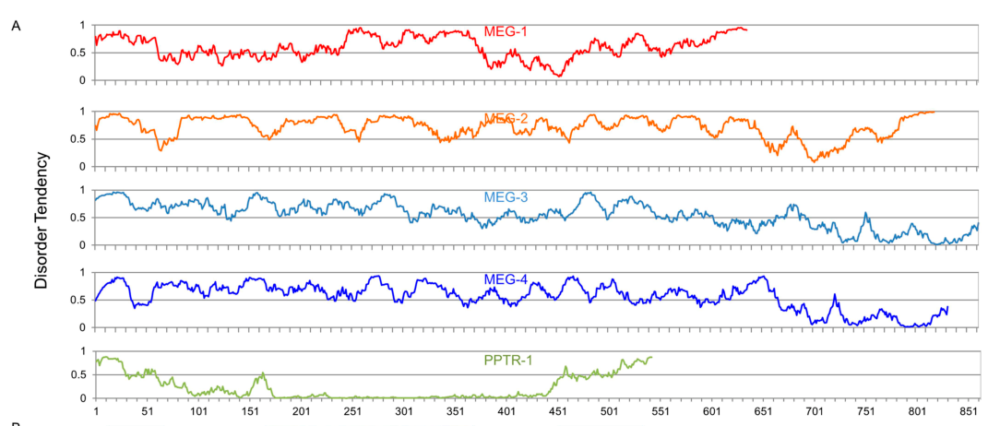

## Question

# Gene Research for Functional Annotation

## ⚠️ CRITICAL: Gene/Protein Identification Context

**BEFORE YOU BEGIN RESEARCH:** You MUST verify you are researching the CORRECT gene/protein. Gene symbols can be ambiguous, especially for less well-characterized genes from non-model organisms.

### Target Gene/Protein Identity (from UniProt):
- **UniProt Accession:** Q9TZK8
- **Protein Description:** SubName: Full=J domain-containing protein {ECO:0000313|EMBL:CCD66880.1};
- **Gene Information:** Name=meg-4 {ECO:0000313|EMBL:CCD66880.1, ECO:0000313|WormBase:C36C9.1}; ORFNames=C36C9.1 {ECO:0000313|WormBase:C36C9.1}, CELE_C36C9.1 {ECO:0000313|EMBL:CCD66880.1};
- **Organism (full):** Caenorhabditis elegans.
- **Protein Family:** Not specified in UniProt
- **Key Domains:** Not specified in UniProt

### MANDATORY VERIFICATION STEPS:

1. **Check if the gene symbol "meg-4" matches the protein description above**
2. **Verify the organism is correct:** Caenorhabditis elegans.
3. **Check if protein family/domains align with what you find in literature**
4. **If you find literature for a DIFFERENT gene with the same or similar symbol, STOP**

### If Gene Symbol is Ambiguous or You Cannot Find Relevant Literature:

**DO NOT PROCEED WITH RESEARCH ON A DIFFERENT GENE.** Instead:
- State clearly: "The gene symbol 'meg-4' is ambiguous or literature is limited for this specific protein"
- Explain what you found (e.g., "Found extensive literature on a different gene with the same symbol in a different organism")
- Describe the protein based ONLY on the UniProt information provided above
- Suggest that the protein function can be inferred from domain/family information

### Research Target:

Please provide a comprehensive research report on the gene **meg-4** (gene ID: meg-4, UniProt: Q9TZK8) in worm.

The research report should be a detailed narrative explaining the function, biological processes, and localization of the gene product. Citations should be given for all claims.

You should prioritize authoritative reviews and primary scientific literature when conducting research. You can supplement
this with annotations you find in gene/protein databases, but these can be outdated or inaccurate.

We are specifically interested in the primary function of the gene - for enzymes, what reaction is catalyzed, and what is the substrate specificity? For transporters, what is the substrate? For structural proteins or adapters, what is the broader structural role? For signaling molecules, what is the role in the pathway.

We are interested in where in or outside the cell the gene product carries out its function.

We are also interested in the signaling or biochemical pathways in which the gene functions. We are less interested in broad pleiotropic effects, except where these elucidate the precise role.

Include evidence where possible. We are interested in both experimental evidence as well as inference from structure, evolution, or bioinformatic analysis. Precise studies should be prioritized over high-throughput, where available.

## Output

Question: You are an expert researcher providing comprehensive, well-cited information.

Provide detailed information focusing on:
1. Key concepts and definitions with current understanding
2. Recent developments and latest research (prioritize 2023-2024 sources)
3. Current applications and real-world implementations
4. Expert opinions and analysis from authoritative sources
5. Relevant statistics and data from recent studies

Format as a comprehensive research report with proper citations. Include URLs and publication dates where available.
Always prioritize recent, authoritative sources and provide specific citations for all major claims.

# Gene Research for Functional Annotation

## ⚠️ CRITICAL: Gene/Protein Identification Context

**BEFORE YOU BEGIN RESEARCH:** You MUST verify you are researching the CORRECT gene/protein. Gene symbols can be ambiguous, especially for less well-characterized genes from non-model organisms.

### Target Gene/Protein Identity (from UniProt):
- **UniProt Accession:** Q9TZK8
- **Protein Description:** SubName: Full=J domain-containing protein {ECO:0000313|EMBL:CCD66880.1};
- **Gene Information:** Name=meg-4 {ECO:0000313|EMBL:CCD66880.1, ECO:0000313|WormBase:C36C9.1}; ORFNames=C36C9.1 {ECO:0000313|WormBase:C36C9.1}, CELE_C36C9.1 {ECO:0000313|EMBL:CCD66880.1};
- **Organism (full):** Caenorhabditis elegans.
- **Protein Family:** Not specified in UniProt
- **Key Domains:** Not specified in UniProt

### MANDATORY VERIFICATION STEPS:

1. **Check if the gene symbol "meg-4" matches the protein description above**
2. **Verify the organism is correct:** Caenorhabditis elegans.
3. **Check if protein family/domains align with what you find in literature**
4. **If you find literature for a DIFFERENT gene with the same or similar symbol, STOP**

### If Gene Symbol is Ambiguous or You Cannot Find Relevant Literature:

**DO NOT PROCEED WITH RESEARCH ON A DIFFERENT GENE.** Instead:
- State clearly: "The gene symbol 'meg-4' is ambiguous or literature is limited for this specific protein"
- Explain what you found (e.g., "Found extensive literature on a different gene with the same symbol in a different organism")
- Describe the protein based ONLY on the UniProt information provided above
- Suggest that the protein function can be inferred from domain/family information

### Research Target:

Please provide a comprehensive research report on the gene **meg-4** (gene ID: meg-4, UniProt: Q9TZK8) in worm.

The research report should be a detailed narrative explaining the function, biological processes, and localization of the gene product. Citations should be given for all claims.

You should prioritize authoritative reviews and primary scientific literature when conducting research. You can supplement
this with annotations you find in gene/protein databases, but these can be outdated or inaccurate.

We are specifically interested in the primary function of the gene - for enzymes, what reaction is catalyzed, and what is the substrate specificity? For transporters, what is the substrate? For structural proteins or adapters, what is the broader structural role? For signaling molecules, what is the role in the pathway.

We are interested in where in or outside the cell the gene product carries out its function.

We are also interested in the signaling or biochemical pathways in which the gene functions. We are less interested in broad pleiotropic effects, except where these elucidate the precise role.

Include evidence where possible. We are interested in both experimental evidence as well as inference from structure, evolution, or bioinformatic analysis. Precise studies should be prioritized over high-throughput, where available.

## Research report: Functional annotation of *C. elegans* **meg-4** (ORF **C36C9.1**; UniProt **Q9TZK8**)

### Executive summary
*meg-4* encodes **MEG-4**, a maternally provided germ-plasm protein that acts **redundantly with its close paralog MEG-3** to drive **cytoplasmic (embryonic) P granule assembly** and to promote **preferential inheritance/enrichment of maternal mRNAs in the germline blastomeres** during early embryogenesis. The strongest evidence for MEG-4 function is genetic and cell biological: **meg-3 meg-4** double mutants lose most cytoplasmic P granules in embryos, show symmetric segregation of typical P-granule mRNAs (e.g., *nos-2*), and have partially penetrant sterility, while later perinuclear granules can recover, indicating a **stage-specific requirement**. Regulation of MEG-dependent granule dynamics is genetically downstream of **MBK-2/DYRK** and **PP2A (PPTR-1/2)**. No evidence in the retrieved peer-reviewed literature supports the UniProt label “J domain-containing protein” for MEG-4; instead, the primary literature describes MEG-4 as a **serine-rich, largely intrinsically disordered** MEG-family protein closely related to MEG-3. (wang2014regulationofrna pages 5-7, wang2014regulationofrna pages 7-9, wang2014regulationofrna pages 11-13, wang2014regulationofrna pages 15-16)

### 1) Key concepts and definitions (current understanding)

#### Germ plasm, P granules, and condensates
In *C. elegans* embryos, **P granules** are cytoplasmic **ribonucleoprotein (RNP) condensates** that segregate with the germline (P lineage). Their formation and dissolution exhibit hallmarks of phase-separated assemblies, with different subdomains/components showing distinct dynamics. MEG proteins are central regulators of these dynamics in embryos. (wang2014regulationofrna pages 11-13, wang2014regulationofrna pages 15-16)

#### MEG proteins (maternal-effect germline defective)
MEG proteins are maternally contributed factors required redundantly for normal germline development. In the best-cited primary study defining MEG-3/4 function, MEG-4 is described as a large, serine/threonine-rich protein with extensive predicted disorder and low-complexity regions, consistent with roles as a condensate scaffold/regulator. (wang2014regulationofrna pages 5-7, wang2014regulationofrna pages 15-16)

### 2) Gene/protein identity verification and domain architecture

#### Verified identity in the literature
The literature retrieved here consistently uses **meg-4 = MEG-4 = C36C9.1** in *C. elegans*, in the context of embryonic P granule assembly and germline determinant regulation. This matches the user-provided gene name/ORF and organism. (wang2014regulationofrna pages 7-9, wang2014regulationofrna pages 11-13)

#### Domain/family features supported by the literature
**Intrinsic disorder/low complexity:** MEG-4 is predicted to be largely disordered (**~69% predicted disorder; 570/832 aa**), with low-complexity regions detectable under appropriate SEG parameters. (wang2014regulationofrna pages 5-7, wang2014regulationofrna media 088f36bf)

**Paralogy to MEG-3:** MEG-3 and MEG-4 are reported as **~71% identical** and functionally redundant in embryonic P granule assembly. (wang2014regulationofrna pages 5-7, wang2014regulationofrna pages 7-9)

**HMG-like motif (inference by alignment):** A later mechanistic study focused on MEG-3 includes an **alignment of an HMG-like motif in MEG-3 and MEG-4**, suggesting a conserved ordered motif in both paralogs (in the context of MEG-3’s interaction with PGL proteins). This is supportive but indirect for MEG-4’s mechanism. (schmidt2021proteinbasedcondensationmechanisms pages 2-4)

#### Critical discrepancy: UniProt “J domain-containing protein”
Across the retrieved primary and review literature focused on MEG-3/MEG-4, MEG-4 is consistently discussed as an intrinsically disordered MEG-family germ plasm protein; none of these sources describe MEG-4 as an Hsp40/J-domain co-chaperone or report J-domain-dependent activities. Accordingly, within the evidence available here, **a J-domain annotation is not supported** and should be re-verified directly against UniProt/WormBase records (outside this environment). (wang2014regulationofrna pages 5-7, schmidt2021proteinbasedcondensationmechanisms pages 2-4, cipriani2021novellotusdomainproteins pages 1-2)

### 3) Cellular localization and where MEG-4 acts

**Embryonic localization to P granules/germ plasm:** MEG-4 is maternally provided and associates with embryonic P granules from the **1-cell through ~100-cell stage**, segregating with the P lineage. A study reports experimental tagging of MEG-4 using **C-terminal 3×FLAG** via CRISPR for localization, supporting that MEG-4 itself is present in embryonic germ plasm granules. (wang2014regulationofrna pages 11-13)

**Granule substructure and dynamics (MEG vs PGL):** MEG proteins show dynamics distinct from PGL components; MEG-positive/PGL-negative structures can be observed and MEG signals persist longer during disassembly than PGL signals, consistent with multi-phase or structured condensates. (wang2014regulationofrna pages 11-13)

**Stage specificity:** MEG-3/4 are required for P granule assembly in **pre-gastrulation embryos**, but perinuclear granules reappear later (L1/L4), indicating MEG-4 is not essential for all later germ-granule assembly modes. (wang2014regulationofrna pages 7-9)

### 4) Molecular function and biological roles (what MEG-4 does)

#### Primary functional role: embryonic P granule assembly
Genetic evidence indicates **meg-3 and meg-4 are the primary contributors to embryonic (cytoplasmic) P granule assembly**. In meg-3 meg-4 zygotes, granule formation is severely impaired, with only transient small posterior granules and loss of robust enrichment in the germline founder cell by later stages. (wang2014regulationofrna pages 9-11, wang2014regulationofrna pages 7-9)

**Quantitative phenotype:** During the first mitosis, total P granules in meg-3 meg-4 zygotes are reduced to **~11% of wild-type**. (wang2014regulationofrna pages 5-7, wang2014regulationofrna media 088f36bf)

#### Germline mRNA enrichment and inheritance
In wild type, certain maternal RNAs (e.g., *nos-2*) segregate with P granules. In **meg-3 meg-4** embryos, *nos-2* RNA segregates **symmetrically**, consistent with loss of stable P granules, though somatic degradation remains intact. This supports the interpretation that MEG-3/4-dependent P granules contribute to **preferential germline enrichment/inheritance** of particular maternal mRNAs. (wang2014regulationofrna pages 7-9)

A P-granule transcriptome study further supports that MEG-3/4 are important for concentrating P-granule-associated transcripts in germline blastomeres, and that loss of meg-3/4 can lead to sterility particularly when combined with other germline determinant perturbations (genetic interactions). (lee2020recruitmentofmrnas pages 9-10)

#### Relationship to translational control and germ cell fate
A 2022 *Development* paper distinguishes roles of two germ plasm condensates: **P granules (MEG-3/4-dependent)** and **germline P-bodies (MEG-1/2-dependent)**. In that framework, *meg-3 meg-4* mutants lack maternal P granules but do not show the same fate transformation as *meg-1 meg-2* mutants; *meg-3/4* is described as antagonizing maximal translation activation of certain POS-1 targets in P4, and *meg-3 meg-4* mutants remain largely fertile. (cassani2022specializedgermlinepbodies pages 6-8)

### 5) Pathways and regulators involving MEG-4

#### Phosphoregulation and genetic epistasis with MBK-2 and PP2A
Genetic epistasis places *meg-3/meg-4* downstream of the kinase **MBK-2/DYRK** and PP2A regulatory subunits **PPTR-1/2** for controlling P granule assembly/disassembly. Notably, in **mbk-2; meg-3 meg-4** embryos, granules still fail to assemble, indicating MEG-3/4 are required for assembly even when disassembly is inhibited. (wang2014regulationofrna pages 9-11)

The same work provides direct biochemical phosphorylation evidence for MEG-1 and MEG-3 (in vitro kinase assays; phosphoprotein behavior in vivo), and interprets MEG proteins as phosphoregulated scaffolds; however, direct biochemical phosphorylation assays for MEG-4 are not shown in the snippets reviewed here. (wang2014regulationofrna pages 5-7, wang2014regulationofrna pages 15-16)

### 6) Mutant/RNAi phenotypes and key statistics

#### Single vs double mutant granule phenotypes
*meg-4* single mutants show **only a slight reduction** in P granule number in zygotes, while *meg-3* single mutants show a stronger but still partial phenotype; the **meg-3 meg-4 double mutant** shows the strongest assembly defects, supporting redundancy with unequal contribution (MEG-3 stronger). (wang2014regulationofrna pages 7-9)

#### Fertility and germline proliferation
* **~27–30% sterility** is reported for *meg-3 meg-4* adults depending on study/assay conditions, implying **~70% remain fertile**. (wang2014regulationofrna pages 9-11, cassani2022specializedgermlinepbodies pages 6-8)
* A more severe synthetic phenotype is observed when combining MEG defects: **meg-1 meg-3 meg-4** animals are reported as **100% sterile**, with larvae exhibiting **<10 germ cells** and failure of germ cell proliferation. (wang2014regulationofrna pages 9-11)

These data argue that MEG proteins contribute redundantly to germline development, and that fertility defects are not explained solely by visible P granule loss (since different meg combinations can be equally sterile with different granule phenotypes). (wang2014regulationofrna pages 15-16)

### 7) Recent developments (prioritizing 2023–2024)

#### 2024: MEG genes, P granules, and germline-to-soma signaling (UPRmt)
A 2024 *Nature Communications* study linking germline signals/piRNAs to somatic mitochondrial stress responses states that **meg-1, meg-3, and meg-4 are required for cytoplasmic but not perinuclear P granule formation**. In that work, RNAi knockdown of *meg-1/meg-3/meg-4* did **not** abolish embryo-lysate-induced activation of UPRmt, whereas perturbing piRNA biogenesis/maturation did suppress the response. This places meg genes (including meg-4) in a broader, contemporary context where P granule integrity intersects with small-RNA biology and organismal stress signaling. (Zhou et al., 2024, https://doi.org/10.1038/s41467-024-53064-0) (zhou2024agermlinetosomasignal pages 1-2)

#### 2023–2024 gap note
Direct 2023–2024 primary papers centered on MEG-4 molecular mechanism were not retrieved in this tool run; the most MEG-4-specific mechanistic genetics remain anchored in earlier landmark studies (2014–2022), while 2024 work uses meg genes largely as perturbations/markers of cytoplasmic P granule assembly. (zhou2024agermlinetosomasignal pages 1-2, wang2014regulationofrna pages 9-11)

### 8) Current applications and real-world implementations

MEG-4 is primarily used in *C. elegans* as a genetically tractable handle on **embryonic germ plasm/P granule assembly** and associated germline mRNA regulation. Common implementation patterns include:

* **CRISPR allele generation** of *meg-4* loss-of-function alleles (e.g., frameshift and large deletions) to establish redundancy with *meg-3* and to dissect germ granule dynamics. (Wang et al., 2014, https://doi.org/10.7554/eLife.04591; published Dec 2014) (wang2014regulationofrna pages 5-7)
* **Live imaging** of embryonic granules using P granule reporters (e.g., **GFP::PGL-1** with nuclear markers) to quantify granule assembly/disassembly and inheritance in meg mutants. (wang2014regulationofrna pages 9-11)
* **smFISH and protein quantification in P4** to evaluate effects on germline determinants and translational output, leveraging the distinct genetic requirements for P granules (MEG-3/4) versus germline P-bodies (MEG-1/2). (Cassani & Seydoux, 2022, https://doi.org/10.1242/dev.200920; published Nov 2022) (cassani2022specializedgermlinepbodies pages 6-8)
* Use of *meg* RNAi (including *meg-4*) in newer systems-level studies (e.g., germline-to-soma signaling) to operationally reduce cytoplasmic P granules. (Zhou et al., 2024) (zhou2024agermlinetosomasignal pages 1-2)

### 9) Expert interpretation and analysis (evidence-weighted)

1. **Most direct evidence supports MEG-4 as a condensate scaffold/regulator rather than an enzyme or transporter.** The strong, replicated phenotype is loss of cytoplasmic P granule assembly in embryos when combined with *meg-3*, plus consequent defects in germline enrichment of maternal mRNAs. (wang2014regulationofrna pages 7-9, lee2020recruitmentofmrnas pages 9-10)

2. **MEG-4’s mechanistic biochemistry is less directly characterized than MEG-3’s.** Many in vitro condensation and motif-function experiments are performed on MEG-3; MEG-4 is incorporated chiefly through redundancy genetics and alignment-based inference (e.g., shared HMG-like motif). (schmidt2021proteinbasedcondensationmechanisms pages 2-4)

3. **MEG-dependent fertility likely involves functions beyond visible P granules.** Synthetic sterility patterns and comparisons between mutant classes suggest MEG proteins contribute to essential germ plasm activities not strictly equivalent to “having detectable P granules,” consistent with a model where condensates coordinate multiple post-transcriptional regulatory processes. (wang2014regulationofrna pages 15-16, wang2014regulationofrna pages 9-11)

### Summary table of key findings
| Aspect | Evidence summary | Evidence type | Key citations |
|---|---|---|---|
| Identity/domain | The target is **C. elegans meg-4 / C36C9.1 / MEG-4**, a close paralog of MEG-3 with **71% identity**. Evidence supports MEG-4 as a **serine-rich, low-complexity, largely intrinsically disordered protein** (~570/832 aa, 69% predicted disordered). Later work aligned a conserved **HMG-like motif** in MEG-4 with the motif in MEG-3/GCNA proteins. The literature snippets reviewed **do not support a J-domain/Hsp40 assignment** for MEG-4. | Inference from sequence prediction + comparative/domain analysis; supported by genetics-focused primary literature | (wang2014regulationofrna pages 5-7, schmidt2021proteinbasedcondensationmechanisms pages 2-4, cipriani2021novellotusdomainproteins pages 1-2) |
| Localization | MEG-4 is maternally provided and associates with **embryonic P granules/germ plasm** from the **1-cell to ~100-cell stage**, segregating with the **P lineage**. A CRISPR **3×FLAG-tagged MEG-4** was used for localization. MEG-4 is not reported in adult gonad perinuclear granules, and MEG proteins can persist in granules longer than PGL proteins during disassembly; MEG-positive/PGL-negative granules were observed. | Cell biology + genetics | (wang2014regulationofrna pages 11-13) |
| Molecular/biophysical role | MEG-4 acts **redundantly with MEG-3** as a primary factor for **assembly of embryonic P granules** and enrichment of P-granule-associated mRNAs in germline blastomeres. Loss of meg-3/4 prevents proper localization of **PGL droplets** and condensation of P-granule mRNAs. The direct biophysical work is stronger for MEG-3, but the evidence supports MEG-4 participating in the same **condensate/phase-separation scaffold system**. | Genetics + cell biology; partial inference from paralogy and shared phenotypes | (wang2014regulationofrna pages 9-11, wang2014regulationofrna pages 7-9, lee2020recruitmentofmrnas pages 9-10, schmidt2021proteinbasedcondensationmechanisms pages 2-4, schmidt2020coordinationofrna pages 1-4) |
| Pathways/regulators | Genetic epistasis places meg-4 with meg-3 **downstream of MBK-2 and PPTR-1/2** in controlling the balance between P-granule assembly and disassembly. In **mbk-2; meg-3 meg-4** embryos, granules still fail to assemble, showing MEG-3/4 are required even when disassembly is blocked. Direct phosphorylation was shown for MEG-1 and MEG-3, but **direct biochemical phosphorylation evidence for MEG-4 was not shown** in the cited snippets. | Genetics with limited biochemical inference | (wang2014regulationofrna pages 9-11, wang2014regulationofrna pages 11-13, wang2014regulationofrna pages 15-16) |
| Mutant/RNAi phenotypes | **meg-4 single mutants** show only a **slight reduction** in P-granule number, whereas **meg-3 meg-4 double mutants** have severe embryonic P-granule assembly defects and symmetric segregation of nos-2 RNA. Perinuclear P granules reappear later in PGCs/L1, indicating a stage-specific requirement. **meg-3 meg-4** animals show partial sterility, while adding loss of other meg genes can cause severe germline proliferation defects and complete sterility. | Genetics + developmental cell biology | (wang2014regulationofrna pages 9-11, wang2014regulationofrna pages 7-9, cassani2022specializedgermlinepbodies pages 6-8, cipriani2021novellotusdomainproteins pages 1-2) |
| Key quantitative data | Reported values include: **MEG-4 832 aa**, **69% predicted disorder (570/832 aa)**; **MEG-3/MEG-4 71% identical**; in **meg-3 meg-4** zygotes, total P granules during first mitosis are about **11% of wild type**; adult sterility is about **27-30%** for **meg-3 meg-4**, with **~70% fertile**; **meg-1 meg-3 meg-4** mutants are **100% sterile** and larvae can have **<10 germ cells**. | Quantitative genetics/cell biology; sequence-based inference | (wang2014regulationofrna pages 5-7, wang2014regulationofrna pages 7-9, lee2020recruitmentofmrnas pages 9-10, schmidt2021proteinbasedcondensationmechanisms pages 2-4, wang2014regulationofrna pages 9-11) |

*Table: This table summarizes the evidence-supported functional annotation of C. elegans meg-4/MEG-4, including identity, localization, biological role, regulatory context, and mutant phenotypes. It is restricted to claims directly supported by the cited evidence snippets and highlights where conclusions are based on inference rather than direct MEG-4 biochemistry.*

### References (URLs and publication dates)
* Wang JT et al. **“Regulation of RNA granule dynamics by phosphorylation of serine-rich, intrinsically disordered proteins in C. elegans.”** *eLife* (Dec 2014). https://doi.org/10.7554/eLife.04591 (wang2014regulationofrna pages 9-11, wang2014regulationofrna pages 5-7, wang2014regulationofrna pages 7-9, wang2014regulationofrna media 088f36bf)
* Lee C-YS et al. **“Recruitment of mRNAs to P granules by condensation with intrinsically-disordered proteins.”** *eLife* (Jan 2020). https://doi.org/10.7554/eLife.52896 (lee2020recruitmentofmrnas pages 9-10)
* Schmidt H et al. **“Protein-based condensation mechanisms drive the assembly of RNA-rich P granules.”** *eLife* (Jun 2021). https://doi.org/10.7554/eLife.63698 (schmidt2021proteinbasedcondensationmechanisms pages 2-4)
* Cassani M, Seydoux G. **“Specialized germline P-bodies are required to specify germ cell fate in C. elegans embryos.”** *Development* (Nov 2022). https://doi.org/10.1242/dev.200920 (cassani2022specializedgermlinepbodies pages 6-8)
* Zhou L et al. **“A germline-to-soma signal triggers an age-related decline of mitochondrial stress response.”** *Nature Communications* (Oct 2024). https://doi.org/10.1038/s41467-024-53064-0 (zhou2024agermlinetosomasignal pages 1-2)

### Evidence limitations
* No direct UniProt/WormBase record parsing was possible with the available tools; thus, the UniProt “J domain-containing protein” description for Q9TZK8 could not be reconciled against primary literature in this environment. The peer-reviewed literature retrieved here strongly supports a MEG-family intrinsically disordered germ-plasm role and does not mention J-domain/Hsp40 activities for MEG-4. (wang2014regulationofrna pages 5-7, schmidt2021proteinbasedcondensationmechanisms pages 2-4)

References

1. (wang2014regulationofrna pages 5-7): Jennifer T Wang, Jarrett Smith, Bi-Chang Chen, Helen Schmidt, Dominique Rasoloson, Alexandre Paix, Bramwell G Lambrus, Deepika Calidas, Eric Betzig, and Geraldine Seydoux. Regulation of rna granule dynamics by phosphorylation of serine-rich, intrinsically disordered proteins in c. elegans. eLife, Dec 2014. URL: https://doi.org/10.7554/elife.04591, doi:10.7554/elife.04591. This article has 438 citations and is from a domain leading peer-reviewed journal.

2. (wang2014regulationofrna pages 7-9): Jennifer T Wang, Jarrett Smith, Bi-Chang Chen, Helen Schmidt, Dominique Rasoloson, Alexandre Paix, Bramwell G Lambrus, Deepika Calidas, Eric Betzig, and Geraldine Seydoux. Regulation of rna granule dynamics by phosphorylation of serine-rich, intrinsically disordered proteins in c. elegans. eLife, Dec 2014. URL: https://doi.org/10.7554/elife.04591, doi:10.7554/elife.04591. This article has 438 citations and is from a domain leading peer-reviewed journal.

3. (wang2014regulationofrna pages 11-13): Jennifer T Wang, Jarrett Smith, Bi-Chang Chen, Helen Schmidt, Dominique Rasoloson, Alexandre Paix, Bramwell G Lambrus, Deepika Calidas, Eric Betzig, and Geraldine Seydoux. Regulation of rna granule dynamics by phosphorylation of serine-rich, intrinsically disordered proteins in c. elegans. eLife, Dec 2014. URL: https://doi.org/10.7554/elife.04591, doi:10.7554/elife.04591. This article has 438 citations and is from a domain leading peer-reviewed journal.

4. (wang2014regulationofrna pages 15-16): Jennifer T Wang, Jarrett Smith, Bi-Chang Chen, Helen Schmidt, Dominique Rasoloson, Alexandre Paix, Bramwell G Lambrus, Deepika Calidas, Eric Betzig, and Geraldine Seydoux. Regulation of rna granule dynamics by phosphorylation of serine-rich, intrinsically disordered proteins in c. elegans. eLife, Dec 2014. URL: https://doi.org/10.7554/elife.04591, doi:10.7554/elife.04591. This article has 438 citations and is from a domain leading peer-reviewed journal.

5. (wang2014regulationofrna media 088f36bf): Jennifer T Wang, Jarrett Smith, Bi-Chang Chen, Helen Schmidt, Dominique Rasoloson, Alexandre Paix, Bramwell G Lambrus, Deepika Calidas, Eric Betzig, and Geraldine Seydoux. Regulation of rna granule dynamics by phosphorylation of serine-rich, intrinsically disordered proteins in c. elegans. eLife, Dec 2014. URL: https://doi.org/10.7554/elife.04591, doi:10.7554/elife.04591. This article has 438 citations and is from a domain leading peer-reviewed journal.

6. (schmidt2021proteinbasedcondensationmechanisms pages 2-4): Helen Schmidt, Andrea Putnam, Dominique Rasoloson, and Geraldine Seydoux. Protein-based condensation mechanisms drive the assembly of rna-rich p granules. eLife, Jun 2021. URL: https://doi.org/10.7554/elife.63698, doi:10.7554/elife.63698. This article has 31 citations and is from a domain leading peer-reviewed journal.

7. (cipriani2021novellotusdomainproteins pages 1-2): Patricia Giselle Cipriani, Olivia Bay, John Zinno, Michelle Gutwein, Hin Hark Gan, Vinay K Mayya, George Chung, Jia-Xuan Chen, Hala Fahs, Yu Guan, Thomas F Duchaine, Matthias Selbach, Fabio Piano, and Kristin C Gunsalus. Novel lotus-domain proteins are organizational hubs that recruit c. elegans vasa to germ granules. eLife, Jul 2021. URL: https://doi.org/10.7554/elife.60833, doi:10.7554/elife.60833. This article has 32 citations and is from a domain leading peer-reviewed journal.

8. (wang2014regulationofrna pages 9-11): Jennifer T Wang, Jarrett Smith, Bi-Chang Chen, Helen Schmidt, Dominique Rasoloson, Alexandre Paix, Bramwell G Lambrus, Deepika Calidas, Eric Betzig, and Geraldine Seydoux. Regulation of rna granule dynamics by phosphorylation of serine-rich, intrinsically disordered proteins in c. elegans. eLife, Dec 2014. URL: https://doi.org/10.7554/elife.04591, doi:10.7554/elife.04591. This article has 438 citations and is from a domain leading peer-reviewed journal.

9. (lee2020recruitmentofmrnas pages 9-10): Chih-Yung S Lee, Andrea Putnam, Tu Lu, ShuaiXin He, John Paul T Ouyang, and Geraldine Seydoux. Recruitment of mrnas to p granules by condensation with intrinsically-disordered proteins. eLife, Jan 2020. URL: https://doi.org/10.7554/elife.52896, doi:10.7554/elife.52896. This article has 149 citations and is from a domain leading peer-reviewed journal.

10. (cassani2022specializedgermlinepbodies pages 6-8): Madeline Cassani and Geraldine Seydoux. Specialized germline p-bodies are required to specify germ cell fate in <i>caenorhabditis elegans</i> embryos. Nov 2022. URL: https://doi.org/10.1242/dev.200920, doi:10.1242/dev.200920. This article has 35 citations and is from a domain leading peer-reviewed journal.

11. (zhou2024agermlinetosomasignal pages 1-2): Liankui Zhou, Liu Jiang, Lan Li, Chengchuan Ma, Peixue Xia, Wanqiu Ding, and Ying Liu. A germline-to-soma signal triggers an age-related decline of mitochondrial stress response. Nature Communications, Oct 2024. URL: https://doi.org/10.1038/s41467-024-53064-0, doi:10.1038/s41467-024-53064-0. This article has 15 citations and is from a highest quality peer-reviewed journal.

12. (schmidt2020coordinationofrna pages 1-4): Helen Schmidt, Andrea Putnam, Dominique Rasoloson, and Geraldine Seydoux. Coordination of rna and protein condensation by the p granule protein meg-3. bioRxiv, Oct 2020. URL: https://doi.org/10.1101/2020.10.15.340570, doi:10.1101/2020.10.15.340570. This article has 0 citations.

## Artifacts

- [Edison artifact artifact-00](meg-4-deep-research-falcon_artifacts/artifact-00.md)

## Citations

1. schmidt2021proteinbasedcondensationmechanisms pages 2-4
2. wang2014regulationofrna pages 11-13
3. wang2014regulationofrna pages 7-9
4. lee2020recruitmentofmrnas pages 9-10
5. cassani2022specializedgermlinepbodies pages 6-8
6. wang2014regulationofrna pages 9-11
7. wang2014regulationofrna pages 15-16
8. zhou2024agermlinetosomasignal pages 1-2
9. wang2014regulationofrna pages 5-7
10. cipriani2021novellotusdomainproteins pages 1-2
11. schmidt2020coordinationofrna pages 1-4
12. https://doi.org/10.1038/s41467-024-53064-0
13. https://doi.org/10.7554/eLife.04591;
14. https://doi.org/10.1242/dev.200920;
15. https://doi.org/10.7554/eLife.04591
16. https://doi.org/10.7554/eLife.52896
17. https://doi.org/10.7554/eLife.63698
18. https://doi.org/10.1242/dev.200920
19. https://doi.org/10.7554/elife.04591,
20. https://doi.org/10.7554/elife.63698,
21. https://doi.org/10.7554/elife.60833,
22. https://doi.org/10.7554/elife.52896,
23. https://doi.org/10.1242/dev.200920,
24. https://doi.org/10.1038/s41467-024-53064-0,
25. https://doi.org/10.1101/2020.10.15.340570,