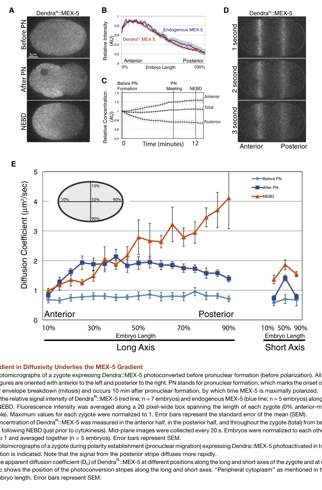

## Question

# Gene Research for Functional Annotation

## ⚠️ CRITICAL: Gene/Protein Identification Context

**BEFORE YOU BEGIN RESEARCH:** You MUST verify you are researching the CORRECT gene/protein. Gene symbols can be ambiguous, especially for less well-characterized genes from non-model organisms.

### Target Gene/Protein Identity (from UniProt):
- **UniProt Accession:** Q9XUB2
- **Protein Description:** RecName: Full=Zinc finger protein mex-5;
- **Gene Information:** Name=mex-5 {ECO:0000312|WormBase:W02A2.7}; ORFNames=W02A2.7 {ECO:0000312|WormBase:W02A2.7};
- **Organism (full):** Caenorhabditis elegans.
- **Protein Family:** Not specified in UniProt
- **Key Domains:** ZFP36-like. (IPR045877); Znf_CCCH. (IPR000571); Znf_CCCH_sf. (IPR036855); zf-CCCH (PF00642)

### MANDATORY VERIFICATION STEPS:

1. **Check if the gene symbol "mex-5" matches the protein description above**
2. **Verify the organism is correct:** Caenorhabditis elegans.
3. **Check if protein family/domains align with what you find in literature**
4. **If you find literature for a DIFFERENT gene with the same or similar symbol, STOP**

### If Gene Symbol is Ambiguous or You Cannot Find Relevant Literature:

**DO NOT PROCEED WITH RESEARCH ON A DIFFERENT GENE.** Instead:
- State clearly: "The gene symbol 'mex-5' is ambiguous or literature is limited for this specific protein"
- Explain what you found (e.g., "Found extensive literature on a different gene with the same symbol in a different organism")
- Describe the protein based ONLY on the UniProt information provided above
- Suggest that the protein function can be inferred from domain/family information

### Research Target:

Please provide a comprehensive research report on the gene **mex-5** (gene ID: mex-5, UniProt: Q9XUB2) in worm.

The research report should be a detailed narrative explaining the function, biological processes, and localization of the gene product. Citations should be given for all claims.

You should prioritize authoritative reviews and primary scientific literature when conducting research. You can supplement
this with annotations you find in gene/protein databases, but these can be outdated or inaccurate.

We are specifically interested in the primary function of the gene - for enzymes, what reaction is catalyzed, and what is the substrate specificity? For transporters, what is the substrate? For structural proteins or adapters, what is the broader structural role? For signaling molecules, what is the role in the pathway.

We are interested in where in or outside the cell the gene product carries out its function.

We are also interested in the signaling or biochemical pathways in which the gene functions. We are less interested in broad pleiotropic effects, except where these elucidate the precise role.

Include evidence where possible. We are interested in both experimental evidence as well as inference from structure, evolution, or bioinformatic analysis. Precise studies should be prioritized over high-throughput, where available.

## Output

Question: You are an expert researcher providing comprehensive, well-cited information.

Provide detailed information focusing on:
1. Key concepts and definitions with current understanding
2. Recent developments and latest research (prioritize 2023-2024 sources)
3. Current applications and real-world implementations
4. Expert opinions and analysis from authoritative sources
5. Relevant statistics and data from recent studies

Format as a comprehensive research report with proper citations. Include URLs and publication dates where available.
Always prioritize recent, authoritative sources and provide specific citations for all major claims.

# Gene Research for Functional Annotation

## ⚠️ CRITICAL: Gene/Protein Identification Context

**BEFORE YOU BEGIN RESEARCH:** You MUST verify you are researching the CORRECT gene/protein. Gene symbols can be ambiguous, especially for less well-characterized genes from non-model organisms.

### Target Gene/Protein Identity (from UniProt):
- **UniProt Accession:** Q9XUB2
- **Protein Description:** RecName: Full=Zinc finger protein mex-5;
- **Gene Information:** Name=mex-5 {ECO:0000312|WormBase:W02A2.7}; ORFNames=W02A2.7 {ECO:0000312|WormBase:W02A2.7};
- **Organism (full):** Caenorhabditis elegans.
- **Protein Family:** Not specified in UniProt
- **Key Domains:** ZFP36-like. (IPR045877); Znf_CCCH. (IPR000571); Znf_CCCH_sf. (IPR036855); zf-CCCH (PF00642)

### MANDATORY VERIFICATION STEPS:

1. **Check if the gene symbol "mex-5" matches the protein description above**
2. **Verify the organism is correct:** Caenorhabditis elegans.
3. **Check if protein family/domains align with what you find in literature**
4. **If you find literature for a DIFFERENT gene with the same or similar symbol, STOP**

### If Gene Symbol is Ambiguous or You Cannot Find Relevant Literature:

**DO NOT PROCEED WITH RESEARCH ON A DIFFERENT GENE.** Instead:
- State clearly: "The gene symbol 'mex-5' is ambiguous or literature is limited for this specific protein"
- Explain what you found (e.g., "Found extensive literature on a different gene with the same symbol in a different organism")
- Describe the protein based ONLY on the UniProt information provided above
- Suggest that the protein function can be inferred from domain/family information

### Research Target:

Please provide a comprehensive research report on the gene **mex-5** (gene ID: mex-5, UniProt: Q9XUB2) in worm.

The research report should be a detailed narrative explaining the function, biological processes, and localization of the gene product. Citations should be given for all claims.

You should prioritize authoritative reviews and primary scientific literature when conducting research. You can supplement
this with annotations you find in gene/protein databases, but these can be outdated or inaccurate.

We are specifically interested in the primary function of the gene - for enzymes, what reaction is catalyzed, and what is the substrate specificity? For transporters, what is the substrate? For structural proteins or adapters, what is the broader structural role? For signaling molecules, what is the role in the pathway.

We are interested in where in or outside the cell the gene product carries out its function.

We are also interested in the signaling or biochemical pathways in which the gene functions. We are less interested in broad pleiotropic effects, except where these elucidate the precise role.

Include evidence where possible. We are interested in both experimental evidence as well as inference from structure, evolution, or bioinformatic analysis. Precise studies should be prioritized over high-throughput, where available.

# Research Report: Functional Annotation of *C. elegans* **mex-5** (UniProt Q9XUB2)

## Executive summary
*mex-5* encodes a cytoplasmic RNA-binding protein with tandem CCCH-type zinc finger domains that becomes enriched in the anterior cytoplasm of the one-cell *C. elegans* embryo and functions redundantly with *mex-6* to translate cortical PAR polarity into cytoplasmic asymmetries. Mechanistically, posterior PAR-1 kinase activity and broadly distributed PP2A/LET-92 phosphatase activity control a phosphorylation cycle (including MEX-5 S404 and S458) that shifts MEX-5 between slow- and fast-diffusing states, producing an anterior-high concentration gradient. This gradient helps pattern germline/soma fate determinants (e.g., PIE-1/POS-1/MEX-1) via translational regulation (notably of *zif-1* through its 3′UTR) and is conceptually linked to regulation of P-granule condensation/dissolution by phase-separation principles. Recent 2023–2024 work emphasizes that cytoplasmic polarity factors (including MEX-5 and PLK-1) contribute to robust, redundant pathways for reestablishing PAR polarity in the P1 cell, and reinforces MEX-5’s role as a scaffold that recruits PLK-1 to the anterior to control polarization of additional germline factors. (rose2014polarityestablishmentasymmetric pages 24-26, rose2014polarityestablishmentasymmetric pages 26-29, kim2024plk1regulatesmex1 pages 1-6, griffin2011regulationofthe pages 8-9, spilker2009mapkinasesignaling pages 8-9, hoege2013principlesofpar pages 6-7, koch2023multiplepathwaysfor pages 1-4)

## 1) Target identity verification (mandatory)
### Gene/protein disambiguation
The literature retrieved and cited here consistently refers to *Caenorhabditis elegans* **mex-5**, originally described as encoding a novel protein with **two CCCH zinc-finger domains** implicated in RNA binding and acting redundantly with **mex-6** in early embryogenesis; this matches the UniProt target description for Q9XUB2 (“Zinc finger protein mex-5”) and the specified CCCH/ZFP36-like domain context. (kemphues2000parsingembryonicpolarity pages 1-2, rose2014polarityestablishmentasymmetric pages 23-24)

## 2) Key concepts and definitions (current understanding)
### 2.1 PAR polarity network and “polarity mediators”
In the one-cell embryo, cortical anterior PAR proteins (e.g., PAR-3/PAR-6/PKC-3) and posterior PAR proteins (including PAR-1) form mutually exclusive cortical domains. “Polarity mediators” such as MEX-5/6 act downstream of these cortical cues to generate **cytoplasmic** asymmetries that ultimately drive differential inheritance of fate determinants. MEX-5 is categorized among RNA-binding polarity mediators with tandem CCCH zinc-finger domains, consistent with translational control mechanisms. (rose2014polarityestablishmentasymmetric pages 23-24, rose2014polarityestablishmentasymmetric pages 24-26)

### 2.2 Reaction–diffusion via a spatially segregated kinase/phosphatase cycle
A major conceptual advance is that a stable cytoplasmic protein gradient can form without localized synthesis/degradation if **diffusivity** varies spatially. For MEX-5, a posterior-high PAR-1 kinase activity gradient and a broadly distributed phosphatase activity (PP2A/LET-92) drive phosphorylation-state interconversion between slow and fast diffusing MEX-5 species, yielding net anterior enrichment. (griffin2011regulationofthe pages 1-2, griffin2011regulationofthe pages 8-9, hoege2013principlesofpar pages 6-7)

### 2.3 P granules/condensates and phase separation as downstream readouts of the MEX-5 gradient
Authoritative reviews synthesize evidence supporting a coupling between the MEX-5 gradient and P-granule behavior: high anterior MEX-5 correlates with dissolution, while low posterior MEX-5 permits condensation/phase separation, providing a physical mechanism for segregating germ plasm components downstream of PAR polarity. (hoege2013principlesofpar pages 5-6, hoege2013principlesofpar pages 7-8)

## 3) Molecular function of MEX-5
### 3.1 Protein class and domains
MEX-5 is a non-enzymatic, cytoplasmic RNA-binding protein with **two CCCH zinc-finger domains**; *mex-5* and *mex-6* act redundantly in early embryos. (kemphues2000parsingembryonicpolarity pages 1-2, rose2014polarityestablishmentasymmetric pages 23-24)

### 3.2 RNA binding and translational control (primary functional output)
A well-supported functional model is that MEX-5/6 act through **3′UTR-mediated translational regulation**. A key example is *zif-1*: MEX-5/6 bind the *zif-1* 3′UTR and promote its expression in somatic lineages by antagonizing POS-1 repression, enabling ZIF-1–dependent degradation of germline proteins such as PIE-1/POS-1/MEX-1 in somatic cells, thereby reinforcing lineage-specific determinants. (rose2014polarityestablishmentasymmetric pages 26-29)

### 3.3 Protein–protein interactions: recruitment/scaffolding of polo-like kinases
MEX-5/6 are required for **anterior enrichment of PLK-1 and PLK-2**, and PLK-1/2 bind MEX-5/6 via their **polo-box domains**. Disrupting MEX-5–PLK binding impairs key MEX-5 activities (e.g., promoting PIE-1 degradation) without necessarily eliminating MEX-5 asymmetry, consistent with an adaptor/scaffold role rather than purely a localization effect. (rose2014polarityestablishmentasymmetric pages 26-29)

A recent 2024 preprint reiterates a mechanistic framework in which MEX-5 recruits PLK-1 to the anterior, and a MEX-5 polo-docking site is required for PLK-1 to inhibit retention of posterior determinants (discussed there in the context of POS-1 and MEX-1 polarization). (kim2024plk1regulatesmex1 pages 1-6)

## 4) Regulation and localization dynamics
### 4.1 Spatial pattern: anterior cytoplasmic enrichment
MEX-5 is broadly cytoplasmic initially and becomes **anterior-enriched** by the end of the one-cell stage, contributing to preferential inheritance by the anterior AB blastomere. (rose2014polarityestablishmentasymmetric pages 24-26, kemphues2000parsingembryonicpolarity pages 1-2)

### 4.2 PAR-1 phosphorylation and PP2A antagonism: mechanistic control of mobility and gradient
Griffin et al. (Cell, 2011; publication date Sep 2011; https://doi.org/10.1016/j.cell.2011.08.012) provide direct mechanistic evidence that the MEX-5 gradient is driven by a **gradient in diffusivity** and a **PAR-1/PP2A** phosphorylation cycle. (griffin2011regulationofthe pages 1-2, griffin2011regulationofthe pages 6-7, griffin2011regulationofthe pages 8-9)

Key experimentally supported points include:
- **PAR-1 phosphorylates MEX-5** in vitro and in vivo, with mapped sites including **S404** and **S458**; an S404A/S458A double mutant is not phosphorylated in vitro by activated PAR-1. (griffin2011regulationofthe pages 3-5)
- **PP2A/LET-92** antagonizes this phosphorylation: S404 is rapidly dephosphorylated in embryo extracts; okadaic acid sensitivity and let-92(RNAi) support PP2A involvement, and PP2A depletion increases MEX-5 mobility and weakens asymmetry. (griffin2011regulationofthe pages 6-7, griffin2011regulationofthe pages 9-10)
- MEX-5 exists in at least two effective mobility classes consistent with binding to RNA-containing complexes: FCS supports a **fast** (~5.15 μm²/s) and **slow** (~0.086 μm²/s) diffusive class, with different anterior/posterior weighting. (griffin2011regulationofthe pages 8-9)

### 4.3 Quantitative biophysics/statistics from key studies
Quantitative results reported include:
- Apparent diffusion coefficients from photoconversion analysis for full-length MEX-5: **~1.03 ± 0.11 μm²/s (anterior)** versus **~2.68 ± 0.24 μm²/s (posterior)**. (griffin2011regulationofthe pages 6-7)
- FCS-derived two-component weighted averages: **~1.40 ± 0.29 μm²/s (anterior)** and **~3.13 ± 0.37 μm²/s (posterior)**; slow:fast ratios of **66:34 anterior** vs **50:50 posterior**, consistent with enrichment of slow (complex-associated) MEX-5 anteriorly. (griffin2011regulationofthe pages 8-9)
- In genetic interaction studies, MEX-5 anterior enrichment ratios were quantified as **2.2 ± 0.5 (wild type; n=35)**, **1.5 ± 0.3 (par-1; n=35)**, and **1.8 ± 0.4 (mpk-1;par-1; n=35)**, supporting partial restoration of MEX-5 asymmetry when MPK-1 is removed in a par-1 background. (spilker2009mapkinasesignaling pages 8-9)

Figure-based support: Griffin et al. Figure 1 visualizes Dendra::MEX-5 gradient formation, the photoconversion stripes used to probe differential diffusion, and the quantified spatial diffusion coefficients, providing direct visual evidence for the diffusivity-gradient mechanism. (griffin2011regulationofthe media d5d2d38b)

## 5) Pathways and biological processes
### 5.1 Early embryonic polarity and asymmetric division
MEX-5/6 are downstream effectors of PAR polarity that help segregate and/or regulate degradation of determinants (PIE-1, POS-1, MEX-1) and thereby influence early fate decisions; maternal *mex-5* mutants show early embryonic arrest and lineage specification defects, consistent with a central role in early embryogenesis distinct from, but downstream of, PAR cortical polarity establishment. (kemphues2000parsingembryonicpolarity pages 1-2, rose2014polarityestablishmentasymmetric pages 26-29)

### 5.2 Integration with MAPK signaling
MAPK signaling (MPK-1/ERK) genetically antagonizes PAR-1. Loss of *mpk-1* partially suppresses *par-1* defects, including partial restoration of MEX-5 asymmetry and partial restoration of PIE-1 enrichment; P granules that are absent in one-cell *par-1* embryos reappear in *mpk-1; par-1* embryos though remain mislocalized. (spilker2009mapkinasesignaling pages 8-9, spilker2009mapkinasesignaling pages 1-2)

## 6) Recent developments (prioritizing 2023–2024)
### 6.1 2023: Redundant pathways for reestablishing PAR polarity in P1
Koch & Rose (bioRxiv; DOI 10.1101/2022.12.15.520651; posted Dec 2023: https://doi.org/10.1101/2022.12.15.520651) propose that PAR polarity in the **P1** cell is reestablished via at least two parallel pathways. The early pathway depends on PAR-1/PKC-3 and downstream cytoplasmic polarity factors (explicitly including MEX-5 and PLK-1), while a later pathway resembles one-cell symmetry breaking and involves actomyosin flow and AIR-1. They report that the posterior PAR-2 domain begins forming within ~2 minutes after P0 cytokinesis and is present within ~4 minutes, emphasizing rapid polarity establishment requiring cytoplasmic regulators. (koch2023multiplepathwaysfor pages 1-4, koch2023howparpolarity pages 20-23)

### 6.2 2024: Extension of the MEX-5→PLK-1 scaffold model to additional targets
Kim et al. (bioRxiv; DOI 10.1101/2024.07.26.605193; posted Jul 2024: https://doi.org/10.1101/2024.07.26.605193) extend the MEX-5/PLK-1 framework by testing PLK-1-dependent polarization of MEX-1, explicitly requiring PLK kinase activity and the MEX-5–PLK-1 interaction for proper segregation dynamics. Although centered on MEX-1, this supports the modern view that MEX-5 is an organizing hub that positions PLK-1 to regulate retention/segregation of germline factors. (kim2024plk1regulatesmex1 pages 1-6, kim2024plk1regulatesmex1 pages 19-22)

## 7) Current applications and real-world implementations
### 7.1 Paradigm system for cytoplasmic reaction–diffusion and gradient formation
MEX-5 is widely used as an experimentally grounded example of a cytoplasmic protein gradient generated through **spatially controlled mobility states**, informing theoretical and computational work on polarity and gradient formation (e.g., explicit two-state diffusion and kinase/phosphatase models parameterized with measured diffusion coefficients). (griffin2011regulationofthe pages 8-9, griffin2011regulationofthe pages 9-10)

### 7.2 Model for coupling polarity to biomolecular condensates
The PAR→MEX-5→P granule conceptual chain is frequently used to connect cell polarity to condensate phase behavior, motivating experimental designs that probe how RNA-binding proteins modulate solubility and assembly of RNP granules in living embryos and in reconstitution contexts. (hoege2013principlesofpar pages 5-6, hoege2013principlesofpar pages 7-8)

## 8) Expert synthesis and authoritative perspectives
Two highly cited authoritative reviews summarize consensus models:
- Hoege & Hyman (Nature Reviews Molecular Cell Biology; Apr 2013; https://doi.org/10.1038/nrm3558) emphasize that PAR polarity can generate cytosolic gradients by modulating diffusion/complex size through phosphorylation cycles, and explicitly place MEX-5/6 as central to linking PAR-1 to P-granule phase separation. (hoege2013principlesofpar pages 5-6, hoege2013principlesofpar pages 6-7)
- Rose & Gönczy (WormBook; Dec 2014; https://doi.org/10.1895/wormbook.1.30.2) synthesize mechanistic evidence that MEX-5/6 integrate phosphorylation-dependent mobility control with translational regulation (e.g., *zif-1* 3′UTR control) and kinase recruitment (PLK-1/2), explaining how cytoplasmic polarity is created and then translated into fate outcomes. (rose2014polarityestablishmentasymmetric pages 24-26, rose2014polarityestablishmentasymmetric pages 26-29)

## 9) Limitations and evidence gaps relevant to “functional annotation”
- While MEX-5 is clearly an RNA-binding protein with CCCH zinc fingers and demonstrated 3′UTR-dependent regulatory roles (e.g., *zif-1*), the retrieved evidence set does not specify a precise RNA **sequence motif** (e.g., AU-rich element consensus) for MEX-5 binding; claims about sequence specificity beyond 3′UTR interactions should therefore be treated as unresolved within this report’s evidence. (rose2014polarityestablishmentasymmetric pages 26-29, rose2014polarityestablishmentasymmetric pages 23-24)
- Some recent 2023–2024 advances appear as preprints and thus may change upon peer review; nevertheless they provide current hypotheses and quantitative timing frameworks that align with established mechanisms. (koch2023multiplepathwaysfor pages 1-4, kim2024plk1regulatesmex1 pages 1-6)

## Summary table of key findings
The following table consolidates key mechanistic and quantitative findings, with source URLs and publication context.

| Aspect | Key findings | Evidence type/method | Source (with year/URL) |
|---|---|---|---|
| Identity and domains | **mex-5** in **Caenorhabditis elegans** encodes an embryonic polarity mediator with **two tandem CCCH zinc-finger domains**, consistent with an RNA-binding protein and matching the UniProt Q9XUB2 domain context. It functions redundantly with the close paralog **mex-6**. (kemphues2000parsingembryonicpolarity pages 1-2, rose2014polarityestablishmentasymmetric pages 23-24) | Gene identification, mutant analysis, protein domain annotation from primary and review literature | Kemphues 2000, https://doi.org/10.1016/S0092-8674(00)80844-2; Rose & Gonczy 2014, https://doi.org/10.1895/wormbook.1.30.2 |
| Localization pattern in early embryo | MEX-5 is initially broadly cytoplasmic after fertilization, then becomes **anterior-enriched** by the end of the one-cell stage and is preferentially inherited by **AB**; it is also reported on **P granules/RNP assemblies** during early divisions. In par-1 mutants, the gradient is weakened or lost. (rose2014polarityestablishmentasymmetric pages 24-26, spilker2009mapkinasesignaling pages 1-2, hoege2013principlesofpar pages 4-5) | Live imaging of GFP/Dendra-tagged proteins; endogenous protein localization; mutant phenotyping | Griffin 2011, https://doi.org/10.1016/j.cell.2011.08.012; Spilker 2009, https://doi.org/10.1534/genetics.109.106716; Rose & Gonczy 2014, https://doi.org/10.1895/wormbook.1.30.2 |
| Core molecular function: RNA binding | MEX-5/6 are **RNA-binding polarity mediators** that act largely through **translational control** and regulated association with RNA-containing complexes. Their CCCH zinc fingers are required for normal mobility/asymmetry, supporting direct functional coupling between RNA binding and polarity formation. (rose2014polarityestablishmentasymmetric pages 24-26, rose2014polarityestablishmentasymmetric pages 23-24, griffin2011regulationofthe pages 6-7) | Domain-function inference, mutational analysis of zinc fingers, biochemical and imaging studies | Rose & Gonczy 2014, https://doi.org/10.1895/wormbook.1.30.2; Griffin 2011, https://doi.org/10.1016/j.cell.2011.08.012 |
| Translational regulation / zif-1 pathway | MEX-5/6 bind the **zif-1 3′UTR** and act **positively** to relieve repression, antagonizing POS-1 on the same regulatory region; this enables somatic **zif-1** expression and downstream **ZIF-1–dependent degradation** of germline determinants such as **PIE-1, POS-1, and MEX-1** in somatic lineages. (rose2014polarityestablishmentasymmetric pages 26-29) | 3′UTR regulatory assays, genetic interaction analysis, developmental phenotyping summarized in review | Rose & Gonczy 2014, https://doi.org/10.1895/wormbook.1.30.2 |
| Scaffold/recruiter for polo kinases | MEX-5/6 are required for **anterior enrichment of PLK-1 and PLK-2**; the polo kinases bind MEX-5/6 via their **polo-box domains**. Mutations that disrupt PLK binding impair MEX-5 function without abolishing MEX-5 asymmetry, supporting a **scaffold/adaptor role** rather than simple localization dependence. Recent work reiterates that MEX-5 recruits **PLK-1** to the anterior cytoplasm to regulate segregation of posterior factors. (rose2014polarityestablishmentasymmetric pages 26-29, kim2024plk1regulatesmex1 pages 1-6) | Yeast two-hybrid interaction assays, mutant functional analysis, recent mechanistic preprint | Rose & Gonczy 2014, https://doi.org/10.1895/wormbook.1.30.2; Kim et al. 2024, https://doi.org/10.1101/2024.07.26.605193 |
| Upstream regulator: PAR-1 | **PAR-1** is the principal upstream kinase coupling cortical/cytoplasmic polarity to MEX-5 asymmetry. Posterior PAR-1 activity phosphorylates MEX-5, increases its mobility in the posterior, and thereby drives formation of the **anterior-high MEX-5 gradient**. (folkmann2019spatialregulationof pages 1-3, griffin2011regulationofthe pages 1-2, griffin2011regulationofthe pages 3-5) | In vitro kinase assays, phosphosite mapping, live photoconversion/diffusion analysis, mechanistic modeling | Griffin 2011, https://doi.org/10.1016/j.cell.2011.08.012; Folkmann & Seydoux 2019, https://doi.org/10.1242/dev.171116 |
| Antagonistic phosphatase control | A largely uniform **PP2A/LET-92** phosphatase antagonizes PAR-1-dependent phosphorylation, returning MEX-5 to slower-diffusing states; reducing PP2A activity increases mobility and weakens asymmetry. (griffin2011regulationofthe pages 6-7, griffin2011regulationofthe pages 9-10) | Okadaic acid sensitivity, let-92(RNAi), phospho-specific antibodies, reaction-diffusion modeling | Griffin 2011, https://doi.org/10.1016/j.cell.2011.08.012 |
| Key phosphorylation sites | PAR-1 phosphorylates MEX-5 at **S404** and **S458**; the **S404A/S458A double mutant** is no longer a substrate in the in vitro PAR-1 assay. **S404** is rapidly dephosphorylated in embryo extract and linked to PP2A-sensitive regulation; **S458** is also par-1/par-4 dependent and contributes to fast diffusion, but phosphorylation at S458 alone does not fully explain gradient formation. (griffin2011regulationofthe pages 1-2, griffin2011regulationofthe pages 6-7, griffin2011regulationofthe pages 3-5) | In vitro kinase assays with activated PAR-1, phosphosite mutagenesis, phospho-specific antibodies, embryo extracts | Griffin 2011, https://doi.org/10.1016/j.cell.2011.08.012 |
| Quantitative diffusion measurements | Full-length MEX-5 apparent diffusion coefficients from Dendra photoconversion were ~**1.03 ± 0.11 μm²/s** anterior and **2.68 ± 0.24 μm²/s** posterior. FCS supported two effective diffusive classes: **fast ~5.15 μm²/s** and **slow ~0.086 μm²/s**; weighted averages were ~**1.40 ± 0.29 μm²/s** anterior and **3.13 ± 0.37 μm²/s** posterior. (griffin2011regulationofthe pages 6-7, griffin2011regulationofthe pages 8-9) | Photoconversion stripe assays, fluorescence correlation spectroscopy (FCS), quantitative modeling | Griffin 2011, https://doi.org/10.1016/j.cell.2011.08.012 |
| Quantitative composition of mobility states | FCS indicated the **slow:fast** MEX-5 concentration ratio is about **66:34 in the anterior** versus **50:50 in the posterior**, implying the anterior is enriched for slow, likely RNA-complexed species that dominate the visible protein gradient. (griffin2011regulationofthe pages 8-9, griffin2011regulationofthe pages 9-10) | FCS two-component fitting, reaction-diffusion interpretation | Griffin 2011, https://doi.org/10.1016/j.cell.2011.08.012 |
| Quantitative gradient timing/model | Modeling with **Dfast = 5 μm²/s** and **Dslow = 0.07 μm²/s** showed that a cytoplasmic kinase/phosphatase cycle can establish the gradient rapidly (example **~160 s** with kphos = 0.1 s⁻¹), whereas a cortical-only PAR-1 model would be much slower (**~17 min**), supporting a cytoplasmic PAR-1 activity gradient. (griffin2011regulationofthe pages 8-9, griffin2011regulationofthe pages 9-10) | Reaction-diffusion modeling anchored to in vivo diffusion measurements | Griffin 2011, https://doi.org/10.1016/j.cell.2011.08.012 |
| MAPK antagonism / genetic suppression | Wild-type embryos showed a MEX-5 anterior enrichment ratio of **2.2 ± 0.5** (n=35), **par-1** mutants **1.5 ± 0.3** (n=35), and **mpk-1; par-1** double mutants **1.8 ± 0.4** (n=35), indicating partial restoration of asymmetry. Embryonic viability was also improved in the double mutant (reported approximately **38 ± 9%** versus very low viability for par-1 alone in the cited excerpt). (spilker2009mapkinasesignaling pages 8-9, spilker2009mapkinasesignaling pages 6-8) | Quantitative fluorescence ratio measurements; suppressor genetics | Spilker 2009, https://doi.org/10.1534/genetics.109.106716 |
| Downstream effects on PIE-1 and P granules | par-1 mutants strongly reduce posterior **PIE-1** enrichment (**~1.8 ± 3** vs **6.1 ± 1.4** in wild type; n=39), while **mpk-1; par-1** partially restores it (**~2.5 ± 0.9**). **P granules** are absent in one-cell par-1 embryos but reappear in mpk-1; par-1 embryos, though not properly posterior-localized. MEX-5/6 are thus central to partitioning germline condensates and determinants. (spilker2009mapkinasesignaling pages 8-9, hoege2013principlesofpar pages 5-6, hoege2013principlesofpar pages 7-8) | Immunofluorescence/localization phenotyping, suppressor genetics, conceptual synthesis | Spilker 2009, https://doi.org/10.1534/genetics.109.106716; Hoege & Hyman 2013, https://doi.org/10.1038/nrm3558 |
| Conceptual model: phase separation / condensates | Current understanding is that the MEX-5 gradient links membrane PAR polarity to **cytoplasmic phase behavior**: high anterior MEX-5 promotes **P-granule dissolution**, whereas low posterior MEX-5 permits **condensation/phase separation** of germ plasm assemblies. This model explains how cortical asymmetry is translated into cytoplasmic organization. (hoege2013principlesofpar pages 6-7, hoege2013principlesofpar pages 5-6, hoege2013principlesofpar pages 7-8, rose2014polarityestablishmentasymmetric pages 24-26) | Integrative expert review drawing on primary biophysical and developmental studies | Hoege & Hyman 2013, https://doi.org/10.1038/nrm3558; Rose & Gonczy 2014, https://doi.org/10.1895/wormbook.1.30.2 |
| Recent 2023 development | In the two-cell embryo (**P1**), re-establishment of PAR polarity involves at least **two parallel pathways**; the early pathway depends on **PAR-1, PKC-3, and downstream cytoplasmic polarity including MEX-5 and PLK-1**. PAR-2 polarization begins within about **2 min** after P0 cytokinesis and a posterior domain is present within about **4 min**. (koch2023howparpolarity pages 20-23, koch2023multiplepathwaysfor pages 1-4) | Live imaging and quantitative polarity timing in preprint study | Koch & Rose 2023, https://doi.org/10.1101/2022.12.15.520651 |
| Recent 2024 development | New preprint evidence extends the MEX-5-centered model by showing that **PLK-1 activity and the MEX-5–PLK-1 interaction** regulate polarization of another posterior factor, **MEX-1**. This reinforces the view of MEX-5 as a central upstream organizer/scaffold for kinase-dependent segregation of germline proteins in the zygote. (kim2024plk1regulatesmex1 pages 19-22, kim2024plk1regulatesmex1 pages 1-6) | Recent mechanistic preprint with phosphosite mutagenesis and genetic analysis of related polarity factor | Kim et al. 2024, https://doi.org/10.1101/2024.07.26.605193 |

*Table: This table summarizes experimentally supported properties of C. elegans MEX-5, including domains, localization, regulators, molecular functions, phosphosites, and key quantitative measurements. It consolidates foundational and recent evidence to support functional annotation of UniProt Q9XUB2.*

## Key sources (URLs and publication dates)
- Kemphues K. “Parsing Embryonic Polarity.” *Cell* (May 2000). https://doi.org/10.1016/S0092-8674(00)80844-2 (kemphues2000parsingembryonicpolarity pages 1-2)
- Spilker AC et al. “MAP Kinase Signaling Antagonizes PAR-1 Function…” *Genetics* (Nov 2009). https://doi.org/10.1534/genetics.109.106716 (spilker2009mapkinasesignaling pages 8-9)
- Griffin EE et al. “Regulation of the MEX-5 Gradient…” *Cell* (Sep 2011). https://doi.org/10.1016/j.cell.2011.08.012 (griffin2011regulationofthe pages 1-2)
- Hoege C, Hyman AA. “Principles of PAR polarity…” *Nat Rev Mol Cell Biol* (Apr 2013). https://doi.org/10.1038/nrm3558 (hoege2013principlesofpar pages 5-6)
- Rose L, Gönczy P. “Polarity establishment, asymmetric division…” *WormBook* (Dec 2014). https://doi.org/10.1895/wormbook.1.30.2 (rose2014polarityestablishmentasymmetric pages 24-26)
- Koch LA, Rose LS. “Multiple pathways for reestablishing PAR polarity…” *bioRxiv* (posted Dec 2023). https://doi.org/10.1101/2022.12.15.520651 (koch2023multiplepathwaysfor pages 1-4)
- Kim AJ et al. “PLK-1 regulates MEX-1 polarization…” *bioRxiv* (posted Jul 2024). https://doi.org/10.1101/2024.07.26.605193 (kim2024plk1regulatesmex1 pages 1-6)

References

1. (rose2014polarityestablishmentasymmetric pages 24-26): Lesilee Rose and Pierre Gonczy. Polarity establishment, asymmetric division and segregation of fate determinants in early c. elegans embryos. WormBook : the online review of C. elegans biology, pages 1-43, Dec 2014. URL: https://doi.org/10.1895/wormbook.1.30.2, doi:10.1895/wormbook.1.30.2. This article has 257 citations.

2. (rose2014polarityestablishmentasymmetric pages 26-29): Lesilee Rose and Pierre Gonczy. Polarity establishment, asymmetric division and segregation of fate determinants in early c. elegans embryos. WormBook : the online review of C. elegans biology, pages 1-43, Dec 2014. URL: https://doi.org/10.1895/wormbook.1.30.2, doi:10.1895/wormbook.1.30.2. This article has 257 citations.

3. (kim2024plk1regulatesmex1 pages 1-6): Amelia J. Kim, Stephanie I. Miller, Elora C. Greiner, Arminja N. Kettenbach, and Erik E. Griffin. Plk-1 regulates mex-1 polarization in the c. elegans zygote. bioRxiv, Jul 2024. URL: https://doi.org/10.1101/2024.07.26.605193, doi:10.1101/2024.07.26.605193. This article has 1 citations.

4. (griffin2011regulationofthe pages 8-9): Erik E. Griffin, David J. Odde, and Geraldine Seydoux. Regulation of the mex-5 gradient by a spatially segregated kinase/phosphatase cycle. Cell, 146:955-968, Sep 2011. URL: https://doi.org/10.1016/j.cell.2011.08.012, doi:10.1016/j.cell.2011.08.012. This article has 169 citations and is from a highest quality peer-reviewed journal.

5. (spilker2009mapkinasesignaling pages 8-9): Annina C Spilker, Alexia Rabilotta, Caroline Zbinden, Jean-Claude Labbé, and Monica Gotta. Map kinase signaling antagonizes par-1 function during polarization of the early caenorhabditis elegans embryo. Genetics, 183:965-977, Nov 2009. URL: https://doi.org/10.1534/genetics.109.106716, doi:10.1534/genetics.109.106716. This article has 26 citations and is from a domain leading peer-reviewed journal.

6. (hoege2013principlesofpar pages 6-7): Carsten Hoege and Anthony A. Hyman. Principles of par polarity in caenorhabditis elegans embryos. Nature Reviews Molecular Cell Biology, 14:315-322, Apr 2013. URL: https://doi.org/10.1038/nrm3558, doi:10.1038/nrm3558. This article has 126 citations and is from a domain leading peer-reviewed journal.

7. (koch2023multiplepathwaysfor pages 1-4): Laurel A. Koch and Lesilee S. Rose. Multiple pathways for reestablishing par polarity in c. elegans embryo. bioRxiv, Dec 2023. URL: https://doi.org/10.1101/2022.12.15.520651, doi:10.1101/2022.12.15.520651. This article has 8 citations.

8. (kemphues2000parsingembryonicpolarity pages 1-2): Kenneth Kemphues. Parsing embryonic polarity. Cell, 101:345-348, May 2000. URL: https://doi.org/10.1016/s0092-8674(00)80844-2, doi:10.1016/s0092-8674(00)80844-2. This article has 317 citations and is from a highest quality peer-reviewed journal.

9. (rose2014polarityestablishmentasymmetric pages 23-24): Lesilee Rose and Pierre Gonczy. Polarity establishment, asymmetric division and segregation of fate determinants in early c. elegans embryos. WormBook : the online review of C. elegans biology, pages 1-43, Dec 2014. URL: https://doi.org/10.1895/wormbook.1.30.2, doi:10.1895/wormbook.1.30.2. This article has 257 citations.

10. (griffin2011regulationofthe pages 1-2): Erik E. Griffin, David J. Odde, and Geraldine Seydoux. Regulation of the mex-5 gradient by a spatially segregated kinase/phosphatase cycle. Cell, 146:955-968, Sep 2011. URL: https://doi.org/10.1016/j.cell.2011.08.012, doi:10.1016/j.cell.2011.08.012. This article has 169 citations and is from a highest quality peer-reviewed journal.

11. (hoege2013principlesofpar pages 5-6): Carsten Hoege and Anthony A. Hyman. Principles of par polarity in caenorhabditis elegans embryos. Nature Reviews Molecular Cell Biology, 14:315-322, Apr 2013. URL: https://doi.org/10.1038/nrm3558, doi:10.1038/nrm3558. This article has 126 citations and is from a domain leading peer-reviewed journal.

12. (hoege2013principlesofpar pages 7-8): Carsten Hoege and Anthony A. Hyman. Principles of par polarity in caenorhabditis elegans embryos. Nature Reviews Molecular Cell Biology, 14:315-322, Apr 2013. URL: https://doi.org/10.1038/nrm3558, doi:10.1038/nrm3558. This article has 126 citations and is from a domain leading peer-reviewed journal.

13. (griffin2011regulationofthe pages 6-7): Erik E. Griffin, David J. Odde, and Geraldine Seydoux. Regulation of the mex-5 gradient by a spatially segregated kinase/phosphatase cycle. Cell, 146:955-968, Sep 2011. URL: https://doi.org/10.1016/j.cell.2011.08.012, doi:10.1016/j.cell.2011.08.012. This article has 169 citations and is from a highest quality peer-reviewed journal.

14. (griffin2011regulationofthe pages 3-5): Erik E. Griffin, David J. Odde, and Geraldine Seydoux. Regulation of the mex-5 gradient by a spatially segregated kinase/phosphatase cycle. Cell, 146:955-968, Sep 2011. URL: https://doi.org/10.1016/j.cell.2011.08.012, doi:10.1016/j.cell.2011.08.012. This article has 169 citations and is from a highest quality peer-reviewed journal.

15. (griffin2011regulationofthe pages 9-10): Erik E. Griffin, David J. Odde, and Geraldine Seydoux. Regulation of the mex-5 gradient by a spatially segregated kinase/phosphatase cycle. Cell, 146:955-968, Sep 2011. URL: https://doi.org/10.1016/j.cell.2011.08.012, doi:10.1016/j.cell.2011.08.012. This article has 169 citations and is from a highest quality peer-reviewed journal.

16. (griffin2011regulationofthe media d5d2d38b): Erik E. Griffin, David J. Odde, and Geraldine Seydoux. Regulation of the mex-5 gradient by a spatially segregated kinase/phosphatase cycle. Cell, 146:955-968, Sep 2011. URL: https://doi.org/10.1016/j.cell.2011.08.012, doi:10.1016/j.cell.2011.08.012. This article has 169 citations and is from a highest quality peer-reviewed journal.

17. (spilker2009mapkinasesignaling pages 1-2): Annina C Spilker, Alexia Rabilotta, Caroline Zbinden, Jean-Claude Labbé, and Monica Gotta. Map kinase signaling antagonizes par-1 function during polarization of the early caenorhabditis elegans embryo. Genetics, 183:965-977, Nov 2009. URL: https://doi.org/10.1534/genetics.109.106716, doi:10.1534/genetics.109.106716. This article has 26 citations and is from a domain leading peer-reviewed journal.

18. (koch2023howparpolarity pages 20-23): LA Koch. How par polarity is established and regulates spindle positioning in early c. elegans embryo. Unknown journal, 2023.

19. (kim2024plk1regulatesmex1 pages 19-22): Amelia J. Kim, Stephanie I. Miller, Elora C. Greiner, Arminja N. Kettenbach, and Erik E. Griffin. Plk-1 regulates mex-1 polarization in the c. elegans zygote. bioRxiv, Jul 2024. URL: https://doi.org/10.1101/2024.07.26.605193, doi:10.1101/2024.07.26.605193. This article has 1 citations.

20. (hoege2013principlesofpar pages 4-5): Carsten Hoege and Anthony A. Hyman. Principles of par polarity in caenorhabditis elegans embryos. Nature Reviews Molecular Cell Biology, 14:315-322, Apr 2013. URL: https://doi.org/10.1038/nrm3558, doi:10.1038/nrm3558. This article has 126 citations and is from a domain leading peer-reviewed journal.

21. (folkmann2019spatialregulationof pages 1-3): Andrew W. Folkmann and Geraldine Seydoux. Spatial regulation of the polarity kinase par-1 by parallel inhibitory mechanisms. Development, Mar 2019. URL: https://doi.org/10.1242/dev.171116, doi:10.1242/dev.171116. This article has 28 citations and is from a domain leading peer-reviewed journal.

22. (spilker2009mapkinasesignaling pages 6-8): Annina C Spilker, Alexia Rabilotta, Caroline Zbinden, Jean-Claude Labbé, and Monica Gotta. Map kinase signaling antagonizes par-1 function during polarization of the early caenorhabditis elegans embryo. Genetics, 183:965-977, Nov 2009. URL: https://doi.org/10.1534/genetics.109.106716, doi:10.1534/genetics.109.106716. This article has 26 citations and is from a domain leading peer-reviewed journal.

## Artifacts

- [Edison artifact artifact-00](mex-5-deep-research-falcon_artifacts/artifact-00.md)

## Citations

1. rose2014polarityestablishmentasymmetric pages 26-29
2. griffin2011regulationofthe pages 3-5
3. griffin2011regulationofthe pages 8-9
4. griffin2011regulationofthe pages 6-7
5. spilker2009mapkinasesignaling pages 8-9
6. kemphues2000parsingembryonicpolarity pages 1-2
7. griffin2011regulationofthe pages 1-2
8. hoege2013principlesofpar pages 5-6
9. rose2014polarityestablishmentasymmetric pages 24-26
10. koch2023multiplepathwaysfor pages 1-4
11. hoege2013principlesofpar pages 6-7
12. rose2014polarityestablishmentasymmetric pages 23-24
13. hoege2013principlesofpar pages 7-8
14. griffin2011regulationofthe pages 9-10
15. spilker2009mapkinasesignaling pages 1-2
16. koch2023howparpolarity pages 20-23
17. hoege2013principlesofpar pages 4-5
18. folkmann2019spatialregulationof pages 1-3
19. spilker2009mapkinasesignaling pages 6-8
20. https://doi.org/10.1016/j.cell.2011.08.012
21. https://doi.org/10.1101/2022.12.15.520651
22. https://doi.org/10.1101/2024.07.26.605193
23. https://doi.org/10.1038/nrm3558
24. https://doi.org/10.1895/wormbook.1.30.2
25. https://doi.org/10.1016/S0092-8674(00
26. https://doi.org/10.1016/j.cell.2011.08.012;
27. https://doi.org/10.1534/genetics.109.106716;
28. https://doi.org/10.1895/wormbook.1.30.2;
29. https://doi.org/10.1242/dev.171116
30. https://doi.org/10.1534/genetics.109.106716
31. https://doi.org/10.1038/nrm3558;
32. https://doi.org/10.1895/wormbook.1.30.2,
33. https://doi.org/10.1101/2024.07.26.605193,
34. https://doi.org/10.1016/j.cell.2011.08.012,
35. https://doi.org/10.1534/genetics.109.106716,
36. https://doi.org/10.1038/nrm3558,
37. https://doi.org/10.1101/2022.12.15.520651,
38. https://doi.org/10.1016/s0092-8674(00
39. https://doi.org/10.1242/dev.171116,