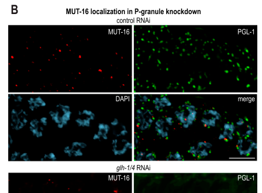

## Question

# Gene Research for Functional Annotation

## ⚠️ CRITICAL: Gene/Protein Identification Context

**BEFORE YOU BEGIN RESEARCH:** You MUST verify you are researching the CORRECT gene/protein. Gene symbols can be ambiguous, especially for less well-characterized genes from non-model organisms.

### Target Gene/Protein Identity (from UniProt):
- **UniProt Accession:** O62011
- **Protein Description:** SubName: Full=MUTator {ECO:0000313|EMBL:CAB05895.3};
- **Gene Information:** Name=mut-16 {ECO:0000313|EMBL:CAB05895.3, ECO:0000313|WormBase:B0379.3a}; ORFNames=B0379.3 {ECO:0000313|WormBase:B0379.3a}, CELE_B0379.3 {ECO:0000313|EMBL:CAB05895.3};
- **Organism (full):** Caenorhabditis elegans.
- **Protein Family:** Not specified in UniProt
- **Key Domains:** Not specified in UniProt

### MANDATORY VERIFICATION STEPS:

1. **Check if the gene symbol "mut-16" matches the protein description above**
2. **Verify the organism is correct:** Caenorhabditis elegans.
3. **Check if protein family/domains align with what you find in literature**
4. **If you find literature for a DIFFERENT gene with the same or similar symbol, STOP**

### If Gene Symbol is Ambiguous or You Cannot Find Relevant Literature:

**DO NOT PROCEED WITH RESEARCH ON A DIFFERENT GENE.** Instead:
- State clearly: "The gene symbol 'mut-16' is ambiguous or literature is limited for this specific protein"
- Explain what you found (e.g., "Found extensive literature on a different gene with the same symbol in a different organism")
- Describe the protein based ONLY on the UniProt information provided above
- Suggest that the protein function can be inferred from domain/family information

### Research Target:

Please provide a comprehensive research report on the gene **mut-16** (gene ID: mut-16, UniProt: O62011) in worm.

The research report should be a detailed narrative explaining the function, biological processes, and localization of the gene product. Citations should be given for all claims.

You should prioritize authoritative reviews and primary scientific literature when conducting research. You can supplement
this with annotations you find in gene/protein databases, but these can be outdated or inaccurate.

We are specifically interested in the primary function of the gene - for enzymes, what reaction is catalyzed, and what is the substrate specificity? For transporters, what is the substrate? For structural proteins or adapters, what is the broader structural role? For signaling molecules, what is the role in the pathway.

We are interested in where in or outside the cell the gene product carries out its function.

We are also interested in the signaling or biochemical pathways in which the gene functions. We are less interested in broad pleiotropic effects, except where these elucidate the precise role.

Include evidence where possible. We are interested in both experimental evidence as well as inference from structure, evolution, or bioinformatic analysis. Precise studies should be prioritized over high-throughput, where available.

## Output

Question: You are an expert researcher providing comprehensive, well-cited information.

Provide detailed information focusing on:
1. Key concepts and definitions with current understanding
2. Recent developments and latest research (prioritize 2023-2024 sources)
3. Current applications and real-world implementations
4. Expert opinions and analysis from authoritative sources
5. Relevant statistics and data from recent studies

Format as a comprehensive research report with proper citations. Include URLs and publication dates where available.
Always prioritize recent, authoritative sources and provide specific citations for all major claims.

# Gene Research for Functional Annotation

## ⚠️ CRITICAL: Gene/Protein Identification Context

**BEFORE YOU BEGIN RESEARCH:** You MUST verify you are researching the CORRECT gene/protein. Gene symbols can be ambiguous, especially for less well-characterized genes from non-model organisms.

### Target Gene/Protein Identity (from UniProt):
- **UniProt Accession:** O62011
- **Protein Description:** SubName: Full=MUTator {ECO:0000313|EMBL:CAB05895.3};
- **Gene Information:** Name=mut-16 {ECO:0000313|EMBL:CAB05895.3, ECO:0000313|WormBase:B0379.3a}; ORFNames=B0379.3 {ECO:0000313|WormBase:B0379.3a}, CELE_B0379.3 {ECO:0000313|EMBL:CAB05895.3};
- **Organism (full):** Caenorhabditis elegans.
- **Protein Family:** Not specified in UniProt
- **Key Domains:** Not specified in UniProt

### MANDATORY VERIFICATION STEPS:

1. **Check if the gene symbol "mut-16" matches the protein description above**
2. **Verify the organism is correct:** Caenorhabditis elegans.
3. **Check if protein family/domains align with what you find in literature**
4. **If you find literature for a DIFFERENT gene with the same or similar symbol, STOP**

### If Gene Symbol is Ambiguous or You Cannot Find Relevant Literature:

**DO NOT PROCEED WITH RESEARCH ON A DIFFERENT GENE.** Instead:
- State clearly: "The gene symbol 'mut-16' is ambiguous or literature is limited for this specific protein"
- Explain what you found (e.g., "Found extensive literature on a different gene with the same symbol in a different organism")
- Describe the protein based ONLY on the UniProt information provided above
- Suggest that the protein function can be inferred from domain/family information

### Research Target:

Please provide a comprehensive research report on the gene **mut-16** (gene ID: mut-16, UniProt: O62011) in worm.

The research report should be a detailed narrative explaining the function, biological processes, and localization of the gene product. Citations should be given for all claims.

You should prioritize authoritative reviews and primary scientific literature when conducting research. You can supplement
this with annotations you find in gene/protein databases, but these can be outdated or inaccurate.

We are specifically interested in the primary function of the gene - for enzymes, what reaction is catalyzed, and what is the substrate specificity? For transporters, what is the substrate? For structural proteins or adapters, what is the broader structural role? For signaling molecules, what is the role in the pathway.

We are interested in where in or outside the cell the gene product carries out its function.

We are also interested in the signaling or biochemical pathways in which the gene functions. We are less interested in broad pleiotropic effects, except where these elucidate the precise role.

Include evidence where possible. We are interested in both experimental evidence as well as inference from structure, evolution, or bioinformatic analysis. Precise studies should be prioritized over high-throughput, where available.

# Functional Annotation Research Report: **C. elegans mut-16 / MUT-16** (UniProt: **O62011**; ORF: **B0379.3**)

## Executive summary
The *Caenorhabditis elegans* gene **mut-16** (UniProt **O62011**) encodes **MUT-16**, a **low-complexity, intrinsically disordered scaffold protein** that **nucleates perinuclear “Mutator foci”** and organizes the **Mutator complex**, a germline-enriched small-RNA amplification module required for robust RNA silencing. (phillips2012mut16promotesformation pages 1-2, uebel2018distinctregionsof pages 1-2, uebel2018distinctregionsof pages 5-7)

MUT-16 is **not an enzyme** with a defined catalytic reaction; instead, its primary function is **structural/organizational**—concentrating and coordinating multiple enzymatic and RNA-binding factors (e.g., RdRP RRF-1; poly(UG) polymerase MUT-2/RDE-3; exonuclease MUT-7; helicases; nucleases) that collectively generate **secondary 22G-RNAs** that load into WAGO Argonautes to enforce gene and transposon silencing. (phillips2012mut16promotesformation pages 5-7, sundby2021connectingthedots pages 6-7, ouyang2022nuagecondensatesaccelerators pages 1-2)

## Identity verification (critical gene disambiguation)
Primary mechanistic papers that cloned/characterized **mut-16** unambiguously define **MUT-16** as the core Mutator-foci protein required for siRNA amplification in *C. elegans* (not another organism’s “mut-16”). (zhang2011mut16andother pages 1-2, phillips2012mut16promotesformation pages 1-2)

Key identifiers used in the literature are consistent with your UniProt context: **mut-16** encodes **MUT-16**, described as a “Mutator” class factor required for Mutator foci and secondary siRNA amplification. (phillips2012mut16promotesformation pages 1-2, zhang2011mut16andother pages 1-2)

## 1) Key concepts and definitions (current understanding)

### 1.1 Mutator foci and the Mutator complex
**Mutator foci** are **punctate perinuclear compartments** in germ cells that contain MUT-16 and multiple “mutator class” proteins; they sit near nuclear pores and are adjacent to other nuage condensates (notably P granules). (phillips2012mut16promotesformation pages 1-2, phillips2012mut16promotesformation pages 4-5, uebel2018distinctregionsof pages 13-14)

The **Mutator complex** is an assembly of proteins required to generate **mutator-dependent secondary siRNAs**, particularly WAGO-class 22G-RNAs; reviews and primary studies place MUT-16 as the **seed/scaffold** for this assembly. (phillips2022germgranulesand pages 6-7, sundby2021connectingthedots pages 6-7)

### 1.2 22G-RNAs, WAGO vs CSR-1 branches, and “secondary” amplification
In *C. elegans*, endogenous RNAi includes abundant **22G-RNAs** (22-nt, typically 5′G) made by RNA-dependent RNA polymerases (RdRPs). Reviews emphasize that **RRF-1** and **EGO-1** are key RdRPs, with the Mutator-foci machinery strongly associated with WAGO-class amplification. (sundby2021connectingthedots pages 1-2, sundby2021connectingthedots pages 6-7)

A central conceptual split is:
- **WAGO-class 22G-RNAs**: enriched in silencing pathways (including transposons and many “non-self”/foreign-like targets). (sundby2021connectingthedots pages 6-7, phillips2022germgranulesand pages 6-7)
- **CSR-1-class 22G-RNAs**: associated with “licensing”/protection of germline gene expression and antagonizing inappropriate silencing. (sundby2021connectingthedots pages 6-7, ouyang2022nuagecondensatesaccelerators pages 1-2)

### 1.3 pUGylation (poly-UG tailing) as an amplification cue (expert model)
A key mechanistic model in recent reviews is that primary targeting can trigger cleavage and then **pUGylation** (addition of poly(UG) tails) by **MUT-2/RDE-3**, which helps recruit RdRP activity to generate amplified secondary 22G-RNAs. (ouyang2022nuagecondensatesaccelerators pages 1-2, sundby2021connectingthedots pages 6-7)

## 2) MUT-16 molecular function: what it does (and what it does not do)

### 2.1 MUT-16 is a scaffold, not a catalyst
Multiple studies describe MUT-16 as **Q/N-rich** and **highly intrinsically disordered**, functioning as a **scaffold** that recruits/organizes Mutator components rather than catalyzing a chemical reaction. (uebel2018distinctregionsof pages 1-2, uebel2018distinctregionsof pages 4-5)

### 2.2 MUT-16 organizes client recruitment via modular regions
CRISPR deletion mapping and interaction/localization assays identify **distinct MUT-16 regions** that mediate recruitment/localization of different Mutator complex proteins (e.g., MUT-2, MUT-7, RDE-2, MUT-14, MUT-15, RRF-1, RDE-8, NYN-1/2). (uebel2018distinctregionsof pages 5-7, uebel2018distinctregionsof pages 11-13)

A key structural-functional conclusion is that a **C-terminal region (JKL; aa ~773–1050)** is sufficient for foci formation and is ~70% disordered; it is necessary and sufficient for Mutator-foci assembly. (uebel2018distinctregionsof pages 13-14)

### 2.3 Mutator foci as phase-separated condensates (biophysical definition)
Mutator foci display multiple properties consistent with **liquid–liquid phase separation**: spherical morphology, sensitivity to 1,6-hexanediol, temperature sensitivity, concentration-threshold behavior, and rapid partial FRAP recovery. (uebel2018distinctregionsof pages 13-14)

Quantitatively, FRAP of MUT-16::GFP foci (whole-focus bleaching) showed **t1/2 = 7.2 ± 1.0 s (SEM; n=5)** and recovery to **~35%** of pre-bleach intensity, consistent with mixed mobile/immobile fractions within the condensate. (uebel2018distinctregionsof pages 11-13)

## 3) Subcellular localization and where MUT-16 acts

### 3.1 Perinuclear localization in germ cells (visual evidence)
MUT-16 localizes to **punctate perinuclear foci** throughout the germline. (phillips2012mut16promotesformation media fee9793d)

MUT-16 foci are **adjacent to P granules** (e.g., PGL-1-marked), consistent with spatially coupled but compositionally distinct nuage subcompartments. (phillips2012mut16promotesformation media 59dbc424)

### 3.2 Relationship to nuclear pores and transcript flow
Reviews and primary studies emphasize that nuage covers a majority of nucleopore-rich nuclear periphery and that P granules associate with roughly **~75% of nuclear pores**—a spatial context in which Mutator foci sit adjacent to P granules and likely capture/exported RNAs for surveillance and amplification. (sundby2021connectingthedots pages 6-7, ouyang2022nuagecondensatesaccelerators pages 1-2)

## 4) Pathways and biological processes influenced by MUT-16 (mechanistic focus)

### 4.1 Mutator-dependent amplification required for robust RNA silencing
Loss of mut-16 disrupts Mutator foci and strongly impairs RNA silencing, consistent with Mutator foci being key sites/organizers of secondary siRNA amplification. (phillips2012mut16promotesformation pages 1-2, phillips2012mut16promotesformation pages 5-7)

### 4.2 Germline genome defense and transposon control
The Mutator/WAGO 22G-RNA system is widely framed as a **genome surveillance/defense** pathway that limits transposon expression/mobilization and supports fertility, with MUT-16 as a core scaffold. (phillips2022germgranulesand pages 6-7, phillips2012mut16promotesformation pages 1-2)

A concrete transposon statistic used in foundational discussions is that the **Tc1** DNA transposon has **~32 intact copies** in the genome, highlighting the need for genome defense mechanisms (including Mutator/WAGO pathways). (phillips2012mut16promotesformation pages 1-2)

### 4.3 Quantitative impacts on small-RNA outputs
One study baseline reports that **~2,300 mutator-target genes** showed **>3-fold depletion** of mutator-dependent 22G-RNAs in **mut-16**. (phillips2014mut14andsmut1 pages 3-4)

## 5) 2023–2024 developments (prioritized)

### 5.1 2023: refined nuage architecture and hierarchical assembly
A 2023 peer-reviewed study advanced the model of germline nuage as **multiple adjacent, demixed condensates** (P granules, Z granules, SIMR foci, Mutator foci), with Mutator foci described as nucleated by MUT-16 and essential for secondary siRNA amplification. (Publication: 2023-12; URL: https://doi.org/10.1242/dev.202284) (uebel2023caenorhabditiselegansgerma pages 1-2)

### 5.2 2024: compartmentalization and specialized 22G-RNA production in an “E granule”
A 2024 *Nature Communications* paper identified a new germ-granule subcompartment (“**E compartment/E granule**”) enriched for **EGO-1** (with DRH-3, EKL-1, and IDR proteins), and reported that EGO-1 localization there enables synthesis of a **specialized 22G-RNA class derived exclusively from 5′ regions** of a subset of germline mRNAs—refining how distinct compartments partition distinct 22G-RNA programs relative to MUT-16-marked Mutator foci. (Publication: 2024-07; URL: https://doi.org/10.1038/s41467-024-50027-3) (chen2024germgranulecompartments pages 1-2)

### 5.3 2024: granule-mediated Argonaute loading specificity (SIMR foci)
A 2024 *Nature Communications* study reported that **HRDE-2** localizes to **SIMR foci** and promotes correct small-RNA loading onto the nuclear Argonaute **HRDE-1**, thereby supporting proper use of WAGO-class 22G-RNAs and avoiding misdirected chromatin marking—strengthening a broader framework in which **subcompartment localization helps ensure pathway specificity**. (Publication: 2024-02; URL: https://doi.org/10.1038/s41467-024-45245-8) (chen2024hrde2drivessmall pages 1-2)

## 6) Current applications and real-world implementations

### 6.1 mut-16 as a pathway-defining genetic tool
Because **mut-16 is required for Mutator-foci integrity and secondary siRNA amplification**, it is routinely used to test whether a silencing phenotype depends on **mutator-dependent amplification** versus other branches (e.g., upstream primary triggers or parallel CSR-1 licensing). (zhang2011mut16andother pages 1-2, phillips2022germgranulesand pages 6-7)

### 6.2 Condensates as an experimentally tractable model for compartmentalized RNA regulation
MUT-16 and Mutator foci provide an experimentally accessible system to investigate how **phase-separated condensates** can accelerate, focus, or constrain biochemical reactions in vivo. (uebel2018distinctregionsof pages 13-14, ouyang2022nuagecondensatesaccelerators pages 1-2)

## 7) Expert opinions and synthesis (authoritative analyses)

### 7.1 Compartmentalization as a control mechanism against “runaway” amplification
A 2022 perspective review argues nuage condensates may act as **“circuit breakers”** that prevent **dangerous runaway silencing**, by spatially organizing cleavage, pUGylation, and RdRP amplification steps while balancing competing small-RNA pathways (e.g., silencing vs licensing). (Publication: 2022-11; URL: https://doi.org/10.1261/rna.079003.121) (ouyang2022nuagecondensatesaccelerators pages 1-2)

Similarly, germ-granule reviews emphasize segregation of opposing pathways (WAGO silencing vs CSR-1 licensing) and argue that subcompartmentalization supports fidelity and germline expression “memory.” (phillips2022germgranulesand pages 6-7, sundby2021connectingthedots pages 6-7)

## Evidence map (quick reference)
| Category | Summary |
|---|---|
| Identity | - Gene/protein verified as **C. elegans mut-16 / MUT-16**, matching UniProt **O62011** and ORF **B0379.3** in the literature. - MUT-16 is described as a **Q/N-rich, intrinsically disordered protein** that nucleates Mutator foci rather than a catalytic enzyme. (phillips2012mut16promotesformation pages 1-2, uebel2018distinctregionsof pages 1-2, zhang2011mut16andother pages 1-2) |
| Molecular role | - Primary role is **scaffolding/assembly** of the Mutator complex required for **secondary siRNA (22G-RNA) amplification**. - Distinct MUT-16 regions recruit different client proteins; the **C-terminal disordered region** is necessary and sufficient for foci formation and supports phase separation. (uebel2018distinctregionsof pages 4-5, uebel2018distinctregionsof pages 1-2, uebel2018distinctregionsof pages 11-13) |
| Complex/partners | - Recruits or is required for localization of **MUT-2/RDE-3, MUT-7, MUT-14, SMUT-1, RDE-2, MUT-15, RRF-1, RDE-8, NYN-1/2**. - Loss of mut-16 disrupts colocalization/co-IP among mutator proteins, indicating it is the **core organizational hub** of the complex. (uebel2018distinctregionsof pages 4-5, phillips2012mut16promotesformation pages 5-7, uebel2018distinctregionsof pages 5-7) |
| Subcellular localization | - Localizes to **perinuclear Mutator foci** on the cytoplasmic side of germline nuclei. - Mutator foci are **adjacent to but distinct from P granules** and associate with **nuclear pores** within germline nuage architecture. - In somatic contexts MUT-16 is more diffuse and Mutator foci are far less prominent. (uebel2018distinctregionsof pages 2-4, phillips2012mut16promotesformation pages 4-5, uebel2018distinctregionsof pages 13-14, phillips2012mut16promotesformation media fee9793d) |
| Pathway context | - Functions in the **WAGO-class 22G-RNA branch** of RNAi downstream of primary triggers such as piRNAs and exogenous RNAi. - Current model: target cleavage and **pUGylation by MUT-2/RDE-3** mark RNAs for RdRP-dependent 22G-RNA synthesis in Mutator foci; this branch is distinct from **CSR-1/EGO-1** licensing pathways. (phillips2022germgranulesand pages 6-7, sundby2021connectingthedots pages 6-7, ouyang2022nuagecondensatesaccelerators pages 1-2, sundby2021connectingthedots pages 1-2) |
| Key experimental evidence/assays | - **Mutant analysis/RNAi**: mut-16 loss abolishes Mutator foci and impairs germline and somatic RNAi. - **Imaging**: fluorescent MUT-16 reporters show punctate perinuclear foci adjacent to P granules. - **Co-IP/IP-MS** and **CRISPR deletion mapping** identified recruited partners and modular interaction regions. - **FRAP**, heat stress, and **1,6-hexanediol** assays support condensate-like behavior. (phillips2012mut16promotesformation pages 5-7, uebel2018distinctregionsof pages 5-7, uebel2018distinctregionsof pages 11-13, phillips2012mut16promotesformation media fee9793d) |
| Quantitative/statistical findings | - In mut-16, about **~2,300 target genes** showed **>3-fold depletion** of mutator-dependent 22G-RNAs in one analysis. - MUT-16 FRAP recovery showed **t1/2 = 7.2 ± 1.0 s** with recovery to **~35%** of pre-bleach intensity, consistent with mobile and immobile condensate fractions. - P granules associate with roughly **~75% of nuclear pores**, relevant to spatial organization of adjacent Mutator foci. (phillips2014mut14andsmut1 pages 3-4, uebel2018distinctregionsof pages 11-13, sundby2021connectingthedots pages 6-7) |
| 2023-2024 updates | - **2023** work refined nuage architecture: P granules form a **toroidal shell** around other compartments, and Mutator foci occupy a distinct adjacent subdomain that preferentially associates with RNAi-targeted RNAs. - **2024** work identified the **E granule** for specialized EGO-1-dependent 5′-region 22G-RNA production, sharpening the contrast between Mutator-foci/WAGO and E-granule/CSR-related functions. - **2024** studies further connected Mutator-foci organization to Argonaute specificity and condensate immiscibility in germ granules. (uebel2023caenorhabditiselegansgerma pages 1-2, chen2024germgranulecompartments pages 1-2, uebel2023caenorhabditiselegansgerm pages 1-4, chen2024hrde2drivessmall pages 1-2) |
| Applications/uses | - **mut-16 mutants** are widely used as functional tools to test whether silencing depends on **mutator-complex amplification** versus other RNAi branches. - Used in studies of **transposon repression**, **heritable silencing/TEI**, **stress responses**, and **endogenous transgene silencing** as a pathway-defining perturbation. - Expert reviews use MUT-16 as a model scaffold for studying how condensate compartmentalization can enhance precision while avoiding **runaway silencing**. (phillips2022germgranulesand pages 6-7, sundby2021connectingthedots pages 6-7, ouyang2022nuagecondensatesaccelerators pages 1-2) |

*Table: This table concisely summarizes the verified identity, mechanism, localization, pathway context, and recent advances for C. elegans MUT-16 (UniProt O62011). It is useful as a citation-backed functional annotation snapshot focused on evidence from the gathered literature context.*

## Key primary sources (URLs; publication dates)
- Zhang et al. **2011-01**. *PNAS*. “mut-16 and other mutator class genes modulate 22G and 26G siRNA pathways…” https://doi.org/10.1073/pnas.1018695108 (zhang2011mut16andother pages 1-2)
- Phillips et al. **2012-07**. *Genes & Development*. “MUT-16 promotes formation of perinuclear mutator foci required for RNA silencing…” https://doi.org/10.1101/gad.193904.112 (phillips2012mut16promotesformation pages 1-2)
- Uebel et al. **2018-07**. *PLOS Genetics*. “Distinct regions of the intrinsically disordered protein MUT-16…” https://doi.org/10.1371/journal.pgen.1007542 (uebel2018distinctregionsof pages 11-13)

## Key recent (2023–2024) sources (URLs; publication dates)
- Uebel et al. **2023-12**. *Development*. “C. elegans germ granules are present in distinct configurations…” https://doi.org/10.1242/dev.202284 (uebel2023caenorhabditiselegansgerma pages 1-2)
- Chen et al. **2024-07**. *Nature Communications*. “Germ granule compartments coordinate specialized small RNA production.” https://doi.org/10.1038/s41467-024-50027-3 (chen2024germgranulecompartments pages 1-2)
- Chen & Phillips **2024-02**. *Nature Communications*. “HRDE-2 drives small RNA specificity for the nuclear Argonaute protein HRDE-1.” https://doi.org/10.1038/s41467-024-45245-8 (chen2024hrde2drivessmall pages 1-2)

## Limitations of this report
This report is constrained to claims directly supported in the retrieved full-text evidence. Some potentially relevant 2023–2024 preprints mentioning MUT-16 were retrieved in search results but not used for major claims without supportive extracted evidence here. (uebel2023caenorhabditiselegansgerma pages 1-2, chen2024germgranulecompartments pages 1-2, chen2024hrde2drivessmall pages 1-2)

References

1. (phillips2012mut16promotesformation pages 1-2): Carolyn M. Phillips, Taiowa A. Montgomery, Peter C. Breen, and Gary Ruvkun. Mut-16 promotes formation of perinuclear mutator foci required for rna silencing in the c. elegans germline. Genes & development, 26 13:1433-44, Jul 2012. URL: https://doi.org/10.1101/gad.193904.112, doi:10.1101/gad.193904.112. This article has 239 citations and is from a highest quality peer-reviewed journal.

2. (uebel2018distinctregionsof pages 1-2): Celja J. Uebel, Dorian C. Anderson, Lisa M. Mandarino, Kevin I. Manage, Stephan Aynaszyan, and Carolyn M. Phillips. Distinct regions of the intrinsically disordered protein mut-16 mediate assembly of a small rna amplification complex and promote phase separation of mutator foci. PLOS Genetics, 14:e1007542, Jul 2018. URL: https://doi.org/10.1371/journal.pgen.1007542, doi:10.1371/journal.pgen.1007542. This article has 64 citations and is from a domain leading peer-reviewed journal.

3. (uebel2018distinctregionsof pages 5-7): Celja J. Uebel, Dorian C. Anderson, Lisa M. Mandarino, Kevin I. Manage, Stephan Aynaszyan, and Carolyn M. Phillips. Distinct regions of the intrinsically disordered protein mut-16 mediate assembly of a small rna amplification complex and promote phase separation of mutator foci. PLOS Genetics, 14:e1007542, Jul 2018. URL: https://doi.org/10.1371/journal.pgen.1007542, doi:10.1371/journal.pgen.1007542. This article has 64 citations and is from a domain leading peer-reviewed journal.

4. (phillips2012mut16promotesformation pages 5-7): Carolyn M. Phillips, Taiowa A. Montgomery, Peter C. Breen, and Gary Ruvkun. Mut-16 promotes formation of perinuclear mutator foci required for rna silencing in the c. elegans germline. Genes & development, 26 13:1433-44, Jul 2012. URL: https://doi.org/10.1101/gad.193904.112, doi:10.1101/gad.193904.112. This article has 239 citations and is from a highest quality peer-reviewed journal.

5. (sundby2021connectingthedots pages 6-7): Adam E. Sundby, Ruxandra I. Molnar, and Julie M. Claycomb. Connecting the dots: linking caenorhabditis elegans small rna pathways and germ granules. May 2021. URL: https://doi.org/10.1016/j.tcb.2020.12.012, doi:10.1016/j.tcb.2020.12.012. This article has 74 citations and is from a domain leading peer-reviewed journal.

6. (ouyang2022nuagecondensatesaccelerators pages 1-2): John Paul Tsu Ouyang and Geraldine Seydoux. Nuage condensates: accelerators or circuit breakers for srna silencing pathways? RNA, 28:58-66, Nov 2022. URL: https://doi.org/10.1261/rna.079003.121, doi:10.1261/rna.079003.121. This article has 39 citations and is from a domain leading peer-reviewed journal.

7. (zhang2011mut16andother pages 1-2): Chi Zhang, Taiowa A. Montgomery, Harrison W. Gabel, Sylvia E. J. Fischer, Carolyn M. Phillips, Noah Fahlgren, Christopher M. Sullivan, James C. Carrington, and Gary Ruvkun. Mut-16 and other mutator class genes modulate 22g and 26g sirna pathways in caenorhabditis elegans. Proceedings of the National Academy of Sciences, 108:1201-1208, Jan 2011. URL: https://doi.org/10.1073/pnas.1018695108, doi:10.1073/pnas.1018695108. This article has 172 citations and is from a highest quality peer-reviewed journal.

8. (phillips2012mut16promotesformation pages 4-5): Carolyn M. Phillips, Taiowa A. Montgomery, Peter C. Breen, and Gary Ruvkun. Mut-16 promotes formation of perinuclear mutator foci required for rna silencing in the c. elegans germline. Genes & development, 26 13:1433-44, Jul 2012. URL: https://doi.org/10.1101/gad.193904.112, doi:10.1101/gad.193904.112. This article has 239 citations and is from a highest quality peer-reviewed journal.

9. (uebel2018distinctregionsof pages 13-14): Celja J. Uebel, Dorian C. Anderson, Lisa M. Mandarino, Kevin I. Manage, Stephan Aynaszyan, and Carolyn M. Phillips. Distinct regions of the intrinsically disordered protein mut-16 mediate assembly of a small rna amplification complex and promote phase separation of mutator foci. PLOS Genetics, 14:e1007542, Jul 2018. URL: https://doi.org/10.1371/journal.pgen.1007542, doi:10.1371/journal.pgen.1007542. This article has 64 citations and is from a domain leading peer-reviewed journal.

10. (phillips2022germgranulesand pages 6-7): Carolyn M Phillips and Dustin L Updike. Germ granules and gene regulation in the caenorhabditis elegans germline. Genetics, Mar 2022. URL: https://doi.org/10.1093/genetics/iyab195, doi:10.1093/genetics/iyab195. This article has 78 citations and is from a domain leading peer-reviewed journal.

11. (sundby2021connectingthedots pages 1-2): Adam E. Sundby, Ruxandra I. Molnar, and Julie M. Claycomb. Connecting the dots: linking caenorhabditis elegans small rna pathways and germ granules. May 2021. URL: https://doi.org/10.1016/j.tcb.2020.12.012, doi:10.1016/j.tcb.2020.12.012. This article has 74 citations and is from a domain leading peer-reviewed journal.

12. (uebel2018distinctregionsof pages 4-5): Celja J. Uebel, Dorian C. Anderson, Lisa M. Mandarino, Kevin I. Manage, Stephan Aynaszyan, and Carolyn M. Phillips. Distinct regions of the intrinsically disordered protein mut-16 mediate assembly of a small rna amplification complex and promote phase separation of mutator foci. PLOS Genetics, 14:e1007542, Jul 2018. URL: https://doi.org/10.1371/journal.pgen.1007542, doi:10.1371/journal.pgen.1007542. This article has 64 citations and is from a domain leading peer-reviewed journal.

13. (uebel2018distinctregionsof pages 11-13): Celja J. Uebel, Dorian C. Anderson, Lisa M. Mandarino, Kevin I. Manage, Stephan Aynaszyan, and Carolyn M. Phillips. Distinct regions of the intrinsically disordered protein mut-16 mediate assembly of a small rna amplification complex and promote phase separation of mutator foci. PLOS Genetics, 14:e1007542, Jul 2018. URL: https://doi.org/10.1371/journal.pgen.1007542, doi:10.1371/journal.pgen.1007542. This article has 64 citations and is from a domain leading peer-reviewed journal.

14. (phillips2012mut16promotesformation media fee9793d): Carolyn M. Phillips, Taiowa A. Montgomery, Peter C. Breen, and Gary Ruvkun. Mut-16 promotes formation of perinuclear mutator foci required for rna silencing in the c. elegans germline. Genes & development, 26 13:1433-44, Jul 2012. URL: https://doi.org/10.1101/gad.193904.112, doi:10.1101/gad.193904.112. This article has 239 citations and is from a highest quality peer-reviewed journal.

15. (phillips2012mut16promotesformation media 59dbc424): Carolyn M. Phillips, Taiowa A. Montgomery, Peter C. Breen, and Gary Ruvkun. Mut-16 promotes formation of perinuclear mutator foci required for rna silencing in the c. elegans germline. Genes & development, 26 13:1433-44, Jul 2012. URL: https://doi.org/10.1101/gad.193904.112, doi:10.1101/gad.193904.112. This article has 239 citations and is from a highest quality peer-reviewed journal.

16. (phillips2014mut14andsmut1 pages 3-4): Carolyn M. Phillips, Brooke E. Montgomery, Peter C. Breen, Elke F. Roovers, Young-Soo Rim, Toshiro K. Ohsumi, Martin A. Newman, Josien C. van Wolfswinkel, Rene F. Ketting, Gary Ruvkun, and Taiowa A. Montgomery. Mut-14 and smut-1 dead box rna helicases have overlapping roles in germline rnai and endogenous sirna formation. Current Biology, 24:839-844, Apr 2014. URL: https://doi.org/10.1016/j.cub.2014.02.060, doi:10.1016/j.cub.2014.02.060. This article has 70 citations and is from a highest quality peer-reviewed journal.

17. (uebel2023caenorhabditiselegansgerma pages 1-2): Celja J. Uebel, Sanjana Rajeev, and Carolyn M. Phillips. <i>caenorhabditis elegans</i> germ granules are present in distinct configurations and assemble in a hierarchical manner. Development, Dec 2023. URL: https://doi.org/10.1242/dev.202284, doi:10.1242/dev.202284. This article has 22 citations and is from a domain leading peer-reviewed journal.

18. (chen2024germgranulecompartments pages 1-2): Xiangyang Chen, Ke Wang, Farees Ud Din Mufti, Demin Xu, Chengming Zhu, Xinya Huang, Chenming Zeng, Qile Jin, Xiaona Huang, Yong-hong Yan, Meng-qiu Dong, Xuezhu Feng, Yunyu Shi, Scott G. Kennedy, and Shouhong Guang. Germ granule compartments coordinate specialized small rna production. Nature Communications, Jul 2024. URL: https://doi.org/10.1038/s41467-024-50027-3, doi:10.1038/s41467-024-50027-3. This article has 28 citations and is from a highest quality peer-reviewed journal.

19. (chen2024hrde2drivessmall pages 1-2): Shihui Chen and Carolyn M. Phillips. Hrde-2 drives small rna specificity for the nuclear argonaute protein hrde-1. Nature Communications, Feb 2024. URL: https://doi.org/10.1038/s41467-024-45245-8, doi:10.1038/s41467-024-45245-8. This article has 22 citations and is from a highest quality peer-reviewed journal.

20. (uebel2018distinctregionsof pages 2-4): Celja J. Uebel, Dorian C. Anderson, Lisa M. Mandarino, Kevin I. Manage, Stephan Aynaszyan, and Carolyn M. Phillips. Distinct regions of the intrinsically disordered protein mut-16 mediate assembly of a small rna amplification complex and promote phase separation of mutator foci. PLOS Genetics, 14:e1007542, Jul 2018. URL: https://doi.org/10.1371/journal.pgen.1007542, doi:10.1371/journal.pgen.1007542. This article has 64 citations and is from a domain leading peer-reviewed journal.

21. (uebel2023caenorhabditiselegansgerm pages 1-4): Celja J. Uebel, Sanjana Rajeev, and Carolyn M. Phillips. Caenorhabditis elegans germ granules are present in distinct configurations that differentially associate with rnai-targeted rnas. bioRxiv, May 2023. URL: https://doi.org/10.1101/2023.05.25.542330, doi:10.1101/2023.05.25.542330. This article has 2 citations.

## Artifacts

- [Edison artifact artifact-00](mut-16-deep-research-falcon_artifacts/artifact-00.md)

## Citations

1. uebel2018distinctregionsof pages 13-14
2. uebel2018distinctregionsof pages 11-13
3. uebel2023caenorhabditiselegansgerma pages 1-2
4. chen2024germgranulecompartments pages 1-2
5. ouyang2022nuagecondensatesaccelerators pages 1-2
6. uebel2018distinctregionsof pages 1-2
7. uebel2018distinctregionsof pages 5-7
8. sundby2021connectingthedots pages 6-7
9. phillips2022germgranulesand pages 6-7
10. sundby2021connectingthedots pages 1-2
11. uebel2018distinctregionsof pages 4-5
12. uebel2018distinctregionsof pages 2-4
13. uebel2023caenorhabditiselegansgerm pages 1-4
14. https://doi.org/10.1242/dev.202284
15. https://doi.org/10.1038/s41467-024-50027-3
16. https://doi.org/10.1038/s41467-024-45245-8
17. https://doi.org/10.1261/rna.079003.121
18. https://doi.org/10.1073/pnas.1018695108
19. https://doi.org/10.1101/gad.193904.112
20. https://doi.org/10.1371/journal.pgen.1007542
21. https://doi.org/10.1101/gad.193904.112,
22. https://doi.org/10.1371/journal.pgen.1007542,
23. https://doi.org/10.1016/j.tcb.2020.12.012,
24. https://doi.org/10.1261/rna.079003.121,
25. https://doi.org/10.1073/pnas.1018695108,
26. https://doi.org/10.1093/genetics/iyab195,
27. https://doi.org/10.1016/j.cub.2014.02.060,
28. https://doi.org/10.1242/dev.202284,
29. https://doi.org/10.1038/s41467-024-50027-3,
30. https://doi.org/10.1038/s41467-024-45245-8,
31. https://doi.org/10.1101/2023.05.25.542330,