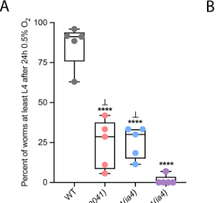

## Question

# Gene Research for Functional Annotation

## ⚠️ CRITICAL: Gene/Protein Identification Context

**BEFORE YOU BEGIN RESEARCH:** You MUST verify you are researching the CORRECT gene/protein. Gene symbols can be ambiguous, especially for less well-characterized genes from non-model organisms.

### Target Gene/Protein Identity (from UniProt):
- **UniProt Accession:** O45666
- **Protein Description:** RecName: Full=Nuclear hormone receptor family member nhr-49;
- **Gene Information:** Name=nhr-49; ORFNames=K10C3.6;
- **Organism (full):** Caenorhabditis elegans.
- **Protein Family:** Belongs to the nuclear hormone receptor family.
- **Key Domains:** HNF4-like_DBD. (IPR049636); NHR-like_dom_sf. (IPR035500); Nucl_hrmn_rcpt_lig-bd. (IPR000536); Nuclear_hormone_rcpt_NR2. (IPR050274); Nuclear_hrmn_rcpt. (IPR001723)

### MANDATORY VERIFICATION STEPS:

1. **Check if the gene symbol "nhr-49" matches the protein description above**
2. **Verify the organism is correct:** Caenorhabditis elegans.
3. **Check if protein family/domains align with what you find in literature**
4. **If you find literature for a DIFFERENT gene with the same or similar symbol, STOP**

### If Gene Symbol is Ambiguous or You Cannot Find Relevant Literature:

**DO NOT PROCEED WITH RESEARCH ON A DIFFERENT GENE.** Instead:
- State clearly: "The gene symbol 'nhr-49' is ambiguous or literature is limited for this specific protein"
- Explain what you found (e.g., "Found extensive literature on a different gene with the same symbol in a different organism")
- Describe the protein based ONLY on the UniProt information provided above
- Suggest that the protein function can be inferred from domain/family information

### Research Target:

Please provide a comprehensive research report on the gene **nhr-49** (gene ID: nhr-49, UniProt: O45666) in worm.

The research report should be a detailed narrative explaining the function, biological processes, and localization of the gene product. Citations should be given for all claims.

You should prioritize authoritative reviews and primary scientific literature when conducting research. You can supplement
this with annotations you find in gene/protein databases, but these can be outdated or inaccurate.

We are specifically interested in the primary function of the gene - for enzymes, what reaction is catalyzed, and what is the substrate specificity? For transporters, what is the substrate? For structural proteins or adapters, what is the broader structural role? For signaling molecules, what is the role in the pathway.

We are interested in where in or outside the cell the gene product carries out its function.

We are also interested in the signaling or biochemical pathways in which the gene functions. We are less interested in broad pleiotropic effects, except where these elucidate the precise role.

Include evidence where possible. We are interested in both experimental evidence as well as inference from structure, evolution, or bioinformatic analysis. Precise studies should be prioritized over high-throughput, where available.

## Output

Question: You are an expert researcher providing comprehensive, well-cited information.

Provide detailed information focusing on:
1. Key concepts and definitions with current understanding
2. Recent developments and latest research (prioritize 2023-2024 sources)
3. Current applications and real-world implementations
4. Expert opinions and analysis from authoritative sources
5. Relevant statistics and data from recent studies

Format as a comprehensive research report with proper citations. Include URLs and publication dates where available.
Always prioritize recent, authoritative sources and provide specific citations for all major claims.

# Gene Research for Functional Annotation

## ⚠️ CRITICAL: Gene/Protein Identification Context

**BEFORE YOU BEGIN RESEARCH:** You MUST verify you are researching the CORRECT gene/protein. Gene symbols can be ambiguous, especially for less well-characterized genes from non-model organisms.

### Target Gene/Protein Identity (from UniProt):
- **UniProt Accession:** O45666
- **Protein Description:** RecName: Full=Nuclear hormone receptor family member nhr-49;
- **Gene Information:** Name=nhr-49; ORFNames=K10C3.6;
- **Organism (full):** Caenorhabditis elegans.
- **Protein Family:** Belongs to the nuclear hormone receptor family.
- **Key Domains:** HNF4-like_DBD. (IPR049636); NHR-like_dom_sf. (IPR035500); Nucl_hrmn_rcpt_lig-bd. (IPR000536); Nuclear_hormone_rcpt_NR2. (IPR050274); Nuclear_hrmn_rcpt. (IPR001723)

### MANDATORY VERIFICATION STEPS:

1. **Check if the gene symbol "nhr-49" matches the protein description above**
2. **Verify the organism is correct:** Caenorhabditis elegans.
3. **Check if protein family/domains align with what you find in literature**
4. **If you find literature for a DIFFERENT gene with the same or similar symbol, STOP**

### If Gene Symbol is Ambiguous or You Cannot Find Relevant Literature:

**DO NOT PROCEED WITH RESEARCH ON A DIFFERENT GENE.** Instead:
- State clearly: "The gene symbol 'nhr-49' is ambiguous or literature is limited for this specific protein"
- Explain what you found (e.g., "Found extensive literature on a different gene with the same symbol in a different organism")
- Describe the protein based ONLY on the UniProt information provided above
- Suggest that the protein function can be inferred from domain/family information

### Research Target:

Please provide a comprehensive research report on the gene **nhr-49** (gene ID: nhr-49, UniProt: O45666) in worm.

The research report should be a detailed narrative explaining the function, biological processes, and localization of the gene product. Citations should be given for all claims.

You should prioritize authoritative reviews and primary scientific literature when conducting research. You can supplement
this with annotations you find in gene/protein databases, but these can be outdated or inaccurate.

We are specifically interested in the primary function of the gene - for enzymes, what reaction is catalyzed, and what is the substrate specificity? For transporters, what is the substrate? For structural proteins or adapters, what is the broader structural role? For signaling molecules, what is the role in the pathway.

We are interested in where in or outside the cell the gene product carries out its function.

We are also interested in the signaling or biochemical pathways in which the gene functions. We are less interested in broad pleiotropic effects, except where these elucidate the precise role.

Include evidence where possible. We are interested in both experimental evidence as well as inference from structure, evolution, or bioinformatic analysis. Precise studies should be prioritized over high-throughput, where available.

# Research Report: Functional Annotation of *Caenorhabditis elegans* **nhr-49** (UniProt **O45666**)

## 0) Target verification (mandatory disambiguation)
The target described in UniProt (O45666) is **NHR-49**, encoded by **nhr-49** (ORF **K10C3.6**) in **Caenorhabditis elegans**, and belongs to the **nuclear hormone receptor (NHR)** family with canonical **DNA-binding** and **ligand-binding** domains typical of HNF4/NR2-related receptors. The literature extracted here consistently refers to the *C. elegans* nuclear hormone receptor **NHR-49** with HNF4/PPARα-like roles in lipid metabolism and stress physiology, matching the UniProt-provided identity and domains (Frontiers review 2023-08-14; https://doi.org/10.3389/fphys.2023.1241591) (doering2023nuclearhormonereceptor pages 1-2).

## 1) Key concepts and definitions (current understanding)

### 1.1 What NHR-49 is
**NHR-49 is a sequence-specific transcription factor of the nuclear receptor superfamily**. It is widely described as functionally comparable to mammalian lipid-sensing nuclear receptors, especially **PPARα** (functional analogy) and **HNF4α** (structural similarity), and is among the best-characterized *C. elegans* NHRs (review published 2023-08-14; https://doi.org/10.3389/fphys.2023.1241591) (doering2023nuclearhormonereceptor pages 1-2).

### 1.2 Core molecular role
Across primary and review sources, the central mechanistic theme is that **NHR-49 coordinates transcriptional programs that balance lipid catabolism (β-oxidation), fatty-acid desaturation, lipid remodeling, and stress-protective responses** (doering2023nuclearhormonereceptor pages 1-2, pathare2012coordinateregulationof pages 2-3).

### 1.3 Nuclear receptor partnerships and co-regulators
A key concept for NHR-49 annotation is **context-dependent partnering**. In a major genetics study (PLOS Genetics, 2012-04; https://doi.org/10.1371/journal.pgen.1002645), NHR-49 was shown to regulate distinct gene subsets via **partnerships with other NHRs**, notably:
- **NHR-80**: linked to regulation of **fatty-acid desaturase** genes.
- **NHR-66**: linked to regulation of **sphingolipid/lipid remodeling** genes.
The same study used NHR-49’s ligand-binding domain (LBD) as bait in yeast two-hybrid screens and reported recovery of multiple candidate interacting factors (pathare2012coordinateregulationof pages 2-3, pathare2012coordinateregulationof pages 14-15).

## 2) Molecular function, localization, and pathway placement

### 2.1 Molecular function (what it “does”)
**Primary function**: NHR-49 acts as a **transcriptional regulator** that can both **activate** and **repress** metabolic gene programs.
- It activates gene modules involved in **fatty-acid β-oxidation** (including canonical targets such as **acs-2, cpt-5, ech-1**) and regulates **fatty-acid desaturation** genes (**fat-5, fat-6, fat-7**) (pathare2012coordinateregulationof pages 2-3).
- It is also implicated in **stress-protective transcription**, including oxidative-stress detoxification programs and regulation of detox genes (e.g., gst-4 in stress contexts) (G3, 2018-12; https://doi.org/10.1534/g3.118.200727) (hu2018thecaenorhabditiselegans pages 1-5).

**Coactivator dependence**: Multiple studies converge on **MDT-15 (Mediator subunit)** as a critical co-regulator for NHR-49-driven transcriptional outputs in metabolism and stress programs (hu2018thecaenorhabditiselegans pages 1-5, sala2024nuclearreceptorsignaling pages 1-2).

### 2.2 Ligand-binding: evidence and current limitations
Evidence strongly supports that **the LBD is functionally important** and likely ligand-responsive, but **a definitive endogenous ligand for NHR-49 is not established**.
- Gain-of-function missense mutations in **the LBD** (PLoS ONE, 2016-09-12; https://doi.org/10.1371/journal.pone.0162708) broadly increase NHR-49-regulated gene expression; structural modeling in that paper supports potential interaction with small molecules (lee2016gainoffunctionallelesin pages 1-2).
- A 2024 PLOS Biology paper proposes that **palmitic acid functions as a ligand activating “NHR-49/80”** to trigger early development under starvation, but the excerpted evidence notes that direct binding was not conclusively verified (kwon2024regulatoroflipid pages 9-11).
Taken together: **ligand regulation is plausible and an active area**, but functional annotation should phrase ligands as “putative/proposed” unless binding is directly shown.

### 2.3 Tissue and cellular localization (where it acts)
The most consistent localization evidence is **functional, tissue-specific rescue** and transgenic expression.
- **Neurons (cell-autonomous behavior control)**: A 2024 Cells paper (2024-06; https://doi.org/10.3390/cells13110978) shows NHR-49 function in specific **oxygen-sensing body cavity neurons (URX, AQR, PQR)** is sufficient to restore pathogen avoidance behaviors and normalize neuronal calcium kinetics (kwon2024regulatoroflipid pages 1-2, kwon2024regulatoroflipid pages 9-11).
- **Intestine (metabolic and proteostasis programs)**: A 2024 Genes & Development study (2024-05; https://doi.org/10.1101/gad.351829.124) uses intestinal promoters (e.g., gly-19p::nhr-49::gfp) and shows that intestinal NHR-49 activation improves proteostasis outcomes (sala2024nuclearreceptorsignaling pages 7-8).
- **Multi-tissue rescue in hypoxia adaptation**: eLife 2022 includes tissue-specific constructs (intestine, hypodermis, neurons, muscle) in defining an essential NHR-49 hypoxia pathway (2022-03; https://doi.org/10.7554/elife.67911) (doering2022nuclearhormonereceptor pages 8-11).

## 3) Key biological processes and pathways regulated by NHR-49

### 3.1 Lipid catabolism and fatty-acid β-oxidation (mitochondrial/peroxisomal)
In the canonical model, NHR-49 drives expression of fatty-acid utilization genes, including **acs-2, cpt-5, ech-1**, linking it to β-oxidation and lipid consumption pathways (pathare2012coordinateregulationof pages 2-3).

### 3.2 Fatty-acid desaturation and membrane lipid composition
NHR-49 regulates Δ9-desaturase genes **fat-5/fat-6/fat-7**, connecting it to MUFA production and lipid composition (pathare2012coordinateregulationof pages 2-3). A 2024 neuronal study further connects altered lipid composition in nhr-49 mutants to altered neuronal activity (kwon2024regulatoroflipid pages 9-11).

### 3.3 Lipid remodeling and sphingolipid programs via nuclear receptor partnerships
Pathare et al. (2012-04; https://doi.org/10.1371/journal.pgen.1002645) is central evidence that NHR-49’s downstream outputs partition into distinct modules depending on partner receptor context (notably NHR-66 and NHR-80), including sphingolipid/lipid remodeling genes (pathare2012coordinateregulationof pages 1-2, pathare2012coordinateregulationof pages 2-3).

### 3.4 Oxidative-stress and xenobiotic detoxification
NHR-49 is required for induction of detoxification programs (phase II enzymes) in oxidative stress contexts and works with MDT-15; it can also influence SKN-1 isoform expression in this context (G3, 2018-12; https://doi.org/10.1534/g3.118.200727) (hu2018thecaenorhabditiselegans pages 1-5).

### 3.5 Hypoxia adaptation via autophagy gene regulation (HIF-independent arm)
A major mechanistic expansion beyond “lipid metabolism” is an **essential hypoxia survival pathway** controlled by NHR-49 that operates **in parallel to HIF-1**, with NHR-49 being required for hypoxia-induced autophagosome formation (LGG-1::GFP foci) in seam cells (eLife, 2022-03; https://doi.org/10.7554/elife.67911) (doering2022nuclearhormonereceptor pages 8-11).

### 3.6 Proteostasis and heat-shock resilience (link to HSF-1)
A 2024 Genes & Development study places NHR-49/MDT-15 as a signaling module that links lipid metabolic remodeling to **HSF-1-dependent heat shock response** and proteostasis, demonstrating that NHR-49 activation can be sufficient to improve proteostasis measures (sala2024nuclearreceptorsignaling pages 1-2, sala2024nuclearreceptorsignaling pages 7-8).

### 3.7 Neuronal physiology and pathogen avoidance behavior (2024 advance)
A 2024 Cells paper identifies a **cell-autonomous neuronal role**: loss of nhr-49 causes impaired pathogen lawn avoidance (PA14) associated with **prolonged URX calcium transients after O2 upshift**, and neuronal rescue in URX/AQR/PQR improves both behavior and calcium kinetics. This work links lipid homeostasis and neuronal excitability and demonstrates a direct neural implementation of nhr-49 function beyond intestinal metabolism (kwon2024regulatoroflipid pages 1-2, kwon2024regulatoroflipid pages 9-11).

## 4) Recent developments (prioritizing 2023–2024)

### 4.1 2023 authoritative synthesis (expert review)
Doering et al. (Frontiers in Physiology, 2023-08-14; https://doi.org/10.3389/fphys.2023.1241591) consolidates NHR-49 as a hub integrating lipid metabolism with **stress resilience, immunity, and healthy aging**, and highlights open questions including tissue-specific outputs and upstream inputs (including ligand-like regulation) (doering2023nuclearhormonereceptor pages 1-2).

### 4.2 2023 mechanism: glucose restriction longevity through NHR-49 and desaturases
Jeong et al. (Nature Communications, 2023-01; https://doi.org/10.1038/s41467-023-35952-z) positions NHR-49 in a whole-animal signaling chain linking **glucose restriction → neuronal AMPK signaling → peripheral lipid remodeling**, reporting that restoration of NHR-49 in either neurons or intestine can rescue glucose-restriction longevity in an nhr-49 mutant background, consistent with non-cell-autonomous signaling (jeong2023anewampk pages 9-10).

### 4.3 2024 mechanism: NHR-49/MDT-15 regulates proteostasis through HSF-1
Sala et al. (Genes & Development, 2024-05; https://doi.org/10.1101/gad.351829.124) reports a lipid–proteostasis coupling in which NHR-49/MDT-15 acts upstream of **HSF-1**, linking reproductive/metabolic cues to organismal stress resilience; it provides quantitative aggregate-reduction data (sala2024nuclearreceptorsignaling pages 7-8).

### 4.4 2024 mechanism: neuronal NHR-49 tunes O2-sensing neuron activity and immune behavior
Kwon et al. (Cells, 2024-06; https://doi.org/10.3390/cells13110978) provides a neuron-specific implementation: NHR-49 in URX/AQR/PQR is required for normal calcium dynamics and PA14 avoidance, and dietary **oleic acid** can rescue deficits (kwon2024regulatoroflipid pages 1-2, kwon2024regulatoroflipid pages 9-11).

## 5) Quantitative statistics and data points (from the extracted sources)

### 5.1 Proteostasis (2024)
In Sala et al. (2024-05), intestinal activation of NHR-49 reduced polyglutamine aggregation: **Q35::mCherry aggregates were reduced by 30% at day 5 of adulthood** in an NHR-49-activated condition (sala2024nuclearreceptorsignaling pages 7-8).

### 5.2 Neuronal experiments (2024)
Kwon et al. (2024-06) uses multiple quantitative readouts for URX calcium transients (peak amplitude, rise/decay times, AUC, repolarization durations) and reports that **300 µM oleic acid** improved avoidance behavior and URX calcium kinetics; imaging trials with maximum **ΔF/F0 < 300%** were excluded per QC criteria (kwon2024regulatoroflipid pages 2-4, kwon2024regulatoroflipid pages 9-11).

### 5.3 Hypoxia survival and autophagy metrics (2022; still highly relevant and mechanistic)
Doering et al. (eLife, 2022-03) reports embryo-to-L4 survival after hypoxia and quantifies autophagy dependence. Example quantitative outcomes include:
- After **24 h at 0.5% O2**, approximately **86% of WT** embryos reached at least L4; after **48 h**, approximately **44% of WT** reached L4 (visual evidence in cropped figures) (doering2022nuclearhormonereceptor media de728d3f).
- Autophagy gene perturbations reduced survival, e.g. RNAi of **bec-1** to **27%** and **atg-10** to **28%** versus **79%** for empty-vector control; multiple autophagy mutants fell in the **41–44%** range under hypoxia (doering2022nuclearhormonereceptor pages 8-11).
These data support NHR-49 as a transcriptional regulator upstream of an autophagy module required for hypoxia tolerance (doering2022nuclearhormonereceptor pages 8-11).

### 5.4 Genome-wide expression thresholds (2012)
Pathare et al. (2012-04) reports microarray significance thresholds used to define NHR-49-regulated genes (absolute log2 ratio ≥ **0.848** and **p ≤ 0.001**) (pathare2012coordinateregulationof pages 1-2).

## 6) Current applications and real-world implementations

### 6.1 NHR-49 as a tool node for metabolic and stress biology in *C. elegans*
Because NHR-49 integrates lipid metabolism with stress resilience and aging, it is widely used as:
- A **genetic node** to test how interventions (dietary composition, fasting, glucose restriction) reprogram metabolism and stress resistance (doering2023nuclearhormonereceptor pages 1-2, jeong2023anewampk pages 9-10).
- A **tissue-specific biology model** (neurons vs intestine vs hypodermis) for dissecting cell-autonomous versus systemic lipid signaling mechanisms (kwon2024regulatoroflipid pages 1-2, sala2024nuclearreceptorsignaling pages 7-8, doering2022nuclearhormonereceptor pages 8-11).

### 6.2 Mechanism-guided intervention testing
Recent primary studies show NHR-49-dependent phenotypes are modifiable by defined nutritional manipulations:
- **Oleic acid supplementation (300 µM)** modifies neuronal physiology and PA14 avoidance in nhr-49 mutants, operationalizing lipid supplementation as a functional test of NHR-49-linked lipid dysfunction in neurons (kwon2024regulatoroflipid pages 2-4, kwon2024regulatoroflipid pages 9-11).
- In glucose restriction models, NHR-49 sits in a chain connecting dietary inputs to membrane lipid remodeling and longevity, making it a practical target for mechanism-driven dietary/genetic perturbation experiments (jeong2023anewampk pages 9-10).

## 7) Expert opinion and analysis (authoritative synthesis)
A consistent expert perspective, especially in the 2023 Frontiers review, is that NHR-49 should be annotated not merely as a “lipid metabolism regulator,” but as a **systems integrator** that:
1) couples lipid catabolism/desaturation programs to **organismal stress-defense networks**, and
2) produces **tissue-specific outputs** (intestinal metabolic remodeling; neuronal excitability control; hypoxia/autophagy survival) while potentially receiving upstream regulation by unknown ligand-like inputs or metabolic state signals (doering2023nuclearhormonereceptor pages 1-2).

## Summary table (evidence map)
| Category | Key findings | Best supporting sources |
|---|---|---|
| Identity/domains | **nhr-49** in **Caenorhabditis elegans** encodes **NHR-49**, an HNF4-like nuclear hormone receptor transcription factor functionally compared with mammalian **HNF4α** and **PPARα**; it has canonical DNA-binding and ligand-binding domains, and GOF mutations map to the LBD. | (doering2023nuclearhormonereceptor pages 1-2, lee2016gainoffunctionallelesin pages 1-2) |
| Molecular function | Sequence-specific nuclear receptor transcription factor that both activates and represses gene programs controlling fatty-acid metabolism; required for fasting and oxidative-stress transcriptional responses and works with **MDT-15**. Structural modeling supports likely small-molecule interaction via the LBD, but no definitive endogenous ligand is established. | (doering2023nuclearhormonereceptor pages 1-2, lee2016gainoffunctionallelesin pages 1-2, hu2018thecaenorhabditiselegans pages 1-5) |
| Partners/cofactors | Validated partners include **MDT-15** as coactivator, **NHR-80** for desaturase gene activation, and **NHR-66** for repressive lipid-remodeling and sphingolipid programs; **NHR-13** also contributes to desaturase regulation without confirmed direct physical interaction. Yeast two-hybrid using NHR-49-LBD recovered **24 independent cDNAs from 13 genes**. | (pathare2012coordinateregulationof pages 2-3, pathare2012coordinateregulationof pages 14-15) |
| Tissue/cellular localization | Broadly expressed in multiple tissues, including **intestine** and **neurons**. Cell-specific rescue places key functions in **URX/AQR/PQR body-cavity neurons** for pathogen avoidance and calcium control, and in **intestine** for proteostasis and stress programs; hypoxia studies also tested rescue in hypodermis, neurons, and muscle. GOF substitutions did not alter measured subcellular localization. | (lee2016gainoffunctionallelesin pages 1-2, kwon2024regulatoroflipid pages 1-2, sala2024nuclearreceptorsignaling pages 7-8, doering2022nuclearhormonereceptor pages 8-11) |
| Key pathways/targets | Major outputs include mitochondrial and peroxisomal β-oxidation genes **acs-2, cpt-5, ech-1**; fatty-acid desaturases **fat-5, fat-6, fat-7**; sphingolipid and lipid-remodeling genes; glyoxylate cycle gene **icl-1**; lipid transport genes **lbp-1, lbp-8**; and stress or immune genes including **fmo-2** and **gst-4**. It also supports autophagy-linked hypoxia adaptation and neuronal lipid homeostasis. | (pathare2012coordinateregulationof pages 1-2, lee2016functionalcharacterizationof pages 22-26, pathare2012coordinateregulationof pages 2-3, hu2018thecaenorhabditiselegans pages 1-5, doering2022nuclearhormonereceptor pages 8-11) |
| Phenotypes | Loss of **nhr-49** causes high fat, impaired fasting response, shortened lifespan, altered mitochondrial morphology and function, defective pathogen avoidance, and increased sensitivity to oxidative stress, hypoxia, and infection. GOF alleles are functionally distinct and can produce long-, short-, or normal-lifespan outcomes depending on allele. | (pathare2012coordinateregulationof pages 1-2, lee2016gainoffunctionallelesin pages 1-2, hu2018thecaenorhabditiselegans pages 1-5, kwon2024regulatoroflipid pages 1-2) |
| Recent 2023-2024 developments | **2023:** review consolidates NHR-49 as a core stress-resilience and healthy-aging regulator; glucose-restriction longevity requires non-cell-autonomous **PAQR-2/NHR-49/Δ9-desaturase** signaling. **2024:** NHR-49 and MDT-15 were shown to couple lipid homeostasis to **HSF-1** proteostasis; neuronal NHR-49 in URX/AQR/PQR tunes calcium dynamics and **PA14** avoidance; free long-chain fatty acids were proposed to activate **NHR-49/80** signaling to initiate development. | (doering2023nuclearhormonereceptor pages 1-2, sala2024nuclearreceptorsignaling pages 1-2, kwon2024regulatoroflipid pages 1-2, sala2024nuclearreceptorsignaling pages 7-8, jeong2023anewampk pages 9-10) |
| Quantitative data points | **Microarray cutoff:** absolute log2 ratio at least **0.848** and **p ≤ 0.001** for NHR-49-regulated genes. **Oleic acid rescue:** **300 µM** OA improved avoidance and URX calcium kinetics. **Calcium imaging:** trials with max **ΔF/F0 < 300%** were excluded. **Proteostasis:** intestinal NHR-49 activation reduced **Q35 aggregates by 30%** at day 5 adulthood. **Hypoxia:** after **24 h at 0.5% O2**, about **86% WT** embryos reached L4; after **48 h**, about **44% WT** reached L4. Autophagy-pathway perturbations lowered hypoxia survival to **27–44%** versus **79%** EV control. | (pathare2012coordinateregulationof pages 1-2, kwon2024regulatoroflipid pages 2-4, kwon2024regulatoroflipid pages 9-11, sala2024nuclearreceptorsignaling pages 7-8, doering2022nuclearhormonereceptor pages 8-11, doering2022nuclearhormonereceptor media de728d3f) |

*Table: This table summarizes verified identity, molecular function, pathways, localization, phenotypes, and recent 2023-2024 findings for C. elegans NHR-49/UniProt O45666. It provides a concise evidence map for functional annotation with supporting citation IDs.*

## Visual evidence (hypoxia survival/autophagy)
Cropped figure panels supporting the quantitative hypoxia survival and autophagy-foci conclusions are available from the eLife 2022 paper (doering2022nuclearhormonereceptor media de728d3f, doering2022nuclearhormonereceptor media 16c37f01, doering2022nuclearhormonereceptor media 19a845b3).

## Evidence gaps / cautions for annotation
- **Direct ligand identification** for NHR-49 remains unresolved in the extracted evidence; several studies support LBD importance and ligand-like regulation but do not conclusively establish a specific endogenous ligand-binding event (lee2016gainoffunctionallelesin pages 1-2, kwon2024regulatoroflipid pages 9-11).
- Some classic early primary papers that originally defined fasting response targets are referenced indirectly in reviews/dissertations but were not fully extracted here; therefore, targets listed are limited to those explicitly supported in the retrieved evidence (doering2023nuclearhormonereceptor pages 1-2, pathare2012coordinateregulationof pages 2-3).

References

1. (doering2023nuclearhormonereceptor pages 1-2): Kelsie R. S. Doering, Glafira Ermakova, and Stefan Taubert. Nuclear hormone receptor nhr-49 is an essential regulator of stress resilience and healthy aging in caenorhabditis elegans. Frontiers in Physiology, Aug 2023. URL: https://doi.org/10.3389/fphys.2023.1241591, doi:10.3389/fphys.2023.1241591. This article has 27 citations.

2. (pathare2012coordinateregulationof pages 2-3): Pranali P. Pathare, Alex Lin, Karin E. Bornfeldt, Stefan Taubert, and Marc R. Van Gilst. Coordinate regulation of lipid metabolism by novel nuclear receptor partnerships. PLoS Genetics, 8:e1002645, Apr 2012. URL: https://doi.org/10.1371/journal.pgen.1002645, doi:10.1371/journal.pgen.1002645. This article has 139 citations and is from a domain leading peer-reviewed journal.

3. (pathare2012coordinateregulationof pages 14-15): Pranali P. Pathare, Alex Lin, Karin E. Bornfeldt, Stefan Taubert, and Marc R. Van Gilst. Coordinate regulation of lipid metabolism by novel nuclear receptor partnerships. PLoS Genetics, 8:e1002645, Apr 2012. URL: https://doi.org/10.1371/journal.pgen.1002645, doi:10.1371/journal.pgen.1002645. This article has 139 citations and is from a domain leading peer-reviewed journal.

4. (hu2018thecaenorhabditiselegans pages 1-5): Queenie Hu, Dayana R D’Amora, Lesley T MacNeil, Albertha J M Walhout, and Terrance J Kubiseski. The <i>caenorhabditis elegans</i> oxidative stress response requires the nhr-49 transcription factor. G3 Genes|Genomes|Genetics, 8:3857-3863, Dec 2018. URL: https://doi.org/10.1534/g3.118.200727, doi:10.1534/g3.118.200727. This article has 51 citations.

5. (sala2024nuclearreceptorsignaling pages 1-2): Ambre J. Sala, Rogan A. Grant, Ghania Imran, Claire Morton, Renee M. Brielmann, Szymon Gorgoń, Jennifer Watts, Laura C. Bott, and Richard I. Morimoto. Nuclear receptor signaling via nhr-49/mdt-15 regulates stress resilience and proteostasis in response to reproductive and metabolic cues. Genes &amp; Development, May 2024. URL: https://doi.org/10.1101/gad.351829.124, doi:10.1101/gad.351829.124. This article has 9 citations and is from a highest quality peer-reviewed journal.

6. (lee2016gainoffunctionallelesin pages 1-2): Kayoung Lee, Grace Ying Shyen Goh, Marcus Andrew Wong, Tara Leah Klassen, and Stefan Taubert. Gain-of-function alleles in caenorhabditis elegans nuclear hormone receptor nhr-49 are functionally distinct. PLoS ONE, 11:e0162708, Sep 2016. URL: https://doi.org/10.1371/journal.pone.0162708, doi:10.1371/journal.pone.0162708. This article has 44 citations and is from a peer-reviewed journal.

7. (kwon2024regulatoroflipid pages 9-11): Saebom Kwon, Kyu-Sang Park, and Kyoung-hye Yoon. Regulator of lipid metabolism nhr-49 mediates pathogen avoidance through precise control of neuronal activity. Cells, 13:978, Jun 2024. URL: https://doi.org/10.3390/cells13110978, doi:10.3390/cells13110978. This article has 3 citations.

8. (kwon2024regulatoroflipid pages 1-2): Saebom Kwon, Kyu-Sang Park, and Kyoung-hye Yoon. Regulator of lipid metabolism nhr-49 mediates pathogen avoidance through precise control of neuronal activity. Cells, 13:978, Jun 2024. URL: https://doi.org/10.3390/cells13110978, doi:10.3390/cells13110978. This article has 3 citations.

9. (sala2024nuclearreceptorsignaling pages 7-8): Ambre J. Sala, Rogan A. Grant, Ghania Imran, Claire Morton, Renee M. Brielmann, Szymon Gorgoń, Jennifer Watts, Laura C. Bott, and Richard I. Morimoto. Nuclear receptor signaling via nhr-49/mdt-15 regulates stress resilience and proteostasis in response to reproductive and metabolic cues. Genes &amp; Development, May 2024. URL: https://doi.org/10.1101/gad.351829.124, doi:10.1101/gad.351829.124. This article has 9 citations and is from a highest quality peer-reviewed journal.

10. (doering2022nuclearhormonereceptor pages 8-11): Kelsie RS Doering, Xuanjin Cheng, Luke Milburn, Ramesh Ratnappan, Arjumand Ghazi, Dana L Miller, and Stefan Taubert. Nuclear hormone receptor nhr-49 acts in parallel with hif-1 to promote hypoxia adaptation in caenorhabditis elegans. eLife, Mar 2022. URL: https://doi.org/10.7554/elife.67911, doi:10.7554/elife.67911. This article has 29 citations and is from a domain leading peer-reviewed journal.

11. (pathare2012coordinateregulationof pages 1-2): Pranali P. Pathare, Alex Lin, Karin E. Bornfeldt, Stefan Taubert, and Marc R. Van Gilst. Coordinate regulation of lipid metabolism by novel nuclear receptor partnerships. PLoS Genetics, 8:e1002645, Apr 2012. URL: https://doi.org/10.1371/journal.pgen.1002645, doi:10.1371/journal.pgen.1002645. This article has 139 citations and is from a domain leading peer-reviewed journal.

12. (jeong2023anewampk pages 9-10): Jin-Hyuck Jeong, Jun-Seok Han, Youngae Jung, Seung-Min Lee, So-Hyun Park, Mooncheol Park, Min-Gi Shin, Nami Kim, Mi Sun Kang, Seokho Kim, Kwang-Pyo Lee, Ki-Sun Kwon, Chun-A. Kim, Yong Ryoul Yang, Geum-Sook Hwang, and Eun-Soo Kwon. A new ampk isoform mediates glucose-restriction induced longevity non-cell autonomously by promoting membrane fluidity. Nature Communications, Jan 2023. URL: https://doi.org/10.1038/s41467-023-35952-z, doi:10.1038/s41467-023-35952-z. This article has 41 citations and is from a highest quality peer-reviewed journal.

13. (kwon2024regulatoroflipid pages 2-4): Saebom Kwon, Kyu-Sang Park, and Kyoung-hye Yoon. Regulator of lipid metabolism nhr-49 mediates pathogen avoidance through precise control of neuronal activity. Cells, 13:978, Jun 2024. URL: https://doi.org/10.3390/cells13110978, doi:10.3390/cells13110978. This article has 3 citations.

14. (doering2022nuclearhormonereceptor media de728d3f): Kelsie RS Doering, Xuanjin Cheng, Luke Milburn, Ramesh Ratnappan, Arjumand Ghazi, Dana L Miller, and Stefan Taubert. Nuclear hormone receptor nhr-49 acts in parallel with hif-1 to promote hypoxia adaptation in caenorhabditis elegans. eLife, Mar 2022. URL: https://doi.org/10.7554/elife.67911, doi:10.7554/elife.67911. This article has 29 citations and is from a domain leading peer-reviewed journal.

15. (lee2016functionalcharacterizationof pages 22-26): Ka Young Lee. Functional characterization of gene regulation by nhr-49. ArXiv, Jan 2016. URL: https://doi.org/10.14288/1.0305709, doi:10.14288/1.0305709. This article has 0 citations.

16. (doering2022nuclearhormonereceptor media 16c37f01): Kelsie RS Doering, Xuanjin Cheng, Luke Milburn, Ramesh Ratnappan, Arjumand Ghazi, Dana L Miller, and Stefan Taubert. Nuclear hormone receptor nhr-49 acts in parallel with hif-1 to promote hypoxia adaptation in caenorhabditis elegans. eLife, Mar 2022. URL: https://doi.org/10.7554/elife.67911, doi:10.7554/elife.67911. This article has 29 citations and is from a domain leading peer-reviewed journal.

17. (doering2022nuclearhormonereceptor media 19a845b3): Kelsie RS Doering, Xuanjin Cheng, Luke Milburn, Ramesh Ratnappan, Arjumand Ghazi, Dana L Miller, and Stefan Taubert. Nuclear hormone receptor nhr-49 acts in parallel with hif-1 to promote hypoxia adaptation in caenorhabditis elegans. eLife, Mar 2022. URL: https://doi.org/10.7554/elife.67911, doi:10.7554/elife.67911. This article has 29 citations and is from a domain leading peer-reviewed journal.

## Artifacts

- [Edison artifact artifact-00](nhr-49-deep-research-falcon_artifacts/artifact-00.md)

## Citations

1. doering2023nuclearhormonereceptor pages 1-2
2. pathare2012coordinateregulationof pages 2-3
3. hu2018thecaenorhabditiselegans pages 1-5
4. lee2016gainoffunctionallelesin pages 1-2
5. kwon2024regulatoroflipid pages 9-11
6. sala2024nuclearreceptorsignaling pages 7-8
7. doering2022nuclearhormonereceptor pages 8-11
8. jeong2023anewampk pages 9-10
9. pathare2012coordinateregulationof pages 1-2
10. pathare2012coordinateregulationof pages 14-15
11. sala2024nuclearreceptorsignaling pages 1-2
12. kwon2024regulatoroflipid pages 1-2
13. kwon2024regulatoroflipid pages 2-4
14. lee2016functionalcharacterizationof pages 22-26
15. https://doi.org/10.3389/fphys.2023.1241591
16. https://doi.org/10.1371/journal.pgen.1002645
17. https://doi.org/10.1534/g3.118.200727
18. https://doi.org/10.1371/journal.pone.0162708
19. https://doi.org/10.3390/cells13110978
20. https://doi.org/10.1101/gad.351829.124
21. https://doi.org/10.7554/elife.67911
22. https://doi.org/10.1038/s41467-023-35952-z
23. https://doi.org/10.3389/fphys.2023.1241591,
24. https://doi.org/10.1371/journal.pgen.1002645,
25. https://doi.org/10.1534/g3.118.200727,
26. https://doi.org/10.1101/gad.351829.124,
27. https://doi.org/10.1371/journal.pone.0162708,
28. https://doi.org/10.3390/cells13110978,
29. https://doi.org/10.7554/elife.67911,
30. https://doi.org/10.1038/s41467-023-35952-z,
31. https://doi.org/10.14288/1.0305709,