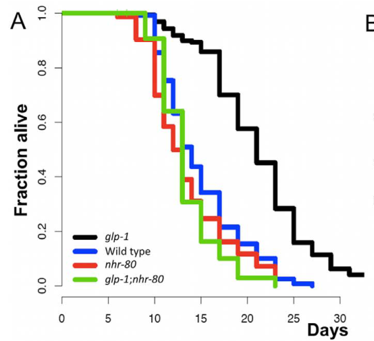

## Question

# Gene Research for Functional Annotation

## ⚠️ CRITICAL: Gene/Protein Identification Context

**BEFORE YOU BEGIN RESEARCH:** You MUST verify you are researching the CORRECT gene/protein. Gene symbols can be ambiguous, especially for less well-characterized genes from non-model organisms.

### Target Gene/Protein Identity (from UniProt):
- **UniProt Accession:** Q8ITW8
- **Protein Description:** RecName: Full=Nuclear hormone receptor family member nhr-80 {ECO:0000312|WormBase:H10E21.3b};
- **Gene Information:** Name=nhr-80 {ECO:0000312|WormBase:H10E21.3b}; ORFNames=H10E21.3 {ECO:0000312|WormBase:H10E21.3b};
- **Organism (full):** Caenorhabditis elegans.
- **Protein Family:** Belongs to the nuclear hormone receptor family.
- **Key Domains:** HNF4-like_DBD. (IPR049636); NHR-like_dom_sf. (IPR035500); Nucl_hrmn_rcpt_lig-bd. (IPR000536); Znf_hrmn_rcpt. (IPR001628); Znf_NHR/GATA. (IPR013088)

### MANDATORY VERIFICATION STEPS:

1. **Check if the gene symbol "nhr-80" matches the protein description above**
2. **Verify the organism is correct:** Caenorhabditis elegans.
3. **Check if protein family/domains align with what you find in literature**
4. **If you find literature for a DIFFERENT gene with the same or similar symbol, STOP**

### If Gene Symbol is Ambiguous or You Cannot Find Relevant Literature:

**DO NOT PROCEED WITH RESEARCH ON A DIFFERENT GENE.** Instead:
- State clearly: "The gene symbol 'nhr-80' is ambiguous or literature is limited for this specific protein"
- Explain what you found (e.g., "Found extensive literature on a different gene with the same symbol in a different organism")
- Describe the protein based ONLY on the UniProt information provided above
- Suggest that the protein function can be inferred from domain/family information

### Research Target:

Please provide a comprehensive research report on the gene **nhr-80** (gene ID: nhr-80, UniProt: Q8ITW8) in worm.

The research report should be a detailed narrative explaining the function, biological processes, and localization of the gene product. Citations should be given for all claims.

You should prioritize authoritative reviews and primary scientific literature when conducting research. You can supplement
this with annotations you find in gene/protein databases, but these can be outdated or inaccurate.

We are specifically interested in the primary function of the gene - for enzymes, what reaction is catalyzed, and what is the substrate specificity? For transporters, what is the substrate? For structural proteins or adapters, what is the broader structural role? For signaling molecules, what is the role in the pathway.

We are interested in where in or outside the cell the gene product carries out its function.

We are also interested in the signaling or biochemical pathways in which the gene functions. We are less interested in broad pleiotropic effects, except where these elucidate the precise role.

Include evidence where possible. We are interested in both experimental evidence as well as inference from structure, evolution, or bioinformatic analysis. Precise studies should be prioritized over high-throughput, where available.

## Output

Question: You are an expert researcher providing comprehensive, well-cited information.

Provide detailed information focusing on:
1. Key concepts and definitions with current understanding
2. Recent developments and latest research (prioritize 2023-2024 sources)
3. Current applications and real-world implementations
4. Expert opinions and analysis from authoritative sources
5. Relevant statistics and data from recent studies

Format as a comprehensive research report with proper citations. Include URLs and publication dates where available.
Always prioritize recent, authoritative sources and provide specific citations for all major claims.

# Gene Research for Functional Annotation

## ⚠️ CRITICAL: Gene/Protein Identification Context

**BEFORE YOU BEGIN RESEARCH:** You MUST verify you are researching the CORRECT gene/protein. Gene symbols can be ambiguous, especially for less well-characterized genes from non-model organisms.

### Target Gene/Protein Identity (from UniProt):
- **UniProt Accession:** Q8ITW8
- **Protein Description:** RecName: Full=Nuclear hormone receptor family member nhr-80 {ECO:0000312|WormBase:H10E21.3b};
- **Gene Information:** Name=nhr-80 {ECO:0000312|WormBase:H10E21.3b}; ORFNames=H10E21.3 {ECO:0000312|WormBase:H10E21.3b};
- **Organism (full):** Caenorhabditis elegans.
- **Protein Family:** Belongs to the nuclear hormone receptor family.
- **Key Domains:** HNF4-like_DBD. (IPR049636); NHR-like_dom_sf. (IPR035500); Nucl_hrmn_rcpt_lig-bd. (IPR000536); Znf_hrmn_rcpt. (IPR001628); Znf_NHR/GATA. (IPR013088)

### MANDATORY VERIFICATION STEPS:

1. **Check if the gene symbol "nhr-80" matches the protein description above**
2. **Verify the organism is correct:** Caenorhabditis elegans.
3. **Check if protein family/domains align with what you find in literature**
4. **If you find literature for a DIFFERENT gene with the same or similar symbol, STOP**

### If Gene Symbol is Ambiguous or You Cannot Find Relevant Literature:

**DO NOT PROCEED WITH RESEARCH ON A DIFFERENT GENE.** Instead:
- State clearly: "The gene symbol 'nhr-80' is ambiguous or literature is limited for this specific protein"
- Explain what you found (e.g., "Found extensive literature on a different gene with the same symbol in a different organism")
- Describe the protein based ONLY on the UniProt information provided above
- Suggest that the protein function can be inferred from domain/family information

### Research Target:

Please provide a comprehensive research report on the gene **nhr-80** (gene ID: nhr-80, UniProt: Q8ITW8) in worm.

The research report should be a detailed narrative explaining the function, biological processes, and localization of the gene product. Citations should be given for all claims.

You should prioritize authoritative reviews and primary scientific literature when conducting research. You can supplement
this with annotations you find in gene/protein databases, but these can be outdated or inaccurate.

We are specifically interested in the primary function of the gene - for enzymes, what reaction is catalyzed, and what is the substrate specificity? For transporters, what is the substrate? For structural proteins or adapters, what is the broader structural role? For signaling molecules, what is the role in the pathway.

We are interested in where in or outside the cell the gene product carries out its function.

We are also interested in the signaling or biochemical pathways in which the gene functions. We are less interested in broad pleiotropic effects, except where these elucidate the precise role.

Include evidence where possible. We are interested in both experimental evidence as well as inference from structure, evolution, or bioinformatic analysis. Precise studies should be prioritized over high-throughput, where available.

# Research report: Functional annotation of *C. elegans* **nhr-80** (UniProt Q8ITW8)

## 0) Target verification (mandatory)
All cited sources refer to *Caenorhabditis elegans* **nhr-80** (commonly using the **tm1011** loss-of-function allele and/or RNAi) as a **nuclear hormone receptor (NHR)** with HNF4-like features that regulates lipid metabolism and partners with **NHR-49**. This matches the user-supplied identity (UniProt Q8ITW8; ORF H10E21.3) and avoids cross-organism ambiguity. (brock2006geneticregulationof pages 2-3, pathare2012coordinateregulationof pages 11-14, goudeau2011fattyaciddesaturation pages 2-3)

## 1) Key concepts and definitions (current understanding)
### 1.1 What kind of protein is NHR-80?
**NHR-80 is a nuclear hormone receptor (ligand-regulated transcription factor family)** in *C. elegans* that controls gene expression programs relevant to lipid metabolism. Experimentally, it is described as a **C4 zinc-finger nuclear receptor** (consistent with canonical NHR DNA-binding domains) and as an **HNF4-like NHR** in the context of germline-loss longevity. (yang2022nhr80sensesthe pages 12-14, goudeau2011fattyaciddesaturation pages 2-3)

### 1.2 Core molecular function
Across foundational studies, the best-supported primary function is that **NHR-80 is a transcriptional regulator of fatty-acid desaturation and lipogenic remodeling**, particularly maintaining sufficient **monounsaturated fatty acids (MUFAs)** by regulating **Δ9 desaturases**. (brock2006geneticregulationof pages 2-3, brock2006geneticregulationof pages 1-2)

### 1.3 Key pathway concept: Δ9 desaturation module
In *C. elegans*, **fat-5, fat-6, fat-7** encode Δ9 desaturases (stearoyl-CoA desaturase-like enzymes) that convert saturated fatty acids to MUFAs. NHR-80 is required for appropriate expression of these desaturases and for compensatory desaturase induction when one isoform is missing. (brock2006geneticregulationof pages 2-3, brock2006geneticregulationof pages 6-7)

### 1.4 Partnership with NHR-49
A central mechanistic theme is **NHR partnership/dimerization logic**: NHR-80 serves as a **binding partner/cofactor of NHR-49**, and the pair regulates subsets of lipid-metabolism genes—especially desaturases. (pathare2012coordinateregulationof pages 11-14)

## 2) Biological roles supported by primary experimental evidence
### 2.1 Tissue and subcellular localization
NHR-80 is reported as **expressed in the intestine** (major metabolic tissue) and shows **nuclear localization**, including increased intestinal nuclear signal in germline-less animals. The paper provides direct imaging evidence of intestinal nuclear localization of **NHR-80::GFP** in germline-depleted contexts (see figure crop citations). (brock2006geneticregulationof pages 2-3, goudeau2011fattyaciddesaturation pages 2-3, goudeau2011fattyaciddesaturation media bedcfaf2, goudeau2011fattyaciddesaturation media 06494e4e)

### 2.2 Regulation of fatty-acid composition via Δ9 desaturases
Loss of nhr-80 alters fatty-acid composition in a direction consistent with reduced Δ9 desaturation. In **nhr-80(tm1011)** mutants, **stearic acid (18:0)** increases and **oleic acid (18:1 Δ9)** decreases compared to wild type; importantly, **triglyceride fraction is unchanged**, consistent with a role in composition/homeostasis rather than bulk storage under baseline conditions. Quantitatively: 18:0 = **10.2 ± 0.3%** and 18:1Δ9 = **2.2 ± 0.1%** of total fatty acids in nhr-80 mutants vs **6.8 ± 0.2%** and **3.2 ± 0.1%** in WT; triglycerides **44 ± 1%** vs **45 ± 1%** WT. (brock2006geneticregulationof pages 2-3)

A key *functional* demonstration is genetic stress on the desaturation network: **fat-6;nhr-80** double deficiency (or fat-6 with nhr-80 RNAi) results in severe growth/viability defects on unsupplemented plates, and the compensatory induction of other desaturases (e.g., fat-7) requires NHR-80. In fat-6 mutants, fat-7 can increase **~37-fold**, but under **nhr-80 RNAi fat-7 expression falls to <10%** of fat-6 control levels. (brock2006geneticregulationof pages 6-7)

### 2.3 Germline-loss longevity: NHR-80/FAT-6/oleic-acid axis
A high-confidence functional role for NHR-80 is in **lifespan extension caused by germline removal**. Germline loss extends lifespan by **~60%**, and nhr-80 is selectively required for this longevity program: loss of nhr-80 reduces mean lifespan of glp-1 germline-less animals by **45% (p < 0.0001)** while having no significant effect on WT lifespan (mean ~15 d, p=0.55). In mes-1 sterile mutants, nhr-80 RNAi decreases mean lifespan from **21 d to 14 d (p < 0.0001)**. Mechanistically, NHR-80 promotes fatty-acid desaturation via **fat-6** to increase **oleic acid**, forming an NHR-80/FAT-6/OA pathway that requires **DAF-12** but is **DAF-16 independent** in this context. (goudeau2011fattyaciddesaturation pages 2-3, goudeau2011fattyaciddesaturation pages 1-2)

The associated images show suppression of the glp-1 longevity phenotype by nhr-80 mutation and nuclear intestinal localization of NHR-80::GFP. (goudeau2011fattyaciddesaturation media bedcfaf2, goudeau2011fattyaciddesaturation media 06494e4e)

### 2.4 Lysosome-to-nucleus lipid signaling (LIPL-4 → LBP-8 → NHR-49/NHR-80)
In a distinct longevity program, intestinal lysosomal lipolysis triggers a **lipid signaling axis** requiring NHR-49 and NHR-80. Intestinal lysosomal **lipl-4** overexpression increases mean lifespan by **55%**, and **lbp-8** transgenics by **30%**; both longevity effects require NHR-49 and NHR-80. Mechanistically, metabolomics identified **oleoylethanolamide (OEA)** as a lipid increased by LIPL-4 that **binds LBP-8 and NHR-80** and activates NHR-49/NHR-80 target transcription. (folick2015lysosomalsignalingmolecules pages 1-3)

### 2.5 NHR-49/NHR-80 partnership and mitochondrial physiology
Beyond gene expression, NHR-80 contributes to mitochondrial phenotypes within the NHR-49 network. In nhr-80 mutants, mitochondrial morphology and basal oxygen consumption/β-oxidation outputs differ significantly from wild type in quantitative assays (e.g., reported p-values including **p < 0.0001**, with respiration-related comparisons reported with **p < 0.001** in grouped analyses), consistent with systemic consequences of altered membrane lipid composition and desaturase regulation. (pathare2012coordinateregulationof pages 11-14)

### 2.6 Mitochondrial UPR (UPRmt) coupling to lipogenesis via DVE-1 → NHR-80
A more recently characterized regulatory input is mitochondrial stress signaling: NHR-80 is induced (mRNA/protein) under **UPRmt** conditions triggered by mitochondrial perturbations or citrate, acting downstream of **DVE-1** (with functional DVE-1 binding sites in the nhr-80 promoter). NHR-80 then binds/transactivates lipogenic genes including **dgat-2** and desaturases. This connects mitochondrial surveillance to lipid storage/remodeling programs. (yang2022nhr80sensesthe pages 12-14)

## 3) Recent developments (prioritizing 2023–2024)
### 3.1 2024: Free long-chain fatty acids trigger early development via NHR-49/80 signaling (FEDUS)
A 2024 *PLOS Biology* study established that **palmitic acid** can initiate early postembryonic development under starvation via a gut–brain axis requiring NHR signaling. Key nhr-80-specific updates:
* Palmitic acid promotes **intestinal nuclear localization of NHR-80**. (ruan2024freelongchainfatty pages 11-12)
* The model proposes that activation of NHR-49 (and NHR-80-associated functions) induces a secreted **peroxisome-derived hormone (“Perokine”)**, sensed by ciliated sensory neurons, leading to neuropeptide secretion and downstream **IIS–DAF-12** signaling. (ruan2024freelongchainfatty pages 12-15, ruan2024freelongchainfatty pages 15-16)
* A quantitative systems-level observation: co-culture with **raga-1(-)** animals induces development in **~40%** of WT L1s without palmitic acid, supporting a secreted-factor mechanism. (ruan2024freelongchainfatty pages 11-12)
* Cross-species translational element: palmitic acid activates the mammalian ortholog **PPARα** in a HEK293 reporter assay, consistent with conserved lipid-sensing logic. (ruan2024freelongchainfatty pages 11-12)

Publication details: Ruan et al., **October 22, 2024**, *PLOS Biology*; URL https://doi.org/10.1371/journal.pbio.3002841. (ruan2024freelongchainfatty pages 11-12, ruan2024freelongchainfatty pages 12-15)

### 3.2 2024: Microbiota-derived small molecules regulate fat desaturation via the NHR-49 axis (context for NHR-49/NHR-80 module)
A 2024 *Nature Communications* study identified microbiota-dependent and endogenous fatty-acid-like metabolites that activate fat desaturation via **NHR-49/PPARα**, reinforcing the emerging view that nematode lipid desaturation is tuned by small-molecule signals at the NHR layer (with NHR-80 an established NHR-49 interactor in desaturase regulation). (fox2024evolutionarilyrelatedhost pages 1-2)

Publication details: Fox et al., accepted **January 31, 2024** (*Nature Communications* 2024); URL https://doi.org/10.1038/s41467-024-45782-2. (fox2024evolutionarilyrelatedhost pages 1-2)

### 3.3 2023: Reviews consolidate the NHR-49/NHR-80 desaturase logic and oleic-acid rescue relationships
A 2023 review of NHR-49 integrates prior findings and highlights that **NHR-80 and NHR-49** are both required for expression of **fat-6** and **fat-7** (with nhr-49, but not nhr-80, required for fat-5 in that summary), emphasizing partial division of labor even within shared desaturation outputs. It also reports that **dietary oleic acid** can completely rescue shortened lifespan in **glp-1;nhr-80** double mutants but only partially rescues **glp-1;nhr-49** mutants, consistent with NHR-49 having additional longevity-relevant outputs beyond desaturation. (doering2023nuclearhormonereceptor pages 9-11)

Publication details: Doering et al., **Aug 2023**, *Frontiers in Physiology*; URL https://doi.org/10.3389/fphys.2023.1241591. (doering2023nuclearhormonereceptor pages 9-11)

### 3.4 2023: Review of *C. elegans* lipid metabolism highlights NHR-80 as a Δ9 desaturase regulator
A 2023 review on applications of *C. elegans* lipid metabolism research explicitly positions NHR-80 among transcriptional regulators controlling fat metabolism, including Δ9 desaturase genes, in the broader set of conserved signaling pathways for fat storage regulation. (an2023applicationofcaenorhabditis pages 7-9)

Publication details: An et al., **Jan 2023**, *International Journal of Molecular Sciences*; URL https://doi.org/10.3390/ijms24021173. (an2023applicationofcaenorhabditis pages 7-9)

## 4) Current applications and real-world implementations
### 4.1 Drug/nutraceutical discovery workflows using nhr-80-linked readouts
A 2025 review of *C. elegans* as a drug/nutraceutical discovery model provides an example where a citrus extract was evaluated by RT-qPCR of lipid/glucose metabolism genes and was reported to **significantly reduce expression of nhr-80** (along with other lipid regulators), illustrating **nhr-80 as a practical biomarker/readout** in anti-obesity or lipid-modulating nutraceutical screens. (dejioloruntoba2025cancaenorhabditiselegans pages 16-17)

Publication details: Deji-Oloruntoba et al., **May 2025**, *Applied Biosciences*; URL https://doi.org/10.3390/applbiosci4020023. (dejioloruntoba2025cancaenorhabditiselegans pages 16-17)

### 4.2 Translational lipid-sensing assays: linking worm NHR signaling to mammalian PPARα
The 2024 FEDUS study couples worm developmental and organelle-transport phenotyping with a **HEK293 PPARα reporter assay** showing palmitic acid can activate PPARα, a design pattern enabling small-molecule screening that spans nematode physiology and mammalian nuclear receptor activity. (ruan2024freelongchainfatty pages 11-12)

## 5) Expert opinion and synthesis (evidence-based analysis)
### 5.1 A unifying model for NHR-80 function
Collectively, the literature supports NHR-80 as a **lipid-state-responsive transcription factor** whose most reproducible functional output is **regulation of Δ9 desaturase programs** (fat-5/6/7) that tune MUFA/SFA balance. This module is deployed in multiple physiological contexts:
* **Homeostatic maintenance of fatty-acid composition** under standard growth conditions (fatty-acid composition shifts in nhr-80 mutants). (brock2006geneticregulationof pages 2-3)
* **Stress/constraint compensation** when desaturation capacity is limiting (synthetic defects with fat-6 and failure of compensatory desaturase induction). (brock2006geneticregulationof pages 6-7)
* **Longevity programs** (germline-loss longevity via NHR-80/FAT-6/OA; lysosomal lipid signaling via OEA binding and NHR-49/NHR-80 requirement). (goudeau2011fattyaciddesaturation pages 2-3, folick2015lysosomalsignalingmolecules pages 1-3)
* **Developmental decision-making under starvation** (palmitic acid → NHR-80 nuclear localization and NHR-49-associated endocrine signaling). (ruan2024freelongchainfatty pages 11-12, ruan2024freelongchainfatty pages 12-15)

### 5.2 Ligand logic: direct vs indirect small-molecule control
Evidence supports at least two mechanistic layers:
* **Direct ligand-binding evidence**: OEA binding to NHR-80 in the LIPL-4/LBP-8 longevity pathway provides a concrete ligand-like mechanism. (folick2015lysosomalsignalingmolecules pages 1-3)
* **Nutrient-signal control**: palmitic acid can drive NHR-80 nuclear localization and NHR pathway activation in FEDUS; mitochondrial/citrate signaling induces nhr-80 transcription via UPRmt regulators. (ruan2024freelongchainfatty pages 11-12, yang2022nhr80sensesthe pages 12-14)

## 6) Key statistics and data highlights (selected)
* Fatty-acid composition shift in nhr-80 mutants: 18:0 **10.2 ± 0.3%** vs WT **6.8 ± 0.2%**; 18:1Δ9 **2.2 ± 0.1%** vs WT **3.2 ± 0.1%**; triglyceride fraction ~**44% vs 45%** WT. (brock2006geneticregulationof pages 2-3)
* Germline-loss longevity dependence: in **glp-1**, nhr-80 loss reduces mean lifespan by **45% (p < 0.0001)**; in **mes-1**, nhr-80 RNAi reduces mean lifespan **21 d → 14 d (p < 0.0001)**. (goudeau2011fattyaciddesaturation pages 2-3)
* Lysosomal lipid signaling longevity: intestinal lipl-4 expression increases mean lifespan **55%**; lbp-8 transgenics increase mean lifespan **30%**; both require NHR-49 and NHR-80; OEA binds NHR-80. (folick2015lysosomalsignalingmolecules pages 1-3)
* Developmental penetrance: FEDUS co-culture with raga-1(-) yields ~**40%** development without palmitic acid. (ruan2024freelongchainfatty pages 11-12)

## 7) Evidence map (structured summary)
The following evidence-mapped table summarizes identity, localization, function, pathways, ligands, quantitative outcomes, and recent updates.

| Category | Evidence summary | Key citations |
|---|---|---|
| Identity/domains | **nhr-80** in *Caenorhabditis elegans* matches the UniProt target Q8ITW8/H10E21.3 and is consistently described in the literature as an HNF4-like nuclear hormone receptor; recent work also describes it as a **C4 zinc-finger nuclear receptor**. Functionally, it belongs to the nematode-expanded NHR family and is linked to lipid-metabolic transcriptional control. | (goudeau2011fattyaciddesaturation pages 2-3, pathare2012coordinateregulationof pages 14-15, yang2022nhr80sensesthe pages 12-14) |
| Localization/expression | NHR-80 is expressed in the **intestine**, the major fat-metabolic tissue, and localizes to the **nucleus**; in germline-less animals its mRNA/protein levels rise in intestinal cells. Palmitic acid and mTORC1 inhibition also promote intestinal nuclear localization in recent work. | (brock2006geneticregulationof pages 2-3, goudeau2011fattyaciddesaturation pages 2-3, goudeau2011fattyaciddesaturation media bedcfaf2, goudeau2011fattyaciddesaturation media 06494e4e, ruan2024freelongchainfatty pages 11-12) |
| Core molecular function | NHR-80 acts as a **transcription factor regulating fatty-acid desaturation/lipogenesis**, especially maintenance of monounsaturated fatty-acid production from saturated precursors. It is required for adaptive induction of Δ9 desaturase genes and can transactivate lipogenic targets downstream of mitochondrial stress. | (brock2006geneticregulationof pages 2-3, yang2022nhr80sensesthe pages 12-14, brock2006geneticregulationof pages 1-2) |
| Key downstream targets | Best-supported targets are the Δ9 desaturases **fat-5, fat-6, and fat-7**; in germline-loss longevity, **fat-6** and its oleic-acid product are especially important. Under UPRmt/citrate signaling, NHR-80 also promotes **dgat-2** and lipogenic/desaturase genes. | (goudeau2011fattyaciddesaturation pages 2-3, yang2022nhr80sensesthe pages 12-14, doering2023nuclearhormonereceptor pages 9-11, brock2006geneticregulationof pages 2-3, pathare2012coordinateregulationof pages 3-5) |
| Key upstream regulators/inputs | Upstream inputs include **germline loss**, which induces nhr-80; **DVE-1/UBL-5-dependent mitochondrial UPR/citrate signaling**, which activates nhr-80 transcription; and **palmitic acid** plus **mTORC1 inhibition**, which promote NHR-80 nuclear localization in the FEDUS developmental program. | (goudeau2011fattyaciddesaturation pages 2-3, yang2022nhr80sensesthe pages 12-14, ruan2024freelongchainfatty pages 11-12, goudeau2011fattyaciddesaturation pages 1-2) |
| Binding partners | NHR-80 physically and functionally partners with **NHR-49** to activate fatty-acid desaturase genes; this partnership is a central node in lipid-homeostasis regulation. Reviews note they likely dimerize yet also retain some non-overlapping functions. | (pathare2012coordinateregulationof pages 11-14, pathare2012coordinateregulationof pages 1-2, doering2023nuclearhormonereceptor pages 9-11) |
| Pathways/phenotypes | Major pathways are **fatty-acid desaturation**, **germline-loss longevity**, **lysosome-to-nucleus lipid signaling**, **mitochondrial UPR-driven lipogenesis**, and **starvation-triggered early development (FEDUS)**. Phenotypes include altered fatty-acid composition, synthetic inviability when desaturation capacity is limited, mitochondrial defects, and suppression of longevity programs when nhr-80 is lost. | (goudeau2011fattyaciddesaturation pages 2-3, pathare2012coordinateregulationof pages 11-14, folick2015lysosomalsignalingmolecules pages 1-3, brock2006geneticregulationof pages 6-7, goudeau2011fattyaciddesaturation pages 1-2, ruan2024freelongchainfatty pages 11-12) |
| Ligands/metabolites | The strongest direct metabolite evidence is **oleoylethanolamide (OEA)**, increased by LIPL-4 signaling and reported to bind **NHR-80** and activate NHR-49/NHR-80 target transcription. **Oleic acid (OA)** is a critical functional product of the NHR-80/FAT-6 pathway, and **palmitic acid** acts upstream to stimulate NHR-80-dependent developmental signaling. | (folick2015lysosomalsignalingmolecules pages 1-3, doering2023nuclearhormonereceptor pages 9-11, goudeau2011fattyaciddesaturation pages 2-3, ruan2024freelongchainfatty pages 11-12) |
| Quantitative data highlights | In nhr-80 mutants, **18:0 rises to 10.2 ± 0.3%** and **18:1Δ9 falls to 2.2 ± 0.1%** vs wild type **6.8 ± 0.2%** and **3.2 ± 0.1%**; triglycerides remain ~**44 ± 1% vs 45 ± 1%** in WT. In germline-less **glp-1** animals, loss of nhr-80 causes a **45% reduction in mean lifespan** (**p < 0.0001**); in **mes-1** mutants lifespan drops **21 d to 14 d** with nhr-80 RNAi. LIPL-4 overexpression increases mean lifespan by **55%**, lbp-8 transgenics by **30%**, and both effects require nhr-80; in FEDUS co-culture, ~**40%** of WT larvae develop without palmitic acid. | (folick2015lysosomalsignalingmolecules pages 1-3, brock2006geneticregulationof pages 2-3, brock2006geneticregulationof pages 6-7, goudeau2011fattyaciddesaturation pages 2-3, ruan2024freelongchainfatty pages 11-12) |
| Recent 2023-2024 updates | 2023 reviews place NHR-80 in the conserved desaturase/membrane-fluidity module with NHR-49 and Δ9 desaturases. In 2024, palmitic acid was shown to drive **intestinal nuclear localization of NHR-80** and promote starvation-resistant developmental initiation via an NHR-49/80-peroxisome-neuron axis; parallel 2024 work on host/microbial fat-desaturation signals further strengthens the broader NHR-49-centered circuit in which NHR-80 is an established partner. | (ruan2024freelongchainfatty pages 11-12, fox2024evolutionarilyrelatedhost pages 1-2, an2023applicationofcaenorhabditis pages 7-9, jeong2023anewampk pages 12-13) |
| Applications/implementations | nhr-80-linked biology is used in **aging research**, **lipid-metabolism and membrane-fluidity studies**, and **nutraceutical/drug screening**. Examples include qPCR-based anti-obesity/nutraceutical assays tracking **nhr-80** expression as a lipid-signaling readout, and translational platforms coupling *C. elegans* phenotypes with **HEK293 PPARα reporter assays** for lipid-sensing molecules. | (dejioloruntoba2025cancaenorhabditiselegans pages 16-17, ruan2024freelongchainfatty pages 11-12) |

*Table: This table summarizes experimentally supported functional annotation for *C. elegans* nhr-80 (UniProt Q8ITW8), including identity, localization, molecular role, pathways, quantitative findings, and recent updates. It is useful as a compact evidence map for gene-function reporting and downstream annotation work.*

## 8) Key figures (visual evidence)
*Goudeau et al., 2011* includes direct visual evidence relevant to annotation:
* Lifespan curve showing suppression of germline-loss longevity when nhr-80 is mutated. (goudeau2011fattyaciddesaturation media bedcfaf2)
* Imaging of NHR-80::GFP showing nuclear localization in intestinal cells in germline-depleted animals. (goudeau2011fattyaciddesaturation media 06494e4e)

## 9) References (URLs and publication dates)
(Each item is supported by in-context evidence and cited above.)
* Brock TJ et al. **June 2006**. “Genetic Regulation of Unsaturated Fatty Acid Composition in *C. elegans*.” *PLoS Genetics*. https://doi.org/10.1371/journal.pgen.0020108 (brock2006geneticregulationof pages 2-3, brock2006geneticregulationof pages 6-7)
* Goudeau J et al. **March 2011**. “Fatty Acid Desaturation Links Germ Cell Loss to Longevity Through NHR-80/HNF4 in *C. elegans*.” *PLoS Biology*. https://doi.org/10.1371/journal.pbio.1000599 (goudeau2011fattyaciddesaturation pages 2-3, goudeau2011fattyaciddesaturation media bedcfaf2, goudeau2011fattyaciddesaturation media 06494e4e)
* Pathare PP et al. **April 2012**. “Coordinate Regulation of Lipid Metabolism by Novel Nuclear Receptor Partnerships.” *PLoS Genetics*. https://doi.org/10.1371/journal.pgen.1002645 (pathare2012coordinateregulationof pages 11-14)
* Folick A et al. **January 2015**. “Lysosomal signaling molecules regulate longevity in *C. elegans*.” *Science*. https://doi.org/10.1126/science.1258857 (folick2015lysosomalsignalingmolecules pages 1-3)
* Yang R et al. **January 2022**. “NHR-80 senses the mitochondrial UPR to rewire citrate metabolism for lipid accumulation in *C. elegans*.” *Cell Reports*. https://doi.org/10.1016/j.celrep.2021.110206 (yang2022nhr80sensesthe pages 12-14)
* Doering KRS et al. **August 2023**. “Nuclear hormone receptor NHR-49 is an essential regulator of stress resilience and healthy aging in *C. elegans*.” *Frontiers in Physiology* (review). https://doi.org/10.3389/fphys.2023.1241591 (doering2023nuclearhormonereceptor pages 9-11)
* An L et al. **January 2023**. “Application of *Caenorhabditis elegans* in Lipid Metabolism Research.” *International Journal of Molecular Sciences* (review). https://doi.org/10.3390/ijms24021173 (an2023applicationofcaenorhabditis pages 7-9)
* Fox BW et al. Accepted **Jan 31, 2024** (published 2024). “Evolutionarily related host and microbial pathways regulate fat desaturation in *C. elegans*.” *Nature Communications*. https://doi.org/10.1038/s41467-024-45782-2 (fox2024evolutionarilyrelatedhost pages 1-2)
* Ruan M et al. **October 22, 2024**. “Free long-chain fatty acids trigger early postembryonic development in starved *C. elegans* by suppressing mTORC1.” *PLOS Biology*. https://doi.org/10.1371/journal.pbio.3002841 (ruan2024freelongchainfatty pages 11-12, ruan2024freelongchainfatty pages 12-15)
* Deji-Oloruntoba OO et al. **May 2025**. “Can *C. elegans* Serve as a Reliable Model for Drug and Nutraceutical Discovery?” *Applied Biosciences* (review). https://doi.org/10.3390/applbiosci4020023 (dejioloruntoba2025cancaenorhabditiselegans pages 16-17)

References

1. (brock2006geneticregulationof pages 2-3): Trisha J. Brock, John Browse, and Jennifer L. Watts. Genetic regulation of unsaturated fatty acid composition in c. elegans. PLoS Genetics, 2:e108, Jun 2006. URL: https://doi.org/10.1371/journal.pgen.0020108, doi:10.1371/journal.pgen.0020108. This article has 294 citations and is from a domain leading peer-reviewed journal.

2. (pathare2012coordinateregulationof pages 11-14): Pranali P. Pathare, Alex Lin, Karin E. Bornfeldt, Stefan Taubert, and Marc R. Van Gilst. Coordinate regulation of lipid metabolism by novel nuclear receptor partnerships. PLoS Genetics, 8:e1002645, Apr 2012. URL: https://doi.org/10.1371/journal.pgen.1002645, doi:10.1371/journal.pgen.1002645. This article has 140 citations and is from a domain leading peer-reviewed journal.

3. (goudeau2011fattyaciddesaturation pages 2-3): Jérôme Goudeau, Stéphanie Bellemin, Esther Toselli-Mollereau, Mehrnaz Shamalnasab, Yiqun Chen, and Hugo Aguilaniu. Fatty acid desaturation links germ cell loss to longevity through nhr-80/hnf4 in c. elegans. PLoS Biology, 9:e1000599, Mar 2011. URL: https://doi.org/10.1371/journal.pbio.1000599, doi:10.1371/journal.pbio.1000599. This article has 235 citations and is from a highest quality peer-reviewed journal.

4. (yang2022nhr80sensesthe pages 12-14): Rendan Yang, Yamei Li, Yanli Wang, Jingjing Zhang, Qijing Fan, Jianlin Tan, Weizhen Li, Xiaoju Zou, and Bin Liang. Nhr-80 senses the mitochondrial upr to rewire citrate metabolism for lipid accumulation in caenorhabditis elegans. Cell reports, 38 2:110206, Jan 2022. URL: https://doi.org/10.1016/j.celrep.2021.110206, doi:10.1016/j.celrep.2021.110206. This article has 26 citations and is from a highest quality peer-reviewed journal.

5. (brock2006geneticregulationof pages 1-2): Trisha J. Brock, John Browse, and Jennifer L. Watts. Genetic regulation of unsaturated fatty acid composition in c. elegans. PLoS Genetics, 2:e108, Jun 2006. URL: https://doi.org/10.1371/journal.pgen.0020108, doi:10.1371/journal.pgen.0020108. This article has 294 citations and is from a domain leading peer-reviewed journal.

6. (brock2006geneticregulationof pages 6-7): Trisha J. Brock, John Browse, and Jennifer L. Watts. Genetic regulation of unsaturated fatty acid composition in c. elegans. PLoS Genetics, 2:e108, Jun 2006. URL: https://doi.org/10.1371/journal.pgen.0020108, doi:10.1371/journal.pgen.0020108. This article has 294 citations and is from a domain leading peer-reviewed journal.

7. (goudeau2011fattyaciddesaturation media bedcfaf2): Jérôme Goudeau, Stéphanie Bellemin, Esther Toselli-Mollereau, Mehrnaz Shamalnasab, Yiqun Chen, and Hugo Aguilaniu. Fatty acid desaturation links germ cell loss to longevity through nhr-80/hnf4 in c. elegans. PLoS Biology, 9:e1000599, Mar 2011. URL: https://doi.org/10.1371/journal.pbio.1000599, doi:10.1371/journal.pbio.1000599. This article has 235 citations and is from a highest quality peer-reviewed journal.

8. (goudeau2011fattyaciddesaturation media 06494e4e): Jérôme Goudeau, Stéphanie Bellemin, Esther Toselli-Mollereau, Mehrnaz Shamalnasab, Yiqun Chen, and Hugo Aguilaniu. Fatty acid desaturation links germ cell loss to longevity through nhr-80/hnf4 in c. elegans. PLoS Biology, 9:e1000599, Mar 2011. URL: https://doi.org/10.1371/journal.pbio.1000599, doi:10.1371/journal.pbio.1000599. This article has 235 citations and is from a highest quality peer-reviewed journal.

9. (goudeau2011fattyaciddesaturation pages 1-2): Jérôme Goudeau, Stéphanie Bellemin, Esther Toselli-Mollereau, Mehrnaz Shamalnasab, Yiqun Chen, and Hugo Aguilaniu. Fatty acid desaturation links germ cell loss to longevity through nhr-80/hnf4 in c. elegans. PLoS Biology, 9:e1000599, Mar 2011. URL: https://doi.org/10.1371/journal.pbio.1000599, doi:10.1371/journal.pbio.1000599. This article has 235 citations and is from a highest quality peer-reviewed journal.

10. (folick2015lysosomalsignalingmolecules pages 1-3): Andrew Folick, Holly D. Oakley, Yong Yu, Eric H. Armstrong, Manju Kumari, Lucas Sanor, David D. Moore, Eric A. Ortlund, Rudolf Zechner, and Meng C. Wang. Lysosomal signaling molecules regulate longevity in caenorhabditis elegans. Science, 347:83-86, Jan 2015. URL: https://doi.org/10.1126/science.1258857, doi:10.1126/science.1258857. This article has 316 citations and is from a highest quality peer-reviewed journal.

11. (ruan2024freelongchainfatty pages 11-12): Meiyu Ruan, Fan Xu, Na Li, Jing Yu, Fukang Teng, Jiawei Tang, Cheng Huang, and Huanhu Zhu. Free long-chain fatty acids trigger early postembryonic development in starved caenorhabditis elegans by suppressing mtorc1. Oct 2024. URL: https://doi.org/10.1371/journal.pbio.3002841, doi:10.1371/journal.pbio.3002841. This article has 4 citations and is from a highest quality peer-reviewed journal.

12. (ruan2024freelongchainfatty pages 12-15): Meiyu Ruan, Fan Xu, Na Li, Jing Yu, Fukang Teng, Jiawei Tang, Cheng Huang, and Huanhu Zhu. Free long-chain fatty acids trigger early postembryonic development in starved caenorhabditis elegans by suppressing mtorc1. Oct 2024. URL: https://doi.org/10.1371/journal.pbio.3002841, doi:10.1371/journal.pbio.3002841. This article has 4 citations and is from a highest quality peer-reviewed journal.

13. (ruan2024freelongchainfatty pages 15-16): Meiyu Ruan, Fan Xu, Na Li, Jing Yu, Fukang Teng, Jiawei Tang, Cheng Huang, and Huanhu Zhu. Free long-chain fatty acids trigger early postembryonic development in starved caenorhabditis elegans by suppressing mtorc1. Oct 2024. URL: https://doi.org/10.1371/journal.pbio.3002841, doi:10.1371/journal.pbio.3002841. This article has 4 citations and is from a highest quality peer-reviewed journal.

14. (fox2024evolutionarilyrelatedhost pages 1-2): Bennett W. Fox, Maximilian J. Helf, Russell N. Burkhardt, Alexander B. Artyukhin, Brian J. Curtis, Diana Fajardo Palomino, Allen F. Schroeder, Amaresh Chaturbedi, Arnaud Tauffenberger, Chester J. J. Wrobel, Ying K. Zhang, Siu Sylvia Lee, and Frank C. Schroeder. Evolutionarily related host and microbial pathways regulate fat desaturation in c. elegans. Nature Communications, Feb 2024. URL: https://doi.org/10.1038/s41467-024-45782-2, doi:10.1038/s41467-024-45782-2. This article has 16 citations and is from a highest quality peer-reviewed journal.

15. (doering2023nuclearhormonereceptor pages 9-11): Kelsie R. S. Doering, Glafira Ermakova, and Stefan Taubert. Nuclear hormone receptor nhr-49 is an essential regulator of stress resilience and healthy aging in caenorhabditis elegans. Frontiers in Physiology, Aug 2023. URL: https://doi.org/10.3389/fphys.2023.1241591, doi:10.3389/fphys.2023.1241591. This article has 28 citations.

16. (an2023applicationofcaenorhabditis pages 7-9): Lu An, Xueqi Fu, Jing Chen, and Junfeng Ma. Application of caenorhabditis elegans in lipid metabolism research. International Journal of Molecular Sciences, 24:1173, Jan 2023. URL: https://doi.org/10.3390/ijms24021173, doi:10.3390/ijms24021173. This article has 66 citations.

17. (dejioloruntoba2025cancaenorhabditiselegans pages 16-17): Opeyemi. O. Deji-Oloruntoba, Taiwo. O. Elufioye, Stephen Adeniyi Adefegha, and Miran Jang. Can caenorhabditis elegans serve as a reliable model for drug and nutraceutical discovery? Applied Biosciences, 4:23, May 2025. URL: https://doi.org/10.3390/applbiosci4020023, doi:10.3390/applbiosci4020023. This article has 9 citations.

18. (pathare2012coordinateregulationof pages 14-15): Pranali P. Pathare, Alex Lin, Karin E. Bornfeldt, Stefan Taubert, and Marc R. Van Gilst. Coordinate regulation of lipid metabolism by novel nuclear receptor partnerships. PLoS Genetics, 8:e1002645, Apr 2012. URL: https://doi.org/10.1371/journal.pgen.1002645, doi:10.1371/journal.pgen.1002645. This article has 140 citations and is from a domain leading peer-reviewed journal.

19. (pathare2012coordinateregulationof pages 3-5): Pranali P. Pathare, Alex Lin, Karin E. Bornfeldt, Stefan Taubert, and Marc R. Van Gilst. Coordinate regulation of lipid metabolism by novel nuclear receptor partnerships. PLoS Genetics, 8:e1002645, Apr 2012. URL: https://doi.org/10.1371/journal.pgen.1002645, doi:10.1371/journal.pgen.1002645. This article has 140 citations and is from a domain leading peer-reviewed journal.

20. (pathare2012coordinateregulationof pages 1-2): Pranali P. Pathare, Alex Lin, Karin E. Bornfeldt, Stefan Taubert, and Marc R. Van Gilst. Coordinate regulation of lipid metabolism by novel nuclear receptor partnerships. PLoS Genetics, 8:e1002645, Apr 2012. URL: https://doi.org/10.1371/journal.pgen.1002645, doi:10.1371/journal.pgen.1002645. This article has 140 citations and is from a domain leading peer-reviewed journal.

21. (jeong2023anewampk pages 12-13): Jin-Hyuck Jeong, Jun-Seok Han, Youngae Jung, Seung-Min Lee, So-Hyun Park, Mooncheol Park, Min-Gi Shin, Nami Kim, Mi Sun Kang, Seokho Kim, Kwang-Pyo Lee, Ki-Sun Kwon, Chun-A. Kim, Yong Ryoul Yang, Geum-Sook Hwang, and Eun-Soo Kwon. A new ampk isoform mediates glucose-restriction induced longevity non-cell autonomously by promoting membrane fluidity. Nature Communications, Jan 2023. URL: https://doi.org/10.1038/s41467-023-35952-z, doi:10.1038/s41467-023-35952-z. This article has 41 citations and is from a highest quality peer-reviewed journal.

## Artifacts

- [Edison artifact artifact-00](nhr-80-deep-research-falcon_artifacts/artifact-00.md)

## Citations

1. pathare2012coordinateregulationof pages 11-14
2. brock2006geneticregulationof pages 2-3
3. brock2006geneticregulationof pages 6-7
4. folick2015lysosomalsignalingmolecules pages 1-3
5. ruan2024freelongchainfatty pages 11-12
6. fox2024evolutionarilyrelatedhost pages 1-2
7. doering2023nuclearhormonereceptor pages 9-11
8. an2023applicationofcaenorhabditis pages 7-9
9. dejioloruntoba2025cancaenorhabditiselegans pages 16-17
10. goudeau2011fattyaciddesaturation pages 2-3
11. brock2006geneticregulationof pages 1-2
12. goudeau2011fattyaciddesaturation pages 1-2
13. ruan2024freelongchainfatty pages 12-15
14. ruan2024freelongchainfatty pages 15-16
15. pathare2012coordinateregulationof pages 14-15
16. pathare2012coordinateregulationof pages 3-5
17. pathare2012coordinateregulationof pages 1-2
18. jeong2023anewampk pages 12-13
19. https://doi.org/10.1371/journal.pbio.3002841.
20. https://doi.org/10.1038/s41467-024-45782-2.
21. https://doi.org/10.3389/fphys.2023.1241591.
22. https://doi.org/10.3390/ijms24021173.
23. https://doi.org/10.3390/applbiosci4020023.
24. https://doi.org/10.1371/journal.pgen.0020108
25. https://doi.org/10.1371/journal.pbio.1000599
26. https://doi.org/10.1371/journal.pgen.1002645
27. https://doi.org/10.1126/science.1258857
28. https://doi.org/10.1016/j.celrep.2021.110206
29. https://doi.org/10.3389/fphys.2023.1241591
30. https://doi.org/10.3390/ijms24021173
31. https://doi.org/10.1038/s41467-024-45782-2
32. https://doi.org/10.1371/journal.pbio.3002841
33. https://doi.org/10.3390/applbiosci4020023
34. https://doi.org/10.1371/journal.pgen.0020108,
35. https://doi.org/10.1371/journal.pgen.1002645,
36. https://doi.org/10.1371/journal.pbio.1000599,
37. https://doi.org/10.1016/j.celrep.2021.110206,
38. https://doi.org/10.1126/science.1258857,
39. https://doi.org/10.1371/journal.pbio.3002841,
40. https://doi.org/10.1038/s41467-024-45782-2,
41. https://doi.org/10.3389/fphys.2023.1241591,
42. https://doi.org/10.3390/ijms24021173,
43. https://doi.org/10.3390/applbiosci4020023,
44. https://doi.org/10.1038/s41467-023-35952-z,