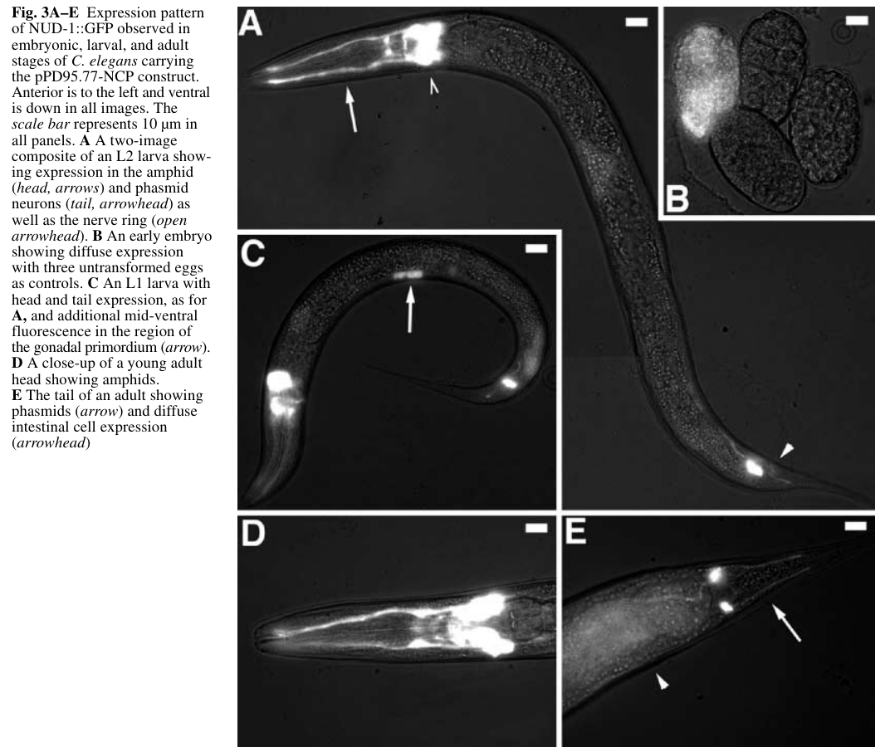

## Question

# Gene Research for Functional Annotation

## ⚠️ CRITICAL: Gene/Protein Identification Context

**BEFORE YOU BEGIN RESEARCH:** You MUST verify you are researching the CORRECT gene/protein. Gene symbols can be ambiguous, especially for less well-characterized genes from non-model organisms.

### Target Gene/Protein Identity (from UniProt):
- **UniProt Accession:** G5EE74
- **Protein Description:** RecName: Full=Nuclear migration protein nudC {ECO:0000256|ARBA:ARBA00017641}; AltName: Full=Nuclear distribution protein C homolog {ECO:0000256|ARBA:ARBA00030427};
- **Gene Information:** Name=nud-1 {ECO:0000313|EMBL:CAB04452.1, ECO:0000313|WormBase:F53A2.4}; ORFNames=CELE_F53A2.4 {ECO:0000313|EMBL:CAB04452.1}, F53A2.4 {ECO:0000313|WormBase:F53A2.4};
- **Organism (full):** Caenorhabditis elegans.
- **Protein Family:** Belongs to the nudC family.
- **Key Domains:** CS_dom. (IPR007052); HSP20-like_chaperone. (IPR008978); NudC_fam. (IPR037898); NudC_N_dom. (IPR025934); CS (PF04969)

### MANDATORY VERIFICATION STEPS:

1. **Check if the gene symbol "nud-1" matches the protein description above**
2. **Verify the organism is correct:** Caenorhabditis elegans.
3. **Check if protein family/domains align with what you find in literature**
4. **If you find literature for a DIFFERENT gene with the same or similar symbol, STOP**

### If Gene Symbol is Ambiguous or You Cannot Find Relevant Literature:

**DO NOT PROCEED WITH RESEARCH ON A DIFFERENT GENE.** Instead:
- State clearly: "The gene symbol 'nud-1' is ambiguous or literature is limited for this specific protein"
- Explain what you found (e.g., "Found extensive literature on a different gene with the same symbol in a different organism")
- Describe the protein based ONLY on the UniProt information provided above
- Suggest that the protein function can be inferred from domain/family information

### Research Target:

Please provide a comprehensive research report on the gene **nud-1** (gene ID: nud-1, UniProt: G5EE74) in worm.

The research report should be a detailed narrative explaining the function, biological processes, and localization of the gene product. Citations should be given for all claims.

You should prioritize authoritative reviews and primary scientific literature when conducting research. You can supplement
this with annotations you find in gene/protein databases, but these can be outdated or inaccurate.

We are specifically interested in the primary function of the gene - for enzymes, what reaction is catalyzed, and what is the substrate specificity? For transporters, what is the substrate? For structural proteins or adapters, what is the broader structural role? For signaling molecules, what is the role in the pathway.

We are interested in where in or outside the cell the gene product carries out its function.

We are also interested in the signaling or biochemical pathways in which the gene functions. We are less interested in broad pleiotropic effects, except where these elucidate the precise role.

Include evidence where possible. We are interested in both experimental evidence as well as inference from structure, evolution, or bioinformatic analysis. Precise studies should be prioritized over high-throughput, where available.

## Output

Question: You are an expert researcher providing comprehensive, well-cited information.

Provide detailed information focusing on:
1. Key concepts and definitions with current understanding
2. Recent developments and latest research (prioritize 2023-2024 sources)
3. Current applications and real-world implementations
4. Expert opinions and analysis from authoritative sources
5. Relevant statistics and data from recent studies

Format as a comprehensive research report with proper citations. Include URLs and publication dates where available.
Always prioritize recent, authoritative sources and provide specific citations for all major claims.

# Gene Research for Functional Annotation

## ⚠️ CRITICAL: Gene/Protein Identification Context

**BEFORE YOU BEGIN RESEARCH:** You MUST verify you are researching the CORRECT gene/protein. Gene symbols can be ambiguous, especially for less well-characterized genes from non-model organisms.

### Target Gene/Protein Identity (from UniProt):
- **UniProt Accession:** G5EE74
- **Protein Description:** RecName: Full=Nuclear migration protein nudC {ECO:0000256|ARBA:ARBA00017641}; AltName: Full=Nuclear distribution protein C homolog {ECO:0000256|ARBA:ARBA00030427};
- **Gene Information:** Name=nud-1 {ECO:0000313|EMBL:CAB04452.1, ECO:0000313|WormBase:F53A2.4}; ORFNames=CELE_F53A2.4 {ECO:0000313|EMBL:CAB04452.1}, F53A2.4 {ECO:0000313|WormBase:F53A2.4};
- **Organism (full):** Caenorhabditis elegans.
- **Protein Family:** Belongs to the nudC family.
- **Key Domains:** CS_dom. (IPR007052); HSP20-like_chaperone. (IPR008978); NudC_fam. (IPR037898); NudC_N_dom. (IPR025934); CS (PF04969)

### MANDATORY VERIFICATION STEPS:

1. **Check if the gene symbol "nud-1" matches the protein description above**
2. **Verify the organism is correct:** Caenorhabditis elegans.
3. **Check if protein family/domains align with what you find in literature**
4. **If you find literature for a DIFFERENT gene with the same or similar symbol, STOP**

### If Gene Symbol is Ambiguous or You Cannot Find Relevant Literature:

**DO NOT PROCEED WITH RESEARCH ON A DIFFERENT GENE.** Instead:
- State clearly: "The gene symbol 'nud-1' is ambiguous or literature is limited for this specific protein"
- Explain what you found (e.g., "Found extensive literature on a different gene with the same symbol in a different organism")
- Describe the protein based ONLY on the UniProt information provided above
- Suggest that the protein function can be inferred from domain/family information

### Research Target:

Please provide a comprehensive research report on the gene **nud-1** (gene ID: nud-1, UniProt: G5EE74) in worm.

The research report should be a detailed narrative explaining the function, biological processes, and localization of the gene product. Citations should be given for all claims.

You should prioritize authoritative reviews and primary scientific literature when conducting research. You can supplement
this with annotations you find in gene/protein databases, but these can be outdated or inaccurate.

We are specifically interested in the primary function of the gene - for enzymes, what reaction is catalyzed, and what is the substrate specificity? For transporters, what is the substrate? For structural proteins or adapters, what is the broader structural role? For signaling molecules, what is the role in the pathway.

We are interested in where in or outside the cell the gene product carries out its function.

We are also interested in the signaling or biochemical pathways in which the gene functions. We are less interested in broad pleiotropic effects, except where these elucidate the precise role.

Include evidence where possible. We are interested in both experimental evidence as well as inference from structure, evolution, or bioinformatic analysis. Precise studies should be prioritized over high-throughput, where available.

# Functional annotation research report: *Caenorhabditis elegans* **nud-1** (UniProt G5EE74; ORF **F53A2.4**) 

## 0. Target identity verification (critical)

The target gene **nud-1** in *C. elegans* corresponds to the fungal **nudC** ortholog located on cosmid **F53A2** (ORF **F53A2.4**), consistent with the UniProt entry G5EE74 (NudC family). Dawe et al. explicitly identify **nud-1** as the *C. elegans nudC* ortholog and demonstrate functional conservation by complementation in *Aspergillus nidulans* (dawe2001evolutionarilyconservednuclear pages 1-2, dawe2001evolutionarilyconservednuclear pages 2-3). Aumais et al. subsequently describe **nud-1** as the *C. elegans* ortholog of mammalian NudC and assay its function via RNAi in embryos (aumais2003rolefornudc pages 2-3).

**Conclusion:** The literature summarized below refers to the *C. elegans* gene **nud-1/F53A2.4** in the conserved **NudC family**, not to unrelated “nud-1” usages in other organisms (dawe2001evolutionarilyconservednuclear pages 1-2, aumais2003rolefornudc pages 2-3).

---

## 1. Key concepts and definitions (current understanding)

### 1.1 What is a NudC-family protein?

Nuclear distribution C (**NudC**) proteins are **evolutionarily conserved eukaryotic proteins** originally discovered in fungal nuclear migration genetics and now recognized as multifunctional regulators of **nuclear migration/positioning, intracellular transport, and cell division** (vassileva2023smallsizedyet pages 1-3, vassileva2023smallsizedyet pages 3-5). Reviews emphasize their tight connection to **dynein–dynactin**-mediated processes and to the broader “NUD” pathway that includes LIS1/NUDF and NUDE/NudE-family factors that modulate dynein force production and cargo/nuclear positioning (vassileva2023smallsizedyet pages 1-3, vassileva2023smallsizedyet pages 12-13).

### 1.2 Domain architecture relevant to annotation of worm NUD-1

Recent synthesis (2023) describes a characteristic NudC-family architecture: an **N-terminal coiled-coil** implicated in dimerization, paired with a conserved **CS domain** (related to p23 and small heat-shock proteins such as HSP20/α-crystallin), plus conserved C-terminal helices (vassileva2023smallsizedyet pages 3-5). The CS-domain link motivates a mechanistic model in which NudC-family proteins can have **intrinsic chaperone activity** and/or act as **co-chaperones** (vassileva2023smallsizedyet pages 5-7, vassileva2023smallsizedyet pages 13-14).

### 1.3 Chaperone/co-chaperone concept for NudC family

A 2024 review of molecular chaperones in barrier biology describes the **NUDC family as Hsp70/Hsp90 co-chaperones** that can **accelerate client transfer from Hsp70 to Hsp90**, with different family members showing preferences for distinct client domains (e.g., WD40, RCC1, Kelch) (lechuga2024regulationofepithelial pages 13-14). A 2023 NudC-family review similarly links the CS domain to **co-chaperone function** and highlights that NudC proteins can interface with Hsp90-centered proteostasis, including stabilization of LIS1 in mammalian systems (vassileva2023smallsizedyet pages 5-7, vassileva2023smallsizedyet pages 13-14).

**Relevance for *C. elegans* nud-1:** This provides a plausible mechanistic explanation for how NUD-1 could support dynein/LIS-1-dependent microtubule-based events in embryos—by helping stabilize or assemble key cytoskeletal regulators—while noting that much of the detailed client biology is best established in non-worm systems (vassileva2023smallsizedyet pages 13-14, lechuga2024regulationofepithelial pages 13-14).

---

## 2. Worm-specific experimental evidence for nud-1 function

### 2.1 Expression and localization in the animal

Dawe et al. generated a **NUD-1::GFP** reporter and observed:
- **Diffuse embryonic expression**
- Sustained expression in **amphid and phasmid sensory neurons** and the **nerve ring**
- Additional transient expression in tissues including the **gonadal primordium** and diffuse intestinal signal in adults (dawe2001evolutionarilyconservednuclear pages 4-7).

The corresponding Figure 3 images provide visual evidence of these expression patterns across embryo, larva, and adult (dawe2001evolutionarilyconservednuclear media febc75e2).

**Functional interpretation:** Expression in embryos and neurons is consistent with a protein required for **early embryonic cell division/nuclear positioning** and potentially **neuronal development/function**, matching the phenotypes described below (dawe2001evolutionarilyconservednuclear pages 4-7, dawe2001evolutionarilyconservednuclear pages 1-2).

### 2.2 Essential role in early embryonic nuclear positioning (dynein-like phenotype)

Using RNAi, Dawe et al. report that **nud-1 depletion disrupts pronuclear/centrosome positioning** in early embryos:
- Pronuclei **migrate toward the center** but **fail to rotate** onto the anterior–posterior axis (“never rotate onto the a–p axis”) (dawe2001evolutionarilyconservednuclear pages 4-7, dawe2001evolutionarilyconservednuclear pages 3-4).
- Nuclear envelope breakdown and initial spindle assembly occur along an **incorrect (dorsal–ventral) axis**, with downstream abnormal nuclear positioning at the two-cell stage (dawe2001evolutionarilyconservednuclear pages 4-7).
- Later (more severe) timepoints show pronuclei conjoining at **variable embryo positions** rather than the typical ~70% egg length (dawe2001evolutionarilyconservednuclear pages 3-4).

The authors explicitly note these nuclear-positioning phenotypes **resemble dynein/dynactin perturbation**, placing nud-1 within dynein-linked nuclear positioning pathways (dawe2001evolutionarilyconservednuclear pages 1-2, dawe2001evolutionarilyconservednuclear pages 3-4).

### 2.3 Role in cytokinesis via midzone microtubule organization

Aumais et al. (2003) extended worm phenotyping to cytokinesis and midzone microtubules. In **nud-1 RNAi** embryos:
- Pronuclear fusion and **spindle elongation proceed**, but the **cleavage furrow stalls/regresses**, producing multinucleated one-cell embryos (aumais2003rolefornudc pages 9-11, aumais2003rolefornudc pages 8-9).
- Midzone microtubules are frequently defective: **absent in 26% (10/39)** of one-cell embryos and **weak/poorly defined in 74% (29/39)** (aumais2003rolefornudc pages 9-11).
- Among embryos with weak midzone MTs, **15/29** display **chromatin bridges**, indicating chromosome segregation problems associated with defective midzone structures (aumais2003rolefornudc pages 9-11).
- Embryos can continue cycling without successful cytokinesis, yielding **extra DNA and multipolar spindles** (aumais2003rolefornudc pages 9-11).

**Functional interpretation:** These data support that NUD-1 is required for **late cytokinesis**, likely through ensuring proper **midzone microtubule formation/maintenance** and cleavage-furrow stabilization (aumais2003rolefornudc pages 9-11).

### 2.4 Organismal phenotypes and penetrance statistics

Dawe et al. quantify severe RNAi outcomes:
- **94%** of injected mothers laid eggs with mutant phenotypes
- **73%** produced only dead embryos
- Embryos typically arrest between **comma and one-fold stages** (dawe2001evolutionarilyconservednuclear pages 4-7, dawe2001evolutionarilyconservednuclear pages 3-4).

Among rarer “escaper” progeny:
- **>50%** show everted vulva
- **>75%** are uncoordinated
- All are **sterile** with **cuticle/hypodermal defects** (dawe2001evolutionarilyconservednuclear pages 4-7).

**Functional interpretation:** While pleiotropic, these phenotypes are consistent with an essential, conserved cytoskeletal/nuclear-positioning factor rather than a tissue-restricted metabolic enzyme (dawe2001evolutionarilyconservednuclear pages 4-7, dawe2001evolutionarilyconservednuclear pages 1-2).

---

## 3. Mechanistic model and pathway placement

### 3.1 Placement in the LIS-1/dynein nuclear positioning pathway

Dawe et al. frame nud-1 and lis-1 as conserved nuclear migration genes and show that **nud-1 RNAi** produces nuclear positioning defects similar to dynein/dynactin depletion (dawe2001evolutionarilyconservednuclear pages 1-2, dawe2001evolutionarilyconservednuclear pages 3-4). This strongly supports annotating NUD-1 as a **dynein-associated regulator of nuclear positioning** during early embryonic divisions.

### 3.2 Connection to midzone/midbody microtubule regulation (cell division)

Aumais et al. provide direct worm evidence that nud-1 is required for **midzone microtubule organization** and successful cytokinesis (aumais2003rolefornudc pages 9-11). In the same study, mammalian NudC localizes to mitotic structures including the midbody and is regulated by mitotic kinase pathways, supporting a conserved role for NudC-family proteins in microtubule reorganization during division (aumais2003rolefornudc pages 2-3, aumais2003rolefornudc pages 8-9).

### 3.3 Chaperone/co-chaperone model (family-based inference; not worm-proven in vivo)

Recent reviews and primary studies outside the worm system support a model in which NudC-family proteins (including NudCL2) act as **Hsp90-associated co-chaperones** that stabilize key clients required for mitosis/cytokinesis (lechuga2024regulationofepithelial pages 13-14, xu2024nudcl2isrequired pages 17-17). This is consistent with the family’s conserved CS (p23/sHSP-like) domain architecture (vassileva2023smallsizedyet pages 3-5, vassileva2023smallsizedyet pages 5-7).

**Caution for annotation:** The *C. elegans* in vivo embryo phenotypes firmly establish roles in nuclear positioning and cytokinesis (Sections 2.2–2.3), but the **specific client proteins** and **direct biochemical interactions** (e.g., with LIS-1 or dynein components in worm) are not demonstrated in the retrieved worm primary texts and should be treated as a mechanistic hypothesis (dawe2001evolutionarilyconservednuclear pages 1-2, aumais2003rolefornudc pages 9-11).

---

## 4. Recent developments (prioritizing 2023–2024)

No 2023–2024 studies specifically interrogating *C. elegans* **nud-1/F53A2.4** were retrieved here. However, **relevant 2023–2024 advances** that refine functional interpretation include:

1. **2023 (Plants; review):** Synthesis of NudC-family domain architecture (coiled-coil + CS domain), conserved dynein-linked roles in nuclear migration and cell division, and explicit mention that *C. elegans* NUD-1 has in vitro chaperone activity and that NudC homologs can complement fungal nudC mutants (https://doi.org/10.3390/plants13010119; published Dec 2023) (vassileva2023smallsizedyet pages 5-7, vassileva2023smallsizedyet pages 3-5).

2. **2024 (Cells; review):** Framing of the NUDC family as **Hsp70/Hsp90 co-chaperones** with client-transfer acceleration and emerging cytoskeletal roles (https://doi.org/10.3390/cells13050370; published Feb 2024) (lechuga2024regulationofepithelial pages 13-14).

3. **2024 (Protein & Cell; primary):** Demonstration that NudCL2 (NudC-family member) is required for cytokinesis by stabilizing **RCC2** with **Hsp90** at the midbody, strengthening a conserved co-chaperone mechanism for midbody function (https://doi.org/10.1093/procel/pwae025; published May 2024) (xu2024nudcl2isrequired pages 17-17).

---

## 5. Current applications and real-world implementations

### 5.1 In *C. elegans* research (real-world use in cell biology)

The principal “application” of nud-1 knowledge is as a **genetic entry point** to study conserved mechanisms of:
- **Pronuclear rotation/nuclear positioning** in early embryos (a dynein-linked process) (dawe2001evolutionarilyconservednuclear pages 3-4).
- **Midzone microtubule organization and cleavage furrow stabilization** during cytokinesis (aumais2003rolefornudc pages 9-11).

The availability of a **nud-1::GFP** expression reporter supports experimental use in developmental expression studies and potentially as a context marker for where nud-1 is expressed during phenotypic analyses (dawe2001evolutionarilyconservednuclear pages 4-7, dawe2001evolutionarilyconservednuclear media febc75e2).

### 5.2 Cross-species functional conservation as an implementation strategy

Dawe et al. demonstrate a practical functional assay: heterologous expression of *C. elegans* nud-1 complements a fungal nudC mutant, directly leveraging conservation to infer function (https://doi.org/10.1007/s004270100176; published Sep 2001) (dawe2001evolutionarilyconservednuclear pages 2-3). This kind of cross-species complementation remains a real-world strategy to validate orthology and conserved biological roles.

---

## 6. Expert opinions and analysis (authoritative synthesis)

Two key interpretive statements emerge from authoritative sources:

1. **NudC proteins as conserved, multifunctional regulators:** Reviews emphasize that NudC-family proteins integrate **dynein-linked transport/nuclear positioning** with **cell division and proteostasis/chaperone functions** via conserved domains (vassileva2023smallsizedyet pages 1-3, vassileva2023smallsizedyet pages 3-5).

2. **Worm NUD-1 as a link between nuclear positioning and cell division:** Dawe et al. conclude that LIS-1/NUDC-like proteins represent a link between **nuclear positioning, cell division, and neuronal function**, supported by embryo time-lapse phenotypes and expression patterns (dawe2001evolutionarilyconservednuclear pages 1-2, dawe2001evolutionarilyconservednuclear pages 4-7).

My synthesis of the primary worm data is that **nud-1’s most defensible primary function in *C. elegans*** is as an **essential microtubule-based cell division and nuclear-positioning factor**, acting during (i) **pronuclear-centrosome rotation/positioning** and (ii) **midzone assembly/furrow stabilization in cytokinesis**. The chaperone/co-chaperone role is a plausible mechanistic layer (supported by family biology) but is not yet directly demonstrated in vivo for the worm protein in the retrieved corpus (aumais2003rolefornudc pages 9-11, lechuga2024regulationofepithelial pages 13-14).

---

## 7. Key statistics and data points (from recent and foundational studies)

- **RNAi penetrance (Dawe 2001):** 94% of injected mothers produced mutant eggs; 73% produced only dead embryos (dawe2001evolutionarilyconservednuclear pages 3-4).
- **Escaper phenotypes (Dawe 2001):** among escapers, >50% everted vulva; >75% uncoordinated; all sterile (dawe2001evolutionarilyconservednuclear pages 4-7).
- **Midzone microtubule defects (Aumais 2003):** midzone MT absent in 26% (10/39) and weak in 74% (29/39) of one-cell embryos; chromatin bridges in 15/29 among weak-midzone embryos (aumais2003rolefornudc pages 9-11).

---

## 8. Evidence summary table

| Evidence type | Key findings (with quantitative stats when available) | Experimental approach | Developmental stage/tissue | Interpretation for functional annotation | Primary source (author year, journal, DOI URL) |
|---|---|---|---|---|---|
| Expression/localization | `nud-1::GFP` showed diffuse expression in early embryos; sustained expression in amphid and phasmid sensory neurons and nerve ring; additional transient signal in gonadal primordium and diffuse intestinal expression in adults. Figure 3 documents embryo, larval, and adult expression patterns (dawe2001evolutionarilyconservednuclear pages 7-8, dawe2001evolutionarilyconservednuclear media febc75e2, dawe2001evolutionarilyconservednuclear pages 4-7). | Transgenic `nud-1::GFP` reporter microscopy (dawe2001evolutionarilyconservednuclear pages 7-8, dawe2001evolutionarilyconservednuclear pages 2-3, dawe2001evolutionarilyconservednuclear media febc75e2). | Early embryos; larval/adult sensory neurons; gonadal primordium; intestine (dawe2001evolutionarilyconservednuclear pages 7-8, dawe2001evolutionarilyconservednuclear media febc75e2, dawe2001evolutionarilyconservednuclear pages 4-7). | Supports a broadly used cytoplasmic/neuronal developmental factor rather than a tissue-restricted enzyme; embryonic and neuronal expression fits roles in cell division, nuclear positioning, and nervous-system function (dawe2001evolutionarilyconservednuclear pages 1-2, dawe2001evolutionarilyconservednuclear pages 4-7). | Dawe et al. 2001, *Development Genes and Evolution*, https://doi.org/10.1007/s004270100176 |
| Embryo nuclear positioning | `nud-1(RNAi)` embryos showed defective pronuclear migration/rotation: pronuclei moved inward but failed to rotate onto the anterior-posterior axis; nuclear envelope breakdown occurred on the dorsal-ventral axis; after first division, two-cell nuclei were centrally located. In later embryos, pronuclei conjoined at variable positions instead of the normal ~70% egg length (dawe2001evolutionarilyconservednuclear pages 4-7, dawe2001evolutionarilyconservednuclear pages 3-4). | dsRNA injection RNAi followed by digital time-lapse video microscopy of early embryos (dawe2001evolutionarilyconservednuclear pages 3-4). | One-cell and two-cell embryos during first mitosis (dawe2001evolutionarilyconservednuclear pages 4-7, dawe2001evolutionarilyconservednuclear pages 3-4). | Strongly supports a primary role in dynein-related nuclear positioning/pronuclear-centrosome orientation during early embryonic division, not in general spindle elongation initiation (dawe2001evolutionarilyconservednuclear pages 1-2, dawe2001evolutionarilyconservednuclear pages 4-7, dawe2001evolutionarilyconservednuclear pages 3-4). | Dawe et al. 2001, *Development Genes and Evolution*, https://doi.org/10.1007/s004270100176 |
| Cytokinesis/midzone MT | In `nud-1` RNAi embryos, spindle elongation and pronuclear fusion occurred, but cleavage furrows stalled or regressed, producing multinucleated one-cell embryos. Midzone microtubules were absent in 26% (10/39) of one-cell embryos and weak/poorly defined in 74% (29/39); among embryos with weak midzone MTs, 15/29 showed chromatin bridges. Older embryos formed multipolar spindles and accumulated extra DNA, indicating continued cell cycling without successful cytokinesis (aumais2003rolefornudc pages 9-11, aumais2003rolefornudc pages 8-9). | RNAi feeding; time-lapse Nomarski/live imaging; anti-tubulin/DAPI staining (aumais2003rolefornudc pages 9-11, aumais2003rolefornudc pages 3-4). | One-cell embryos and older embryos during/after first cytokinesis (aumais2003rolefornudc pages 9-11). | Indicates that NUD-1 is required for late cytokinesis, especially stabilization of the cleavage furrow and organization of midzone microtubules; function is consistent with a microtubule-associated dynein-pathway regulator (aumais2003rolefornudc pages 9-11). | Aumais et al. 2003, *Journal of Cell Science*, https://doi.org/10.1242/jcs.00412 |
| Organismal phenotypes | RNAi caused high-penetrance developmental defects: 94% of injected mothers laid mutant eggs and 73% produced only dead embryos; embryos usually arrested between comma and one-fold stages. Among F1 escapers, >50% showed everted vulva, >75% were uncoordinated, all were sterile, and cuticle/hypodermal defects were observed (dawe2001evolutionarilyconservednuclear pages 3-4, dawe2001evolutionarilyconservednuclear pages 4-7). | dsRNA injection RNAi with phenotype scoring across progeny (dawe2001evolutionarilyconservednuclear pages 2-3, dawe2001evolutionarilyconservednuclear pages 3-4, dawe2001evolutionarilyconservednuclear pages 4-7). | Embryos; surviving larval/adult escapers; vulva, hypodermis, locomotor system, germ line (dawe2001evolutionarilyconservednuclear pages 7-8, dawe2001evolutionarilyconservednuclear pages 4-7). | These pleiotropic phenotypes are consistent with an essential cellular factor for embryogenesis and postembryonic tissue morphogenesis, likely through conserved cytoskeletal/nuclear-positioning functions rather than a narrowly specialized pathway (dawe2001evolutionarilyconservednuclear pages 1-2, dawe2001evolutionarilyconservednuclear pages 4-7). | Dawe et al. 2001, *Development Genes and Evolution*, https://doi.org/10.1007/s004270100176 |
| Functional conservation/complementation | `nud-1` was identified as the C. elegans `nudC` ortholog on cosmid F53A2; sequence comparison showed 47% identity/67% similarity to *A. nidulans* NUDC. Full-length `nud-1`, and especially its C-terminal 173 aa, complemented the *A. nidulans nudC3* mutant, restoring hyphal growth and nuclear migration (dawe2001evolutionarilyconservednuclear pages 1-2, dawe2001evolutionarilyconservednuclear pages 2-3). A later review notes that C. elegans NudC homologs can complement fungal `nudC3`, supporting deep functional conservation (vassileva2023smallsizedyet pages 3-5, vassileva2023smallsizedyet pages 5-7). | Sequence comparison; heterologous expression complementation in fungal mutant; DAPI-based nuclear migration assessment (dawe2001evolutionarilyconservednuclear pages 2-3). | Cross-species assay using worm gene in fungal nuclear migration system (dawe2001evolutionarilyconservednuclear pages 2-3). | Provides direct evidence that `nud-1` belongs to the conserved NudC family and supports annotation as a nuclear migration/cell division factor rather than an enzyme or transporter (dawe2001evolutionarilyconservednuclear pages 1-2, dawe2001evolutionarilyconservednuclear pages 2-3). | Dawe et al. 2001, *Development Genes and Evolution*, https://doi.org/10.1007/s004270100176; summarized in Vassileva et al. 2023, *Plants*, https://doi.org/10.3390/plants13010119 |
| Biochemical/chaperone inference | Family-level evidence shows NudC proteins are dimeric/coiled-coil proteins with a conserved CS domain related to p23 and HSP20/sHSP proteins and can function as Hsp70/Hsp90 co-chaperones. For C. elegans specifically, NUD-1 is described as a microtubule-associated protein with in vitro chaperone activity, preventing heat-induced aggregation of citrate synthase and luciferase (vassileva2023smallsizedyet pages 13-14, vassileva2023smallsizedyet pages 5-7, vassileva2023smallsizedyet pages 3-5, lechuga2024regulationofepithelial pages 13-14). Recent 2024 primary work on the paralogous family member NudCL2 shows Hsp90-dependent stabilization of RCC2 at the midbody during cytokinesis, reinforcing a conserved co-chaperone model for NudC-family proteins in cell division (xu2024nudcl2isrequired pages 17-17). | In vitro chaperone assays for NUD-1 (reviewed); family/domain analyses; recent mammalian primary study of NudCL2/Hsp90/RCC2 (vassileva2023smallsizedyet pages 5-7, vassileva2023smallsizedyet pages 3-5, xu2024nudcl2isrequired pages 17-17, lechuga2024regulationofepithelial pages 13-14). | Protein/family level; inferred for worm embryonic microtubule-associated functions (vassileva2023smallsizedyet pages 13-14, vassileva2023smallsizedyet pages 5-7). | Best current mechanistic model is that worm NUD-1 acts as a conserved microtubule-associated dynein/LIS-1 pathway regulator with chaperone or co-chaperone properties that help maintain client proteins required for nuclear positioning and cytokinesis (vassileva2023smallsizedyet pages 13-14, xu2024nudcl2isrequired pages 17-17). | Vassileva et al. 2023, *Plants*, https://doi.org/10.3390/plants13010119; Lechuga et al. 2024, *Cells*, https://doi.org/10.3390/cells13050370; Xu et al. 2024, *Protein & Cell*, https://doi.org/10.1093/procel/pwae025 |

*Table: This table compiles the main experimental and inference-based annotations for C. elegans nud-1/F53A2.4, separating direct worm evidence from family-level mechanistic interpretation. It is useful for functional annotation because it links phenotypes, localization, and conserved NudC-family biology to a coherent gene-function model.*

---

## 9. Reference URLs (publication dates from retrieved metadata)

- Dawe AL et al. “Evolutionarily conserved nuclear migration genes required for early embryonic development in *Caenorhabditis elegans*.” *Development Genes and Evolution* (Sep 2001). https://doi.org/10.1007/s004270100176 (dawe2001evolutionarilyconservednuclear pages 1-2)
- Aumais JP et al. “Role for NudC, a dynein-associated nuclear movement protein, in mitosis and cytokinesis.” *Journal of Cell Science* (May 2003). https://doi.org/10.1242/jcs.00412 (aumais2003rolefornudc pages 2-3)
- Vassileva V et al. “Small Sized Yet Powerful: Nuclear Distribution C Proteins in Plants.” *Plants* (Dec 2023). https://doi.org/10.3390/plants13010119 (vassileva2023smallsizedyet pages 1-3)
- Lechuga S et al. “Regulation of Epithelial and Endothelial Barriers by Molecular Chaperones.” *Cells* (Feb 2024). https://doi.org/10.3390/cells13050370 (lechuga2024regulationofepithelial pages 13-14)
- Xu X et al. “NudCL2 is required for cytokinesis by stabilizing RCC2 with Hsp90 at the midbody.” *Protein & Cell* (May 2024). https://doi.org/10.1093/procel/pwae025 (xu2024nudcl2isrequired pages 17-17)

---

## 10. Limitations and gaps

- **Direct interaction partners in worm (dynein/LIS-1 binding, client proteins):** The retrieved *C. elegans* primary sources establish phenotypes and expression but do not provide direct biochemical interaction maps for NUD-1 (dawe2001evolutionarilyconservednuclear pages 1-2, aumais2003rolefornudc pages 9-11).
- **2023–2024 worm-specific updates:** No recent *C. elegans* nud-1-focused papers were retrieved; recent advances are therefore used to refine mechanistic interpretation at the NudC-family level (lechuga2024regulationofepithelial pages 13-14, xu2024nudcl2isrequired pages 17-17, vassileva2023smallsizedyet pages 5-7).

References

1. (dawe2001evolutionarilyconservednuclear pages 1-2): Angus L. Dawe, Kim A. Caldwell, Phillip M. Harris, Ronald N. Morris, and Guy A. Caldwell. Evolutionarily conserved nuclear migration genes required for early embryonic development in caenorhabditiselegans. Development Genes and Evolution, 211:434-441, Sep 2001. URL: https://doi.org/10.1007/s004270100176, doi:10.1007/s004270100176. This article has 66 citations and is from a peer-reviewed journal.

2. (dawe2001evolutionarilyconservednuclear pages 2-3): Angus L. Dawe, Kim A. Caldwell, Phillip M. Harris, Ronald N. Morris, and Guy A. Caldwell. Evolutionarily conserved nuclear migration genes required for early embryonic development in caenorhabditiselegans. Development Genes and Evolution, 211:434-441, Sep 2001. URL: https://doi.org/10.1007/s004270100176, doi:10.1007/s004270100176. This article has 66 citations and is from a peer-reviewed journal.

3. (aumais2003rolefornudc pages 2-3): Jonathan P. Aumais, Shelli N. Williams, Weiping Luo, Michiya Nishino, Kim A. Caldwell, Guy A. Caldwell, Sue-Hwa Lin, and Li-yuan Yu-Lee. Role for nudc, a dynein-associated nuclear movement protein, in mitosis and cytokinesis. Journal of Cell Science, 116:1991-2003, May 2003. URL: https://doi.org/10.1242/jcs.00412, doi:10.1242/jcs.00412. This article has 148 citations and is from a domain leading peer-reviewed journal.

4. (vassileva2023smallsizedyet pages 1-3): Valya Vassileva, Mariyana Georgieva, Dimitar Todorov, and Kiril Mishev. Small sized yet powerful: nuclear distribution c proteins in plants. Plants, 13:119, Dec 2023. URL: https://doi.org/10.3390/plants13010119, doi:10.3390/plants13010119. This article has 0 citations.

5. (vassileva2023smallsizedyet pages 3-5): Valya Vassileva, Mariyana Georgieva, Dimitar Todorov, and Kiril Mishev. Small sized yet powerful: nuclear distribution c proteins in plants. Plants, 13:119, Dec 2023. URL: https://doi.org/10.3390/plants13010119, doi:10.3390/plants13010119. This article has 0 citations.

6. (vassileva2023smallsizedyet pages 12-13): Valya Vassileva, Mariyana Georgieva, Dimitar Todorov, and Kiril Mishev. Small sized yet powerful: nuclear distribution c proteins in plants. Plants, 13:119, Dec 2023. URL: https://doi.org/10.3390/plants13010119, doi:10.3390/plants13010119. This article has 0 citations.

7. (vassileva2023smallsizedyet pages 5-7): Valya Vassileva, Mariyana Georgieva, Dimitar Todorov, and Kiril Mishev. Small sized yet powerful: nuclear distribution c proteins in plants. Plants, 13:119, Dec 2023. URL: https://doi.org/10.3390/plants13010119, doi:10.3390/plants13010119. This article has 0 citations.

8. (vassileva2023smallsizedyet pages 13-14): Valya Vassileva, Mariyana Georgieva, Dimitar Todorov, and Kiril Mishev. Small sized yet powerful: nuclear distribution c proteins in plants. Plants, 13:119, Dec 2023. URL: https://doi.org/10.3390/plants13010119, doi:10.3390/plants13010119. This article has 0 citations.

9. (lechuga2024regulationofepithelial pages 13-14): Susana Lechuga, Armando Marino-Melendez, Nayden G. Naydenov, Atif Zafar, Manuel B. Braga-Neto, and Andrei I. Ivanov. Regulation of epithelial and endothelial barriers by molecular chaperones. Cells, 13:370, Feb 2024. URL: https://doi.org/10.3390/cells13050370, doi:10.3390/cells13050370. This article has 14 citations.

10. (dawe2001evolutionarilyconservednuclear pages 4-7): Angus L. Dawe, Kim A. Caldwell, Phillip M. Harris, Ronald N. Morris, and Guy A. Caldwell. Evolutionarily conserved nuclear migration genes required for early embryonic development in caenorhabditiselegans. Development Genes and Evolution, 211:434-441, Sep 2001. URL: https://doi.org/10.1007/s004270100176, doi:10.1007/s004270100176. This article has 66 citations and is from a peer-reviewed journal.

11. (dawe2001evolutionarilyconservednuclear media febc75e2): Angus L. Dawe, Kim A. Caldwell, Phillip M. Harris, Ronald N. Morris, and Guy A. Caldwell. Evolutionarily conserved nuclear migration genes required for early embryonic development in caenorhabditiselegans. Development Genes and Evolution, 211:434-441, Sep 2001. URL: https://doi.org/10.1007/s004270100176, doi:10.1007/s004270100176. This article has 66 citations and is from a peer-reviewed journal.

12. (dawe2001evolutionarilyconservednuclear pages 3-4): Angus L. Dawe, Kim A. Caldwell, Phillip M. Harris, Ronald N. Morris, and Guy A. Caldwell. Evolutionarily conserved nuclear migration genes required for early embryonic development in caenorhabditiselegans. Development Genes and Evolution, 211:434-441, Sep 2001. URL: https://doi.org/10.1007/s004270100176, doi:10.1007/s004270100176. This article has 66 citations and is from a peer-reviewed journal.

13. (aumais2003rolefornudc pages 9-11): Jonathan P. Aumais, Shelli N. Williams, Weiping Luo, Michiya Nishino, Kim A. Caldwell, Guy A. Caldwell, Sue-Hwa Lin, and Li-yuan Yu-Lee. Role for nudc, a dynein-associated nuclear movement protein, in mitosis and cytokinesis. Journal of Cell Science, 116:1991-2003, May 2003. URL: https://doi.org/10.1242/jcs.00412, doi:10.1242/jcs.00412. This article has 148 citations and is from a domain leading peer-reviewed journal.

14. (aumais2003rolefornudc pages 8-9): Jonathan P. Aumais, Shelli N. Williams, Weiping Luo, Michiya Nishino, Kim A. Caldwell, Guy A. Caldwell, Sue-Hwa Lin, and Li-yuan Yu-Lee. Role for nudc, a dynein-associated nuclear movement protein, in mitosis and cytokinesis. Journal of Cell Science, 116:1991-2003, May 2003. URL: https://doi.org/10.1242/jcs.00412, doi:10.1242/jcs.00412. This article has 148 citations and is from a domain leading peer-reviewed journal.

15. (xu2024nudcl2isrequired pages 17-17): Xiaoyang Xu, Yuliang Huang, Feng Yang, Xiaoxia Sun, Rijin Lin, Jiaxing Feng, Mingyang Yang, Jiaqi Shao, Xiaoqi Liu, Tianhua Zhou, Shanshan Xie, and Yuehong Yang. Nudcl2 is required for cytokinesis by stabilizing rcc2 with hsp90 at the midbody. Protein & Cell, 15:766-782, May 2024. URL: https://doi.org/10.1093/procel/pwae025, doi:10.1093/procel/pwae025. This article has 4 citations and is from a peer-reviewed journal.

16. (dawe2001evolutionarilyconservednuclear pages 7-8): Angus L. Dawe, Kim A. Caldwell, Phillip M. Harris, Ronald N. Morris, and Guy A. Caldwell. Evolutionarily conserved nuclear migration genes required for early embryonic development in caenorhabditiselegans. Development Genes and Evolution, 211:434-441, Sep 2001. URL: https://doi.org/10.1007/s004270100176, doi:10.1007/s004270100176. This article has 66 citations and is from a peer-reviewed journal.

17. (aumais2003rolefornudc pages 3-4): Jonathan P. Aumais, Shelli N. Williams, Weiping Luo, Michiya Nishino, Kim A. Caldwell, Guy A. Caldwell, Sue-Hwa Lin, and Li-yuan Yu-Lee. Role for nudc, a dynein-associated nuclear movement protein, in mitosis and cytokinesis. Journal of Cell Science, 116:1991-2003, May 2003. URL: https://doi.org/10.1242/jcs.00412, doi:10.1242/jcs.00412. This article has 148 citations and is from a domain leading peer-reviewed journal.

## Artifacts

- [Edison artifact artifact-00](nud-1-deep-research-falcon_artifacts/artifact-00.md)

## Citations

1. aumais2003rolefornudc pages 2-3
2. vassileva2023smallsizedyet pages 3-5
3. lechuga2024regulationofepithelial pages 13-14
4. dawe2001evolutionarilyconservednuclear pages 4-7
5. dawe2001evolutionarilyconservednuclear pages 3-4
6. aumais2003rolefornudc pages 9-11
7. dawe2001evolutionarilyconservednuclear pages 2-3
8. dawe2001evolutionarilyconservednuclear pages 1-2
9. vassileva2023smallsizedyet pages 1-3
10. vassileva2023smallsizedyet pages 12-13
11. vassileva2023smallsizedyet pages 5-7
12. vassileva2023smallsizedyet pages 13-14
13. aumais2003rolefornudc pages 8-9
14. dawe2001evolutionarilyconservednuclear pages 7-8
15. aumais2003rolefornudc pages 3-4
16. https://doi.org/10.3390/plants13010119;
17. https://doi.org/10.3390/cells13050370;
18. https://doi.org/10.1093/procel/pwae025;
19. https://doi.org/10.1007/s004270100176;
20. https://doi.org/10.1007/s004270100176
21. https://doi.org/10.1242/jcs.00412
22. https://doi.org/10.3390/plants13010119
23. https://doi.org/10.1093/procel/pwae025
24. https://doi.org/10.3390/cells13050370
25. https://doi.org/10.1007/s004270100176,
26. https://doi.org/10.1242/jcs.00412,
27. https://doi.org/10.3390/plants13010119,
28. https://doi.org/10.3390/cells13050370,
29. https://doi.org/10.1093/procel/pwae025,