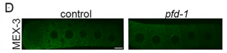

## Question

# Gene Research for Functional Annotation

## ⚠️ CRITICAL: Gene/Protein Identification Context

**BEFORE YOU BEGIN RESEARCH:** You MUST verify you are researching the CORRECT gene/protein. Gene symbols can be ambiguous, especially for less well-characterized genes from non-model organisms.

### Target Gene/Protein Identity (from UniProt):
- **UniProt Accession:** Q17827
- **Protein Description:** RecName: Full=Probable prefoldin subunit 1;
- **Gene Information:** Name=pfd-1; ORFNames=C08F8.1;
- **Organism (full):** Caenorhabditis elegans.
- **Protein Family:** Belongs to the prefoldin subunit beta family.
- **Key Domains:** PFD_beta-like. (IPR002777); Prefoldin. (IPR009053); Prefoldin_2 (PF01920)

### MANDATORY VERIFICATION STEPS:

1. **Check if the gene symbol "pfd-1" matches the protein description above**
2. **Verify the organism is correct:** Caenorhabditis elegans.
3. **Check if protein family/domains align with what you find in literature**
4. **If you find literature for a DIFFERENT gene with the same or similar symbol, STOP**

### If Gene Symbol is Ambiguous or You Cannot Find Relevant Literature:

**DO NOT PROCEED WITH RESEARCH ON A DIFFERENT GENE.** Instead:
- State clearly: "The gene symbol 'pfd-1' is ambiguous or literature is limited for this specific protein"
- Explain what you found (e.g., "Found extensive literature on a different gene with the same symbol in a different organism")
- Describe the protein based ONLY on the UniProt information provided above
- Suggest that the protein function can be inferred from domain/family information

### Research Target:

Please provide a comprehensive research report on the gene **pfd-1** (gene ID: pfd-1, UniProt: Q17827) in worm.

The research report should be a detailed narrative explaining the function, biological processes, and localization of the gene product. Citations should be given for all claims.

You should prioritize authoritative reviews and primary scientific literature when conducting research. You can supplement
this with annotations you find in gene/protein databases, but these can be outdated or inaccurate.

We are specifically interested in the primary function of the gene - for enzymes, what reaction is catalyzed, and what is the substrate specificity? For transporters, what is the substrate? For structural proteins or adapters, what is the broader structural role? For signaling molecules, what is the role in the pathway.

We are interested in where in or outside the cell the gene product carries out its function.

We are also interested in the signaling or biochemical pathways in which the gene functions. We are less interested in broad pleiotropic effects, except where these elucidate the precise role.

Include evidence where possible. We are interested in both experimental evidence as well as inference from structure, evolution, or bioinformatic analysis. Precise studies should be prioritized over high-throughput, where available.

## Output

Question: You are an expert researcher providing comprehensive, well-cited information.

Provide detailed information focusing on:
1. Key concepts and definitions with current understanding
2. Recent developments and latest research (prioritize 2023-2024 sources)
3. Current applications and real-world implementations
4. Expert opinions and analysis from authoritative sources
5. Relevant statistics and data from recent studies

Format as a comprehensive research report with proper citations. Include URLs and publication dates where available.
Always prioritize recent, authoritative sources and provide specific citations for all major claims.

# Gene Research for Functional Annotation

## ⚠️ CRITICAL: Gene/Protein Identification Context

**BEFORE YOU BEGIN RESEARCH:** You MUST verify you are researching the CORRECT gene/protein. Gene symbols can be ambiguous, especially for less well-characterized genes from non-model organisms.

### Target Gene/Protein Identity (from UniProt):
- **UniProt Accession:** Q17827
- **Protein Description:** RecName: Full=Probable prefoldin subunit 1;
- **Gene Information:** Name=pfd-1; ORFNames=C08F8.1;
- **Organism (full):** Caenorhabditis elegans.
- **Protein Family:** Belongs to the prefoldin subunit beta family.
- **Key Domains:** PFD_beta-like. (IPR002777); Prefoldin. (IPR009053); Prefoldin_2 (PF01920)

### MANDATORY VERIFICATION STEPS:

1. **Check if the gene symbol "pfd-1" matches the protein description above**
2. **Verify the organism is correct:** Caenorhabditis elegans.
3. **Check if protein family/domains align with what you find in literature**
4. **If you find literature for a DIFFERENT gene with the same or similar symbol, STOP**

### If Gene Symbol is Ambiguous or You Cannot Find Relevant Literature:

**DO NOT PROCEED WITH RESEARCH ON A DIFFERENT GENE.** Instead:
- State clearly: "The gene symbol 'pfd-1' is ambiguous or literature is limited for this specific protein"
- Explain what you found (e.g., "Found extensive literature on a different gene with the same symbol in a different organism")
- Describe the protein based ONLY on the UniProt information provided above
- Suggest that the protein function can be inferred from domain/family information

### Research Target:

Please provide a comprehensive research report on the gene **pfd-1** (gene ID: pfd-1, UniProt: Q17827) in worm.

The research report should be a detailed narrative explaining the function, biological processes, and localization of the gene product. Citations should be given for all claims.

You should prioritize authoritative reviews and primary scientific literature when conducting research. You can supplement
this with annotations you find in gene/protein databases, but these can be outdated or inaccurate.

We are specifically interested in the primary function of the gene - for enzymes, what reaction is catalyzed, and what is the substrate specificity? For transporters, what is the substrate? For structural proteins or adapters, what is the broader structural role? For signaling molecules, what is the role in the pathway.

We are interested in where in or outside the cell the gene product carries out its function.

We are also interested in the signaling or biochemical pathways in which the gene functions. We are less interested in broad pleiotropic effects, except where these elucidate the precise role.

Include evidence where possible. We are interested in both experimental evidence as well as inference from structure, evolution, or bioinformatic analysis. Precise studies should be prioritized over high-throughput, where available.

# Functional annotation of *Caenorhabditis elegans pfd-1*

## Identity and principal function

**The gene studied here is worm *pfd-1*, ORF C08F8.1, corresponding to the user-specified UniProt accession [Q17827](https://www.uniprot.org/uniprotkb/Q17827/entry)—not *pfd-6* or a similarly named gene in another organism.** The supplied UniProt annotation describes a probable prefoldin subunit 1 with PFD_beta-like (IPR002777), prefoldin (IPR009053), and Prefoldin_2 (PF01920) domains. An independent worm RNAi study explicitly identifies **C08F8.1** among prefoldin-subunit genes, while a separate worm study distinguishes experimentally between PFD-1 and PFD-6. The accession-to-ORF correspondence and exact domain identifiers come from the supplied UniProt record rather than independent sequence verification in the retrieved papers. (gilkrzewska2010regulatorsofthe pages 8-9, lundin2008functionalanalysisof pages 96-98)

**Best-supported primary annotation:** PFD-1 is a nonenzymatic, predominantly cytoplasmic **co-chaperone subunit** that helps the prefoldin complex maintain newly made cytoskeletal proteins in a folding-competent state and deliver them to the CCT/TRiC chaperonin. Actin and α/β-tubulin are established clients of the *complex*; there is no evidence that isolated worm PFD-1 catalyzes a reaction, transports a substrate across a membrane, or alone determines client specificity. The strongest worm functional evidence points to a requirement for efficient **tubulin biogenesis and microtubule growth**, particularly in early embryos. (vainberg1998prefoldinachaperone pages 4-5, lundin2008functionalanalysisof pages 98-101, lundin2008functionalanalysisof pages 101-104)

## Molecular mechanism and location

Canonical eukaryotic prefoldin is a six-subunit assembly: PFD3 and PFD5 are α-like, whereas **PFD1**, PFD2, PFD4, and PFD6 are β-like. A central body supports flexible coiled-coil projections that capture exposed surfaces on non-native proteins. In foundational biochemical experiments, prefoldin bound unfolded actin and α-tubulin and transferred clients to cytosolic chaperonin; transfer itself was observed without nucleotide, whereas downstream CCT folding uses its ATP-dependent cycle. This defines PFD-1’s likely structural role **within a client-capturing and delivery assembly**, not as an ATPase or an autonomous folding enzyme. These biochemical and structural assignments derive primarily from conserved eukaryotic systems, rather than purified worm PFD-1. (yang2024prefoldinsubunitsand pages 2-4, vainberg1998prefoldinachaperone pages 4-5, vainberg1998prefoldinachaperone pages 1-2)

Worm **PFD-1::GFP was observed in the cytoplasm** of many somatic cells, and *pfd-1* promoter reporters were expressed in head, pharyngeal, body-wall, and vulval muscles. Faint PFD-1::GFP expression was also observed in the gonadal distal tip cell. Thus, the best-established site of action is **inside cells, principally the cytoplasm**. Reporter silencing prevented those transgenes from resolving PFD-1 localization in germ cells and embryos: diffuse embryonic and gonadal cytoplasmic staining in the same study was measured with an antibody against **PFD-6, not PFD-1**. Nuclear roles reported for prefoldin-family proteins in other organisms should likewise not be assigned to worm PFD-1 without direct evidence. (lundin2008functionalanalysisof pages 96-98, lundin2008functionalanalysisof pages 104-108, yang2024prefoldinsubunitsand pages 2-4)

## Worm experimental evidence

The most informative gene-specific observations and their limitations are summarized below. They separate measurements made after ***pfd-1* perturbation** from biochemical measurements made after depletion of a *different* prefoldin subunit.

| Observation | Assay/setting | Interpretation/caveat |
|---|---|---|
| PFD-1::GFP was detected broadly in the cytoplasm of many somatic cells; promoter reporters included head, pharyngeal, body-wall, and vulval muscle expression. (lundin2008functionalanalysisof pages 96-98) | Integrated transgenic translational fusion and promoter–GFP reporters | Supports predominantly cytoplasmic, broadly distributed PFD-1. Germline and embryo expression could not be evaluated with these transgenes because of germline silencing; diffuse embryonic/gonadal cytoplasmic localization was demonstrated for **PFD-6**, not directly for PFD-1. (lundin2008functionalanalysisof pages 96-98) |
| Predicted-null **pfd-1(gk526)** homozygotes arrested as L4 larvae or became sterile adults; distal-tip-cell (DTC) pathfinding was abnormal in **3/11 gonads**. PFD-1::GFP was faintly detected in DTCs. (lundin2008functionalanalysisof pages 104-108) | Deletion-mutant analysis, gonad morphology, and GFP imaging | Direct gene-specific evidence that zygotic PFD-1 supports gonad development and DTC migration. Survival through embryogenesis probably reflects maternal PFD-1 contribution. (lundin2008functionalanalysisof pages 104-108) |
| Among pfd-1(RNAi) escapees, **6/59 were sterile**; DTC pathfinding defects occurred in **3/8 gonads** examined. (lundin2008functionalanalysisof pages 104-108) | Partial RNAi followed by postembryonic and gonadal phenotyping | RNAi phenocopies the deletion and supports on-target function, but incomplete depletion and analysis of rare escapees limit estimates of penetrance. |
| Prefoldin depletion reduced endogenous α-tubulin by **≥95%** and total actin by approximately **30%**; no significant γ-tubulin decrease was detected. These measurements used **pfd-3(RNAi), not pfd-1 depletion**. (lundin2008functionalanalysisof pages 96-98, lundin2008functionalanalysisof pages 98-101) | Embryonic lysate immunoblotting after pfd-3 RNAi | Strong complex-level evidence that prefoldin is especially important for α-tubulin homeostasis in embryos, but it is **not** a PFD-1-specific biochemical assay. Lack of detergent-insoluble aggregates suggested loss/degradation of non-native protein rather than visible aggregation. |
| RNAi against each tested nonredundant prefoldin subunit—including pfd-1—reduced microtubule growth from approximately **0.7 to 0.4 µm/s**. (lundin2008functionalanalysisof pages 98-101) | EBP-2::GFP plus-end tracking in living embryos | Provides subunit-level functional evidence linking PFD-1 to the assembly-competent tubulin pool, although α-tubulin abundance was quantified after pfd-3 RNAi rather than pfd-1 RNAi. |
| RNAi clone **C08F8.1**—the pfd-1 ORF—was among six prefoldin-subunit knockdowns that significantly suppressed embryonic lethality of **dhc-1(or195ts)**. (gilkrzewska2010regulatorsofthe pages 8-9) | Candidate RNAi suppressor screen at the nonpermissive temperature | Genetic interaction connects PFD-1/prefoldin with dynein-dependent cytoskeletal organization. Suppression does not establish direct physical interaction or identify whether altered actin, tubulin, or both is causal. |
| **pfd-1** was one of three genes required specifically for vincristine-induced germline apoptosis; candidate RNAi animals retained normal apoptosis after ionizing radiation and UV-C. (sendoel2014depdc1let99participatesin pages 3-4) | Primary and secondary RNAi screens of drug- and DNA-damage-induced germ-cell apoptosis | Places PFD-1 upstream of or within the response to microtubule disruption, but the study did not show that PFD-1 is an apoptotic signaling protein; altered tubulin biogenesis or drug response is a plausible indirect mechanism. |
| In 2024, pfd-1 RNAi produced **no detectable MEX-3 condensation** in oocytes. Across four tested pfd-subunit RNAi treatments, only **20–47% of gonads** showed increased depolymerized microtubules and GFP::TBB-2 decreased only slightly. (elaswad2024thecctchaperonin pages 7-8, elaswad2024thecctchaperonin media a9d5282b) | RNAi, GFP::MEX-3 imaging, and microtubule/β-tubulin controls during oogenesis | This is an inconclusive negative result: the authors judged prefoldin depletion incomplete, so it does not exclude a role for PFD-1 in actin folding or RNA-binding-protein phase regulation. (elaswad2024thecctchaperonin pages 11-13) |

*Table: Gene-specific findings are separated from prefoldin-complex evidence and experiments performed with other subunits. The caveats prevent complex-level tubulin and actin measurements from being misreported as direct PFD-1 biochemical assays.*

The mechanistic distinction is important. In embryos depleted of **PFD-3**, endogenous α-tubulin fell by **at least 95%**, compared with an approximately **30%** reduction in total actin and no significant reduction in γ-tubulin. Those are strong **prefoldin-complex** results, *not measurements following pfd-1-specific depletion*. In the same experimental work, RNAi against tested nonredundant prefoldin subunits reduced microtubule plus-end growth from approximately **0.7 to 0.4 µm/s**, linking PFD-1 perturbation more directly to microtubule function. Tubulin knockdown reproduced major prefoldin-depletion phenotypes. The interpretation is that impaired supply of folding-competent tubulin limits polymerizable α/β-tubulin; degradation of misfolded tubulin was proposed, not directly established as the fate of PFD-1 clients. (lundin2008functionalanalysisof pages 96-98, lundin2008functionalanalysisof pages 98-101, lundin2008functionalanalysisof pages 101-104)

The deletion allele **pfd-1(gk526)**, predicted to remove the first exon and upstream sequence, provides complementary gene-specific evidence. Homozygotes born to heterozygous mothers completed embryogenesis but arrested around L4 or became sterile; **3/11 gonads** showed distal-tip-cell pathfinding defects. RNAi escapees also showed abnormal migration (**3/8 gonads examined**) and sterility (**6/59 animals**). Maternal contribution plausibly explains why these mutant progeny initially survive despite the severe embryonic effects of prefoldin RNAi. Similar gonadal defects after α-tubulin or CCT depletion support a **tubulin-folding → microtubule-function → cell-migration** model, although they do not prove that reduced tubulin is the sole cause in distal tip cells. These detailed measurements were retrieved from Lundin’s **2008 dissertation**; they warrant more caution than independently replicated, PFD-1-specific biochemical reconstitution. (lundin2008functionalanalysisof pages 101-104, lundin2008functionalanalysisof pages 104-108, lundin2008functionalanalysisof pages 108-112)

Two additional studies connect PFD-1 to cytoskeletal perturbations without changing its primary biochemical annotation. In a **2010** RNAi screen, knockdown of **C08F8.1** was among prefoldin-subunit perturbations that suppressed lethality of temperature-sensitive **dhc-1(or195ts)** animals; this is a genetic interaction with a dynein-dependent phenotype, **not evidence of direct PFD-1–dynein binding**. In **2014**, *pfd-1* was identified among three genes selectively required for **vincristine-induced germline apoptosis** in a secondary screen that excluded candidates with abnormal responses to ionizing radiation or UV-C. That result places PFD-1 in the cellular response to an anti-tubulin drug, but does not establish that PFD-1 itself is an apoptotic signaling molecule or demonstrate the precise causal intermediate. (gilkrzewska2010regulatorsofthe pages 8-9, sendoel2014depdc1let99participatesin pages 3-4)

## Recent research and interpretation

The directly relevant **October 2024** oogenesis study found that CCT or actin depletion caused ectopic condensation of several oocyte RNA-binding proteins. In contrast, **pfd-1(RNAi) produced no detectable MEX-3 condensation** in the oocytes examined; Figure 4D shows the control and pfd-1(RNAi) comparison. Crucially, depletion of four tested prefoldin subunits produced only partial microtubule effects—an increased depolymerized-microtubule phenotype in **20–47% of gonads**, with only a slight decrease in GFP-tagged β-tubulin. The investigators therefore judged prefoldin depletion incomplete. The negative PFD-1 observation **does not demonstrate that PFD-1 is dispensable for actin folding or oocyte RNA-binding-protein regulation**; neither does the study establish an additional PFD-1-specific phase-separation function. (elaswad2024thecctchaperonin pages 7-8, elaswad2024thecctchaperonin pages 11-13, elaswad2024thecctchaperonin media a9d5282b)

Recent cross-species research refines, but does not replace, this worm annotation. A **March 2024** human-complex proteomics study resolved canonical prefoldin and related complex variants containing different partners. It reinforces the importance of distinguishing **canonical PFDN1/PFD-1** from prefoldin-like assemblies, but does not itself demonstrate which additional complexes contain worm PFD-1. Similarly, the reported HSF-1–FOXO/DAF-16 longevity role concerns worm **PFD-6**; it should not be transferred to PFD-1 solely because both are prefoldin subunits. (fabian2024dipmsultradeepinteraction pages 7-8, son2018prefoldin6mediates pages 5-5)

## Assessment and sources

**Confidence is high** that worm PFD-1 is a cytoplasmic prefoldin-family co-chaperone required for normal microtubule-dependent biology, and **moderate** that its principal direct client contribution in early embryos is tubulin delivery to CCT. The specific physical contacts of purified worm PFD-1 with actin, tubulin, or CCT, its contribution to client selectivity, and its exact distribution in untagged embryos and germ cells remain less directly established by the sources examined. No diagnostic or therapeutic use of worm PFD-1 is established here; its demonstrated applications are as a genetic perturbation in cytoskeletal, developmental, and drug-response research. (lundin2008functionalanalysisof pages 96-98, lundin2008functionalanalysisof pages 98-101, vainberg1998prefoldinachaperone pages 4-5, sendoel2014depdc1let99participatesin pages 3-4)

**Selected primary literature and recent context:** Vainberg *et al.*, *Cell*, **May 1998**, [doi:10.1016/S0092-8674(00)81446-4](https://doi.org/10.1016/S0092-8674(00)81446-4), established prefoldin-to-chaperonin client transfer; Lundin, **2008**, *Functional Analysis of Factors Involved in Cytoskeletal Protein Folding and Degradation* (dissertation; no stable publication URL available in the retrieved record), reports the detailed worm mutant, localization, and embryonic measurements; Gil-Krzewska *et al.*, *Molecular Biology of the Cell*, **August 2010**, [doi:10.1091/mbc.e09-07-0593](https://doi.org/10.1091/mbc.e09-07-0593), reports the C08F8.1 genetic interaction; Sendoel *et al.*, *Nature Cell Biology*, **July 2014**, [doi:10.1038/ncb3010](https://doi.org/10.1038/ncb3010), reports the vincristine screen; Elaswad *et al.*, *Molecular Biology of the Cell*, **October 2024**, [doi:10.1091/mbc.e24-05-0216](https://doi.org/10.1091/mbc.e24-05-0216), reports the qualified oocyte RNAi result; and Frommelt *et al.*, *Nature Methods*, **March 2024**, [doi:10.1038/s41592-024-02211-y](https://doi.org/10.1038/s41592-024-02211-y), characterizes **human**, not worm, prefoldin-complex variants. (vainberg1998prefoldinachaperone pages 4-5, lundin2008functionalanalysisof pages 96-98, gilkrzewska2010regulatorsofthe pages 8-9, sendoel2014depdc1let99participatesin pages 3-4, elaswad2024thecctchaperonin pages 7-8, fabian2024dipmsultradeepinteraction pages 7-8)

References

1. (gilkrzewska2010regulatorsofthe pages 8-9): Aleksandra J. Gil-Krzewska, Erica Farber, Edgar A. Buttner, and Craig P. Hunter. Regulators of the actin cytoskeleton mediate lethality in a caenorhabditis elegans dhc-1 mutant. Molecular Biology of the Cell, 21:2707-2720, Aug 2010. URL: https://doi.org/10.1091/mbc.e09-07-0593, doi:10.1091/mbc.e09-07-0593. This article has 12 citations and is from a domain leading peer-reviewed journal.

2. (lundin2008functionalanalysisof pages 96-98): V Lundin. Functional analysis of factors involved in cytoskeletal protein folding and degradation: prefoldin, cct and cofactor e-like. Unknown journal, 2008.

3. (vainberg1998prefoldinachaperone pages 4-5): Irina E Vainberg, Sally A Lewis, Heidi Rommelaere, Christophe Ampe, Joel Vandekerckhove, Hannah L Klein, and Nicholas J Cowan. Prefoldin, a chaperone that delivers unfolded proteins to cytosolic chaperonin. Cell, 93:863-873, May 1998. URL: https://doi.org/10.1016/s0092-8674(00)81446-4, doi:10.1016/s0092-8674(00)81446-4. This article has 734 citations and is from a highest quality peer-reviewed journal.

4. (lundin2008functionalanalysisof pages 98-101): V Lundin. Functional analysis of factors involved in cytoskeletal protein folding and degradation: prefoldin, cct and cofactor e-like. Unknown journal, 2008.

5. (lundin2008functionalanalysisof pages 101-104): V Lundin. Functional analysis of factors involved in cytoskeletal protein folding and degradation: prefoldin, cct and cofactor e-like. Unknown journal, 2008.

6. (yang2024prefoldinsubunitsand pages 2-4): Yi Yang, Gang Zhang, Mengyu Su, Qingbiao Shi, and Qingshuai Chen. Prefoldin subunits and its associate partners: conservations and specificities in plants. Plants, 13:556, Feb 2024. URL: https://doi.org/10.3390/plants13040556, doi:10.3390/plants13040556. This article has 1 citations.

7. (vainberg1998prefoldinachaperone pages 1-2): Irina E Vainberg, Sally A Lewis, Heidi Rommelaere, Christophe Ampe, Joel Vandekerckhove, Hannah L Klein, and Nicholas J Cowan. Prefoldin, a chaperone that delivers unfolded proteins to cytosolic chaperonin. Cell, 93:863-873, May 1998. URL: https://doi.org/10.1016/s0092-8674(00)81446-4, doi:10.1016/s0092-8674(00)81446-4. This article has 734 citations and is from a highest quality peer-reviewed journal.

8. (lundin2008functionalanalysisof pages 104-108): V Lundin. Functional analysis of factors involved in cytoskeletal protein folding and degradation: prefoldin, cct and cofactor e-like. Unknown journal, 2008.

9. (sendoel2014depdc1let99participatesin pages 3-4): Ataman Sendoel, Simona Maida, Xue Zheng, Youjin Teo, Lilli Stergiou, Carlo-Alberto Rossi, Deni Subasic, Sergio M. Pinto, Jason M. Kinchen, Moyin Shi, Steffen Boettcher, Joel N. Meyer, Markus G. Manz, Daniele Bano, and Michael O. Hengartner. Depdc1/let-99 participates in an evolutionarily conserved pathway for anti-tubulin drug-induced apoptosis. Nature Cell Biology, 16:812-820, Jul 2014. URL: https://doi.org/10.1038/ncb3010, doi:10.1038/ncb3010. This article has 55 citations and is from a highest quality peer-reviewed journal.

10. (elaswad2024thecctchaperonin pages 7-8): Mohamed T. Elaswad, Mingze Gao, Victoria E. Tice, Cora G. Bright, Grace M. Thomas, Chloe Munderloh, Nicholas J. Trombley, Christya N. Haddad, Ulysses G. Johnson, Ashley N. Cichon, and Jennifer A. Schisa. The cct chaperonin and actin modulate the er and rna-binding protein condensation during oogenesis and maintain translational repression of maternal mrna and oocyte quality. Molecular Biology of the Cell, Oct 2024. URL: https://doi.org/10.1091/mbc.e24-05-0216, doi:10.1091/mbc.e24-05-0216. This article has 5 citations and is from a domain leading peer-reviewed journal.

11. (elaswad2024thecctchaperonin media a9d5282b): Mohamed T. Elaswad, Mingze Gao, Victoria E. Tice, Cora G. Bright, Grace M. Thomas, Chloe Munderloh, Nicholas J. Trombley, Christya N. Haddad, Ulysses G. Johnson, Ashley N. Cichon, and Jennifer A. Schisa. The cct chaperonin and actin modulate the er and rna-binding protein condensation during oogenesis and maintain translational repression of maternal mrna and oocyte quality. Molecular Biology of the Cell, Oct 2024. URL: https://doi.org/10.1091/mbc.e24-05-0216, doi:10.1091/mbc.e24-05-0216. This article has 5 citations and is from a domain leading peer-reviewed journal.

12. (elaswad2024thecctchaperonin pages 11-13): Mohamed T. Elaswad, Mingze Gao, Victoria E. Tice, Cora G. Bright, Grace M. Thomas, Chloe Munderloh, Nicholas J. Trombley, Christya N. Haddad, Ulysses G. Johnson, Ashley N. Cichon, and Jennifer A. Schisa. The cct chaperonin and actin modulate the er and rna-binding protein condensation during oogenesis and maintain translational repression of maternal mrna and oocyte quality. Molecular Biology of the Cell, Oct 2024. URL: https://doi.org/10.1091/mbc.e24-05-0216, doi:10.1091/mbc.e24-05-0216. This article has 5 citations and is from a domain leading peer-reviewed journal.

13. (lundin2008functionalanalysisof pages 108-112): V Lundin. Functional analysis of factors involved in cytoskeletal protein folding and degradation: prefoldin, cct and cofactor e-like. Unknown journal, 2008.

14. (fabian2024dipmsultradeepinteraction pages 7-8): Fabian Frommelt, Andrea Fossati, Federico Uliana, Fabian Wendt, Peng Xue, Moritz Heusel, Bernd Wollscheid, Ruedi Aebersold, Rodolfo Ciuffa, and Matthias Gstaiger. Dip-ms: ultra-deep interaction proteomics for the deconvolution of protein complexes. Nature Methods, 21:635-647, Mar 2024. URL: https://doi.org/10.1038/s41592-024-02211-y, doi:10.1038/s41592-024-02211-y. This article has 34 citations and is from a highest quality peer-reviewed journal.

15. (son2018prefoldin6mediates pages 5-5): Heehwa G. Son, Keunhee Seo, Mihwa Seo, Sangsoon Park, Seokjin Ham, Seon Woo A. An, Eun-Seok Choi, Yujin Lee, Haeshim Baek, Eunju Kim, Youngjae Ryu, Chang Man Ha, Ao-Lin Hsu, Tae-Young Roh, Sung Key Jang, and Seung-Jae V. Lee. Prefoldin 6 mediates longevity response from heat shock factor 1 to foxo in c. elegans. Genes & Development, 32:1562-1575, Nov 2018. URL: https://doi.org/10.1101/gad.317362.118, doi:10.1101/gad.317362.118. This article has 37 citations and is from a highest quality peer-reviewed journal.

## Artifacts

- [Edison artifact artifact-00](pfd-1-deep-research-falcon_artifacts/artifact-00.md)

## Citations

1. lundin2008functionalanalysisof pages 96-98
2. lundin2008functionalanalysisof pages 104-108
3. lundin2008functionalanalysisof pages 98-101
4. gilkrzewska2010regulatorsofthe pages 8-9
5. elaswad2024thecctchaperonin pages 11-13
6. vainberg1998prefoldinachaperone pages 4-5
7. lundin2008functionalanalysisof pages 101-104
8. yang2024prefoldinsubunitsand pages 2-4
9. vainberg1998prefoldinachaperone pages 1-2
10. elaswad2024thecctchaperonin pages 7-8
11. lundin2008functionalanalysisof pages 108-112
12. fabian2024dipmsultradeepinteraction pages 7-8
13. Q17827
14. doi:10.1016/S0092-8674(00)81446-4
15. doi:10.1091/mbc.e09-07-0593
16. doi:10.1038/ncb3010
17. doi:10.1091/mbc.e24-05-0216
18. doi:10.1038/s41592-024-02211-y
19. https://www.uniprot.org/uniprotkb/Q17827/entry
20. https://doi.org/10.1016/S0092-8674(00
21. https://doi.org/10.1091/mbc.e09-07-0593
22. https://doi.org/10.1038/ncb3010
23. https://doi.org/10.1091/mbc.e24-05-0216
24. https://doi.org/10.1038/s41592-024-02211-y
25. https://doi.org/10.1091/mbc.e09-07-0593,
26. https://doi.org/10.1016/s0092-8674(00
27. https://doi.org/10.3390/plants13040556,
28. https://doi.org/10.1038/ncb3010,
29. https://doi.org/10.1091/mbc.e24-05-0216,
30. https://doi.org/10.1038/s41592-024-02211-y,
31. https://doi.org/10.1101/gad.317362.118,