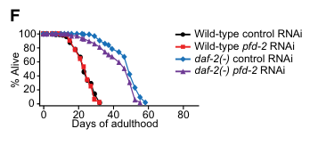

## Question

# Gene Research for Functional Annotation

## ⚠️ CRITICAL: Gene/Protein Identification Context

**BEFORE YOU BEGIN RESEARCH:** You MUST verify you are researching the CORRECT gene/protein. Gene symbols can be ambiguous, especially for less well-characterized genes from non-model organisms.

### Target Gene/Protein Identity (from UniProt):
- **UniProt Accession:** Q9N5M2
- **Protein Description:** RecName: Full=Prefoldin subunit 2;
- **Gene Information:** Name=pfd-2 {ECO:0000312|WormBase:H20J04.5}; Synonyms=tag-355 {ECO:0000312|WormBase:H20J04.5}; ORFNames=H20J04.5 {ECO:0000312|WormBase:H20J04.5};
- **Organism (full):** Caenorhabditis elegans.
- **Protein Family:** Belongs to the prefoldin subunit beta family.
- **Key Domains:** PFD2. (IPR027235); PFD_beta-like. (IPR002777); Prefoldin. (IPR009053); Prefoldin_2 (PF01920)

### MANDATORY VERIFICATION STEPS:

1. **Check if the gene symbol "pfd-2" matches the protein description above**
2. **Verify the organism is correct:** Caenorhabditis elegans.
3. **Check if protein family/domains align with what you find in literature**
4. **If you find literature for a DIFFERENT gene with the same or similar symbol, STOP**

### If Gene Symbol is Ambiguous or You Cannot Find Relevant Literature:

**DO NOT PROCEED WITH RESEARCH ON A DIFFERENT GENE.** Instead:
- State clearly: "The gene symbol 'pfd-2' is ambiguous or literature is limited for this specific protein"
- Explain what you found (e.g., "Found extensive literature on a different gene with the same symbol in a different organism")
- Describe the protein based ONLY on the UniProt information provided above
- Suggest that the protein function can be inferred from domain/family information

### Research Target:

Please provide a comprehensive research report on the gene **pfd-2** (gene ID: pfd-2, UniProt: Q9N5M2) in worm.

The research report should be a detailed narrative explaining the function, biological processes, and localization of the gene product. Citations should be given for all claims.

You should prioritize authoritative reviews and primary scientific literature when conducting research. You can supplement
this with annotations you find in gene/protein databases, but these can be outdated or inaccurate.

We are specifically interested in the primary function of the gene - for enzymes, what reaction is catalyzed, and what is the substrate specificity? For transporters, what is the substrate? For structural proteins or adapters, what is the broader structural role? For signaling molecules, what is the role in the pathway.

We are interested in where in or outside the cell the gene product carries out its function.

We are also interested in the signaling or biochemical pathways in which the gene functions. We are less interested in broad pleiotropic effects, except where these elucidate the precise role.

Include evidence where possible. We are interested in both experimental evidence as well as inference from structure, evolution, or bioinformatic analysis. Precise studies should be prioritized over high-throughput, where available.

## Output

Question: You are an expert researcher providing comprehensive, well-cited information.

Provide detailed information focusing on:
1. Key concepts and definitions with current understanding
2. Recent developments and latest research (prioritize 2023-2024 sources)
3. Current applications and real-world implementations
4. Expert opinions and analysis from authoritative sources
5. Relevant statistics and data from recent studies

Format as a comprehensive research report with proper citations. Include URLs and publication dates where available.
Always prioritize recent, authoritative sources and provide specific citations for all major claims.

# Gene Research for Functional Annotation

## ⚠️ CRITICAL: Gene/Protein Identification Context

**BEFORE YOU BEGIN RESEARCH:** You MUST verify you are researching the CORRECT gene/protein. Gene symbols can be ambiguous, especially for less well-characterized genes from non-model organisms.

### Target Gene/Protein Identity (from UniProt):
- **UniProt Accession:** Q9N5M2
- **Protein Description:** RecName: Full=Prefoldin subunit 2;
- **Gene Information:** Name=pfd-2 {ECO:0000312|WormBase:H20J04.5}; Synonyms=tag-355 {ECO:0000312|WormBase:H20J04.5}; ORFNames=H20J04.5 {ECO:0000312|WormBase:H20J04.5};
- **Organism (full):** Caenorhabditis elegans.
- **Protein Family:** Belongs to the prefoldin subunit beta family.
- **Key Domains:** PFD2. (IPR027235); PFD_beta-like. (IPR002777); Prefoldin. (IPR009053); Prefoldin_2 (PF01920)

### MANDATORY VERIFICATION STEPS:

1. **Check if the gene symbol "pfd-2" matches the protein description above**
2. **Verify the organism is correct:** Caenorhabditis elegans.
3. **Check if protein family/domains align with what you find in literature**
4. **If you find literature for a DIFFERENT gene with the same or similar symbol, STOP**

### If Gene Symbol is Ambiguous or You Cannot Find Relevant Literature:

**DO NOT PROCEED WITH RESEARCH ON A DIFFERENT GENE.** Instead:
- State clearly: "The gene symbol 'pfd-2' is ambiguous or literature is limited for this specific protein"
- Explain what you found (e.g., "Found extensive literature on a different gene with the same symbol in a different organism")
- Describe the protein based ONLY on the UniProt information provided above
- Suggest that the protein function can be inferred from domain/family information

### Research Target:

Please provide a comprehensive research report on the gene **pfd-2** (gene ID: pfd-2, UniProt: Q9N5M2) in worm.

The research report should be a detailed narrative explaining the function, biological processes, and localization of the gene product. Citations should be given for all claims.

You should prioritize authoritative reviews and primary scientific literature when conducting research. You can supplement
this with annotations you find in gene/protein databases, but these can be outdated or inaccurate.

We are specifically interested in the primary function of the gene - for enzymes, what reaction is catalyzed, and what is the substrate specificity? For transporters, what is the substrate? For structural proteins or adapters, what is the broader structural role? For signaling molecules, what is the role in the pathway.

We are interested in where in or outside the cell the gene product carries out its function.

We are also interested in the signaling or biochemical pathways in which the gene functions. We are less interested in broad pleiotropic effects, except where these elucidate the precise role.

Include evidence where possible. We are interested in both experimental evidence as well as inference from structure, evolution, or bioinformatic analysis. Precise studies should be prioritized over high-throughput, where available.

# Functional annotation of *Caenorhabditis elegans pfd-2*

## Identity and principal function

The target is **PFD-2, prefoldin subunit 2**, encoded by *pfd-2* (also *tag-355*; ORF **H20J04.5**), corresponding to the supplied UniProt accession [Q9N5M2](https://www.uniprot.org/uniprotkb/Q9N5M2/entry). An independent *C. elegans* RNAi study explicitly identifies H20J04.5 as prefoldin subunit 2; its yeast homolog is Gim4. The supplied PFD2/PFD-beta-like/Prefoldin domain annotations are consistent with the β-type prefoldin assignment in comparative literature. This is **not** *pfd-6*, a distinct subunit investigated extensively in longevity research. (bot2003tac1aregulator pages 1-2, yang2024prefoldinsubunitsand pages 2-4, son2018prefoldin6mediates pages 5-6)

**Best-supported primary annotation:** PFD-2 is a structural subunit of the **canonical cytosolic prefoldin cochaperone**, which helps supply folding-competent cytoskeletal proteins—especially α- and β-tubulin—to the downstream chaperonin CCT/TRiC. It is not itself a tubulin polymer, enzyme, or transporter. The complex captures non-native client polypeptides and transfers them to CCT for productive folding; prefoldin binding is ATP-independent, whereas CCT performs the subsequent chaperonin-dependent folding step. Actin is another established client of the pathway, although worm depletion experiments point to a particularly consequential requirement for tubulin homeostasis. This molecular description is supported by conserved prefoldin biochemistry and worm complex-level experiments, **not** by a purified-PFD-2 client-binding assay. (yang2024prefoldinsubunitsand pages 2-4, yang2024prefoldinsubunitsand pages 4-5, lundin2008functionalanalysisofa pages 96-98)

A 2024 review describes canonical eukaryotic prefoldin as a six-subunit, jellyfish-shaped assembly: α-type PFD3/PFD5 and β-type **PFD1/PFD2/PFD4/PFD6** form a central assembly platform and six projecting coiled-coil arms that engage unfolded clients. That architecture supports PFD-2’s proposed role as one component of a client-capturing and CCT-delivery apparatus; it does not establish a worm-PFD-2-specific binding site or client preference. Yang *et al.*, *Plants*, February 2024, [doi:10.3390/plants13040556](https://doi.org/10.3390/plants13040556). (yang2024prefoldinsubunitsand pages 2-4)

## Evidence in the worm

Le Bot *et al.* directly recovered **H20J04.5** in an embryonic RNAi screen: depletion prevented migration of both pronuclei, a microtubule-dependent event preceding the first division. Their interpretation—that compromised prefoldin-mediated tubulin folding impairs microtubule formation—was a mechanistic proposal, not a direct folding measurement on PFD-2. The screen examined **491** RNAi-induced embryonic-lethal genes. Le Bot *et al.*, *Current Biology*, **2 September 2003**, [doi:10.1016/S0960-9822(03)00577-3](https://doi.org/10.1016/S0960-9822(03)00577-3). (bot2003tac1aregulator pages 1-2)

Subsequent injection-RNAi experiments reported *pfd-2*-specific embryonic lethality of **30% among 464 scored at 24–36 hours** and **100% among 173 scored at ≥36 hours** after injection at 20 °C. These time-dependent outcomes support a requirement for the gene in embryogenesis, but are not measurements of PFD-2’s biochemical activity. Lundin, *Functional Analysis of Factors Involved in Cytoskeletal Protein Folding and Degradation*, **2008 thesis**. (lundin2008functionalanalysisof pages 116-123, lundin2008functionalanalysisofa pages 96-98)

The strongest biochemical worm result instead comes from perturbing **another subunit**: *pfd-3* RNAi reduced embryonic α-tubulin abundance by **at least 95%**, versus an approximately **30%** reduction in total actin and no significant reduction in γ-tubulin. Prefoldin-deficient embryos also showed defective microtubule-dependent division; related prefoldin/CCT perturbations disrupted distal-tip-cell migration during gonad development. Together these results support a pathway from prefoldin-dependent tubulin biogenesis to microtubule function, pronuclear movements and cell division. **The 95% figure must not be attributed to *pfd-2* RNAi**, and the detailed spindle-imaging experiments were principally on *pfd-3*, not *pfd-2*. Lundin, **2008 thesis**; see also Hurd, *Tubulins in C. elegans*, *WormBook*, **2018**, [doi:10.1895/wormbook.1.182.1](https://doi.org/10.1895/wormbook.1.182.1). (lundin2008functionalanalysisofa pages 96-98, lundin2008functionalanalysisof pages 104-108, lundin2008functionalanalysisof pages 116-123)

The following table separates direct observations from evidence inferred at the prefoldin-complex level. (bot2003tac1aregulator pages 1-2, lundin2008functionalanalysisofa pages 96-98, son2018prefoldin6mediates pages 3-3, lundin2008functionalanalysisof pages 116-123)

| Observation | Attribution / experimental strength | Interpretation |
|---|---|---|
| RNAi against **H20J04.5**, explicitly annotated as **prefoldin subunit 2**, prevented pronuclear migration in the early embryo. | **Direct, gene-specific phenotype:** Le Bot et al. (2003) identified H20J04.5 in a DIC-videomicroscopy screen of RNAi-induced embryonic lethals. (bot2003tac1aregulator pages 1-2) | Directly links *pfd-2* to a microtubule-dependent embryonic process; the proposed tubulin-folding mechanism was inferential in this study. |
| Following *pfd-2* injection RNAi, embryonic lethality was **30% at 24–36 h** (*n* = 464) and **100% at ≥36 h** (*n* = 173). | **Direct, gene-specific quantitative phenotype:** Lundin (2008 thesis). (lundin2008functionalanalysisof pages 116-123) | Supports a strong requirement for *pfd-2* in embryonic viability, with phenotype penetrance increasing as RNAi exposure progressed. |
| *pfd-3* RNAi lowered embryonic α-tubulin concentration by **at least 95%**; actin declined by about 30%, whereas γ-tubulin did not decrease significantly. | **Direct for prefoldin depletion, but not PFD-2-specific:** the manipulated gene was *pfd-3*, not *pfd-2*. (lundin2008functionalanalysisofa pages 96-98) | Strongly supports tubulin homeostasis as a function of the canonical worm prefoldin complex, but applying the quantitative effect specifically to PFD-2 is a complex-level inference. |
| *pfd-2* RNAi **modestly reduced** the extended lifespan of *daf-2* mutants. | **Direct, gene-specific phenotype with limited mechanistic resolution:** Son et al. (2018); the study’s detailed mechanistic experiments focused on PFD-6 and the R2TP/prefoldin-like complex. (son2018prefoldin6mediates pages 3-3, son2018prefoldin6mediates pages 5-6) | Suggests that PFD-2 contributes to reduced-insulin/IGF-1-signaling longevity, potentially through a prefoldin-like complex; it does not establish PFD-2 as the direct HSF-1–DAF-16 mediator. |

*Table: Direct PFD-2 findings are separated from complex-level inference and evidence obtained by perturbing another prefoldin subunit. This distinction prevents the strong PFD-3 tubulin result from being misattributed specifically to PFD-2.*

## Cellular location and pathway distinctions

**Cytosol is the best-supported site of the principal folding function.** In worms, tagged PFD-1 and PFD-3 were observed in the cytoplasm of numerous cells, and endogenous PFD-6 showed diffuse non-nuclear embryonic staining and cytoplasmic gonadal staining. These observations support a cytosolic setting for the shared prefoldin–CCT pathway, but **do not constitute direct localization of PFD-2**. No retrieved study established a PFD-2-specific organelle, centrosomal enrichment, extracellular role, or tissue-restricted localization. In particular, a defect in spindle function does not imply that PFD-2 is itself a spindle protein. Lundin, **2008 thesis**. (lundin2008functionalanalysisofa pages 96-98, bot2003tac1aregulator pages 2-4)

There is a second, less resolved context: PFD-2 can be discussed alongside PFD-6 in a **URI-containing R2TP/prefoldin-like assembly**, distinct from the canonical actin/tubulin-folding hexamer. In *daf-2* mutants with reduced insulin/IGF-1 signaling, *pfd-2* RNAi **modestly but significantly shortened the extended lifespan**. The same paper’s deeper interaction and HSF-1–DAF-16/FOXO experiments concern **PFD-6**; its findings do not demonstrate that worm PFD-2 directly binds DAF-16, participates in transcription, or occupies a particular nuclear compartment. Its Figure 4 distinguishes the two complex models and shows the *pfd-2* RNAi survival comparison. Son *et al.*, *Genes & Development*, **November 2018**, [doi:10.1101/gad.317362.118](https://doi.org/10.1101/gad.317362.118). (son2018prefoldin6mediates pages 3-3, son2018prefoldin6mediates pages 5-6, son2018prefoldin6mediates media 93a4fdd7, son2018prefoldin6mediates media 9305ff3a)

## Current research context and confidence

The **2023–2024 literature** refines the conserved prefoldin/CCT folding framework rather than supplying a new, PFD-2-specific worm mechanism. For example, 2024 structural work describes how prefoldin associates with CCT/TRiC and is displaced during a cochaperone-linked folding cycle; those structural findings should **not** be treated as measurements on *C. elegans* PFD-2. Park *et al.*, *Nature Communications*, **February 2024**, [doi:10.1038/s41467-024-45242-x](https://doi.org/10.1038/s41467-024-45242-x). Modern worm imaging can label endogenous tubulin without substantially disrupting microtubule dynamics, offering a way to investigate this pathway, but its 2024 demonstration did not itself assign a new function to PFD-2. Xu *et al.*, *PLOS Biology*, **19 August 2024**, [doi:10.1371/journal.pbio.3002615](https://doi.org/10.1371/journal.pbio.3002615). (xu2024alphafold2guidedengineeringof pages 1-2, yang2024prefoldinsubunitsand pages 2-4)

**Overall assessment:** there is direct genetic evidence that *pfd-2*/H20J04.5 is required for normal microtubule-dependent early embryogenesis, and strong evidence from other worm prefoldin subunits and conserved biochemistry that its principal role is **cytosolic cochaperone-mediated tubulin biogenesis**. Its precise individual client contacts, PFD-2-specific subcellular distribution, and biochemical contribution to the URI-associated longevity pathway remain unresolved by the cited experiments. (bot2003tac1aregulator pages 1-2, lundin2008functionalanalysisofa pages 96-98, son2018prefoldin6mediates pages 3-3, yang2024prefoldinsubunitsand pages 2-4)

References

1. (bot2003tac1aregulator pages 1-2): Nathalie Le Bot, Miao-Chih Tsai, Robert K. Andrews, and Julie Ahringer. Tac-1, a regulator of microtubule length in the c. elegans embryo. Current Biology, 13:1499-1505, Sep 2003. URL: https://doi.org/10.1016/s0960-9822(03)00577-3, doi:10.1016/s0960-9822(03)00577-3. This article has 150 citations and is from a highest quality peer-reviewed journal.

2. (yang2024prefoldinsubunitsand pages 2-4): Yi Yang, Gang Zhang, Mengyu Su, Qingbiao Shi, and Qingshuai Chen. Prefoldin subunits and its associate partners: conservations and specificities in plants. Plants, 13:556, Feb 2024. URL: https://doi.org/10.3390/plants13040556, doi:10.3390/plants13040556. This article has 1 citations.

3. (son2018prefoldin6mediates pages 5-6): Heehwa G. Son, Keunhee Seo, Mihwa Seo, Sangsoon Park, Seokjin Ham, Seon Woo A. An, Eun-Seok Choi, Yujin Lee, Haeshim Baek, Eunju Kim, Youngjae Ryu, Chang Man Ha, Ao-Lin Hsu, Tae-Young Roh, Sung Key Jang, and Seung-Jae V. Lee. Prefoldin 6 mediates longevity response from heat shock factor 1 to foxo in c. elegans. Genes & Development, 32:1562-1575, Nov 2018. URL: https://doi.org/10.1101/gad.317362.118, doi:10.1101/gad.317362.118. This article has 37 citations and is from a highest quality peer-reviewed journal.

4. (yang2024prefoldinsubunitsand pages 4-5): Yi Yang, Gang Zhang, Mengyu Su, Qingbiao Shi, and Qingshuai Chen. Prefoldin subunits and its associate partners: conservations and specificities in plants. Plants, 13:556, Feb 2024. URL: https://doi.org/10.3390/plants13040556, doi:10.3390/plants13040556. This article has 1 citations.

5. (lundin2008functionalanalysisofa pages 96-98): V Lundin. Functional analysis of factors involved in cytoskeletal protein folding and degradation: prefoldin, cct and cofactor e-like. Unknown journal, 2008.

6. (lundin2008functionalanalysisof pages 116-123): V Lundin. Functional analysis of factors involved in cytoskeletal protein folding and degradation: prefoldin, cct and cofactor e-like. Unknown journal, 2008.

7. (lundin2008functionalanalysisof pages 104-108): V Lundin. Functional analysis of factors involved in cytoskeletal protein folding and degradation: prefoldin, cct and cofactor e-like. Unknown journal, 2008.

8. (son2018prefoldin6mediates pages 3-3): Heehwa G. Son, Keunhee Seo, Mihwa Seo, Sangsoon Park, Seokjin Ham, Seon Woo A. An, Eun-Seok Choi, Yujin Lee, Haeshim Baek, Eunju Kim, Youngjae Ryu, Chang Man Ha, Ao-Lin Hsu, Tae-Young Roh, Sung Key Jang, and Seung-Jae V. Lee. Prefoldin 6 mediates longevity response from heat shock factor 1 to foxo in c. elegans. Genes & Development, 32:1562-1575, Nov 2018. URL: https://doi.org/10.1101/gad.317362.118, doi:10.1101/gad.317362.118. This article has 37 citations and is from a highest quality peer-reviewed journal.

9. (bot2003tac1aregulator pages 2-4): Nathalie Le Bot, Miao-Chih Tsai, Robert K. Andrews, and Julie Ahringer. Tac-1, a regulator of microtubule length in the c. elegans embryo. Current Biology, 13:1499-1505, Sep 2003. URL: https://doi.org/10.1016/s0960-9822(03)00577-3, doi:10.1016/s0960-9822(03)00577-3. This article has 150 citations and is from a highest quality peer-reviewed journal.

10. (son2018prefoldin6mediates media 93a4fdd7): Heehwa G. Son, Keunhee Seo, Mihwa Seo, Sangsoon Park, Seokjin Ham, Seon Woo A. An, Eun-Seok Choi, Yujin Lee, Haeshim Baek, Eunju Kim, Youngjae Ryu, Chang Man Ha, Ao-Lin Hsu, Tae-Young Roh, Sung Key Jang, and Seung-Jae V. Lee. Prefoldin 6 mediates longevity response from heat shock factor 1 to foxo in c. elegans. Genes & Development, 32:1562-1575, Nov 2018. URL: https://doi.org/10.1101/gad.317362.118, doi:10.1101/gad.317362.118. This article has 37 citations and is from a highest quality peer-reviewed journal.

11. (son2018prefoldin6mediates media 9305ff3a): Heehwa G. Son, Keunhee Seo, Mihwa Seo, Sangsoon Park, Seokjin Ham, Seon Woo A. An, Eun-Seok Choi, Yujin Lee, Haeshim Baek, Eunju Kim, Youngjae Ryu, Chang Man Ha, Ao-Lin Hsu, Tae-Young Roh, Sung Key Jang, and Seung-Jae V. Lee. Prefoldin 6 mediates longevity response from heat shock factor 1 to foxo in c. elegans. Genes & Development, 32:1562-1575, Nov 2018. URL: https://doi.org/10.1101/gad.317362.118, doi:10.1101/gad.317362.118. This article has 37 citations and is from a highest quality peer-reviewed journal.

12. (xu2024alphafold2guidedengineeringof pages 1-2): Kaiming Xu, Zhiyuan Li, Linfan Mao, Zhengyang Guo, Zhe Chen, Yongping Chai, Chao Xie, Xuerui Yang, Jie Na, Wei Li, and Guangshuo Ou. Alphafold2-guided engineering of split-gfp technology enables labeling of endogenous tubulins across species while preserving function. PLOS Biology, 22:e3002615, Aug 2024. URL: https://doi.org/10.1371/journal.pbio.3002615, doi:10.1371/journal.pbio.3002615. This article has 27 citations and is from a highest quality peer-reviewed journal.

## Artifacts

- [Edison artifact artifact-00](pfd-2-deep-research-falcon_artifacts/artifact-00.md)

## Citations

1. yang2024prefoldinsubunitsand pages 2-4
2. lundin2008functionalanalysisof pages 116-123
3. lundin2008functionalanalysisofa pages 96-98
4. yang2024prefoldinsubunitsand pages 4-5
5. lundin2008functionalanalysisof pages 104-108
6. Q9N5M2
7. doi:10.3390/plants13040556
8. doi:10.1016/S0960-9822(03)00577-3
9. doi:10.1895/wormbook.1.182.1
10. doi:10.1101/gad.317362.118
11. doi:10.1038/s41467-024-45242-x
12. doi:10.1371/journal.pbio.3002615
13. https://www.uniprot.org/uniprotkb/Q9N5M2/entry
14. https://doi.org/10.3390/plants13040556
15. https://doi.org/10.1016/S0960-9822(03
16. https://doi.org/10.1895/wormbook.1.182.1
17. https://doi.org/10.1101/gad.317362.118
18. https://doi.org/10.1038/s41467-024-45242-x
19. https://doi.org/10.1371/journal.pbio.3002615
20. https://doi.org/10.1016/s0960-9822(03
21. https://doi.org/10.3390/plants13040556,
22. https://doi.org/10.1101/gad.317362.118,
23. https://doi.org/10.1371/journal.pbio.3002615,