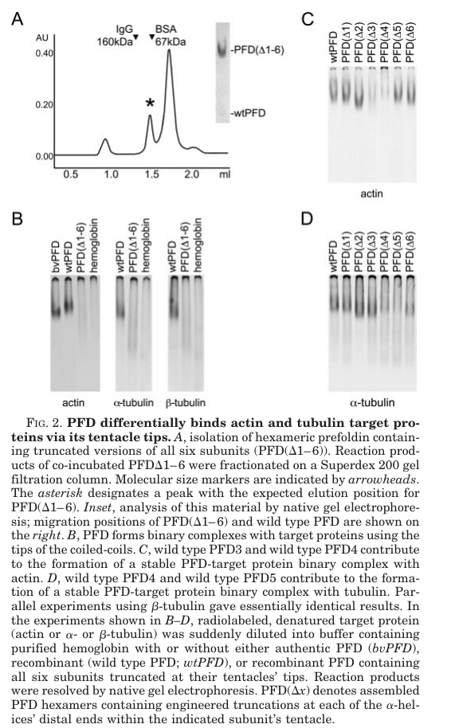

## Question

# Gene Research for Functional Annotation

## ⚠️ CRITICAL: Gene/Protein Identification Context

**BEFORE YOU BEGIN RESEARCH:** You MUST verify you are researching the CORRECT gene/protein. Gene symbols can be ambiguous, especially for less well-characterized genes from non-model organisms.

### Target Gene/Protein Identity (from UniProt):
- **UniProt Accession:** O18054
- **Protein Description:** RecName: Full=Probable prefoldin subunit 3;
- **Gene Information:** Name=pfd-3; Synonyms=vbp-1; ORFNames=T06G6.9;
- **Organism (full):** Caenorhabditis elegans.
- **Protein Family:** Belongs to the prefoldin subunit alpha family.
- **Key Domains:** PFD3. (IPR016655); Prefoldin. (IPR009053); Prefoldin_subunit_alpha. (IPR004127); Prefoldin (PF02996)

### MANDATORY VERIFICATION STEPS:

1. **Check if the gene symbol "pfd-3" matches the protein description above**
2. **Verify the organism is correct:** Caenorhabditis elegans.
3. **Check if protein family/domains align with what you find in literature**
4. **If you find literature for a DIFFERENT gene with the same or similar symbol, STOP**

### If Gene Symbol is Ambiguous or You Cannot Find Relevant Literature:

**DO NOT PROCEED WITH RESEARCH ON A DIFFERENT GENE.** Instead:
- State clearly: "The gene symbol 'pfd-3' is ambiguous or literature is limited for this specific protein"
- Explain what you found (e.g., "Found extensive literature on a different gene with the same symbol in a different organism")
- Describe the protein based ONLY on the UniProt information provided above
- Suggest that the protein function can be inferred from domain/family information

### Research Target:

Please provide a comprehensive research report on the gene **pfd-3** (gene ID: pfd-3, UniProt: O18054) in worm.

The research report should be a detailed narrative explaining the function, biological processes, and localization of the gene product. Citations should be given for all claims.

You should prioritize authoritative reviews and primary scientific literature when conducting research. You can supplement
this with annotations you find in gene/protein databases, but these can be outdated or inaccurate.

We are specifically interested in the primary function of the gene - for enzymes, what reaction is catalyzed, and what is the substrate specificity? For transporters, what is the substrate? For structural proteins or adapters, what is the broader structural role? For signaling molecules, what is the role in the pathway.

We are interested in where in or outside the cell the gene product carries out its function.

We are also interested in the signaling or biochemical pathways in which the gene functions. We are less interested in broad pleiotropic effects, except where these elucidate the precise role.

Include evidence where possible. We are interested in both experimental evidence as well as inference from structure, evolution, or bioinformatic analysis. Precise studies should be prioritized over high-throughput, where available.

## Output

Question: You are an expert researcher providing comprehensive, well-cited information.

Provide detailed information focusing on:
1. Key concepts and definitions with current understanding
2. Recent developments and latest research (prioritize 2023-2024 sources)
3. Current applications and real-world implementations
4. Expert opinions and analysis from authoritative sources
5. Relevant statistics and data from recent studies

Format as a comprehensive research report with proper citations. Include URLs and publication dates where available.
Always prioritize recent, authoritative sources and provide specific citations for all major claims.

# Gene Research for Functional Annotation

## ⚠️ CRITICAL: Gene/Protein Identification Context

**BEFORE YOU BEGIN RESEARCH:** You MUST verify you are researching the CORRECT gene/protein. Gene symbols can be ambiguous, especially for less well-characterized genes from non-model organisms.

### Target Gene/Protein Identity (from UniProt):
- **UniProt Accession:** O18054
- **Protein Description:** RecName: Full=Probable prefoldin subunit 3;
- **Gene Information:** Name=pfd-3; Synonyms=vbp-1; ORFNames=T06G6.9;
- **Organism (full):** Caenorhabditis elegans.
- **Protein Family:** Belongs to the prefoldin subunit alpha family.
- **Key Domains:** PFD3. (IPR016655); Prefoldin. (IPR009053); Prefoldin_subunit_alpha. (IPR004127); Prefoldin (PF02996)

### MANDATORY VERIFICATION STEPS:

1. **Check if the gene symbol "pfd-3" matches the protein description above**
2. **Verify the organism is correct:** Caenorhabditis elegans.
3. **Check if protein family/domains align with what you find in literature**
4. **If you find literature for a DIFFERENT gene with the same or similar symbol, STOP**

### If Gene Symbol is Ambiguous or You Cannot Find Relevant Literature:

**DO NOT PROCEED WITH RESEARCH ON A DIFFERENT GENE.** Instead:
- State clearly: "The gene symbol 'pfd-3' is ambiguous or literature is limited for this specific protein"
- Explain what you found (e.g., "Found extensive literature on a different gene with the same symbol in a different organism")
- Describe the protein based ONLY on the UniProt information provided above
- Suggest that the protein function can be inferred from domain/family information

### Research Target:

Please provide a comprehensive research report on the gene **pfd-3** (gene ID: pfd-3, UniProt: O18054) in worm.

The research report should be a detailed narrative explaining the function, biological processes, and localization of the gene product. Citations should be given for all claims.

You should prioritize authoritative reviews and primary scientific literature when conducting research. You can supplement
this with annotations you find in gene/protein databases, but these can be outdated or inaccurate.

We are specifically interested in the primary function of the gene - for enzymes, what reaction is catalyzed, and what is the substrate specificity? For transporters, what is the substrate? For structural proteins or adapters, what is the broader structural role? For signaling molecules, what is the role in the pathway.

We are interested in where in or outside the cell the gene product carries out its function.

We are also interested in the signaling or biochemical pathways in which the gene functions. We are less interested in broad pleiotropic effects, except where these elucidate the precise role.

Include evidence where possible. We are interested in both experimental evidence as well as inference from structure, evolution, or bioinformatic analysis. Precise studies should be prioritized over high-throughput, where available.

# Functional annotation of *Caenorhabditis elegans* **pfd-3**

## Identity and principal conclusion

The target is the worm gene **pfd-3** (*T06G6.9*; synonym *vbp-1*), encoding probable prefoldin subunit 3, UniProt **[O18054](https://www.uniprot.org/uniprotkb/O18054/entry)**. The accession, ORF name and domain identifiers PFD3 (IPR016655), prefoldin (IPR009053; PF02996), and prefoldin-subunit alpha (IPR004127) are from the UniProt information supplied with the question. Independent *C. elegans* studies identify *pfd-3* as a prefoldin gene and the ortholog of human VHL-binding protein 1; they support the family assignment, although the retrieved papers do not independently establish every accession or synonym. **Human VBP1 experiments must not be treated as experiments on worm PFD-3.** (maxeiner2019thehypoxiaresponsepathway pages 2-4, lundin2008functionalanalysisof pages 96-98, chen2015identificationofnonviable pages 2-3)

**Best-supported primary function:** PFD-3 is an intracellular, predominantly cytoplasmic **co-chaperone subunit** that helps maintain a usable pool of α-tubulin and, consequently, a functional microtubule cytoskeleton. Its proposed molecular role is to participate in the canonical prefoldin complex, which captures non-native cytoskeletal polypeptides and presents them to the ATP-dependent CCT/TRiC chaperonin for folding. PFD-3 is **not an enzyme**: there is no catalytic reaction, enzymatic substrate specificity or intrinsic ATPase activity established for the worm protein. Direct worm experiments strongly support tubulin *homeostasis*; the substrate-capture and handoff steps are inferred principally from conserved prefoldin biochemistry. (lundin2008functionalanalysisof pages 96-98, millanzambrano2014nuclearfunctionsof pages 2-3, simons2004selectivecontributionof pages 1-2)

## Molecular mechanism and substrate specificity

Canonical eukaryotic prefoldin is a six-subunit, jellyfish-shaped assembly containing two alpha-type and four beta-type subunits. Its projecting coiled coils engage incompletely folded proteins, notably actin and α/β-tubulin; CCT/TRiC then performs ATP-dependent folding. Thus, **tubulin is a client of the prefoldin–CCT pathway, not a substrate converted by a PFD-3-catalyzed reaction**. Recombinant eukaryotic prefoldin experiments demonstrate that different, partially overlapping sets of subunit tips recognize actin and tubulin. These architectural and binding experiments were **not performed on O18054**. (millanzambrano2014nuclearfunctionsof pages 2-3, lundin2008functionalanalysisof pages 84-89, simons2004selectivecontributionof pages 1-2)

A particularly useful specificity qualification comes from **Simons and colleagues, *Journal of Biological Chemistry* (February 2004)**: removing the distal tip of recombinant PFD3 markedly reduced complex binding to unfolded **actin**, while having little or no effect on **α-tubulin** binding in that assay. This shows that the worm *pfd-3* knockdown phenotype cannot by itself establish that the worm PFD-3 polypeptide directly contacts α-tubulin; the intact *complex* can support tubulin folding even if individual subunits contribute differently to client recognition. [Study and Figure 2](https://doi.org/10.1074/jbc.M306053200). (simons2004selectivecontributionof pages 7-8, simons2004selectivecontributionof media 17b81cec)

The decisive organism-specific measurements are reported in **Lundin and colleagues’ 2008 prefoldin work**. After *pfd-3* RNAi, embryonic **α-tubulin abundance fell by at least 95%**, versus approximately **30%** for total actin; **γ-tubulin did not decline significantly**. These were steady-state immunoblot measurements, not direct measurements of folding rates or degradation. No detergent-insoluble α-tubulin aggregates were detected by the assay used. Imaging of EBP-2::GFP microtubule plus ends and embryonic phenotypes further supported impaired microtubule growth and organization. Together, the data favor a particularly strong dependence of embryonic **α-tubulin homeostasis** on prefoldin, without establishing that actin or γ-tubulin can never be clients in another setting. (lundin2008functionalanalysisofb pages 112-116, lundin2008functionalanalysisof pages 96-98)

The distinction between the **alpha prefoldin-subunit family** and **α-tubulin** matters: the first describes PFD-3’s evolutionary/structural class; the second is a cytoskeletal protein whose abundance was measured after PFD-3 depletion. (millanzambrano2014nuclearfunctionsof pages 2-3, lundin2008functionalanalysisof pages 96-98)

## Biological processes and cellular location

**Cell division and migration.** In the worm studies, depletion of *pfd-3* or other prefoldin components produced microtubule-dependent defects during early embryonic divisions and embryonic lethality; knockdown of CCT or tubulin produced related phenotypes. Low-level prefoldin or CCT perturbation and a *pfd-1* mutant also disrupted distal tip-cell migration during gonad development, consistent with a broader requirement for cytoskeletal-protein biogenesis in dividing and migrating cells. The migration evidence is substantially **prefoldin-complex-level**, rather than proof of a distinct PFD-3-specific migration mechanism. Microfilament-dependent furrowing and NMY-2::GFP localization were not significantly altered in the examined *pfd-3*(RNAi) embryos, consistent with the more pronounced measured tubulin effect. (lundin2008functionalanalysisofb pages 108-112, lundin2008functionalanalysisofb pages 112-116, lundin2008functionalanalysisof pages 96-98)

**Site of action.** Translational **PFD-3::GFP** was detected in the **cytoplasm** of multiple worm cell types, including body-wall muscle and hypodermal cells, and was expressed in developing somatic gonad. Related endogenous PFD-6 immunostaining was diffuse and non-nuclear in embryos and cytoplasmic in dissected gonads. These observations support cytosolic prefoldin activity, but PFD-6 staining is not a direct localization measurement of PFD-3, and transgenic PFD-3::GFP may not perfectly reproduce endogenous expression. The available worm evidence does **not** establish secretion, an extracellular site of action or a dedicated nuclear PFD-3 function. (lundin2008functionalanalysisofb pages 108-112, lundin2008functionalanalysisof pages 96-98)

**Neuronal context.** In **Chen, Diaz Cuadros and Chalfie, *G3* (March 2015)**, neuronally enhanced RNAi identified *pfd-3* among genes whose depletion reduced touch sensitivity. The screen found **61 hits among 849 genes tested (about 7%)**. This offers an application of worm genetics to discover genes relevant to mechanosensory-neuron function, but *pfd-3* was not reported there as mutation-confirmed or subjected to a dedicated molecular follow-up. A requirement for tubulin-dependent neuronal architecture or function is plausible, **not demonstrated as the specific explanation** for this screen hit. [Study](https://doi.org/10.1534/g3.114.015776). (chen2015identificationofnonviable pages 5-6, chen2015identificationofnonviable pages 4-5, chen2015identificationofnonviable pages 2-3)

## Pathway associations and recent research

The **prefoldin → CCT/TRiC → folded cytoskeletal-protein** pathway is the most defensible biochemical annotation for PFD-3. A separate worm genetics literature links *pfd-3* to the **EGL-9 hypoxia-response and LET-60/RAS–MAPK** developmental context: **Maxeiner and colleagues, *Life Science Alliance* (May 2019)** identify it as a previously detected modifier of RAS/MAPK-associated vulval phenotypes and a suppressor-screen hit associated with *egl-9*. Their study does **not** show that PFD-3 directly binds EGL-9, HIF-1 or a RAS-pathway component. This is a genetic association, not a demonstrated primary signaling reaction for PFD-3. [Study](https://doi.org/10.26508/lsa.201800255). (maxeiner2019thehypoxiaresponsepathway pages 2-4)

The most pertinent **2023–2024** item recovered is **Laver, Duncan and Calarco, bioRxiv, posted 11 November 2024**. Their analysis places annotated polysome-associated PFD-3 in a computational RNA-regulatory interaction network and recovers other prefoldin subunits as predicted/reported network interactors. The authors themselves caution that canonical prefoldin’s characterized activity does not imply a **direct RNA-regulatory function**. This is an **unreviewed preprint and network/annotation analysis**, not a new experiment proving PFD-3 binds RNA or establishing a new substrate. [Preprint](https://doi.org/10.1101/2024.11.07.622524). (laver2024aglobalview pages 1-5, laver2024aglobalview pages 23-26)

A further attribution caution concerns **PFD-6**: a **2018 *Genes & Development*** study connected that different prefoldin subunit to HSF-1–DAF-16/FOXO-dependent longevity, primarily in the context of an **R2TP/prefoldin-like** assembly. That result should **not** be assigned to PFD-3 or to the canonical six-subunit complex without PFD-3-specific evidence. [Study](https://doi.org/10.1101/gad.317362.118). (son2018prefoldin6mediates pages 3-3, son2018prefoldin6mediates pages 6-7)

The following evidence summary separates direct worm results from extrapolation and computational associations:

| Source/year | Precise result | Evidence strength / limitation |
|---|---|---|
| Lundin et al., 2008 — *C. elegans* | **pfd-3 RNAi** reduced embryonic α-tubulin by **at least 95%**, versus an approximately **30%** reduction in total actin and no significant reduction in γ-tubulin. No detergent-insoluble α-tubulin aggregates were detected. EBP-2::GFP tracking showed reduced microtubule growth; depletion produced microtubule-dependent early-embryonic defects and fully penetrant embryonic lethality. (lundin2008functionalanalysisofb pages 112-116, lundin2008functionalanalysisof pages 96-98) | **Strongest direct functional evidence.** Targeted worm RNAi, quantitative immunoblotting and live microtubule imaging support a primary role in α-tubulin homeostasis and microtubule function. It is not a direct biochemical folding or PFD-3–tubulin-binding assay, and the retrieved text does not preserve the numerical EBP-2 growth-rate value. |
| Lundin et al., 2008 — *C. elegans* localization | A translational **PFD-3::GFP** reporter was broadly cytoplasmic, including body-wall muscle, hypodermal cells and developing somatic gonad. Related prefoldin reporters and endogenous PFD-6 supported broad cytosolic expression in embryos and gonads. (lundin2008functionalanalysisofb pages 108-112, lundin2008functionalanalysisof pages 96-98) | **Direct reporter evidence, with caveats.** Supports a predominantly intracellular cytoplasmic site of action, but the PFD-3 reporter was transgenic and may omit endogenous regulatory elements; endogenous PFD-3 localization was not independently demonstrated. |
| Chen, Diaz Cuadros & Chalfie, 2015 — *C. elegans* | Neuronally enhanced RNAi identified **61 of 849 genes (7%)** whose depletion reduced touch sensitivity; **pfd-3** was one of these hits and was annotated as a putative prefoldin related to human VBP1 and α-tubulin synthesis. pfd-3 was not shown as mutation-confirmed or mechanistically followed up. (chen2015identificationofnonviable pages 5-6, chen2015identificationofnonviable pages 4-5, chen2015identificationofnonviable pages 2-3) | **Screen-level supporting evidence only.** Suggests a neuronal requirement compatible with microtubule-dependent mechanosensation, but provides neither a pfd-3-specific quantitative response nor mutant validation, rescue or direct mechanism. |
| Maxeiner et al., 2019 — *C. elegans* | **pfd-3** was cited as a natural genetic modifier of RAS/MAPK signaling and as a suppressor-screen hit connected to the EGL-9 hypoxia-response pathway; the study identifies it as the worm ortholog of human VHL-binding protein 1. (maxeiner2019thehypoxiaresponsepathway pages 2-4) | **Contextual genetic association.** Supports identity and possible pathway cross-talk, but this paper did not establish how PFD-3 acts molecularly in hypoxia or RAS/MAPK signaling; a cytoskeletal/proteostasis-mediated indirect effect remains possible. |
| Laver, Duncan & Calarco, 2024 — *C. elegans*, bioRxiv preprint | A **STRING-derived computational network** classified polysome-associated PFD-3 as an RNA-regulatory-associated protein and recovered multiple prefoldin subunits as its interactors. The authors explicitly noted that canonical prefoldin does not appear likely to have a direct RNA-regulatory role. (laver2024aglobalview pages 1-5, laver2024aglobalview pages 23-26) | **Recent but hypothesis-generating.** Unreviewed preprint posted **11 November 2024**; reanalysis of reported interaction/annotation data rather than a new PFD-3 binding experiment. It does **not** demonstrate direct RNA binding, polysome mechanism or physical interactions in vivo. |
| Simons et al., 2004 — recombinant eukaryotic prefoldin, non-worm | Deleting the distal coiled-coil tip of **PFD3** sharply reduced binding of unfolded actin but had little or no effect on α-tubulin binding; actin and α/β-tubulin use different, overlapping combinations of prefoldin tentacles. (simons2004selectivecontributionof pages 1-2, simons2004selectivecontributionof pages 7-8, simons2004selectivecontributionof media 17b81cec) | **Strong biochemical family-level evidence, not direct worm evidence.** Defines a plausible substrate-recognition role for the PFD3 tentacle, especially for actin, but cannot by itself prove identical specificity for *C. elegans* O18054. It also cautions against interpreting the worm α-tubulin-loss phenotype as evidence that PFD-3 itself directly contacts α-tubulin. |

*Table: This table separates direct *C. elegans* PFD-3 evidence from genetic context, computational findings and non-worm biochemical inference. It highlights both the strong support for tubulin homeostasis and the limits of claims about direct substrate binding or RNA regulation.*

**Annotation assessment.** The strongest experimentally justified annotation is **cytoplasmic prefoldin-associated support of α-tubulin biogenesis and microtubule-dependent embryonic function**. Conserved prefoldin structure supports describing PFD-3 as a substrate-recognition/adaptor component of a CCT-linked co-chaperone, while the exact binding contacts and complete client repertoire of **worm O18054** remain unmeasured in the cited experiments. Recent network findings and hypoxia/RAS genetic associations are useful research leads, not replacements for that primary function. (lundin2008functionalanalysisof pages 96-98, simons2004selectivecontributionof pages 1-2, laver2024aglobalview pages 23-26)

References

1. (maxeiner2019thehypoxiaresponsepathway pages 2-4): Sabrina Maxeiner, Judith Grolleman, Tobias Schmid, Jan Kammenga, and Alex Hajnal. The hypoxia-response pathway modulates ras/mapk–mediated cell fate decisions in caenorhabditis elegans. Life Science Alliance, 2:e201800255, May 2019. URL: https://doi.org/10.26508/lsa.201800255, doi:10.26508/lsa.201800255. This article has 18 citations and is from a peer-reviewed journal.

2. (lundin2008functionalanalysisof pages 96-98): V Lundin. Functional analysis of factors involved in cytoskeletal protein folding and degradation: prefoldin, cct and cofactor e-like. Unknown journal, 2008.

3. (chen2015identificationofnonviable pages 2-3): Xiaoyin Chen, Margarete Diaz Cuadros, and Martin Chalfie. Identification of nonviable genes affecting touch sensitivity in<i>caenorhabditis elegans</i>using neuronally enhanced feeding rna interference. G3 Genes|Genomes|Genetics, 5:467-475, Mar 2015. URL: https://doi.org/10.1534/g3.114.015776, doi:10.1534/g3.114.015776. This article has 17 citations.

4. (millanzambrano2014nuclearfunctionsof pages 2-3): Gonzalo Millán-Zambrano and Sebastián Chávez. Nuclear functions of prefoldin. Open Biology, 4:140085, Jul 2014. URL: https://doi.org/10.1098/rsob.140085, doi:10.1098/rsob.140085. This article has 92 citations and is from a peer-reviewed journal.

5. (simons2004selectivecontributionof pages 1-2): C. Torrey Simons, An Staes, Heidi Rommelaere, Christophe Ampe, Sally A. Lewis, and Nicholas J. Cowan. Selective contribution of eukaryotic prefoldin subunits to actin and tubulin binding*. Journal of Biological Chemistry, 279:4196-4203, Feb 2004. URL: https://doi.org/10.1074/jbc.m306053200, doi:10.1074/jbc.m306053200. This article has 74 citations and is from a domain leading peer-reviewed journal.

6. (lundin2008functionalanalysisof pages 84-89): V Lundin. Functional analysis of factors involved in cytoskeletal protein folding and degradation: prefoldin, cct and cofactor e-like. Unknown journal, 2008.

7. (simons2004selectivecontributionof pages 7-8): C. Torrey Simons, An Staes, Heidi Rommelaere, Christophe Ampe, Sally A. Lewis, and Nicholas J. Cowan. Selective contribution of eukaryotic prefoldin subunits to actin and tubulin binding*. Journal of Biological Chemistry, 279:4196-4203, Feb 2004. URL: https://doi.org/10.1074/jbc.m306053200, doi:10.1074/jbc.m306053200. This article has 74 citations and is from a domain leading peer-reviewed journal.

8. (simons2004selectivecontributionof media 17b81cec): C. Torrey Simons, An Staes, Heidi Rommelaere, Christophe Ampe, Sally A. Lewis, and Nicholas J. Cowan. Selective contribution of eukaryotic prefoldin subunits to actin and tubulin binding*. Journal of Biological Chemistry, 279:4196-4203, Feb 2004. URL: https://doi.org/10.1074/jbc.m306053200, doi:10.1074/jbc.m306053200. This article has 74 citations and is from a domain leading peer-reviewed journal.

9. (lundin2008functionalanalysisofb pages 112-116): V Lundin. Functional analysis of factors involved in cytoskeletal protein folding and degradation: prefoldin, cct and cofactor e-like. Unknown journal, 2008.

10. (lundin2008functionalanalysisofb pages 108-112): V Lundin. Functional analysis of factors involved in cytoskeletal protein folding and degradation: prefoldin, cct and cofactor e-like. Unknown journal, 2008.

11. (chen2015identificationofnonviable pages 5-6): Xiaoyin Chen, Margarete Diaz Cuadros, and Martin Chalfie. Identification of nonviable genes affecting touch sensitivity in<i>caenorhabditis elegans</i>using neuronally enhanced feeding rna interference. G3 Genes|Genomes|Genetics, 5:467-475, Mar 2015. URL: https://doi.org/10.1534/g3.114.015776, doi:10.1534/g3.114.015776. This article has 17 citations.

12. (chen2015identificationofnonviable pages 4-5): Xiaoyin Chen, Margarete Diaz Cuadros, and Martin Chalfie. Identification of nonviable genes affecting touch sensitivity in<i>caenorhabditis elegans</i>using neuronally enhanced feeding rna interference. G3 Genes|Genomes|Genetics, 5:467-475, Mar 2015. URL: https://doi.org/10.1534/g3.114.015776, doi:10.1534/g3.114.015776. This article has 17 citations.

13. (laver2024aglobalview pages 1-5): John D. Laver, Maida Duncan, and John A. Calarco. A global view of the rna-binding and regulatory protein landscape in caenorhabditis elegans. bioRxiv, Nov 2024. URL: https://doi.org/10.1101/2024.11.07.622524, doi:10.1101/2024.11.07.622524. This article has 1 citations.

14. (laver2024aglobalview pages 23-26): John D. Laver, Maida Duncan, and John A. Calarco. A global view of the rna-binding and regulatory protein landscape in caenorhabditis elegans. bioRxiv, Nov 2024. URL: https://doi.org/10.1101/2024.11.07.622524, doi:10.1101/2024.11.07.622524. This article has 1 citations.

15. (son2018prefoldin6mediates pages 3-3): Heehwa G. Son, Keunhee Seo, Mihwa Seo, Sangsoon Park, Seokjin Ham, Seon Woo A. An, Eun-Seok Choi, Yujin Lee, Haeshim Baek, Eunju Kim, Youngjae Ryu, Chang Man Ha, Ao-Lin Hsu, Tae-Young Roh, Sung Key Jang, and Seung-Jae V. Lee. Prefoldin 6 mediates longevity response from heat shock factor 1 to foxo in c. elegans. Genes & Development, 32:1562-1575, Nov 2018. URL: https://doi.org/10.1101/gad.317362.118, doi:10.1101/gad.317362.118. This article has 37 citations and is from a highest quality peer-reviewed journal.

16. (son2018prefoldin6mediates pages 6-7): Heehwa G. Son, Keunhee Seo, Mihwa Seo, Sangsoon Park, Seokjin Ham, Seon Woo A. An, Eun-Seok Choi, Yujin Lee, Haeshim Baek, Eunju Kim, Youngjae Ryu, Chang Man Ha, Ao-Lin Hsu, Tae-Young Roh, Sung Key Jang, and Seung-Jae V. Lee. Prefoldin 6 mediates longevity response from heat shock factor 1 to foxo in c. elegans. Genes & Development, 32:1562-1575, Nov 2018. URL: https://doi.org/10.1101/gad.317362.118, doi:10.1101/gad.317362.118. This article has 37 citations and is from a highest quality peer-reviewed journal.

## Artifacts

- [Edison artifact artifact-00](pfd-3-deep-research-falcon_artifacts/artifact-00.md)

## Citations

1. maxeiner2019thehypoxiaresponsepathway pages 2-4
2. lundin2008functionalanalysisof pages 96-98
3. chen2015identificationofnonviable pages 2-3
4. millanzambrano2014nuclearfunctionsof pages 2-3
5. simons2004selectivecontributionof pages 1-2
6. lundin2008functionalanalysisof pages 84-89
7. simons2004selectivecontributionof pages 7-8
8. lundin2008functionalanalysisofb pages 112-116
9. lundin2008functionalanalysisofb pages 108-112
10. chen2015identificationofnonviable pages 5-6
11. chen2015identificationofnonviable pages 4-5
12. laver2024aglobalview pages 1-5
13. laver2024aglobalview pages 23-26
14. O18054
15. Study and Figure 2
16. Study
17. Preprint
18. https://www.uniprot.org/uniprotkb/O18054/entry
19. https://doi.org/10.1074/jbc.M306053200
20. https://doi.org/10.1534/g3.114.015776
21. https://doi.org/10.26508/lsa.201800255
22. https://doi.org/10.1101/2024.11.07.622524
23. https://doi.org/10.1101/gad.317362.118
24. https://doi.org/10.26508/lsa.201800255,
25. https://doi.org/10.1534/g3.114.015776,
26. https://doi.org/10.1098/rsob.140085,
27. https://doi.org/10.1074/jbc.m306053200,
28. https://doi.org/10.1101/2024.11.07.622524,
29. https://doi.org/10.1101/gad.317362.118,