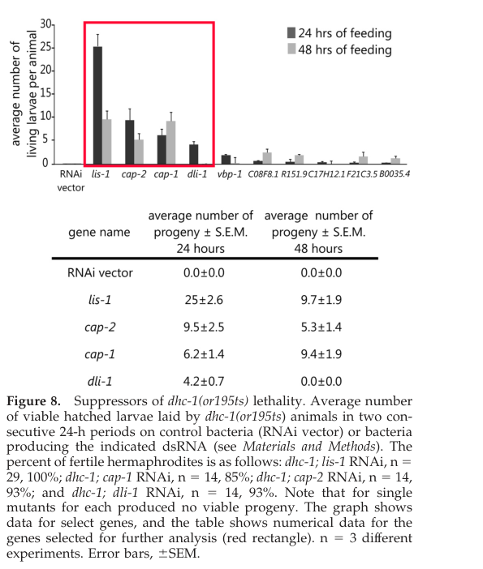

## Question

# Gene Research for Functional Annotation

## ⚠️ CRITICAL: Gene/Protein Identification Context

**BEFORE YOU BEGIN RESEARCH:** You MUST verify you are researching the CORRECT gene/protein. Gene symbols can be ambiguous, especially for less well-characterized genes from non-model organisms.

### Target Gene/Protein Identity (from UniProt):
- **UniProt Accession:** Q17435
- **Protein Description:** RecName: Full=Probable prefoldin subunit 4;
- **Gene Information:** Name=pfd-4; Synonyms=tag-317; ORFNames=B0035.4;
- **Organism (full):** Caenorhabditis elegans.
- **Protein Family:** Belongs to the prefoldin subunit beta family.
- **Key Domains:** PFD_beta-like. (IPR002777); PFDN4. (IPR016661); Prefoldin_2 (PF01920)

### MANDATORY VERIFICATION STEPS:

1. **Check if the gene symbol "pfd-4" matches the protein description above**
2. **Verify the organism is correct:** Caenorhabditis elegans.
3. **Check if protein family/domains align with what you find in literature**
4. **If you find literature for a DIFFERENT gene with the same or similar symbol, STOP**

### If Gene Symbol is Ambiguous or You Cannot Find Relevant Literature:

**DO NOT PROCEED WITH RESEARCH ON A DIFFERENT GENE.** Instead:
- State clearly: "The gene symbol 'pfd-4' is ambiguous or literature is limited for this specific protein"
- Explain what you found (e.g., "Found extensive literature on a different gene with the same symbol in a different organism")
- Describe the protein based ONLY on the UniProt information provided above
- Suggest that the protein function can be inferred from domain/family information

### Research Target:

Please provide a comprehensive research report on the gene **pfd-4** (gene ID: pfd-4, UniProt: Q17435) in worm.

The research report should be a detailed narrative explaining the function, biological processes, and localization of the gene product. Citations should be given for all claims.

You should prioritize authoritative reviews and primary scientific literature when conducting research. You can supplement
this with annotations you find in gene/protein databases, but these can be outdated or inaccurate.

We are specifically interested in the primary function of the gene - for enzymes, what reaction is catalyzed, and what is the substrate specificity? For transporters, what is the substrate? For structural proteins or adapters, what is the broader structural role? For signaling molecules, what is the role in the pathway.

We are interested in where in or outside the cell the gene product carries out its function.

We are also interested in the signaling or biochemical pathways in which the gene functions. We are less interested in broad pleiotropic effects, except where these elucidate the precise role.

Include evidence where possible. We are interested in both experimental evidence as well as inference from structure, evolution, or bioinformatic analysis. Precise studies should be prioritized over high-throughput, where available.

## Output

Question: You are an expert researcher providing comprehensive, well-cited information.

Provide detailed information focusing on:
1. Key concepts and definitions with current understanding
2. Recent developments and latest research (prioritize 2023-2024 sources)
3. Current applications and real-world implementations
4. Expert opinions and analysis from authoritative sources
5. Relevant statistics and data from recent studies

Format as a comprehensive research report with proper citations. Include URLs and publication dates where available.
Always prioritize recent, authoritative sources and provide specific citations for all major claims.

# Gene Research for Functional Annotation

## ⚠️ CRITICAL: Gene/Protein Identification Context

**BEFORE YOU BEGIN RESEARCH:** You MUST verify you are researching the CORRECT gene/protein. Gene symbols can be ambiguous, especially for less well-characterized genes from non-model organisms.

### Target Gene/Protein Identity (from UniProt):
- **UniProt Accession:** Q17435
- **Protein Description:** RecName: Full=Probable prefoldin subunit 4;
- **Gene Information:** Name=pfd-4; Synonyms=tag-317; ORFNames=B0035.4;
- **Organism (full):** Caenorhabditis elegans.
- **Protein Family:** Belongs to the prefoldin subunit beta family.
- **Key Domains:** PFD_beta-like. (IPR002777); PFDN4. (IPR016661); Prefoldin_2 (PF01920)

### MANDATORY VERIFICATION STEPS:

1. **Check if the gene symbol "pfd-4" matches the protein description above**
2. **Verify the organism is correct:** Caenorhabditis elegans.
3. **Check if protein family/domains align with what you find in literature**
4. **If you find literature for a DIFFERENT gene with the same or similar symbol, STOP**

### If Gene Symbol is Ambiguous or You Cannot Find Relevant Literature:

**DO NOT PROCEED WITH RESEARCH ON A DIFFERENT GENE.** Instead:
- State clearly: "The gene symbol 'pfd-4' is ambiguous or literature is limited for this specific protein"
- Explain what you found (e.g., "Found extensive literature on a different gene with the same symbol in a different organism")
- Describe the protein based ONLY on the UniProt information provided above
- Suggest that the protein function can be inferred from domain/family information

### Research Target:

Please provide a comprehensive research report on the gene **pfd-4** (gene ID: pfd-4, UniProt: Q17435) in worm.

The research report should be a detailed narrative explaining the function, biological processes, and localization of the gene product. Citations should be given for all claims.

You should prioritize authoritative reviews and primary scientific literature when conducting research. You can supplement
this with annotations you find in gene/protein databases, but these can be outdated or inaccurate.

We are specifically interested in the primary function of the gene - for enzymes, what reaction is catalyzed, and what is the substrate specificity? For transporters, what is the substrate? For structural proteins or adapters, what is the broader structural role? For signaling molecules, what is the role in the pathway.

We are interested in where in or outside the cell the gene product carries out its function.

We are also interested in the signaling or biochemical pathways in which the gene functions. We are less interested in broad pleiotropic effects, except where these elucidate the precise role.

Include evidence where possible. We are interested in both experimental evidence as well as inference from structure, evolution, or bioinformatic analysis. Precise studies should be prioritized over high-throughput, where available.

# Functional annotation of *Caenorhabditis elegans pfd-4* (UniProt Q17435)

## Identity and scope

**The target is the worm locus *pfd-4/B0035.4*, not *pfd-6* or a similarly named protein in another organism.** The supplied UniProt record identifies Q17435 as probable prefoldin subunit 4, with synonym *tag-317* and prefoldin β-family domains PFD_beta-like (IPR002777), PFDN4 (IPR016661), and Prefoldin_2 (PF01920). Worm experimental work independently identifies the *pfd-4(gk430)* deletion as affecting **B0035.4**; a separate genetic screen names B0035.4 among the prefoldin-subunit genes it tested. The retrieved papers do not independently establish the *tag-317* synonym or accession-to-sequence mapping, so those identifiers remain grounded in the supplied UniProt record. The literature for this **specific protein is limited**. (lundin2008functionalanalysisof pages 108-112, gilkrzewska2010regulatorsofthe pages 8-9)

## Primary molecular function and pathway

The best-supported **functional annotation is a probable prefoldin-family cochaperone subunit**, rather than an enzyme, transporter, motor, or actin/tubulin filament component. Canonical prefoldin binds non-native polypeptides through a multimeric coiled-coil assembly and helps present folding-competent cytoskeletal proteins—principally actin and α/β-tubulin—to the cytosolic chaperonin CCT/TRiC. Prefoldin facilitates that folding pathway; it is not itself assigned a catalytic reaction or transport substrate. These are **family- and complex-level mechanisms**, not a demonstration that purified worm PFD-4 binds a particular client or forms a specific complex. (lundin2008functionalanalysisof pages 89-92, lundin2008functionalanalysisofa pages 59-62)

The proposed pathway is therefore **cytosolic proteostasis → CCT-assisted cytoskeletal-protein folding → availability of assembly-competent tubulin and actin → microtubule/actin organization**. In worm embryos, experiments on other prefoldin subunits strongly support the first three links, especially for tubulin. They do **not** establish a PFD-4-specific substrate, interaction with CCT, or rate-limiting role in that pathway. In particular, the worm study’s authors considered nematode PFD-4 unusually divergent and raised an alternative, non-chaperone function as a *possibility*, not a proven assignment. (lundin2008functionalanalysisof pages 96-98, lundin2008functionalanalysisof pages 108-112, lundin2008functionalanalysisof pages 98-101)

## Direct evidence for *pfd-4/B0035.4*

**Loss of function under standard conditions.** In Lundin’s 2008 worm work, RNAi against most prefoldin subunits caused embryonic lethality, whereas *pfd-4* RNAi had no discernible phenotype. More importantly, homozygotes carrying *pfd-4(gk430)*, reported to remove the coding region, had no visible developmental or morphological phenotype. In an embryonic microtubule-growth assay, *pfd-4* was the exception to the significant growth-rate reduction caused by knockdown of other prefoldin subunits. These results constrain, rather than confirm, an essential PFD-4-specific role in routine embryonic tubulin biogenesis; they do not rule out buffered, subtle, or condition-dependent functions. The deletion provides a check beyond RNAi, although this evidence does not identify a compensating protein. (lundin2008functionalanalysisof pages 96-98, lundin2008functionalanalysisof pages 108-112, lundin2008functionalanalysisof pages 98-101)

**A conditional genetic interaction.** Gil-Krzewska and colleagues reported that RNAi targeting **B0035.4**, together with RNAi targeting five other listed prefoldin genes, suppressed lethality of the temperature-sensitive dynein-heavy-chain mutant *dhc-1(or195ts)* at **25 °C**. Their Figure 8 shows B0035.4 among the suppressors. This is direct evidence that changing the target locus can influence a dynein-dependent developmental phenotype in a sensitized background. The study does **not** establish that PFD-4 binds dynein, directly reorganizes F-actin, or has a defined biochemical role in the dynein complex; the mechanism of the B0035.4-specific suppression was not resolved. (gilkrzewska2010regulatorsofthe pages 8-9, gilkrzewska2010regulatorsofthe pages 9-12, gilkrzewska2010regulatorsofthe media 59b19508)

The evidence is most clearly interpreted by keeping experiments on the exact locus separate from experiments on its relatives:

| Finding | Gene/species experimental system | Implications and limits | Citation IDs |
|---|---|---|---|
| Complete coding-region deletion **pfd-4(gk430)** produced no visible developmental or morphological phenotype. | *C. elegans* **pfd-4/B0035.4** homozygous deletion mutant | Direct gene-specific evidence indicates that PFD-4 is dispensable for gross development under the tested laboratory conditions. It does not exclude subtle, conditional, tissue-specific, or genetically buffered functions. | (lundin2008functionalanalysisof pages 96-98) |
| RNAi against other prefoldin subunits reduced embryonic microtubule growth from approximately **0.7 to 0.4 µm/s**, whereas **pfd-4** was the reported exception. | *C. elegans* prefoldin-subunit RNAi with EBP-2::GFP microtubule-plus-end tracking | Directly argues against assigning the strong canonical-prefoldin microtubule phenotype to PFD-4; the authors described PFD-4 as redundant. RNAi efficacy for PFD-4 was not directly quantified in this assay, although the deletion result independently supports the weak phenotype. | (lundin2008functionalanalysisof pages 96-98, lundin2008functionalanalysisof pages 98-101) |
| RNAi targeting the exact locus **B0035.4** suppressed lethality of temperature-sensitive **dhc-1(or195ts)** animals and was among six prefoldin-subunit suppressors. | *C. elegans* **B0035.4/pfd-4** RNAi in a conditional dynein-heavy-chain mutant at 25°C | Gene-specific genetic-interaction evidence links PFD-4 to the dynein–cytoskeleton system. It does not establish direct physical interaction, substrate binding, or the suppression mechanism; the available figure supports suppression but not a safely extractable precise effect size for B0035.4. | (gilkrzewska2010regulatorsofthe pages 8-9, gilkrzewska2010regulatorsofthe media 59b19508) |
| **pfd-3(RNAi)** reduced embryonic α-tubulin by at least **95%** and total actin by about **30%**. | *C. elegans* **pfd-3**, not pfd-4, RNAi; embryo-lysate immunoblotting | Strong evidence that canonical prefoldin activity supports tubulin homeostasis, with a smaller effect on actin. These quantitative results must **not** be attributed directly to PFD-4 because pfd-4 was not the depleted subunit in this experiment. | (lundin2008functionalanalysisof pages 96-98, lundin2008functionalanalysisof pages 98-101) |
| DIP-MS resolved human canonical prefoldin assemblies containing **PFDN4** and distinguished an alternative prefoldin-like assembly containing PDRG1 instead of PFDN4. | Human-cell interaction proteomics; three biologically independent DIP-MS experiments | Current comparative evidence supports PFDN4 as a canonical-prefoldin component in humans and distinguishes canonical from prefoldin-like complexes. It is **human-only** evidence and cannot demonstrate complex incorporation, substrate specificity, phenotype, or localization of *C. elegans* PFD-4. | (fabian2024dipmsultradeepinteraction pages 7-8) |

*Table: Evidence-level summary separating direct findings for *C. elegans* pfd-4/B0035.4 from results obtained with other worm prefoldin subunits or human PFDN4. The limits column prevents complex-level or homolog-based observations from being misassigned to Q17435.*

**Quantitative context, not PFD-4-specific effects.** In the 2008 worm experiments, depletion of ***pfd-3*** reduced embryonic α-tubulin by **at least 95%** and total actin by about **30%**. RNAi against prefoldin subunits *other than pfd-4* reduced measured embryonic microtubule growth from approximately **0.7 to 0.4 µm/s**. These values demonstrate the importance of prefoldin activity in the organism but must not be reported as consequences of *pfd-4* loss. (lundin2008functionalanalysisof pages 96-98, lundin2008functionalanalysisof pages 98-101)

## Cellular location and biological processes

**Predicted site of primary activity: the cytosol.** Cytosolic folding of newly made cytoskeletal proteins is the mechanistically plausible setting for worm PFD-4. Worm experiments observed cytoplasmic PFD-1 and PFD-3 reporters and diffuse, largely non-nuclear endogenous PFD-6 staining in embryos and gonads. **None is a PFD-4 localization measurement**: an experimentally established PFD-4 tissue distribution, nuclear pool, or subcellular site cannot be assigned from these observations. Nor is there evidence here for an extracellular or membrane-transport role. (lundin2008functionalanalysisof pages 96-98, lundin2008functionalanalysisof pages 108-112)

At the **prefoldin-complex level**, relevant processes in worms include tubulin homeostasis, microtubule dynamics, embryonic cell division, and distal-tip-cell migration during gonad development. For **PFD-4 itself**, the defensible process-level finding is a genetic relationship to the *dhc-1* dynein–cytoskeleton phenotype; whether PFD-4 acts through canonical folding, an alternative assembly, or another mechanism remains unresolved. Reports that worm PFD-6 participates in an HSF-1–DAF-16/FOXO longevity response concern a **different gene and complex context** and should not be transferred to *pfd-4*. (lundin2008functionalanalysisof pages 108-112, gilkrzewska2010regulatorsofthe pages 8-9, son2018prefoldin6mediates pages 2-3)

## Recent research and current interpretation

A **March 2024** human-cell interaction-proteomics study resolved distinct prefoldin-family assemblies and distinguished canonical complexes containing **human PFDN4** from an alternative assembly containing PDRG1 instead of PFDN4. This modern result strengthens the need to distinguish canonical prefoldin from prefoldin-like complexes. It **does not demonstrate** that divergent worm PFD-4 occupies the same assembly or has the human protein’s biochemical properties. No retrieved **2023–2024** primary study supplied a new, gene-specific functional or localization test of worm *pfd-4/B0035.4*. Thus, a confident assignment of its exact client specificity, binding partners, cellular localization, or non-chaperone activity would exceed the available evidence. (fabian2024dipmsultradeepinteraction pages 7-8, lundin2008functionalanalysisof pages 96-98)

**Conclusion.** Annotate Q17435 as a **probable prefoldin β-family subunit with an inferred cytosolic cochaperone role**, while flagging the **uncertain contribution of worm PFD-4 to canonical tubulin/actin folding**. Its strongest locus-specific observations are the absence of an overt phenotype after *pfd-4(gk430)* deletion and suppression of conditional *dhc-1* lethality after B0035.4 RNAi. This evidence supports a possible context-dependent cytoskeletal connection, not a verified PFD-4-specific folding reaction or localization. (lundin2008functionalanalysisof pages 96-98, gilkrzewska2010regulatorsofthe pages 8-9, lundin2008functionalanalysisof pages 98-101)

### Principal sources and record

- Lundin, V. **2008**. *Functional Analysis of Factors Involved in Cytoskeletal Protein Folding and Degradation: Prefoldin, CCT and Cofactor E-like*; retrieved dissertation text, especially the *pfd-4(gk430)* analysis. A stable publication URL was **not supplied** in the retrieved record. (lundin2008functionalanalysisof pages 96-98, lundin2008functionalanalysisof pages 108-112)
- Gil-Krzewska AJ *et al.* **1 August 2010**, published online **16 June 2010**. “Regulators of the Actin Cytoskeleton Mediate Lethality in a *Caenorhabditis elegans dhc-1* Mutant.” *Molecular Biology of the Cell* 21:2707–2720. https://doi.org/10.1091/mbc.e09-07-0593. (gilkrzewska2010regulatorsofthe pages 1-2, gilkrzewska2010regulatorsofthe pages 8-9)
- Frommelt F *et al.* **March 2024**. “DIP-MS: ultra-deep interaction proteomics for the deconvolution of protein complexes.” *Nature Methods* 21:635–647. https://doi.org/10.1038/s41592-024-02211-y. **Human comparative evidence only.** (fabian2024dipmsultradeepinteraction pages 7-8)
- UniProt **Q17435**, identity and domain annotations supplied with the research request: https://www.uniprot.org/uniprotkb/Q17435/entry. The current database release date was not independently verified.

References

1. (lundin2008functionalanalysisof pages 108-112): V Lundin. Functional analysis of factors involved in cytoskeletal protein folding and degradation: prefoldin, cct and cofactor e-like. Unknown journal, 2008.

2. (gilkrzewska2010regulatorsofthe pages 8-9): Aleksandra J. Gil-Krzewska, Erica Farber, Edgar A. Buttner, and Craig P. Hunter. Regulators of the actin cytoskeleton mediate lethality in a caenorhabditis elegans dhc-1 mutant. Molecular Biology of the Cell, 21:2707-2720, Aug 2010. URL: https://doi.org/10.1091/mbc.e09-07-0593, doi:10.1091/mbc.e09-07-0593. This article has 12 citations and is from a domain leading peer-reviewed journal.

3. (lundin2008functionalanalysisof pages 89-92): V Lundin. Functional analysis of factors involved in cytoskeletal protein folding and degradation: prefoldin, cct and cofactor e-like. Unknown journal, 2008.

4. (lundin2008functionalanalysisofa pages 59-62): V Lundin. Functional analysis of factors involved in cytoskeletal protein folding and degradation: prefoldin, cct and cofactor e-like. Unknown journal, 2008.

5. (lundin2008functionalanalysisof pages 96-98): V Lundin. Functional analysis of factors involved in cytoskeletal protein folding and degradation: prefoldin, cct and cofactor e-like. Unknown journal, 2008.

6. (lundin2008functionalanalysisof pages 98-101): V Lundin. Functional analysis of factors involved in cytoskeletal protein folding and degradation: prefoldin, cct and cofactor e-like. Unknown journal, 2008.

7. (gilkrzewska2010regulatorsofthe pages 9-12): Aleksandra J. Gil-Krzewska, Erica Farber, Edgar A. Buttner, and Craig P. Hunter. Regulators of the actin cytoskeleton mediate lethality in a caenorhabditis elegans dhc-1 mutant. Molecular Biology of the Cell, 21:2707-2720, Aug 2010. URL: https://doi.org/10.1091/mbc.e09-07-0593, doi:10.1091/mbc.e09-07-0593. This article has 12 citations and is from a domain leading peer-reviewed journal.

8. (gilkrzewska2010regulatorsofthe media 59b19508): Aleksandra J. Gil-Krzewska, Erica Farber, Edgar A. Buttner, and Craig P. Hunter. Regulators of the actin cytoskeleton mediate lethality in a caenorhabditis elegans dhc-1 mutant. Molecular Biology of the Cell, 21:2707-2720, Aug 2010. URL: https://doi.org/10.1091/mbc.e09-07-0593, doi:10.1091/mbc.e09-07-0593. This article has 12 citations and is from a domain leading peer-reviewed journal.

9. (fabian2024dipmsultradeepinteraction pages 7-8): Fabian Frommelt, Andrea Fossati, Federico Uliana, Fabian Wendt, Peng Xue, Moritz Heusel, Bernd Wollscheid, Ruedi Aebersold, Rodolfo Ciuffa, and Matthias Gstaiger. Dip-ms: ultra-deep interaction proteomics for the deconvolution of protein complexes. Nature Methods, 21:635-647, Mar 2024. URL: https://doi.org/10.1038/s41592-024-02211-y, doi:10.1038/s41592-024-02211-y. This article has 34 citations and is from a highest quality peer-reviewed journal.

10. (son2018prefoldin6mediates pages 2-3): Heehwa G. Son, Keunhee Seo, Mihwa Seo, Sangsoon Park, Seokjin Ham, Seon Woo A. An, Eun-Seok Choi, Yujin Lee, Haeshim Baek, Eunju Kim, Youngjae Ryu, Chang Man Ha, Ao-Lin Hsu, Tae-Young Roh, Sung Key Jang, and Seung-Jae V. Lee. Prefoldin 6 mediates longevity response from heat shock factor 1 to foxo in c. elegans. Genes & Development, 32:1562-1575, Nov 2018. URL: https://doi.org/10.1101/gad.317362.118, doi:10.1101/gad.317362.118. This article has 37 citations and is from a highest quality peer-reviewed journal.

11. (gilkrzewska2010regulatorsofthe pages 1-2): Aleksandra J. Gil-Krzewska, Erica Farber, Edgar A. Buttner, and Craig P. Hunter. Regulators of the actin cytoskeleton mediate lethality in a caenorhabditis elegans dhc-1 mutant. Molecular Biology of the Cell, 21:2707-2720, Aug 2010. URL: https://doi.org/10.1091/mbc.e09-07-0593, doi:10.1091/mbc.e09-07-0593. This article has 12 citations and is from a domain leading peer-reviewed journal.

## Artifacts

- [Edison artifact artifact-00](pfd-4-deep-research-falcon_artifacts/artifact-00.md)

## Citations

1. lundin2008functionalanalysisof pages 96-98
2. fabian2024dipmsultradeepinteraction pages 7-8
3. lundin2008functionalanalysisof pages 108-112
4. gilkrzewska2010regulatorsofthe pages 8-9
5. lundin2008functionalanalysisof pages 89-92
6. lundin2008functionalanalysisofa pages 59-62
7. lundin2008functionalanalysisof pages 98-101
8. gilkrzewska2010regulatorsofthe pages 9-12
9. gilkrzewska2010regulatorsofthe pages 1-2
10. https://doi.org/10.1091/mbc.e09-07-0593.
11. https://doi.org/10.1038/s41592-024-02211-y.
12. https://www.uniprot.org/uniprotkb/Q17435/entry.
13. https://doi.org/10.1091/mbc.e09-07-0593,
14. https://doi.org/10.1038/s41592-024-02211-y,
15. https://doi.org/10.1101/gad.317362.118,