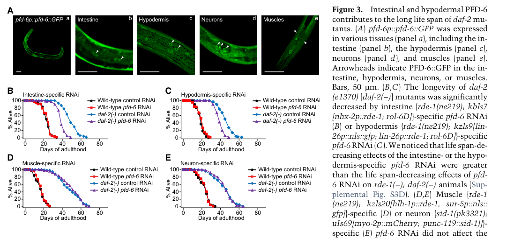

## Question

# Gene Research for Functional Annotation

## ⚠️ CRITICAL: Gene/Protein Identification Context

**BEFORE YOU BEGIN RESEARCH:** You MUST verify you are researching the CORRECT gene/protein. Gene symbols can be ambiguous, especially for less well-characterized genes from non-model organisms.

### Target Gene/Protein Identity (from UniProt):
- **UniProt Accession:** P52554
- **Protein Description:** RecName: Full=Probable prefoldin subunit 6;
- **Gene Information:** Name=pfd-6; ORFNames=F21C3.5;
- **Organism (full):** Caenorhabditis elegans.
- **Protein Family:** Belongs to the prefoldin subunit beta family.
- **Key Domains:** PFD_beta-like. (IPR002777); Prefoldin. (IPR009053); Prefoldin_2 (PF01920)

### MANDATORY VERIFICATION STEPS:

1. **Check if the gene symbol "pfd-6" matches the protein description above**
2. **Verify the organism is correct:** Caenorhabditis elegans.
3. **Check if protein family/domains align with what you find in literature**
4. **If you find literature for a DIFFERENT gene with the same or similar symbol, STOP**

### If Gene Symbol is Ambiguous or You Cannot Find Relevant Literature:

**DO NOT PROCEED WITH RESEARCH ON A DIFFERENT GENE.** Instead:
- State clearly: "The gene symbol 'pfd-6' is ambiguous or literature is limited for this specific protein"
- Explain what you found (e.g., "Found extensive literature on a different gene with the same symbol in a different organism")
- Describe the protein based ONLY on the UniProt information provided above
- Suggest that the protein function can be inferred from domain/family information

### Research Target:

Please provide a comprehensive research report on the gene **pfd-6** (gene ID: pfd-6, UniProt: P52554) in worm.

The research report should be a detailed narrative explaining the function, biological processes, and localization of the gene product. Citations should be given for all claims.

You should prioritize authoritative reviews and primary scientific literature when conducting research. You can supplement
this with annotations you find in gene/protein databases, but these can be outdated or inaccurate.

We are specifically interested in the primary function of the gene - for enzymes, what reaction is catalyzed, and what is the substrate specificity? For transporters, what is the substrate? For structural proteins or adapters, what is the broader structural role? For signaling molecules, what is the role in the pathway.

We are interested in where in or outside the cell the gene product carries out its function.

We are also interested in the signaling or biochemical pathways in which the gene functions. We are less interested in broad pleiotropic effects, except where these elucidate the precise role.

Include evidence where possible. We are interested in both experimental evidence as well as inference from structure, evolution, or bioinformatic analysis. Precise studies should be prioritized over high-throughput, where available.

## Output

Question: You are an expert researcher providing comprehensive, well-cited information.

Provide detailed information focusing on:
1. Key concepts and definitions with current understanding
2. Recent developments and latest research (prioritize 2023-2024 sources)
3. Current applications and real-world implementations
4. Expert opinions and analysis from authoritative sources
5. Relevant statistics and data from recent studies

Format as a comprehensive research report with proper citations. Include URLs and publication dates where available.
Always prioritize recent, authoritative sources and provide specific citations for all major claims.

# Gene Research for Functional Annotation

## ⚠️ CRITICAL: Gene/Protein Identification Context

**BEFORE YOU BEGIN RESEARCH:** You MUST verify you are researching the CORRECT gene/protein. Gene symbols can be ambiguous, especially for less well-characterized genes from non-model organisms.

### Target Gene/Protein Identity (from UniProt):
- **UniProt Accession:** P52554
- **Protein Description:** RecName: Full=Probable prefoldin subunit 6;
- **Gene Information:** Name=pfd-6; ORFNames=F21C3.5;
- **Organism (full):** Caenorhabditis elegans.
- **Protein Family:** Belongs to the prefoldin subunit beta family.
- **Key Domains:** PFD_beta-like. (IPR002777); Prefoldin. (IPR009053); Prefoldin_2 (PF01920)

### MANDATORY VERIFICATION STEPS:

1. **Check if the gene symbol "pfd-6" matches the protein description above**
2. **Verify the organism is correct:** Caenorhabditis elegans.
3. **Check if protein family/domains align with what you find in literature**
4. **If you find literature for a DIFFERENT gene with the same or similar symbol, STOP**

### If Gene Symbol is Ambiguous or You Cannot Find Relevant Literature:

**DO NOT PROCEED WITH RESEARCH ON A DIFFERENT GENE.** Instead:
- State clearly: "The gene symbol 'pfd-6' is ambiguous or literature is limited for this specific protein"
- Explain what you found (e.g., "Found extensive literature on a different gene with the same symbol in a different organism")
- Describe the protein based ONLY on the UniProt information provided above
- Suggest that the protein function can be inferred from domain/family information

### Research Target:

Please provide a comprehensive research report on the gene **pfd-6** (gene ID: pfd-6, UniProt: P52554) in worm.

The research report should be a detailed narrative explaining the function, biological processes, and localization of the gene product. Citations should be given for all claims.

You should prioritize authoritative reviews and primary scientific literature when conducting research. You can supplement
this with annotations you find in gene/protein databases, but these can be outdated or inaccurate.

We are specifically interested in the primary function of the gene - for enzymes, what reaction is catalyzed, and what is the substrate specificity? For transporters, what is the substrate? For structural proteins or adapters, what is the broader structural role? For signaling molecules, what is the role in the pathway.

We are interested in where in or outside the cell the gene product carries out its function.

We are also interested in the signaling or biochemical pathways in which the gene functions. We are less interested in broad pleiotropic effects, except where these elucidate the precise role.

Include evidence where possible. We are interested in both experimental evidence as well as inference from structure, evolution, or bioinformatic analysis. Precise studies should be prioritized over high-throughput, where available.

# Functional annotation of *Caenorhabditis elegans pfd-6*

## Identity and principal conclusion

The target is worm **pfd-6**, the prefoldin-subunit-6 homologue identified in the literature by its locus name **F21C3.5**. Its UniProt accession **P52554** and PFD-beta-like/prefoldin domain annotations are supplied in the question; the retrieved papers corroborate the locus, organism, protein identity, and classification as a **β-type prefoldin subunit**, but do not independently establish the accession-to-locus mapping. **PFD-3 is a different, α-type subunit**: measurements made after *pfd-3* depletion must not be reported as PFD-6-specific measurements. (zipperlen2001rolesfor147 pages 4-5, zipperlen2001rolesfor147 pages 2-4, son2018prefoldin6mediates pages 1-2)

**Functional interpretation:** PFD-6 is a nonenzymatic protein-folding co-chaperone component. It participates in cytoskeletal protein biogenesis as part of canonical prefoldin and has a second, experimentally supported role in the response to reduced insulin/IGF-1 signaling (IIS): a PFD-6-containing prefoldin-like assembly promotes DAF-16/FOXO-dependent gene expression and longevity. The evidence for its *precise contribution* differs between these roles: worm embryonic experiments implicate PFD-6-containing prefoldin in microtubule production, whereas the longevity experiments favor the **R2TP/prefoldin-like complex rather than canonical cytoskeletal prefoldin**. Neither a catalytic reaction nor a transporter substrate applies. (son2018prefoldin6mediates pages 1-2, lundin2008functionalanalysisof pages 98-101, son2018prefoldin6mediates pages 3-3, son2018prefoldin6mediates pages 6-7)

## Biochemical role and developmental evidence

Canonical eukaryotic prefoldin is a six-subunit complex containing β-type PFD-1, PFD-2, PFD-4, and PFD-6 and α-type PFD-3 and PFD-5. As a **co-chaperone/holdase**, the complex engages newly synthesized **actin and α/β-tubulin polypeptides** and passes them to the cytosolic TRiC/CCT chaperonin for folding. This describes **complex-level substrate preference**; direct binding constants or a purified-worm-PFD-6-specific client repertoire were not established in the retrieved studies. The PFD-beta-like and prefoldin domains supplied for P52554 are consistent with this family assignment, not evidence of catalytic activity. An authoritative prefoldin review describes actin/tubulin transfer to TRiC/CCT as the canonical eukaryotic function, while distinguishing newer, subunit-specific roles. (son2018prefoldin6mediates pages 1-2, tahmaz2022prefoldinfunctionin pages 2-3)

Direct developmental evidence begins with RNAi against **F21C3.5**: time-lapse microscopy placed it in an embryonic **spindle-position** phenotype class, with an unstable mitotic spindle. Strong *pfd-6* loss-of-function alleles were subsequently reported to produce substantial embryonic lethality and larval arrest. Thus, maintenance of viable cell division is well supported, although spindle mispositioning alone does not identify which prefoldin client causes it. In another genetic experiment, *F21C3.5* RNAi was among prefoldin-subunit knockdowns that restored viable progeny to temperature-sensitive *dhc-1(or195ts)* dynein mutants. That is a **genetic suppression**, not evidence that PFD-6 physically binds dynein or directly regulates dynein transport. (zipperlen2001rolesfor147 pages 4-5, zipperlen2001rolesfor147 pages 2-4, son2018prefoldin6mediates pages 1-2, gilkrzewska2010regulatorsofthe pages 8-9)

A detailed worm prefoldin analysis reported that depletion of individual functional prefoldin subunits—including *pfd-6*—reduced embryonic microtubule growth from approximately **0.7 to 0.4 µm/s**, supporting a role in generating assembly-competent tubulin. **Importantly, the accompanying ≥95% decline in embryonic α-tubulin and approximately 30% decline in actin were measured after *pfd-3* RNAi, not *pfd-6* RNAi.** These observations strengthen the *complex-level* tubulin-biogenesis mechanism but cannot establish an identical quantitative effect, unique substrate specificity, or direct tubulin folding by isolated worm PFD-6. (lundin2008functionalanalysisof pages 96-98, lundin2008functionalanalysisof pages 98-101)

## Cellular and tissue localization

The experimentally observed working compartments are **inside cells**. Antibody staining of endogenous PFD-6 in embryos was diffuse and largely **non-nuclear**, and staining in dissected gonads was cytoplasmic; loss of the signal after *pfd-6* RNAi supported antibody specificity. A separately tested **PFD-6::GFP fusion** appeared in **both cytosol and nuclei** of intestinal, hypodermal, muscle, and neuronal cells across developmental stages. The fusion rescued the *pfd-6; daf-2* longevity phenotype, supporting its functional relevance, but endogenous staining and transgenic imaging should not be treated as identical measurements. A predominantly cytoplasmic canonical-folding role and a nuclear/cytoplasmic DAF-16-associated role are consistent with these observations; no extracellular function is established. (lundin2008functionalanalysisof pages 96-98, son2018prefoldin6mediates pages 2-3, son2018prefoldin6mediates media 00b89e4b, son2018prefoldin6mediates pages 6-7)

**Tissue of physiological action is more selective than tissue of expression.** Adult intestine- or hypodermis-specific *pfd-6* RNAi reduced the extended lifespan of *daf-2* mutants; muscle- and neuron-specific knockdown had little effect in the tested conditions, despite detectable PFD-6::GFP in those tissues. These tests establish an intestinal and hypodermal *requirement*, not whether all molecular signaling is strictly cell-autonomous. (son2018prefoldin6mediates pages 5-5, son2018prefoldin6mediates media 00b89e4b, son2018prefoldin6mediates pages 7-7)

## Reduced-IIS signaling and molecular interactions

The strongest worm mechanistic study used a screen for modifiers of **HSF-1**, adult-onset RNAi, a hypomorphic *pfd-6(gk493446)* allele encoding **T16I**, rescue with PFD-6::GFP, interaction assays, and expression profiling. Disrupting *pfd-6* shortened the extended lifespan of *daf-2* IIS-receptor mutants while having relatively little effect on ordinary wild-type adult lifespan. Knockdown also partially reduced the longevity of sensory-defective *osm-5* mutants, but not that of the tested *eat-2*, *isp-1*, *rsks-1*, or *vhl-1* mutants; the tested *hsb-1* combination likewise did not show reduced longevity. This specificity argues against describing PFD-6 as a universal longevity factor. Stronger *pfd-6* alleles cause developmental defects, which is why adult perturbations and a hypomorph were important for interpreting lifespan. (son2018prefoldin6mediates pages 2-3, son2018prefoldin6mediates pages 1-2, son2018prefoldin6mediates pages 3-4)

A useful pathway model is **reduced DAF-2/IIS → HSF-1-dependent increase in PFD-6 protein → greater DAF-16/FOXO transcriptional output**. Imaging and immunoblotting showed increased PFD-6 fusion-protein abundance upon reduced *daf-2* activity; *hsf-1* RNAi suppressed this increase, whereas *daf-16* RNAi did not. In contrast, *pfd-6 mRNA* was not increased in *daf-2* mutants: the supported conclusion is **protein-level regulation**, not proven direct transcriptional activation of *pfd-6* by HSF-1. Worm HSP-70 and HSP-90 associated with PFD-6, but their proposed role in stabilizing it remains a mechanistic **hypothesis** rather than a demonstrated causal step. (son2018prefoldin6mediates pages 3-3, son2018prefoldin6mediates pages 7-7)

PFD-6 bound **DAF-16/FOXO** in yeast two-hybrid and in-vivo split-GFP experiments; interactions were detected in both nuclear and cytoplasmic compartments. Loss of *pfd-6* did **not** prevent DAF-16 nuclear localization following IIS reduction, placing its measured effect closer to **transcriptional activity** than nuclear entry. Transcriptome analysis identified **189 induced and 162 repressed genes** in *daf-2* mutants whose expression depended on *pfd-6*, using fold-change thresholds of >1.5 and <0.67, respectively, and *P* < 0.05. DAF-16-associated gene sets and binding motifs were enriched among relevant targets. A tested PFD-6–HSF-1 interaction was not detected; consequently, the HSF-1→PFD-6→DAF-16 diagram is an experimentally supported *functional model*, not proof that each arrow represents direct protein binding. (son2018prefoldin6mediates pages 4-5, son2018prefoldin6mediates pages 6-7, son2018prefoldin6mediates pages 7-7)

**Which assembly supports longevity?** Worm PFD-6 interacted in a yeast two-hybrid screen with **PFD-5** of canonical prefoldin and **F35H10.6**, a proposed UXT-like prefoldin-like component, supporting access to both assemblies. Knockdown of **ruvb-1, ruvb-2, uri-1, or pfd-2** reduced *daf-2*-mutant longevity; knockdown of canonical-prefoldin-specific components had comparatively little effect, and several prefoldin-like perturbations were nonadditive with *pfd-6* loss. The authors therefore favor an **R2TP/prefoldin-like-associated signaling role**, rather than assigning the adult longevity phenotype to actin/tubulin folding. Indeed, the tested intestinal F-actin reporter did not show an obvious change after partial *pfd-6* inhibition; this negative result cannot exclude cytoskeletal effects under complete loss of function. The composition and causal biochemical action of the complete endogenous worm longevity complex remain less directly resolved than the PFD-6–DAF-16 association. (son2018prefoldin6mediates pages 3-3, son2018prefoldin6mediates pages 5-6, son2018prefoldin6mediates pages 6-7)

## Recent development: the 2024 transcriptomic and genetic study

The most pertinent **2023–2024** study found was **Ham and colleagues (2024)**. It **reanalysed previously published worm RNA-seq datasets, including PFD-6 data from Son and colleagues (2018)**, and tested newly highlighted relationships with lifespan experiments; it did not newly demonstrate purified PFD-6 chaperone chemistry. Its network analysis estimated greater similarity between *pfd-6* and **hlh-30/TFEB** perturbations (**interaction intensity 0.89**) than between *pfd-6* and *daf-16* (**0.19**). In subsequent lifespan experiments, *hlh-30* loss did not further shorten *pfd-6*-RNAi-treated *daf-2* animals, and **pfd-6 RNAi** suppressed longevity conferred by HLH-30 overexpression. The paper reports **at least 75 animals per lifespan condition**. These findings support overlapping contributions to IIS-dependent longevity; network similarity and genetic nonadditivity do **not** demonstrate physical PFD-6–HLH-30 binding or a strictly linear pathway. (ham2024combinatorialtranscriptomicand pages 3-5, ham2024combinatorialtranscriptomicand pages 12-13)

This analysis also found that **66% of genes downregulated after *pfd-6* perturbation did not overlap genes downregulated after *daf-16* perturbation** in *daf-2* mutants, cautioning against equating every PFD-6-regulated transcript with a DAF-16 target. The authors reported associations between *pfd-6* perturbation and altered skipped-exon events, proximal 5′ splice-site use, and retained introns, as well as enrichment of particular HSF-1- and SKN-1-associated expression programs. **A direct spliceosomal function has not been established**: the splicing analysis used nominal significance thresholds and combined public, whole-animal transcriptomes. The authors explicitly note tissue heterogeneity, signal dilution, and the distinction between transcriptomic correlation and causation. (ham2024combinatorialtranscriptomicand pages 13-14, ham2024combinatorialtranscriptomicand pages 10-11, ham2024combinatorialtranscriptomicand pages 9-10, ham2024combinatorialtranscriptomicand pages 2-3)

For a compact comparison of direct evidence and inference, the following evidence map summarizes the studies; **two clarifications to its 2024 row are important:** the HLH-30-overexpression lifespan assay used *pfd-6 RNAi* (as the published Figure 6 caption specifies), and the available Lundin text is a 2008 dissertation, so the journal-article DOI shown alongside its findings should be regarded as a related article rather than a verified URL for that dissertation. (ham2024combinatorialtranscriptomicand pages 12-13, lundin2008functionalanalysisof pages 96-98)

| Function/pathway | Exact worm observation | Certainty or limitations | Source and DOI/year |
|---|---|---|---|
| Identity and molecular role | **pfd-6/F21C3.5** encodes prefoldin subunit 6, one of four beta-type subunits in the six-subunit eukaryotic prefoldin complex. The user-provided record maps it to UniProt **P52554** and predicts PFD-beta-like/prefoldin domains. Prefoldin is a co-chaperone or holdase, not an enzyme; therefore, PFD-6 has no catalytic reaction. The complex captures nascent actin and tubulin and transfers them to TRiC/CCT for folding. (son2018prefoldin6mediates pages 1-2, tahmaz2022prefoldinfunctionin pages 2-3, zipperlen2001rolesfor147 pages 2-4) | **High** for the F21C3.5–prefoldin-6 identity and beta-subunit classification. Direct capture of substrates by isolated worm PFD-6 remains a family-based inference. The accession and domain mapping come from the user-provided UniProt record. | Zipperlen et al., Aug. 2001, [10.1093/emboj/20.15.3984](https://doi.org/10.1093/emboj/20.15.3984); Son et al., Nov. 2018, [10.1101/gad.317362.118](https://doi.org/10.1101/gad.317362.118); Tahmaz et al., Jan. 2022, [10.3389/fcell.2021.816214](https://doi.org/10.3389/fcell.2021.816214) |
| Cytoskeletal co-chaperoning | Depletion of each nonredundant prefoldin subunit, including **pfd-6**, reduced embryonic microtubule growth from approximately **0.7 to 0.4 micrometers per second**, consistent with fewer assembly-competent alpha/beta-tubulin heterodimers. Crucially, the reported **at least 95% alpha-tubulin decrease**, approximately 30% actin decrease, and 65%/50% decreases in GFP-tagged alpha/beta-tubulin were measured after **pfd-3 RNAi**, not pfd-6 RNAi. (lundin2008functionalanalysisof pages 96-98, lundin2008functionalanalysisof pages 98-101) | **Moderate** evidence that the intact complex, including PFD-6, supports tubulin biogenesis. The 95% alpha-tubulin decrease cannot be attributed specifically to PFD-6, and direct binding of actin or tubulin by purified worm PFD-6 was not shown. | Lundin et al., Jan. 2008, [10.1016/j.ydbio.2007.10.022](https://doi.org/10.1016/j.ydbio.2007.10.022) |
| Embryogenesis and spindle positioning | RNAi against **F21C3.5/pfd-6** caused embryonic lethality and an unstable or mispositioned first mitotic spindle. Strong pfd-6 loss-of-function alleles later showed semi-embryonic lethality and larval arrest. (zipperlen2001rolesfor147 pages 4-5, lundin2008functionalanalysisof pages 96-98, zipperlen2001rolesfor147 pages 2-4, son2018prefoldin6mediates pages 1-2) | **High** for an essential developmental role and spindle-position phenotype. The experiments did not resolve whether the defect arose specifically from tubulin folding, actin folding, or another client. | Zipperlen et al., Aug. 2001, [10.1093/emboj/20.15.3984](https://doi.org/10.1093/emboj/20.15.3984); Son et al., Nov. 2018, [10.1101/gad.317362.118](https://doi.org/10.1101/gad.317362.118) |
| Dynein-related genetic interaction | F21C3.5/pfd-6 was among all six prefoldin-subunit knockdowns that significantly restored viable progeny to the temperature-sensitive **dhc-1(or195ts)** dynein mutant. (gilkrzewska2010regulatorsofthe pages 8-9) | **Moderate, genetic** evidence connecting PFD-6-dependent cytoskeletal homeostasis to dynein phenotypes. It does not establish direct PFD-6–DHC-1 binding or identify whether rescue reflects altered actin, tubulin, or broader cytoskeletal dynamics. | Gil-Krzewska et al., Aug. 2010, [10.1091/mbc.e09-07-0593](https://doi.org/10.1091/mbc.e09-07-0593) |
| Cellular and tissue localization | Endogenous antibody staining was diffuse and non-nuclear in embryonic cells and cytoplasmic in dissected gonads. A functional **PFD-6::GFP** transgene was broadly expressed and present in both cytosol and nuclei of intestinal, hypodermal, muscle, and neuronal cells. (son2018prefoldin6mediates pages 2-3, lundin2008functionalanalysisof pages 96-98, son2018prefoldin6mediates media 00b89e4b) | **High**, but context dependent. Endogenous embryonic staining appeared predominantly cytoplasmic, whereas transgenic analysis detected nuclear and cytosolic pools; developmental context or transgene behavior may explain the difference. | Lundin et al., Jan. 2008, [10.1016/j.ydbio.2007.10.022](https://doi.org/10.1016/j.ydbio.2007.10.022); Son et al., Nov. 2018, [10.1101/gad.317362.118](https://doi.org/10.1101/gad.317362.118) |
| HSF-1 to PFD-6 to DAF-16/FOXO longevity pathway | Reduced DAF-2/IIS increased PFD-6 protein, but not **pfd-6 mRNA**, in an HSF-1-dependent and DAF-16-independent manner. PFD-6 interacted with DAF-16 in yeast two-hybrid and in-vivo split-GFP assays but did not detectably bind HSF-1. PFD-6 was required for expression of **189 upregulated and 162 downregulated genes** in daf-2 mutants. Loss of pfd-6 did not prevent DAF-16 nuclear entry, supporting regulation after localization. (son2018prefoldin6mediates pages 3-4, son2018prefoldin6mediates pages 4-5, son2018prefoldin6mediates pages 7-7, son2018prefoldin6mediates pages 3-3) | **High** for genetic requirement, protein-level regulation, and PFD-6–DAF-16 interaction; **moderate** for a strictly linear relay. HSP-70/HSP-90-mediated stabilization of PFD-6 was proposed but not established fully as causal. | Son et al., Nov. 2018, [10.1101/gad.317362.118](https://doi.org/10.1101/gad.317362.118) |
| R2TP/prefoldin-like complex in longevity | Worm PFD-6 interacted with canonical PFD-5 and putative R2TP/prefoldin-like component F35H10.6/UXT. Knockdown of **ruvb-1, ruvb-2, uri-1**, or **pfd-2** shortened daf-2-mutant longevity, whereas canonical-prefoldin-specific components had minimal effects. This favors the PFD-6-containing R2TP/prefoldin-like complex, rather than canonical cytoskeletal prefoldin, as the relevant longevity assembly. (son2018prefoldin6mediates pages 5-6, son2018prefoldin6mediates pages 3-3) | **Moderate-to-high** genetic and interaction evidence. Complex composition was inferred from homologues, interaction tests, and nonadditive lifespan effects rather than purification of the complete endogenous worm complex. | Son et al., Nov. 2018, [10.1101/gad.317362.118](https://doi.org/10.1101/gad.317362.118) |
| Tissue-specific longevity function | Adult-only pfd-6 RNAi or the hypomorphic **T16I gk493446** allele shortened daf-2-mutant lifespan while having little effect in wild type. Intestinal or hypodermal knockdown reproduced this effect; muscle- or neuron-specific knockdown did not. A functional PFD-6::GFP transgene rescued pfd-6;daf-2 longevity. (son2018prefoldin6mediates pages 2-3, son2018prefoldin6mediates pages 3-3, son2018prefoldin6mediates pages 5-5, son2018prefoldin6mediates media 00b89e4b) | **High** for a requirement in reduced-IIS longevity, especially in intestine and hypodermis. Strong null alleles are developmentally lethal, requiring adult RNAi or a hypomorphic allele. Tissue autonomy remains unresolved. | Son et al., Nov. 2018, [10.1101/gad.317362.118](https://doi.org/10.1101/gad.317362.118) |
| 2024 HLH-30/TFEB interaction | Transcriptomic analysis found greater similarity between **pfd-6 and hlh-30** perturbations, with interaction intensity **0.89**, than between pfd-6 and daf-16, with intensity **0.19**. hlh-30 loss did not further shorten pfd-6-RNAi-treated daf-2 mutants, while pfd-6 inhibition suppressed longevity from HLH-30 overexpression. Moreover, **66%** of genes downregulated by pfd-6 mutation did not overlap those downregulated by daf-16 mutation. (ham2024combinatorialtranscriptomicand pages 12-13, ham2024combinatorialtranscriptomicand pages 13-14) | **Moderate-to-high** because lifespan assays validate a computationally predicted interaction. Whole-animal transcriptomic similarity does not prove direct molecular coupling. At least 75 animals were used per lifespan condition. | Ham et al., accepted Mar. 10, 2024, [10.1111/acel.14151](https://doi.org/10.1111/acel.14151) |
| 2024 RNA-processing findings | In daf-2 mutants, pfd-6 perturbation decreased skipped-exon events and proximal 5-prime splice-site use while increasing retained introns, extending PFD-6 annotation beyond transcriptional regulation to an association with RNA-processing changes. (ham2024combinatorialtranscriptomicand pages 11-12, ham2024combinatorialtranscriptomicand pages 10-11) | **Exploratory/moderate**. Alternative-splicing calls used nominal p less than 0.05; heterogeneous public datasets and whole-body RNA-seq introduce tissue dilution and biological noise. No direct spliceosomal function was demonstrated. (ham2024combinatorialtranscriptomicand pages 13-14, ham2024combinatorialtranscriptomicand pages 2-3) | Ham et al., Mar. 2024, [10.1111/acel.14151](https://doi.org/10.1111/acel.14151) |

*Table: Evidence-calibrated summary of the identity, localization, cytoskeletal and longevity functions of C. elegans pfd-6/F21C3.5. The table distinguishes direct PFD-6 observations from prefoldin-complex inference and from pfd-3-specific tubulin measurements.*

## Evidence boundaries and source links

**Annotation confidence is high** for the identity, intracellular distribution, developmental requirement, and conditional IIS-longevity phenotype; **moderate** for a PFD-6-specific tubulin-client mechanism and for the detailed composition/action of its longevity-promoting assembly. It would be inaccurate to assign PFD-6 an enzyme reaction, to claim that the α-tubulin reduction measured after *pfd-3* RNAi was measured after *pfd-6* RNAi, or to translate worm longevity results into an established human therapeutic application. The demonstrated real-world implementation is **worm genetics and functional annotation**—including tissue-specific RNAi, fluorescent rescue, interaction assays, and transcriptomic epistasis—not a clinical intervention. (lundin2008functionalanalysisof pages 96-98, lundin2008functionalanalysisof pages 98-101, son2018prefoldin6mediates pages 5-5, ham2024combinatorialtranscriptomicand pages 12-13, ham2024combinatorialtranscriptomicand pages 13-14)

**Principal publications, with available dates and URLs:** Zipperlen *et al.*, *EMBO Journal*, **August 2001**, [doi:10.1093/emboj/20.15.3984](https://doi.org/10.1093/emboj/20.15.3984); Gil-Krzewska *et al.*, *Molecular Biology of the Cell*, **August 2010**, [doi:10.1091/mbc.e09-07-0593](https://doi.org/10.1091/mbc.e09-07-0593); Son *et al.*, *Genes & Development*, **November 2018**, [doi:10.1101/gad.317362.118](https://doi.org/10.1101/gad.317362.118); Tahmaz *et al.*, authoritative prefoldin review, *Frontiers in Cell and Developmental Biology*, **January 2022**, [doi:10.3389/fcell.2021.816214](https://doi.org/10.3389/fcell.2021.816214); Ham *et al.*, *Aging Cell*, **2024** (accepted **March 10, 2024**), [doi:10.1111/acel.14151](https://doi.org/10.1111/acel.14151). The retrieved 2008 Lundin dissertation supplied additional experimental detail; the related journal article is [doi:10.1016/j.ydbio.2007.10.022](https://doi.org/10.1016/j.ydbio.2007.10.022). UniProt record: [P52554](https://www.uniprot.org/uniprotkb/P52554/entry). (zipperlen2001rolesfor147 pages 1-2, gilkrzewska2010regulatorsofthe pages 8-9, son2018prefoldin6mediates pages 1-2, tahmaz2022prefoldinfunctionin pages 2-3, ham2024combinatorialtranscriptomicand pages 1-2, lundin2008functionalanalysisof pages 96-98)

References

1. (zipperlen2001rolesfor147 pages 4-5): Peder Zipperlen, A. Fraser, R. Kamath, Maruxa Martínez‐Campos, and J. Ahringer. Roles for 147 embryonic lethal genes on c.elegans chromosome i identified by rna interference and video microscopy. The EMBO Journal, 20:3984-3992, Aug 2001. URL: https://doi.org/10.1093/emboj/20.15.3984, doi:10.1093/emboj/20.15.3984. This article has 171 citations.

2. (zipperlen2001rolesfor147 pages 2-4): Peder Zipperlen, A. Fraser, R. Kamath, Maruxa Martínez‐Campos, and J. Ahringer. Roles for 147 embryonic lethal genes on c.elegans chromosome i identified by rna interference and video microscopy. The EMBO Journal, 20:3984-3992, Aug 2001. URL: https://doi.org/10.1093/emboj/20.15.3984, doi:10.1093/emboj/20.15.3984. This article has 171 citations.

3. (son2018prefoldin6mediates pages 1-2): Heehwa G. Son, Keunhee Seo, Mihwa Seo, Sangsoon Park, Seokjin Ham, Seon Woo A. An, Eun-Seok Choi, Yujin Lee, Haeshim Baek, Eunju Kim, Youngjae Ryu, Chang Man Ha, Ao-Lin Hsu, Tae-Young Roh, Sung Key Jang, and Seung-Jae V. Lee. Prefoldin 6 mediates longevity response from heat shock factor 1 to foxo in c. elegans. Genes & Development, 32:1562-1575, Nov 2018. URL: https://doi.org/10.1101/gad.317362.118, doi:10.1101/gad.317362.118. This article has 37 citations and is from a highest quality peer-reviewed journal.

4. (lundin2008functionalanalysisof pages 98-101): V Lundin. Functional analysis of factors involved in cytoskeletal protein folding and degradation: prefoldin, cct and cofactor e-like. Unknown journal, 2008.

5. (son2018prefoldin6mediates pages 3-3): Heehwa G. Son, Keunhee Seo, Mihwa Seo, Sangsoon Park, Seokjin Ham, Seon Woo A. An, Eun-Seok Choi, Yujin Lee, Haeshim Baek, Eunju Kim, Youngjae Ryu, Chang Man Ha, Ao-Lin Hsu, Tae-Young Roh, Sung Key Jang, and Seung-Jae V. Lee. Prefoldin 6 mediates longevity response from heat shock factor 1 to foxo in c. elegans. Genes & Development, 32:1562-1575, Nov 2018. URL: https://doi.org/10.1101/gad.317362.118, doi:10.1101/gad.317362.118. This article has 37 citations and is from a highest quality peer-reviewed journal.

6. (son2018prefoldin6mediates pages 6-7): Heehwa G. Son, Keunhee Seo, Mihwa Seo, Sangsoon Park, Seokjin Ham, Seon Woo A. An, Eun-Seok Choi, Yujin Lee, Haeshim Baek, Eunju Kim, Youngjae Ryu, Chang Man Ha, Ao-Lin Hsu, Tae-Young Roh, Sung Key Jang, and Seung-Jae V. Lee. Prefoldin 6 mediates longevity response from heat shock factor 1 to foxo in c. elegans. Genes & Development, 32:1562-1575, Nov 2018. URL: https://doi.org/10.1101/gad.317362.118, doi:10.1101/gad.317362.118. This article has 37 citations and is from a highest quality peer-reviewed journal.

7. (tahmaz2022prefoldinfunctionin pages 2-3): Ismail Tahmaz, Somayeh Shahmoradi Ghahe, and Ulrike Topf. Prefoldin function in cellular protein homeostasis and human diseases. Frontiers in Cell and Developmental Biology, Jan 2022. URL: https://doi.org/10.3389/fcell.2021.816214, doi:10.3389/fcell.2021.816214. This article has 60 citations.

8. (gilkrzewska2010regulatorsofthe pages 8-9): Aleksandra J. Gil-Krzewska, Erica Farber, Edgar A. Buttner, and Craig P. Hunter. Regulators of the actin cytoskeleton mediate lethality in a caenorhabditis elegans dhc-1 mutant. Molecular Biology of the Cell, 21:2707-2720, Aug 2010. URL: https://doi.org/10.1091/mbc.e09-07-0593, doi:10.1091/mbc.e09-07-0593. This article has 12 citations and is from a domain leading peer-reviewed journal.

9. (lundin2008functionalanalysisof pages 96-98): V Lundin. Functional analysis of factors involved in cytoskeletal protein folding and degradation: prefoldin, cct and cofactor e-like. Unknown journal, 2008.

10. (son2018prefoldin6mediates pages 2-3): Heehwa G. Son, Keunhee Seo, Mihwa Seo, Sangsoon Park, Seokjin Ham, Seon Woo A. An, Eun-Seok Choi, Yujin Lee, Haeshim Baek, Eunju Kim, Youngjae Ryu, Chang Man Ha, Ao-Lin Hsu, Tae-Young Roh, Sung Key Jang, and Seung-Jae V. Lee. Prefoldin 6 mediates longevity response from heat shock factor 1 to foxo in c. elegans. Genes & Development, 32:1562-1575, Nov 2018. URL: https://doi.org/10.1101/gad.317362.118, doi:10.1101/gad.317362.118. This article has 37 citations and is from a highest quality peer-reviewed journal.

11. (son2018prefoldin6mediates media 00b89e4b): Heehwa G. Son, Keunhee Seo, Mihwa Seo, Sangsoon Park, Seokjin Ham, Seon Woo A. An, Eun-Seok Choi, Yujin Lee, Haeshim Baek, Eunju Kim, Youngjae Ryu, Chang Man Ha, Ao-Lin Hsu, Tae-Young Roh, Sung Key Jang, and Seung-Jae V. Lee. Prefoldin 6 mediates longevity response from heat shock factor 1 to foxo in c. elegans. Genes & Development, 32:1562-1575, Nov 2018. URL: https://doi.org/10.1101/gad.317362.118, doi:10.1101/gad.317362.118. This article has 37 citations and is from a highest quality peer-reviewed journal.

12. (son2018prefoldin6mediates pages 5-5): Heehwa G. Son, Keunhee Seo, Mihwa Seo, Sangsoon Park, Seokjin Ham, Seon Woo A. An, Eun-Seok Choi, Yujin Lee, Haeshim Baek, Eunju Kim, Youngjae Ryu, Chang Man Ha, Ao-Lin Hsu, Tae-Young Roh, Sung Key Jang, and Seung-Jae V. Lee. Prefoldin 6 mediates longevity response from heat shock factor 1 to foxo in c. elegans. Genes & Development, 32:1562-1575, Nov 2018. URL: https://doi.org/10.1101/gad.317362.118, doi:10.1101/gad.317362.118. This article has 37 citations and is from a highest quality peer-reviewed journal.

13. (son2018prefoldin6mediates pages 7-7): Heehwa G. Son, Keunhee Seo, Mihwa Seo, Sangsoon Park, Seokjin Ham, Seon Woo A. An, Eun-Seok Choi, Yujin Lee, Haeshim Baek, Eunju Kim, Youngjae Ryu, Chang Man Ha, Ao-Lin Hsu, Tae-Young Roh, Sung Key Jang, and Seung-Jae V. Lee. Prefoldin 6 mediates longevity response from heat shock factor 1 to foxo in c. elegans. Genes & Development, 32:1562-1575, Nov 2018. URL: https://doi.org/10.1101/gad.317362.118, doi:10.1101/gad.317362.118. This article has 37 citations and is from a highest quality peer-reviewed journal.

14. (son2018prefoldin6mediates pages 3-4): Heehwa G. Son, Keunhee Seo, Mihwa Seo, Sangsoon Park, Seokjin Ham, Seon Woo A. An, Eun-Seok Choi, Yujin Lee, Haeshim Baek, Eunju Kim, Youngjae Ryu, Chang Man Ha, Ao-Lin Hsu, Tae-Young Roh, Sung Key Jang, and Seung-Jae V. Lee. Prefoldin 6 mediates longevity response from heat shock factor 1 to foxo in c. elegans. Genes & Development, 32:1562-1575, Nov 2018. URL: https://doi.org/10.1101/gad.317362.118, doi:10.1101/gad.317362.118. This article has 37 citations and is from a highest quality peer-reviewed journal.

15. (son2018prefoldin6mediates pages 4-5): Heehwa G. Son, Keunhee Seo, Mihwa Seo, Sangsoon Park, Seokjin Ham, Seon Woo A. An, Eun-Seok Choi, Yujin Lee, Haeshim Baek, Eunju Kim, Youngjae Ryu, Chang Man Ha, Ao-Lin Hsu, Tae-Young Roh, Sung Key Jang, and Seung-Jae V. Lee. Prefoldin 6 mediates longevity response from heat shock factor 1 to foxo in c. elegans. Genes & Development, 32:1562-1575, Nov 2018. URL: https://doi.org/10.1101/gad.317362.118, doi:10.1101/gad.317362.118. This article has 37 citations and is from a highest quality peer-reviewed journal.

16. (son2018prefoldin6mediates pages 5-6): Heehwa G. Son, Keunhee Seo, Mihwa Seo, Sangsoon Park, Seokjin Ham, Seon Woo A. An, Eun-Seok Choi, Yujin Lee, Haeshim Baek, Eunju Kim, Youngjae Ryu, Chang Man Ha, Ao-Lin Hsu, Tae-Young Roh, Sung Key Jang, and Seung-Jae V. Lee. Prefoldin 6 mediates longevity response from heat shock factor 1 to foxo in c. elegans. Genes & Development, 32:1562-1575, Nov 2018. URL: https://doi.org/10.1101/gad.317362.118, doi:10.1101/gad.317362.118. This article has 37 citations and is from a highest quality peer-reviewed journal.

17. (ham2024combinatorialtranscriptomicand pages 3-5): Seokjin Ham, Sieun S. Kim, Sangsoon Park, Hyunwoo C. Kwon, Seokjun G. Ha, Yunkyu Bae, Gee‐Yoon Lee, and Seung‐Jae V. Lee. Combinatorial transcriptomic and genetic dissection of insulin/igf‐1 signaling‐regulated longevity in caenorhabditis elegans. Aging Cell, Mar 2024. URL: https://doi.org/10.1111/acel.14151, doi:10.1111/acel.14151. This article has 10 citations and is from a domain leading peer-reviewed journal.

18. (ham2024combinatorialtranscriptomicand pages 12-13): Seokjin Ham, Sieun S. Kim, Sangsoon Park, Hyunwoo C. Kwon, Seokjun G. Ha, Yunkyu Bae, Gee‐Yoon Lee, and Seung‐Jae V. Lee. Combinatorial transcriptomic and genetic dissection of insulin/igf‐1 signaling‐regulated longevity in caenorhabditis elegans. Aging Cell, Mar 2024. URL: https://doi.org/10.1111/acel.14151, doi:10.1111/acel.14151. This article has 10 citations and is from a domain leading peer-reviewed journal.

19. (ham2024combinatorialtranscriptomicand pages 13-14): Seokjin Ham, Sieun S. Kim, Sangsoon Park, Hyunwoo C. Kwon, Seokjun G. Ha, Yunkyu Bae, Gee‐Yoon Lee, and Seung‐Jae V. Lee. Combinatorial transcriptomic and genetic dissection of insulin/igf‐1 signaling‐regulated longevity in caenorhabditis elegans. Aging Cell, Mar 2024. URL: https://doi.org/10.1111/acel.14151, doi:10.1111/acel.14151. This article has 10 citations and is from a domain leading peer-reviewed journal.

20. (ham2024combinatorialtranscriptomicand pages 10-11): Seokjin Ham, Sieun S. Kim, Sangsoon Park, Hyunwoo C. Kwon, Seokjun G. Ha, Yunkyu Bae, Gee‐Yoon Lee, and Seung‐Jae V. Lee. Combinatorial transcriptomic and genetic dissection of insulin/igf‐1 signaling‐regulated longevity in caenorhabditis elegans. Aging Cell, Mar 2024. URL: https://doi.org/10.1111/acel.14151, doi:10.1111/acel.14151. This article has 10 citations and is from a domain leading peer-reviewed journal.

21. (ham2024combinatorialtranscriptomicand pages 9-10): Seokjin Ham, Sieun S. Kim, Sangsoon Park, Hyunwoo C. Kwon, Seokjun G. Ha, Yunkyu Bae, Gee‐Yoon Lee, and Seung‐Jae V. Lee. Combinatorial transcriptomic and genetic dissection of insulin/igf‐1 signaling‐regulated longevity in caenorhabditis elegans. Aging Cell, Mar 2024. URL: https://doi.org/10.1111/acel.14151, doi:10.1111/acel.14151. This article has 10 citations and is from a domain leading peer-reviewed journal.

22. (ham2024combinatorialtranscriptomicand pages 2-3): Seokjin Ham, Sieun S. Kim, Sangsoon Park, Hyunwoo C. Kwon, Seokjun G. Ha, Yunkyu Bae, Gee‐Yoon Lee, and Seung‐Jae V. Lee. Combinatorial transcriptomic and genetic dissection of insulin/igf‐1 signaling‐regulated longevity in caenorhabditis elegans. Aging Cell, Mar 2024. URL: https://doi.org/10.1111/acel.14151, doi:10.1111/acel.14151. This article has 10 citations and is from a domain leading peer-reviewed journal.

23. (ham2024combinatorialtranscriptomicand pages 11-12): Seokjin Ham, Sieun S. Kim, Sangsoon Park, Hyunwoo C. Kwon, Seokjun G. Ha, Yunkyu Bae, Gee‐Yoon Lee, and Seung‐Jae V. Lee. Combinatorial transcriptomic and genetic dissection of insulin/igf‐1 signaling‐regulated longevity in caenorhabditis elegans. Aging Cell, Mar 2024. URL: https://doi.org/10.1111/acel.14151, doi:10.1111/acel.14151. This article has 10 citations and is from a domain leading peer-reviewed journal.

24. (zipperlen2001rolesfor147 pages 1-2): Peder Zipperlen, A. Fraser, R. Kamath, Maruxa Martínez‐Campos, and J. Ahringer. Roles for 147 embryonic lethal genes on c.elegans chromosome i identified by rna interference and video microscopy. The EMBO Journal, 20:3984-3992, Aug 2001. URL: https://doi.org/10.1093/emboj/20.15.3984, doi:10.1093/emboj/20.15.3984. This article has 171 citations.

25. (ham2024combinatorialtranscriptomicand pages 1-2): Seokjin Ham, Sieun S. Kim, Sangsoon Park, Hyunwoo C. Kwon, Seokjun G. Ha, Yunkyu Bae, Gee‐Yoon Lee, and Seung‐Jae V. Lee. Combinatorial transcriptomic and genetic dissection of insulin/igf‐1 signaling‐regulated longevity in caenorhabditis elegans. Aging Cell, Mar 2024. URL: https://doi.org/10.1111/acel.14151, doi:10.1111/acel.14151. This article has 10 citations and is from a domain leading peer-reviewed journal.

## Artifacts

- [Edison artifact artifact-00](pfd-6-deep-research-falcon_artifacts/artifact-00.md)

## Citations

1. gilkrzewska2010regulatorsofthe pages 8-9
2. lundin2008functionalanalysisof pages 98-101
3. tahmaz2022prefoldinfunctionin pages 2-3
4. lundin2008functionalanalysisof pages 96-98
5. ham2024combinatorialtranscriptomicand pages 3-5
6. ham2024combinatorialtranscriptomicand pages 12-13
7. ham2024combinatorialtranscriptomicand pages 13-14
8. ham2024combinatorialtranscriptomicand pages 10-11
9. ham2024combinatorialtranscriptomicand pages 9-10
10. ham2024combinatorialtranscriptomicand pages 2-3
11. ham2024combinatorialtranscriptomicand pages 11-12
12. ham2024combinatorialtranscriptomicand pages 1-2
13. 10.1093/emboj/20.15.3984
14. 10.1101/gad.317362.118
15. 10.3389/fcell.2021.816214
16. 10.1016/j.ydbio.2007.10.022
17. 10.1091/mbc.e09-07-0593
18. 10.1111/acel.14151
19. doi:10.1093/emboj/20.15.3984
20. doi:10.1091/mbc.e09-07-0593
21. doi:10.1101/gad.317362.118
22. doi:10.3389/fcell.2021.816214
23. doi:10.1111/acel.14151
24. doi:10.1016/j.ydbio.2007.10.022
25. P52554
26. https://doi.org/10.1093/emboj/20.15.3984
27. https://doi.org/10.1101/gad.317362.118
28. https://doi.org/10.3389/fcell.2021.816214
29. https://doi.org/10.1016/j.ydbio.2007.10.022
30. https://doi.org/10.1091/mbc.e09-07-0593
31. https://doi.org/10.1111/acel.14151
32. https://www.uniprot.org/uniprotkb/P52554/entry
33. https://doi.org/10.1093/emboj/20.15.3984,
34. https://doi.org/10.1101/gad.317362.118,
35. https://doi.org/10.3389/fcell.2021.816214,
36. https://doi.org/10.1091/mbc.e09-07-0593,
37. https://doi.org/10.1111/acel.14151,