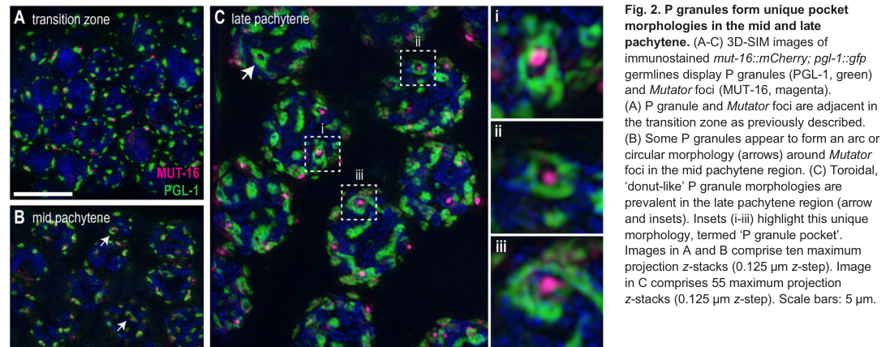

## Question

# Gene Research for Functional Annotation

## ⚠️ CRITICAL: Gene/Protein Identification Context

**BEFORE YOU BEGIN RESEARCH:** You MUST verify you are researching the CORRECT gene/protein. Gene symbols can be ambiguous, especially for less well-characterized genes from non-model organisms.

### Target Gene/Protein Identity (from UniProt):
- **UniProt Accession:** Q9TZQ3
- **Protein Description:** RecName: Full=Guanyl-specific ribonuclease pgl-1 {ECO:0000305}; EC=4.6.1.24 {ECO:0000269|PubMed:26787882}; AltName: Full=P granule abnormality protein 1;
- **Gene Information:** Name=pgl-1 {ECO:0000312|WormBase:ZK381.4a}; ORFNames=ZK381.4 {ECO:0000312|WormBase:ZK381.4a};
- **Organism (full):** Caenorhabditis elegans.
- **Protein Family:** Not specified in UniProt
- **Key Domains:** Not specified in UniProt

### MANDATORY VERIFICATION STEPS:

1. **Check if the gene symbol "pgl-1" matches the protein description above**
2. **Verify the organism is correct:** Caenorhabditis elegans.
3. **Check if protein family/domains align with what you find in literature**
4. **If you find literature for a DIFFERENT gene with the same or similar symbol, STOP**

### If Gene Symbol is Ambiguous or You Cannot Find Relevant Literature:

**DO NOT PROCEED WITH RESEARCH ON A DIFFERENT GENE.** Instead:
- State clearly: "The gene symbol 'pgl-1' is ambiguous or literature is limited for this specific protein"
- Explain what you found (e.g., "Found extensive literature on a different gene with the same symbol in a different organism")
- Describe the protein based ONLY on the UniProt information provided above
- Suggest that the protein function can be inferred from domain/family information

### Research Target:

Please provide a comprehensive research report on the gene **pgl-1** (gene ID: pgl-1, UniProt: Q9TZQ3) in worm.

The research report should be a detailed narrative explaining the function, biological processes, and localization of the gene product. Citations should be given for all claims.

You should prioritize authoritative reviews and primary scientific literature when conducting research. You can supplement
this with annotations you find in gene/protein databases, but these can be outdated or inaccurate.

We are specifically interested in the primary function of the gene - for enzymes, what reaction is catalyzed, and what is the substrate specificity? For transporters, what is the substrate? For structural proteins or adapters, what is the broader structural role? For signaling molecules, what is the role in the pathway.

We are interested in where in or outside the cell the gene product carries out its function.

We are also interested in the signaling or biochemical pathways in which the gene functions. We are less interested in broad pleiotropic effects, except where these elucidate the precise role.

Include evidence where possible. We are interested in both experimental evidence as well as inference from structure, evolution, or bioinformatic analysis. Precise studies should be prioritized over high-throughput, where available.

## Output

Question: You are an expert researcher providing comprehensive, well-cited information.

Provide detailed information focusing on:
1. Key concepts and definitions with current understanding
2. Recent developments and latest research (prioritize 2023-2024 sources)
3. Current applications and real-world implementations
4. Expert opinions and analysis from authoritative sources
5. Relevant statistics and data from recent studies

Format as a comprehensive research report with proper citations. Include URLs and publication dates where available.
Always prioritize recent, authoritative sources and provide specific citations for all major claims.

# Gene Research for Functional Annotation

## ⚠️ CRITICAL: Gene/Protein Identification Context

**BEFORE YOU BEGIN RESEARCH:** You MUST verify you are researching the CORRECT gene/protein. Gene symbols can be ambiguous, especially for less well-characterized genes from non-model organisms.

### Target Gene/Protein Identity (from UniProt):
- **UniProt Accession:** Q9TZQ3
- **Protein Description:** RecName: Full=Guanyl-specific ribonuclease pgl-1 {ECO:0000305}; EC=4.6.1.24 {ECO:0000269|PubMed:26787882}; AltName: Full=P granule abnormality protein 1;
- **Gene Information:** Name=pgl-1 {ECO:0000312|WormBase:ZK381.4a}; ORFNames=ZK381.4 {ECO:0000312|WormBase:ZK381.4a};
- **Organism (full):** Caenorhabditis elegans.
- **Protein Family:** Not specified in UniProt
- **Key Domains:** Not specified in UniProt

### MANDATORY VERIFICATION STEPS:

1. **Check if the gene symbol "pgl-1" matches the protein description above**
2. **Verify the organism is correct:** Caenorhabditis elegans.
3. **Check if protein family/domains align with what you find in literature**
4. **If you find literature for a DIFFERENT gene with the same or similar symbol, STOP**

### If Gene Symbol is Ambiguous or You Cannot Find Relevant Literature:

**DO NOT PROCEED WITH RESEARCH ON A DIFFERENT GENE.** Instead:
- State clearly: "The gene symbol 'pgl-1' is ambiguous or literature is limited for this specific protein"
- Explain what you found (e.g., "Found extensive literature on a different gene with the same symbol in a different organism")
- Describe the protein based ONLY on the UniProt information provided above
- Suggest that the protein function can be inferred from domain/family information

### Research Target:

Please provide a comprehensive research report on the gene **pgl-1** (gene ID: pgl-1, UniProt: Q9TZQ3) in worm.

The research report should be a detailed narrative explaining the function, biological processes, and localization of the gene product. Citations should be given for all claims.

You should prioritize authoritative reviews and primary scientific literature when conducting research. You can supplement
this with annotations you find in gene/protein databases, but these can be outdated or inaccurate.

We are specifically interested in the primary function of the gene - for enzymes, what reaction is catalyzed, and what is the substrate specificity? For transporters, what is the substrate? For structural proteins or adapters, what is the broader structural role? For signaling molecules, what is the role in the pathway.

We are interested in where in or outside the cell the gene product carries out its function.

We are also interested in the signaling or biochemical pathways in which the gene functions. We are less interested in broad pleiotropic effects, except where these elucidate the precise role.

Include evidence where possible. We are interested in both experimental evidence as well as inference from structure, evolution, or bioinformatic analysis. Precise studies should be prioritized over high-throughput, where available.

## Research report: *Caenorhabditis elegans* **pgl-1** (UniProt Q9TZQ3) — functional annotation and current evidence (focus 2023–2024)

### 1) Identity verification (critical disambiguation)
All sources cited here explicitly study *Caenorhabditis elegans* germ granules/“nuage” and refer to **PGL-1** as the canonical **P-granule protein** (often as fluorescent fusions such as *pgl-1::RFP/GFP*). No retrieved evidence suggests confusion with a similarly named gene/protein in another organism in these sources. (price2023c.elegansgerm pages 1-2, uebel2023caenorhabditiselegansgerma pages 1-2, zheng2023rnarecruitmentswitches pages 1-2)

### 2) Key concepts and definitions (current understanding)

#### P granules / germ granules / nuage
In *C. elegans*, **P granules** are germline-enriched, RNA-rich, **non-membrane-bound biomolecular condensates** that associate with nuclei (perinuclear) and are implicated in RNA surveillance and small-RNA biology. P granules display liquid-like behavior (fusion/dripping/rearrangement) and are sensitive to perturbations consistent with liquid–liquid phase separation (LLPS). (uebel2023caenorhabditiselegansgerma pages 1-2)

#### PGL-1 as a core P-granule component
Recent primary literature frequently frames **PGL-1 as a scaffold-like, RNA-associated P-granule component/marker** used to visualize P-granule structure and dynamics. For example, Price et al. describe PGL-1 as an **RNA-binding scaffold protein** enriched in perinuclear P granules. (price2023c.elegansgerm pages 1-2, price2023c.elegansgerm pages 2-3)

### 3) Molecular function and enzymatic activity (what can/cannot be supported by retrieved evidence)

#### What is directly supported by 2023 primary literature
Across recent studies focused on germ-granule architecture and dynamics, **PGL-1 is supported as an RNA-associated condensate component** whose key experimentally tractable roles relate to:
- assembling/maintaining **P-granule structure**,
- mediating recruitment/partitioning of RNAs and associated proteins,
- influencing the organization of small-RNA pathway factors within perinuclear nuage. (price2023c.elegansgerm pages 1-2, uebel2023caenorhabditiselegansgerma pages 1-2, zheng2023rnarecruitmentswitches pages 1-2)

#### Enzymatic annotation (guanyl-specific ribonuclease; EC 4.6.1.24)
The UniProt record provided in the prompt annotates PGL-1 as **“guanyl-specific ribonuclease pgl-1; EC 4.6.1.24”** and references PubMed:26787882, but **the necessary biochemical evidence (reaction chemistry, RNA substrate specificity, or catalytic mechanism) was not retrievable within the available in-tool paper corpus**, and thus cannot be reliably summarized here.

A recent germ-granule compartment-mapping preprint includes a table that labels PGL-1 as a **“P granule localized endoribonuclease”**, but the retrieved sections do not include the underlying biochemical data supporting guanyl-specific cleavage or EC assignment. (huang2025compartmentalizedlocalizationof pages 28-31)

**Evidence-based conclusion:** using only retrieved sources, PGL-1 is best supported as a **P-granule scaffold/RNP-condensate component**; the **guanyl-specific RNase** function remains **insufficiently supported** in the accessible excerpts and should be treated as **unverified in this report** pending direct access to the biochemical primary paper(s). (price2023c.elegansgerm pages 1-2, huang2025compartmentalizedlocalizationof pages 28-31)

### 4) Subcellular localization and where the protein acts

#### Perinuclear P granules (germline)
PGL-1 localizes to **perinuclear P granules** in the adult germline, a positioning that connects germ granules to nuclear pores and nascent transcripts. (uebel2023caenorhabditiselegansgerma pages 1-2)

A high-resolution imaging study in *Development* (Dec 2023) describes PGL-1 as a major P-granule constituent and reports a **toroidal (“P granule pockets”) morphology** in specific pachytene regions. This serves as strong visual evidence for PGL-1-marked perinuclear architecture. (uebel2023caenorhabditiselegansgerm media 983b25b1)

#### Localization depends on germ-granule organizational factors
Loss of the LOTUS-domain protein **EGGD-1** disrupts perinuclear germ-granule architecture and is associated with **PGL-1 dispersal from the nuclear periphery** and formation of abnormal cytoplasmic/rachis aggregates. (price2023c.elegansgerm pages 1-2, price2023c.elegansgerm pages 2-3)

### 5) Biological processes and pathways

#### Connection to small-RNA pathways and RNAome control
Perinuclear germ granules provide a spatial context for small-RNA pathways in *C. elegans* (e.g., piRNA and endogenous RNAi-related processes). Price et al. report that perturbing perinuclear granule organization (via **eggd-1 loss**) is associated with defects in particular germline small-RNA classes (including piRNA-related impacts) and misexpression of gene programs in both germline and soma, consistent with germ granules influencing the “RNAome.” (price2023c.elegansgerm pages 1-2, price2023c.elegansgerm pages 2-3)

#### Stress, RNA recruitment, and condensate fate (autophagy vs accumulation)
Zheng et al. (J Cell Biol, Apr 2023) provide a mechanistic framework where **RNA recruitment modulates PGL condensate material properties and fate**. In embryos, PGL proteins (including PGL-1) can form condensates with **SEPA-1** and become coated by **EPG-2**, linking granules to selective autophagy; RNA partitioning shifts condensates toward **accumulation** rather than degradation, illustrating a regulatory axis between RNA content, phase behavior, and proteostasis. (zheng2023rnarecruitmentswitches pages 7-11, zheng2023rnarecruitmentswitches pages 1-2)

### 6) Recent developments (prioritizing 2023–2024) and what is “new”

#### (i) Quantitative re-mapping of perinuclear architecture and morphological states
Uebel et al. (Dec 2023) report and quantify distinct P-granule configurations including a **toroidal morphology** and hierarchical spatial relationships among nuage compartments, refining conceptual models of how RNAs might traffic through perinuclear condensate layers after nuclear exit. (uebel2023caenorhabditiselegansgerma pages 1-2, uebel2023caenorhabditiselegansgerm media 983b25b1)

#### (ii) Germ granules as regulators of organism-wide transcript programs (“germ granule-to-soma communication”)
Price et al. (Sep 2023) show that disrupting perinuclear germ-granule organization (by *eggd-1* loss) correlates with misexpression signatures, including **overexpression of spermatogenic and cuticle-related genes** in hermaphrodites and activation of a somatic transcriptional program, supporting the emerging view that germ-granule organization can impact broader gene-expression states. (price2023c.elegansgerm pages 1-2)

#### (iii) RNA as an active material determinant of PGL condensates
Zheng et al. (Apr 2023) provide detailed in vitro and in vivo evidence that added RNA (mRNA) can **enlarge condensates, modulate fusion/relaxation dynamics**, and alter recruitment of autophagy-related factors—an explicit demonstration that RNA content controls condensate material properties and fate. (zheng2023rnarecruitmentswitches pages 7-11)

### 7) Relevant statistics and data (recent studies)

#### Perinuclear P-granule abundance
Using imaging quantification, Uebel et al. report an **average of 22.4 ± 3.6 perinuclear P granules per nucleus** (figure-based quantification). (uebel2023caenorhabditiselegansgerm media 983b25b1)

#### PGL-1 granule volume redistribution when perinuclear anchoring is disrupted
In *eggd-1* mutants, Price et al. quantified major redistribution of PGL-1-marked granules:
- PGL-1::RFP mean perinuclear (nuclear membrane) volume: **0.482 → 0.183 µm³** (2.64-fold decrease).
- PGL-1::RFP mean rachis-associated volume: **0.947 µm³** (increased), with some cytoplasmic foci reaching **~25 µm³**.
- PGL-1::GFP mean perinuclear volume: **0.332 → 0.120 µm³** (2.77-fold decrease). (price2023c.elegansgerm pages 1-2)

#### Fraction of PGL granules associated with translation factor IFE-1
Zheng et al. report that an IFE-1::GFP reporter strongly localizes to germline P granules and that **~68% of PGL granules were IFE-1-positive**, connecting PGL condensates to translation-factor partitioning. (zheng2023rnarecruitmentswitches pages 1-2)

#### In vitro RNA-dependent condensate modulation (concentrations)
Zheng et al. report in vitro condensates with purified **PGL-1/PGL-3/SEPA-1 at 3 µM each**, where added total mRNA at **10–30 ng/µl** increased condensate size and altered fusion/relaxation and FRAP-measured dynamics (quantitative dynamics described in the paper). (zheng2023rnarecruitmentswitches pages 7-11)

### 8) Current applications and real-world implementations

1. **Standard P-granule marker for imaging and genetics**: PGL-1 fluorescent fusions (e.g., PGL-1::GFP/RFP) are used as a primary readout for P-granule integrity, localization, and morphology across germ-granule studies and strain libraries. (price2023c.elegansgerm pages 2-3, huang2025compartmentalizedlocalizationof pages 25-28)

2. **Model system for phase separation and RNA–condensate physics**: PGL-1-containing condensates are experimentally tractable for testing how RNA and regulatory proteins tune condensate assembly/disassembly and fate (including autophagy-related handling), providing a real-world implementation in cell biology/biophysics research. (zheng2023rnarecruitmentswitches pages 7-11, zheng2023rnarecruitmentswitches pages 1-2)

3. **Assaying perinuclear organization impacts on small-RNA pathways**: Perturbations that mislocalize PGL-1 (e.g., via EGGD-1-dependent organization) are used to probe how spatial architecture affects small-RNA pathway outputs and transcript programs. (price2023c.elegansgerm pages 1-2, price2023c.elegansgerm pages 2-3)

### 9) Expert opinions / authoritative synthesis (from available sources)
A dedicated 2024 review focusing on germ granules (“How germ granules promote germ cell fate”, *Nature Reviews Genetics*, Jun 2024) was identified in search results as unobtainable within the tool session, preventing direct citation of that review’s expert synthesis. Consequently, “expert opinion” in this report is derived from interpretive statements within the primary 2023 peer-reviewed articles themselves (e.g., hierarchical assembly model; germ granule-to-soma communication). (price2023c.elegansgerm pages 1-2, uebel2023caenorhabditiselegansgerma pages 1-2)

### 10) Visual evidence (PGL-1 localization and granule architecture)
Uebel et al. provide high-resolution imaging of **PGL-1-marked perinuclear P granules** and highlight a toroidal morphology (“P granule pockets”), alongside quantification of perinuclear granule abundance. (uebel2023caenorhabditiselegansgerm media 983b25b1, uebel2023caenorhabditiselegansgerm media a2f4be90)

### 11) Limitations and recommended next steps for functional enzymology annotation
Because **direct biochemical evidence for guanyl-specific endoribonuclease activity** is not present in the retrieved excerpts, a rigorous enzyme-function annotation (substrate specificity, cleavage products, catalytic residues, kinetics) cannot be provided here without additional primary sources (notably the PubMed-linked study referenced by UniProt). The most defensible current annotation from the retrieved 2023–2024 primary literature is that PGL-1 functions as an **RNA-associated scaffold/condensate component** of perinuclear P granules that shapes germ-granule architecture and RNA regulatory environments. (price2023c.elegansgerm pages 1-2, uebel2023caenorhabditiselegansgerma pages 1-2, huang2025compartmentalizedlocalizationof pages 28-31)

---

### Summary of key recent sources
| Source (authors, year) | Venue | Publication date | URL/DOI | What it shows about PGL-1 (localization/function) | Quantitative/statistical findings (if any) |
|---|---|---|---|---|---|
| Price et al., 2023 | *Nature Communications* | Sep 2023 | https://doi.org/10.1038/s41467-023-41556-4 | Identifies PGL-1 as an RNA-binding scaffold protein enriched in perinuclear P granules of the *C. elegans* germline. Shows that perinuclear organization depends on EGGD-1/GLH-1, and that disruption of this architecture causes PGL-1 mislocalization into abnormal cytoplasmic/rachis aggregates and perturbs small-RNA pathway organization and RNAome control. (price2023c.elegansgerm pages 1-2, price2023c.elegansgerm pages 2-3) | In *eggd-1* mutants, mean PGL-1::RFP granule volume at the nuclear membrane decreased from 0.482 to 0.183 µm3 (2.64-fold smaller), while rachis-associated PGL-1::RFP increased to 0.947 µm3; some cytoplasmic foci reached ~25 µm3. PGL-1::GFP mean perinuclear volume decreased from 0.332 to 0.120 µm3 (2.77-fold). (price2023c.elegansgerm pages 1-2) |
| Uebel et al., 2023 | *Development* | Dec 2023 | https://doi.org/10.1242/dev.202284 | Describes PGL-1 as a major constituent of perinuclear, phase-separated P granules and uses high-resolution imaging to define P-granule architecture. Reports toroidal "P granule pockets" and supports a hierarchical model in which P granules organize other nuage compartments around nuclear pores, shaping RNA surveillance as transcripts exit the nucleus. (uebel2023caenorhabditiselegansgerma pages 1-2, uebel2023caenorhabditiselegansgerm media 983b25b1) | Figure-based quantification reported an average of 22.4 ± 3.6 perinuclear P granules per nucleus, alongside stoichiometric distributions of P-granule populations associated with other nuage compartments. (uebel2023caenorhabditiselegansgerm media 983b25b1) |
| Zheng et al., 2023 | *Journal of Cell Biology* | Apr 2023 | https://doi.org/10.1083/jcb.202210104 | Shows that PGL-1 is a core P-granule protein that forms RNA-containing condensates with PGL-3 and SEPA-1. RNAs promote LLPS/liquidity of these condensates, recruit translation/RNA-control factors, and shift granules away from autophagic degradation toward accumulation under stress. Also notes PGL-1 interaction with IFE-1 and strong IFE-1 localization to germline P granules. (zheng2023rnarecruitmentswitches pages 7-11, zheng2023rnarecruitmentswitches pages 1-2) | In vitro assays used purified PGL-1/PGL-3/SEPA-1 at 3 µM each; adding 10–30 ng/µl mRNA enlarged condensates and accelerated fusion/relaxation. Approximately 68% of PGL granules were IFE-1-positive. PGL granules appeared by the ~20-cell embryonic stage and increased in number at 26°C. (zheng2023rnarecruitmentswitches pages 7-11, zheng2023rnarecruitmentswitches pages 1-2) |
| Huang et al., 2024 preprint / 2025 bioRxiv posting | *bioRxiv* | Preprint posted Mar 2025; DOI indicates initial 2024 deposition | https://doi.org/10.1101/2024.03.25.586584 | Uses PGL-1::tagRFP as the canonical marker for P granules in systematic colocalization mapping of germ-granule subcompartments. Table annotations describe PGL-1 as a P-granule-localized endoribonuclease, and imaging places it in perinuclear P granules relative to PRG-1, ZNFX-1, DDX-19, and other compartment markers. The study is primarily a localization/resource paper rather than a direct mechanistic dissection of PGL-1 catalysis. (huang2025compartmentalizedlocalizationof pages 28-31, huang2025compartmentalizedlocalizationof pages 25-28) | The cited excerpts emphasize fluorescence line-scan colocalization analyses rather than phenotype statistics; no direct quantitative fertility or RNAome values for PGL-1 were provided in the retrieved sections. (huang2025compartmentalizedlocalizationof pages 28-31, huang2025compartmentalizedlocalizationof pages 25-28) |

*Table: This table summarizes key recent papers and a relevant preprint on *C. elegans* PGL-1, focusing on localization, function, and quantitative findings. It is useful for quickly distinguishing direct evidence on P-granule biology from marker/localization studies.*

References

1. (price2023c.elegansgerm pages 1-2): Ian F. Price, Jillian A. Wagner, Benjamin Pastore, Hannah L. Hertz, and Wen Tang. C. elegans germ granules sculpt both germline and somatic rnaome. Nature Communications, Sep 2023. URL: https://doi.org/10.1038/s41467-023-41556-4, doi:10.1038/s41467-023-41556-4. This article has 31 citations and is from a highest quality peer-reviewed journal.

2. (uebel2023caenorhabditiselegansgerma pages 1-2): Celja J. Uebel, Sanjana Rajeev, and Carolyn M. Phillips. <i>caenorhabditis elegans</i> germ granules are present in distinct configurations and assemble in a hierarchical manner. Development, Dec 2023. URL: https://doi.org/10.1242/dev.202284, doi:10.1242/dev.202284. This article has 22 citations and is from a domain leading peer-reviewed journal.

3. (zheng2023rnarecruitmentswitches pages 1-2): Hui Zheng, Kangfu Peng, Xiaomeng Gou, Chen Ju, and Hong Zhang. Rna recruitment switches the fate of protein condensates from autophagic degradation to accumulation. The Journal of Cell Biology, Apr 2023. URL: https://doi.org/10.1083/jcb.202210104, doi:10.1083/jcb.202210104. This article has 17 citations.

4. (price2023c.elegansgerm pages 2-3): Ian F. Price, Jillian A. Wagner, Benjamin Pastore, Hannah L. Hertz, and Wen Tang. C. elegans germ granules sculpt both germline and somatic rnaome. Nature Communications, Sep 2023. URL: https://doi.org/10.1038/s41467-023-41556-4, doi:10.1038/s41467-023-41556-4. This article has 31 citations and is from a highest quality peer-reviewed journal.

5. (huang2025compartmentalizedlocalizationof pages 28-31): Xiaona Huang, Xuezhu Feng, Yong-hong Yan, Demin Xu, Ke Wang, Chengming Zhu, Meng-qiu Dong, Xinya Huang, Shouhong Guang, and Xiangyang Chen. Compartmentalized localization of perinuclear proteins within germ granules in c. elegans. bioRxiv, Mar 2025. URL: https://doi.org/10.1101/2024.03.25.586584, doi:10.1101/2024.03.25.586584. This article has 28 citations.

6. (uebel2023caenorhabditiselegansgerm media 983b25b1): Celja J. Uebel, Sanjana Rajeev, and Carolyn M. Phillips. <i>caenorhabditis elegans</i> germ granules are present in distinct configurations and assemble in a hierarchical manner. Development, Dec 2023. URL: https://doi.org/10.1242/dev.202284, doi:10.1242/dev.202284. This article has 22 citations and is from a domain leading peer-reviewed journal.

7. (zheng2023rnarecruitmentswitches pages 7-11): Hui Zheng, Kangfu Peng, Xiaomeng Gou, Chen Ju, and Hong Zhang. Rna recruitment switches the fate of protein condensates from autophagic degradation to accumulation. The Journal of Cell Biology, Apr 2023. URL: https://doi.org/10.1083/jcb.202210104, doi:10.1083/jcb.202210104. This article has 17 citations.

8. (huang2025compartmentalizedlocalizationof pages 25-28): Xiaona Huang, Xuezhu Feng, Yong-hong Yan, Demin Xu, Ke Wang, Chengming Zhu, Meng-qiu Dong, Xinya Huang, Shouhong Guang, and Xiangyang Chen. Compartmentalized localization of perinuclear proteins within germ granules in c. elegans. bioRxiv, Mar 2025. URL: https://doi.org/10.1101/2024.03.25.586584, doi:10.1101/2024.03.25.586584. This article has 28 citations.

9. (uebel2023caenorhabditiselegansgerm media a2f4be90): Celja J. Uebel, Sanjana Rajeev, and Carolyn M. Phillips. <i>caenorhabditis elegans</i> germ granules are present in distinct configurations and assemble in a hierarchical manner. Development, Dec 2023. URL: https://doi.org/10.1242/dev.202284, doi:10.1242/dev.202284. This article has 22 citations and is from a domain leading peer-reviewed journal.

## Artifacts

- [Edison artifact artifact-00](pgl-1-deep-research-falcon_artifacts/artifact-00.md)

## Citations

1. uebel2023caenorhabditiselegansgerma pages 1-2
2. huang2025compartmentalizedlocalizationof pages 28-31
3. zheng2023rnarecruitmentswitches pages 7-11
4. zheng2023rnarecruitmentswitches pages 1-2
5. huang2025compartmentalizedlocalizationof pages 25-28
6. https://doi.org/10.1038/s41467-023-41556-4
7. https://doi.org/10.1242/dev.202284
8. https://doi.org/10.1083/jcb.202210104
9. https://doi.org/10.1101/2024.03.25.586584
10. https://doi.org/10.1038/s41467-023-41556-4,
11. https://doi.org/10.1242/dev.202284,
12. https://doi.org/10.1083/jcb.202210104,
13. https://doi.org/10.1101/2024.03.25.586584,