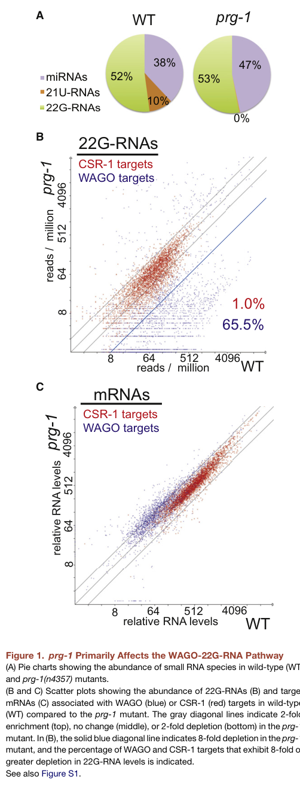

## Question

# Gene Research for Functional Annotation

## ⚠️ CRITICAL: Gene/Protein Identification Context

**BEFORE YOU BEGIN RESEARCH:** You MUST verify you are researching the CORRECT gene/protein. Gene symbols can be ambiguous, especially for less well-characterized genes from non-model organisms.

### Target Gene/Protein Identity (from UniProt):
- **UniProt Accession:** P90786
- **Protein Description:** SubName: Full=Piwi-like protein 1 {ECO:0000313|EMBL:CAA98113.1};
- **Gene Information:** Name=prg-1 {ECO:0000313|EMBL:CAA98113.1, ECO:0000313|WormBase:D2030.6}; ORFNames=CELE_D2030.6 {ECO:0000313|EMBL:CAA98113.1}, D2030.6 {ECO:0000313|WormBase:D2030.6};
- **Organism (full):** Caenorhabditis elegans.
- **Protein Family:** Belongs to the argonaute family. Piwi subfamily.
- **Key Domains:** PAZ_dom. (IPR003100); PAZ_dom_sf. (IPR036085); Piwi. (IPR003165); RNaseH-like_sf. (IPR012337); RNaseH_sf. (IPR036397)

### MANDATORY VERIFICATION STEPS:

1. **Check if the gene symbol "prg-1" matches the protein description above**
2. **Verify the organism is correct:** Caenorhabditis elegans.
3. **Check if protein family/domains align with what you find in literature**
4. **If you find literature for a DIFFERENT gene with the same or similar symbol, STOP**

### If Gene Symbol is Ambiguous or You Cannot Find Relevant Literature:

**DO NOT PROCEED WITH RESEARCH ON A DIFFERENT GENE.** Instead:
- State clearly: "The gene symbol 'prg-1' is ambiguous or literature is limited for this specific protein"
- Explain what you found (e.g., "Found extensive literature on a different gene with the same symbol in a different organism")
- Describe the protein based ONLY on the UniProt information provided above
- Suggest that the protein function can be inferred from domain/family information

### Research Target:

Please provide a comprehensive research report on the gene **prg-1** (gene ID: prg-1, UniProt: P90786) in worm.

The research report should be a detailed narrative explaining the function, biological processes, and localization of the gene product. Citations should be given for all claims.

You should prioritize authoritative reviews and primary scientific literature when conducting research. You can supplement
this with annotations you find in gene/protein databases, but these can be outdated or inaccurate.

We are specifically interested in the primary function of the gene - for enzymes, what reaction is catalyzed, and what is the substrate specificity? For transporters, what is the substrate? For structural proteins or adapters, what is the broader structural role? For signaling molecules, what is the role in the pathway.

We are interested in where in or outside the cell the gene product carries out its function.

We are also interested in the signaling or biochemical pathways in which the gene functions. We are less interested in broad pleiotropic effects, except where these elucidate the precise role.

Include evidence where possible. We are interested in both experimental evidence as well as inference from structure, evolution, or bioinformatic analysis. Precise studies should be prioritized over high-throughput, where available.

## Output

Question: You are an expert researcher providing comprehensive, well-cited information.

Provide detailed information focusing on:
1. Key concepts and definitions with current understanding
2. Recent developments and latest research (prioritize 2023-2024 sources)
3. Current applications and real-world implementations
4. Expert opinions and analysis from authoritative sources
5. Relevant statistics and data from recent studies

Format as a comprehensive research report with proper citations. Include URLs and publication dates where available.
Always prioritize recent, authoritative sources and provide specific citations for all major claims.

# Gene Research for Functional Annotation

## ⚠️ CRITICAL: Gene/Protein Identification Context

**BEFORE YOU BEGIN RESEARCH:** You MUST verify you are researching the CORRECT gene/protein. Gene symbols can be ambiguous, especially for less well-characterized genes from non-model organisms.

### Target Gene/Protein Identity (from UniProt):
- **UniProt Accession:** P90786
- **Protein Description:** SubName: Full=Piwi-like protein 1 {ECO:0000313|EMBL:CAA98113.1};
- **Gene Information:** Name=prg-1 {ECO:0000313|EMBL:CAA98113.1, ECO:0000313|WormBase:D2030.6}; ORFNames=CELE_D2030.6 {ECO:0000313|EMBL:CAA98113.1}, D2030.6 {ECO:0000313|WormBase:D2030.6};
- **Organism (full):** Caenorhabditis elegans.
- **Protein Family:** Belongs to the argonaute family. Piwi subfamily.
- **Key Domains:** PAZ_dom. (IPR003100); PAZ_dom_sf. (IPR036085); Piwi. (IPR003165); RNaseH-like_sf. (IPR012337); RNaseH_sf. (IPR036397)

### MANDATORY VERIFICATION STEPS:

1. **Check if the gene symbol "prg-1" matches the protein description above**
2. **Verify the organism is correct:** Caenorhabditis elegans.
3. **Check if protein family/domains align with what you find in literature**
4. **If you find literature for a DIFFERENT gene with the same or similar symbol, STOP**

### If Gene Symbol is Ambiguous or You Cannot Find Relevant Literature:

**DO NOT PROCEED WITH RESEARCH ON A DIFFERENT GENE.** Instead:
- State clearly: "The gene symbol 'prg-1' is ambiguous or literature is limited for this specific protein"
- Explain what you found (e.g., "Found extensive literature on a different gene with the same symbol in a different organism")
- Describe the protein based ONLY on the UniProt information provided above
- Suggest that the protein function can be inferred from domain/family information

### Research Target:

Please provide a comprehensive research report on the gene **prg-1** (gene ID: prg-1, UniProt: P90786) in worm.

The research report should be a detailed narrative explaining the function, biological processes, and localization of the gene product. Citations should be given for all claims.

You should prioritize authoritative reviews and primary scientific literature when conducting research. You can supplement
this with annotations you find in gene/protein databases, but these can be outdated or inaccurate.

We are specifically interested in the primary function of the gene - for enzymes, what reaction is catalyzed, and what is the substrate specificity? For transporters, what is the substrate? For structural proteins or adapters, what is the broader structural role? For signaling molecules, what is the role in the pathway.

We are interested in where in or outside the cell the gene product carries out its function.

We are also interested in the signaling or biochemical pathways in which the gene functions. We are less interested in broad pleiotropic effects, except where these elucidate the precise role.

Include evidence where possible. We are interested in both experimental evidence as well as inference from structure, evolution, or bioinformatic analysis. Precise studies should be prioritized over high-throughput, where available.

## Research report: Functional annotation of **prg-1 / PRG-1** (UniProt **P90786**) in *Caenorhabditis elegans*

### Executive summary (current understanding)
*Caenorhabditis elegans* **PRG-1** is the organism’s **Piwi-clade Argonaute** protein that binds **piRNAs (21U-RNAs)** and acts as a **sequence-guided genome-surveillance factor in germ cells**, initiating silencing by **recruiting RNA-dependent RNA polymerase (RdRP)–driven secondary 22G-RNA amplification** that loads onto **WAGO-class Argonautes (including nuclear HRDE-1)** to enforce post-transcriptional and epigenetic silencing (including heritable RNA-induced epigenetic silencing, RNAe). (lee2012c.eleganspirnas pages 1-2, albuquerque2015maternalpirnasare pages 1-3, shirayama2012pirnasinitiatean pages 1-2)

### 1) Target verification: correct gene/protein identity
The symbol **prg-1** is used in the *C. elegans* literature to denote a **Piwi-class Argonaute** required for piRNA function. Recent mechanistic work explicitly states that *C. elegans* expresses a **single functional Piwi protein known as PRG-1**, which binds 21U-RNAs/piRNAs—matching the UniProt target identity (P90786, Piwi-like protein 1) and expected Argonaute/Piwi domain architecture. (pastore2024prepirnatrimmingsafeguards pages 1-3, lee2012c.eleganspirnas pages 1-2)

### 2) Key concepts and definitions (with PRG-1 context)

#### piRNAs / 21U-RNAs
In *C. elegans*, piRNAs are commonly called **21U-RNAs** because they are typically **~21 nt** long and show a strong **5′ uridine (U) bias**. They derive from many genomic loci, including large clusters; primary literature reports **>15,000** type I piRNA loci/21U-RNAs. (pastore2024prepirnatrimmingsafeguards pages 1-3, lee2012c.eleganspirnas pages 1-2)

#### Secondary siRNAs (22G-RNAs) and WAGO Argonautes
A defining feature of the worm germline silencing system is **RdRP-generated “secondary” siRNAs**, notably **22G-RNAs**, which are loaded onto an expanded set of worm-specific Argonautes called **WAGOs**. In prg-1 mutants, many loci show both **increased mRNA** and **depletion of RdRP-derived 22G-RNAs**, consistent with PRG-1 acting upstream to trigger secondary small-RNA production. (lee2012c.eleganspirnas pages 1-2)

#### RNA-induced epigenetic silencing (RNAe)
RNAe is a **stable, heritable silencing state** in the germline. PRG-1 and its piRNAs are described as **initiators** of permanent silencing of foreign sequences/transgenes, while **maintenance** depends on downstream WAGO pathways and chromatin factors. (shirayama2012pirnasinitiatean pages 1-2, albuquerque2015maternalpirnasare pages 1-3)

### 3) Molecular function and mechanism of PRG-1

#### 3.1 Primary molecular function: target recognition that triggers amplification
A central mechanistic model supported by primary evidence is that PRG-1 binds piRNAs and **scans germline transcripts** using **imperfect but extensive base-pairing**, thereby identifying “non-self”/foreign sequences and certain endogenous targets. In mutants lacking PRG-1 (and thus piRNAs), many normally silent loci show **increased mRNA** with a **concomitant depletion of 22G-RNAs**, implying PRG-1/piRNAs **trigger** RdRP activity that generates secondary silencing RNAs. (lee2012c.eleganspirnas pages 1-2)

Lee et al. further show that PRG-1 is required to **initiate, but not maintain**, silencing of engineered transgenes containing complementarity to endogenous 21U-RNAs, supporting a “trigger” role upstream of the WAGO system. (lee2012c.eleganspirnas pages 1-2)

**Figure-supported evidence:** Figure 1 of Lee et al. visualizes that **21U-RNAs are absent in prg-1 mutants** (reported as 0% in the small RNA composition panel) and shows strong depletion of 22G-RNAs at subsets of targets in prg-1 mutants, consistent with PRG-1 functioning upstream of secondary 22G-RNA biogenesis. (lee2012c.eleganspirnas media f5ce01e5)

#### 3.2 Catalytic “slicer” activity vs recruitment-based silencing
Argonautes are RNase H-like proteins and may be “slicers,” but C. elegans PRG-1 function in the piRNA pathway is best supported as **recruitment/amplification-based** rather than primarily endonucleolytic. A dissertation synthesis of the pathway explicitly notes reports that **PRG-1 catalytic activity is not required for piRNA-induced silencing**, consistent with a model in which PRG-1’s key function is **guide-dependent target engagement that recruits RdRP/WAGO silencing** rather than direct cleavage. (seth2016functionsofargonaute pages 34-39)

#### 3.3 Substrates/targets and specificity
PRG-1/piRNA complexes can target a **broad spectrum of germline transcripts** and some transposable element RNAs. Classic work highlights that PRG-1 has a surprisingly limited set of clearly established transposon targets in *C. elegans*, with **Tc3** cited as a prominent PRG-1-dependent transposon family; nevertheless, piRNAs provide genome-wide surveillance capacity via mismatch-tolerant recognition. (lee2012c.eleganspirnas pages 1-2)

### 4) Pathways and interacting partners

#### 4.1 Upstream piRNA biogenesis and loading (context for PRG-1 function)
Recent 2024 mechanistic work summarizes the C. elegans piRNA biogenesis pipeline that culminates in PRG-1 loading: piRNA precursors are short capped RNAs (**csRNAs, ~25–29 nt**), processed at the 5′ end by a **Schlafen-domain nuclease**, trimmed at the 3′ end by **PARN-1**, and finally **2′-O-methylated** by **HENN-1**. (pastore2024prepirnatrimmingsafeguards pages 1-3)

#### 4.2 Downstream silencing machinery: RdRPs → 22G-RNAs → WAGOs/HRDE-1
PRG-1/piRNA target engagement initiates a cascade in which **RdRPs** are recruited to generate **secondary siRNAs (22G-RNAs)**. These 22G-RNAs are loaded onto **WAGO Argonautes** to execute silencing, including nuclear effectors such as **HRDE-1** that support transgenerational inheritance of silencing. (albuquerque2015maternalpirnasare pages 1-3, albuquerque2015maternalpirnasare pages 3-4)

#### 4.3 Maternal effects and de novo establishment of silencing
Maternal inheritance of piRNA pathway components is critical in certain contexts. De Albuquerque et al. provide evidence that **maternal piRNAs are essential** for germline development after de novo establishment of endo-siRNAs, consistent with a role for PRG-1/piRNAs in **initiating** new 22G-RNA populations (particularly for transposon targets) and establishing heritable silencing. (albuquerque2015maternalpirnasare pages 1-3)

A quantitative example: prg-1 mutants alone show very low Tc1 excision/reversion frequency (~10^-5), but **prg-1; hrde-1** double mutants exhibit an approximately **100-fold increase** in Tc1 excision, supporting functional synergy between PRG-1 initiation and downstream nuclear maintenance machinery. (albuquerque2015maternalpirnasare pages 3-4)

### 5) Cellular and subcellular localization
PRG-1 acts in the germline and is described as localizing to **perinuclear germ granules/P granules**, consistent with a model where piRNA targeting occurs in germline RNP granule compartments and interfaces with adjacent Mutator foci. (albuquerque2015maternalpirnasare pages 1-3, wallis2025rgmotifspromote pages 1-4)

### 6) Phenotypes and biological roles
Loss of PRG-1/piRNA function is associated with germline defects such as **reduced brood size**, **temperature-sensitive sterility**, and progressive fertility decline (a “mortal germline” phenotype), consistent with PRG-1’s essential role in long-term germline integrity. (almeida2012geneticrequirementsfor pages 32-36, montgomery2021dualrolesfor pages 1-3)

### 7) Recent developments (prioritizing 2023–2024)

#### 7.1 2024: piRNA 3′ trimming as protection against erroneous RdRP engagement
Pastore et al. (published 27 Feb 2024; open access) identify a quality-control function for piRNA 3′ trimming: in **parn-1** mutants, untrimmed pre-piRNAs are converted into a new class of small RNAs termed **“anti-piRNAs”** (17–19 nt, often starting with **A or G**) that **associate with Piwi proteins**. The study supports a model where untrimmed pre-piRNAs are aberrantly modified by **RDE-3** and templated by the RdRP **EGO-1** to produce anti-piRNAs, implying that proper maturation helps prevent misdirection of RdRP activity. (pastore2024prepirnatrimmingsafeguards pages 1-3, pastore2024prepirnatrimmingsafeguards pages 12-13)

This advances understanding of PRG-1 pathway fidelity by showing how maturation steps shape downstream amplification behavior (and potential off-pathway products). (pastore2024prepirnatrimmingsafeguards pages 1-3)

#### 7.2 2024: updated context for TE silencing in worms
A 2024 review reports that transposable elements comprise ~**15%** of the *C. elegans* genome, providing genomic context for PRG-1/piRNA-mediated genome defense and the broader network of RNA-based TE silencing in worms. (Published 2 Apr 2024) (fischer2024activityandsilencing pages 1-2)

#### 7.3 2023: piRNA pathway modulation in a neurodegeneration model (non-canonical application)
Huang et al. (published Oct 2023) report that in *C. elegans* models overexpressing human α-synuclein (A53T), piRNAs are dysregulated and functional perturbation of piRNA biogenesis genes can suppress behavioral/physiological neurodegenerative phenotypes; tofu-1 deletion reduced piRNA levels and altered H3K9me3 while improving disease-model readouts. While this is not PRG-1’s primary annotated physiological role (germline genome defense), it is an example of how the piRNA pathway is being experimentally leveraged in real-world model-system implementations relevant to proteostasis and neurodegeneration hypotheses. (huang2023piwiinteractingrnaexpression pages 1-2, huang2023piwiinteractingrnaexpression pages 8-9)

### 8) Current applications and real-world implementations

1. **Genome surveillance and epigenetic memory assays in vivo.** PRG-1-dependent initiation and WAGO-dependent maintenance of silencing are routinely assayed using engineered transgenes with piRNA complementarity and inheritance readouts across generations (RNAe paradigm). (lee2012c.eleganspirnas pages 1-2, shirayama2012pirnasinitiatean pages 1-2)
2. **Small-RNA sequencing and Argonaute-IP workflows.** Recent mechanistic work integrates PRG-1-associated small RNA profiling and provides publicly deposited datasets and analysis resources enabling reproducible small-RNA pathway analysis (e.g., PRJNA683039; SRP131397; PRJNA291851; GSE244073 as cited by Pastore et al.). (pastore2024prepirnatrimmingsafeguards pages 12-13)
3. **Modeling disease-relevant small-RNA dysregulation.** The 2023 Nature Communications study illustrates deployment of piRNA pathway genetics (including biogenesis factors upstream of PRG-1) in a *C. elegans* neurodegeneration model, combining behavioral assays, confocal imaging, and chromatin mark analyses. (huang2023piwiinteractingrnaexpression pages 8-9)

### 9) Expert synthesis / interpretation (authoritative perspective)
Collectively, the evidence supports PRG-1 as a **front-end specificity factor** for germline “non-self” detection: PRG-1/piRNAs provide a massive guide repertoire capable of mismatch-tolerant transcript recognition, while robust and heritable repression is implemented downstream via RdRP amplification into 22G-RNAs and WAGO/HRDE-1 effector systems. This architecture explains why PRG-1 is crucial for **initiation** of silencing and establishment of heritable epigenetic states, yet in multiple paradigms is less critical for the long-term **maintenance** of an already-established silenced locus. (lee2012c.eleganspirnas pages 1-2, albuquerque2015maternalpirnasare pages 1-3, shirayama2012pirnasinitiatean pages 1-2)

### 10) Key statistics and quantitative findings (from cited sources)
- **piRNA locus scale:** >**15,000** type I piRNA loci (21U-RNAs), largely in two clusters on chromosome IV. (pastore2024prepirnatrimmingsafeguards pages 1-3, lee2012c.eleganspirnas pages 1-2)
- **TE genomic fraction:** transposable elements constitute ~**15%** of the *C. elegans* genome (review). (fischer2024activityandsilencing pages 1-2)
- **Transposon excision synergy:** prg-1 mutants show very low Tc1 excision/reversion (~**10^-5**), while prg-1;hrde-1 double mutants show ~**100-fold** higher excision, indicating cooperation between PRG-1 initiation and HRDE-1-mediated maintenance. (albuquerque2015maternalpirnasare pages 3-4)
- **Figure-based quantitative visualization:** Lee et al. Figure 1 reports **0% 21U-RNAs** in prg-1 mutants (composition panel) and shows depletion patterns of 22G-RNAs at WAGO targets. (lee2012c.eleganspirnas media f5ce01e5)

---

### Evidence map (summary table)
| Aspect | Evidence/Key finding | Representative sources (with year, journal) | URL/DOI |
|---|---|---|---|
| Target identity / family | **prg-1** in **Caenorhabditis elegans** encodes the worm **Piwi-class Argonaute** that binds piRNAs/21U-RNAs; this matches UniProt P90786 (Piwi-like protein 1) and the Argonaute/Piwi family assignment. PRG-1 is described as the **single functional Piwi protein** in C. elegans. (pastore2024prepirnatrimmingsafeguards pages 1-3, lee2012c.eleganspirnas pages 1-2) | Pastore et al., 2024, *Cell Reports*; Lee et al., 2012, *Cell* | https://doi.org/10.1016/j.celrep.2024.113692; https://doi.org/10.1016/j.cell.2012.06.016 |
| Primary molecular function | PRG-1 is a **small-RNA-guided surveillance Argonaute**: PRG-1/piRNA complexes base-pair with germline transcripts and **initiate silencing indirectly** by recruiting RdRP-dependent secondary siRNA production rather than acting mainly as a direct mRNA-cleaving enzyme. PRG-1 is required to **initiate**, but not maintain, silencing of piRNA-targeted transgenes. (lee2012c.eleganspirnas pages 1-2, albuquerque2015maternalpirnasare pages 1-3, shirayama2012pirnasinitiatean pages 1-2) | Lee et al., 2012, *Cell*; de Albuquerque et al., 2015, *Developmental Cell*; Shirayama et al., 2012, *Cell* | https://doi.org/10.1016/j.cell.2012.06.016; https://doi.org/10.1016/j.devcel.2015.07.010; https://doi.org/10.1016/j.cell.2012.06.015 |
| Catalytic activity vs non-slicer role | Although Argonautes are RNase H-like proteins, available evidence emphasizes that **PRG-1 catalytic/slicer activity is not required for piRNA-induced silencing** in the canonical pathway; instead, PRG-1 functions primarily as a **target-recognition and recruitment platform** for downstream silencing factors. (seth2016functionsofargonaute pages 34-39, lee2012c.eleganspirnas pages 1-2) | Seth, 2016, dissertation; Lee et al., 2012, *Cell* | https://doi.org/10.13028/m2c30k; https://doi.org/10.1016/j.cell.2012.06.016 |
| Small-RNA cofactor: piRNAs / 21U-RNAs | PRG-1 binds **21U-RNAs**, the C. elegans piRNAs. Mature piRNAs are typically **~21 nt** and strongly biased for **5′ U**. More than **15,000** 21U-RNAs/type I piRNA loci are reported, largely organized in **two large clusters on chromosome IV**; dissertation/database-style summaries report **>30,000** total piRNAs when broader classes are included. (pastore2024prepirnatrimmingsafeguards pages 1-3, lee2012c.eleganspirnas pages 1-2, seth2016functionsofargonaute pages 34-39) | Pastore et al., 2024, *Cell Reports*; Lee et al., 2012, *Cell*; Seth, 2016, dissertation | https://doi.org/10.1016/j.celrep.2024.113692; https://doi.org/10.1016/j.cell.2012.06.016; https://doi.org/10.13028/m2c30k |
| piRNA targeting rules | piRNA targeting is **broad and mismatch-tolerant**, with imperfect but extensive base pairing sufficient to trigger downstream 22G-RNA synthesis; this enables transcriptome-wide surveillance of germline RNAs and foreign/non-self detection. (lee2012c.eleganspirnas pages 1-2, weiser2019multigenerationalregulationof pages 6-8) | Lee et al., 2012, *Cell*; Weiser & Kim, 2019, *Annual Review of Genetics* | https://doi.org/10.1016/j.cell.2012.06.016; https://doi.org/10.1146/annurev-genet-112618-043505 |
| Upstream biogenesis: transcriptional factors | Type I piRNA genes are associated with the **Ruby motif** and require factors including **PRDE-1, SNPC-4, TOFU-4, TOFU-5** for promoter activity/precursor accumulation. (pastore2024prepirnatrimmingsafeguards pages 1-3, weiser2019multigenerationalregulationof pages 6-8) | Pastore et al., 2024, *Cell Reports*; Weiser & Kim, 2019, *Annual Review of Genetics* | https://doi.org/10.1016/j.celrep.2024.113692; https://doi.org/10.1146/annurev-genet-112618-043505 |
| Upstream biogenesis: precursor processing | C. elegans piRNA precursors are short **capped small RNAs (csRNAs)** of about **25–29 nt**. Processing includes removal of the **5′ cap and first two nucleotides** by a Schlafen-domain nuclease, **3′ trimming by PARN-1**, and **3′ terminal 2′-O-methylation by HENN-1**. (pastore2024prepirnatrimmingsafeguards pages 1-3) | Pastore et al., 2024, *Cell Reports* | https://doi.org/10.1016/j.celrep.2024.113692 |
| Biogenesis quality control / recent mechanism | In **parn-1** mutants, untrimmed pre-piRNAs accumulate and are aberrantly converted into **anti-piRNAs** (17–19 nt, often starting with **A or G**) via **RDE-3** and **EGO-1**, showing that correct piRNA maturation is needed to prevent erroneous RdRP engagement. (pastore2024prepirnatrimmingsafeguards pages 1-3, pastore2024prepirnatrimmingsafeguards pages 12-13) | Pastore et al., 2024, *Cell Reports* | https://doi.org/10.1016/j.celrep.2024.113692 |
| Secondary small RNAs | PRG-1/piRNA target recognition recruits **RNA-dependent RNA polymerases (RdRPs)** to generate **secondary 22G-RNAs**, which are the principal downstream effectors of silencing. Loss of prg-1 causes depletion of subsets of 22G-RNAs at normally silent loci. (lee2012c.eleganspirnas pages 1-2, albuquerque2015maternalpirnasare pages 1-3, lee2012c.eleganspirnas media f5ce01e5) | Lee et al., 2012, *Cell*; de Albuquerque et al., 2015, *Developmental Cell* | https://doi.org/10.1016/j.cell.2012.06.016; https://doi.org/10.1016/j.devcel.2015.07.010 |
| Downstream effector machinery | The PRG-1 pathway interfaces with the **Mutator complex** and **WAGO Argonautes**. PRG-1-triggered 22G-RNAs are loaded onto WAGOs, including the nuclear Argonaute **HRDE-1**, to enforce heritable gene silencing/RNAe. Key associated factors include **MUT-7**, **RDE-3**, RdRPs, and WAGO proteins. (albuquerque2015maternalpirnasare pages 1-3, albuquerque2015maternalpirnasare pages 3-4, shirayama2012pirnasinitiatean pages 1-2, weiser2019multigenerationalregulationof pages 6-8) | de Albuquerque et al., 2015, *Developmental Cell*; Shirayama et al., 2012, *Cell*; Weiser & Kim, 2019, *Annual Review of Genetics* | https://doi.org/10.1016/j.devcel.2015.07.010; https://doi.org/10.1016/j.cell.2012.06.015; https://doi.org/10.1146/annurev-genet-112618-043505 |
| Subcellular localization | PRG-1 localizes to **perinuclear germ granules / P granules**, and recent work indicates association with **P and Z granule compartments**, with enrichment in **Z granules**. Mutator foci act adjacent to these granules. (wallis2025rgmotifspromote pages 1-4, wallis2025rgmotifspromote pages 4-7, albuquerque2015maternalpirnasare pages 1-3) | Wallis & Phillips, 2025, *bioRxiv*; de Albuquerque et al., 2015, *Developmental Cell* | https://doi.org/10.1101/2025.05.12.653514; https://doi.org/10.1016/j.devcel.2015.07.010 |
| Germline expression / tissue context | PRG-1 is **germline-restricted**; expression is absent in animals lacking a germline. Its core physiological role is therefore in the **germline**, where it supports fertility and genome defense. (almeida2012geneticrequirementsfor pages 32-36, pastore2024prepirnatrimmingsafeguards pages 1-3) | Almeida, 2012; Pastore et al., 2024, *Cell Reports* | Unknown journal; https://doi.org/10.1016/j.celrep.2024.113692 |
| Biological process: genome defense | The canonical role of PRG-1/piRNAs is to **safeguard germline genome integrity** by targeting foreign sequences, transgenes, and some transposable elements, triggering epigenetic and post-transcriptional silencing programs. (pastore2024prepirnatrimmingsafeguards pages 1-3, shirayama2012pirnasinitiatean pages 1-2, weiser2019multigenerationalregulationof pages 6-8) | Pastore et al., 2024, *Cell Reports*; Shirayama et al., 2012, *Cell*; Weiser & Kim, 2019, *Annual Review of Genetics* | https://doi.org/10.1016/j.celrep.2024.113692; https://doi.org/10.1016/j.cell.2012.06.015; https://doi.org/10.1146/annurev-genet-112618-043505 |
| Transposon silencing specificity | PRG-1 has a **surprisingly limited direct transposon spectrum** in C. elegans compared with some other animals; **Tc3** is the clearest established PRG-1-dependent transposon target, although PRG-1 is still important for broader genome surveillance and de novo transposon silencing states. (lee2012c.eleganspirnas pages 1-2, albuquerque2015maternalpirnasare pages 1-3) | Lee et al., 2012, *Cell*; de Albuquerque et al., 2015, *Developmental Cell* | https://doi.org/10.1016/j.cell.2012.06.016; https://doi.org/10.1016/j.devcel.2015.07.010 |
| Epigenetic inheritance / RNAe | PRG-1 initiates **RNA-induced epigenetic silencing (RNAe)** and establishment of a heritable memory of **non-self** sequences; **maintenance** of the silent state can persist without continued PRG-1, relying on WAGO/HRDE-1 and chromatin factors. (shirayama2012pirnasinitiatean pages 1-2, weiser2019multigenerationalregulationof pages 6-8) | Shirayama et al., 2012, *Cell*; Weiser & Kim, 2019, *Annual Review of Genetics* | https://doi.org/10.1016/j.cell.2012.06.015; https://doi.org/10.1146/annurev-genet-112618-043505 |
| Maternal contribution | **Maternal piRNAs/PRG-1 activity** are critical when 22G-RNA silencing programs must be established de novo; maternal 21U-RNAs are required for efficient initiation of transposon silencing and normal germline development after re-establishment of endo-siRNA pathways. (albuquerque2015maternalpirnasare pages 1-3, albuquerque2015maternalpirnasare pages 3-4) | de Albuquerque et al., 2015, *Developmental Cell* | https://doi.org/10.1016/j.devcel.2015.07.010 |
| Phenotypes of prg-1 loss | Loss of prg-1 causes **reduced brood size**, **temperature-sensitive sterility**, progressive **mortal germline / germline immortality defects**, and altered germline morphology. (almeida2012geneticrequirementsfor pages 32-36, montgomery2021dualrolesfor pages 1-3, wallis2025rgmotifspromote pages 4-7) | Almeida, 2012; Montgomery et al., 2021, *Cell Reports*; Wallis & Phillips, 2025, *bioRxiv* | Unknown journal; https://doi.org/10.1016/j.celrep.2021.110101; https://doi.org/10.1101/2025.05.12.653514 |
| Quantitative figure-supported evidence | In Lee et al. Figure 1, WT small RNAs include substantial **21U-RNA** and **22G-RNA** fractions, whereas **prg-1 mutants lose the 21U-RNA fraction (shown as 0%)** and display strong depletion of 22G-RNAs at WAGO targets, visually supporting PRG-1’s upstream role in secondary silencing. (lee2012c.eleganspirnas media f5ce01e5, lee2012c.eleganspirnas pages 1-2) | Lee et al., 2012, *Cell* | https://doi.org/10.1016/j.cell.2012.06.016 |
| Quantitative transposon data | In de Albuquerque et al., **prg-1 mutants** alone showed **very low Tc1 excision/reversion frequency (~10^-5)**, whereas **prg-1; hrde-1 double mutants** showed an approximately **100-fold increase** in Tc1 excision, supporting synergistic action of PRG-1 with downstream nuclear silencing machinery. (albuquerque2015maternalpirnasare pages 3-4) | de Albuquerque et al., 2015, *Developmental Cell* | https://doi.org/10.1016/j.devcel.2015.07.010 |
| Genome context statistic | Transposable elements comprise approximately **15% of the C. elegans genome**, providing the genomic context for PRG-1/piRNA-mediated genome surveillance. (fischer2024activityandsilencing pages 1-2) | Fischer, 2024, *DNA* | https://doi.org/10.3390/dna4020007 |
| Emerging non-canonical relevance | Recent disease-model work found that perturbing piRNA biogenesis genes in C. elegans neuronal α-synuclein models can improve neurodegenerative phenotypes, but this is best interpreted as **pathway repurposing in a model system**, not as the primary annotated function of PRG-1, which remains germline piRNA surveillance. (huang2023piwiinteractingrnaexpression pages 1-2, huang2023piwiinteractingrnaexpression pages 8-9) | Huang et al., 2023, *Nature Communications* | https://doi.org/10.1038/s41467-023-41881-8 |

*Table: This table summarizes core functional-annotation facts for C. elegans PRG-1/Piwi (UniProt P90786), including mechanism, pathway placement, localization, phenotypes, and quantitative findings. It is designed as a quick evidence map linking each annotation-relevant claim to representative cited sources and URLs.*

---

## References (URLs/DOIs; publication dates where available)
- Lee H-C et al. *Cell* (2012-07-06). “C. elegans piRNAs Mediate the Genome-wide Surveillance of Germline Transcripts.” https://doi.org/10.1016/j.cell.2012.06.016 (lee2012c.eleganspirnas pages 1-2, lee2012c.eleganspirnas media f5ce01e5)
- Shirayama M et al. *Cell* (2012-07-06). “piRNAs Initiate an Epigenetic Memory of Nonself RNA in the C. elegans Germline.” https://doi.org/10.1016/j.cell.2012.06.015 (shirayama2012pirnasinitiatean pages 1-2)
- de Albuquerque BFM et al. *Developmental Cell* (2015-08). “Maternal piRNAs Are Essential for Germline Development following De Novo Establishment of Endo-siRNAs in C. elegans.” https://doi.org/10.1016/j.devcel.2015.07.010 (albuquerque2015maternalpirnasare pages 1-3, albuquerque2015maternalpirnasare pages 3-4)
- Pastore B et al. *Cell Reports* (final publication 2024-02-27; PMC available 2024-03-19). “Pre-piRNA trimming safeguards piRNAs against erroneous targeting by RNA-dependent RNA polymerase.” https://doi.org/10.1016/j.celrep.2024.113692 (pastore2024prepirnatrimmingsafeguards pages 1-3, pastore2024prepirnatrimmingsafeguards pages 12-13)
- Fischer SEJ. *DNA* (Published 2024-04-02). “Activity and Silencing of Transposable Elements in C. elegans.” https://doi.org/10.3390/dna4020007 (fischer2024activityandsilencing pages 1-2)
- Huang X et al. *Nature Communications* (2023-10). “PIWI-interacting RNA expression regulates pathogenesis in a C. elegans model of Lewy body disease.” https://doi.org/10.1038/s41467-023-41881-8 (huang2023piwiinteractingrnaexpression pages 1-2, huang2023piwiinteractingrnaexpression pages 8-9)

References

1. (lee2012c.eleganspirnas pages 1-2): Heng-Chi Lee, Weifeng Gu, Masaki Shirayama, Elaine Youngman, Darryl Conte, and Craig C. Mello. C. elegans pirnas mediate the genome-wide surveillance of germline transcripts. Cell, 150:78-87, Jul 2012. URL: https://doi.org/10.1016/j.cell.2012.06.016, doi:10.1016/j.cell.2012.06.016. This article has 482 citations and is from a highest quality peer-reviewed journal.

2. (albuquerque2015maternalpirnasare pages 1-3): Bruno F.M. de Albuquerque, Maria Placentino, and René F. Ketting. Maternal pirnas are essential for germline development following de novo establishment of endo-sirnas in caenorhabditis elegans. Developmental cell, 34 4:448-56, Aug 2015. URL: https://doi.org/10.1016/j.devcel.2015.07.010, doi:10.1016/j.devcel.2015.07.010. This article has 126 citations and is from a highest quality peer-reviewed journal.

3. (shirayama2012pirnasinitiatean pages 1-2): Masaki Shirayama, Meetu Seth, Heng-Chi Lee, Weifeng Gu, Takao Ishidate, Darryl Conte, and Craig C. Mello. Pirnas initiate an epigenetic memory of nonself rna in the c. elegans germline. Cell, 150:65-77, Jul 2012. URL: https://doi.org/10.1016/j.cell.2012.06.015, doi:10.1016/j.cell.2012.06.015. This article has 718 citations and is from a highest quality peer-reviewed journal.

4. (pastore2024prepirnatrimmingsafeguards pages 1-3): Benjamin Pastore, Hannah L. Hertz, and Wen Tang. Pre-pirna trimming safeguards pirnas against erroneous targeting by rna-dependent rna polymerase. Cell reports, 43:113692-113692, Jan 2024. URL: https://doi.org/10.1016/j.celrep.2024.113692, doi:10.1016/j.celrep.2024.113692. This article has 12 citations and is from a highest quality peer-reviewed journal.

5. (lee2012c.eleganspirnas media f5ce01e5): Heng-Chi Lee, Weifeng Gu, Masaki Shirayama, Elaine Youngman, Darryl Conte, and Craig C. Mello. C. elegans pirnas mediate the genome-wide surveillance of germline transcripts. Cell, 150:78-87, Jul 2012. URL: https://doi.org/10.1016/j.cell.2012.06.016, doi:10.1016/j.cell.2012.06.016. This article has 482 citations and is from a highest quality peer-reviewed journal.

6. (seth2016functionsofargonaute pages 34-39): Meetu Seth. Functions of argonaute proteins in self versus non-self recognition in the c. elegans germline: a dissertation. ArXiv, Jan 2016. URL: https://doi.org/10.13028/m2c30k, doi:10.13028/m2c30k. This article has 0 citations.

7. (albuquerque2015maternalpirnasare pages 3-4): Bruno F.M. de Albuquerque, Maria Placentino, and René F. Ketting. Maternal pirnas are essential for germline development following de novo establishment of endo-sirnas in caenorhabditis elegans. Developmental cell, 34 4:448-56, Aug 2015. URL: https://doi.org/10.1016/j.devcel.2015.07.010, doi:10.1016/j.devcel.2015.07.010. This article has 126 citations and is from a highest quality peer-reviewed journal.

8. (wallis2025rgmotifspromote pages 1-4): Dylan C. Wallis and Carolyn M. Phillips. Rg motifs promote pirna-mediated gene silencing in c. elegans. bioRxiv, May 2025. URL: https://doi.org/10.1101/2025.05.12.653514, doi:10.1101/2025.05.12.653514. This article has 3 citations.

9. (almeida2012geneticrequirementsfor pages 32-36): MDD de Vasconcelos Almeida. Genetic requirements for piwi-induced stable transgenerational gene silencing in caenorhabditis elegans. Unknown journal, 2012.

10. (montgomery2021dualrolesfor pages 1-3): Brooke E. Montgomery, Tarah Vijayasarathy, Taylor N. Marks, Charlotte A. Cialek, Kailee J. Reed, and Taiowa A. Montgomery. Dual roles for pirnas in promoting and preventing gene silencing in c. elegans. Cell reports, 37:110101-110101, Dec 2021. URL: https://doi.org/10.1016/j.celrep.2021.110101, doi:10.1016/j.celrep.2021.110101. This article has 31 citations and is from a highest quality peer-reviewed journal.

11. (pastore2024prepirnatrimmingsafeguards pages 12-13): Benjamin Pastore, Hannah L. Hertz, and Wen Tang. Pre-pirna trimming safeguards pirnas against erroneous targeting by rna-dependent rna polymerase. Cell reports, 43:113692-113692, Jan 2024. URL: https://doi.org/10.1016/j.celrep.2024.113692, doi:10.1016/j.celrep.2024.113692. This article has 12 citations and is from a highest quality peer-reviewed journal.

12. (fischer2024activityandsilencing pages 1-2): Sylvia E. J. Fischer. Activity and silencing of transposable elements in c. elegans. DNA, 4:129-140, Apr 2024. URL: https://doi.org/10.3390/dna4020007, doi:10.3390/dna4020007. This article has 9 citations.

13. (huang2023piwiinteractingrnaexpression pages 1-2): Xiaobing Huang, Changliang Wang, Tianjiao Zhang, Rongzhen Li, Liang Chen, Ka Lai Leung, Merja Lakso, Qinghua Zhou, Hongjie Zhang, and Garry Wong. Piwi-interacting rna expression regulates pathogenesis in a caenorhabditis elegans model of lewy body disease. Nature Communications, Oct 2023. URL: https://doi.org/10.1038/s41467-023-41881-8, doi:10.1038/s41467-023-41881-8. This article has 24 citations and is from a highest quality peer-reviewed journal.

14. (huang2023piwiinteractingrnaexpression pages 8-9): Xiaobing Huang, Changliang Wang, Tianjiao Zhang, Rongzhen Li, Liang Chen, Ka Lai Leung, Merja Lakso, Qinghua Zhou, Hongjie Zhang, and Garry Wong. Piwi-interacting rna expression regulates pathogenesis in a caenorhabditis elegans model of lewy body disease. Nature Communications, Oct 2023. URL: https://doi.org/10.1038/s41467-023-41881-8, doi:10.1038/s41467-023-41881-8. This article has 24 citations and is from a highest quality peer-reviewed journal.

15. (weiser2019multigenerationalregulationof pages 6-8): Natasha E. Weiser and John K. Kim. Multigenerational regulation of the caenorhabditis elegans chromatin landscape by germline small rnas. Annual review of genetics, 53:289-311, Dec 2019. URL: https://doi.org/10.1146/annurev-genet-112618-043505, doi:10.1146/annurev-genet-112618-043505. This article has 48 citations and is from a domain leading peer-reviewed journal.

16. (wallis2025rgmotifspromote pages 4-7): Dylan C. Wallis and Carolyn M. Phillips. Rg motifs promote pirna-mediated gene silencing in c. elegans. bioRxiv, May 2025. URL: https://doi.org/10.1101/2025.05.12.653514, doi:10.1101/2025.05.12.653514. This article has 3 citations.

## Artifacts

- [Edison artifact artifact-00](prg-1-deep-research-falcon_artifacts/artifact-00.md)

## Citations

1. seth2016functionsofargonaute pages 34-39
2. pastore2024prepirnatrimmingsafeguards pages 1-3
3. albuquerque2015maternalpirnasare pages 1-3
4. albuquerque2015maternalpirnasare pages 3-4
5. fischer2024activityandsilencing pages 1-2
6. pastore2024prepirnatrimmingsafeguards pages 12-13
7. huang2023piwiinteractingrnaexpression pages 8-9
8. shirayama2012pirnasinitiatean pages 1-2
9. wallis2025rgmotifspromote pages 1-4
10. almeida2012geneticrequirementsfor pages 32-36
11. montgomery2021dualrolesfor pages 1-3
12. huang2023piwiinteractingrnaexpression pages 1-2
13. weiser2019multigenerationalregulationof pages 6-8
14. wallis2025rgmotifspromote pages 4-7
15. https://doi.org/10.1016/j.celrep.2024.113692;
16. https://doi.org/10.1016/j.cell.2012.06.016
17. https://doi.org/10.1016/j.cell.2012.06.016;
18. https://doi.org/10.1016/j.devcel.2015.07.010;
19. https://doi.org/10.1016/j.cell.2012.06.015
20. https://doi.org/10.13028/m2c30k;
21. https://doi.org/10.13028/m2c30k
22. https://doi.org/10.1146/annurev-genet-112618-043505
23. https://doi.org/10.1016/j.celrep.2024.113692
24. https://doi.org/10.1016/j.devcel.2015.07.010
25. https://doi.org/10.1016/j.cell.2012.06.015;
26. https://doi.org/10.1101/2025.05.12.653514;
27. https://doi.org/10.1016/j.celrep.2021.110101;
28. https://doi.org/10.1101/2025.05.12.653514
29. https://doi.org/10.3390/dna4020007
30. https://doi.org/10.1038/s41467-023-41881-8
31. https://doi.org/10.1016/j.cell.2012.06.016,
32. https://doi.org/10.1016/j.devcel.2015.07.010,
33. https://doi.org/10.1016/j.cell.2012.06.015,
34. https://doi.org/10.1016/j.celrep.2024.113692,
35. https://doi.org/10.13028/m2c30k,
36. https://doi.org/10.1101/2025.05.12.653514,
37. https://doi.org/10.1016/j.celrep.2021.110101,
38. https://doi.org/10.3390/dna4020007,
39. https://doi.org/10.1038/s41467-023-41881-8,
40. https://doi.org/10.1146/annurev-genet-112618-043505,