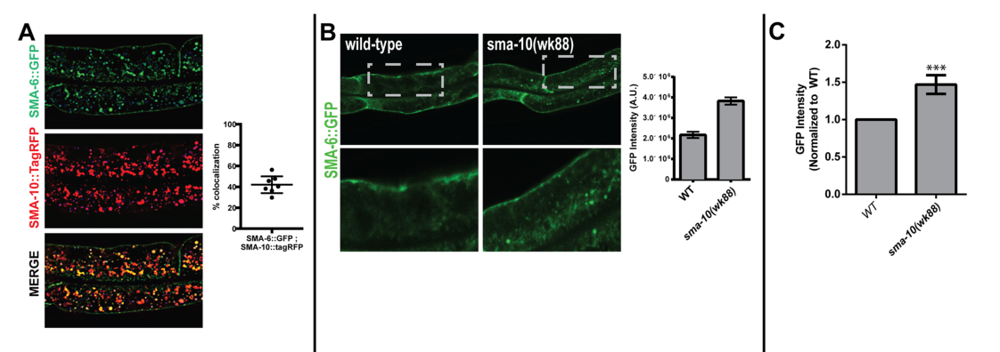

## Question

# Gene Research for Functional Annotation

## ⚠️ CRITICAL: Gene/Protein Identification Context

**BEFORE YOU BEGIN RESEARCH:** You MUST verify you are researching the CORRECT gene/protein. Gene symbols can be ambiguous, especially for less well-characterized genes from non-model organisms.

### Target Gene/Protein Identity (from UniProt):
- **UniProt Accession:** Q965M2
- **Protein Description:** RecName: Full=Leucine-rich repeats and immunoglobulin-like domains protein sma-10 {ECO:0000305}; Flags: Precursor;
- **Gene Information:** Name=sma-10 {ECO:0000312|WormBase:T21D12.9a}; ORFNames=T21D12.9 {ECO:0000312|WormBase:T21D12.9a};
- **Organism (full):** Caenorhabditis elegans.
- **Protein Family:** Not specified in UniProt
- **Key Domains:** Ig-like_dom. (IPR007110); Ig-like_dom_sf. (IPR036179); Ig-like_fold. (IPR013783); Ig_I-set. (IPR013098); Ig_sub. (IPR003599)

### MANDATORY VERIFICATION STEPS:

1. **Check if the gene symbol "sma-10" matches the protein description above**
2. **Verify the organism is correct:** Caenorhabditis elegans.
3. **Check if protein family/domains align with what you find in literature**
4. **If you find literature for a DIFFERENT gene with the same or similar symbol, STOP**

### If Gene Symbol is Ambiguous or You Cannot Find Relevant Literature:

**DO NOT PROCEED WITH RESEARCH ON A DIFFERENT GENE.** Instead:
- State clearly: "The gene symbol 'sma-10' is ambiguous or literature is limited for this specific protein"
- Explain what you found (e.g., "Found extensive literature on a different gene with the same symbol in a different organism")
- Describe the protein based ONLY on the UniProt information provided above
- Suggest that the protein function can be inferred from domain/family information

### Research Target:

Please provide a comprehensive research report on the gene **sma-10** (gene ID: sma-10, UniProt: Q965M2) in worm.

The research report should be a detailed narrative explaining the function, biological processes, and localization of the gene product. Citations should be given for all claims.

You should prioritize authoritative reviews and primary scientific literature when conducting research. You can supplement
this with annotations you find in gene/protein databases, but these can be outdated or inaccurate.

We are specifically interested in the primary function of the gene - for enzymes, what reaction is catalyzed, and what is the substrate specificity? For transporters, what is the substrate? For structural proteins or adapters, what is the broader structural role? For signaling molecules, what is the role in the pathway.

We are interested in where in or outside the cell the gene product carries out its function.

We are also interested in the signaling or biochemical pathways in which the gene functions. We are less interested in broad pleiotropic effects, except where these elucidate the precise role.

Include evidence where possible. We are interested in both experimental evidence as well as inference from structure, evolution, or bioinformatic analysis. Precise studies should be prioritized over high-throughput, where available.

## Output

Question: You are an expert researcher providing comprehensive, well-cited information.

Provide detailed information focusing on:
1. Key concepts and definitions with current understanding
2. Recent developments and latest research (prioritize 2023-2024 sources)
3. Current applications and real-world implementations
4. Expert opinions and analysis from authoritative sources
5. Relevant statistics and data from recent studies

Format as a comprehensive research report with proper citations. Include URLs and publication dates where available.
Always prioritize recent, authoritative sources and provide specific citations for all major claims.

# Gene Research for Functional Annotation

## ⚠️ CRITICAL: Gene/Protein Identification Context

**BEFORE YOU BEGIN RESEARCH:** You MUST verify you are researching the CORRECT gene/protein. Gene symbols can be ambiguous, especially for less well-characterized genes from non-model organisms.

### Target Gene/Protein Identity (from UniProt):
- **UniProt Accession:** Q965M2
- **Protein Description:** RecName: Full=Leucine-rich repeats and immunoglobulin-like domains protein sma-10 {ECO:0000305}; Flags: Precursor;
- **Gene Information:** Name=sma-10 {ECO:0000312|WormBase:T21D12.9a}; ORFNames=T21D12.9 {ECO:0000312|WormBase:T21D12.9a};
- **Organism (full):** Caenorhabditis elegans.
- **Protein Family:** Not specified in UniProt
- **Key Domains:** Ig-like_dom. (IPR007110); Ig-like_dom_sf. (IPR036179); Ig-like_fold. (IPR013783); Ig_I-set. (IPR013098); Ig_sub. (IPR003599)

### MANDATORY VERIFICATION STEPS:

1. **Check if the gene symbol "sma-10" matches the protein description above**
2. **Verify the organism is correct:** Caenorhabditis elegans.
3. **Check if protein family/domains align with what you find in literature**
4. **If you find literature for a DIFFERENT gene with the same or similar symbol, STOP**

### If Gene Symbol is Ambiguous or You Cannot Find Relevant Literature:

**DO NOT PROCEED WITH RESEARCH ON A DIFFERENT GENE.** Instead:
- State clearly: "The gene symbol 'sma-10' is ambiguous or literature is limited for this specific protein"
- Explain what you found (e.g., "Found extensive literature on a different gene with the same symbol in a different organism")
- Describe the protein based ONLY on the UniProt information provided above
- Suggest that the protein function can be inferred from domain/family information

### Research Target:

Please provide a comprehensive research report on the gene **sma-10** (gene ID: sma-10, UniProt: Q965M2) in worm.

The research report should be a detailed narrative explaining the function, biological processes, and localization of the gene product. Citations should be given for all claims.

You should prioritize authoritative reviews and primary scientific literature when conducting research. You can supplement
this with annotations you find in gene/protein databases, but these can be outdated or inaccurate.

We are specifically interested in the primary function of the gene - for enzymes, what reaction is catalyzed, and what is the substrate specificity? For transporters, what is the substrate? For structural proteins or adapters, what is the broader structural role? For signaling molecules, what is the role in the pathway.

We are interested in where in or outside the cell the gene product carries out its function.

We are also interested in the signaling or biochemical pathways in which the gene functions. We are less interested in broad pleiotropic effects, except where these elucidate the precise role.

Include evidence where possible. We are interested in both experimental evidence as well as inference from structure, evolution, or bioinformatic analysis. Precise studies should be prioritized over high-throughput, where available.

# Functional annotation of *Caenorhabditis elegans sma-10* (UniProt Q965M2)

## Identity and principal function

**Identity verified.** The protein in question is the *C. elegans* gene product SMA-10, encoded by **T21D12.9**, not a similarly named protein from another organism. Cloning and mutant sequencing link *sma-10* to this locus. The characterized 881-amino-acid protein is an LRIG-family-like, single-pass membrane protein with an N-terminal signal sequence, an extracellular leucine-rich-repeat (LRR) region, three immunoglobulin-like domains, and a short intracellular tail. This architecture agrees with the Ig-like annotations supplied for Q965M2. The original structural analysis counted **15 LRRs**; a later description gives **16–17**, so an exact repeat count should be attributed to its source rather than treated as settled. (gumienny2010caenorhabditiseleganssma10lrig pages 2-3, gumienny2010caenorhabditiseleganssma10lrig pages 3-4, lucas2021sma10isa pages 1-2)

**Primary functional annotation:** SMA-10 is a receptor-associated **positive regulator of DBL-1/BMP-like signaling**, principally through control of the type-I receptor **SMA-6**. It is not characterized as an enzyme or transporter and therefore has no established catalytic reaction or transported substrate. Its best-supported molecular role is to associate with BMP receptors and maintain productive receptor trafficking and signaling in responding cells. Whether it directly recruits trafficking or ubiquitination machinery remains unresolved. (gumienny2010caenorhabditiseleganssma10lrig pages 4-6, gleason2017c.eleganssma10 pages 5-6, gleason2017c.eleganssma10 pages 11-13)

| Finding | Direct evidence/quantitative result | Scope and interpretation | Primary citation |
|---|---|---|---|
| Identity and architecture | *sma-10* was mapped to *T21D12.9*; the 881-aa protein has an N-terminal signal peptide, 15 LRRs, three Ig-like domains, one transmembrane segment, and a 19-aa cytoplasmic tail. | Confirms the queried *C. elegans* protein as an LRIG-family, predominantly extracellular single-pass membrane protein. | (gumienny2010caenorhabditiseleganssma10lrig pages 2-3) |
| Hypodermal function in body size | *sma-10(wk66)* animals were 84% of wild-type length; hypodermal expression restored length to 98%, whereas pharyngeal expression remained at 84%. | SMA-10 acts in signal-receiving hypodermis to promote DBL-1/BMP-dependent growth; pharyngeal expression is insufficient. | (gumienny2010caenorhabditiseleganssma10lrig pages 4-6) |
| BMP-receptor interaction and trafficking | Intestinal SMA-10 colocalized 42.1% with SMA-6 versus 7.0% with DAF-4. Loss of *sma-10* reduced SMA-6 ubiquitination, increased SMA-6 overlap with MVBs, and decreased overlap with RAB-7-positive late endosomes. | Supports preferential control of type-I receptor SMA-6 trafficking. Recruitment of ubiquitination machinery by SMA-10 remains a mechanistic hypothesis. | (gleason2017c.eleganssma10 pages 5-6, gleason2017c.eleganssma10 pages 6-8, gleason2017c.eleganssma10 pages 11-13) |
| Growth mechanism and immunity | Hypodermal ploidy was 10.86 ± 0.8 in wild type versus 8.77 ± 0.7 in *sma-10(ok2224)*. In PA14 infection, *daf-2(e1370);sma-10* resembled resistant *daf-2*, not susceptible *sma-10*. | Links reduced growth to impaired hypodermal endoreduplication; separately places DAF-2 epistatic to SMA-10 for immunity, independent of canonical DBL-1/Sma-Mab signaling. | (lucas2021sma10isa pages 2-4, lucas2021sma10isa pages 7-9) |
| Neural HSF-1/BMP feedback | Neural HSF-1 and *dbl-1* loss were associated with reduced *sma-10* and endocytic-gene expression; SMA-3 binds upstream of *sma-10*. | Supports indirect DBL-1/SMA-3-dependent regulation of *sma-10*. It does **not** directly prove that SMA-10 repression itself causes lifespan extension. | (arneaud2022reducedbonemorphogenic pages 6-7, arneaud2022reducedbonemorphogenic pages 8-9) |
| 2023 comparative LRIG evidence | In mouse fibroblasts, LRIG1 promoted BMP2/4/6 but suppressed GDF7; LRIG2 promoted BMP2/4; LRIG3 promoted BMP2/4/6 and GDF7. | Mammalian evidence supports conserved, ligand-selective LRIG regulation but does not establish identical ligand specificity for worm SMA-10. | (abdullah2023ligandspecificregulationof pages 1-2, abdullah2023ligandspecificregulationof pages 8-10) |

*Table: Key experimental evidence defining SMA-10 structure, tissue function, receptor trafficking, and pathway-specific phenotypes. Mammalian LRIG findings and associative longevity evidence are explicitly separated from direct worm mechanism.*

## Pathway, molecular mechanism, and location

In the worm Sma/Mab pathway, secreted **DBL-1** signals through the type-I receptor **SMA-6** and type-II receptor **DAF-4**, followed by the Smads SMA-2, SMA-3, and SMA-4. Genetic experiments place SMA-10 function at the ligand–receptor level: loss of *sma-10* suppressed the long-body phenotype produced by excess *dbl-1*, whereas additional *sma-6* substantially bypassed the *sma-10* small-body phenotype. These are functional-order experiments, not proof that SMA-10 transfers ligand to a receptor. Co-immunoprecipitation demonstrated association with **both SMA-6 and DAF-4**; an affinity-labeling assay did **not** detect binding to BMP2 ligand. Thus receptor association, rather than demonstrated ligand binding, is the strongest biochemical finding. (gumienny2010caenorhabditiseleganssma10lrig pages 3-4, gumienny2010caenorhabditiseleganssma10lrig pages 4-6, gumienny2010caenorhabditiseleganssma10lrig pages 1-2)

SMA-10 is predicted to expose its LRR and Ig-like domains **outside the cell** and anchor them at the plasma membrane; its predicted transmembrane segment spans residues **839–861**, followed by a **19-residue intracellular tail**. Functional fluorescent fusions were observed at cell surfaces and in intracellular puncta. In intestinal epithelial cells, SMA-10 overlaps with the receptors in intracellular compartments, particularly SMA-6: reported colocalization was **42.1% with SMA-6 versus 7.0% with DAF-4**. SMA-10 also overlaps with RAB-5-marked early and RAB-7-marked late endosomes, but not significantly with the RME-1 recycling-endosome marker. Its relevant sites of action are therefore the **signal-receiving cell surface and endocytic compartments**, rather than the extracellular matrix as a freely secreted protein. (gumienny2010caenorhabditiseleganssma10lrig pages 2-3, gumienny2010caenorhabditiseleganssma10lrig pages 3-4, gleason2017c.eleganssma10 pages 5-6, gleason2017c.eleganssma10 pages 11-13)

Loss of *sma-10* causes SMA-6 to accumulate intracellularly while **reducing SMA-6 ubiquitination**. SMA-6 can still reach the plasma membrane when AP-2-mediated internalization is inhibited, arguing against a primary defect in receptor synthesis or outward delivery. In the mutant, SMA-6 overlap **increases with multivesicular bodies but decreases with RAB-7-positive late endosomes**; it would be incorrect to describe late-endosome overlap as increased. These results implicate SMA-10 in endocytic sorting after surface delivery. A proposed role as a scaffold for ubiquitination machinery is plausible, but neither the responsible ligase nor whether reduced ubiquitination causes—or follows—the trafficking defect has been established. Deleting SMA-10’s cytoplasmic tail nevertheless permitted complete rescue of the tested body-size defect, suggesting that this tail is dispensable for that function; this does not test every possible role of the tail. (gleason2017c.eleganssma10 pages 5-6, gleason2017c.eleganssma10 pages 6-8, gleason2017c.eleganssma10 pages 11-13, gleason2017c.eleganssma10 pages 8-11)

## Tissue-specific biological functions and quantitative evidence

**Body growth.** SMA-10 is required in the **hypodermis**, a DBL-1-responsive tissue that controls body size. In one rescue experiment, *sma-10(wk66)* animals reached **84% of wild-type length**; hypodermal *sma-10* expression restored length to **98%**, whereas pharyngeal expression left it at **84%**. A separate presumed-null allele, *wk88*, yielded approximately **79% of wild-type length**. The smaller size is associated with reduced hypodermal nuclear endoreduplication: mean ploidy was **10.86 ± 0.8** in wild type and **8.77 ± 0.7** in *sma-10(ok2224)* animals. In contrast to many core Sma/Mab mutants, tested *sma-10* mutants showed no obvious male-tail ray or spicule abnormalities, indicating that SMA-10 is **not required for every DBL-1-dependent output**. (gumienny2010caenorhabditiseleganssma10lrig pages 4-6, gumienny2010caenorhabditiseleganssma10lrig pages 2-3, lucas2021sma10isa pages 2-4)

**Innate immunity: a distinct genetic context.** *sma-10(ok2224)* animals are more susceptible to *Pseudomonas aeruginosa* PA14. Expressing SMA-10 in **either the intestine or hypodermis** rescued the infection-survival phenotype, whereas expression restricted to the pharynx did not fully rescue it. Enhanced susceptibility in *dbl-1;sma-10* double mutants supports a contribution to this phenotype outside the canonical DBL-1 branch. Conversely, *daf-2(e1370);sma-10* animals resembled infection-resistant *daf-2(e1370)* animals: **DAF-2 is genetically epistatic to SMA-10** for this assay. The evidence supports involvement of insulin/IGF-like signaling, but does **not** establish direct SMA-10–DAF-2 binding or a DAF-2 trafficking mechanism. A 2023 expert review likewise distinguishes SMA-10-associated PA14 defense from its conventional DBL-1/BMP role. (lucas2021sma10isa pages 4-7, lucas2021sma10isa pages 7-9, yamamoto2023tgfβpathwaysin pages 5-7)

**Other outcomes are selective.** The 2021 genetic study linked SMA-10 to reproductive-span and matricide phenotypes, but found no significant extension of ordinary lifespan in its *sma-10(ok2224)* assay: median survival was **14 days versus 12 days** for wild type (**p = 0.07**). SMA-10 should therefore not be annotated simply as a general longevity determinant. (lucas2021sma10isa pages 4-7, lucas2021sma10isa pages 2-4)

## Recent developments and research use

A **2022** neuron–intestine study found that reduced neural DBL-1 signaling was associated with lower expression of *sma-10* and several endocytic regulators; previously generated chromatin-binding data identified an SMA-3-associated region upstream of *sma-10*. The authors proposed a peripheral feedback loop that reduces intestinal SMA-6 surface availability. Their direct receptor-surface perturbation included **RAB-11.1 depletion**; the association between lower *sma-10* expression and longevity does **not** by itself show that SMA-10 repression causes lifespan extension. The work makes SMA-10 a useful readout and candidate mediator in studies of neuronal BMP signals and epithelial receptor trafficking. (arneaud2022reducedbonemorphogenic pages 6-7, arneaud2022reducedbonemorphogenic pages 3-3)

The most directly relevant **2023** experimental advance examined **mammalian LRIG homologues**, rather than worm SMA-10. In mouse embryonic fibroblasts, LRIG1 promoted BMP2/4/6 responses and suppressed GDF7; LRIG2 promoted BMP2/4; and LRIG3 promoted BMP2/4/6 and GDF7. The authors emphasized that the mammalian mechanism remains unclear. These findings strengthen the case for evolutionarily conserved, **context- and ligand-selective** LRIG regulation, but their ligand specificities cannot be assigned to *C. elegans* SMA-10 without worm experiments. Together with worm receptor-imaging and genetic-rescue assays, such systems are **research applications**, not established clinical uses or interventions targeting SMA-10. No 2024 primary study directly resolving the worm protein’s mechanism was identified in the literature reviewed here. (abdullah2023ligandspecificregulationof pages 1-2, abdullah2023ligandspecificregulationof pages 8-10, gleason2017c.eleganssma10 pages 5-6)

**Bottom line.** The highest-confidence annotation is **an LRIG-like membrane accessory protein acting at the surface and in endocytic compartments of BMP-responsive cells, where it promotes DBL-1/SMA-6 signaling by supporting appropriate receptor trafficking**. Hypodermal growth regulation is directly demonstrated; intestinal/hypodermal immune function is supported genetically but follows a different, DAF-2-associated context. Specific ligand binding, a cognate ubiquitin ligase, and direct biochemical control of DAF-2 remain open questions. (gumienny2010caenorhabditiseleganssma10lrig pages 4-6, gleason2017c.eleganssma10 pages 11-13, lucas2021sma10isa pages 7-9)

### Principal sources and publication dates

- Gumienny *et al.*, **May 2010**, *PLoS Genetics*, “Caenorhabditis elegans SMA-10/LRIG Is a Conserved Transmembrane Protein that Enhances Bone Morphogenetic Protein Signaling.” https://doi.org/10.1371/journal.pgen.1000963. (gumienny2010caenorhabditiseleganssma10lrig pages 2-3, gumienny2010caenorhabditiseleganssma10lrig pages 3-4)
- Gleason *et al.*, **13 July 2017**, *PLoS ONE*, “C. elegans SMA-10 regulates BMP receptor trafficking.” https://doi.org/10.1371/journal.pone.0180681. (gleason2017c.eleganssma10 pages 5-6, gleason2017c.eleganssma10 pages 11-13)
- de Lucas *et al.*, **January 2021**, *International Journal of Molecular Sciences*, “SMA-10 Is a Non-Canonical Member of the TGF-β Sma/Mab Pathway and Immunity Regulator via the DAF-2 Insulin Receptor in Caenorhabditis elegans.” https://doi.org/10.3390/ijms22020638. (lucas2021sma10isa pages 4-7, lucas2021sma10isa pages 2-4)
- Arneaud *et al.*, **August 2022**, *Aging Cell*, “Reduced bone morphogenic protein signaling along the gut–neuron axis by heat shock factor promotes longevity.” https://doi.org/10.1111/acel.13693. (arneaud2022reducedbonemorphogenic pages 6-7, arneaud2022reducedbonemorphogenic pages 3-3)
- Abdullah *et al.*, **21 August 2023**, *PLoS ONE*, “Ligand-specific regulation of transforming growth factor beta superfamily factors by leucine-rich repeats and immunoglobulin-like domains proteins.” https://doi.org/10.1371/journal.pone.0289726. (abdullah2023ligandspecificregulationof pages 1-2, abdullah2023ligandspecificregulationof pages 8-10)
- Yamamoto and Savage-Dunn, **September 2023**, *Frontiers in Genetics*, “TGF-β pathways in aging and immunity: lessons from Caenorhabditis elegans.” https://doi.org/10.3389/fgene.2023.1220068. (yamamoto2023tgfβpathwaysin pages 5-7)

References

1. (gumienny2010caenorhabditiseleganssma10lrig pages 2-3): Tina L. Gumienny, Lesley MacNeil, Cole M. Zimmerman, Huang Wang, Lena Chin, Jeffrey L. Wrana, and Richard W. Padgett. Caenorhabditis elegans sma-10/lrig is a conserved transmembrane protein that enhances bone morphogenetic protein signaling. PLoS Genetics, 6:e1000963, May 2010. URL: https://doi.org/10.1371/journal.pgen.1000963, doi:10.1371/journal.pgen.1000963. This article has 61 citations and is from a domain leading peer-reviewed journal.

2. (gumienny2010caenorhabditiseleganssma10lrig pages 3-4): Tina L. Gumienny, Lesley MacNeil, Cole M. Zimmerman, Huang Wang, Lena Chin, Jeffrey L. Wrana, and Richard W. Padgett. Caenorhabditis elegans sma-10/lrig is a conserved transmembrane protein that enhances bone morphogenetic protein signaling. PLoS Genetics, 6:e1000963, May 2010. URL: https://doi.org/10.1371/journal.pgen.1000963, doi:10.1371/journal.pgen.1000963. This article has 61 citations and is from a domain leading peer-reviewed journal.

3. (lucas2021sma10isa pages 1-2): María Pilar de Lucas, Marta Jiménez, Paloma Sánchez-Pavón, Alberto G. Sáez, and Encarnación Lozano. Sma-10 is a non-canonical member of the tgf-β sma/mab pathway and immunity regulator via the daf-2 insulin receptor in caenorhabditis elegans. International Journal of Molecular Sciences, 22:638, Jan 2021. URL: https://doi.org/10.3390/ijms22020638, doi:10.3390/ijms22020638. This article has 5 citations.

4. (gumienny2010caenorhabditiseleganssma10lrig pages 4-6): Tina L. Gumienny, Lesley MacNeil, Cole M. Zimmerman, Huang Wang, Lena Chin, Jeffrey L. Wrana, and Richard W. Padgett. Caenorhabditis elegans sma-10/lrig is a conserved transmembrane protein that enhances bone morphogenetic protein signaling. PLoS Genetics, 6:e1000963, May 2010. URL: https://doi.org/10.1371/journal.pgen.1000963, doi:10.1371/journal.pgen.1000963. This article has 61 citations and is from a domain leading peer-reviewed journal.

5. (gleason2017c.eleganssma10 pages 5-6): Ryan J. Gleason, Mehul Vora, Ying Li, Nanci S. Kane, Kelvin Liao, and Richard W. Padgett. C. elegans sma-10 regulates bmp receptor trafficking. PLoS ONE, 12:e0180681, Jul 2017. URL: https://doi.org/10.1371/journal.pone.0180681, doi:10.1371/journal.pone.0180681. This article has 16 citations and is from a peer-reviewed journal.

6. (gleason2017c.eleganssma10 pages 11-13): Ryan J. Gleason, Mehul Vora, Ying Li, Nanci S. Kane, Kelvin Liao, and Richard W. Padgett. C. elegans sma-10 regulates bmp receptor trafficking. PLoS ONE, 12:e0180681, Jul 2017. URL: https://doi.org/10.1371/journal.pone.0180681, doi:10.1371/journal.pone.0180681. This article has 16 citations and is from a peer-reviewed journal.

7. (gleason2017c.eleganssma10 pages 6-8): Ryan J. Gleason, Mehul Vora, Ying Li, Nanci S. Kane, Kelvin Liao, and Richard W. Padgett. C. elegans sma-10 regulates bmp receptor trafficking. PLoS ONE, 12:e0180681, Jul 2017. URL: https://doi.org/10.1371/journal.pone.0180681, doi:10.1371/journal.pone.0180681. This article has 16 citations and is from a peer-reviewed journal.

8. (lucas2021sma10isa pages 2-4): María Pilar de Lucas, Marta Jiménez, Paloma Sánchez-Pavón, Alberto G. Sáez, and Encarnación Lozano. Sma-10 is a non-canonical member of the tgf-β sma/mab pathway and immunity regulator via the daf-2 insulin receptor in caenorhabditis elegans. International Journal of Molecular Sciences, 22:638, Jan 2021. URL: https://doi.org/10.3390/ijms22020638, doi:10.3390/ijms22020638. This article has 5 citations.

9. (lucas2021sma10isa pages 7-9): María Pilar de Lucas, Marta Jiménez, Paloma Sánchez-Pavón, Alberto G. Sáez, and Encarnación Lozano. Sma-10 is a non-canonical member of the tgf-β sma/mab pathway and immunity regulator via the daf-2 insulin receptor in caenorhabditis elegans. International Journal of Molecular Sciences, 22:638, Jan 2021. URL: https://doi.org/10.3390/ijms22020638, doi:10.3390/ijms22020638. This article has 5 citations.

10. (arneaud2022reducedbonemorphogenic pages 6-7): Sonja L. B. Arneaud, Jacob McClendon, Lexus Tatge, Abigail Watterson, Kielen R. Zuurbier, Bhoomi Madhu, Tina L. Gumienny, and Peter M. Douglas. Reduced bone morphogenic protein signaling along the gut–neuron axis by heat shock factor promotes longevity. Aging Cell, Aug 2022. URL: https://doi.org/10.1111/acel.13693, doi:10.1111/acel.13693. This article has 10 citations and is from a domain leading peer-reviewed journal.

11. (arneaud2022reducedbonemorphogenic pages 8-9): Sonja L. B. Arneaud, Jacob McClendon, Lexus Tatge, Abigail Watterson, Kielen R. Zuurbier, Bhoomi Madhu, Tina L. Gumienny, and Peter M. Douglas. Reduced bone morphogenic protein signaling along the gut–neuron axis by heat shock factor promotes longevity. Aging Cell, Aug 2022. URL: https://doi.org/10.1111/acel.13693, doi:10.1111/acel.13693. This article has 10 citations and is from a domain leading peer-reviewed journal.

12. (abdullah2023ligandspecificregulationof pages 1-2): Ahmad Abdullah, Carl Herdenberg, and Håkan Hedman. Ligand-specific regulation of transforming growth factor beta superfamily factors by leucine-rich repeats and immunoglobulin-like domains proteins. PLOS ONE, 18:e0289726, Aug 2023. URL: https://doi.org/10.1371/journal.pone.0289726, doi:10.1371/journal.pone.0289726. This article has 7 citations and is from a peer-reviewed journal.

13. (abdullah2023ligandspecificregulationof pages 8-10): Ahmad Abdullah, Carl Herdenberg, and Håkan Hedman. Ligand-specific regulation of transforming growth factor beta superfamily factors by leucine-rich repeats and immunoglobulin-like domains proteins. PLOS ONE, 18:e0289726, Aug 2023. URL: https://doi.org/10.1371/journal.pone.0289726, doi:10.1371/journal.pone.0289726. This article has 7 citations and is from a peer-reviewed journal.

14. (gumienny2010caenorhabditiseleganssma10lrig pages 1-2): Tina L. Gumienny, Lesley MacNeil, Cole M. Zimmerman, Huang Wang, Lena Chin, Jeffrey L. Wrana, and Richard W. Padgett. Caenorhabditis elegans sma-10/lrig is a conserved transmembrane protein that enhances bone morphogenetic protein signaling. PLoS Genetics, 6:e1000963, May 2010. URL: https://doi.org/10.1371/journal.pgen.1000963, doi:10.1371/journal.pgen.1000963. This article has 61 citations and is from a domain leading peer-reviewed journal.

15. (gleason2017c.eleganssma10 pages 8-11): Ryan J. Gleason, Mehul Vora, Ying Li, Nanci S. Kane, Kelvin Liao, and Richard W. Padgett. C. elegans sma-10 regulates bmp receptor trafficking. PLoS ONE, 12:e0180681, Jul 2017. URL: https://doi.org/10.1371/journal.pone.0180681, doi:10.1371/journal.pone.0180681. This article has 16 citations and is from a peer-reviewed journal.

16. (lucas2021sma10isa pages 4-7): María Pilar de Lucas, Marta Jiménez, Paloma Sánchez-Pavón, Alberto G. Sáez, and Encarnación Lozano. Sma-10 is a non-canonical member of the tgf-β sma/mab pathway and immunity regulator via the daf-2 insulin receptor in caenorhabditis elegans. International Journal of Molecular Sciences, 22:638, Jan 2021. URL: https://doi.org/10.3390/ijms22020638, doi:10.3390/ijms22020638. This article has 5 citations.

17. (yamamoto2023tgfβpathwaysin pages 5-7): Katerina K. Yamamoto and Cathy Savage-Dunn. Tgf-β pathways in aging and immunity: lessons from caenorhabditis elegans. Frontiers in Genetics, Sep 2023. URL: https://doi.org/10.3389/fgene.2023.1220068, doi:10.3389/fgene.2023.1220068. This article has 23 citations and is from a peer-reviewed journal.

18. (arneaud2022reducedbonemorphogenic pages 3-3): Sonja L. B. Arneaud, Jacob McClendon, Lexus Tatge, Abigail Watterson, Kielen R. Zuurbier, Bhoomi Madhu, Tina L. Gumienny, and Peter M. Douglas. Reduced bone morphogenic protein signaling along the gut–neuron axis by heat shock factor promotes longevity. Aging Cell, Aug 2022. URL: https://doi.org/10.1111/acel.13693, doi:10.1111/acel.13693. This article has 10 citations and is from a domain leading peer-reviewed journal.

## Artifacts

- [Edison artifact artifact-00](sma-10-deep-research-falcon_artifacts/artifact-00.md)

## Citations

1. arneaud2022reducedbonemorphogenic pages 6-7
2. arneaud2022reducedbonemorphogenic pages 8-9
3. abdullah2023ligandspecificregulationof pages 1-2
4. abdullah2023ligandspecificregulationof pages 8-10
5. arneaud2022reducedbonemorphogenic pages 3-3
6. https://doi.org/10.1371/journal.pgen.1000963.
7. https://doi.org/10.1371/journal.pone.0180681.
8. https://doi.org/10.3390/ijms22020638.
9. https://doi.org/10.1111/acel.13693.
10. https://doi.org/10.1371/journal.pone.0289726.
11. https://doi.org/10.3389/fgene.2023.1220068.
12. https://doi.org/10.1371/journal.pgen.1000963,
13. https://doi.org/10.3390/ijms22020638,
14. https://doi.org/10.1371/journal.pone.0180681,
15. https://doi.org/10.1111/acel.13693,
16. https://doi.org/10.1371/journal.pone.0289726,
17. https://doi.org/10.3389/fgene.2023.1220068,