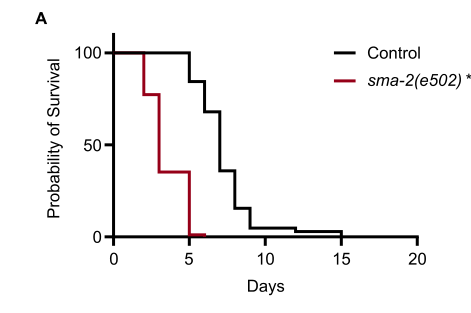

## Question

# Gene Research for Functional Annotation

## ⚠️ CRITICAL: Gene/Protein Identification Context

**BEFORE YOU BEGIN RESEARCH:** You MUST verify you are researching the CORRECT gene/protein. Gene symbols can be ambiguous, especially for less well-characterized genes from non-model organisms.

### Target Gene/Protein Identity (from UniProt):
- **UniProt Accession:** Q02330
- **Protein Description:** RecName: Full=Dwarfin sma-2; AltName: Full=MAD protein homolog 1;
- **Gene Information:** Name=sma-2 {ECO:0000312|WormBase:ZK370.2a}; Synonyms=cem-1 {ECO:0000312|WormBase:ZK370.2a}; ORFNames=ZK370.2 {ECO:0000312|WormBase:ZK370.2a};
- **Organism (full):** Caenorhabditis elegans.
- **Protein Family:** Belongs to the dwarfin/SMAD family. .
- **Key Domains:** MAD_homology1_Dwarfin-type. (IPR003619); MAD_homology_MH1. (IPR013019); SMAD-like_dom_sf. (IPR017855); SMAD/Dwarfins. (IPR013790); SMAD_dom. (IPR001132)

### MANDATORY VERIFICATION STEPS:

1. **Check if the gene symbol "sma-2" matches the protein description above**
2. **Verify the organism is correct:** Caenorhabditis elegans.
3. **Check if protein family/domains align with what you find in literature**
4. **If you find literature for a DIFFERENT gene with the same or similar symbol, STOP**

### If Gene Symbol is Ambiguous or You Cannot Find Relevant Literature:

**DO NOT PROCEED WITH RESEARCH ON A DIFFERENT GENE.** Instead:
- State clearly: "The gene symbol 'sma-2' is ambiguous or literature is limited for this specific protein"
- Explain what you found (e.g., "Found extensive literature on a different gene with the same symbol in a different organism")
- Describe the protein based ONLY on the UniProt information provided above
- Suggest that the protein function can be inferred from domain/family information

### Research Target:

Please provide a comprehensive research report on the gene **sma-2** (gene ID: sma-2, UniProt: Q02330) in worm.

The research report should be a detailed narrative explaining the function, biological processes, and localization of the gene product. Citations should be given for all claims.

You should prioritize authoritative reviews and primary scientific literature when conducting research. You can supplement
this with annotations you find in gene/protein databases, but these can be outdated or inaccurate.

We are specifically interested in the primary function of the gene - for enzymes, what reaction is catalyzed, and what is the substrate specificity? For transporters, what is the substrate? For structural proteins or adapters, what is the broader structural role? For signaling molecules, what is the role in the pathway.

We are interested in where in or outside the cell the gene product carries out its function.

We are also interested in the signaling or biochemical pathways in which the gene functions. We are less interested in broad pleiotropic effects, except where these elucidate the precise role.

Include evidence where possible. We are interested in both experimental evidence as well as inference from structure, evolution, or bioinformatic analysis. Precise studies should be prioritized over high-throughput, where available.

## Output

Question: You are an expert researcher providing comprehensive, well-cited information.

Provide detailed information focusing on:
1. Key concepts and definitions with current understanding
2. Recent developments and latest research (prioritize 2023-2024 sources)
3. Current applications and real-world implementations
4. Expert opinions and analysis from authoritative sources
5. Relevant statistics and data from recent studies

Format as a comprehensive research report with proper citations. Include URLs and publication dates where available.
Always prioritize recent, authoritative sources and provide specific citations for all major claims.

# Gene Research for Functional Annotation

## ⚠️ CRITICAL: Gene/Protein Identification Context

**BEFORE YOU BEGIN RESEARCH:** You MUST verify you are researching the CORRECT gene/protein. Gene symbols can be ambiguous, especially for less well-characterized genes from non-model organisms.

### Target Gene/Protein Identity (from UniProt):
- **UniProt Accession:** Q02330
- **Protein Description:** RecName: Full=Dwarfin sma-2; AltName: Full=MAD protein homolog 1;
- **Gene Information:** Name=sma-2 {ECO:0000312|WormBase:ZK370.2a}; Synonyms=cem-1 {ECO:0000312|WormBase:ZK370.2a}; ORFNames=ZK370.2 {ECO:0000312|WormBase:ZK370.2a};
- **Organism (full):** Caenorhabditis elegans.
- **Protein Family:** Belongs to the dwarfin/SMAD family. .
- **Key Domains:** MAD_homology1_Dwarfin-type. (IPR003619); MAD_homology_MH1. (IPR013019); SMAD-like_dom_sf. (IPR017855); SMAD/Dwarfins. (IPR013790); SMAD_dom. (IPR001132)

### MANDATORY VERIFICATION STEPS:

1. **Check if the gene symbol "sma-2" matches the protein description above**
2. **Verify the organism is correct:** Caenorhabditis elegans.
3. **Check if protein family/domains align with what you find in literature**
4. **If you find literature for a DIFFERENT gene with the same or similar symbol, STOP**

### If Gene Symbol is Ambiguous or You Cannot Find Relevant Literature:

**DO NOT PROCEED WITH RESEARCH ON A DIFFERENT GENE.** Instead:
- State clearly: "The gene symbol 'sma-2' is ambiguous or literature is limited for this specific protein"
- Explain what you found (e.g., "Found extensive literature on a different gene with the same symbol in a different organism")
- Describe the protein based ONLY on the UniProt information provided above
- Suggest that the protein function can be inferred from domain/family information

### Research Target:

Please provide a comprehensive research report on the gene **sma-2** (gene ID: sma-2, UniProt: Q02330) in worm.

The research report should be a detailed narrative explaining the function, biological processes, and localization of the gene product. Citations should be given for all claims.

You should prioritize authoritative reviews and primary scientific literature when conducting research. You can supplement
this with annotations you find in gene/protein databases, but these can be outdated or inaccurate.

We are specifically interested in the primary function of the gene - for enzymes, what reaction is catalyzed, and what is the substrate specificity? For transporters, what is the substrate? For structural proteins or adapters, what is the broader structural role? For signaling molecules, what is the role in the pathway.

We are interested in where in or outside the cell the gene product carries out its function.

We are also interested in the signaling or biochemical pathways in which the gene functions. We are less interested in broad pleiotropic effects, except where these elucidate the precise role.

Include evidence where possible. We are interested in both experimental evidence as well as inference from structure, evolution, or bioinformatic analysis. Precise studies should be prioritized over high-throughput, where available.

# Functional annotation of *sma-2* in *Caenorhabditis elegans*

## Identity and principal function

**Identity verified.** The requested UniProt entry, **Q02330**, identifies *C. elegans sma-2* (also called *cem-1*; locus ZK370.2) as dwarfin SMA-2/MAD protein homolog 1. The original *C. elegans* cloning study independently identified *sma-2* as a homolog of *Drosophila* **Mad** and a member of the intracellular dwarfin family. Subsequent work places SMA-2 among the receptor-regulated Smads (**R-Smads**) of the worm’s DBL-1/BMP-like pathway. Its conserved Smad MH1 and MH2 architecture agrees with the domains specified in the supplied UniProt record. This is **not** the distinct worm R-Smad SMA-3 or a similarly named protein from another organism. The accession and aliases come from the supplied UniProt identity; the experimental papers independently establish the worm gene’s family and function. (savage1996caenorhabditiselegansgenes pages 1-2, savage1996caenorhabditiselegansgenes pages 3-4, wang2005cterminalmutantsof pages 1-2, savagedunn2017thetgfβfamily pages 7-9)

**Primary molecular role:** SMA-2 is an **intracellular signal transducer and transcriptional co-regulator**, not an enzyme, transporter, secreted ligand, or extracellular structural protein. In the canonical pathway, extracellular DBL-1 signals through the type II receptor DAF-4 and type I receptor SMA-6; the resulting signal is conveyed by the nonredundant R-Smads SMA-2 and SMA-3 together with co-Smad SMA-4 to regulate transcription. The prevailing model invokes receptor-dependent C-terminal R-Smad phosphorylation and an SMA-2–SMA-3–SMA-4 complex, followed by nuclear action. The pathway assignment is well established, but the precise phosphorylation and nuclear trafficking of **endogenous SMA-2 itself** are less directly documented than this general model might suggest. The motif and phosphomimetic experiments support, rather than substitute for, direct measurement of receptor-catalyzed SMA-2 phosphorylation. (savagedunn2017thetgfβfamily pages 7-9, savagedunn2001targetsoftgfβrelated pages 1-3, wang2005cterminalmutantsof pages 1-2, wang2005cterminalmutantsof pages 3-4, gumienny2013tgfβsignalingin pages 8-10)

## Where SMA-2 acts

The best-supported site of SMA-2 **function** is inside BMP-responsive cells. Original genetic mosaics showed that SMA-2 acts cell-autonomously in the male **ray-7 neuroblast**, in the same cellular lineage in which DAF-4 acts; its sequence lacks a signal peptide and transmembrane segment. A *sma-2* promoter–GFP reporter was expressed in the **hypodermis/epidermis, pharynx, and intestine**. The epidermis is especially relevant to body-size and cuticle regulation, but a transcriptional reporter identifies cells capable of expressing the gene, **not** the intracellular location of native SMA-2 protein. Cytoplasmic reception of signaling and nuclear transcriptional action are consistent with Smad biology and SMA-2’s transcription-factor interactions; direct in-vivo imaging of functional tagged SMA-2 remains a limitation because tested GFP, FLAG, and V5 fusions failed to rescue *sma-2* mutants. SMA-2 is therefore best annotated as a **cytoplasmic-to-nuclear signaling protein**, with individual subcellular steps partly inferred rather than imaged in the native worm. (savage1996caenorhabditiselegansgenes pages 3-4, wang2005cterminalmutantsof pages 5-6, qi2017c.elegansdaf16foxo pages 8-9, savagedunn2001targetsoftgfβrelated pages 1-3)

## Experimental basis and physiological outputs

In 1996, **13 of 13** mosaics with a defective male ray 7 carried *sma-2*-mutant ray-7 neurons; in **two**, these were the only identified mutant cells. Forced *daf-4* expression rescued **0 of 10** *sma-2* mutants, supporting a requirement for SMA-2 in receptor-responsive cells rather than merely in receptor expression. Male-tail sensory-ray identity and spicule development are consequently well-supported developmental outputs. **Savage et al., January 1996**, *PNAS*, https://doi.org/10.1073/pnas.93.2.790. (savage1996caenorhabditiselegansgenes pages 3-4, wang2005cterminalmutantsof pages 1-2)

Body-length rescue provides a quantitative SMA-2-specific test. Adult *sma-2(e297)* mutants measured **0.77 ± 0.06 mm** (*n* = 33); animals supplied with wild-type *sma-2* measured **1.19 ± 0.09 mm** (*n* = 45), whereas an engineered C-terminal phosphomimetic SMA-2-DID yielded **1.07 ± 0.09 mm** (*n* = 30). The phosphomimetic also rescued aspects of male-tail development, but phosphomimetic SMA-2 and SMA-3 together did **not** bypass a defective SMA-6 receptor for normal male-tail development. Thus SMA-2 is necessary for growth, and activation requirements differ by tissue and output; an engineered DID substitution should not be equated with physiological phosphorylation. **Wang et al., August 2005**, *Development*, https://doi.org/10.1242/dev.01930. (wang2005cterminalmutantsof pages 3-4, wang2005cterminalmutantsof pages 5-6)

A particularly informative downstream output is the **collagen-rich cuticle**. DBL-1/Smad signaling changes developmental-stage-dependent cuticle-collagen expression and thereby body size. In a focused study of the *col-141/col-142* regulatory region, the direct DNA-binding evidence was for the **SMA-4 MH1 domain** at GTCT-containing elements; SMA-3 did not bind the tested probes. These results support cuticle-collagen regulation by the pathway, **not** a claim that SMA-2 itself was demonstrated to occupy those sequences or directly activate those specific genes. **Madaan et al., October 2018**, *Genetics*, https://doi.org/10.1534/genetics.118.301631. (madaan2018bmpsignalingdetermines pages 5-7, madaan2018bmpsignalingdetermines pages 2-3)

SMA-2 can also participate in transcriptional crosstalk: it associated with **DAF-16/FOXO** in yeast two-hybrid experiments and co-immunoprecipitated with DAF-16 after both proteins were expressed in HEK293T cells. These are physical-interaction results, not an endogenous worm SMA-2 co-immunoprecipitation. The associated worm genetics implicated somatic BMP signaling in DAF-16-dependent germline overproliferation; those findings illustrate a context-dependent interaction rather than SMA-2’s principal function. **Qi et al., May 2017**, *PLOS Genetics*, https://doi.org/10.1371/journal.pgen.1006801. (qi2017c.elegansdaf16foxo pages 8-9, qi2017c.elegansdaf16foxo pages 5-8)

The following evidence summary separates experiments performed on SMA-2 from findings concerning other pathway members.

| Finding | SMA-2-specific experiment | Interpretation and caveat | Source year and DOI URL |
|---|---|---|---|
| Cell-autonomous role in male ray-7 identity | Genetic mosaic analysis: **13/13** animals with ray-7 defects had *sma-2*-mutant ray-7 neurons; in **2** animals, ray 7 contained the only identified mutant cells. Heat-shock-driven *daf-4* rescued **0/10** *sma-2* mutants. (savage1996caenorhabditiselegansgenes pages 3-4) | Strong genetic evidence that SMA-2 acts cell-autonomously in the same target cells as the DAF-4 receptor and downstream of receptor expression; this is localization of genetic function, not direct protein imaging. | 1996 — [10.1073/pnas.93.2.790](https://doi.org/10.1073/pnas.93.2.790) |
| Requirement for normal body length and activity of a phosphomimetic form | Adult length: *sma-2(e297)* **0.77 ± 0.06 mm** (*n*=33); wild-type *sma-2* transgene **1.19 ± 0.09 mm** (*n*=45); SMA-2-DID phosphomimetic **1.07 ± 0.09 mm** (*n*=30). A *sma-2* promoter reporter was expressed in pharynx, intestine, and hypodermis. (wang2005cterminalmutantsof pages 3-4, wang2005cterminalmutantsof pages 5-6) | Rescue establishes SMA-2 causality, while DID activity supports regulation through the R-Smad C terminus. DID is an engineered phosphomimetic and does not prove the exact in-vivo phosphorylation state or direct receptor–SMA-2 biochemistry. | 2005 — [10.1242/dev.01930](https://doi.org/10.1242/dev.01930) |
| Physical association with DAF-16/FOXO | SMA-2 interacted with DAF-16 in yeast two-hybrid assays; DAF-16::V5 co-immunoprecipitated with SMA-2::GFP after heterologous expression in HEK293T cells. (qi2017c.elegansdaf16foxo pages 8-9) | Supports a physical SMA-2–DAF-16 interaction and BMP–insulin/FOXO crosstalk. No functional tagged SMA-2 could be produced in worms—GFP, FLAG, and V5 fusions failed to rescue *sma-2(e502)*—so an endogenous in-vivo SMA-2 co-IP or subcellular localization was not demonstrated. | 2017 — [10.1371/journal.pgen.1006801](https://doi.org/10.1371/journal.pgen.1006801) |
| Collagen transcription is a DBL-1/Smad output, but direct SMA-2 DNA binding is unproven | Purified Smad MH1 domains were tested against regulatory DNA between *col-141* and *col-142*. Specific binding to GTCT elements was demonstrated for **SMA-4**; SMA-3 did not bind the tested probes. No positive SMA-2-binding result was reported. (madaan2018bmpsignalingdetermines pages 5-7, madaan2018bmpsignalingdetermines pages 2-3) | Collagens are pathway targets, but these experiments must not be cited as direct SMA-2 occupancy. SMA-2 participation is inferred from its canonical pathway role rather than demonstrated at these collagen regulatory elements. | 2018 — [10.1534/genetics.118.301631](https://doi.org/10.1534/genetics.118.301631) |
| Requirement for survival during bacterial infection | On *Photorhabdus luminescens*, *sma-2(e502)* animals (*n*=88) had significantly poorer survival than controls (*n*=103), Mantel–Cox **p < 0.0001**. (ciccarelli2024tgfβligandcrosssubfamily pages 7-10, ciccarelli2024tgfβligandcrosssubfamily media 98388ac1) | Direct recent evidence that SMA-2 contributes to antibacterial defense through the canonical BMP-Smad module. The loss-of-function survival assay does not identify SMA-2’s responding tissue, direct target genes, or upstream ligand(s) in this context. | 2024 — [10.1371/journal.pgen.1011324](https://doi.org/10.1371/journal.pgen.1011324) |
| Genome-wide Smad/Schnurri binding and collagen-secretion program | ChIP-seq identified **4,205 SMA-3 peaks**, **7,065 SMA-9 peaks**, and **3,101 overlapping peaks**; integrated analyses identified direct SMA-3/SMA-9 targets and linked them to ER function and collagen secretion. SMA-2 was not subjected to ChIP-seq or equivalent genome-wide occupancy analysis. (vora2025genomewideanalysisof pages 1-5, vora2025genomewideanalysisof pages 53-55, vora2025genomewideanalysisof pages 5-8, vora2025genomewideanalysisof pages 28-30) | Updates the DBL-1 transcriptional model but directly concerns SMA-3 and SMA-9. Applying its genomic targets, binding sites, or activator behavior to SMA-2 remains inference, not SMA-2-specific evidence. | 2025 — [10.7554/eLife.99394.1](https://doi.org/10.7554/eLife.99394.1) |

*Table: Evidence-tiered findings for C. elegans SMA-2/Q02330, separating direct SMA-2 experiments from pathway-level or other-Smad results. The caveats prevent SMA-3, SMA-4, or SMA-9 findings from being incorrectly assigned to SMA-2.*

## Recent research: pathogen responses and transcriptional programs

**Bacterial infection, 2024.** A direct SMA-2 loss-of-function experiment found that *sma-2(e502)* worms survived exposure to *Photorhabdus luminescens* significantly less well than controls (**88 mutants; 103 controls; log-rank *p* < 0.0001**, as indicated in the study’s Figure 4A). Mutants in *sma-4* and *sma-6* also had reduced survival, supporting involvement of canonical BMP-pathway components in this bacterial response. The survival experiment does **not** identify a SMA-2-specific responding tissue or its immediate transcriptional targets. **Ciccarelli et al., June 14, 2024**, *PLOS Genetics*, https://doi.org/10.1371/journal.pgen.1011324. (ciccarelli2024tgfβligandcrosssubfamily pages 6-7, ciccarelli2024tgfβligandcrosssubfamily pages 7-10, ciccarelli2024tgfβligandcrosssubfamily media 98388ac1)

**Important context dependence.** In epidermal defense against the fungus *Drechmeria coniospora*, prior work instead implicated **SMA-3 without SMA-2 or SMA-4**. A separate April 2024 bacterial-infection study demonstrated that restoring **SMA-3** in pharyngeal muscle improved pathogen survival and pharyngeal pumping and restored regulation of antimicrobial-peptide genes *abf-2* and *cnc-2*. Those pharyngeal rescue and peptide-expression experiments **were not performed as SMA-2-specific rescue experiments**; they should not be used to assign SMA-2 an established pharyngeal antimicrobial target. **Ciccarelli et al., April 2024**, *Molecular Biology of the Cell*, https://doi.org/10.1091/mbc.e23-05-0185; see also **Savage-Dunn and Padgett, 2017**, https://doi.org/10.1101/cshperspect.a022178. (ciccarelli2024tgfβligandcrosssubfamily pages 6-7, ciccarelli2024bmpsignalingto pages 16-20, ciccarelli2024bmpsignalingto pages 1-6, ciccarelli2024bmpsignalingto pages 10-16, gumienny2013tgfβsignalingin pages 5-7)

**Genomic refinement, 2025.** Genome-wide experiments connected DBL-1 signaling to endoplasmic-reticulum functions, collagen secretion, and body size: investigators identified **4,205 SMA-3 ChIP-seq peaks**, **7,065 SMA-9/Schnurri peaks**, and **3,101 overlapping peaks**. This advances understanding of the transcriptional program in which SMA-2 participates, but the ChIP-seq and direct-target assignments were for **SMA-3 and SMA-9, not SMA-2**. These findings cannot establish a SMA-2-specific genomic binding map. **Vora et al., 2025**, *eLife* research version, https://doi.org/10.7554/eLife.99394.1. (vora2025genomewideanalysisof pages 1-5, vora2025genomewideanalysisof pages 5-8, vora2025genomewideanalysisof pages 14-18)

## Functional-annotation conclusion

The most defensible annotation is: **SMA-2 is a nonredundant, intracellular receptor-regulated Smad that conveys DBL-1/BMP-family signaling to transcriptional programs in responsive *C. elegans* cells.** Its clearest experimentally demonstrated outputs are cell-autonomous male sensory-ray patterning, normal body growth, and resistance to at least some bacterial infections; epidermal collagen regulation provides a mechanistically supported **pathway-level** explanation for body-size control. Its precise native subcellular distribution, individual receptor-phosphorylation event, and directly occupied DNA targets remain less firmly established than its genetic pathway role. This distinction is essential when interpreting detailed SMA-3, SMA-4, or SMA-9 results as evidence about SMA-2. (savage1996caenorhabditiselegansgenes pages 3-4, wang2005cterminalmutantsof pages 3-4, ciccarelli2024tgfβligandcrosssubfamily media 98388ac1, madaan2018bmpsignalingdetermines pages 5-7, qi2017c.elegansdaf16foxo pages 8-9, vora2025genomewideanalysisof pages 5-8)

References

1. (savage1996caenorhabditiselegansgenes pages 1-2): C Savage, P Das, A L Finelli, S R Townsend, C Y Sun, S E Baird, and R W Padgett. Caenorhabditis elegans genes sma-2, sma-3, and sma-4 define a conserved family of transforming growth factor beta pathway components. Proceedings of the National Academy of Sciences, 93:790-794, Jan 1996. URL: https://doi.org/10.1073/pnas.93.2.790, doi:10.1073/pnas.93.2.790. This article has 447 citations and is from a highest quality peer-reviewed journal.

2. (savage1996caenorhabditiselegansgenes pages 3-4): C Savage, P Das, A L Finelli, S R Townsend, C Y Sun, S E Baird, and R W Padgett. Caenorhabditis elegans genes sma-2, sma-3, and sma-4 define a conserved family of transforming growth factor beta pathway components. Proceedings of the National Academy of Sciences, 93:790-794, Jan 1996. URL: https://doi.org/10.1073/pnas.93.2.790, doi:10.1073/pnas.93.2.790. This article has 447 citations and is from a highest quality peer-reviewed journal.

3. (wang2005cterminalmutantsof pages 1-2): Jianjun Wang, William A. Mohler, and Cathy Savage-Dunn. C-terminal mutants of c. elegans smads reveal tissue-specific requirements for protein activation by tgf-β signaling. Development, 132:3505-3513, Aug 2005. URL: https://doi.org/10.1242/dev.01930, doi:10.1242/dev.01930. This article has 20 citations and is from a domain leading peer-reviewed journal.

4. (savagedunn2017thetgfβfamily pages 7-9): Cathy Savage-Dunn and Richard W. Padgett. The tgf-β family in caenorhabditis elegans. Cold Spring Harbor perspectives in biology, 9 6:a022178, Jan 2017. URL: https://doi.org/10.1101/cshperspect.a022178, doi:10.1101/cshperspect.a022178. This article has 96 citations and is from a peer-reviewed journal.

5. (savagedunn2001targetsoftgfβrelated pages 1-3): Cathy Savage-Dunn. Targets of tgfβ-related signaling in caenorhabditis elegans. Cytokine & Growth Factor Reviews, 12:305-312, Dec 2001. URL: https://doi.org/10.1016/s1359-6101(01)00015-6, doi:10.1016/s1359-6101(01)00015-6. This article has 46 citations and is from a peer-reviewed journal.

6. (wang2005cterminalmutantsof pages 3-4): Jianjun Wang, William A. Mohler, and Cathy Savage-Dunn. C-terminal mutants of c. elegans smads reveal tissue-specific requirements for protein activation by tgf-β signaling. Development, 132:3505-3513, Aug 2005. URL: https://doi.org/10.1242/dev.01930, doi:10.1242/dev.01930. This article has 20 citations and is from a domain leading peer-reviewed journal.

7. (gumienny2013tgfβsignalingin pages 8-10): T. L. Gumienny and C. Savage-Dunn. Tgf-β signaling in c. elegans *. ArXiv, 156:1-34, Jul 2013. URL: https://doi.org/10.1895/wormbook.1.22.2, doi:10.1895/wormbook.1.22.2. This article has 205 citations.

8. (wang2005cterminalmutantsof pages 5-6): Jianjun Wang, William A. Mohler, and Cathy Savage-Dunn. C-terminal mutants of c. elegans smads reveal tissue-specific requirements for protein activation by tgf-β signaling. Development, 132:3505-3513, Aug 2005. URL: https://doi.org/10.1242/dev.01930, doi:10.1242/dev.01930. This article has 20 citations and is from a domain leading peer-reviewed journal.

9. (qi2017c.elegansdaf16foxo pages 8-9): Wenjing Qi, Yijian Yan, Dietmar Pfeifer, Erika Donner v. Gromoff, Yimin Wang, Wolfgang Maier, and Ralf Baumeister. C. elegans daf-16/foxo interacts with tgf-ß/bmp signaling to induce germline tumor formation via mtorc1 activation. PLOS Genetics, 13:e1006801, May 2017. URL: https://doi.org/10.1371/journal.pgen.1006801, doi:10.1371/journal.pgen.1006801. This article has 28 citations and is from a domain leading peer-reviewed journal.

10. (madaan2018bmpsignalingdetermines pages 5-7): Uday Madaan, Edlira Yzeiraj, Michael Meade, James F Clark, Christine A Rushlow, and Cathy Savage-Dunn. Bmp signaling determines body size via transcriptional regulation of collagen genes in <i>caenorhabditis elegans</i>. Genetics, 210:1355-1367, Oct 2018. URL: https://doi.org/10.1534/genetics.118.301631, doi:10.1534/genetics.118.301631. This article has 53 citations and is from a domain leading peer-reviewed journal.

11. (madaan2018bmpsignalingdetermines pages 2-3): Uday Madaan, Edlira Yzeiraj, Michael Meade, James F Clark, Christine A Rushlow, and Cathy Savage-Dunn. Bmp signaling determines body size via transcriptional regulation of collagen genes in <i>caenorhabditis elegans</i>. Genetics, 210:1355-1367, Oct 2018. URL: https://doi.org/10.1534/genetics.118.301631, doi:10.1534/genetics.118.301631. This article has 53 citations and is from a domain leading peer-reviewed journal.

12. (qi2017c.elegansdaf16foxo pages 5-8): Wenjing Qi, Yijian Yan, Dietmar Pfeifer, Erika Donner v. Gromoff, Yimin Wang, Wolfgang Maier, and Ralf Baumeister. C. elegans daf-16/foxo interacts with tgf-ß/bmp signaling to induce germline tumor formation via mtorc1 activation. PLOS Genetics, 13:e1006801, May 2017. URL: https://doi.org/10.1371/journal.pgen.1006801, doi:10.1371/journal.pgen.1006801. This article has 28 citations and is from a domain leading peer-reviewed journal.

13. (ciccarelli2024tgfβligandcrosssubfamily pages 7-10): Emma Jo Ciccarelli, Zachary Wing, Moshe Bendelstein, Ramandeep Kaur Johal, Gurjot Singh, Ayelet Monas, and Cathy Savage-Dunn. Tgf-β ligand cross-subfamily interactions in the response of caenorhabditis elegans to a bacterial pathogen. PLOS Genetics, 20:e1011324, Jun 2024. URL: https://doi.org/10.1371/journal.pgen.1011324, doi:10.1371/journal.pgen.1011324. This article has 8 citations and is from a domain leading peer-reviewed journal.

14. (ciccarelli2024tgfβligandcrosssubfamily media 98388ac1): Emma Jo Ciccarelli, Zachary Wing, Moshe Bendelstein, Ramandeep Kaur Johal, Gurjot Singh, Ayelet Monas, and Cathy Savage-Dunn. Tgf-β ligand cross-subfamily interactions in the response of caenorhabditis elegans to a bacterial pathogen. PLOS Genetics, 20:e1011324, Jun 2024. URL: https://doi.org/10.1371/journal.pgen.1011324, doi:10.1371/journal.pgen.1011324. This article has 8 citations and is from a domain leading peer-reviewed journal.

15. (vora2025genomewideanalysisof pages 1-5): Mehul M. Vora, Jonathan Dietz, Zachary Wing, Karen George, Jun Liu, Christopher Rongo, and C. Savage-Dunn. Genome-wide analysis of smad and schnurri transcription factors in c. elegans demonstrates widespread interaction and a function in collagen secretion. ArXiv, Aug 2025. URL: https://doi.org/10.7554/elife.99394.1, doi:10.7554/elife.99394.1. This article has 6 citations.

16. (vora2025genomewideanalysisof pages 53-55): Mehul M. Vora, Jonathan Dietz, Zachary Wing, Karen George, Jun Liu, Christopher Rongo, and C. Savage-Dunn. Genome-wide analysis of smad and schnurri transcription factors in c. elegans demonstrates widespread interaction and a function in collagen secretion. ArXiv, Aug 2025. URL: https://doi.org/10.7554/elife.99394.1, doi:10.7554/elife.99394.1. This article has 6 citations.

17. (vora2025genomewideanalysisof pages 5-8): Mehul M. Vora, Jonathan Dietz, Zachary Wing, Karen George, Jun Liu, Christopher Rongo, and C. Savage-Dunn. Genome-wide analysis of smad and schnurri transcription factors in c. elegans demonstrates widespread interaction and a function in collagen secretion. ArXiv, Aug 2025. URL: https://doi.org/10.7554/elife.99394.1, doi:10.7554/elife.99394.1. This article has 6 citations.

18. (vora2025genomewideanalysisof pages 28-30): Mehul M. Vora, Jonathan Dietz, Zachary Wing, Karen George, Jun Liu, Christopher Rongo, and C. Savage-Dunn. Genome-wide analysis of smad and schnurri transcription factors in c. elegans demonstrates widespread interaction and a function in collagen secretion. ArXiv, Aug 2025. URL: https://doi.org/10.7554/elife.99394.1, doi:10.7554/elife.99394.1. This article has 6 citations.

19. (ciccarelli2024tgfβligandcrosssubfamily pages 6-7): Emma Jo Ciccarelli, Zachary Wing, Moshe Bendelstein, Ramandeep Kaur Johal, Gurjot Singh, Ayelet Monas, and Cathy Savage-Dunn. Tgf-β ligand cross-subfamily interactions in the response of caenorhabditis elegans to a bacterial pathogen. PLOS Genetics, 20:e1011324, Jun 2024. URL: https://doi.org/10.1371/journal.pgen.1011324, doi:10.1371/journal.pgen.1011324. This article has 8 citations and is from a domain leading peer-reviewed journal.

20. (ciccarelli2024bmpsignalingto pages 16-20): Emma Jo Ciccarelli, Moshe Bendelstein, Katerina K. Yamamoto, Hannah Reich, and Cathy Savage-Dunn. Bmp signaling to pharyngeal muscle in the <i>c. elegans</i> response to a bacterial pathogen regulates anti-microbial peptide expression and pharyngeal pumping. Molecular Biology of the Cell, Apr 2024. URL: https://doi.org/10.1091/mbc.e23-05-0185, doi:10.1091/mbc.e23-05-0185. This article has 10 citations and is from a domain leading peer-reviewed journal.

21. (ciccarelli2024bmpsignalingto pages 1-6): Emma Jo Ciccarelli, Moshe Bendelstein, Katerina K. Yamamoto, Hannah Reich, and Cathy Savage-Dunn. Bmp signaling to pharyngeal muscle in the <i>c. elegans</i> response to a bacterial pathogen regulates anti-microbial peptide expression and pharyngeal pumping. Molecular Biology of the Cell, Apr 2024. URL: https://doi.org/10.1091/mbc.e23-05-0185, doi:10.1091/mbc.e23-05-0185. This article has 10 citations and is from a domain leading peer-reviewed journal.

22. (ciccarelli2024bmpsignalingto pages 10-16): Emma Jo Ciccarelli, Moshe Bendelstein, Katerina K. Yamamoto, Hannah Reich, and Cathy Savage-Dunn. Bmp signaling to pharyngeal muscle in the <i>c. elegans</i> response to a bacterial pathogen regulates anti-microbial peptide expression and pharyngeal pumping. Molecular Biology of the Cell, Apr 2024. URL: https://doi.org/10.1091/mbc.e23-05-0185, doi:10.1091/mbc.e23-05-0185. This article has 10 citations and is from a domain leading peer-reviewed journal.

23. (gumienny2013tgfβsignalingin pages 5-7): T. L. Gumienny and C. Savage-Dunn. Tgf-β signaling in c. elegans *. ArXiv, 156:1-34, Jul 2013. URL: https://doi.org/10.1895/wormbook.1.22.2, doi:10.1895/wormbook.1.22.2. This article has 205 citations.

24. (vora2025genomewideanalysisof pages 14-18): Mehul M. Vora, Jonathan Dietz, Zachary Wing, Karen George, Jun Liu, Christopher Rongo, and C. Savage-Dunn. Genome-wide analysis of smad and schnurri transcription factors in c. elegans demonstrates widespread interaction and a function in collagen secretion. ArXiv, Aug 2025. URL: https://doi.org/10.7554/elife.99394.1, doi:10.7554/elife.99394.1. This article has 6 citations.

## Artifacts

- [Edison artifact artifact-00](sma-2-deep-research-falcon_artifacts/artifact-00.md)

## Citations

1. savage1996caenorhabditiselegansgenes pages 3-4
2. savage1996caenorhabditiselegansgenes pages 1-2
3. wang2005cterminalmutantsof pages 1-2
4. wang2005cterminalmutantsof pages 3-4
5. wang2005cterminalmutantsof pages 5-6
6. madaan2018bmpsignalingdetermines pages 5-7
7. madaan2018bmpsignalingdetermines pages 2-3
8. vora2025genomewideanalysisof pages 1-5
9. vora2025genomewideanalysisof pages 53-55
10. vora2025genomewideanalysisof pages 5-8
11. vora2025genomewideanalysisof pages 28-30
12. ciccarelli2024bmpsignalingto pages 16-20
13. ciccarelli2024bmpsignalingto pages 1-6
14. ciccarelli2024bmpsignalingto pages 10-16
15. vora2025genomewideanalysisof pages 14-18
16. 10.1073/pnas.93.2.790
17. 10.1242/dev.01930
18. 10.1371/journal.pgen.1006801
19. 10.1534/genetics.118.301631
20. 10.1371/journal.pgen.1011324
21. 10.7554/eLife.99394.1
22. https://doi.org/10.1073/pnas.93.2.790.
23. https://doi.org/10.1242/dev.01930.
24. https://doi.org/10.1534/genetics.118.301631.
25. https://doi.org/10.1371/journal.pgen.1006801.
26. https://doi.org/10.1073/pnas.93.2.790
27. https://doi.org/10.1242/dev.01930
28. https://doi.org/10.1371/journal.pgen.1006801
29. https://doi.org/10.1534/genetics.118.301631
30. https://doi.org/10.1371/journal.pgen.1011324
31. https://doi.org/10.7554/eLife.99394.1
32. https://doi.org/10.1371/journal.pgen.1011324.
33. https://doi.org/10.1091/mbc.e23-05-0185;
34. https://doi.org/10.1101/cshperspect.a022178.
35. https://doi.org/10.7554/eLife.99394.1.
36. https://doi.org/10.1073/pnas.93.2.790,
37. https://doi.org/10.1242/dev.01930,
38. https://doi.org/10.1101/cshperspect.a022178,
39. https://doi.org/10.1016/s1359-6101(01
40. https://doi.org/10.1895/wormbook.1.22.2,
41. https://doi.org/10.1371/journal.pgen.1006801,
42. https://doi.org/10.1534/genetics.118.301631,
43. https://doi.org/10.1371/journal.pgen.1011324,
44. https://doi.org/10.7554/elife.99394.1,
45. https://doi.org/10.1091/mbc.e23-05-0185,