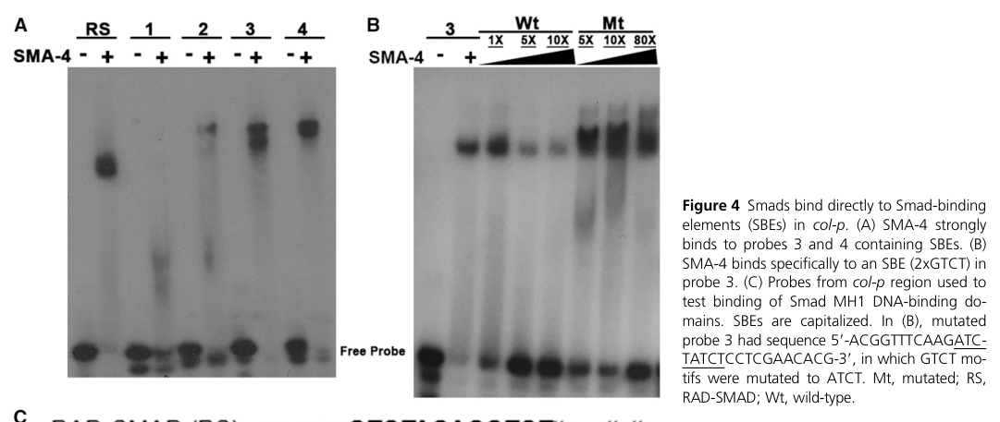

## Question

# Gene Research for Functional Annotation

## ⚠️ CRITICAL: Gene/Protein Identification Context

**BEFORE YOU BEGIN RESEARCH:** You MUST verify you are researching the CORRECT gene/protein. Gene symbols can be ambiguous, especially for less well-characterized genes from non-model organisms.

### Target Gene/Protein Identity (from UniProt):
- **UniProt Accession:** P45896
- **Protein Description:** RecName: Full=Dwarfin sma-3; AltName: Full=MAD protein homolog 2;
- **Gene Information:** Name=sma-3 {ECO:0000312|WormBase:R13F6.9}; Synonyms=cem-2 {ECO:0000303|PubMed:7768443}; ORFNames=R13F6.9 {ECO:0000312|WormBase:R13F6.9};
- **Organism (full):** Caenorhabditis elegans.
- **Protein Family:** Belongs to the dwarfin/SMAD family. .
- **Key Domains:** MAD_homology1_Dwarfin-type. (IPR003619); MAD_homology_MH1. (IPR013019); SMAD-like_dom_sf. (IPR017855); SMAD/Dwarfins. (IPR013790); SMAD_dom. (IPR001132)

### MANDATORY VERIFICATION STEPS:

1. **Check if the gene symbol "sma-3" matches the protein description above**
2. **Verify the organism is correct:** Caenorhabditis elegans.
3. **Check if protein family/domains align with what you find in literature**
4. **If you find literature for a DIFFERENT gene with the same or similar symbol, STOP**

### If Gene Symbol is Ambiguous or You Cannot Find Relevant Literature:

**DO NOT PROCEED WITH RESEARCH ON A DIFFERENT GENE.** Instead:
- State clearly: "The gene symbol 'sma-3' is ambiguous or literature is limited for this specific protein"
- Explain what you found (e.g., "Found extensive literature on a different gene with the same symbol in a different organism")
- Describe the protein based ONLY on the UniProt information provided above
- Suggest that the protein function can be inferred from domain/family information

### Research Target:

Please provide a comprehensive research report on the gene **sma-3** (gene ID: sma-3, UniProt: P45896) in worm.

The research report should be a detailed narrative explaining the function, biological processes, and localization of the gene product. Citations should be given for all claims.

You should prioritize authoritative reviews and primary scientific literature when conducting research. You can supplement
this with annotations you find in gene/protein databases, but these can be outdated or inaccurate.

We are specifically interested in the primary function of the gene - for enzymes, what reaction is catalyzed, and what is the substrate specificity? For transporters, what is the substrate? For structural proteins or adapters, what is the broader structural role? For signaling molecules, what is the role in the pathway.

We are interested in where in or outside the cell the gene product carries out its function.

We are also interested in the signaling or biochemical pathways in which the gene functions. We are less interested in broad pleiotropic effects, except where these elucidate the precise role.

Include evidence where possible. We are interested in both experimental evidence as well as inference from structure, evolution, or bioinformatic analysis. Precise studies should be prioritized over high-throughput, where available.

## Output

Question: You are an expert researcher providing comprehensive, well-cited information.

Provide detailed information focusing on:
1. Key concepts and definitions with current understanding
2. Recent developments and latest research (prioritize 2023-2024 sources)
3. Current applications and real-world implementations
4. Expert opinions and analysis from authoritative sources
5. Relevant statistics and data from recent studies

Format as a comprehensive research report with proper citations. Include URLs and publication dates where available.
Always prioritize recent, authoritative sources and provide specific citations for all major claims.

# Gene Research for Functional Annotation

## ⚠️ CRITICAL: Gene/Protein Identification Context

**BEFORE YOU BEGIN RESEARCH:** You MUST verify you are researching the CORRECT gene/protein. Gene symbols can be ambiguous, especially for less well-characterized genes from non-model organisms.

### Target Gene/Protein Identity (from UniProt):
- **UniProt Accession:** P45896
- **Protein Description:** RecName: Full=Dwarfin sma-3; AltName: Full=MAD protein homolog 2;
- **Gene Information:** Name=sma-3 {ECO:0000312|WormBase:R13F6.9}; Synonyms=cem-2 {ECO:0000303|PubMed:7768443}; ORFNames=R13F6.9 {ECO:0000312|WormBase:R13F6.9};
- **Organism (full):** Caenorhabditis elegans.
- **Protein Family:** Belongs to the dwarfin/SMAD family. .
- **Key Domains:** MAD_homology1_Dwarfin-type. (IPR003619); MAD_homology_MH1. (IPR013019); SMAD-like_dom_sf. (IPR017855); SMAD/Dwarfins. (IPR013790); SMAD_dom. (IPR001132)

### MANDATORY VERIFICATION STEPS:

1. **Check if the gene symbol "sma-3" matches the protein description above**
2. **Verify the organism is correct:** Caenorhabditis elegans.
3. **Check if protein family/domains align with what you find in literature**
4. **If you find literature for a DIFFERENT gene with the same or similar symbol, STOP**

### If Gene Symbol is Ambiguous or You Cannot Find Relevant Literature:

**DO NOT PROCEED WITH RESEARCH ON A DIFFERENT GENE.** Instead:
- State clearly: "The gene symbol 'sma-3' is ambiguous or literature is limited for this specific protein"
- Explain what you found (e.g., "Found extensive literature on a different gene with the same symbol in a different organism")
- Describe the protein based ONLY on the UniProt information provided above
- Suggest that the protein function can be inferred from domain/family information

### Research Target:

Please provide a comprehensive research report on the gene **sma-3** (gene ID: sma-3, UniProt: P45896) in worm.

The research report should be a detailed narrative explaining the function, biological processes, and localization of the gene product. Citations should be given for all claims.

You should prioritize authoritative reviews and primary scientific literature when conducting research. You can supplement
this with annotations you find in gene/protein databases, but these can be outdated or inaccurate.

We are specifically interested in the primary function of the gene - for enzymes, what reaction is catalyzed, and what is the substrate specificity? For transporters, what is the substrate? For structural proteins or adapters, what is the broader structural role? For signaling molecules, what is the role in the pathway.

We are interested in where in or outside the cell the gene product carries out its function.

We are also interested in the signaling or biochemical pathways in which the gene functions. We are less interested in broad pleiotropic effects, except where these elucidate the precise role.

Include evidence where possible. We are interested in both experimental evidence as well as inference from structure, evolution, or bioinformatic analysis. Precise studies should be prioritized over high-throughput, where available.

# Functional annotation of *Caenorhabditis elegans sma-3*

## Identity and principal function

**Identity check.** The supplied UniProt record identifies P45896 as *C. elegans* SMA-3, encoded by *sma-3* (ORF R13F6.9; synonym *cem-2*). This assignment is consistent with worm genetic and biochemical studies of SMA-3 as a dwarfin/SMAD-family protein with Mad-homology domains. The accession-to-ORF correspondence is supplied by the question rather than independently established by the retrieved papers; none of the evidence below concerns human SMAD3 or another organism’s similarly named protein. (wang2005cterminalmutantsof pages 3-4, savagedunn2017thetgfβfamily pages 2-4)

**Primary annotation:** SMA-3 is an **intracellular receptor-regulated Smad (R-Smad)** that conveys BMP-like TGF-β-family signals to gene-regulatory machinery. Its best-established pathway is **DBL-1 ligand → DAF-4 type-II and SMA-6 type-I receptors → R-Smads SMA-2 and SMA-3, with co-Smad SMA-4 → context-dependent transcriptional responses**. SMA-3 is neither the extracellular ligand nor a receptor kinase, enzyme, transporter, or cuticle structural protein; its principal role is signal-dependent transcriptional regulation. The separate DAF-7/dauer pathway shares DAF-4 but primarily uses DAF-1 and the DAF-8/DAF-14 Smads, not SMA-3. (savagedunn2017thetgfβfamily pages 2-4, ciccarelli2024tgfβligandcrosssubfamily pages 6-7)

The table summarizes where SMA-3 acts and separates its molecular activity from downstream organismal effects.

| Biological context | SMA-3 molecular/site of action | Decisive direct evidence | Interpretive limit | Primary citations |
|---|---|---|---|---|
| Canonical DBL-1/BMP growth signaling and cuticle regulation | Intracellular R-Smad in epidermal/hypodermal cells; functions in the DBL-1 → SMA-6/DAF-4 → SMA-2/SMA-3/SMA-4 transcriptional module. Downstream extracellular effect is altered cuticle composition and body growth. | Functional GFP::SMA-3 ChIP-seq showed occupancy at the *col-141/col-142* intergenic region. Its Smad-binding elements were required for hypodermal reporter expression. EMSA demonstrated sequence-specific binding of **SMA-4 MH1**, not SMA-3 MH1, to tested GTCT-containing probes. | SMA-3 ChIP occupancy can be direct or mediated by a protein complex; the promoter EMSA did **not** demonstrate SMA-3 MH1 binding. Expression effects were stage dependent, and occupancy alone does not prove productive transcriptional activation. | (madaan2018bmpsignalingdetermines pages 5-7, madaan2018bmpsignalingdetermines media 900fc775) |
| Male-spicule morphogenesis | Nuclear SMA-3 engages tissue-specific transcriptional cofactors; LIN-31 is a forkhead partner implicated particularly in spicule development. | Yeast two-hybrid assays detected SMA-3–LIN-31 interaction through both MH1 and MH2 regions. A phosphomimetic SMA-3 variant interacted more strongly and a nonphosphorylatable variant more weakly; *lin-31* and *sma-3* mutants share crumpled-spicule phenotypes. | Yeast interaction does not establish complex stoichiometry or binding at endogenous target loci. LIN-31 is not required for every SMA-3 output because *lin-31* mutants lack the characteristic small-body and sensory-ray defects. | (wang2005cterminalmutantsof pages 6-7) |
| Epidermal antifungal response to *Drechmeria coniospora* | Noncanonical SMA-3-dependent signaling in the epidermal immune response; neuronal DBL-1 and epidermal receptor signaling regulate antimicrobial *cnc* expression. | Infection induced epidermal *cnc-2* reporter expression; genetic tests found SMA-3 required while SMA-2 and SMA-4 were dispensable, supporting R-Smad action without the usual R-Smad/Co-Smad partners. Tissue-directed constructs tested neuronal DBL-1 and epidermal SMA-6 activity. | The pathway is “noncanonical” specifically with respect to Smad composition; the evidence does not show that SMA-3 directly binds the *cnc-2* promoter. Some tissue-source conclusions rely on transgenic rescue and reporter assays. | (yamamoto2023tgfβpathwaysin pages 5-7, zugasti2009neuroimmuneregulationof pages 11-16) |
| Antibacterial response to *Photorhabdus luminescens* (2024) | Intracellular SMA-3 activity in pharyngeal muscle coordinates local pumping and systemic antimicrobial responses; induced CNC-2 can act in the epidermis, outside SMA-3’s experimentally rescued pharyngeal site. | *sma-3* mutants had impaired pathogen survival and pumping. Pharynx-specific *sma-3* expression improved survival, restored pumping, and restored infection-induced *abf-2* and *cnc-2* transcripts; intestine-specific expression did not improve survival. Controls induced both transcripts after 24 h, whereas *dbl-1* and *sma-3* mutants did not. | Tissue rescue establishes sufficiency, not exclusive necessity. Multicopy transgenes can overexpress SMA-3. qRT-PCR demonstrates transcript regulation but not direct SMA-3 binding to *abf-2* or *cnc-2*; survival can also be influenced by altered feeding mechanics. | (ciccarelli2024bmpsignalingto pages 1-6, ciccarelli2024bmpsignalingto pages 10-16, ciccarelli2024bmpsignalingto pages 16-20) |
| Genome-wide transcription and collagen secretion (2025 manuscript) | Nuclear SMA-3 chromatin occupancy in L2 larvae regulates hypodermal ER/secretory-pathway genes; the downstream extracellular consequence is collagen delivery into the cuticle. | ChIP-seq identified 4,205 SMA-3 peaks; integrated ChIP-seq/RNA-seq BETA analysis inferred 367 direct targets, all downregulated in *sma-3* mutants. SMA-3-regulated *dpy-11* depletion disrupted ROL-6 collagen deposition, while *sma-3* mutants accumulated ROL-6 in the hypodermal ER and showed depleted cuticular patches. | BETA targets are computationally inferred from occupancy and expression, not individually validated direct targets. Peak overlap does not prove a physical SMA-3/SMA-9 complex. The retrieved manuscript bears bioRxiv preprint headers, so these later conclusions should be treated as provisional pending definitive publication-status verification. | (vora2025genomewideanalysisof pages 5-8, vora2025genomewideanalysisof pages 14-18) |

*Table: Evidence matrix separating SMA-3’s intracellular sites of action from downstream extracellular effects across growth, morphogenesis, and immunity. It also distinguishes direct assays from inference and flags the provisional status of the 2025 genome-wide findings.*

## Molecular mechanism and subcellular location

The Smad-family **MH1 domain** provides DNA-binding capacity and a probable nuclear-localization determinant, whereas **MH2** supports protein interactions; the domains are separated by a linker. SMA-3 has a variant C-terminal **SMT** motif associated with R-Smad activation. Receptor-dependent phosphorylation and Smad-complex assembly are the established mechanistic framework, but the experiments described below establish the importance of SMA-3’s C terminus for signaling output more directly than they measure phosphorylation of each residue in vivo. (savagedunn2017thetgfβfamily pages 2-4, wang2005cterminalmutantsof pages 3-4, wang2005cterminalmutantsof pages 6-7)

SMA-3 acts **inside responsive cells, particularly in the nucleus**, rather than in the extracellular cuticle. A *sma-3* translational GFP reporter was observed in both nuclei and cytoplasm of epidermal/hypodermal and intestinal cells and pharyngeal muscle and marginal cells. Nuclear accumulation is not by itself a readout of pathway activation: experimentally altered C-terminal SMA-3 proteins remained nuclear even when they failed to restore normal growth. Thus, signaling-dependent transcriptional activity must be distinguished from nuclear presence. (dineen2014tgfβsignalingcan pages 4-5, wang2005cterminalmutantsof pages 2-3, wang2005cterminalmutantsof pages 3-4)

Functional experiments demonstrate why that distinction matters. In one study, 96 hours after egg collection, wild-type animals measured **1.17 ± 0.08 mm**, compared with **0.73 ± 0.04 mm** for *sma-3(wk30)* mutants; a wild-type *sma-3* transgene restored mutant length to **1.19 ± 0.10 mm**. Neither a phosphomimetic SMA-3 variant nor a nonphosphorylatable or C-terminal-deletion variant restored body length, despite nuclear localization of tested mutants. These findings support a requirement for an appropriately regulated SMA-3 C terminus in growth signaling, not simply for constitutive nuclear import. Requirements differ by output: some C-terminal variants retain male-tail functions. (wang2005cterminalmutantsof pages 3-4, wang2005cterminalmutantsof pages 4-5)

Partner selection also gives SMA-3 tissue-specific effects. Yeast two-hybrid assays detected interaction of SMA-3 with **LIN-31**, a forkhead transcription factor implicated particularly in male-spicule morphogenesis. Both SMA-3 MH1 and MH2 fragments interacted; a phosphomimetic SMA-3 variant interacted more strongly and a nonphosphorylatable variant more weakly. This supports activation-state-sensitive cofactor recruitment, although the assay does not by itself prove interaction at an endogenous target promoter. (wang2005cterminalmutantsof pages 6-7)

## Growth control: a nuclear signal with an extracellular consequence

The most securely established developmental output is regulation of body size through the epidermis, which synthesizes and secretes the collagen-rich cuticle. Loss of SMA-3 reduces growth; in an independent study, *sma-3(wk30)* animals were **62 ± 6% of wild-type body length** under the reported assay conditions. The same study found their pharynges were approximately **81 ± 2%** of wild-type length. These measurements and tissue-rescue studies support a substantial epidermal contribution while showing that pharyngeal SMA-3 can contribute to pharynx and body growth. Pharyngeal-muscle plus marginal-cell expression gave partial body-length rescue to **130 ± 16% of nontransgenic mutant siblings**, versus **100 ± 7%** in those siblings; these percentages are *within-mutant rescue comparisons*, not percentages of wild-type length. (dineen2014tgfβsignalingcan pages 2-4, dineen2014tgfβsignalingcan pages 4-5)

A defined molecular link to the cuticle comes from [Madaan and colleagues, *Genetics*, October 2018](https://doi.org/10.1534/genetics.118.301631). Functional GFP-tagged SMA-3 occupied the regulatory region between *col-141* and *col-142* in ChIP-seq experiments. Mutation of conserved Smad-binding elements abolished hypodermal activity of a regulatory reporter; *sma-3* mutation likewise markedly reduced reporter expression. The biochemical detail is important: **SMA-4 MH1**, not SMA-3 MH1, bound the tested GTCT-containing intergenic probes in electrophoretic mobility-shift assays. SMA-3 chromatin occupancy and a requirement for Smad-binding elements therefore support regulation by a Smad-containing complex, **not** demonstrated direct binding of isolated SMA-3 MH1 to those particular probes. *col-41* differed: its expression depended on pathway activity, but no nearby SMA-3 ChIP peak was detected in that analysis. Collagen perturbations had distinct growth effects, consistent with gene- and stage-specific rather than uniform collagen regulation. (madaan2018bmpsignalingdetermines pages 3-5, madaan2018bmpsignalingdetermines pages 5-7, madaan2018bmpsignalingdetermines media 900fc775)

**Later research, interpreted cautiously:** A retrieved 2025 manuscript on SMA-3 and the Schnurri-family transcription factor SMA-9 reports **4,205 SMA-3 ChIP-seq peaks** at larval stage L2 and **367 computationally inferred direct SMA-3 targets** after integration with mutant RNA-seq; all 367 were downregulated in the *sma-3* mutant. It reports **3,101 overlapping SMA-3/SMA-9 peaks**, suggesting frequent proximity without establishing that every overlapping site contains a physical complex. Imaging showed that in *sma-3* mutants tagged ROL-6 collagen accumulated in the **hypodermal endoplasmic reticulum** and was depleted from cuticular regions; perturbation of the SMA-3-regulated secretory factor **DPY-11** similarly disrupted collagen deposition. These data extend the growth model from collagen-gene expression to **collagen processing and secretion**. The retrieved full text bears bioRxiv preprint headers, so its genome-wide target assignments should be treated as inferred and its publication status as unverified here. [Available manuscript DOI](https://doi.org/10.7554/elife.99394.1). (vora2025genomewideanalysisof pages 5-8, vora2025genomewideanalysisof pages 14-18)

## Pathogen responses and pathway specificity: 2023–2024 evidence

SMA-3’s site of action changes with biological context. A [2023 specialist review](https://doi.org/10.3389/fgene.2023.1220068) highlights a **noncanonical epidermal antifungal response**: during *Drechmeria coniospora* infection, SMA-3 is required whereas its usual partners SMA-2 and SMA-4 are dispensable. Foundational infection and reporter experiments linked this response to neuronal DBL-1, epidermal receptor signaling, and induction of epidermal *cnc* antimicrobial genes. “Noncanonical” here means that the normal three-Smad requirement does not apply; it does not establish that SMA-3 binds an antimicrobial-gene promoter directly. (yamamoto2023tgfβpathwaysin pages 5-7, zugasti2009neuroimmuneregulationof pages 11-16)

A [peer-reviewed April 2024 study](https://doi.org/10.1091/mbc.e23-05-0185) located an additional SMA-3-dependent antibacterial response in **pharyngeal muscle**. *sma-3* mutants showed impaired survival after bacterial-pathogen exposure and reduced pharyngeal pumping. Pharynx-restricted *sma-3* expression improved survival and restored pumping, whereas intestinal expression did not improve survival in the tested context. After **24 hours** of exposure to *Photorhabdus luminescens*, control animals induced the antimicrobial transcripts *abf-2* and *cnc-2*, but *dbl-1* and *sma-3* mutants did not; pharyngeal SMA-3 expression restored their induction. A *cnc-2* loss-of-function mutant also survived infection less well. Because *abf-2* is associated with the pharynx and *cnc-2* with the epidermis, the pharyngeal rescue is consistent with both local and intertissue effects. Tissue-specific rescue establishes **sufficiency under the transgene conditions**, not exclusive necessity, and transcript changes do not establish direct SMA-3 promoter binding. The paper also notes possible overexpression and imperfect tissue restriction in some transgenic lines. (ciccarelli2024bmpsignalingto pages 6-10, ciccarelli2024bmpsignalingto pages 10-16, ciccarelli2024bmpsignalingto pages 16-20)

A second study, [*PLOS Genetics*, 14 June 2024](https://doi.org/10.1371/journal.pgen.1011324), refined pathway specificity in *P. luminescens* infection. Mutants of canonical BMP-pathway components **SMA-6, SMA-2, SMA-3 and SMA-4** showed reduced survival, whereas tested DAF-7-branch components had absent or comparatively mild effects. Notably, *sma-3* mutants survived significantly less well than *dbl-1* mutants and shared impaired pumping and survival phenotypes with *tig-2* and *tig-3* mutants. The authors therefore propose that additional ligands may converge on SMA-3 in this context. Non-additive **TIG-2/TIG-3 genetic effects** and a computationally favorable TIG-2/TIG-3 heterodimer model support a hypothesis of cross-subfamily cooperation; **heterodimer formation and direct receptor engagement were not demonstrated biochemically**. These infection-context observations do not reassign SMA-3 to the canonical DAF-7/dauer Smad pathway. (ciccarelli2024tgfβligandcrosssubfamily pages 6-7, ciccarelli2024tgfβligandcrosssubfamily pages 7-10)

## Assessment for functional annotation

The strongest annotation is **BMP-family receptor-regulated, nuclear Smad transcriptional signal transducer**, acting predominantly with SMA-2 and SMA-4 downstream of SMA-6/DAF-4, with a demonstrable SMA-2/SMA-4-independent role in one fungal-response context. Its experimentally supported cellular sites include **hypodermis/epidermis and pharyngeal cells**; its principal established outputs are **cuticle-collagen regulation and body growth**, tissue-specific male-tail development, and pathogen-responsive antimicrobial programs. Cuticular collagen is a **downstream product**, not SMA-3’s location; *abf-2* and *cnc-2* expression are supported downstream effects, not established direct DNA-binding targets of SMA-3. (wang2005cterminalmutantsof pages 6-7, madaan2018bmpsignalingdetermines pages 5-7, dineen2014tgfβsignalingcan pages 4-5, ciccarelli2024bmpsignalingto pages 16-20, yamamoto2023tgfβpathwaysin pages 5-7)

### Principal sources and publication dates

- Savage-Dunn C, Padgett RW. “[The TGF-β Family in *Caenorhabditis elegans*](https://doi.org/10.1101/cshperspect.a022178).” *Cold Spring Harbor Perspectives in Biology* **2017**. Authoritative pathway and domain review. (savagedunn2017thetgfβfamily pages 2-4)
- Yamamoto KK, Savage-Dunn C. “[TGF-β pathways in aging and immunity: lessons from *Caenorhabditis elegans*](https://doi.org/10.3389/fgene.2023.1220068).” *Frontiers in Genetics*, **September 2023**. Current specialist synthesis of context-dependent immunity. (yamamoto2023tgfβpathwaysin pages 5-7)
- Wang J, Mohler WA, Savage-Dunn C. “[C-terminal mutants of *C. elegans* Smads reveal tissue-specific requirements for protein activation by TGF-β signaling](https://doi.org/10.1242/dev.01930).” *Development*, **August 2005**. Functional C-terminal mutations, localization and LIN-31 interaction. (wang2005cterminalmutantsof pages 6-7, wang2005cterminalmutantsof pages 3-4)
- Dineen A, Gaudet J. “[TGF-β signaling can act from multiple tissues to regulate *C. elegans* body size](https://doi.org/10.1186/s12861-014-0043-8).” *BMC Developmental Biology*, **December 2014**. Tissue-rescue and growth measurements. (dineen2014tgfβsignalingcan pages 2-4, dineen2014tgfβsignalingcan pages 4-5)
- Madaan U et al. “[BMP Signaling Determines Body Size via Transcriptional Regulation of Collagen Genes in *Caenorhabditis elegans*](https://doi.org/10.1534/genetics.118.301631).” *Genetics*, **October 2018**. Chromatin occupancy, regulatory reporters and DNA-binding assays. (madaan2018bmpsignalingdetermines pages 5-7, madaan2018bmpsignalingdetermines media 900fc775)
- Ciccarelli EJ et al. “[BMP signaling to pharyngeal muscle in the *C. elegans* response to a bacterial pathogen regulates anti-microbial peptide expression and pharyngeal pumping](https://doi.org/10.1091/mbc.e23-05-0185).” *Molecular Biology of the Cell*, **April 2024**. Tissue-specific antibacterial function. (ciccarelli2024bmpsignalingto pages 1-6, ciccarelli2024bmpsignalingto pages 10-16)
- Ciccarelli EJ et al. “[TGF-β ligand cross-subfamily interactions in the response of *Caenorhabditis elegans* to a bacterial pathogen](https://doi.org/10.1371/journal.pgen.1011324).” *PLOS Genetics*, **14 June 2024**. Genetic pathway specificity and ligand-interaction hypotheses. (ciccarelli2024tgfβligandcrosssubfamily pages 6-7, ciccarelli2024tgfβligandcrosssubfamily pages 7-10)

References

1. (wang2005cterminalmutantsof pages 3-4): Jianjun Wang, William A. Mohler, and Cathy Savage-Dunn. C-terminal mutants of c. elegans smads reveal tissue-specific requirements for protein activation by tgf-β signaling. Development, 132:3505-3513, Aug 2005. URL: https://doi.org/10.1242/dev.01930, doi:10.1242/dev.01930. This article has 20 citations and is from a domain leading peer-reviewed journal.

2. (savagedunn2017thetgfβfamily pages 2-4): Cathy Savage-Dunn and Richard W. Padgett. The tgf-β family in caenorhabditis elegans. Cold Spring Harbor perspectives in biology, 9 6:a022178, Jan 2017. URL: https://doi.org/10.1101/cshperspect.a022178, doi:10.1101/cshperspect.a022178. This article has 96 citations and is from a peer-reviewed journal.

3. (ciccarelli2024tgfβligandcrosssubfamily pages 6-7): Emma Jo Ciccarelli, Zachary Wing, Moshe Bendelstein, Ramandeep Kaur Johal, Gurjot Singh, Ayelet Monas, and Cathy Savage-Dunn. Tgf-β ligand cross-subfamily interactions in the response of caenorhabditis elegans to a bacterial pathogen. PLOS Genetics, 20:e1011324, Jun 2024. URL: https://doi.org/10.1371/journal.pgen.1011324, doi:10.1371/journal.pgen.1011324. This article has 8 citations and is from a domain leading peer-reviewed journal.

4. (madaan2018bmpsignalingdetermines pages 5-7): Uday Madaan, Edlira Yzeiraj, Michael Meade, James F Clark, Christine A Rushlow, and Cathy Savage-Dunn. Bmp signaling determines body size via transcriptional regulation of collagen genes in <i>caenorhabditis elegans</i>. Genetics, 210:1355-1367, Oct 2018. URL: https://doi.org/10.1534/genetics.118.301631, doi:10.1534/genetics.118.301631. This article has 53 citations and is from a domain leading peer-reviewed journal.

5. (madaan2018bmpsignalingdetermines media 900fc775): Uday Madaan, Edlira Yzeiraj, Michael Meade, James F Clark, Christine A Rushlow, and Cathy Savage-Dunn. Bmp signaling determines body size via transcriptional regulation of collagen genes in <i>caenorhabditis elegans</i>. Genetics, 210:1355-1367, Oct 2018. URL: https://doi.org/10.1534/genetics.118.301631, doi:10.1534/genetics.118.301631. This article has 53 citations and is from a domain leading peer-reviewed journal.

6. (wang2005cterminalmutantsof pages 6-7): Jianjun Wang, William A. Mohler, and Cathy Savage-Dunn. C-terminal mutants of c. elegans smads reveal tissue-specific requirements for protein activation by tgf-β signaling. Development, 132:3505-3513, Aug 2005. URL: https://doi.org/10.1242/dev.01930, doi:10.1242/dev.01930. This article has 20 citations and is from a domain leading peer-reviewed journal.

7. (yamamoto2023tgfβpathwaysin pages 5-7): Katerina K. Yamamoto and Cathy Savage-Dunn. Tgf-β pathways in aging and immunity: lessons from caenorhabditis elegans. Frontiers in Genetics, Sep 2023. URL: https://doi.org/10.3389/fgene.2023.1220068, doi:10.3389/fgene.2023.1220068. This article has 23 citations and is from a peer-reviewed journal.

8. (zugasti2009neuroimmuneregulationof pages 11-16): Olivier Zugasti and Jonathan J Ewbank. Neuroimmune regulation of antimicrobial peptide expression by a noncanonical tgf-β signaling pathway in caenorhabditis elegans epidermis. Nature Immunology, 10:249-256, Mar 2009. URL: https://doi.org/10.1038/ni.1700, doi:10.1038/ni.1700. This article has 265 citations and is from a highest quality peer-reviewed journal.

9. (ciccarelli2024bmpsignalingto pages 1-6): Emma Jo Ciccarelli, Moshe Bendelstein, Katerina K. Yamamoto, Hannah Reich, and Cathy Savage-Dunn. Bmp signaling to pharyngeal muscle in the <i>c. elegans</i> response to a bacterial pathogen regulates anti-microbial peptide expression and pharyngeal pumping. Molecular Biology of the Cell, Apr 2024. URL: https://doi.org/10.1091/mbc.e23-05-0185, doi:10.1091/mbc.e23-05-0185. This article has 10 citations and is from a domain leading peer-reviewed journal.

10. (ciccarelli2024bmpsignalingto pages 10-16): Emma Jo Ciccarelli, Moshe Bendelstein, Katerina K. Yamamoto, Hannah Reich, and Cathy Savage-Dunn. Bmp signaling to pharyngeal muscle in the <i>c. elegans</i> response to a bacterial pathogen regulates anti-microbial peptide expression and pharyngeal pumping. Molecular Biology of the Cell, Apr 2024. URL: https://doi.org/10.1091/mbc.e23-05-0185, doi:10.1091/mbc.e23-05-0185. This article has 10 citations and is from a domain leading peer-reviewed journal.

11. (ciccarelli2024bmpsignalingto pages 16-20): Emma Jo Ciccarelli, Moshe Bendelstein, Katerina K. Yamamoto, Hannah Reich, and Cathy Savage-Dunn. Bmp signaling to pharyngeal muscle in the <i>c. elegans</i> response to a bacterial pathogen regulates anti-microbial peptide expression and pharyngeal pumping. Molecular Biology of the Cell, Apr 2024. URL: https://doi.org/10.1091/mbc.e23-05-0185, doi:10.1091/mbc.e23-05-0185. This article has 10 citations and is from a domain leading peer-reviewed journal.

12. (vora2025genomewideanalysisof pages 5-8): Mehul M. Vora, Jonathan Dietz, Zachary Wing, Karen George, Jun Liu, Christopher Rongo, and C. Savage-Dunn. Genome-wide analysis of smad and schnurri transcription factors in c. elegans demonstrates widespread interaction and a function in collagen secretion. ArXiv, Aug 2025. URL: https://doi.org/10.7554/elife.99394.1, doi:10.7554/elife.99394.1. This article has 6 citations.

13. (vora2025genomewideanalysisof pages 14-18): Mehul M. Vora, Jonathan Dietz, Zachary Wing, Karen George, Jun Liu, Christopher Rongo, and C. Savage-Dunn. Genome-wide analysis of smad and schnurri transcription factors in c. elegans demonstrates widespread interaction and a function in collagen secretion. ArXiv, Aug 2025. URL: https://doi.org/10.7554/elife.99394.1, doi:10.7554/elife.99394.1. This article has 6 citations.

14. (dineen2014tgfβsignalingcan pages 4-5): Aidan Dineen and Jeb Gaudet. Tgf-β signaling can act from multiple tissues to regulate c. elegans body size. BMC Developmental Biology, Dec 2014. URL: https://doi.org/10.1186/s12861-014-0043-8, doi:10.1186/s12861-014-0043-8. This article has 25 citations and is from a peer-reviewed journal.

15. (wang2005cterminalmutantsof pages 2-3): Jianjun Wang, William A. Mohler, and Cathy Savage-Dunn. C-terminal mutants of c. elegans smads reveal tissue-specific requirements for protein activation by tgf-β signaling. Development, 132:3505-3513, Aug 2005. URL: https://doi.org/10.1242/dev.01930, doi:10.1242/dev.01930. This article has 20 citations and is from a domain leading peer-reviewed journal.

16. (wang2005cterminalmutantsof pages 4-5): Jianjun Wang, William A. Mohler, and Cathy Savage-Dunn. C-terminal mutants of c. elegans smads reveal tissue-specific requirements for protein activation by tgf-β signaling. Development, 132:3505-3513, Aug 2005. URL: https://doi.org/10.1242/dev.01930, doi:10.1242/dev.01930. This article has 20 citations and is from a domain leading peer-reviewed journal.

17. (dineen2014tgfβsignalingcan pages 2-4): Aidan Dineen and Jeb Gaudet. Tgf-β signaling can act from multiple tissues to regulate c. elegans body size. BMC Developmental Biology, Dec 2014. URL: https://doi.org/10.1186/s12861-014-0043-8, doi:10.1186/s12861-014-0043-8. This article has 25 citations and is from a peer-reviewed journal.

18. (madaan2018bmpsignalingdetermines pages 3-5): Uday Madaan, Edlira Yzeiraj, Michael Meade, James F Clark, Christine A Rushlow, and Cathy Savage-Dunn. Bmp signaling determines body size via transcriptional regulation of collagen genes in <i>caenorhabditis elegans</i>. Genetics, 210:1355-1367, Oct 2018. URL: https://doi.org/10.1534/genetics.118.301631, doi:10.1534/genetics.118.301631. This article has 53 citations and is from a domain leading peer-reviewed journal.

19. (ciccarelli2024bmpsignalingto pages 6-10): Emma Jo Ciccarelli, Moshe Bendelstein, Katerina K. Yamamoto, Hannah Reich, and Cathy Savage-Dunn. Bmp signaling to pharyngeal muscle in the <i>c. elegans</i> response to a bacterial pathogen regulates anti-microbial peptide expression and pharyngeal pumping. Molecular Biology of the Cell, Apr 2024. URL: https://doi.org/10.1091/mbc.e23-05-0185, doi:10.1091/mbc.e23-05-0185. This article has 10 citations and is from a domain leading peer-reviewed journal.

20. (ciccarelli2024tgfβligandcrosssubfamily pages 7-10): Emma Jo Ciccarelli, Zachary Wing, Moshe Bendelstein, Ramandeep Kaur Johal, Gurjot Singh, Ayelet Monas, and Cathy Savage-Dunn. Tgf-β ligand cross-subfamily interactions in the response of caenorhabditis elegans to a bacterial pathogen. PLOS Genetics, 20:e1011324, Jun 2024. URL: https://doi.org/10.1371/journal.pgen.1011324, doi:10.1371/journal.pgen.1011324. This article has 8 citations and is from a domain leading peer-reviewed journal.

## Artifacts

- [Edison artifact artifact-00](sma-3-deep-research-falcon_artifacts/artifact-00.md)

## Citations

1. wang2005cterminalmutantsof pages 6-7
2. wang2005cterminalmutantsof pages 3-4
3. madaan2018bmpsignalingdetermines pages 5-7
4. zugasti2009neuroimmuneregulationof pages 11-16
5. ciccarelli2024bmpsignalingto pages 1-6
6. ciccarelli2024bmpsignalingto pages 10-16
7. ciccarelli2024bmpsignalingto pages 16-20
8. vora2025genomewideanalysisof pages 5-8
9. vora2025genomewideanalysisof pages 14-18
10. wang2005cterminalmutantsof pages 2-3
11. wang2005cterminalmutantsof pages 4-5
12. madaan2018bmpsignalingdetermines pages 3-5
13. ciccarelli2024bmpsignalingto pages 6-10
14. Madaan and colleagues, *Genetics*, October 2018
15. Available manuscript DOI
16. 2023 specialist review
17. peer-reviewed April 2024 study
18. *PLOS Genetics*, 14 June 2024
19. The TGF-β Family in *Caenorhabditis elegans*
20. TGF-β pathways in aging and immunity: lessons from *Caenorhabditis elegans*
21. C-terminal mutants of *C. elegans* Smads reveal tissue-specific requirements for protein activation by TGF-β signaling
22. TGF-β signaling can act from multiple tissues to regulate *C. elegans* body size
23. BMP Signaling Determines Body Size via Transcriptional Regulation of Collagen Genes in *Caenorhabditis elegans*
24. BMP signaling to pharyngeal muscle in the *C. elegans* response to a bacterial pathogen regulates anti-microbial peptide expression and pharyngeal pumping
25. TGF-β ligand cross-subfamily interactions in the response of *Caenorhabditis elegans* to a bacterial pathogen
26. https://doi.org/10.1534/genetics.118.301631
27. https://doi.org/10.7554/elife.99394.1
28. https://doi.org/10.3389/fgene.2023.1220068
29. https://doi.org/10.1091/mbc.e23-05-0185
30. https://doi.org/10.1371/journal.pgen.1011324
31. https://doi.org/10.1101/cshperspect.a022178
32. https://doi.org/10.1242/dev.01930
33. https://doi.org/10.1186/s12861-014-0043-8
34. https://doi.org/10.1242/dev.01930,
35. https://doi.org/10.1101/cshperspect.a022178,
36. https://doi.org/10.1371/journal.pgen.1011324,
37. https://doi.org/10.1534/genetics.118.301631,
38. https://doi.org/10.3389/fgene.2023.1220068,
39. https://doi.org/10.1038/ni.1700,
40. https://doi.org/10.1091/mbc.e23-05-0185,
41. https://doi.org/10.7554/elife.99394.1,
42. https://doi.org/10.1186/s12861-014-0043-8,