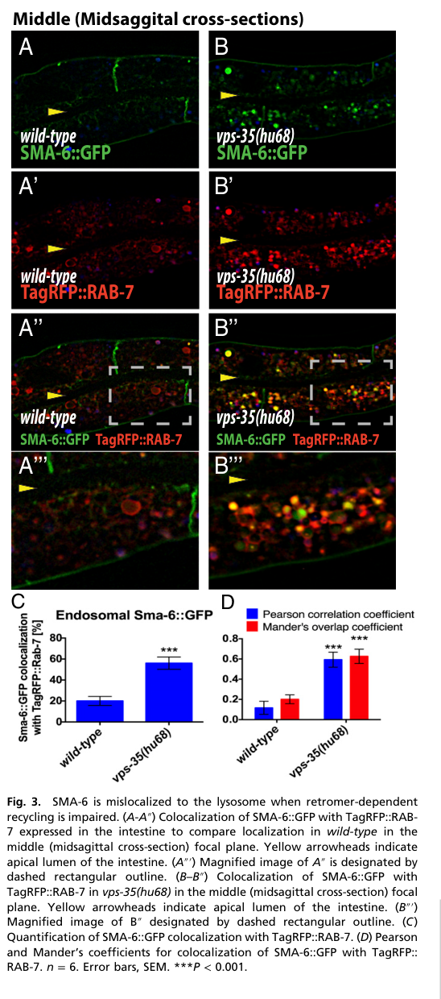

## Question

# Gene Research for Functional Annotation

## ⚠️ CRITICAL: Gene/Protein Identification Context

**BEFORE YOU BEGIN RESEARCH:** You MUST verify you are researching the CORRECT gene/protein. Gene symbols can be ambiguous, especially for less well-characterized genes from non-model organisms.

### Target Gene/Protein Identity (from UniProt):
- **UniProt Accession:** Q09488
- **Protein Description:** RecName: Full=Serine/threonine-protein kinase receptor sma-6 {ECO:0000305}; EC=2.7.11.30; Flags: Precursor;
- **Gene Information:** Name=sma-6; ORFNames=C32D5.2;
- **Organism (full):** Caenorhabditis elegans.
- **Protein Family:** Belongs to the protein kinase superfamily. TKL Ser/Thr
- **Key Domains:** GS_dom. (IPR003605); Kinase-like_dom_sf. (IPR011009); Prot_kinase_dom. (IPR000719); Protein_kinase_ATP_BS. (IPR017441); Ser/Thr_kinase_AS. (IPR008271)

### MANDATORY VERIFICATION STEPS:

1. **Check if the gene symbol "sma-6" matches the protein description above**
2. **Verify the organism is correct:** Caenorhabditis elegans.
3. **Check if protein family/domains align with what you find in literature**
4. **If you find literature for a DIFFERENT gene with the same or similar symbol, STOP**

### If Gene Symbol is Ambiguous or You Cannot Find Relevant Literature:

**DO NOT PROCEED WITH RESEARCH ON A DIFFERENT GENE.** Instead:
- State clearly: "The gene symbol 'sma-6' is ambiguous or literature is limited for this specific protein"
- Explain what you found (e.g., "Found extensive literature on a different gene with the same symbol in a different organism")
- Describe the protein based ONLY on the UniProt information provided above
- Suggest that the protein function can be inferred from domain/family information

### Research Target:

Please provide a comprehensive research report on the gene **sma-6** (gene ID: sma-6, UniProt: Q09488) in worm.

The research report should be a detailed narrative explaining the function, biological processes, and localization of the gene product. Citations should be given for all claims.

You should prioritize authoritative reviews and primary scientific literature when conducting research. You can supplement
this with annotations you find in gene/protein databases, but these can be outdated or inaccurate.

We are specifically interested in the primary function of the gene - for enzymes, what reaction is catalyzed, and what is the substrate specificity? For transporters, what is the substrate? For structural proteins or adapters, what is the broader structural role? For signaling molecules, what is the role in the pathway.

We are interested in where in or outside the cell the gene product carries out its function.

We are also interested in the signaling or biochemical pathways in which the gene functions. We are less interested in broad pleiotropic effects, except where these elucidate the precise role.

Include evidence where possible. We are interested in both experimental evidence as well as inference from structure, evolution, or bioinformatic analysis. Precise studies should be prioritized over high-throughput, where available.

## Output

Question: You are an expert researcher providing comprehensive, well-cited information.

Provide detailed information focusing on:
1. Key concepts and definitions with current understanding
2. Recent developments and latest research (prioritize 2023-2024 sources)
3. Current applications and real-world implementations
4. Expert opinions and analysis from authoritative sources
5. Relevant statistics and data from recent studies

Format as a comprehensive research report with proper citations. Include URLs and publication dates where available.
Always prioritize recent, authoritative sources and provide specific citations for all major claims.

# Gene Research for Functional Annotation

## ⚠️ CRITICAL: Gene/Protein Identification Context

**BEFORE YOU BEGIN RESEARCH:** You MUST verify you are researching the CORRECT gene/protein. Gene symbols can be ambiguous, especially for less well-characterized genes from non-model organisms.

### Target Gene/Protein Identity (from UniProt):
- **UniProt Accession:** Q09488
- **Protein Description:** RecName: Full=Serine/threonine-protein kinase receptor sma-6 {ECO:0000305}; EC=2.7.11.30; Flags: Precursor;
- **Gene Information:** Name=sma-6; ORFNames=C32D5.2;
- **Organism (full):** Caenorhabditis elegans.
- **Protein Family:** Belongs to the protein kinase superfamily. TKL Ser/Thr
- **Key Domains:** GS_dom. (IPR003605); Kinase-like_dom_sf. (IPR011009); Prot_kinase_dom. (IPR000719); Protein_kinase_ATP_BS. (IPR017441); Ser/Thr_kinase_AS. (IPR008271)

### MANDATORY VERIFICATION STEPS:

1. **Check if the gene symbol "sma-6" matches the protein description above**
2. **Verify the organism is correct:** Caenorhabditis elegans.
3. **Check if protein family/domains align with what you find in literature**
4. **If you find literature for a DIFFERENT gene with the same or similar symbol, STOP**

### If Gene Symbol is Ambiguous or You Cannot Find Relevant Literature:

**DO NOT PROCEED WITH RESEARCH ON A DIFFERENT GENE.** Instead:
- State clearly: "The gene symbol 'sma-6' is ambiguous or literature is limited for this specific protein"
- Explain what you found (e.g., "Found extensive literature on a different gene with the same symbol in a different organism")
- Describe the protein based ONLY on the UniProt information provided above
- Suggest that the protein function can be inferred from domain/family information

### Research Target:

Please provide a comprehensive research report on the gene **sma-6** (gene ID: sma-6, UniProt: Q09488) in worm.

The research report should be a detailed narrative explaining the function, biological processes, and localization of the gene product. Citations should be given for all claims.

You should prioritize authoritative reviews and primary scientific literature when conducting research. You can supplement
this with annotations you find in gene/protein databases, but these can be outdated or inaccurate.

We are specifically interested in the primary function of the gene - for enzymes, what reaction is catalyzed, and what is the substrate specificity? For transporters, what is the substrate? For structural proteins or adapters, what is the broader structural role? For signaling molecules, what is the role in the pathway.

We are interested in where in or outside the cell the gene product carries out its function.

We are also interested in the signaling or biochemical pathways in which the gene functions. We are less interested in broad pleiotropic effects, except where these elucidate the precise role.

Include evidence where possible. We are interested in both experimental evidence as well as inference from structure, evolution, or bioinformatic analysis. Precise studies should be prioritized over high-throughput, where available.

# Functional annotation of *Caenorhabditis elegans sma-6* (UniProt Q09488)

## Identity and principal function

**Identity check.** The supplied UniProt record identifies Q09488 as SMA-6, encoded by *sma-6* (ORF C32D5.2) in *C. elegans*. Independent worm literature consistently identifies SMA-6 as the **type I receptor for the DBL-1/BMP-like Sma/Mab signaling pathway**. It is not DAF-1, the type I receptor of the DAF-7/dauer pathway, or DAF-4, the type II receptor shared by both pathways. The retrieved papers verify the protein’s organism, name, receptor class and pathway; the Q09488–C32D5.2 accession mapping and individual domain identifiers are supplied by the query rather than independently established in those papers. (savagedunn2017thetgfβfamily pages 2-4, ciccarelli2024tgfβligandcrosssubfamily pages 6-7)

SMA-6 is a transmembrane **serine/threonine receptor kinase** that converts an extracellular BMP-family signal into intracellular Smad-dependent transcription. Its supplied GS-domain and protein-kinase/ATP-binding annotations fit the established type I TGF-β-family receptor architecture: a ligand-facing extracellular portion, membrane-spanning region and cytoplasmic kinase machinery. **Substrate specificity is primarily signaling-protein specificity, not metabolism of a soluble small molecule.** In the accepted pathway model, DBL-1 engages a receptor complex containing SMA-6 and DAF-4; type II receptor activity phosphorylates the type I receptor’s GS region, after which activated SMA-6 transfers phosphate from ATP to carboxy-terminal serines of receptor-regulated Smads **SMA-2 and SMA-3**. These cooperate with the co-Smad **SMA-4** to regulate transcription. Two type I and two type II subunits are depicted in the canonical receptor-complex model. The general phosphorylation sequence and Smad-phosphosite requirement are strongly supported by receptor-family conservation and *in vivo* mutagenesis, but the retrieved worm experiments do **not** constitute a purified-SMA-6/ATP/SMA-2-or-SMA-3 kinase assay or establish precise residue-by-residue catalytic preferences. SMA-4 is a transcriptional partner, not an established direct SMA-6 phosphorylation substrate. (gumienny2013tgfβsignalingin pages 3-5, wang2005cterminalmutantsof pages 1-2, wang2005cterminalmutantsof pages 5-6)

## Where SMA-6 acts

The receptor receives extracellular ligand at the **basolateral plasma membrane of responding epithelial cells**, rather than functioning as a soluble secreted protein or nuclear transcription factor. Functional, low-copy SMA-6::GFP was observed at that membrane and in intracellular endosomal puncta in intestinal epithelial cells. *sma-6* expression and pathway activity have also been documented in the hypodermis, pharynx and intestine; the hypodermis is a major receiving tissue for growth control, whereas DBL-1 is produced predominantly by neurons in the head and nerve cords. A hypodermal SMA-6::GFP construct rescued the *sma-6* body-size defect in a trafficking study. Experiments demonstrating partial body-length rescue by **pharyngeal SMA-3**, or rescue by tissue-directed **DAF-4**, support broader tissue participation but should not be misreported as direct pharyngeal *sma-6* rescue. (gleason2014bmpsignalingrequires pages 2-3, savagedunn2001targetsoftgfβrelated pages 4-6, gumienny2013tgfβsignalingin pages 8-10, dineen2014tgfβsignalingcan pages 1-2, dineen2014tgfβsignalingcan pages 9-10)

Subcellular trafficking is mechanistically important. AP-2 adaptor components DPY-23 and APA-2 are required for SMA-6 internalization: depleting them traps GFP-tagged receptor on the intestinal basolateral membrane **while reducing pathway signaling**. Uptake can occur without DBL-1, so receptor internalization is not simply a consequence of ligand binding. After uptake, the SMA-6 intracellular domain binds the VPS35/VPS26/VPS29 **retromer** complex directly, permitting recycling rather than lysosomal destruction. In *vps-35* mutants, SMA-6 overlap with the RAB-7 late-endosome/lysosome marker rises from **20% to 56%** (*n* = 6 imaging samples), with receptor missorting, degradation and reduced signaling. Blocking endocytosis prevents that loss; inhibiting lysosomal function traps receptor in late endosomal/lysosomal compartments. The type II partner DAF-4 follows a distinct, retromer-independent **ARF-6-dependent** route. Thus, localization at the surface alone is not sufficient: productive endocytic uptake and receptor recycling help sustain signaling. (gleason2014bmpsignalingrequires pages 2-3, gleason2014bmpsignalingrequires pages 4-5, gleason2014bmpsignalingrequires pages 5-6, gleason2014bmpsignalingrequires media 1791a658)

Receptor-proximal regulation has additional direct support. SMA-10/LRIG co-immunoprecipitates with SMA-6 and DAF-4 in a heterologous-cell assay and promotes BMP-pathway output, placing it near the ligand–receptor interaction rather than downstream in the nucleus. This shows receptor association, **not** a measured increase in purified SMA-6 kinase activity. (gumienny2010caenorhabditiseleganssma10lrig pages 4-6, gumienny2010caenorhabditiseleganssma10lrig pages 3-4)

## Biological output and supporting experiments

The best-characterized organismal role of SMA-6 is reception of DBL-1 signals controlling postembryonic body growth and male-tail patterning. Core Sma/Mab-pathway mutants typically reach approximately **60–70% of normal adult length**; this is a pathway-wide estimate, not a measurement uniquely attributable to every *sma-6* allele. Loss-of-pathway males show abnormalities of sensory-ray identity and spicules. The connection from signaling to body size is comparatively precise: in L2 larvae lacking DBL-1-pathway signaling, *col-41* and *rol-6* transcript levels decrease, whereas *col-141* and *col-142* increase. Perturbing these cuticle collagens changes growth; SMA-3 ChIP-seq detects occupation between *col-141* and *col-142*, and SMA-4 binds corresponding Smad-response sequences *in vitro*. These are defined downstream **DBL-1/Smad-pathway** effects, rather than experiments measuring SMA-6’s phosphate transfer directly; regulation also changes with developmental stage. (dineen2014tgfβsignalingcan pages 1-2, wang2005cterminalmutantsof pages 1-2, madaan2018bmpsignalingdetermines pages 3-5, madaan2018bmpsignalingdetermines pages 5-7, madaan2018bmpsignalingdetermines pages 7-9)

Recent experimental findings refine this annotation. In hyp7 epidermis, depletion of the endocytic kinases NEKL-2 or NEKL-3 increased basolateral SMA-6::GFP signal approximately **1.3-fold** or **2.3-fold**, respectively. The result supports impaired membrane uptake or early endocytic processing, **not** a directly measured SMA-6 recycling rate; NEKL-3 depletion also strongly perturbed DAF-4 trafficking. A **2024** pathogen study found consistently reduced survival of *sma-6(wk7)* mutants on *Photorhabdus luminescens*, although statistical significance varied across trials; a reported assay compared **100 mutants with 88 controls**, which are sample sizes, not survival percentages. DAF-7-pathway *daf-1* mutants did not show a significant survival difference in their comparison. Genetic interactions among other ligands, TIG-2 and TIG-3, raise possibilities of signaling cross-talk, but do **not** demonstrate that either binds SMA-6; DBL-1 remains its established canonical ligand context. (joseph2023conservednimakinases pages 5-7, ciccarelli2024tgfβligandcrosssubfamily pages 6-7, ciccarelli2024tgfβligandcrosssubfamily pages 7-10)

The principal quantitative and mechanistic findings are summarized below.

| Finding | Evidence type | Key evidence and numerical facts | Source (publication date; DOI) |
|---|---|---|---|
| **Canonical receptor-kinase role** | Pathway genetics, receptor-family conservation, and in vivo Smad phosphosite mutagenesis | Verified *C. elegans* SMA-6 is the DBL-1/Sma-Mab pathway **type I** receptor; DAF-4 is the shared type II receptor, SMA-2/SMA-3 are R-Smads, and SMA-4 is the co-Smad. The accepted mechanism is ATP-dependent phosphorylation of SMA-2/SMA-3 C-terminal SSXS sites by activated SMA-6 after DAF-4 phosphorylates its GS region. However, the retrieved studies did **not** demonstrate this catalytic assignment with purified SMA-6, ATP, and Smad substrate; it remains a strong inference from conserved receptor architecture and in vivo phosphosite genetics. (savagedunn2017thetgfβfamily pages 2-4, wang2005cterminalmutantsof pages 1-2, wang2005cterminalmutantsof pages 2-3) | Savage-Dunn & Padgett, **June 2017**, [10.1101/cshperspect.a022178](https://doi.org/10.1101/cshperspect.a022178); Wang et al., **August 2005**, [10.1242/dev.01930](https://doi.org/10.1242/dev.01930) |
| **Basolateral localization, uptake, and recycling** | Functional GFP-receptor imaging, RNAi/genetics, colocalization, GST pull-down, and purified-protein binding | Functional SMA-6::GFP localized to the intestinal **basolateral plasma membrane** and endosomal puncta. Loss of AP-2 subunits DPY-23 or APA-2 trapped it at the surface, establishing AP-2/clathrin-dependent uptake. Its intracellular domain bound VPS-35-containing retromer directly. In *vps-35* mutants, SMA-6 overlap with RAB-7 late endosomes/lysosomes increased from **20% to 56%** (*n* = 6), followed by lysosomal degradation; DAF-4 instead used an ARF-6-dependent route. (gleason2014bmpsignalingrequires pages 2-3, gleason2014bmpsignalingrequires pages 4-5, gleason2014bmpsignalingrequires pages 5-6, gleason2014bmpsignalingrequires media 1791a658) | Gleason et al., **18 February 2014**, [10.1073/pnas.1319947111](https://doi.org/10.1073/pnas.1319947111) |
| **Epidermal trafficking regulation** | Auxin-induced kinase depletion and quantitative confocal imaging in hyp7 | SMA-6::GFP fluorescence at lateral/basal epidermal membranes increased approximately **1.3-fold** after NEKL-2 depletion and **2.3-fold** after NEKL-3 depletion, consistent with impaired uptake or early processing. The stronger NEKL-3 phenotype accompanied recycling-endosome abnormalities; these data do not directly measure SMA-6 recycling kinetics. DAF-4 increased approximately **4.8-fold** after NEKL-3 depletion but was unaffected detectably by NEKL-2 depletion. (joseph2023conservednimakinases pages 5-7, joseph2023conservednimakinases pages 7-9) | Joseph et al., **26 April 2023**, [10.1371/journal.pgen.1010741](https://doi.org/10.1371/journal.pgen.1010741) |
| **Bacterial-pathogen survival** | Mutant survival assay with log-rank analysis | On *Photorhabdus luminescens*, *sma-6(wk7)* animals showed consistently reduced survival, although significance varied between trials, supporting a role for canonical BMP-receptor signaling in host defense. The plotted trial contained **100 mutant animals and 88 controls**; these are sample sizes, **not mortality percentages**. DAF-7-pathway receptor *daf-1* did not differ significantly from control in its corresponding assay. (ciccarelli2024tgfβligandcrosssubfamily pages 6-7, ciccarelli2024tgfβligandcrosssubfamily pages 7-10) | Ciccarelli et al., **14 June 2024**, [10.1371/journal.pgen.1011324](https://doi.org/10.1371/journal.pgen.1011324) |
| **Collagen-gene output underlying growth** | qRT-PCR, RNAi/overexpression, SMA-3 ChIP-seq, promoter mutagenesis, and SMA-4 EMSA | At L2, loss of DBL-1-pathway signaling decreased *rol-6* and *col-41* but increased *col-141* and *col-142*. SMA-3 ChIP-seq detected strong occupancy between *col-141* and *col-142*, while SMA-4 MH1 bound conserved GTCT Smad-binding elements by EMSA; mutating relevant elements abolished hypodermal reporter expression. No nearby SMA-3 peak was detected for *col-41*, indicating indirect regulation. These experiments define a downstream DBL-1/Smad output but do not separately assay SMA-6 catalysis. (madaan2018bmpsignalingdetermines pages 3-5, madaan2018bmpsignalingdetermines pages 2-3, madaan2018bmpsignalingdetermines pages 5-7) | Madaan et al., **October 2018**, [10.1534/genetics.118.301631](https://doi.org/10.1534/genetics.118.301631) |

*Table: Experimental evidence supporting the identity, signaling role, localization, trafficking, immune function, and transcriptional outputs of *C. elegans* SMA-6/Q09488. Direct observations are separated from conserved mechanistic inference, and sample sizes are not treated as outcome rates.*

## Assessment and research use

The strongest functional annotation is **DBL-1-responsive, membrane-localized type I BMP receptor kinase that drives SMA-2/SMA-3–SMA-4 transcriptional signaling in responding worm tissues**. The most directly resolved molecular interactions are SMA-6 association with its receptor-proximal regulator SMA-10 and its intracellular binding to retromer; imaging, genetics and Smad-site mutants support the kinase-to-Smad signaling model. Exact worm-specific kinase kinetics, purified direct-substrate measurements and receptor assignment for proposed noncanonical TIG-2/TIG-3 responses remain less firmly established. In practice, *sma-6* mutants, functional fluorescent receptor fusions, RAD-SMAD transcriptional reporters and pathogen-survival assays provide complementary readouts of pathway activity, receptor trafficking and physiological consequences. (gumienny2010caenorhabditiseleganssma10lrig pages 4-6, gleason2014bmpsignalingrequires pages 5-6, wang2005cterminalmutantsof pages 1-2, gleason2014bmpsignalingrequires pages 2-3, ciccarelli2024tgfβligandcrosssubfamily pages 6-7)

**Selected primary sources and authoritative synthesis:** Savage-Dunn & Padgett, *Cold Spring Harbor Perspectives in Biology* (**2017**), https://doi.org/10.1101/cshperspect.a022178; Wang *et al.*, *Development* (**2005**), https://doi.org/10.1242/dev.01930; Gleason *et al.*, *PNAS* (**18 February 2014**), https://doi.org/10.1073/pnas.1319947111; Madaan *et al.*, *Genetics* (**October 2018**), https://doi.org/10.1534/genetics.118.301631; Joseph *et al.*, *PLOS Genetics* (**26 April 2023**), https://doi.org/10.1371/journal.pgen.1010741; Ciccarelli *et al.*, *PLOS Genetics* (**14 June 2024**), https://doi.org/10.1371/journal.pgen.1011324. (savagedunn2017thetgfβfamily pages 2-4, wang2005cterminalmutantsof pages 1-2, gleason2014bmpsignalingrequires pages 4-5, madaan2018bmpsignalingdetermines pages 3-5, joseph2023conservednimakinases pages 5-7, ciccarelli2024tgfβligandcrosssubfamily pages 6-7)

References

1. (savagedunn2017thetgfβfamily pages 2-4): Cathy Savage-Dunn and Richard W. Padgett. The tgf-β family in caenorhabditis elegans. Cold Spring Harbor perspectives in biology, 9 6:a022178, Jan 2017. URL: https://doi.org/10.1101/cshperspect.a022178, doi:10.1101/cshperspect.a022178. This article has 96 citations and is from a peer-reviewed journal.

2. (ciccarelli2024tgfβligandcrosssubfamily pages 6-7): Emma Jo Ciccarelli, Zachary Wing, Moshe Bendelstein, Ramandeep Kaur Johal, Gurjot Singh, Ayelet Monas, and Cathy Savage-Dunn. Tgf-β ligand cross-subfamily interactions in the response of caenorhabditis elegans to a bacterial pathogen. PLOS Genetics, 20:e1011324, Jun 2024. URL: https://doi.org/10.1371/journal.pgen.1011324, doi:10.1371/journal.pgen.1011324. This article has 8 citations and is from a domain leading peer-reviewed journal.

3. (gumienny2013tgfβsignalingin pages 3-5): T. L. Gumienny and C. Savage-Dunn. Tgf-β signaling in c. elegans *. ArXiv, 156:1-34, Jul 2013. URL: https://doi.org/10.1895/wormbook.1.22.2, doi:10.1895/wormbook.1.22.2. This article has 205 citations.

4. (wang2005cterminalmutantsof pages 1-2): Jianjun Wang, William A. Mohler, and Cathy Savage-Dunn. C-terminal mutants of c. elegans smads reveal tissue-specific requirements for protein activation by tgf-β signaling. Development, 132:3505-3513, Aug 2005. URL: https://doi.org/10.1242/dev.01930, doi:10.1242/dev.01930. This article has 20 citations and is from a domain leading peer-reviewed journal.

5. (wang2005cterminalmutantsof pages 5-6): Jianjun Wang, William A. Mohler, and Cathy Savage-Dunn. C-terminal mutants of c. elegans smads reveal tissue-specific requirements for protein activation by tgf-β signaling. Development, 132:3505-3513, Aug 2005. URL: https://doi.org/10.1242/dev.01930, doi:10.1242/dev.01930. This article has 20 citations and is from a domain leading peer-reviewed journal.

6. (gleason2014bmpsignalingrequires pages 2-3): Ryan J. Gleason, Adenrele M. Akintobi, Barth D. Grant, and Richard W. Padgett. Bmp signaling requires retromer-dependent recycling of the type i receptor. Proceedings of the National Academy of Sciences, 111:2578-2583, Feb 2014. URL: https://doi.org/10.1073/pnas.1319947111, doi:10.1073/pnas.1319947111. This article has 98 citations and is from a highest quality peer-reviewed journal.

7. (savagedunn2001targetsoftgfβrelated pages 4-6): Cathy Savage-Dunn. Targets of tgfβ-related signaling in caenorhabditis elegans. Cytokine & Growth Factor Reviews, 12:305-312, Dec 2001. URL: https://doi.org/10.1016/s1359-6101(01)00015-6, doi:10.1016/s1359-6101(01)00015-6. This article has 46 citations and is from a peer-reviewed journal.

8. (gumienny2013tgfβsignalingin pages 8-10): T. L. Gumienny and C. Savage-Dunn. Tgf-β signaling in c. elegans *. ArXiv, 156:1-34, Jul 2013. URL: https://doi.org/10.1895/wormbook.1.22.2, doi:10.1895/wormbook.1.22.2. This article has 205 citations.

9. (dineen2014tgfβsignalingcan pages 1-2): Aidan Dineen and Jeb Gaudet. Tgf-β signaling can act from multiple tissues to regulate c. elegans body size. BMC Developmental Biology, Dec 2014. URL: https://doi.org/10.1186/s12861-014-0043-8, doi:10.1186/s12861-014-0043-8. This article has 25 citations and is from a peer-reviewed journal.

10. (dineen2014tgfβsignalingcan pages 9-10): Aidan Dineen and Jeb Gaudet. Tgf-β signaling can act from multiple tissues to regulate c. elegans body size. BMC Developmental Biology, Dec 2014. URL: https://doi.org/10.1186/s12861-014-0043-8, doi:10.1186/s12861-014-0043-8. This article has 25 citations and is from a peer-reviewed journal.

11. (gleason2014bmpsignalingrequires pages 4-5): Ryan J. Gleason, Adenrele M. Akintobi, Barth D. Grant, and Richard W. Padgett. Bmp signaling requires retromer-dependent recycling of the type i receptor. Proceedings of the National Academy of Sciences, 111:2578-2583, Feb 2014. URL: https://doi.org/10.1073/pnas.1319947111, doi:10.1073/pnas.1319947111. This article has 98 citations and is from a highest quality peer-reviewed journal.

12. (gleason2014bmpsignalingrequires pages 5-6): Ryan J. Gleason, Adenrele M. Akintobi, Barth D. Grant, and Richard W. Padgett. Bmp signaling requires retromer-dependent recycling of the type i receptor. Proceedings of the National Academy of Sciences, 111:2578-2583, Feb 2014. URL: https://doi.org/10.1073/pnas.1319947111, doi:10.1073/pnas.1319947111. This article has 98 citations and is from a highest quality peer-reviewed journal.

13. (gleason2014bmpsignalingrequires media 1791a658): Ryan J. Gleason, Adenrele M. Akintobi, Barth D. Grant, and Richard W. Padgett. Bmp signaling requires retromer-dependent recycling of the type i receptor. Proceedings of the National Academy of Sciences, 111:2578-2583, Feb 2014. URL: https://doi.org/10.1073/pnas.1319947111, doi:10.1073/pnas.1319947111. This article has 98 citations and is from a highest quality peer-reviewed journal.

14. (gumienny2010caenorhabditiseleganssma10lrig pages 4-6): Tina L. Gumienny, Lesley MacNeil, Cole M. Zimmerman, Huang Wang, Lena Chin, Jeffrey L. Wrana, and Richard W. Padgett. Caenorhabditis elegans sma-10/lrig is a conserved transmembrane protein that enhances bone morphogenetic protein signaling. PLoS Genetics, 6:e1000963, May 2010. URL: https://doi.org/10.1371/journal.pgen.1000963, doi:10.1371/journal.pgen.1000963. This article has 61 citations and is from a domain leading peer-reviewed journal.

15. (gumienny2010caenorhabditiseleganssma10lrig pages 3-4): Tina L. Gumienny, Lesley MacNeil, Cole M. Zimmerman, Huang Wang, Lena Chin, Jeffrey L. Wrana, and Richard W. Padgett. Caenorhabditis elegans sma-10/lrig is a conserved transmembrane protein that enhances bone morphogenetic protein signaling. PLoS Genetics, 6:e1000963, May 2010. URL: https://doi.org/10.1371/journal.pgen.1000963, doi:10.1371/journal.pgen.1000963. This article has 61 citations and is from a domain leading peer-reviewed journal.

16. (madaan2018bmpsignalingdetermines pages 3-5): Uday Madaan, Edlira Yzeiraj, Michael Meade, James F Clark, Christine A Rushlow, and Cathy Savage-Dunn. Bmp signaling determines body size via transcriptional regulation of collagen genes in <i>caenorhabditis elegans</i>. Genetics, 210:1355-1367, Oct 2018. URL: https://doi.org/10.1534/genetics.118.301631, doi:10.1534/genetics.118.301631. This article has 53 citations and is from a domain leading peer-reviewed journal.

17. (madaan2018bmpsignalingdetermines pages 5-7): Uday Madaan, Edlira Yzeiraj, Michael Meade, James F Clark, Christine A Rushlow, and Cathy Savage-Dunn. Bmp signaling determines body size via transcriptional regulation of collagen genes in <i>caenorhabditis elegans</i>. Genetics, 210:1355-1367, Oct 2018. URL: https://doi.org/10.1534/genetics.118.301631, doi:10.1534/genetics.118.301631. This article has 53 citations and is from a domain leading peer-reviewed journal.

18. (madaan2018bmpsignalingdetermines pages 7-9): Uday Madaan, Edlira Yzeiraj, Michael Meade, James F Clark, Christine A Rushlow, and Cathy Savage-Dunn. Bmp signaling determines body size via transcriptional regulation of collagen genes in <i>caenorhabditis elegans</i>. Genetics, 210:1355-1367, Oct 2018. URL: https://doi.org/10.1534/genetics.118.301631, doi:10.1534/genetics.118.301631. This article has 53 citations and is from a domain leading peer-reviewed journal.

19. (joseph2023conservednimakinases pages 5-7): Braveen B. Joseph, Naava Naslavsky, Shaonil Binti, Sylvia Conquest, Lexi Robison, Ge Bai, Rafael O. Homer, Barth D. Grant, Steve Caplan, and David S. Fay. Conserved nima kinases regulate multiple steps of endocytic trafficking. PLOS Genetics, 19:e1010741, Apr 2023. URL: https://doi.org/10.1371/journal.pgen.1010741, doi:10.1371/journal.pgen.1010741. This article has 19 citations and is from a domain leading peer-reviewed journal.

20. (ciccarelli2024tgfβligandcrosssubfamily pages 7-10): Emma Jo Ciccarelli, Zachary Wing, Moshe Bendelstein, Ramandeep Kaur Johal, Gurjot Singh, Ayelet Monas, and Cathy Savage-Dunn. Tgf-β ligand cross-subfamily interactions in the response of caenorhabditis elegans to a bacterial pathogen. PLOS Genetics, 20:e1011324, Jun 2024. URL: https://doi.org/10.1371/journal.pgen.1011324, doi:10.1371/journal.pgen.1011324. This article has 8 citations and is from a domain leading peer-reviewed journal.

21. (wang2005cterminalmutantsof pages 2-3): Jianjun Wang, William A. Mohler, and Cathy Savage-Dunn. C-terminal mutants of c. elegans smads reveal tissue-specific requirements for protein activation by tgf-β signaling. Development, 132:3505-3513, Aug 2005. URL: https://doi.org/10.1242/dev.01930, doi:10.1242/dev.01930. This article has 20 citations and is from a domain leading peer-reviewed journal.

22. (joseph2023conservednimakinases pages 7-9): Braveen B. Joseph, Naava Naslavsky, Shaonil Binti, Sylvia Conquest, Lexi Robison, Ge Bai, Rafael O. Homer, Barth D. Grant, Steve Caplan, and David S. Fay. Conserved nima kinases regulate multiple steps of endocytic trafficking. PLOS Genetics, 19:e1010741, Apr 2023. URL: https://doi.org/10.1371/journal.pgen.1010741, doi:10.1371/journal.pgen.1010741. This article has 19 citations and is from a domain leading peer-reviewed journal.

23. (madaan2018bmpsignalingdetermines pages 2-3): Uday Madaan, Edlira Yzeiraj, Michael Meade, James F Clark, Christine A Rushlow, and Cathy Savage-Dunn. Bmp signaling determines body size via transcriptional regulation of collagen genes in <i>caenorhabditis elegans</i>. Genetics, 210:1355-1367, Oct 2018. URL: https://doi.org/10.1534/genetics.118.301631, doi:10.1534/genetics.118.301631. This article has 53 citations and is from a domain leading peer-reviewed journal.

## Artifacts

- [Edison artifact artifact-00](sma-6-deep-research-falcon_artifacts/artifact-00.md)

## Citations

1. wang2005cterminalmutantsof pages 1-2
2. wang2005cterminalmutantsof pages 5-6
3. gleason2014bmpsignalingrequires pages 2-3
4. gleason2014bmpsignalingrequires pages 4-5
5. gleason2014bmpsignalingrequires pages 5-6
6. madaan2018bmpsignalingdetermines pages 3-5
7. madaan2018bmpsignalingdetermines pages 5-7
8. madaan2018bmpsignalingdetermines pages 7-9
9. joseph2023conservednimakinases pages 5-7
10. wang2005cterminalmutantsof pages 2-3
11. joseph2023conservednimakinases pages 7-9
12. madaan2018bmpsignalingdetermines pages 2-3
13. 10.1101/cshperspect.a022178
14. 10.1242/dev.01930
15. 10.1073/pnas.1319947111
16. 10.1371/journal.pgen.1010741
17. 10.1371/journal.pgen.1011324
18. 10.1534/genetics.118.301631
19. https://doi.org/10.1101/cshperspect.a022178
20. https://doi.org/10.1242/dev.01930
21. https://doi.org/10.1073/pnas.1319947111
22. https://doi.org/10.1371/journal.pgen.1010741
23. https://doi.org/10.1371/journal.pgen.1011324
24. https://doi.org/10.1534/genetics.118.301631
25. https://doi.org/10.1101/cshperspect.a022178;
26. https://doi.org/10.1242/dev.01930;
27. https://doi.org/10.1073/pnas.1319947111;
28. https://doi.org/10.1534/genetics.118.301631;
29. https://doi.org/10.1371/journal.pgen.1010741;
30. https://doi.org/10.1371/journal.pgen.1011324.
31. https://doi.org/10.1101/cshperspect.a022178,
32. https://doi.org/10.1371/journal.pgen.1011324,
33. https://doi.org/10.1895/wormbook.1.22.2,
34. https://doi.org/10.1242/dev.01930,
35. https://doi.org/10.1073/pnas.1319947111,
36. https://doi.org/10.1016/s1359-6101(01
37. https://doi.org/10.1186/s12861-014-0043-8,
38. https://doi.org/10.1371/journal.pgen.1000963,
39. https://doi.org/10.1534/genetics.118.301631,
40. https://doi.org/10.1371/journal.pgen.1010741,