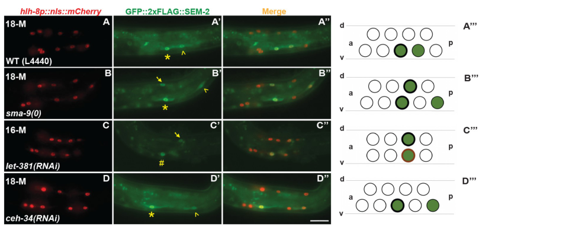

## Question

# Gene Research for Functional Annotation

## ⚠️ CRITICAL: Gene/Protein Identification Context

**BEFORE YOU BEGIN RESEARCH:** You MUST verify you are researching the CORRECT gene/protein. Gene symbols can be ambiguous, especially for less well-characterized genes from non-model organisms.

### Target Gene/Protein Identity (from UniProt):
- **UniProt Accession:** Q7JM44
- **Protein Description:** RecName: Full=Transcription factor sma-9 {ECO:0000305};
- **Gene Information:** Name=sma-9 {ECO:0000312|WormBase:T05A10.1d}; ORFNames=T05A10.1 {ECO:0000312|WormBase:T05A10.1d};
- **Organism (full):** Caenorhabditis elegans.
- **Protein Family:** Not specified in UniProt
- **Key Domains:** Matrin/U1-like-C_Znf_C2H2. (IPR003604); Znf_C2H2_sf. (IPR036236); Znf_C2H2_type. (IPR013087); zf-C2H2 (PF00096); zf-met (PF12874)

### MANDATORY VERIFICATION STEPS:

1. **Check if the gene symbol "sma-9" matches the protein description above**
2. **Verify the organism is correct:** Caenorhabditis elegans.
3. **Check if protein family/domains align with what you find in literature**
4. **If you find literature for a DIFFERENT gene with the same or similar symbol, STOP**

### If Gene Symbol is Ambiguous or You Cannot Find Relevant Literature:

**DO NOT PROCEED WITH RESEARCH ON A DIFFERENT GENE.** Instead:
- State clearly: "The gene symbol 'sma-9' is ambiguous or literature is limited for this specific protein"
- Explain what you found (e.g., "Found extensive literature on a different gene with the same symbol in a different organism")
- Describe the protein based ONLY on the UniProt information provided above
- Suggest that the protein function can be inferred from domain/family information

### Research Target:

Please provide a comprehensive research report on the gene **sma-9** (gene ID: sma-9, UniProt: Q7JM44) in worm.

The research report should be a detailed narrative explaining the function, biological processes, and localization of the gene product. Citations should be given for all claims.

You should prioritize authoritative reviews and primary scientific literature when conducting research. You can supplement
this with annotations you find in gene/protein databases, but these can be outdated or inaccurate.

We are specifically interested in the primary function of the gene - for enzymes, what reaction is catalyzed, and what is the substrate specificity? For transporters, what is the substrate? For structural proteins or adapters, what is the broader structural role? For signaling molecules, what is the role in the pathway.

We are interested in where in or outside the cell the gene product carries out its function.

We are also interested in the signaling or biochemical pathways in which the gene functions. We are less interested in broad pleiotropic effects, except where these elucidate the precise role.

Include evidence where possible. We are interested in both experimental evidence as well as inference from structure, evolution, or bioinformatic analysis. Precise studies should be prioritized over high-throughput, where available.

## Output

Question: You are an expert researcher providing comprehensive, well-cited information.

Provide detailed information focusing on:
1. Key concepts and definitions with current understanding
2. Recent developments and latest research (prioritize 2023-2024 sources)
3. Current applications and real-world implementations
4. Expert opinions and analysis from authoritative sources
5. Relevant statistics and data from recent studies

Format as a comprehensive research report with proper citations. Include URLs and publication dates where available.
Always prioritize recent, authoritative sources and provide specific citations for all major claims.

# Gene Research for Functional Annotation

## ⚠️ CRITICAL: Gene/Protein Identification Context

**BEFORE YOU BEGIN RESEARCH:** You MUST verify you are researching the CORRECT gene/protein. Gene symbols can be ambiguous, especially for less well-characterized genes from non-model organisms.

### Target Gene/Protein Identity (from UniProt):
- **UniProt Accession:** Q7JM44
- **Protein Description:** RecName: Full=Transcription factor sma-9 {ECO:0000305};
- **Gene Information:** Name=sma-9 {ECO:0000312|WormBase:T05A10.1d}; ORFNames=T05A10.1 {ECO:0000312|WormBase:T05A10.1d};
- **Organism (full):** Caenorhabditis elegans.
- **Protein Family:** Not specified in UniProt
- **Key Domains:** Matrin/U1-like-C_Znf_C2H2. (IPR003604); Znf_C2H2_sf. (IPR036236); Znf_C2H2_type. (IPR013087); zf-C2H2 (PF00096); zf-met (PF12874)

### MANDATORY VERIFICATION STEPS:

1. **Check if the gene symbol "sma-9" matches the protein description above**
2. **Verify the organism is correct:** Caenorhabditis elegans.
3. **Check if protein family/domains align with what you find in literature**
4. **If you find literature for a DIFFERENT gene with the same or similar symbol, STOP**

### If Gene Symbol is Ambiguous or You Cannot Find Relevant Literature:

**DO NOT PROCEED WITH RESEARCH ON A DIFFERENT GENE.** Instead:
- State clearly: "The gene symbol 'sma-9' is ambiguous or literature is limited for this specific protein"
- Explain what you found (e.g., "Found extensive literature on a different gene with the same symbol in a different organism")
- Describe the protein based ONLY on the UniProt information provided above
- Suggest that the protein function can be inferred from domain/family information

### Research Target:

Please provide a comprehensive research report on the gene **sma-9** (gene ID: sma-9, UniProt: Q7JM44) in worm.

The research report should be a detailed narrative explaining the function, biological processes, and localization of the gene product. Citations should be given for all claims.

You should prioritize authoritative reviews and primary scientific literature when conducting research. You can supplement
this with annotations you find in gene/protein databases, but these can be outdated or inaccurate.

We are specifically interested in the primary function of the gene - for enzymes, what reaction is catalyzed, and what is the substrate specificity? For transporters, what is the substrate? For structural proteins or adapters, what is the broader structural role? For signaling molecules, what is the role in the pathway.

We are interested in where in or outside the cell the gene product carries out its function.

We are also interested in the signaling or biochemical pathways in which the gene functions. We are less interested in broad pleiotropic effects, except where these elucidate the precise role.

Include evidence where possible. We are interested in both experimental evidence as well as inference from structure, evolution, or bioinformatic analysis. Precise studies should be prioritized over high-throughput, where available.

# Functional annotation of *sma-9* in *Caenorhabditis elegans*

## Identity and principal function

The specified UniProt accession **Q7JM44** identifies the *C. elegans* gene *sma-9* (ORF **T05A10.1**). The literature identifies its product, **SMA-9**, as a Schnurri-related, C2H2 zinc-finger **transcriptional regulator**. It is **not a Smad**: SMA-2, SMA-3 and SMA-4 are the Smad signal transducers with which SMA-9 is studied. The predicted long SMA-9 protein is 2,170 amino acids and has an N-terminal glutamine-rich region and a C-terminal region containing seven zinc fingers, consistent with the supplied UniProt domain annotations. Alternative transcripts can encode different zinc-finger complements. Its primary molecular function is therefore regulation of gene expression—not catalysis, substrate transport, or a structural role in the cuticle. (yin2010alternativetranssplicingof pages 1-2, gumienny2013tgfβsignalingin pages 8-10, vora2025genomewideanalysisof pages 5-8)

SMA-9 helps specify the *cell- and gene-specific transcriptional response* to DBL-1/BMP-family signaling. It can support or oppose transcriptional outputs depending on the target and developmental context; describing it simply as a BMP activator or inhibitor would be misleading. (yin2010alternativetranssplicingof pages 1-2, vora2025genomewideanalysisof pages 8-11, gumienny2013tgfβsignalingin pages 8-10)

## Localization and pathway position

**The site of SMA-9 action is intracellular, principally nuclear.** Immunohistochemistry detected nuclear SMA-9 in most, if not all, somatic cells. Functional GFP-tagged SMA-9 was subsequently used to recover occupied genomic regions by ChIP-seq, providing independent evidence of chromatin-associated transcriptional activity. Broad somatic detection does not mean that every tissue has the same SMA-9-dependent response; neither observation establishes isoform-specific localization. (gumienny2013tgfβsignalingin pages 8-10, vora2025genomewideanalysisof pages 5-8)

In the canonical pathway, neuronally released DBL-1 acts through the type-I receptor SMA-6 and type-II receptor DAF-4, followed by receptor-regulated Smads SMA-2/SMA-3 and co-Smad SMA-4. These Smads regulate transcription in receiving cells with partners that include SMA-9. The hypodermis is an important receiving tissue for body-size regulation; SMA-9 should **not** be confused with the extracellular DBL-1 ligand or a receptor. This is the DBL-1/Sma-Mab BMP-like pathway, not the distinct DAF-7 dauer pathway. (gumienny2013tgfβsignalingin pages 8-10, yamamoto2023tgfβpathwaysin pages 3-4, vora2025genomewideanalysisof pages 1-5)

## Mechanistic evidence: transcription, growth and extracellular matrix

A recent genome-wide analysis combined functional SMA-9::GFP and SMA-3 ChIP-seq in L2 larvae with mutant RNA-seq. It identified **7,065 SMA-9 occupancy peaks**, of which **3,101** overlapped SMA-3 peaks—**43.9%** of SMA-9 peaks and **73.7%** of SMA-3 peaks. Integration of occupancy with expression inferred **332 candidate direct SMA-9 targets**. In *sma-9* mutants, approximately **46%** of these targets increased and **53%** decreased in expression, supporting both repressive and activating roles. Among **129** inferred targets jointly regulated by SMA-9 and SMA-3, **114** were activated by both and **15** were regulated in opposite directions. These are computationally assigned direct targets supported by ChIP and expression data, **not proof that the two worm proteins form a biochemical complex at every shared site**. (vora2025genomewideanalysisof pages 5-8, vora2025genomewideanalysisof pages 8-11)

The same work found an intermediate body-size phenotype in *sma-3; sma-9* double mutants, rather than simple additivity, and locus-specific expression differences that support cooperation at some genes and antagonism at others. In hypodermal cuticle assays, both *sma-9* and *sma-3* mutants showed less cuticular ROL-6 collagen reporter signal and abnormal intracellular collagen accumulation. This places SMA-9-dependent regulation upstream of normal collagen delivery to the **extracellular cuticle**; SMA-9 itself is not a cuticle constituent or a secreted collagen-transport protein. Importantly, the proposed secretion effector *dpy-11* was transcriptionally regulated by **SMA-3, not SMA-9**, even though both mutants showed a collagen-distribution defect. The SMA-3/SMA-9-specific causal targets responsible for that shared defect remain to be resolved. (vora2025genomewideanalysisof pages 8-11, vora2025genomewideanalysisof pages 14-18)

## Developmental specificity: mesoderm and male sensory rays

SMA-9 has a particularly informative, **antagonistic** relationship with BMP signaling during postembryonic mesoderm patterning. In the M lineage, loss of *sma-9* converts cells normally destined to become **dorsal coelomocytes** toward **ventral sex-myoblast-like fates**; reduced BMP-pathway activity suppresses the *sma-9* lineage defect. By contrast, LIN-12/Notch signaling promotes ventral sex-myoblast specification. These genetic findings support a model in which SMA-9 prevents an inappropriate BMP-dependent ventral program in dorsal M-lineage cells. They do not, by themselves, show direct physical inhibition of DBL-1 or its receptors. (krause2012somaticmusclespecification pages 7-8, jimenez2024quantitativemodellingof pages 2-3)

The downstream fate network is more precisely resolved by a **January 2025** study using endogenous SEM-2 and LET-381 reporters. At coelomocyte/sex-myoblast fate specification, SMA-9 restrains dorsal expression of the SoxC factor SEM-2 and permits expression of the FoxF/C factor LET-381; LET-381 subsequently supports the coelomocyte differentiation program involving CEH-34. Endogenous LET-381 expression was absent in **98.3% of *sma-9(0)* animals examined (*N*=59)**, but returned in **65.9% of *sem-2(P158S); sma-9(0)* animals (*N*=41)**. In a separate assay, **24.6%** of *sem-2(P158S); sma-9* double mutants produced one or two M-derived coelomocytes under control RNAi, versus **3.1%** after *let-381* RNAi. The study’s focused Figure 4 shows the reciprocal endogenous-reporter expression changes. These results support a stage-specific SMA-9–SEM-2–LET-381 regulatory circuit, but **direct SMA-9 binding to the *sem-2* or *let-381* regulatory sequences was not demonstrated**. (baccas2025sem2soxcregulatesmultiple pages 9-10, baccas2025sem2soxcregulatesmultiple pages 10-12, baccas2025sem2soxcregulatesmultiple pages 21-22, baccas2025sem2soxcregulatesmultiple media 0eb7e8ef)

Transcript diversity provides a second explanation for context dependence. A **June 2010** primary study verified shorter *sma-9* transcripts generated by alternative processing and found that the C-terminal transcript termed **D01** contributes to patterning male sensory rays, particularly preventing ray 8–9 fusion, without a comparable demonstrated requirement in body-size regulation. In its assays, ray-fusion frequencies were **18%** in controls, **36%** after RNAi targeting the C-terminal transcript-containing region, and **72%** in the *sma-9(cc604)* mutant disrupting D01; D01 overexpression partially rescued the male-tail defect. These are isoform-directed genetic and rescue results, not direct measurements of endogenous D01 protein abundance or proof that D01 alone binds a specified target promoter. (yin2010alternativetranssplicingof pages 1-2, yin2010alternativetranssplicingof pages 4-5, yin2010alternativetranssplicingof pages 5-7)

The following comparison separates observed phenotypes from mechanistic inferences:

| Evidence source/date | Direct observation or statistic | Functional interpretation | Limitation |
|---|---|---|---|
| Yin, Yu & Savage-Dunn, 2010; [DOI](https://doi.org/10.1186/1471-2199-11-46) | Ray 8–9 fusion frequency was 18% in controls versus 36% after RNAi targeting exons 21–25. Frequencies were 50% in *qc3*, 66% in *wk55*, and 72% in *cc604* mutants (all *n*=50); D01 overexpression partially rescued relevant defects. (yin2010alternativetranssplicingof pages 4-5, yin2010alternativetranssplicingof pages 5-7) | Alternative trans-splicing generates a C-terminal SMA-9 isoform with a tissue-selective role in male sensory-ray patterning; full-length isoforms are more important for body-size regulation. | Isoform functions were inferred from region-specific RNAi, nonsense alleles, and overexpression rather than endogenous isoform-selective protein measurements; RNAi can affect precursor RNAs. |
| Vora et al., 2025; [DOI](https://doi.org/10.7554/elife.99394.1) | L2 ChIP-seq identified 7,065 SMA-9 peaks, including 3,101 overlapping SMA-3 peaks. ChIP/RNA-seq integration inferred 332 direct SMA-9 targets; 46% were increased and 53% decreased in *sma-9* mutants. Mutants showed reduced cuticular ROL-6::wrmScarlet and abnormal intracellular collagen accumulation. (vora2025genomewideanalysisof pages 5-8, vora2025genomewideanalysisof pages 14-18) | SMA-9 is a chromatin-associated regulator capable of activation or repression, with both shared and distinct genomic occupancy relative to SMA-3. It contributes to collagen delivery into the cuticle and body-size control. | Peak overlap does not establish a biochemical SMA-9–SMA-3 complex in worms, and BETA targets are computationally inferred. DPY-11 is regulated by SMA-3, not SMA-9. (vora2025genomewideanalysisof pages 14-18) |
| Baccas et al., 2025; [DOI](https://doi.org/10.1371/journal.pgen.1011361) | M-lineage mNG::LET-381 expression disappeared in 98.3% of *sma-9(0)* animals (*N*=59) but reappeared in 65.9% of *sem-2(P158S); sma-9(0)* animals (*N*=41). M-derived coelomocytes occurred in 24.6% of double-mutant controls (*N*=240), falling to 3.1% with *let-381* RNAi (*N*=291). (baccas2025sem2soxcregulatesmultiple pages 9-10, baccas2025sem2soxcregulatesmultiple pages 10-12) | SMA-9 promotes dorsal coelomocyte fate by preventing ectopic SEM-2 activity and permitting LET-381 expression; LET-381 is required for partial coelomocyte restoration when SEM-2 is weakened. | Expression and epistasis establish a regulatory circuit but not direct SMA-9 binding to *sem-2* or *let-381* regulatory DNA; the proposed double-negative gate remains a model. (baccas2025sem2soxcregulatesmultiple pages 21-22) |
| Gumienny & Savage-Dunn, 2013; [DOI](https://doi.org/10.1895/wormbook.1.22.2) | Immunohistochemistry detected SMA-9 in nuclei of most, if not all, somatic cells. (gumienny2013tgfβsignalingin pages 8-10) | Direct localization evidence supports annotation of Q7JM44/SMA-9 as a broadly expressed nuclear zinc-finger transcriptional regulator rather than an enzyme, transporter, or secreted protein. | This review summarizes earlier experiments and does not quantify nuclear-to-cytoplasmic partitioning by tissue, developmental stage, or isoform; broad expression does not identify where each function is executed. |

*Table: Comparison of the strongest localization, isoform, genomic, extracellular-matrix, and mesodermal-fate evidence for C. elegans SMA-9/Q7JM44. Limitations distinguish direct observations from computational targets and genetic regulatory models.*

## Current interpretation and evidence limits

The **2023** review of worm TGF-β signaling places SMA-9 among downstream DBL-1 transcription factors; a **September 2024** quantitative M-lineage preprint likewise treats BMP antagonism by SMA-9 as a genetic model, not a fully identified molecular inhibitory reaction. The **2025** genomic and endogenous-reporter studies substantially sharpen that picture, but the exact DNA recognition sequence, tissue-specific protein partners, directness of the *sem-2*/*let-381* connections, and how particular SMA-9 isoforms switch activation to repression remain open. Reported DBL-1-pathway effects on immunity or aging should not automatically be assigned to SMA-9: for example, a pathway review reports that SMA-9 is **not required** for DBL-1-dependent antimicrobial-peptide regulation after fungal infection. The strongest functional annotation is **a broadly nuclear, context-dependent Schnurri zinc-finger transcriptional regulator of BMP-linked gene expression, dorsal mesodermal fate, male-ray patterning, and collagen-associated body growth**. (yamamoto2023tgfβpathwaysin pages 3-4, jimenez2024quantitativemodellingof pages 2-3, gumienny2013tgfβsignalingin pages 8-10, vora2025genomewideanalysisof pages 8-11, baccas2025sem2soxcregulatesmultiple pages 10-12)

**Principal sources and publication dates:** Yin *et al.*, *BMC Molecular Biology*, **June 2010**, https://doi.org/10.1186/1471-2199-11-46; Gumienny and Savage-Dunn, *WormBook*, **July 2013**, https://doi.org/10.1895/wormbook.1.22.2; Yamamoto and Savage-Dunn, *Frontiers in Genetics*, **September 2023**, https://doi.org/10.3389/fgene.2023.1220068; Planterose Jiménez *et al.*, **September 2024 preprint**, https://doi.org/10.1101/2024.09.01.610667; Baccas *et al.*, *PLOS Genetics*, **January 21, 2025**, https://doi.org/10.1371/journal.pgen.1011361; Vora *et al.*, genome-wide SMA-3/SMA-9 analysis, **2025 manuscript/version examined**, https://doi.org/10.7554/elife.99394.1. (yin2010alternativetranssplicingof pages 1-2, gumienny2013tgfβsignalingin pages 8-10, yamamoto2023tgfβpathwaysin pages 3-4, jimenez2024quantitativemodellingof pages 2-3, baccas2025sem2soxcregulatesmultiple pages 1-2, vora2025genomewideanalysisof pages 5-8)

References

1. (yin2010alternativetranssplicingof pages 1-2): Jianghua Yin, Ling Yu, and Cathy Savage-Dunn. Alternative trans-splicing of caenorhabditis elegans sma-9/schnurri generates a short transcript that provides tissue-specific function in bmp signaling. BMC Molecular Biology, 11:46-46, Jun 2010. URL: https://doi.org/10.1186/1471-2199-11-46, doi:10.1186/1471-2199-11-46. This article has 11 citations and is from a peer-reviewed journal.

2. (gumienny2013tgfβsignalingin pages 8-10): T. L. Gumienny and C. Savage-Dunn. Tgf-β signaling in c. elegans *. ArXiv, 156:1-34, Jul 2013. URL: https://doi.org/10.1895/wormbook.1.22.2, doi:10.1895/wormbook.1.22.2. This article has 205 citations.

3. (vora2025genomewideanalysisof pages 5-8): Mehul M. Vora, Jonathan Dietz, Zachary Wing, Karen George, Jun Liu, Christopher Rongo, and C. Savage-Dunn. Genome-wide analysis of smad and schnurri transcription factors in c. elegans demonstrates widespread interaction and a function in collagen secretion. ArXiv, Aug 2025. URL: https://doi.org/10.7554/elife.99394.1, doi:10.7554/elife.99394.1. This article has 6 citations.

4. (vora2025genomewideanalysisof pages 8-11): Mehul M. Vora, Jonathan Dietz, Zachary Wing, Karen George, Jun Liu, Christopher Rongo, and C. Savage-Dunn. Genome-wide analysis of smad and schnurri transcription factors in c. elegans demonstrates widespread interaction and a function in collagen secretion. ArXiv, Aug 2025. URL: https://doi.org/10.7554/elife.99394.1, doi:10.7554/elife.99394.1. This article has 6 citations.

5. (yamamoto2023tgfβpathwaysin pages 3-4): Katerina K. Yamamoto and Cathy Savage-Dunn. Tgf-β pathways in aging and immunity: lessons from caenorhabditis elegans. Frontiers in Genetics, Sep 2023. URL: https://doi.org/10.3389/fgene.2023.1220068, doi:10.3389/fgene.2023.1220068. This article has 23 citations and is from a peer-reviewed journal.

6. (vora2025genomewideanalysisof pages 1-5): Mehul M. Vora, Jonathan Dietz, Zachary Wing, Karen George, Jun Liu, Christopher Rongo, and C. Savage-Dunn. Genome-wide analysis of smad and schnurri transcription factors in c. elegans demonstrates widespread interaction and a function in collagen secretion. ArXiv, Aug 2025. URL: https://doi.org/10.7554/elife.99394.1, doi:10.7554/elife.99394.1. This article has 6 citations.

7. (vora2025genomewideanalysisof pages 14-18): Mehul M. Vora, Jonathan Dietz, Zachary Wing, Karen George, Jun Liu, Christopher Rongo, and C. Savage-Dunn. Genome-wide analysis of smad and schnurri transcription factors in c. elegans demonstrates widespread interaction and a function in collagen secretion. ArXiv, Aug 2025. URL: https://doi.org/10.7554/elife.99394.1, doi:10.7554/elife.99394.1. This article has 6 citations.

8. (krause2012somaticmusclespecification pages 7-8): Michael Krause and Jun Liu. Somatic muscle specification during embryonic and post‐embryonic development in the nematode c. elegans. Wiley Interdisciplinary Reviews: Developmental Biology, 1:203-214, Mar 2012. URL: https://doi.org/10.1002/wdev.15, doi:10.1002/wdev.15. This article has 16 citations.

9. (jimenez2024quantitativemodellingof pages 2-3): Benjamin Planterose Jiménez, Alexander R. Blackwell, João J. Ramalho, Sander van den Heuvel, Kirsten ten Tusscher, and Erika Tsingos. Quantitative modelling of fate specification in the c. elegans postembryonic m lineage reveals a missing spatiotemporal signal. bioRxiv, Sep 2024. URL: https://doi.org/10.1101/2024.09.01.610667, doi:10.1101/2024.09.01.610667. This article has 0 citations.

10. (baccas2025sem2soxcregulatesmultiple pages 9-10): Marissa Baccas, Vanathi Ganesan, Amy Leung, Lucas R. Pineiro, Alexandra N. McKillop, and Jun Liu. Sem-2/soxc regulates multiple aspects of c. elegans postembryonic mesoderm development. PLOS Genetics, 21:e1011361, Jan 2025. URL: https://doi.org/10.1371/journal.pgen.1011361, doi:10.1371/journal.pgen.1011361. This article has 2 citations and is from a domain leading peer-reviewed journal.

11. (baccas2025sem2soxcregulatesmultiple pages 10-12): Marissa Baccas, Vanathi Ganesan, Amy Leung, Lucas R. Pineiro, Alexandra N. McKillop, and Jun Liu. Sem-2/soxc regulates multiple aspects of c. elegans postembryonic mesoderm development. PLOS Genetics, 21:e1011361, Jan 2025. URL: https://doi.org/10.1371/journal.pgen.1011361, doi:10.1371/journal.pgen.1011361. This article has 2 citations and is from a domain leading peer-reviewed journal.

12. (baccas2025sem2soxcregulatesmultiple pages 21-22): Marissa Baccas, Vanathi Ganesan, Amy Leung, Lucas R. Pineiro, Alexandra N. McKillop, and Jun Liu. Sem-2/soxc regulates multiple aspects of c. elegans postembryonic mesoderm development. PLOS Genetics, 21:e1011361, Jan 2025. URL: https://doi.org/10.1371/journal.pgen.1011361, doi:10.1371/journal.pgen.1011361. This article has 2 citations and is from a domain leading peer-reviewed journal.

13. (baccas2025sem2soxcregulatesmultiple media 0eb7e8ef): Marissa Baccas, Vanathi Ganesan, Amy Leung, Lucas R. Pineiro, Alexandra N. McKillop, and Jun Liu. Sem-2/soxc regulates multiple aspects of c. elegans postembryonic mesoderm development. PLOS Genetics, 21:e1011361, Jan 2025. URL: https://doi.org/10.1371/journal.pgen.1011361, doi:10.1371/journal.pgen.1011361. This article has 2 citations and is from a domain leading peer-reviewed journal.

14. (yin2010alternativetranssplicingof pages 4-5): Jianghua Yin, Ling Yu, and Cathy Savage-Dunn. Alternative trans-splicing of caenorhabditis elegans sma-9/schnurri generates a short transcript that provides tissue-specific function in bmp signaling. BMC Molecular Biology, 11:46-46, Jun 2010. URL: https://doi.org/10.1186/1471-2199-11-46, doi:10.1186/1471-2199-11-46. This article has 11 citations and is from a peer-reviewed journal.

15. (yin2010alternativetranssplicingof pages 5-7): Jianghua Yin, Ling Yu, and Cathy Savage-Dunn. Alternative trans-splicing of caenorhabditis elegans sma-9/schnurri generates a short transcript that provides tissue-specific function in bmp signaling. BMC Molecular Biology, 11:46-46, Jun 2010. URL: https://doi.org/10.1186/1471-2199-11-46, doi:10.1186/1471-2199-11-46. This article has 11 citations and is from a peer-reviewed journal.

16. (baccas2025sem2soxcregulatesmultiple pages 1-2): Marissa Baccas, Vanathi Ganesan, Amy Leung, Lucas R. Pineiro, Alexandra N. McKillop, and Jun Liu. Sem-2/soxc regulates multiple aspects of c. elegans postembryonic mesoderm development. PLOS Genetics, 21:e1011361, Jan 2025. URL: https://doi.org/10.1371/journal.pgen.1011361, doi:10.1371/journal.pgen.1011361. This article has 2 citations and is from a domain leading peer-reviewed journal.

## Artifacts

- [Edison artifact artifact-00](sma-9-deep-research-falcon_artifacts/artifact-00.md)

## Citations

1. vora2025genomewideanalysisof pages 14-18
2. yin2010alternativetranssplicingof pages 1-2
3. vora2025genomewideanalysisof pages 5-8
4. vora2025genomewideanalysisof pages 8-11
5. vora2025genomewideanalysisof pages 1-5
6. krause2012somaticmusclespecification pages 7-8
7. jimenez2024quantitativemodellingof pages 2-3
8. yin2010alternativetranssplicingof pages 4-5
9. yin2010alternativetranssplicingof pages 5-7
10. DOI
11. https://doi.org/10.1186/1471-2199-11-46
12. https://doi.org/10.7554/elife.99394.1
13. https://doi.org/10.1371/journal.pgen.1011361
14. https://doi.org/10.1895/wormbook.1.22.2
15. https://doi.org/10.1186/1471-2199-11-46;
16. https://doi.org/10.1895/wormbook.1.22.2;
17. https://doi.org/10.3389/fgene.2023.1220068;
18. https://doi.org/10.1101/2024.09.01.610667;
19. https://doi.org/10.1371/journal.pgen.1011361;
20. https://doi.org/10.7554/elife.99394.1.
21. https://doi.org/10.1186/1471-2199-11-46,
22. https://doi.org/10.1895/wormbook.1.22.2,
23. https://doi.org/10.7554/elife.99394.1,
24. https://doi.org/10.3389/fgene.2023.1220068,
25. https://doi.org/10.1002/wdev.15,
26. https://doi.org/10.1101/2024.09.01.610667,
27. https://doi.org/10.1371/journal.pgen.1011361,