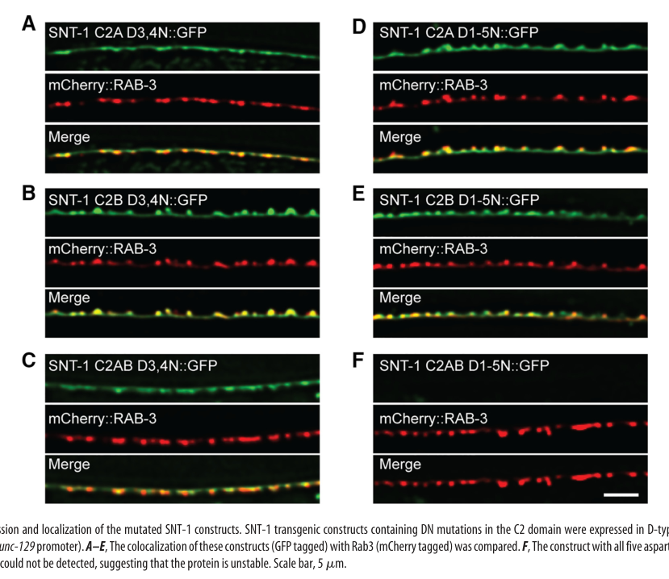

## Question

# Gene Research for Functional Annotation

## ⚠️ CRITICAL: Gene/Protein Identification Context

**BEFORE YOU BEGIN RESEARCH:** You MUST verify you are researching the CORRECT gene/protein. Gene symbols can be ambiguous, especially for less well-characterized genes from non-model organisms.

### Target Gene/Protein Identity (from UniProt):
- **UniProt Accession:** P34693
- **Protein Description:** RecName: Full=Synaptotagmin-1; AltName: Full=Synaptotagmin I;
- **Gene Information:** Name=snt-1; ORFNames=F31E8.2;
- **Organism (full):** Caenorhabditis elegans.
- **Protein Family:** Belongs to the synaptotagmin family. .
- **Key Domains:** C2_dom. (IPR000008); C2_domain_sf. (IPR035892); Synaptotagmin. (IPR001565); C2 (PF00168)

### MANDATORY VERIFICATION STEPS:

1. **Check if the gene symbol "snt-1" matches the protein description above**
2. **Verify the organism is correct:** Caenorhabditis elegans.
3. **Check if protein family/domains align with what you find in literature**
4. **If you find literature for a DIFFERENT gene with the same or similar symbol, STOP**

### If Gene Symbol is Ambiguous or You Cannot Find Relevant Literature:

**DO NOT PROCEED WITH RESEARCH ON A DIFFERENT GENE.** Instead:
- State clearly: "The gene symbol 'snt-1' is ambiguous or literature is limited for this specific protein"
- Explain what you found (e.g., "Found extensive literature on a different gene with the same symbol in a different organism")
- Describe the protein based ONLY on the UniProt information provided above
- Suggest that the protein function can be inferred from domain/family information

### Research Target:

Please provide a comprehensive research report on the gene **snt-1** (gene ID: snt-1, UniProt: P34693) in worm.

The research report should be a detailed narrative explaining the function, biological processes, and localization of the gene product. Citations should be given for all claims.

You should prioritize authoritative reviews and primary scientific literature when conducting research. You can supplement
this with annotations you find in gene/protein databases, but these can be outdated or inaccurate.

We are specifically interested in the primary function of the gene - for enzymes, what reaction is catalyzed, and what is the substrate specificity? For transporters, what is the substrate? For structural proteins or adapters, what is the broader structural role? For signaling molecules, what is the role in the pathway.

We are interested in where in or outside the cell the gene product carries out its function.

We are also interested in the signaling or biochemical pathways in which the gene functions. We are less interested in broad pleiotropic effects, except where these elucidate the precise role.

Include evidence where possible. We are interested in both experimental evidence as well as inference from structure, evolution, or bioinformatic analysis. Precise studies should be prioritized over high-throughput, where available.

## Output

Question: You are an expert researcher providing comprehensive, well-cited information.

Provide detailed information focusing on:
1. Key concepts and definitions with current understanding
2. Recent developments and latest research (prioritize 2023-2024 sources)
3. Current applications and real-world implementations
4. Expert opinions and analysis from authoritative sources
5. Relevant statistics and data from recent studies

Format as a comprehensive research report with proper citations. Include URLs and publication dates where available.
Always prioritize recent, authoritative sources and provide specific citations for all major claims.

# Gene Research for Functional Annotation

## ⚠️ CRITICAL: Gene/Protein Identification Context

**BEFORE YOU BEGIN RESEARCH:** You MUST verify you are researching the CORRECT gene/protein. Gene symbols can be ambiguous, especially for less well-characterized genes from non-model organisms.

### Target Gene/Protein Identity (from UniProt):
- **UniProt Accession:** P34693
- **Protein Description:** RecName: Full=Synaptotagmin-1; AltName: Full=Synaptotagmin I;
- **Gene Information:** Name=snt-1; ORFNames=F31E8.2;
- **Organism (full):** Caenorhabditis elegans.
- **Protein Family:** Belongs to the synaptotagmin family. .
- **Key Domains:** C2_dom. (IPR000008); C2_domain_sf. (IPR035892); Synaptotagmin. (IPR001565); C2 (PF00168)

### MANDATORY VERIFICATION STEPS:

1. **Check if the gene symbol "snt-1" matches the protein description above**
2. **Verify the organism is correct:** Caenorhabditis elegans.
3. **Check if protein family/domains align with what you find in literature**
4. **If you find literature for a DIFFERENT gene with the same or similar symbol, STOP**

### If Gene Symbol is Ambiguous or You Cannot Find Relevant Literature:

**DO NOT PROCEED WITH RESEARCH ON A DIFFERENT GENE.** Instead:
- State clearly: "The gene symbol 'snt-1' is ambiguous or literature is limited for this specific protein"
- Explain what you found (e.g., "Found extensive literature on a different gene with the same symbol in a different organism")
- Describe the protein based ONLY on the UniProt information provided above
- Suggest that the protein function can be inferred from domain/family information

### Research Target:

Please provide a comprehensive research report on the gene **snt-1** (gene ID: snt-1, UniProt: P34693) in worm.

The research report should be a detailed narrative explaining the function, biological processes, and localization of the gene product. Citations should be given for all claims.

You should prioritize authoritative reviews and primary scientific literature when conducting research. You can supplement
this with annotations you find in gene/protein databases, but these can be outdated or inaccurate.

We are specifically interested in the primary function of the gene - for enzymes, what reaction is catalyzed, and what is the substrate specificity? For transporters, what is the substrate? For structural proteins or adapters, what is the broader structural role? For signaling molecules, what is the role in the pathway.

We are interested in where in or outside the cell the gene product carries out its function.

We are also interested in the signaling or biochemical pathways in which the gene functions. We are less interested in broad pleiotropic effects, except where these elucidate the precise role.

Include evidence where possible. We are interested in both experimental evidence as well as inference from structure, evolution, or bioinformatic analysis. Precise studies should be prioritized over high-throughput, where available.

# Functional annotation report: *C. elegans snt-1* / SNT-1

## Executive conclusion

The requested target is correctly identified: ***Caenorhabditis elegans snt-1*** encodes **synaptotagmin-1/SNT-1**, corresponding to the supplied UniProt accession **P34693** and ORF **F31E8.2**. The literature directly states that worm synaptotagmin-1 is encoded by *snt-1* and describes the expected synaptotagmin architecture: a short vesicle-luminal N-terminus, one transmembrane helix, and tandem cytoplasmic C2A and C2B domains. Thus, the gene name, organism, protein family, and C2-domain annotations are mutually consistent; no evidence from similarly named genes in other organisms was used as target-specific evidence. (mathews2007differentialexpressionand pages 2-3, li2018snt1functionsas pages 2-3)

SNT-1 is best annotated as an **integral synaptic-vesicle Ca²⁺ sensor and vesicle-cycle organizer**. At presynaptic terminals it converts Ca²⁺ entry into rapid neurotransmitter release, helps maintain the primed/readily releasable vesicle pool, controls release timing, and contributes to synaptic-vesicle protein retrieval and recycling. It is not an enzyme or transporter and therefore has no catalytic reaction or transported substrate. Its relevant molecular “substrates” are instead Ca²⁺ ions, acidic phospholipid membranes, and components of the vesicle-fusion/endocytic machinery. The strongest worm-specific evidence comes from null mutants, neuronal rescue, C2-domain mutagenesis, Ca²⁺-binding measurements, electrophysiology, hypertonic-sucrose assays, imaging, and electron microscopy. (li2018snt1functionsas pages 1-2, yu2013differentialrolesfor pages 3-6, li2018snt1functionsas pages 4-5, li2018snt1functionsas pages 5-7)

## Evidence-ranked annotation

| Annotation dimension | Best-supported conclusion | Direct evidence / assay | Key quantitative result | Evidence status | Primary source (year; DOI URL) |
|---|---|---|---|---|---|
| Identity and architecture | *C. elegans snt-1* encodes synaptotagmin-1: an approximately 50-kDa synaptic-vesicle protein with an intravesicular N-terminus, one transmembrane helix, and cytoplasmic tandem C2A/C2B domains. This matches UniProt P34693 and ORF F31E8.2. | Cloning, sequencing, homology analysis, immunoblotting, and mutant rescue. | Gene spans approximately 5.7 kb and nine exons; worm protein is 54% identical and 74% similar to rat synaptotagmin-I. | **Direct C. elegans identity and architecture**; no conflicting same-symbol protein used. | Nonet et al. (1993), [10.1016/0092-8674(93)90357-V](https://doi.org/10.1016/0092-8674(93)90357-V); Mathews et al. (2007), [10.1016/j.mcn.2007.01.009](https://doi.org/10.1016/j.mcn.2007.01.009) (mathews2007differentialexpressionand pages 2-3, nonet1993synapticfunctionis pages 2-3) |
| Isoforms | Alternative exon 6 produces SNT-1A and SNT-1B. SNT-1A is the predominant broadly functional neuronal isoform; SNT-1B has more restricted expression/function. | cDNA counting, isoform-specific reporters, pan-neuronal and genomic rescue. | Of 60 cDNAs, 57 encoded SNT-1A, one SNT-1B, and two aberrantly contained both alternative exons. Either isoform rescued a null when expressed pan-neuronally; native SNT-1A rescued movement, whereas SNT-1B chiefly rescued defecation. | **Direct C. elegans evidence.** | Mathews et al. (2007), [10.1016/j.mcn.2007.01.009](https://doi.org/10.1016/j.mcn.2007.01.009) (mathews2007differentialexpressionand pages 2-3) |
| Cellular and subcellular localization | SNT-1 is an integral synaptic-vesicle protein enriched at presynaptic, synapse-rich regions throughout the nervous system. | Anti-SNT-1 immunostaining; SNT-1::GFP imaging; colocalization with RAB-3. | Punctate signal occurs in the nerve ring, ganglia, dorsal and ventral nerve cords, neuromuscular processes, and pharyngeal nervous system; C2-mutant proteins generally retained RAB-3-colocalized synaptic localization. | **Direct C. elegans localization.** Orientation across the vesicle membrane is also supported by conserved synaptotagmin topology. | Nonet et al. (1993), [10.1016/0092-8674(93)90357-V](https://doi.org/10.1016/0092-8674(93)90357-V); Li et al. (2018), [10.1523/JNEUROSCI.3097-17.2018](https://doi.org/10.1523/JNEUROSCI.3097-17.2018) (nonet1993synapticfunctionis pages 2-3, li2018snt1functionsas media c13207ce) |
| Ca²⁺ binding | Conserved acidic residues in C2A/C2B directly bind Ca²⁺; neutralizing key aspartates abolishes detectable binding. | Isothermal titration calorimetry of recombinant C2AB and D3,4N-mutant C2AB; sequence conservation. | Wild-type C2AB bound Ca²⁺ with **Kd = 15.6 ± 2 μM** and ΔH = −2.8 ± 0.3 kcal/mol at 25°C (n=2); D3,4N substitutions abolished binding under the tested conditions. | **Direct biochemical evidence for worm SNT-1.** | Li et al. (2018), [10.1523/JNEUROSCI.3097-17.2018](https://doi.org/10.1523/JNEUROSCI.3097-17.2018) (li2018snt1functionsas pages 5-7) |
| Tonic release and clamping | SNT-1 promotes basal/tonic neurotransmitter release; Ca²⁺ sensing by C2A and C2B is partly redundant. Evidence for a release-clamp role is suggestive rather than sufficient to define clamping as its sole function. | Neuromuscular-junction miniature EPSC recordings in null and C2-domain rescue animals. | Tonic release fell significantly only when Ca²⁺ liganding was disrupted in **both** C2 domains; single-domain D3,4N mutants were near wild-type rescue. Residual miniature frequency in nulls did not change significantly between 2 and 3 mM extracellular Ca²⁺. | **Direct C. elegans electrophysiology** for promotion of tonic release; **clamp interpretation qualified**. | Li et al. (2018), [10.1523/JNEUROSCI.3097-17.2018](https://doi.org/10.1523/JNEUROSCI.3097-17.2018) (li2018snt1functionsas pages 1-2, li2018snt1functionsas pages 4-5, li2018snt1functionsas pages 5-7) |
| Evoked release | SNT-1 is the principal fast Ca²⁺ sensor for stimulus-evoked synaptic-vesicle fusion at the worm neuromuscular junction. C2B Ca²⁺ binding is especially important for evoked output, while both C2 domains contribute to short latency. | Ventral-nerve-cord stimulation with postsynaptic EPSC amplitude, charge-transfer, latency, rise-time, and decay measurements; null rescue and Ca²⁺-ligand mutants. | Evoked EPSC amplitude in *snt-1* nulls was reduced by approximately **50%**, not eliminated; loss or Ca²⁺-binding mutations prolonged latency and altered kinetics. | **Strong direct C. elegans electrophysiological and rescue evidence.** | Li et al. (2018), [10.1523/JNEUROSCI.3097-17.2018](https://doi.org/10.1523/JNEUROSCI.3097-17.2018) (li2018snt1functionsas pages 1-2, li2018snt1functionsas pages 4-5, li2018snt1functionsas pages 5-7) |
| Vesicle priming | SNT-1 supports formation or maintenance of the readily releasable pool, particularly vesicles underlying slower/loosely Ca²⁺-coupled release; it is not primarily required for the fraction of vesicles morphologically docked. | Hypertonic-sucrose release, evoked kinetics, electron microscopy, and comparison of docked-to-total vesicle ratios. | Sucrose-evoked quanta were significantly reduced; absolute docked vesicles fell about **50%**, but EJC charge fell about **75%** and the docked fraction was unchanged, indicating vesicle depletion plus a fusion/priming defect rather than a selective docking failure. | **Direct C. elegans functional and ultrastructural evidence.** | Yu et al. (2013), [10.1371/journal.pone.0057842](https://doi.org/10.1371/journal.pone.0057842); Li et al. (2018), [10.1523/JNEUROSCI.3097-17.2018](https://doi.org/10.1523/JNEUROSCI.3097-17.2018) (yu2013differentialrolesfor pages 3-6, li2018snt1functionsas pages 4-5) |
| Endocytosis and recycling | SNT-1 is also required for efficient synaptic-vesicle protein retrieval and vesicle-pool maintenance after exocytosis. | Electron microscopy, vesicle-density and cisternae measurements, optical synaptic-fatigue assays, and genetic analyses. | Null terminals had significantly lower vesicle density and more irregular cisternae (**p < 0.0001** for each); synaptic density and punctum intensity were not detectably altered (p=0.57 and p=0.22). | **Direct C. elegans evidence.** The exact molecular step in membrane retrieval remains less resolved than its exocytic Ca²⁺-sensor role. | Yu et al. (2013), [10.1371/journal.pone.0057842](https://doi.org/10.1371/journal.pone.0057842) (yu2013differentialrolesfor pages 3-6, jeon2022differentialregulationof pages 82-90) |
| UNC-41/stonin–AP-2 pathway | UNC-41/stonin targets or retrieves SNT-1 at synapses and functions with AP-2 in endocytosis. The localization dependency is directional: UNC-41 is needed for normal SNT-1 localization, whereas SNT-1 is dispensable for UNC-41 localization. | Endogenous immunostaining, single-copy GFP reporters, colocalization, double mutants, and ultrastructure. | *unc-41* mutants show diffuse/mislocalized SNT-1 and approximately **50% fewer vesicles** in cholinergic and GABAergic motor neurons; *snt-1 unc-41* double mutants are more impaired than either single mutant, indicating additional independent functions. | **Direct C. elegans pathway evidence**; direct physical binding of worm SNT-1 to AP-2 is less completely demonstrated than the genetic/localization relationship. | Mullen et al. (2012), [10.1371/journal.pone.0040095](https://doi.org/10.1371/journal.pone.0040095) (mullen2012unc41stoninfunctionswith pages 3-5) |
| SNT-3 dual-sensor model | SNT-1 primarily drives fast, tightly coupled release, whereas SNT-3 can support slower, more loosely coupled residual release when SNT-1 is absent. TOM-1/tomosyn regulates both branches. | Null and double-mutant electrophysiology, latency measurements, sucrose release, aldicarb assays, and electron-microscopic mapping of vesicle position. | *snt-1* loss leaves approximately half of evoked amplitude; vesicles redistribute distally and latency increases. Ultrastructure included wild type 7 synapses/51 profiles, *snt-1* 7/47, and *tom-1;snt-1* 10/77. | **Direct C. elegans genetic/electrophysiological model**; assigning all residual release exclusively to SNT-3 should remain qualified. | Li et al. (2021), [10.1083/jcb.202008121](https://doi.org/10.1083/jcb.202008121) (jeon2022differentialregulationof pages 58-65, jeon2022differentialregulationof pages 65-70, jeon2022differentialregulationof pages 70-77) |
| Non-neuronal epidermal trafficking | SNT-1 and UNC-41 also participate in semaphorin/PLX-1-regulated vesicular transport in larval epidermal cells, extending SNT-1 function beyond classical neuronal synaptic vesicles. | Genetic suppression of *plx-1* morphology, endocytic/exocytic reporters, and tracking of SNT-1-containing vesicles toward late endosome/lysosome compartments. | *snt-1* or *unc-41* mutations strongly suppressed *plx-1* cell-boundary and male ray-1 defects; exact effect sizes were not available in the extracted text. | **Direct C. elegans non-neuronal evidence**, but the transported cargo and precise fusion/retrieval step remain incompletely defined. | Tanaka et al. (2020), [10.1111/gtc.12765](https://doi.org/10.1111/gtc.12765) (tanaka2020involvementofthe pages 1-2) |
| Recent development: exocytosis enhancement (2023) | Open UNC-64/syntaxin or UNC-18(P334A) can partially bypass release impairment in *snt-1(md290)*, but combining both manipulations is not additive and can worsen excitatory–inhibitory balance and organismal phenotypes. | Aldicarb sensitivity, thrashing, growth, body-size and brood assays, electrophysiology, and genetic epistasis. | Each single manipulation significantly improved motility and acetylcholine release; dual manipulation impaired rescue. Exact *snt-1*-specific effect sizes were not reported in the extracted text. | **Direct C. elegans evidence from a 2023 preprint**; conclusions await the weight accorded to peer-reviewed publication. | Huang et al. (2023), [10.1101/2023.08.18.553709](https://doi.org/10.1101/2023.08.18.553709) (huang2023doublemutationof pages 4-7, huang2023doublemutationof pages 35-37) |
| Recent development: presynaptic homeostasis (2024) | Reduced synaptic-vesicle exocytosis increases active-zone UNC-2/CaV2 abundance, whereas sustained optogenetic activation lowers it, establishing inverse feedback between release efficiency and presynaptic Ca²⁺-channel abundance. This is a relevant framework for interpreting *snt-1* loss, but the extracted evidence does not provide an isolated *snt-1*-specific effect size. | Endogenous GFP/pHluorin-tagged UNC-2 imaging across exocytosis mutants and panneuronal Chrimson stimulation. | More than 2 h of low-intensity optogenetic stimulation decreased UNC-2 punctum intensity without changing punctum number; individual mutant comparisons reached p values from 0.0024 to <0.0001. | **Direct C. elegans homeostatic mechanism; indirect/contextual for SNT-1 unless an *snt-1*-specific comparison is consulted.** | Xiong et al. (2024), [10.1073/pnas.2404969121](https://doi.org/10.1073/pnas.2404969121) (xiong2024presynapticneuronsselftune pages 4-5) |

*Table: Evidence-ranked functional annotation of C. elegans SNT-1, separating direct worm experiments from qualified mechanistic or family-level interpretation. Quantitative results and recent developments are included without treating contextual findings as SNT-1-specific proof.*

## 1. Identity, structure, and isoforms

The *snt-1* locus spans approximately **5.7 kb and nine exons** and produces proteins of roughly **50 kDa**. Its topology is characteristic of synaptotagmins: the N-terminus lies in the vesicle lumen, followed by a single membrane-spanning segment and a large cytoplasmic region containing C2A and C2B domains. Early sequence analysis found 54% amino-acid identity and 74% similarity to rat synaptotagmin-I, supporting orthology rather than merely generic membership in the C2-domain superfamily. (mathews2007differentialexpressionand pages 2-3, nonet1993synapticfunctionis pages 2-3)

Alternative exon 6 usage generates **SNT-1A and SNT-1B**. Of 60 cDNA clones examined, 57 encoded SNT-1A, one encoded SNT-1B, and two contained both alternative exons, making SNT-1A the predominant transcript in that dataset. Pan-neuronal expression of either protein can provide synaptotagmin activity in a null background, but native isoform-specific constructs differ: SNT-1A broadly restores movement and other defects, whereas SNT-1B has a more restricted expression/function pattern and notably rescues defecation better than locomotion or growth. These results indicate that the proteins retain common core activity but are deployed in different cells or physiological contexts. (mathews2007differentialexpressionand pages 2-3)

## 2. Primary molecular function

### Direct Ca²⁺ sensing

The tandem C2 domains contain the conserved acidic residues expected to coordinate Ca²⁺. Isothermal titration calorimetry on recombinant worm C2AB measured a Ca²⁺ dissociation constant of **15.6 ± 2 μM** and an enthalpy change of **−2.8 ± 0.3 kcal/mol at 25°C**; neutralizing the third and fourth coordinating aspartates abolished detectable binding under the assay conditions. This is direct biochemical evidence that SNT-1 itself binds Ca²⁺ rather than merely acting downstream of another sensor. (li2018snt1functionsas pages 5-7)

Functionally, Ca²⁺ binding enables SNT-1’s cytoplasmic domains to couple depolarization-induced Ca²⁺ influx to fusion of neurotransmitter-filled synaptic vesicles with the presynaptic plasma membrane. The exact atomic interactions of worm SNT-1 with phospholipid and SNARE complexes have not been characterized as comprehensively as mammalian SYT1; membrane insertion, phosphatidylserine binding, and direct SNARE remodeling are therefore strongly conserved mechanistic inferences, not all independently proven for P34693. The worm-specific conclusion that SNT-1 is the operative Ca²⁺ sensor, however, is directly established by C2-site mutagenesis and rescue electrophysiology. (li2018snt1functionsas pages 1-2, li2018snt1functionsas pages 5-7)

### Tonic and evoked release

At the neuromuscular junction, SNT-1 regulates both ongoing tonic release and electrically evoked release. The two C2 domains are partly redundant for tonic output: mutating Ca²⁺-coordinating residues in either C2A or C2B alone did not significantly reduce miniature-event frequency relative to wild-type rescue, whereas disabling Ca²⁺ binding in both domains did. By contrast, evoked output depends particularly on Ca²⁺ binding by C2B; C2B mutations reduced evoked EPSCs, while corresponding C2A mutations had much less effect on evoked amplitude. Full ligand sets in both domains nevertheless contribute to short release latency. (li2018snt1functionsas pages 1-2, li2018snt1functionsas pages 5-7)

In *snt-1* null animals, evoked EPSC amplitude is reduced by approximately **50%**, rather than eliminated, and response latency is prolonged. Rise and decay kinetics are also altered. Wild-type neuronal SNT-1 restores these defects, establishing causality. The residual response means that SNT-1 is the principal—but not the only—route to stimulus-coupled release in the worm. (li2018snt1functionsas pages 4-5)

SNT-1 is sometimes described as both a trigger and a “clamp.” Reduced miniature-event frequency in null animals supports a positive role in tonic release, while changes in spontaneous or asynchronous release under particular mutations suggest suppression of inappropriate fusion. For *C. elegans*, the most secure annotation is therefore **Ca²⁺-dependent release sensor and timing regulator**; “fusion clamp” is a context-dependent mechanistic component rather than a sufficient stand-alone description. (li2018snt1functionsas pages 1-2)

## 3. Vesicle priming, coupling, and the dual-sensor pathway

Hypertonic-sucrose responses are significantly smaller in *snt-1* mutants, showing that SNT-1 contributes to the readily releasable/primed vesicle pool in addition to triggering fusion. Electron microscopy found fewer absolute docked vesicles because the whole vesicle pool is depleted, but the docked-to-total ratio was not significantly altered. In one comparison, docked-vesicle number fell about **50%**, whereas evoked junctional-current charge fell about **75%**. This mismatch indicates that depletion alone cannot explain the functional defect: SNT-1 also acts in priming and Ca²⁺-triggered fusion. (yu2013differentialrolesfor pages 3-6, li2018snt1functionsas pages 4-5)

Worm release contains kinetically separable tightly and loosely Ca²⁺-coupled components. Current evidence assigns SNT-1 the dominant fast-sensor role, while another synaptotagmin, **SNT-3**, supports slower residual release, especially when SNT-1 is absent. In *snt-1* mutants, vesicles redistribute farther from the dense projection and release latency increases. Genetic removal of TOM-1/tomosyn can restore aspects of release and proximal docking but does not normalize the slow latency, consistent with residual SNT-3-mediated fusion being intrinsically more loosely coupled to Ca²⁺ entry. Assigning every residual event exclusively to SNT-3 would nevertheless be stronger than the available evidence warrants. (jeon2022differentialregulationof pages 58-65, jeon2022differentialregulationof pages 65-70, jeon2022differentialregulationof pages 70-77)

TOM-1 also has a reciprocal organizational relationship with the sensors: SNT-1 is required for normal synaptic enrichment of TOM-1::GFP, whereas TOM-1 loss does not appreciably change SNT-1::GFP abundance. TOM-1 removal partially restores evoked amplitude and charge in an *snt-1* background but leaves latency elevated, indicating enhancement of an alternative release pathway rather than replacement of SNT-1’s fast Ca²⁺ coupling. (jeon2022differentialregulationof pages 58-65, jeon2022differentialregulationof pages 77-82)

## 4. Cellular and subcellular localization

SNT-1 is predominantly neuronal and is concentrated in synapse-rich regions: the nerve ring, head and tail ganglia, dorsal and ventral nerve cords, neuromuscular processes, and pharyngeal nervous system. Its punctate distribution and association with purified vesicle fractions support localization on synaptic vesicles rather than as a soluble active-zone protein. (nonet1993synapticfunctionis pages 2-3, nonet1993synapticfunctionis pages 1-2)

GFP-tagged SNT-1 C2 mutants generally colocalize with mCherry::RAB-3 puncta in cholinergic motor neurons, confirming delivery to synaptic-vesicle clusters even when specific Ca²⁺-liganding residues are altered. The construct in which all five acidic residues were neutralized in both domains was undetectable, indicating protein instability; functional failure of that construct cannot therefore be interpreted solely as loss of Ca²⁺ sensing. (li2018snt1functionsas pages 5-7, li2018snt1functionsas media c13207ce)

Topologically, the short N-terminal segment is inside the vesicle and the tandem C2 domains face the cytoplasm. This orientation positions the C2 domains to encounter presynaptic Ca²⁺, the plasma membrane, and cytosolic fusion machinery when a vesicle is docked or primed. (mathews2007differentialexpressionand pages 2-3)

## 5. Endocytosis and synaptic-vesicle recycling

SNT-1 has a second, well-supported role in maintaining the vesicle pool after exocytosis. Null terminals retain normal gross synaptic density and punctum intensity (p=0.57 and p=0.22 in one analysis), but exhibit markedly lower vesicle density and large irregular cisternae (**p<0.0001** for both). Absolute morphologically docked vesicles are reduced, while the fraction docked relative to all remaining vesicles is not significantly different (p=0.17). These data favor defective membrane/protein retrieval and vesicle reformation rather than a selective inability to dock otherwise normal vesicles. (yu2013differentialrolesfor pages 3-6)

The strongest defined endocytic partner is **UNC-41/stonin**. UNC-41 colocalizes with SNT-1 at synapses, and *unc-41* mutants show reduced, diffuse SNT-1 signal, including ectopic signal in nonsynaptic commissures. The dependency is nonreciprocal: endogenous UNC-41 still localizes to synapses in *snt-1(md290)* null animals and even in compound synaptotagmin mutants. UNC-41 therefore helps localize or retrieve SNT-1, whereas SNT-1 is not the targeting determinant for UNC-41. (mullen2012unc41stoninfunctionswith pages 3-5)

UNC-41 functions with AP-2-mediated endocytosis; *unc-41* mutants have approximately **50% fewer synaptic vesicles** in both cholinergic and GABAergic motor neurons. More severe swimming defects in *snt-1 unc-41* double mutants show that their functions overlap but are not identical—UNC-41 has SNT-1-independent roles, and SNT-1 likely contributes to recycling through additional interactions. (mullen2012unc41stoninfunctionswith pages 3-5)

Accordingly, the most precise pathway model is:

**CaV2/UNC-2-mediated Ca²⁺ influx → SNT-1 C2-domain activation → primed-vesicle fusion through the SNARE apparatus → UNC-41/stonin–AP-2-dependent retrieval of SNT-1 and vesicle membrane/proteins → vesicle reformation and reuse.**

The exocytic Ca²⁺-sensor step is mechanistically better resolved than the exact molecular action of SNT-1 during endocytosis.

## 6. Organismal phenotypes and what they mean mechanistically

Null animals are viable but severely uncoordinated, grow poorly, pump inefficiently, and have defecation and locomotor defects. They accumulate acetylcholine and resist acetylcholinesterase inhibitors while retaining sensitivity to receptor agonists, localizing the major defect presynaptically rather than to postsynaptic acetylcholine receptors. Coordinated movement is not wholly abolished, agreeing with electrophysiological evidence for substantial residual transmitter release. (nonet1993synapticfunctionis pages 1-2)

These broad phenotypes should be treated as downstream consequences of impaired synaptic transmission and vesicle recycling, not as separate primary biochemical functions. Normal synaptic density despite strong physiological defects further argues that SNT-1 is primarily required for mature synaptic operation rather than initial synapse formation. (yu2013differentialrolesfor pages 3-6)

## 7. Non-neuronal function

SNT-1 is not restricted absolutely to neuronal synaptic vesicles. In larval epidermal cells, an SNT-1–UNC-41 system participates in semaphorin/PLX-1-regulated vesicular trafficking. Mutations in *snt-1* or *unc-41* suppress epidermal cell-boundary and male-tail ray defects caused by loss of *plx-1*, while *plx-1* loss changes endocytic/exocytic-marker localization and reduces trafficking of SNT-1-containing vesicles toward late endosome/lysosome compartments. This establishes a real non-neuronal trafficking role, although the cargo, Ca²⁺ dependence, and precise fusion-versus-retrieval step remain less well defined than at synapses. (tanaka2020involvementofthe pages 1-2)

## 8. Recent developments, 2023–2024

### Exocytosis-enhancing suppressors

A 2023 preprint expanded genetic analysis of the severe *snt-1(md290)* null phenotype. Either open UNC-64/syntaxin or UNC-18(P334A) individually improved motility and acetylcholine release, indicating that making the downstream fusion machinery more permissive can partially bypass loss of the principal Ca²⁺ sensor. Combining both changes was not additive and could worsen behavioral phenotypes and excitatory–inhibitory balance. These observations place SNT-1 upstream of or alongside SNARE activation and show that increasing basal fusion competence cannot fully recreate properly timed SNT-1-mediated release. Because this source was a preprint in the retrieved record and lacked extracted *snt-1*-specific effect sizes, it should be weighted below the peer-reviewed electrophysiological studies. (huang2023doublemutationof pages 4-7, huang2023doublemutationof pages 35-37)

### Presynaptic CaV2 homeostasis

A 2024 PNAS study established that presynaptic UNC-2/CaV2 abundance is inversely coupled to synaptic-vesicle exocytosis efficiency. Exocytosis-defective backgrounds show increased active-zone UNC-2, whereas more than two hours of sustained optogenetic neuronal activation decreases UNC-2 punctum intensity without changing punctum number. This provides a current framework in which impaired release can feed back onto the amount of presynaptic Ca²⁺ channel. The extracted evidence does not provide an isolated numerical effect for *snt-1* itself, so the homeostatic mechanism is directly demonstrated in the worm but should be described as contextual—not yet quantitatively specific—for SNT-1 annotation. (xiong2024presynapticneuronsselftune pages 4-5)

### Methodological development

Recent all-optical reporters permit synaptic-vesicle fusion and reacidification to be followed in intact worms. These systems classify *snt-1* among mutants with altered stimulation-dependent vesicle-cycle dynamics and provide a scalable real-world research application for genetic or pharmacological screens. They complement rather than replace electrophysiology and EM: fluorescence decline can reflect several steps, including endocytosis, reacidification, vesicle availability, and synaptic fatigue.

## 9. Applications and research utility

SNT-1 is used experimentally as:

1. **A presynaptic-vesicle marker:** SNT-1 immunostaining or fluorescent fusions identify synapse-rich regions and vesicle clusters.
2. **A genetic probe of Ca²⁺-triggered release:** Null and C2-domain mutants distinguish tonic, fast evoked, slow residual, and priming components.
3. **A model for coupling exocytosis to endocytosis:** Its relationship with UNC-41/stonin and AP-2 allows dissection of vesicle-protein retrieval.
4. **A sensitized background for fusion-machinery genetics:** Open syntaxin, UNC-18, TOM-1, SNT-3, and other modifiers can be assessed for bypass or enhancement of residual release.
5. **An intact-animal assay target:** Aldicarb sensitivity, movement, optogenetic stimulation, muscle Ca²⁺ imaging, pH-sensitive vesicle reporters, electrophysiology, and EM provide complementary readouts.

These are research implementations rather than clinical applications; no direct therapeutic use of worm SNT-1 is established.

## 10. Confidence assessment and recommended annotation

**High-confidence molecular function:** Ca²⁺ binding through tandem C2 domains and triggering/regulation of presynaptic synaptic-vesicle exocytosis, particularly fast evoked release.

**High-confidence biological processes:** neurotransmitter secretion; synaptic-vesicle priming; control of release kinetics; synaptic-vesicle endocytosis/recycling; maintenance of vesicle-pool abundance.

**High-confidence cellular component:** integral synaptic-vesicle membrane protein enriched at presynaptic terminals and neuromuscular junctions, with its C2 domains exposed to the cytoplasm.

**Moderate-confidence extensions:** fusion clamping, specific direct contacts with each worm SNARE/AP-2 component, and the exact division of residual release between SNT-3 and other mechanisms. These are supported by genetics, conservation, or indirect evidence but are less completely established biochemically for P34693.

**Concise annotation:** *snt-1* encodes the principal synaptic-vesicle Ca²⁺ sensor in *C. elegans*. Upon presynaptic Ca²⁺ entry, its cytoplasmic C2 domains promote correctly timed fusion of primed vesicles; SNT-1 additionally supports readily releasable-pool formation and UNC-41/stonin–AP-2-associated vesicle recycling. Loss therefore reduces and delays neurotransmitter release without eliminating it and depletes the synaptic-vesicle pool. (li2018snt1functionsas pages 1-2, yu2013differentialrolesfor pages 3-6, mullen2012unc41stoninfunctionswith pages 3-5, li2018snt1functionsas pages 5-7)

References

1. (mathews2007differentialexpressionand pages 2-3): Eleanor A. Mathews, Gregory P. Mullen, John A. Crowell, Janet S. Duerr, John R. McManus, Angie Duke, Jennifer Gaskin, and James B. Rand. Differential expression and function of synaptotagmin 1 isoforms in caenorhabditis elegans. Apr 2007. URL: https://doi.org/10.1016/j.mcn.2007.01.009, doi:10.1016/j.mcn.2007.01.009. This article has 13 citations and is from a peer-reviewed journal.

2. (li2018snt1functionsas pages 2-3): Lei Li, Haowen Liu, Wei Wang, Mintu Chandra, Brett M. Collins, and Zhitao Hu. Snt-1 functions as the ca2+ sensor for tonic and evoked neurotransmitter release in caenorhabditis elegans. The Journal of Neuroscience, 38:5313-5324, Jun 2018. URL: https://doi.org/10.1523/jneurosci.3097-17.2018, doi:10.1523/jneurosci.3097-17.2018. This article has 18 citations.

3. (li2018snt1functionsas pages 1-2): Lei Li, Haowen Liu, Wei Wang, Mintu Chandra, Brett M. Collins, and Zhitao Hu. Snt-1 functions as the ca2+ sensor for tonic and evoked neurotransmitter release in caenorhabditis elegans. The Journal of Neuroscience, 38:5313-5324, Jun 2018. URL: https://doi.org/10.1523/jneurosci.3097-17.2018, doi:10.1523/jneurosci.3097-17.2018. This article has 18 citations.

4. (yu2013differentialrolesfor pages 3-6): Szi-Chieh Yu, Susan M. Klosterman, Ashley A. Martin, Elena O. Gracheva, and Janet E. Richmond. Differential roles for snapin and synaptotagmin in the synaptic vesicle cycle. PLoS ONE, 8:e57842, Feb 2013. URL: https://doi.org/10.1371/journal.pone.0057842, doi:10.1371/journal.pone.0057842. This article has 28 citations and is from a peer-reviewed journal.

5. (li2018snt1functionsas pages 4-5): Lei Li, Haowen Liu, Wei Wang, Mintu Chandra, Brett M. Collins, and Zhitao Hu. Snt-1 functions as the ca2+ sensor for tonic and evoked neurotransmitter release in caenorhabditis elegans. The Journal of Neuroscience, 38:5313-5324, Jun 2018. URL: https://doi.org/10.1523/jneurosci.3097-17.2018, doi:10.1523/jneurosci.3097-17.2018. This article has 18 citations.

6. (li2018snt1functionsas pages 5-7): Lei Li, Haowen Liu, Wei Wang, Mintu Chandra, Brett M. Collins, and Zhitao Hu. Snt-1 functions as the ca2+ sensor for tonic and evoked neurotransmitter release in caenorhabditis elegans. The Journal of Neuroscience, 38:5313-5324, Jun 2018. URL: https://doi.org/10.1523/jneurosci.3097-17.2018, doi:10.1523/jneurosci.3097-17.2018. This article has 18 citations.

7. (nonet1993synapticfunctionis pages 2-3): Michael L. Nonet, Kiely Grundahl, Barbara J. Meyer, and James B. Rand. Synaptic function is impaired but not eliminated in c. elegans mutants lacking synaptotagmin. Cell, 73:1291-1305, Jul 1993. URL: https://doi.org/10.1016/0092-8674(93)90357-v, doi:10.1016/0092-8674(93)90357-v. This article has 694 citations and is from a highest quality peer-reviewed journal.

8. (li2018snt1functionsas media c13207ce): Lei Li, Haowen Liu, Wei Wang, Mintu Chandra, Brett M. Collins, and Zhitao Hu. Snt-1 functions as the ca2+ sensor for tonic and evoked neurotransmitter release in caenorhabditis elegans. The Journal of Neuroscience, 38:5313-5324, Jun 2018. URL: https://doi.org/10.1523/jneurosci.3097-17.2018, doi:10.1523/jneurosci.3097-17.2018. This article has 18 citations.

9. (jeon2022differentialregulationof pages 82-90): Sohee Jeon. Differential regulation of synaptic transmission through tomosyn/synaptotagmin interactions in c. elegans. Text, Jan 2022. URL: https://doi.org/10.25417/uic.21517263, doi:10.25417/uic.21517263. This article has 0 citations and is from a peer-reviewed journal.

10. (mullen2012unc41stoninfunctionswith pages 3-5): Gregory P. Mullen, Kiely M. Grundahl, Mingyu Gu, Shigeki Watanabe, Robert J. Hobson, John A. Crowell, John R. McManus, Eleanor A. Mathews, Erik M. Jorgensen, and James B. Rand. Unc-41/stonin functions with ap2 to recycle synaptic vesicles in caenorhabditis elegans. PLoS ONE, 7:e40095, Jul 2012. URL: https://doi.org/10.1371/journal.pone.0040095, doi:10.1371/journal.pone.0040095. This article has 39 citations and is from a peer-reviewed journal.

11. (jeon2022differentialregulationof pages 58-65): Sohee Jeon. Differential regulation of synaptic transmission through tomosyn/synaptotagmin interactions in c. elegans. Text, Jan 2022. URL: https://doi.org/10.25417/uic.21517263, doi:10.25417/uic.21517263. This article has 0 citations and is from a peer-reviewed journal.

12. (jeon2022differentialregulationof pages 65-70): Sohee Jeon. Differential regulation of synaptic transmission through tomosyn/synaptotagmin interactions in c. elegans. Text, Jan 2022. URL: https://doi.org/10.25417/uic.21517263, doi:10.25417/uic.21517263. This article has 0 citations and is from a peer-reviewed journal.

13. (jeon2022differentialregulationof pages 70-77): Sohee Jeon. Differential regulation of synaptic transmission through tomosyn/synaptotagmin interactions in c. elegans. Text, Jan 2022. URL: https://doi.org/10.25417/uic.21517263, doi:10.25417/uic.21517263. This article has 0 citations and is from a peer-reviewed journal.

14. (tanaka2020involvementofthe pages 1-2): Hiroki Tanaka, Ayana Kanatome, and Shin Takagi. Involvement of the synaptotagmin/stonin2 system in vesicular transport regulated by semaphorins in <i>caenorhabditis elegans</i> epidermal cells. Genes to Cells, 25:391-401, Apr 2020. URL: https://doi.org/10.1111/gtc.12765, doi:10.1111/gtc.12765. This article has 5 citations and is from a peer-reviewed journal.

15. (huang2023doublemutationof pages 4-7): Mengjia Huang, Ya Wang, Chun Hin Chow, Karolina P. Stepien, Karen Indrawinata, Junjie Xu, Peter Argiropoulos, Xiaoyu Xie, Kyoko Sugita, Chi-Wei Tien, Soomin Lee, Philippe P. Monnier, Josep Rizo, Shangbang Gao, and Shuzo Sugita. Double mutation of open syntaxin and unc-18 p334a leads to excitatory-inhibitory imbalance and impairs multiple aspects of c. elegans behavior. bioRxiv, Aug 2023. URL: https://doi.org/10.1101/2023.08.18.553709, doi:10.1101/2023.08.18.553709. This article has 1 citations.

16. (huang2023doublemutationof pages 35-37): Mengjia Huang, Ya Wang, Chun Hin Chow, Karolina P. Stepien, Karen Indrawinata, Junjie Xu, Peter Argiropoulos, Xiaoyu Xie, Kyoko Sugita, Chi-Wei Tien, Soomin Lee, Philippe P. Monnier, Josep Rizo, Shangbang Gao, and Shuzo Sugita. Double mutation of open syntaxin and unc-18 p334a leads to excitatory-inhibitory imbalance and impairs multiple aspects of c. elegans behavior. bioRxiv, Aug 2023. URL: https://doi.org/10.1101/2023.08.18.553709, doi:10.1101/2023.08.18.553709. This article has 1 citations.

17. (xiong2024presynapticneuronsselftune pages 4-5): Ame Xiong, Janet E. Richmond, and Hongkyun Kim. Presynaptic neurons self-tune by inversely coupling neurotransmitter release with the abundance of cav2 voltage-gated ca2+ channels. Proceedings of the National Academy of Sciences of the United States of America, Aug 2024. URL: https://doi.org/10.1073/pnas.2404969121, doi:10.1073/pnas.2404969121. This article has 5 citations and is from a highest quality peer-reviewed journal.

18. (jeon2022differentialregulationof pages 77-82): Sohee Jeon. Differential regulation of synaptic transmission through tomosyn/synaptotagmin interactions in c. elegans. Text, Jan 2022. URL: https://doi.org/10.25417/uic.21517263, doi:10.25417/uic.21517263. This article has 0 citations and is from a peer-reviewed journal.

19. (nonet1993synapticfunctionis pages 1-2): Michael L. Nonet, Kiely Grundahl, Barbara J. Meyer, and James B. Rand. Synaptic function is impaired but not eliminated in c. elegans mutants lacking synaptotagmin. Cell, 73:1291-1305, Jul 1993. URL: https://doi.org/10.1016/0092-8674(93)90357-v, doi:10.1016/0092-8674(93)90357-v. This article has 694 citations and is from a highest quality peer-reviewed journal.

## Artifacts

- [Edison artifact artifact-00](snt-1-deep-research-falcon_artifacts/artifact-00.md)

## Citations

1. mathews2007differentialexpressionand pages 2-3
2. tanaka2020involvementofthe pages 1-2
3. xiong2024presynapticneuronsselftune pages 4-5
4. yu2013differentialrolesfor pages 3-6
5. nonet1993synapticfunctionis pages 1-2
6. nonet1993synapticfunctionis pages 2-3
7. jeon2022differentialregulationof pages 82-90
8. jeon2022differentialregulationof pages 58-65
9. jeon2022differentialregulationof pages 65-70
10. jeon2022differentialregulationof pages 70-77
11. huang2023doublemutationof pages 4-7
12. huang2023doublemutationof pages 35-37
13. jeon2022differentialregulationof pages 77-82
14. 10.1016/0092-8674(93)90357-V
15. 10.1016/j.mcn.2007.01.009
16. 10.1523/JNEUROSCI.3097-17.2018
17. 10.1371/journal.pone.0057842
18. 10.1371/journal.pone.0040095
19. 10.1083/jcb.202008121
20. 10.1111/gtc.12765
21. 10.1101/2023.08.18.553709
22. 10.1073/pnas.2404969121
23. https://doi.org/10.1016/0092-8674(93
24. https://doi.org/10.1016/j.mcn.2007.01.009
25. https://doi.org/10.1523/JNEUROSCI.3097-17.2018
26. https://doi.org/10.1371/journal.pone.0057842
27. https://doi.org/10.1371/journal.pone.0040095
28. https://doi.org/10.1083/jcb.202008121
29. https://doi.org/10.1111/gtc.12765
30. https://doi.org/10.1101/2023.08.18.553709
31. https://doi.org/10.1073/pnas.2404969121
32. https://doi.org/10.1016/j.mcn.2007.01.009,
33. https://doi.org/10.1523/jneurosci.3097-17.2018,
34. https://doi.org/10.1371/journal.pone.0057842,
35. https://doi.org/10.25417/uic.21517263,
36. https://doi.org/10.1371/journal.pone.0040095,
37. https://doi.org/10.1111/gtc.12765,
38. https://doi.org/10.1101/2023.08.18.553709,
39. https://doi.org/10.1073/pnas.2404969121,