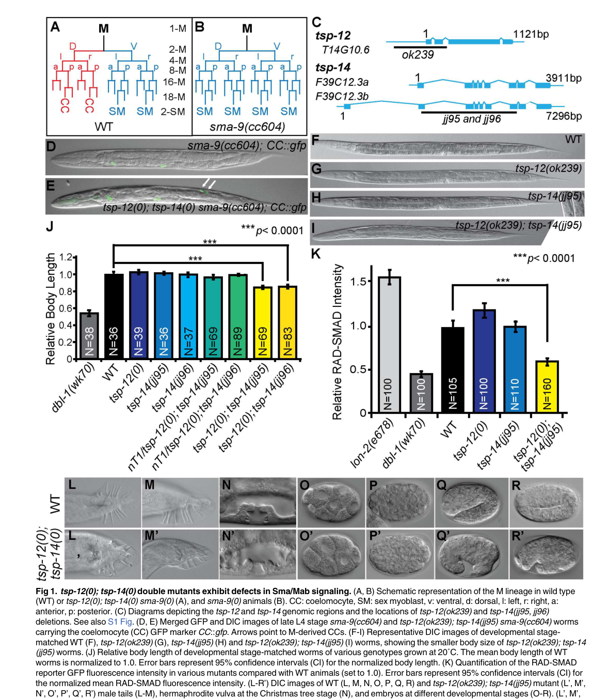

## Question

# Gene Research for Functional Annotation

## ⚠️ CRITICAL: Gene/Protein Identification Context

**BEFORE YOU BEGIN RESEARCH:** You MUST verify you are researching the CORRECT gene/protein. Gene symbols can be ambiguous, especially for less well-characterized genes from non-model organisms.

### Target Gene/Protein Identity (from UniProt):
- **UniProt Accession:** G5EFD9
- **Protein Description:** RecName: Full=Disintegrin and metalloproteinase domain-containing protein 10 homolog {ECO:0000305}; Short=ADAM 10 homolog {ECO:0000305}; EC=3.4.24.81 {ECO:0000250|UniProtKB:O14672}; Flags: Precursor;
- **Gene Information:** Name=sup-17 {ECO:0000312|WormBase:DY3.7}; ORFNames=DY3.7 {ECO:0000312|WormBase:DY3.7};
- **Organism (full):** Caenorhabditis elegans.
- **Protein Family:** Not specified in UniProt
- **Key Domains:** ADAM10_ADAM17. (IPR034025); ADAM10_Cys-rich. (IPR049038); ADAM_Metalloproteinase. (IPR051489); Disintegrin_dom. (IPR001762); Disintegrin_dom_sf. (IPR036436)

### MANDATORY VERIFICATION STEPS:

1. **Check if the gene symbol "sup-17" matches the protein description above**
2. **Verify the organism is correct:** Caenorhabditis elegans.
3. **Check if protein family/domains align with what you find in literature**
4. **If you find literature for a DIFFERENT gene with the same or similar symbol, STOP**

### If Gene Symbol is Ambiguous or You Cannot Find Relevant Literature:

**DO NOT PROCEED WITH RESEARCH ON A DIFFERENT GENE.** Instead:
- State clearly: "The gene symbol 'sup-17' is ambiguous or literature is limited for this specific protein"
- Explain what you found (e.g., "Found extensive literature on a different gene with the same symbol in a different organism")
- Describe the protein based ONLY on the UniProt information provided above
- Suggest that the protein function can be inferred from domain/family information

### Research Target:

Please provide a comprehensive research report on the gene **sup-17** (gene ID: sup-17, UniProt: G5EFD9) in worm.

The research report should be a detailed narrative explaining the function, biological processes, and localization of the gene product. Citations should be given for all claims.

You should prioritize authoritative reviews and primary scientific literature when conducting research. You can supplement
this with annotations you find in gene/protein databases, but these can be outdated or inaccurate.

We are specifically interested in the primary function of the gene - for enzymes, what reaction is catalyzed, and what is the substrate specificity? For transporters, what is the substrate? For structural proteins or adapters, what is the broader structural role? For signaling molecules, what is the role in the pathway.

We are interested in where in or outside the cell the gene product carries out its function.

We are also interested in the signaling or biochemical pathways in which the gene functions. We are less interested in broad pleiotropic effects, except where these elucidate the precise role.

Include evidence where possible. We are interested in both experimental evidence as well as inference from structure, evolution, or bioinformatic analysis. Precise studies should be prioritized over high-throughput, where available.

## Output

Question: You are an expert researcher providing comprehensive, well-cited information.

Provide detailed information focusing on:
1. Key concepts and definitions with current understanding
2. Recent developments and latest research (prioritize 2023-2024 sources)
3. Current applications and real-world implementations
4. Expert opinions and analysis from authoritative sources
5. Relevant statistics and data from recent studies

Format as a comprehensive research report with proper citations. Include URLs and publication dates where available.
Always prioritize recent, authoritative sources and provide specific citations for all major claims.

# Gene Research for Functional Annotation

## ⚠️ CRITICAL: Gene/Protein Identification Context

**BEFORE YOU BEGIN RESEARCH:** You MUST verify you are researching the CORRECT gene/protein. Gene symbols can be ambiguous, especially for less well-characterized genes from non-model organisms.

### Target Gene/Protein Identity (from UniProt):
- **UniProt Accession:** G5EFD9
- **Protein Description:** RecName: Full=Disintegrin and metalloproteinase domain-containing protein 10 homolog {ECO:0000305}; Short=ADAM 10 homolog {ECO:0000305}; EC=3.4.24.81 {ECO:0000250|UniProtKB:O14672}; Flags: Precursor;
- **Gene Information:** Name=sup-17 {ECO:0000312|WormBase:DY3.7}; ORFNames=DY3.7 {ECO:0000312|WormBase:DY3.7};
- **Organism (full):** Caenorhabditis elegans.
- **Protein Family:** Not specified in UniProt
- **Key Domains:** ADAM10_ADAM17. (IPR034025); ADAM10_Cys-rich. (IPR049038); ADAM_Metalloproteinase. (IPR051489); Disintegrin_dom. (IPR001762); Disintegrin_dom_sf. (IPR036436)

### MANDATORY VERIFICATION STEPS:

1. **Check if the gene symbol "sup-17" matches the protein description above**
2. **Verify the organism is correct:** Caenorhabditis elegans.
3. **Check if protein family/domains align with what you find in literature**
4. **If you find literature for a DIFFERENT gene with the same or similar symbol, STOP**

### If Gene Symbol is Ambiguous or You Cannot Find Relevant Literature:

**DO NOT PROCEED WITH RESEARCH ON A DIFFERENT GENE.** Instead:
- State clearly: "The gene symbol 'sup-17' is ambiguous or literature is limited for this specific protein"
- Explain what you found (e.g., "Found extensive literature on a different gene with the same symbol in a different organism")
- Describe the protein based ONLY on the UniProt information provided above
- Suggest that the protein function can be inferred from domain/family information

### Research Target:

Please provide a comprehensive research report on the gene **sup-17** (gene ID: sup-17, UniProt: G5EFD9) in worm.

The research report should be a detailed narrative explaining the function, biological processes, and localization of the gene product. Citations should be given for all claims.

You should prioritize authoritative reviews and primary scientific literature when conducting research. You can supplement
this with annotations you find in gene/protein databases, but these can be outdated or inaccurate.

We are specifically interested in the primary function of the gene - for enzymes, what reaction is catalyzed, and what is the substrate specificity? For transporters, what is the substrate? For structural proteins or adapters, what is the broader structural role? For signaling molecules, what is the role in the pathway.

We are interested in where in or outside the cell the gene product carries out its function.

We are also interested in the signaling or biochemical pathways in which the gene functions. We are less interested in broad pleiotropic effects, except where these elucidate the precise role.

Include evidence where possible. We are interested in both experimental evidence as well as inference from structure, evolution, or bioinformatic analysis. Precise studies should be prioritized over high-throughput, where available.

# Comprehensive Research Report: SUP-17 (ADAM10 Homolog) in *Caenorhabditis elegans*

## Gene Identity and Overview

SUP-17 (gene name: *sup-17*, ORF: DY3.7, UniProt: G5EFD9) is the *Caenorhabditis elegans* ortholog of mammalian ADAM10 (A Disintegrin And Metalloprotease 10), a highly conserved membrane-anchored zinc metalloprotease (white2005theadamfamily pages 98-102, seals2003theadamsfamily pages 2-4). The gene encodes a precursor protein that is processed to a mature enzyme responsible for ectodomain shedding of transmembrane protein substrates (saintpol2017regulationofthe pages 15-20, wang2018dissectingtherole pages 22-28). SUP-17 is classified under EC 3.4.24.81 and belongs to the ADAM family of multidomain metalloproteases that regulate cell behavior through proteolytic modification of cell-surface proteins (white2005theadamfamily pages 98-102, seals2003theadamsfamily pages 2-4).

## Molecular Function and Enzymatic Mechanism

### Protein Structure and Domain Organization

SUP-17 is synthesized as an inactive precursor (zymogen) and undergoes maturation through the secretory pathway (white2005theadamfamily pages 98-102, seals2003theadamsfamily pages 4-5). The protein exhibits the canonical ADAM-family architecture consisting of the following domains from N- to C-terminus:

| Region or feature | Position in precursor | Structural or biochemical role | Evidence basis |
|---|---|---|---|
| Signal peptide | N terminus | Directs the nascent precursor into the secretory pathway; consistent with maturation through the ER and Golgi before delivery to membrane compartments. | Canonical ADAM10 architecture; SUP-17 is annotated as a precursor and localizes in the ER and at the cell surface (morbidelli2026inhibitionofadam10 pages 35-40, wang2018dissectingtherole pages 130-136) |
| Prodomain | After signal peptide, before catalytic domain | Assists folding as an intramolecular chaperone and maintains the zymogen in an inactive state. Its conserved cysteine ligates the catalytic Zn²⁺—the **cysteine-switch** mechanism—thereby blocking proteolysis before maturation. | Established ADAM10/ADAM-family mechanism inferred for the SUP-17 ortholog (wang2018dissectingtherole pages 22-28, seals2003theadamsfamily pages 4-5) |
| Metalloproteinase domain | Extracellular, N-terminal portion of mature enzyme | Catalyzes peptide-bond hydrolysis during ectodomain shedding. The conserved **HExxHxxGxxH** motif supplies three histidines that coordinate Zn²⁺; the glutamate activates water, generating a hydroxide nucleophile that attacks the substrate peptide bond. | Conserved active-ADAM catalytic mechanism and SUP-17 domain organization (wang2018dissectingtherole pages 22-28, seals2003theadamsfamily pages 4-5) |
| Disintegrin domain | Extracellular, C-terminal to catalytic domain | Contributes to the multidomain extracellular architecture and may help orient the catalytic region or mediate protein interactions; a SUP-17-specific binding partner or integrin interaction has not been established. | Domain assignment is supported, but its precise function in SUP-17 remains unresolved (morbidelli2026inhibitionofadam10 pages 35-40, wang2018dissectingtherole pages 22-28) |
| Cysteine-rich domain | Extracellular, after disintegrin domain | Likely contributes to substrate recognition, protein interactions, and positioning of the catalytic domain near membrane-proximal cleavage sites; this role is inferred from ADAM-family structure rather than directly demonstrated for SUP-17. | Conserved ADAM10 architecture (morbidelli2026inhibitionofadam10 pages 35-40, wang2018dissectingtherole pages 22-28) |
| EGF-like domain | Extracellular, proximal to membrane | Small extracellular module within the canonical ADAM architecture; may stabilize or space the ectodomain, but no SUP-17-specific biochemical function has been demonstrated. | Comparative ADAM10-family architecture (morbidelli2026inhibitionofadam10 pages 35-40, wang2018dissectingtherole pages 22-28) |
| Transmembrane domain | Single membrane-spanning segment | Anchors SUP-17 as a type I membrane protease, positioning its catalytic domain outside the cell or within the lumen of secretory/endosomal compartments. This topology supports cleavage of membrane-protein ectodomains. | ADAM10-family topology and observed SUP-17 plasma-membrane/endosomal localization (white2005theadamfamily pages 98-102, wang2018dissectingtherole pages 130-136, wang2018dissectingtherole pages 78-88) |
| Cytoplasmic tail | C terminus, intracellular | Potentially mediates trafficking, localization, and regulatory interactions; a specific signaling or trafficking motif has not been experimentally defined for SUP-17 in the cited studies. | Conserved domain architecture; function remains inferential (morbidelli2026inhibitionofadam10 pages 35-40, wang2018dissectingtherole pages 22-28) |
| Zymogen activation | Secretory pathway, principally during Golgi transit | SUP-17/ADAM10 is synthesized as an inactive precursor. Proprotein convertase cleavage removes the prodomain, disrupts the cysteine switch, and permits formation of the active Zn²⁺-dependent catalytic center. PC7 has been proposed for ADAM10, although the responsible convertase has not been directly established for worm SUP-17. | ADAM10-family maturation model applied to its *C. elegans* ortholog (white2005theadamfamily pages 98-102, saintpol2017regulationofthe pages 15-20, seals2003theadamsfamily pages 4-5) |
| Mature enzyme and reaction | Plasma membrane and intracellular membrane compartments | Functions as a membrane-associated **zinc endopeptidase/sheddase** (EC 3.4.24.81): substrate + H₂O → extracellular cleavage products. Cleavage releases an ectodomain and leaves a membrane-associated C-terminal fragment; in Notch signaling, this enables subsequent γ-secretase processing. | SUP-17/ADAM10 enzymatic classification and conserved shedding mechanism (saintpol2017regulationofthe pages 15-20, wang2018dissectingtherole pages 22-28, jarriault2005evidenceforfunctional pages 8-9) |

*Table: Domain-by-domain summary of the SUP-17 precursor, its conserved zinc-metalloprotease mechanism, and activation by prodomain removal. The table distinguishes experimentally supported SUP-17 features from functions inferred through its orthology to ADAM10.*

### Catalytic Mechanism and Substrate Specificity

SUP-17 functions as a zinc-dependent endopeptidase that catalyzes the proteolytic cleavage of extracellular domains from membrane-bound proteins—a process known as ectodomain shedding (wang2018dissectingtherole pages 22-28, seals2003theadamsfamily pages 2-4). The catalytic mechanism involves:

1. **Zinc coordination**: Three histidine residues from the conserved HExxHxxGxxH motif coordinate a catalytic Zn²⁺ ion (wang2018dissectingtherole pages 22-28, seals2003theadamsfamily pages 4-5)
2. **Water activation**: The glutamate residue (E) in the motif activates a water molecule, generating a hydroxide nucleophile (wang2018dissectingtherole pages 22-28)
3. **Peptide bond hydrolysis**: The hydroxide attacks the peptide backbone of the substrate, resulting in cleavage and release of the ectodomain (wang2018dissectingtherole pages 22-28)

#### Identified Substrates

The most well-characterized SUP-17 substrate identified through genetic evidence is **UNC-40**, the *C. elegans* homolog of mammalian neogenin/DCC (Deleted in Colorectal Cancer) (wang2018dissectingtherole pages 63-68, wang2017twoparalogoustetraspanins pages 11-13). Genetic experiments demonstrate that truncated UNC-40 proteins lacking the intracellular domain partially suppress *sup-17* mutant phenotypes, while *unc-40* null alleles do not, supporting a model in which SUP-17-dependent processing of UNC-40 promotes BMP signaling (wang2018dissectingtherole pages 63-68). However, the incomplete suppression indicates that additional, yet-unidentified substrates likely exist (wang2018dissectingtherole pages 63-68, wang2018dissectingtherole pages 130-136).

In the context of Notch signaling, SUP-17 participates in ligand-induced proteolytic processing of Notch receptors (LIN-12 and GLP-1), performing the S2 cleavage that exposes the receptor for subsequent γ-secretase processing and release of the Notch intracellular domain (saintpol2017regulationofthe pages 15-20, wang2018dissectingtherole pages 33-38, jarriault2005evidenceforfunctional pages 8-9).

## Biological Processes and Signaling Pathways

### BMP/Sma-Mab Signaling Pathway

One of the most extensively characterized roles of SUP-17 is in the bone morphogenetic protein (BMP) signaling pathway in *C. elegans*, known as the Sma/Mab pathway (wang2017twoparalogoustetraspanins pages 1-2, wang2017twoparalogoustetraspanins pages 8-11). This pathway regulates:

- **Body size determination**: SUP-17 promotes normal body growth, and loss-of-function mutants exhibit significantly reduced body size (wang2018dissectingtherole pages 63-68, wang2017twoparalogoustetraspanins pages 8-11, wang2018dissectingtherole pages 50-56)
- **Male tail patterning**: SUP-17 is essential for proper development of male tail structures, including sensory rays, the copulatory fan, and spicules (wang2017twoparalogoustetraspanins pages 7-8, wang2018dissectingtherole pages 50-56, wang2017twoparalogoustetraspanins pages 8-11)
- **Mesoderm development**: SUP-17 regulates M-lineage development, which gives rise to mesodermal derivatives including coelomocytes and sex myoblasts (wang2018dissectingtherole pages 63-68, wang2017twoparalogoustetraspanins pages 11-13, wang2017twoparalogoustetraspanins pages 8-11)

Genetic evidence demonstrates that SUP-17 functions within the Sma/Mab pathway rather than in a parallel pathway: *sup-17* mutations do not enhance the small-body phenotypes of core BMP pathway mutants (*dbl-1*, *sma-6*, *sma-3*) but do suppress the M-lineage defects of *sma-9* mutants (wang2018dissectingtherole pages 63-68, wang2018dissectingtherole pages 50-56).

Tissue-specific rescue experiments reveal that SUP-17 acts in signal-receiving cells: hypodermal expression rescues body-size defects, while M-lineage expression partially rescues mesodermal development phenotypes (wang2018dissectingtherole pages 63-68, wang2017twoparalogoustetraspanins pages 7-8, wang2017twoparalogoustetraspanins pages 8-11). This indicates that SUP-17 functions cell-autonomously in tissues that respond to BMP ligands rather than in signal-producing cells.

### Notch/LIN-12 Signaling Pathway

SUP-17 also participates in Notch signaling, where it functions as a Site 2 (S2) protease that cleaves Notch receptors after ligand binding (wang2018dissectingtherole pages 33-38, jarriault2005evidenceforfunctional pages 8-9, dunn2010aconservedtetraspanin pages 2-3). However, SUP-17 exhibits functional redundancy with ADM-4 (the *C. elegans* ADAM17/TACE ortholog) in this pathway (jarriault2005evidenceforfunctional pages 8-9, jarriault2005evidenceforfunctional pages 5-6).

Key findings regarding SUP-17 in Notch signaling include:

- **Functional redundancy**: Single *sup-17* mutants show relatively mild Notch-related phenotypes because ADM-4 can compensate (jarriault2005evidenceforfunctional pages 8-9, jarriault2005evidenceforfunctional pages 5-6)
- **Double-mutant phenotypes**: Combined reduction of SUP-17 and ADM-4 produces strong Notch loss-of-function phenotypes, including formation of two anchor cells instead of one, suppression of constitutive GLP-1/Notch germline proliferation, and sterility associated with spermathecal defects (jarriault2005evidenceforfunctional pages 8-9, jarriault2005evidenceforfunctional pages 5-6)
- **Genetic separation from BMP function**: The BMP-related functions of SUP-17 are genetically distinct from its Notch roles; *sup-17* mutants do not display the M-lineage fate transformations characteristic of *lin-12* null mutants (wang2017twoparalogoustetraspanins pages 13-14, wang2018dissectingtherole pages 63-68)

Importantly, while SUP-17 contributes to Notch signaling, it is not absolutely required—likely due to ADM-4 redundancy—and its requirement becomes evident primarily in sensitized genetic backgrounds or when both proteases are compromised (jarriault2005evidenceforfunctional pages 8-9, jarriault2005evidenceforfunctional pages 5-6).

## Subcellular Localization

SUP-17 exhibits a dynamic subcellular distribution pattern consistent with its role as a regulated membrane protease:

### Plasma Membrane Localization

SUP-17 localizes to the cell surface, particularly enriched on basolateral rather than apical membranes in early embryos (wang2018dissectingtherole pages 130-136, wang2017twoparalogoustetraspanins pages 8-11). This cell-surface pool represents the functionally active form of the enzyme where it can access transmembrane substrates for ectodomain shedding (wang2017twoparalogoustetraspanins pages 8-11, wang2018dissectingtherole pages 38-43).

### Intracellular Compartments

In addition to plasma membrane localization, SUP-17 is found in multiple intracellular membrane compartments:

- **Endoplasmic reticulum (ER)**: Site of initial synthesis and folding (wang2018dissectingtherole pages 130-136, wang2018dissectingtherole pages 78-88)
- **Early endosomes**: SUP-17::GFP colocalizes with early endosomal markers (wang2018dissectingtherole pages 130-136, wang2018dissectingtherole pages 78-88)
- **Late endosomes**: Present in late endosomal compartments (wang2018dissectingtherole pages 130-136, wang2018dissectingtherole pages 78-88)
- **Golgi apparatus**: Likely site of prodomain cleavage and activation, though direct Golgi localization data were not definitively established in the reviewed studies (white2005theadamfamily pages 98-102, saintpol2017regulationofthe pages 15-20)

Notably, SUP-17 is not detectably enriched in recycling endosomes marked by RAB-11 (wang2018dissectingtherole pages 78-88).

### Regulation by Tetraspanins

The subcellular distribution and trafficking of SUP-17 are regulated by TspanC8 family tetraspanins, particularly TSP-12 and TSP-14 (wang2017twoparalogoustetraspanins pages 1-2, wang2017twoparalogoustetraspanins pages 8-11):

- **TSP-12**: Promotes SUP-17 localization at the cell surface. Loss of TSP-12 results in reduced cell-surface SUP-17, increased intracellular accumulation (particularly in early and late endosomes), and formation of bright cytoplasmic puncta (wang2018dissectingtherole pages 130-136, wang2018dissectingtherole pages 78-88, wang2017twoparalogoustetraspanins pages 13-14, wang2018dissectingtherole pages 88-95)
- **TSP-14**: Also binds SUP-17 and functions redundantly with TSP-12 in promoting BMP and Notch signaling, but has minimal detectable effect on SUP-17 localization in embryonic assays, suggesting tissue- or cell-type-specific regulatory functions (wang2018dissectingtherole pages 130-136, wang2017twoparalogoustetraspanins pages 8-11, wang2018dissectingtherole pages 88-95)

Importantly, TSP-12 affects SUP-17 distribution rather than its overall abundance; total SUP-17 protein levels remain relatively constant in tetraspanin mutants (wang2018dissectingtherole pages 78-88, wang2018dissectingtherole pages 88-95).

## Expression Pattern

SUP-17 is broadly expressed throughout *C. elegans* development from early embryogenesis through larval stages and adulthood (wang2017twoparalogoustetraspanins pages 8-11, wang2017twoparalogoustetraspanins pages 11-13). Specific expression domains identified using endogenously tagged SUP-17::GFP or reporter constructs include:

- **Hypodermis**: The epidermis-like tissue that secretes the cuticle and plays key metabolic roles (wang2017twoparalogoustetraspanins pages 8-11, wang2017twoparalogoustetraspanins pages 11-13)
- **M lineage**: Mesodermal precursor cells and their descendants (wang2017twoparalogoustetraspanins pages 8-11, wang2017twoparalogoustetraspanins pages 11-13)
- **Intestine/intestinal precursors**: Observed in embryonic intestinal cells (wang2017twoparalogoustetraspanins pages 8-11, wang2017twoparalogoustetraspanins pages 11-13)
- **Developing vulva**: Expression detected in vulval tissue at the L4 larval stage (wang2017twoparalogoustetraspanins pages 8-11, wang2017twoparalogoustetraspanins pages 11-13)
- **Gonad/germline-associated tissue**: Present in adult gonadal structures (wang2017twoparalogoustetraspanins pages 8-11, wang2017twoparalogoustetraspanins pages 11-13)
- **Early embryos**: Broadly expressed during embryogenesis (wang2017twoparalogoustetraspanins pages 8-11, wang2017twoparalogoustetraspanins pages 11-13)

Endogenous neuronal expression was not definitively established in the cited studies, although tissue-specific rescue experiments tested neuronal promoters (wang2017twoparalogoustetraspanins pages 8-11, wang2017twoparalogoustetraspanins pages 7-8).

## Mutant Phenotypes and Genetic Analysis

### Viable Alleles

Strong loss-of-function or hypomorphic alleles such as *sup-17(n1258)* and *sup-17(n316)* are viable and display multiple developmental defects (wang2017twoparalogoustetraspanins pages 7-8, wang2018dissectingtherole pages 50-56):

- **Reduced body size**: Mutants are significantly smaller than wild-type animals (wang2017twoparalogoustetraspanins pages 7-8, wang2018dissectingtherole pages 50-56, wang2017twoparalogoustetraspanins pages 8-11)
- **Male tail abnormalities**: Male-specific defects include shortened and fused sensory rays, smaller copulatory fans, and crumpled spicules (wang2017twoparalogoustetraspanins pages 7-8, wang2018dissectingtherole pages 50-56, wang2017twoparalogoustetraspanins pages 8-11)
- **Reduced BMP signaling**: Decreased RAD-SMAD reporter activity indicates impaired BMP pathway output (wang2018dissectingtherole pages 63-68, wang2017twoparalogoustetraspanins pages 11-13)
- **Partial suppression of *sma-9* M-lineage defects**: *sup-17* mutations restore some M-derived coelomocytes in *sma-9* mutant backgrounds (wang2018dissectingtherole pages 63-68, wang2017twoparalogoustetraspanins pages 7-8, wang2018dissectingtherole pages 50-56)
- **Reduced male mating efficiency**: Temperature-sensitive alleles show decreased cross-progeny production (7/35 males successful at 20°C, 0/17 at 25°C in one study) (jarriault2005evidenceforfunctional pages 2-3)

### Null Alleles

Complete loss of SUP-17 function results in **maternal-effect embryonic lethality**, indicating an essential role in early development (wang2017twoparalogoustetraspanins pages 7-8, wang2018dissectingtherole pages 50-56, jarriault2005evidenceforfunctional pages 3-5, jarriault2005evidenceforfunctional pages 5-6). This lethality prevents analysis of null mutants in postembryonic developmental assays, and the viable alleles studied represent strong but non-null (hypomorphic) mutations (wang2017twoparalogoustetraspanins pages 7-8, wang2018dissectingtherole pages 50-56).

| Functional area | SUP-17 role or observation | Key evidence and interpretation |
|---|---|---|
| BMP/Sma/Mab signaling | Positively regulates BMP-pathway output in signal-receiving cells, contributing to normal body size, M-lineage development, and male-tail patterning. Loss of SUP-17 reduces RAD-SMAD reporter activity and genetically behaves within the Sma/Mab pathway rather than in a parallel growth pathway. (wang2018dissectingtherole pages 63-68, wang2017twoparalogoustetraspanins pages 11-13, wang2017twoparalogoustetraspanins pages 8-11) | Tissue-specific rescue supports cell-autonomous activity in recipient tissues: hypodermal expression rescues body size, while M-lineage expression partially rescues the mesodermal phenotype. Its BMP function is genetically separable from canonical Notch signaling. (wang2018dissectingtherole pages 63-68, wang2017twoparalogoustetraspanins pages 7-8) |
| Candidate BMP-pathway substrate | UNC-40, the *C. elegans* neogenin/DCC homolog and BMP modulator, is the strongest candidate SUP-17 substrate. Truncated UNC-40 proteins lacking the intracellular domain partially suppress *sup-17* defects, whereas an *unc-40* null allele does not. (wang2018dissectingtherole pages 63-68, wang2017twoparalogoustetraspanins pages 11-13) | These are genetic rather than direct biochemical cleavage data. They support a model in which SUP-17-dependent UNC-40 processing promotes BMP signaling, but the cleavage site and direct proteolysis remain unverified; incomplete suppression implies additional substrates. (wang2018dissectingtherole pages 63-68, wang2018dissectingtherole pages 130-136) |
| Notch/LIN-12 and GLP-1 signaling | Functions as an ADAM-family Site-2 protease that promotes Notch-receptor activation and cell-fate signaling. SUP-17 alone is not universally essential because the ADAM17-like protease ADM-4 supplies overlapping activity. (jarriault2005evidenceforfunctional pages 8-9, dunn2010aconservedtetraspanin pages 2-3, jarriault2005evidenceforfunctional pages 5-6) | Combined reduction of SUP-17 and ADM-4 causes reduced-Notch phenotypes, including two anchor cells instead of one, suppression of constitutively active GLP-1-associated germline proliferation, and sterility linked to spermathecal dysfunction. A constitutively active LIN-12 construct mimicking the post-Site-2 product suppresses much of the double-mutant sterility. (jarriault2005evidenceforfunctional pages 8-9, jarriault2005evidenceforfunctional pages 5-6) |
| Expression pattern | Broadly expressed from early embryogenesis through larval and adult stages. Endogenously tagged or reporter proteins were observed in embryos, hypodermis, M-lineage cells, intestinal precursor or intestinal cells, developing vulva, and adult gonad or germline-associated tissue. Endogenous neuronal expression was not established in the cited experiments. (wang2017twoparalogoustetraspanins pages 8-11, wang2017twoparalogoustetraspanins pages 11-13) | The broad pattern is consistent with roles in embryonic viability and multiple developmental pathways. Functional rescue specifically establishes relevant activity in hypodermal and M-lineage signal-receiving cells. (wang2017twoparalogoustetraspanins pages 8-11) |
| Mutant phenotypes | Viable strong loss-of-function or hypomorphic alleles cause reduced body size and severe male-tail abnormalities, including shortened or fused rays, a smaller fan, and crumpled spicules. They also partially suppress the *sma-9* M-lineage defect. (wang2017twoparalogoustetraspanins pages 7-8, wang2018dissectingtherole pages 50-56, wang2017twoparalogoustetraspanins pages 8-11) | Complete loss produces maternal-effect embryonic lethality, indicating an essential early-developmental function. The temperature-sensitive allele also shows reduced male mating efficiency: 7/35 males produced cross-progeny at 20°C and 0/17 at 25°C in one study. (jarriault2005evidenceforfunctional pages 3-5, jarriault2005evidenceforfunctional pages 5-6, jarriault2005evidenceforfunctional pages 2-3) |
| Regulation by TSP-12 and TSP-14 | The TspanC8 tetraspanins TSP-12 and TSP-14 physically interact with SUP-17 and act redundantly with it to promote BMP- and Notch-related functions. TSP-12 has the clearest direct role in SUP-17 trafficking. (wang2017twoparalogoustetraspanins pages 1-2, dunn2010aconservedtetraspanin pages 2-3, wang2017twoparalogoustetraspanins pages 8-11) | Loss of TSP-12 reduces plasma-membrane SUP-17 and increases intracellular puncta or early/late-endosomal accumulation without a major reduction in total protein. TSP-14 binds SUP-17 but had little measurable effect on its localization in the tested embryonic assays, suggesting cell-type- or process-specific regulation. (wang2018dissectingtherole pages 130-136, wang2018dissectingtherole pages 78-88, wang2018dissectingtherole pages 88-95) |

*Table: Summary of SUP-17 functions in BMP and Notch signaling, its expression and mutant phenotypes, and its regulation by TspanC8 tetraspanins. The table distinguishes direct observations from genetically inferred substrate relationships.*

## Recent Developments and Current Research (2023-2024)

While SUP-17 itself has not been the primary focus of recent 2023-2024 publications, the broader Notch signaling pathway in *C. elegans* continues to be an active area of research:

### Non-Autonomous Memory Regulation

Recent work by Murphy and colleagues (2023-2024) has revealed novel roles for the Notch signaling pathway in memory regulation through non-cell-autonomous mechanisms (murphy2024bodytobraininsulinand pages 1-4, zhou2023signalingfromthe pages 1-2). While these studies focus primarily on Notch ligands (OSM-11) and receptors (LIN-12) rather than SUP-17 specifically, they establish that:

- Hypodermal insulin/IGF-1 signaling regulates neuronal memory through Notch pathway activation
- The Notch ligand OSM-11 acts as a diffusible signal from the hypodermis to neurons
- This pathway can rescue age-related cognitive decline when activated in aged animals

Given SUP-17's established role as a Notch S2 protease (jarriault2005evidenceforfunctional pages 8-9, dunn2010aconservedtetraspanin pages 2-3), these findings suggest potential involvement of SUP-17 in non-autonomous regulation of cognitive function, though direct experimental evidence would be needed to confirm this.

### Evolutionary Conservation

A 2024 review by Lv et al. provides comprehensive analysis of Notch pathway evolution across invertebrates, confirming the high conservation of ADAM10/SUP-17 orthologs and their essential roles in Notch signaling from early-branching metazoans to bilaterians (lv2024evolutionandfunction pages 14-15). This evolutionary perspective reinforces the fundamental importance of ADAM10-family proteases in metazoan development.

## Experimental Evidence and Key Findings

Visual evidence from Wang et al. (2017) demonstrates the phenotypic consequences of *sup-17* mutations (wang2017twoparalogoustetraspanins media 52ffe86e, wang2017twoparalogoustetraspanins media 73153288):

- **Figure 3** shows direct comparison of wild-type and *sup-17(n1258)* animals, illustrating the dramatic reduction in body length and severe male tail defects (wang2017twoparalogoustetraspanins media 73153288)
- Quantification reveals that *sup-17(n1258)* mutants have approximately 65% of wild-type body length (wang2017twoparalogoustetraspanins media 73153288)
- Male tail phenotypes include visibly abnormal ray structure and copulatory organ morphology (wang2017twoparalogoustetraspanins media 73153288)
- Genetic epistasis experiments demonstrate that *sup-17* mutations do not enhance the small-body phenotypes of core BMP pathway components, confirming pathway placement (wang2017twoparalogoustetraspanins media 73153288)

## Summary and Functional Model

SUP-17/ADAM10 functions as a membrane-anchored zinc metalloprotease that regulates multiple developmental processes in *C. elegans* through controlled ectodomain shedding of transmembrane protein substrates. The protein operates at the intersection of at least two major signaling pathways:

1. **BMP/Sma-Mab pathway**: SUP-17 promotes BMP signaling by processing UNC-40/neogenin, thereby regulating body size, male tail development, and mesoderm formation. This function is genetically separable from Notch signaling and represents a novel role for ADAM10-family proteases (wang2018dissectingtherole pages 63-68, wang2017twoparalogoustetraspanins pages 1-2, wang2017twoparalogoustetraspanins pages 11-13).

2. **Notch/LIN-12 pathway**: SUP-17 acts redundantly with ADM-4 to perform S2 cleavage of Notch receptors, enabling cell-fate decisions in multiple developmental contexts including anchor cell specification and germline proliferation (jarriault2005evidenceforfunctional pages 8-9, jarriault2005evidenceforfunctional pages 5-6).

SUP-17 localizes to the plasma membrane (where it accesses substrates) and to intracellular compartments including the ER and endosomes (wang2018dissectingtherole pages 130-136, wang2018dissectingtherole pages 78-88). Its trafficking and cell-surface localization are regulated by TspanC8 tetraspanins TSP-12 and TSP-14, which bind SUP-17 and modulate its distribution without dramatically affecting total protein levels (wang2018dissectingtherole pages 130-136, wang2017twoparalogoustetraspanins pages 8-11, wang2018dissectingtherole pages 88-95).

The enzyme is essential for embryonic viability (null alleles are maternal-effect lethal), and hypomorphic alleles cause pleiotropic defects in growth, morphogenesis, and reproduction (wang2017twoparalogoustetraspanins pages 7-8, wang2018dissectingtherole pages 50-56, jarriault2005evidenceforfunctional pages 3-5). This essential nature reflects SUP-17's broad expression pattern and participation in multiple fundamental developmental pathways (wang2017twoparalogoustetraspanins pages 8-11, wang2017twoparalogoustetraspanins pages 11-13).

## Conclusions

SUP-17/ADAM10 exemplifies the multifunctional nature of ADAM-family metalloproteases, participating in both classical (Notch) and non-canonical (BMP) signaling contexts through regulated proteolytic processing of membrane proteins. The *C. elegans* system has proven particularly valuable for dissecting these functions through genetic analysis, revealing substrate relationships and pathway interactions that may be conserved in other organisms. Future research directions include biochemical confirmation of direct SUP-17 cleavage sites on UNC-40 and other candidate substrates, investigation of potential roles in non-autonomous processes such as memory regulation, and further characterization of tetraspanin-mediated trafficking regulation.

---

**Key Citations:**
- Wang et al., 2017 (PLOS Genetics) - Identification of SUP-17 role in BMP signaling and tetraspanin regulation
- Wang, 2018 (PhD Thesis) - Comprehensive characterization of SUP-17 in BMP pathway
- Jarriault & Greenwald, 2005 (Developmental Biology) - Functional redundancy with ADM-4 in Notch signaling
- Liu et al., 2020 (PNAS) - Tetraspanin regulation of membrane protein trafficking
- Zhou et al., 2023 and Murphy et al., 2024 - Recent work on Notch signaling in memory regulation

References

1. (white2005theadamfamily pages 98-102): N. Hooper and U. Lendeckel. The adam family of proteases. ArXiv, Jan 2005. URL: https://doi.org/10.1007/b106833, doi:10.1007/b106833. This article has 20 citations.

2. (seals2003theadamsfamily pages 2-4): Darren F. Seals and Sara A. Courtneidge. The adams family of metalloproteases: multidomain proteins with multiple functions. Genes & development, 17 1:7-30, Jan 2003. URL: https://doi.org/10.1101/gad.1039703, doi:10.1101/gad.1039703. This article has 1615 citations and is from a highest quality peer-reviewed journal.

3. (saintpol2017regulationofthe pages 15-20): Julien Saint-Pol, Etienne Eschenbrenner, Emmanuel Dornier, Claude Boucheix, Stéphanie Charrin, and Eric Rubinstein. Regulation of the trafficking and the function of the metalloprotease adam10 by tetraspanins. Jul 2017. URL: https://doi.org/10.1042/bst20160296, doi:10.1042/bst20160296. This article has 77 citations and is from a peer-reviewed journal.

4. (wang2018dissectingtherole pages 22-28): Lin Wang. Dissecting the role of sup-17/adam10 in the bone morphogenetic protein signaling pathway in c. elegans. Text, Jan 2018. URL: https://doi.org/10.7298/x4pr7t7s, doi:10.7298/x4pr7t7s. This article has 1 citations and is from a peer-reviewed journal.

5. (seals2003theadamsfamily pages 4-5): Darren F. Seals and Sara A. Courtneidge. The adams family of metalloproteases: multidomain proteins with multiple functions. Genes & development, 17 1:7-30, Jan 2003. URL: https://doi.org/10.1101/gad.1039703, doi:10.1101/gad.1039703. This article has 1615 citations and is from a highest quality peer-reviewed journal.

6. (morbidelli2026inhibitionofadam10 pages 35-40): M Morbidelli. Inhibition of adam10 targeted to mesothelioma: development of a dual targeting protein. Unknown journal, 2026.

7. (wang2018dissectingtherole pages 130-136): Lin Wang. Dissecting the role of sup-17/adam10 in the bone morphogenetic protein signaling pathway in c. elegans. Text, Jan 2018. URL: https://doi.org/10.7298/x4pr7t7s, doi:10.7298/x4pr7t7s. This article has 1 citations and is from a peer-reviewed journal.

8. (wang2018dissectingtherole pages 78-88): Lin Wang. Dissecting the role of sup-17/adam10 in the bone morphogenetic protein signaling pathway in c. elegans. Text, Jan 2018. URL: https://doi.org/10.7298/x4pr7t7s, doi:10.7298/x4pr7t7s. This article has 1 citations and is from a peer-reviewed journal.

9. (jarriault2005evidenceforfunctional pages 8-9): Sophie Jarriault and Iva Greenwald. Evidence for functional redundancy between c. elegans adam proteins sup-17/kuzbanian and adm-4/tace. Developmental biology, 287 1:1-10, Nov 2005. URL: https://doi.org/10.1016/j.ydbio.2005.08.014, doi:10.1016/j.ydbio.2005.08.014. This article has 72 citations and is from a peer-reviewed journal.

10. (wang2018dissectingtherole pages 63-68): Lin Wang. Dissecting the role of sup-17/adam10 in the bone morphogenetic protein signaling pathway in c. elegans. Text, Jan 2018. URL: https://doi.org/10.7298/x4pr7t7s, doi:10.7298/x4pr7t7s. This article has 1 citations and is from a peer-reviewed journal.

11. (wang2017twoparalogoustetraspanins pages 11-13): Lin Wang, Zhiyu Liu, Herong Shi, and Jun Liu. Two paralogous tetraspanins tsp-12 and tsp-14 function with the adam10 metalloprotease sup-17 to promote bmp signaling in caenorhabditis elegans. PLOS Genetics, 13:e1006568, Jan 2017. URL: https://doi.org/10.1371/journal.pgen.1006568, doi:10.1371/journal.pgen.1006568. This article has 20 citations and is from a domain leading peer-reviewed journal.

12. (wang2018dissectingtherole pages 33-38): Lin Wang. Dissecting the role of sup-17/adam10 in the bone morphogenetic protein signaling pathway in c. elegans. Text, Jan 2018. URL: https://doi.org/10.7298/x4pr7t7s, doi:10.7298/x4pr7t7s. This article has 1 citations and is from a peer-reviewed journal.

13. (wang2017twoparalogoustetraspanins pages 1-2): Lin Wang, Zhiyu Liu, Herong Shi, and Jun Liu. Two paralogous tetraspanins tsp-12 and tsp-14 function with the adam10 metalloprotease sup-17 to promote bmp signaling in caenorhabditis elegans. PLOS Genetics, 13:e1006568, Jan 2017. URL: https://doi.org/10.1371/journal.pgen.1006568, doi:10.1371/journal.pgen.1006568. This article has 20 citations and is from a domain leading peer-reviewed journal.

14. (wang2017twoparalogoustetraspanins pages 8-11): Lin Wang, Zhiyu Liu, Herong Shi, and Jun Liu. Two paralogous tetraspanins tsp-12 and tsp-14 function with the adam10 metalloprotease sup-17 to promote bmp signaling in caenorhabditis elegans. PLOS Genetics, 13:e1006568, Jan 2017. URL: https://doi.org/10.1371/journal.pgen.1006568, doi:10.1371/journal.pgen.1006568. This article has 20 citations and is from a domain leading peer-reviewed journal.

15. (wang2018dissectingtherole pages 50-56): Lin Wang. Dissecting the role of sup-17/adam10 in the bone morphogenetic protein signaling pathway in c. elegans. Text, Jan 2018. URL: https://doi.org/10.7298/x4pr7t7s, doi:10.7298/x4pr7t7s. This article has 1 citations and is from a peer-reviewed journal.

16. (wang2017twoparalogoustetraspanins pages 7-8): Lin Wang, Zhiyu Liu, Herong Shi, and Jun Liu. Two paralogous tetraspanins tsp-12 and tsp-14 function with the adam10 metalloprotease sup-17 to promote bmp signaling in caenorhabditis elegans. PLOS Genetics, 13:e1006568, Jan 2017. URL: https://doi.org/10.1371/journal.pgen.1006568, doi:10.1371/journal.pgen.1006568. This article has 20 citations and is from a domain leading peer-reviewed journal.

17. (dunn2010aconservedtetraspanin pages 2-3): Cory D. Dunn, Maria Luisa Sulis, Adolfo A. Ferrando, and Iva Greenwald. A conserved tetraspanin subfamily promotes notch signaling in caenorhabditis elegans and in human cells. Proceedings of the National Academy of Sciences, 107:5907-5912, Mar 2010. URL: https://doi.org/10.1073/pnas.1001647107, doi:10.1073/pnas.1001647107. This article has 87 citations and is from a highest quality peer-reviewed journal.

18. (jarriault2005evidenceforfunctional pages 5-6): Sophie Jarriault and Iva Greenwald. Evidence for functional redundancy between c. elegans adam proteins sup-17/kuzbanian and adm-4/tace. Developmental biology, 287 1:1-10, Nov 2005. URL: https://doi.org/10.1016/j.ydbio.2005.08.014, doi:10.1016/j.ydbio.2005.08.014. This article has 72 citations and is from a peer-reviewed journal.

19. (wang2017twoparalogoustetraspanins pages 13-14): Lin Wang, Zhiyu Liu, Herong Shi, and Jun Liu. Two paralogous tetraspanins tsp-12 and tsp-14 function with the adam10 metalloprotease sup-17 to promote bmp signaling in caenorhabditis elegans. PLOS Genetics, 13:e1006568, Jan 2017. URL: https://doi.org/10.1371/journal.pgen.1006568, doi:10.1371/journal.pgen.1006568. This article has 20 citations and is from a domain leading peer-reviewed journal.

20. (wang2018dissectingtherole pages 38-43): Lin Wang. Dissecting the role of sup-17/adam10 in the bone morphogenetic protein signaling pathway in c. elegans. Text, Jan 2018. URL: https://doi.org/10.7298/x4pr7t7s, doi:10.7298/x4pr7t7s. This article has 1 citations and is from a peer-reviewed journal.

21. (wang2018dissectingtherole pages 88-95): Lin Wang. Dissecting the role of sup-17/adam10 in the bone morphogenetic protein signaling pathway in c. elegans. Text, Jan 2018. URL: https://doi.org/10.7298/x4pr7t7s, doi:10.7298/x4pr7t7s. This article has 1 citations and is from a peer-reviewed journal.

22. (jarriault2005evidenceforfunctional pages 2-3): Sophie Jarriault and Iva Greenwald. Evidence for functional redundancy between c. elegans adam proteins sup-17/kuzbanian and adm-4/tace. Developmental biology, 287 1:1-10, Nov 2005. URL: https://doi.org/10.1016/j.ydbio.2005.08.014, doi:10.1016/j.ydbio.2005.08.014. This article has 72 citations and is from a peer-reviewed journal.

23. (jarriault2005evidenceforfunctional pages 3-5): Sophie Jarriault and Iva Greenwald. Evidence for functional redundancy between c. elegans adam proteins sup-17/kuzbanian and adm-4/tace. Developmental biology, 287 1:1-10, Nov 2005. URL: https://doi.org/10.1016/j.ydbio.2005.08.014, doi:10.1016/j.ydbio.2005.08.014. This article has 72 citations and is from a peer-reviewed journal.

24. (murphy2024bodytobraininsulinand pages 1-4): Coleen Murphy. Body-to-brain insulin and notch signaling regulates memory through neuronal creb activity. Jun 2024. URL: https://doi.org/10.21203/rs.3.rs-4486119/v1, doi:10.21203/rs.3.rs-4486119/v1.

25. (zhou2023signalingfromthe pages 1-2): Shiyi Zhou, Yanping Zhang, Rachel Kaletsky, Erik Toraason, Wenhong Zhang, Meng-Qiu Dong, and Coleen T. Murphy. Signaling from the c. elegans hypodermis non-autonomously facilitates short-term associative memory. bioRxiv, Feb 2023. URL: https://doi.org/10.1101/2023.02.16.528821, doi:10.1101/2023.02.16.528821. This article has 7 citations.

26. (lv2024evolutionandfunction pages 14-15): Yan Lv, Xuan Pang, Zhonghong Cao, Changping Song, Baohua Liu, Weiwei Wu, and Qiuxiang Pang. Evolution and function of the notch signaling pathway: an invertebrate perspective. International Journal of Molecular Sciences, 25:3322, Mar 2024. URL: https://doi.org/10.3390/ijms25063322, doi:10.3390/ijms25063322. This article has 36 citations.

27. (wang2017twoparalogoustetraspanins media 52ffe86e): Lin Wang, Zhiyu Liu, Herong Shi, and Jun Liu. Two paralogous tetraspanins tsp-12 and tsp-14 function with the adam10 metalloprotease sup-17 to promote bmp signaling in caenorhabditis elegans. PLOS Genetics, 13:e1006568, Jan 2017. URL: https://doi.org/10.1371/journal.pgen.1006568, doi:10.1371/journal.pgen.1006568. This article has 20 citations and is from a domain leading peer-reviewed journal.

28. (wang2017twoparalogoustetraspanins media 73153288): Lin Wang, Zhiyu Liu, Herong Shi, and Jun Liu. Two paralogous tetraspanins tsp-12 and tsp-14 function with the adam10 metalloprotease sup-17 to promote bmp signaling in caenorhabditis elegans. PLOS Genetics, 13:e1006568, Jan 2017. URL: https://doi.org/10.1371/journal.pgen.1006568, doi:10.1371/journal.pgen.1006568. This article has 20 citations and is from a domain leading peer-reviewed journal.

## Artifacts

- [Edison artifact artifact-00](sup-17-deep-research-falcon_artifacts/artifact-00.md)
- [Edison artifact artifact-01](sup-17-deep-research-falcon_artifacts/artifact-01.md)

## Citations

1. wang2018dissectingtherole pages 22-28
2. wang2018dissectingtherole pages 63-68
3. wang2018dissectingtherole pages 78-88
4. jarriault2005evidenceforfunctional pages 2-3
5. wang2017twoparalogoustetraspanins pages 8-11
6. lv2024evolutionandfunction pages 14-15
7. white2005theadamfamily pages 98-102
8. seals2003theadamsfamily pages 2-4
9. saintpol2017regulationofthe pages 15-20
10. seals2003theadamsfamily pages 4-5
11. wang2018dissectingtherole pages 130-136
12. jarriault2005evidenceforfunctional pages 8-9
13. wang2017twoparalogoustetraspanins pages 11-13
14. wang2018dissectingtherole pages 33-38
15. wang2017twoparalogoustetraspanins pages 1-2
16. wang2018dissectingtherole pages 50-56
17. wang2017twoparalogoustetraspanins pages 7-8
18. dunn2010aconservedtetraspanin pages 2-3
19. jarriault2005evidenceforfunctional pages 5-6
20. wang2017twoparalogoustetraspanins pages 13-14
21. wang2018dissectingtherole pages 38-43
22. wang2018dissectingtherole pages 88-95
23. jarriault2005evidenceforfunctional pages 3-5
24. murphy2024bodytobraininsulinand pages 1-4
25. zhou2023signalingfromthe pages 1-2
26. https://doi.org/10.1007/b106833,
27. https://doi.org/10.1101/gad.1039703,
28. https://doi.org/10.1042/bst20160296,
29. https://doi.org/10.7298/x4pr7t7s,
30. https://doi.org/10.1016/j.ydbio.2005.08.014,
31. https://doi.org/10.1371/journal.pgen.1006568,
32. https://doi.org/10.1073/pnas.1001647107,
33. https://doi.org/10.21203/rs.3.rs-4486119/v1,
34. https://doi.org/10.1101/2023.02.16.528821,
35. https://doi.org/10.3390/ijms25063322,