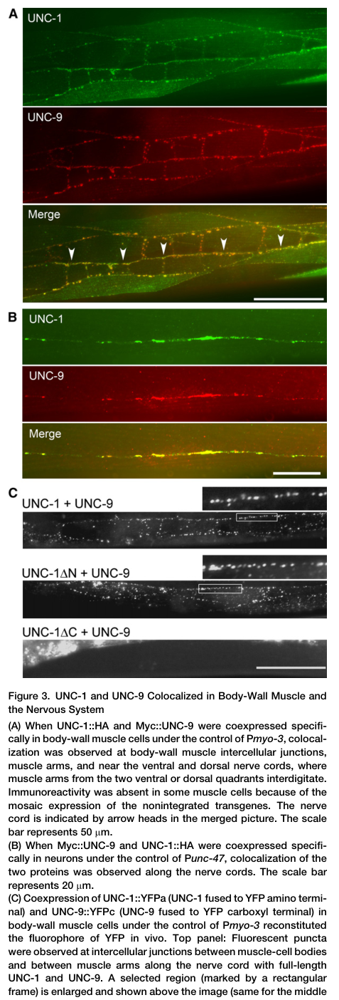

## Question

# Gene Research for Functional Annotation

## ⚠️ CRITICAL: Gene/Protein Identification Context

**BEFORE YOU BEGIN RESEARCH:** You MUST verify you are researching the CORRECT gene/protein. Gene symbols can be ambiguous, especially for less well-characterized genes from non-model organisms.

### Target Gene/Protein Identity (from UniProt):
- **UniProt Accession:** Q21190
- **Protein Description:** RecName: Full=Protein unc-1; AltName: Full=Uncoordinated protein 1;
- **Gene Information:** Name=unc-1; ORFNames=K03E6.5;
- **Organism (full):** Caenorhabditis elegans.
- **Protein Family:** Belongs to the band 7/mec-2 family. .
- **Key Domains:** Band-7_stomatin-like. (IPR043202); Band_7. (IPR001107); Band_7/SPFH_dom_sf. (IPR036013); Band_7/stomatin-like_CS. (IPR018080); Stomatin_HflK_fam. (IPR001972)

### MANDATORY VERIFICATION STEPS:

1. **Check if the gene symbol "unc-1" matches the protein description above**
2. **Verify the organism is correct:** Caenorhabditis elegans.
3. **Check if protein family/domains align with what you find in literature**
4. **If you find literature for a DIFFERENT gene with the same or similar symbol, STOP**

### If Gene Symbol is Ambiguous or You Cannot Find Relevant Literature:

**DO NOT PROCEED WITH RESEARCH ON A DIFFERENT GENE.** Instead:
- State clearly: "The gene symbol 'unc-1' is ambiguous or literature is limited for this specific protein"
- Explain what you found (e.g., "Found extensive literature on a different gene with the same symbol in a different organism")
- Describe the protein based ONLY on the UniProt information provided above
- Suggest that the protein function can be inferred from domain/family information

### Research Target:

Please provide a comprehensive research report on the gene **unc-1** (gene ID: unc-1, UniProt: Q21190) in worm.

The research report should be a detailed narrative explaining the function, biological processes, and localization of the gene product. Citations should be given for all claims.

You should prioritize authoritative reviews and primary scientific literature when conducting research. You can supplement
this with annotations you find in gene/protein databases, but these can be outdated or inaccurate.

We are specifically interested in the primary function of the gene - for enzymes, what reaction is catalyzed, and what is the substrate specificity? For transporters, what is the substrate? For structural proteins or adapters, what is the broader structural role? For signaling molecules, what is the role in the pathway.

We are interested in where in or outside the cell the gene product carries out its function.

We are also interested in the signaling or biochemical pathways in which the gene functions. We are less interested in broad pleiotropic effects, except where these elucidate the precise role.

Include evidence where possible. We are interested in both experimental evidence as well as inference from structure, evolution, or bioinformatic analysis. Precise studies should be prioritized over high-throughput, where available.

## Output

Question: You are an expert researcher providing comprehensive, well-cited information.

Provide detailed information focusing on:
1. Key concepts and definitions with current understanding
2. Recent developments and latest research (prioritize 2023-2024 sources)
3. Current applications and real-world implementations
4. Expert opinions and analysis from authoritative sources
5. Relevant statistics and data from recent studies

Format as a comprehensive research report with proper citations. Include URLs and publication dates where available.
Always prioritize recent, authoritative sources and provide specific citations for all major claims.

# Gene Research for Functional Annotation

## ⚠️ CRITICAL: Gene/Protein Identification Context

**BEFORE YOU BEGIN RESEARCH:** You MUST verify you are researching the CORRECT gene/protein. Gene symbols can be ambiguous, especially for less well-characterized genes from non-model organisms.

### Target Gene/Protein Identity (from UniProt):
- **UniProt Accession:** Q21190
- **Protein Description:** RecName: Full=Protein unc-1; AltName: Full=Uncoordinated protein 1;
- **Gene Information:** Name=unc-1; ORFNames=K03E6.5;
- **Organism (full):** Caenorhabditis elegans.
- **Protein Family:** Belongs to the band 7/mec-2 family. .
- **Key Domains:** Band-7_stomatin-like. (IPR043202); Band_7. (IPR001107); Band_7/SPFH_dom_sf. (IPR036013); Band_7/stomatin-like_CS. (IPR018080); Stomatin_HflK_fam. (IPR001972)

### MANDATORY VERIFICATION STEPS:

1. **Check if the gene symbol "unc-1" matches the protein description above**
2. **Verify the organism is correct:** Caenorhabditis elegans.
3. **Check if protein family/domains align with what you find in literature**
4. **If you find literature for a DIFFERENT gene with the same or similar symbol, STOP**

### If Gene Symbol is Ambiguous or You Cannot Find Relevant Literature:

**DO NOT PROCEED WITH RESEARCH ON A DIFFERENT GENE.** Instead:
- State clearly: "The gene symbol 'unc-1' is ambiguous or literature is limited for this specific protein"
- Explain what you found (e.g., "Found extensive literature on a different gene with the same symbol in a different organism")
- Describe the protein based ONLY on the UniProt information provided above
- Suggest that the protein function can be inferred from domain/family information

### Research Target:

Please provide a comprehensive research report on the gene **unc-1** (gene ID: unc-1, UniProt: Q21190) in worm.

The research report should be a detailed narrative explaining the function, biological processes, and localization of the gene product. Citations should be given for all claims.

You should prioritize authoritative reviews and primary scientific literature when conducting research. You can supplement
this with annotations you find in gene/protein databases, but these can be outdated or inaccurate.

We are specifically interested in the primary function of the gene - for enzymes, what reaction is catalyzed, and what is the substrate specificity? For transporters, what is the substrate? For structural proteins or adapters, what is the broader structural role? For signaling molecules, what is the role in the pathway.

We are interested in where in or outside the cell the gene product carries out its function.

We are also interested in the signaling or biochemical pathways in which the gene functions. We are less interested in broad pleiotropic effects, except where these elucidate the precise role.

Include evidence where possible. We are interested in both experimental evidence as well as inference from structure, evolution, or bioinformatic analysis. Precise studies should be prioritized over high-throughput, where available.

# Research report: functional annotation of *C. elegans* **unc-1** (UniProt Q21190)

## Scope and identity verification
The target gene **unc-1** in this report is the *Caenorhabditis elegans* stomatin-like/band-7 (SPFH) family protein corresponding to UniProt **Q21190** (“Protein unc-1 / Uncoordinated protein 1”), consistent with primary literature describing UNC-1 as a **stomatin-like membrane protein** that regulates **innexin gap junctions** (especially UNC-9) and affects locomotion and other circuit-level phenotypes. (chen2007unc1regulatesgap pages 3-4, meng2016regulationofneuronal pages 1-2, gomez‐escribano2023changesinlipid pages 1-2)

## 1) Key concepts and definitions (current understanding)

### 1.1 Stomatin-like (SPFH/band-7) proteins
UNC-1 is part of the stomatin-like/SPFH (band-7) superfamily, a group of membrane-associated proteins often implicated in organizing membrane microdomains and modulating membrane proteins rather than acting as enzymes. This general conceptual framing is consistent with review-level descriptions placing UNC-1 with other *C. elegans* stomatin-family proteins (e.g., MEC-2, UNC-24) and with its experimentally supported role as a regulator of gap junction function. (hoegg2010structuralandfunctional pages 33-36, kuznetsov2016gapjunctionsin pages 9-11)

### 1.2 Gap junctions and innexins in *C. elegans*
*Caenorhabditis elegans* gap junctions are formed by **innexins** (invertebrate analogs of connexins), and are essential for rapid electrical and metabolic coupling in neural and non-neural tissues; multiple reviews emphasize that gap junction function is widespread and circuit-specific. In this context, UNC-1 is discussed as a regulatory factor for gap junction efficacy, challenging the older view that innexins function only as standalone channel subunits. (kuznetsov2016gapjunctionsin pages 9-11, jin2020gapjunctionshistoricalb pages 5-5)

## 2) Molecular function and mechanism

### 2.1 Primary molecular function: regulation of UNC-9 gap junctions
A foundational mechanistic study concluded that UNC-1 is a **regulator of gap junctions formed by UNC-9** and that unc-1 loss-of-function (lf) phenotypes overlap with unc-9(lf) phenotypes in locomotion, supporting a shared functional pathway. (chen2007unc1regulatesgap pages 3-4)

### 2.2 Evidence for physical proximity/complex association with UNC-9
Chen et al. (2007; *Current Biology*, published Aug 2007; https://doi.org/10.1016/j.cub.2007.06.060) used **bimolecular fluorescence complementation (BiFC)** to show punctate fluorescence at muscle intercellular junctions when UNC-1 and UNC-9 were fused to complementary YFP fragments, indicating close proximity consistent with being in the same junctional complex; importantly, the BiFC puncta required the UNC-1 **C-terminus** (deletion of aa 171–289 abolished puncta). (chen2007unc1regulatesgap pages 3-4)

An illustrative example of UNC-1/UNC-9 colocalization and BiFC junctional puncta (including the UNC-1 C-terminal dependence) is shown in the retrieved figure crop. (chen2007unc1regulatesgap media 2c4b6004)

### 2.3 UNC-1 is not universally required for UNC-9 puncta formation/steady-state localization
Although UNC-1 is functionally important for UNC-9-dependent gap junction output, UNC-9 immunostaining patterns were reported as **unaltered in unc-1(e719)** mutants, suggesting UNC-1 is not strictly required for UNC-9 steady-state localization/trafficking in that assay context. (chen2007unc1regulatesgap pages 3-4)

Consistent with this, in PLM neurons, unc-1 loss-of-function did **not** disrupt the formation of UNC-9 puncta (interpreted as bona fide gap junction puncta in that study), supporting a model in which UNC-1 modulates **functional properties** (e.g., gating/efficiency/complex behavior) rather than being a universal assembly factor. (meng2016regulationofgap pages 2-4)

## 3) Cellular and subcellular localization

### 3.1 Tissue/cell-type requirement: primarily neuronal for locomotory function
In the 2007 study, neuronal (but not muscle) expression of wild-type **unc-1** or **unc-9** largely rescued the corresponding locomotion defects, supporting that UNC-1’s key behavioral role is **predominantly neuronal**, even though UNC-1 and UNC-9 can be visualized at muscle junctions in imaging assays. (chen2007unc1regulatesgap pages 3-4)

### 3.2 Neuron–glia roles and developmental localization (functional)
A genetic screen for RME axon specification defects identified unc-1 as a conserved stomatin-family gene required in both **GLR glia** and **RME neurons**, placing UNC-1 functionally at the neuron–glia interface where gap junctions mediate calcium-dependent signaling to influence neuronal polarity/axon specification. (meng2016regulationofneuronal pages 1-2)

## 4) Pathways and biological processes

### 4.1 Locomotion and circuit-level electrical coupling
UNC-1 is implicated in locomotory control through its regulation of innexin-based electrical synapses, especially UNC-9-dependent junctions. Reviews emphasize that many locomotor phenotypes arise from altered neuronal coupling, and describe UNC-1 as a modulator of gap junction efficiency. (chen2007unc1regulatesgap pages 3-4, kuznetsov2016gapjunctionsin pages 9-11)

### 4.2 Neuron–glia gap junction signaling controlling axon specification
Meng et al. (2016; *eLife*, published Oct 2016; https://doi.org/10.7554/eLife.19510) found that disruption of GLR–RME gap junctions affects RME axon specification via a pathway involving **calcium**, **calpain clp-4**, and **CDK-5**, and that unc-1(lf) phenotypes were consistent with UNC-1 acting as a regulator of these junctional signals in both glia and neuron. (meng2016regulationofneuronal pages 1-2)

### 4.3 Recent (2023) development: UNC-1 controls proteostasis via neurohormonal steroid-like signaling and lipid metabolism
A major recent advance is the linkage of UNC-1 to organism-wide **proteostasis** via neurohormonal signaling.

Gómez-Escribano et al. (2023; *EMBO Reports*, published Apr 2023; https://doi.org/10.15252/embr.202255556) identified unc-1 in a forward genetic screen in worms expressing muscle polyQ aggregation reporters (e.g., 35Q/40Q::YFP), reporting that unc-1 loss enhances polyglutamine aggregation and motor coordination defects. They propose that UNC-1 acts in neurons and modulates electrical synapses to regulate a sulfated-hormone signaling axis: UNC-1 activates signaling from **SSU-1** (a sulfotransferase) in **ASJ sensory/endocrine neurons**, producing a putative sulfated hormone that targets the nuclear receptor **NHR-1** in muscle to modulate aggregation, while **DAF-12** functions antagonistically. (gomez‐escribano2023changesinlipid pages 1-2)

Transcriptomic analyses in unc-1 mutants revealed altered expression of lipid metabolism genes, supporting a model in which UNC-1-dependent neural signaling rewires fat metabolism to influence proteostasis. (gomez‐escribano2023changesinlipid pages 1-2, gomez‐escribano2023changesinlipid pages 11-12)

## 5) Interacting partners and genetic dependencies

### 5.1 UNC-9 (innexin): most directly supported partner
UNC-9 is the best-supported direct partner at the molecular/cellular level based on colocalization and BiFC evidence and shared phenotypes/rescue logic. (chen2007unc1regulatesgap pages 3-4, chen2007unc1regulatesgap media 2c4b6004)

### 5.2 Innexin pathway context and quantitative electrophysiology anchor
A nematode gap junction review summarizes electrophysiology showing that **unc-9 knockout decreased junctional conductance by 67%** in body-wall muscle in prior work, providing a quantitative anchor for how strongly UNC-9 contributes to coupling in a tissue where UNC-1 has been investigated as a regulator. (kuznetsov2016gapjunctionsin pages 9-11)

### 5.3 Neurohormonal/proteostasis pathway partners (2023)
The 2023 EMBO Reports study defines a signaling module involving **SSU-1 → NHR-1** (with **DAF-12** opposing NHR-1 action) that connects neuronal UNC-1 function to muscle proteostasis and lipid metabolism gene expression. (gomez‐escribano2023changesinlipid pages 1-2, gomez‐escribano2023changesinlipid pages 11-12)

## 6) Quantitative findings and statistics (from accessible evidence)

### 6.1 Quantification of aggregation phenotypes and experimental design (2023)
In the EMBO Reports study, polyQ inclusion bodies in muscle were manually scored, with sample sizes reported as **n = 30 worms** for some comparisons and **>55** or **>65 worms** for others, with **≥3 biological repeats**, and significance reported (e.g., ***P < 0.001** in key analyses using ANOVA/Tukey or Mann–Whitney tests as described). (gomez‐escribano2023changesinlipid pages 9-10)

### 6.2 Lipidomics/metabolomics changes and rescue by oleic acid (2023)
The 2023 work reports that unc-1 mutants show increased neutral lipid staining but reduced triglycerides, and that multiple fatty acids (including **stearic acid**) were significantly reduced in mutants relative to wild type; decreases were also noted for palmitic, palmitoleic, oleic, γ-linoleic and dihomo-γ-linoleic acids. (gomez‐escribano2023changesinlipid pages 12-13)

Functionally, **2 mM oleic acid** supplementation reduced polyQ aggregation in 40Q worms and was described as more effective in unc-1 mutants; this effect depended on NHR-1 function (not observed in nhr-1(vlt16)). (gomez‐escribano2023changesinlipid pages 12-13)

### 6.3 Transcriptomic scope (2023)
In the same study, nhr-1 ablation in the unc-1 background was reported to rescue expression of **532 genes**, and pathway enrichment analyses implicated lipid metabolism programs (fatty-acid metabolism/biosynthesis/degradation). (gomez‐escribano2023changesinlipid pages 11-12)

## 7) Current applications and real-world implementations

1. **Electrical synapse/gap junction biology in vivo:** unc-1 is used as a genetic and mechanistic handle to study how non-channel accessory proteins modulate innexin gap junction function and circuit output, including locomotion-related coupling and neuron–glia developmental signaling. (chen2007unc1regulatesgap pages 3-4, meng2016regulationofneuronal pages 1-2)
2. **Proteostasis and neuroendocrine regulation in disease-model worms:** unc-1 mutants serve as sensitizers/enhancers in *C. elegans* protein aggregation models, enabling dissection of steroid-like signaling and lipid metabolic mechanisms that modulate proteotoxic stress. (gomez‐escribano2023changesinlipid pages 1-2, gomez‐escribano2023changesinlipid pages 11-12)

## 8) Expert opinions and authoritative synthesis
Reviews of gap junction biology in *C. elegans* frame UNC-1 as part of a broader theme in which electrical synapses are dynamically regulated by accessory proteins and circuit context; these sources specifically highlight that the identification of UNC-1 as a gap-junction regulator challenged earlier assumptions that innexins alone define junctional performance. (kuznetsov2016gapjunctionsin pages 9-11, jin2020gapjunctionshistoricalb pages 5-5)

## 9) Limitations and gaps in currently accessible evidence

* Subcellular localization beyond “junctional puncta/colocalization” and cell-type requirement is incompletely resolved in the retrieved snippets; the available evidence supports association with junctional regions and neuronal/glial functional requirements, but does not provide a full domain-by-domain topology or comprehensive interactome. (chen2007unc1regulatesgap pages 3-4, meng2016regulationofneuronal pages 1-2)
* Numeric single-cell expression values (e.g., TPM per neuron) were not available in the evidence excerpts retrieved here, although the VISTA resource indicates that spatial single-neuron expression visualization is possible for unc-1. (barbier2013thestomatinsto6a pages 80-84)

## Summary table of evidence

| Evidence-supported role/claim | Mechanism/partners | Key experimental approach | Key quantitative/statistical details | Primary citations |
|---|---|---|---|---|
| **Verified identity:** UNC-1 is the *C. elegans* stomatin-like/SPFH-band-7 family protein corresponding to UniProt Q21190 and functions in gap-junction-related signaling rather than as an enzyme/transporter | Stomatin-like membrane protein; functionally linked to innexins, especially **UNC-9**; family context matches SPFH/band-7 domains | Cross-study genetic and cell-biological characterization in worm; review synthesis | No direct catalytic activity reported; evidence supports a regulatory/scaffolding membrane role rather than substrate transport | Chen **2007** https://doi.org/10.1016/j.cub.2007.06.060; Meng **2016** https://doi.org/10.7554/elife.19510; Gómez-Escribano **2023** https://doi.org/10.15252/embr.202255556 (chen2007unc1regulatesgap pages 3-4, meng2016regulationofneuronal pages 1-2, gomez‐escribano2023changesinlipid pages 1-2) |
| **Primary molecular function:** UNC-1 positively regulates gap junctions important to locomotion | **UNC-9 innexin** is the best-supported partner; UNC-1 acts as a regulator of UNC-9-containing junctions rather than being required for UNC-9 steady-state localization | Mutant phenotyping, rescue, colocalization, BiFC in body-wall muscle/neuronal contexts | Reviews cite **unc-9 knockout decreases junctional conductance by 67%** in muscle, providing the electrophysiologic context of the UNC-9 pathway regulated by UNC-1; unc-1 and unc-9 locomotion defects reported as similar in degree | Chen **2007** https://doi.org/10.1016/j.cub.2007.06.060; Kuznetsov **2016** https://doi.org/10.24412/cl-17707671; Simonsen **2014** https://doi.org/10.3389/fphys.2014.00040 (chen2007unc1regulatesgap pages 3-4, kuznetsov2016gapjunctionsin pages 9-11) |
| UNC-1 and UNC-9 are in close proximity/likely same junctional complex | Directly linked to **UNC-9** at intercellular junctions; UNC-1 C-terminus is required for BiFC puncta | **BiFC** (YFP fragment complementation) and immunocolocalization | BiFC puncta observed with full-length UNC-1 and with N-terminal deletion, but **lost when UNC-1 C-terminus (aa 171–289) was deleted**; puncta localized at muscle intercellular junctions and muscle arms | Chen **2007** https://doi.org/10.1016/j.cub.2007.06.060 (chen2007unc1regulatesgap pages 3-4, chen2007unc1regulatesgap media 2c4b6004) |
| UNC-1 is **not required for UNC-9 puncta formation/steady-state localization** in all contexts tested | Functional regulation of **UNC-9** likely occurs through gating/complex behavior rather than gross trafficking | UNC-9 staining/localization in unc-1 mutants; neuronal imaging of UNC-9 puncta | UNC-9 immunostaining pattern reported as **unaltered in unc-1(e719)**; in PLM neurons, unc-1 loss **did not affect UNC-9 puncta formation** | Chen **2007** https://doi.org/10.1016/j.cub.2007.06.060; Meng **2016** https://doi.org/10.1371/journal.pgen.1005948 (chen2007unc1regulatesgap pages 3-4, meng2016regulationofgap pages 2-4) |
| UNC-1 acts in **neurons and glia** to support gap-junction-dependent neural development | Functions in **RME neurons** and **GLR glial cells**; downstream pathway includes **Ca²⁺**, **calpain clp-4**, and **CDK-5** | Unbiased genetic screen, cell-specific analysis, phenotypic comparison with gap-junction mutants | unc-1(lf) axon-specification defects were phenocopied by mutating all RME-expressed gap-junction channels; no effect sizes given in snippet | Meng **2016** https://doi.org/10.7554/elife.19510 (meng2016regulationofneuronal pages 1-2) |
| UNC-1 contributes to proper synaptic organization in gap-junction-dependent circuits | Functional interplay with **UNC-7/UNC-9** gap junctions in RME–GLR circuits | Circuit-level genetic analysis and rescue summarized in review | Review notes unc-1 is required in both RME and GLR for proper synaptic vesicle localization; quantitative values not provided in snippet | Jin **2020** https://doi.org/10.1242/bio.053983; Meng **2016** https://doi.org/10.7554/elife.19510 (jin2020gapjunctionshistoricalb pages 5-5, meng2016regulationofneuronal pages 1-2) |
| **Recent (2023) discovery:** UNC-1 regulates **proteostasis** non-cell-autonomously | Neuronal **UNC-1** modulates a neurohormonal axis involving **SSU-1** (ASJ sulfotransferase) → putative sulfated hormone → **NHR-1** in muscle; **DAF-12** acts antagonistically/protectively | Forward chemical mutagenesis screen using **35Q/40Q::YFP** aggregation reporters; genetic epistasis; rescue; transcriptomics | unc-1 loss enhanced polyQ aggregation and motor defects; inclusion-body scoring used with **n = 30** worms in some panels, **>55** or **>65** in others, experiments repeated **≥3 times**, with ***P < 0.001** reported for key comparisons | Gómez-Escribano **2023** https://doi.org/10.15252/embr.202255556 (gomez‐escribano2023changesinlipid pages 1-2, gomez‐escribano2023changesinlipid pages 9-10) |
| UNC-1-dependent proteostasis control is linked to **lipid metabolism remodeling** | **NHR-1**-dependent transcriptional changes affect fatty-acid synthesis/elongation/desaturation genes (**pod-2, fasn-1, elo-1/2/5/6, fat-5/6/7**); **DAF-12** opposes NHR-1 effects | Transcriptomics, GO/KEGG, RNAi feeding, CRISPR genetics | **532 genes** rescued by nhr-1 ablation in unc-1 background; unc-1 and daf-12 reported as **synthetically lethal**; lipid-metabolism categories enriched in GO/KEGG analyses | Gómez-Escribano **2023** https://doi.org/10.15252/embr.202255556 (gomez‐escribano2023changesinlipid pages 11-12) |
| UNC-1 mutants show altered lipid composition consistent with impaired protective unsaturated FA metabolism | Excess sulfated signal from **ASJ/SSU-1** and downstream **SUL-2/SUL-3** arylsulfatases; altered FA pools likely contribute to proteostasis defects | Untargeted lipidomics, Oil Red O/neutral lipid staining, metabolite profiling | unc-1 mutants showed **increased neutral lipid staining but reduced triglycerides**; **stearic acid significantly lower**; decreases also reported for **palmitic, palmitoleic, oleic, γ-linoleic, and dihomo-γ-linoleic acids** | Gómez-Escribano **2023** https://doi.org/10.15252/embr.202255556 (gomez‐escribano2023changesinlipid pages 12-13, gomezescribano2019opposingsteroidsignals pages 18-20) |
| Supplementing protective lipid species can ameliorate aggregation phenotypes linked to unc-1 pathway dysfunction | **Oleic acid** acts downstream/parallel to lipid-metabolic defects; effect depends on steroid-signaling context including **NHR-1** | Chemical supplementation in aggregation assay | **2 mM oleic acid** reduced polyQ aggregation in 40Q worms and was reported to be **more effective in unc-1 mutants**; oleic acid effect failed in **nhr-1(vlt16)** background | Gómez-Escribano **2023** https://doi.org/10.15252/embr.202255556 (gomez‐escribano2023changesinlipid pages 12-13) |
| unc-1 function is largely **neuronal** for locomotory rescue despite visible muscle colocalization with UNC-9 | Neuronal UNC-1/UNC-9 support behavior; muscle localization alone is insufficient to explain rescue | Tissue-specific rescue | **Neuronal** expression of wild-type unc-1 or unc-9 largely rescued locomotion defects, whereas **muscle expression did not** | Chen **2007** https://doi.org/10.1016/j.cub.2007.06.060 (chen2007unc1regulatesgap pages 3-4) |

*Table: This table summarizes evidence-supported functions, mechanisms, methods, and quantitative findings for C. elegans UNC-1/Q21190. It emphasizes primary experimental support for UNC-1 as a stomatin-like regulator of gap junctions and neurohormonal proteostasis signaling.*

## Key primary sources (publication dates and URLs)

* Chen B, Liu Q, Ge Q, Xie J, Wang Z-W. **UNC-1 Regulates Gap Junctions Important to Locomotion in *C. elegans***. *Current Biology*. **Aug 2007**. https://doi.org/10.1016/j.cub.2007.06.060 (chen2007unc1regulatesgap pages 3-4)
* Meng L, Zhang A, Jin Y, Yan D. **Regulation of neuronal axon specification by glia-neuron gap junctions in *C. elegans***. *eLife*. **Oct 2016**. https://doi.org/10.7554/eLife.19510 (meng2016regulationofneuronal pages 1-2)
* Gómez-Escribano AP et al. **Changes in lipid metabolism driven by steroid signalling modulate proteostasis in *C. elegans***. *EMBO Reports*. **Apr 2023**. https://doi.org/10.15252/embr.202255556 (gomez‐escribano2023changesinlipid pages 1-2)
* Kuznetsov VP et al. **Gap junctions in nematodes**. *Russian Journal of Nematology*. **Jan 2016**. https://doi.org/10.24412/cl-17707671 (kuznetsov2016gapjunctionsin pages 9-11)
* Jin EJ et al. **Gap junctions: historical discoveries and new findings in the *C. elegans* nervous system**. *Biology Open*. **Aug 2020**. https://doi.org/10.1242/bio.053983 (jin2020gapjunctionshistoricalb pages 5-5)

References

1. (chen2007unc1regulatesgap pages 3-4): Bojun Chen, Qiang Liu, Qian Ge, Jia Xie, and Zhao-Wen Wang. Unc-1 regulates gap junctions important to locomotion in c. elegans. Current Biology, 17:1334-1339, Aug 2007. URL: https://doi.org/10.1016/j.cub.2007.06.060, doi:10.1016/j.cub.2007.06.060. This article has 101 citations and is from a highest quality peer-reviewed journal.

2. (meng2016regulationofneuronal pages 1-2): Lingfeng Meng, Albert Zhang, Yishi Jin, and Dong Yan. Regulation of neuronal axon specification by glia-neuron gap junctions in c. elegans. eLife, Oct 2016. URL: https://doi.org/10.7554/elife.19510, doi:10.7554/elife.19510. This article has 34 citations and is from a domain leading peer-reviewed journal.

3. (gomez‐escribano2023changesinlipid pages 1-2): Ana P Gómez‐Escribano, Carlos Mora‐Martínez, Marta Roca, Denise S Walker, Joaquín Panadero, Maria D Sequedo, Ratni Saini, Hans‐Joachim Knölker, Jose Blanca, Juan Burguera, Agustin Lahoz, Joaquin Cañizares, José M Millán, Nick O Burton, William R Schafer, and Rafael P Vázquez‐Manrique. Changes in lipid metabolism driven by steroid signalling modulate proteostasis in c. elegans. EMBO Reports, Apr 2023. URL: https://doi.org/10.15252/embr.202255556, doi:10.15252/embr.202255556. This article has 7 citations and is from a highest quality peer-reviewed journal.

4. (hoegg2010structuralandfunctional pages 33-36): MB Hoegg. Structural and functional characterization of the endoplasmic reticulum lipid raft-associated proteins (erlins). Unknown journal, 2010.

5. (kuznetsov2016gapjunctionsin pages 9-11): Victor P. Kuznetsov, Georgy A. Slivko-Koltchik, Lyudmila B. Popova, and Yuri V. Panchin. Gap junctions in nematodes. Text, Jan 2016. URL: https://doi.org/10.24412/cl-17707671, doi:10.24412/cl-17707671. This article has 11 citations and is from a peer-reviewed journal.

6. (jin2020gapjunctionshistoricalb pages 5-5): EJ Jin, S Park, and X Lyu. Gap junctions: historical discoveries and new findings in the c aenorhabditis elegans. Unknown journal, 2020.

7. (chen2007unc1regulatesgap media 2c4b6004): Bojun Chen, Qiang Liu, Qian Ge, Jia Xie, and Zhao-Wen Wang. Unc-1 regulates gap junctions important to locomotion in c. elegans. Current Biology, 17:1334-1339, Aug 2007. URL: https://doi.org/10.1016/j.cub.2007.06.060, doi:10.1016/j.cub.2007.06.060. This article has 101 citations and is from a highest quality peer-reviewed journal.

8. (meng2016regulationofgap pages 2-4): Lingfeng Meng, Chia-hui Chen, and Dong Yan. Regulation of gap junction dynamics by unc-44/ankyrin and unc-33/crmp through vab-8 in c. elegans neurons. PLOS Genetics, 12:e1005948, Mar 2016. URL: https://doi.org/10.1371/journal.pgen.1005948, doi:10.1371/journal.pgen.1005948. This article has 34 citations and is from a domain leading peer-reviewed journal.

9. (gomez‐escribano2023changesinlipid pages 11-12): Ana P Gómez‐Escribano, Carlos Mora‐Martínez, Marta Roca, Denise S Walker, Joaquín Panadero, Maria D Sequedo, Ratni Saini, Hans‐Joachim Knölker, Jose Blanca, Juan Burguera, Agustin Lahoz, Joaquin Cañizares, José M Millán, Nick O Burton, William R Schafer, and Rafael P Vázquez‐Manrique. Changes in lipid metabolism driven by steroid signalling modulate proteostasis in c. elegans. EMBO Reports, Apr 2023. URL: https://doi.org/10.15252/embr.202255556, doi:10.15252/embr.202255556. This article has 7 citations and is from a highest quality peer-reviewed journal.

10. (gomez‐escribano2023changesinlipid pages 9-10): Ana P Gómez‐Escribano, Carlos Mora‐Martínez, Marta Roca, Denise S Walker, Joaquín Panadero, Maria D Sequedo, Ratni Saini, Hans‐Joachim Knölker, Jose Blanca, Juan Burguera, Agustin Lahoz, Joaquin Cañizares, José M Millán, Nick O Burton, William R Schafer, and Rafael P Vázquez‐Manrique. Changes in lipid metabolism driven by steroid signalling modulate proteostasis in c. elegans. EMBO Reports, Apr 2023. URL: https://doi.org/10.15252/embr.202255556, doi:10.15252/embr.202255556. This article has 7 citations and is from a highest quality peer-reviewed journal.

11. (gomez‐escribano2023changesinlipid pages 12-13): Ana P Gómez‐Escribano, Carlos Mora‐Martínez, Marta Roca, Denise S Walker, Joaquín Panadero, Maria D Sequedo, Ratni Saini, Hans‐Joachim Knölker, Jose Blanca, Juan Burguera, Agustin Lahoz, Joaquin Cañizares, José M Millán, Nick O Burton, William R Schafer, and Rafael P Vázquez‐Manrique. Changes in lipid metabolism driven by steroid signalling modulate proteostasis in c. elegans. EMBO Reports, Apr 2023. URL: https://doi.org/10.15252/embr.202255556, doi:10.15252/embr.202255556. This article has 7 citations and is from a highest quality peer-reviewed journal.

12. (barbier2013thestomatinsto6a pages 80-84): LWC Barbier. The stomatin sto-6 is a novel regulator of the caenorhabditis elegans motor circuit. Unknown journal, 2013.

13. (gomezescribano2019opposingsteroidsignals pages 18-20): AP Gómez-Escribano, C. Mora-Martínez, M. Roca, Denise S Walker, J. Panadero, M. Sequedo, R. Saini, HJ Knölker, J. Blanca, J. Burguera, A. Lahoz, J. Cañizares, J. Millán, N. Burton, WR Schafer, and R. Vázquez-Manrique. Opposing steroid signals modulate protein homeostasis through deep changes in fat metabolism in caenorhabditis elegans. bioRxiv, Feb 2019. URL: https://doi.org/10.1101/551580, doi:10.1101/551580. This article has 2 citations.

## Artifacts

- [Edison artifact artifact-00](unc-1-deep-research-falcon_artifacts/artifact-00.md)

## Citations

1. meng2016regulationofgap pages 2-4
2. meng2016regulationofneuronal pages 1-2
3. kuznetsov2016gapjunctionsin pages 9-11
4. jin2020gapjunctionshistoricalb pages 5-5
5. hoegg2010structuralandfunctional pages 33-36
6. gomezescribano2019opposingsteroidsignals pages 18-20
7. https://doi.org/10.1016/j.cub.2007.06.060
8. https://doi.org/10.7554/eLife.19510
9. https://doi.org/10.15252/embr.202255556
10. https://doi.org/10.1016/j.cub.2007.06.060;
11. https://doi.org/10.7554/elife.19510;
12. https://doi.org/10.24412/cl-17707671;
13. https://doi.org/10.3389/fphys.2014.00040
14. https://doi.org/10.1371/journal.pgen.1005948
15. https://doi.org/10.7554/elife.19510
16. https://doi.org/10.1242/bio.053983;
17. https://doi.org/10.24412/cl-17707671
18. https://doi.org/10.1242/bio.053983
19. https://doi.org/10.1016/j.cub.2007.06.060,
20. https://doi.org/10.7554/elife.19510,
21. https://doi.org/10.15252/embr.202255556,
22. https://doi.org/10.24412/cl-17707671,
23. https://doi.org/10.1371/journal.pgen.1005948,
24. https://doi.org/10.1101/551580,