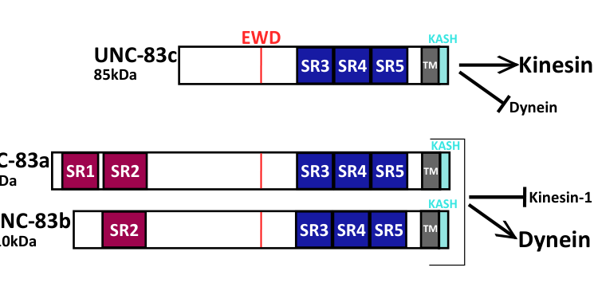

## Question

# Gene Research for Functional Annotation

## ⚠️ CRITICAL: Gene/Protein Identification Context

**BEFORE YOU BEGIN RESEARCH:** You MUST verify you are researching the CORRECT gene/protein. Gene symbols can be ambiguous, especially for less well-characterized genes from non-model organisms.

### Target Gene/Protein Identity (from UniProt):
- **UniProt Accession:** Q23064
- **Protein Description:** RecName: Full=Nuclear migration protein unc-83; AltName: Full=Uncoordinated protein 83;
- **Gene Information:** Name=unc-83 {ECO:0000303|PubMed:11748140, ECO:0000312|WormBase:W01A11.3a}; ORFNames=W01A11.3 {ECO:0000312|WormBase:W01A11.3a};
- **Organism (full):** Caenorhabditis elegans.
- **Protein Family:** Not specified in UniProt
- **Key Domains:** UNC83_middle_bundle. (IPR062708); UNC83_N. (IPR062690); UNC83_four_bundle (PF29149); UNC83_middle_bundle (PF29152); UNC83_N (PF29142)

### MANDATORY VERIFICATION STEPS:

1. **Check if the gene symbol "unc-83" matches the protein description above**
2. **Verify the organism is correct:** Caenorhabditis elegans.
3. **Check if protein family/domains align with what you find in literature**
4. **If you find literature for a DIFFERENT gene with the same or similar symbol, STOP**

### If Gene Symbol is Ambiguous or You Cannot Find Relevant Literature:

**DO NOT PROCEED WITH RESEARCH ON A DIFFERENT GENE.** Instead:
- State clearly: "The gene symbol 'unc-83' is ambiguous or literature is limited for this specific protein"
- Explain what you found (e.g., "Found extensive literature on a different gene with the same symbol in a different organism")
- Describe the protein based ONLY on the UniProt information provided above
- Suggest that the protein function can be inferred from domain/family information

### Research Target:

Please provide a comprehensive research report on the gene **unc-83** (gene ID: unc-83, UniProt: Q23064) in worm.

The research report should be a detailed narrative explaining the function, biological processes, and localization of the gene product. Citations should be given for all claims.

You should prioritize authoritative reviews and primary scientific literature when conducting research. You can supplement
this with annotations you find in gene/protein databases, but these can be outdated or inaccurate.

We are specifically interested in the primary function of the gene - for enzymes, what reaction is catalyzed, and what is the substrate specificity? For transporters, what is the substrate? For structural proteins or adapters, what is the broader structural role? For signaling molecules, what is the role in the pathway.

We are interested in where in or outside the cell the gene product carries out its function.

We are also interested in the signaling or biochemical pathways in which the gene functions. We are less interested in broad pleiotropic effects, except where these elucidate the precise role.

Include evidence where possible. We are interested in both experimental evidence as well as inference from structure, evolution, or bioinformatic analysis. Precise studies should be prioritized over high-throughput, where available.

## Output

Question: You are an expert researcher providing comprehensive, well-cited information.

Provide detailed information focusing on:
1. Key concepts and definitions with current understanding
2. Recent developments and latest research (prioritize 2023-2024 sources)
3. Current applications and real-world implementations
4. Expert opinions and analysis from authoritative sources
5. Relevant statistics and data from recent studies

Format as a comprehensive research report with proper citations. Include URLs and publication dates where available.
Always prioritize recent, authoritative sources and provide specific citations for all major claims.

# Gene Research for Functional Annotation

## ⚠️ CRITICAL: Gene/Protein Identification Context

**BEFORE YOU BEGIN RESEARCH:** You MUST verify you are researching the CORRECT gene/protein. Gene symbols can be ambiguous, especially for less well-characterized genes from non-model organisms.

### Target Gene/Protein Identity (from UniProt):
- **UniProt Accession:** Q23064
- **Protein Description:** RecName: Full=Nuclear migration protein unc-83; AltName: Full=Uncoordinated protein 83;
- **Gene Information:** Name=unc-83 {ECO:0000303|PubMed:11748140, ECO:0000312|WormBase:W01A11.3a}; ORFNames=W01A11.3 {ECO:0000312|WormBase:W01A11.3a};
- **Organism (full):** Caenorhabditis elegans.
- **Protein Family:** Not specified in UniProt
- **Key Domains:** UNC83_middle_bundle. (IPR062708); UNC83_N. (IPR062690); UNC83_four_bundle (PF29149); UNC83_middle_bundle (PF29152); UNC83_N (PF29142)

### MANDATORY VERIFICATION STEPS:

1. **Check if the gene symbol "unc-83" matches the protein description above**
2. **Verify the organism is correct:** Caenorhabditis elegans.
3. **Check if protein family/domains align with what you find in literature**
4. **If you find literature for a DIFFERENT gene with the same or similar symbol, STOP**

### If Gene Symbol is Ambiguous or You Cannot Find Relevant Literature:

**DO NOT PROCEED WITH RESEARCH ON A DIFFERENT GENE.** Instead:
- State clearly: "The gene symbol 'unc-83' is ambiguous or literature is limited for this specific protein"
- Explain what you found (e.g., "Found extensive literature on a different gene with the same symbol in a different organism")
- Describe the protein based ONLY on the UniProt information provided above
- Suggest that the protein function can be inferred from domain/family information

### Research Target:

Please provide a comprehensive research report on the gene **unc-83** (gene ID: unc-83, UniProt: Q23064) in worm.

The research report should be a detailed narrative explaining the function, biological processes, and localization of the gene product. Citations should be given for all claims.

You should prioritize authoritative reviews and primary scientific literature when conducting research. You can supplement
this with annotations you find in gene/protein databases, but these can be outdated or inaccurate.

We are specifically interested in the primary function of the gene - for enzymes, what reaction is catalyzed, and what is the substrate specificity? For transporters, what is the substrate? For structural proteins or adapters, what is the broader structural role? For signaling molecules, what is the role in the pathway.

We are interested in where in or outside the cell the gene product carries out its function.

We are also interested in the signaling or biochemical pathways in which the gene functions. We are less interested in broad pleiotropic effects, except where these elucidate the precise role.

Include evidence where possible. We are interested in both experimental evidence as well as inference from structure, evolution, or bioinformatic analysis. Precise studies should be prioritized over high-throughput, where available.

# Functional annotation report: *C. elegans unc-83* (UniProt Q23064)

## Executive conclusion

**UNC-83 is not an enzyme or solute transporter.** It is a developmentally regulated, outer-nuclear-membrane KASH protein that acts as a **mechanical cargo adaptor and motor regulator**. Its C-terminal KASH segment binds the inner-nuclear-membrane SUN protein UNC-84 across the perinuclear lumen, while its large cytoplasmic region recruits and regulates kinesin-1 and cytoplasmic dynein. The resulting UNC-83–UNC-84 LINC complex transmits microtubule-motor force across the nuclear envelope to move nuclei during development. The best-supported functions occur in embryonic hyp7 precursors, larval P cells, intestinal cells, and body-wall muscle cells. Recent work shows that UNC-83 isoforms can bias motor output according to developmental context and that parallel actin-, filamin-like-, and chromatin-dependent pathways help nuclei traverse constrictions.

## 1. Identity verification

The supplied UniProt record identifies **Q23064** as *Caenorhabditis elegans* nuclear migration protein UNC-83, encoded by ***unc-83***, ORF **W01A11.3**. The literature retrieved consistently concerns the same organism and the same nuclear-envelope KASH protein: it forms a LINC complex with UNC-84, controls developmental nuclear migration, and has the expected C-terminal transmembrane/KASH topology. No conflicting same-symbol protein from another organism was used.

A qualification is necessary: the papers examined generally refer to the gene as *unc-83* rather than explicitly printing the UniProt accession Q23064 or ORF W01A11.3. Therefore, the accession-to-ORF mapping comes from the supplied UniProt record, while identity in the literature is corroborated by organism, gene name, localization, topology, interaction partner, and phenotype. Foundational studies identified *unc-83* as a nuclear-envelope component and later established it as a KASH protein recruited to the outer nuclear membrane by SUN protein UNC-84 (McGee et al., April 2006, https://doi.org/10.1091/mbc.e05-09-0894). (ho2023acdc42regulatedactin pages 12-14, starr2019anetworkof pages 2-4)

## 2. Molecular class, architecture, and localization

UNC-83 belongs functionally to the **KASH-protein arm of LINC complexes**. LINC complexes consist of an inner-nuclear-membrane SUN protein and an outer-nuclear-membrane KASH protein. In this pair, UNC-84 is the SUN protein and UNC-83 is the KASH protein. UNC-83's major domain is exposed to the cytoplasm, its single transmembrane helix anchors it in the outer nuclear membrane, and its short C-terminal KASH peptide projects into the perinuclear lumen to contact UNC-84. A functional UNC-83::GFP::KASH fusion localized to the nuclear envelope and supported normal hyp7 and P-cell nuclear migration, experimentally supporting both localization and topology. (bone2016nucleimigratethrough pages 11-14, starr2019anetworkof pages 1-2)

The luminal KASH peptide is unusually short—approximately 18 residues—and lacks some features of longer canonical KASH domains, including the canonical cysteine used by some SUN–KASH pairs to form an intermolecular disulfide bond. Nevertheless, it forms a force-bearing SUN interaction. Adding a single alanine to the UNC-83 C terminus blocks migration, while substitution of the aromatic residue at position −7 allows substantial envelope localization but weakens productive SUN engagement and compromises movement. This demonstrates that precise KASH-terminal geometry, not merely membrane insertion, is essential. (starr2019anetworkof pages 2-4)

The supplied InterPro/Pfam annotations—UNC83_N, UNC83_middle_bundle, and UNC83_four_bundle—are compatible with a predominantly helical, bundle-rich cytoplasmic scaffold. Recent structural annotation depicts EWD-, TPR-, and spectrin-repeat-like regions, but these newer labels should not be treated as a fully established classical protein family. The 2025 domain diagrams show a common C-terminal transmembrane/KASH module and several predicted repeat regions in the cytoplasmic portion. (gumusderelioglu2025thekashprotein pages 42-46, gumusderelioglu2025thekashprotein media eaefa390)

## 3. Primary biochemical and structural function

### 3.1 Nuclear-envelope mechanical bridge

UNC-83's fundamental role is to connect a nucleus to cytoplasmic force generators. UNC-84 associates inwardly with the nuclear lamina/nucleoskeleton and outwardly with UNC-83 in the perinuclear space. UNC-83 then engages microtubule motors on the cytoplasmic face. Thus, motor-generated force is transmitted from microtubules through UNC-83 and UNC-84 to the nucleus. This is an adapter/mechanical-transmission function rather than catalysis or substrate transport. (ho2023acdc42regulatedactin pages 12-14, starr2019anetworkof pages 2-4, starr2019anetworkof pages 1-2)

UNC-84 is required for correct outer-envelope recruitment or retention of UNC-83. This dependence distinguishes UNC-83 from a generic endoplasmic-reticulum membrane protein and explains its nuclear specificity: SUN–KASH binding concentrates the adapter at the nuclear envelope where force must be applied. (ho2023acdc42regulatedactin pages 12-14)

### 3.2 Kinesin-1 recruitment and regulation

UNC-83 was initially characterized as a nuclear-specific cargo adaptor for kinesin-1. In the commonly analyzed UNC-83c sequence, residues **137–342** interact with kinesin light chain KLC-2. New biochemical work indicates that W-acidic motifs engage the KLC-2 TPR region, while the N terminus of long UNC-83a can also bind kinesin heavy chain UNC-116 and inhibit or tune kinesin activity. (gumusderelioglu2025thekashprotein pages 1-5, bone2016nucleimigratethrough pages 11-14)

A March 2025 preprint provides the strongest current quantitative evidence for isoform-specific kinesin regulation. UNC-83c bound KLC-2 with **Kd = 0.15 µM**, whereas UNC-83a bound much more weakly, **Kd >1.0 µM**. Mass photometry detected an approximately **174-kDa UNC-83c–KLC-2 complex** with a 97% assignment, whereas UNC-83a did not form an equivalently robust complex under the tested conditions. These findings support a model in which the short isoform is a stronger kinesin-1 activator/adaptor and the long isoforms suppress excessive plus-end movement. This work is recent and mechanistically compelling but was reported as a preprint, not yet equivalent in evidentiary status to the older peer-reviewed genetic literature. (gumusderelioglu2025thekashprotein pages 46-48, gumusderelioglu2025thekashprotein media eaefa390, gumusderelioglu2025thekashprotein media 5f912f5b, gumusderelioglu2025thekashprotein media 8a1b8d38)

### 3.3 Dynein recruitment and bidirectional movement

UNC-83 also couples nuclei to cytoplasmic dynein. UNC-83c residues **362–692** interact with the dynein-associated proteins NUD-2 and DLC-1. Deleting residues 344–692 did not abolish nuclear-envelope localization but increased failed P-cell nuclear migrations from **0.2 ± 0.09 to 1.8 ± 0.31 nuclei per animal**, separating membrane targeting from motor-adaptor function. (bone2016nucleimigratethrough pages 11-14)

Kinesin and dynein are not simply redundant engines. Their relative importance depends on cell type and microtubule polarity, and limited movement in the opposite direction can help a large nucleus negotiate obstacles. In P cells, dynein is the dominant productive motor, but kinesin loss further aggravates dynein-pathway defects. This supports coordinated bidirectional transport rather than a simple one-motor model. (bone2016nucleimigratethrough pages 9-11, bone2016nucleimigratethrough pages 11-14)

## 4. Isoforms and developmental motor selection

Recent work identifies three isoforms sharing a 741-residue C-terminal region but possessing different N termini:

- **UNC-83a:** 1,041 aa;
- **UNC-83b:** 974 aa;
- **UNC-83c:** 741 aa.

The proposed developmental switch is that **UNC-83c promotes kinesin-1-dominant, plus-end-directed movement in embryonic hyp7 precursors**, whereas **UNC-83a/b favor dynein-dominant, minus-end-directed movement in larval P cells**. The UNC-83a-specific N-terminal region functions as a kinesin inhibitory module; deletion of its repeat-containing segment produces temperature-sensitive P-cell migration defects. Purified-protein assays and affinity measurements substantiate differential motor regulation, although the full in-vivo switch model remains recent preprint evidence. (gumusderelioglu2025thekashprotein pages 1-5, gumusderelioglu2025thekashprotein pages 27-31)

The domain architecture and differential KLC-2 affinity are visible in the retrieved experimental panels. (gumusderelioglu2025thekashprotein media eaefa390, gumusderelioglu2025thekashprotein media 5f912f5b)

## 5. Biological processes and tissue-specific functions

### Embryonic hyp7 precursor cells

During embryogenesis, hyp7 precursor nuclei move predominantly toward microtubule plus ends. UNC-83 recruits kinesin-1 to the nuclear surface, and kinesin disruption causes severe migration defects. Dynein contributes shorter reverse movements that may permit navigation around intracellular obstacles. Failed movement leaves nuclei abnormally positioned in the dorsal cord. (gumusderelioglu2025thekashprotein pages 1-5, gregory2023theinterplayof pages 24-29)

### Larval P cells and migration through constrictions

Six bilateral pairs of P cells move from lateral positions to the ventral cord through a narrow space between body-wall muscle and cuticle. UNC-83/UNC-84 connects their nuclei primarily to minus-end-directed dynein. If migration fails, affected P cells can die, eliminating descendants that normally contribute vulval cells and ventral-cord GABAergic neurons; this links the nuclear-positioning defect to egg-laying and locomotor phenotypes. (gumusderelioglu2025thekashprotein pages 1-5, bone2016nucleimigratethrough pages 9-11)

Quantitatively, dynein-heavy-chain mutants averaged **2.7 ± 0.30 missing GABA neurons**, kinesin-1 RNAi caused only **0.24–0.25**, combined disruption caused **4.9–5.0**, and an *unc-84* null caused **6.5 ± 0.60** missing neurons. These values show that dynein is dominant in P cells, kinesin makes a smaller cooperative contribution, and complete LINC disruption is more severe than disrupting either motor alone. (bone2016nucleimigratethrough pages 9-11)

### Body-wall muscle nuclei

Loss of UNC-83 or UNC-84 causes body-wall-muscle nuclei to accumulate near the posterior pharyngeal bulb. Total nuclear numbers remain nearly unchanged, demonstrating a positioning rather than proliferation phenotype. At L3, mutants had **7.8 versus 12.3** nuclei in the head, **28.3 versus 22.0** in the neck, and **58.5 versus 60.3** in the posterior body; totals were **94.7 versus 94.6**. Muscle-specific wild-type *unc-83* rescued the defect, supporting a cell-autonomous role. Whether this particular phenotype primarily represents defective migration, defective anchorage, or both remains unresolved. (ofenbauer2019characterizationofthe pages 43-48)

### Other developmental contexts

Classical genetic work also implicates UNC-83 in intestinal and additional hypodermal nuclear migrations. The broader interpretation is not that UNC-83 has many unrelated pleiotropic functions, but that a common nuclear-envelope motor-adaptor mechanism is reused wherever nuclei must be positioned against cytoplasmic resistance. (bone2016nucleimigratethrough pages 23-25, gregory2023theinterplayof pages 24-29)

## 6. Recent developments, 2023–2025

### Parallel CDC-42/actin mechanics—2023

Peer-reviewed 2023 work established that P-cell nuclear migration is not exclusively LINC dependent. A parallel pathway uses CGEF-1 to activate CDC-42, followed by WAVE/WASP and Arp2/3-dependent branched-actin assembly; non-muscle myosin II/NMY-2 also contributes. Constitutively active CDC-42 rescued the *cgef-1; unc-84* defect, supporting pathway order. The current model is that actin helps deform the nucleus and actomyosin helps push it through constrictions, although the exact force geometry is partly interpretive. Ho et al., published October 2023 in *Development*: https://doi.org/10.1242/dev.202115; preprint posted June 2023: https://doi.org/10.1101/2023.06.22.546138. (ho2023acdc42regulatedactin pages 33-33)

### Additional mechanical safeguards—2023–2024

A 2023 study identified FLN-2 as part of a third pathway operating in parallel with LINC and CDC-42/actin mechanisms. Its repeat region is required, and loss of FLN-2 in a LINC-deficient background increases nuclear-envelope rupture. This suggests that successful migration requires both force production and preservation of nuclear integrity; it does not establish FLN-2 as a direct UNC-83-binding protein.

A May 2024 preprint reported that CEC-4-dependent tethering of H3K9-methylated heterochromatin to the inner nuclear membrane facilitates P-cell migration, especially when LINC function is compromised. MET-2 and JMJD-1.2 also contribute. This pathway probably modifies nuclear mechanics rather than directly regulating UNC-83. Gregory et al., posted May 2024: https://doi.org/10.1101/2024.05.22.595380.

### Isoform-specific motor regulation—2025

The major post-2024 advance is the March 2025 preprint demonstrating that alternative UNC-83 isoforms directly alter kinesin-1 binding and activity. This changes the view of UNC-83 from a passive motor tether to a developmentally regulated conductor of opposing motors. The biochemical affinity measurements, reconstituted motor assays, CRISPR alleles, and tissue-specific rescue experiments together make this a strong model, although peer-review status should remain explicit. Gümüşderelioğlu et al., posted March 2025: https://doi.org/10.1101/2025.03.06.641899. (gumusderelioglu2025thekashprotein pages 1-5, gumusderelioglu2025thekashprotein pages 46-48, gumusderelioglu2025thekashprotein pages 27-31)

## 7. Evidence-weighted annotation summary

The following table separates established findings from newer inference and unresolved questions.

| Feature/question | Current conclusion | Strongest evidence/quantitative result | Evidence status | Key source with year/DOI |
|---|---|---|---|---|
| Target identity: Q23064 / W01A11.3 | The supplied UniProt record maps Q23064 and ORF W01A11.3 to *C. elegans unc-83*. Retrieved literature consistently concerns the same organism, KASH protein, nuclear-envelope localization, and nuclear-migration phenotype; however, the exact accession/ORF cross-reference was not independently stated in the papers examined. | Concordance of gene name, organism, KASH topology, UNC-84 partnership, and developmental phenotype; no conflicting same-symbol protein was found. | Database mapping direct; literature-to-accession linkage corroborative | UniProt identity supplied in query; Starr 2019, [DOI 10.1177/1535370219871965](https://doi.org/10.1177/1535370219871965) (starr2019anetworkof pages 2-4, starr2019anetworkof pages 1-2) |
| KASH topology and cellular location | UNC-83 is a single-pass KASH protein of the outer nuclear membrane: its large motor-binding region faces the cytoplasm, whereas its short C-terminal KASH peptide occupies the perinuclear lumen and binds a SUN protein. | A functional UNC-83::GFP::KASH construct localized to the nuclear envelope and supported normal hyp7 and P-cell migration. The luminal KASH segment is unusually short—about 18 residues—and adding one C-terminal alanine blocks migration. | Direct localization, topology, and mutational evidence | Bone et al. 2016, [DOI 10.1242/dev.141192](https://doi.org/10.1242/dev.141192); Starr 2019, [DOI 10.1177/1535370219871965](https://doi.org/10.1177/1535370219871965) (bone2016nucleimigratethrough pages 11-14, starr2019anetworkof pages 2-4) |
| UNC-84 partnership | Outer-membrane UNC-83 and inner-membrane SUN protein UNC-84 form a LINC bridge that transfers motor-generated force across the nuclear envelope. UNC-84 is required to recruit or retain UNC-83 at the nuclear envelope. | Foundational interaction/localization experiments identify physical UNC-83–UNC-84 association; a UNC-83 KASH Y−7A substitution permits envelope localization but weakens force-bearing SUN interaction and impairs migration. | Direct biochemical, localization, genetic, and mutational evidence | McGee et al. 2006, [DOI 10.1091/mbc.e05-09-0894](https://doi.org/10.1091/mbc.e05-09-0894); Starr 2019 (ho2023acdc42regulatedactin pages 12-14, starr2019anetworkof pages 2-4) |
| Kinesin-1 coupling | UNC-83 is a nuclear cargo adaptor and regulator for kinesin-1. In the commonly analyzed UNC-83c sequence, residues 137–342 interact with KLC-2; newer work indicates that W-acidic motifs engage the KLC TPR domain and that the long UNC-83a N-terminus also binds kinesin heavy chain UNC-116. | UNC-83c–KLC-2 affinity was **Kd = 0.15 µM**, versus **Kd >1.0 µM** for UNC-83a; mass photometry detected a stable approximately **174-kDa** UNC-83c/KLC-2 complex. | Direct interaction, biophysical, reconstitution, and genetic evidence; detailed regulatory model is recent | Meyerzon et al. 2009, [DOI 10.1242/dev.038596](https://doi.org/10.1242/dev.038596); Gümüşderelioğlu et al. 2025 preprint, [DOI 10.1101/2025.03.06.641899](https://doi.org/10.1101/2025.03.06.641899) (gumusderelioglu2025thekashprotein pages 1-5, bone2016nucleimigratethrough pages 11-14, gumusderelioglu2025thekashprotein pages 46-48, gumusderelioglu2025thekashprotein media eaefa390) |
| Dynein coupling | UNC-83 also recruits or coordinates minus-end-directed dynein. UNC-83c residues 362–692 interact with dynein-associated NUD-2 and DLC-1; this region is especially important for larval P-cell migration. | Deleting residues 344–692 preserved nuclear-envelope localization but increased failed P-cell migrations from **0.2 ± 0.09** to **1.8 ± 0.31 nuclei per animal**. Dynein-heavy-chain mutants averaged **2.7 ± 0.30 missing GABA neurons**. | Direct interaction-region, localization, and genetic evidence | Bone et al. 2016, [DOI 10.1242/dev.141192](https://doi.org/10.1242/dev.141192) (bone2016nucleimigratethrough pages 9-11, bone2016nucleimigratethrough pages 11-14) |
| Isoforms UNC-83a/b/c | At least three isoforms share a 741-residue C-terminal region but differ at their N-termini: UNC-83a is 1,041 aa, UNC-83b 974 aa, and UNC-83c 741 aa. Their architecture includes a C-terminal TM/KASH module and predicted EWD-, TPR-, and spectrin-repeat/bundle-like regions. | Isoform-specific genetics and purified-protein assays support UNC-83c as the stronger kinesin/KLC-2 activator, while UNC-83a/b favor the dynein-dominant P-cell program; deletion of UNC-83a-specific repeats causes temperature-sensitive P-cell defects. | Isoform existence and binding direct; some domain labels are structure predictions; developmental-switch model is recent preprint evidence | Gümüşderelioğlu et al. 2025 preprint, [DOI 10.1101/2025.03.06.641899](https://doi.org/10.1101/2025.03.06.641899) (gumusderelioglu2025thekashprotein pages 1-5, gumusderelioglu2025thekashprotein pages 27-31, gumusderelioglu2025thekashprotein pages 42-46, gumusderelioglu2025thekashprotein media eaefa390) |
| Embryonic hyp7 versus larval P-cell directionality | Embryonic hyp7 precursor nuclei move mainly toward microtubule plus ends using kinesin-1 and the shorter UNC-83c isoform. Larval P-cell nuclei move ventrally through constrictions mainly toward minus ends using dynein and longer UNC-83a/b isoforms; bidirectional motor activity can help nuclei navigate obstacles. | Kinesin disruption severely impairs hyp7 migration. In P cells, kinesin-1 RNAi alone caused only **0.24–0.25 missing neurons**, dynein disruption caused **2.7 ± 0.30**, combined disruption caused **4.9–5.0**, and an *unc-84* null caused **6.5 ± 0.60** missing GABA neurons. | Direction and motor requirements direct; attribution to specific isoforms supported by 2025 preprint | Bone et al. 2016, [DOI 10.1242/dev.141192](https://doi.org/10.1242/dev.141192); Gümüşderelioğlu et al. 2025 preprint (gumusderelioglu2025thekashprotein pages 1-5, bone2016nucleimigratethrough pages 9-11) |
| Body-wall-muscle nuclear positioning | UNC-83/UNC-84 is required cell-autonomously for normal distribution of body-wall-muscle nuclei; loss changes position rather than total nuclear number. Whether this reflects defective migration, anchorage, or both remains unresolved. | At L3, mutants had **7.8 versus 12.3** head nuclei, **28.3 versus 22.0** neck nuclei, and **58.5 versus 60.3** posterior nuclei, while total counts were nearly unchanged (**94.7 versus 94.6**). Muscle-specific wild-type *unc-83* rescued the defect. | Direct genetic, quantitative, and rescue evidence; migration-versus-anchorage interpretation unresolved | Ofenbauer & Tursun 2018, [DOI 10.19185/matters.201805000009](https://doi.org/10.19185/matters.201805000009) (ofenbauer2019characterizationofthe pages 43-48) |
| 2023 parallel CDC-42/actin pathway | P-cell nuclear migration is not exclusively UNC-83/LINC dependent. A parallel pathway uses CGEF-1→CDC-42, WAVE/WASP–Arp2/3 branched actin, and non-muscle myosin NMY-2 to deform or push nuclei through constrictions. | Loss of CDC-42-pathway components strongly enhances migration failure when the LINC pathway is absent; constitutively active CDC-42 rescues the *cgef-1; unc-84* defect. | Genetic evidence direct; detailed pushing/deformation mechanism partly model-based | Ho et al. 2023, published in *Development*, [DOI 10.1242/dev.202115](https://doi.org/10.1242/dev.202115); preprint [DOI 10.1101/2023.06.22.546138](https://doi.org/10.1101/2023.06.22.546138) (ho2023acdc42regulatedactin pages 33-33) |
| 2024 peripheral-heterochromatin pathway | H3K9-methylated heterochromatin tethered to the inner nuclear membrane by CEC-4 helps P-cell nuclei traverse constrictions, becoming especially important when the UNC-83/UNC-84 LINC pathway is compromised. MET-2 and JMJD-1.2 also contribute. This modifies nuclear mechanics rather than constituting a demonstrated direct UNC-83 interaction. | Genetic loss of peripheral heterochromatin anchorage enhanced migration defects in LINC-deficient animals and acted in parallel to the CDC-42/actin pathway. | Direct genetic evidence for a parallel pathway; physical or biochemical linkage to UNC-83 not shown | Gregory et al. 2024 preprint, [DOI 10.1101/2024.05.22.595380](https://doi.org/10.1101/2024.05.22.595380) |

*Table: Evidence-weighted summary of UNC-83 identity, topology, interaction partners, isoform-specific motor regulation, developmental functions, and parallel nuclear-migration pathways. It distinguishes direct experimental findings from structural inference and unresolved mechanistic interpretation.*

## 8. Expert interpretation and annotation recommendation

The most precise functional annotation is:

> **Outer-nuclear-membrane KASH protein and nuclear cargo adaptor that forms an UNC-84/UNC-83 LINC complex, recruits and differentially regulates kinesin-1 and dynein, and transmits microtubule-motor forces across the nuclear envelope during developmental nuclear migration and positioning.**

“Structural protein” alone would be incomplete because UNC-83 does more than form a static bridge: it contains separable interaction regions for opposing motors and, according to the newest evidence, actively controls kinesin engagement in an isoform-dependent manner. Conversely, annotating it as a signaling molecule would overstate the evidence; its primary pathway is mechanochemical rather than a conventional enzymatic signaling cascade.

The key cellular site of action is the **cytoplasmic face of the outer nuclear membrane**, while its KASH terminus acts within the **perinuclear lumen** by binding UNC-84. Its biological output is nuclear movement along microtubules and force transfer through the complete nuclear envelope. Actin, myosin, chromatin anchorage, and nuclear-integrity pathways operate alongside it, especially during passage through confined spaces.

## 9. Remaining uncertainties

1. The exact Q23064/W01A11.3 cross-reference was supplied by UniProt but not independently printed in the retrieved primary papers.
2. The newly listed UNC83_N, middle-bundle, and four-bundle domains appear compatible with repeat-rich structural models, but their individual biochemical functions have not all been experimentally assigned.
3. Direct dynein linkage is supported through NUD-2/DLC-1 interaction regions and genetics, but the complete stoichiometry and architecture of the nuclear-envelope dynein complex remain less resolved than the newer UNC-83/KLC-2 interaction.
4. Isoform-specific motor selection is the most current mechanistic model, but its strongest evidence is presently a 2025 preprint.
5. In body-wall muscle, migration and anchorage contributions have not yet been cleanly separated.

References

1. (ho2023acdc42regulatedactin pages 12-14): Jamie Ho, Leslie A. Guerrero, Diana E. Libuda, G. G. Luxton, and Daniel A Starr. A cdc-42-regulated actin network is necessary for nuclear migration through constricted spaces in <i>c. elegans</i>. BioRxiv, Jun 2023. URL: https://doi.org/10.1101/2023.06.22.546138, doi:10.1101/2023.06.22.546138. This article has 1 citations.

2. (starr2019anetworkof pages 2-4): Daniel A Starr. A network of nuclear envelope proteins and cytoskeletal force generators mediates movements of and within nuclei throughout caenorhabditis elegans development. Experimental Biology and Medicine, 244:1323-1332, Sep 2019. URL: https://doi.org/10.1177/1535370219871965, doi:10.1177/1535370219871965. This article has 46 citations and is from a peer-reviewed journal.

3. (bone2016nucleimigratethrough pages 11-14): Courtney R. Bone, Yu-Tai Chang, Natalie E. Cain, Shaun P. Murphy, and Daniel A. Starr. Nuclei migrate through constricted spaces using microtubule motors and actin networks in c. elegans hypodermal cells. Development, 143:4193-4202, Nov 2016. URL: https://doi.org/10.1242/dev.141192, doi:10.1242/dev.141192. This article has 66 citations and is from a domain leading peer-reviewed journal.

4. (starr2019anetworkof pages 1-2): Daniel A Starr. A network of nuclear envelope proteins and cytoskeletal force generators mediates movements of and within nuclei throughout caenorhabditis elegans development. Experimental Biology and Medicine, 244:1323-1332, Sep 2019. URL: https://doi.org/10.1177/1535370219871965, doi:10.1177/1535370219871965. This article has 46 citations and is from a peer-reviewed journal.

5. (gumusderelioglu2025thekashprotein pages 42-46): Selin Gümüşderelioğlu, Natalie Sahabandu, Daniel Elnatan, Ellen F. Gregory, Kyoko Chiba, Shinsuke Niwa, G.W. Gant Luxton, Richard J. McKenney, and Daniel A. Starr. The kash protein unc-83 differentially regulates kinesin-1 activity to control developmental stage-specific nuclear migration. Mar 2025. URL: https://doi.org/10.1101/2025.03.06.641899, doi:10.1101/2025.03.06.641899. This article has 5 citations.

6. (gumusderelioglu2025thekashprotein media eaefa390): Selin Gümüşderelioğlu, Natalie Sahabandu, Daniel Elnatan, Ellen F. Gregory, Kyoko Chiba, Shinsuke Niwa, G.W. Gant Luxton, Richard J. McKenney, and Daniel A. Starr. The kash protein unc-83 differentially regulates kinesin-1 activity to control developmental stage-specific nuclear migration. Mar 2025. URL: https://doi.org/10.1101/2025.03.06.641899, doi:10.1101/2025.03.06.641899. This article has 5 citations.

7. (gumusderelioglu2025thekashprotein pages 1-5): Selin Gümüşderelioğlu, Natalie Sahabandu, Daniel Elnatan, Ellen F. Gregory, Kyoko Chiba, Shinsuke Niwa, G.W. Gant Luxton, Richard J. McKenney, and Daniel A. Starr. The kash protein unc-83 differentially regulates kinesin-1 activity to control developmental stage-specific nuclear migration. Mar 2025. URL: https://doi.org/10.1101/2025.03.06.641899, doi:10.1101/2025.03.06.641899. This article has 5 citations.

8. (gumusderelioglu2025thekashprotein pages 46-48): Selin Gümüşderelioğlu, Natalie Sahabandu, Daniel Elnatan, Ellen F. Gregory, Kyoko Chiba, Shinsuke Niwa, G.W. Gant Luxton, Richard J. McKenney, and Daniel A. Starr. The kash protein unc-83 differentially regulates kinesin-1 activity to control developmental stage-specific nuclear migration. Mar 2025. URL: https://doi.org/10.1101/2025.03.06.641899, doi:10.1101/2025.03.06.641899. This article has 5 citations.

9. (gumusderelioglu2025thekashprotein media 5f912f5b): Selin Gümüşderelioğlu, Natalie Sahabandu, Daniel Elnatan, Ellen F. Gregory, Kyoko Chiba, Shinsuke Niwa, G.W. Gant Luxton, Richard J. McKenney, and Daniel A. Starr. The kash protein unc-83 differentially regulates kinesin-1 activity to control developmental stage-specific nuclear migration. Mar 2025. URL: https://doi.org/10.1101/2025.03.06.641899, doi:10.1101/2025.03.06.641899. This article has 5 citations.

10. (gumusderelioglu2025thekashprotein media 8a1b8d38): Selin Gümüşderelioğlu, Natalie Sahabandu, Daniel Elnatan, Ellen F. Gregory, Kyoko Chiba, Shinsuke Niwa, G.W. Gant Luxton, Richard J. McKenney, and Daniel A. Starr. The kash protein unc-83 differentially regulates kinesin-1 activity to control developmental stage-specific nuclear migration. Mar 2025. URL: https://doi.org/10.1101/2025.03.06.641899, doi:10.1101/2025.03.06.641899. This article has 5 citations.

11. (bone2016nucleimigratethrough pages 9-11): Courtney R. Bone, Yu-Tai Chang, Natalie E. Cain, Shaun P. Murphy, and Daniel A. Starr. Nuclei migrate through constricted spaces using microtubule motors and actin networks in c. elegans hypodermal cells. Development, 143:4193-4202, Nov 2016. URL: https://doi.org/10.1242/dev.141192, doi:10.1242/dev.141192. This article has 66 citations and is from a domain leading peer-reviewed journal.

12. (gumusderelioglu2025thekashprotein pages 27-31): Selin Gümüşderelioğlu, Natalie Sahabandu, Daniel Elnatan, Ellen F. Gregory, Kyoko Chiba, Shinsuke Niwa, G.W. Gant Luxton, Richard J. McKenney, and Daniel A. Starr. The kash protein unc-83 differentially regulates kinesin-1 activity to control developmental stage-specific nuclear migration. Mar 2025. URL: https://doi.org/10.1101/2025.03.06.641899, doi:10.1101/2025.03.06.641899. This article has 5 citations.

13. (gregory2023theinterplayof pages 24-29): E Gregory. The interplay of linc, lamin, and heterochromatin at the nuclear envelope underlies. Unknown journal, 2023.

14. (ofenbauer2019characterizationofthe pages 43-48): Characterization of the KASH domain gene unc-83 and the pseudogene F55A3.7 This article has 1 citations.

15. (bone2016nucleimigratethrough pages 23-25): Courtney R. Bone, Yu-Tai Chang, Natalie E. Cain, Shaun P. Murphy, and Daniel A. Starr. Nuclei migrate through constricted spaces using microtubule motors and actin networks in c. elegans hypodermal cells. Development, 143:4193-4202, Nov 2016. URL: https://doi.org/10.1242/dev.141192, doi:10.1242/dev.141192. This article has 66 citations and is from a domain leading peer-reviewed journal.

16. (ho2023acdc42regulatedactin pages 33-33): Jamie Ho, Leslie A. Guerrero, Diana E. Libuda, G. G. Luxton, and Daniel A Starr. A cdc-42-regulated actin network is necessary for nuclear migration through constricted spaces in <i>c. elegans</i>. BioRxiv, Jun 2023. URL: https://doi.org/10.1101/2023.06.22.546138, doi:10.1101/2023.06.22.546138. This article has 1 citations.

## Artifacts

- [Edison artifact artifact-00](unc-83-deep-research-falcon_artifacts/artifact-00.md)

## Citations

1. starr2019anetworkof pages 2-4
2. bone2016nucleimigratethrough pages 11-14
3. bone2016nucleimigratethrough pages 9-11
4. ofenbauer2019characterizationofthe pages 43-48
5. starr2019anetworkof pages 1-2
6. gumusderelioglu2025thekashprotein pages 42-46
7. gumusderelioglu2025thekashprotein pages 1-5
8. gumusderelioglu2025thekashprotein pages 46-48
9. gumusderelioglu2025thekashprotein pages 27-31
10. gregory2023theinterplayof pages 24-29
11. bone2016nucleimigratethrough pages 23-25
12. DOI 10.1177/1535370219871965
13. DOI 10.1242/dev.141192
14. DOI 10.1091/mbc.e05-09-0894
15. DOI 10.1242/dev.038596
16. DOI 10.1101/2025.03.06.641899
17. DOI 10.19185/matters.201805000009
18. DOI 10.1242/dev.202115
19. DOI 10.1101/2023.06.22.546138
20. DOI 10.1101/2024.05.22.595380
21. https://doi.org/10.1091/mbc.e05-09-0894
22. https://doi.org/10.1242/dev.202115;
23. https://doi.org/10.1101/2023.06.22.546138.
24. https://doi.org/10.1101/2024.05.22.595380.
25. https://doi.org/10.1101/2025.03.06.641899.
26. https://doi.org/10.1177/1535370219871965
27. https://doi.org/10.1242/dev.141192
28. https://doi.org/10.1242/dev.038596
29. https://doi.org/10.1101/2025.03.06.641899
30. https://doi.org/10.19185/matters.201805000009
31. https://doi.org/10.1242/dev.202115
32. https://doi.org/10.1101/2023.06.22.546138
33. https://doi.org/10.1101/2024.05.22.595380
34. https://doi.org/10.1101/2023.06.22.546138,
35. https://doi.org/10.1177/1535370219871965,
36. https://doi.org/10.1242/dev.141192,
37. https://doi.org/10.1101/2025.03.06.641899,