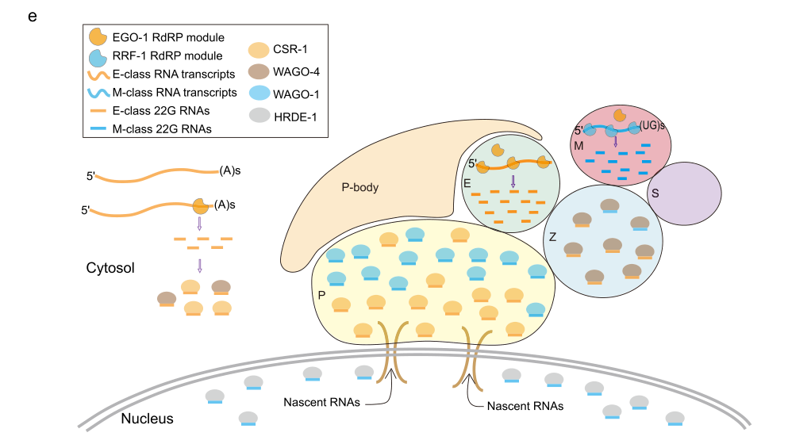

## Question

# Gene Research for Functional Annotation

## ⚠️ CRITICAL: Gene/Protein Identification Context

**BEFORE YOU BEGIN RESEARCH:** You MUST verify you are researching the CORRECT gene/protein. Gene symbols can be ambiguous, especially for less well-characterized genes from non-model organisms.

### Target Gene/Protein Identity (from UniProt):
- **UniProt Accession:** Q21770
- **Protein Description:** RecName: Full=Argonaute protein wago-1 {ECO:0000305}; AltName: Full=Worm-specific argonaute protein 1 {ECO:0000312|WormBase:R06C7.1};
- **Gene Information:** Name=wago-1 {ECO:0000312|WormBase:R06C7.1}; ORFNames=R06C7.1 {ECO:0000312|WormBase:R06C7.1};
- **Organism (full):** Caenorhabditis elegans.
- **Protein Family:** Belongs to the Argonaute family. WAGO subfamily.
- **Key Domains:** PAZ_dom. (IPR003100); PAZ_dom_sf. (IPR036085); Piwi. (IPR003165); RNaseH-like_sf. (IPR012337); RNaseH_sf. (IPR036397)

### MANDATORY VERIFICATION STEPS:

1. **Check if the gene symbol "wago-1" matches the protein description above**
2. **Verify the organism is correct:** Caenorhabditis elegans.
3. **Check if protein family/domains align with what you find in literature**
4. **If you find literature for a DIFFERENT gene with the same or similar symbol, STOP**

### If Gene Symbol is Ambiguous or You Cannot Find Relevant Literature:

**DO NOT PROCEED WITH RESEARCH ON A DIFFERENT GENE.** Instead:
- State clearly: "The gene symbol 'wago-1' is ambiguous or literature is limited for this specific protein"
- Explain what you found (e.g., "Found extensive literature on a different gene with the same symbol in a different organism")
- Describe the protein based ONLY on the UniProt information provided above
- Suggest that the protein function can be inferred from domain/family information

### Research Target:

Please provide a comprehensive research report on the gene **wago-1** (gene ID: wago-1, UniProt: Q21770) in worm.

The research report should be a detailed narrative explaining the function, biological processes, and localization of the gene product. Citations should be given for all claims.

You should prioritize authoritative reviews and primary scientific literature when conducting research. You can supplement
this with annotations you find in gene/protein databases, but these can be outdated or inaccurate.

We are specifically interested in the primary function of the gene - for enzymes, what reaction is catalyzed, and what is the substrate specificity? For transporters, what is the substrate? For structural proteins or adapters, what is the broader structural role? For signaling molecules, what is the role in the pathway.

We are interested in where in or outside the cell the gene product carries out its function.

We are also interested in the signaling or biochemical pathways in which the gene functions. We are less interested in broad pleiotropic effects, except where these elucidate the precise role.

Include evidence where possible. We are interested in both experimental evidence as well as inference from structure, evolution, or bioinformatic analysis. Precise studies should be prioritized over high-throughput, where available.

## Output

Question: You are an expert researcher providing comprehensive, well-cited information.

Provide detailed information focusing on:
1. Key concepts and definitions with current understanding
2. Recent developments and latest research (prioritize 2023-2024 sources)
3. Current applications and real-world implementations
4. Expert opinions and analysis from authoritative sources
5. Relevant statistics and data from recent studies

Format as a comprehensive research report with proper citations. Include URLs and publication dates where available.
Always prioritize recent, authoritative sources and provide specific citations for all major claims.

# Gene Research for Functional Annotation

## ⚠️ CRITICAL: Gene/Protein Identification Context

**BEFORE YOU BEGIN RESEARCH:** You MUST verify you are researching the CORRECT gene/protein. Gene symbols can be ambiguous, especially for less well-characterized genes from non-model organisms.

### Target Gene/Protein Identity (from UniProt):
- **UniProt Accession:** Q21770
- **Protein Description:** RecName: Full=Argonaute protein wago-1 {ECO:0000305}; AltName: Full=Worm-specific argonaute protein 1 {ECO:0000312|WormBase:R06C7.1};
- **Gene Information:** Name=wago-1 {ECO:0000312|WormBase:R06C7.1}; ORFNames=R06C7.1 {ECO:0000312|WormBase:R06C7.1};
- **Organism (full):** Caenorhabditis elegans.
- **Protein Family:** Belongs to the Argonaute family. WAGO subfamily.
- **Key Domains:** PAZ_dom. (IPR003100); PAZ_dom_sf. (IPR036085); Piwi. (IPR003165); RNaseH-like_sf. (IPR012337); RNaseH_sf. (IPR036397)

### MANDATORY VERIFICATION STEPS:

1. **Check if the gene symbol "wago-1" matches the protein description above**
2. **Verify the organism is correct:** Caenorhabditis elegans.
3. **Check if protein family/domains align with what you find in literature**
4. **If you find literature for a DIFFERENT gene with the same or similar symbol, STOP**

### If Gene Symbol is Ambiguous or You Cannot Find Relevant Literature:

**DO NOT PROCEED WITH RESEARCH ON A DIFFERENT GENE.** Instead:
- State clearly: "The gene symbol 'wago-1' is ambiguous or literature is limited for this specific protein"
- Explain what you found (e.g., "Found extensive literature on a different gene with the same symbol in a different organism")
- Describe the protein based ONLY on the UniProt information provided above
- Suggest that the protein function can be inferred from domain/family information

### Research Target:

Please provide a comprehensive research report on the gene **wago-1** (gene ID: wago-1, UniProt: Q21770) in worm.

The research report should be a detailed narrative explaining the function, biological processes, and localization of the gene product. Citations should be given for all claims.

You should prioritize authoritative reviews and primary scientific literature when conducting research. You can supplement
this with annotations you find in gene/protein databases, but these can be outdated or inaccurate.

We are specifically interested in the primary function of the gene - for enzymes, what reaction is catalyzed, and what is the substrate specificity? For transporters, what is the substrate? For structural proteins or adapters, what is the broader structural role? For signaling molecules, what is the role in the pathway.

We are interested in where in or outside the cell the gene product carries out its function.

We are also interested in the signaling or biochemical pathways in which the gene functions. We are less interested in broad pleiotropic effects, except where these elucidate the precise role.

Include evidence where possible. We are interested in both experimental evidence as well as inference from structure, evolution, or bioinformatic analysis. Precise studies should be prioritized over high-throughput, where available.

# Research report: *C. elegans* **wago-1** (UniProt Q21770; ORF R06C7.1) functional annotation

## 0) Target verification (mandatory)
The evidence base used here consistently refers to *Caenorhabditis elegans* **WAGO-1**, a **worm-specific Argonaute (WAGO clade)** that binds **22G-RNAs** and functions in germline silencing pathways, matching the UniProt Q21770 description of an Argonaute-family protein with PAZ/PIWI architecture (seroussi2023acomprehensivesurvey pages 2-3, gu2009distinctargonautemediated22grna pages 1-2, chen2024germgranulecompartments pages 1-2).

## 1) Key concepts and definitions (current understanding)

### 1.1 Argonautes and WAGOs
Argonaute (AGO) proteins bind small RNAs and use them as guides to recognize complementary RNAs, enabling gene regulation and genome defense. In *C. elegans*, the AGO family is expanded and includes **worm-specific Argonautes (WAGOs)** that primarily act with endogenous secondary siRNAs (seroussi2023acomprehensivesurvey pages 2-3, seroussi2023acomprehensivesurvey pages 23-24).

**WAGO-1** is classified within the **22G-RNA-binding WAGO group/cluster**, together with related silencing WAGOs (including PPW-2/WAGO-3 and HRDE-1/WAGO-9) that preferentially target **silenced germline genes, pseudogenes, and repetitive/transposable elements** (seroussi2023acomprehensivesurvey pages 23-24).

### 1.2 22G-RNAs (secondary siRNAs)
**22G-RNAs** are ~22-nt small RNAs with a strong **5′ guanosine (5′G) bias**; in *C. elegans* they are largely produced by **RNA-dependent RNA polymerases (RdRPs)** rather than Dicer, and can be generated as **5′ triphosphorylated** RNAs (gu2009distinctargonautemediated22grna pages 1-2, seroussi2023acomprehensivesurvey pages 23-24).

Gu et al. established that RdRP-produced 22G-RNAs can be loaded onto WAGOs “**without Dicer**” processing (gu2009distinctargonautemediated22grna pages 1-2). Seroussi et al. further emphasize the **triphosphorylated** nature of 22G-RNAs and that **WAGOs preferentially bind triphosphorylated nucleotides**, supporting biochemical sorting of small RNAs to WAGOs (seroussi2023acomprehensivesurvey pages 23-24).

### 1.3 Germ granules (perinuclear condensates) and surveillance
Germ granules are **perinuclear, RNA-rich, membrane-less condensates** at the cytoplasmic face of germline nuclei. They are compartmentalized into multiple subdomains (e.g., **P granules**, **Mutator foci**, **Z granules**, **SIMR foci**, and newly described subcompartments) that organize small-RNA pathways (chen2024germgranulecompartments pages 1-2).

## 2) Molecular function of WAGO-1 (primary function, mechanism, substrates)

### 2.1 Primary function
The core function supported by evidence is that **WAGO-1 is an Argonaute effector** that binds **secondary 22G-RNAs** and mediates **germline silencing / genome surveillance** of targets including **transposons, pseudogenes, and cryptic loci**, as well as subsets of genes (gu2009distinctargonautemediated22grna pages 1-2, gu2009distinctargonautemediated22grna pages 7-8).

### 2.2 Small-RNA partners and their biogenesis module
WAGO-1 associates with **22G-RNAs**: Gu et al. show **transposon 22G-RNAs** are enriched in **WAGO-1 immunoprecipitation** samples (gu2009distinctargonautemediated22grna pages 7-8). 22G-RNA biogenesis depends on a core module including **DRH-3** and **RdRPs** (notably RRF-1 and/or EGO-1) and **EKL-1** (gu2009distinctargonautemediated22grna pages 1-2, gu2009distinctargonautemediated22grna pages 7-8). Loss of these factors eliminates many 22G-RNAs and derepresses loci that normally have high 22G-RNA levels, linking the 22G-RNA system to silencing outputs (gu2009distinctargonautemediated22grna pages 7-8).

### 2.3 Enzymatic activity (slicer vs non-slicer)
WAGO-family Argonautes were reported to **lack the catalytic residues required for Slicer activity**, implying WAGO-mediated silencing often occurs via **cleavage-independent mechanisms** (e.g., recruiting other RNA decay/silencing factors) rather than direct endonucleolytic cleavage by the Argonaute itself (gu2009distinctargonautemediated22grna pages 10-11). Consistent with this, Gu et al. connect at least one WAGO surveillance pathway to **nonsense-mediated decay (NMD)** components, supporting a model where WAGO-1 can act in post-transcriptional surveillance/decay systems (gu2009distinctargonautemediated22grna pages 1-2).

### 2.4 Post-transcriptional vs nuclear silencing
Evidence distinguishes cytoplasmic/post-transcriptional WAGO function from nuclear silencing by specialized nuclear Argonautes. WAGO-1 is consistently described as a **cytoplasmic/perinuclear germ-granule Argonaute** (P-granule localized) (chen2024germgranulecompartments pages 1-2, gu2009distinctargonautemediated22grna pages 1-2). Nuclear co-transcriptional or heritable silencing is typically associated with **nuclear WAGOs** such as **HRDE-1 (WAGO-9)** and **NRDE-3 (WAGO-12)** (gu2009distinctargonautemediated22grna pages 10-11, weiser2019multigenerationalregulationof pages 3-4). Thus, the best-supported assignment is **WAGO-1 as primarily a cytoplasmic/perinuclear post-transcriptional effector** within the WAGO 22G-RNA surveillance pathway (chen2026decodingargonautespecificity pages 47-49, gu2009distinctargonautemediated22grna pages 1-2).

## 3) Subcellular localization and where WAGO-1 acts

### 3.1 P-granule / perinuclear localization
Multiple sources place WAGO-1 at **perinuclear germ granules**, particularly **P granules**:
- Gu et al. report WAGO-1 localizes to **P granules** (germ-line nuage) (gu2009distinctargonautemediated22grna pages 1-2).
- Chen et al. (2024) explicitly list **“P granule localized CSR-1 and WAGO-1”** in the context of germ granule subcompartment architecture (chen2024germgranulecompartments pages 1-2), visually supported by their working model figure depicting WAGO-1 in the P granule (chen2024germgranulecompartments media dae02d2e).
- Price et al. refer to WAGO-1 as a **perinuclear WAGO** implicated in robust RNAi responses (price2023c.elegansgerm pages 11-12).

## 4) Pathways and biological processes involving WAGO-1

### 4.1 Genome surveillance and repression of non-self / repetitive elements
Gu et al. describe WAGO-1 as part of a **germline 22G-RNA genome surveillance pathway**, mediating silencing of **transposons and other aberrant/cryptic loci** (gu2009distinctargonautemediated22grna pages 1-2, gu2009distinctargonautemediated22grna pages 7-8). This establishes WAGO-1 as a key effector in protecting germline genome integrity.

### 4.2 piRNA-triggered secondary 22G-RNA amplification (PRG-1 → WAGO pathway)
Modern transcriptome-wide analyses support that **piRNA binding initiates secondary WAGO 22G-RNA production** and that the spatial pattern of these secondary 22G-RNAs is linked to piRNA targeting:
- Wu et al. (RNA 2023) report that piRNAs preferentially bind **coding sequences (CDS)** and that **secondary WAGO 22G-RNAs are preferentially produced at the CDS**, consistent with production being initiated by piRNA targeting (wu2023transcriptomewideanalysesof pages 9-10, wu2023transcriptomewideanalysesof pages 8-9).
- These analyses operationalize “WAGO targets” using WAGO-1 (or WAGO-9) IP enrichment of 22G-RNAs, linking WAGO-1-associated 22G-RNAs to the piRNA surveillance outcome (wu2023transcriptomewideanalysesof pages 10-11).

### 4.3 Self vs non-self protection interplay with CSR-1
Wu et al. (RNA 2023) describe distinct mechanisms by which **CSR-1 antagonizes** the piRNA→WAGO silencing axis: CSR-1 suppresses piRNA binding transcript-wide but suppresses downstream WAGO 22G-RNA accumulation **locally** at CSR-1 targeting sites (wu2023transcriptomewideanalysesof pages 8-9, wu2023transcriptomewideanalysesof pages 10-11). This provides a mechanistic framework for how “self” transcripts avoid inappropriate WAGO-class silencing.

## 5) Recent developments (prioritizing 2023–2024)

### 5.1 Systematic Argonaute resource and WAGO-1 functional context (2023)
Seroussi et al. (eLife, Feb 2023) performed a systematic in vivo analysis of essentially all *C. elegans* Argonautes using CRISPR tagging and AGO-complex small RNA sequencing. They place WAGO-1 in the WAGO clade/cluster and connect WAGO-class AGOs (including WAGO-1) to silencing of coding genes, pseudogenes, transposons, and cryptic loci, including examples of “WAGO-1-associated 22G-RNAs” targeting another ago gene (wago-5) (seroussi2023acomprehensivesurvey pages 2-3). They also report a technical insight: N-terminal GFP::3xFLAG tagging perturbed WAGO-1 function in some assays, motivating alternative tagging strategies for functional work (seroussi2023acomprehensivesurvey pages 2-3).

### 5.2 Germ granule organization and specialized 22G-RNA production (2024)
Chen et al. (Nature Communications, Jul 2024) describe germ-granule subcompartmentation and identify a new subcompartment (E granule) organizing RdRP machinery; in this framework, they explicitly position **WAGO-1 in P granules** as one of the local Argonautes coordinating small-RNA pathway organization (chen2024germgranulecompartments pages 1-2, chen2024germgranulecompartments media dae02d2e). This reinforces the spatial model that Argonautes and RdRP modules are compartmentalized to shape 22G-RNA outputs.

### 5.3 Germ granules and RNAi robustness across generations (2023)
Price et al. (Nature Communications, Sep 2023) link perinuclear germ-granule architecture to RNA surveillance. They describe redundancy among silencing pathways (including perinuclear WAGO-1) and report that exogenous RNAi can be **intact or enhanced over generations** even when perinuclear granule organization is disrupted (eggd-1 mutants), supporting robust functional buffering among Argonautes/pathways (price2023c.elegansgerm pages 11-12).

### 5.4 Transgenerational memory assays intersecting WAGO-1-associated 22G-RNAs (2024)
Bedet et al. (microPublication Biology, May 2024) analyze small RNAs and transgenerational silencing memory in the context of chromatin factor SET-2 and explicitly refer to **HRDE-1- and WAGO-1-associated 22G-RNAs** in germline silencing contexts (bedet2024thec.elegans pages 1-3, bedet2024thec.elegans pages 3-5). Their assay provides recent quantitative readouts of multigenerational silencing memory where WAGO-1-associated 22G-RNA target sets are enriched among altered genes (bedet2024thec.elegans pages 3-5).

## 6) Current applications and real-world implementations

1. **Genetic/omics definition of silencing targets using WAGO-1 IP**: Wu et al. define “WAGO targets” as genes whose mapped 22G-RNAs show **>2-fold enrichment** in **WAGO-1 IP vs input**, a practical operationalization used to separate WAGO-targeted genes from CSR-1 targets in genome-scale analyses (wu2023transcriptomewideanalysesof pages 10-11).

2. **Transgene/foreign sequence silencing paradigms**: In the GFP::CDK-1 transgene context, Wu et al. describe that foreign GFP segments produce high levels of WAGO 22G-RNAs, consistent with WAGO-mediated non-self recognition; this is widely used conceptually and experimentally to study germline transgene silencing (wu2023transcriptomewideanalysesof pages 10-11).

3. **RNAi assays (dsRNA feeding) and perinuclear granule manipulation**: Price et al. provide a dsRNA feeding RNAi framework (HT115 bacteria on NGM with ampicillin and IPTG; synchronization by bleaching; imaging after 2–3 days) and interpret exogenous RNAi outcomes through the lens of redundant Argonaute pathways that include perinuclear WAGO-1 (price2023c.elegansgerm pages 11-12).

4. **Community resources for localization/function studies**: Seroussi et al. demonstrate large-scale CRISPR tagging (GFP::3xFLAG and alternatives like 3xFLAG-only for WAGO-1) coupled to confocal imaging, Western blots, small-RNA cloning from AGO complexes, and phenotyping—methods broadly reused for functional annotation of AGOs including WAGO-1 (seroussi2023acomprehensivesurvey pages 2-3).

## 7) Expert synthesis and analysis (authoritative perspective)

### 7.1 Functional positioning of WAGO-1
Across foundational (Gu 2009) and recent mapping (Seroussi 2023; Chen 2024; Price 2023) work, WAGO-1 is best understood as a **perinuclear/P-granule Argonaute** that implements **22G-RNA-guided post-transcriptional genome surveillance**, especially against repetitive or otherwise “non-self” elements and selected silenced genes (gu2009distinctargonautemediated22grna pages 1-2, chen2024germgranulecompartments pages 1-2, seroussi2023acomprehensivesurvey pages 2-3).

### 7.2 Relationship to transgenerational inheritance
Direct heritable nuclear silencing is most strongly attributed to **nuclear Argonautes** like HRDE-1/NRDE-3 (weiser2019multigenerationalregulationof pages 3-4, gu2009distinctargonautemediated22grna pages 10-11). However, WAGO-1-associated 22G-RNAs appear in contexts where multigenerational silencing memory is assayed and interpreted (bedet2024thec.elegans pages 1-3, bedet2024thec.elegans pages 3-5). A cautious conclusion supported by the available evidence is:
- **WAGO-1 contributes to germline silencing states that can be propagated**, but the most definitive “executor” of chromatin-linked, heritable silencing is generally **HRDE-1** rather than WAGO-1 (weiser2019multigenerationalregulationof pages 3-4, kasper2014homelandsecurityin pages 6-7).

## 8) Relevant statistics and quantitative findings

### 8.1 WAGO target set definitions and sizes (2023)
Wu et al. define **WAGO targets** as genes with **>2-fold enrichment** of 22G-RNAs in **WAGO-1 IP (or WAGO-9 IP) vs input**, yielding **n = 3,644** WAGO targets (wu2023transcriptomewideanalysesof pages 10-11). CSR-1 targets (for comparison) were **n = 15,821** using analogous criteria (wu2023transcriptomewideanalysesof pages 10-11).

### 8.2 Transgenerational silencing memory (2024)
Bedet et al. cite dsRNA-induced silencing persisting **9–12 generations** in related contexts and report their own multigenerational GFP-silencing readouts:
- **F10**: WT 1 GFP− / 191 GFP+ vs set-2(syb2085) 61 GFP− / 317 GFP+ (χ² = 30.3; p = 3.66×10⁻8) (bedet2024thec.elegans pages 3-5).
- **F12**: WT 0 GFP− / 112 GFP+ vs set-2(syb2085) 8 GFP− / 119 GFP+ (χ² = 7.29; p = 0.007) (bedet2024thec.elegans pages 3-5).
These data are interpreted in part using enrichment for **HRDE-1- and WAGO-1-associated 22G-RNA** targets among genes whose 22G-RNAs increase in set-2 mutants (bedet2024thec.elegans pages 1-3, bedet2024thec.elegans pages 3-5).

### 8.3 Small-RNA changes linked to WAGO-1-associated target sets (2024)
Bedet et al. identify **241** (syb2085) and **421** (bn129) protein-coding genes with increased 22G-RNAs in set-2 mutants; among genes enriched for HRDE-1/WAGO-1-associated 22G-RNAs, **12–26%** are paradoxically upregulated in set-2(bn129) germlines (bedet2024thec.elegans pages 3-5).

### 8.4 WAGO-1-associated “count” in cluster analysis (2023)
Seroussi et al. present a WAGO-1 label “**WAGO-1(2122)**” in the context of AGO clustering based on sRNA distributions, consistent with a large WAGO-1-associated set (e.g., targets or loci) in their global survey (seroussi2023acomprehensivesurvey pages 14-15). (The excerpted text does not define the unit explicitly; interpretation should be confirmed in the full figure legend.)

## 9) Limitations of this report
Some important details (e.g., exact WAGO-1 catalytic motif status from sequence, full interactome, complete phenotypic spectrum in wago-1 nulls, and fine-grained quantitative localization from 2023–2024 microscopy) are likely present in full texts/figures beyond the excerpts retrieved here, and/or in later preprints not prioritized for 2023–2024. This report therefore focuses on claims directly supported by retrieved evidence.

## 10) Key recent references (URLs and publication dates)
- Seroussi U. et al. **eLife** (Feb 2023). “A comprehensive survey of *C. elegans* argonaute proteins…” https://doi.org/10.7554/eLife.83853 (seroussi2023acomprehensivesurvey pages 2-3, seroussi2023acomprehensivesurvey pages 23-24)
- Wu W.-S. et al. **RNA** (Feb 2023). “Transcriptome-wide analyses of piRNA binding sites…” https://doi.org/10.1261/rna.079441.122 (wu2023transcriptomewideanalysesof pages 9-10, wu2023transcriptomewideanalysesof pages 10-11)
- Price I.F. et al. **Nature Communications** (Sep 2023). “*C. elegans* germ granules sculpt both germline and somatic RNAome” https://doi.org/10.1038/s41467-023-41556-4 (price2023c.elegansgerm pages 11-12)
- Chen X. et al. **Nature Communications** (Jul 2024). “Germ granule compartments coordinate specialized small RNA production” https://doi.org/10.1038/s41467-024-50027-3 (chen2024germgranulecompartments pages 1-2, chen2024germgranulecompartments media dae02d2e)
- Bedet C. et al. **microPublication Biology** (May 2024). “SET-2 is not required for transgenerational memory of silencing” https://doi.org/10.17912/micropub.biology.001143 (bedet2024thec.elegans pages 1-3, bedet2024thec.elegans pages 3-5)

---

**Figure evidence (germ granule localization model):** Chen et al. 2024 working model depicts WAGO-1 localized within the P granule subcompartment (chen2024germgranulecompartments media dae02d2e).

References

1. (seroussi2023acomprehensivesurvey pages 2-3): Uri Seroussi, Andrew Lugowski, Lina Wadi, Robert X Lao, Alexandra R Willis, Winnie Zhao, Adam E Sundby, Amanda G Charlesworth, Aaron W Reinke, and Julie M Claycomb. A comprehensive survey of c. elegans argonaute proteins reveals organism-wide gene regulatory networks and functions. eLife, Feb 2023. URL: https://doi.org/10.7554/elife.83853, doi:10.7554/elife.83853. This article has 125 citations and is from a domain leading peer-reviewed journal.

2. (gu2009distinctargonautemediated22grna pages 1-2): Weifeng Gu, Masaki Shirayama, Darryl Conte, Jessica Vasale, Pedro J. Batista, Julie M. Claycomb, James J. Moresco, Elaine M. Youngman, Jennifer Keys, Matthew J. Stoltz, Chun-Chieh G. Chen, Daniel A. Chaves, Shenghua Duan, Kristin D. Kasschau, Noah Fahlgren, John R. Yates, Shohei Mitani, James C. Carrington, and Craig C. Mello. Distinct argonaute-mediated 22g-rna pathways direct genome surveillance in the c. elegans germline. Molecular cell, 36 2:231-44, Oct 2009. URL: https://doi.org/10.1016/j.molcel.2009.09.020, doi:10.1016/j.molcel.2009.09.020. This article has 628 citations and is from a highest quality peer-reviewed journal.

3. (chen2024germgranulecompartments pages 1-2): Xiangyang Chen, Ke Wang, Farees Ud Din Mufti, Demin Xu, Chengming Zhu, Xinya Huang, Chenming Zeng, Qile Jin, Xiaona Huang, Yong-hong Yan, Meng-qiu Dong, Xuezhu Feng, Yunyu Shi, Scott Kennedy, and Shouhong Guang. Germ granule compartments coordinate specialized small rna production. Nature Communications, Jul 2024. URL: https://doi.org/10.1038/s41467-024-50027-3, doi:10.1038/s41467-024-50027-3. This article has 28 citations and is from a highest quality peer-reviewed journal.

4. (seroussi2023acomprehensivesurvey pages 23-24): Uri Seroussi, Andrew Lugowski, Lina Wadi, Robert X Lao, Alexandra R Willis, Winnie Zhao, Adam E Sundby, Amanda G Charlesworth, Aaron W Reinke, and Julie M Claycomb. A comprehensive survey of c. elegans argonaute proteins reveals organism-wide gene regulatory networks and functions. eLife, Feb 2023. URL: https://doi.org/10.7554/elife.83853, doi:10.7554/elife.83853. This article has 125 citations and is from a domain leading peer-reviewed journal.

5. (gu2009distinctargonautemediated22grna pages 7-8): Weifeng Gu, Masaki Shirayama, Darryl Conte, Jessica Vasale, Pedro J. Batista, Julie M. Claycomb, James J. Moresco, Elaine M. Youngman, Jennifer Keys, Matthew J. Stoltz, Chun-Chieh G. Chen, Daniel A. Chaves, Shenghua Duan, Kristin D. Kasschau, Noah Fahlgren, John R. Yates, Shohei Mitani, James C. Carrington, and Craig C. Mello. Distinct argonaute-mediated 22g-rna pathways direct genome surveillance in the c. elegans germline. Molecular cell, 36 2:231-44, Oct 2009. URL: https://doi.org/10.1016/j.molcel.2009.09.020, doi:10.1016/j.molcel.2009.09.020. This article has 628 citations and is from a highest quality peer-reviewed journal.

6. (gu2009distinctargonautemediated22grna pages 10-11): Weifeng Gu, Masaki Shirayama, Darryl Conte, Jessica Vasale, Pedro J. Batista, Julie M. Claycomb, James J. Moresco, Elaine M. Youngman, Jennifer Keys, Matthew J. Stoltz, Chun-Chieh G. Chen, Daniel A. Chaves, Shenghua Duan, Kristin D. Kasschau, Noah Fahlgren, John R. Yates, Shohei Mitani, James C. Carrington, and Craig C. Mello. Distinct argonaute-mediated 22g-rna pathways direct genome surveillance in the c. elegans germline. Molecular cell, 36 2:231-44, Oct 2009. URL: https://doi.org/10.1016/j.molcel.2009.09.020, doi:10.1016/j.molcel.2009.09.020. This article has 628 citations and is from a highest quality peer-reviewed journal.

7. (weiser2019multigenerationalregulationof pages 3-4): Natasha E. Weiser and John K. Kim. Multigenerational regulation of the caenorhabditis elegans chromatin landscape by germline small rnas. Annual review of genetics, 53:289-311, Dec 2019. URL: https://doi.org/10.1146/annurev-genet-112618-043505, doi:10.1146/annurev-genet-112618-043505. This article has 48 citations and is from a domain leading peer-reviewed journal.

8. (chen2026decodingargonautespecificity pages 47-49): Shihui Chen and C. Phillips. Decoding argonaute specificity: insights from c. elegans and beyond. RNA, 32:290-310, Dec 2026. URL: https://doi.org/10.1261/rna.080816.125, doi:10.1261/rna.080816.125. This article has 1 citations and is from a domain leading peer-reviewed journal.

9. (chen2024germgranulecompartments media dae02d2e): Xiangyang Chen, Ke Wang, Farees Ud Din Mufti, Demin Xu, Chengming Zhu, Xinya Huang, Chenming Zeng, Qile Jin, Xiaona Huang, Yong-hong Yan, Meng-qiu Dong, Xuezhu Feng, Yunyu Shi, Scott Kennedy, and Shouhong Guang. Germ granule compartments coordinate specialized small rna production. Nature Communications, Jul 2024. URL: https://doi.org/10.1038/s41467-024-50027-3, doi:10.1038/s41467-024-50027-3. This article has 28 citations and is from a highest quality peer-reviewed journal.

10. (price2023c.elegansgerm pages 11-12): Ian F. Price, Jillian A. Wagner, Benjamin Pastore, Hannah L. Hertz, and Wen Tang. C. elegans germ granules sculpt both germline and somatic rnaome. Nature Communications, Sep 2023. URL: https://doi.org/10.1038/s41467-023-41556-4, doi:10.1038/s41467-023-41556-4. This article has 31 citations and is from a highest quality peer-reviewed journal.

11. (wu2023transcriptomewideanalysesof pages 9-10): Wei-Sheng Wu, Jordan S. Brown, Sheng-Cian Shiue, Chi-Jung Chung, Dong-En Lee, Donglei Zhang, and Heng-Chi Lee. Transcriptome-wide analyses of pirna binding sites suggest distinct mechanisms regulate pirna binding and silencing in c. elegans. RNA, 29:557-569, Feb 2023. URL: https://doi.org/10.1261/rna.079441.122, doi:10.1261/rna.079441.122. This article has 9 citations and is from a domain leading peer-reviewed journal.

12. (wu2023transcriptomewideanalysesof pages 8-9): Wei-Sheng Wu, Jordan S. Brown, Sheng-Cian Shiue, Chi-Jung Chung, Dong-En Lee, Donglei Zhang, and Heng-Chi Lee. Transcriptome-wide analyses of pirna binding sites suggest distinct mechanisms regulate pirna binding and silencing in c. elegans. RNA, 29:557-569, Feb 2023. URL: https://doi.org/10.1261/rna.079441.122, doi:10.1261/rna.079441.122. This article has 9 citations and is from a domain leading peer-reviewed journal.

13. (wu2023transcriptomewideanalysesof pages 10-11): Wei-Sheng Wu, Jordan S. Brown, Sheng-Cian Shiue, Chi-Jung Chung, Dong-En Lee, Donglei Zhang, and Heng-Chi Lee. Transcriptome-wide analyses of pirna binding sites suggest distinct mechanisms regulate pirna binding and silencing in c. elegans. RNA, 29:557-569, Feb 2023. URL: https://doi.org/10.1261/rna.079441.122, doi:10.1261/rna.079441.122. This article has 9 citations and is from a domain leading peer-reviewed journal.

14. (bedet2024thec.elegans pages 1-3): Cécile Bedet, Piergiuseppe Quarato, Francesca Palladino, Germano Cecere, and Valérie J Robert. The c. elegans set1 histone methyltransferase set-2 is not required for transgenerational memory of silencing. microPublication Biology, May 2024. URL: https://doi.org/10.17912/micropub.biology.001143, doi:10.17912/micropub.biology.001143. This article has 1 citations.

15. (bedet2024thec.elegans pages 3-5): Cécile Bedet, Piergiuseppe Quarato, Francesca Palladino, Germano Cecere, and Valérie J Robert. The c. elegans set1 histone methyltransferase set-2 is not required for transgenerational memory of silencing. microPublication Biology, May 2024. URL: https://doi.org/10.17912/micropub.biology.001143, doi:10.17912/micropub.biology.001143. This article has 1 citations.

16. (kasper2014homelandsecurityin pages 6-7): Dionna M Kasper, Kathryn E Gardner, and Valerie Reinke. Homeland security in the c. elegans germ line. Epigenetics, 9:62-74, Jan 2014. URL: https://doi.org/10.4161/epi.26647, doi:10.4161/epi.26647. This article has 35 citations and is from a peer-reviewed journal.

17. (seroussi2023acomprehensivesurvey pages 14-15): Uri Seroussi, Andrew Lugowski, Lina Wadi, Robert X Lao, Alexandra R Willis, Winnie Zhao, Adam E Sundby, Amanda G Charlesworth, Aaron W Reinke, and Julie M Claycomb. A comprehensive survey of c. elegans argonaute proteins reveals organism-wide gene regulatory networks and functions. eLife, Feb 2023. URL: https://doi.org/10.7554/elife.83853, doi:10.7554/elife.83853. This article has 125 citations and is from a domain leading peer-reviewed journal.

## Artifacts

## Citations

1. seroussi2023acomprehensivesurvey pages 23-24
2. chen2024germgranulecompartments pages 1-2
3. wu2023transcriptomewideanalysesof pages 10-11
4. seroussi2023acomprehensivesurvey pages 2-3
5. seroussi2023acomprehensivesurvey pages 14-15
6. weiser2019multigenerationalregulationof pages 3-4
7. chen2026decodingargonautespecificity pages 47-49
8. wu2023transcriptomewideanalysesof pages 9-10
9. wu2023transcriptomewideanalysesof pages 8-9
10. kasper2014homelandsecurityin pages 6-7
11. https://doi.org/10.7554/eLife.83853
12. https://doi.org/10.1261/rna.079441.122
13. https://doi.org/10.1038/s41467-023-41556-4
14. https://doi.org/10.1038/s41467-024-50027-3
15. https://doi.org/10.17912/micropub.biology.001143
16. https://doi.org/10.7554/elife.83853,
17. https://doi.org/10.1016/j.molcel.2009.09.020,
18. https://doi.org/10.1038/s41467-024-50027-3,
19. https://doi.org/10.1146/annurev-genet-112618-043505,
20. https://doi.org/10.1261/rna.080816.125,
21. https://doi.org/10.1038/s41467-023-41556-4,
22. https://doi.org/10.1261/rna.079441.122,
23. https://doi.org/10.17912/micropub.biology.001143,
24. https://doi.org/10.4161/epi.26647,