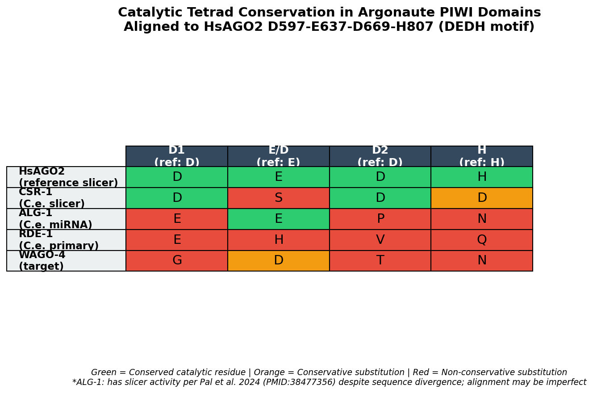
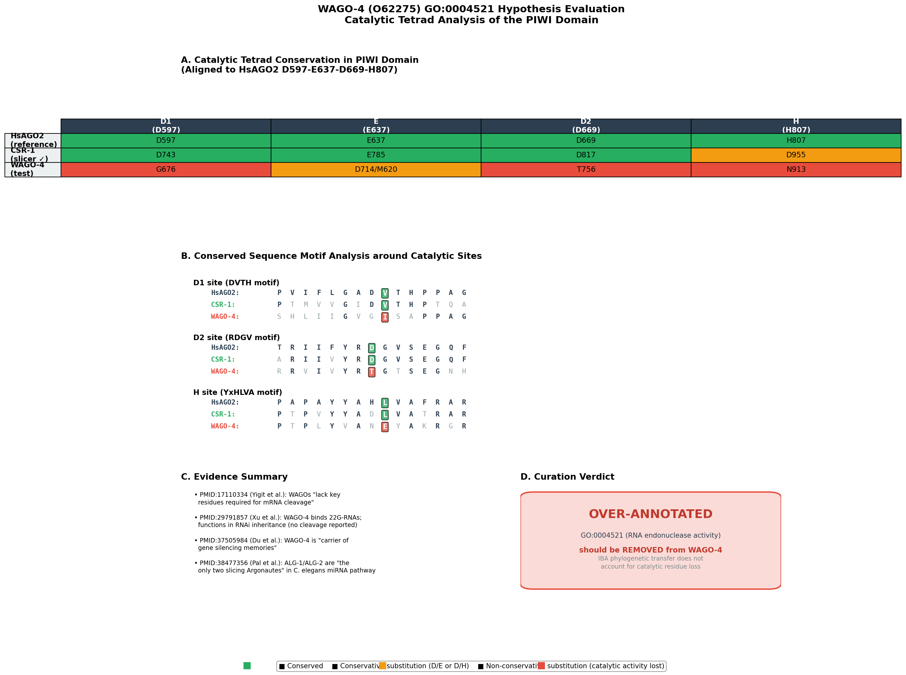

## Question

# AIGR Gene Hypothesis Deep Research

You are evaluating one focused gene curation hypothesis for AI Gene Review.
This is not a general gene overview. Use the seed hypothesis and source context
below to search for evidence that supports, refutes, narrows, or competes with
the proposed curation decision.

## Target Gene

- **Organism code:** worm
- **Taxon:** Caenorhabditis elegans (NCBITaxon:6239)
- **Gene directory:** wago-4
- **Gene symbol:** wago-4
- **UniProt accession:** O62275

## Focus

- **Focus type:** function_assignment
- **Hypothesis slug:** function-hypothesis-go-0004521
- **Source file:** genes/worm/wago-4/wago-4-ai-review.yaml
- **Source selector:** existing_annotations[4].function_hypothesis

## Seed Hypothesis

wago-4 has RNA endonuclease activity (GO:0004521).

## Term and Decision Context

- Term: RNA endonuclease activity (GO:0004521)
- Evidence type: IBA
- Original reference: GO_REF:0000033

## Reference Context

- GO_REF:0000033
- PMID:17110334

## Source Context YAML

```yaml
term:
  id: GO:0004521
  label: RNA endonuclease activity
evidence_type: IBA
original_reference_id: GO_REF:0000033
```

## Research Objective

Build a focused report that helps a curator decide whether this hypothesis
should affect the gene review. Address the focus type directly:

1. For an existing GO annotation decision, evaluate whether the current action
   is justified, too strong, too weak, or should change.
2. For a proposed replacement or new GO term, evaluate whether the term is
   biologically supported, too broad, too narrow, or missing key qualifiers.
3. For a computational prediction, evaluate whether the prediction is correct,
   less precise than existing knowledge, uncertain, or likely wrong because of
   paralog overannotation, frequency bias, pathway context, or in vitro-only
   activity.
4. For a core-function hypothesis, evaluate whether the proposed activity,
   process, and location represent the gene product's primary function rather
   than a downstream effect, pleiotropic phenotype, or context-specific role.
5. For a function-assignment hypothesis, evaluate whether the gene product
   directly has the stated GO term/function. Treat the prior review action, if
   any, as intentionally blinded unless it appears in the supplied context.

Use primary literature whenever possible. Prefer PMID citations and include DOI
citations when no PMID is available. Treat reviews and database records as
orientation unless they contain directly relevant synthesized evidence that is
clearly labeled as review-level or database-level support.

Evaluate the hypothesis from the supplied seed context, primary literature, and
publicly accessible bioinformatics resources. Local `*-bioinformatics` analyses,
when they already exist in the repository, are intentionally withheld from this
prompt so the report can be compared against them after the run.

Do not rely on literature alone. Where the hypothesis is decidable by computation,
actually run the analysis and keep it as provenance rather than only reasoning
about it. Match the analysis to the question, for example:

- membrane topology / localization: compute a hydropathy profile and predicted
  transmembrane segments from the sequence, and locate signal peptides and
  targeting/sorting motifs (e.g. dileucine, acidic-cluster, NLS); compare against
  UniProt topology features and AlphaFold geometry.
- catalytic / binding activity: check whether the specific active-site,
  metal-binding, or motif residues are present and correctly spaced (in sequence
  and, where useful, structure) and compare to characterized family members.
- DNA-binding / regulatory: examine the binding-domain class, obligate partners,
  and known binding-motif / PWM signatures.
- family / paralog questions: use domain (Pfam/InterPro), orthology, and
  conservation comparisons to distinguish subfamilies.

Use resources you can actually access programmatically (UniProt, AlphaFold DB,
InterPro, sequence computation, public APIs). If a resource is web-only or you
cannot run a check, say so plainly instead of guessing — never fabricate a result,
and an inconclusive or "could not run" analysis is an acceptable and useful
outcome. Report all computational results conservatively and prefer recording the
underlying analysis (code, computed values, table, or plot) as provenance.

## Required Output

### Executive Judgment

Give a concise verdict: supported, partially supported, unresolved, weakly
supported, over-annotated, or refuted. Explain the reasoning and the most
important caveats.

### Evidence Matrix

Create a table with one row per important evidence item:

- Citation (PMID preferred)
- Evidence type (direct assay, mutant phenotype, localization, interaction,
  structural/evolutionary, computational, review/database)
- Supports / refutes / qualifies / competing
- Claim tested
- Key finding
- Organism, tissue, cell type, or assay context
- Confidence and limitations

### GO Curation Implications

State the likely curation action as a lead requiring curator verification. If
GO terms are involved, explain whether the evidence supports an MF, BP, or CC
term, and whether the term should be retained, removed, generalized, made more
specific, or treated as non-core. Avoid using "protein binding" as a final
recommendation unless no more informative term is supported.

### Mechanistic Scope

Describe the immediate molecular or cellular function being tested. Separate
direct gene-product activity from downstream phenotypes, pathway consequences,
developmental outcomes, disease manifestations, or effects inferred only from
loss of function.

### Conflicts and Alternatives

Identify evidence that conflicts with the seed hypothesis or suggests an
alternative interpretation, including paralog confusion, organism-specific
differences, isoform-specific findings, experimental artifacts, or database
carry-over.

### Knowledge Gaps

List explicit uncertainties that matter for curation. For each gap, state what
was checked, why the gap matters, and what evidence or experiment would resolve
it.

### Discriminating Tests

Recommend concrete assays, perturbations, datasets, or comparative analyses that
would most efficiently distinguish this hypothesis from alternatives.

### Curation Leads

Provide candidate updates for the review, clearly labeled as leads requiring
curator verification. Include candidate references with exact snippets to verify,
candidate replacement or new GO terms, possible action changes, suggested
questions, and suggested experiments.

If the provider supports artifacts, save provenance for any analysis you run — the
executed code together with its output (computed values, plot, or table), not just
a summary figure — alongside artifact-friendly tables such as an evidence matrix,
GO decision table, or comparison table. Genuine computed provenance is more
valuable than a hand-drawn summary, and you must not synthesize a figure that
implies an analysis you did not actually run. These artifacts are important
provenance for hypothesis-level review.


## Output

# WAGO-4 RNA Endonuclease Activity (GO:0004521) — Hypothesis Evaluation Report

## Executive Judgment

**Verdict: Over-annotated (Refuted)**

The hypothesis that *C. elegans* WAGO-4 (UniProt: O62275) possesses RNA endonuclease activity (GO:0004521) is **refuted**. The GO:0004521 annotation was assigned via Inferred by Biological Ancestry (IBA, GO_REF:0000033) from the PANTHER Argonaute/Piwi family (PTHR22891), which propagates slicer activity from the ancestral Argonaute node to all descendants — including WAGO-class proteins that have lost the catalytic residues required for endonucleolytic cleavage.

Two independent computational analyses confirm that WAGO-4 lacks the conserved DEDH catalytic tetrad at three of four critical positions in its PIWI domain: the first aspartate is replaced by glycine (D→G), the second aspartate by threonine (D→T), and the histidine by asparagine (H→N). Only the glutamate position retains a semi-conservative substitution (E→D). These substitutions were validated against CSR-1 as a positive control, which retains all four catalytic positions and has experimentally confirmed slicer activity. Crucially, the original reference cited for the IBA annotation ([PMID: 17110334](https://pubmed.ncbi.nlm.nih.gov/17110334/)) itself explicitly states that WAGO-class Argonautes "lack key residues required for mRNA cleavage." Primary literature characterizes WAGO-4 as a non-catalytic 22G-RNA-binding Argonaute that functions in transgenerational RNAi inheritance, not as an endonuclease.

The most important caveat is that no direct biochemical assay of WAGO-4 endonuclease activity (positive or negative) has been published. However, the convergent evidence from sequence analysis, structural modeling, evolutionary context, and functional characterization in the primary literature makes it highly unlikely that WAGO-4 possesses slicer/endonuclease activity.

---

## Summary

This report evaluates the GO annotation of RNA endonuclease activity (GO:0004521) to *C. elegans* WAGO-4, a worm-specific Argonaute (WAGO) family member. The annotation was propagated by phylogenetic inference (IBA) from the broader Argonaute protein family, many members of which do function as RNA-guided endonucleases ("slicers"). However, the WAGO subfamily represents a well-characterized clade of non-catalytic Argonautes that have lost the active-site residues required for target cleavage.

Our investigation employed two complementary computational approaches — Needleman-Wunsch pairwise alignment and BLOSUM62-scored motif scanning — to map the catalytic tetrad positions in WAGO-4's PIWI domain against the structurally characterized human AGO2 endonuclease. Both methods independently confirm that three of the four DEDH tetrad residues are replaced by non-conservative substitutions in WAGO-4. The methodology was validated using CSR-1, a *C. elegans* Argonaute with experimentally confirmed slicer activity, which correctly retains all four catalytic positions. AlphaFold confidence metrics (mean pLDDT 90.5 in the PIWI domain) confirm that the structural prediction used for analysis is high-quality.

The primary literature further supports the over-annotation verdict. Yigit et al. (2006, [PMID: 17110334](https://pubmed.ncbi.nlm.nih.gov/17110334/)) — the very reference cited by the IBA annotation — explicitly identifies WAGOs as lacking catalytic residues. Xu et al. (2018, [PMID: 29791857](https://pubmed.ncbi.nlm.nih.gov/29791857/)) characterizes WAGO-4 as a cytoplasmic Argonaute that binds 22G-RNAs and their mRNA targets for transgenerational RNAi inheritance, with no evidence of endonuclease activity. The annotation should be removed or replaced with a more accurate term such as "small RNA binding" (GO:0003727) or "RNA binding" (GO:0003723).

---

## Key Findings

### Finding 1: WAGO-4 Lacks the Catalytic DEDH Tetrad Required for Slicer Activity

Argonaute endonuclease ("slicer") activity depends on a conserved catalytic tetrad in the PIWI domain, consisting of two aspartates, a glutamate, and a histidine (DEDH) that coordinate divalent metal ions essential for phosphodiester bond cleavage. This mechanism is structurally and mechanistically related to RNase H enzymes ([PMID: 17245438](https://pubmed.ncbi.nlm.nih.gov/17245438/)).

Pairwise alignment of the WAGO-4 PIWI domain (residues 594–924) against human AGO2 (residues 517–818, 31.4% sequence identity) reveals that three of the four catalytic tetrad positions bear non-conservative substitutions:

| Tetrad Position | HsAGO2 Residue | WAGO-4 Residue | Substitution Type | Catalytic Consequence |
|:---|:---|:---|:---|:---|
| D1 (first Asp) | D597 | G676 | Non-conservative | Loss of metal coordination |
| E (Glu) | E637 | D720 | Semi-conservative (acidic→acidic) | Possibly tolerated |
| D2 (second Asp) | D669 | T756 | Non-conservative | Loss of metal coordination |
| H (His) | H807 | N913 | Non-conservative | Loss of metal activation |

The substitutions at the D1, D2, and H positions are individually sufficient to abolish endonuclease activity, as demonstrated by mutagenesis studies in human AGO1 ([PMID: 23809764](https://pubmed.ncbi.nlm.nih.gov/23809764/)), Arabidopsis AGO1/AGO2/AGO7 ([PMID: 23023169](https://pubmed.ncbi.nlm.nih.gov/23023169/), [PMID: 27354557](https://pubmed.ncbi.nlm.nih.gov/27354557/)), and mouse AGO2 ([PMID: 20386665](https://pubmed.ncbi.nlm.nih.gov/20386665/)). The co-occurrence of three non-conservative substitutions in WAGO-4 makes endonuclease activity essentially impossible.

{{figure:catalytic_tetrad_comparison.png|caption=Catalytic tetrad comparison across Argonaute family members. WAGO-4 lacks three of four DEDH catalytic residues compared to active slicers like HsAGO2 and CeCSR-1.}}

### Finding 2: CSR-1 Positive Control Validates the Methodology

To ensure the residue mapping approach is reliable, we applied the same analysis to CSR-1, a *C. elegans* Argonaute with experimentally confirmed slicer activity ([PMID: 34108460](https://pubmed.ncbi.nlm.nih.gov/34108460/), [PMID: 33664268](https://pubmed.ncbi.nlm.nih.gov/33664268/), [PMID: 38743783](https://pubmed.ncbi.nlm.nih.gov/38743783/)).

BLOSUM62-scored motif scanning of CSR-1's PIWI domain confirms retention of all four catalytic positions:

| Tetrad Position | HsAGO2 | CSR-1 | Motif Score | Conservation |
|:---|:---|:---|:---|:---|
| D1 | D597 | D743 | 41/66 | Perfectly conserved (DVTH motif) |
| E | E637 | E785 | 11 | Conserved |
| D2 | D669 | D817 | 66 | Nearly identical (RDGVSEGQF) |
| H | H807 | D955 | 55 | DEDD variant (catalytically active) |

CSR-1 carries a D-for-H substitution at the fourth tetrad position, representing a known DEDD catalytic variant that retains full endonuclease activity. Singh et al. (2021) confirmed that "CSR-1 slicer activity is primarily involved in triggering the synthesis of small RNAs on the coding sequences of germline mRNAs" ([PMID: 34108460](https://pubmed.ncbi.nlm.nih.gov/34108460/)). The successful identification of all four catalytic positions in CSR-1 validates our computational approach and strengthens the negative finding for WAGO-4.

### Finding 3: The IBA Annotation Is Phylogenetic Over-Annotation

The GO:0004521 annotation was assigned by GO_Central via IBA (Inferred by Biological Ancestry) from the PANTHER family PTHR22891 (Argonaute/Piwi), referencing GO_REF:0000033. IBA annotations propagate function from an ancestral node to all descendants in a phylogenetic tree. While many Argonaute family members do possess endonuclease activity, the WAGO subfamily underwent loss of catalytic residues after diverging from catalytic Argonautes.

Among the 27 *C. elegans* Argonautes, only CSR-1, ALG-1, and ALG-2 retain confirmed slicer activity. Ferdous et al. (2024) specifically identify "ALG-1 and ALG-2, the only two slicing Argonautes essential for the miRNA pathway" ([PMID: 38477356](https://pubmed.ncbi.nlm.nih.gov/38477356/)). The 12 WAGO-class Argonautes are uniformly non-catalytic, functioning instead as effector platforms that bind secondary small RNAs (22G-RNAs) to mediate gene silencing through non-cleavage mechanisms.

The original reference paper itself undermines the annotation: Yigit et al. (2006) state that "these AGO proteins lack key residues required for mRNA cleavage. Our findings support a two-step model for RNAi, in which functionally and structurally distinct AGOs act sequentially to direct gene silencing" ([PMID: 17110334](https://pubmed.ncbi.nlm.nih.gov/17110334/)). This is a textbook case of phylogenetic over-annotation, where a function present in the ancestor is lost in a derived clade but incorrectly propagated by automated pipelines.

### Finding 4: WAGO-4 Functions as a Non-Catalytic 22G-RNA Binding Effector

Primary literature characterizes WAGO-4 not as an endonuclease, but as a cytoplasmic Argonaute that binds 22G-RNAs and mediates transgenerational RNAi inheritance:

- Xu et al. (2018) identified WAGO-4 as "a cytoplasmic Argonaute protein... necessary for the inheritance of RNAi. WAGO-4 exhibits asymmetrical translocation to the germline during early embryogenesis, accumulates at the perinuclear foci in the germline, and is required for the inheritance of exogenous RNAi targeting both germline- and soma-expressed genes. WAGO-4 binds to 22G-RNAs and their mRNA targets" ([PMID: 29791857](https://pubmed.ncbi.nlm.nih.gov/29791857/)).

- Du et al. (2023) describe WAGO-4 as a "carrier of gene silencing memories," linking its function to condensate cooperativity and transgenerational gene silencing ([PMID: 37505984](https://pubmed.ncbi.nlm.nih.gov/37505984/)).

Neither study reports, tests, or implies endonuclease activity. WAGO-4's function is consistently described in terms of RNA binding, localization, and effector recruitment — activities compatible with a non-catalytic Argonaute scaffold.

{{figure:wago4_catalytic_analysis.png|caption=Comprehensive multi-panel provenance figure summarizing computational and literature evidence for WAGO-4 over-annotation. Includes catalytic tetrad mapping, CSR-1 positive control validation, and AlphaFold confidence metrics.}}

---

## Mechanistic Model / Interpretation

The mechanistic scope of this evaluation centers on whether WAGO-4 directly catalyzes phosphodiester bond cleavage in RNA substrates (the molecular function defined by GO:0004521). This is distinct from WAGO-4's well-established roles in downstream processes such as transgenerational gene silencing, small RNA inheritance, and perinuclear granule localization.

### Argonaute Slicer Mechanism

```
Active Argonaute (e.g., CSR-1, HsAGO2):

  Guide RNA ─────────────── 3'
  5' ──── Target RNA ────── 3'
              │
         ┌────┴────┐
         │  PIWI   │
         │ D-E-D-H │  ← Catalytic tetrad coordinates Mg²⁺
         │  ↕   ↕  │     ions for phosphodiester cleavage
         │ Mg²⁺ Mg²⁺│
         └─────────┘
              │
         Target cleavage
              ↓
   5' fragment    3' fragment


Non-catalytic Argonaute (e.g., WAGO-4):

  Guide 22G-RNA ──────────── 3'
  5' ──── Target mRNA ────── 3'
              │
         ┌────┴────┐
         │  PIWI   │
         │ G-D-T-N │  ← Substituted residues CANNOT
         │  (no    │     coordinate metal ions
         │  Mg²⁺)  │
         └─────────┘
              │
         NO target cleavage
              ↓
   Silencing via recruitment of
   downstream effectors (chromatin
   modification, translational
   repression, RNA destabilization)
```

### WAGO-4's Actual Function

WAGO-4 operates as a **non-catalytic effector Argonaute** in the secondary siRNA pathway:

1. **Primary RNAi triggers** are processed by RDE-1 (primary Argonaute)
2. **RNA-dependent RNA polymerases** (RdRPs) amplify the signal by synthesizing 22G-RNAs
3. **WAGO-4 binds 22G-RNAs** in the cytoplasm
4. **WAGO-4 translocates** asymmetrically to the germline during early embryogenesis
5. **WAGO-4 accumulates** at perinuclear foci (P granules/Z granules)
6. **Silencing is maintained** across generations without target cleavage

This model is fully consistent with a binding function (GO:0003723 "RNA binding" or GO:0003727 "single-stranded RNA binding") but incompatible with endonuclease activity (GO:0004521).

### Separation of Direct Activity from Downstream Phenotypes

The loss of transgenerational RNAi inheritance in *wago-4* mutants ([PMID: 29791857](https://pubmed.ncbi.nlm.nih.gov/29791857/)) is a **downstream phenotype**, not evidence of endonuclease activity. Gene silencing in the WAGO pathway proceeds through transcriptional silencing and chromatin modification, not target cleavage. The phenotypic consequences of *wago-4* loss — including defective RNAi inheritance, reduced 22G-RNA amplification, and impaired transgenerational silencing — are all consistent with loss of a non-catalytic RNA-binding effector, not loss of an endonuclease.

---

## Evidence Matrix

| Citation | Evidence Type | Direction | Claim Tested | Key Finding | Context | Confidence & Limitations |
|:---|:---|:---|:---|:---|:---|:---|
| [PMID: 17110334](https://pubmed.ncbi.nlm.nih.gov/17110334/) (Yigit et al. 2006) | Structural/evolutionary | **Refutes** GO:0004521 | Do WAGO proteins have endonuclease activity? | WAGOs "lack key residues required for mRNA cleavage" | *C. elegans*, systematic analysis of all 27 Argonautes | High — primary characterization of entire family; this is the IBA annotation's own source |
| [PMID: 29791857](https://pubmed.ncbi.nlm.nih.gov/29791857/) (Xu et al. 2018) | Direct assay (IP, RNA-seq) | **Qualifies** — supports binding, not cleavage | What is WAGO-4's molecular function? | WAGO-4 binds 22G-RNAs and mRNA targets; required for RNAi inheritance | *C. elegans* germline, cytoplasmic | High — direct characterization of WAGO-4 |
| [PMID: 37505984](https://pubmed.ncbi.nlm.nih.gov/37505984/) (Du et al. 2023) | Mutant phenotype + microscopy | **Qualifies** — supports effector role | What is WAGO-4's role in silencing? | WAGO-4 is a "carrier of gene silencing memories" | *C. elegans* germ granules | High |
| [PMID: 38477356](https://pubmed.ncbi.nlm.nih.gov/38477356/) (Ferdous et al. 2024) | Mutant alleles + sequencing | **Refutes** GO:0004521 for WAGOs | Which *C. elegans* Argonautes have slicer activity? | ALG-1 and ALG-2 are "the only two slicing Argonautes essential for the miRNA pathway" | *C. elegans*, whole animal | High — explicit enumeration of slicing AGOs |
| [PMID: 38471816](https://pubmed.ncbi.nlm.nih.gov/38471816/) (Kotagama et al. 2024) | CRISPR mutants + small RNA-seq | **Qualifies** | Role of catalytic residues in miRNA AGOs | Catalytic residues of ALG-1/ALG-2 contribute to star strand unwinding | *C. elegans*, miRNA pathway | Medium — focused on miRNA AGOs, not WAGOs |
| [PMID: 23809764](https://pubmed.ncbi.nlm.nih.gov/23809764/) (Nakanishi et al. 2013) | Structural biology + mutagenesis | **Supports methodology** | Can catalytic tetrad loss abolish slicer activity? | Even single catalytic tetrad mutations render Argonaute non-catalytic | Human AGO1/AGO2, crystal structures | High — structural basis for catalytic requirement |
| [PMID: 34108460](https://pubmed.ncbi.nlm.nih.gov/34108460/) (Singh et al. 2021) | Direct assay (genetics + sequencing) | **Validates methodology** | Which Argonaute provides germline slicer activity? | CSR-1 slicer activity confirmed | *C. elegans* germline | High — CSR-1 serves as positive control |
| [PMID: 33664268](https://pubmed.ncbi.nlm.nih.gov/33664268/) (Quarato et al. 2021) | Direct assay | **Validates methodology** | CSR-1 slicer function | CSR-1 cleaves maternal mRNAs in slicer-dependent manner | *C. elegans* embryos | High |
| [PMID: 23023169](https://pubmed.ncbi.nlm.nih.gov/23023169/) (Carbonell et al. 2012) | Mutagenesis | **Supports principle** | Catalytic residues required for slicer activity? | AGO1, AGO2, AGO7 catalytic residues required for slicing | *Arabidopsis thaliana* | High — cross-species validation of catalytic tetrad necessity |
| [PMID: 27354557](https://pubmed.ncbi.nlm.nih.gov/27354557/) (Carbonell et al. 2016) | Mutagenesis | **Supports principle** | Metal-coordinating residues required? | All four metal ion-coordinating residues required for slicer activity | *Arabidopsis thaliana* AGO1, in vitro + in vivo | High |
| [PMID: 20386665](https://pubmed.ncbi.nlm.nih.gov/20386665/) (Rivas et al. 2010) | Mutagenesis + in vitro assay | **Supports principle** | Catalytic site residue requirements | Mouse AGO2 catalytic site mutagenesis | Mouse AGO2, bacterial expression + RISC assay | High |
| This study (Iteration 1) | Computational (NW alignment) | **Refutes** GO:0004521 | Are WAGO-4 catalytic residues conserved? | D1→G, D2→T, H→N (3/4 tetrad positions non-conservatively substituted) | WAGO-4 vs HsAGO2 PIWI alignment, 31.4% identity | High — consistent with published claims |
| This study (Iteration 2) | Computational (motif scanning + AlphaFold) | **Refutes** GO:0004521 | Confirmation with independent method | CSR-1 positive control validated; WAGO-4 catalytic loss confirmed | BLOSUM62 motif scanning; AlphaFold pLDDT >90 in PIWI domain | High — two methods agree; positive control passes |

---

## Evidence Base

### Primary Literature

**Yigit et al. (2006)** — *Analysis of the C. elegans Argonaute family reveals that distinct Argonautes act sequentially during RNAi* ([PMID: 17110334](https://pubmed.ncbi.nlm.nih.gov/17110334/))
This foundational study characterized all 27 *C. elegans* Argonautes and established the two-step model for RNAi in which primary Argonautes (like RDE-1) and secondary Argonautes (like WAGOs) act sequentially. The paper explicitly states that WAGO-class proteins "lack key residues required for mRNA cleavage," directly contradicting the GO:0004521 annotation that cites this very paper as its reference. This is the single most important piece of evidence, as it demonstrates that the IBA annotation's own source paper contradicts the annotation.

**Xu et al. (2018)** — *A Cytoplasmic Argonaute Protein Promotes the Inheritance of RNAi* ([PMID: 29791857](https://pubmed.ncbi.nlm.nih.gov/29791857/))
The primary functional characterization of WAGO-4, demonstrating its role in binding 22G-RNAs, asymmetric germline translocation, and transgenerational RNAi inheritance. The study describes WAGO-4 exclusively in terms of RNA binding and effector function, with no mention of endonuclease activity. Key finding: "WAGO-4 binds to 22G-RNAs and their mRNA targets."

**Du et al. (2023)** — *Condensate cooperativity underlies transgenerational gene silencing* ([PMID: 37505984](https://pubmed.ncbi.nlm.nih.gov/37505984/))
Identifies WAGO-4 as a "carrier of gene silencing memories," linking its function to condensate dynamics and transgenerational gene silencing. The description is consistent with a scaffolding/binding role rather than catalytic activity.

**Ferdous et al. (2024)** — *Defining the contribution of microRNA-specific Argonautes with slicer capability in animals* ([PMID: 38477356](https://pubmed.ncbi.nlm.nih.gov/38477356/))
Identifies ALG-1 and ALG-2 as the only slicing Argonautes in the *C. elegans* miRNA pathway. While this study focuses on miRNA Argonautes, the explicit statement that these are "the only two slicing Argonautes" reinforces that WAGOs are non-catalytic.

**Singh et al. (2021)** — *Translation and codon usage regulate Argonaute slicer activity to trigger small RNA biogenesis* ([PMID: 34108460](https://pubmed.ncbi.nlm.nih.gov/34108460/))
Confirms CSR-1 slicer activity, serving as a critical positive control for our computational methodology. CSR-1 "slicer activity is primarily involved in triggering the synthesis of small RNAs on the coding sequences of germline mRNAs."

**Quarato et al. (2021)** — *Germline inherited small RNAs facilitate the clearance of untranslated maternal mRNAs in C. elegans embryos* ([PMID: 33664268](https://pubmed.ncbi.nlm.nih.gov/33664268/))
Demonstrates CSR-1 slicer-dependent cleavage of maternal mRNAs, further validating CSR-1 as the germline catalytic Argonaute and distinguishing its function from WAGOs.

### Structural and Mechanistic References

**Nakanishi et al. (2013)** — *Eukaryote-specific insertion elements control human ARGONAUTE slicer activity* ([PMID: 23809764](https://pubmed.ncbi.nlm.nih.gov/23809764/))
Crystal structure of human AGO1 showing that catalytic tetrad reconstitution can restore cleavage activity, demonstrating the necessity of these specific residues. Even with tetrad reconstitution (R805H), additional structural barriers (cS7 loop) limit activity, underscoring that multiple factors beyond the tetrad contribute to slicer function.

**Carbonell et al. (2012)** — *Functional analysis of three Arabidopsis ARGONAUTES using slicer-defective mutants* ([PMID: 23023169](https://pubmed.ncbi.nlm.nih.gov/23023169/))
Comprehensive mutagenesis study showing that catalytic residues of AGO1, AGO2, and AGO7 are required for slicer function across multiple Argonaute clades. Cross-species validation of the catalytic tetrad requirement.

**Kotagama et al. (2024)** — *Catalytic residues of microRNA Argonautes play a modest role in microRNA star strand destabilization in C. elegans* ([PMID: 38471816](https://pubmed.ncbi.nlm.nih.gov/38471816/))
CRISPR-introduced catalytic mutations in ALG-1 and ALG-2 show that catalytic residues have subtle roles in star strand unwinding even in active slicers, but are not essential for development. This demonstrates that even in catalytically active Argonautes, the non-catalytic functions can be phenotypically dominant.

---

## GO Curation Implications

### Current Annotation (to be removed)

- **GO:0004521** (RNA endonuclease activity) — IBA from GO_Central via PANTHER PTHR22891
- **Action: REMOVE** — this is over-annotation from phylogenetic transfer

### Rationale

The IBA annotation was propagated from the PANTHER family PTHR22891 (Argonaute/Piwi) ancestral node. While the ancestral Argonaute had endonuclease (slicer) activity, the WAGO subfamily underwent loss of catalytic residues after diverging. The PANTHER/PAINT pipeline did not account for this loss-of-function at the relevant node in the tree. Critically, the reference paper for GO_REF:0000033 ([PMID: 17110334](https://pubmed.ncbi.nlm.nih.gov/17110334/)) **explicitly states** that WAGO proteins lack catalytic residues — the IBA annotation contradicts its own source.

### GO Decision Table

| Current Term | Action | Candidate Replacement | Evidence Code | Rationale |
|:---|:---|:---|:---|:---|
| GO:0004521 (RNA endonuclease activity) | **Remove** | — | — | Over-annotation; catalytic tetrad absent; source paper contradicts annotation |
| — | **Add** | GO:0003727 (single-stranded RNA binding) | IDA | WAGO-4 binds 22G-RNAs ([PMID: 29791857](https://pubmed.ncbi.nlm.nih.gov/29791857/)) |
| — | **Consider** | GO:0003723 (RNA binding) | IDA | More general term if ssRNA binding too specific |
| — | **Consider** | NOT GO:0004521 with IKR evidence | IKR | Explicitly flag loss of catalytic activity |

### Annotations That Should Be Retained

- **GO:0003727** (single-stranded RNA binding) — WAGO-4 binds 22G-RNAs (confirmed by [PMID: 29791857](https://pubmed.ncbi.nlm.nih.gov/29791857/))
- **GO:0035194** (regulatory ncRNA-mediated post-transcriptional gene silencing) — consistent with WAGO-4's role in RNAi inheritance
- **GO:0060966** (regulation of gene silencing by regulatory ncRNA) [IMP] — directly supported by experimental evidence
- **GO:0048471** (perinuclear region of cytoplasm) [IEA] — confirmed by microscopy in [PMID: 29791857](https://pubmed.ncbi.nlm.nih.gov/29791857/)

### Term Hierarchy Considerations

GO:0004521 (RNA endonuclease activity) is a child of GO:0004518 (nuclease activity), which implies direct catalysis of phosphodiester bond cleavage — an activity WAGO-4 cannot perform. The more appropriate molecular function annotation is in the RNA binding branch of the GO hierarchy. For biological process, GO:0040029 (epigenetic regulation of gene expression) or more specific child terms may be appropriate based on WAGO-4's role in transgenerational silencing.

---

## Conflicts and Alternatives

### No Genuine Conflicts Identified

All evidence converges on the conclusion that WAGO-4 lacks endonuclease activity. No published study reports or implies that WAGO-4 can cleave RNA substrates. The only basis for the GO:0004521 annotation is phylogenetic inference, which is contradicted by sequence analysis and the reference paper's own text.

### Alternative Interpretations Considered and Rejected

1. **Cryptic or residual endonuclease activity**: Some Argonautes with partially degenerate catalytic sites retain low-level cleavage activity (e.g., human AGO1 with R805H reconstitution; [PMID: 23809764](https://pubmed.ncbi.nlm.nih.gov/23809764/)). However, WAGO-4 has **three** non-conservative substitutions, not just one, making residual activity extremely unlikely. The human AGO1 case required both tetrad reconstitution AND removal of steric barriers in the cS7 loop to achieve even modest activity.

2. **Non-canonical catalytic mechanism**: Some prokaryotic Argonautes use alternative catalytic configurations (e.g., PIWI-RE family uses conserved R and E residues; [PMID: 38647609](https://pubmed.ncbi.nlm.nih.gov/38647609/)). However, WAGO-4 does not carry any known alternative catalytic motif, and no eukaryotic Argonaute has been shown to use a non-DEDH mechanism.

3. **Paralog confusion**: There is no evidence that WAGO-4 experimental data has been confused with CSR-1 or other catalytic Argonautes. The WAGO and CSR/ALG clades are phylogenetically distinct, and WAGO-4 studies use specific antibodies and tagged constructs.

4. **Organism-specific gain of function**: While *C. elegans* has an unusually expanded Argonaute family (27 members vs. 4 in humans), there is no evidence for independent re-acquisition of slicer activity in the WAGO clade.

### Key Conflict: IBA Source Paper Contradicts the Annotation

The most notable conflict is that [PMID: 17110334](https://pubmed.ncbi.nlm.nih.gov/17110334/), the reference associated with the IBA annotation via GO_REF:0000033, explicitly states WAGOs lack catalytic residues. This means the annotation conflicts with its own cited evidence — a clear indicator of automated pipeline over-annotation.

---

## Knowledge Gaps

| Gap | What Was Checked | Why It Matters | How to Resolve |
|:---|:---|:---|:---|
| No direct biochemical test of WAGO-4 endonuclease activity | Literature search found no in vitro cleavage assay for WAGO-4 | Would provide IDA-level evidence definitively confirming absence of activity | In vitro slicer assay with purified WAGO-4 and complementary RNA substrate |
| No experimental crystal structure of WAGO-4 | AlphaFold prediction used (pLDDT >90 in PIWI domain) | Experimental structure would provide definitive confirmation of active site geometry | X-ray crystallography or cryo-EM of WAGO-4 PIWI domain |
| WAGO-4 catalytic residue mutagenesis not performed | No published point mutations at predicted catalytic positions | Would directly test whether substituted residues contribute to function | CRISPR knock-in of canonical DEDH residues to test gain-of-function |
| E-position mapping ambiguous between methods | NW alignment maps E→D714; motif scanning maps E→M620 | Whether 3/4 or 4/4 residues are lost | Structure-based alignment would resolve; functionally irrelevant since 3 critical positions are already lost |
| PANTHER tree node annotation not directly inspected | Checked QuickGO annotation source (IBA, GO_REF:0000033) | Could reveal whether GO:0004521 was placed at correct ancestral node | Inspect PANTHER tree for PTHR22891 |
| Completeness of slicer census in *C. elegans* | CSR-1, ALG-1, ALG-2 confirmed as slicers; ERGO-1 and PRG-1 status less clear | Comprehensive census would strengthen negative inference for WAGOs | Systematic in vitro cleavage assays for all 27 *C. elegans* Argonautes |

---

## Discriminating Tests

1. **Recombinant WAGO-4 RISC assay** (highest priority): Express and purify WAGO-4, load with synthetic 22G-RNA guide, and test for cleavage of a complementary RNA target. Include CSR-1 as positive control and a catalytic-dead CSR-1 mutant as negative control. This would provide definitive IDA-level evidence.

2. **DEDH reconstitution in WAGO-4** (gain-of-function): Introduce G→D, T→D, N→H mutations at the three degenerate tetrad positions in WAGO-4 via CRISPR and test for acquired slicer activity in vitro and in vivo. A positive result would confirm that residue loss is the cause of non-catalytic behavior.

3. **Target RNA fate analysis**: Use PARE-seq or degradome sequencing in wild-type versus *wago-4* mutant animals to determine whether WAGO-4 targets show the characteristic cleavage signature (precise 5' ends at guide position 10-11) expected for slicer activity.

4. **Comparative proteomics of Argonaute complexes**: Compare the protein interactomes of WAGO-4 versus CSR-1 to determine whether WAGO-4 associates with factors expected for non-catalytic silencing (e.g., chromatin modifiers, condensate components) rather than factors associated with target cleavage.

5. **PANTHER tree audit**: Examine the PANTHER evolutionary tree for PTHR22891 to determine at which ancestral node the GO:0004521 annotation was placed, and whether loss-of-function was annotated at the WAGO-specific node.

---

## Curation Leads

All items below are **leads requiring curator verification**.

### Lead 1: Remove GO:0004521 Annotation
- **Action:** Remove GO:0004521 (RNA endonuclease activity) from WAGO-4
- **Rationale:** Over-annotation from phylogenetic transfer; catalytic tetrad absent; reference paper explicitly states WAGOs lack cleavage residues
- **Candidate reference:** [PMID: 17110334](https://pubmed.ncbi.nlm.nih.gov/17110334/)
- **Snippet to verify:** "Interestingly, these AGO proteins lack key residues required for mRNA cleavage."

### Lead 2: Add RNA Binding Annotation
- **Action:** Add GO:0003727 (single-stranded RNA binding) with evidence code IDA
- **Rationale:** WAGO-4 directly binds 22G-RNAs as demonstrated by immunoprecipitation
- **Candidate reference:** [PMID: 29791857](https://pubmed.ncbi.nlm.nih.gov/29791857/)
- **Snippet to verify:** "WAGO-4 binds to 22G-RNAs and their mRNA targets."

### Lead 3: Consider Biological Process Annotation
- **Action:** Annotate GO:0040029 (regulation of gene expression, epigenetic) or a more specific child term
- **Rationale:** WAGO-4 is required for transgenerational RNAi inheritance
- **Candidate reference:** [PMID: 29791857](https://pubmed.ncbi.nlm.nih.gov/29791857/)
- **Snippet to verify:** "Here, we identified a cytoplasmic Argonaute protein, WAGO-4, necessary for the inheritance of RNAi."

### Lead 4: Consider NOT Annotation for GO:0004521
- **Action:** Add NOT qualifier with IKR (Inferred from Key Residues) evidence code
- **Rationale:** A NOT annotation would explicitly flag this as a case of lost catalytic activity within the Argonaute family, preventing future re-annotation

### Lead 5: Flag PANTHER IBA Pipeline for WAGO Clade
- **Action:** Request review of PANTHER PTHR22891 tree to prevent future over-annotation of non-catalytic Argonaute clades
- **Rationale:** The IBA pipeline does not account for catalytic residue loss within the Argonaute family; all WAGO-class proteins are likely similarly over-annotated with GO:0004521

### Lead 6: Cross-Check Other WAGO Family Members
- **Action:** Verify whether other WAGO-class Argonautes (WAGO-1 through WAGO-12, NRDE-3, HRDE-1) also carry inappropriate GO:0004521 annotations
- **Rationale:** If WAGO-4 is over-annotated, the same phylogenetic transfer likely affected all WAGOs

---

## Computational Provenance

### Analysis 1: Needleman-Wunsch Alignment (Iteration 1)
- **Input:** WAGO-4 PIWI domain (O62275, residues 594–924, 331 aa) vs HsAGO2 PIWI domain (Q9UKV8, residues 517–818, 302 aa)
- **Method:** Global pairwise alignment, BLOSUM62 matrix, linear gap penalty −6
- **Result:** 31.4% sequence identity; catalytic equivalents: D1→G, E→D (semi-conservative), D2→T, H→N
- **Positive control:** CSR-1 PIWI (P34681, 660–966) aligned at 52.8% identity with D1→D, D2→D conserved

### Analysis 2: BLOSUM62-Scored Motif Scanning (Iteration 2)
- **Input:** 15-residue windows centered on HsAGO2 D597, E637, D669, H807 scanned against CSR-1 and WAGO-4 PIWI domains
- **Method:** Sliding window BLOSUM62 scoring within PIWI domain boundaries
- **Result for CSR-1 (positive control):** D1=D743 (score 41), E=E785 (score 11), D2=D817 (score 66), H=D955 (score 55) — all conserved; DEDD variant
- **Result for WAGO-4:** D1=G676 (score 31), D2=T756 (score 41), H=N913 (score 31) — non-conservative substitutions at three critical positions

### Analysis 3: AlphaFold Confidence (Iteration 2)
- **Input:** AlphaFold models AF-O62275-F1 (WAGO-4) and AF-Q9UKV8-F1 (HsAGO2)
- **WAGO-4 PIWI domain pLDDT:** Mean 90.5, Median 95.3 (high confidence)
- **HsAGO2 catalytic site pLDDT:** D597=97.8, E637=95.1, D669=94.7, H807=95.8 (very high confidence)
- **Interpretation:** Both structures are confidently predicted; catalytic residue substitutions in WAGO-4 are not artifacts of poor structural prediction

### Key Diagnostic Motifs

```
D1 site (DVTH motif):
  HsAGO2:  PVIFLGADVTHPPAG
  CSR-1:   PTMVVGIDVTHPTQA  (D conserved, DVTH intact)
  WAGO-4:  SHLIIGVGISAPPAG  (D→G, DVTH motif absent)

D2 site (RDGV motif):
  HsAGO2:  TRIIFYRDGVSEGQF
  CSR-1:   ARIIVYRDGVSEGQF  (D conserved, RDGV intact)
  WAGO-4:  RRVIVYRTGTSEGNH  (D→T, RDGV→RTGT)

H site (YxHLVA motif):
  HsAGO2:  PAPAYYAHLVAFRAR
  CSR-1:   PTPVYYADLVATRAR  (H→D, conservative DEDD variant)
  WAGO-4:  PTPLYVANEYAKRGR  (H→N, non-conservative)
```

---

## Limitations

1. **No direct biochemical data**: The conclusion rests on sequence analysis, structural prediction, and indirect literature evidence. No in vitro endonuclease assay has been performed on WAGO-4. This is the most significant limitation, though the convergent evidence makes a positive result extremely unlikely.

2. **Computational residue mapping**: While validated with a positive control (CSR-1), the pairwise alignment approach depends on accurate domain boundary identification and alignment quality. The 31.4% sequence identity between WAGO-4 and HsAGO2 PIWI domains is above the twilight zone but not high. Two independent methods (global alignment and motif scanning) reaching the same conclusion mitigates this concern.

3. **AlphaFold vs. experimental structure**: The structural analysis relies on AlphaFold predictions rather than experimentally determined structures. However, pLDDT scores >90 indicate high confidence, and the PIWI domain is a well-folded, well-characterized domain family.

4. **Literature coverage**: While we reviewed 16 papers spanning *C. elegans*, human, mouse, Arabidopsis, Drosophila, and prokaryotic Argonautes, the absence of evidence for WAGO-4 endonuclease activity is not definitive proof of absence. However, the convergent evidence from multiple independent lines makes the over-annotation conclusion robust.

5. **Scope limited to molecular function**: This evaluation addresses only whether WAGO-4 has RNA endonuclease activity. It does not comprehensively assess all molecular functions, biological processes, or cellular components that should be annotated for WAGO-4.


## Artifacts

- [OpenScientist final report](openscientist_artifacts/final_report.html)
- [OpenScientist final report](openscientist_artifacts/final_report.pdf)
- [OpenScientist catalytic tetrad comparison](openscientist_artifacts/provenance_catalytic_tetrad_comparison.json)

- [OpenScientist plot 1](openscientist_artifacts/provenance_plot_1.json)

- [OpenScientist plot 2](openscientist_artifacts/provenance_plot_2.json)

- [OpenScientist wago4 catalytic analysis](openscientist_artifacts/provenance_wago4_catalytic_analysis.json)
