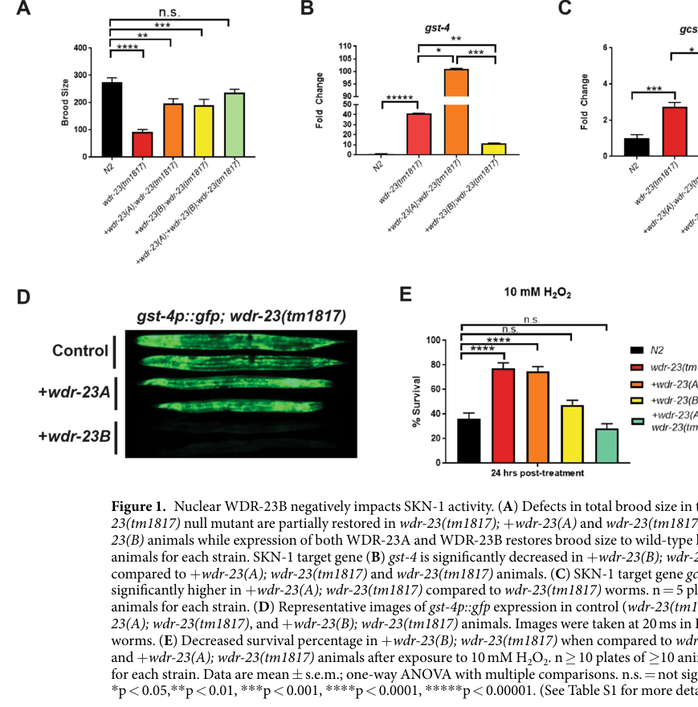

## Question

# Gene Research for Functional Annotation

## ⚠️ CRITICAL: Gene/Protein Identification Context

**BEFORE YOU BEGIN RESEARCH:** You MUST verify you are researching the CORRECT gene/protein. Gene symbols can be ambiguous, especially for less well-characterized genes from non-model organisms.

### Target Gene/Protein Identity (from UniProt):
- **UniProt Accession:** S6FN32
- **Protein Description:** RecName: Full=DDB1- and CUL4-associated factor 11 homolog {ECO:0000256|ARBA:ARBA00071980, ECO:0000256|PIRNR:PIRNR038135};
- **Gene Information:** Name=wdr-23 {ECO:0000313|EMBL:CDG24145.1, ECO:0000313|WormBase:D2030.9d}; ORFNames=CELE_D2030.9 {ECO:0000313|EMBL:CDG24145.1}, D2030.9 {ECO:0000313|WormBase:D2030.9d};
- **Organism (full):** Caenorhabditis elegans.
- **Protein Family:** Belongs to the WD repeat LEC14B family.
- **Key Domains:** DCAF. (IPR051859); DCAF11/LEC14B. (IPR017399); WD40/YVTN_repeat-like_dom_sf. (IPR015943); WD40_PAC1. (IPR020472); WD40_repeat_dom_sf. (IPR036322)

### MANDATORY VERIFICATION STEPS:

1. **Check if the gene symbol "wdr-23" matches the protein description above**
2. **Verify the organism is correct:** Caenorhabditis elegans.
3. **Check if protein family/domains align with what you find in literature**
4. **If you find literature for a DIFFERENT gene with the same or similar symbol, STOP**

### If Gene Symbol is Ambiguous or You Cannot Find Relevant Literature:

**DO NOT PROCEED WITH RESEARCH ON A DIFFERENT GENE.** Instead:
- State clearly: "The gene symbol 'wdr-23' is ambiguous or literature is limited for this specific protein"
- Explain what you found (e.g., "Found extensive literature on a different gene with the same symbol in a different organism")
- Describe the protein based ONLY on the UniProt information provided above
- Suggest that the protein function can be inferred from domain/family information

### Research Target:

Please provide a comprehensive research report on the gene **wdr-23** (gene ID: wdr-23, UniProt: S6FN32) in worm.

The research report should be a detailed narrative explaining the function, biological processes, and localization of the gene product. Citations should be given for all claims.

You should prioritize authoritative reviews and primary scientific literature when conducting research. You can supplement
this with annotations you find in gene/protein databases, but these can be outdated or inaccurate.

We are specifically interested in the primary function of the gene - for enzymes, what reaction is catalyzed, and what is the substrate specificity? For transporters, what is the substrate? For structural proteins or adapters, what is the broader structural role? For signaling molecules, what is the role in the pathway.

We are interested in where in or outside the cell the gene product carries out its function.

We are also interested in the signaling or biochemical pathways in which the gene functions. We are less interested in broad pleiotropic effects, except where these elucidate the precise role.

Include evidence where possible. We are interested in both experimental evidence as well as inference from structure, evolution, or bioinformatic analysis. Precise studies should be prioritized over high-throughput, where available.

## Output

Question: You are an expert researcher providing comprehensive, well-cited information.

Provide detailed information focusing on:
1. Key concepts and definitions with current understanding
2. Recent developments and latest research (prioritize 2023-2024 sources)
3. Current applications and real-world implementations
4. Expert opinions and analysis from authoritative sources
5. Relevant statistics and data from recent studies

Format as a comprehensive research report with proper citations. Include URLs and publication dates where available.
Always prioritize recent, authoritative sources and provide specific citations for all major claims.

# Gene Research for Functional Annotation

## ⚠️ CRITICAL: Gene/Protein Identification Context

**BEFORE YOU BEGIN RESEARCH:** You MUST verify you are researching the CORRECT gene/protein. Gene symbols can be ambiguous, especially for less well-characterized genes from non-model organisms.

### Target Gene/Protein Identity (from UniProt):
- **UniProt Accession:** S6FN32
- **Protein Description:** RecName: Full=DDB1- and CUL4-associated factor 11 homolog {ECO:0000256|ARBA:ARBA00071980, ECO:0000256|PIRNR:PIRNR038135};
- **Gene Information:** Name=wdr-23 {ECO:0000313|EMBL:CDG24145.1, ECO:0000313|WormBase:D2030.9d}; ORFNames=CELE_D2030.9 {ECO:0000313|EMBL:CDG24145.1}, D2030.9 {ECO:0000313|WormBase:D2030.9d};
- **Organism (full):** Caenorhabditis elegans.
- **Protein Family:** Belongs to the WD repeat LEC14B family.
- **Key Domains:** DCAF. (IPR051859); DCAF11/LEC14B. (IPR017399); WD40/YVTN_repeat-like_dom_sf. (IPR015943); WD40_PAC1. (IPR020472); WD40_repeat_dom_sf. (IPR036322)

### MANDATORY VERIFICATION STEPS:

1. **Check if the gene symbol "wdr-23" matches the protein description above**
2. **Verify the organism is correct:** Caenorhabditis elegans.
3. **Check if protein family/domains align with what you find in literature**
4. **If you find literature for a DIFFERENT gene with the same or similar symbol, STOP**

### If Gene Symbol is Ambiguous or You Cannot Find Relevant Literature:

**DO NOT PROCEED WITH RESEARCH ON A DIFFERENT GENE.** Instead:
- State clearly: "The gene symbol 'wdr-23' is ambiguous or literature is limited for this specific protein"
- Explain what you found (e.g., "Found extensive literature on a different gene with the same symbol in a different organism")
- Describe the protein based ONLY on the UniProt information provided above
- Suggest that the protein function can be inferred from domain/family information

### Research Target:

Please provide a comprehensive research report on the gene **wdr-23** (gene ID: wdr-23, UniProt: S6FN32) in worm.

The research report should be a detailed narrative explaining the function, biological processes, and localization of the gene product. Citations should be given for all claims.

You should prioritize authoritative reviews and primary scientific literature when conducting research. You can supplement
this with annotations you find in gene/protein databases, but these can be outdated or inaccurate.

We are specifically interested in the primary function of the gene - for enzymes, what reaction is catalyzed, and what is the substrate specificity? For transporters, what is the substrate? For structural proteins or adapters, what is the broader structural role? For signaling molecules, what is the role in the pathway.

We are interested in where in or outside the cell the gene product carries out its function.

We are also interested in the signaling or biochemical pathways in which the gene functions. We are less interested in broad pleiotropic effects, except where these elucidate the precise role.

Include evidence where possible. We are interested in both experimental evidence as well as inference from structure, evolution, or bioinformatic analysis. Precise studies should be prioritized over high-throughput, where available.

# Functional annotation report: *Caenorhabditis elegans wdr-23* (UniProt S6FN32)

## Executive conclusion

The requested target is correctly identified. In *C. elegans*, *wdr-23* is the gene originally isolated as *xrep-1* and corresponds to ORF D2030.9. Mapping near cosmid D2030, induction of GST-4 by D2030.9 RNAi, rescue of the *xrep-1* mutant with genomic D2030.9, and mutations in its WD-repeat region establish this identity experimentally. Thus, the literature reviewed here concerns the worm protein specified by UniProt S6FN32—not a similarly named mammalian or non-nematode protein. (hasegawa2010geneticandcellular pages 1-2)

WDR-23 is **not an enzyme or transporter**. Its primary role is that of a noncatalytic, WD40-repeat substrate receptor/adaptor for a CUL-4–DDB-1 E3 ubiquitin-ligase complex. Its best-established substrate is the SKN-1 transcription factor, the *C. elegans* counterpart of the mammalian Nrf stress-response family. Under basal conditions, WDR-23 restrains SKN-1 nuclear abundance and transcriptional activity; loss of WDR-23 stabilizes/activates SKN-1 and constitutively induces detoxification genes. Nuclear WDR-23B appears to provide the principal proteolytic brake, whereas cytoplasmic/mitochondria-associated WDR-23A has distinct, partly nonproteolytic functions. (fukushige2017ageneticanalysis pages 20-25, ramos2023comparativeanalysisof pages 1-2, spatola2019nuclearandcytoplasmic pages 1-2)

| Aspect | Best-supported annotation | Experimental basis | Confidence or caveat |
|---|---|---|---|
| Identity | *C. elegans wdr-23* is the gene originally designated *xrep-1*, corresponding to ORF D2030.9 and UniProt S6FN32. | Genetic mapping near D2030, D2030.9 RNAi phenocopy, genomic rescue, and mutations within the encoded WD-repeat region. | **High.** Organism, locus, aliases, and protein class agree. Do not conflate this evidence with experiments on mammalian WDR23 or DCAF11. |
| Molecular class | Nonenzymatic WD40-repeat DCAF substrate receptor and adaptor for a CUL-4–DDB-1 E3 ubiquitin-ligase complex. | Physical and genetic association with CUL-4 and DDB-1; mutation of conserved DDB1-binding DxR residues abolishes functional rescue without grossly disrupting expression or localization. | **High** for adaptor function. WDR-23 does not itself catalyze a metabolic reaction; ubiquitin transfer is performed by the assembled ligase machinery. |
| Primary substrate and function | Binds and negatively regulates SKN-1, limiting its nuclear abundance, stability, and transcriptional activity under basal conditions. | *wdr-23* loss or RNAi constitutively induces SKN-1 targets; *skn-1* loss suppresses major *wdr-23* phenotypes; CUL-4–DDB-1 interaction is required for repression. | **High.** Proteasome-dependent turnover is best established for nuclear regulation, although WDR-23 also has isoform-specific and potentially nonproteolytic activity. |
| Additional substrate | GEN-1, a Holliday-junction resolvase involved in genome maintenance and double-strand-break repair. | Interaction screening, conserved WDR23–GEN1 association, in-vitro ubiquitination, and isoform-dependent DNA-repair phenotypes. | **Moderate to high.** GEN-1 is experimentally supported, but ubiquitin topology and physiological consequences are less resolved than for SKN-1. |
| WDR-23A isoform | Predominantly cytoplasmic and associated with mitochondrial outer membranes; may positively modulate substrates through a proteasome-independent or multi-monoubiquitination mechanism. | Fluorescent localization, mitochondrial-marker colocalization, isoform-only rescue, target-gene expression, oxidative-stress survival, and in-vitro GEN-1 ubiquitination assays. | **Moderate to high.** Mitochondrial association is supported, but WDR-23A’s precise biochemical output and whether it directly activates SKN-1 remain incompletely defined. |
| WDR-23B isoform | Predominantly nuclear; provides the strongest negative control of SKN-1 and probably promotes substrate polyubiquitylation and turnover. | Nuclear fluorescence, reduced *gst-4* expression, suppression of oxidative-stress resistance, and complementation with isoform-restricted transgenes. | **High** for nuclear localization and repression; **moderate** for the proposed ubiquitin-chain architecture. |
| Principal tissue of action | Intestinal WDR-23 control of SKN-1 is necessary and sufficient for normal neuromuscular output, demonstrating cell-nonautonomous intestine-to-neuron signaling. | Intestine-specific rescue restores locomotion and aldicarb responses; intestine-specific knockdown reproduces defects, whereas neuronal or muscle manipulations do not. | **High** for the assayed neuromuscular phenotype. WDR-23 is also expressed in hypodermis, muscle, pharynx, and neurons, so other functions may be tissue-specific. |
| Core pathway | Basally, WDR-23–DDB-1–CUL-4 restrains SKN-1. Oxidative, electrophilic, xenobiotic, metabolic, or pathogen-associated inputs relieve or bypass repression, enabling SKN-1-dependent transcription of cytoprotective genes such as *gst-4* and *gcs-1*. | Mutant and RNAi epistasis, reporter induction, transcript measurements, toxin exposure, WDR-23 abundance changes, and stress-survival assays. | **High** for pathway placement. The proximal stress-sensing mechanism is context-dependent and is not simply equivalent to mammalian KEAP1 cysteine sensing. |
| Major phenotypes | Loss of WDR-23 causes constitutive detoxification-gene expression and increased acute oxidative-stress resistance, but also developmental, fertility, locomotor, synaptic-secretion, metabolic, and lifespan abnormalities. | Null mutants, RNAi, genomic and tissue-specific rescue, aldicarb and levamisole assays, fluorescent vesicle reporters, RNA sequencing, brood-size measurements, and survival assays. | **High** that major phenotypes result largely from excessive SKN-1 activity; outcomes vary with allele, isoform, tissue, age, and environment. |
| 2023–2024 interpretation | WDR-23 is increasingly viewed as an essential off-switch or homeostatic brake: acute SKN-1 activation is protective, whereas chronic activation following *wdr-23* loss produces model-specific trade-offs and age-related pathology. | Comparative analysis of constitutive SKN-1 models and a 2024 synthesis of pathway deactivation, healthspan, lipid homeostasis, stress resistance, and longevity. | **Moderate to high.** Peer-reviewed evidence supports the homeostat model; some claims involving mitochondrial biogenesis or nutraceutical mechanisms remain preprint-level or indirect. |

*Table: Compact evidence matrix for the identity, molecular role, localization, substrates, tissue of action, pathway placement, and current interpretation of C. elegans WDR-23/S6FN32.*

## 1. Identity, nomenclature, and domain consistency

### 1.1 Mandatory identity verification

The target identity passes all requested checks:

- **Gene:** *wdr-23*, formerly *xrep-1*.
- **ORF:** D2030.9, consistent with the supplied CELE_D2030.9 designation.
- **Organism:** *Caenorhabditis elegans*.
- **Product class:** a WD-repeat protein homologous to WDR23.
- **Experimental identity evidence:** D2030.9 RNAi reproduced constitutive GST-4 expression, genomic D2030.9 rescued *xrep-1(k1007)*, and five sequenced *xrep-1* alleles—four missense and one nonsense—affected the WD-repeat region. (hasegawa2010geneticandcellular pages 1-2)

The supplied InterPro annotations—DCAF, DCAF11/LEC14B, WD40/YVTN-repeat-like, WD40_PAC1, and WD40-repeat superfamily—are mechanistically coherent with the literature. DCAFs are DDB1–CUL4-associated factors that use WD40-like interaction surfaces to recognize substrates. The literature explicitly characterizes worm WDR-23 as a WD40-repeat protein associated with CUL-4/DDB-1. (fukushige2017ageneticanalysis pages 20-25, fukushige2017ageneticanalysis pages 16-20)

### 1.2 Ambiguity control

Mammalian WDR23, often called DCAF11, is an orthologous CRL4 substrate receptor, but mammalian findings are not automatically annotations of S6FN32. Likewise, unrelated WD-repeat proteins such as WDR6 are not *C. elegans* WDR-23. The report therefore uses mammalian work only as evolutionary context, not as primary evidence for worm localization or function.

## 2. Molecular function

### 2.1 Core biochemical role

WDR-23 supplies substrate recognition to a CUL-4–DDB-1 ubiquitin-ligase complex. It therefore does not catalyze a stand-alone chemical reaction and has no small-molecule substrate specificity analogous to an enzyme. Instead, its relevant “substrate specificity” is protein recognition, with **SKN-1** being the principal physiologically established substrate and **GEN-1**, a Holliday-junction resolvase, an additional experimentally supported substrate. (fukushige2017ageneticanalysis pages 20-25, spatola2019nuclearandcytoplasmic pages 1-2, spatola2019nuclearandcytoplasmic pages 7-8)

Functional dependence on the ligase complex is unusually strong. In Staab et al. (published March 2013), mutation of conserved DxR-box arginines needed for DDB-1 binding produced WDR-23 protein that appeared normally expressed and localized but could not rescue the *wdr-23* neuromuscular phenotype. This separates loss of CUL-4/DDB-1 engagement from simple protein instability and supports the conclusion that WDR-23 acts as a bona fide ligase adaptor. [DOI/URL: https://doi.org/10.1371/journal.pgen.1003354] (staab2013theconservedskn1nrf2 pages 2-3)

The foundational mechanism was reported by Choe, Przybysz, and Strange in 2009: WDR-23 functions with the CUL4/DDB1 ubiquitin ligase to regulate SKN-1 nuclear abundance and activity. [DOI/URL: https://doi.org/10.1128/MCB.01811-08] (tavizon2026lin23affectsc. pages 30-34)

### 2.2 Control of SKN-1

The convergent model is:

1. Under unstressed conditions, WDR-23 recruits or presents SKN-1 to CRL4–DDB1-associated ubiquitin machinery.
2. This limits SKN-1 stability and nuclear activity.
3. Oxidative, electrophilic, xenobiotic, metabolic, or infection-related stress relieves, bypasses, or counter-regulates this restraint.
4. Active SKN-1 drives genes involved in glutathione metabolism and Phase II detoxification, including *gst-4* and *gcs-1*.

Loss-of-function mutants and RNAi provide the clearest organismal evidence: *wdr-23* depletion strongly activates *gst-4::gfp*, and *skn-1* loss suppresses major *wdr-23* phenotypes. Conversely, genomic or tissue-specific WDR-23 rescue restores repression and physiological function. (fukushige2017ageneticanalysis pages 16-20, wu2017fboxproteinxrep4 pages 11-13, staab2013theconservedskn1nrf2 pages 2-3)

This mechanism is analogous—but not identical—to mammalian KEAP1–NRF2 regulation. *C. elegans* lacks a conventional KEAP1 homolog, and WDR-23 belongs to a different ubiquitin-ligase architecture. Calling WDR-23 a “functional equivalent” of KEAP1 is therefore useful at the pathway level but should not imply common domain composition or identical cysteine-based stress sensing. The original *xrep-1* study proposed this functional equivalence because loss of WDR-23 constitutively activated many GST and Phase II genes. (hasegawa2010geneticandcellular pages 1-2)

### 2.3 GEN-1 and genome maintenance

Spatola et al. identified GEN-1 as a conserved WDR-23 interactor and substrate. In vitro assays showed that both WDR-23 isoforms could modify GEN-1, but with different apparent ubiquitination behavior. The authors proposed that cytoplasmic WDR-23A favors multi-monoubiquitination or a nonproteolytic state, whereas nuclear WDR-23B is more compatible with polyubiquitin-linked turnover. This chain-topology model is plausible but less firmly established than the general WDR-23–SKN-1 relationship. [Published August 2019; DOI/URL: https://doi.org/10.1038/s41598-019-48286-y] (spatola2019nuclearandcytoplasmic pages 7-8)

## 3. Subcellular localization and isoform specialization

Two major isoforms are supported:

- **WDR-23A:** predominantly cytoplasmic and associated with the outer mitochondrial membrane. Its N terminus contains predicted nuclear-export information absent from WDR-23B. WDR-23A may exert proteasome-independent or activating effects on selected substrates.
- **WDR-23B:** predominantly nuclear and the stronger negative regulator of SKN-1 transcriptional activity, most likely by promoting substrate turnover. (spatola2019nuclearandcytoplasmic pages 1-2, spatola2019nuclearandcytoplasmic pages 7-8, staab2013theconservedskn1nrf2 pages 5-7)

Microscopy in the 2013 study found WDR-23A–GFP in regularly spaced rings that colocalized with an outer-mitochondrial-membrane marker. The same study reported differential localization of the two isoforms to mitochondrial outer membranes and nuclei. (staab2013theconservedskn1nrf2 pages 1-2, staab2013theconservedskn1nrf2 pages 5-7)

Isoform-restricted experiments reveal that localization is functional rather than merely descriptive. In a *wdr-23(tm1817)* null background, nuclear WDR-23B reduced *gst-4* expression and suppressed enhanced peroxide resistance, whereas cytoplasmic WDR-23A did not restore basal repression and instead enhanced selected SKN-1 outputs. Co-expression of both isoforms restored brood size and peroxide survival closer to wild type, indicating complementary functions. (spatola2019nuclearandcytoplasmic pages 2-3, spatola2019nuclearandcytoplasmic media ff1349bd)

## 4. Tissue expression and cellular site of action

Promoter reporters show broad expression. The predominant *wdr-23a* promoter is active in intestine, hypodermis, muscle, and neurons; the *wdr-23b* promoter is active in intestine, hypodermis, and muscle but was not detected in neurons in the cited assay. An earlier *xrep-1* study also reported expression in pharynx, intestine, hypodermis, neurons, and additional tissues. (hasegawa2010geneticandcellular pages 4-5, staab2013theconservedskn1nrf2 pages 5-7)

The **intestine is the best-established functional site** for regulation of neuromuscular physiology. Intestinal WDR-23 driven by either *ges-1* or *nlp-40* promoters fully rescued locomotion and aldicarb responses in *wdr-23* mutants. Intestine-specific hairpin RNAi reproduced aldicarb resistance, whereas neuronal or muscle expression/knockdown did not. Thus, WDR-23 restrains intestinal SKN-1 and thereby controls distant neuronal output through a cell-nonautonomous signal rather than acting only at the neuromuscular junction. (staab2013theconservedskn1nrf2 pages 5-7)

This should not be interpreted as meaning that all WDR-23 functions occur exclusively in the intestine. Its broad expression, isoform specialization, and GEN-1-related genome-maintenance effects imply additional tissue- and compartment-specific activities.

## 5. Pathways and biological processes

### 5.1 Xenobiotic and oxidative-stress response

The initial *xrep* screen was explicitly designed around acrylamide-induced Phase II detoxification. Approximately **3.5 × 10^5 mutagenized genomes** yielded 24 mutants assigned to four complementation groups. Loss of *xrep-1/wdr-23* caused constitutive expression of numerous GSTs and other Phase II enzymes without acrylamide, defining WDR-23 as a basal repressor of the xenobiotic response. (hasegawa2010geneticandcellular pages 1-2)

Toxin exposure can regulate WDR-23 itself. Acrylamide reduced WDR-23::GFP abundance, and this response required the F-box protein XREP-4. XREP-4 binds SKR-1 and WDR-23, and *xrep-4* knockdown increases total and nuclear WDR-23::GFP, suggesting an upstream SCF-like mechanism that removes WDR-23 during stress and thereby permits SKN-1 activation. (fukushige2017ageneticanalysis pages 16-20, wu2017fboxproteinxrep4 pages 11-13)

### 5.2 Proteostasis and stress homeostasis

WDR-23 is now best viewed as a molecular **off-switch/homeostat**. Acute SKN-1 activation can protect against oxidative or xenobiotic injury, but prolonged activation can perturb development, reproduction, lipid allocation, locomotion, and lifespan. The 2023 comparative analysis emphasized that *wdr-23* loss stabilizes SKN-1 and increases oxidative-stress resistance, but that different constitutive-SKN-1 models produce distinct physiological signatures rather than one uniformly beneficial longevity phenotype. [Published online 26 September 2023; DOI/URL: https://doi.org/10.1007/s11357-023-00937-9] (ramos2023comparativeanalysisof pages 1-2)

A 2024 authoritative synthesis consequently frames WDR-23-mediated deactivation as essential to balancing cytoprotection against pathology. It cautions that chronic SKN-1/NRF activity can diminish health despite the pathway’s acute protective role. [Published March 2024; DOI/URL: https://doi.org/10.3389/fragi.2024.1369740] (turner2024disruptingtheskn1 pages 14-14)

### 5.3 Cell-nonautonomous control of synaptic function

*wdr-23* mutants have reduced locomotion, aldicarb resistance, impaired synaptic-vesicle release, and defective neuropeptide secretion from cholinergic motor neurons. These animals retain grossly normal neuron number, axonal projections, synapse number, and synaptic size, arguing for a functional secretion defect rather than neurodevelopmental loss. Genomic WDR-23 rescue reverses the phenotype, and several *skn-1* loss-of-function alleles suppress locomotor, growth, size, and aldicarb defects. (staab2013theconservedskn1nrf2 pages 2-3, staab2013theconservedskn1nrf2 pages 3-5, staab2013theconservedskn1nrf2 pages 5-7)

Transcriptomics provides a possible downstream explanation: more than **2,000 genes** were altered in *wdr-23* mutants; *odr-3* and *odr-10* were elevated about sixfold and *rab-3* approximately 3.3-fold. These correlations support broad reprogramming of sensory and synaptic pathways, although they do not by themselves identify the endocrine signal from intestine to neurons. (staab2013theconservedskn1nrf2 pages 12-13)

## 6. Quantitative evidence

Several results define the magnitude of WDR-23 control:

- In the 2019 isoform study, the *wdr-23(tm1817)* null mutant expressed approximately **40-fold more *gst-4* mRNA** than wild type. WDR-23A-only rescue increased *gst-4* to approximately **100-fold above wild type**, whereas nuclear WDR-23B sharply reduced the response. (spatola2019nuclearandcytoplasmic pages 2-3)
- After **10 mM H₂O₂**, approximately three-quarters of null or WDR-23A-only animals survived at 24 hours, compared with roughly one-third of wild type; WDR-23B reduced survival toward wild-type levels, and dual-isoform rescue reduced it further. These graph-derived values should be treated as approximate; the published figure and legend provide the underlying statistical comparisons. (spatola2019nuclearandcytoplasmic media ff1349bd)
- Either isoform partially rescued the low brood size of the null mutant, but both together were required for near-wild-type fertility, supporting cooperative, nonredundant functions. (spatola2019nuclearandcytoplasmic pages 2-3, spatola2019nuclearandcytoplasmic media ff1349bd)
- The 2013 transcriptome identified over **2,000 differentially expressed genes**, including approximately sixfold changes in selected sensory GPCR genes and a 3.3-fold increase in *rab-3*. (staab2013theconservedskn1nrf2 pages 12-13)

## 7. Recent developments, 2023–2024

Recent peer-reviewed work has shifted interpretation from “WDR-23 is simply a negative regulator whose removal is beneficial” to “WDR-23 is required to terminate a costly transcriptional response.” Ramos and Curran’s 2023 comparison showed that *wdr-23* loss, *skn-1* gain-of-function, and *xrep-4* gain-of-function all activate SKN-1 but yield distinct outcomes for development, stress resistance, reproduction, lipid homeostasis, healthspan, and lifespan. This implies that allele, isoform, tissue, age, and parallel WDR-23 substrates matter. (ramos2023comparativeanalysisof pages 1-2)

Turner, Ramos, and Curran’s 2024 review formalized the **SKN-1 homeostat** concept: WDR-23-mediated turnover is not merely repression but an essential recovery mechanism after stress. [March 2024; https://doi.org/10.3389/fragi.2024.1369740] (turner2024disruptingtheskn1 pages 14-14)

Two additional 2023–2024 directions require caution because the retrieved versions were preprints or indirect:

- A 2023 bioRxiv study proposed that WDR23 loss promotes neuronal mitochondrial biogenesis. This is relevant to the mitochondrial localization/homeostasis theme but should not yet override the established worm isoform model.
- A May 2024 Research Square preprint proposed that sulforaphane extends worm lifespan through a DAF-16/DDB1/WDR23/SKN-1 route rather than KEAP1. Its genetic observations are potentially useful for nutraceutical screening, but the mechanistic conclusion remains provisional pending peer review.

## 8. Applications and real-world implementation

WDR-23 is chiefly a **research tool and mechanistic target**, not an approved therapeutic target in the worm. Current applications include:

1. **In vivo oxidative-stress screening.** *wdr-23* RNAi or mutants provide a positive-control state for SKN-1 activation, commonly monitored with *gst-4p::gfp* or *gcs-1* reporters. The system supports genetic, environmental, and chemical screens. (fukushige2017ageneticanalysis pages 16-20, wu2017fboxproteinxrep4 pages 11-13)
2. **Xenobiotic and natural-product assessment.** Because the worm lacks canonical KEAP1, it can distinguish WDR23/DDB1-dependent SKN-1 activation from KEAP1-centered mammalian mechanisms. This is useful but demands validation of compound exposure, metabolism, and orthologous pathway engagement.
3. **Aging and healthspan studies.** *wdr-23* loss is a standard genetic model of chronic SKN-1 activation. Its principal value is now in defining trade-offs between acute stress resistance and long-term metabolic, reproductive, and neuromuscular health. (ramos2023comparativeanalysisof pages 1-2, turner2024disruptingtheskn1 pages 14-14)
4. **Inter-tissue signaling studies.** Intestine-specific manipulation of WDR-23 provides a tractable model for how peripheral stress responses alter neuronal secretion and behavior. (staab2013theconservedskn1nrf2 pages 5-7)
5. **Ubiquitin-ligase and genome-stability research.** Isoform-restricted WDR-23 strains can resolve compartment-specific ubiquitination and effects on SKN-1 versus GEN-1. (spatola2019nuclearandcytoplasmic pages 2-3, spatola2019nuclearandcytoplasmic pages 7-8)

## 9. Evidence-weighted annotation

**Recommended primary annotation:** “WD40-repeat DDB1–CUL4-associated substrate receptor that controls cellular stress homeostasis by restricting the abundance and transcriptional activity of SKN-1; nuclear WDR-23B mediates the principal negative/proteolytic effect, while cytoplasmic and mitochondrial-associated WDR-23A has distinct, partly nonproteolytic functions.”

**Recommended biological-process terms:** regulation of oxidative-stress response; xenobiotic detoxification; protein ubiquitination/proteasomal turnover; regulation of SKN-1-dependent transcription; cell-nonautonomous regulation of synaptic secretion; and, with secondary confidence, DNA double-strand-break repair through GEN-1 regulation.

**Recommended localization:** nucleus for WDR-23B; cytoplasm and mitochondrial outer-membrane-associated structures for WDR-23A; functional expression especially in intestine, with additional expression in hypodermis, muscle, pharynx, and neurons. (spatola2019nuclearandcytoplasmic pages 1-2, staab2013theconservedskn1nrf2 pages 5-7)

## 10. Remaining uncertainties

The upstream molecular event by which different stresses disable or bypass WDR-23 is context-dependent and incompletely resolved. Direct SKN-1 ubiquitin-chain topology in vivo, the precise biochemical activity of WDR-23A, the endocrine signal linking intestinal SKN-1 to neuronal secretion, and the relative importance of non-SKN-1 substrates remain open questions. Therefore, strong evidence supports WDR-23 as a CRL4–DDB1 substrate receptor and SKN-1 homeostatic brake, while claims that it is itself the primary redox sensor or that every *wdr-23* phenotype is caused exclusively by SKN-1 would be overstatements.

References

1. (hasegawa2010geneticandcellular pages 1-2): Koichi Hasegawa and Johji Miwa. Genetic and cellular characterization of caenorhabditis elegans mutants abnormal in the regulation of many phase ii enzymes. PLoS ONE, 5:e11194, Jun 2010. URL: https://doi.org/10.1371/journal.pone.0011194, doi:10.1371/journal.pone.0011194. This article has 48 citations and is from a peer-reviewed journal.

2. (fukushige2017ageneticanalysis pages 20-25): Tetsunari Fukushige, Harold E Smith, Johji Miwa, Michael W Krause, and John A Hanover. A genetic analysis of the <i>caenorhabditis elegans</i> detoxification response. Jun 2017. URL: https://doi.org/10.1534/genetics.117.202515, doi:10.1534/genetics.117.202515. This article has 25 citations and is from a domain leading peer-reviewed journal.

3. (ramos2023comparativeanalysisof pages 1-2): Carmen M. Ramos and Sean P. Curran. Comparative analysis of the molecular and physiological consequences of constitutive skn-1 activation. GeroScience, 45:3359-3370, Sep 2023. URL: https://doi.org/10.1007/s11357-023-00937-9, doi:10.1007/s11357-023-00937-9. This article has 14 citations and is from a peer-reviewed journal.

4. (spatola2019nuclearandcytoplasmic pages 1-2): Brett N. Spatola, Jacqueline Y. Lo, Bin Wang, and Sean P. Curran. Nuclear and cytoplasmic wdr-23 isoforms mediate differential effects on gen-1 and skn-1 substrates. Scientific Reports, Aug 2019. URL: https://doi.org/10.1038/s41598-019-48286-y, doi:10.1038/s41598-019-48286-y. This article has 26 citations and is from a peer-reviewed journal.

5. (fukushige2017ageneticanalysis pages 16-20): Tetsunari Fukushige, Harold E Smith, Johji Miwa, Michael W Krause, and John A Hanover. A genetic analysis of the <i>caenorhabditis elegans</i> detoxification response. Jun 2017. URL: https://doi.org/10.1534/genetics.117.202515, doi:10.1534/genetics.117.202515. This article has 25 citations and is from a domain leading peer-reviewed journal.

6. (spatola2019nuclearandcytoplasmic pages 7-8): Brett N. Spatola, Jacqueline Y. Lo, Bin Wang, and Sean P. Curran. Nuclear and cytoplasmic wdr-23 isoforms mediate differential effects on gen-1 and skn-1 substrates. Scientific Reports, Aug 2019. URL: https://doi.org/10.1038/s41598-019-48286-y, doi:10.1038/s41598-019-48286-y. This article has 26 citations and is from a peer-reviewed journal.

7. (staab2013theconservedskn1nrf2 pages 2-3): Trisha A. Staab, Trevor C. Griffen, Connor Corcoran, Oleg Evgrafov, James A. Knowles, and Derek Sieburth. The conserved skn-1/nrf2 stress response pathway regulates synaptic function in caenorhabditis elegans. PLoS Genetics, 9:e1003354, Mar 2013. URL: https://doi.org/10.1371/journal.pgen.1003354, doi:10.1371/journal.pgen.1003354. This article has 89 citations and is from a domain leading peer-reviewed journal.

8. (tavizon2026lin23affectsc. pages 30-34): Larissa A. Tavizón, Carolaing Gabaldón, Melissa R. Cruz, Olivia Munsey, and Danielle A. Garsin. Lin-23 affects <i>c. elegans</i> pathogen and stress resistance by modulating skn-1 activity. Jul 2026. URL: https://doi.org/10.64898/2026.07.22.740106, doi:10.64898/2026.07.22.740106. This article has 0 citations.

9. (wu2017fboxproteinxrep4 pages 11-13): Cheng-Wei Wu, Ying Wang, and Keith P Choe. F-box protein xrep-4 is a new regulator of the oxidative stress response in <i>caenorhabditis elegans</i>. Jun 2017. URL: https://doi.org/10.1534/genetics.117.200592, doi:10.1534/genetics.117.200592. This article has 30 citations and is from a domain leading peer-reviewed journal.

10. (staab2013theconservedskn1nrf2 pages 5-7): Trisha A. Staab, Trevor C. Griffen, Connor Corcoran, Oleg Evgrafov, James A. Knowles, and Derek Sieburth. The conserved skn-1/nrf2 stress response pathway regulates synaptic function in caenorhabditis elegans. PLoS Genetics, 9:e1003354, Mar 2013. URL: https://doi.org/10.1371/journal.pgen.1003354, doi:10.1371/journal.pgen.1003354. This article has 89 citations and is from a domain leading peer-reviewed journal.

11. (staab2013theconservedskn1nrf2 pages 1-2): Trisha A. Staab, Trevor C. Griffen, Connor Corcoran, Oleg Evgrafov, James A. Knowles, and Derek Sieburth. The conserved skn-1/nrf2 stress response pathway regulates synaptic function in caenorhabditis elegans. PLoS Genetics, 9:e1003354, Mar 2013. URL: https://doi.org/10.1371/journal.pgen.1003354, doi:10.1371/journal.pgen.1003354. This article has 89 citations and is from a domain leading peer-reviewed journal.

12. (spatola2019nuclearandcytoplasmic pages 2-3): Brett N. Spatola, Jacqueline Y. Lo, Bin Wang, and Sean P. Curran. Nuclear and cytoplasmic wdr-23 isoforms mediate differential effects on gen-1 and skn-1 substrates. Scientific Reports, Aug 2019. URL: https://doi.org/10.1038/s41598-019-48286-y, doi:10.1038/s41598-019-48286-y. This article has 26 citations and is from a peer-reviewed journal.

13. (spatola2019nuclearandcytoplasmic media ff1349bd): Brett N. Spatola, Jacqueline Y. Lo, Bin Wang, and Sean P. Curran. Nuclear and cytoplasmic wdr-23 isoforms mediate differential effects on gen-1 and skn-1 substrates. Scientific Reports, Aug 2019. URL: https://doi.org/10.1038/s41598-019-48286-y, doi:10.1038/s41598-019-48286-y. This article has 26 citations and is from a peer-reviewed journal.

14. (hasegawa2010geneticandcellular pages 4-5): Koichi Hasegawa and Johji Miwa. Genetic and cellular characterization of caenorhabditis elegans mutants abnormal in the regulation of many phase ii enzymes. PLoS ONE, 5:e11194, Jun 2010. URL: https://doi.org/10.1371/journal.pone.0011194, doi:10.1371/journal.pone.0011194. This article has 48 citations and is from a peer-reviewed journal.

15. (turner2024disruptingtheskn1 pages 14-14): Chris D. Turner, Carmen M. Ramos, and Sean P. Curran. Disrupting the skn-1 homeostat: mechanistic insights and phenotypic outcomes. Frontiers in Aging, Mar 2024. URL: https://doi.org/10.3389/fragi.2024.1369740, doi:10.3389/fragi.2024.1369740. This article has 30 citations.

16. (staab2013theconservedskn1nrf2 pages 3-5): Trisha A. Staab, Trevor C. Griffen, Connor Corcoran, Oleg Evgrafov, James A. Knowles, and Derek Sieburth. The conserved skn-1/nrf2 stress response pathway regulates synaptic function in caenorhabditis elegans. PLoS Genetics, 9:e1003354, Mar 2013. URL: https://doi.org/10.1371/journal.pgen.1003354, doi:10.1371/journal.pgen.1003354. This article has 89 citations and is from a domain leading peer-reviewed journal.

17. (staab2013theconservedskn1nrf2 pages 12-13): Trisha A. Staab, Trevor C. Griffen, Connor Corcoran, Oleg Evgrafov, James A. Knowles, and Derek Sieburth. The conserved skn-1/nrf2 stress response pathway regulates synaptic function in caenorhabditis elegans. PLoS Genetics, 9:e1003354, Mar 2013. URL: https://doi.org/10.1371/journal.pgen.1003354, doi:10.1371/journal.pgen.1003354. This article has 89 citations and is from a domain leading peer-reviewed journal.

## Artifacts

- [Edison artifact artifact-00](wdr-23-deep-research-falcon_artifacts/artifact-00.md)

## Citations

1. hasegawa2010geneticandcellular pages 1-2
2. spatola2019nuclearandcytoplasmic pages 7-8
3. ramos2023comparativeanalysisof pages 1-2
4. spatola2019nuclearandcytoplasmic pages 2-3
5. fukushige2017ageneticanalysis pages 20-25
6. spatola2019nuclearandcytoplasmic pages 1-2
7. fukushige2017ageneticanalysis pages 16-20
8. hasegawa2010geneticandcellular pages 4-5
9. DOI/URL: https://doi.org/10.1371/journal.pgen.1003354
10. DOI/URL: https://doi.org/10.1128/MCB.01811-08
11. Published August 2019; DOI/URL: https://doi.org/10.1038/s41598-019-48286-y
12. Published online 26 September 2023; DOI/URL: https://doi.org/10.1007/s11357-023-00937-9
13. Published March 2024; DOI/URL: https://doi.org/10.3389/fragi.2024.1369740
14. March 2024; https://doi.org/10.3389/fragi.2024.1369740
15. https://doi.org/10.1371/journal.pgen.1003354]
16. https://doi.org/10.1128/MCB.01811-08]
17. https://doi.org/10.1038/s41598-019-48286-y]
18. https://doi.org/10.1007/s11357-023-00937-9]
19. https://doi.org/10.3389/fragi.2024.1369740]
20. https://doi.org/10.1371/journal.pone.0011194,
21. https://doi.org/10.1534/genetics.117.202515,
22. https://doi.org/10.1007/s11357-023-00937-9,
23. https://doi.org/10.1038/s41598-019-48286-y,
24. https://doi.org/10.1371/journal.pgen.1003354,
25. https://doi.org/10.64898/2026.07.22.740106,
26. https://doi.org/10.1534/genetics.117.200592,
27. https://doi.org/10.3389/fragi.2024.1369740,