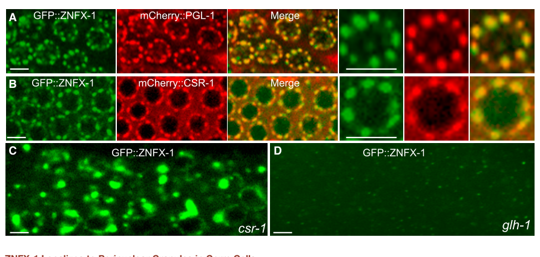
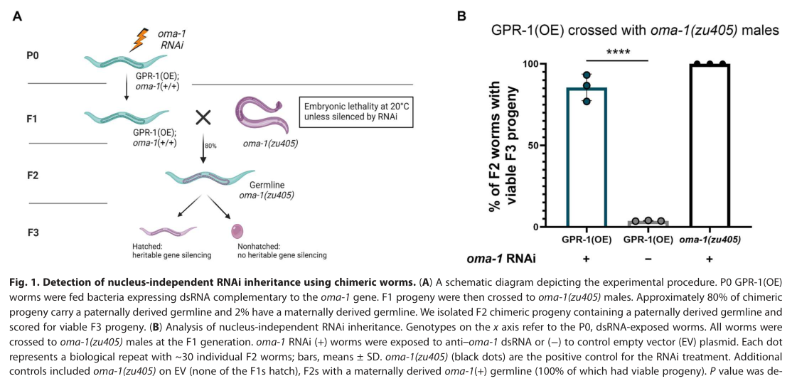

## Question

# Gene Research for Functional Annotation

## ⚠️ CRITICAL: Gene/Protein Identification Context

**BEFORE YOU BEGIN RESEARCH:** You MUST verify you are researching the CORRECT gene/protein. Gene symbols can be ambiguous, especially for less well-characterized genes from non-model organisms.

### Target Gene/Protein Identity (from UniProt):
- **UniProt Accession:** E9P860
- **Protein Description:** RecName: Full=NFX1-type zinc finger-containing protein 1 homolog {ECO:0000312|WormBase:ZK1067.2b}; EC=3.6.4.13 {ECO:0000305|PubMed:29775580};
- **Gene Information:** Name=znfx-1 {ECO:0000303|PubMed:29775580, ECO:0000312|WormBase:ZK1067.2b}; ORFNames=ZK1067.2 {ECO:0000312|WormBase:ZK1067.2b};
- **Organism (full):** Caenorhabditis elegans.
- **Protein Family:** Belongs to the ZNFX1 family. .
- **Key Domains:** DNA2/NAM7-like. (IPR045055); DNA2/NAM7-like_C. (IPR041679); DNA2/NAM7_AAA_11. (IPR041677); P-loop_NTPase. (IPR027417); SF1_C_Upf1. (IPR047187)

### MANDATORY VERIFICATION STEPS:

1. **Check if the gene symbol "znfx-1" matches the protein description above**
2. **Verify the organism is correct:** Caenorhabditis elegans.
3. **Check if protein family/domains align with what you find in literature**
4. **If you find literature for a DIFFERENT gene with the same or similar symbol, STOP**

### If Gene Symbol is Ambiguous or You Cannot Find Relevant Literature:

**DO NOT PROCEED WITH RESEARCH ON A DIFFERENT GENE.** Instead:
- State clearly: "The gene symbol 'znfx-1' is ambiguous or literature is limited for this specific protein"
- Explain what you found (e.g., "Found extensive literature on a different gene with the same symbol in a different organism")
- Describe the protein based ONLY on the UniProt information provided above
- Suggest that the protein function can be inferred from domain/family information

### Research Target:

Please provide a comprehensive research report on the gene **znfx-1** (gene ID: znfx-1, UniProt: E9P860) in worm.

The research report should be a detailed narrative explaining the function, biological processes, and localization of the gene product. Citations should be given for all claims.

You should prioritize authoritative reviews and primary scientific literature when conducting research. You can supplement
this with annotations you find in gene/protein databases, but these can be outdated or inaccurate.

We are specifically interested in the primary function of the gene - for enzymes, what reaction is catalyzed, and what is the substrate specificity? For transporters, what is the substrate? For structural proteins or adapters, what is the broader structural role? For signaling molecules, what is the role in the pathway.

We are interested in where in or outside the cell the gene product carries out its function.

We are also interested in the signaling or biochemical pathways in which the gene functions. We are less interested in broad pleiotropic effects, except where these elucidate the precise role.

Include evidence where possible. We are interested in both experimental evidence as well as inference from structure, evolution, or bioinformatic analysis. Precise studies should be prioritized over high-throughput, where available.

## Output

Question: You are an expert researcher providing comprehensive, well-cited information.

Provide detailed information focusing on:
1. Key concepts and definitions with current understanding
2. Recent developments and latest research (prioritize 2023-2024 sources)
3. Current applications and real-world implementations
4. Expert opinions and analysis from authoritative sources
5. Relevant statistics and data from recent studies

Format as a comprehensive research report with proper citations. Include URLs and publication dates where available.
Always prioritize recent, authoritative sources and provide specific citations for all major claims.

# Gene Research for Functional Annotation

## ⚠️ CRITICAL: Gene/Protein Identification Context

**BEFORE YOU BEGIN RESEARCH:** You MUST verify you are researching the CORRECT gene/protein. Gene symbols can be ambiguous, especially for less well-characterized genes from non-model organisms.

### Target Gene/Protein Identity (from UniProt):
- **UniProt Accession:** E9P860
- **Protein Description:** RecName: Full=NFX1-type zinc finger-containing protein 1 homolog {ECO:0000312|WormBase:ZK1067.2b}; EC=3.6.4.13 {ECO:0000305|PubMed:29775580};
- **Gene Information:** Name=znfx-1 {ECO:0000303|PubMed:29775580, ECO:0000312|WormBase:ZK1067.2b}; ORFNames=ZK1067.2 {ECO:0000312|WormBase:ZK1067.2b};
- **Organism (full):** Caenorhabditis elegans.
- **Protein Family:** Belongs to the ZNFX1 family. .
- **Key Domains:** DNA2/NAM7-like. (IPR045055); DNA2/NAM7-like_C. (IPR041679); DNA2/NAM7_AAA_11. (IPR041677); P-loop_NTPase. (IPR027417); SF1_C_Upf1. (IPR047187)

### MANDATORY VERIFICATION STEPS:

1. **Check if the gene symbol "znfx-1" matches the protein description above**
2. **Verify the organism is correct:** Caenorhabditis elegans.
3. **Check if protein family/domains align with what you find in literature**
4. **If you find literature for a DIFFERENT gene with the same or similar symbol, STOP**

### If Gene Symbol is Ambiguous or You Cannot Find Relevant Literature:

**DO NOT PROCEED WITH RESEARCH ON A DIFFERENT GENE.** Instead:
- State clearly: "The gene symbol 'znfx-1' is ambiguous or literature is limited for this specific protein"
- Explain what you found (e.g., "Found extensive literature on a different gene with the same symbol in a different organism")
- Describe the protein based ONLY on the UniProt information provided above
- Suggest that the protein function can be inferred from domain/family information

### Research Target:

Please provide a comprehensive research report on the gene **znfx-1** (gene ID: znfx-1, UniProt: E9P860) in worm.

The research report should be a detailed narrative explaining the function, biological processes, and localization of the gene product. Citations should be given for all claims.

You should prioritize authoritative reviews and primary scientific literature when conducting research. You can supplement
this with annotations you find in gene/protein databases, but these can be outdated or inaccurate.

We are specifically interested in the primary function of the gene - for enzymes, what reaction is catalyzed, and what is the substrate specificity? For transporters, what is the substrate? For structural proteins or adapters, what is the broader structural role? For signaling molecules, what is the role in the pathway.

We are interested in where in or outside the cell the gene product carries out its function.

We are also interested in the signaling or biochemical pathways in which the gene functions. We are less interested in broad pleiotropic effects, except where these elucidate the precise role.

Include evidence where possible. We are interested in both experimental evidence as well as inference from structure, evolution, or bioinformatic analysis. Precise studies should be prioritized over high-throughput, where available.

## Research report: Functional annotation of *C. elegans* **znfx-1** (UniProt **E9P860**) / ZNFX-1

### 0) Identity verification (critical disambiguation)
The evidence summarized here pertains specifically to **znfx-1 (ORF ZK1067.2) in *Caenorhabditis elegans***, encoding **ZNFX-1**, a conserved **NFX1-type cysteine-rich/zinc-finger** and **UPF1-like superfamily-1 (SF1) helicase** protein localized to germline perinuclear nuage and **Z granules**. Primary studies explicitly characterize *C. elegans* ZNFX-1 as a UPF1-like SF1 helicase-domain protein with multiple NF-X1-like cysteine-rich motifs and demonstrate germline nuage localization and small-RNA inheritance phenotypes, consistent with UniProt E9P860. (ishidate2018znfx1functionswithin pages 4-5, ishidate2018znfx1functionswithin pages 1-3)

### 1) Key concepts and definitions (current understanding)

#### 1.1 RNAi inheritance / transgenerational epigenetic inheritance (TEI)
In *C. elegans*, double-stranded RNA (dsRNA) can induce a gene-silencing response (RNA interference, RNAi) that persists in descendants not exposed to the original trigger. This inherited silencing is mediated by small RNAs and associated proteins and is often conceptualized as **RNA-directed TEI**. ZNFX-1 is one of the germline factors required for robust inherited RNAi silencing, particularly via **cytoplasmic/perinuclear germ-granule pathways**. (wan2017transgenerationalepigeneticinheritance pages 14-20, ouyang2021twoparallelsrna pages 9-12, rieger2023nucleusindependenttransgenerationalsmalla pages 2-3)

#### 1.2 Germ granules, perinuclear nuage, and Z granules
Germ granules are RNA-rich biomolecular condensates associated with germ cells. In *C. elegans*, perinuclear nuage is compartmentalized into subdomains, including **P granules**, **Mutator foci**, and a distinct condensate termed the **Z granule**.

A foundational model posits that Z granules are defined by ZNFX-1 and WAGO-4 and organize small-RNA inheritance functions by spatially ordering silencing machinery. Quantitatively, one study reported that in adult germ cells **60% (52/86)** of Z granules were closely apposed to both a P granule and a Mutator focus, and in **92% (48/52)** of those, the Z granule lay between the other two condensates, supporting a stereotyped “P–Z–M” arrangement. (wan2017transgenerationalepigeneticinheritance pages 8-11)

### 2) Molecular function of ZNFX-1 (primary function, mechanism, and biochemical role)

#### 2.1 What ZNFX-1 does (functional summary)
ZNFX-1 is best supported as an **RNA helicase/NTPase-like regulatory factor** that acts in **perinuclear condensates** to enable **amplification, patterning, and persistence** of small-RNA–guided silencing across generations.

Rather than catalyzing a classical metabolic transformation with a defined small-molecule substrate, ZNFX-1 appears to function in a **small-RNA amplification circuit** by interacting with target RNAs and recruitment/positioning of amplification machinery (notably RdRP). Functional necessity of the helicase core is supported by alleles affecting the ATP-binding site (e.g., **K1067A**) and helicase-domain deletions causing inheritance defects. (ishidate2018znfx1functionswithin pages 4-5, ishidate2018znfx1functionswithin pages 10-11)

#### 2.2 Relationship to pUGylated RNAs and “memorializing” silenced transcripts
A mechanistic advance is that ZNFX-1 interacts with small-RNA-targeted transcripts that acquire **poly(UG) (pUG) tails**, and it is required to maintain pUGylation and concentrate targeted mature RNAs in perinuclear condensates, thereby preserving a pool of templates for continued amplification in the inheriting generation. (ouyang2022theconservedhelicase pages 10-11, ouyang2021twoparallelsrna pages 9-12)

#### 2.3 Interaction partners and pathway placement
Co-immunoprecipitation experiments indicate that ZNFX-1 physically associates with the germline RdRP **EGO-1** and multiple Argonautes spanning distinct small-RNA systems, including **CSR-1, WAGO-1, and PRG-1**. The ZNFX-1:EGO-1 interaction is reported to be **RNase I–resistant** (RNA-independent complex), while interactions with WAGO-1 and PRG-1 are partially RNase sensitive. (ishidate2018znfx1functionswithin pages 7-8)

These interactions place ZNFX-1 at a nexus linking:
- **piRNA/PRG-1 initiation** of silencing,
- **WAGO-class amplification/maintenance**, and
- coexistence with CSR-1-related licensing/anti-silencing circuitry,
consistent with a role in **balancing epigenetic signals** rather than acting solely as a one-directional silencing factor. (ishidate2018znfx1functionswithin pages 5-7, ishidate2018znfx1functionswithin pages 1-3)

### 3) Subcellular localization: where ZNFX-1 carries out its function

#### 3.1 Germline perinuclear nuage and Z-granule subdomain
ZNFX-1 localizes to **perinuclear and cytoplasmic foci in germ cells** and to Z-granule subdomains within perinuclear nuage. Imaging shows GFP::ZNFX-1 signal at perinuclear granules resembling P-granules, while models and images support a ZNFX-1-enriched zone positioned between nuclear-proximal Argonaute/P-granule components and more distal RdRP/Mutator components. (ishidate2018znfx1functionswithin pages 5-7, ishidate2018znfx1functionswithin media f3d69953, ishidate2018znfx1functionswithin media 50639262)

#### 3.2 Developmental dynamics and condensate architecture
In early embryos ZNFX-1 and WAGO-4 localize with P granules, then **demix** to form an independent liquid-like condensate (Z granule), later assembling into ordered multi-condensate structures with P granules and Mutator foci, consistent with a spatial organizing role for inheritance pathways. (wan2017transgenerationalepigeneticinheritance pages 8-11)

### 4) Phenotypes, quantitative outcomes, and statistics (selected highlights)

#### 4.1 RNAe / epigenetic state maintenance phenotypes
ZNFX-1 is required for stable maintenance of some epigenetic silencing states (RNAe). In one genetic framework, znfx-1 deletion or key functional alleles led to **stable GFP expression by F5** (deletion/K1067A/L1530F) or **F6** (Y1562C), reflecting failure to maintain silencing. Temperature dependence was observed: at **15°C**, GFP expression did not stabilize for **>10 generations** until animals were shifted to **25°C**, and the Y1562C allele showed temperature-sensitive defects and reduced protein levels. (ishidate2018znfx1functionswithin pages 5-7, ishidate2018znfx1functionswithin pages 4-5)

#### 4.2 Small-RNA amplification and patterning metrics
In a parallel-loop model for RNAi inheritance, ZNFX-1 acts in a pathway largely distinct from nuclear HRDE-1:
- In F1 progeny, wild type showed a **23-fold** increase in mex-6 small RNAs; **hrde-1 mutants retained ~83%** of wild-type levels; **znfx-1 mutants retained ~6%** and lacked trigger-region enrichment.
- In P0 animals, mex-6 small RNAs increased by ~**200-fold** in both wild type and znfx-1, with only a **~16% reduction** in znfx-1, indicating a particularly strong requirement for ZNFX-1 in inheriting generations.
- ZNFX-1 was required for sustained accumulation of pUGylated transcripts in F1 adults (pUGylated mex-6 absent in znfx-1 F1 adults), while initial pUGylation in P0 and transmission to embryos could still occur.
(ouyang2021twoparallelsrna pages 9-12)

A separate analysis reported that while overall small-RNA category counts were similar between wild type and znfx-1 mutants, total 22G-RNA levels could show a **~12% increase**, with substantial gene-specific changes (including ≥2-fold changes for subsets of targets), and that loss of ZNFX-1 altered the distribution of 22G-RNAs along transcripts (shifting toward 5′ ends). (ishidate2018znfx1functionswithin pages 7-8, ishidate2018znfx1functionswithin pages 10-11)

#### 4.3 2023 nucleus-independent (cytoplasmic) inheritance assays: strong quantitative evidence
A major 2023 advance was a **cytoplasm-only inheritance assay** using GPR-1 overexpression to generate chimeric progeny. In this framework:
- Cytoplasm-only inheritance in controls yielded approximately **85.56 ± 6.65%** viable F3 progeny.
- **znfx-1 mutants** were defective in cytoplasmic inheritance, with viability dropping to **6.87 ± 3.54%** under a stringent cytoplasm-only condition (and reported as weak/partial inheritance in other contexts).
- Disrupting normal germ-granule segregation (pptr-1 mutants) paradoxically strengthened cytoplasmic inheritance and partially bypassed znfx-1 requirement, with **pptr-1;znfx-1** showing **19.25 ± 10.94%** viability.
- Inherited/upregulated ZNFX-1-class small RNAs were enriched **6.2-fold (P < 0.0001)**.
(rieger2023nucleusindependenttransgenerationalsmalla pages 5-6, rieger2023nucleusindependenttransgenerationalsmalla pages 3-5, rieger2023nucleusindependenttransgenerationalsmall media 4097c1e5)

### 5) Recent developments (prioritizing 2023–2024)

#### 5.1 2023: Granule architecture and systems-level consequences
A 2023 study focused on germ-granule architecture showed that disrupting perinuclear granule anchoring (e.g., via eggd-1 loss) mislocalizes Z-granule components. Quantitatively, in eggd-1 mutants GFP::ZNFX-1 mean granule volume decreased by **2.32-fold** at the nuclear periphery and **1.64-fold** in the rachis compared with wild-type perinuclear granules, consistent with altered Z-granule morphology and positioning when perinuclear organization breaks down. (price2023c.elegansgerm pages 1-2)

#### 5.2 2024: Compartmentalization as a design principle for specialized small-RNA production
2024 work further reinforced that germ granules are compartmentalized structures that coordinate specialized small-RNA pathways. Within this conceptual framework, Z granules (ZNFX-1/WAGO-4-positive) remain central as a compartment linked to inherited silencing and small-RNA amplification, and new subcompartments (e.g., E granules) and their machinery were described as coordinating specialized 22G-RNA synthesis. (price2023c.elegansgerm pages 2-3, price2023c.elegansgerm pages 1-2)

### 6) Current applications and real-world implementations
ZNFX-1 biology in *C. elegans* has become a practical platform for dissecting **non-Mendelian inheritance mechanisms** and **condensate-organized RNA regulation**, with several reusable experimental implementations:

1. **Genetic assays of heritable RNAi/RNAe**: transgenerational silencing and de-silencing across defined generations (e.g., F1–F6 and beyond) provide readouts of pathway integrity. (ishidate2018znfx1functionswithin pages 5-7, ouyang2021twoparallelsrna pages 9-12)
2. **Cytoplasm-only inheritance chimeras (GPR-1(OE))**: explicitly separates cytoplasmic from nuclear contributions to inherited silencing; yields quantitative viability and sequencing endpoints. (rieger2023nucleusindependenttransgenerationalsmalla pages 3-5, rieger2023nucleusindependenttransgenerationalsmalla pages 2-3, rieger2023nucleusindependenttransgenerationalsmall media 4097c1e5)
3. **pUG-tail detection**: RT-PCR methods using poly(UG)-specific primers and/or immunoprecipitation of ZNFX-1 to assay pUGylated intermediates provide molecular signatures for ZNFX-1-dependent inheritance cycles. (ouyang2021twoparallelsrna pages 9-12)
4. **Endogenous fluorescent tagging and quantitative imaging**: GFP::ZNFX-1 enables localization and morphometry (e.g., granule volumes and adjacency relationships). (price2023c.elegansgerm pages 1-2, ishidate2018znfx1functionswithin media f3d69953)

Collectively, these approaches enable mechanistic mapping of how small RNAs, Argonautes, RdRP, and condensate architecture jointly encode and transmit epigenetic memory.

### 7) Expert opinions / authoritative synthesis from reviews
A 2023 review on small non-coding RNA inheritance highlights znfx-1 as a Z-granule-associated helicase required for RNAi inheritance, emphasizing that mutants can show normal immediate RNAi responses yet fail to transmit silencing to progeny, consistent with ZNFX-1 acting in maintenance/amplification rather than initiation. The review also places ZNFX-1 in the context of PZM tri-condensate models and perinuclear puncta overlapping PRG-1, MUT-16, and ZNFX-1 during inherited silencing. (ow2023inheritanceofstress pages 7-8)

### 8) Evidence map (table)
The following table provides a compact crosswalk from annotation aspects (domains, localization, partners, pathway role, quantitative phenotypes) to primary sources and URLs.

| Aspect | Key findings | Key sources | URL/DOI |
|---|---|---|---|
| identity/domains | **Identity verified:** *Caenorhabditis elegans* **znfx-1** encodes ZNFX-1, a deeply conserved **ZNFX1-family / NFX1-type zinc finger-containing** protein localized to germline nuage. Domain architecture includes a **central UPF1-like SF1 helicase domain** and **six cysteine-rich NF-X1-like motifs**; the helicase and cysteine-rich regions are both required for epigenetic inheritance. This matches UniProt E9P860 family/domain annotations (helicase/P-loop NTPase/Upf1-like). (ishidate2018znfx1functionswithin pages 4-5, ishidate2018znfx1functionswithin pages 1-3) | Ishidate 2018 | https://doi.org/10.1016/j.molcel.2018.04.009 |
| molecular activity | ZNFX-1 is experimentally supported as an **RNA helicase/NTPase-like factor** acting in small-RNA amplification rather than a classical metabolic enzyme with a defined soluble substrate. Genetic evidence from the **ATP-binding-site mutant K1067A** and helicase-domain deletions shows the helicase core is functionally essential. Mechanistically, authors propose Argonautes recruit ZNFX-1 to target mRNAs, after which ZNFX-1 helps position RdRP to favor **3' recruitment** and balanced 22G-RNA synthesis along transcripts; in 2022 work, ZNFX-1 binds **pUGylated target RNAs** and sustains their use as templates for tertiary sRNA amplification. (ishidate2018znfx1functionswithin pages 4-5, ishidate2018znfx1functionswithin pages 10-11, ouyang2022theconservedhelicase pages 10-11) | Ishidate 2018; Ouyang 2022 | https://doi.org/10.1016/j.molcel.2018.04.009; https://doi.org/10.1038/s41556-022-00940-w |
| binding partners | Co-immunoprecipitation shows ZNFX-1 interacts with **RdRP EGO-1** and Argonautes **CSR-1, WAGO-1, PRG-1**; the **ZNFX-1:EGO-1** and **ZNFX-1:CSR-1** interactions are **RNase I resistant**, while interactions with WAGO-1/PRG-1 are partly RNA-sensitive. Earlier inheritance studies also support biochemical/functional partnership with **WAGO-4**. (ishidate2018znfx1functionswithin pages 7-8, wan2017transgenerationalepigeneticinheritance pages 14-20) | Ishidate 2018; Wan 2017/2018 | https://doi.org/10.1016/j.molcel.2018.04.009; https://doi.org/10.1038/s41586-018-0132-0 |
| localization | ZNFX-1 localizes to **perinuclear nuage/germ granules** in the germline. It initially overlaps **P granules** in early germline blastomeres, then demixes with WAGO-4 to form **Z granules**, later assembling into ordered **PZM tri-condensates** with P granules and Mutator foci. Imaging metrics: in adult germ cells, **60% (52/86)** of Z granules were apposed to both a P granule and Mutator focus, and in **92% (48/52)** of those, the Z granule lay between them. In wild type, GFP::ZNFX-1 granules are adjacent to but separate from PGL-1 foci; in **eggd-1** mutants, perinuclear ZNFX-1 is reduced and redistributes to the rachis. (wan2017transgenerationalepigeneticinheritance pages 8-11, ishidate2018znfx1functionswithin pages 5-7, price2023c.elegansgerm pages 2-3, price2023c.elegansgerm pages 1-2) | Wan 2018; Ishidate 2018; Price 2023 | https://doi.org/10.1038/s41586-018-0132-0; https://doi.org/10.1016/j.molcel.2018.04.009; https://doi.org/10.1038/s41467-023-41556-4 |
| pathway roles | ZNFX-1 is a core factor in **RNAi inheritance / transgenerational epigenetic inheritance (TEI)** and endogenous germline small-RNA regulation. It acts in a **cytoplasmic/perinuclear amplification loop** parallel to nuclear **HRDE-1**: HRDE-1 targets nascent transcripts, while ZNFX-1 targets **mature transcripts** in nuage, maintains **pUGylated RNAs**, and promotes robust tertiary 22G-RNA amplification in inheriting generations. It also helps balance outputs of **WAGO/PRG-1/CSR-1** systems rather than acting solely as a silencing factor. (ouyang2022theconservedhelicase pages 10-11, ishidate2018znfx1functionswithin pages 10-11, ishidate2018znfx1functionswithin pages 1-3, ouyang2021twoparallelsrna pages 9-12) | Ishidate 2018; Ouyang 2022 | https://doi.org/10.1016/j.molcel.2018.04.009; https://doi.org/10.1038/s41556-022-00940-w |
| phenotypes/quant data | **RNAe maintenance defects:** znfx-1 deletion or helicase/cysteine-rich mutants cause premature desilencing of silent transgenes; stable GFP expression appeared by **F5** for deletion/K1067A/L1530F and by **F6** for Y1562C, whereas at **15°C** expression did not stabilize for **>10 generations** until shift to **25°C**. Mutant protein abundance was reduced to about **10–25%** of WT for several alleles. **Small RNAs:** overall 22G-RNA abundance increased by about **12%** in one mutant analysis, especially among WAGO targets, but distribution became mispatterned toward 5' ends. In RNAi inheritance assays, wild-type F1 animals showed a **23-fold** increase in mex-6 sRNAs; **hrde-1** retained about **83%** of WT, while **znfx-1** retained only about **6%** and lacked enrichment at the trigger region. In P0 animals, mex-6 sRNAs rose about **200-fold** in both WT and znfx-1, with only a **~16%** reduction in znfx-1, showing a stronger requirement in inheriting generations. (ishidate2018znfx1functionswithin pages 7-8, ishidate2018znfx1functionswithin pages 5-7, ishidate2018znfx1functionswithin pages 4-5, ouyang2021twoparallelsrna pages 9-12) | Ishidate 2018; Ouyang 2021/2022 | https://doi.org/10.1016/j.molcel.2018.04.009; https://doi.org/10.1101/2021.08.13.456232; https://doi.org/10.1038/s41556-022-00940-w |
| 2023-2024 developments/methods | **2023:** Cytoplasm-only inheritance assays showed RNAi can be inherited through ooplasm and that **znfx-1 mutants are defective in cytoplasmic inheritance**. In the GPR-1(OE) chimera system, cytoplasm-only inheritance yielded **85.56 ± 6.65%** viable F3 progeny in controls but only **24.49 ± 8.91%** in znfx-1 mutants; under one more stringent cytoplasm-only condition, residual inheritance in znfx-1 was **6.87 ± 3.54%**, while **pptr-1** granule-segregation mutants partially bypassed the need for znfx-1 (**19.25 ± 10.94%** viable progeny). Sequencing showed inherited ZNFX-1-class small RNAs were enriched **6.2-fold (P < 0.0001)**. **2023 imaging:** in eggd-1 mutants, mean GFP::ZNFX-1 granule volume changed by **2.32-fold decrease** at the nuclear periphery and **1.64-fold decrease** in the rachis relative to WT perinuclear granules. **2024:** broader condensate studies further placed ZNFX-1-positive Z granules within specialized germ-granule architecture coordinating small-RNA production and inheritance, including use of endogenous fluorescent tagging and proximity-labeling/TurboID-style approaches in the Z-granule field. (rieger2023nucleusindependenttransgenerationalsmalla pages 5-6, rieger2023nucleusindependenttransgenerationalsmalla pages 3-5, rieger2023nucleusindependenttransgenerationalsmalla pages 2-3, price2023c.elegansgerm pages 2-3, price2023c.elegansgerm pages 1-2) | Rieger 2023; Price 2023; Chen 2024; Zhao 2024 | https://doi.org/10.1126/sciadv.adj8618; https://doi.org/10.1038/s41467-023-41556-4; https://doi.org/10.1038/s41467-024-50027-3; https://doi.org/10.1038/s41556-024-01514-8 |

*Table: This table summarizes experimentally supported functional annotation for *C. elegans* znfx-1/ZNFX-1, including identity, molecular role, localization, pathway function, and recent 2023-2024 developments. It is useful as a compact evidence map linking key claims to primary literature and quantitative findings.*

### 9) Key figures (visual evidence)
- Imaging evidence for perinuclear ZNFX-1 localization and schematic of ordered nuage zones (Argonautes/P granules → ZNFX-1/Z granule → RdRP/Mutator) is captured in the extracted figure panels and graphical abstract from Ishidate et al. 2018. (ishidate2018znfx1functionswithin media f3d69953, ishidate2018znfx1functionswithin media 50639262)
- Quantitative panels for cytoplasm-only inheritance assay and znfx-1 dependence were extracted from Rieger et al. 2023 figures. (rieger2023nucleusindependenttransgenerationalsmall media 4097c1e5)

### 10) Practical functional-annotation conclusion (for databases)
**Gene/protein:** znfx-1 / ZNFX-1 (UniProt E9P860)

**Primary molecular role:** perinuclear nuage/Z-granule **RNA helicase-family factor** that binds/associates with small-RNA-targeted transcripts (including pUGylated RNAs) and coordinates **RdRP/Argonaute-dependent amplification and spatial organization** of heritable small-RNA silencing signals.

**Cellular localization:** germline **perinuclear nuage**, enriched in **Z granules** (adjacent to P granules and Mutator foci) and dynamically reorganized during development.

**Pathways:** cytoplasmic/perinuclear loop of RNAi inheritance operating in parallel with nuclear HRDE-1; interfaces with PRG-1 piRNA initiation, WAGO-class maintenance, and EGO-1 RdRP amplification.

**Key phenotypes:** defects in transgenerational RNAi inheritance (especially cytoplasm-only inheritance), instability of RNAe states, mispatterning of 22G-RNAs along transcripts, and disruption of pUGylated RNA persistence.

### References (publication dates and URLs)
- Ishidate T. et al. **2018-05**. *Molecular Cell*. “ZNFX-1 Functions within Perinuclear Nuage to Balance Epigenetic Signals.” https://doi.org/10.1016/j.molcel.2018.04.009 (ishidate2018znfx1functionswithin pages 1-3)
- Wan G. et al. **2018-05**. *Nature*. “Spatiotemporal regulation of liquid-like condensates in epigenetic inheritance.” https://doi.org/10.1038/s41586-018-0132-0 (wan2017transgenerationalepigeneticinheritance pages 8-11)
- Ouyang J.P.T. et al. **2022-06**. *Nature Cell Biology*. “The conserved helicase ZNFX-1 memorializes silenced RNAs in perinuclear condensates.” https://doi.org/10.1038/s41556-022-00940-w (ouyang2022theconservedhelicase pages 10-11)
- Price I.F. et al. **2023-09**. *Nature Communications*. “C. elegans germ granules sculpt both germline and somatic RNAome.” https://doi.org/10.1038/s41467-023-41556-4 (price2023c.elegansgerm pages 1-2)
- Rieger I. et al. **2023-10**. *Science Advances*. “Nucleus-independent transgenerational small RNA inheritance in C. elegans.” https://doi.org/10.1126/sciadv.adj8618 (rieger2023nucleusindependenttransgenerationalsmalla pages 2-3)
- Ow M.C., Hall S.E. **2023-12**. *Epigenomes* (review). “Inheritance of Stress Responses via Small Non-Coding RNAs in Invertebrates and Mammals.” https://doi.org/10.3390/epigenomes8010001 (ow2023inheritanceofstress pages 7-8)

References

1. (ishidate2018znfx1functionswithin pages 4-5): Takao Ishidate, Ahmet R. Ozturk, Daniel J. Durning, Rita Sharma, En-zhi Shen, Hao Chen, Meetu Seth, Masaki Shirayama, and Craig C. Mello. Znfx-1 functions within perinuclear nuage to balance epigenetic signals. Molecular cell, 70 4:639-649.e6, May 2018. URL: https://doi.org/10.1016/j.molcel.2018.04.009, doi:10.1016/j.molcel.2018.04.009. This article has 127 citations and is from a highest quality peer-reviewed journal.

2. (ishidate2018znfx1functionswithin pages 1-3): Takao Ishidate, Ahmet R. Ozturk, Daniel J. Durning, Rita Sharma, En-zhi Shen, Hao Chen, Meetu Seth, Masaki Shirayama, and Craig C. Mello. Znfx-1 functions within perinuclear nuage to balance epigenetic signals. Molecular cell, 70 4:639-649.e6, May 2018. URL: https://doi.org/10.1016/j.molcel.2018.04.009, doi:10.1016/j.molcel.2018.04.009. This article has 127 citations and is from a highest quality peer-reviewed journal.

3. (wan2017transgenerationalepigeneticinheritance pages 14-20): Gang Wan, Brandon D. Fields, George Spracklin, Carolyn Phillips, and Scott Kennedy. Transgenerational epigenetic inheritance factors localize to spatially and temporally ordered liquid droplet assemblages. bioRxiv, Nov 2017. URL: https://doi.org/10.1101/220111, doi:10.1101/220111. This article has 4 citations.

4. (ouyang2021twoparallelsrna pages 9-12): John Paul Tsu Ouyang, Wenyan Zhang, and Geraldine Seydoux. Two parallel srna amplification cycles contribute to rnai inheritance in c. elegans. bioRxiv, Aug 2021. URL: https://doi.org/10.1101/2021.08.13.456232, doi:10.1101/2021.08.13.456232. This article has 3 citations.

5. (rieger2023nucleusindependenttransgenerationalsmalla pages 2-3): Itai Rieger, Guy Weintraub, Itamar Lev, Kesem Goldstein, Dana Bar-Zvi, Sarit Anava, Hila Gingold, Shai Shaham, and Oded Rechavi. Nucleus-independent transgenerational small rna inheritance in <i>caenorhabditis elegans</i>. Oct 2023. URL: https://doi.org/10.1126/sciadv.adj8618, doi:10.1126/sciadv.adj8618. This article has 10 citations and is from a highest quality peer-reviewed journal.

6. (wan2017transgenerationalepigeneticinheritance pages 8-11): Gang Wan, Brandon D. Fields, George Spracklin, Carolyn Phillips, and Scott Kennedy. Transgenerational epigenetic inheritance factors localize to spatially and temporally ordered liquid droplet assemblages. bioRxiv, Nov 2017. URL: https://doi.org/10.1101/220111, doi:10.1101/220111. This article has 4 citations.

7. (ishidate2018znfx1functionswithin pages 10-11): Takao Ishidate, Ahmet R. Ozturk, Daniel J. Durning, Rita Sharma, En-zhi Shen, Hao Chen, Meetu Seth, Masaki Shirayama, and Craig C. Mello. Znfx-1 functions within perinuclear nuage to balance epigenetic signals. Molecular cell, 70 4:639-649.e6, May 2018. URL: https://doi.org/10.1016/j.molcel.2018.04.009, doi:10.1016/j.molcel.2018.04.009. This article has 127 citations and is from a highest quality peer-reviewed journal.

8. (ouyang2022theconservedhelicase pages 10-11): John Paul Tsu Ouyang, Wenyan Lucy Zhang, and Geraldine Seydoux. The conserved helicase znfx-1 memorializes silenced rnas in perinuclear condensates. Nature Cell Biology, 24:1129-1140, Jun 2022. URL: https://doi.org/10.1038/s41556-022-00940-w, doi:10.1038/s41556-022-00940-w. This article has 56 citations and is from a highest quality peer-reviewed journal.

9. (ishidate2018znfx1functionswithin pages 7-8): Takao Ishidate, Ahmet R. Ozturk, Daniel J. Durning, Rita Sharma, En-zhi Shen, Hao Chen, Meetu Seth, Masaki Shirayama, and Craig C. Mello. Znfx-1 functions within perinuclear nuage to balance epigenetic signals. Molecular cell, 70 4:639-649.e6, May 2018. URL: https://doi.org/10.1016/j.molcel.2018.04.009, doi:10.1016/j.molcel.2018.04.009. This article has 127 citations and is from a highest quality peer-reviewed journal.

10. (ishidate2018znfx1functionswithin pages 5-7): Takao Ishidate, Ahmet R. Ozturk, Daniel J. Durning, Rita Sharma, En-zhi Shen, Hao Chen, Meetu Seth, Masaki Shirayama, and Craig C. Mello. Znfx-1 functions within perinuclear nuage to balance epigenetic signals. Molecular cell, 70 4:639-649.e6, May 2018. URL: https://doi.org/10.1016/j.molcel.2018.04.009, doi:10.1016/j.molcel.2018.04.009. This article has 127 citations and is from a highest quality peer-reviewed journal.

11. (ishidate2018znfx1functionswithin media f3d69953): Takao Ishidate, Ahmet R. Ozturk, Daniel J. Durning, Rita Sharma, En-zhi Shen, Hao Chen, Meetu Seth, Masaki Shirayama, and Craig C. Mello. Znfx-1 functions within perinuclear nuage to balance epigenetic signals. Molecular cell, 70 4:639-649.e6, May 2018. URL: https://doi.org/10.1016/j.molcel.2018.04.009, doi:10.1016/j.molcel.2018.04.009. This article has 127 citations and is from a highest quality peer-reviewed journal.

12. (ishidate2018znfx1functionswithin media 50639262): Takao Ishidate, Ahmet R. Ozturk, Daniel J. Durning, Rita Sharma, En-zhi Shen, Hao Chen, Meetu Seth, Masaki Shirayama, and Craig C. Mello. Znfx-1 functions within perinuclear nuage to balance epigenetic signals. Molecular cell, 70 4:639-649.e6, May 2018. URL: https://doi.org/10.1016/j.molcel.2018.04.009, doi:10.1016/j.molcel.2018.04.009. This article has 127 citations and is from a highest quality peer-reviewed journal.

13. (rieger2023nucleusindependenttransgenerationalsmalla pages 5-6): Itai Rieger, Guy Weintraub, Itamar Lev, Kesem Goldstein, Dana Bar-Zvi, Sarit Anava, Hila Gingold, Shai Shaham, and Oded Rechavi. Nucleus-independent transgenerational small rna inheritance in <i>caenorhabditis elegans</i>. Oct 2023. URL: https://doi.org/10.1126/sciadv.adj8618, doi:10.1126/sciadv.adj8618. This article has 10 citations and is from a highest quality peer-reviewed journal.

14. (rieger2023nucleusindependenttransgenerationalsmalla pages 3-5): Itai Rieger, Guy Weintraub, Itamar Lev, Kesem Goldstein, Dana Bar-Zvi, Sarit Anava, Hila Gingold, Shai Shaham, and Oded Rechavi. Nucleus-independent transgenerational small rna inheritance in <i>caenorhabditis elegans</i>. Oct 2023. URL: https://doi.org/10.1126/sciadv.adj8618, doi:10.1126/sciadv.adj8618. This article has 10 citations and is from a highest quality peer-reviewed journal.

15. (rieger2023nucleusindependenttransgenerationalsmall media 4097c1e5): Itai Rieger, Guy Weintraub, Itamar Lev, Kesem Goldstein, Dana Bar-Zvi, Sarit Anava, Hila Gingold, Shai Shaham, and Oded Rechavi. Nucleus-independent transgenerational small rna inheritance in <i>caenorhabditis elegans</i>. Oct 2023. URL: https://doi.org/10.1126/sciadv.adj8618, doi:10.1126/sciadv.adj8618. This article has 10 citations and is from a highest quality peer-reviewed journal.

16. (price2023c.elegansgerm pages 1-2): Ian F. Price, Jillian A. Wagner, Benjamin Pastore, Hannah L. Hertz, and Wen Tang. C. elegans germ granules sculpt both germline and somatic rnaome. Nature Communications, Sep 2023. URL: https://doi.org/10.1038/s41467-023-41556-4, doi:10.1038/s41467-023-41556-4. This article has 31 citations and is from a highest quality peer-reviewed journal.

17. (price2023c.elegansgerm pages 2-3): Ian F. Price, Jillian A. Wagner, Benjamin Pastore, Hannah L. Hertz, and Wen Tang. C. elegans germ granules sculpt both germline and somatic rnaome. Nature Communications, Sep 2023. URL: https://doi.org/10.1038/s41467-023-41556-4, doi:10.1038/s41467-023-41556-4. This article has 31 citations and is from a highest quality peer-reviewed journal.

18. (ow2023inheritanceofstress pages 7-8): Maria C. Ow and Sarah E. Hall. Inheritance of stress responses via small non-coding rnas in invertebrates and mammals. Epigenomes, 8:1, Dec 2023. URL: https://doi.org/10.3390/epigenomes8010001, doi:10.3390/epigenomes8010001. This article has 10 citations.

## Artifacts

- [Edison artifact artifact-00](znfx-1-deep-research-falcon_artifacts/artifact-00.md)

## Citations

1. wan2017transgenerationalepigeneticinheritance pages 8-11
2. ouyang2021twoparallelsrna pages 9-12
3. ow2023inheritanceofstress pages 7-8
4. ouyang2022theconservedhelicase pages 10-11
5. rieger2023nucleusindependenttransgenerationalsmalla pages 2-3
6. wan2017transgenerationalepigeneticinheritance pages 14-20
7. rieger2023nucleusindependenttransgenerationalsmalla pages 5-6
8. rieger2023nucleusindependenttransgenerationalsmalla pages 3-5
9. https://doi.org/10.1016/j.molcel.2018.04.009
10. https://doi.org/10.1016/j.molcel.2018.04.009;
11. https://doi.org/10.1038/s41556-022-00940-w
12. https://doi.org/10.1038/s41586-018-0132-0
13. https://doi.org/10.1038/s41586-018-0132-0;
14. https://doi.org/10.1038/s41467-023-41556-4
15. https://doi.org/10.1101/2021.08.13.456232;
16. https://doi.org/10.1126/sciadv.adj8618;
17. https://doi.org/10.1038/s41467-023-41556-4;
18. https://doi.org/10.1038/s41467-024-50027-3;
19. https://doi.org/10.1038/s41556-024-01514-8
20. https://doi.org/10.1126/sciadv.adj8618
21. https://doi.org/10.3390/epigenomes8010001
22. https://doi.org/10.1016/j.molcel.2018.04.009,
23. https://doi.org/10.1101/220111,
24. https://doi.org/10.1101/2021.08.13.456232,
25. https://doi.org/10.1126/sciadv.adj8618,
26. https://doi.org/10.1038/s41556-022-00940-w,
27. https://doi.org/10.1038/s41467-023-41556-4,
28. https://doi.org/10.3390/epigenomes8010001,