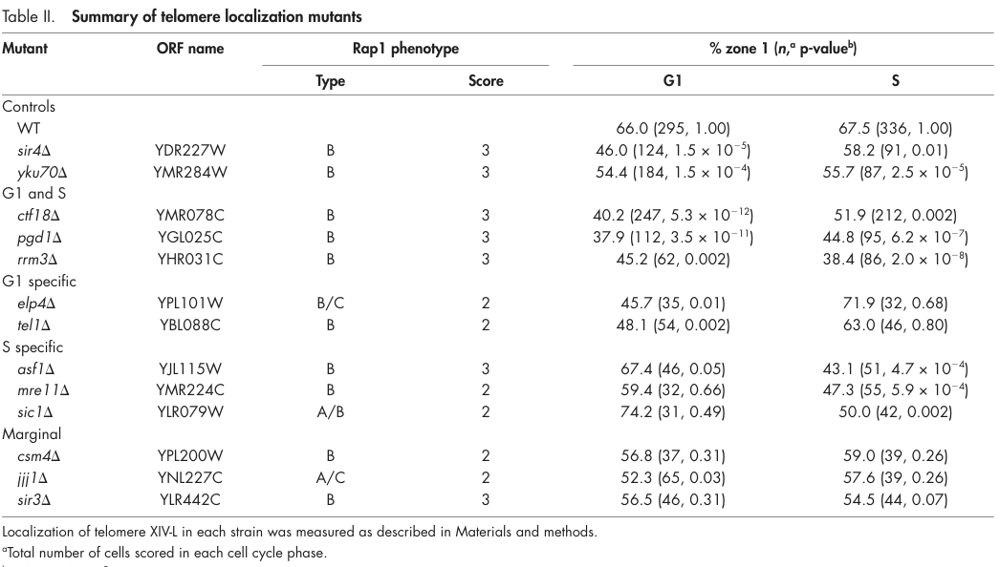

## Question

# Gene Research for Functional Annotation

## ⚠️ CRITICAL: Gene/Protein Identification Context

**BEFORE YOU BEGIN RESEARCH:** You MUST verify you are researching the CORRECT gene/protein. Gene symbols can be ambiguous, especially for less well-characterized genes from non-model organisms.

### Target Gene/Protein Identity (from UniProt):
- **UniProt Accession:** P32447
- **Protein Description:** RecName: Full=Histone chaperone ASF1; AltName: Full=Anti-silencing function protein 1; Short=yASF1;
- **Gene Information:** Name=ASF1 {ECO:0000303|PubMed:9290207}; Synonyms=CIA1 {ECO:0000303|PubMed:11856374}; OrderedLocusNames=YJL115W {ECO:0000312|SGD:S000003651}; ORFNames=J0755;
- **Organism (full):** Saccharomyces cerevisiae (strain ATCC 204508 / S288c) (Baker's yeast).
- **Protein Family:** Belongs to the ASF1 family. .
- **Key Domains:** ASF1-like. (IPR006818); ASF1-like_sf. (IPR036747); Hist_deposition_Asf1. (IPR017282); ASF1_hist_chap (PF04729)

### MANDATORY VERIFICATION STEPS:

1. **Check if the gene symbol "ASF1" matches the protein description above**
2. **Verify the organism is correct:** Saccharomyces cerevisiae (strain ATCC 204508 / S288c) (Baker's yeast).
3. **Check if protein family/domains align with what you find in literature**
4. **If you find literature for a DIFFERENT gene with the same or similar symbol, STOP**

### If Gene Symbol is Ambiguous or You Cannot Find Relevant Literature:

**DO NOT PROCEED WITH RESEARCH ON A DIFFERENT GENE.** Instead:
- State clearly: "The gene symbol 'ASF1' is ambiguous or literature is limited for this specific protein"
- Explain what you found (e.g., "Found extensive literature on a different gene with the same symbol in a different organism")
- Describe the protein based ONLY on the UniProt information provided above
- Suggest that the protein function can be inferred from domain/family information

### Research Target:

Please provide a comprehensive research report on the gene **ASF1** (gene ID: ASF1, UniProt: P32447) in yeast.

The research report should be a detailed narrative explaining the function, biological processes, and localization of the gene product. Citations should be given for all claims.

You should prioritize authoritative reviews and primary scientific literature when conducting research. You can supplement
this with annotations you find in gene/protein databases, but these can be outdated or inaccurate.

We are specifically interested in the primary function of the gene - for enzymes, what reaction is catalyzed, and what is the substrate specificity? For transporters, what is the substrate? For structural proteins or adapters, what is the broader structural role? For signaling molecules, what is the role in the pathway.

We are interested in where in or outside the cell the gene product carries out its function.

We are also interested in the signaling or biochemical pathways in which the gene functions. We are less interested in broad pleiotropic effects, except where these elucidate the precise role.

Include evidence where possible. We are interested in both experimental evidence as well as inference from structure, evolution, or bioinformatic analysis. Precise studies should be prioritized over high-throughput, where available.

## Output

Question: You are an expert researcher providing comprehensive, well-cited information.

Provide detailed information focusing on:
1. Key concepts and definitions with current understanding
2. Recent developments and latest research (prioritize 2023-2024 sources)
3. Current applications and real-world implementations
4. Expert opinions and analysis from authoritative sources
5. Relevant statistics and data from recent studies

Format as a comprehensive research report with proper citations. Include URLs and publication dates where available.
Always prioritize recent, authoritative sources and provide specific citations for all major claims.

# Gene Research for Functional Annotation

## ⚠️ CRITICAL: Gene/Protein Identification Context

**BEFORE YOU BEGIN RESEARCH:** You MUST verify you are researching the CORRECT gene/protein. Gene symbols can be ambiguous, especially for less well-characterized genes from non-model organisms.

### Target Gene/Protein Identity (from UniProt):
- **UniProt Accession:** P32447
- **Protein Description:** RecName: Full=Histone chaperone ASF1; AltName: Full=Anti-silencing function protein 1; Short=yASF1;
- **Gene Information:** Name=ASF1 {ECO:0000303|PubMed:9290207}; Synonyms=CIA1 {ECO:0000303|PubMed:11856374}; OrderedLocusNames=YJL115W {ECO:0000312|SGD:S000003651}; ORFNames=J0755;
- **Organism (full):** Saccharomyces cerevisiae (strain ATCC 204508 / S288c) (Baker's yeast).
- **Protein Family:** Belongs to the ASF1 family. .
- **Key Domains:** ASF1-like. (IPR006818); ASF1-like_sf. (IPR036747); Hist_deposition_Asf1. (IPR017282); ASF1_hist_chap (PF04729)

### MANDATORY VERIFICATION STEPS:

1. **Check if the gene symbol "ASF1" matches the protein description above**
2. **Verify the organism is correct:** Saccharomyces cerevisiae (strain ATCC 204508 / S288c) (Baker's yeast).
3. **Check if protein family/domains align with what you find in literature**
4. **If you find literature for a DIFFERENT gene with the same or similar symbol, STOP**

### If Gene Symbol is Ambiguous or You Cannot Find Relevant Literature:

**DO NOT PROCEED WITH RESEARCH ON A DIFFERENT GENE.** Instead:
- State clearly: "The gene symbol 'ASF1' is ambiguous or literature is limited for this specific protein"
- Explain what you found (e.g., "Found extensive literature on a different gene with the same symbol in a different organism")
- Describe the protein based ONLY on the UniProt information provided above
- Suggest that the protein function can be inferred from domain/family information

### Research Target:

Please provide a comprehensive research report on the gene **ASF1** (gene ID: ASF1, UniProt: P32447) in yeast.

The research report should be a detailed narrative explaining the function, biological processes, and localization of the gene product. Citations should be given for all claims.

You should prioritize authoritative reviews and primary scientific literature when conducting research. You can supplement
this with annotations you find in gene/protein databases, but these can be outdated or inaccurate.

We are specifically interested in the primary function of the gene - for enzymes, what reaction is catalyzed, and what is the substrate specificity? For transporters, what is the substrate? For structural proteins or adapters, what is the broader structural role? For signaling molecules, what is the role in the pathway.

We are interested in where in or outside the cell the gene product carries out its function.

We are also interested in the signaling or biochemical pathways in which the gene functions. We are less interested in broad pleiotropic effects, except where these elucidate the precise role.

Include evidence where possible. We are interested in both experimental evidence as well as inference from structure, evolution, or bioinformatic analysis. Precise studies should be prioritized over high-throughput, where available.

# Research Report: **ASF1 (CIA1/YJL115W; UniProt P32447)** in *Saccharomyces cerevisiae* (S288c)

## 1) Target identity verification (critical disambiguation)
The target is *Saccharomyces cerevisiae* Asf1, encoded by **ASF1** (synonym **CIA1**; locus **YJL115W**) and annotated in UniProt as **P32447**, a member of the conserved **ASF1 family** and a histone H3–H4 chaperone. The evidence used below consistently refers to yeast Asf1/Asf1p in chromatin assembly and histone-modification pathways (e.g., HIR, CAF-1, Rtt106, Rtt109), matching the UniProt-provided identity and domain/function expectations. (kim2024structureofthe pages 29-30, hiraga2008histoneh3lysine pages 4-5)

## 2) Key concepts and definitions (current understanding)
### 2.1 Histone chaperone (definition in this context)
In yeast, **Asf1 is a histone chaperone that binds histones H3–H4** and participates in nucleosome assembly in multiple DNA-templated processes, including DNA replication and transcription-associated chromatin remodeling. (hiraga2008histoneh3lysine pages 4-5)

### 2.2 Molecular function of Asf1
**Core chaperone activity:** Asf1 binds **H3–H4 dimers** and shields the surface needed to form a stable (H3–H4)2 tetramer, thereby controlling histone oligomerization state during handling/transport and handoff. Although the key mechanistic description is discussed in a conserved (yeast-comparative) context, it is explicitly connected to budding yeast functional biology (including H3K56 acetylation) in the cited work. (ding2025theorthologof pages 1-2)

**Structural/interaction basis:** The conserved N-terminal region forms a globular core with acidic patches that contact histone H3 (C-terminal region) and can also bind H4, consistent with Asf1’s role as an H3–H4 chaperone. (breuer2024histonebindingof pages 1-2)

## 3) Primary pathways and biological processes in budding yeast
### 3.1 Replication-coupled chromatin assembly via the H3K56ac pathway (Asf1 → Rtt109 → CAF-1/Rtt106)
A central experimentally grounded pathway in budding yeast is the **Asf1-dependent acetylation of histone H3 lysine 56 (H3K56ac)** by the acetyltransferase **Rtt109**, followed by transfer of acetylated H3–H4 to deposition factors.

**Mechanistic model (handoff cascade):**
- **Asf1 binds newly synthesized H3–H4** (described as occurring in the cytoplasm in one mechanistic account), promotes nuclear import/availability, and **presents H3–H4 to Rtt109** for acetylation of **H3K56**. (kattarmell2012regulationofhistone pages 10-17)
- After **H3K56 acetylation**, H3–H4 are transferred to downstream histone chaperones, including **CAF-1** (replication/repair-coupled deposition) and **Rtt106** (another H3–H4 chaperone involved in chromatin assembly). (dannah2024novelinsightsinto pages 67-72, kattarmell2012regulationofhistone pages 10-17)
- Asf1 is described as **solely required for H3K56ac in yeast cells** in the Dannah thesis excerpts, and loss of Asf1 markedly decreases Rtt109 activity and H3K56ac. (dannah2024novelinsightsinto pages 56-60)

**CAF-1 physical link:** CAF-1 is reported to accept H3–H4 via direct interaction between CAF-1 subunit **Cac2** and Asf1 in one mechanistic account. (kattarmell2012regulationofhistone pages 10-17)

### 3.2 Replication-independent H3–H4 deposition and transcriptional chromatin regulation (Asf1 with HIR/Rtt106)
A distinct major axis of Asf1 biology is **replication-independent deposition** and promoter-associated chromatin regulation.

A 2024 *Molecular Cell* study supports that **Asf1 works together with the HIR complex (and with Rtt106) to mediate replication-independent H3–H4 deposition and maintain promoter fidelity**, connecting Asf1 to transcriptional regulation through chromatin assembly/disassembly dynamics. (kim2024structureofthe pages 29-30)

### 3.3 Histone gene transcription regulation (cell-cycle coupling)
In yeast-focused statements summarized in a 2024 preprint, Asf1 is described as participating in **histone gene transcriptional activation in S phase** and **transcriptional repression outside S phase** in combination with **Hir1** (a yeast counterpart of metazoan HIRA pathway components). (mendiratta2024regulationofreplicative pages 1-6)

## 4) Subcellular localization: where Asf1 acts
### 4.1 Nuclear localization and nuclear import determinants
A 2024 thesis focused on chromatin assembly metabolism in *S. cerevisiae* reports that Asf1 contains a **functional classical nuclear localization signal (cNLS) in its highly acidic C-terminal tail**, and that removal of this motif makes Asf1 **fully cytoplasmic**, indicating the motif is **required for nuclear localization**. (dannah2024novelinsightsinto pages 166-170)

### 4.2 Localization-function coupling (link to H3K56ac)
The same thesis reports that deleting the Asf1 C-terminal cNLS **reduces H3K56 acetylation when VPS75 is present** and **abolishes H3K56 acetylation when VPS75 is absent**, connecting **nuclear localization competence** to **full H3K56ac pathway output**. (dannah2024novelinsightsinto pages 166-170)

## 5) Quantitative phenotypes and statistics from experimental studies
### 5.1 Chromosome positioning/telomere localization (quantitative)
A key quantitative phenotype connecting Asf1 to replication-associated chromatin state transmission is **telomere peripheral localization**.

In a telomere XIV-L positioning assay, WT cells show ~**66.0%** peripheral localization (zone 1) in G1 and **67.5%** in S phase. In contrast, an **asf1 mutant** shows **67.4%** in G1 (n=46; p=0.05 vs WT) but drops to **43.1%** in S phase (n=51; p=4.7×10−4 vs WT), demonstrating a statistically significant **S-phase-specific defect**. (hiraga2008histoneh3lysine pages 4-5, hiraga2008histoneh3lysine media eba6b4e4)

The same study supports that proper chromosome positioning depends on a regulated **H3K56 acetylation/deacetylation cycle**, since both non-acetylatable (**H3K56R**) and acetyl-mimic (**H3K56Q**) mutations strongly disrupt telomere localization. (hiraga2008histoneh3lysine pages 5-7)

### 5.2 Additional chromatin domain positioning phenotype
Asf1 is also required for **perinuclear localization of the ETC6 chromatin domain** during interphase, and this positioning depends on **Rtt109/H3K56 acetylation**, linking Asf1-mediated histone modification to higher-order chromosomal organization. (hiraga2008histoneh3lysine pages 7-8)

## 6) Recent developments (prioritizing 2023–2024)
### 6.1 2024 *Molecular Cell*: mechanistic/structural advance for HIR-linked deposition
Recent structural and functional work on the **HIR histone chaperone complex** provides updated mechanistic support for how Asf1 interfaces with **replication-independent H3–H4 deposition** and transcription-associated promoter fidelity pathways in yeast. (Kim et al., 2024; publication July 2024; https://doi.org/10.1016/j.molcel.2024.05.031) (kim2024structureofthe pages 29-30)

### 6.2 2024 thesis: yeast-specific nuclear localization mechanism for Asf1
A 2024 thesis provides a **localization-centric update**, identifying a **yeast-specific cNLS** within the acidic Asf1 C-terminal tail and experimentally linking it to nuclear localization and full H3K56ac capacity. (Dannah, 2024; publication Feb 2024; https://doi.org/10.32920/25233562.v1) (dannah2024novelinsightsinto pages 166-170)

### 6.3 2024 preprint: linking histone chaperones to histone RNA/histone supply logic (contextual)
A 2024 preprint in a metazoan context frames ASF1 as a factor coupling chromatin assembly to histone supply and includes yeast-context statements that Asf1 participates in **cell-cycle control of histone gene transcription** with Hir1. While this preprint is not yeast primary research, it reflects current synthesis linking Asf1 to histone dosage/homeostasis frameworks. (Mendiratta et al., 2024; https://doi.org/10.1101/2022.11.30.518476) (mendiratta2024regulationofreplicative pages 1-6)

## 7) Current applications and real-world implementations
### 7.1 Yeast Asf1 as a mechanistic model for conserved chromatin assembly pathways
Yeast Asf1 is used as a **model system to dissect histone-handling logic** (H3–H4 chaperoning, modification, and handoff) that is broadly conserved across eukaryotes. The mechanistic features—particularly **Asf1-dependent H3K56 acetylation and its impact on genome stability and chromatin state transmission**—make yeast Asf1 a practical platform for studying replication-coupled chromatin assembly and epigenetic inheritance mechanisms. (hiraga2008histoneh3lysine pages 4-5, kattarmell2012regulationofhistone pages 10-17)

### 7.2 Functional readouts used in practice
**Chromosome positioning assays** (telomere/ETC6 perinuclear localization) provide tractable, quantitative readouts of Asf1/Rtt109/H3K56ac pathway function in vivo, and can be used to probe chromatin state inheritance across the cell cycle. (hiraga2008histoneh3lysine pages 4-5, hiraga2008histoneh3lysine pages 7-8, hiraga2008histoneh3lysine media eba6b4e4)

## 8) Expert synthesis and interpretive analysis (from authoritative sources in context)
### 8.1 Conceptual integration: Asf1 as a “hub” linking histone handling to chromatin transactions
Across the evidence, Asf1 emerges as a **hub factor** that: (i) binds H3–H4 to manage oligomerization and prevent inappropriate interactions; (ii) enables **Rtt109-mediated H3K56 acetylation** on newly synthesized histones; and (iii) supports histone **handoff to deposition factors** (CAF-1/Rtt106) for chromatin assembly during replication/repair, while also supporting **HIR-mediated replication-independent deposition** important for promoter fidelity and silencing. (kim2024structureofthe pages 29-30, dannah2024novelinsightsinto pages 67-72, kattarmell2012regulationofhistone pages 10-17)

### 8.2 Localization as regulatory control
The 2024 localization work implies that yeast has evolved a **C-tail-embedded cNLS** in Asf1 that can control nuclear availability and thereby modulate pathway output (H3K56ac), suggesting that localization is not merely passive but can be a point of regulation connecting transport to chromatin assembly competence. (dannah2024novelinsightsinto pages 166-170)

## Evidence map (compact)
The following evidence map summarizes major claims, with sources, URLs, and citation IDs.

| Category | Specific claim | Evidence (short) | Key source (with year, venue) | URL | Citation ID(s) |
|---|---|---|---|---|---|
| Molecular function | Asf1 is the budding-yeast ASF1-family histone chaperone that binds H3–H4 dimers and shields the H3 tetramerization surface. | Conserved chaperone activity; binds H3–H4 and prevents inappropriate tetramer formation before handoff. | Ding et al., 2025, *Nucleic Acids Research* | https://doi.org/10.1093/nar/gkaf036 | (ding2025theorthologof pages 1-2) |
| Molecular function | The N-terminal core of ASF1 contains conserved acidic patches contacting histone H3 and also binds H4. | Review excerpt notes N-terminal 155 aa globular core; binds H3–H4 in vitro and in vivo and can bind each histone individually. | Breuer et al., 2024, *mBio* | https://doi.org/10.1128/mbio.02896-23 | (breuer2024histonebindingof pages 1-2) |
| Biological process | Asf1 functions in replication-coupled chromatin assembly and chromatin remodeling during transcription. | Hiraga excerpt states Asf1 assembles H3–H4 into nucleosomes and functions in DNA replication and transcription-coupled remodeling. | Hiraga et al., 2008, *Journal of Cell Biology* | https://doi.org/10.1083/jcb.200806065 | (hiraga2008histoneh3lysine pages 4-5) |
| Pathway/module | Canonical budding-yeast handoff model: Asf1 binds newly synthesized H3–H4, presents them to Rtt109 for H3K56 acetylation, then acetylated dimers are transferred to CAF-1 and/or Rtt106 for deposition. | Dannah states H3K56ac is solely reliant on Asf1 and Asf1 stimulates Rtt109; Kattar-Mell states Asf1-bound cytoplasmic H3–H4 dimers are imported, acetylated by Rtt109, then transferred to downstream chaperones including CAF-1. | Dannah, 2024, thesis; Kattar-Mell, 2012, thesis | https://doi.org/10.32920/25233562.v1 | (dannah2024novelinsightsinto pages 56-60, kattarmell2012regulationofhistone pages 10-17) |
| Key interactions | Asf1 functionally cooperates with the HIR complex and Rtt106 in replication-independent H3–H4 deposition and promoter fidelity. | Kim 2024 excerpt states Asf1 works with HIR and Rtt106 for replication-independent deposition and promoter fidelity; linked to heterochromatic silencing. | Kim et al., 2024, *Molecular Cell* | https://doi.org/10.1016/j.molcel.2024.05.031 | (kim2024structureofthe pages 29-30) |
| Key interactions | Asf1 interacts with HIR/Hir1 in histone gene regulation outside S phase and contributes to histone-gene activation in S phase. | Mendiratta excerpt states yeast Asf1 activates histone gene transcription in S phase and represses it outside S phase in combination with Hir1. | Mendiratta et al., 2024, *bioRxiv* | https://doi.org/10.1101/2022.11.30.518476 | (mendiratta2024regulationofreplicative pages 1-6) |
| Localization | Asf1 contains a functional classical NLS in its highly acidic C-terminal tail that is required for nuclear localization. | Dannah reports deleting the C-tail cNLS makes Asf1 fully cytoplasmic, independent of Vps75. | Dannah, 2024, thesis | https://doi.org/10.32920/25233562.v1 | (dannah2024novelinsightsinto pages 166-170) |
| Localization | The Asf1 C-terminal cNLS is required for full H3K56 acetylation and for interactions with Rad53 and Hir1. | Dannah reports reduced H3K56ac when the cNLS is deleted in VPS75+ cells and abolition of H3K56ac in vps75Δ background; also required for Rad53/Hir1 interaction. | Dannah, 2024, thesis | https://doi.org/10.32920/25233562.v1 | (dannah2024novelinsightsinto pages 166-170) |
| Pathway/module | H3K56 acetylation is a nuclear S-phase mark on newly synthesized H3, enabling efficient handoff of histones to CAF-1 and Rtt106 during DNA replication and repair. | Dannah notes nuclear H3K56ac during S phase and role in transfer to CAF-1/Rtt106; Hst3/Hst4 remove the mark in G2/M. | Dannah, 2024, thesis | https://doi.org/10.32920/25233562.v1 | (dannah2024novelinsightsinto pages 67-72) |
| Phenotypes & quantitative data | asf1Δ causes an S-phase-specific telomere localization defect. | Table/assay values: WT telomere XIV-L peripheral localization (zone 1) 66.0% in G1 and 67.5% in S; asf1 mutant 67.4% in G1 (n=46, p=0.05 vs WT) and 43.1% in S (n=51, p=4.7×10^-4 vs WT). | Hiraga et al., 2008, *Journal of Cell Biology* | https://doi.org/10.1083/jcb.200806065 | (hiraga2008histoneh3lysine pages 4-5, hiraga2008histoneh3lysine media eba6b4e4) |
| Phenotypes & quantitative data | Regulated H3K56 acetylation/deacetylation is required for chromosome positioning. | rtt109Δ shows severe telomere localization defects; both H3K56R and H3K56Q nearly abolish proper telomere localization in G1 and S. | Hiraga et al., 2008, *Journal of Cell Biology* | https://doi.org/10.1083/jcb.200806065 | (hiraga2008histoneh3lysine pages 5-7) |
| Biological process | Asf1 is required for perinuclear localization of the ETC6 chromatin domain across interphase. | asf1 deletion randomizes ETC6 positioning; rtt109 mutants also lose peripheral positioning, linking Asf1-mediated H3K56ac to higher-order chromosome organization. | Hiraga et al., 2008, *Journal of Cell Biology* | https://doi.org/10.1083/jcb.200806065 | (hiraga2008histoneh3lysine pages 7-8) |
| Key interactions | Asf1 is required for efficient Rtt109 activity and H3K56ac; Vps75 supports Rtt109 but cannot fully replace Asf1. | Dannah: loss of Asf1 markedly diminishes Rtt109 activity/H3K56ac; Hiraga: asf1 vps75 double mutant phenocopies strong localization defects. | Dannah, 2024, thesis; Hiraga et al., 2008, *J Cell Biol* | https://doi.org/10.32920/25233562.v1; https://doi.org/10.1083/jcb.200806065 | (dannah2024novelinsightsinto pages 56-60, hiraga2008histoneh3lysine pages 4-5) |
| Recent (2023-2024) developments | New structural work strengthens the model that Asf1 engages the HIR complex in replication-independent chromatin assembly. | Kim 2024 provides structural/biochemical evidence for Asf1 binding to HIR-related machinery and supports replication-independent H3–H4 deposition and promoter fidelity roles. | Kim et al., 2024, *Molecular Cell* | https://doi.org/10.1016/j.molcel.2024.05.031 | (kim2024structureofthe pages 29-30, kim2024structureofthe pages 28-29) |
| Recent (2023-2024) developments | New localization work identifies a yeast-specific Asf1 cNLS in the acidic tail and links localization directly to H3K56ac competence. | Dannah 2024 reports C-tail cNLS, cytoplasmic mislocalization upon deletion, and H3K56ac defects tied to the motif. | Dannah, 2024, thesis | https://doi.org/10.32920/25233562.v1 | (dannah2024novelinsightsinto pages 166-170) |
| Recent (2023-2024) developments | Current cross-species work reiterates that budding-yeast Asf1 promotes H3K56ac yet is dispensable for viability/growth in S. cerevisiae. | Ding 2025 contrasts S. cerevisiae with fission yeast, noting Asf1 is dispensable for growth in budding yeast while retaining conserved chaperone/H3K56ac functions. | Ding et al., 2025, *Nucleic Acids Research* | https://doi.org/10.1093/nar/gkaf036 | (ding2025theorthologof pages 1-2) |

*Table: This table summarizes experimentally supported functional annotation for Saccharomyces cerevisiae Asf1 (UniProt P32447), emphasizing molecular function, pathways, localization, interactions, phenotypes, and recent 2023–2024 developments. It is useful as a compact evidence map for narrative gene-function reporting.*

## Visual evidence (figure/table excerpt)
Quantitative telomere localization differences between WT and asf1 mutants (G1 vs S phase), supporting an S-phase-specific chromosome positioning defect linked to Asf1/H3K56ac pathway function, are shown in the cropped figure/table regions from Hiraga et al. 2008. (hiraga2008histoneh3lysine media eba6b4e4, hiraga2008histoneh3lysine media bcd2be39)

## Limitations of the present evidence set
- Some mechanistic statements about cytoplasmic binding/import and CAF-1 interaction derive from theses rather than peer-reviewed journal articles in the provided corpus; they are included with clear attribution and should ideally be cross-validated with additional primary papers beyond the current retrieval set. (dannah2024novelinsightsinto pages 166-170, kattarmell2012regulationofhistone pages 10-17)
- The retrieved 2023–2024 peer-reviewed yeast literature in this run is strong for HIR-complex/replication-independent deposition (Kim 2024) and for localization (Dannah 2024 thesis), but more 2023–2024 yeast primary studies specifically centered on Asf1 (e.g., direct biochemical reconstitution of yeast Asf1–Rtt109–Vps75–CAF-1 handoff) were not captured in the current tool retrieval.

References

1. (kim2024structureofthe pages 29-30): Hee Jong Kim, Mary R. Szurgot, Trevor van Eeuwen, M. Daniel Ricketts, Pratik Basnet, Athena L. Zhang, Austin Vogt, Samah Sharmin, Craig D. Kaplan, Benjamin A. Garcia, Ronen Marmorstein, and Kenji Murakami. Structure of the hir histone chaperone complex. Molecular Cell, 84:2601-2617.e12, Jul 2024. URL: https://doi.org/10.1016/j.molcel.2024.05.031, doi:10.1016/j.molcel.2024.05.031. This article has 14 citations and is from a highest quality peer-reviewed journal.

2. (hiraga2008histoneh3lysine pages 4-5): Shin-ichiro Hiraga, Sotirios Botsios, and Anne D. Donaldson. Histone h3 lysine 56 acetylation by rtt109 is crucial for chromosome positioning. The Journal of Cell Biology, 183:641-651, Nov 2008. URL: https://doi.org/10.1083/jcb.200806065, doi:10.1083/jcb.200806065. This article has 48 citations.

3. (ding2025theorthologof pages 1-2): Yan Ding, Jun Li, He-Li Jiang, Fang Suo, Guang-Can Shao, Xiao-Ran Zhang, Meng-Qiu Dong, Chao-Pei Liu, Rui-Ming Xu, and Li-Lin Du. The ortholog of human dnajc9 promotes histone h3–h4 degradation and is counteracted by asf1 in fission yeast. Nucleic Acids Research, Jan 2025. URL: https://doi.org/10.1093/nar/gkaf036, doi:10.1093/nar/gkaf036. This article has 2 citations and is from a highest quality peer-reviewed journal.

4. (breuer2024histonebindingof pages 1-2): Jan Breuer, Tobias Busche, Jörn Kalinowski, and Minou Nowrousian. Histone binding of asf1 is required for fruiting body development but not for genome stability in the filamentous fungus <i>sordaria macrospora</i>. mBio, Jan 2024. URL: https://doi.org/10.1128/mbio.02896-23, doi:10.1128/mbio.02896-23. This article has 6 citations and is from a domain leading peer-reviewed journal.

5. (kattarmell2012regulationofhistone pages 10-17): SJ Kattar-Mell. Regulation of histone h3k56 acetylation by the histone h2a-h2b acidic patch. Unknown journal, 2012.

6. (dannah2024novelinsightsinto pages 67-72): Nora Saud Dannah. Novel insights into nuclear localization of proteins crucial for chromatin assembly metabolism in saccharomyces cerevisiae. Unknown journal, Feb 2024. URL: https://doi.org/10.32920/25233562.v1, doi:10.32920/25233562.v1.

7. (dannah2024novelinsightsinto pages 56-60): Nora Saud Dannah. Novel insights into nuclear localization of proteins crucial for chromatin assembly metabolism in saccharomyces cerevisiae. Unknown journal, Feb 2024. URL: https://doi.org/10.32920/25233562.v1, doi:10.32920/25233562.v1.

8. (mendiratta2024regulationofreplicative pages 1-6): Shweta Mendiratta, Dominique Ray-Gallet, Alberto Gatto, Sébastien Lemaire, Maciej A. Kerlin, Antoine Coulon, and Geneviève Almouzni. Regulation of replicative histone rna metabolism by the histone chaperone asf1. bioRxiv, Nov 2024. URL: https://doi.org/10.1101/2022.11.30.518476, doi:10.1101/2022.11.30.518476. This article has 10 citations.

9. (dannah2024novelinsightsinto pages 166-170): Nora Saud Dannah. Novel insights into nuclear localization of proteins crucial for chromatin assembly metabolism in saccharomyces cerevisiae. Unknown journal, Feb 2024. URL: https://doi.org/10.32920/25233562.v1, doi:10.32920/25233562.v1.

10. (hiraga2008histoneh3lysine media eba6b4e4): Shin-ichiro Hiraga, Sotirios Botsios, and Anne D. Donaldson. Histone h3 lysine 56 acetylation by rtt109 is crucial for chromosome positioning. The Journal of Cell Biology, 183:641-651, Nov 2008. URL: https://doi.org/10.1083/jcb.200806065, doi:10.1083/jcb.200806065. This article has 48 citations.

11. (hiraga2008histoneh3lysine pages 5-7): Shin-ichiro Hiraga, Sotirios Botsios, and Anne D. Donaldson. Histone h3 lysine 56 acetylation by rtt109 is crucial for chromosome positioning. The Journal of Cell Biology, 183:641-651, Nov 2008. URL: https://doi.org/10.1083/jcb.200806065, doi:10.1083/jcb.200806065. This article has 48 citations.

12. (hiraga2008histoneh3lysine pages 7-8): Shin-ichiro Hiraga, Sotirios Botsios, and Anne D. Donaldson. Histone h3 lysine 56 acetylation by rtt109 is crucial for chromosome positioning. The Journal of Cell Biology, 183:641-651, Nov 2008. URL: https://doi.org/10.1083/jcb.200806065, doi:10.1083/jcb.200806065. This article has 48 citations.

13. (kim2024structureofthe pages 28-29): Hee Jong Kim, Mary R. Szurgot, Trevor van Eeuwen, M. Daniel Ricketts, Pratik Basnet, Athena L. Zhang, Austin Vogt, Samah Sharmin, Craig D. Kaplan, Benjamin A. Garcia, Ronen Marmorstein, and Kenji Murakami. Structure of the hir histone chaperone complex. Molecular Cell, 84:2601-2617.e12, Jul 2024. URL: https://doi.org/10.1016/j.molcel.2024.05.031, doi:10.1016/j.molcel.2024.05.031. This article has 14 citations and is from a highest quality peer-reviewed journal.

14. (hiraga2008histoneh3lysine media bcd2be39): Shin-ichiro Hiraga, Sotirios Botsios, and Anne D. Donaldson. Histone h3 lysine 56 acetylation by rtt109 is crucial for chromosome positioning. The Journal of Cell Biology, 183:641-651, Nov 2008. URL: https://doi.org/10.1083/jcb.200806065, doi:10.1083/jcb.200806065. This article has 48 citations.

## Artifacts

- [Edison artifact artifact-00](ASF1-deep-research-falcon_artifacts/artifact-00.md)

## Citations

1. ding2025theorthologof pages 1-2
2. breuer2024histonebindingof pages 1-2
3. kattarmell2012regulationofhistone pages 10-17
4. dannah2024novelinsightsinto pages 56-60
5. kim2024structureofthe pages 29-30
6. mendiratta2024regulationofreplicative pages 1-6
7. dannah2024novelinsightsinto pages 166-170
8. dannah2024novelinsightsinto pages 67-72
9. kim2024structureofthe pages 28-29
10. https://doi.org/10.1016/j.molcel.2024.05.031
11. https://doi.org/10.32920/25233562.v1
12. https://doi.org/10.1101/2022.11.30.518476
13. https://doi.org/10.1093/nar/gkaf036
14. https://doi.org/10.1128/mbio.02896-23
15. https://doi.org/10.1083/jcb.200806065
16. https://doi.org/10.32920/25233562.v1;
17. https://doi.org/10.1016/j.molcel.2024.05.031,
18. https://doi.org/10.1083/jcb.200806065,
19. https://doi.org/10.1093/nar/gkaf036,
20. https://doi.org/10.1128/mbio.02896-23,
21. https://doi.org/10.32920/25233562.v1,
22. https://doi.org/10.1101/2022.11.30.518476,