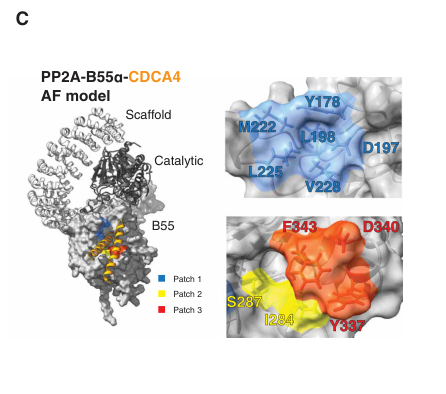

## Question

# Gene Research for Functional Annotation

## ⚠️ CRITICAL: Gene/Protein Identification Context

**BEFORE YOU BEGIN RESEARCH:** You MUST verify you are researching the CORRECT gene/protein. Gene symbols can be ambiguous, especially for less well-characterized genes from non-model organisms.

### Target Gene/Protein Identity (from UniProt):
- **UniProt Accession:** Q00362
- **Protein Description:** RecName: Full=Protein phosphatase PP2A regulatory subunit B; AltName: Full=Cell division control protein 55; AltName: Full=PR55;
- **Gene Information:** Name=CDC55; OrderedLocusNames=YGL190C; ORFNames=G1345;
- **Organism (full):** Saccharomyces cerevisiae (strain ATCC 204508 / S288c) (Baker's yeast).
- **Protein Family:** Belongs to the phosphatase 2A regulatory subunit B family.
- **Key Domains:** PP2A_PR55. (IPR000009); PP2A_PR55_CS. (IPR018067); WD40/YVTN_repeat-like_dom_sf. (IPR015943); WD40_repeat_dom_sf. (IPR036322); WD40_rpt. (IPR001680)

### MANDATORY VERIFICATION STEPS:

1. **Check if the gene symbol "CDC55" matches the protein description above**
2. **Verify the organism is correct:** Saccharomyces cerevisiae (strain ATCC 204508 / S288c) (Baker's yeast).
3. **Check if protein family/domains align with what you find in literature**
4. **If you find literature for a DIFFERENT gene with the same or similar symbol, STOP**

### If Gene Symbol is Ambiguous or You Cannot Find Relevant Literature:

**DO NOT PROCEED WITH RESEARCH ON A DIFFERENT GENE.** Instead:
- State clearly: "The gene symbol 'CDC55' is ambiguous or literature is limited for this specific protein"
- Explain what you found (e.g., "Found extensive literature on a different gene with the same symbol in a different organism")
- Describe the protein based ONLY on the UniProt information provided above
- Suggest that the protein function can be inferred from domain/family information

### Research Target:

Please provide a comprehensive research report on the gene **CDC55** (gene ID: CDC55, UniProt: Q00362) in yeast.

The research report should be a detailed narrative explaining the function, biological processes, and localization of the gene product. Citations should be given for all claims.

You should prioritize authoritative reviews and primary scientific literature when conducting research. You can supplement
this with annotations you find in gene/protein databases, but these can be outdated or inaccurate.

We are specifically interested in the primary function of the gene - for enzymes, what reaction is catalyzed, and what is the substrate specificity? For transporters, what is the substrate? For structural proteins or adapters, what is the broader structural role? For signaling molecules, what is the role in the pathway.

We are interested in where in or outside the cell the gene product carries out its function.

We are also interested in the signaling or biochemical pathways in which the gene functions. We are less interested in broad pleiotropic effects, except where these elucidate the precise role.

Include evidence where possible. We are interested in both experimental evidence as well as inference from structure, evolution, or bioinformatic analysis. Precise studies should be prioritized over high-throughput, where available.

## Output

Question: You are an expert researcher providing comprehensive, well-cited information.

Provide detailed information focusing on:
1. Key concepts and definitions with current understanding
2. Recent developments and latest research (prioritize 2023-2024 sources)
3. Current applications and real-world implementations
4. Expert opinions and analysis from authoritative sources
5. Relevant statistics and data from recent studies

Format as a comprehensive research report with proper citations. Include URLs and publication dates where available.
Always prioritize recent, authoritative sources and provide specific citations for all major claims.

# Gene Research for Functional Annotation

## ⚠️ CRITICAL: Gene/Protein Identification Context

**BEFORE YOU BEGIN RESEARCH:** You MUST verify you are researching the CORRECT gene/protein. Gene symbols can be ambiguous, especially for less well-characterized genes from non-model organisms.

### Target Gene/Protein Identity (from UniProt):
- **UniProt Accession:** Q00362
- **Protein Description:** RecName: Full=Protein phosphatase PP2A regulatory subunit B; AltName: Full=Cell division control protein 55; AltName: Full=PR55;
- **Gene Information:** Name=CDC55; OrderedLocusNames=YGL190C; ORFNames=G1345;
- **Organism (full):** Saccharomyces cerevisiae (strain ATCC 204508 / S288c) (Baker's yeast).
- **Protein Family:** Belongs to the phosphatase 2A regulatory subunit B family.
- **Key Domains:** PP2A_PR55. (IPR000009); PP2A_PR55_CS. (IPR018067); WD40/YVTN_repeat-like_dom_sf. (IPR015943); WD40_repeat_dom_sf. (IPR036322); WD40_rpt. (IPR001680)

### MANDATORY VERIFICATION STEPS:

1. **Check if the gene symbol "CDC55" matches the protein description above**
2. **Verify the organism is correct:** Saccharomyces cerevisiae (strain ATCC 204508 / S288c) (Baker's yeast).
3. **Check if protein family/domains align with what you find in literature**
4. **If you find literature for a DIFFERENT gene with the same or similar symbol, STOP**

### If Gene Symbol is Ambiguous or You Cannot Find Relevant Literature:

**DO NOT PROCEED WITH RESEARCH ON A DIFFERENT GENE.** Instead:
- State clearly: "The gene symbol 'CDC55' is ambiguous or literature is limited for this specific protein"
- Explain what you found (e.g., "Found extensive literature on a different gene with the same symbol in a different organism")
- Describe the protein based ONLY on the UniProt information provided above
- Suggest that the protein function can be inferred from domain/family information

### Research Target:

Please provide a comprehensive research report on the gene **CDC55** (gene ID: CDC55, UniProt: Q00362) in yeast.

The research report should be a detailed narrative explaining the function, biological processes, and localization of the gene product. Citations should be given for all claims.

You should prioritize authoritative reviews and primary scientific literature when conducting research. You can supplement
this with annotations you find in gene/protein databases, but these can be outdated or inaccurate.

We are specifically interested in the primary function of the gene - for enzymes, what reaction is catalyzed, and what is the substrate specificity? For transporters, what is the substrate? For structural proteins or adapters, what is the broader structural role? For signaling molecules, what is the role in the pathway.

We are interested in where in or outside the cell the gene product carries out its function.

We are also interested in the signaling or biochemical pathways in which the gene functions. We are less interested in broad pleiotropic effects, except where these elucidate the precise role.

Include evidence where possible. We are interested in both experimental evidence as well as inference from structure, evolution, or bioinformatic analysis. Precise studies should be prioritized over high-throughput, where available.

# Functional annotation report: *Saccharomyces cerevisiae* CDC55 (UniProt Q00362)

## Executive conclusion

The requested protein identity is verified: **CDC55/YGL190C (UniProt Q00362) from *Saccharomyces cerevisiae* S288c** is the conserved **B/PR55/B55 regulatory subunit of protein phosphatase 2A (PP2A)**, also called cell-division-control protein 55 or PR55. It is not a catalytic phosphatase and should not be confused with similarly named proteins from other fungi or metazoans. Its principal function is to assemble with the PP2A scaffold **Tpd3** and catalytic **Pph21 or Pph22** subunit, thereby directing serine/threonine dephosphorylation toward selected substrates at the appropriate cellular location and cell-cycle stage. This assignment agrees with the supplied PP2A_PR55 and WD40-repeat domain annotations and with yeast-specific biochemical literature. (baro2018silacbasedphosphoproteomicsreveals pages 2-3, gentry2002localizationofsaccharomyces pages 1-2)

The best-supported biological interpretation is that Cdc55 is a **spatiotemporal substrate receptor for PP2A**. Its major functions are to oppose Cdk1- and Polo/Cdc5-driven phosphorylation, control mitotic entry and exit, restrain Cdc14 release until anaphase, regulate the mitotic-exit network, coordinate cytokinesis and the actin cytoskeleton, and prepare Cdc6 for replication-origin licensing. It also serves as the PP2A effector in the nutrient-responsive TORC1–Rim15/Greatwall–Igo/endosulfine pathway.

## 1. Identity, family, and molecular architecture

In budding yeast, PP2A holoenzymes consist of the A/scaffold subunit Tpd3, one catalytic subunit—Pph21 or Pph22—and a regulatory subunit, principally Cdc55/B55 or Rts1/B56-like. Cdc55 therefore does **not** itself hydrolyze phosphomonoesters; Pph21/Pph22 supply the metal-dependent catalytic activity, while Cdc55 governs substrate engagement and localization. Quantitative analysis found at least tenfold more Rts1 than Cdc55 and identified Tpd3 as limiting for binding catalytic and regulatory subunits, indicating that Cdc55 represents a specialized PP2A population rather than the bulk regulatory pool. (baro2018silacbasedphosphoproteomicsreveals pages 2-3, gentry2002localizationofsaccharomyces pages 1-2)

The supplied InterPro annotations—PP2A_PR55, PP2A_PR55 conserved site, and WD40-repeat superfamily—fit the accepted B55 architecture. B55-family proteins form a WD40 β-propeller whose exposed surface provides docking sites for substrates and regulators. Yeast Cdc55 shares substantial conservation with mammalian B55α; older comparative analysis reported approximately **53% amino-acid identity and 67% similarity**, while genetic evidence shows that Cdc55 and the alternative yeast regulatory subunit Rts1 are functionally noninterchangeable. (roopchand2005humanadenoviruse4orf4 pages 39-44)

The following table summarizes the evidence and separates direct targets from pathway-level or phosphoproteomic candidates.

| Topic/process | Mechanistic role | Named targets/partners | Strongest evidence and quantitative detail | Confidence/limitations |
|---|---|---|---|---|
| PP2A holoenzyme identity | **Cdc55 is a noncatalytic B/PR55 regulatory subunit** that helps determine PP2A localization and substrate selection. It forms heterotrimers with scaffold **Tpd3** and catalytic **Pph21 or Pph22**. | Tpd3; Pph21; Pph22; alternative regulatory subunit Rts1 | Biochemical and genetic studies define the budding-yeast holoenzyme as Tpd3–Pph21/22–Cdc55. Quantitative analysis found at least **10-fold more Rts1 than Cdc55** and identified Tpd3 as limiting for regulatory- and catalytic-subunit binding (baro2018silacbasedphosphoproteomicsreveals pages 2-3, gentry2002localizationofsaccharomyces pages 1-2). | **High.** Identity and complex membership are well established. Cdc55 does **not** catalyze phosphate hydrolysis; catalysis resides in Pph21/Pph22. |
| Subcellular localization | Directs PP2A activity to spatially restricted substrates in the nucleus, cytoplasm, bud cortex, and bud neck. Zds1/2 favor cytoplasmic/cortical retention and reduce nuclear accumulation. | Zds1; Zds2; Tpd3; Pph21/22 | Functional endogenous GFP fusions localized Cdc55 to the **nucleus, cytoplasm, bud cortex, and late-mitotic bud neck**. Loss of ZDS1/ZDS2 abolishes cortical/bud-neck enrichment and increases nuclear Cdc55, especially in G2/mitosis (rossio2011spatialregulationof pages 2-4, rossio2011spatialregulationof pages 1-2, rossio2014comparativegeneticanalysis pages 8-9). | **High** for localization and Zds1/2 dependence. Cdc55 can retain its localization without an A or C subunit, so Cdc55 localization does not always demonstrate assembled holoenzyme localization (gentry2002localizationofsaccharomyces pages 1-2). |
| Mitotic entry and morphogenesis checkpoint | PP2A–Cdc55 participates in the circuit controlling inhibitory **Cdk1 Tyr19** phosphorylation. Through the Zds1/2–Pkc1 network, it regulates the **Swe1 kinase/Mih1 phosphatase** axis and mitotic entry. | Swe1; Mih1; Cdk1/Cdc28; Zds1; Zds2; Pkc1 | In cdc55-deficient cells, the Cdk1 peptide containing **phospho-Tyr19** was hyperphosphorylated, with phosphosite-localization probability **>89%**. Genetic and signaling evidence places PP2A–Cdc55 upstream of Swe1/Mih1 (baro2018silacbasedphosphoproteomicsreveals pages 2-3, baro2018silacbasedphosphoproteomicsreveals pages 6-7, baro2018silacbasedphosphoproteomicsreveals pages 3-6). | **Moderate–high** for pathway control; **low** for Cdk1 as a direct substrate. Cdk1-Y19 hyperphosphorylation is probably indirect through Swe1/Mih1 dysregulation. |
| Mitotic exit: FEAR/Cdc14 release | Before anaphase, PP2A–Cdc55 opposes Cdk1-dependent phosphorylation of **Net1**, retaining Cdc14 in the nucleolus. Separase and Zds1/2 downregulate or spatially restrict PP2A–Cdc55 at anaphase onset, permitting Net1 phosphorylation and initial Cdc14 release. | Net1/Cfi1; Cdc14; separase/Esp1; Zds1; Zds2 | Localization manipulation showed that nuclear Cdc55 inhibits mitotic exit. Genetic and biochemical studies support Net1 as a physiological PP2A–Cdc55 target and link separase/Zds1/2-dependent downregulation to Cdc14 activation (baro2018silacbasedphosphoproteomicsreveals pages 1-2, rossio2011spatialregulationof pages 10-10, rossio2011spatialregulationof pages 1-2, rossio2011spatialregulationof pages 8-9). | **High** for the pathway and Net1 regulation. Exact direct-recognition determinants and the full set of relevant Net1 sites remain incompletely resolved. |
| Mitotic exit network (MEN) | PP2A–Cdc55 coordinates MEN timing by regulating phosphorylation of **Bfa1** and **Mob1**. Its downregulation permits Cdc5-dependent Bfa1 inactivation, while Cdk1-dependent inhibition at Dbf2–Mob1 prevents premature full MEN activation. | Bfa1; Bub2; Mob1; Dbf2; Cdc5; Cdc15 | Targeted genetic and phosphorylation experiments support Bfa1 and Mob1 regulation; Mob1–Cdc55 docking models implicate Cdc55 residues **84–90** (baro2018silacbasedphosphoproteomicsreveals pages 1-2). | **Moderate–high.** Bfa1 and Mob1 are supported physiological targets, but some evidence demonstrates pathway-level regulation rather than direct catalysis with purified holoenzyme. |
| DNA-replication origin licensing | During mitosis, PP2A–Cdc55 removes N-terminal Cdc6 phosphorylation, weakening the inhibitory **Cdc6–Clb2–Cdk1–Cks1** complex. Subsequent Cdc14 action and Sic1 accumulation permit Cdc6 stabilization and Mcm2–7 loading. | Cdc6; Clb2; Cdk1/Cdc28; Cks1; Cdc14; Sic1; Mcm2–7 | Yeast experiments identified **Cdc6 T7 and T23** as PP2A–Cdc55-regulated sites; loss of CDC55 increased the Clb2:Cdc6 binding ratio. Cdc14 separately removes the C-terminal **T368–S372 phosphodegron**, while Sic1 releases Clb2–Cdk1–Cks1 (philip2022cdc6issequentially pages 11-13, philip2022cdc6issequentially pages 13-15, philip2022cdc6issequentially pages 1-2, philip2022cdc6issequentially pages 5-6). | **High** for sequential regulation and the Cdc6 sites. Complete substrate-docking determinants for yeast Cdc55 were not defined. |
| TORC1–Rim15–Igo nutrient signaling, quiescence, and gametogenesis | Nutrient limitation reduces TORC1/PKA restraint on **Rim15/Greatwall**. Rim15-phosphorylated **Igo1/Igo2 endosulfines** bind and inhibit PP2A–Cdc55, shifting phosphorylation programs toward START control, quiescence, and gametogenesis. | TORC1; Rim15; Igo1; Igo2; Whi5; Sic1 | Genetic, interaction, localization, and in-vitro inhibition studies support the switch. Igo1 is nuclear; igo1Δ igo2Δ increases nuclear Cdc55. Rim15/Igo loss affects Cdc55 localization partly through the Swe1–Cdk1 feedback system (rossio2014comparativegeneticanalysis pages 1-3, juanes2013buddingyeastgreatwall pages 6-8, rossio2014comparativegeneticanalysis pages 8-9). | **High** for inhibition by phosphorylated endosulfines and nutrient-response functions. Individual downstream substrates are less comprehensively established; Whi5 and Sic1 evidence includes pathway-level effects. |
| Global Cdc55-dependent phosphoproteome | Cdc55 broadly opposes proline-directed and other phosphorylation networks, with enrichment in actin organization, polarity, budding, cytokinesis, and mitosis. | Candidate targets include Slk19, Lte1, and Zeo1; implicated kinase networks include Cdk1, Cdc5, and Pkc1 | A 2018 SILAC study detected **1,260 hyperphosphorylated phosphopeptides** in Cdc55-deficient mitotic cells; **62 peptides** were statistically significant and mapped to **55 proteins**. Slk19 and Lte1 showed Cdc55-dependent phosphorylation changes; Zeo1 physically interacted with Cdc55 (baro2018silacbasedphosphoproteomicsreveals pages 1-2, baro2018silacbasedphosphoproteomicsreveals pages 6-7, baro2018silacbasedphosphoproteomicsreveals pages 3-6). | **Moderate.** These are Cdc55-regulated phosphoproteins, not automatically direct substrates. Slk19/Lte1 have follow-up phosphorylation evidence; Zeo1 remains a candidate without purified-holoenzyme dephosphorylation proof. |
| Alcoholic-fermentation application | Elevated PP2A–Cdc55 activity downstream of defective Rim15 contributes to high initial fermentation performance in sake yeast, connecting nutrient signaling with fermentative output. | Rim15; TORC1; Cdc55; sake strain Kyokai no. 7 and relatives | Deleting **CDC55 abolished** enhanced fermentation in Rim15-deficient laboratory and sake strains. K7 carries a homozygous RIM15 loss-of-function allele, while some related strains carry heterozygous CDC55 loss-of-function variants (watanabe2019nutrientsignalingvia pages 1-2). | **Moderate–high** for pathway dependence in tested strains. The result supports rational beverage or bioethanol strain breeding, but CDC55 manipulation may trade rapid fermentation against stress survival and cell-cycle robustness. |

*Table: Compact evidence-tier summary of the molecular functions, localization, pathways, substrates, quantitative phosphoproteomics, and fermentation relevance of S. cerevisiae CDC55/Q00362. Directly supported targets are distinguished from pathway-level effects and candidate substrates.*

## 2. Primary biochemical function and substrate specificity

### Reaction performed by the holoenzyme

The relevant reaction is:

**phosphoprotein–Ser/Thr + H₂O → dephosphorylated protein + inorganic phosphate.**

Cdc55 does not catalyze this reaction independently. It positions phosphoprotein substrates near the Pph21/Pph22 active site and restricts the reaction spatially and temporally. Physiologically, PP2A–Cdc55 frequently opposes Cdk1 phosphorylation and shows a functional preference for phosphothreonine-containing sites, helping establish ordered cell-cycle dephosphorylation. For yeast Cdc6, experimentally supported Cdc55-regulated residues include **Thr7 and Thr23**. (philip2022cdc6issequentially pages 11-13, philip2022cdc6issequentially pages 13-15)

### Recognition principles

A yeast Cdc55–Mob1 docking model implicated a protruding Cdc55 loop spanning residues **84–90** in substrate contact, although modeling is weaker evidence than a structure of a purified yeast holoenzyme–substrate complex. (baro2018silacbasedphosphoproteomicsreveals pages 1-2)

A major 2024 advance established that B55 interactors can dock through α-helices that contact three conserved hydrophobic/electrostatic surface patches on B55. High-resolution mutational scanning and AlphaFold modeling identified patch-1 residues Y178, D197, M222, L225, and V228; patch 2 includes I284 and S287; and patch 3 includes Y337, D340, and F343 in B55α. The study also modeled the *S. cerevisiae* Zds1 helix engaging this conserved pocket through residues including L875, V879, R873, and K867. (kruse2024substraterecognitionprinciples pages 3-4, kruse2024substraterecognitionprinciples pages 1-2, kruse2024substraterecognitionprinciples media 4d8a3761, kruse2024substraterecognitionprinciples media d99b9d95)

This 2024 result is important but must be interpreted carefully: most biochemical validation concerned metazoan B55α and human interactors. The yeast Zds1 result is principally a conservation-based structural model, not a demonstration that every Cdc55 substrate uses the same helix. The work nevertheless supplies a testable framework for Cdc55 docking-site mutagenesis and enabled design of a potent competitive B55-interaction inhibitor. Kruse et al., published **2 October 2024**, *Science Advances* 10:eAdp5491, https://doi.org/10.1126/sciadv.adp5491. (kruse2024substraterecognitionprinciples pages 3-4, kruse2024substraterecognitionprinciples pages 1-2)

## 3. Cellular localization

Functional endogenous GFP fusions show Cdc55 in multiple compartments: the **nucleus and cytoplasm throughout the cell cycle**, the **bud cortex** in small- and medium-budded cells, and the **bud neck** in late mitosis; signal has also been observed at the vacuolar membrane under ZDS1 overexpression. Cdc55 is relatively more nuclear in G1 and G2 than during mitosis. Earlier quantitative imaging also found overlapping PP2A-subunit accumulation at the bud tip, kinetochore, bud neck, and nucleus. (rossio2011spatialregulationof pages 2-4, gentry2002localizationofsaccharomyces pages 1-2)

Localization is mechanistically important rather than incidental. Zds1 and Zds2 are predominantly cortical/cytoplasmic and bud-neck proteins. Deleting both abolishes normal cortical and bud-neck Cdc55 localization and causes excess nuclear Cdc55, especially during G2 and mitosis; ZDS1 overexpression has the opposite effect. Engineered nuclear-localization and nuclear-export constructs demonstrated that **cytoplasmic Cdc55 favors mitotic entry, whereas nuclear Cdc55 restrains mitotic exit**. (rossio2011spatialregulationof pages 2-4, rossio2011spatialregulationof pages 1-2, rossio2014comparativegeneticanalysis pages 8-9)

Cdc55 can attain much of its localization without Tpd3 or a catalytic subunit, whereas normal Rts1 and Tpd3 localization depends more strongly on holoenzyme formation. Thus, fluorescence from Cdc55 alone identifies the regulatory protein’s location but does not invariably prove that catalytically assembled PP2A–Cdc55 is present there. (gentry2002localizationofsaccharomyces pages 1-2)

## 4. Core pathways and substrates

### 4.1 Mitotic entry and the morphogenesis checkpoint

PP2A–Cdc55 participates in the Zds1/2–Pkc1–Swe1–Mih1 circuit controlling inhibitory phosphorylation of Cdk1/Cdc28. Cdc55 deficiency produces hyperphosphorylation of **Cdk1 Tyr19**, the inhibitory site controlled by Swe1 kinase and Mih1 phosphatase; the phosphoproteomic assignment had greater than **89% localization probability**. This does not establish Cdk1 as a direct PP2A–Cdc55 substrate. The stronger interpretation is that Cdc55 controls the upstream Swe1/Mih1 network and therefore the timing of mitotic Cdk1 activation. (baro2018silacbasedphosphoproteomicsreveals pages 2-3, baro2018silacbasedphosphoproteomicsreveals pages 6-7, baro2018silacbasedphosphoproteomicsreveals pages 3-6)

Spatial exclusion of Cdc55 from the nucleus by Zds1/Zds2 promotes full nuclear Cdk1 activation and mitotic entry. Loss of ZDS1/ZDS2 causes severe entry and exit defects that can be suppressed by deleting CDC55 or forcing Cdc55 out of the nucleus, directly linking localization to function. (rossio2014comparativegeneticanalysis pages 1-3, rossio2011spatialregulationof pages 2-4)

### 4.2 Anaphase onset, Net1, and Cdc14 release

Before anaphase, nuclear/nucleolar PP2A–Cdc55 opposes Cdk1-dependent phosphorylation of **Net1/Cfi1**, maintaining the Cdc14 phosphatase sequestered in the nucleolus. At anaphase onset, separase/Esp1 and Zds1/Zds2 reduce PP2A–Cdc55 action, allowing Net1 phosphorylation and the first wave of Cdc14 release through the FEAR pathway. Nuclear Cdc55 therefore acts as a brake on mitotic exit. (baro2018silacbasedphosphoproteomicsreveals pages 1-2, rossio2011spatialregulationof pages 1-2, rossio2011spatialregulationof pages 8-9)

This mechanism also explains Cdc55’s spindle-checkpoint phenotype. Evidence favors a role in sustaining mitotic arrest by preventing inappropriate mitotic exit, rather than direct inhibition of APC/C–Cdc20 being its sole checkpoint function. Cdc55-null cells are hypersensitive to spindle poisons and may initially arrest but subsequently fail to maintain the checkpoint or viability. (roopchand2005humanadenoviruse4orf4 pages 39-44, rossio2011spatialregulationof pages 10-10)

### 4.3 Mitotic-exit network

PP2A–Cdc55 links early Cdc14 release to the mitotic-exit network through **Bfa1 and Mob1**. Cdc55 downregulation permits Cdc5-dependent phosphorylation and inactivation of Bfa1, initiating MEN signaling through Cdc15. A second Cdk1–Clb2 inhibitory input at Dbf2–Mob1 prevents this early Bfa1 change from triggering premature full MEN activation. Mob1 is also a supported Cdc55-regulated protein, although evidence across these targets combines phosphorylation changes, genetics, physical interaction, and modeling rather than purified-holoenzyme catalysis for every site. (baro2018silacbasedphosphoproteomicsreveals pages 1-2)

### 4.4 DNA-replication licensing

A particularly precise mechanism was reported in 2022. PP2A–Cdc55 removes phosphorylation from **Cdc6 Thr7 and Thr23**, weakening the Cdc6–Clb2–Cdk1–Cks1 complex. Thr7 is a Cks1 docking site that supports subsequent multisite phosphorylation. Sic1 then helps release Clb2–Cdk1–Cks1, while Cdc14 removes the C-terminal **Thr368–Ser372 phosphodegron**, stabilizing Cdc6 and allowing Mcm2–7 loading at replication origins. (philip2022cdc6issequentially pages 11-13, philip2022cdc6issequentially pages 13-15, philip2022cdc6issequentially pages 1-2)

Co-immunoprecipitation showed an increased Clb2:Cdc6 binding ratio in cdc55Δ cells, consistent with PP2A–Cdc55 promoting complex dissociation. Clb2 also protects the Cdc6 N-terminal phosphodegron, explaining why Cdc55 can indirectly affect Cdc6 stability while preparing it for licensing. Philip et al., published **February 2022**, *eLife* 11:e74437, https://doi.org/10.7554/eLife.74437. (philip2022cdc6issequentially pages 5-6)

### 4.5 Cytokinesis, actin organization, and cell-wall signaling

Cdc55 mutants become elongated, multibudded, and multinucleated, consistent with defects in polarized growth, septation, and cytokinesis. More specifically, SILAC phosphoproteomics found strong enrichment for actin-cytoskeleton organization, cell polarity, budding, and cytokinesis among Cdc55-regulated proteins. (roopchand2005humanadenoviruse4orf4 pages 39-44, baro2018silacbasedphosphoproteomicsreveals pages 3-6)

The study detected **1,260 hyperphosphorylated phosphopeptides** in Cdc55-deficient mitotic cells; **62 peptides were statistically significant and mapped to 55 proteins**. Slk19 and Lte1 showed Cdc55-dependent phosphorylation changes during metaphase–anaphase progression, and Zeo1 physically interacted with Cdc55, connecting the complex to cell-wall-integrity signaling. These should be called regulated proteins or candidate substrates unless direct dephosphorylation by purified PP2A–Cdc55 has been shown. Baro et al., published **24 May 2018**, *GigaScience* 7:giy047, https://doi.org/10.1093/gigascience/giy047. (baro2018silacbasedphosphoproteomicsreveals pages 1-2, baro2018silacbasedphosphoproteomicsreveals pages 6-7, baro2018silacbasedphosphoproteomicsreveals pages 3-6)

## 5. Nutrient signaling, quiescence, and gametogenesis

Cdc55 is the terminal phosphatase component of the conserved **TORC1–Rim15/Greatwall–Igo1/Igo2/endosulfine–PP2A-B55** switch. Under nutrient-rich conditions, TORC1 and PKA restrain Rim15. Nutrient limitation activates Rim15, which phosphorylates Igo1/Igo2; phosphorylated endosulfines bind and inhibit PP2A–Cdc55. This preserves phosphorylation of downstream cell-cycle and stress-response regulators and promotes appropriate entry into quiescence or gametogenesis. (rossio2014comparativegeneticanalysis pages 1-3, juanes2013buddingyeastgreatwall pages 6-8, rossio2014comparativegeneticanalysis pages 8-9)

Igo1 is enriched in the nucleus, consistent with preferential inhibition of nuclear PP2A–Cdc55. Deleting IGO1 and IGO2 increases nuclear Cdc55, although some localization change is secondary to altered Swe1–Cdk1 feedback. Zds1/2 and Igo proteins therefore regulate Cdc55 by partly distinct mechanisms: Zds1/2 chiefly sequester it in cytoplasmic/cortical compartments, whereas Igo proteins act as direct inhibitory ligands, particularly in the nucleus. (juanes2013buddingyeastgreatwall pages 6-8, rossio2014comparativegeneticanalysis pages 8-9)

## 6. Recent developments, applications, and quantitative data

### 2023–2024 research status

No major 2023–2024 primary paper retrieved here was devoted specifically to S288c CDC55/Q00362. The most consequential 2024 development is the conserved α-helical B55-docking framework described above. It provides a modern mechanistic hypothesis for how yeast Cdc55 recognizes regulators such as Zds1 and potentially substrates, but gene-specific validation in budding yeast remains an important gap. (kruse2024substraterecognitionprinciples pages 3-4, kruse2024substraterecognitionprinciples pages 1-2)

An expert consensus emerging from authoritative reviews and primary studies is that PP2A specificity cannot be inferred from the catalytic subunit alone. It results from regulatory-subunit docking, intrinsic phosphosite preferences, competing inhibitors, and localization. For Cdc55, spatial partitioning by Zds1/2 and inhibition by Rim15-activated Igo proteins are therefore as important as active-site chemistry. (rossio2014comparativegeneticanalysis pages 1-3, rossio2011spatialregulationof pages 2-4, kruse2024substraterecognitionprinciples pages 1-2)

### Real-world implementation: fermentation

The clearest applied example is sake-yeast engineering. Kyokai no. 7 and related sake strains carry a homozygous loss-of-function mutation in RIM15. Deleting **CDC55 abolished the enhanced fermentation performance** of Rim15-deficient laboratory and sake strains, indicating that elevated PP2A–Cdc55 activity mediates high initial alcoholic-fermentation rates downstream of TORC1 and Rim15. Some related strains contain heterozygous CDC55 loss-of-function alleles, suggesting an evolutionary trade-off between rapid fermentation and survival or stress robustness. (watanabe2019nutrientsignalingvia pages 1-2)

These findings provide a rational target pathway for breeding beverage or bioethanol strains, but they do not imply that simply maximizing CDC55 is universally beneficial. Cdc55 coordinates chromosome segregation, cytokinesis, quiescence, and stress responses; industrial optimization must therefore measure viability, genome stability, and later-stage fermentation performance as well as initial CO₂ or ethanol production. Watanabe et al., published online **13 December 2018** for the January 2019 issue, *Applied and Environmental Microbiology* 85:e02083-18, https://doi.org/10.1128/AEM.02083-18. (watanabe2019nutrientsignalingvia pages 1-2)

## 7. Evidence-weighted annotation

**Primary molecular function:** noncatalytic B55/PR55 substrate-targeting and localization subunit of PP2A holoenzymes containing Tpd3 and Pph21/Pph22.

**Principal biochemical role:** directs dephosphorylation of selected phosphoserine/threonine proteins, frequently opposing Cdk1 and Cdc5 phosphorylation; demonstrated targets include Net1-regulatory circuitry and Cdc6 Thr7/Thr23, with Bfa1 and Mob1 supported as physiological MEN targets.

**Principal location of action:** nucleus/nucleolus and cytoplasm, with cell-cycle-dependent activity at the bud cortex and bud neck. Nuclear activity is especially important for Net1–Cdc14, Cdc6, and mitotic control; cortical/cytoplasmic pools participate in morphogenesis, actin organization, and cytokinesis.

**Highest-confidence pathways:** mitotic entry through Swe1/Mih1 control; anaphase/mitotic exit through Net1–Cdc14 and Bfa1–Mob1; DNA-replication licensing through Cdc6; and nutrient/quiescence signaling through TORC1–Rim15–Igo1/2.

**Major unresolved issues:** a complete list of direct substrates; structures of yeast PP2A–Cdc55 bound to physiological substrates; the relative contributions of docking motifs versus phosphosite chemistry; and whether the 2024 α-helical B55-recognition mechanism generalizes across the yeast Cdc55 substrate repertoire.

References

1. (baro2018silacbasedphosphoproteomicsreveals pages 2-3): Barbara Baro, Soraya Játiva, Inés Calabria, Judith Vinaixa, Joan-Josep Bech-Serra, Carolina de LaTorre, João Rodrigues, María Luisa Hernáez, Concha Gil, Silvia Barceló-Batllori, Martin R Larsen, and Ethel Queralt. Silac-based phosphoproteomics reveals new pp2a-cdc55-regulated processes in budding yeast. GigaScience, May 2018. URL: https://doi.org/10.1093/gigascience/giy047, doi:10.1093/gigascience/giy047. This article has 39 citations and is from a peer-reviewed journal.

2. (gentry2002localizationofsaccharomyces pages 1-2): Matthew S. Gentry and Richard L. Hallberg. Localization of saccharomyces cerevisiae protein phosphatase 2a subunits throughout mitotic cell cycle. Molecular biology of the cell, 13 10:3477-92, Oct 2002. URL: https://doi.org/10.1091/mbc.02-05-0065, doi:10.1091/mbc.02-05-0065. This article has 110 citations and is from a domain leading peer-reviewed journal.

3. (roopchand2005humanadenoviruse4orf4 pages 39-44): DE Roopchand. Human adenovirus e4orf4 protein induces premature mitotic arrest by a pp2a-dependent mechanism leading to cell death in saccharomyces cerevisiae. Unknown journal, 2005.

4. (rossio2011spatialregulationof pages 2-4): Valentina Rossio and Satoshi Yoshida. Spatial regulation of cdc55–pp2a by zds1/zds2 controls mitotic entry and mitotic exit in budding yeast. The Journal of Cell Biology, 193:445-454, May 2011. URL: https://doi.org/10.1083/jcb.201101134, doi:10.1083/jcb.201101134. This article has 76 citations.

5. (rossio2011spatialregulationof pages 1-2): Valentina Rossio and Satoshi Yoshida. Spatial regulation of cdc55–pp2a by zds1/zds2 controls mitotic entry and mitotic exit in budding yeast. The Journal of Cell Biology, 193:445-454, May 2011. URL: https://doi.org/10.1083/jcb.201101134, doi:10.1083/jcb.201101134. This article has 76 citations.

6. (rossio2014comparativegeneticanalysis pages 8-9): Valentina Rossio, Anna Kazatskaya, Mayo Hirabayashi, and Satoshi Yoshida. Comparative genetic analysis of pp2a-cdc55 regulators in budding yeast. Cell Cycle, 13:2073-2083, Jul 2014. URL: https://doi.org/10.4161/cc.29064, doi:10.4161/cc.29064. This article has 16 citations and is from a peer-reviewed journal.

7. (baro2018silacbasedphosphoproteomicsreveals pages 6-7): Barbara Baro, Soraya Játiva, Inés Calabria, Judith Vinaixa, Joan-Josep Bech-Serra, Carolina de LaTorre, João Rodrigues, María Luisa Hernáez, Concha Gil, Silvia Barceló-Batllori, Martin R Larsen, and Ethel Queralt. Silac-based phosphoproteomics reveals new pp2a-cdc55-regulated processes in budding yeast. GigaScience, May 2018. URL: https://doi.org/10.1093/gigascience/giy047, doi:10.1093/gigascience/giy047. This article has 39 citations and is from a peer-reviewed journal.

8. (baro2018silacbasedphosphoproteomicsreveals pages 3-6): Barbara Baro, Soraya Játiva, Inés Calabria, Judith Vinaixa, Joan-Josep Bech-Serra, Carolina de LaTorre, João Rodrigues, María Luisa Hernáez, Concha Gil, Silvia Barceló-Batllori, Martin R Larsen, and Ethel Queralt. Silac-based phosphoproteomics reveals new pp2a-cdc55-regulated processes in budding yeast. GigaScience, May 2018. URL: https://doi.org/10.1093/gigascience/giy047, doi:10.1093/gigascience/giy047. This article has 39 citations and is from a peer-reviewed journal.

9. (baro2018silacbasedphosphoproteomicsreveals pages 1-2): Barbara Baro, Soraya Játiva, Inés Calabria, Judith Vinaixa, Joan-Josep Bech-Serra, Carolina de LaTorre, João Rodrigues, María Luisa Hernáez, Concha Gil, Silvia Barceló-Batllori, Martin R Larsen, and Ethel Queralt. Silac-based phosphoproteomics reveals new pp2a-cdc55-regulated processes in budding yeast. GigaScience, May 2018. URL: https://doi.org/10.1093/gigascience/giy047, doi:10.1093/gigascience/giy047. This article has 39 citations and is from a peer-reviewed journal.

10. (rossio2011spatialregulationof pages 10-10): Valentina Rossio and Satoshi Yoshida. Spatial regulation of cdc55–pp2a by zds1/zds2 controls mitotic entry and mitotic exit in budding yeast. The Journal of Cell Biology, 193:445-454, May 2011. URL: https://doi.org/10.1083/jcb.201101134, doi:10.1083/jcb.201101134. This article has 76 citations.

11. (rossio2011spatialregulationof pages 8-9): Valentina Rossio and Satoshi Yoshida. Spatial regulation of cdc55–pp2a by zds1/zds2 controls mitotic entry and mitotic exit in budding yeast. The Journal of Cell Biology, 193:445-454, May 2011. URL: https://doi.org/10.1083/jcb.201101134, doi:10.1083/jcb.201101134. This article has 76 citations.

12. (philip2022cdc6issequentially pages 11-13): Jasmin Philip, Mihkel Örd, Andriele Silva, Shaneen Singh, John FX Diffley, Dirk Remus, Mart Loog, and Amy E Ikui. Cdc6 is sequentially regulated by pp2a-cdc55, cdc14, and sic1 for origin licensing in s. cerevisiae. eLife, Feb 2022. URL: https://doi.org/10.7554/elife.74437, doi:10.7554/elife.74437. This article has 10 citations and is from a domain leading peer-reviewed journal.

13. (philip2022cdc6issequentially pages 13-15): Jasmin Philip, Mihkel Örd, Andriele Silva, Shaneen Singh, John FX Diffley, Dirk Remus, Mart Loog, and Amy E Ikui. Cdc6 is sequentially regulated by pp2a-cdc55, cdc14, and sic1 for origin licensing in s. cerevisiae. eLife, Feb 2022. URL: https://doi.org/10.7554/elife.74437, doi:10.7554/elife.74437. This article has 10 citations and is from a domain leading peer-reviewed journal.

14. (philip2022cdc6issequentially pages 1-2): Jasmin Philip, Mihkel Örd, Andriele Silva, Shaneen Singh, John FX Diffley, Dirk Remus, Mart Loog, and Amy E Ikui. Cdc6 is sequentially regulated by pp2a-cdc55, cdc14, and sic1 for origin licensing in s. cerevisiae. eLife, Feb 2022. URL: https://doi.org/10.7554/elife.74437, doi:10.7554/elife.74437. This article has 10 citations and is from a domain leading peer-reviewed journal.

15. (philip2022cdc6issequentially pages 5-6): Jasmin Philip, Mihkel Örd, Andriele Silva, Shaneen Singh, John FX Diffley, Dirk Remus, Mart Loog, and Amy E Ikui. Cdc6 is sequentially regulated by pp2a-cdc55, cdc14, and sic1 for origin licensing in s. cerevisiae. eLife, Feb 2022. URL: https://doi.org/10.7554/elife.74437, doi:10.7554/elife.74437. This article has 10 citations and is from a domain leading peer-reviewed journal.

16. (rossio2014comparativegeneticanalysis pages 1-3): Valentina Rossio, Anna Kazatskaya, Mayo Hirabayashi, and Satoshi Yoshida. Comparative genetic analysis of pp2a-cdc55 regulators in budding yeast. Cell Cycle, 13:2073-2083, Jul 2014. URL: https://doi.org/10.4161/cc.29064, doi:10.4161/cc.29064. This article has 16 citations and is from a peer-reviewed journal.

17. (juanes2013buddingyeastgreatwall pages 6-8): Maria Angeles Juanes, Rita Khoueiry, Thomas Kupka, Anna Castro, Ingrid Mudrak, Egon Ogris, Thierry Lorca, and Simonetta Piatti. Budding yeast greatwall and endosulfines control activity and spatial regulation of pp2acdc55 for timely mitotic progression. PLoS Genetics, 9:e1003575, Jul 2013. URL: https://doi.org/10.1371/journal.pgen.1003575, doi:10.1371/journal.pgen.1003575. This article has 80 citations and is from a domain leading peer-reviewed journal.

18. (watanabe2019nutrientsignalingvia pages 1-2): Daisuke Watanabe, Takuma Kajihara, Yukiko Sugimoto, Kenichi Takagi, Megumi Mizuno, Yan Zhou, Jiawen Chen, Kojiro Takeda, Hisashi Tatebe, Kazuhiro Shiozaki, Nobushige Nakazawa, Shingo Izawa, Takeshi Akao, Hitoshi Shimoi, Tatsuya Maeda, and Hiroshi Takagi. Nutrient signaling via the torc1-greatwall-pp2a b55δ pathway is responsible for the high initial rates of alcoholic fermentation in sake yeast strains of saccharomyces cerevisiae. Applied and Environmental Microbiology, Jan 2019. URL: https://doi.org/10.1128/aem.02083-18, doi:10.1128/aem.02083-18. This article has 38 citations and is from a peer-reviewed journal.

19. (kruse2024substraterecognitionprinciples pages 3-4): Thomas Kruse, Dimitriya H. Garvanska, Julia K. Varga, William Garland, Brennan C. McEwan, Jamin B. Hein, Melanie Bianca Weisser, Iker Benavides-Puy, Camilla Bachman Chan, Paula Sotelo-Parrilla, Blanca Lopez Mendez, A. Arockia Jeyaprakash, Ora Schueler-Furman, Torben Heick Jensen, Arminja N. Kettenbach, and Jakob Nilsson. Substrate recognition principles for the pp2a-b55 protein phosphatase. Science Advances, Oct 2024. URL: https://doi.org/10.1126/sciadv.adp5491, doi:10.1126/sciadv.adp5491. This article has 32 citations and is from a highest quality peer-reviewed journal.

20. (kruse2024substraterecognitionprinciples pages 1-2): Thomas Kruse, Dimitriya H. Garvanska, Julia K. Varga, William Garland, Brennan C. McEwan, Jamin B. Hein, Melanie Bianca Weisser, Iker Benavides-Puy, Camilla Bachman Chan, Paula Sotelo-Parrilla, Blanca Lopez Mendez, A. Arockia Jeyaprakash, Ora Schueler-Furman, Torben Heick Jensen, Arminja N. Kettenbach, and Jakob Nilsson. Substrate recognition principles for the pp2a-b55 protein phosphatase. Science Advances, Oct 2024. URL: https://doi.org/10.1126/sciadv.adp5491, doi:10.1126/sciadv.adp5491. This article has 32 citations and is from a highest quality peer-reviewed journal.

21. (kruse2024substraterecognitionprinciples media 4d8a3761): Thomas Kruse, Dimitriya H. Garvanska, Julia K. Varga, William Garland, Brennan C. McEwan, Jamin B. Hein, Melanie Bianca Weisser, Iker Benavides-Puy, Camilla Bachman Chan, Paula Sotelo-Parrilla, Blanca Lopez Mendez, A. Arockia Jeyaprakash, Ora Schueler-Furman, Torben Heick Jensen, Arminja N. Kettenbach, and Jakob Nilsson. Substrate recognition principles for the pp2a-b55 protein phosphatase. Science Advances, Oct 2024. URL: https://doi.org/10.1126/sciadv.adp5491, doi:10.1126/sciadv.adp5491. This article has 32 citations and is from a highest quality peer-reviewed journal.

22. (kruse2024substraterecognitionprinciples media d99b9d95): Thomas Kruse, Dimitriya H. Garvanska, Julia K. Varga, William Garland, Brennan C. McEwan, Jamin B. Hein, Melanie Bianca Weisser, Iker Benavides-Puy, Camilla Bachman Chan, Paula Sotelo-Parrilla, Blanca Lopez Mendez, A. Arockia Jeyaprakash, Ora Schueler-Furman, Torben Heick Jensen, Arminja N. Kettenbach, and Jakob Nilsson. Substrate recognition principles for the pp2a-b55 protein phosphatase. Science Advances, Oct 2024. URL: https://doi.org/10.1126/sciadv.adp5491, doi:10.1126/sciadv.adp5491. This article has 32 citations and is from a highest quality peer-reviewed journal.

## Artifacts

- [Edison artifact artifact-00](CDC55-deep-research-falcon_artifacts/artifact-00.md)

## Citations

1. gentry2002localizationofsaccharomyces pages 1-2
2. baro2018silacbasedphosphoproteomicsreveals pages 1-2
3. watanabe2019nutrientsignalingvia pages 1-2
4. baro2018silacbasedphosphoproteomicsreveals pages 2-3
5. rossio2011spatialregulationof pages 2-4
6. rossio2011spatialregulationof pages 1-2
7. rossio2014comparativegeneticanalysis pages 8-9
8. baro2018silacbasedphosphoproteomicsreveals pages 6-7
9. baro2018silacbasedphosphoproteomicsreveals pages 3-6
10. rossio2011spatialregulationof pages 10-10
11. rossio2011spatialregulationof pages 8-9
12. rossio2014comparativegeneticanalysis pages 1-3
13. juanes2013buddingyeastgreatwall pages 6-8
14. kruse2024substraterecognitionprinciples pages 3-4
15. kruse2024substraterecognitionprinciples pages 1-2
16. https://doi.org/10.1126/sciadv.adp5491.
17. https://doi.org/10.7554/eLife.74437.
18. https://doi.org/10.1093/gigascience/giy047.
19. https://doi.org/10.1128/AEM.02083-18.
20. https://doi.org/10.1093/gigascience/giy047,
21. https://doi.org/10.1091/mbc.02-05-0065,
22. https://doi.org/10.1083/jcb.201101134,
23. https://doi.org/10.4161/cc.29064,
24. https://doi.org/10.7554/elife.74437,
25. https://doi.org/10.1371/journal.pgen.1003575,
26. https://doi.org/10.1128/aem.02083-18,
27. https://doi.org/10.1126/sciadv.adp5491,